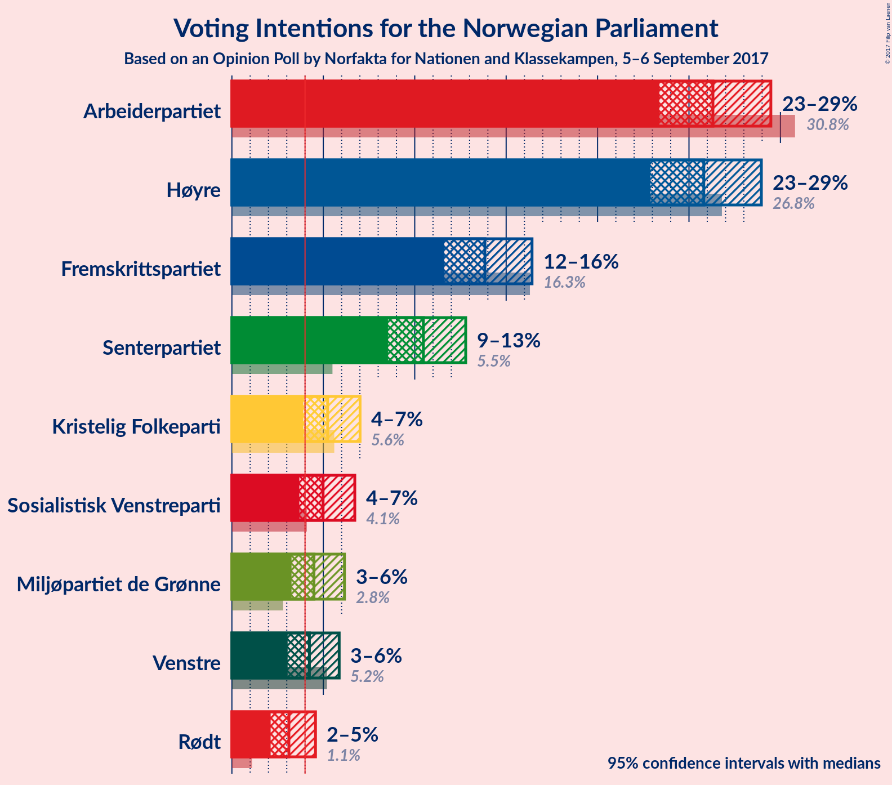
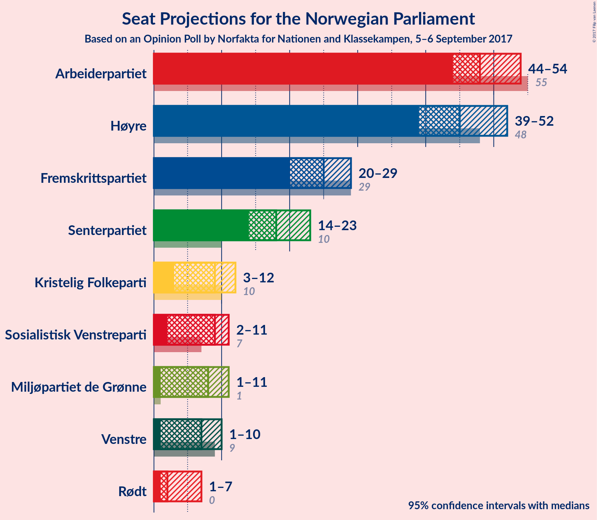
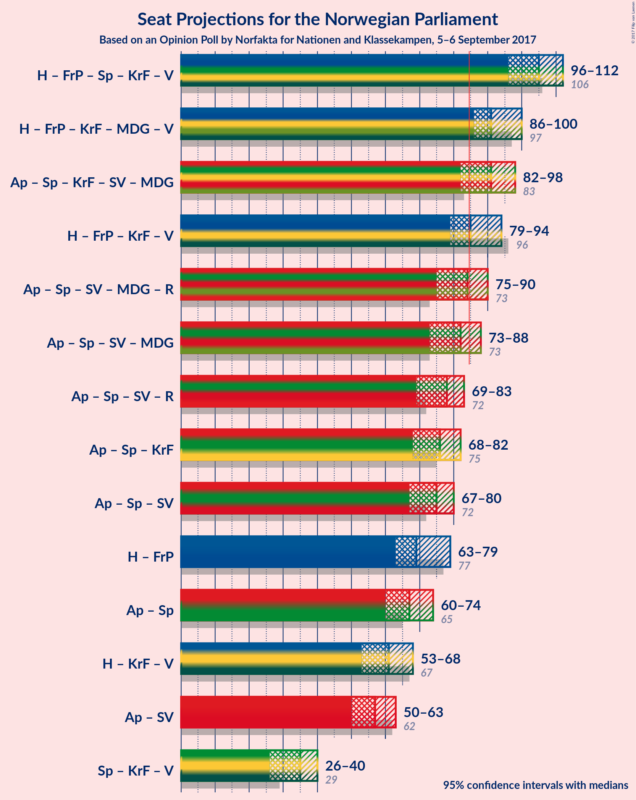

# Opinion Poll by Norfakta for Nationen and Klassekampen, 5–6 September 2017

<a href="#voting-intentions">Voting Intentions</a> | <a href="#seats">Seats</a> | <a href="#coalitions">Coalitions</a> | <a href="#technical-information">Technical Information</a>

## Voting Intentions

### Confidence Intervals

| Party | Last Result | Poll Result | 80% Confidence Interval | 90% Confidence Interval | 95% Confidence Interval | 99% Confidence Interval |
|:-----:|:-----------:|:-----------:|:-----------------------:|:-----------------------:|:-----------------------:|:-----------------------:|
| Arbeiderpartiet | 30.8% | 26.3% | N/A |N/A |N/A |N/A |
| Høyre | 26.8% | 25.8% | N/A |N/A |N/A |N/A |
| Fremskrittspartiet | 16.3% | 13.8% | N/A |N/A |N/A |N/A |
| Senterpartiet | 5.5% | 10.5% | N/A |N/A |N/A |N/A |
| Kristelig Folkeparti | 5.6% | 5.2% | N/A |N/A |N/A |N/A |
| Sosialistisk Venstreparti | 4.1% | 5.0% | N/A |N/A |N/A |N/A |
| Miljøpartiet de Grønne | 2.8% | 4.5% | N/A |N/A |N/A |N/A |
| Venstre | 5.2% | 4.2% | N/A |N/A |N/A |N/A |
| Rødt | 1.1% | 3.1% | N/A |N/A |N/A |N/A |

*Note:* The poll result column reflects the actual value used in the calculations. Published results may vary slightly, and in addition be rounded to fewer digits.

## Seats

### Confidence Intervals

| Party | Last Result | Median | 80% Confidence Interval | 90% Confidence Interval | 95% Confidence Interval | 99% Confidence Interval |
|:-----:|:-----------:|:------:|:-----------------------:|:-----------------------:|:-----------------------:|:-----------------------:|
| <a href="#arbeiderpartiet">Arbeiderpartiet</a> | 55 | N/A | N/A |N/A |N/A |N/A |
| <a href="#høyre">Høyre</a> | 48 | N/A | N/A |N/A |N/A |N/A |
| <a href="#fremskrittspartiet">Fremskrittspartiet</a> | 29 | N/A | N/A |N/A |N/A |N/A |
| <a href="#senterpartiet">Senterpartiet</a> | 10 | N/A | N/A |N/A |N/A |N/A |
| <a href="#kristelig-folkeparti">Kristelig Folkeparti</a> | 10 | N/A | N/A |N/A |N/A |N/A |
| <a href="#sosialistisk-venstreparti">Sosialistisk Venstreparti</a> | 7 | N/A | N/A |N/A |N/A |N/A |
| <a href="#miljøpartiet-de-grønne">Miljøpartiet de Grønne</a> | 1 | N/A | N/A |N/A |N/A |N/A |
| <a href="#venstre">Venstre</a> | 9 | N/A | N/A |N/A |N/A |N/A |
| <a href="#rødt">Rødt</a> | 0 | N/A | N/A |N/A |N/A |N/A |

## Coalitions

## Technical Information

### Opinion Poll

+ **Pollster:** Norfakta
+ **Media:** Nationen and Klassekampen
+ **Fieldwork period:** 5–6 September 2017

### Calculations

+ **Sample size:** 802
+ **Simulations done:** 0
+ **Error estimate:** 100.00%

