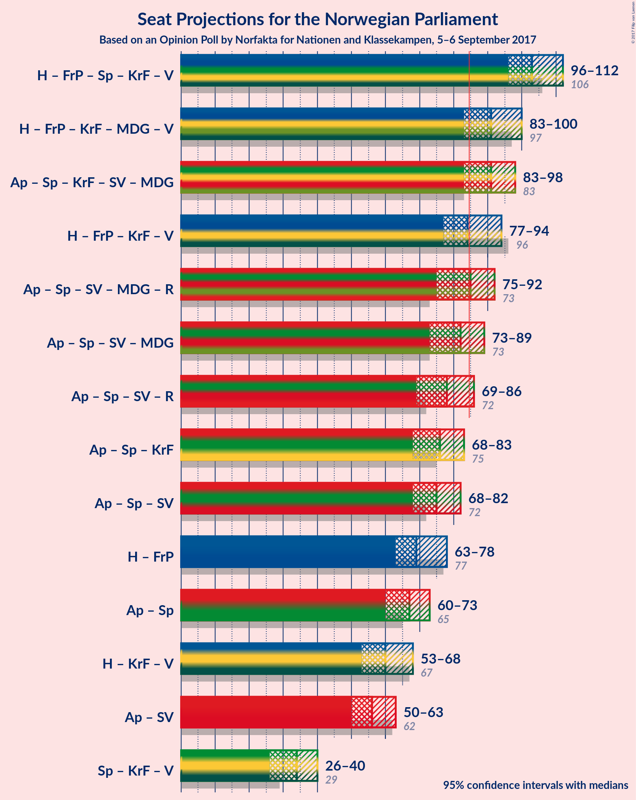

# Opinion Poll by Norfakta for Nationen and Klassekampen, 5–6 September 2017

<a href="#voting-intentions">Voting Intentions</a> | <a href="#seats">Seats</a> | <a href="#coalitions">Coalitions</a> | <a href="#technical-information">Technical Information</a>

## Voting Intentions

### Confidence Intervals

| Party | Last Result | Poll Result | 80% Confidence Interval | 90% Confidence Interval | 95% Confidence Interval | 99% Confidence Interval |
|:-----:|:-----------:|:-----------:|:-----------------------:|:-----------------------:|:-----------------------:|:-----------------------:|
| Arbeiderpartiet | 30.8% | 26.3% | 24.4–28.4% |23.8–29.0% |23.4–29.5% |22.5–30.5% |
| Høyre | 26.8% | 25.8% | 23.9–27.9% |23.4–28.5% |22.9–29.0% |22.0–30.0% |
| Fremskrittspartiet | 16.3% | 13.8% | 12.4–15.5% |12.0–16.0% |11.6–16.4% |11.0–17.2% |
| Senterpartiet | 5.5% | 10.5% | 9.2–12.0% |8.8–12.4% |8.5–12.8% |8.0–13.5% |
| Kristelig Folkeparti | 5.6% | 5.2% | 4.3–6.4% |4.1–6.7% |3.9–7.0% |3.5–7.6% |
| Sosialistisk Venstreparti | 4.1% | 5.0% | 4.1–6.1% |3.9–6.4% |3.7–6.7% |3.3–7.3% |
| Miljøpartiet de Grønne | 2.8% | 4.5% | 3.7–5.6% |3.4–5.9% |3.3–6.2% |2.9–6.7% |
| Venstre | 5.2% | 4.2% | 3.4–5.3% |3.2–5.6% |3.0–5.9% |2.7–6.4% |
| Rødt | 1.1% | 3.1% | 2.5–4.1% |2.3–4.3% |2.1–4.6% |1.8–5.1% |

*Note:* The poll result column reflects the actual value used in the calculations. Published results may vary slightly, and in addition be rounded to fewer digits.

## Seats

### Confidence Intervals

| Party | Last Result | Median | 80% Confidence Interval | 90% Confidence Interval | 95% Confidence Interval | 99% Confidence Interval |
|:-----:|:-----------:|:------:|:-----------------------:|:-----------------------:|:-----------------------:|:-----------------------:|
| <a href="#arbeiderpartiet">Arbeiderpartiet</a> | 55 | 48 | 44–52 |44–53 |44–54 |40–56 |
| <a href="#høyre">Høyre</a> | 48 | 45 | 41–49 |40–51 |39–52 |37–54 |
| <a href="#fremskrittspartiet">Fremskrittspartiet</a> | 29 | 25 | 21–28 |20–29 |20–29 |18–31 |
| <a href="#senterpartiet">Senterpartiet</a> | 10 | 18 | 15–22 |15–22 |14–23 |13–24 |
| <a href="#kristelig-folkeparti">Kristelig Folkeparti</a> | 10 | 9 | 7–11 |7–11 |3–12 |2–13 |
| <a href="#sosialistisk-venstreparti">Sosialistisk Venstreparti</a> | 7 | 9 | 7–10 |2–11 |2–11 |1–12 |
| <a href="#miljøpartiet-de-grønne">Miljøpartiet de Grønne</a> | 1 | 8 | 1–9 |1–10 |1–11 |1–12 |
| <a href="#venstre">Venstre</a> | 9 | 7 | 2–9 |1–9 |1–10 |1–11 |
| <a href="#rødt">Rødt</a> | 0 | 2 | 1–2 |1–7 |1–7 |1–8 |

### Arbeiderpartiet

*For a full overview of the results for this party, see the [Arbeiderpartiet](party-arbeiderpartiet.html) page.*

| Number of Seats | Probability | Accumulated | Special Marks |
|:---------------:|:-----------:|:-----------:|:-------------:|
| 38 | 0.1% | 100% |  |
| 39 | 0% | 99.9% |  |
| 40 | 0.6% | 99.9% |  |
| 41 | 0.1% | 99.2% |  |
| 42 | 0.6% | 99.1% |  |
| 43 | 0.7% | 98.5% |  |
| 44 | 9% | 98% |  |
| 45 | 4% | 89% |  |
| 46 | 12% | 85% |  |
| 47 | 12% | 73% |  |
| 48 | 21% | 62% | Median |
| 49 | 8% | 41% |  |
| 50 | 14% | 33% |  |
| 51 | 7% | 19% |  |
| 52 | 6% | 12% |  |
| 53 | 2% | 6% |  |
| 54 | 2% | 4% |  |
| 55 | 1.3% | 2% | Last Result |
| 56 | 0.4% | 0.7% |  |
| 57 | 0.2% | 0.3% |  |
| 58 | 0.1% | 0.1% |  |
| 59 | 0.1% | 0.1% |  |
| 60 | 0% | 0% |  |

### Høyre

*For a full overview of the results for this party, see the [Høyre](party-hyre.html) page.*

| Number of Seats | Probability | Accumulated | Special Marks |
|:---------------:|:-----------:|:-----------:|:-------------:|
| 36 | 0% | 100% |  |
| 37 | 0.7% | 99.9% |  |
| 38 | 0.8% | 99.2% |  |
| 39 | 2% | 98% |  |
| 40 | 3% | 96% |  |
| 41 | 12% | 93% |  |
| 42 | 3% | 81% |  |
| 43 | 11% | 79% |  |
| 44 | 9% | 68% |  |
| 45 | 12% | 59% | Median |
| 46 | 4% | 47% |  |
| 47 | 24% | 44% |  |
| 48 | 6% | 20% | Last Result |
| 49 | 5% | 14% |  |
| 50 | 4% | 9% |  |
| 51 | 2% | 5% |  |
| 52 | 1.1% | 3% |  |
| 53 | 0.8% | 2% |  |
| 54 | 0.4% | 0.8% |  |
| 55 | 0.2% | 0.3% |  |
| 56 | 0.1% | 0.2% |  |
| 57 | 0.1% | 0.1% |  |
| 58 | 0% | 0% |  |

### Fremskrittspartiet

*For a full overview of the results for this party, see the [Fremskrittspartiet](party-fremskrittspartiet.html) page.*

| Number of Seats | Probability | Accumulated | Special Marks |
|:---------------:|:-----------:|:-----------:|:-------------:|
| 17 | 0.2% | 100% |  |
| 18 | 0.5% | 99.8% |  |
| 19 | 0.6% | 99.3% |  |
| 20 | 4% | 98.7% |  |
| 21 | 9% | 94% |  |
| 22 | 16% | 85% |  |
| 23 | 7% | 69% |  |
| 24 | 12% | 62% |  |
| 25 | 6% | 50% | Median |
| 26 | 12% | 44% |  |
| 27 | 14% | 32% |  |
| 28 | 12% | 18% |  |
| 29 | 4% | 6% | Last Result |
| 30 | 0.7% | 2% |  |
| 31 | 0.9% | 1.2% |  |
| 32 | 0.2% | 0.2% |  |
| 33 | 0% | 0.1% |  |
| 34 | 0% | 0% |  |

### Senterpartiet

*For a full overview of the results for this party, see the [Senterpartiet](party-senterpartiet.html) page.*

| Number of Seats | Probability | Accumulated | Special Marks |
|:---------------:|:-----------:|:-----------:|:-------------:|
| 10 | 0% | 100% | Last Result |
| 11 | 0% | 100% |  |
| 12 | 0.2% | 100% |  |
| 13 | 1.0% | 99.7% |  |
| 14 | 3% | 98.8% |  |
| 15 | 6% | 95% |  |
| 16 | 7% | 90% |  |
| 17 | 7% | 83% |  |
| 18 | 28% | 76% | Median |
| 19 | 14% | 48% |  |
| 20 | 10% | 34% |  |
| 21 | 3% | 24% |  |
| 22 | 18% | 21% |  |
| 23 | 2% | 3% |  |
| 24 | 0.7% | 1.0% |  |
| 25 | 0.3% | 0.3% |  |
| 26 | 0% | 0% |  |

### Kristelig Folkeparti

*For a full overview of the results for this party, see the [Kristelig Folkeparti](party-kristeligfolkeparti.html) page.*

| Number of Seats | Probability | Accumulated | Special Marks |
|:---------------:|:-----------:|:-----------:|:-------------:|
| 1 | 0.1% | 100% |  |
| 2 | 2% | 99.9% |  |
| 3 | 1.1% | 98% |  |
| 4 | 0% | 97% |  |
| 5 | 0% | 97% |  |
| 6 | 0.2% | 97% |  |
| 7 | 8% | 97% |  |
| 8 | 19% | 89% |  |
| 9 | 37% | 70% | Median |
| 10 | 13% | 33% | Last Result |
| 11 | 16% | 20% |  |
| 12 | 2% | 4% |  |
| 13 | 1.3% | 2% |  |
| 14 | 0.3% | 0.4% |  |
| 15 | 0.1% | 0.1% |  |
| 16 | 0% | 0% |  |

### Sosialistisk Venstreparti

*For a full overview of the results for this party, see the [Sosialistisk Venstreparti](party-sosialistiskvenstreparti.html) page.*

| Number of Seats | Probability | Accumulated | Special Marks |
|:---------------:|:-----------:|:-----------:|:-------------:|
| 1 | 1.5% | 100% |  |
| 2 | 6% | 98.5% |  |
| 3 | 0% | 93% |  |
| 4 | 0% | 93% |  |
| 5 | 0% | 93% |  |
| 6 | 0.5% | 93% |  |
| 7 | 7% | 92% | Last Result |
| 8 | 31% | 85% |  |
| 9 | 32% | 54% | Median |
| 10 | 14% | 22% |  |
| 11 | 6% | 8% |  |
| 12 | 2% | 2% |  |
| 13 | 0.3% | 0.4% |  |
| 14 | 0.1% | 0.1% |  |
| 15 | 0% | 0% |  |

### Miljøpartiet de Grønne

*For a full overview of the results for this party, see the [Miljøpartiet de Grønne](party-miljpartietdegrnne.html) page.*

| Number of Seats | Probability | Accumulated | Special Marks |
|:---------------:|:-----------:|:-----------:|:-------------:|
| 1 | 10% | 100% | Last Result |
| 2 | 4% | 90% |  |
| 3 | 10% | 86% |  |
| 4 | 1.4% | 76% |  |
| 5 | 0% | 74% |  |
| 6 | 0.2% | 74% |  |
| 7 | 14% | 74% |  |
| 8 | 26% | 60% | Median |
| 9 | 26% | 33% |  |
| 10 | 5% | 7% |  |
| 11 | 2% | 3% |  |
| 12 | 0.6% | 0.6% |  |
| 13 | 0% | 0.1% |  |
| 14 | 0% | 0% |  |

### Venstre

*For a full overview of the results for this party, see the [Venstre](party-venstre.html) page.*

| Number of Seats | Probability | Accumulated | Special Marks |
|:---------------:|:-----------:|:-----------:|:-------------:|
| 0 | 0.1% | 100% |  |
| 1 | 7% | 99.9% |  |
| 2 | 20% | 93% |  |
| 3 | 9% | 73% |  |
| 4 | 0% | 64% |  |
| 5 | 0% | 64% |  |
| 6 | 1.5% | 64% |  |
| 7 | 20% | 63% | Median |
| 8 | 30% | 43% |  |
| 9 | 10% | 13% | Last Result |
| 10 | 3% | 3% |  |
| 11 | 0.7% | 0.8% |  |
| 12 | 0.1% | 0.1% |  |
| 13 | 0% | 0% |  |

### Rødt

*For a full overview of the results for this party, see the [Rødt](party-rdt.html) page.*

| Number of Seats | Probability | Accumulated | Special Marks |
|:---------------:|:-----------:|:-----------:|:-------------:|
| 0 | 0% | 100% | Last Result |
| 1 | 16% | 100% |  |
| 2 | 76% | 84% | Median |
| 3 | 0% | 8% |  |
| 4 | 0% | 8% |  |
| 5 | 0% | 8% |  |
| 6 | 2% | 8% |  |
| 7 | 3% | 6% |  |
| 8 | 2% | 2% |  |
| 9 | 0.3% | 0.3% |  |
| 10 | 0.1% | 0.1% |  |
| 11 | 0% | 0% |  |

## Coalitions

### Confidence Intervals

| Coalition | Last Result | Median | Majority? | 80% Confidence Interval | 90% Confidence Interval | 95% Confidence Interval | 99% Confidence Interval |
|:---------:|:-----------:|:------:|:---------:|:-----------------------:|:-----------------------:|:-----------------------:|:-----------------------:|
| Høyre – Fremskrittspartiet – Senterpartiet – Kristelig Folkeparti – Venstre | 106 | 103 | 100% | 99–109 | 97–110 | 96–112 | 93–115 |
| Høyre – Fremskrittspartiet – Kristelig Folkeparti – Miljøpartiet de Grønne – Venstre | 97 | 91 | 97% | 88–96 | 86–98 | 83–100 | 81–101 |
| Arbeiderpartiet – Senterpartiet – Kristelig Folkeparti – Sosialistisk Venstreparti – Miljøpartiet de Grønne | 83 | 91 | 94% | 85–96 | 84–97 | 83–98 | 80–100 |
| Høyre – Fremskrittspartiet – Kristelig Folkeparti – Venstre | 96 | 84 | 50% | 81–90 | 79–92 | 77–94 | 74–94 |
| Arbeiderpartiet – Senterpartiet – Sosialistisk Venstreparti – Miljøpartiet de Grønne – Rødt | 73 | 85 | 50% | 79–88 | 77–90 | 75–92 | 75–95 |
| Arbeiderpartiet – Senterpartiet – Sosialistisk Venstreparti – Miljøpartiet de Grønne | 73 | 82 | 28% | 77–86 | 75–87 | 73–89 | 71–92 |
| Arbeiderpartiet – Senterpartiet – Sosialistisk Venstreparti – Rødt | 72 | 78 | 3% | 73–81 | 71–83 | 69–86 | 68–88 |
| Arbeiderpartiet – Senterpartiet – Kristelig Folkeparti | 75 | 76 | 1.5% | 70–80 | 69–81 | 68–83 | 66–87 |
| Arbeiderpartiet – Senterpartiet – Sosialistisk Venstreparti | 72 | 75 | 0.2% | 70–79 | 69–80 | 68–82 | 66–84 |
| Høyre – Fremskrittspartiet | 77 | 69 | 0% | 64–75 | 64–76 | 63–78 | 61–81 |
| Arbeiderpartiet – Senterpartiet | 65 | 67 | 0% | 63–70 | 61–71 | 60–73 | 57–77 |
| Høyre – Kristelig Folkeparti – Venstre | 67 | 60 | 0% | 55–65 | 54–67 | 53–68 | 50–70 |
| Arbeiderpartiet – Sosialistisk Venstreparti | 62 | 56 | 0% | 53–61 | 51–62 | 50–63 | 47–65 |
| Senterpartiet – Kristelig Folkeparti – Venstre | 29 | 34 | 0% | 28–39 | 27–39 | 26–40 | 24–43 |

### Høyre – Fremskrittspartiet – Senterpartiet – Kristelig Folkeparti – Venstre

| Number of Seats | Probability | Accumulated | Special Marks |
|:---------------:|:-----------:|:-----------:|:-------------:|
| 88 | 0% | 100% |  |
| 89 | 0% | 99.9% |  |
| 90 | 0% | 99.9% |  |
| 91 | 0.1% | 99.9% |  |
| 92 | 0.2% | 99.9% |  |
| 93 | 0.2% | 99.6% |  |
| 94 | 0.3% | 99.5% |  |
| 95 | 1.2% | 99.2% |  |
| 96 | 2% | 98% |  |
| 97 | 2% | 96% |  |
| 98 | 2% | 94% |  |
| 99 | 6% | 92% |  |
| 100 | 8% | 86% |  |
| 101 | 6% | 79% |  |
| 102 | 11% | 72% |  |
| 103 | 18% | 62% |  |
| 104 | 4% | 44% | Median |
| 105 | 18% | 40% |  |
| 106 | 4% | 22% | Last Result |
| 107 | 3% | 19% |  |
| 108 | 4% | 16% |  |
| 109 | 7% | 12% |  |
| 110 | 1.2% | 5% |  |
| 111 | 1.2% | 4% |  |
| 112 | 2% | 3% |  |
| 113 | 0.3% | 1.1% |  |
| 114 | 0.3% | 0.8% |  |
| 115 | 0.1% | 0.5% |  |
| 116 | 0.1% | 0.4% |  |
| 117 | 0.3% | 0.4% |  |
| 118 | 0% | 0% |  |

### Høyre – Fremskrittspartiet – Kristelig Folkeparti – Miljøpartiet de Grønne – Venstre

| Number of Seats | Probability | Accumulated | Special Marks |
|:---------------:|:-----------:|:-----------:|:-------------:|
| 80 | 0.1% | 100% |  |
| 81 | 1.1% | 99.9% |  |
| 82 | 0.7% | 98.8% |  |
| 83 | 0.6% | 98% |  |
| 84 | 0.6% | 97% |  |
| 85 | 2% | 97% | Majority |
| 86 | 0.9% | 95% |  |
| 87 | 2% | 94% |  |
| 88 | 11% | 93% |  |
| 89 | 21% | 81% |  |
| 90 | 6% | 60% |  |
| 91 | 6% | 55% |  |
| 92 | 6% | 48% |  |
| 93 | 13% | 42% |  |
| 94 | 11% | 30% | Median |
| 95 | 5% | 19% |  |
| 96 | 6% | 14% |  |
| 97 | 3% | 8% | Last Result |
| 98 | 1.4% | 6% |  |
| 99 | 2% | 4% |  |
| 100 | 1.2% | 3% |  |
| 101 | 1.1% | 1.5% |  |
| 102 | 0.2% | 0.4% |  |
| 103 | 0% | 0.1% |  |
| 104 | 0.1% | 0.1% |  |
| 105 | 0% | 0% |  |

### Arbeiderpartiet – Senterpartiet – Kristelig Folkeparti – Sosialistisk Venstreparti – Miljøpartiet de Grønne

| Number of Seats | Probability | Accumulated | Special Marks |
|:---------------:|:-----------:|:-----------:|:-------------:|
| 77 | 0.1% | 100% |  |
| 78 | 0.1% | 99.9% |  |
| 79 | 0.2% | 99.8% |  |
| 80 | 0.3% | 99.6% |  |
| 81 | 1.2% | 99.3% |  |
| 82 | 0.6% | 98% |  |
| 83 | 0.6% | 98% | Last Result |
| 84 | 3% | 97% |  |
| 85 | 5% | 94% | Majority |
| 86 | 4% | 90% |  |
| 87 | 3% | 86% |  |
| 88 | 5% | 83% |  |
| 89 | 4% | 77% |  |
| 90 | 10% | 73% |  |
| 91 | 23% | 64% |  |
| 92 | 8% | 41% | Median |
| 93 | 3% | 33% |  |
| 94 | 5% | 30% |  |
| 95 | 14% | 25% |  |
| 96 | 3% | 11% |  |
| 97 | 5% | 8% |  |
| 98 | 0.9% | 3% |  |
| 99 | 1.0% | 2% |  |
| 100 | 0.2% | 0.6% |  |
| 101 | 0.3% | 0.4% |  |
| 102 | 0.1% | 0.1% |  |
| 103 | 0% | 0.1% |  |
| 104 | 0% | 0% |  |

### Høyre – Fremskrittspartiet – Kristelig Folkeparti – Venstre

| Number of Seats | Probability | Accumulated | Special Marks |
|:---------------:|:-----------:|:-----------:|:-------------:|
| 73 | 0.3% | 100% |  |
| 74 | 0.2% | 99.7% |  |
| 75 | 0.5% | 99.5% |  |
| 76 | 0.2% | 99.0% |  |
| 77 | 1.4% | 98.8% |  |
| 78 | 1.2% | 97% |  |
| 79 | 3% | 96% |  |
| 80 | 2% | 94% |  |
| 81 | 18% | 92% |  |
| 82 | 5% | 74% |  |
| 83 | 5% | 69% |  |
| 84 | 14% | 64% |  |
| 85 | 12% | 50% | Majority |
| 86 | 10% | 38% | Median |
| 87 | 8% | 28% |  |
| 88 | 3% | 20% |  |
| 89 | 6% | 17% |  |
| 90 | 2% | 11% |  |
| 91 | 3% | 8% |  |
| 92 | 1.0% | 5% |  |
| 93 | 2% | 4% |  |
| 94 | 2% | 3% |  |
| 95 | 0.1% | 0.4% |  |
| 96 | 0.1% | 0.3% | Last Result |
| 97 | 0.1% | 0.2% |  |
| 98 | 0% | 0.1% |  |
| 99 | 0% | 0% |  |

### Arbeiderpartiet – Senterpartiet – Sosialistisk Venstreparti – Miljøpartiet de Grønne – Rødt

| Number of Seats | Probability | Accumulated | Special Marks |
|:---------------:|:-----------:|:-----------:|:-------------:|
| 71 | 0% | 100% |  |
| 72 | 0.1% | 99.9% |  |
| 73 | 0.1% | 99.8% | Last Result |
| 74 | 0.1% | 99.7% |  |
| 75 | 2% | 99.6% |  |
| 76 | 2% | 97% |  |
| 77 | 1.0% | 96% |  |
| 78 | 3% | 95% |  |
| 79 | 2% | 92% |  |
| 80 | 6% | 89% |  |
| 81 | 3% | 83% |  |
| 82 | 8% | 80% |  |
| 83 | 10% | 72% |  |
| 84 | 12% | 62% |  |
| 85 | 14% | 50% | Median, Majority |
| 86 | 5% | 36% |  |
| 87 | 5% | 31% |  |
| 88 | 18% | 26% |  |
| 89 | 2% | 8% |  |
| 90 | 3% | 6% |  |
| 91 | 1.2% | 4% |  |
| 92 | 1.4% | 3% |  |
| 93 | 0.2% | 1.2% |  |
| 94 | 0.5% | 1.0% |  |
| 95 | 0.2% | 0.5% |  |
| 96 | 0.3% | 0.3% |  |
| 97 | 0% | 0% |  |

### Arbeiderpartiet – Senterpartiet – Sosialistisk Venstreparti – Miljøpartiet de Grønne

| Number of Seats | Probability | Accumulated | Special Marks |
|:---------------:|:-----------:|:-----------:|:-------------:|
| 68 | 0.1% | 100% |  |
| 69 | 0.1% | 99.9% |  |
| 70 | 0.3% | 99.8% |  |
| 71 | 0.5% | 99.5% |  |
| 72 | 0.2% | 99.1% |  |
| 73 | 2% | 98.9% | Last Result |
| 74 | 1.1% | 97% |  |
| 75 | 2% | 96% |  |
| 76 | 2% | 94% |  |
| 77 | 3% | 92% |  |
| 78 | 7% | 89% |  |
| 79 | 4% | 82% |  |
| 80 | 8% | 78% |  |
| 81 | 10% | 70% |  |
| 82 | 11% | 60% |  |
| 83 | 10% | 49% | Median |
| 84 | 11% | 39% |  |
| 85 | 5% | 28% | Majority |
| 86 | 17% | 23% |  |
| 87 | 2% | 6% |  |
| 88 | 2% | 4% |  |
| 89 | 1.3% | 3% |  |
| 90 | 0.4% | 1.3% |  |
| 91 | 0.3% | 0.9% |  |
| 92 | 0.3% | 0.6% |  |
| 93 | 0.2% | 0.3% |  |
| 94 | 0.1% | 0.1% |  |
| 95 | 0% | 0% |  |

### Arbeiderpartiet – Senterpartiet – Sosialistisk Venstreparti – Rødt

| Number of Seats | Probability | Accumulated | Special Marks |
|:---------------:|:-----------:|:-----------:|:-------------:|
| 65 | 0.1% | 100% |  |
| 66 | 0% | 99.9% |  |
| 67 | 0.2% | 99.9% |  |
| 68 | 1.1% | 99.6% |  |
| 69 | 1.2% | 98.5% |  |
| 70 | 2% | 97% |  |
| 71 | 1.4% | 96% |  |
| 72 | 3% | 94% | Last Result |
| 73 | 6% | 92% |  |
| 74 | 5% | 86% |  |
| 75 | 11% | 81% |  |
| 76 | 13% | 70% |  |
| 77 | 6% | 58% | Median |
| 78 | 6% | 52% |  |
| 79 | 6% | 45% |  |
| 80 | 21% | 40% |  |
| 81 | 11% | 19% |  |
| 82 | 2% | 7% |  |
| 83 | 0.9% | 6% |  |
| 84 | 2% | 5% |  |
| 85 | 0.6% | 3% | Majority |
| 86 | 0.6% | 3% |  |
| 87 | 0.7% | 2% |  |
| 88 | 1.1% | 1.2% |  |
| 89 | 0.1% | 0.1% |  |
| 90 | 0% | 0% |  |

### Arbeiderpartiet – Senterpartiet – Kristelig Folkeparti

| Number of Seats | Probability | Accumulated | Special Marks |
|:---------------:|:-----------:|:-----------:|:-------------:|
| 63 | 0% | 100% |  |
| 64 | 0.1% | 99.9% |  |
| 65 | 0.1% | 99.9% |  |
| 66 | 0.5% | 99.7% |  |
| 67 | 1.2% | 99.2% |  |
| 68 | 2% | 98% |  |
| 69 | 2% | 96% |  |
| 70 | 5% | 95% |  |
| 71 | 3% | 90% |  |
| 72 | 4% | 87% |  |
| 73 | 10% | 83% |  |
| 74 | 9% | 73% |  |
| 75 | 9% | 64% | Last Result, Median |
| 76 | 7% | 55% |  |
| 77 | 6% | 48% |  |
| 78 | 11% | 41% |  |
| 79 | 12% | 31% |  |
| 80 | 9% | 19% |  |
| 81 | 6% | 9% |  |
| 82 | 0.7% | 4% |  |
| 83 | 1.4% | 3% |  |
| 84 | 0.3% | 2% |  |
| 85 | 0.4% | 1.5% | Majority |
| 86 | 0.2% | 1.1% |  |
| 87 | 0.8% | 0.9% |  |
| 88 | 0% | 0% |  |

### Arbeiderpartiet – Senterpartiet – Sosialistisk Venstreparti

| Number of Seats | Probability | Accumulated | Special Marks |
|:---------------:|:-----------:|:-----------:|:-------------:|
| 62 | 0% | 100% |  |
| 63 | 0.1% | 99.9% |  |
| 64 | 0.1% | 99.9% |  |
| 65 | 0.3% | 99.8% |  |
| 66 | 1.0% | 99.5% |  |
| 67 | 1.0% | 98.6% |  |
| 68 | 2% | 98% |  |
| 69 | 3% | 95% |  |
| 70 | 3% | 93% |  |
| 71 | 6% | 90% |  |
| 72 | 5% | 84% | Last Result |
| 73 | 10% | 79% |  |
| 74 | 10% | 69% |  |
| 75 | 9% | 59% | Median |
| 76 | 4% | 50% |  |
| 77 | 8% | 46% |  |
| 78 | 20% | 38% |  |
| 79 | 11% | 18% |  |
| 80 | 3% | 6% |  |
| 81 | 0.8% | 3% |  |
| 82 | 0.9% | 3% |  |
| 83 | 0.9% | 2% |  |
| 84 | 0.7% | 0.9% |  |
| 85 | 0.1% | 0.2% | Majority |
| 86 | 0.1% | 0.1% |  |
| 87 | 0% | 0.1% |  |
| 88 | 0% | 0% |  |

### Høyre – Fremskrittspartiet

| Number of Seats | Probability | Accumulated | Special Marks |
|:---------------:|:-----------:|:-----------:|:-------------:|
| 58 | 0.1% | 100% |  |
| 59 | 0.1% | 99.9% |  |
| 60 | 0.1% | 99.8% |  |
| 61 | 0.2% | 99.7% |  |
| 62 | 0.3% | 99.4% |  |
| 63 | 4% | 99.1% |  |
| 64 | 8% | 95% |  |
| 65 | 4% | 87% |  |
| 66 | 6% | 82% |  |
| 67 | 4% | 76% |  |
| 68 | 8% | 72% |  |
| 69 | 15% | 64% |  |
| 70 | 10% | 49% | Median |
| 71 | 4% | 39% |  |
| 72 | 5% | 35% |  |
| 73 | 7% | 30% |  |
| 74 | 11% | 23% |  |
| 75 | 4% | 12% |  |
| 76 | 4% | 8% |  |
| 77 | 1.0% | 4% | Last Result |
| 78 | 0.8% | 3% |  |
| 79 | 1.1% | 2% |  |
| 80 | 0.3% | 1.1% |  |
| 81 | 0.5% | 0.8% |  |
| 82 | 0.1% | 0.3% |  |
| 83 | 0.1% | 0.1% |  |
| 84 | 0% | 0% |  |

### Arbeiderpartiet – Senterpartiet

| Number of Seats | Probability | Accumulated | Special Marks |
|:---------------:|:-----------:|:-----------:|:-------------:|
| 56 | 0.1% | 100% |  |
| 57 | 0.5% | 99.9% |  |
| 58 | 0.4% | 99.4% |  |
| 59 | 0.9% | 99.0% |  |
| 60 | 2% | 98% |  |
| 61 | 2% | 96% |  |
| 62 | 2% | 94% |  |
| 63 | 8% | 92% |  |
| 64 | 10% | 84% |  |
| 65 | 5% | 74% | Last Result |
| 66 | 11% | 69% | Median |
| 67 | 10% | 59% |  |
| 68 | 10% | 49% |  |
| 69 | 17% | 39% |  |
| 70 | 14% | 22% |  |
| 71 | 3% | 8% |  |
| 72 | 2% | 5% |  |
| 73 | 0.4% | 3% |  |
| 74 | 0.6% | 2% |  |
| 75 | 0.5% | 2% |  |
| 76 | 0.2% | 1.1% |  |
| 77 | 0.9% | 0.9% |  |
| 78 | 0.1% | 0.1% |  |
| 79 | 0% | 0% |  |

### Høyre – Kristelig Folkeparti – Venstre

| Number of Seats | Probability | Accumulated | Special Marks |
|:---------------:|:-----------:|:-----------:|:-------------:|
| 47 | 0.2% | 100% |  |
| 48 | 0.1% | 99.8% |  |
| 49 | 0.1% | 99.7% |  |
| 50 | 0.7% | 99.6% |  |
| 51 | 0.2% | 99.0% |  |
| 52 | 0.9% | 98.7% |  |
| 53 | 1.0% | 98% |  |
| 54 | 4% | 97% |  |
| 55 | 5% | 93% |  |
| 56 | 2% | 88% |  |
| 57 | 13% | 86% |  |
| 58 | 5% | 73% |  |
| 59 | 11% | 68% |  |
| 60 | 12% | 56% |  |
| 61 | 15% | 44% | Median |
| 62 | 4% | 29% |  |
| 63 | 6% | 25% |  |
| 64 | 9% | 19% |  |
| 65 | 2% | 10% |  |
| 66 | 2% | 9% |  |
| 67 | 3% | 7% | Last Result |
| 68 | 3% | 4% |  |
| 69 | 0.8% | 2% |  |
| 70 | 0.4% | 0.8% |  |
| 71 | 0.2% | 0.4% |  |
| 72 | 0.1% | 0.1% |  |
| 73 | 0% | 0.1% |  |
| 74 | 0% | 0% |  |

### Arbeiderpartiet – Sosialistisk Venstreparti

| Number of Seats | Probability | Accumulated | Special Marks |
|:---------------:|:-----------:|:-----------:|:-------------:|
| 45 | 0% | 100% |  |
| 46 | 0.2% | 99.9% |  |
| 47 | 0.4% | 99.7% |  |
| 48 | 0.9% | 99.3% |  |
| 49 | 0.4% | 98% |  |
| 50 | 1.3% | 98% |  |
| 51 | 2% | 97% |  |
| 52 | 2% | 95% |  |
| 53 | 10% | 93% |  |
| 54 | 9% | 83% |  |
| 55 | 7% | 74% |  |
| 56 | 20% | 67% |  |
| 57 | 13% | 47% | Median |
| 58 | 3% | 34% |  |
| 59 | 12% | 30% |  |
| 60 | 8% | 18% |  |
| 61 | 5% | 11% |  |
| 62 | 2% | 5% | Last Result |
| 63 | 2% | 3% |  |
| 64 | 1.1% | 2% |  |
| 65 | 0.2% | 0.5% |  |
| 66 | 0.1% | 0.3% |  |
| 67 | 0.2% | 0.2% |  |
| 68 | 0.1% | 0.1% |  |
| 69 | 0% | 0% |  |

### Senterpartiet – Kristelig Folkeparti – Venstre

| Number of Seats | Probability | Accumulated | Special Marks |
|:---------------:|:-----------:|:-----------:|:-------------:|
| 21 | 0.1% | 100% |  |
| 22 | 0.2% | 99.9% |  |
| 23 | 0.1% | 99.7% |  |
| 24 | 0.3% | 99.7% |  |
| 25 | 1.2% | 99.3% |  |
| 26 | 0.7% | 98% |  |
| 27 | 3% | 97% |  |
| 28 | 11% | 95% |  |
| 29 | 5% | 84% | Last Result |
| 30 | 3% | 79% |  |
| 31 | 6% | 76% |  |
| 32 | 6% | 70% |  |
| 33 | 5% | 64% |  |
| 34 | 10% | 59% | Median |
| 35 | 8% | 48% |  |
| 36 | 21% | 41% |  |
| 37 | 6% | 19% |  |
| 38 | 2% | 14% |  |
| 39 | 9% | 12% |  |
| 40 | 2% | 3% |  |
| 41 | 0.3% | 1.1% |  |
| 42 | 0.2% | 0.9% |  |
| 43 | 0.5% | 0.6% |  |
| 44 | 0.2% | 0.2% |  |
| 45 | 0% | 0% |  |

## Technical Information

### Opinion Poll

+ **Pollster:** Norfakta
+ **Media:** Nationen and Klassekampen
+ **Fieldwork period:** 5–6 September 2017

### Calculations

+ **Sample size:** 802
+ **Simulations done:** 1,048,576
+ **Error estimate:** 1.68%

