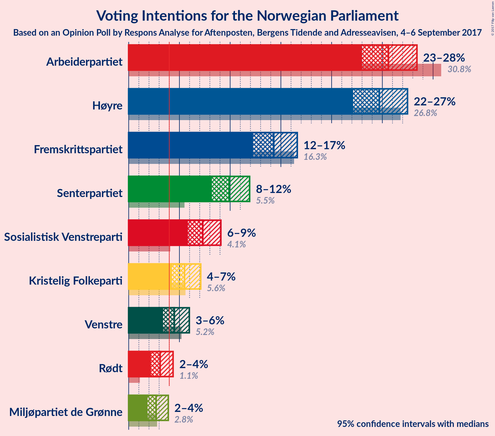
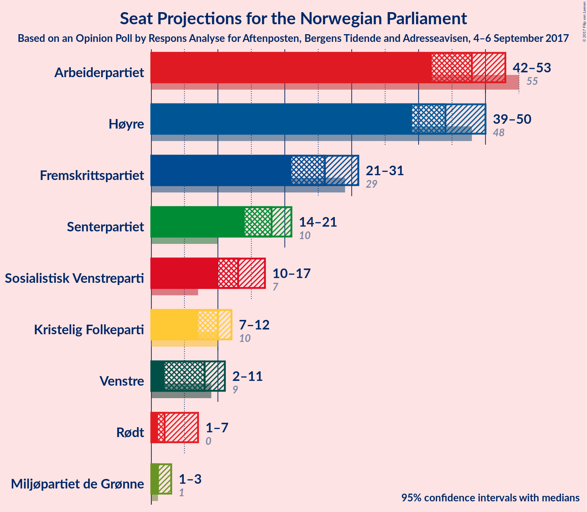
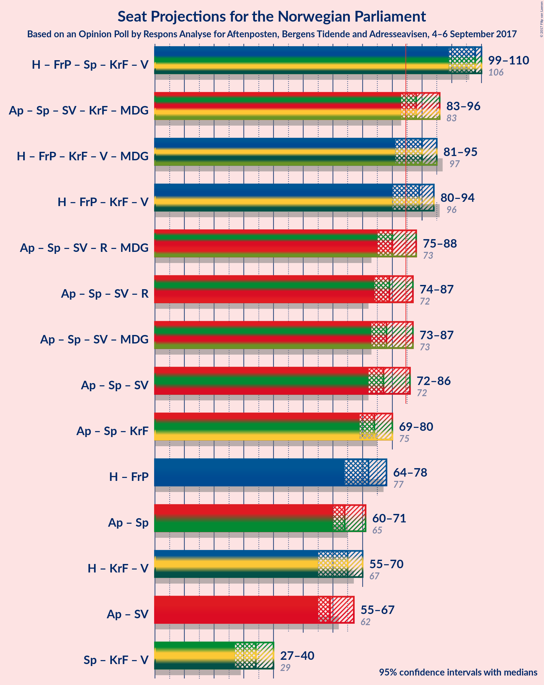

# Opinion Poll by Respons Analyse for Aftenposten, Bergens Tidende and Adresseavisen, 4–6 September 2017

<a href="#voting-intentions">Voting Intentions</a> | <a href="#seats">Seats</a> | <a href="#coalitions">Coalitions</a> | <a href="#technical-information">Technical Information</a>

## Voting Intentions

### Confidence Intervals

| Party | Last Result | Poll Result | 80% Confidence Interval | 90% Confidence Interval | 95% Confidence Interval | 99% Confidence Interval |
|:-----:|:-----------:|:-----------:|:-----------------------:|:-----------------------:|:-----------------------:|:-----------------------:|
| Arbeiderpartiet | 30.8% | 25.6% | 23.9–27.4% |23.4–28.0% |23.0–28.4% |22.2–29.3% |
| Høyre | 26.8% | 24.7% | 23.0–26.5% |22.5–27.0% |22.1–27.5% |21.3–28.4% |
| Fremskrittspartiet | 16.3% | 14.3% | 13.0–15.8% |12.6–16.2% |12.3–16.6% |11.6–17.4% |
| Senterpartiet | 5.5% | 9.9% | 8.8–11.2% |8.5–11.6% |8.2–11.9% |7.7–12.6% |
| Sosialistisk Venstreparti | 4.1% | 7.3% | 6.3–8.5% |6.1–8.8% |5.8–9.1% |5.4–9.7% |
| Kristelig Folkeparti | 5.6% | 5.5% | 4.7–6.5% |4.4–6.8% |4.3–7.1% |3.9–7.6% |
| Venstre | 5.2% | 4.5% | 3.8–5.5% |3.6–5.7% |3.4–6.0% |3.0–6.5% |
| Rødt | 1.1% | 3.1% | 2.5–3.9% |2.3–4.2% |2.2–4.4% |1.9–4.8% |
| Miljøpartiet de Grønne | 2.8% | 2.7% | 2.1–3.5% |2.0–3.7% |1.9–3.9% |1.6–4.3% |

*Note:* The poll result column reflects the actual value used in the calculations. Published results may vary slightly, and in addition be rounded to fewer digits.

## Seats

### Confidence Intervals

| Party | Last Result | Median | 80% Confidence Interval | 90% Confidence Interval | 95% Confidence Interval | 99% Confidence Interval |
|:-----:|:-----------:|:------:|:-----------------------:|:-----------------------:|:-----------------------:|:-----------------------:|
| <a href="#arbeiderpartiet">Arbeiderpartiet</a> | 55 | 48 | 44–52 |43–52 |42–53 |41–54 |
| <a href="#høyre">Høyre</a> | 48 | 44 | 41–48 |39–49 |39–50 |37–53 |
| <a href="#fremskrittspartiet">Fremskrittspartiet</a> | 29 | 26 | 23–29 |23–30 |21–31 |20–32 |
| <a href="#senterpartiet">Senterpartiet</a> | 10 | 18 | 15–20 |14–21 |14–21 |13–23 |
| <a href="#sosialistisk-venstreparti">Sosialistisk Venstreparti</a> | 7 | 13 | 11–15 |11–16 |10–17 |10–17 |
| <a href="#kristelig-folkeparti">Kristelig Folkeparti</a> | 10 | 10 | 9–12 |8–12 |7–12 |3–14 |
| <a href="#venstre">Venstre</a> | 9 | 8 | 2–10 |2–10 |2–11 |1–11 |
| <a href="#rødt">Rødt</a> | 0 | 2 | 1–2 |1–7 |1–7 |1–8 |
| <a href="#miljøpartiet-de-grønne">Miljøpartiet de Grønne</a> | 1 | 1 | 1 |1–2 |1–3 |0–7 |

### Arbeiderpartiet

*For a full overview of the results for this party, see the [Arbeiderpartiet](party-arbeiderpartiet.html) page.*

| Number of Seats | Probability | Accumulated | Special Marks |
|:---------------:|:-----------:|:-----------:|:-------------:|
| 39 | 0.1% | 100% |  |
| 40 | 0.2% | 99.9% |  |
| 41 | 0.8% | 99.7% |  |
| 42 | 2% | 98.9% |  |
| 43 | 6% | 97% |  |
| 44 | 8% | 91% |  |
| 45 | 5% | 83% |  |
| 46 | 10% | 78% |  |
| 47 | 9% | 68% |  |
| 48 | 18% | 59% | Median |
| 49 | 9% | 41% |  |
| 50 | 7% | 32% |  |
| 51 | 13% | 25% |  |
| 52 | 10% | 13% |  |
| 53 | 3% | 3% |  |
| 54 | 0.4% | 0.6% |  |
| 55 | 0.1% | 0.1% | Last Result |
| 56 | 0% | 0% |  |

### Høyre

*For a full overview of the results for this party, see the [Høyre](party-hyre.html) page.*

| Number of Seats | Probability | Accumulated | Special Marks |
|:---------------:|:-----------:|:-----------:|:-------------:|
| 35 | 0.1% | 100% |  |
| 36 | 0.2% | 99.9% |  |
| 37 | 1.3% | 99.7% |  |
| 38 | 0.8% | 98% |  |
| 39 | 3% | 98% |  |
| 40 | 4% | 95% |  |
| 41 | 12% | 91% |  |
| 42 | 7% | 79% |  |
| 43 | 12% | 71% |  |
| 44 | 16% | 59% | Median |
| 45 | 10% | 43% |  |
| 46 | 11% | 33% |  |
| 47 | 9% | 21% |  |
| 48 | 7% | 13% | Last Result |
| 49 | 3% | 6% |  |
| 50 | 1.1% | 3% |  |
| 51 | 0.6% | 2% |  |
| 52 | 0.8% | 1.4% |  |
| 53 | 0.5% | 0.6% |  |
| 54 | 0.1% | 0.1% |  |
| 55 | 0% | 0% |  |

### Fremskrittspartiet

*For a full overview of the results for this party, see the [Fremskrittspartiet](party-fremskrittspartiet.html) page.*

| Number of Seats | Probability | Accumulated | Special Marks |
|:---------------:|:-----------:|:-----------:|:-------------:|
| 19 | 0.1% | 100% |  |
| 20 | 0.9% | 99.9% |  |
| 21 | 2% | 99.0% |  |
| 22 | 1.4% | 97% |  |
| 23 | 10% | 95% |  |
| 24 | 13% | 85% |  |
| 25 | 10% | 72% |  |
| 26 | 23% | 62% | Median |
| 27 | 19% | 38% |  |
| 28 | 5% | 19% |  |
| 29 | 5% | 14% | Last Result |
| 30 | 6% | 9% |  |
| 31 | 2% | 3% |  |
| 32 | 0.6% | 0.7% |  |
| 33 | 0.1% | 0.2% |  |
| 34 | 0.1% | 0.1% |  |
| 35 | 0% | 0% |  |

### Senterpartiet

*For a full overview of the results for this party, see the [Senterpartiet](party-senterpartiet.html) page.*

| Number of Seats | Probability | Accumulated | Special Marks |
|:---------------:|:-----------:|:-----------:|:-------------:|
| 10 | 0% | 100% | Last Result |
| 11 | 0% | 100% |  |
| 12 | 0.2% | 100% |  |
| 13 | 1.0% | 99.8% |  |
| 14 | 5% | 98.8% |  |
| 15 | 4% | 94% |  |
| 16 | 13% | 90% |  |
| 17 | 20% | 77% |  |
| 18 | 27% | 57% | Median |
| 19 | 15% | 30% |  |
| 20 | 6% | 14% |  |
| 21 | 6% | 8% |  |
| 22 | 1.1% | 2% |  |
| 23 | 0.4% | 0.6% |  |
| 24 | 0.1% | 0.2% |  |
| 25 | 0% | 0% |  |

### Sosialistisk Venstreparti

*For a full overview of the results for this party, see the [Sosialistisk Venstreparti](party-sosialistiskvenstreparti.html) page.*

| Number of Seats | Probability | Accumulated | Special Marks |
|:---------------:|:-----------:|:-----------:|:-------------:|
| 7 | 0% | 100% | Last Result |
| 8 | 0.1% | 100% |  |
| 9 | 0.4% | 99.9% |  |
| 10 | 3% | 99.5% |  |
| 11 | 9% | 96% |  |
| 12 | 22% | 88% |  |
| 13 | 34% | 66% | Median |
| 14 | 18% | 31% |  |
| 15 | 7% | 14% |  |
| 16 | 4% | 7% |  |
| 17 | 2% | 3% |  |
| 18 | 0.3% | 0.4% |  |
| 19 | 0.1% | 0.1% |  |
| 20 | 0% | 0% |  |

### Kristelig Folkeparti

*For a full overview of the results for this party, see the [Kristelig Folkeparti](party-kristeligfolkeparti.html) page.*

| Number of Seats | Probability | Accumulated | Special Marks |
|:---------------:|:-----------:|:-----------:|:-------------:|
| 2 | 0.2% | 100% |  |
| 3 | 1.4% | 99.8% |  |
| 4 | 0% | 98% |  |
| 5 | 0% | 98% |  |
| 6 | 0% | 98% |  |
| 7 | 1.5% | 98% |  |
| 8 | 7% | 97% |  |
| 9 | 31% | 90% |  |
| 10 | 29% | 60% | Last Result, Median |
| 11 | 19% | 31% |  |
| 12 | 10% | 12% |  |
| 13 | 1.3% | 2% |  |
| 14 | 0.7% | 0.8% |  |
| 15 | 0.1% | 0.1% |  |
| 16 | 0% | 0% |  |

### Venstre

*For a full overview of the results for this party, see the [Venstre](party-venstre.html) page.*

| Number of Seats | Probability | Accumulated | Special Marks |
|:---------------:|:-----------:|:-----------:|:-------------:|
| 1 | 0.7% | 100% |  |
| 2 | 12% | 99.3% |  |
| 3 | 10% | 88% |  |
| 4 | 0% | 77% |  |
| 5 | 0% | 77% |  |
| 6 | 0.1% | 77% |  |
| 7 | 15% | 77% |  |
| 8 | 29% | 63% | Median |
| 9 | 18% | 34% | Last Result |
| 10 | 11% | 16% |  |
| 11 | 4% | 5% |  |
| 12 | 0.4% | 0.5% |  |
| 13 | 0% | 0% |  |

### Rødt

*For a full overview of the results for this party, see the [Rødt](party-rdt.html) page.*

| Number of Seats | Probability | Accumulated | Special Marks |
|:---------------:|:-----------:|:-----------:|:-------------:|
| 0 | 0% | 100% | Last Result |
| 1 | 21% | 100% |  |
| 2 | 74% | 79% | Median |
| 3 | 0% | 5% |  |
| 4 | 0% | 5% |  |
| 5 | 0% | 5% |  |
| 6 | 0.1% | 5% |  |
| 7 | 3% | 5% |  |
| 8 | 2% | 2% |  |
| 9 | 0.2% | 0.3% |  |
| 10 | 0% | 0% |  |

### Miljøpartiet de Grønne

*For a full overview of the results for this party, see the [Miljøpartiet de Grønne](party-miljpartietdegrnne.html) page.*

| Number of Seats | Probability | Accumulated | Special Marks |
|:---------------:|:-----------:|:-----------:|:-------------:|
| 0 | 2% | 100% |  |
| 1 | 90% | 98% | Last Result, Median |
| 2 | 3% | 8% |  |
| 3 | 2% | 4% |  |
| 4 | 0.2% | 2% |  |
| 5 | 0% | 2% |  |
| 6 | 0.1% | 2% |  |
| 7 | 1.2% | 2% |  |
| 8 | 0.5% | 0.5% |  |
| 9 | 0% | 0% |  |

## Coalitions

### Confidence Intervals

| Coalition | Last Result | Median | Majority? | 80% Confidence Interval | 90% Confidence Interval | 95% Confidence Interval | 99% Confidence Interval |
|:---------:|:-----------:|:------:|:---------:|:-----------------------:|:-----------------------:|:-----------------------:|:-----------------------:|
| Høyre – Fremskrittspartiet – Senterpartiet – Kristelig Folkeparti – Venstre | 106 | 105 | 100% | 101–109 | 100–110 | 98–111 | 96–113 |
| Arbeiderpartiet – Senterpartiet – Sosialistisk Venstreparti – Kristelig Folkeparti – Miljøpartiet de Grønne | 83 | 90 | 94% | 85–93 | 84–94 | 83–95 | 80–98 |
| Høyre – Fremskrittspartiet – Kristelig Folkeparti – Venstre – Miljøpartiet de Grønne | 97 | 88 | 88% | 84–93 | 83–94 | 82–94 | 81–97 |
| Høyre – Fremskrittspartiet – Kristelig Folkeparti – Venstre | 96 | 87 | 75% | 83–92 | 82–93 | 81–93 | 79–96 |
| Arbeiderpartiet – Senterpartiet – Sosialistisk Venstreparti – Rødt – Miljøpartiet de Grønne | 73 | 82 | 24% | 77–86 | 76–87 | 76–88 | 73–90 |
| Arbeiderpartiet – Senterpartiet – Sosialistisk Venstreparti – Rødt | 72 | 81 | 12% | 76–85 | 75–85 | 75–87 | 72–88 |
| Arbeiderpartiet – Senterpartiet – Sosialistisk Venstreparti – Miljøpartiet de Grønne | 73 | 80 | 4% | 75–84 | 75–84 | 74–85 | 71–87 |
| Arbeiderpartiet – Senterpartiet – Sosialistisk Venstreparti | 72 | 79 | 2% | 74–83 | 73–83 | 73–84 | 70–86 |
| Arbeiderpartiet – Senterpartiet – Kristelig Folkeparti | 75 | 75 | 0.1% | 72–79 | 70–79 | 68–80 | 67–82 |
| Høyre – Fremskrittspartiet | 77 | 70 | 0% | 66–75 | 65–76 | 65–77 | 63–79 |
| Arbeiderpartiet – Senterpartiet | 65 | 66 | 0% | 61–69 | 60–69 | 59–69 | 58–72 |
| Høyre – Kristelig Folkeparti – Venstre | 67 | 61 | 0% | 57–66 | 55–66 | 54–67 | 52–70 |
| Arbeiderpartiet – Sosialistisk Venstreparti | 62 | 61 | 0% | 57–65 | 56–65 | 55–66 | 53–68 |
| Senterpartiet – Kristelig Folkeparti – Venstre | 29 | 35 | 0% | 31–39 | 30–40 | 29–40 | 26–42 |

### Høyre – Fremskrittspartiet – Senterpartiet – Kristelig Folkeparti – Venstre

| Number of Seats | Probability | Accumulated | Special Marks |
|:---------------:|:-----------:|:-----------:|:-------------:|
| 94 | 0.1% | 100% |  |
| 95 | 0.2% | 99.9% |  |
| 96 | 1.0% | 99.7% |  |
| 97 | 0.6% | 98.7% |  |
| 98 | 1.4% | 98% |  |
| 99 | 1.1% | 97% |  |
| 100 | 3% | 96% |  |
| 101 | 10% | 93% |  |
| 102 | 10% | 83% |  |
| 103 | 14% | 73% |  |
| 104 | 8% | 60% |  |
| 105 | 12% | 52% |  |
| 106 | 9% | 40% | Last Result, Median |
| 107 | 8% | 31% |  |
| 108 | 4% | 23% |  |
| 109 | 9% | 19% |  |
| 110 | 7% | 10% |  |
| 111 | 2% | 3% |  |
| 112 | 0.8% | 2% |  |
| 113 | 0.6% | 0.7% |  |
| 114 | 0.1% | 0.1% |  |
| 115 | 0% | 0% |  |

### Arbeiderpartiet – Senterpartiet – Sosialistisk Venstreparti – Kristelig Folkeparti – Miljøpartiet de Grønne

| Number of Seats | Probability | Accumulated | Special Marks |
|:---------------:|:-----------:|:-----------:|:-------------:|
| 78 | 0.1% | 100% |  |
| 79 | 0.2% | 99.8% |  |
| 80 | 0.2% | 99.6% |  |
| 81 | 0.6% | 99.4% |  |
| 82 | 0.8% | 98.8% |  |
| 83 | 2% | 98% | Last Result |
| 84 | 2% | 96% |  |
| 85 | 5% | 94% | Majority |
| 86 | 8% | 89% |  |
| 87 | 9% | 82% |  |
| 88 | 5% | 72% |  |
| 89 | 15% | 68% |  |
| 90 | 8% | 53% | Median |
| 91 | 10% | 45% |  |
| 92 | 13% | 36% |  |
| 93 | 15% | 23% |  |
| 94 | 4% | 8% |  |
| 95 | 1.3% | 4% |  |
| 96 | 0.8% | 2% |  |
| 97 | 0.4% | 1.5% |  |
| 98 | 0.9% | 1.0% |  |
| 99 | 0.1% | 0.2% |  |
| 100 | 0% | 0.1% |  |
| 101 | 0% | 0% |  |

### Høyre – Fremskrittspartiet – Kristelig Folkeparti – Venstre – Miljøpartiet de Grønne

| Number of Seats | Probability | Accumulated | Special Marks |
|:---------------:|:-----------:|:-----------:|:-------------:|
| 78 | 0% | 100% |  |
| 79 | 0.2% | 99.9% |  |
| 80 | 0.2% | 99.7% |  |
| 81 | 1.3% | 99.5% |  |
| 82 | 1.5% | 98% |  |
| 83 | 2% | 97% |  |
| 84 | 7% | 95% |  |
| 85 | 10% | 88% | Majority |
| 86 | 12% | 78% |  |
| 87 | 8% | 65% |  |
| 88 | 14% | 57% |  |
| 89 | 8% | 44% | Median |
| 90 | 8% | 35% |  |
| 91 | 9% | 27% |  |
| 92 | 5% | 18% |  |
| 93 | 6% | 13% |  |
| 94 | 4% | 7% |  |
| 95 | 1.4% | 2% |  |
| 96 | 0.3% | 1.0% |  |
| 97 | 0.5% | 0.7% | Last Result |
| 98 | 0.2% | 0.2% |  |
| 99 | 0% | 0% |  |

### Høyre – Fremskrittspartiet – Kristelig Folkeparti – Venstre

| Number of Seats | Probability | Accumulated | Special Marks |
|:---------------:|:-----------:|:-----------:|:-------------:|
| 76 | 0% | 100% |  |
| 77 | 0.1% | 99.9% |  |
| 78 | 0.3% | 99.9% |  |
| 79 | 0.3% | 99.6% |  |
| 80 | 2% | 99.2% |  |
| 81 | 2% | 98% |  |
| 82 | 2% | 96% |  |
| 83 | 7% | 94% |  |
| 84 | 11% | 87% |  |
| 85 | 13% | 75% | Majority |
| 86 | 7% | 63% |  |
| 87 | 13% | 55% |  |
| 88 | 9% | 42% | Median |
| 89 | 8% | 33% |  |
| 90 | 8% | 25% |  |
| 91 | 5% | 17% |  |
| 92 | 5% | 12% |  |
| 93 | 4% | 6% |  |
| 94 | 1.1% | 2% |  |
| 95 | 0.3% | 0.9% |  |
| 96 | 0.4% | 0.6% | Last Result |
| 97 | 0.2% | 0.2% |  |
| 98 | 0% | 0% |  |

### Arbeiderpartiet – Senterpartiet – Sosialistisk Venstreparti – Rødt – Miljøpartiet de Grønne

| Number of Seats | Probability | Accumulated | Special Marks |
|:---------------:|:-----------:|:-----------:|:-------------:|
| 72 | 0.2% | 100% |  |
| 73 | 0.4% | 99.8% | Last Result |
| 74 | 0.3% | 99.3% |  |
| 75 | 1.1% | 99.0% |  |
| 76 | 4% | 98% |  |
| 77 | 5% | 94% |  |
| 78 | 6% | 88% |  |
| 79 | 8% | 83% |  |
| 80 | 8% | 75% |  |
| 81 | 9% | 67% |  |
| 82 | 13% | 57% | Median |
| 83 | 7% | 44% |  |
| 84 | 13% | 37% |  |
| 85 | 11% | 24% | Majority |
| 86 | 7% | 13% |  |
| 87 | 2% | 5% |  |
| 88 | 1.5% | 4% |  |
| 89 | 2% | 2% |  |
| 90 | 0.3% | 0.7% |  |
| 91 | 0.2% | 0.3% |  |
| 92 | 0.1% | 0.1% |  |
| 93 | 0% | 0.1% |  |
| 94 | 0% | 0% |  |

### Arbeiderpartiet – Senterpartiet – Sosialistisk Venstreparti – Rødt

| Number of Seats | Probability | Accumulated | Special Marks |
|:---------------:|:-----------:|:-----------:|:-------------:|
| 70 | 0% | 100% |  |
| 71 | 0.2% | 99.9% |  |
| 72 | 0.5% | 99.7% | Last Result |
| 73 | 0.3% | 99.3% |  |
| 74 | 1.4% | 98.9% |  |
| 75 | 4% | 98% |  |
| 76 | 6% | 93% |  |
| 77 | 5% | 87% |  |
| 78 | 9% | 82% |  |
| 79 | 8% | 73% |  |
| 80 | 8% | 65% |  |
| 81 | 14% | 56% | Median |
| 82 | 8% | 42% |  |
| 83 | 12% | 34% |  |
| 84 | 10% | 22% |  |
| 85 | 7% | 12% | Majority |
| 86 | 2% | 5% |  |
| 87 | 1.4% | 3% |  |
| 88 | 1.3% | 2% |  |
| 89 | 0.2% | 0.4% |  |
| 90 | 0.1% | 0.2% |  |
| 91 | 0% | 0.1% |  |
| 92 | 0% | 0% |  |

### Arbeiderpartiet – Senterpartiet – Sosialistisk Venstreparti – Miljøpartiet de Grønne

| Number of Seats | Probability | Accumulated | Special Marks |
|:---------------:|:-----------:|:-----------:|:-------------:|
| 69 | 0.1% | 100% |  |
| 70 | 0.4% | 99.9% |  |
| 71 | 0.4% | 99.6% |  |
| 72 | 0.3% | 99.1% |  |
| 73 | 0.7% | 98.8% | Last Result |
| 74 | 3% | 98% |  |
| 75 | 8% | 95% |  |
| 76 | 4% | 87% |  |
| 77 | 10% | 83% |  |
| 78 | 7% | 74% |  |
| 79 | 9% | 66% |  |
| 80 | 14% | 57% | Median |
| 81 | 6% | 43% |  |
| 82 | 13% | 37% |  |
| 83 | 12% | 24% |  |
| 84 | 8% | 12% |  |
| 85 | 2% | 4% | Majority |
| 86 | 1.1% | 2% |  |
| 87 | 0.6% | 1.1% |  |
| 88 | 0.2% | 0.5% |  |
| 89 | 0.1% | 0.3% |  |
| 90 | 0.1% | 0.2% |  |
| 91 | 0% | 0% |  |

### Arbeiderpartiet – Senterpartiet – Sosialistisk Venstreparti

| Number of Seats | Probability | Accumulated | Special Marks |
|:---------------:|:-----------:|:-----------:|:-------------:|
| 68 | 0.1% | 100% |  |
| 69 | 0.3% | 99.9% |  |
| 70 | 0.5% | 99.5% |  |
| 71 | 0.3% | 99.0% |  |
| 72 | 1.0% | 98.7% | Last Result |
| 73 | 3% | 98% |  |
| 74 | 9% | 95% |  |
| 75 | 4% | 86% |  |
| 76 | 11% | 82% |  |
| 77 | 7% | 71% |  |
| 78 | 8% | 64% |  |
| 79 | 15% | 56% | Median |
| 80 | 6% | 41% |  |
| 81 | 13% | 35% |  |
| 82 | 11% | 22% |  |
| 83 | 7% | 11% |  |
| 84 | 2% | 4% |  |
| 85 | 1.0% | 2% | Majority |
| 86 | 0.5% | 0.7% |  |
| 87 | 0.1% | 0.2% |  |
| 88 | 0.1% | 0.1% |  |
| 89 | 0% | 0% |  |

### Arbeiderpartiet – Senterpartiet – Kristelig Folkeparti

| Number of Seats | Probability | Accumulated | Special Marks |
|:---------------:|:-----------:|:-----------:|:-------------:|
| 64 | 0.1% | 100% |  |
| 65 | 0.2% | 99.9% |  |
| 66 | 0.2% | 99.7% |  |
| 67 | 0.4% | 99.5% |  |
| 68 | 3% | 99.1% |  |
| 69 | 1.3% | 96% |  |
| 70 | 1.2% | 95% |  |
| 71 | 2% | 94% |  |
| 72 | 8% | 92% |  |
| 73 | 12% | 84% |  |
| 74 | 8% | 72% |  |
| 75 | 15% | 64% | Last Result |
| 76 | 4% | 49% | Median |
| 77 | 9% | 44% |  |
| 78 | 20% | 36% |  |
| 79 | 12% | 16% |  |
| 80 | 2% | 4% |  |
| 81 | 1.0% | 2% |  |
| 82 | 0.3% | 0.8% |  |
| 83 | 0.2% | 0.4% |  |
| 84 | 0.1% | 0.2% |  |
| 85 | 0.1% | 0.1% | Majority |
| 86 | 0% | 0% |  |

### Høyre – Fremskrittspartiet

| Number of Seats | Probability | Accumulated | Special Marks |
|:---------------:|:-----------:|:-----------:|:-------------:|
| 60 | 0.1% | 100% |  |
| 61 | 0.1% | 99.9% |  |
| 62 | 0.2% | 99.9% |  |
| 63 | 0.6% | 99.6% |  |
| 64 | 1.2% | 99.1% |  |
| 65 | 5% | 98% |  |
| 66 | 9% | 93% |  |
| 67 | 12% | 84% |  |
| 68 | 6% | 73% |  |
| 69 | 9% | 67% |  |
| 70 | 8% | 58% | Median |
| 71 | 16% | 49% |  |
| 72 | 15% | 33% |  |
| 73 | 4% | 18% |  |
| 74 | 4% | 14% |  |
| 75 | 5% | 10% |  |
| 76 | 3% | 5% |  |
| 77 | 0.5% | 3% | Last Result |
| 78 | 2% | 2% |  |
| 79 | 0.3% | 0.5% |  |
| 80 | 0.1% | 0.3% |  |
| 81 | 0.1% | 0.2% |  |
| 82 | 0% | 0.1% |  |
| 83 | 0% | 0% |  |

### Arbeiderpartiet – Senterpartiet

| Number of Seats | Probability | Accumulated | Special Marks |
|:---------------:|:-----------:|:-----------:|:-------------:|
| 56 | 0.1% | 100% |  |
| 57 | 0.3% | 99.9% |  |
| 58 | 0.9% | 99.6% |  |
| 59 | 2% | 98.8% |  |
| 60 | 2% | 97% |  |
| 61 | 5% | 95% |  |
| 62 | 6% | 89% |  |
| 63 | 10% | 84% |  |
| 64 | 7% | 74% |  |
| 65 | 11% | 67% | Last Result |
| 66 | 16% | 56% | Median |
| 67 | 7% | 40% |  |
| 68 | 9% | 33% |  |
| 69 | 22% | 24% |  |
| 70 | 1.0% | 2% |  |
| 71 | 0.8% | 1.4% |  |
| 72 | 0.2% | 0.6% |  |
| 73 | 0.2% | 0.4% |  |
| 74 | 0% | 0.1% |  |
| 75 | 0.1% | 0.1% |  |
| 76 | 0% | 0% |  |

### Høyre – Kristelig Folkeparti – Venstre

| Number of Seats | Probability | Accumulated | Special Marks |
|:---------------:|:-----------:|:-----------:|:-------------:|
| 50 | 0.1% | 100% |  |
| 51 | 0.2% | 99.9% |  |
| 52 | 0.4% | 99.7% |  |
| 53 | 0.3% | 99.3% |  |
| 54 | 2% | 99.1% |  |
| 55 | 3% | 97% |  |
| 56 | 3% | 94% |  |
| 57 | 3% | 92% |  |
| 58 | 7% | 89% |  |
| 59 | 17% | 82% |  |
| 60 | 11% | 65% |  |
| 61 | 9% | 54% |  |
| 62 | 8% | 45% | Median |
| 63 | 11% | 37% |  |
| 64 | 11% | 26% |  |
| 65 | 5% | 16% |  |
| 66 | 6% | 11% |  |
| 67 | 3% | 5% | Last Result |
| 68 | 0.6% | 1.5% |  |
| 69 | 0.2% | 0.9% |  |
| 70 | 0.5% | 0.7% |  |
| 71 | 0.1% | 0.1% |  |
| 72 | 0% | 0.1% |  |
| 73 | 0% | 0% |  |

### Arbeiderpartiet – Sosialistisk Venstreparti

| Number of Seats | Probability | Accumulated | Special Marks |
|:---------------:|:-----------:|:-----------:|:-------------:|
| 52 | 0.1% | 100% |  |
| 53 | 0.7% | 99.8% |  |
| 54 | 0.9% | 99.1% |  |
| 55 | 2% | 98% |  |
| 56 | 4% | 96% |  |
| 57 | 9% | 91% |  |
| 58 | 7% | 82% |  |
| 59 | 9% | 75% |  |
| 60 | 9% | 66% |  |
| 61 | 13% | 57% | Median |
| 62 | 8% | 45% | Last Result |
| 63 | 11% | 37% |  |
| 64 | 10% | 26% |  |
| 65 | 12% | 16% |  |
| 66 | 2% | 4% |  |
| 67 | 0.9% | 2% |  |
| 68 | 0.7% | 0.9% |  |
| 69 | 0.1% | 0.1% |  |
| 70 | 0.1% | 0.1% |  |
| 71 | 0% | 0% |  |

### Senterpartiet – Kristelig Folkeparti – Venstre

| Number of Seats | Probability | Accumulated | Special Marks |
|:---------------:|:-----------:|:-----------:|:-------------:|
| 24 | 0.1% | 100% |  |
| 25 | 0% | 99.9% |  |
| 26 | 0.4% | 99.8% |  |
| 27 | 0.6% | 99.5% |  |
| 28 | 1.0% | 98.9% |  |
| 29 | 2% | 98% | Last Result |
| 30 | 5% | 96% |  |
| 31 | 8% | 90% |  |
| 32 | 7% | 82% |  |
| 33 | 11% | 75% |  |
| 34 | 13% | 65% |  |
| 35 | 12% | 52% |  |
| 36 | 11% | 40% | Median |
| 37 | 5% | 29% |  |
| 38 | 12% | 24% |  |
| 39 | 4% | 12% |  |
| 40 | 6% | 8% |  |
| 41 | 0.9% | 1.4% |  |
| 42 | 0.3% | 0.5% |  |
| 43 | 0.1% | 0.2% |  |
| 44 | 0% | 0.1% |  |
| 45 | 0% | 0% |  |

## Technical Information

### Opinion Poll

+ **Pollster:** Respons Analyse
+ **Media:** Aftenposten, Bergens Tidende and Adresseavisen
+ **Fieldwork period:** 4–6 September 2017

### Calculations

+ **Sample size:** 1000
+ **Simulations done:** 1,048,576
+ **Error estimate:** 1.89%

