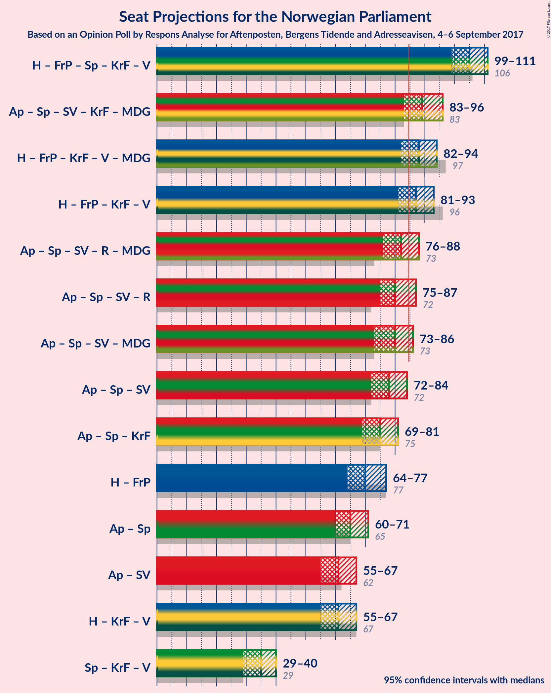

# Opinion Poll by Respons Analyse for Aftenposten, Bergens Tidende and Adresseavisen, 4–6 September 2017

<a href="#voting-intentions">Voting Intentions</a> | <a href="#seats">Seats</a> | <a href="#coalitions">Coalitions</a> | <a href="#technical-information">Technical Information</a>

## Voting Intentions

### Confidence Intervals

| Party | Last Result | Poll Result | 80% Confidence Interval | 90% Confidence Interval | 95% Confidence Interval | 99% Confidence Interval |
|:-----:|:-----------:|:-----------:|:-----------------------:|:-----------------------:|:-----------------------:|:-----------------------:|
| Arbeiderpartiet | 30.8% | 25.6% | 23.9–27.4% |23.4–28.0% |23.0–28.4% |22.2–29.3% |
| Høyre | 26.8% | 24.7% | 23.0–26.5% |22.5–27.0% |22.1–27.5% |21.3–28.4% |
| Fremskrittspartiet | 16.3% | 14.3% | 13.0–15.8% |12.6–16.2% |12.3–16.6% |11.6–17.4% |
| Senterpartiet | 5.5% | 9.9% | 8.8–11.2% |8.5–11.6% |8.2–11.9% |7.7–12.6% |
| Sosialistisk Venstreparti | 4.1% | 7.3% | 6.3–8.5% |6.1–8.8% |5.8–9.1% |5.4–9.7% |
| Kristelig Folkeparti | 5.6% | 5.5% | 4.7–6.5% |4.4–6.8% |4.3–7.1% |3.9–7.6% |
| Venstre | 5.2% | 4.5% | 3.8–5.5% |3.6–5.7% |3.4–6.0% |3.0–6.5% |
| Rødt | 1.1% | 3.1% | 2.5–3.9% |2.3–4.2% |2.2–4.4% |1.9–4.8% |
| Miljøpartiet de Grønne | 2.8% | 2.7% | 2.1–3.5% |2.0–3.7% |1.9–3.9% |1.6–4.3% |

*Note:* The poll result column reflects the actual value used in the calculations. Published results may vary slightly, and in addition be rounded to fewer digits.

## Seats

### Confidence Intervals

| Party | Last Result | Median | 80% Confidence Interval | 90% Confidence Interval | 95% Confidence Interval | 99% Confidence Interval |
|:-----:|:-----------:|:------:|:-----------------------:|:-----------------------:|:-----------------------:|:-----------------------:|
| <a href="#arbeiderpartiet">Arbeiderpartiet</a> | 55 | 47 | 43–50 |43–52 |43–52 |41–54 |
| <a href="#høyre">Høyre</a> | 48 | 46 | 42–50 |39–52 |38–53 |35–53 |
| <a href="#fremskrittspartiet">Fremskrittspartiet</a> | 29 | 26 | 23–28 |22–30 |21–30 |20–31 |
| <a href="#senterpartiet">Senterpartiet</a> | 10 | 17 | 15–21 |14–21 |14–22 |13–23 |
| <a href="#sosialistisk-venstreparti">Sosialistisk Venstreparti</a> | 7 | 13 | 11–15 |11–15 |10–16 |9–18 |
| <a href="#kristelig-folkeparti">Kristelig Folkeparti</a> | 10 | 10 | 8–11 |3–11 |3–12 |3–13 |
| <a href="#venstre">Venstre</a> | 9 | 8 | 2–9 |2–9 |2–10 |1–11 |
| <a href="#rødt">Rødt</a> | 0 | 2 | 1–2 |1–2 |1–7 |1–8 |
| <a href="#miljøpartiet-de-grønne">Miljøpartiet de Grønne</a> | 1 | 1 | 1 |1 |0–2 |0–8 |

### Arbeiderpartiet

*For a full overview of the results for this party, see the [Arbeiderpartiet](party-arbeiderpartiet.html) page.*

| Number of Seats | Probability | Accumulated | Special Marks |
|:---------------:|:-----------:|:-----------:|:-------------:|
| 39 | 0.1% | 100% |  |
| 40 | 0.2% | 99.9% |  |
| 41 | 0.6% | 99.7% |  |
| 42 | 0.9% | 99.1% |  |
| 43 | 21% | 98% |  |
| 44 | 5% | 77% |  |
| 45 | 10% | 72% |  |
| 46 | 7% | 62% |  |
| 47 | 17% | 55% | Median |
| 48 | 7% | 37% |  |
| 49 | 17% | 30% |  |
| 50 | 3% | 13% |  |
| 51 | 3% | 10% |  |
| 52 | 4% | 6% |  |
| 53 | 1.2% | 2% |  |
| 54 | 0.8% | 1.0% |  |
| 55 | 0.2% | 0.2% | Last Result |
| 56 | 0% | 0.1% |  |
| 57 | 0% | 0% |  |

### Høyre

*For a full overview of the results for this party, see the [Høyre](party-hyre.html) page.*

| Number of Seats | Probability | Accumulated | Special Marks |
|:---------------:|:-----------:|:-----------:|:-------------:|
| 35 | 0.6% | 100% |  |
| 36 | 0.2% | 99.3% |  |
| 37 | 0.7% | 99.1% |  |
| 38 | 2% | 98% |  |
| 39 | 3% | 97% |  |
| 40 | 2% | 94% |  |
| 41 | 0.9% | 92% |  |
| 42 | 2% | 91% |  |
| 43 | 4% | 89% |  |
| 44 | 8% | 85% |  |
| 45 | 6% | 78% |  |
| 46 | 26% | 72% | Median |
| 47 | 1.1% | 46% |  |
| 48 | 30% | 45% | Last Result |
| 49 | 3% | 15% |  |
| 50 | 3% | 12% |  |
| 51 | 0.9% | 8% |  |
| 52 | 4% | 7% |  |
| 53 | 3% | 3% |  |
| 54 | 0.1% | 0.1% |  |
| 55 | 0% | 0% |  |

### Fremskrittspartiet

*For a full overview of the results for this party, see the [Fremskrittspartiet](party-fremskrittspartiet.html) page.*

| Number of Seats | Probability | Accumulated | Special Marks |
|:---------------:|:-----------:|:-----------:|:-------------:|
| 19 | 0.2% | 100% |  |
| 20 | 1.5% | 99.8% |  |
| 21 | 1.3% | 98% |  |
| 22 | 5% | 97% |  |
| 23 | 3% | 92% |  |
| 24 | 30% | 88% |  |
| 25 | 7% | 58% |  |
| 26 | 12% | 51% | Median |
| 27 | 28% | 39% |  |
| 28 | 3% | 12% |  |
| 29 | 4% | 9% | Last Result |
| 30 | 4% | 5% |  |
| 31 | 0.8% | 1.0% |  |
| 32 | 0.2% | 0.2% |  |
| 33 | 0.1% | 0.1% |  |
| 34 | 0% | 0% |  |

### Senterpartiet

*For a full overview of the results for this party, see the [Senterpartiet](party-senterpartiet.html) page.*

| Number of Seats | Probability | Accumulated | Special Marks |
|:---------------:|:-----------:|:-----------:|:-------------:|
| 10 | 0% | 100% | Last Result |
| 11 | 0% | 100% |  |
| 12 | 0.4% | 100% |  |
| 13 | 0.3% | 99.6% |  |
| 14 | 8% | 99.3% |  |
| 15 | 6% | 91% |  |
| 16 | 22% | 85% |  |
| 17 | 14% | 64% | Median |
| 18 | 9% | 50% |  |
| 19 | 4% | 41% |  |
| 20 | 12% | 37% |  |
| 21 | 22% | 24% |  |
| 22 | 2% | 3% |  |
| 23 | 0.5% | 0.6% |  |
| 24 | 0.1% | 0.1% |  |
| 25 | 0% | 0% |  |

### Sosialistisk Venstreparti

*For a full overview of the results for this party, see the [Sosialistisk Venstreparti](party-sosialistiskvenstreparti.html) page.*

| Number of Seats | Probability | Accumulated | Special Marks |
|:---------------:|:-----------:|:-----------:|:-------------:|
| 7 | 0% | 100% | Last Result |
| 8 | 0.1% | 100% |  |
| 9 | 0.8% | 99.9% |  |
| 10 | 2% | 99.1% |  |
| 11 | 23% | 97% |  |
| 12 | 15% | 74% |  |
| 13 | 30% | 59% | Median |
| 14 | 16% | 29% |  |
| 15 | 8% | 13% |  |
| 16 | 3% | 5% |  |
| 17 | 2% | 2% |  |
| 18 | 0.6% | 0.6% |  |
| 19 | 0% | 0% |  |

### Kristelig Folkeparti

*For a full overview of the results for this party, see the [Kristelig Folkeparti](party-kristeligfolkeparti.html) page.*

| Number of Seats | Probability | Accumulated | Special Marks |
|:---------------:|:-----------:|:-----------:|:-------------:|
| 2 | 0.5% | 100% |  |
| 3 | 5% | 99.5% |  |
| 4 | 0% | 94% |  |
| 5 | 0% | 94% |  |
| 6 | 0% | 94% |  |
| 7 | 0.9% | 94% |  |
| 8 | 6% | 93% |  |
| 9 | 15% | 88% |  |
| 10 | 42% | 72% | Last Result, Median |
| 11 | 27% | 31% |  |
| 12 | 3% | 4% |  |
| 13 | 0.7% | 1.2% |  |
| 14 | 0.4% | 0.5% |  |
| 15 | 0% | 0% |  |

### Venstre

*For a full overview of the results for this party, see the [Venstre](party-venstre.html) page.*

| Number of Seats | Probability | Accumulated | Special Marks |
|:---------------:|:-----------:|:-----------:|:-------------:|
| 1 | 1.2% | 100% |  |
| 2 | 13% | 98.8% |  |
| 3 | 6% | 86% |  |
| 4 | 0% | 80% |  |
| 5 | 0% | 80% |  |
| 6 | 0% | 80% |  |
| 7 | 5% | 80% |  |
| 8 | 52% | 74% | Median |
| 9 | 17% | 22% | Last Result |
| 10 | 4% | 5% |  |
| 11 | 0.8% | 1.0% |  |
| 12 | 0.2% | 0.2% |  |
| 13 | 0% | 0% |  |

### Rødt

*For a full overview of the results for this party, see the [Rødt](party-rdt.html) page.*

| Number of Seats | Probability | Accumulated | Special Marks |
|:---------------:|:-----------:|:-----------:|:-------------:|
| 0 | 0% | 100% | Last Result |
| 1 | 36% | 100% |  |
| 2 | 59% | 64% | Median |
| 3 | 0% | 5% |  |
| 4 | 0% | 5% |  |
| 5 | 0% | 5% |  |
| 6 | 0.3% | 5% |  |
| 7 | 3% | 4% |  |
| 8 | 1.2% | 1.4% |  |
| 9 | 0.2% | 0.2% |  |
| 10 | 0% | 0% |  |

### Miljøpartiet de Grønne

*For a full overview of the results for this party, see the [Miljøpartiet de Grønne](party-miljpartietdegrnne.html) page.*

| Number of Seats | Probability | Accumulated | Special Marks |
|:---------------:|:-----------:|:-----------:|:-------------:|
| 0 | 5% | 100% |  |
| 1 | 91% | 95% | Last Result, Median |
| 2 | 2% | 5% |  |
| 3 | 1.0% | 2% |  |
| 4 | 0% | 1.3% |  |
| 5 | 0% | 1.2% |  |
| 6 | 0% | 1.2% |  |
| 7 | 0.5% | 1.2% |  |
| 8 | 0.7% | 0.7% |  |
| 9 | 0% | 0% |  |

## Coalitions

### Confidence Intervals

| Coalition | Last Result | Median | Majority? | 80% Confidence Interval | 90% Confidence Interval | 95% Confidence Interval | 99% Confidence Interval |
|:---------:|:-----------:|:------:|:---------:|:-----------------------:|:-----------------------:|:-----------------------:|:-----------------------:|
| Høyre – Fremskrittspartiet – Senterpartiet – Kristelig Folkeparti – Venstre | 106 | 108 | 100% | 101–110 | 100–110 | 99–110 | 95–114 |
| Arbeiderpartiet – Senterpartiet – Sosialistisk Venstreparti – Kristelig Folkeparti – Miljøpartiet de Grønne | 83 | 88 | 95% | 85–92 | 85–95 | 83–96 | 80–98 |
| Høyre – Fremskrittspartiet – Kristelig Folkeparti – Venstre – Miljøpartiet de Grønne | 97 | 90 | 85% | 84–94 | 82–94 | 81–95 | 79–97 |
| Høyre – Fremskrittspartiet – Kristelig Folkeparti – Venstre | 96 | 89 | 83% | 83–93 | 81–93 | 80–94 | 78–95 |
| Arbeiderpartiet – Senterpartiet – Sosialistisk Venstreparti – Rødt – Miljøpartiet de Grønne | 73 | 80 | 15% | 76–86 | 76–87 | 75–88 | 73–90 |
| Arbeiderpartiet – Senterpartiet – Sosialistisk Venstreparti – Rødt | 72 | 79 | 13% | 75–85 | 75–86 | 74–87 | 72–89 |
| Arbeiderpartiet – Senterpartiet – Sosialistisk Venstreparti – Miljøpartiet de Grønne | 73 | 78 | 7% | 75–84 | 75–85 | 73–87 | 71–88 |
| Arbeiderpartiet – Senterpartiet – Sosialistisk Venstreparti | 72 | 77 | 3% | 74–83 | 73–84 | 72–86 | 70–86 |
| Arbeiderpartiet – Senterpartiet – Kristelig Folkeparti | 75 | 74 | 0.2% | 72–78 | 70–79 | 69–80 | 67–82 |
| Høyre – Fremskrittspartiet | 77 | 72 | 0% | 67–76 | 65–78 | 64–78 | 63–79 |
| Arbeiderpartiet – Senterpartiet | 65 | 64 | 0% | 62–69 | 61–69 | 60–71 | 58–72 |
| Høyre – Kristelig Folkeparti – Venstre | 67 | 65 | 0% | 57–67 | 56–67 | 55–70 | 51–70 |
| Arbeiderpartiet – Sosialistisk Venstreparti | 62 | 59 | 0% | 56–64 | 56–66 | 55–67 | 52–67 |
| Senterpartiet – Kristelig Folkeparti – Venstre | 29 | 34 | 0% | 29–40 | 28–40 | 27–40 | 26–41 |

### Høyre – Fremskrittspartiet – Senterpartiet – Kristelig Folkeparti – Venstre

| Number of Seats | Probability | Accumulated | Special Marks |
|:---------------:|:-----------:|:-----------:|:-------------:|
| 93 | 0% | 100% |  |
| 94 | 0% | 99.9% |  |
| 95 | 0.4% | 99.9% |  |
| 96 | 0.9% | 99.4% |  |
| 97 | 0.7% | 98.6% |  |
| 98 | 0.3% | 98% |  |
| 99 | 2% | 98% |  |
| 100 | 5% | 96% |  |
| 101 | 3% | 91% |  |
| 102 | 4% | 88% |  |
| 103 | 5% | 84% |  |
| 104 | 3% | 79% |  |
| 105 | 13% | 77% |  |
| 106 | 6% | 63% | Last Result |
| 107 | 7% | 57% | Median |
| 108 | 8% | 51% |  |
| 109 | 20% | 43% |  |
| 110 | 21% | 23% |  |
| 111 | 1.1% | 2% |  |
| 112 | 0.6% | 1.2% |  |
| 113 | 0.1% | 0.6% |  |
| 114 | 0.3% | 0.5% |  |
| 115 | 0.2% | 0.2% |  |
| 116 | 0% | 0% |  |

### Arbeiderpartiet – Senterpartiet – Sosialistisk Venstreparti – Kristelig Folkeparti – Miljøpartiet de Grønne

| Number of Seats | Probability | Accumulated | Special Marks |
|:---------------:|:-----------:|:-----------:|:-------------:|
| 78 | 0% | 100% |  |
| 79 | 0.4% | 99.9% |  |
| 80 | 0.3% | 99.5% |  |
| 81 | 0.8% | 99.2% |  |
| 82 | 0.7% | 98% |  |
| 83 | 0.9% | 98% | Last Result |
| 84 | 2% | 97% |  |
| 85 | 20% | 95% | Majority |
| 86 | 8% | 75% |  |
| 87 | 15% | 68% |  |
| 88 | 4% | 53% | Median |
| 89 | 24% | 49% |  |
| 90 | 10% | 25% |  |
| 91 | 3% | 15% |  |
| 92 | 4% | 12% |  |
| 93 | 1.5% | 8% |  |
| 94 | 1.0% | 7% |  |
| 95 | 3% | 6% |  |
| 96 | 1.3% | 3% |  |
| 97 | 0.2% | 1.4% |  |
| 98 | 1.0% | 1.2% |  |
| 99 | 0.2% | 0.2% |  |
| 100 | 0% | 0% |  |

### Høyre – Fremskrittspartiet – Kristelig Folkeparti – Venstre – Miljøpartiet de Grønne

| Number of Seats | Probability | Accumulated | Special Marks |
|:---------------:|:-----------:|:-----------:|:-------------:|
| 78 | 0.1% | 100% |  |
| 79 | 0.8% | 99.9% |  |
| 80 | 0.1% | 99.1% |  |
| 81 | 2% | 99.0% |  |
| 82 | 2% | 97% |  |
| 83 | 2% | 95% |  |
| 84 | 8% | 93% |  |
| 85 | 2% | 85% | Majority |
| 86 | 2% | 84% |  |
| 87 | 6% | 82% |  |
| 88 | 8% | 76% |  |
| 89 | 4% | 68% |  |
| 90 | 24% | 64% |  |
| 91 | 9% | 41% | Median |
| 92 | 7% | 32% |  |
| 93 | 3% | 24% |  |
| 94 | 18% | 21% |  |
| 95 | 2% | 3% |  |
| 96 | 0.6% | 1.2% |  |
| 97 | 0.4% | 0.5% | Last Result |
| 98 | 0.1% | 0.2% |  |
| 99 | 0% | 0% |  |

### Høyre – Fremskrittspartiet – Kristelig Folkeparti – Venstre

| Number of Seats | Probability | Accumulated | Special Marks |
|:---------------:|:-----------:|:-----------:|:-------------:|
| 77 | 0.1% | 100% |  |
| 78 | 0.6% | 99.8% |  |
| 79 | 0.4% | 99.2% |  |
| 80 | 2% | 98.8% |  |
| 81 | 2% | 97% |  |
| 82 | 2% | 95% |  |
| 83 | 8% | 93% |  |
| 84 | 2% | 85% |  |
| 85 | 3% | 83% | Majority |
| 86 | 5% | 80% |  |
| 87 | 6% | 76% |  |
| 88 | 7% | 70% |  |
| 89 | 24% | 63% |  |
| 90 | 8% | 39% | Median |
| 91 | 7% | 31% |  |
| 92 | 3% | 24% |  |
| 93 | 18% | 21% |  |
| 94 | 2% | 3% |  |
| 95 | 0.6% | 1.0% |  |
| 96 | 0.3% | 0.5% | Last Result |
| 97 | 0.1% | 0.2% |  |
| 98 | 0% | 0% |  |

### Arbeiderpartiet – Senterpartiet – Sosialistisk Venstreparti – Rødt – Miljøpartiet de Grønne

| Number of Seats | Probability | Accumulated | Special Marks |
|:---------------:|:-----------:|:-----------:|:-------------:|
| 72 | 0.2% | 100% |  |
| 73 | 0.3% | 99.8% | Last Result |
| 74 | 0.6% | 99.4% |  |
| 75 | 2% | 98.9% |  |
| 76 | 18% | 97% |  |
| 77 | 3% | 79% |  |
| 78 | 7% | 76% |  |
| 79 | 8% | 69% |  |
| 80 | 24% | 61% | Median |
| 81 | 8% | 37% |  |
| 82 | 6% | 29% |  |
| 83 | 4% | 23% |  |
| 84 | 3% | 19% |  |
| 85 | 2% | 15% | Majority |
| 86 | 7% | 14% |  |
| 87 | 2% | 6% |  |
| 88 | 2% | 4% |  |
| 89 | 2% | 2% |  |
| 90 | 0.4% | 0.8% |  |
| 91 | 0.3% | 0.4% |  |
| 92 | 0.1% | 0.1% |  |
| 93 | 0% | 0% |  |

### Arbeiderpartiet – Senterpartiet – Sosialistisk Venstreparti – Rødt

| Number of Seats | Probability | Accumulated | Special Marks |
|:---------------:|:-----------:|:-----------:|:-------------:|
| 70 | 0.1% | 100% |  |
| 71 | 0.2% | 99.9% |  |
| 72 | 0.4% | 99.7% | Last Result |
| 73 | 0.6% | 99.4% |  |
| 74 | 2% | 98.7% |  |
| 75 | 18% | 97% |  |
| 76 | 3% | 79% |  |
| 77 | 8% | 76% |  |
| 78 | 9% | 68% |  |
| 79 | 24% | 59% | Median |
| 80 | 4% | 35% |  |
| 81 | 8% | 31% |  |
| 82 | 6% | 23% |  |
| 83 | 2% | 17% |  |
| 84 | 2% | 15% |  |
| 85 | 8% | 13% | Majority |
| 86 | 2% | 6% |  |
| 87 | 2% | 4% |  |
| 88 | 2% | 2% |  |
| 89 | 0.1% | 0.5% |  |
| 90 | 0.4% | 0.5% |  |
| 91 | 0% | 0.1% |  |
| 92 | 0% | 0% |  |

### Arbeiderpartiet – Senterpartiet – Sosialistisk Venstreparti – Miljøpartiet de Grønne

| Number of Seats | Probability | Accumulated | Special Marks |
|:---------------:|:-----------:|:-----------:|:-------------:|
| 69 | 0% | 100% |  |
| 70 | 0.1% | 99.9% |  |
| 71 | 0.4% | 99.8% |  |
| 72 | 0.8% | 99.4% |  |
| 73 | 1.3% | 98.6% | Last Result |
| 74 | 2% | 97% |  |
| 75 | 20% | 95% |  |
| 76 | 7% | 75% |  |
| 77 | 7% | 68% |  |
| 78 | 24% | 60% | Median |
| 79 | 3% | 36% |  |
| 80 | 11% | 33% |  |
| 81 | 5% | 22% |  |
| 82 | 2% | 17% |  |
| 83 | 4% | 15% |  |
| 84 | 4% | 11% |  |
| 85 | 4% | 7% | Majority |
| 86 | 0.3% | 3% |  |
| 87 | 2% | 3% |  |
| 88 | 0.2% | 0.5% |  |
| 89 | 0.3% | 0.3% |  |
| 90 | 0% | 0.1% |  |
| 91 | 0% | 0% |  |

### Arbeiderpartiet – Senterpartiet – Sosialistisk Venstreparti

| Number of Seats | Probability | Accumulated | Special Marks |
|:---------------:|:-----------:|:-----------:|:-------------:|
| 68 | 0.1% | 100% |  |
| 69 | 0.1% | 99.9% |  |
| 70 | 0.4% | 99.8% |  |
| 71 | 0.8% | 99.4% |  |
| 72 | 2% | 98.5% | Last Result |
| 73 | 2% | 97% |  |
| 74 | 20% | 94% |  |
| 75 | 7% | 74% |  |
| 76 | 8% | 67% |  |
| 77 | 24% | 59% | Median |
| 78 | 4% | 35% |  |
| 79 | 6% | 31% |  |
| 80 | 8% | 25% |  |
| 81 | 4% | 17% |  |
| 82 | 2% | 13% |  |
| 83 | 4% | 11% |  |
| 84 | 4% | 7% |  |
| 85 | 0.3% | 3% | Majority |
| 86 | 2% | 3% |  |
| 87 | 0.1% | 0.4% |  |
| 88 | 0.3% | 0.4% |  |
| 89 | 0% | 0.1% |  |
| 90 | 0% | 0% |  |

### Arbeiderpartiet – Senterpartiet – Kristelig Folkeparti

| Number of Seats | Probability | Accumulated | Special Marks |
|:---------------:|:-----------:|:-----------:|:-------------:|
| 64 | 0.1% | 100% |  |
| 65 | 0.1% | 99.9% |  |
| 66 | 0.2% | 99.8% |  |
| 67 | 0.7% | 99.6% |  |
| 68 | 0.9% | 98.9% |  |
| 69 | 1.3% | 98% |  |
| 70 | 3% | 97% |  |
| 71 | 3% | 94% |  |
| 72 | 10% | 91% |  |
| 73 | 30% | 81% |  |
| 74 | 6% | 50% | Median |
| 75 | 23% | 44% | Last Result |
| 76 | 2% | 21% |  |
| 77 | 7% | 19% |  |
| 78 | 5% | 13% |  |
| 79 | 4% | 8% |  |
| 80 | 1.5% | 4% |  |
| 81 | 1.5% | 2% |  |
| 82 | 0.6% | 1.0% |  |
| 83 | 0.1% | 0.4% |  |
| 84 | 0% | 0.2% |  |
| 85 | 0% | 0.2% | Majority |
| 86 | 0.2% | 0.2% |  |
| 87 | 0% | 0% |  |

### Høyre – Fremskrittspartiet

| Number of Seats | Probability | Accumulated | Special Marks |
|:---------------:|:-----------:|:-----------:|:-------------:|
| 61 | 0.1% | 100% |  |
| 62 | 0.2% | 99.9% |  |
| 63 | 0.8% | 99.7% |  |
| 64 | 2% | 98.9% |  |
| 65 | 4% | 97% |  |
| 66 | 2% | 93% |  |
| 67 | 1.0% | 91% |  |
| 68 | 5% | 90% |  |
| 69 | 4% | 85% |  |
| 70 | 24% | 81% |  |
| 71 | 6% | 57% |  |
| 72 | 9% | 51% | Median |
| 73 | 3% | 41% |  |
| 74 | 5% | 38% |  |
| 75 | 21% | 32% |  |
| 76 | 2% | 11% |  |
| 77 | 0.8% | 10% | Last Result |
| 78 | 8% | 9% |  |
| 79 | 0.3% | 0.6% |  |
| 80 | 0.3% | 0.4% |  |
| 81 | 0% | 0.1% |  |
| 82 | 0% | 0% |  |

### Arbeiderpartiet – Senterpartiet

| Number of Seats | Probability | Accumulated | Special Marks |
|:---------------:|:-----------:|:-----------:|:-------------:|
| 57 | 0.2% | 100% |  |
| 58 | 0.4% | 99.8% |  |
| 59 | 2% | 99.4% |  |
| 60 | 2% | 98% |  |
| 61 | 5% | 96% |  |
| 62 | 6% | 91% |  |
| 63 | 27% | 85% |  |
| 64 | 26% | 58% | Median |
| 65 | 5% | 32% | Last Result |
| 66 | 4% | 27% |  |
| 67 | 5% | 24% |  |
| 68 | 3% | 19% |  |
| 69 | 11% | 16% |  |
| 70 | 1.4% | 5% |  |
| 71 | 3% | 3% |  |
| 72 | 0.2% | 0.6% |  |
| 73 | 0.1% | 0.4% |  |
| 74 | 0% | 0.3% |  |
| 75 | 0.1% | 0.3% |  |
| 76 | 0.1% | 0.2% |  |
| 77 | 0% | 0% |  |

### Høyre – Kristelig Folkeparti – Venstre

| Number of Seats | Probability | Accumulated | Special Marks |
|:---------------:|:-----------:|:-----------:|:-------------:|
| 50 | 0% | 100% |  |
| 51 | 0.5% | 99.9% |  |
| 52 | 0.2% | 99.5% |  |
| 53 | 0.2% | 99.3% |  |
| 54 | 1.5% | 99.1% |  |
| 55 | 2% | 98% |  |
| 56 | 5% | 95% |  |
| 57 | 7% | 90% |  |
| 58 | 1.4% | 84% |  |
| 59 | 2% | 82% |  |
| 60 | 6% | 80% |  |
| 61 | 3% | 74% |  |
| 62 | 4% | 71% |  |
| 63 | 10% | 67% |  |
| 64 | 3% | 57% | Median |
| 65 | 22% | 54% |  |
| 66 | 19% | 32% |  |
| 67 | 9% | 13% | Last Result |
| 68 | 0.6% | 4% |  |
| 69 | 0.4% | 3% |  |
| 70 | 3% | 3% |  |
| 71 | 0.2% | 0.3% |  |
| 72 | 0% | 0.2% |  |
| 73 | 0.1% | 0.1% |  |
| 74 | 0% | 0% |  |

### Arbeiderpartiet – Sosialistisk Venstreparti

| Number of Seats | Probability | Accumulated | Special Marks |
|:---------------:|:-----------:|:-----------:|:-------------:|
| 51 | 0.1% | 100% |  |
| 52 | 0.4% | 99.9% |  |
| 53 | 0.1% | 99.5% |  |
| 54 | 0.7% | 99.4% |  |
| 55 | 2% | 98.6% |  |
| 56 | 20% | 97% |  |
| 57 | 2% | 77% |  |
| 58 | 24% | 74% |  |
| 59 | 8% | 50% |  |
| 60 | 7% | 42% | Median |
| 61 | 13% | 34% |  |
| 62 | 4% | 21% | Last Result |
| 63 | 6% | 17% |  |
| 64 | 4% | 11% |  |
| 65 | 1.4% | 7% |  |
| 66 | 0.7% | 6% |  |
| 67 | 5% | 5% |  |
| 68 | 0.3% | 0.4% |  |
| 69 | 0% | 0.2% |  |
| 70 | 0.1% | 0.1% |  |
| 71 | 0% | 0% |  |

### Senterpartiet – Kristelig Folkeparti – Venstre

| Number of Seats | Probability | Accumulated | Special Marks |
|:---------------:|:-----------:|:-----------:|:-------------:|
| 24 | 0.1% | 100% |  |
| 25 | 0.2% | 99.8% |  |
| 26 | 0.2% | 99.6% |  |
| 27 | 3% | 99.4% |  |
| 28 | 2% | 97% |  |
| 29 | 5% | 95% | Last Result |
| 30 | 4% | 90% |  |
| 31 | 4% | 86% |  |
| 32 | 8% | 81% |  |
| 33 | 11% | 73% |  |
| 34 | 19% | 63% |  |
| 35 | 6% | 43% | Median |
| 36 | 7% | 38% |  |
| 37 | 4% | 31% |  |
| 38 | 4% | 27% |  |
| 39 | 2% | 23% |  |
| 40 | 20% | 21% |  |
| 41 | 0.8% | 1.0% |  |
| 42 | 0.2% | 0.3% |  |
| 43 | 0% | 0.1% |  |
| 44 | 0% | 0% |  |

## Technical Information

### Opinion Poll

+ **Pollster:** Respons Analyse
+ **Media:** Aftenposten, Bergens Tidende and Adresseavisen
+ **Fieldwork period:** 4–6 September 2017

### Calculations

+ **Sample size:** 1000
+ **Simulations done:** 262,144
+ **Error estimate:** 1.23%

