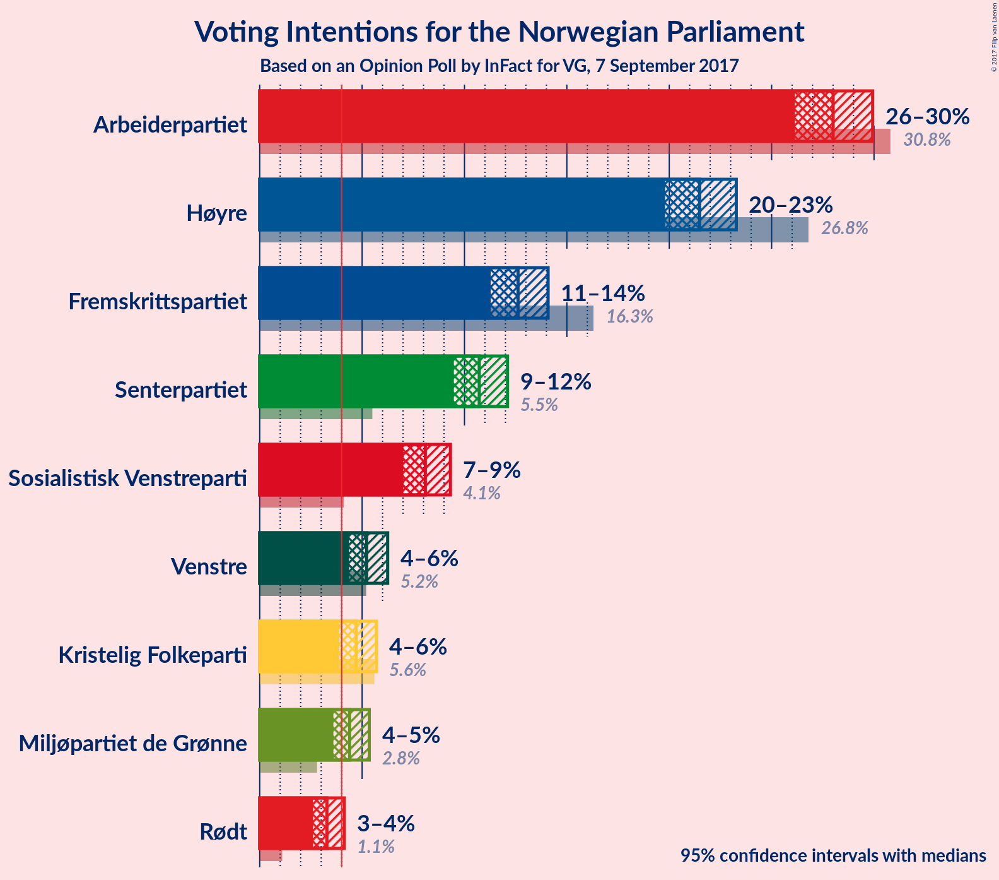
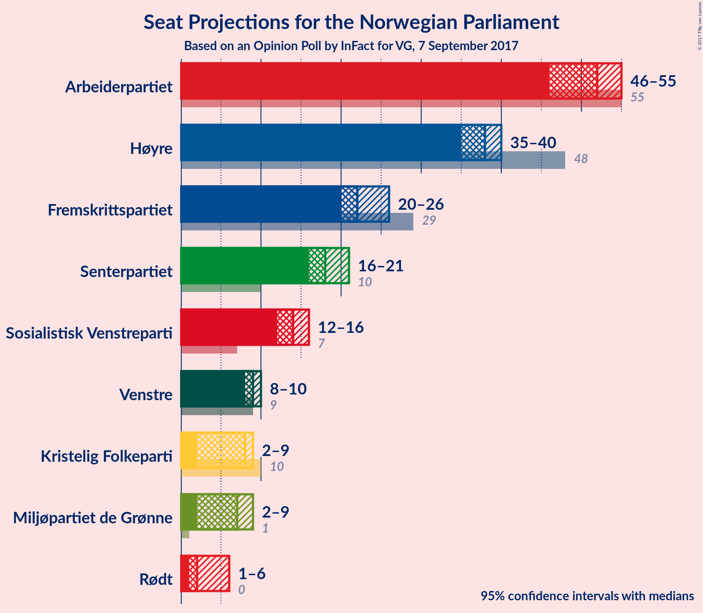
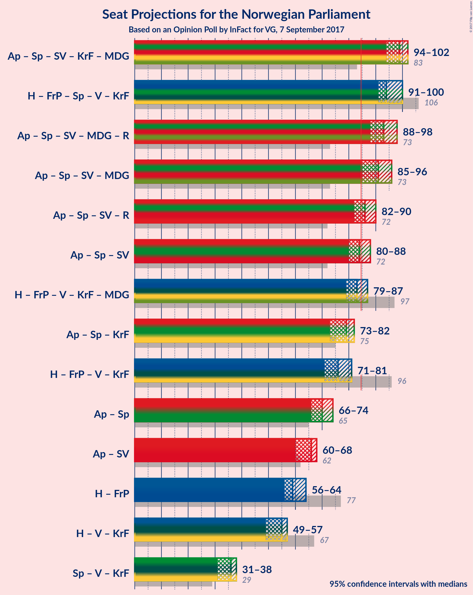

# Opinion Poll by InFact for VG, 7 September 2017

<a href="#voting-intentions">Voting Intentions</a> | <a href="#seats">Seats</a> | <a href="#coalitions">Coalitions</a> | <a href="#technical-information">Technical Information</a>

## Voting Intentions

### Confidence Intervals

| Party | Last Result | Poll Result | 80% Confidence Interval | 90% Confidence Interval | 95% Confidence Interval | 99% Confidence Interval |
|:-----:|:-----------:|:-----------:|:-----------------------:|:-----------------------:|:-----------------------:|:-----------------------:|
| Arbeiderpartiet | 30.8% | 28.0% | 26.8–29.3% |26.4–29.6% |26.1–29.9% |25.6–30.6% |
| Høyre | 26.8% | 21.5% | 20.4–22.7% |20.1–23.0% |19.8–23.3% |19.3–23.8% |
| Fremskrittspartiet | 16.3% | 12.6% | 11.7–13.6% |11.5–13.9% |11.3–14.1% |10.9–14.6% |
| Senterpartiet | 5.5% | 10.7% | 9.9–11.6% |9.7–11.9% |9.5–12.1% |9.1–12.5% |
| Sosialistisk Venstreparti | 4.1% | 8.1% | 7.4–8.9% |7.2–9.1% |7.0–9.3% |6.7–9.7% |
| Venstre | 5.2% | 5.2% | 4.6–5.9% |4.5–6.1% |4.4–6.2% |4.1–6.6% |
| Kristelig Folkeparti | 5.6% | 4.7% | 4.2–5.3% |4.0–5.5% |3.9–5.7% |3.6–6.0% |
| Miljøpartiet de Grønne | 2.8% | 4.4% | 3.9–5.0% |3.7–5.2% |3.6–5.3% |3.4–5.7% |
| Rødt | 1.1% | 3.3% | 2.8–3.8% |2.7–4.0% |2.6–4.1% |2.4–4.4% |

*Note:* The poll result column reflects the actual value used in the calculations. Published results may vary slightly, and in addition be rounded to fewer digits.

## Seats

### Confidence Intervals

| Party | Last Result | Median | 80% Confidence Interval | 90% Confidence Interval | 95% Confidence Interval | 99% Confidence Interval |
|:-----:|:-----------:|:------:|:-----------------------:|:-----------------------:|:-----------------------:|:-----------------------:|
| <a href="#arbeiderpartiet">Arbeiderpartiet</a> | 55 | 52 | 48–54 |46–54 |46–55 |46–56 |
| <a href="#høyre">Høyre</a> | 48 | 38 | 36–38 |35–39 |35–39 |35–42 |
| <a href="#fremskrittspartiet">Fremskrittspartiet</a> | 29 | 22 | 20–25 |20–26 |19–26 |18–27 |
| <a href="#senterpartiet">Senterpartiet</a> | 10 | 18 | 17–20 |17–20 |17–21 |15–22 |
| <a href="#sosialistisk-venstreparti">Sosialistisk Venstreparti</a> | 7 | 14 | 13–15 |12–15 |12–15 |12–17 |
| <a href="#venstre">Venstre</a> | 9 | 9 | 8–10 |8–10 |8–10 |7–11 |
| <a href="#kristelig-folkeparti">Kristelig Folkeparti</a> | 10 | 8 | 7–9 |2–9 |2–9 |2–10 |
| <a href="#miljøpartiet-de-grønne">Miljøpartiet de Grønne</a> | 1 | 7 | 7–8 |3–8 |2–9 |2–9 |
| <a href="#rødt">Rødt</a> | 0 | 2 | 2 |2 |1–2 |1–7 |

### Arbeiderpartiet

*For a full overview of the results for this party, see the [Arbeiderpartiet](party-arbeiderpartiet.html) page.*

| Number of Seats | Probability | Accumulated | Special Marks |
|:---------------:|:-----------:|:-----------:|:-------------:|
| 45 | 0% | 100% |  |
| 46 | 6% | 99.9% |  |
| 47 | 3% | 94% |  |
| 48 | 3% | 91% |  |
| 49 | 3% | 88% |  |
| 50 | 2% | 85% |  |
| 51 | 10% | 83% |  |
| 52 | 33% | 73% | Median |
| 53 | 11% | 40% |  |
| 54 | 25% | 29% |  |
| 55 | 4% | 5% | Last Result |
| 56 | 0.5% | 1.0% |  |
| 57 | 0.3% | 0.5% |  |
| 58 | 0.1% | 0.1% |  |
| 59 | 0% | 0.1% |  |
| 60 | 0% | 0% |  |

### Høyre

*For a full overview of the results for this party, see the [Høyre](party-hyre.html) page.*

| Number of Seats | Probability | Accumulated | Special Marks |
|:---------------:|:-----------:|:-----------:|:-------------:|
| 33 | 0.1% | 100% |  |
| 34 | 0.2% | 99.9% |  |
| 35 | 6% | 99.6% |  |
| 36 | 10% | 94% |  |
| 37 | 13% | 84% |  |
| 38 | 65% | 71% | Median |
| 39 | 4% | 6% |  |
| 40 | 1.1% | 2% |  |
| 41 | 0.3% | 1.0% |  |
| 42 | 0.5% | 0.7% |  |
| 43 | 0.1% | 0.1% |  |
| 44 | 0% | 0% |  |
| 45 | 0% | 0% |  |
| 46 | 0% | 0% |  |
| 47 | 0% | 0% |  |
| 48 | 0% | 0% | Last Result |

### Fremskrittspartiet

*For a full overview of the results for this party, see the [Fremskrittspartiet](party-fremskrittspartiet.html) page.*

| Number of Seats | Probability | Accumulated | Special Marks |
|:---------------:|:-----------:|:-----------:|:-------------:|
| 18 | 1.4% | 100% |  |
| 19 | 1.4% | 98.5% |  |
| 20 | 41% | 97% |  |
| 21 | 2% | 56% |  |
| 22 | 26% | 54% | Median |
| 23 | 8% | 28% |  |
| 24 | 8% | 20% |  |
| 25 | 7% | 12% |  |
| 26 | 3% | 5% |  |
| 27 | 2% | 2% |  |
| 28 | 0.1% | 0.1% |  |
| 29 | 0% | 0% | Last Result |

### Senterpartiet

*For a full overview of the results for this party, see the [Senterpartiet](party-senterpartiet.html) page.*

| Number of Seats | Probability | Accumulated | Special Marks |
|:---------------:|:-----------:|:-----------:|:-------------:|
| 10 | 0% | 100% | Last Result |
| 11 | 0% | 100% |  |
| 12 | 0% | 100% |  |
| 13 | 0% | 100% |  |
| 14 | 0% | 100% |  |
| 15 | 0.6% | 100% |  |
| 16 | 2% | 99.4% |  |
| 17 | 11% | 98% |  |
| 18 | 64% | 87% | Median |
| 19 | 5% | 23% |  |
| 20 | 14% | 18% |  |
| 21 | 3% | 4% |  |
| 22 | 1.1% | 1.3% |  |
| 23 | 0.1% | 0.1% |  |
| 24 | 0% | 0% |  |

### Sosialistisk Venstreparti

*For a full overview of the results for this party, see the [Sosialistisk Venstreparti](party-sosialistiskvenstreparti.html) page.*

| Number of Seats | Probability | Accumulated | Special Marks |
|:---------------:|:-----------:|:-----------:|:-------------:|
| 7 | 0% | 100% | Last Result |
| 8 | 0% | 100% |  |
| 9 | 0% | 100% |  |
| 10 | 0% | 100% |  |
| 11 | 0.5% | 100% |  |
| 12 | 5% | 99.5% |  |
| 13 | 29% | 94% |  |
| 14 | 52% | 65% | Median |
| 15 | 11% | 13% |  |
| 16 | 1.1% | 2% |  |
| 17 | 0.6% | 0.8% |  |
| 18 | 0.1% | 0.1% |  |
| 19 | 0% | 0% |  |

### Venstre

*For a full overview of the results for this party, see the [Venstre](party-venstre.html) page.*

| Number of Seats | Probability | Accumulated | Special Marks |
|:---------------:|:-----------:|:-----------:|:-------------:|
| 2 | 0.1% | 100% |  |
| 3 | 0% | 99.9% |  |
| 4 | 0% | 99.9% |  |
| 5 | 0% | 99.9% |  |
| 6 | 0% | 99.9% |  |
| 7 | 1.0% | 99.9% |  |
| 8 | 31% | 98.9% |  |
| 9 | 52% | 68% | Last Result, Median |
| 10 | 15% | 16% |  |
| 11 | 0.9% | 1.3% |  |
| 12 | 0.4% | 0.4% |  |
| 13 | 0% | 0% |  |

### Kristelig Folkeparti

*For a full overview of the results for this party, see the [Kristelig Folkeparti](party-kristeligfolkeparti.html) page.*

| Number of Seats | Probability | Accumulated | Special Marks |
|:---------------:|:-----------:|:-----------:|:-------------:|
| 2 | 7% | 100% |  |
| 3 | 0.1% | 93% |  |
| 4 | 0% | 93% |  |
| 5 | 0% | 93% |  |
| 6 | 0.1% | 93% |  |
| 7 | 25% | 93% |  |
| 8 | 21% | 68% | Median |
| 9 | 45% | 47% |  |
| 10 | 1.2% | 2% | Last Result |
| 11 | 0.3% | 0.3% |  |
| 12 | 0% | 0% |  |

### Miljøpartiet de Grønne

*For a full overview of the results for this party, see the [Miljøpartiet de Grønne](party-miljpartietdegrnne.html) page.*

| Number of Seats | Probability | Accumulated | Special Marks |
|:---------------:|:-----------:|:-----------:|:-------------:|
| 1 | 0.4% | 100% | Last Result |
| 2 | 3% | 99.6% |  |
| 3 | 5% | 97% |  |
| 4 | 0% | 92% |  |
| 5 | 0% | 92% |  |
| 6 | 0.1% | 92% |  |
| 7 | 61% | 92% | Median |
| 8 | 26% | 30% |  |
| 9 | 4% | 4% |  |
| 10 | 0.3% | 0.3% |  |
| 11 | 0% | 0% |  |

### Rødt

*For a full overview of the results for this party, see the [Rødt](party-rdt.html) page.*

| Number of Seats | Probability | Accumulated | Special Marks |
|:---------------:|:-----------:|:-----------:|:-------------:|
| 0 | 0% | 100% | Last Result |
| 1 | 3% | 100% |  |
| 2 | 95% | 97% | Median |
| 3 | 0% | 2% |  |
| 4 | 0% | 2% |  |
| 5 | 0% | 2% |  |
| 6 | 0.6% | 2% |  |
| 7 | 1.4% | 1.5% |  |
| 8 | 0.1% | 0.1% |  |
| 9 | 0% | 0% |  |

## Coalitions

### Confidence Intervals

| Coalition | Last Result | Median | Majority? | 80% Confidence Interval | 90% Confidence Interval | 95% Confidence Interval | 99% Confidence Interval |
|:---------:|:-----------:|:------:|:---------:|:-----------------------:|:-----------------------:|:-----------------------:|:-----------------------:|
| Arbeiderpartiet – Senterpartiet – Sosialistisk Venstreparti – Kristelig Folkeparti – Miljøpartiet de Grønne | 83 | 99 | 100% | 96–100 | 94–101 | 94–102 | 90–104 |
| Høyre – Fremskrittspartiet – Senterpartiet – Venstre – Kristelig Folkeparti | 106 | 94 | 100% | 92–98 | 91–99 | 91–100 | 90–101 |
| Arbeiderpartiet – Senterpartiet – Sosialistisk Venstreparti – Miljøpartiet de Grønne – Rødt | 73 | 93 | 100% | 90–95 | 89–97 | 88–98 | 87–98 |
| Arbeiderpartiet – Senterpartiet – Sosialistisk Venstreparti – Miljøpartiet de Grønne | 73 | 91 | 99.0% | 88–93 | 86–95 | 85–96 | 82–96 |
| Arbeiderpartiet – Senterpartiet – Sosialistisk Venstreparti – Rødt | 72 | 86 | 84% | 83–89 | 82–90 | 82–90 | 80–92 |
| Arbeiderpartiet – Senterpartiet – Sosialistisk Venstreparti | 72 | 84 | 31% | 81–87 | 80–88 | 80–88 | 78–89 |
| Høyre – Fremskrittspartiet – Venstre – Kristelig Folkeparti – Miljøpartiet de Grønne | 97 | 83 | 16% | 80–86 | 79–87 | 79–87 | 77–89 |
| Arbeiderpartiet – Senterpartiet – Kristelig Folkeparti | 75 | 79 | 0.1% | 74–79 | 74–81 | 73–82 | 72–84 |
| Høyre – Fremskrittspartiet – Venstre – Kristelig Folkeparti | 96 | 76 | 0% | 74–79 | 72–80 | 71–81 | 71–82 |
| Arbeiderpartiet – Senterpartiet | 65 | 70 | 0% | 67–72 | 66–74 | 66–74 | 65–75 |
| Arbeiderpartiet – Sosialistisk Venstreparti | 62 | 66 | 0% | 62–68 | 60–68 | 60–68 | 60–70 |
| Høyre – Fremskrittspartiet | 77 | 59 | 0% | 58–62 | 57–63 | 56–64 | 54–65 |
| Høyre – Venstre – Kristelig Folkeparti | 67 | 55 | 0% | 52–56 | 50–56 | 49–57 | 48–59 |
| Senterpartiet – Venstre – Kristelig Folkeparti | 29 | 36 | 0% | 32–37 | 31–38 | 31–38 | 30–41 |

### Arbeiderpartiet – Senterpartiet – Sosialistisk Venstreparti – Kristelig Folkeparti – Miljøpartiet de Grønne

| Number of Seats | Probability | Accumulated | Special Marks |
|:---------------:|:-----------:|:-----------:|:-------------:|
| 83 | 0% | 100% | Last Result |
| 84 | 0% | 100% |  |
| 85 | 0% | 100% | Majority |
| 86 | 0% | 100% |  |
| 87 | 0% | 100% |  |
| 88 | 0% | 100% |  |
| 89 | 0% | 100% |  |
| 90 | 0.8% | 100% |  |
| 91 | 0.1% | 99.2% |  |
| 92 | 0.4% | 99.1% |  |
| 93 | 0.7% | 98.7% |  |
| 94 | 4% | 98% |  |
| 95 | 2% | 94% |  |
| 96 | 7% | 92% |  |
| 97 | 4% | 85% |  |
| 98 | 13% | 81% |  |
| 99 | 20% | 68% | Median |
| 100 | 42% | 48% |  |
| 101 | 2% | 6% |  |
| 102 | 2% | 4% |  |
| 103 | 0.9% | 2% |  |
| 104 | 1.1% | 1.2% |  |
| 105 | 0.1% | 0.1% |  |
| 106 | 0% | 0% |  |

### Høyre – Fremskrittspartiet – Senterpartiet – Venstre – Kristelig Folkeparti

| Number of Seats | Probability | Accumulated | Special Marks |
|:---------------:|:-----------:|:-----------:|:-------------:|
| 86 | 0% | 100% |  |
| 87 | 0.1% | 99.9% |  |
| 88 | 0.1% | 99.9% |  |
| 89 | 0.2% | 99.8% |  |
| 90 | 1.0% | 99.6% |  |
| 91 | 6% | 98.6% |  |
| 92 | 7% | 92% |  |
| 93 | 17% | 85% |  |
| 94 | 46% | 68% |  |
| 95 | 2% | 22% | Median |
| 96 | 2% | 19% |  |
| 97 | 4% | 17% |  |
| 98 | 4% | 13% |  |
| 99 | 4% | 9% |  |
| 100 | 3% | 5% |  |
| 101 | 2% | 2% |  |
| 102 | 0% | 0.1% |  |
| 103 | 0% | 0.1% |  |
| 104 | 0% | 0% |  |
| 105 | 0% | 0% |  |
| 106 | 0% | 0% | Last Result |

### Arbeiderpartiet – Senterpartiet – Sosialistisk Venstreparti – Miljøpartiet de Grønne – Rødt

| Number of Seats | Probability | Accumulated | Special Marks |
|:---------------:|:-----------:|:-----------:|:-------------:|
| 73 | 0% | 100% | Last Result |
| 74 | 0% | 100% |  |
| 75 | 0% | 100% |  |
| 76 | 0% | 100% |  |
| 77 | 0% | 100% |  |
| 78 | 0% | 100% |  |
| 79 | 0% | 100% |  |
| 80 | 0% | 100% |  |
| 81 | 0% | 100% |  |
| 82 | 0% | 100% |  |
| 83 | 0% | 100% |  |
| 84 | 0% | 100% |  |
| 85 | 0% | 100% | Majority |
| 86 | 0.4% | 99.9% |  |
| 87 | 2% | 99.5% |  |
| 88 | 2% | 98% |  |
| 89 | 3% | 96% |  |
| 90 | 6% | 93% |  |
| 91 | 5% | 87% |  |
| 92 | 3% | 82% |  |
| 93 | 49% | 80% | Median |
| 94 | 17% | 31% |  |
| 95 | 5% | 14% |  |
| 96 | 2% | 9% |  |
| 97 | 2% | 7% |  |
| 98 | 5% | 5% |  |
| 99 | 0.1% | 0.2% |  |
| 100 | 0.1% | 0.1% |  |
| 101 | 0% | 0.1% |  |
| 102 | 0% | 0% |  |

### Arbeiderpartiet – Senterpartiet – Sosialistisk Venstreparti – Miljøpartiet de Grønne

| Number of Seats | Probability | Accumulated | Special Marks |
|:---------------:|:-----------:|:-----------:|:-------------:|
| 73 | 0% | 100% | Last Result |
| 74 | 0% | 100% |  |
| 75 | 0% | 100% |  |
| 76 | 0% | 100% |  |
| 77 | 0% | 100% |  |
| 78 | 0% | 100% |  |
| 79 | 0% | 100% |  |
| 80 | 0% | 100% |  |
| 81 | 0% | 100% |  |
| 82 | 0.8% | 100% |  |
| 83 | 0% | 99.2% |  |
| 84 | 0.1% | 99.1% |  |
| 85 | 2% | 99.0% | Majority |
| 86 | 2% | 97% |  |
| 87 | 2% | 95% |  |
| 88 | 6% | 93% |  |
| 89 | 5% | 87% |  |
| 90 | 3% | 82% |  |
| 91 | 49% | 79% | Median |
| 92 | 17% | 30% |  |
| 93 | 5% | 13% |  |
| 94 | 2% | 9% |  |
| 95 | 2% | 7% |  |
| 96 | 5% | 5% |  |
| 97 | 0.1% | 0.2% |  |
| 98 | 0% | 0% |  |

### Arbeiderpartiet – Senterpartiet – Sosialistisk Venstreparti – Rødt

| Number of Seats | Probability | Accumulated | Special Marks |
|:---------------:|:-----------:|:-----------:|:-------------:|
| 72 | 0% | 100% | Last Result |
| 73 | 0% | 100% |  |
| 74 | 0% | 100% |  |
| 75 | 0% | 100% |  |
| 76 | 0% | 100% |  |
| 77 | 0% | 100% |  |
| 78 | 0% | 100% |  |
| 79 | 0.4% | 100% |  |
| 80 | 0.5% | 99.6% |  |
| 81 | 0.6% | 99.1% |  |
| 82 | 5% | 98% |  |
| 83 | 5% | 94% |  |
| 84 | 4% | 89% |  |
| 85 | 11% | 84% | Majority |
| 86 | 42% | 73% | Median |
| 87 | 17% | 31% |  |
| 88 | 4% | 15% |  |
| 89 | 4% | 10% |  |
| 90 | 5% | 6% |  |
| 91 | 0.6% | 1.5% |  |
| 92 | 0.4% | 0.9% |  |
| 93 | 0.1% | 0.5% |  |
| 94 | 0.3% | 0.3% |  |
| 95 | 0.1% | 0.1% |  |
| 96 | 0% | 0% |  |

### Arbeiderpartiet – Senterpartiet – Sosialistisk Venstreparti

| Number of Seats | Probability | Accumulated | Special Marks |
|:---------------:|:-----------:|:-----------:|:-------------:|
| 72 | 0% | 100% | Last Result |
| 73 | 0% | 100% |  |
| 74 | 0% | 100% |  |
| 75 | 0% | 100% |  |
| 76 | 0% | 100% |  |
| 77 | 0.1% | 100% |  |
| 78 | 0.9% | 99.9% |  |
| 79 | 0.6% | 99.0% |  |
| 80 | 6% | 98% |  |
| 81 | 5% | 92% |  |
| 82 | 4% | 88% |  |
| 83 | 11% | 83% |  |
| 84 | 41% | 72% | Median |
| 85 | 16% | 31% | Majority |
| 86 | 4% | 15% |  |
| 87 | 4% | 10% |  |
| 88 | 5% | 6% |  |
| 89 | 0.6% | 1.1% |  |
| 90 | 0.3% | 0.5% |  |
| 91 | 0.1% | 0.1% |  |
| 92 | 0% | 0.1% |  |
| 93 | 0% | 0% |  |

### Høyre – Fremskrittspartiet – Venstre – Kristelig Folkeparti – Miljøpartiet de Grønne

| Number of Seats | Probability | Accumulated | Special Marks |
|:---------------:|:-----------:|:-----------:|:-------------:|
| 74 | 0.1% | 100% |  |
| 75 | 0.3% | 99.9% |  |
| 76 | 0.1% | 99.7% |  |
| 77 | 0.4% | 99.5% |  |
| 78 | 0.6% | 99.1% |  |
| 79 | 5% | 98.5% |  |
| 80 | 4% | 94% |  |
| 81 | 4% | 90% |  |
| 82 | 17% | 85% |  |
| 83 | 42% | 69% |  |
| 84 | 11% | 27% | Median |
| 85 | 4% | 16% | Majority |
| 86 | 5% | 11% |  |
| 87 | 5% | 6% |  |
| 88 | 0.6% | 2% |  |
| 89 | 0.5% | 0.9% |  |
| 90 | 0.4% | 0.4% |  |
| 91 | 0% | 0% |  |
| 92 | 0% | 0% |  |
| 93 | 0% | 0% |  |
| 94 | 0% | 0% |  |
| 95 | 0% | 0% |  |
| 96 | 0% | 0% |  |
| 97 | 0% | 0% | Last Result |

### Arbeiderpartiet – Senterpartiet – Kristelig Folkeparti

| Number of Seats | Probability | Accumulated | Special Marks |
|:---------------:|:-----------:|:-----------:|:-------------:|
| 70 | 0.1% | 100% |  |
| 71 | 0.3% | 99.8% |  |
| 72 | 0.5% | 99.6% |  |
| 73 | 2% | 99.1% |  |
| 74 | 7% | 97% |  |
| 75 | 3% | 90% | Last Result |
| 76 | 11% | 87% |  |
| 77 | 6% | 77% |  |
| 78 | 6% | 71% | Median |
| 79 | 55% | 64% |  |
| 80 | 2% | 9% |  |
| 81 | 4% | 7% |  |
| 82 | 0.8% | 3% |  |
| 83 | 2% | 2% |  |
| 84 | 0.4% | 0.5% |  |
| 85 | 0.1% | 0.1% | Majority |
| 86 | 0% | 0% |  |

### Høyre – Fremskrittspartiet – Venstre – Kristelig Folkeparti

| Number of Seats | Probability | Accumulated | Special Marks |
|:---------------:|:-----------:|:-----------:|:-------------:|
| 68 | 0% | 100% |  |
| 69 | 0.1% | 99.9% |  |
| 70 | 0.1% | 99.9% |  |
| 71 | 5% | 99.8% |  |
| 72 | 2% | 95% |  |
| 73 | 2% | 93% |  |
| 74 | 5% | 91% |  |
| 75 | 17% | 86% |  |
| 76 | 49% | 69% |  |
| 77 | 3% | 20% | Median |
| 78 | 5% | 18% |  |
| 79 | 6% | 13% |  |
| 80 | 3% | 7% |  |
| 81 | 2% | 4% |  |
| 82 | 2% | 2% |  |
| 83 | 0.4% | 0.5% |  |
| 84 | 0% | 0.1% |  |
| 85 | 0% | 0% | Majority |
| 86 | 0% | 0% |  |
| 87 | 0% | 0% |  |
| 88 | 0% | 0% |  |
| 89 | 0% | 0% |  |
| 90 | 0% | 0% |  |
| 91 | 0% | 0% |  |
| 92 | 0% | 0% |  |
| 93 | 0% | 0% |  |
| 94 | 0% | 0% |  |
| 95 | 0% | 0% |  |
| 96 | 0% | 0% | Last Result |

### Arbeiderpartiet – Senterpartiet

| Number of Seats | Probability | Accumulated | Special Marks |
|:---------------:|:-----------:|:-----------:|:-------------:|
| 64 | 0.1% | 100% |  |
| 65 | 1.3% | 99.9% | Last Result |
| 66 | 7% | 98.6% |  |
| 67 | 5% | 92% |  |
| 68 | 5% | 87% |  |
| 69 | 6% | 82% |  |
| 70 | 37% | 75% | Median |
| 71 | 7% | 38% |  |
| 72 | 22% | 31% |  |
| 73 | 1.0% | 9% |  |
| 74 | 7% | 8% |  |
| 75 | 0.9% | 1.2% |  |
| 76 | 0.2% | 0.3% |  |
| 77 | 0.1% | 0.1% |  |
| 78 | 0% | 0% |  |

### Arbeiderpartiet – Sosialistisk Venstreparti

| Number of Seats | Probability | Accumulated | Special Marks |
|:---------------:|:-----------:|:-----------:|:-------------:|
| 59 | 0.1% | 100% |  |
| 60 | 5% | 99.8% |  |
| 61 | 3% | 95% |  |
| 62 | 2% | 92% | Last Result |
| 63 | 3% | 89% |  |
| 64 | 4% | 86% |  |
| 65 | 8% | 83% |  |
| 66 | 46% | 75% | Median |
| 67 | 15% | 29% |  |
| 68 | 11% | 14% |  |
| 69 | 1.2% | 2% |  |
| 70 | 0.8% | 1.1% |  |
| 71 | 0.1% | 0.3% |  |
| 72 | 0.1% | 0.1% |  |
| 73 | 0% | 0% |  |

### Høyre – Fremskrittspartiet

| Number of Seats | Probability | Accumulated | Special Marks |
|:---------------:|:-----------:|:-----------:|:-------------:|
| 54 | 1.2% | 100% |  |
| 55 | 0.7% | 98.8% |  |
| 56 | 1.3% | 98% |  |
| 57 | 3% | 97% |  |
| 58 | 40% | 94% |  |
| 59 | 10% | 54% |  |
| 60 | 22% | 44% | Median |
| 61 | 11% | 21% |  |
| 62 | 4% | 11% |  |
| 63 | 3% | 7% |  |
| 64 | 1.4% | 4% |  |
| 65 | 2% | 2% |  |
| 66 | 0.3% | 0.4% |  |
| 67 | 0.1% | 0.1% |  |
| 68 | 0% | 0% |  |
| 69 | 0% | 0% |  |
| 70 | 0% | 0% |  |
| 71 | 0% | 0% |  |
| 72 | 0% | 0% |  |
| 73 | 0% | 0% |  |
| 74 | 0% | 0% |  |
| 75 | 0% | 0% |  |
| 76 | 0% | 0% |  |
| 77 | 0% | 0% | Last Result |

### Høyre – Venstre – Kristelig Folkeparti

| Number of Seats | Probability | Accumulated | Special Marks |
|:---------------:|:-----------:|:-----------:|:-------------:|
| 47 | 0.1% | 100% |  |
| 48 | 0.4% | 99.9% |  |
| 49 | 4% | 99.4% |  |
| 50 | 0.8% | 95% |  |
| 51 | 1.1% | 94% |  |
| 52 | 11% | 93% |  |
| 53 | 18% | 82% |  |
| 54 | 14% | 64% |  |
| 55 | 7% | 50% | Median |
| 56 | 40% | 43% |  |
| 57 | 0.9% | 3% |  |
| 58 | 1.1% | 2% |  |
| 59 | 0.3% | 0.5% |  |
| 60 | 0.2% | 0.2% |  |
| 61 | 0% | 0.1% |  |
| 62 | 0% | 0% |  |
| 63 | 0% | 0% |  |
| 64 | 0% | 0% |  |
| 65 | 0% | 0% |  |
| 66 | 0% | 0% |  |
| 67 | 0% | 0% | Last Result |

### Senterpartiet – Venstre – Kristelig Folkeparti

| Number of Seats | Probability | Accumulated | Special Marks |
|:---------------:|:-----------:|:-----------:|:-------------:|
| 27 | 0.1% | 100% |  |
| 28 | 0.1% | 99.9% |  |
| 29 | 0.1% | 99.8% | Last Result |
| 30 | 0.9% | 99.7% |  |
| 31 | 5% | 98.8% |  |
| 32 | 4% | 94% |  |
| 33 | 17% | 90% |  |
| 34 | 6% | 72% |  |
| 35 | 13% | 66% | Median |
| 36 | 39% | 53% |  |
| 37 | 6% | 14% |  |
| 38 | 6% | 8% |  |
| 39 | 0.6% | 2% |  |
| 40 | 0.2% | 1.1% |  |
| 41 | 0.8% | 0.9% |  |
| 42 | 0.1% | 0.1% |  |
| 43 | 0% | 0% |  |

## Technical Information

### Opinion Poll

+ **Pollster:** InFact
+ **Media:** VG
+ **Fieldwork period:** 7 September 2017

### Calculations

+ **Sample size:** 2164
+ **Simulations done:** 524,288
+ **Error estimate:** 1.75%

