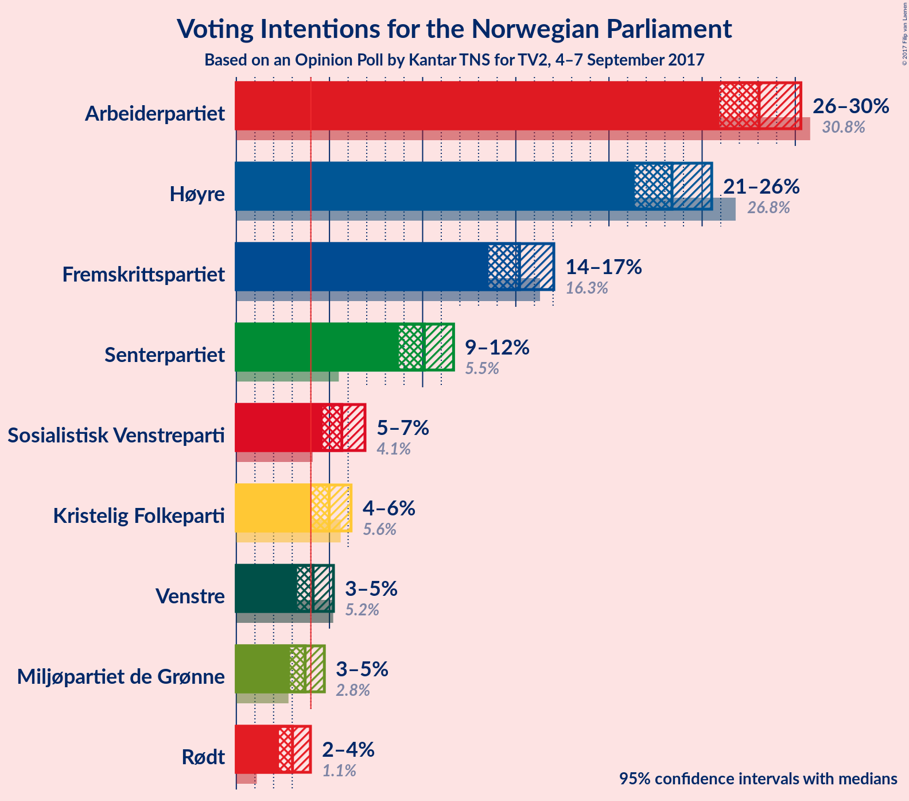
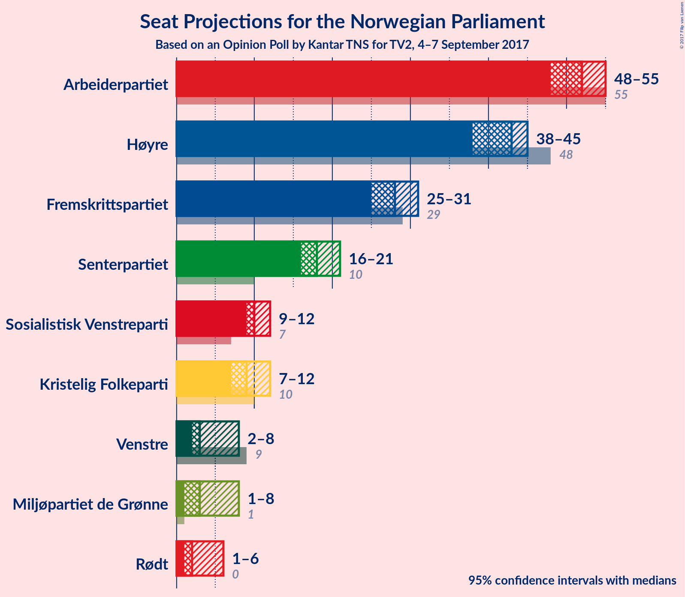
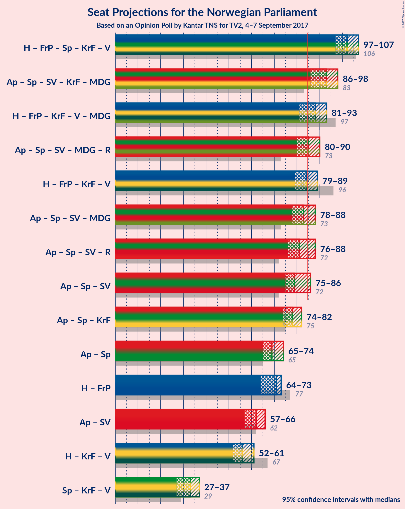

# Opinion Poll by Kantar TNS for TV2, 4–7 September 2017

<a href="#voting-intentions">Voting Intentions</a> | <a href="#seats">Seats</a> | <a href="#coalitions">Coalitions</a> | <a href="#technical-information">Technical Information</a>

## Voting Intentions

### Confidence Intervals

| Party | Last Result | Poll Result | 80% Confidence Interval | 90% Confidence Interval | 95% Confidence Interval | 99% Confidence Interval |
|:-----:|:-----------:|:-----------:|:-----------------------:|:-----------------------:|:-----------------------:|:-----------------------:|
| Arbeiderpartiet | 30.8% | 28.1% | 26.7–29.5% |26.3–29.9% |25.9–30.3% |25.3–31.0% |
| Høyre | 26.8% | 23.4% | 22.1–24.8% |21.7–25.2% |21.4–25.5% |20.8–26.2% |
| Fremskrittspartiet | 16.3% | 15.2% | 14.1–16.4% |13.8–16.7% |13.5–17.0% |13.0–17.6% |
| Senterpartiet | 5.5% | 10.1% | 9.2–11.1% |8.9–11.4% |8.7–11.7% |8.3–12.2% |
| Sosialistisk Venstreparti | 4.1% | 5.7% | 5.0–6.5% |4.8–6.7% |4.6–6.9% |4.3–7.3% |
| Kristelig Folkeparti | 5.6% | 5.0% | 4.3–5.7% |4.2–6.0% |4.0–6.2% |3.7–6.6% |
| Venstre | 5.2% | 4.1% | 3.6–4.8% |3.4–5.0% |3.3–5.2% |3.0–5.6% |
| Miljøpartiet de Grønne | 2.8% | 3.7% | 3.2–4.4% |3.0–4.6% |2.9–4.7% |2.6–5.1% |
| Rødt | 1.1% | 3.0% | 2.5–3.6% |2.4–3.8% |2.3–4.0% |2.1–4.3% |

*Note:* The poll result column reflects the actual value used in the calculations. Published results may vary slightly, and in addition be rounded to fewer digits.

## Seats

### Confidence Intervals

| Party | Last Result | Median | 80% Confidence Interval | 90% Confidence Interval | 95% Confidence Interval | 99% Confidence Interval |
|:-----:|:-----------:|:------:|:-----------------------:|:-----------------------:|:-----------------------:|:-----------------------:|
| <a href="#arbeiderpartiet">Arbeiderpartiet</a> | 55 | 52 | 48–55 |48–55 |48–55 |47–57 |
| <a href="#høyre">Høyre</a> | 48 | 43 | 38–45 |38–45 |38–45 |36–46 |
| <a href="#fremskrittspartiet">Fremskrittspartiet</a> | 29 | 28 | 27–31 |26–31 |25–31 |24–32 |
| <a href="#senterpartiet">Senterpartiet</a> | 10 | 18 | 16–19 |16–19 |16–21 |15–22 |
| <a href="#sosialistisk-venstreparti">Sosialistisk Venstreparti</a> | 7 | 10 | 9–11 |9–12 |9–12 |8–13 |
| <a href="#kristelig-folkeparti">Kristelig Folkeparti</a> | 10 | 9 | 8–11 |7–11 |7–12 |2–12 |
| <a href="#venstre">Venstre</a> | 9 | 3 | 2–8 |2–8 |2–8 |1–10 |
| <a href="#miljøpartiet-de-grønne">Miljøpartiet de Grønne</a> | 1 | 3 | 1–8 |1–8 |1–8 |1–9 |
| <a href="#rødt">Rødt</a> | 0 | 2 | 1–2 |1–2 |1–6 |1–7 |

### Arbeiderpartiet

*For a full overview of the results for this party, see the [Arbeiderpartiet](party-arbeiderpartiet.html) page.*

| Number of Seats | Probability | Accumulated | Special Marks |
|:---------------:|:-----------:|:-----------:|:-------------:|
| 45 | 0% | 100% |  |
| 46 | 0.3% | 99.9% |  |
| 47 | 2% | 99.7% |  |
| 48 | 11% | 98% |  |
| 49 | 14% | 87% |  |
| 50 | 2% | 73% |  |
| 51 | 20% | 71% |  |
| 52 | 20% | 50% | Median |
| 53 | 2% | 31% |  |
| 54 | 15% | 29% |  |
| 55 | 12% | 13% | Last Result |
| 56 | 1.0% | 2% |  |
| 57 | 0.6% | 0.7% |  |
| 58 | 0.1% | 0.1% |  |
| 59 | 0% | 0% |  |

### Høyre

*For a full overview of the results for this party, see the [Høyre](party-hyre.html) page.*

| Number of Seats | Probability | Accumulated | Special Marks |
|:---------------:|:-----------:|:-----------:|:-------------:|
| 36 | 0.7% | 100% |  |
| 37 | 1.0% | 99.3% |  |
| 38 | 12% | 98% |  |
| 39 | 3% | 86% |  |
| 40 | 2% | 83% |  |
| 41 | 4% | 81% |  |
| 42 | 20% | 77% |  |
| 43 | 26% | 56% | Median |
| 44 | 12% | 30% |  |
| 45 | 17% | 18% |  |
| 46 | 0.5% | 0.7% |  |
| 47 | 0.1% | 0.2% |  |
| 48 | 0% | 0.1% | Last Result |
| 49 | 0% | 0.1% |  |
| 50 | 0% | 0% |  |

### Fremskrittspartiet

*For a full overview of the results for this party, see the [Fremskrittspartiet](party-fremskrittspartiet.html) page.*

| Number of Seats | Probability | Accumulated | Special Marks |
|:---------------:|:-----------:|:-----------:|:-------------:|
| 22 | 0.1% | 100% |  |
| 23 | 0.1% | 99.9% |  |
| 24 | 0.6% | 99.8% |  |
| 25 | 4% | 99.2% |  |
| 26 | 3% | 95% |  |
| 27 | 6% | 92% |  |
| 28 | 65% | 86% | Median |
| 29 | 4% | 21% | Last Result |
| 30 | 0.5% | 17% |  |
| 31 | 15% | 17% |  |
| 32 | 2% | 2% |  |
| 33 | 0% | 0% |  |

### Senterpartiet

*For a full overview of the results for this party, see the [Senterpartiet](party-senterpartiet.html) page.*

| Number of Seats | Probability | Accumulated | Special Marks |
|:---------------:|:-----------:|:-----------:|:-------------:|
| 10 | 0% | 100% | Last Result |
| 11 | 0% | 100% |  |
| 12 | 0% | 100% |  |
| 13 | 0% | 100% |  |
| 14 | 0.2% | 100% |  |
| 15 | 2% | 99.8% |  |
| 16 | 24% | 98% |  |
| 17 | 20% | 74% |  |
| 18 | 33% | 54% | Median |
| 19 | 16% | 21% |  |
| 20 | 1.0% | 4% |  |
| 21 | 2% | 3% |  |
| 22 | 1.5% | 2% |  |
| 23 | 0% | 0.1% |  |
| 24 | 0% | 0% |  |

### Sosialistisk Venstreparti

*For a full overview of the results for this party, see the [Sosialistisk Venstreparti](party-sosialistiskvenstreparti.html) page.*

| Number of Seats | Probability | Accumulated | Special Marks |
|:---------------:|:-----------:|:-----------:|:-------------:|
| 2 | 0.1% | 100% |  |
| 3 | 0% | 99.9% |  |
| 4 | 0% | 99.9% |  |
| 5 | 0% | 99.9% |  |
| 6 | 0% | 99.9% |  |
| 7 | 0.2% | 99.9% | Last Result |
| 8 | 0.9% | 99.7% |  |
| 9 | 42% | 98.8% |  |
| 10 | 20% | 57% | Median |
| 11 | 31% | 36% |  |
| 12 | 4% | 5% |  |
| 13 | 1.5% | 2% |  |
| 14 | 0.1% | 0.1% |  |
| 15 | 0% | 0% |  |

### Kristelig Folkeparti

*For a full overview of the results for this party, see the [Kristelig Folkeparti](party-kristeligfolkeparti.html) page.*

| Number of Seats | Probability | Accumulated | Special Marks |
|:---------------:|:-----------:|:-----------:|:-------------:|
| 2 | 2% | 100% |  |
| 3 | 0% | 98% |  |
| 4 | 0% | 98% |  |
| 5 | 0% | 98% |  |
| 6 | 0% | 98% |  |
| 7 | 3% | 98% |  |
| 8 | 23% | 95% |  |
| 9 | 47% | 72% | Median |
| 10 | 9% | 25% | Last Result |
| 11 | 14% | 16% |  |
| 12 | 3% | 3% |  |
| 13 | 0% | 0% |  |

### Venstre

*For a full overview of the results for this party, see the [Venstre](party-venstre.html) page.*

| Number of Seats | Probability | Accumulated | Special Marks |
|:---------------:|:-----------:|:-----------:|:-------------:|
| 1 | 1.3% | 100% |  |
| 2 | 35% | 98.7% |  |
| 3 | 18% | 64% | Median |
| 4 | 0% | 46% |  |
| 5 | 0% | 46% |  |
| 6 | 0% | 46% |  |
| 7 | 3% | 46% |  |
| 8 | 41% | 43% |  |
| 9 | 0.9% | 2% | Last Result |
| 10 | 0.4% | 0.6% |  |
| 11 | 0.3% | 0.3% |  |
| 12 | 0% | 0% |  |

### Miljøpartiet de Grønne

*For a full overview of the results for this party, see the [Miljøpartiet de Grønne](party-miljpartietdegrnne.html) page.*

| Number of Seats | Probability | Accumulated | Special Marks |
|:---------------:|:-----------:|:-----------:|:-------------:|
| 1 | 38% | 100% | Last Result |
| 2 | 1.1% | 62% |  |
| 3 | 24% | 61% | Median |
| 4 | 10% | 38% |  |
| 5 | 0% | 27% |  |
| 6 | 0% | 27% |  |
| 7 | 7% | 27% |  |
| 8 | 20% | 21% |  |
| 9 | 0.5% | 0.5% |  |
| 10 | 0% | 0% |  |

### Rødt

*For a full overview of the results for this party, see the [Rødt](party-rdt.html) page.*

| Number of Seats | Probability | Accumulated | Special Marks |
|:---------------:|:-----------:|:-----------:|:-------------:|
| 0 | 0% | 100% | Last Result |
| 1 | 39% | 100% |  |
| 2 | 58% | 61% | Median |
| 3 | 0% | 3% |  |
| 4 | 0% | 3% |  |
| 5 | 0% | 3% |  |
| 6 | 0.3% | 3% |  |
| 7 | 2% | 2% |  |
| 8 | 0% | 0% |  |

## Coalitions

### Confidence Intervals

| Coalition | Last Result | Median | Majority? | 80% Confidence Interval | 90% Confidence Interval | 95% Confidence Interval | 99% Confidence Interval |
|:---------:|:-----------:|:------:|:---------:|:-----------------------:|:-----------------------:|:-----------------------:|:-----------------------:|
| Høyre – Fremskrittspartiet – Senterpartiet – Kristelig Folkeparti – Venstre | 106 | 102 | 100% | 98–107 | 98–107 | 97–107 | 95–108 |
| Arbeiderpartiet – Senterpartiet – Sosialistisk Venstreparti – Kristelig Folkeparti – Miljøpartiet de Grønne | 83 | 93 | 99.6% | 86–95 | 86–97 | 86–98 | 86–98 |
| Høyre – Fremskrittspartiet – Kristelig Folkeparti – Venstre – Miljøpartiet de Grønne | 97 | 88 | 94% | 85–93 | 83–93 | 81–93 | 80–94 |
| Arbeiderpartiet – Senterpartiet – Sosialistisk Venstreparti – Miljøpartiet de Grønne – Rødt | 73 | 85 | 58% | 80–88 | 80–89 | 80–90 | 80–92 |
| Høyre – Fremskrittspartiet – Kristelig Folkeparti – Venstre | 96 | 84 | 42% | 81–89 | 80–89 | 79–89 | 77–89 |
| Arbeiderpartiet – Senterpartiet – Sosialistisk Venstreparti – Miljøpartiet de Grønne | 73 | 83 | 33% | 78–85 | 78–88 | 78–88 | 78–89 |
| Arbeiderpartiet – Senterpartiet – Sosialistisk Venstreparti – Rødt | 72 | 81 | 6% | 76–84 | 76–86 | 76–88 | 75–89 |
| Arbeiderpartiet – Senterpartiet – Sosialistisk Venstreparti | 72 | 79 | 3% | 75–82 | 75–82 | 75–86 | 74–88 |
| Arbeiderpartiet – Senterpartiet – Kristelig Folkeparti | 75 | 78 | 0.5% | 74–82 | 74–82 | 74–82 | 72–85 |
| Arbeiderpartiet – Senterpartiet | 65 | 69 | 0% | 66–72 | 66–72 | 65–74 | 64–78 |
| Høyre – Fremskrittspartiet | 77 | 71 | 0% | 66–73 | 65–73 | 64–73 | 63–75 |
| Arbeiderpartiet – Sosialistisk Venstreparti | 62 | 62 | 0% | 57–66 | 57–66 | 57–66 | 57–67 |
| Høyre – Kristelig Folkeparti – Venstre | 67 | 56 | 0% | 53–61 | 53–61 | 52–61 | 49–62 |
| Senterpartiet – Kristelig Folkeparti – Venstre | 29 | 33 | 0% | 27–34 | 27–36 | 27–37 | 25–39 |

### Høyre – Fremskrittspartiet – Senterpartiet – Kristelig Folkeparti – Venstre

| Number of Seats | Probability | Accumulated | Special Marks |
|:---------------:|:-----------:|:-----------:|:-------------:|
| 92 | 0.3% | 100% |  |
| 93 | 0% | 99.7% |  |
| 94 | 0.2% | 99.7% |  |
| 95 | 0.3% | 99.5% |  |
| 96 | 0.1% | 99.2% |  |
| 97 | 3% | 99.1% |  |
| 98 | 17% | 96% |  |
| 99 | 11% | 80% |  |
| 100 | 8% | 69% |  |
| 101 | 1.4% | 61% | Median |
| 102 | 16% | 59% |  |
| 103 | 2% | 43% |  |
| 104 | 13% | 41% |  |
| 105 | 6% | 28% |  |
| 106 | 11% | 22% | Last Result |
| 107 | 11% | 11% |  |
| 108 | 0.3% | 0.6% |  |
| 109 | 0.2% | 0.3% |  |
| 110 | 0% | 0.1% |  |
| 111 | 0% | 0.1% |  |
| 112 | 0.1% | 0.1% |  |
| 113 | 0% | 0% |  |

### Arbeiderpartiet – Senterpartiet – Sosialistisk Venstreparti – Kristelig Folkeparti – Miljøpartiet de Grønne

| Number of Seats | Probability | Accumulated | Special Marks |
|:---------------:|:-----------:|:-----------:|:-------------:|
| 83 | 0.2% | 100% | Last Result |
| 84 | 0.2% | 99.8% |  |
| 85 | 0.1% | 99.6% | Majority |
| 86 | 10% | 99.5% |  |
| 87 | 0.5% | 89% |  |
| 88 | 14% | 89% |  |
| 89 | 2% | 75% |  |
| 90 | 5% | 73% |  |
| 91 | 1.3% | 68% |  |
| 92 | 15% | 67% | Median |
| 93 | 16% | 52% |  |
| 94 | 25% | 36% |  |
| 95 | 5% | 11% |  |
| 96 | 0.5% | 6% |  |
| 97 | 0.9% | 6% |  |
| 98 | 5% | 5% |  |
| 99 | 0.3% | 0.3% |  |
| 100 | 0% | 0.1% |  |
| 101 | 0% | 0% |  |

### Høyre – Fremskrittspartiet – Kristelig Folkeparti – Venstre – Miljøpartiet de Grønne

| Number of Seats | Probability | Accumulated | Special Marks |
|:---------------:|:-----------:|:-----------:|:-------------:|
| 78 | 0.2% | 100% |  |
| 79 | 0.1% | 99.7% |  |
| 80 | 2% | 99.7% |  |
| 81 | 0.9% | 98% |  |
| 82 | 2% | 97% |  |
| 83 | 0.6% | 95% |  |
| 84 | 0.4% | 95% |  |
| 85 | 26% | 94% | Majority |
| 86 | 13% | 69% | Median |
| 87 | 6% | 56% |  |
| 88 | 5% | 50% |  |
| 89 | 0.8% | 45% |  |
| 90 | 12% | 44% |  |
| 91 | 4% | 33% |  |
| 92 | 18% | 29% |  |
| 93 | 10% | 11% |  |
| 94 | 0.9% | 1.1% |  |
| 95 | 0.1% | 0.2% |  |
| 96 | 0% | 0% |  |
| 97 | 0% | 0% | Last Result |

### Arbeiderpartiet – Senterpartiet – Sosialistisk Venstreparti – Miljøpartiet de Grønne – Rødt

| Number of Seats | Probability | Accumulated | Special Marks |
|:---------------:|:-----------:|:-----------:|:-------------:|
| 73 | 0% | 100% | Last Result |
| 74 | 0% | 100% |  |
| 75 | 0.1% | 100% |  |
| 76 | 0% | 99.9% |  |
| 77 | 0.2% | 99.9% |  |
| 78 | 0.1% | 99.7% |  |
| 79 | 0.1% | 99.6% |  |
| 80 | 23% | 99.5% |  |
| 81 | 0.2% | 77% |  |
| 82 | 4% | 76% |  |
| 83 | 2% | 73% |  |
| 84 | 12% | 71% |  |
| 85 | 22% | 58% | Median, Majority |
| 86 | 5% | 37% |  |
| 87 | 20% | 32% |  |
| 88 | 3% | 12% |  |
| 89 | 5% | 8% |  |
| 90 | 2% | 3% |  |
| 91 | 0.6% | 1.3% |  |
| 92 | 0.7% | 0.8% |  |
| 93 | 0.1% | 0.1% |  |
| 94 | 0% | 0% |  |

### Høyre – Fremskrittspartiet – Kristelig Folkeparti – Venstre

| Number of Seats | Probability | Accumulated | Special Marks |
|:---------------:|:-----------:|:-----------:|:-------------:|
| 76 | 0.1% | 100% |  |
| 77 | 0.7% | 99.9% |  |
| 78 | 0.6% | 99.2% |  |
| 79 | 2% | 98.7% |  |
| 80 | 5% | 97% |  |
| 81 | 3% | 92% |  |
| 82 | 20% | 88% |  |
| 83 | 5% | 68% | Median |
| 84 | 22% | 63% |  |
| 85 | 12% | 42% | Majority |
| 86 | 2% | 29% |  |
| 87 | 4% | 27% |  |
| 88 | 0.2% | 24% |  |
| 89 | 23% | 23% |  |
| 90 | 0.1% | 0.5% |  |
| 91 | 0.1% | 0.4% |  |
| 92 | 0.2% | 0.3% |  |
| 93 | 0% | 0.1% |  |
| 94 | 0.1% | 0.1% |  |
| 95 | 0% | 0% |  |
| 96 | 0% | 0% | Last Result |

### Arbeiderpartiet – Senterpartiet – Sosialistisk Venstreparti – Miljøpartiet de Grønne

| Number of Seats | Probability | Accumulated | Special Marks |
|:---------------:|:-----------:|:-----------:|:-------------:|
| 73 | 0% | 100% | Last Result |
| 74 | 0.1% | 100% |  |
| 75 | 0.2% | 99.9% |  |
| 76 | 0.1% | 99.7% |  |
| 77 | 0.1% | 99.6% |  |
| 78 | 13% | 99.6% |  |
| 79 | 10% | 86% |  |
| 80 | 4% | 76% |  |
| 81 | 2% | 72% |  |
| 82 | 1.3% | 70% |  |
| 83 | 26% | 68% | Median |
| 84 | 9% | 42% |  |
| 85 | 23% | 33% | Majority |
| 86 | 2% | 10% |  |
| 87 | 1.0% | 8% |  |
| 88 | 5% | 7% |  |
| 89 | 1.2% | 2% |  |
| 90 | 0.4% | 0.5% |  |
| 91 | 0% | 0.1% |  |
| 92 | 0% | 0.1% |  |
| 93 | 0% | 0% |  |

### Arbeiderpartiet – Senterpartiet – Sosialistisk Venstreparti – Rødt

| Number of Seats | Probability | Accumulated | Special Marks |
|:---------------:|:-----------:|:-----------:|:-------------:|
| 72 | 0% | 100% | Last Result |
| 73 | 0% | 100% |  |
| 74 | 0.1% | 100% |  |
| 75 | 0.9% | 99.8% |  |
| 76 | 10% | 98.9% |  |
| 77 | 18% | 89% |  |
| 78 | 4% | 71% |  |
| 79 | 12% | 67% |  |
| 80 | 0.8% | 56% |  |
| 81 | 5% | 55% |  |
| 82 | 6% | 50% | Median |
| 83 | 13% | 44% |  |
| 84 | 26% | 31% |  |
| 85 | 0.4% | 6% | Majority |
| 86 | 0.6% | 5% |  |
| 87 | 2% | 5% |  |
| 88 | 0.9% | 3% |  |
| 89 | 2% | 2% |  |
| 90 | 0.1% | 0.3% |  |
| 91 | 0.2% | 0.3% |  |
| 92 | 0% | 0% |  |

### Arbeiderpartiet – Senterpartiet – Sosialistisk Venstreparti

| Number of Seats | Probability | Accumulated | Special Marks |
|:---------------:|:-----------:|:-----------:|:-------------:|
| 71 | 0% | 100% |  |
| 72 | 0% | 99.9% | Last Result |
| 73 | 0.1% | 99.9% |  |
| 74 | 1.1% | 99.8% |  |
| 75 | 21% | 98.7% |  |
| 76 | 7% | 78% |  |
| 77 | 15% | 70% |  |
| 78 | 0.9% | 55% |  |
| 79 | 5% | 54% |  |
| 80 | 3% | 49% | Median |
| 81 | 5% | 46% |  |
| 82 | 37% | 41% |  |
| 83 | 0.8% | 4% |  |
| 84 | 0.6% | 4% |  |
| 85 | 0.3% | 3% | Majority |
| 86 | 1.0% | 3% |  |
| 87 | 0.9% | 2% |  |
| 88 | 0.5% | 0.7% |  |
| 89 | 0.2% | 0.3% |  |
| 90 | 0% | 0% |  |

### Arbeiderpartiet – Senterpartiet – Kristelig Folkeparti

| Number of Seats | Probability | Accumulated | Special Marks |
|:---------------:|:-----------:|:-----------:|:-------------:|
| 70 | 0.2% | 100% |  |
| 71 | 0.1% | 99.8% |  |
| 72 | 1.2% | 99.7% |  |
| 73 | 0.2% | 98.6% |  |
| 74 | 12% | 98% |  |
| 75 | 11% | 86% | Last Result |
| 76 | 18% | 75% |  |
| 77 | 3% | 57% |  |
| 78 | 5% | 54% |  |
| 79 | 1.5% | 49% | Median |
| 80 | 20% | 48% |  |
| 81 | 14% | 28% |  |
| 82 | 12% | 14% |  |
| 83 | 1.2% | 2% |  |
| 84 | 0.1% | 0.6% |  |
| 85 | 0.1% | 0.5% | Majority |
| 86 | 0.1% | 0.4% |  |
| 87 | 0% | 0.3% |  |
| 88 | 0.2% | 0.2% |  |
| 89 | 0% | 0% |  |

### Arbeiderpartiet – Senterpartiet

| Number of Seats | Probability | Accumulated | Special Marks |
|:---------------:|:-----------:|:-----------:|:-------------:|
| 62 | 0.2% | 100% |  |
| 63 | 0.1% | 99.8% |  |
| 64 | 1.3% | 99.7% |  |
| 65 | 1.3% | 98% | Last Result |
| 66 | 21% | 97% |  |
| 67 | 9% | 76% |  |
| 68 | 13% | 67% |  |
| 69 | 6% | 53% |  |
| 70 | 6% | 48% | Median |
| 71 | 24% | 42% |  |
| 72 | 14% | 18% |  |
| 73 | 1.2% | 4% |  |
| 74 | 0.4% | 3% |  |
| 75 | 0.7% | 2% |  |
| 76 | 0.3% | 2% |  |
| 77 | 0.3% | 1.2% |  |
| 78 | 0.9% | 0.9% |  |
| 79 | 0% | 0% |  |

### Høyre – Fremskrittspartiet

| Number of Seats | Probability | Accumulated | Special Marks |
|:---------------:|:-----------:|:-----------:|:-------------:|
| 62 | 0.1% | 100% |  |
| 63 | 0.5% | 99.9% |  |
| 64 | 2% | 99.4% |  |
| 65 | 3% | 97% |  |
| 66 | 9% | 94% |  |
| 67 | 6% | 85% |  |
| 68 | 1.3% | 79% |  |
| 69 | 4% | 77% |  |
| 70 | 2% | 73% |  |
| 71 | 26% | 71% | Median |
| 72 | 12% | 45% |  |
| 73 | 31% | 34% |  |
| 74 | 0.2% | 2% |  |
| 75 | 2% | 2% |  |
| 76 | 0.3% | 0.4% |  |
| 77 | 0.1% | 0.1% | Last Result |
| 78 | 0% | 0% |  |

### Arbeiderpartiet – Sosialistisk Venstreparti

| Number of Seats | Probability | Accumulated | Special Marks |
|:---------------:|:-----------:|:-----------:|:-------------:|
| 55 | 0.1% | 100% |  |
| 56 | 0.2% | 99.8% |  |
| 57 | 11% | 99.6% |  |
| 58 | 14% | 88% |  |
| 59 | 1.0% | 75% |  |
| 60 | 16% | 74% |  |
| 61 | 8% | 58% |  |
| 62 | 2% | 50% | Last Result, Median |
| 63 | 17% | 48% |  |
| 64 | 16% | 31% |  |
| 65 | 2% | 15% |  |
| 66 | 11% | 13% |  |
| 67 | 1.4% | 2% |  |
| 68 | 0.3% | 0.4% |  |
| 69 | 0% | 0.1% |  |
| 70 | 0% | 0.1% |  |
| 71 | 0.1% | 0.1% |  |
| 72 | 0% | 0% |  |

### Høyre – Kristelig Folkeparti – Venstre

| Number of Seats | Probability | Accumulated | Special Marks |
|:---------------:|:-----------:|:-----------:|:-------------:|
| 48 | 0.4% | 100% |  |
| 49 | 0.3% | 99.5% |  |
| 50 | 0.6% | 99.3% |  |
| 51 | 1.1% | 98.7% |  |
| 52 | 0.6% | 98% |  |
| 53 | 16% | 97% |  |
| 54 | 22% | 81% |  |
| 55 | 7% | 59% | Median |
| 56 | 11% | 52% |  |
| 57 | 14% | 41% |  |
| 58 | 3% | 27% |  |
| 59 | 0.3% | 24% |  |
| 60 | 0.2% | 23% |  |
| 61 | 23% | 23% |  |
| 62 | 0.4% | 0.6% |  |
| 63 | 0.2% | 0.2% |  |
| 64 | 0% | 0.1% |  |
| 65 | 0% | 0% |  |
| 66 | 0% | 0% |  |
| 67 | 0% | 0% | Last Result |

### Senterpartiet – Kristelig Folkeparti – Venstre

| Number of Seats | Probability | Accumulated | Special Marks |
|:---------------:|:-----------:|:-----------:|:-------------:|
| 24 | 0.1% | 100% |  |
| 25 | 0.4% | 99.9% |  |
| 26 | 1.4% | 99.5% |  |
| 27 | 18% | 98% |  |
| 28 | 0.7% | 80% |  |
| 29 | 14% | 79% | Last Result |
| 30 | 3% | 65% | Median |
| 31 | 6% | 62% |  |
| 32 | 2% | 56% |  |
| 33 | 21% | 54% |  |
| 34 | 23% | 33% |  |
| 35 | 2% | 10% |  |
| 36 | 4% | 7% |  |
| 37 | 3% | 4% |  |
| 38 | 0.2% | 0.9% |  |
| 39 | 0.6% | 0.7% |  |
| 40 | 0% | 0.2% |  |
| 41 | 0.1% | 0.1% |  |
| 42 | 0% | 0% |  |

## Technical Information

### Opinion Poll

+ **Pollster:** Kantar TNS
+ **Media:** TV2
+ **Fieldwork period:** 4–7 September 2017

### Calculations

+ **Sample size:** 1625
+ **Simulations done:** 131,072
+ **Error estimate:** 1.30%

