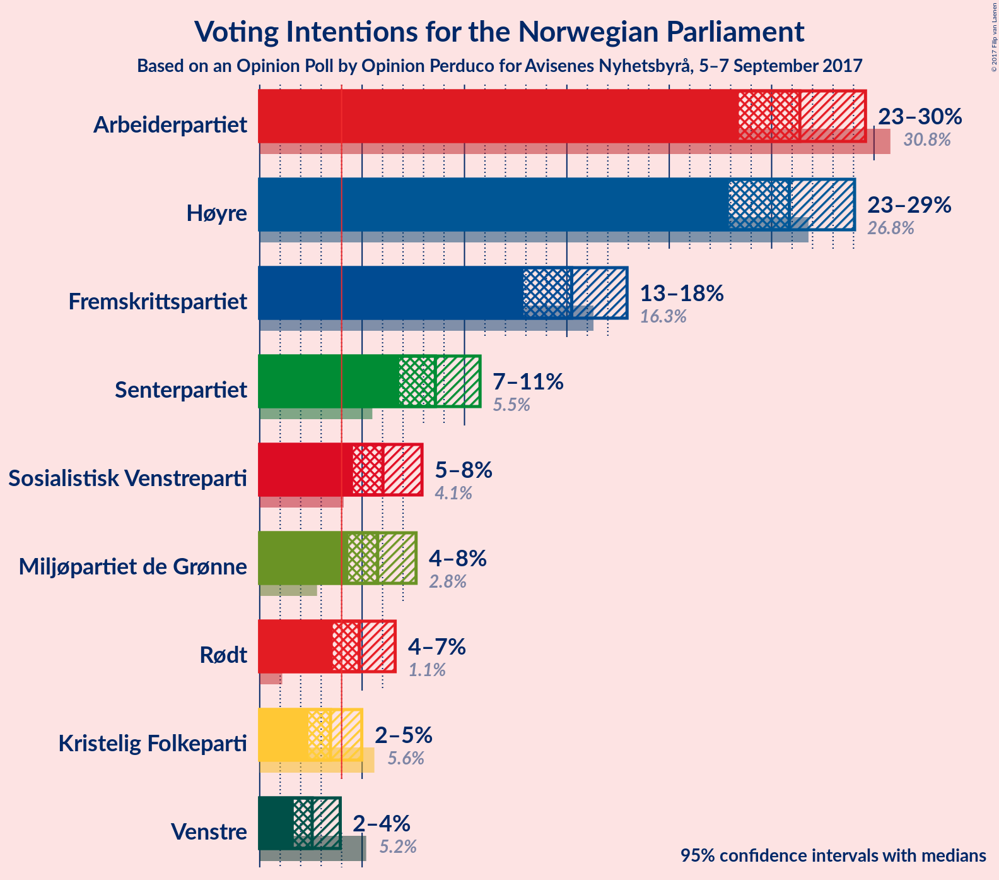
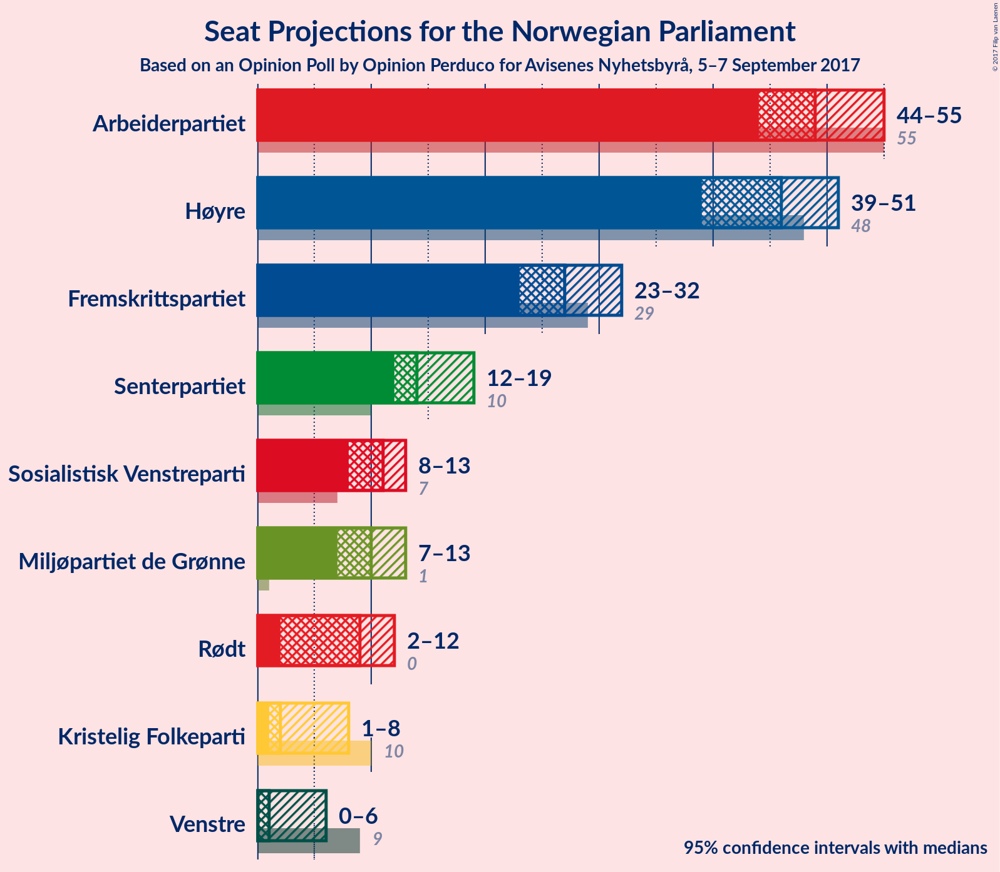
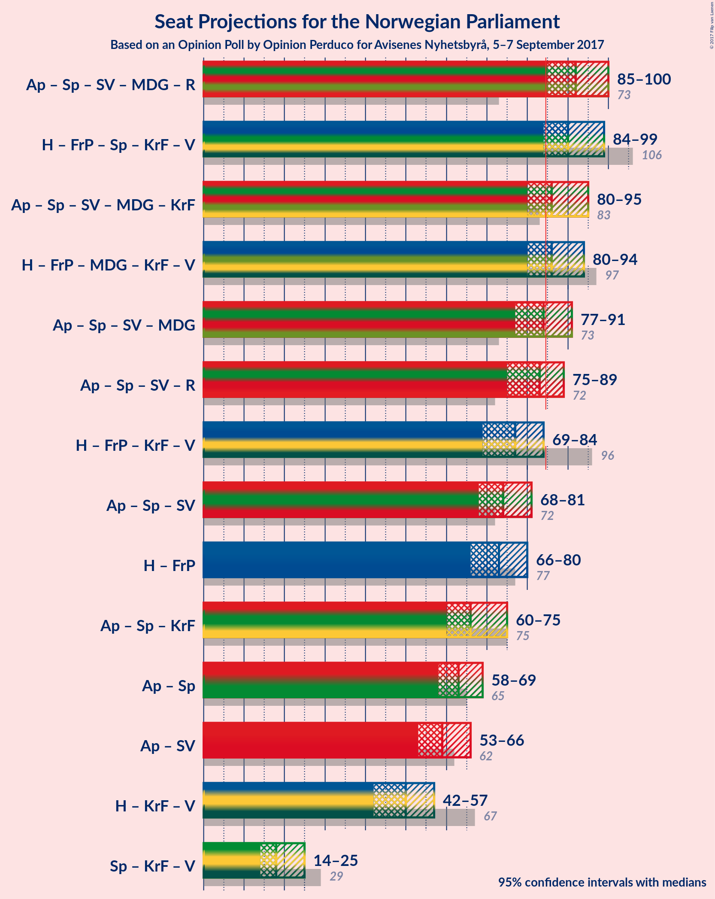

# Opinion Poll by Opinion Perduco for Avisenes Nyhetsbyrå, 5–7 September 2017

<a href="#voting-intentions">Voting Intentions</a> | <a href="#seats">Seats</a> | <a href="#coalitions">Coalitions</a> | <a href="#technical-information">Technical Information</a>

## Voting Intentions

### Confidence Intervals

| Party | Last Result | Poll Result | 80% Confidence Interval | 90% Confidence Interval | 95% Confidence Interval | 99% Confidence Interval |
|:-----:|:-----------:|:-----------:|:-----------------------:|:-----------------------:|:-----------------------:|:-----------------------:|
| Arbeiderpartiet | 30.8% | 26.4% | 24.4–28.5% |23.9–29.1% |23.4–29.6% |22.5–30.6% |
| Høyre | 26.8% | 25.9% | 23.9–28.0% |23.4–28.5% |22.9–29.1% |22.0–30.1% |
| Fremskrittspartiet | 16.3% | 15.2% | 13.7–17.0% |13.3–17.5% |12.9–17.9% |12.2–18.8% |
| Senterpartiet | 5.5% | 8.6% | 7.4–10.0% |7.1–10.4% |6.8–10.8% |6.3–11.5% |
| Sosialistisk Venstreparti | 4.1% | 6.0% | 5.0–7.3% |4.8–7.6% |4.6–7.9% |4.1–8.6% |
| Miljøpartiet de Grønne | 2.8% | 5.8% | 4.8–7.0% |4.6–7.3% |4.3–7.6% |3.9–8.3% |
| Rødt | 1.1% | 4.9% | 4.0–6.0% |3.8–6.3% |3.6–6.6% |3.2–7.2% |
| Kristelig Folkeparti | 5.6% | 3.5% | 2.7–4.5% |2.5–4.7% |2.4–5.0% |2.1–5.5% |
| Venstre | 5.2% | 2.6% | 2.0–3.4% |1.8–3.7% |1.7–3.9% |1.4–4.4% |

*Note:* The poll result column reflects the actual value used in the calculations. Published results may vary slightly, and in addition be rounded to fewer digits.

## Seats

### Confidence Intervals

| Party | Last Result | Median | 80% Confidence Interval | 90% Confidence Interval | 95% Confidence Interval | 99% Confidence Interval |
|:-----:|:-----------:|:------:|:-----------------------:|:-----------------------:|:-----------------------:|:-----------------------:|
| <a href="#arbeiderpartiet">Arbeiderpartiet</a> | 55 | 49 | 46–54 |45–55 |44–55 |42–55 |
| <a href="#høyre">Høyre</a> | 48 | 46 | 40–50 |40–50 |39–51 |37–54 |
| <a href="#fremskrittspartiet">Fremskrittspartiet</a> | 29 | 27 | 24–29 |23–30 |23–32 |22–33 |
| <a href="#senterpartiet">Senterpartiet</a> | 10 | 14 | 13–16 |12–18 |12–19 |11–20 |
| <a href="#sosialistisk-venstreparti">Sosialistisk Venstreparti</a> | 7 | 11 | 8–12 |8–13 |8–13 |7–15 |
| <a href="#miljøpartiet-de-grønne">Miljøpartiet de Grønne</a> | 1 | 10 | 8–11 |7–12 |7–13 |3–14 |
| <a href="#rødt">Rødt</a> | 0 | 9 | 7–10 |2–11 |2–12 |2–13 |
| <a href="#kristelig-folkeparti">Kristelig Folkeparti</a> | 10 | 2 | 1–7 |1–8 |1–8 |0–9 |
| <a href="#venstre">Venstre</a> | 9 | 1 | 0–2 |0–2 |0–6 |0–7 |

### Arbeiderpartiet

*For a full overview of the results for this party, see the [Arbeiderpartiet](party-arbeiderpartiet.html) page.*

| Number of Seats | Probability | Accumulated | Special Marks |
|:---------------:|:-----------:|:-----------:|:-------------:|
| 38 | 0.1% | 100% |  |
| 39 | 0% | 99.9% |  |
| 40 | 0.1% | 99.9% |  |
| 41 | 0.2% | 99.8% |  |
| 42 | 0.6% | 99.6% |  |
| 43 | 1.0% | 99.0% |  |
| 44 | 2% | 98% |  |
| 45 | 5% | 96% |  |
| 46 | 6% | 91% |  |
| 47 | 6% | 85% |  |
| 48 | 26% | 80% |  |
| 49 | 14% | 54% | Median |
| 50 | 3% | 40% |  |
| 51 | 15% | 37% |  |
| 52 | 6% | 22% |  |
| 53 | 5% | 16% |  |
| 54 | 5% | 11% |  |
| 55 | 6% | 6% | Last Result |
| 56 | 0.3% | 0.5% |  |
| 57 | 0.1% | 0.1% |  |
| 58 | 0% | 0% |  |

### Høyre

*For a full overview of the results for this party, see the [Høyre](party-hyre.html) page.*

| Number of Seats | Probability | Accumulated | Special Marks |
|:---------------:|:-----------:|:-----------:|:-------------:|
| 36 | 0.1% | 100% |  |
| 37 | 0.4% | 99.9% |  |
| 38 | 0.8% | 99.5% |  |
| 39 | 2% | 98.7% |  |
| 40 | 7% | 97% |  |
| 41 | 4% | 89% |  |
| 42 | 4% | 86% |  |
| 43 | 4% | 81% |  |
| 44 | 5% | 77% |  |
| 45 | 9% | 72% |  |
| 46 | 23% | 63% | Median |
| 47 | 17% | 41% |  |
| 48 | 4% | 23% | Last Result |
| 49 | 7% | 19% |  |
| 50 | 8% | 12% |  |
| 51 | 2% | 4% |  |
| 52 | 0.7% | 2% |  |
| 53 | 0.6% | 1.2% |  |
| 54 | 0.3% | 0.6% |  |
| 55 | 0.2% | 0.3% |  |
| 56 | 0.1% | 0.1% |  |
| 57 | 0% | 0% |  |

### Fremskrittspartiet

*For a full overview of the results for this party, see the [Fremskrittspartiet](party-fremskrittspartiet.html) page.*

| Number of Seats | Probability | Accumulated | Special Marks |
|:---------------:|:-----------:|:-----------:|:-------------:|
| 20 | 0.1% | 100% |  |
| 21 | 0.2% | 99.8% |  |
| 22 | 1.4% | 99.6% |  |
| 23 | 8% | 98% |  |
| 24 | 5% | 90% |  |
| 25 | 12% | 86% |  |
| 26 | 17% | 74% |  |
| 27 | 28% | 57% | Median |
| 28 | 13% | 29% |  |
| 29 | 8% | 16% | Last Result |
| 30 | 4% | 9% |  |
| 31 | 2% | 5% |  |
| 32 | 2% | 3% |  |
| 33 | 0.6% | 1.0% |  |
| 34 | 0.2% | 0.4% |  |
| 35 | 0.1% | 0.2% |  |
| 36 | 0.1% | 0.2% |  |
| 37 | 0% | 0% |  |

### Senterpartiet

*For a full overview of the results for this party, see the [Senterpartiet](party-senterpartiet.html) page.*

| Number of Seats | Probability | Accumulated | Special Marks |
|:---------------:|:-----------:|:-----------:|:-------------:|
| 10 | 0.4% | 100% | Last Result |
| 11 | 1.2% | 99.5% |  |
| 12 | 6% | 98% |  |
| 13 | 27% | 93% |  |
| 14 | 22% | 65% | Median |
| 15 | 26% | 44% |  |
| 16 | 8% | 18% |  |
| 17 | 4% | 10% |  |
| 18 | 2% | 5% |  |
| 19 | 2% | 4% |  |
| 20 | 0.8% | 1.2% |  |
| 21 | 0.3% | 0.5% |  |
| 22 | 0.1% | 0.1% |  |
| 23 | 0% | 0% |  |

### Sosialistisk Venstreparti

*For a full overview of the results for this party, see the [Sosialistisk Venstreparti](party-sosialistiskvenstreparti.html) page.*

| Number of Seats | Probability | Accumulated | Special Marks |
|:---------------:|:-----------:|:-----------:|:-------------:|
| 2 | 0.1% | 100% |  |
| 3 | 0% | 99.8% |  |
| 4 | 0% | 99.8% |  |
| 5 | 0% | 99.8% |  |
| 6 | 0% | 99.8% |  |
| 7 | 1.3% | 99.8% | Last Result |
| 8 | 10% | 98.5% |  |
| 9 | 9% | 88% |  |
| 10 | 8% | 79% |  |
| 11 | 54% | 71% | Median |
| 12 | 11% | 16% |  |
| 13 | 4% | 6% |  |
| 14 | 1.0% | 2% |  |
| 15 | 0.4% | 0.6% |  |
| 16 | 0.1% | 0.2% |  |
| 17 | 0% | 0% |  |

### Miljøpartiet de Grønne

*For a full overview of the results for this party, see the [Miljøpartiet de Grønne](party-miljpartietdegrnne.html) page.*

| Number of Seats | Probability | Accumulated | Special Marks |
|:---------------:|:-----------:|:-----------:|:-------------:|
| 1 | 0.1% | 100% | Last Result |
| 2 | 0.2% | 99.9% |  |
| 3 | 2% | 99.8% |  |
| 4 | 0% | 98% |  |
| 5 | 0% | 98% |  |
| 6 | 0% | 98% |  |
| 7 | 4% | 98% |  |
| 8 | 4% | 94% |  |
| 9 | 40% | 90% |  |
| 10 | 19% | 50% | Median |
| 11 | 23% | 31% |  |
| 12 | 5% | 8% |  |
| 13 | 3% | 3% |  |
| 14 | 0.6% | 0.8% |  |
| 15 | 0.1% | 0.2% |  |
| 16 | 0.1% | 0.1% |  |
| 17 | 0% | 0% |  |

### Rødt

*For a full overview of the results for this party, see the [Rødt](party-rdt.html) page.*

| Number of Seats | Probability | Accumulated | Special Marks |
|:---------------:|:-----------:|:-----------:|:-------------:|
| 0 | 0% | 100% | Last Result |
| 1 | 0.1% | 100% |  |
| 2 | 5% | 99.9% |  |
| 3 | 0% | 95% |  |
| 4 | 0% | 95% |  |
| 5 | 0% | 95% |  |
| 6 | 0% | 95% |  |
| 7 | 6% | 95% |  |
| 8 | 28% | 88% |  |
| 9 | 37% | 61% | Median |
| 10 | 15% | 24% |  |
| 11 | 6% | 9% |  |
| 12 | 2% | 3% |  |
| 13 | 0.5% | 0.5% |  |
| 14 | 0% | 0% |  |

### Kristelig Folkeparti

*For a full overview of the results for this party, see the [Kristelig Folkeparti](party-kristeligfolkeparti.html) page.*

| Number of Seats | Probability | Accumulated | Special Marks |
|:---------------:|:-----------:|:-----------:|:-------------:|
| 0 | 2% | 100% |  |
| 1 | 10% | 98% |  |
| 2 | 63% | 88% | Median |
| 3 | 5% | 25% |  |
| 4 | 0% | 20% |  |
| 5 | 0% | 20% |  |
| 6 | 0.7% | 20% |  |
| 7 | 14% | 19% |  |
| 8 | 4% | 6% |  |
| 9 | 1.1% | 1.2% |  |
| 10 | 0.1% | 0.1% | Last Result |
| 11 | 0% | 0% |  |

### Venstre

*For a full overview of the results for this party, see the [Venstre](party-venstre.html) page.*

| Number of Seats | Probability | Accumulated | Special Marks |
|:---------------:|:-----------:|:-----------:|:-------------:|
| 0 | 32% | 100% |  |
| 1 | 48% | 68% | Median |
| 2 | 17% | 20% |  |
| 3 | 0.6% | 3% |  |
| 4 | 0% | 3% |  |
| 5 | 0% | 3% |  |
| 6 | 0.9% | 3% |  |
| 7 | 1.4% | 2% |  |
| 8 | 0.3% | 0.4% |  |
| 9 | 0% | 0% | Last Result |

## Coalitions

### Confidence Intervals

| Coalition | Last Result | Median | Majority? | 80% Confidence Interval | 90% Confidence Interval | 95% Confidence Interval | 99% Confidence Interval |
|:---------:|:-----------:|:------:|:---------:|:-----------------------:|:-----------------------:|:-----------------------:|:-----------------------:|
| Arbeiderpartiet – Senterpartiet – Sosialistisk Venstreparti – Miljøpartiet de Grønne – Rødt | 73 | 92 | 98% | 87–97 | 86–98 | 85–100 | 82–101 |
| Høyre – Fremskrittspartiet – Senterpartiet – Kristelig Folkeparti – Venstre | 106 | 90 | 98% | 86–96 | 85–97 | 85–99 | 82–102 |
| Arbeiderpartiet – Senterpartiet – Sosialistisk Venstreparti – Miljøpartiet de Grønne – Kristelig Folkeparti | 83 | 86 | 87% | 84–91 | 82–92 | 80–94 | 78–97 |
| Høyre – Fremskrittspartiet – Miljøpartiet de Grønne – Kristelig Folkeparti – Venstre | 97 | 86 | 72% | 81–91 | 80–92 | 80–94 | 78–97 |
| Arbeiderpartiet – Senterpartiet – Sosialistisk Venstreparti – Miljøpartiet de Grønne | 73 | 84 | 43% | 78–89 | 78–90 | 77–90 | 74–93 |
| Arbeiderpartiet – Senterpartiet – Sosialistisk Venstreparti – Rødt | 72 | 83 | 28% | 78–88 | 77–89 | 75–89 | 72–91 |
| Høyre – Fremskrittspartiet – Kristelig Folkeparti – Venstre | 96 | 77 | 2% | 72–82 | 71–83 | 69–84 | 68–87 |
| Arbeiderpartiet – Senterpartiet – Sosialistisk Venstreparti | 72 | 74 | 0.1% | 69–79 | 69–80 | 68–81 | 65–82 |
| Høyre – Fremskrittspartiet | 77 | 73 | 0.1% | 68–76 | 67–77 | 66–79 | 62–82 |
| Arbeiderpartiet – Senterpartiet – Kristelig Folkeparti | 75 | 66 | 0% | 63–71 | 62–72 | 60–75 | 59–76 |
| Arbeiderpartiet – Senterpartiet | 65 | 63 | 0% | 60–68 | 59–69 | 58–69 | 56–71 |
| Arbeiderpartiet – Sosialistisk Venstreparti | 62 | 60 | 0% | 56–65 | 55–66 | 54–66 | 52–67 |
| Høyre – Kristelig Folkeparti – Venstre | 67 | 50 | 0% | 44–55 | 43–57 | 43–57 | 40–60 |
| Senterpartiet – Kristelig Folkeparti – Venstre | 29 | 17 | 0% | 16–22 | 15–23 | 15–24 | 14–27 |

### Arbeiderpartiet – Senterpartiet – Sosialistisk Venstreparti – Miljøpartiet de Grønne – Rødt

| Number of Seats | Probability | Accumulated | Special Marks |
|:---------------:|:-----------:|:-----------:|:-------------:|
| 73 | 0% | 100% | Last Result |
| 74 | 0% | 100% |  |
| 75 | 0% | 100% |  |
| 76 | 0% | 100% |  |
| 77 | 0% | 100% |  |
| 78 | 0% | 100% |  |
| 79 | 0.1% | 100% |  |
| 80 | 0.1% | 99.9% |  |
| 81 | 0.3% | 99.9% |  |
| 82 | 0.2% | 99.6% |  |
| 83 | 0.3% | 99.3% |  |
| 84 | 0.7% | 99.0% |  |
| 85 | 1.5% | 98% | Majority |
| 86 | 2% | 97% |  |
| 87 | 8% | 94% |  |
| 88 | 3% | 87% |  |
| 89 | 3% | 84% |  |
| 90 | 2% | 81% |  |
| 91 | 7% | 78% |  |
| 92 | 25% | 72% |  |
| 93 | 5% | 47% | Median |
| 94 | 15% | 41% |  |
| 95 | 2% | 26% |  |
| 96 | 3% | 24% |  |
| 97 | 13% | 21% |  |
| 98 | 4% | 8% |  |
| 99 | 0.9% | 4% |  |
| 100 | 2% | 3% |  |
| 101 | 0.5% | 0.9% |  |
| 102 | 0.2% | 0.4% |  |
| 103 | 0.1% | 0.2% |  |
| 104 | 0.1% | 0.1% |  |
| 105 | 0% | 0% |  |

### Høyre – Fremskrittspartiet – Senterpartiet – Kristelig Folkeparti – Venstre

| Number of Seats | Probability | Accumulated | Special Marks |
|:---------------:|:-----------:|:-----------:|:-------------:|
| 81 | 0.1% | 100% |  |
| 82 | 0.5% | 99.9% |  |
| 83 | 0.3% | 99.4% |  |
| 84 | 1.1% | 99.1% |  |
| 85 | 5% | 98% | Majority |
| 86 | 6% | 93% |  |
| 87 | 8% | 87% |  |
| 88 | 3% | 79% |  |
| 89 | 12% | 76% |  |
| 90 | 21% | 64% | Median |
| 91 | 5% | 43% |  |
| 92 | 10% | 38% |  |
| 93 | 6% | 28% |  |
| 94 | 4% | 22% |  |
| 95 | 7% | 18% |  |
| 96 | 3% | 10% |  |
| 97 | 3% | 7% |  |
| 98 | 1.4% | 4% |  |
| 99 | 1.3% | 3% |  |
| 100 | 0.3% | 2% |  |
| 101 | 0.8% | 1.4% |  |
| 102 | 0.4% | 0.6% |  |
| 103 | 0.1% | 0.2% |  |
| 104 | 0% | 0.2% |  |
| 105 | 0% | 0.1% |  |
| 106 | 0.1% | 0.1% | Last Result |
| 107 | 0% | 0% |  |

### Arbeiderpartiet – Senterpartiet – Sosialistisk Venstreparti – Miljøpartiet de Grønne – Kristelig Folkeparti

| Number of Seats | Probability | Accumulated | Special Marks |
|:---------------:|:-----------:|:-----------:|:-------------:|
| 76 | 0.1% | 100% |  |
| 77 | 0.1% | 99.9% |  |
| 78 | 0.5% | 99.7% |  |
| 79 | 0.7% | 99.2% |  |
| 80 | 2% | 98.5% |  |
| 81 | 1.2% | 96% |  |
| 82 | 2% | 95% |  |
| 83 | 3% | 93% | Last Result |
| 84 | 4% | 91% |  |
| 85 | 19% | 87% | Majority |
| 86 | 19% | 68% | Median |
| 87 | 15% | 49% |  |
| 88 | 6% | 34% |  |
| 89 | 5% | 28% |  |
| 90 | 7% | 24% |  |
| 91 | 8% | 17% |  |
| 92 | 4% | 9% |  |
| 93 | 1.2% | 5% |  |
| 94 | 1.3% | 3% |  |
| 95 | 0.6% | 2% |  |
| 96 | 0.2% | 2% |  |
| 97 | 1.2% | 1.3% |  |
| 98 | 0.1% | 0.2% |  |
| 99 | 0.1% | 0.1% |  |
| 100 | 0% | 0% |  |

### Høyre – Fremskrittspartiet – Miljøpartiet de Grønne – Kristelig Folkeparti – Venstre

| Number of Seats | Probability | Accumulated | Special Marks |
|:---------------:|:-----------:|:-----------:|:-------------:|
| 75 | 0% | 100% |  |
| 76 | 0.1% | 99.9% |  |
| 77 | 0.1% | 99.9% |  |
| 78 | 0.4% | 99.7% |  |
| 79 | 1.2% | 99.3% |  |
| 80 | 4% | 98% |  |
| 81 | 5% | 94% |  |
| 82 | 8% | 89% |  |
| 83 | 3% | 81% |  |
| 84 | 5% | 78% |  |
| 85 | 10% | 72% | Majority |
| 86 | 32% | 63% | Median |
| 87 | 3% | 31% |  |
| 88 | 5% | 28% |  |
| 89 | 6% | 23% |  |
| 90 | 3% | 17% |  |
| 91 | 8% | 15% |  |
| 92 | 2% | 7% |  |
| 93 | 2% | 5% |  |
| 94 | 1.1% | 3% |  |
| 95 | 1.0% | 2% |  |
| 96 | 0.3% | 1.0% |  |
| 97 | 0.5% | 0.7% | Last Result |
| 98 | 0.1% | 0.2% |  |
| 99 | 0.1% | 0.1% |  |
| 100 | 0% | 0.1% |  |
| 101 | 0% | 0% |  |

### Arbeiderpartiet – Senterpartiet – Sosialistisk Venstreparti – Miljøpartiet de Grønne

| Number of Seats | Probability | Accumulated | Special Marks |
|:---------------:|:-----------:|:-----------:|:-------------:|
| 72 | 0% | 100% |  |
| 73 | 0.1% | 99.9% | Last Result |
| 74 | 0.4% | 99.8% |  |
| 75 | 0.3% | 99.4% |  |
| 76 | 0.9% | 99.0% |  |
| 77 | 2% | 98% |  |
| 78 | 8% | 97% |  |
| 79 | 2% | 89% |  |
| 80 | 3% | 87% |  |
| 81 | 3% | 84% |  |
| 82 | 7% | 81% |  |
| 83 | 13% | 74% |  |
| 84 | 18% | 61% | Median |
| 85 | 16% | 43% | Majority |
| 86 | 4% | 27% |  |
| 87 | 3% | 23% |  |
| 88 | 7% | 20% |  |
| 89 | 7% | 13% |  |
| 90 | 4% | 6% |  |
| 91 | 0.2% | 2% |  |
| 92 | 2% | 2% |  |
| 93 | 0.2% | 0.5% |  |
| 94 | 0.2% | 0.4% |  |
| 95 | 0.1% | 0.2% |  |
| 96 | 0.1% | 0.1% |  |
| 97 | 0% | 0% |  |

### Arbeiderpartiet – Senterpartiet – Sosialistisk Venstreparti – Rødt

| Number of Seats | Probability | Accumulated | Special Marks |
|:---------------:|:-----------:|:-----------:|:-------------:|
| 69 | 0% | 100% |  |
| 70 | 0.1% | 99.9% |  |
| 71 | 0.1% | 99.9% |  |
| 72 | 0.5% | 99.8% | Last Result |
| 73 | 0.3% | 99.3% |  |
| 74 | 1.0% | 99.0% |  |
| 75 | 1.1% | 98% |  |
| 76 | 2% | 97% |  |
| 77 | 2% | 95% |  |
| 78 | 8% | 93% |  |
| 79 | 3% | 85% |  |
| 80 | 6% | 83% |  |
| 81 | 5% | 77% |  |
| 82 | 3% | 72% |  |
| 83 | 32% | 69% | Median |
| 84 | 10% | 37% |  |
| 85 | 5% | 28% | Majority |
| 86 | 3% | 22% |  |
| 87 | 8% | 19% |  |
| 88 | 5% | 11% |  |
| 89 | 4% | 6% |  |
| 90 | 1.2% | 2% |  |
| 91 | 0.4% | 0.7% |  |
| 92 | 0.1% | 0.3% |  |
| 93 | 0.1% | 0.1% |  |
| 94 | 0% | 0.1% |  |
| 95 | 0% | 0% |  |

### Høyre – Fremskrittspartiet – Kristelig Folkeparti – Venstre

| Number of Seats | Probability | Accumulated | Special Marks |
|:---------------:|:-----------:|:-----------:|:-------------:|
| 65 | 0.1% | 100% |  |
| 66 | 0.1% | 99.9% |  |
| 67 | 0.2% | 99.8% |  |
| 68 | 0.5% | 99.6% |  |
| 69 | 2% | 99.1% |  |
| 70 | 0.9% | 97% |  |
| 71 | 4% | 96% |  |
| 72 | 13% | 92% |  |
| 73 | 3% | 79% |  |
| 74 | 2% | 76% |  |
| 75 | 15% | 74% |  |
| 76 | 5% | 59% | Median |
| 77 | 25% | 53% |  |
| 78 | 7% | 28% |  |
| 79 | 2% | 22% |  |
| 80 | 3% | 19% |  |
| 81 | 3% | 16% |  |
| 82 | 8% | 13% |  |
| 83 | 2% | 6% |  |
| 84 | 1.5% | 3% |  |
| 85 | 0.7% | 2% | Majority |
| 86 | 0.3% | 1.0% |  |
| 87 | 0.2% | 0.7% |  |
| 88 | 0.3% | 0.4% |  |
| 89 | 0.1% | 0.1% |  |
| 90 | 0.1% | 0.1% |  |
| 91 | 0% | 0% |  |
| 92 | 0% | 0% |  |
| 93 | 0% | 0% |  |
| 94 | 0% | 0% |  |
| 95 | 0% | 0% |  |
| 96 | 0% | 0% | Last Result |

### Arbeiderpartiet – Senterpartiet – Sosialistisk Venstreparti

| Number of Seats | Probability | Accumulated | Special Marks |
|:---------------:|:-----------:|:-----------:|:-------------:|
| 63 | 0.1% | 100% |  |
| 64 | 0.1% | 99.9% |  |
| 65 | 0.3% | 99.8% |  |
| 66 | 0.8% | 99.5% |  |
| 67 | 0.6% | 98.6% |  |
| 68 | 2% | 98% |  |
| 69 | 7% | 96% |  |
| 70 | 3% | 89% |  |
| 71 | 4% | 86% |  |
| 72 | 6% | 82% | Last Result |
| 73 | 6% | 76% |  |
| 74 | 26% | 70% | Median |
| 75 | 16% | 44% |  |
| 76 | 6% | 28% |  |
| 77 | 3% | 23% |  |
| 78 | 5% | 19% |  |
| 79 | 7% | 14% |  |
| 80 | 5% | 7% |  |
| 81 | 2% | 3% |  |
| 82 | 0.4% | 0.8% |  |
| 83 | 0.3% | 0.5% |  |
| 84 | 0.1% | 0.2% |  |
| 85 | 0.1% | 0.1% | Majority |
| 86 | 0% | 0% |  |

### Høyre – Fremskrittspartiet

| Number of Seats | Probability | Accumulated | Special Marks |
|:---------------:|:-----------:|:-----------:|:-------------:|
| 62 | 1.1% | 100% |  |
| 63 | 0.2% | 98.9% |  |
| 64 | 0.2% | 98.8% |  |
| 65 | 0.7% | 98.6% |  |
| 66 | 1.0% | 98% |  |
| 67 | 2% | 97% |  |
| 68 | 5% | 95% |  |
| 69 | 8% | 90% |  |
| 70 | 9% | 82% |  |
| 71 | 3% | 73% |  |
| 72 | 17% | 70% |  |
| 73 | 15% | 53% | Median |
| 74 | 23% | 37% |  |
| 75 | 5% | 15% |  |
| 76 | 3% | 10% |  |
| 77 | 2% | 7% | Last Result |
| 78 | 1.4% | 5% |  |
| 79 | 1.2% | 4% |  |
| 80 | 1.1% | 2% |  |
| 81 | 0.4% | 1.2% |  |
| 82 | 0.3% | 0.7% |  |
| 83 | 0.2% | 0.4% |  |
| 84 | 0.2% | 0.2% |  |
| 85 | 0% | 0.1% | Majority |
| 86 | 0% | 0% |  |

### Arbeiderpartiet – Senterpartiet – Kristelig Folkeparti

| Number of Seats | Probability | Accumulated | Special Marks |
|:---------------:|:-----------:|:-----------:|:-------------:|
| 56 | 0.1% | 100% |  |
| 57 | 0.1% | 99.9% |  |
| 58 | 0.2% | 99.8% |  |
| 59 | 0.7% | 99.6% |  |
| 60 | 2% | 99.0% |  |
| 61 | 1.4% | 97% |  |
| 62 | 2% | 96% |  |
| 63 | 6% | 94% |  |
| 64 | 5% | 89% |  |
| 65 | 26% | 84% | Median |
| 66 | 19% | 58% |  |
| 67 | 4% | 39% |  |
| 68 | 8% | 35% |  |
| 69 | 7% | 27% |  |
| 70 | 5% | 19% |  |
| 71 | 8% | 14% |  |
| 72 | 1.3% | 6% |  |
| 73 | 0.7% | 5% |  |
| 74 | 0.9% | 4% |  |
| 75 | 2% | 3% | Last Result |
| 76 | 1.1% | 1.4% |  |
| 77 | 0.2% | 0.3% |  |
| 78 | 0% | 0.1% |  |
| 79 | 0% | 0.1% |  |
| 80 | 0% | 0% |  |

### Arbeiderpartiet – Senterpartiet

| Number of Seats | Probability | Accumulated | Special Marks |
|:---------------:|:-----------:|:-----------:|:-------------:|
| 54 | 0.1% | 100% |  |
| 55 | 0.2% | 99.9% |  |
| 56 | 0.6% | 99.7% |  |
| 57 | 2% | 99.1% |  |
| 58 | 2% | 98% |  |
| 59 | 3% | 95% |  |
| 60 | 3% | 92% |  |
| 61 | 10% | 89% |  |
| 62 | 5% | 79% |  |
| 63 | 27% | 74% | Median |
| 64 | 18% | 46% |  |
| 65 | 4% | 28% | Last Result |
| 66 | 3% | 24% |  |
| 67 | 5% | 21% |  |
| 68 | 6% | 16% |  |
| 69 | 8% | 10% |  |
| 70 | 0.6% | 1.4% |  |
| 71 | 0.4% | 0.7% |  |
| 72 | 0.2% | 0.3% |  |
| 73 | 0.1% | 0.2% |  |
| 74 | 0% | 0.1% |  |
| 75 | 0% | 0% |  |

### Arbeiderpartiet – Sosialistisk Venstreparti

| Number of Seats | Probability | Accumulated | Special Marks |
|:---------------:|:-----------:|:-----------:|:-------------:|
| 48 | 0.1% | 100% |  |
| 49 | 0.1% | 99.9% |  |
| 50 | 0.1% | 99.8% |  |
| 51 | 0.1% | 99.7% |  |
| 52 | 0.7% | 99.6% |  |
| 53 | 1.0% | 99.0% |  |
| 54 | 2% | 98% |  |
| 55 | 3% | 96% |  |
| 56 | 10% | 93% |  |
| 57 | 5% | 83% |  |
| 58 | 7% | 77% |  |
| 59 | 18% | 70% |  |
| 60 | 12% | 52% | Median |
| 61 | 3% | 40% |  |
| 62 | 15% | 36% | Last Result |
| 63 | 9% | 22% |  |
| 64 | 3% | 13% |  |
| 65 | 2% | 10% |  |
| 66 | 7% | 8% |  |
| 67 | 0.5% | 0.9% |  |
| 68 | 0.3% | 0.4% |  |
| 69 | 0.1% | 0.1% |  |
| 70 | 0% | 0% |  |

### Høyre – Kristelig Folkeparti – Venstre

| Number of Seats | Probability | Accumulated | Special Marks |
|:---------------:|:-----------:|:-----------:|:-------------:|
| 39 | 0.2% | 100% |  |
| 40 | 0.4% | 99.8% |  |
| 41 | 0.5% | 99.5% |  |
| 42 | 0.3% | 98.9% |  |
| 43 | 8% | 98.7% |  |
| 44 | 3% | 91% |  |
| 45 | 3% | 87% |  |
| 46 | 4% | 84% |  |
| 47 | 7% | 80% |  |
| 48 | 4% | 73% |  |
| 49 | 14% | 69% | Median |
| 50 | 24% | 55% |  |
| 51 | 2% | 31% |  |
| 52 | 8% | 29% |  |
| 53 | 3% | 20% |  |
| 54 | 5% | 17% |  |
| 55 | 3% | 13% |  |
| 56 | 1.3% | 9% |  |
| 57 | 6% | 8% |  |
| 58 | 1.0% | 2% |  |
| 59 | 0.3% | 1.0% |  |
| 60 | 0.4% | 0.7% |  |
| 61 | 0.1% | 0.3% |  |
| 62 | 0.1% | 0.1% |  |
| 63 | 0% | 0% |  |
| 64 | 0% | 0% |  |
| 65 | 0% | 0% |  |
| 66 | 0% | 0% |  |
| 67 | 0% | 0% | Last Result |

### Senterpartiet – Kristelig Folkeparti – Venstre

| Number of Seats | Probability | Accumulated | Special Marks |
|:---------------:|:-----------:|:-----------:|:-------------:|
| 11 | 0.1% | 100% |  |
| 12 | 0.1% | 99.9% |  |
| 13 | 0.3% | 99.9% |  |
| 14 | 2% | 99.6% |  |
| 15 | 4% | 98% |  |
| 16 | 16% | 94% |  |
| 17 | 31% | 78% | Median |
| 18 | 5% | 47% |  |
| 19 | 14% | 42% |  |
| 20 | 3% | 28% |  |
| 21 | 14% | 25% |  |
| 22 | 4% | 11% |  |
| 23 | 2% | 7% |  |
| 24 | 2% | 4% |  |
| 25 | 1.0% | 2% |  |
| 26 | 0.5% | 1.1% |  |
| 27 | 0.2% | 0.6% |  |
| 28 | 0.1% | 0.3% |  |
| 29 | 0.1% | 0.2% | Last Result |
| 30 | 0% | 0.1% |  |
| 31 | 0% | 0.1% |  |
| 32 | 0% | 0.1% |  |
| 33 | 0% | 0% |  |

## Technical Information

### Opinion Poll

+ **Pollster:** Opinion Perduco
+ **Media:** Avisenes Nyhetsbyrå
+ **Fieldwork period:** 5–7 September 2017

### Calculations

+ **Sample size:** 781
+ **Simulations done:** 1,048,576
+ **Error estimate:** 1.34%

