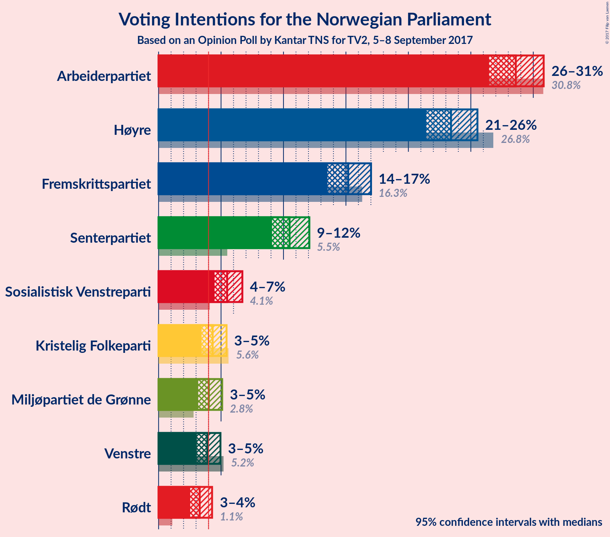
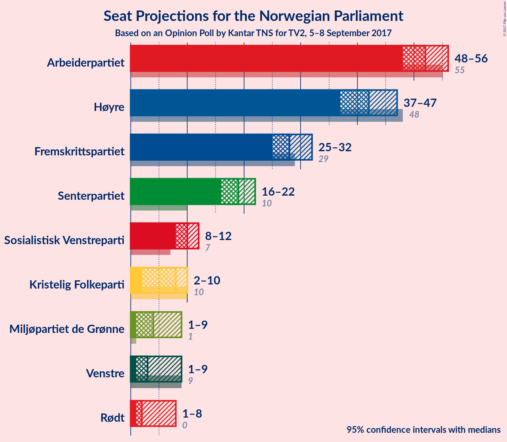

# Opinion Poll by Kantar TNS for TV2, 5–8 September 2017

<a href="#voting-intentions">Voting Intentions</a> | <a href="#seats">Seats</a> | <a href="#coalitions">Coalitions</a> | <a href="#technical-information">Technical Information</a>

## Voting Intentions

### Confidence Intervals

| Party | Last Result | Poll Result | 80% Confidence Interval | 90% Confidence Interval | 95% Confidence Interval | 99% Confidence Interval |
|:-----:|:-----------:|:-----------:|:-----------------------:|:-----------------------:|:-----------------------:|:-----------------------:|
| Arbeiderpartiet | 30.8% | 28.6% | 27.2–30.1% |26.8–30.5% |26.5–30.8% |25.8–31.6% |
| Høyre | 26.8% | 23.4% | 22.1–24.8% |21.7–25.2% |21.4–25.5% |20.8–26.2% |
| Fremskrittspartiet | 16.3% | 15.2% | 14.1–16.4% |13.8–16.7% |13.5–17.0% |13.0–17.6% |
| Senterpartiet | 5.5% | 10.5% | 9.6–11.5% |9.3–11.8% |9.1–12.1% |8.7–12.6% |
| Sosialistisk Venstreparti | 4.1% | 5.5% | 4.8–6.3% |4.6–6.5% |4.5–6.7% |4.2–7.1% |
| Kristelig Folkeparti | 5.6% | 4.3% | 3.7–5.0% |3.6–5.3% |3.4–5.4% |3.2–5.8% |
| Miljøpartiet de Grønne | 2.8% | 4.0% | 3.5–4.7% |3.3–4.9% |3.2–5.1% |2.9–5.4% |
| Venstre | 5.2% | 3.9% | 3.4–4.6% |3.2–4.8% |3.1–5.0% |2.8–5.3% |
| Rødt | 1.1% | 3.3% | 2.8–3.9% |2.7–4.1% |2.5–4.3% |2.3–4.6% |

*Note:* The poll result column reflects the actual value used in the calculations. Published results may vary slightly, and in addition be rounded to fewer digits.

## Seats

### Confidence Intervals

| Party | Last Result | Median | 80% Confidence Interval | 90% Confidence Interval | 95% Confidence Interval | 99% Confidence Interval |
|:-----:|:-----------:|:------:|:-----------------------:|:-----------------------:|:-----------------------:|:-----------------------:|
| <a href="#arbeiderpartiet">Arbeiderpartiet</a> | 55 | 51 | 49–54 |49–55 |48–56 |47–58 |
| <a href="#høyre">Høyre</a> | 48 | 42 | 39–46 |38–46 |38–47 |36–48 |
| <a href="#fremskrittspartiet">Fremskrittspartiet</a> | 29 | 28 | 26–29 |26–30 |25–31 |24–32 |
| <a href="#senterpartiet">Senterpartiet</a> | 10 | 19 | 17–21 |16–21 |15–22 |15–23 |
| <a href="#sosialistisk-venstreparti">Sosialistisk Venstreparti</a> | 7 | 10 | 9–11 |8–12 |8–12 |7–13 |
| <a href="#kristelig-folkeparti">Kristelig Folkeparti</a> | 10 | 8 | 2–9 |2–10 |2–10 |2–11 |
| <a href="#miljøpartiet-de-grønne">Miljøpartiet de Grønne</a> | 1 | 3 | 1–8 |1–8 |1–9 |1–10 |
| <a href="#venstre">Venstre</a> | 9 | 3 | 1–8 |1–8 |1–9 |1–9 |
| <a href="#rødt">Rødt</a> | 0 | 2 | 2 |2–7 |1–7 |1–8 |

### Arbeiderpartiet

*For a full overview of the results for this party, see the [Arbeiderpartiet](party-arbeiderpartiet.html) page.*

| Number of Seats | Probability | Accumulated | Special Marks |
|:---------------:|:-----------:|:-----------:|:-------------:|
| 45 | 0.1% | 100% |  |
| 46 | 0.2% | 99.9% |  |
| 47 | 0.8% | 99.8% |  |
| 48 | 3% | 99.0% |  |
| 49 | 8% | 96% |  |
| 50 | 16% | 89% |  |
| 51 | 29% | 73% | Median |
| 52 | 6% | 44% |  |
| 53 | 5% | 38% |  |
| 54 | 25% | 33% |  |
| 55 | 3% | 8% | Last Result |
| 56 | 2% | 4% |  |
| 57 | 1.0% | 2% |  |
| 58 | 0.6% | 1.0% |  |
| 59 | 0.1% | 0.5% |  |
| 60 | 0% | 0.3% |  |
| 61 | 0.3% | 0.3% |  |
| 62 | 0% | 0% |  |

### Høyre

*For a full overview of the results for this party, see the [Høyre](party-hyre.html) page.*

| Number of Seats | Probability | Accumulated | Special Marks |
|:---------------:|:-----------:|:-----------:|:-------------:|
| 35 | 0.1% | 100% |  |
| 36 | 0.8% | 99.9% |  |
| 37 | 1.1% | 99.1% |  |
| 38 | 7% | 98% |  |
| 39 | 9% | 91% |  |
| 40 | 5% | 82% |  |
| 41 | 23% | 77% |  |
| 42 | 21% | 53% | Median |
| 43 | 9% | 32% |  |
| 44 | 10% | 24% |  |
| 45 | 3% | 13% |  |
| 46 | 6% | 10% |  |
| 47 | 2% | 4% |  |
| 48 | 2% | 2% | Last Result |
| 49 | 0.2% | 0.2% |  |
| 50 | 0% | 0% |  |

### Fremskrittspartiet

*For a full overview of the results for this party, see the [Fremskrittspartiet](party-fremskrittspartiet.html) page.*

| Number of Seats | Probability | Accumulated | Special Marks |
|:---------------:|:-----------:|:-----------:|:-------------:|
| 22 | 0.1% | 100% |  |
| 23 | 0.3% | 99.9% |  |
| 24 | 1.0% | 99.6% |  |
| 25 | 3% | 98.5% |  |
| 26 | 7% | 96% |  |
| 27 | 10% | 89% |  |
| 28 | 48% | 79% | Median |
| 29 | 24% | 31% | Last Result |
| 30 | 2% | 6% |  |
| 31 | 2% | 4% |  |
| 32 | 1.1% | 1.5% |  |
| 33 | 0.2% | 0.3% |  |
| 34 | 0.1% | 0.1% |  |
| 35 | 0% | 0% |  |

### Senterpartiet

*For a full overview of the results for this party, see the [Senterpartiet](party-senterpartiet.html) page.*

| Number of Seats | Probability | Accumulated | Special Marks |
|:---------------:|:-----------:|:-----------:|:-------------:|
| 10 | 0% | 100% | Last Result |
| 11 | 0% | 100% |  |
| 12 | 0% | 100% |  |
| 13 | 0% | 100% |  |
| 14 | 0.1% | 100% |  |
| 15 | 3% | 99.8% |  |
| 16 | 5% | 97% |  |
| 17 | 8% | 92% |  |
| 18 | 15% | 84% |  |
| 19 | 24% | 69% | Median |
| 20 | 22% | 46% |  |
| 21 | 20% | 24% |  |
| 22 | 2% | 4% |  |
| 23 | 2% | 2% |  |
| 24 | 0.1% | 0.1% |  |
| 25 | 0% | 0% |  |

### Sosialistisk Venstreparti

*For a full overview of the results for this party, see the [Sosialistisk Venstreparti](party-sosialistiskvenstreparti.html) page.*

| Number of Seats | Probability | Accumulated | Special Marks |
|:---------------:|:-----------:|:-----------:|:-------------:|
| 2 | 0.1% | 100% |  |
| 3 | 0% | 99.9% |  |
| 4 | 0% | 99.9% |  |
| 5 | 0% | 99.9% |  |
| 6 | 0% | 99.9% |  |
| 7 | 1.3% | 99.9% | Last Result |
| 8 | 8% | 98.5% |  |
| 9 | 28% | 90% |  |
| 10 | 44% | 62% | Median |
| 11 | 12% | 19% |  |
| 12 | 4% | 7% |  |
| 13 | 2% | 2% |  |
| 14 | 0.2% | 0.2% |  |
| 15 | 0% | 0% |  |

### Kristelig Folkeparti

*For a full overview of the results for this party, see the [Kristelig Folkeparti](party-kristeligfolkeparti.html) page.*

| Number of Seats | Probability | Accumulated | Special Marks |
|:---------------:|:-----------:|:-----------:|:-------------:|
| 1 | 0.3% | 100% |  |
| 2 | 23% | 99.7% |  |
| 3 | 0.9% | 77% |  |
| 4 | 0% | 76% |  |
| 5 | 0% | 76% |  |
| 6 | 0% | 76% |  |
| 7 | 8% | 76% |  |
| 8 | 46% | 68% | Median |
| 9 | 17% | 22% |  |
| 10 | 5% | 5% | Last Result |
| 11 | 0.5% | 0.5% |  |
| 12 | 0% | 0% |  |

### Miljøpartiet de Grønne

*For a full overview of the results for this party, see the [Miljøpartiet de Grønne](party-miljpartietdegrnne.html) page.*

| Number of Seats | Probability | Accumulated | Special Marks |
|:---------------:|:-----------:|:-----------:|:-------------:|
| 1 | 25% | 100% | Last Result |
| 2 | 9% | 75% |  |
| 3 | 21% | 67% | Median |
| 4 | 1.3% | 46% |  |
| 5 | 0% | 44% |  |
| 6 | 0% | 44% |  |
| 7 | 9% | 44% |  |
| 8 | 30% | 35% |  |
| 9 | 4% | 5% |  |
| 10 | 0.5% | 0.5% |  |
| 11 | 0.1% | 0.1% |  |
| 12 | 0% | 0% |  |

### Venstre

*For a full overview of the results for this party, see the [Venstre](party-venstre.html) page.*

| Number of Seats | Probability | Accumulated | Special Marks |
|:---------------:|:-----------:|:-----------:|:-------------:|
| 1 | 20% | 100% |  |
| 2 | 21% | 80% |  |
| 3 | 13% | 59% | Median |
| 4 | 0% | 46% |  |
| 5 | 0% | 46% |  |
| 6 | 0.3% | 46% |  |
| 7 | 15% | 46% |  |
| 8 | 28% | 31% |  |
| 9 | 3% | 3% | Last Result |
| 10 | 0.2% | 0.3% |  |
| 11 | 0% | 0% |  |

### Rødt

*For a full overview of the results for this party, see the [Rødt](party-rdt.html) page.*

| Number of Seats | Probability | Accumulated | Special Marks |
|:---------------:|:-----------:|:-----------:|:-------------:|
| 0 | 0% | 100% | Last Result |
| 1 | 5% | 100% |  |
| 2 | 88% | 95% | Median |
| 3 | 0% | 7% |  |
| 4 | 0% | 7% |  |
| 5 | 0% | 7% |  |
| 6 | 0.2% | 7% |  |
| 7 | 5% | 7% |  |
| 8 | 2% | 2% |  |
| 9 | 0.1% | 0.1% |  |
| 10 | 0% | 0% |  |

## Coalitions

### Confidence Intervals

| Coalition | Last Result | Median | Majority? | 80% Confidence Interval | 90% Confidence Interval | 95% Confidence Interval | 99% Confidence Interval |
|:---------:|:-----------:|:------:|:---------:|:-----------------------:|:-----------------------:|:-----------------------:|:-----------------------:|
| Høyre – Fremskrittspartiet – Senterpartiet – Kristelig Folkeparti – Venstre | 106 | 100 | 100% | 96–106 | 95–106 | 93–106 | 92–107 |
| Arbeiderpartiet – Senterpartiet – Sosialistisk Venstreparti – Kristelig Folkeparti – Miljøpartiet de Grønne | 83 | 93 | 99.4% | 89–96 | 87–97 | 87–98 | 84–100 |
| Arbeiderpartiet – Senterpartiet – Sosialistisk Venstreparti – Miljøpartiet de Grønne – Rødt | 73 | 88 | 74% | 83–93 | 82–93 | 82–94 | 82–97 |
| Arbeiderpartiet – Senterpartiet – Sosialistisk Venstreparti – Miljøpartiet de Grønne | 73 | 86 | 61% | 80–91 | 80–91 | 80–92 | 78–94 |
| Høyre – Fremskrittspartiet – Kristelig Folkeparti – Miljøpartiet de Grønne – Venstre | 97 | 86 | 62% | 82–89 | 82–91 | 80–91 | 77–93 |
| Arbeiderpartiet – Senterpartiet – Sosialistisk Venstreparti – Rødt | 72 | 83 | 38% | 80–87 | 78–87 | 78–89 | 76–92 |
| Arbeiderpartiet – Senterpartiet – Sosialistisk Venstreparti | 72 | 80 | 18% | 78–85 | 77–85 | 76–87 | 72–90 |
| Høyre – Fremskrittspartiet – Kristelig Folkeparti – Venstre | 96 | 81 | 26% | 76–86 | 76–87 | 75–87 | 72–87 |
| Arbeiderpartiet – Senterpartiet – Kristelig Folkeparti | 75 | 78 | 0.5% | 73–83 | 71–83 | 71–83 | 69–85 |
| Høyre – Fremskrittspartiet | 77 | 70 | 0% | 66–74 | 66–75 | 65–76 | 63–79 |
| Arbeiderpartiet – Senterpartiet | 65 | 71 | 0% | 68–75 | 67–75 | 66–75 | 64–79 |
| Arbeiderpartiet – Sosialistisk Venstreparti | 62 | 61 | 0% | 59–65 | 58–66 | 57–67 | 56–69 |
| Høyre – Kristelig Folkeparti – Venstre | 67 | 53 | 0% | 48–58 | 48–59 | 48–59 | 45–60 |
| Senterpartiet – Kristelig Folkeparti – Venstre | 29 | 31 | 0% | 24–36 | 24–36 | 22–36 | 21–38 |

### Høyre – Fremskrittspartiet – Senterpartiet – Kristelig Folkeparti – Venstre

| Number of Seats | Probability | Accumulated | Special Marks |
|:---------------:|:-----------:|:-----------:|:-------------:|
| 89 | 0.1% | 100% |  |
| 90 | 0.1% | 99.9% |  |
| 91 | 0.2% | 99.8% |  |
| 92 | 0.8% | 99.6% |  |
| 93 | 2% | 98.8% |  |
| 94 | 1.2% | 97% |  |
| 95 | 4% | 95% |  |
| 96 | 7% | 91% |  |
| 97 | 5% | 84% |  |
| 98 | 6% | 79% |  |
| 99 | 13% | 73% |  |
| 100 | 17% | 60% | Median |
| 101 | 8% | 43% |  |
| 102 | 10% | 35% |  |
| 103 | 4% | 25% |  |
| 104 | 0.8% | 22% |  |
| 105 | 4% | 21% |  |
| 106 | 16% | 17% | Last Result |
| 107 | 0.2% | 0.5% |  |
| 108 | 0.1% | 0.3% |  |
| 109 | 0.2% | 0.2% |  |
| 110 | 0% | 0% |  |

### Arbeiderpartiet – Senterpartiet – Sosialistisk Venstreparti – Kristelig Folkeparti – Miljøpartiet de Grønne

| Number of Seats | Probability | Accumulated | Special Marks |
|:---------------:|:-----------:|:-----------:|:-------------:|
| 82 | 0.2% | 100% |  |
| 83 | 0% | 99.8% | Last Result |
| 84 | 0.4% | 99.8% |  |
| 85 | 0.2% | 99.4% | Majority |
| 86 | 1.3% | 99.2% |  |
| 87 | 6% | 98% |  |
| 88 | 0.9% | 92% |  |
| 89 | 24% | 91% |  |
| 90 | 7% | 67% |  |
| 91 | 5% | 61% | Median |
| 92 | 4% | 56% |  |
| 93 | 11% | 52% |  |
| 94 | 11% | 41% |  |
| 95 | 5% | 29% |  |
| 96 | 16% | 24% |  |
| 97 | 4% | 7% |  |
| 98 | 2% | 3% |  |
| 99 | 0.5% | 1.1% |  |
| 100 | 0.5% | 0.6% |  |
| 101 | 0.1% | 0.1% |  |
| 102 | 0% | 0.1% |  |
| 103 | 0% | 0% |  |

### Arbeiderpartiet – Senterpartiet – Sosialistisk Venstreparti – Miljøpartiet de Grønne – Rødt

| Number of Seats | Probability | Accumulated | Special Marks |
|:---------------:|:-----------:|:-----------:|:-------------:|
| 73 | 0% | 100% | Last Result |
| 74 | 0% | 100% |  |
| 75 | 0% | 100% |  |
| 76 | 0% | 100% |  |
| 77 | 0% | 100% |  |
| 78 | 0% | 100% |  |
| 79 | 0% | 100% |  |
| 80 | 0.1% | 99.9% |  |
| 81 | 0.1% | 99.8% |  |
| 82 | 10% | 99.7% |  |
| 83 | 10% | 90% |  |
| 84 | 6% | 80% |  |
| 85 | 2% | 74% | Median, Majority |
| 86 | 7% | 72% |  |
| 87 | 7% | 65% |  |
| 88 | 11% | 58% |  |
| 89 | 9% | 47% |  |
| 90 | 16% | 38% |  |
| 91 | 9% | 22% |  |
| 92 | 2% | 13% |  |
| 93 | 7% | 11% |  |
| 94 | 3% | 4% |  |
| 95 | 0.2% | 1.2% |  |
| 96 | 0.4% | 0.9% |  |
| 97 | 0.1% | 0.6% |  |
| 98 | 0.2% | 0.4% |  |
| 99 | 0.2% | 0.3% |  |
| 100 | 0% | 0% |  |

### Arbeiderpartiet – Senterpartiet – Sosialistisk Venstreparti – Miljøpartiet de Grønne

| Number of Seats | Probability | Accumulated | Special Marks |
|:---------------:|:-----------:|:-----------:|:-------------:|
| 73 | 0% | 100% | Last Result |
| 74 | 0% | 100% |  |
| 75 | 0% | 100% |  |
| 76 | 0% | 100% |  |
| 77 | 0.1% | 99.9% |  |
| 78 | 0.4% | 99.8% |  |
| 79 | 0.4% | 99.4% |  |
| 80 | 13% | 99.0% |  |
| 81 | 10% | 86% |  |
| 82 | 6% | 76% |  |
| 83 | 2% | 70% | Median |
| 84 | 6% | 68% |  |
| 85 | 4% | 61% | Majority |
| 86 | 12% | 57% |  |
| 87 | 8% | 45% |  |
| 88 | 16% | 37% |  |
| 89 | 9% | 21% |  |
| 90 | 1.3% | 12% |  |
| 91 | 7% | 10% |  |
| 92 | 2% | 3% |  |
| 93 | 0.3% | 1.0% |  |
| 94 | 0.3% | 0.7% |  |
| 95 | 0.1% | 0.3% |  |
| 96 | 0% | 0.2% |  |
| 97 | 0.2% | 0.2% |  |
| 98 | 0% | 0% |  |

### Høyre – Fremskrittspartiet – Kristelig Folkeparti – Miljøpartiet de Grønne – Venstre

| Number of Seats | Probability | Accumulated | Special Marks |
|:---------------:|:-----------:|:-----------:|:-------------:|
| 76 | 0.4% | 100% |  |
| 77 | 0.2% | 99.5% |  |
| 78 | 0.6% | 99.4% |  |
| 79 | 0.6% | 98.8% |  |
| 80 | 2% | 98% |  |
| 81 | 1.4% | 97% |  |
| 82 | 15% | 95% |  |
| 83 | 9% | 80% |  |
| 84 | 9% | 72% | Median |
| 85 | 7% | 62% | Majority |
| 86 | 6% | 56% |  |
| 87 | 12% | 49% |  |
| 88 | 17% | 38% |  |
| 89 | 12% | 21% |  |
| 90 | 3% | 9% |  |
| 91 | 4% | 6% |  |
| 92 | 1.0% | 2% |  |
| 93 | 0.4% | 0.8% |  |
| 94 | 0.1% | 0.4% |  |
| 95 | 0.3% | 0.3% |  |
| 96 | 0% | 0% |  |
| 97 | 0% | 0% | Last Result |

### Arbeiderpartiet – Senterpartiet – Sosialistisk Venstreparti – Rødt

| Number of Seats | Probability | Accumulated | Special Marks |
|:---------------:|:-----------:|:-----------:|:-------------:|
| 72 | 0% | 100% | Last Result |
| 73 | 0% | 100% |  |
| 74 | 0.3% | 100% |  |
| 75 | 0.1% | 99.7% |  |
| 76 | 0.4% | 99.6% |  |
| 77 | 1.0% | 99.2% |  |
| 78 | 4% | 98% |  |
| 79 | 3% | 94% |  |
| 80 | 12% | 91% |  |
| 81 | 17% | 79% |  |
| 82 | 12% | 62% | Median |
| 83 | 6% | 51% |  |
| 84 | 7% | 44% |  |
| 85 | 9% | 38% | Majority |
| 86 | 9% | 28% |  |
| 87 | 15% | 20% |  |
| 88 | 1.4% | 5% |  |
| 89 | 2% | 3% |  |
| 90 | 0.6% | 2% |  |
| 91 | 0.6% | 1.2% |  |
| 92 | 0.2% | 0.6% |  |
| 93 | 0.4% | 0.5% |  |
| 94 | 0% | 0% |  |

### Arbeiderpartiet – Senterpartiet – Sosialistisk Venstreparti

| Number of Seats | Probability | Accumulated | Special Marks |
|:---------------:|:-----------:|:-----------:|:-------------:|
| 71 | 0.2% | 100% |  |
| 72 | 0.3% | 99.8% | Last Result |
| 73 | 0.1% | 99.5% |  |
| 74 | 0.5% | 99.4% |  |
| 75 | 0.8% | 98.9% |  |
| 76 | 3% | 98% |  |
| 77 | 5% | 95% |  |
| 78 | 13% | 90% |  |
| 79 | 21% | 78% |  |
| 80 | 11% | 57% | Median |
| 81 | 7% | 46% |  |
| 82 | 7% | 39% |  |
| 83 | 9% | 32% |  |
| 84 | 5% | 23% |  |
| 85 | 15% | 18% | Majority |
| 86 | 0.9% | 3% |  |
| 87 | 1.4% | 3% |  |
| 88 | 0.2% | 1.2% |  |
| 89 | 0.4% | 0.9% |  |
| 90 | 0.1% | 0.5% |  |
| 91 | 0.4% | 0.4% |  |
| 92 | 0% | 0% |  |

### Høyre – Fremskrittspartiet – Kristelig Folkeparti – Venstre

| Number of Seats | Probability | Accumulated | Special Marks |
|:---------------:|:-----------:|:-----------:|:-------------:|
| 70 | 0.2% | 100% |  |
| 71 | 0.2% | 99.7% |  |
| 72 | 0.1% | 99.6% |  |
| 73 | 0.4% | 99.4% |  |
| 74 | 0.2% | 99.1% |  |
| 75 | 3% | 98.8% |  |
| 76 | 7% | 96% |  |
| 77 | 2% | 89% |  |
| 78 | 9% | 87% |  |
| 79 | 16% | 78% |  |
| 80 | 9% | 62% |  |
| 81 | 11% | 53% | Median |
| 82 | 7% | 42% |  |
| 83 | 7% | 35% |  |
| 84 | 2% | 28% |  |
| 85 | 6% | 26% | Majority |
| 86 | 10% | 20% |  |
| 87 | 10% | 10% |  |
| 88 | 0.1% | 0.3% |  |
| 89 | 0.1% | 0.2% |  |
| 90 | 0% | 0.1% |  |
| 91 | 0% | 0% |  |
| 92 | 0% | 0% |  |
| 93 | 0% | 0% |  |
| 94 | 0% | 0% |  |
| 95 | 0% | 0% |  |
| 96 | 0% | 0% | Last Result |

### Arbeiderpartiet – Senterpartiet – Kristelig Folkeparti

| Number of Seats | Probability | Accumulated | Special Marks |
|:---------------:|:-----------:|:-----------:|:-------------:|
| 68 | 0.1% | 100% |  |
| 69 | 0.5% | 99.9% |  |
| 70 | 1.0% | 99.4% |  |
| 71 | 5% | 98% |  |
| 72 | 2% | 94% |  |
| 73 | 3% | 92% |  |
| 74 | 2% | 88% |  |
| 75 | 9% | 87% | Last Result |
| 76 | 13% | 78% |  |
| 77 | 14% | 65% |  |
| 78 | 11% | 51% | Median |
| 79 | 11% | 40% |  |
| 80 | 7% | 29% |  |
| 81 | 2% | 22% |  |
| 82 | 3% | 20% |  |
| 83 | 16% | 17% |  |
| 84 | 0.2% | 0.7% |  |
| 85 | 0.3% | 0.5% | Majority |
| 86 | 0.1% | 0.2% |  |
| 87 | 0.1% | 0.2% |  |
| 88 | 0% | 0% |  |

### Høyre – Fremskrittspartiet

| Number of Seats | Probability | Accumulated | Special Marks |
|:---------------:|:-----------:|:-----------:|:-------------:|
| 61 | 0.1% | 100% |  |
| 62 | 0.3% | 99.9% |  |
| 63 | 0.3% | 99.6% |  |
| 64 | 0.9% | 99.2% |  |
| 65 | 3% | 98% |  |
| 66 | 7% | 95% |  |
| 67 | 8% | 88% |  |
| 68 | 5% | 80% |  |
| 69 | 13% | 75% |  |
| 70 | 31% | 62% | Median |
| 71 | 9% | 31% |  |
| 72 | 10% | 22% |  |
| 73 | 2% | 12% |  |
| 74 | 1.0% | 11% |  |
| 75 | 7% | 10% |  |
| 76 | 1.2% | 3% |  |
| 77 | 0.2% | 2% | Last Result |
| 78 | 0.2% | 1.3% |  |
| 79 | 1.1% | 1.1% |  |
| 80 | 0% | 0% |  |

### Arbeiderpartiet – Senterpartiet

| Number of Seats | Probability | Accumulated | Special Marks |
|:---------------:|:-----------:|:-----------:|:-------------:|
| 63 | 0.2% | 100% |  |
| 64 | 0.4% | 99.8% |  |
| 65 | 0.6% | 99.3% | Last Result |
| 66 | 2% | 98.7% |  |
| 67 | 5% | 97% |  |
| 68 | 9% | 93% |  |
| 69 | 20% | 84% |  |
| 70 | 11% | 63% | Median |
| 71 | 13% | 52% |  |
| 72 | 7% | 39% |  |
| 73 | 7% | 32% |  |
| 74 | 8% | 25% |  |
| 75 | 15% | 17% |  |
| 76 | 0.4% | 2% |  |
| 77 | 0.4% | 2% |  |
| 78 | 0.8% | 1.4% |  |
| 79 | 0.1% | 0.6% |  |
| 80 | 0.2% | 0.5% |  |
| 81 | 0.3% | 0.3% |  |
| 82 | 0% | 0% |  |

### Arbeiderpartiet – Sosialistisk Venstreparti

| Number of Seats | Probability | Accumulated | Special Marks |
|:---------------:|:-----------:|:-----------:|:-------------:|
| 54 | 0% | 100% |  |
| 55 | 0.1% | 99.9% |  |
| 56 | 0.5% | 99.8% |  |
| 57 | 4% | 99.3% |  |
| 58 | 4% | 96% |  |
| 59 | 10% | 92% |  |
| 60 | 23% | 82% |  |
| 61 | 12% | 59% | Median |
| 62 | 6% | 47% | Last Result |
| 63 | 12% | 41% |  |
| 64 | 18% | 29% |  |
| 65 | 4% | 11% |  |
| 66 | 3% | 6% |  |
| 67 | 2% | 3% |  |
| 68 | 0.4% | 1.0% |  |
| 69 | 0.2% | 0.6% |  |
| 70 | 0.1% | 0.4% |  |
| 71 | 0.3% | 0.3% |  |
| 72 | 0% | 0% |  |

### Høyre – Kristelig Folkeparti – Venstre

| Number of Seats | Probability | Accumulated | Special Marks |
|:---------------:|:-----------:|:-----------:|:-------------:|
| 42 | 0.1% | 100% |  |
| 43 | 0.1% | 99.9% |  |
| 44 | 0.3% | 99.9% |  |
| 45 | 0.5% | 99.6% |  |
| 46 | 0.6% | 99.1% |  |
| 47 | 0.4% | 98% |  |
| 48 | 8% | 98% |  |
| 49 | 2% | 90% |  |
| 50 | 21% | 87% |  |
| 51 | 6% | 66% |  |
| 52 | 8% | 61% |  |
| 53 | 8% | 52% | Median |
| 54 | 8% | 44% |  |
| 55 | 6% | 36% |  |
| 56 | 3% | 29% |  |
| 57 | 3% | 26% |  |
| 58 | 15% | 23% |  |
| 59 | 7% | 8% |  |
| 60 | 0.7% | 0.9% |  |
| 61 | 0% | 0.2% |  |
| 62 | 0.1% | 0.2% |  |
| 63 | 0.1% | 0.1% |  |
| 64 | 0% | 0% |  |
| 65 | 0% | 0% |  |
| 66 | 0% | 0% |  |
| 67 | 0% | 0% | Last Result |

### Senterpartiet – Kristelig Folkeparti – Venstre

| Number of Seats | Probability | Accumulated | Special Marks |
|:---------------:|:-----------:|:-----------:|:-------------:|
| 20 | 0.5% | 100% |  |
| 21 | 0.2% | 99.5% |  |
| 22 | 2% | 99.3% |  |
| 23 | 2% | 97% |  |
| 24 | 8% | 95% |  |
| 25 | 1.0% | 87% |  |
| 26 | 2% | 86% |  |
| 27 | 2% | 84% |  |
| 28 | 7% | 82% |  |
| 29 | 6% | 75% | Last Result |
| 30 | 18% | 69% | Median |
| 31 | 14% | 51% |  |
| 32 | 6% | 37% |  |
| 33 | 5% | 31% |  |
| 34 | 10% | 25% |  |
| 35 | 0.7% | 15% |  |
| 36 | 14% | 14% |  |
| 37 | 0.2% | 0.8% |  |
| 38 | 0.4% | 0.6% |  |
| 39 | 0.2% | 0.2% |  |
| 40 | 0% | 0% |  |

## Technical Information

### Opinion Poll

+ **Pollster:** Kantar TNS
+ **Media:** TV2
+ **Fieldwork period:** 5–8 September 2017

### Calculations

+ **Sample size:** 1640
+ **Simulations done:** 524,288
+ **Error estimate:** 1.83%

