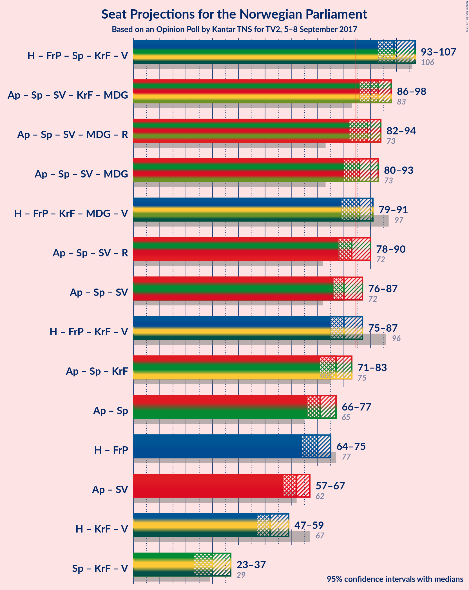

# Opinion Poll by Kantar TNS for TV2, 5–8 September 2017

<a href="#voting-intentions">Voting Intentions</a> | <a href="#seats">Seats</a> | <a href="#coalitions">Coalitions</a> | <a href="#technical-information">Technical Information</a>

## Voting Intentions

### Confidence Intervals

| Party | Last Result | Poll Result | 80% Confidence Interval | 90% Confidence Interval | 95% Confidence Interval | 99% Confidence Interval |
|:-----:|:-----------:|:-----------:|:-----------------------:|:-----------------------:|:-----------------------:|:-----------------------:|
| Arbeiderpartiet | 30.8% | 28.6% | 27.2–30.1% |26.8–30.5% |26.5–30.8% |25.8–31.6% |
| Høyre | 26.8% | 23.4% | 22.1–24.8% |21.7–25.2% |21.4–25.5% |20.8–26.2% |
| Fremskrittspartiet | 16.3% | 15.2% | 14.1–16.4% |13.8–16.7% |13.5–17.0% |13.0–17.6% |
| Senterpartiet | 5.5% | 10.5% | 9.6–11.5% |9.3–11.8% |9.1–12.1% |8.7–12.6% |
| Sosialistisk Venstreparti | 4.1% | 5.5% | 4.8–6.3% |4.6–6.5% |4.5–6.7% |4.2–7.1% |
| Kristelig Folkeparti | 5.6% | 4.3% | 3.7–5.0% |3.6–5.3% |3.4–5.4% |3.2–5.8% |
| Miljøpartiet de Grønne | 2.8% | 4.0% | 3.5–4.7% |3.3–4.9% |3.2–5.1% |2.9–5.4% |
| Venstre | 5.2% | 3.9% | 3.4–4.6% |3.2–4.8% |3.1–5.0% |2.8–5.3% |
| Rødt | 1.1% | 3.3% | 2.8–3.9% |2.7–4.1% |2.5–4.3% |2.3–4.6% |

*Note:* The poll result column reflects the actual value used in the calculations. Published results may vary slightly, and in addition be rounded to fewer digits.

## Seats

### Confidence Intervals

| Party | Last Result | Median | 80% Confidence Interval | 90% Confidence Interval | 95% Confidence Interval | 99% Confidence Interval |
|:-----:|:-----------:|:------:|:-----------------------:|:-----------------------:|:-----------------------:|:-----------------------:|
| <a href="#arbeiderpartiet">Arbeiderpartiet</a> | 55 | 51 | 50–54 |50–56 |50–56 |49–56 |
| <a href="#høyre">Høyre</a> | 48 | 42 | 39–46 |39–48 |38–48 |36–48 |
| <a href="#fremskrittspartiet">Fremskrittspartiet</a> | 29 | 28 | 27–29 |27–31 |26–31 |24–33 |
| <a href="#senterpartiet">Senterpartiet</a> | 10 | 19 | 16–20 |16–20 |15–21 |15–23 |
| <a href="#sosialistisk-venstreparti">Sosialistisk Venstreparti</a> | 7 | 10 | 9–11 |9–11 |9–11 |8–12 |
| <a href="#kristelig-folkeparti">Kristelig Folkeparti</a> | 10 | 8 | 2–9 |2–9 |2–10 |2–11 |
| <a href="#miljøpartiet-de-grønne">Miljøpartiet de Grønne</a> | 1 | 1 | 1–8 |1–8 |1–8 |1–8 |
| <a href="#venstre">Venstre</a> | 9 | 3 | 2–8 |1–8 |1–8 |1–9 |
| <a href="#rødt">Rødt</a> | 0 | 2 | 2–7 |2–7 |1–7 |1–8 |

### Arbeiderpartiet

*For a full overview of the results for this party, see the [Arbeiderpartiet](party-arbeiderpartiet.html) page.*

| Number of Seats | Probability | Accumulated | Special Marks |
|:---------------:|:-----------:|:-----------:|:-------------:|
| 46 | 0.2% | 100% |  |
| 47 | 0.2% | 99.8% |  |
| 48 | 0.1% | 99.6% |  |
| 49 | 1.0% | 99.5% |  |
| 50 | 34% | 98% |  |
| 51 | 38% | 65% | Median |
| 52 | 4% | 27% |  |
| 53 | 2% | 23% |  |
| 54 | 14% | 21% |  |
| 55 | 0.4% | 7% | Last Result |
| 56 | 6% | 6% |  |
| 57 | 0.2% | 0.2% |  |
| 58 | 0% | 0% |  |

### Høyre

*For a full overview of the results for this party, see the [Høyre](party-hyre.html) page.*

| Number of Seats | Probability | Accumulated | Special Marks |
|:---------------:|:-----------:|:-----------:|:-------------:|
| 35 | 0% | 100% |  |
| 36 | 2% | 99.9% |  |
| 37 | 0.4% | 98% |  |
| 38 | 0.6% | 98% |  |
| 39 | 28% | 97% |  |
| 40 | 2% | 69% |  |
| 41 | 12% | 67% |  |
| 42 | 14% | 56% | Median |
| 43 | 2% | 41% |  |
| 44 | 0.3% | 39% |  |
| 45 | 2% | 39% |  |
| 46 | 30% | 37% |  |
| 47 | 0.8% | 7% |  |
| 48 | 6% | 6% | Last Result |
| 49 | 0.4% | 0.4% |  |
| 50 | 0% | 0% |  |

### Fremskrittspartiet

*For a full overview of the results for this party, see the [Fremskrittspartiet](party-fremskrittspartiet.html) page.*

| Number of Seats | Probability | Accumulated | Special Marks |
|:---------------:|:-----------:|:-----------:|:-------------:|
| 22 | 0% | 100% |  |
| 23 | 0.3% | 99.9% |  |
| 24 | 0.6% | 99.6% |  |
| 25 | 1.2% | 99.0% |  |
| 26 | 1.4% | 98% |  |
| 27 | 14% | 96% |  |
| 28 | 42% | 82% | Median |
| 29 | 34% | 40% | Last Result |
| 30 | 0.3% | 6% |  |
| 31 | 5% | 6% |  |
| 32 | 0.2% | 1.1% |  |
| 33 | 0.9% | 0.9% |  |
| 34 | 0% | 0% |  |

### Senterpartiet

*For a full overview of the results for this party, see the [Senterpartiet](party-senterpartiet.html) page.*

| Number of Seats | Probability | Accumulated | Special Marks |
|:---------------:|:-----------:|:-----------:|:-------------:|
| 10 | 0% | 100% | Last Result |
| 11 | 0% | 100% |  |
| 12 | 0% | 100% |  |
| 13 | 0% | 100% |  |
| 14 | 0.1% | 100% |  |
| 15 | 3% | 99.9% |  |
| 16 | 11% | 97% |  |
| 17 | 11% | 85% |  |
| 18 | 4% | 74% |  |
| 19 | 60% | 70% | Median |
| 20 | 5% | 10% |  |
| 21 | 3% | 5% |  |
| 22 | 1.1% | 2% |  |
| 23 | 0.4% | 0.7% |  |
| 24 | 0.3% | 0.3% |  |
| 25 | 0% | 0% |  |

### Sosialistisk Venstreparti

*For a full overview of the results for this party, see the [Sosialistisk Venstreparti](party-sosialistiskvenstreparti.html) page.*

| Number of Seats | Probability | Accumulated | Special Marks |
|:---------------:|:-----------:|:-----------:|:-------------:|
| 7 | 0.2% | 100% | Last Result |
| 8 | 2% | 99.8% |  |
| 9 | 24% | 98% |  |
| 10 | 52% | 73% | Median |
| 11 | 20% | 22% |  |
| 12 | 1.2% | 1.3% |  |
| 13 | 0.1% | 0.1% |  |
| 14 | 0% | 0% |  |

### Kristelig Folkeparti

*For a full overview of the results for this party, see the [Kristelig Folkeparti](party-kristeligfolkeparti.html) page.*

| Number of Seats | Probability | Accumulated | Special Marks |
|:---------------:|:-----------:|:-----------:|:-------------:|
| 1 | 0.1% | 100% |  |
| 2 | 23% | 99.9% |  |
| 3 | 0.2% | 77% |  |
| 4 | 0% | 76% |  |
| 5 | 0% | 76% |  |
| 6 | 0% | 76% |  |
| 7 | 19% | 76% |  |
| 8 | 13% | 57% | Median |
| 9 | 41% | 44% |  |
| 10 | 1.2% | 3% | Last Result |
| 11 | 2% | 2% |  |
| 12 | 0% | 0% |  |

### Miljøpartiet de Grønne

*For a full overview of the results for this party, see the [Miljøpartiet de Grønne](party-miljpartietdegrnne.html) page.*

| Number of Seats | Probability | Accumulated | Special Marks |
|:---------------:|:-----------:|:-----------:|:-------------:|
| 1 | 51% | 100% | Last Result, Median |
| 2 | 2% | 49% |  |
| 3 | 13% | 47% |  |
| 4 | 4% | 34% |  |
| 5 | 0% | 30% |  |
| 6 | 0.1% | 30% |  |
| 7 | 8% | 30% |  |
| 8 | 22% | 22% |  |
| 9 | 0.1% | 0.3% |  |
| 10 | 0.1% | 0.1% |  |
| 11 | 0% | 0% |  |

### Venstre

*For a full overview of the results for this party, see the [Venstre](party-venstre.html) page.*

| Number of Seats | Probability | Accumulated | Special Marks |
|:---------------:|:-----------:|:-----------:|:-------------:|
| 1 | 6% | 100% |  |
| 2 | 9% | 94% |  |
| 3 | 40% | 86% | Median |
| 4 | 0% | 46% |  |
| 5 | 0% | 46% |  |
| 6 | 0.1% | 46% |  |
| 7 | 14% | 46% |  |
| 8 | 30% | 31% |  |
| 9 | 1.0% | 1.1% | Last Result |
| 10 | 0% | 0.2% |  |
| 11 | 0.1% | 0.1% |  |
| 12 | 0% | 0% |  |

### Rødt

*For a full overview of the results for this party, see the [Rødt](party-rdt.html) page.*

| Number of Seats | Probability | Accumulated | Special Marks |
|:---------------:|:-----------:|:-----------:|:-------------:|
| 0 | 0% | 100% | Last Result |
| 1 | 4% | 100% |  |
| 2 | 75% | 96% | Median |
| 3 | 0% | 21% |  |
| 4 | 0% | 21% |  |
| 5 | 0% | 21% |  |
| 6 | 0% | 21% |  |
| 7 | 19% | 21% |  |
| 8 | 2% | 2% |  |
| 9 | 0.1% | 0.1% |  |
| 10 | 0% | 0% |  |

## Coalitions

### Confidence Intervals

| Coalition | Last Result | Median | Majority? | 80% Confidence Interval | 90% Confidence Interval | 95% Confidence Interval | 99% Confidence Interval |
|:---------:|:-----------:|:------:|:---------:|:-----------------------:|:-----------------------:|:-----------------------:|:-----------------------:|
| Høyre – Fremskrittspartiet – Senterpartiet – Kristelig Folkeparti – Venstre | 106 | 101 | 100% | 95–106 | 95–106 | 92–106 | 91–106 |
| Arbeiderpartiet – Senterpartiet – Sosialistisk Venstreparti – Kristelig Folkeparti – Miljøpartiet de Grønne | 83 | 89 | 99.8% | 87–98 | 87–98 | 86–98 | 85–100 |
| Arbeiderpartiet – Senterpartiet – Sosialistisk Venstreparti – Miljøpartiet de Grønne – Rødt | 73 | 87 | 60% | 82–91 | 82–91 | 82–93 | 82–98 |
| Arbeiderpartiet – Senterpartiet – Sosialistisk Venstreparti – Miljøpartiet de Grønne | 73 | 81 | 36% | 80–89 | 80–89 | 80–91 | 80–92 |
| Høyre – Fremskrittspartiet – Kristelig Folkeparti – Miljøpartiet de Grønne – Venstre | 97 | 86 | 70% | 83–89 | 83–89 | 83–89 | 78–90 |
| Høyre – Fremskrittspartiet – Kristelig Folkeparti – Venstre | 96 | 82 | 40% | 78–87 | 78–87 | 76–87 | 71–87 |
| Arbeiderpartiet – Senterpartiet – Sosialistisk Venstreparti – Rødt | 72 | 83 | 30% | 80–86 | 80–86 | 80–86 | 79–91 |
| Arbeiderpartiet – Senterpartiet – Sosialistisk Venstreparti | 72 | 79 | 0.6% | 78–83 | 78–84 | 78–84 | 77–85 |
| Arbeiderpartiet – Senterpartiet – Kristelig Folkeparti | 75 | 77 | 0.1% | 72–80 | 72–80 | 70–82 | 70–83 |
| Høyre – Fremskrittspartiet | 77 | 70 | 0% | 66–75 | 66–76 | 66–76 | 64–79 |
| Arbeiderpartiet – Senterpartiet | 65 | 70 | 0% | 68–72 | 67–74 | 67–74 | 66–75 |
| Arbeiderpartiet – Sosialistisk Venstreparti | 62 | 60 | 0% | 60–64 | 60–65 | 60–65 | 59–67 |
| Høyre – Kristelig Folkeparti – Venstre | 67 | 54 | 0% | 50–58 | 50–58 | 49–58 | 46–59 |
| Senterpartiet – Kristelig Folkeparti – Venstre | 29 | 31 | 0% | 24–34 | 23–34 | 23–34 | 20–36 |

### Høyre – Fremskrittspartiet – Senterpartiet – Kristelig Folkeparti – Venstre

| Number of Seats | Probability | Accumulated | Special Marks |
|:---------------:|:-----------:|:-----------:|:-------------:|
| 88 | 0.1% | 100% |  |
| 89 | 0% | 99.9% |  |
| 90 | 0.2% | 99.9% |  |
| 91 | 0.5% | 99.7% |  |
| 92 | 2% | 99.2% |  |
| 93 | 0.1% | 97% |  |
| 94 | 0.4% | 97% |  |
| 95 | 13% | 97% |  |
| 96 | 0.6% | 84% |  |
| 97 | 9% | 83% |  |
| 98 | 2% | 74% |  |
| 99 | 4% | 72% |  |
| 100 | 3% | 68% | Median |
| 101 | 19% | 65% |  |
| 102 | 11% | 46% |  |
| 103 | 3% | 36% |  |
| 104 | 1.1% | 33% |  |
| 105 | 0.9% | 31% |  |
| 106 | 30% | 30% | Last Result |
| 107 | 0.1% | 0.3% |  |
| 108 | 0.1% | 0.2% |  |
| 109 | 0% | 0.1% |  |
| 110 | 0.1% | 0.1% |  |
| 111 | 0% | 0% |  |

### Arbeiderpartiet – Senterpartiet – Sosialistisk Venstreparti – Kristelig Folkeparti – Miljøpartiet de Grønne

| Number of Seats | Probability | Accumulated | Special Marks |
|:---------------:|:-----------:|:-----------:|:-------------:|
| 82 | 0.2% | 100% |  |
| 83 | 0% | 99.8% | Last Result |
| 84 | 0.1% | 99.8% |  |
| 85 | 0.6% | 99.8% | Majority |
| 86 | 2% | 99.2% |  |
| 87 | 21% | 97% |  |
| 88 | 0.9% | 76% |  |
| 89 | 42% | 75% | Median |
| 90 | 5% | 34% |  |
| 91 | 9% | 29% |  |
| 92 | 2% | 20% |  |
| 93 | 3% | 18% |  |
| 94 | 0.3% | 15% |  |
| 95 | 0.6% | 15% |  |
| 96 | 2% | 14% |  |
| 97 | 2% | 13% |  |
| 98 | 10% | 11% |  |
| 99 | 0% | 0.7% |  |
| 100 | 0.6% | 0.7% |  |
| 101 | 0% | 0.1% |  |
| 102 | 0.1% | 0.1% |  |
| 103 | 0% | 0% |  |

### Arbeiderpartiet – Senterpartiet – Sosialistisk Venstreparti – Miljøpartiet de Grønne – Rødt

| Number of Seats | Probability | Accumulated | Special Marks |
|:---------------:|:-----------:|:-----------:|:-------------:|
| 73 | 0% | 100% | Last Result |
| 74 | 0% | 100% |  |
| 75 | 0% | 100% |  |
| 76 | 0% | 100% |  |
| 77 | 0% | 100% |  |
| 78 | 0% | 100% |  |
| 79 | 0.1% | 100% |  |
| 80 | 0.1% | 99.9% |  |
| 81 | 0.1% | 99.8% |  |
| 82 | 30% | 99.8% |  |
| 83 | 10% | 70% | Median |
| 84 | 0.4% | 60% |  |
| 85 | 1.4% | 60% | Majority |
| 86 | 3% | 59% |  |
| 87 | 23% | 56% |  |
| 88 | 1.4% | 33% |  |
| 89 | 4% | 32% |  |
| 90 | 5% | 27% |  |
| 91 | 18% | 22% |  |
| 92 | 0.4% | 4% |  |
| 93 | 2% | 4% |  |
| 94 | 0.5% | 1.4% |  |
| 95 | 0.1% | 0.9% |  |
| 96 | 0% | 0.8% |  |
| 97 | 0.1% | 0.7% |  |
| 98 | 0.6% | 0.6% |  |
| 99 | 0% | 0% |  |

### Arbeiderpartiet – Senterpartiet – Sosialistisk Venstreparti – Miljøpartiet de Grønne

| Number of Seats | Probability | Accumulated | Special Marks |
|:---------------:|:-----------:|:-----------:|:-------------:|
| 73 | 0% | 100% | Last Result |
| 74 | 0% | 100% |  |
| 75 | 0% | 100% |  |
| 76 | 0.1% | 100% |  |
| 77 | 0.1% | 99.9% |  |
| 78 | 0.1% | 99.8% |  |
| 79 | 0% | 99.7% |  |
| 80 | 48% | 99.7% |  |
| 81 | 10% | 52% | Median |
| 82 | 0.3% | 41% |  |
| 83 | 0.9% | 41% |  |
| 84 | 4% | 40% |  |
| 85 | 5% | 36% | Majority |
| 86 | 0.9% | 32% |  |
| 87 | 4% | 31% |  |
| 88 | 4% | 27% |  |
| 89 | 19% | 22% |  |
| 90 | 0.8% | 3% |  |
| 91 | 2% | 3% |  |
| 92 | 0.5% | 0.6% |  |
| 93 | 0% | 0.2% |  |
| 94 | 0.1% | 0.1% |  |
| 95 | 0% | 0.1% |  |
| 96 | 0% | 0% |  |

### Høyre – Fremskrittspartiet – Kristelig Folkeparti – Miljøpartiet de Grønne – Venstre

| Number of Seats | Probability | Accumulated | Special Marks |
|:---------------:|:-----------:|:-----------:|:-------------:|
| 78 | 0.7% | 100% |  |
| 79 | 0.2% | 99.3% |  |
| 80 | 0.4% | 99.1% |  |
| 81 | 0.5% | 98.7% |  |
| 82 | 0.5% | 98% | Median |
| 83 | 23% | 98% |  |
| 84 | 4% | 75% |  |
| 85 | 4% | 70% | Majority |
| 86 | 18% | 67% |  |
| 87 | 5% | 49% |  |
| 88 | 31% | 44% |  |
| 89 | 13% | 13% |  |
| 90 | 0.3% | 0.6% |  |
| 91 | 0.1% | 0.3% |  |
| 92 | 0.1% | 0.2% |  |
| 93 | 0% | 0% |  |
| 94 | 0% | 0% |  |
| 95 | 0% | 0% |  |
| 96 | 0% | 0% |  |
| 97 | 0% | 0% | Last Result |

### Høyre – Fremskrittspartiet – Kristelig Folkeparti – Venstre

| Number of Seats | Probability | Accumulated | Special Marks |
|:---------------:|:-----------:|:-----------:|:-------------:|
| 71 | 0.6% | 100% |  |
| 72 | 0.1% | 99.4% |  |
| 73 | 0% | 99.3% |  |
| 74 | 0.1% | 99.2% |  |
| 75 | 0.5% | 99.1% |  |
| 76 | 2% | 98.6% |  |
| 77 | 0.4% | 96% |  |
| 78 | 18% | 96% |  |
| 79 | 5% | 78% |  |
| 80 | 4% | 73% |  |
| 81 | 1.4% | 68% | Median |
| 82 | 23% | 67% |  |
| 83 | 3% | 44% |  |
| 84 | 1.4% | 41% |  |
| 85 | 0.4% | 40% | Majority |
| 86 | 10% | 40% |  |
| 87 | 30% | 30% |  |
| 88 | 0.1% | 0.2% |  |
| 89 | 0.1% | 0.2% |  |
| 90 | 0.1% | 0.1% |  |
| 91 | 0% | 0% |  |
| 92 | 0% | 0% |  |
| 93 | 0% | 0% |  |
| 94 | 0% | 0% |  |
| 95 | 0% | 0% |  |
| 96 | 0% | 0% | Last Result |

### Arbeiderpartiet – Senterpartiet – Sosialistisk Venstreparti – Rødt

| Number of Seats | Probability | Accumulated | Special Marks |
|:---------------:|:-----------:|:-----------:|:-------------:|
| 72 | 0% | 100% | Last Result |
| 73 | 0% | 100% |  |
| 74 | 0% | 100% |  |
| 75 | 0% | 100% |  |
| 76 | 0% | 100% |  |
| 77 | 0.1% | 100% |  |
| 78 | 0.1% | 99.8% |  |
| 79 | 0.3% | 99.7% |  |
| 80 | 13% | 99.4% |  |
| 81 | 31% | 87% |  |
| 82 | 5% | 56% | Median |
| 83 | 18% | 51% |  |
| 84 | 4% | 33% |  |
| 85 | 4% | 30% | Majority |
| 86 | 23% | 25% |  |
| 87 | 0.5% | 2% |  |
| 88 | 0.5% | 2% |  |
| 89 | 0.4% | 1.3% |  |
| 90 | 0.2% | 0.9% |  |
| 91 | 0.7% | 0.7% |  |
| 92 | 0% | 0% |  |

### Arbeiderpartiet – Senterpartiet – Sosialistisk Venstreparti

| Number of Seats | Probability | Accumulated | Special Marks |
|:---------------:|:-----------:|:-----------:|:-------------:|
| 72 | 0% | 100% | Last Result |
| 73 | 0% | 100% |  |
| 74 | 0% | 100% |  |
| 75 | 0.2% | 99.9% |  |
| 76 | 0.2% | 99.8% |  |
| 77 | 0.4% | 99.6% |  |
| 78 | 13% | 99.2% |  |
| 79 | 49% | 86% |  |
| 80 | 5% | 37% | Median |
| 81 | 19% | 33% |  |
| 82 | 3% | 13% |  |
| 83 | 5% | 10% |  |
| 84 | 5% | 5% |  |
| 85 | 0.1% | 0.6% | Majority |
| 86 | 0% | 0.5% |  |
| 87 | 0.3% | 0.4% |  |
| 88 | 0% | 0.1% |  |
| 89 | 0.1% | 0.1% |  |
| 90 | 0% | 0% |  |

### Arbeiderpartiet – Senterpartiet – Kristelig Folkeparti

| Number of Seats | Probability | Accumulated | Special Marks |
|:---------------:|:-----------:|:-----------:|:-------------:|
| 69 | 0.1% | 100% |  |
| 70 | 2% | 99.9% |  |
| 71 | 1.1% | 97% |  |
| 72 | 8% | 96% |  |
| 73 | 4% | 89% |  |
| 74 | 3% | 85% |  |
| 75 | 9% | 82% | Last Result |
| 76 | 5% | 73% |  |
| 77 | 21% | 69% |  |
| 78 | 30% | 47% | Median |
| 79 | 3% | 18% |  |
| 80 | 11% | 15% |  |
| 81 | 1.1% | 4% |  |
| 82 | 0.6% | 3% |  |
| 83 | 2% | 2% |  |
| 84 | 0% | 0.1% |  |
| 85 | 0% | 0.1% | Majority |
| 86 | 0% | 0% |  |

### Høyre – Fremskrittspartiet

| Number of Seats | Probability | Accumulated | Special Marks |
|:---------------:|:-----------:|:-----------:|:-------------:|
| 59 | 0.1% | 100% |  |
| 60 | 0% | 99.9% |  |
| 61 | 0% | 99.9% |  |
| 62 | 0.1% | 99.8% |  |
| 63 | 0.1% | 99.8% |  |
| 64 | 2% | 99.7% |  |
| 65 | 0.3% | 98% |  |
| 66 | 10% | 98% |  |
| 67 | 19% | 87% |  |
| 68 | 0.7% | 68% |  |
| 69 | 11% | 67% |  |
| 70 | 10% | 56% | Median |
| 71 | 4% | 47% |  |
| 72 | 5% | 43% |  |
| 73 | 1.0% | 38% |  |
| 74 | 1.0% | 37% |  |
| 75 | 30% | 36% |  |
| 76 | 4% | 6% |  |
| 77 | 0% | 2% | Last Result |
| 78 | 0% | 2% |  |
| 79 | 2% | 2% |  |
| 80 | 0% | 0% |  |

### Arbeiderpartiet – Senterpartiet

| Number of Seats | Probability | Accumulated | Special Marks |
|:---------------:|:-----------:|:-----------:|:-------------:|
| 64 | 0.1% | 100% |  |
| 65 | 0.2% | 99.9% | Last Result |
| 66 | 0.2% | 99.7% |  |
| 67 | 9% | 99.5% |  |
| 68 | 4% | 90% |  |
| 69 | 32% | 87% |  |
| 70 | 26% | 55% | Median |
| 71 | 15% | 29% |  |
| 72 | 6% | 14% |  |
| 73 | 0.5% | 8% |  |
| 74 | 5% | 7% |  |
| 75 | 2% | 2% |  |
| 76 | 0% | 0.5% |  |
| 77 | 0% | 0.4% |  |
| 78 | 0.4% | 0.4% |  |
| 79 | 0% | 0% |  |

### Arbeiderpartiet – Sosialistisk Venstreparti

| Number of Seats | Probability | Accumulated | Special Marks |
|:---------------:|:-----------:|:-----------:|:-------------:|
| 56 | 0.1% | 100% |  |
| 57 | 0.1% | 99.9% |  |
| 58 | 0.2% | 99.8% |  |
| 59 | 2% | 99.6% |  |
| 60 | 51% | 98% |  |
| 61 | 4% | 47% | Median |
| 62 | 21% | 43% | Last Result |
| 63 | 2% | 23% |  |
| 64 | 16% | 21% |  |
| 65 | 3% | 5% |  |
| 66 | 0.1% | 2% |  |
| 67 | 2% | 2% |  |
| 68 | 0% | 0% |  |

### Høyre – Kristelig Folkeparti – Venstre

| Number of Seats | Probability | Accumulated | Special Marks |
|:---------------:|:-----------:|:-----------:|:-------------:|
| 44 | 0.1% | 100% |  |
| 45 | 0.1% | 99.8% |  |
| 46 | 0.8% | 99.7% |  |
| 47 | 0.5% | 99.0% |  |
| 48 | 0.1% | 98% |  |
| 49 | 2% | 98% |  |
| 50 | 9% | 96% |  |
| 51 | 21% | 87% |  |
| 52 | 3% | 66% |  |
| 53 | 0.5% | 63% | Median |
| 54 | 19% | 63% |  |
| 55 | 2% | 44% |  |
| 56 | 0.3% | 42% |  |
| 57 | 1.3% | 41% |  |
| 58 | 40% | 40% |  |
| 59 | 0.1% | 0.6% |  |
| 60 | 0.3% | 0.4% |  |
| 61 | 0% | 0.2% |  |
| 62 | 0.1% | 0.1% |  |
| 63 | 0% | 0.1% |  |
| 64 | 0% | 0% |  |
| 65 | 0% | 0% |  |
| 66 | 0% | 0% |  |
| 67 | 0% | 0% | Last Result |

### Senterpartiet – Kristelig Folkeparti – Venstre

| Number of Seats | Probability | Accumulated | Special Marks |
|:---------------:|:-----------:|:-----------:|:-------------:|
| 20 | 2% | 100% |  |
| 21 | 0% | 98% |  |
| 22 | 0.1% | 98% |  |
| 23 | 6% | 98% |  |
| 24 | 3% | 92% |  |
| 25 | 1.3% | 89% |  |
| 26 | 0.9% | 88% |  |
| 27 | 0.8% | 87% |  |
| 28 | 10% | 86% |  |
| 29 | 11% | 76% | Last Result |
| 30 | 1.1% | 66% | Median |
| 31 | 31% | 65% |  |
| 32 | 10% | 34% |  |
| 33 | 0.3% | 24% |  |
| 34 | 22% | 24% |  |
| 35 | 0.1% | 2% |  |
| 36 | 1.2% | 2% |  |
| 37 | 0% | 0.3% |  |
| 38 | 0.2% | 0.2% |  |
| 39 | 0% | 0% |  |

## Technical Information

### Opinion Poll

+ **Pollster:** Kantar TNS
+ **Media:** TV2
+ **Fieldwork period:** 5–8 September 2017

### Calculations

+ **Sample size:** 1640
+ **Simulations done:** 65,536
+ **Error estimate:** 3.16%

