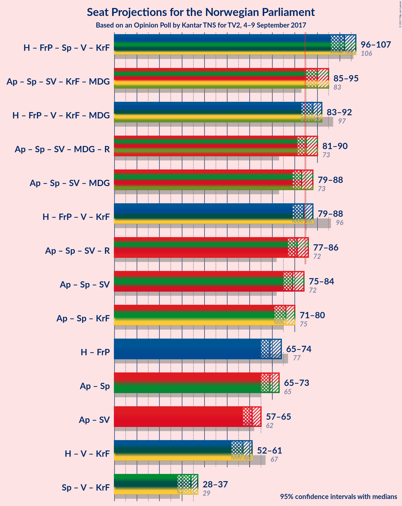

# Opinion Poll by Kantar TNS for TV2, 4–9 September 2017

<a href="#voting-intentions">Voting Intentions</a> | <a href="#seats">Seats</a> | <a href="#coalitions">Coalitions</a> | <a href="#technical-information">Technical Information</a>

## Voting Intentions

### Confidence Intervals

| Party | Last Result | Poll Result | 80% Confidence Interval | 90% Confidence Interval | 95% Confidence Interval | 99% Confidence Interval |
|:-----:|:-----------:|:-----------:|:-----------------------:|:-----------------------:|:-----------------------:|:-----------------------:|
| Arbeiderpartiet | 30.8% | 28.1% | 26.9–29.3% |26.6–29.6% |26.3–29.9% |25.8–30.5% |
| Høyre | 26.8% | 23.8% | 22.7–24.9% |22.4–25.3% |22.2–25.5% |21.6–26.1% |
| Fremskrittspartiet | 16.3% | 14.6% | 13.7–15.5% |13.5–15.8% |13.2–16.0% |12.8–16.5% |
| Senterpartiet | 5.5% | 10.2% | 9.4–11.0% |9.2–11.2% |9.1–11.5% |8.7–11.9% |
| Sosialistisk Venstreparti | 4.1% | 5.6% | 5.0–6.2% |4.9–6.4% |4.7–6.6% |4.5–6.9% |
| Venstre | 5.2% | 4.6% | 4.1–5.2% |4.0–5.4% |3.8–5.5% |3.6–5.8% |
| Kristelig Folkeparti | 5.6% | 4.4% | 3.9–5.0% |3.8–5.2% |3.7–5.3% |3.4–5.6% |
| Miljøpartiet de Grønne | 2.8% | 3.9% | 3.4–4.5% |3.3–4.6% |3.2–4.8% |3.0–5.0% |
| Rødt | 1.1% | 3.1% | 2.7–3.6% |2.6–3.7% |2.5–3.9% |2.3–4.1% |

*Note:* The poll result column reflects the actual value used in the calculations. Published results may vary slightly, and in addition be rounded to fewer digits.

## Seats

### Confidence Intervals

| Party | Last Result | Median | 80% Confidence Interval | 90% Confidence Interval | 95% Confidence Interval | 99% Confidence Interval |
|:-----:|:-----------:|:------:|:-----------------------:|:-----------------------:|:-----------------------:|:-----------------------:|
| <a href="#arbeiderpartiet">Arbeiderpartiet</a> | 55 | 51 | 48–54 |48–54 |47–54 |47–56 |
| <a href="#høyre">Høyre</a> | 48 | 42 | 39–45 |39–45 |38–46 |37–47 |
| <a href="#fremskrittspartiet">Fremskrittspartiet</a> | 29 | 28 | 25–28 |24–29 |24–29 |23–30 |
| <a href="#senterpartiet">Senterpartiet</a> | 10 | 18 | 16–20 |16–20 |15–20 |15–21 |
| <a href="#sosialistisk-venstreparti">Sosialistisk Venstreparti</a> | 7 | 10 | 9–11 |8–11 |8–12 |8–12 |
| <a href="#venstre">Venstre</a> | 9 | 8 | 7–9 |3–9 |2–10 |2–10 |
| <a href="#kristelig-folkeparti">Kristelig Folkeparti</a> | 10 | 8 | 2–9 |2–9 |2–9 |2–10 |
| <a href="#miljøpartiet-de-grønne">Miljøpartiet de Grønne</a> | 1 | 3 | 1–8 |1–8 |1–8 |1–9 |
| <a href="#rødt">Rødt</a> | 0 | 2 | 2 |1–2 |1–2 |1–7 |

### Arbeiderpartiet

*For a full overview of the results for this party, see the [Arbeiderpartiet](party-arbeiderpartiet.html) page.*

| Number of Seats | Probability | Accumulated | Special Marks |
|:---------------:|:-----------:|:-----------:|:-------------:|
| 46 | 0.3% | 100% |  |
| 47 | 3% | 99.7% |  |
| 48 | 7% | 97% |  |
| 49 | 4% | 90% |  |
| 50 | 21% | 85% |  |
| 51 | 29% | 64% | Median |
| 52 | 14% | 35% |  |
| 53 | 10% | 21% |  |
| 54 | 8% | 10% |  |
| 55 | 1.3% | 2% | Last Result |
| 56 | 0.3% | 0.7% |  |
| 57 | 0.4% | 0.4% |  |
| 58 | 0% | 0% |  |

### Høyre

*For a full overview of the results for this party, see the [Høyre](party-hyre.html) page.*

| Number of Seats | Probability | Accumulated | Special Marks |
|:---------------:|:-----------:|:-----------:|:-------------:|
| 37 | 0.5% | 100% |  |
| 38 | 3% | 99.5% |  |
| 39 | 13% | 97% |  |
| 40 | 4% | 83% |  |
| 41 | 12% | 79% |  |
| 42 | 26% | 67% | Median |
| 43 | 13% | 41% |  |
| 44 | 10% | 28% |  |
| 45 | 14% | 18% |  |
| 46 | 3% | 4% |  |
| 47 | 1.3% | 2% |  |
| 48 | 0.2% | 0.4% | Last Result |
| 49 | 0.2% | 0.2% |  |
| 50 | 0% | 0% |  |

### Fremskrittspartiet

*For a full overview of the results for this party, see the [Fremskrittspartiet](party-fremskrittspartiet.html) page.*

| Number of Seats | Probability | Accumulated | Special Marks |
|:---------------:|:-----------:|:-----------:|:-------------:|
| 22 | 0.4% | 100% |  |
| 23 | 2% | 99.6% |  |
| 24 | 5% | 98% |  |
| 25 | 15% | 93% |  |
| 26 | 5% | 77% |  |
| 27 | 10% | 73% |  |
| 28 | 57% | 63% | Median |
| 29 | 4% | 6% | Last Result |
| 30 | 1.3% | 1.4% |  |
| 31 | 0.1% | 0.1% |  |
| 32 | 0% | 0% |  |

### Senterpartiet

*For a full overview of the results for this party, see the [Senterpartiet](party-senterpartiet.html) page.*

| Number of Seats | Probability | Accumulated | Special Marks |
|:---------------:|:-----------:|:-----------:|:-------------:|
| 10 | 0% | 100% | Last Result |
| 11 | 0% | 100% |  |
| 12 | 0% | 100% |  |
| 13 | 0% | 100% |  |
| 14 | 0.1% | 100% |  |
| 15 | 3% | 99.9% |  |
| 16 | 8% | 97% |  |
| 17 | 8% | 89% |  |
| 18 | 50% | 81% | Median |
| 19 | 12% | 30% |  |
| 20 | 16% | 18% |  |
| 21 | 2% | 2% |  |
| 22 | 0.4% | 0.4% |  |
| 23 | 0% | 0% |  |

### Sosialistisk Venstreparti

*For a full overview of the results for this party, see the [Sosialistisk Venstreparti](party-sosialistiskvenstreparti.html) page.*

| Number of Seats | Probability | Accumulated | Special Marks |
|:---------------:|:-----------:|:-----------:|:-------------:|
| 7 | 0.1% | 100% | Last Result |
| 8 | 5% | 99.9% |  |
| 9 | 26% | 94% |  |
| 10 | 42% | 68% | Median |
| 11 | 23% | 26% |  |
| 12 | 3% | 3% |  |
| 13 | 0.2% | 0.2% |  |
| 14 | 0% | 0% |  |

### Venstre

*For a full overview of the results for this party, see the [Venstre](party-venstre.html) page.*

| Number of Seats | Probability | Accumulated | Special Marks |
|:---------------:|:-----------:|:-----------:|:-------------:|
| 2 | 4% | 100% |  |
| 3 | 2% | 96% |  |
| 4 | 0% | 94% |  |
| 5 | 0% | 94% |  |
| 6 | 0% | 94% |  |
| 7 | 7% | 94% |  |
| 8 | 53% | 88% | Median |
| 9 | 32% | 34% | Last Result |
| 10 | 2% | 3% |  |
| 11 | 0.1% | 0.1% |  |
| 12 | 0% | 0% |  |

### Kristelig Folkeparti

*For a full overview of the results for this party, see the [Kristelig Folkeparti](party-kristeligfolkeparti.html) page.*

| Number of Seats | Probability | Accumulated | Special Marks |
|:---------------:|:-----------:|:-----------:|:-------------:|
| 2 | 24% | 100% |  |
| 3 | 1.4% | 76% |  |
| 4 | 0% | 75% |  |
| 5 | 0% | 75% |  |
| 6 | 0% | 75% |  |
| 7 | 16% | 75% |  |
| 8 | 38% | 59% | Median |
| 9 | 20% | 21% |  |
| 10 | 1.2% | 1.2% | Last Result |
| 11 | 0% | 0% |  |

### Miljøpartiet de Grønne

*For a full overview of the results for this party, see the [Miljøpartiet de Grønne](party-miljpartietdegrnne.html) page.*

| Number of Seats | Probability | Accumulated | Special Marks |
|:---------------:|:-----------:|:-----------:|:-------------:|
| 1 | 20% | 100% | Last Result |
| 2 | 16% | 80% |  |
| 3 | 25% | 64% | Median |
| 4 | 4% | 39% |  |
| 5 | 0% | 35% |  |
| 6 | 0% | 35% |  |
| 7 | 23% | 35% |  |
| 8 | 12% | 13% |  |
| 9 | 1.4% | 1.4% |  |
| 10 | 0% | 0% |  |

### Rødt

*For a full overview of the results for this party, see the [Rødt](party-rdt.html) page.*

| Number of Seats | Probability | Accumulated | Special Marks |
|:---------------:|:-----------:|:-----------:|:-------------:|
| 0 | 0% | 100% | Last Result |
| 1 | 10% | 100% |  |
| 2 | 89% | 90% | Median |
| 3 | 0% | 1.5% |  |
| 4 | 0% | 1.5% |  |
| 5 | 0% | 1.5% |  |
| 6 | 0% | 1.5% |  |
| 7 | 1.4% | 1.5% |  |
| 8 | 0% | 0% |  |

## Coalitions

### Confidence Intervals

| Coalition | Last Result | Median | Majority? | 80% Confidence Interval | 90% Confidence Interval | 95% Confidence Interval | 99% Confidence Interval |
|:---------:|:-----------:|:------:|:---------:|:-----------------------:|:-----------------------:|:-----------------------:|:-----------------------:|
| Høyre – Fremskrittspartiet – Senterpartiet – Venstre – Kristelig Folkeparti | 106 | 102 | 100% | 98–105 | 98–106 | 96–107 | 95–107 |
| Arbeiderpartiet – Senterpartiet – Sosialistisk Venstreparti – Kristelig Folkeparti – Miljøpartiet de Grønne | 83 | 90 | 98.5% | 86–93 | 85–94 | 85–95 | 84–98 |
| Høyre – Fremskrittspartiet – Venstre – Kristelig Folkeparti – Miljøpartiet de Grønne | 97 | 88 | 88% | 84–91 | 83–92 | 83–92 | 81–94 |
| Arbeiderpartiet – Senterpartiet – Sosialistisk Venstreparti – Miljøpartiet de Grønne – Rødt | 73 | 85 | 57% | 82–89 | 81–89 | 81–90 | 80–93 |
| Arbeiderpartiet – Senterpartiet – Sosialistisk Venstreparti – Miljøpartiet de Grønne | 73 | 83 | 26% | 80–87 | 79–87 | 79–88 | 78–92 |
| Høyre – Fremskrittspartiet – Venstre – Kristelig Folkeparti | 96 | 84 | 43% | 80–87 | 80–88 | 79–88 | 76–89 |
| Arbeiderpartiet – Senterpartiet – Sosialistisk Venstreparti – Rødt | 72 | 81 | 12% | 78–85 | 77–86 | 77–86 | 75–88 |
| Arbeiderpartiet – Senterpartiet – Sosialistisk Venstreparti | 72 | 79 | 1.0% | 76–83 | 75–83 | 75–84 | 73–86 |
| Arbeiderpartiet – Senterpartiet – Kristelig Folkeparti | 75 | 76 | 0% | 73–79 | 71–80 | 71–80 | 70–82 |
| Høyre – Fremskrittspartiet | 77 | 69 | 0% | 66–73 | 66–73 | 65–74 | 62–76 |
| Arbeiderpartiet – Senterpartiet | 65 | 69 | 0% | 67–72 | 66–73 | 65–73 | 63–75 |
| Arbeiderpartiet – Sosialistisk Venstreparti | 62 | 61 | 0% | 58–64 | 57–65 | 57–65 | 56–67 |
| Høyre – Venstre – Kristelig Folkeparti | 67 | 57 | 0% | 53–60 | 52–61 | 52–61 | 49–63 |
| Senterpartiet – Venstre – Kristelig Folkeparti | 29 | 34 | 0% | 29–35 | 28–36 | 28–37 | 24–38 |

### Høyre – Fremskrittspartiet – Senterpartiet – Venstre – Kristelig Folkeparti

| Number of Seats | Probability | Accumulated | Special Marks |
|:---------------:|:-----------:|:-----------:|:-------------:|
| 93 | 0.2% | 100% |  |
| 94 | 0.2% | 99.8% |  |
| 95 | 0.7% | 99.6% |  |
| 96 | 2% | 99.0% |  |
| 97 | 2% | 97% |  |
| 98 | 6% | 95% |  |
| 99 | 10% | 89% |  |
| 100 | 8% | 79% |  |
| 101 | 15% | 72% |  |
| 102 | 7% | 57% |  |
| 103 | 19% | 49% |  |
| 104 | 9% | 31% | Median |
| 105 | 13% | 22% |  |
| 106 | 5% | 8% | Last Result |
| 107 | 3% | 4% |  |
| 108 | 0.3% | 0.4% |  |
| 109 | 0.1% | 0.1% |  |
| 110 | 0.1% | 0.1% |  |
| 111 | 0% | 0% |  |

### Arbeiderpartiet – Senterpartiet – Sosialistisk Venstreparti – Kristelig Folkeparti – Miljøpartiet de Grønne

| Number of Seats | Probability | Accumulated | Special Marks |
|:---------------:|:-----------:|:-----------:|:-------------:|
| 81 | 0.1% | 100% |  |
| 82 | 0.2% | 99.9% |  |
| 83 | 0.1% | 99.7% | Last Result |
| 84 | 1.1% | 99.6% |  |
| 85 | 4% | 98.5% | Majority |
| 86 | 7% | 95% |  |
| 87 | 8% | 88% |  |
| 88 | 7% | 80% |  |
| 89 | 20% | 73% |  |
| 90 | 16% | 53% | Median |
| 91 | 9% | 37% |  |
| 92 | 16% | 28% |  |
| 93 | 6% | 12% |  |
| 94 | 3% | 6% |  |
| 95 | 1.4% | 3% |  |
| 96 | 0.6% | 1.2% |  |
| 97 | 0.2% | 0.7% |  |
| 98 | 0.5% | 0.5% |  |
| 99 | 0% | 0% |  |

### Høyre – Fremskrittspartiet – Venstre – Kristelig Folkeparti – Miljøpartiet de Grønne

| Number of Seats | Probability | Accumulated | Special Marks |
|:---------------:|:-----------:|:-----------:|:-------------:|
| 80 | 0.4% | 100% |  |
| 81 | 0.3% | 99.6% |  |
| 82 | 0.4% | 99.2% |  |
| 83 | 4% | 98.8% |  |
| 84 | 7% | 95% |  |
| 85 | 7% | 88% | Majority |
| 86 | 12% | 82% |  |
| 87 | 4% | 69% |  |
| 88 | 28% | 65% |  |
| 89 | 10% | 37% | Median |
| 90 | 14% | 28% |  |
| 91 | 4% | 14% |  |
| 92 | 7% | 10% |  |
| 93 | 1.4% | 2% |  |
| 94 | 0.7% | 0.9% |  |
| 95 | 0.1% | 0.2% |  |
| 96 | 0.1% | 0.1% |  |
| 97 | 0% | 0% | Last Result |

### Arbeiderpartiet – Senterpartiet – Sosialistisk Venstreparti – Miljøpartiet de Grønne – Rødt

| Number of Seats | Probability | Accumulated | Special Marks |
|:---------------:|:-----------:|:-----------:|:-------------:|
| 73 | 0% | 100% | Last Result |
| 74 | 0% | 100% |  |
| 75 | 0% | 100% |  |
| 76 | 0% | 100% |  |
| 77 | 0% | 100% |  |
| 78 | 0.2% | 100% |  |
| 79 | 0.1% | 99.8% |  |
| 80 | 1.5% | 99.7% |  |
| 81 | 5% | 98% |  |
| 82 | 14% | 93% |  |
| 83 | 4% | 79% |  |
| 84 | 18% | 75% | Median |
| 85 | 9% | 57% | Majority |
| 86 | 22% | 48% |  |
| 87 | 8% | 26% |  |
| 88 | 7% | 19% |  |
| 89 | 8% | 11% |  |
| 90 | 1.3% | 4% |  |
| 91 | 1.0% | 2% |  |
| 92 | 0.5% | 1.4% |  |
| 93 | 0.6% | 0.9% |  |
| 94 | 0.2% | 0.3% |  |
| 95 | 0.1% | 0.1% |  |
| 96 | 0% | 0% |  |

### Arbeiderpartiet – Senterpartiet – Sosialistisk Venstreparti – Miljøpartiet de Grønne

| Number of Seats | Probability | Accumulated | Special Marks |
|:---------------:|:-----------:|:-----------:|:-------------:|
| 73 | 0% | 100% | Last Result |
| 74 | 0% | 100% |  |
| 75 | 0% | 100% |  |
| 76 | 0.1% | 100% |  |
| 77 | 0.2% | 99.8% |  |
| 78 | 0.7% | 99.7% |  |
| 79 | 6% | 99.0% |  |
| 80 | 14% | 93% |  |
| 81 | 4% | 79% |  |
| 82 | 18% | 75% | Median |
| 83 | 8% | 57% |  |
| 84 | 23% | 49% |  |
| 85 | 7% | 26% | Majority |
| 86 | 8% | 19% |  |
| 87 | 7% | 11% |  |
| 88 | 3% | 5% |  |
| 89 | 0.7% | 2% |  |
| 90 | 0.7% | 2% |  |
| 91 | 0.2% | 0.9% |  |
| 92 | 0.6% | 0.7% |  |
| 93 | 0% | 0% |  |

### Høyre – Fremskrittspartiet – Venstre – Kristelig Folkeparti

| Number of Seats | Probability | Accumulated | Special Marks |
|:---------------:|:-----------:|:-----------:|:-------------:|
| 74 | 0.1% | 100% |  |
| 75 | 0.2% | 99.9% |  |
| 76 | 0.6% | 99.7% |  |
| 77 | 0.5% | 99.1% |  |
| 78 | 1.0% | 98.6% |  |
| 79 | 1.3% | 98% |  |
| 80 | 8% | 96% |  |
| 81 | 7% | 89% |  |
| 82 | 8% | 81% |  |
| 83 | 22% | 74% |  |
| 84 | 9% | 52% |  |
| 85 | 18% | 43% | Majority |
| 86 | 4% | 25% | Median |
| 87 | 14% | 21% |  |
| 88 | 5% | 7% |  |
| 89 | 1.5% | 2% |  |
| 90 | 0.1% | 0.3% |  |
| 91 | 0.2% | 0.2% |  |
| 92 | 0% | 0% |  |
| 93 | 0% | 0% |  |
| 94 | 0% | 0% |  |
| 95 | 0% | 0% |  |
| 96 | 0% | 0% | Last Result |

### Arbeiderpartiet – Senterpartiet – Sosialistisk Venstreparti – Rødt

| Number of Seats | Probability | Accumulated | Special Marks |
|:---------------:|:-----------:|:-----------:|:-------------:|
| 72 | 0% | 100% | Last Result |
| 73 | 0.1% | 100% |  |
| 74 | 0.1% | 99.9% |  |
| 75 | 0.7% | 99.8% |  |
| 76 | 1.4% | 99.1% |  |
| 77 | 7% | 98% |  |
| 78 | 4% | 90% |  |
| 79 | 14% | 86% |  |
| 80 | 10% | 72% |  |
| 81 | 28% | 63% | Median |
| 82 | 4% | 35% |  |
| 83 | 12% | 31% |  |
| 84 | 7% | 18% |  |
| 85 | 7% | 12% | Majority |
| 86 | 4% | 5% |  |
| 87 | 0.4% | 1.2% |  |
| 88 | 0.3% | 0.8% |  |
| 89 | 0.4% | 0.4% |  |
| 90 | 0% | 0% |  |

### Arbeiderpartiet – Senterpartiet – Sosialistisk Venstreparti

| Number of Seats | Probability | Accumulated | Special Marks |
|:---------------:|:-----------:|:-----------:|:-------------:|
| 71 | 0.1% | 100% |  |
| 72 | 0.1% | 99.9% | Last Result |
| 73 | 0.4% | 99.8% |  |
| 74 | 1.4% | 99.4% |  |
| 75 | 7% | 98% |  |
| 76 | 4% | 91% |  |
| 77 | 15% | 87% |  |
| 78 | 9% | 72% |  |
| 79 | 28% | 63% | Median |
| 80 | 5% | 36% |  |
| 81 | 12% | 30% |  |
| 82 | 7% | 18% |  |
| 83 | 6% | 11% |  |
| 84 | 4% | 5% |  |
| 85 | 0.3% | 1.0% | Majority |
| 86 | 0.3% | 0.7% |  |
| 87 | 0.4% | 0.4% |  |
| 88 | 0% | 0.1% |  |
| 89 | 0% | 0% |  |

### Arbeiderpartiet – Senterpartiet – Kristelig Folkeparti

| Number of Seats | Probability | Accumulated | Special Marks |
|:---------------:|:-----------:|:-----------:|:-------------:|
| 68 | 0.1% | 100% |  |
| 69 | 0.2% | 99.9% |  |
| 70 | 2% | 99.6% |  |
| 71 | 3% | 98% |  |
| 72 | 4% | 95% |  |
| 73 | 6% | 91% |  |
| 74 | 19% | 85% |  |
| 75 | 9% | 66% | Last Result |
| 76 | 22% | 57% |  |
| 77 | 5% | 35% | Median |
| 78 | 17% | 30% |  |
| 79 | 6% | 13% |  |
| 80 | 5% | 7% |  |
| 81 | 1.3% | 2% |  |
| 82 | 0.8% | 1.0% |  |
| 83 | 0.1% | 0.2% |  |
| 84 | 0% | 0.1% |  |
| 85 | 0% | 0% | Majority |

### Høyre – Fremskrittspartiet

| Number of Seats | Probability | Accumulated | Special Marks |
|:---------------:|:-----------:|:-----------:|:-------------:|
| 61 | 0.1% | 100% |  |
| 62 | 0.4% | 99.9% |  |
| 63 | 0.8% | 99.5% |  |
| 64 | 0.9% | 98.6% |  |
| 65 | 2% | 98% |  |
| 66 | 7% | 95% |  |
| 67 | 15% | 89% |  |
| 68 | 13% | 74% |  |
| 69 | 12% | 61% |  |
| 70 | 24% | 49% | Median |
| 71 | 3% | 25% |  |
| 72 | 10% | 22% |  |
| 73 | 10% | 12% |  |
| 74 | 0.7% | 3% |  |
| 75 | 1.2% | 2% |  |
| 76 | 0.6% | 0.7% |  |
| 77 | 0.1% | 0.1% | Last Result |
| 78 | 0% | 0% |  |

### Arbeiderpartiet – Senterpartiet

| Number of Seats | Probability | Accumulated | Special Marks |
|:---------------:|:-----------:|:-----------:|:-------------:|
| 62 | 0% | 100% |  |
| 63 | 0.5% | 99.9% |  |
| 64 | 0.7% | 99.5% |  |
| 65 | 3% | 98.8% | Last Result |
| 66 | 5% | 96% |  |
| 67 | 9% | 91% |  |
| 68 | 24% | 82% |  |
| 69 | 21% | 58% | Median |
| 70 | 7% | 37% |  |
| 71 | 10% | 30% |  |
| 72 | 13% | 20% |  |
| 73 | 5% | 6% |  |
| 74 | 0.6% | 1.4% |  |
| 75 | 0.5% | 0.8% |  |
| 76 | 0.2% | 0.3% |  |
| 77 | 0% | 0.1% |  |
| 78 | 0% | 0% |  |

### Arbeiderpartiet – Sosialistisk Venstreparti

| Number of Seats | Probability | Accumulated | Special Marks |
|:---------------:|:-----------:|:-----------:|:-------------:|
| 55 | 0.2% | 100% |  |
| 56 | 0.4% | 99.7% |  |
| 57 | 6% | 99.3% |  |
| 58 | 4% | 93% |  |
| 59 | 16% | 90% |  |
| 60 | 7% | 74% |  |
| 61 | 32% | 66% | Median |
| 62 | 18% | 34% | Last Result |
| 63 | 5% | 17% |  |
| 64 | 3% | 12% |  |
| 65 | 7% | 9% |  |
| 66 | 0.8% | 2% |  |
| 67 | 0.6% | 0.8% |  |
| 68 | 0.2% | 0.2% |  |
| 69 | 0% | 0% |  |

### Høyre – Venstre – Kristelig Folkeparti

| Number of Seats | Probability | Accumulated | Special Marks |
|:---------------:|:-----------:|:-----------:|:-------------:|
| 48 | 0.1% | 100% |  |
| 49 | 0.6% | 99.8% |  |
| 50 | 0.6% | 99.3% |  |
| 51 | 0.4% | 98.7% |  |
| 52 | 5% | 98% |  |
| 53 | 7% | 94% |  |
| 54 | 4% | 87% |  |
| 55 | 24% | 83% |  |
| 56 | 6% | 59% |  |
| 57 | 12% | 53% |  |
| 58 | 7% | 41% | Median |
| 59 | 16% | 34% |  |
| 60 | 10% | 18% |  |
| 61 | 5% | 8% |  |
| 62 | 1.3% | 2% |  |
| 63 | 0.8% | 1.0% |  |
| 64 | 0.2% | 0.2% |  |
| 65 | 0% | 0% |  |
| 66 | 0% | 0% |  |
| 67 | 0% | 0% | Last Result |

### Senterpartiet – Venstre – Kristelig Folkeparti

| Number of Seats | Probability | Accumulated | Special Marks |
|:---------------:|:-----------:|:-----------:|:-------------:|
| 23 | 0.1% | 100% |  |
| 24 | 0.5% | 99.9% |  |
| 25 | 0.1% | 99.4% |  |
| 26 | 0.8% | 99.3% |  |
| 27 | 1.0% | 98% |  |
| 28 | 5% | 98% |  |
| 29 | 9% | 92% | Last Result |
| 30 | 10% | 83% |  |
| 31 | 6% | 74% |  |
| 32 | 9% | 68% |  |
| 33 | 6% | 59% |  |
| 34 | 19% | 53% | Median |
| 35 | 25% | 34% |  |
| 36 | 6% | 10% |  |
| 37 | 3% | 4% |  |
| 38 | 0.4% | 0.8% |  |
| 39 | 0.4% | 0.4% |  |
| 40 | 0% | 0% |  |

## Technical Information

### Opinion Poll

+ **Pollster:** Kantar TNS
+ **Media:** TV2
+ **Fieldwork period:** 4–9 September 2017

### Calculations

+ **Sample size:** 2453
+ **Simulations done:** 1,048,576
+ **Error estimate:** 1.25%

