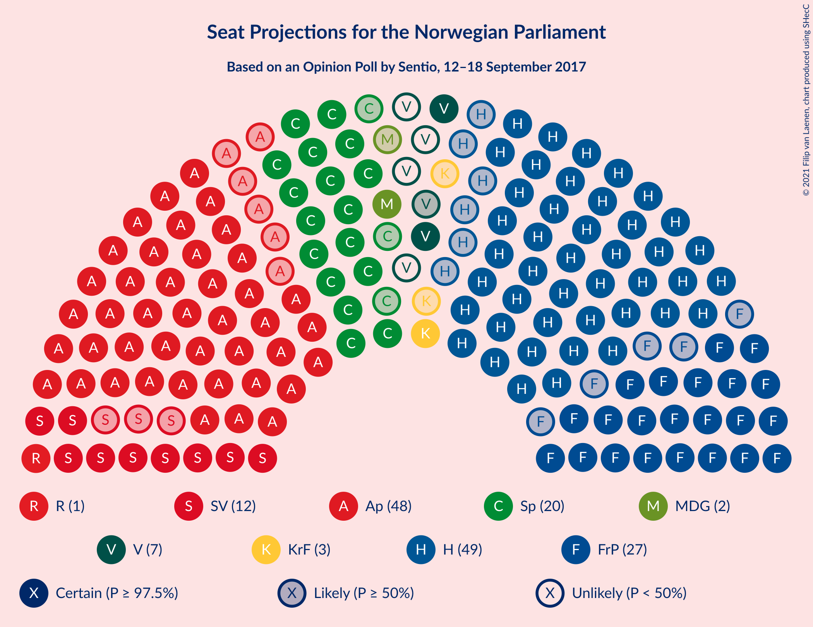
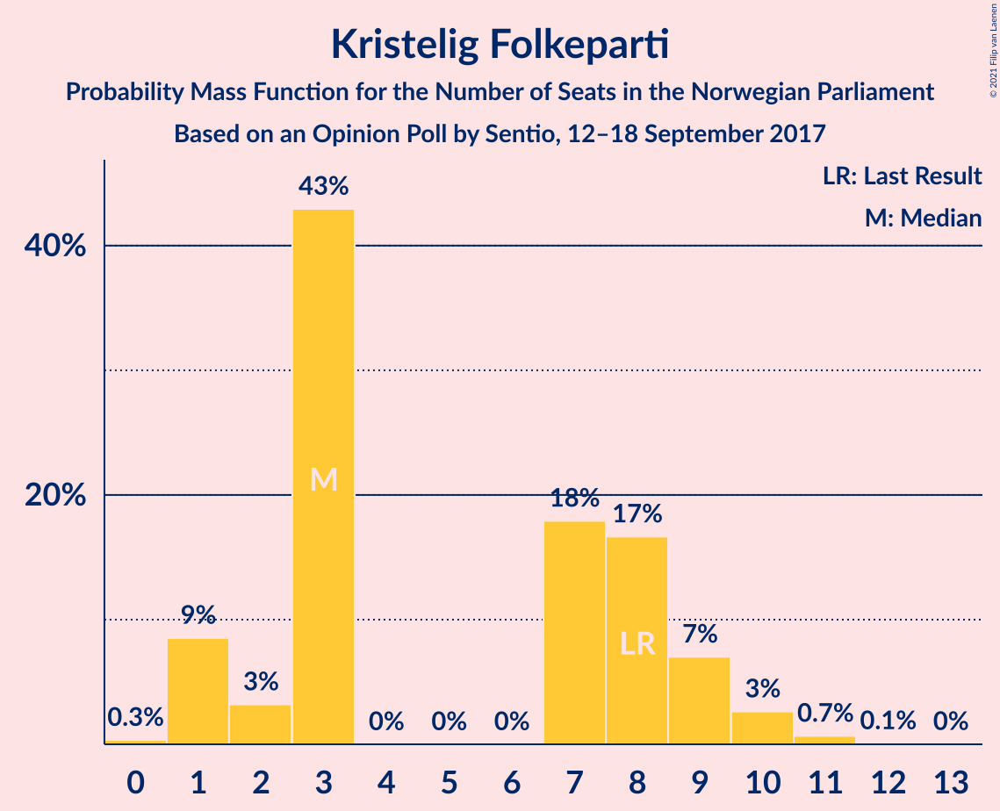
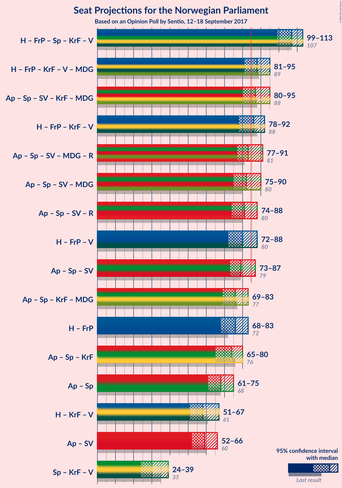
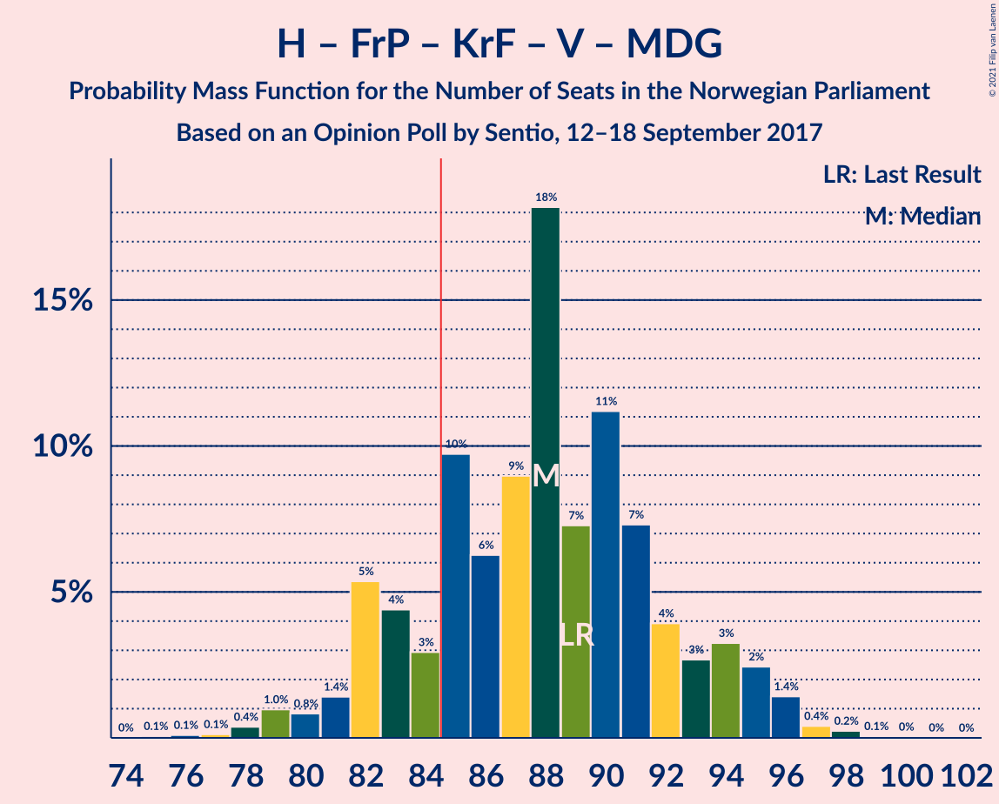
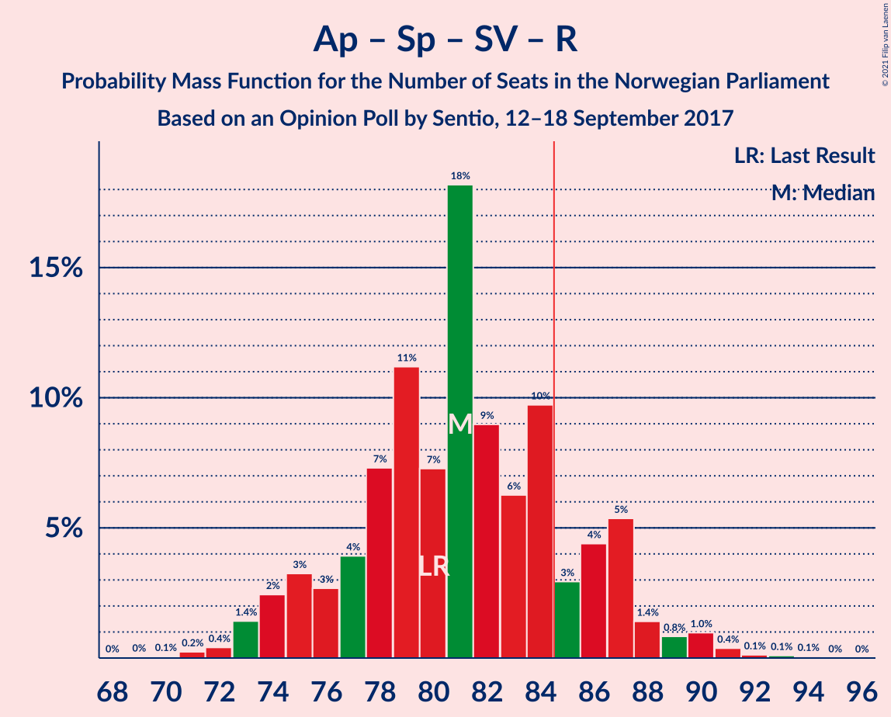
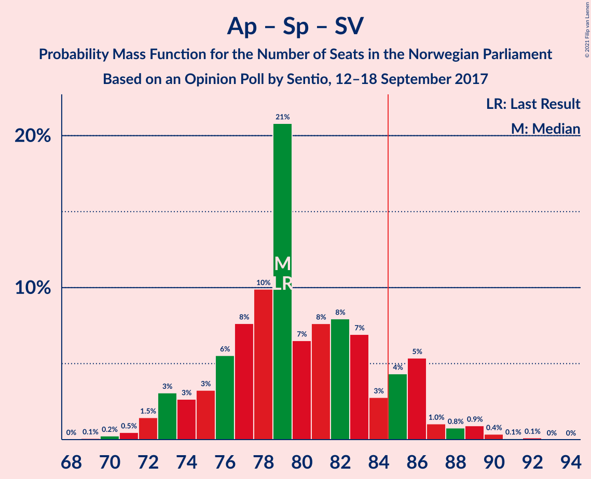
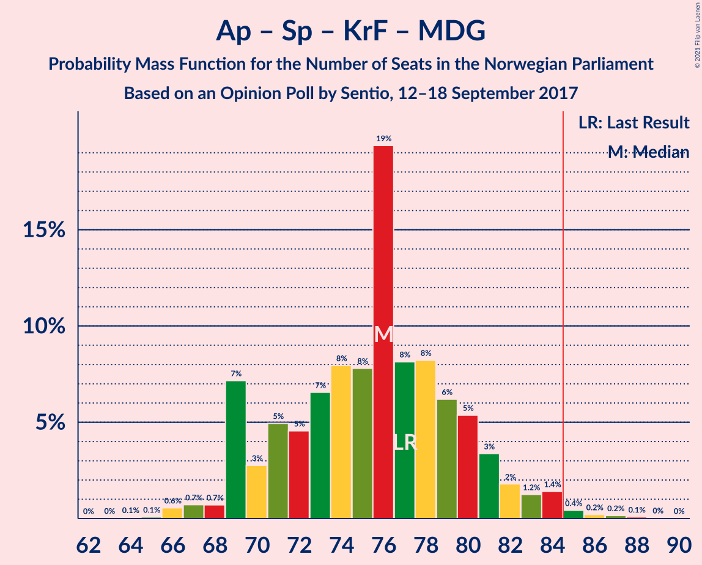
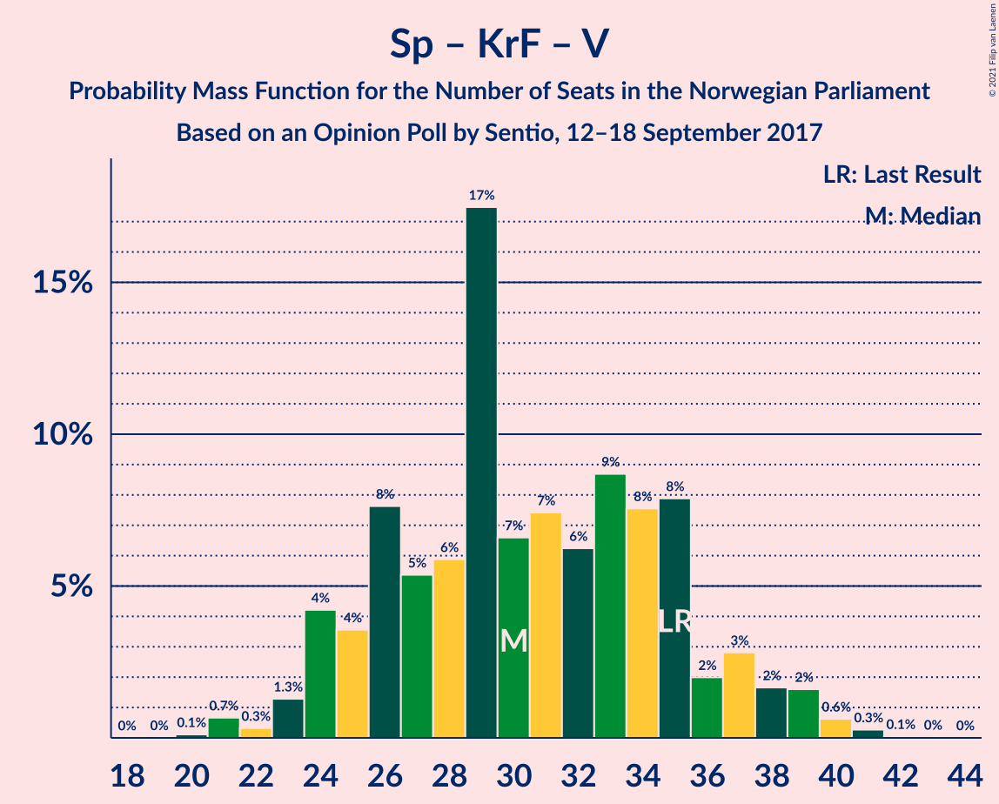

# Opinion Poll by Sentio, 12–18 September 2017

<a href="#voting-intentions">Voting Intentions</a> | <a href="#seats">Seats</a> | <a href="#coalitions">Coalitions</a> | <a href="#technical-information">Technical Information</a>

## Voting Intentions

### Confidence Intervals

| Party | Last Result | Poll Result | 80% Confidence Interval | 90% Confidence Interval | 95% Confidence Interval | 99% Confidence Interval |
|:-----:|:-----------:|:-----------:|:-----------------------:|:-----------------------:|:-----------------------:|:-----------------------:|
| Høyre | 25.0% | 26.8% | 24.9–28.9% |24.4–29.5% |23.9–30.0% |23.0–31.0% |
| Arbeiderpartiet | 27.4% | 26.2% | 24.3–28.3% |23.7–28.9% |23.3–29.4% |22.4–30.4% |
| Fremskrittspartiet | 15.2% | 14.7% | 13.2–16.4% |12.8–16.9% |12.4–17.4% |11.8–18.2% |
| Senterpartiet | 10.3% | 11.4% | 10.0–12.9% |9.7–13.4% |9.3–13.7% |8.7–14.5% |
| Sosialistisk Venstreparti | 6.0% | 6.4% | 5.4–7.6% |5.1–8.0% |4.9–8.3% |4.4–8.9% |
| Venstre | 4.4% | 3.9% | 3.1–4.9% |2.9–5.2% |2.7–5.5% |2.4–6.0% |
| Kristelig Folkeparti | 4.2% | 3.9% | 3.1–4.9% |2.9–5.2% |2.7–5.5% |2.4–6.0% |
| Miljøpartiet De Grønne | 3.2% | 3.2% | 2.6–4.2% |2.4–4.5% |2.2–4.7% |1.9–5.2% |
| Rødt | 2.4% | 2.4% | 1.8–3.2% |1.6–3.5% |1.5–3.7% |1.3–4.1% |

*Note:* The poll result column reflects the actual value used in the calculations. Published results may vary slightly, and in addition be rounded to fewer digits.

## Seats

### Confidence Intervals

| Party | Last Result | Median | 80% Confidence Interval | 90% Confidence Interval | 95% Confidence Interval | 99% Confidence Interval |
|:-----:|:-----------:|:------:|:-----------------------:|:-----------------------:|:-----------------------:|:-----------------------:|
| <a href="#høyre">Høyre</a> | 45 | 48 | 46–51 |45–52 |43–53 |41–55 |
| <a href="#arbeiderpartiet">Arbeiderpartiet</a> | 49 | 47 | 43–52 |43–52 |42–52 |40–54 |
| <a href="#fremskrittspartiet">Fremskrittspartiet</a> | 27 | 26 | 25–29 |25–30 |23–32 |22–32 |
| <a href="#senterpartiet">Senterpartiet</a> | 19 | 20 | 18–23 |17–23 |17–24 |15–26 |
| <a href="#sosialistisk-venstreparti">Sosialistisk Venstreparti</a> | 11 | 13 | 10–14 |10–14 |9–15 |8–16 |
| <a href="#venstre">Venstre</a> | 8 | 8 | 2–9 |2–9 |2–9 |2–10 |
| <a href="#kristelig-folkeparti">Kristelig Folkeparti</a> | 8 | 3 | 3–8 |1–9 |1–9 |1–10 |
| <a href="#miljøpartiet-de-grønne">Miljøpartiet De Grønne</a> | 1 | 2 | 1–7 |1–8 |1–8 |0–9 |
| <a href="#rødt">Rødt</a> | 1 | 1 | 1–2 |1–2 |1–2 |1–2 |

### Høyre

*For a full overview of the results for this party, see the [Høyre](party-høyre.html) page.*

| Number of Seats | Probability | Accumulated | Special Marks |
|:---------------:|:-----------:|:-----------:|:-------------:|
| 39 | 0.1% | 100% |  |
| 40 | 0% | 99.9% |  |
| 41 | 0.4% | 99.9% |  |
| 42 | 0.6% | 99.5% |  |
| 43 | 2% | 98.9% |  |
| 44 | 1.2% | 97% |  |
| 45 | 2% | 96% | Last Result |
| 46 | 10% | 94% |  |
| 47 | 31% | 84% |  |
| 48 | 23% | 54% | Median |
| 49 | 7% | 30% |  |
| 50 | 2% | 24% |  |
| 51 | 16% | 22% |  |
| 52 | 3% | 6% |  |
| 53 | 1.3% | 3% |  |
| 54 | 1.2% | 2% |  |
| 55 | 0.4% | 0.5% |  |
| 56 | 0.1% | 0.1% |  |
| 57 | 0% | 0.1% |  |
| 58 | 0% | 0% |  |

### Arbeiderpartiet

*For a full overview of the results for this party, see the [Arbeiderpartiet](party-arbeiderpartiet.html) page.*

| Number of Seats | Probability | Accumulated | Special Marks |
|:---------------:|:-----------:|:-----------:|:-------------:|
| 39 | 0.1% | 100% |  |
| 40 | 0.4% | 99.8% |  |
| 41 | 0.7% | 99.4% |  |
| 42 | 2% | 98.6% |  |
| 43 | 15% | 97% |  |
| 44 | 2% | 82% |  |
| 45 | 24% | 79% |  |
| 46 | 4% | 55% |  |
| 47 | 7% | 51% | Median |
| 48 | 3% | 44% |  |
| 49 | 4% | 42% | Last Result |
| 50 | 11% | 38% |  |
| 51 | 2% | 27% |  |
| 52 | 24% | 25% |  |
| 53 | 0.4% | 1.1% |  |
| 54 | 0.2% | 0.7% |  |
| 55 | 0% | 0.5% |  |
| 56 | 0.1% | 0.4% |  |
| 57 | 0.1% | 0.3% |  |
| 58 | 0.2% | 0.2% |  |
| 59 | 0% | 0% |  |

### Fremskrittspartiet

*For a full overview of the results for this party, see the [Fremskrittspartiet](party-fremskrittspartiet.html) page.*

| Number of Seats | Probability | Accumulated | Special Marks |
|:---------------:|:-----------:|:-----------:|:-------------:|
| 20 | 0% | 100% |  |
| 21 | 0.3% | 99.9% |  |
| 22 | 0.4% | 99.7% |  |
| 23 | 3% | 99.3% |  |
| 24 | 1.0% | 97% |  |
| 25 | 10% | 96% |  |
| 26 | 44% | 86% | Median |
| 27 | 27% | 42% | Last Result |
| 28 | 2% | 15% |  |
| 29 | 4% | 13% |  |
| 30 | 4% | 9% |  |
| 31 | 1.2% | 4% |  |
| 32 | 3% | 3% |  |
| 33 | 0.4% | 0.5% |  |
| 34 | 0% | 0.1% |  |
| 35 | 0% | 0% |  |

### Senterpartiet

*For a full overview of the results for this party, see the [Senterpartiet](party-senterpartiet.html) page.*

| Number of Seats | Probability | Accumulated | Special Marks |
|:---------------:|:-----------:|:-----------:|:-------------:|
| 15 | 0.5% | 100% |  |
| 16 | 0.2% | 99.5% |  |
| 17 | 5% | 99.2% |  |
| 18 | 7% | 94% |  |
| 19 | 4% | 87% | Last Result |
| 20 | 39% | 83% | Median |
| 21 | 4% | 44% |  |
| 22 | 16% | 40% |  |
| 23 | 21% | 24% |  |
| 24 | 2% | 3% |  |
| 25 | 0.2% | 1.0% |  |
| 26 | 0.6% | 0.7% |  |
| 27 | 0.1% | 0.1% |  |
| 28 | 0.1% | 0.1% |  |
| 29 | 0% | 0% |  |

### Sosialistisk Venstreparti

*For a full overview of the results for this party, see the [Sosialistisk Venstreparti](party-sosialistiskvenstreparti.html) page.*

| Number of Seats | Probability | Accumulated | Special Marks |
|:---------------:|:-----------:|:-----------:|:-------------:|
| 7 | 0.1% | 100% |  |
| 8 | 0.8% | 99.9% |  |
| 9 | 4% | 99.1% |  |
| 10 | 6% | 96% |  |
| 11 | 9% | 89% | Last Result |
| 12 | 30% | 80% |  |
| 13 | 23% | 50% | Median |
| 14 | 23% | 27% |  |
| 15 | 3% | 4% |  |
| 16 | 0.4% | 0.7% |  |
| 17 | 0.3% | 0.3% |  |
| 18 | 0% | 0% |  |

### Venstre

*For a full overview of the results for this party, see the [Venstre](party-venstre.html) page.*

| Number of Seats | Probability | Accumulated | Special Marks |
|:---------------:|:-----------:|:-----------:|:-------------:|
| 1 | 0.2% | 100% |  |
| 2 | 22% | 99.8% |  |
| 3 | 22% | 78% |  |
| 4 | 0% | 55% |  |
| 5 | 0% | 55% |  |
| 6 | 0% | 55% |  |
| 7 | 2% | 55% |  |
| 8 | 24% | 53% | Last Result, Median |
| 9 | 27% | 29% |  |
| 10 | 1.4% | 2% |  |
| 11 | 0.2% | 0.2% |  |
| 12 | 0% | 0% |  |

### Kristelig Folkeparti

*For a full overview of the results for this party, see the [Kristelig Folkeparti](party-kristeligfolkeparti.html) page.*

| Number of Seats | Probability | Accumulated | Special Marks |
|:---------------:|:-----------:|:-----------:|:-------------:|
| 0 | 0.2% | 100% |  |
| 1 | 6% | 99.8% |  |
| 2 | 3% | 94% |  |
| 3 | 68% | 91% | Median |
| 4 | 0% | 22% |  |
| 5 | 0% | 22% |  |
| 6 | 0% | 22% |  |
| 7 | 3% | 22% |  |
| 8 | 11% | 20% | Last Result |
| 9 | 7% | 9% |  |
| 10 | 2% | 2% |  |
| 11 | 0.1% | 0.2% |  |
| 12 | 0.1% | 0.1% |  |
| 13 | 0% | 0% |  |

### Miljøpartiet De Grønne

*For a full overview of the results for this party, see the [Miljøpartiet De Grønne](party-miljøpartietdegrønne.html) page.*

| Number of Seats | Probability | Accumulated | Special Marks |
|:---------------:|:-----------:|:-----------:|:-------------:|
| 0 | 1.4% | 100% |  |
| 1 | 32% | 98.6% | Last Result |
| 2 | 50% | 67% | Median |
| 3 | 2% | 17% |  |
| 4 | 0% | 14% |  |
| 5 | 0% | 14% |  |
| 6 | 0% | 14% |  |
| 7 | 9% | 14% |  |
| 8 | 3% | 5% |  |
| 9 | 2% | 2% |  |
| 10 | 0.4% | 0.4% |  |
| 11 | 0% | 0% |  |

### Rødt

*For a full overview of the results for this party, see the [Rødt](party-rødt.html) page.*

| Number of Seats | Probability | Accumulated | Special Marks |
|:---------------:|:-----------:|:-----------:|:-------------:|
| 0 | 0.1% | 100% |  |
| 1 | 74% | 99.9% | Last Result, Median |
| 2 | 26% | 26% |  |
| 3 | 0% | 0.2% |  |
| 4 | 0% | 0.2% |  |
| 5 | 0% | 0.2% |  |
| 6 | 0% | 0.2% |  |
| 7 | 0% | 0.2% |  |
| 8 | 0.2% | 0.2% |  |
| 9 | 0% | 0% |  |

## Coalitions

### Confidence Intervals

| Coalition | Last Result | Median | Majority? | 80% Confidence Interval | 90% Confidence Interval | 95% Confidence Interval | 99% Confidence Interval |
|:---------:|:-----------:|:------:|:---------:|:-----------------------:|:-----------------------:|:-----------------------:|:-----------------------:|
| Høyre – Fremskrittspartiet – Senterpartiet – Kristelig Folkeparti – Venstre | 107 | 104 | 100% | 100–111 | 100–111 | 100–112 | 97–115 |
| Arbeiderpartiet – Senterpartiet – Sosialistisk Venstreparti – Kristelig Folkeparti – Miljøpartiet De Grønne | 88 | 87 | 75% | 82–92 | 82–93 | 82–94 | 79–95 |
| Høyre – Fremskrittspartiet – Kristelig Folkeparti – Venstre – Miljøpartiet De Grønne | 89 | 87 | 75% | 82–91 | 82–93 | 82–94 | 80–96 |
| Høyre – Fremskrittspartiet – Kristelig Folkeparti – Venstre | 88 | 85 | 52% | 80–89 | 80–90 | 80–91 | 76–94 |
| Arbeiderpartiet – Senterpartiet – Sosialistisk Venstreparti – Miljøpartiet De Grønne – Rødt | 81 | 84 | 48% | 80–89 | 79–89 | 78–89 | 75–93 |
| Arbeiderpartiet – Senterpartiet – Sosialistisk Venstreparti – Miljøpartiet De Grønne | 80 | 83 | 30% | 79–88 | 78–88 | 77–88 | 74–92 |
| Arbeiderpartiet – Senterpartiet – Sosialistisk Venstreparti – Rødt | 80 | 82 | 25% | 78–87 | 76–87 | 75–87 | 73–89 |
| Arbeiderpartiet – Senterpartiet – Sosialistisk Venstreparti | 79 | 80 | 23% | 76–86 | 75–86 | 74–86 | 72–88 |
| Høyre – Fremskrittspartiet – Venstre | 80 | 81 | 20% | 75–86 | 75–86 | 74–86 | 72–89 |
| Arbeiderpartiet – Senterpartiet – Kristelig Folkeparti – Miljøpartiet De Grønne | 77 | 75 | 0.6% | 69–80 | 69–81 | 69–82 | 68–85 |
| Høyre – Fremskrittspartiet | 72 | 74 | 0% | 72–78 | 72–80 | 70–81 | 67–84 |
| Arbeiderpartiet – Senterpartiet – Kristelig Folkeparti | 76 | 73 | 0.1% | 68–75 | 68–77 | 66–80 | 65–81 |
| Arbeiderpartiet – Senterpartiet | 68 | 68 | 0% | 65–72 | 63–72 | 61–73 | 60–76 |
| Arbeiderpartiet – Sosialistisk Venstreparti | 60 | 59 | 0% | 56–66 | 55–66 | 54–66 | 51–67 |
| Høyre – Kristelig Folkeparti – Venstre | 61 | 58 | 0% | 53–63 | 53–63 | 53–63 | 50–67 |
| Senterpartiet – Kristelig Folkeparti – Venstre | 35 | 31 | 0% | 26–34 | 26–35 | 25–37 | 23–39 |

### Høyre – Fremskrittspartiet – Senterpartiet – Kristelig Folkeparti – Venstre

| Number of Seats | Probability | Accumulated | Special Marks |
|:---------------:|:-----------:|:-----------:|:-------------:|
| 93 | 0.1% | 100% |  |
| 94 | 0% | 99.9% |  |
| 95 | 0.2% | 99.9% |  |
| 96 | 0% | 99.7% |  |
| 97 | 0.5% | 99.7% |  |
| 98 | 0.7% | 99.2% |  |
| 99 | 0.3% | 98.5% |  |
| 100 | 23% | 98% |  |
| 101 | 0.7% | 75% |  |
| 102 | 4% | 75% |  |
| 103 | 4% | 71% |  |
| 104 | 18% | 67% |  |
| 105 | 2% | 49% | Median |
| 106 | 3% | 47% |  |
| 107 | 3% | 44% | Last Result |
| 108 | 19% | 41% |  |
| 109 | 1.1% | 23% |  |
| 110 | 2% | 22% |  |
| 111 | 16% | 20% |  |
| 112 | 2% | 4% |  |
| 113 | 0.5% | 2% |  |
| 114 | 0.4% | 1.2% |  |
| 115 | 0.7% | 0.8% |  |
| 116 | 0.1% | 0.1% |  |
| 117 | 0.1% | 0.1% |  |
| 118 | 0% | 0% |  |

### Arbeiderpartiet – Senterpartiet – Sosialistisk Venstreparti – Kristelig Folkeparti – Miljøpartiet De Grønne

| Number of Seats | Probability | Accumulated | Special Marks |
|:---------------:|:-----------:|:-----------:|:-------------:|
| 75 | 0.1% | 100% |  |
| 76 | 0% | 99.9% |  |
| 77 | 0% | 99.9% |  |
| 78 | 0.3% | 99.8% |  |
| 79 | 1.4% | 99.6% |  |
| 80 | 0.1% | 98% |  |
| 81 | 0.4% | 98% |  |
| 82 | 14% | 98% |  |
| 83 | 4% | 83% |  |
| 84 | 4% | 79% |  |
| 85 | 16% | 75% | Median, Majority |
| 86 | 6% | 59% |  |
| 87 | 12% | 53% |  |
| 88 | 3% | 41% | Last Result |
| 89 | 1.5% | 38% |  |
| 90 | 3% | 37% |  |
| 91 | 22% | 34% |  |
| 92 | 5% | 12% |  |
| 93 | 4% | 6% |  |
| 94 | 1.0% | 3% |  |
| 95 | 1.3% | 2% |  |
| 96 | 0.1% | 0.4% |  |
| 97 | 0.1% | 0.2% |  |
| 98 | 0.1% | 0.2% |  |
| 99 | 0% | 0.1% |  |
| 100 | 0% | 0% |  |

### Høyre – Fremskrittspartiet – Kristelig Folkeparti – Venstre – Miljøpartiet De Grønne

| Number of Seats | Probability | Accumulated | Special Marks |
|:---------------:|:-----------:|:-----------:|:-------------:|
| 76 | 0% | 100% |  |
| 77 | 0% | 99.9% |  |
| 78 | 0.2% | 99.9% |  |
| 79 | 0.2% | 99.7% |  |
| 80 | 0.2% | 99.6% |  |
| 81 | 1.1% | 99.4% |  |
| 82 | 21% | 98% |  |
| 83 | 0.7% | 77% |  |
| 84 | 2% | 77% |  |
| 85 | 1.1% | 75% | Majority |
| 86 | 16% | 74% |  |
| 87 | 16% | 57% | Median |
| 88 | 4% | 41% |  |
| 89 | 3% | 37% | Last Result |
| 90 | 18% | 35% |  |
| 91 | 8% | 17% |  |
| 92 | 2% | 9% |  |
| 93 | 3% | 7% |  |
| 94 | 1.0% | 3% |  |
| 95 | 1.4% | 2% |  |
| 96 | 0.6% | 0.9% |  |
| 97 | 0.2% | 0.3% |  |
| 98 | 0.1% | 0.2% |  |
| 99 | 0.1% | 0.1% |  |
| 100 | 0% | 0% |  |

### Høyre – Fremskrittspartiet – Kristelig Folkeparti – Venstre

| Number of Seats | Probability | Accumulated | Special Marks |
|:---------------:|:-----------:|:-----------:|:-------------:|
| 73 | 0% | 100% |  |
| 74 | 0.1% | 99.9% |  |
| 75 | 0.1% | 99.8% |  |
| 76 | 0.3% | 99.7% |  |
| 77 | 0.3% | 99.5% |  |
| 78 | 0.5% | 99.2% |  |
| 79 | 0.9% | 98.7% |  |
| 80 | 22% | 98% |  |
| 81 | 1.1% | 76% |  |
| 82 | 2% | 75% |  |
| 83 | 4% | 73% |  |
| 84 | 17% | 69% |  |
| 85 | 19% | 52% | Median, Majority |
| 86 | 4% | 33% |  |
| 87 | 3% | 29% |  |
| 88 | 6% | 26% | Last Result |
| 89 | 15% | 20% |  |
| 90 | 1.2% | 5% |  |
| 91 | 2% | 4% |  |
| 92 | 0.1% | 2% |  |
| 93 | 0.8% | 1.5% |  |
| 94 | 0.5% | 0.7% |  |
| 95 | 0.1% | 0.2% |  |
| 96 | 0% | 0.1% |  |
| 97 | 0% | 0.1% |  |
| 98 | 0% | 0% |  |

### Arbeiderpartiet – Senterpartiet – Sosialistisk Venstreparti – Miljøpartiet De Grønne – Rødt

| Number of Seats | Probability | Accumulated | Special Marks |
|:---------------:|:-----------:|:-----------:|:-------------:|
| 72 | 0% | 100% |  |
| 73 | 0% | 99.9% |  |
| 74 | 0.1% | 99.9% |  |
| 75 | 0.5% | 99.8% |  |
| 76 | 0.8% | 99.3% |  |
| 77 | 0.1% | 98.5% |  |
| 78 | 2% | 98% |  |
| 79 | 1.2% | 96% |  |
| 80 | 15% | 95% |  |
| 81 | 6% | 80% | Last Result |
| 82 | 3% | 74% |  |
| 83 | 4% | 71% | Median |
| 84 | 19% | 67% |  |
| 85 | 17% | 48% | Majority |
| 86 | 4% | 31% |  |
| 87 | 2% | 27% |  |
| 88 | 1.1% | 25% |  |
| 89 | 22% | 24% |  |
| 90 | 0.9% | 2% |  |
| 91 | 0.5% | 1.3% |  |
| 92 | 0.3% | 0.8% |  |
| 93 | 0.3% | 0.5% |  |
| 94 | 0.1% | 0.3% |  |
| 95 | 0.1% | 0.2% |  |
| 96 | 0% | 0.1% |  |
| 97 | 0% | 0% |  |

### Arbeiderpartiet – Senterpartiet – Sosialistisk Venstreparti – Miljøpartiet De Grønne

| Number of Seats | Probability | Accumulated | Special Marks |
|:---------------:|:-----------:|:-----------:|:-------------:|
| 70 | 0% | 100% |  |
| 71 | 0% | 99.9% |  |
| 72 | 0.1% | 99.9% |  |
| 73 | 0% | 99.8% |  |
| 74 | 0.5% | 99.7% |  |
| 75 | 0.8% | 99.2% |  |
| 76 | 0.2% | 98% |  |
| 77 | 3% | 98% |  |
| 78 | 2% | 96% |  |
| 79 | 15% | 94% |  |
| 80 | 5% | 78% | Last Result |
| 81 | 3% | 74% |  |
| 82 | 18% | 71% | Median |
| 83 | 10% | 53% |  |
| 84 | 13% | 43% |  |
| 85 | 4% | 30% | Majority |
| 86 | 2% | 26% |  |
| 87 | 2% | 24% |  |
| 88 | 20% | 22% |  |
| 89 | 0.9% | 2% |  |
| 90 | 0.6% | 1.2% |  |
| 91 | 0.1% | 0.7% |  |
| 92 | 0.3% | 0.5% |  |
| 93 | 0.1% | 0.2% |  |
| 94 | 0.1% | 0.1% |  |
| 95 | 0% | 0% |  |

### Arbeiderpartiet – Senterpartiet – Sosialistisk Venstreparti – Rødt

| Number of Seats | Probability | Accumulated | Special Marks |
|:---------------:|:-----------:|:-----------:|:-------------:|
| 70 | 0.1% | 100% |  |
| 71 | 0.1% | 99.9% |  |
| 72 | 0.2% | 99.8% |  |
| 73 | 0.6% | 99.7% |  |
| 74 | 1.4% | 99.1% |  |
| 75 | 1.0% | 98% |  |
| 76 | 3% | 97% |  |
| 77 | 2% | 93% |  |
| 78 | 8% | 91% |  |
| 79 | 18% | 83% |  |
| 80 | 3% | 65% | Last Result |
| 81 | 4% | 63% | Median |
| 82 | 16% | 59% |  |
| 83 | 16% | 43% |  |
| 84 | 1.1% | 26% |  |
| 85 | 2% | 25% | Majority |
| 86 | 0.7% | 23% |  |
| 87 | 21% | 23% |  |
| 88 | 1.1% | 2% |  |
| 89 | 0.2% | 0.6% |  |
| 90 | 0.2% | 0.4% |  |
| 91 | 0.2% | 0.3% |  |
| 92 | 0% | 0.1% |  |
| 93 | 0% | 0.1% |  |
| 94 | 0% | 0% |  |

### Arbeiderpartiet – Senterpartiet – Sosialistisk Venstreparti

| Number of Seats | Probability | Accumulated | Special Marks |
|:---------------:|:-----------:|:-----------:|:-------------:|
| 69 | 0.1% | 100% |  |
| 70 | 0.1% | 99.9% |  |
| 71 | 0.2% | 99.8% |  |
| 72 | 0.6% | 99.6% |  |
| 73 | 1.4% | 98.9% |  |
| 74 | 1.2% | 98% |  |
| 75 | 4% | 96% |  |
| 76 | 7% | 93% |  |
| 77 | 3% | 85% |  |
| 78 | 18% | 82% |  |
| 79 | 2% | 64% | Last Result |
| 80 | 17% | 62% | Median |
| 81 | 3% | 45% |  |
| 82 | 17% | 43% |  |
| 83 | 1.0% | 26% |  |
| 84 | 2% | 25% |  |
| 85 | 1.1% | 23% | Majority |
| 86 | 21% | 22% |  |
| 87 | 0.1% | 0.7% |  |
| 88 | 0.2% | 0.6% |  |
| 89 | 0.3% | 0.4% |  |
| 90 | 0% | 0.1% |  |
| 91 | 0% | 0.1% |  |
| 92 | 0% | 0.1% |  |
| 93 | 0% | 0% |  |

### Høyre – Fremskrittspartiet – Venstre

| Number of Seats | Probability | Accumulated | Special Marks |
|:---------------:|:-----------:|:-----------:|:-------------:|
| 69 | 0.1% | 100% |  |
| 70 | 0.1% | 99.9% |  |
| 71 | 0.1% | 99.8% |  |
| 72 | 1.1% | 99.7% |  |
| 73 | 1.0% | 98.6% |  |
| 74 | 0.7% | 98% |  |
| 75 | 8% | 97% |  |
| 76 | 0.3% | 89% |  |
| 77 | 23% | 88% |  |
| 78 | 3% | 66% |  |
| 79 | 0.6% | 62% |  |
| 80 | 3% | 62% | Last Result |
| 81 | 13% | 59% |  |
| 82 | 18% | 45% | Median |
| 83 | 2% | 27% |  |
| 84 | 5% | 25% |  |
| 85 | 4% | 20% | Majority |
| 86 | 14% | 17% |  |
| 87 | 0.4% | 2% |  |
| 88 | 0.1% | 2% |  |
| 89 | 1.4% | 2% |  |
| 90 | 0.3% | 0.4% |  |
| 91 | 0% | 0.1% |  |
| 92 | 0.1% | 0.1% |  |
| 93 | 0% | 0% |  |

### Arbeiderpartiet – Senterpartiet – Kristelig Folkeparti – Miljøpartiet De Grønne

| Number of Seats | Probability | Accumulated | Special Marks |
|:---------------:|:-----------:|:-----------:|:-------------:|
| 64 | 0.1% | 100% |  |
| 65 | 0.1% | 99.9% |  |
| 66 | 0.1% | 99.8% |  |
| 67 | 0.1% | 99.7% |  |
| 68 | 0.4% | 99.6% |  |
| 69 | 16% | 99.2% |  |
| 70 | 3% | 83% |  |
| 71 | 3% | 80% |  |
| 72 | 0.7% | 77% | Median |
| 73 | 15% | 76% |  |
| 74 | 7% | 61% |  |
| 75 | 13% | 54% |  |
| 76 | 2% | 41% |  |
| 77 | 23% | 39% | Last Result |
| 78 | 1.0% | 16% |  |
| 79 | 1.3% | 15% |  |
| 80 | 5% | 14% |  |
| 81 | 6% | 9% |  |
| 82 | 2% | 3% |  |
| 83 | 1.0% | 2% |  |
| 84 | 0.1% | 0.7% |  |
| 85 | 0.4% | 0.6% | Majority |
| 86 | 0% | 0.2% |  |
| 87 | 0.1% | 0.2% |  |
| 88 | 0% | 0.1% |  |
| 89 | 0% | 0% |  |

### Høyre – Fremskrittspartiet

| Number of Seats | Probability | Accumulated | Special Marks |
|:---------------:|:-----------:|:-----------:|:-------------:|
| 63 | 0% | 100% |  |
| 64 | 0% | 99.9% |  |
| 65 | 0.1% | 99.9% |  |
| 66 | 0.2% | 99.9% |  |
| 67 | 0.4% | 99.7% |  |
| 68 | 0.2% | 99.3% |  |
| 69 | 0.9% | 99.1% |  |
| 70 | 1.3% | 98% |  |
| 71 | 2% | 97% |  |
| 72 | 12% | 95% | Last Result |
| 73 | 9% | 83% |  |
| 74 | 38% | 74% | Median |
| 75 | 3% | 36% |  |
| 76 | 6% | 32% |  |
| 77 | 16% | 26% |  |
| 78 | 1.5% | 10% |  |
| 79 | 0.9% | 9% |  |
| 80 | 3% | 8% |  |
| 81 | 2% | 4% |  |
| 82 | 0.2% | 2% |  |
| 83 | 1.2% | 2% |  |
| 84 | 0.7% | 0.8% |  |
| 85 | 0% | 0% | Majority |

### Arbeiderpartiet – Senterpartiet – Kristelig Folkeparti

| Number of Seats | Probability | Accumulated | Special Marks |
|:---------------:|:-----------:|:-----------:|:-------------:|
| 62 | 0.1% | 100% |  |
| 63 | 0.1% | 99.9% |  |
| 64 | 0.2% | 99.9% |  |
| 65 | 1.1% | 99.7% |  |
| 66 | 2% | 98.6% |  |
| 67 | 0.3% | 97% |  |
| 68 | 19% | 96% |  |
| 69 | 3% | 77% |  |
| 70 | 4% | 75% | Median |
| 71 | 15% | 71% |  |
| 72 | 3% | 56% |  |
| 73 | 15% | 53% |  |
| 74 | 6% | 38% |  |
| 75 | 22% | 31% |  |
| 76 | 2% | 10% | Last Result |
| 77 | 4% | 8% |  |
| 78 | 0.7% | 4% |  |
| 79 | 0.4% | 3% |  |
| 80 | 0.4% | 3% |  |
| 81 | 2% | 2% |  |
| 82 | 0.1% | 0.4% |  |
| 83 | 0.3% | 0.4% |  |
| 84 | 0% | 0.1% |  |
| 85 | 0% | 0.1% | Majority |
| 86 | 0% | 0% |  |

### Arbeiderpartiet – Senterpartiet

| Number of Seats | Probability | Accumulated | Special Marks |
|:---------------:|:-----------:|:-----------:|:-------------:|
| 58 | 0.1% | 100% |  |
| 59 | 0.2% | 99.9% |  |
| 60 | 1.1% | 99.7% |  |
| 61 | 1.1% | 98.6% |  |
| 62 | 0.7% | 97% |  |
| 63 | 2% | 97% |  |
| 64 | 2% | 95% |  |
| 65 | 23% | 92% |  |
| 66 | 2% | 69% |  |
| 67 | 6% | 67% | Median |
| 68 | 16% | 61% | Last Result |
| 69 | 6% | 45% |  |
| 70 | 14% | 39% |  |
| 71 | 1.1% | 25% |  |
| 72 | 20% | 24% |  |
| 73 | 2% | 4% |  |
| 74 | 0.7% | 2% |  |
| 75 | 0.6% | 1.3% |  |
| 76 | 0.4% | 0.7% |  |
| 77 | 0% | 0.3% |  |
| 78 | 0.2% | 0.3% |  |
| 79 | 0.1% | 0.1% |  |
| 80 | 0% | 0% |  |

### Arbeiderpartiet – Sosialistisk Venstreparti

| Number of Seats | Probability | Accumulated | Special Marks |
|:---------------:|:-----------:|:-----------:|:-------------:|
| 49 | 0.1% | 100% |  |
| 50 | 0.1% | 99.9% |  |
| 51 | 0.9% | 99.8% |  |
| 52 | 0.3% | 98.9% |  |
| 53 | 1.0% | 98.6% |  |
| 54 | 2% | 98% |  |
| 55 | 3% | 96% |  |
| 56 | 21% | 93% |  |
| 57 | 20% | 72% |  |
| 58 | 2% | 52% |  |
| 59 | 5% | 50% |  |
| 60 | 2% | 46% | Last Result, Median |
| 61 | 3% | 43% |  |
| 62 | 11% | 40% |  |
| 63 | 1.5% | 29% |  |
| 64 | 5% | 28% |  |
| 65 | 2% | 23% |  |
| 66 | 20% | 21% |  |
| 67 | 0.1% | 0.5% |  |
| 68 | 0% | 0.4% |  |
| 69 | 0.3% | 0.4% |  |
| 70 | 0% | 0.1% |  |
| 71 | 0.1% | 0.1% |  |
| 72 | 0% | 0% |  |

### Høyre – Kristelig Folkeparti – Venstre

| Number of Seats | Probability | Accumulated | Special Marks |
|:---------------:|:-----------:|:-----------:|:-------------:|
| 48 | 0.1% | 100% |  |
| 49 | 0.1% | 99.8% |  |
| 50 | 0.3% | 99.7% |  |
| 51 | 0.3% | 99.3% |  |
| 52 | 0.5% | 99.1% |  |
| 53 | 24% | 98.5% |  |
| 54 | 2% | 75% |  |
| 55 | 1.5% | 73% |  |
| 56 | 1.3% | 72% |  |
| 57 | 7% | 70% |  |
| 58 | 14% | 63% |  |
| 59 | 21% | 49% | Median |
| 60 | 1.2% | 28% |  |
| 61 | 6% | 27% | Last Result |
| 62 | 3% | 21% |  |
| 63 | 16% | 18% |  |
| 64 | 0.3% | 2% |  |
| 65 | 1.3% | 2% |  |
| 66 | 0.3% | 0.8% |  |
| 67 | 0.3% | 0.5% |  |
| 68 | 0.1% | 0.2% |  |
| 69 | 0.1% | 0.1% |  |
| 70 | 0% | 0.1% |  |
| 71 | 0% | 0% |  |

### Senterpartiet – Kristelig Folkeparti – Venstre

| Number of Seats | Probability | Accumulated | Special Marks |
|:---------------:|:-----------:|:-----------:|:-------------:|
| 20 | 0.1% | 100% |  |
| 21 | 0.2% | 99.9% |  |
| 22 | 0.1% | 99.7% |  |
| 23 | 0.7% | 99.7% |  |
| 24 | 1.4% | 99.0% |  |
| 25 | 1.2% | 98% |  |
| 26 | 20% | 96% |  |
| 27 | 5% | 76% |  |
| 28 | 7% | 71% |  |
| 29 | 4% | 65% |  |
| 30 | 2% | 61% |  |
| 31 | 9% | 59% | Median |
| 32 | 12% | 49% |  |
| 33 | 2% | 37% |  |
| 34 | 30% | 35% |  |
| 35 | 0.7% | 5% | Last Result |
| 36 | 1.5% | 4% |  |
| 37 | 0.8% | 3% |  |
| 38 | 0.5% | 2% |  |
| 39 | 1.3% | 2% |  |
| 40 | 0.3% | 0.3% |  |
| 41 | 0% | 0.1% |  |
| 42 | 0% | 0.1% |  |
| 43 | 0% | 0% |  |

## Technical Information

### Opinion Poll

+ **Polling firm:** Sentio
+ **Commissioner(s):** —
+ **Fieldwork period:** 12–18 September 2017

### Calculations

+ **Sample size:** 801
+ **Simulations done:** 131,072
+ **Error estimate:** 3.87%

