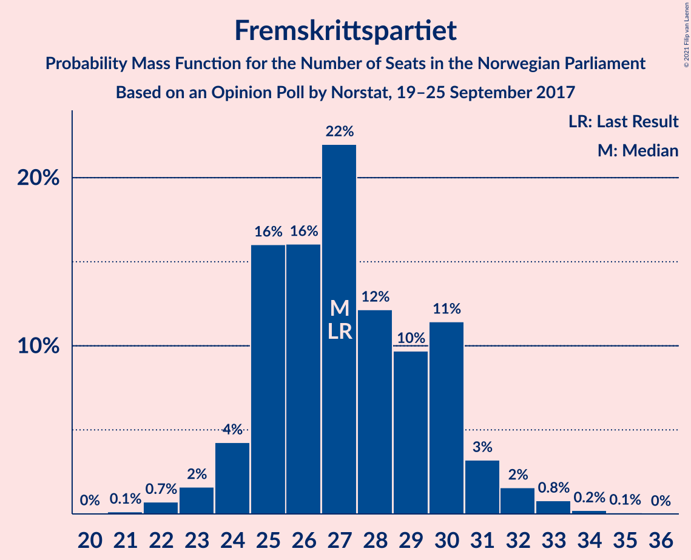
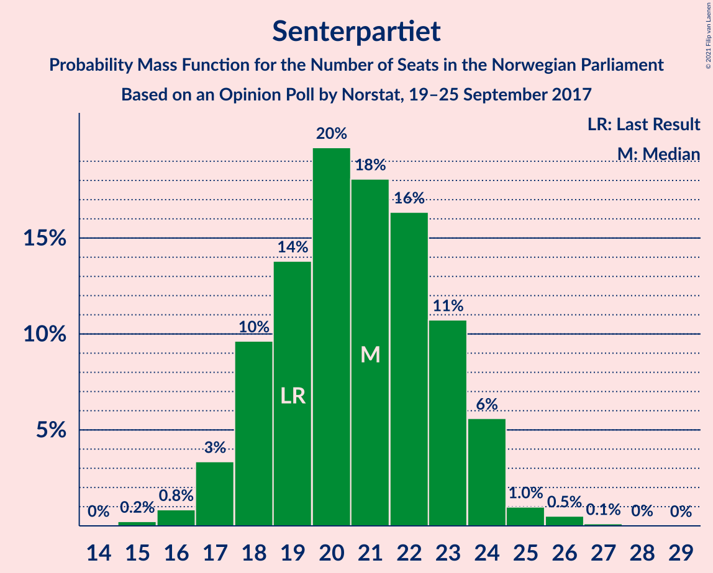
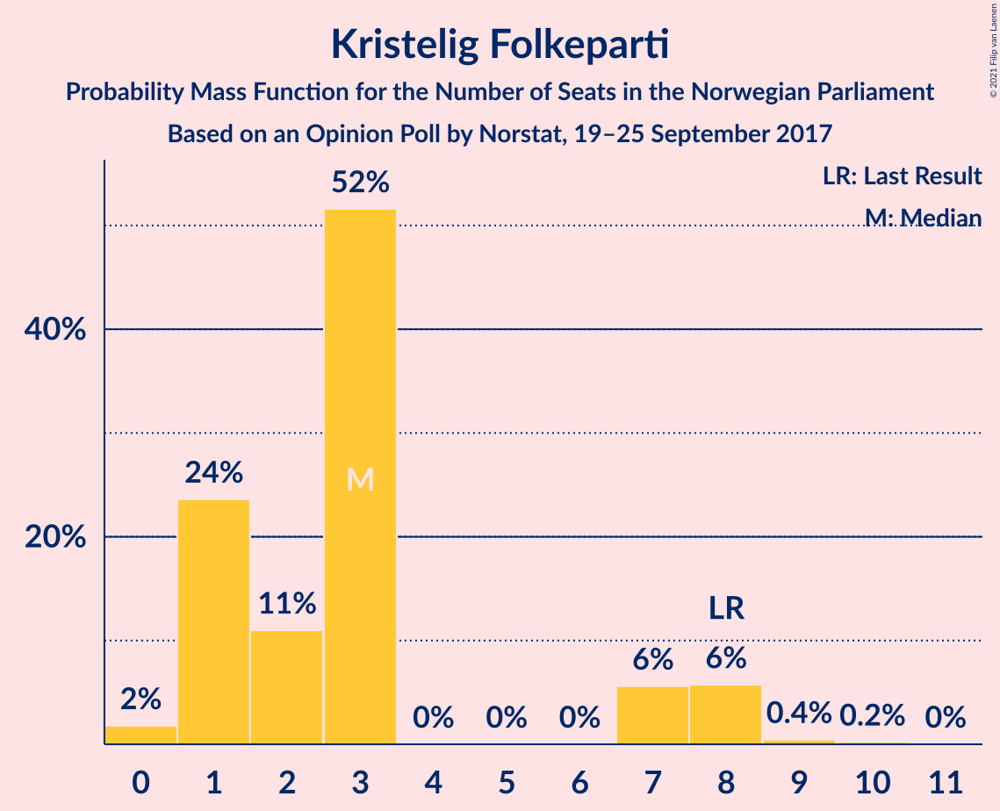
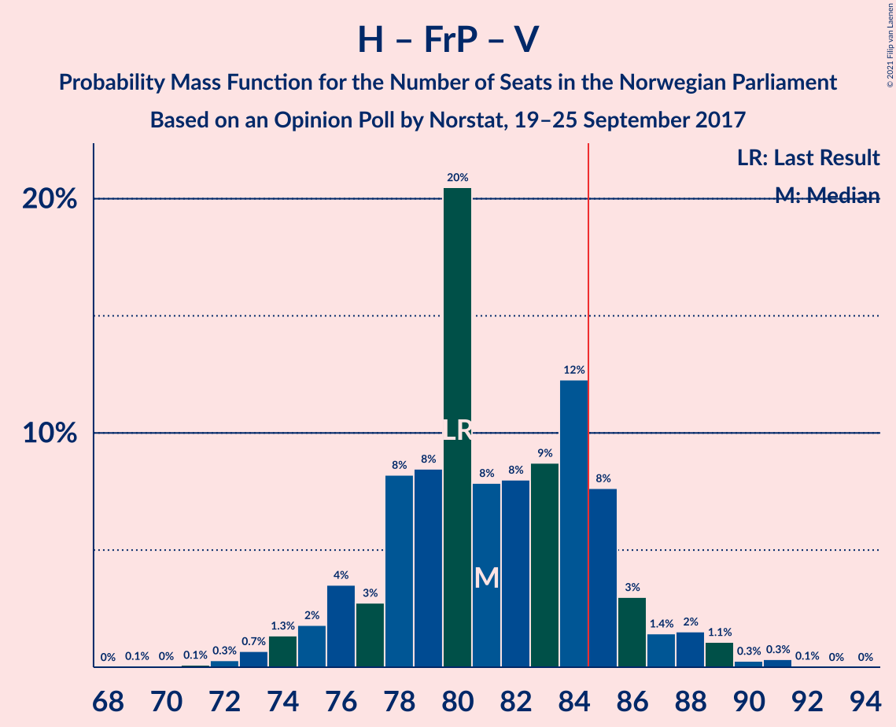

# Opinion Poll by Norstat, 19–25 September 2017

<a href="#voting-intentions">Voting Intentions</a> | <a href="#seats">Seats</a> | <a href="#coalitions">Coalitions</a> | <a href="#technical-information">Technical Information</a>

## Voting Intentions

### Confidence Intervals

| Party | Last Result | Poll Result | 80% Confidence Interval | 90% Confidence Interval | 95% Confidence Interval | 99% Confidence Interval |
|:-----:|:-----------:|:-----------:|:-----------------------:|:-----------------------:|:-----------------------:|:-----------------------:|
| Høyre | 25.0% | 25.1% | 23.4–27.0% |22.8–27.5% |22.4–28.0% |21.6–28.9% |
| Arbeiderpartiet | 27.4% | 24.9% | 23.1–26.8% |22.6–27.3% |22.2–27.8% |21.4–28.7% |
| Fremskrittspartiet | 15.2% | 15.1% | 13.6–16.7% |13.2–17.1% |12.9–17.5% |12.3–18.3% |
| Senterpartiet | 10.3% | 11.3% | 10.1–12.8% |9.7–13.2% |9.4–13.5% |8.9–14.2% |
| Sosialistisk Venstreparti | 6.0% | 7.3% | 6.3–8.5% |6.0–8.8% |5.8–9.1% |5.3–9.7% |
| Venstre | 4.4% | 4.7% | 3.9–5.7% |3.7–6.0% |3.5–6.3% |3.2–6.8% |
| Rødt | 2.4% | 3.7% | 3.0–4.7% |2.9–4.9% |2.7–5.2% |2.4–5.6% |
| Kristelig Folkeparti | 4.2% | 3.2% | 2.6–4.1% |2.4–4.3% |2.3–4.5% |2.0–5.0% |
| Miljøpartiet De Grønne | 3.2% | 2.8% | 2.2–3.6% |2.0–3.8% |1.9–4.1% |1.7–4.5% |

*Note:* The poll result column reflects the actual value used in the calculations. Published results may vary slightly, and in addition be rounded to fewer digits.

## Seats

### Confidence Intervals

| Party | Last Result | Median | 80% Confidence Interval | 90% Confidence Interval | 95% Confidence Interval | 99% Confidence Interval |
|:-----:|:-----------:|:------:|:-----------------------:|:-----------------------:|:-----------------------:|:-----------------------:|
| <a href="#høyre">Høyre</a> | 45 | 45 | 42–49 |40–49 |40–51 |38–52 |
| <a href="#arbeiderpartiet">Arbeiderpartiet</a> | 49 | 45 | 42–48 |41–49 |41–51 |40–55 |
| <a href="#fremskrittspartiet">Fremskrittspartiet</a> | 27 | 27 | 25–30 |24–31 |23–31 |22–34 |
| <a href="#senterpartiet">Senterpartiet</a> | 19 | 20 | 18–23 |17–23 |17–24 |16–26 |
| <a href="#sosialistisk-venstreparti">Sosialistisk Venstreparti</a> | 11 | 14 | 12–16 |11–18 |10–18 |10–18 |
| <a href="#venstre">Venstre</a> | 8 | 9 | 8–10 |2–10 |2–11 |2–12 |
| <a href="#rødt">Rødt</a> | 1 | 2 | 1–9 |1–9 |1–9 |1–10 |
| <a href="#kristelig-folkeparti">Kristelig Folkeparti</a> | 8 | 3 | 1–3 |1–8 |1–8 |0–10 |
| <a href="#miljøpartiet-de-grønne">Miljøpartiet De Grønne</a> | 1 | 1 | 1–2 |0–2 |0–3 |0–8 |

### Høyre

*For a full overview of the results for this party, see the [Høyre](party-høyre.html) page.*

| Number of Seats | Probability | Accumulated | Special Marks |
|:---------------:|:-----------:|:-----------:|:-------------:|
| 36 | 0.1% | 100% |  |
| 37 | 0.1% | 99.9% |  |
| 38 | 0.3% | 99.8% |  |
| 39 | 0.6% | 99.5% |  |
| 40 | 4% | 98.9% |  |
| 41 | 0.7% | 94% |  |
| 42 | 4% | 94% |  |
| 43 | 4% | 90% |  |
| 44 | 12% | 85% |  |
| 45 | 27% | 74% | Last Result, Median |
| 46 | 2% | 47% |  |
| 47 | 12% | 45% |  |
| 48 | 7% | 33% |  |
| 49 | 22% | 26% |  |
| 50 | 1.1% | 5% |  |
| 51 | 3% | 3% |  |
| 52 | 0.2% | 0.6% |  |
| 53 | 0.3% | 0.3% |  |
| 54 | 0% | 0% |  |

### Arbeiderpartiet

*For a full overview of the results for this party, see the [Arbeiderpartiet](party-arbeiderpartiet.html) page.*

| Number of Seats | Probability | Accumulated | Special Marks |
|:---------------:|:-----------:|:-----------:|:-------------:|
| 38 | 0.1% | 100% |  |
| 39 | 0.1% | 99.9% |  |
| 40 | 2% | 99.8% |  |
| 41 | 5% | 98% |  |
| 42 | 12% | 93% |  |
| 43 | 8% | 81% |  |
| 44 | 7% | 74% |  |
| 45 | 33% | 67% | Median |
| 46 | 12% | 34% |  |
| 47 | 6% | 22% |  |
| 48 | 9% | 16% |  |
| 49 | 2% | 7% | Last Result |
| 50 | 0.9% | 5% |  |
| 51 | 2% | 4% |  |
| 52 | 0.8% | 2% |  |
| 53 | 0.2% | 0.8% |  |
| 54 | 0% | 0.7% |  |
| 55 | 0.6% | 0.6% |  |
| 56 | 0% | 0% |  |

### Fremskrittspartiet

*For a full overview of the results for this party, see the [Fremskrittspartiet](party-fremskrittspartiet.html) page.*

| Number of Seats | Probability | Accumulated | Special Marks |
|:---------------:|:-----------:|:-----------:|:-------------:|
| 21 | 0.2% | 100% |  |
| 22 | 0.8% | 99.8% |  |
| 23 | 2% | 98.9% |  |
| 24 | 5% | 96% |  |
| 25 | 5% | 92% |  |
| 26 | 33% | 87% |  |
| 27 | 12% | 54% | Last Result, Median |
| 28 | 23% | 42% |  |
| 29 | 7% | 19% |  |
| 30 | 4% | 12% |  |
| 31 | 6% | 8% |  |
| 32 | 0.4% | 2% |  |
| 33 | 0.7% | 1.3% |  |
| 34 | 0.3% | 0.6% |  |
| 35 | 0.3% | 0.3% |  |
| 36 | 0% | 0% |  |

### Senterpartiet

*For a full overview of the results for this party, see the [Senterpartiet](party-senterpartiet.html) page.*

| Number of Seats | Probability | Accumulated | Special Marks |
|:---------------:|:-----------:|:-----------:|:-------------:|
| 15 | 0.1% | 100% |  |
| 16 | 0.7% | 99.9% |  |
| 17 | 6% | 99.2% |  |
| 18 | 7% | 93% |  |
| 19 | 29% | 86% | Last Result |
| 20 | 22% | 57% | Median |
| 21 | 11% | 35% |  |
| 22 | 13% | 24% |  |
| 23 | 7% | 11% |  |
| 24 | 3% | 5% |  |
| 25 | 0.8% | 2% |  |
| 26 | 0.8% | 1.0% |  |
| 27 | 0% | 0.2% |  |
| 28 | 0.1% | 0.1% |  |
| 29 | 0% | 0% |  |

### Sosialistisk Venstreparti

*For a full overview of the results for this party, see the [Sosialistisk Venstreparti](party-sosialistiskvenstreparti.html) page.*

| Number of Seats | Probability | Accumulated | Special Marks |
|:---------------:|:-----------:|:-----------:|:-------------:|
| 9 | 0.2% | 100% |  |
| 10 | 2% | 99.8% |  |
| 11 | 5% | 97% | Last Result |
| 12 | 13% | 92% |  |
| 13 | 16% | 80% |  |
| 14 | 34% | 63% | Median |
| 15 | 18% | 30% |  |
| 16 | 5% | 12% |  |
| 17 | 0.9% | 7% |  |
| 18 | 6% | 6% |  |
| 19 | 0.1% | 0.1% |  |
| 20 | 0% | 0% |  |

### Venstre

*For a full overview of the results for this party, see the [Venstre](party-venstre.html) page.*

| Number of Seats | Probability | Accumulated | Special Marks |
|:---------------:|:-----------:|:-----------:|:-------------:|
| 2 | 6% | 100% |  |
| 3 | 2% | 94% |  |
| 4 | 0% | 92% |  |
| 5 | 0% | 92% |  |
| 6 | 0% | 92% |  |
| 7 | 2% | 92% |  |
| 8 | 8% | 90% | Last Result |
| 9 | 40% | 83% | Median |
| 10 | 39% | 43% |  |
| 11 | 3% | 5% |  |
| 12 | 2% | 2% |  |
| 13 | 0.1% | 0.1% |  |
| 14 | 0% | 0% |  |

### Rødt

*For a full overview of the results for this party, see the [Rødt](party-rødt.html) page.*

| Number of Seats | Probability | Accumulated | Special Marks |
|:---------------:|:-----------:|:-----------:|:-------------:|
| 1 | 12% | 100% | Last Result |
| 2 | 53% | 88% | Median |
| 3 | 0% | 35% |  |
| 4 | 0% | 35% |  |
| 5 | 0% | 35% |  |
| 6 | 0% | 35% |  |
| 7 | 13% | 35% |  |
| 8 | 10% | 22% |  |
| 9 | 11% | 12% |  |
| 10 | 2% | 2% |  |
| 11 | 0.1% | 0.1% |  |
| 12 | 0% | 0% |  |

### Kristelig Folkeparti

*For a full overview of the results for this party, see the [Kristelig Folkeparti](party-kristeligfolkeparti.html) page.*

| Number of Seats | Probability | Accumulated | Special Marks |
|:---------------:|:-----------:|:-----------:|:-------------:|
| 0 | 2% | 100% |  |
| 1 | 30% | 98% |  |
| 2 | 15% | 68% |  |
| 3 | 45% | 53% | Median |
| 4 | 0% | 9% |  |
| 5 | 0% | 9% |  |
| 6 | 0% | 9% |  |
| 7 | 3% | 9% |  |
| 8 | 5% | 6% | Last Result |
| 9 | 0.7% | 1.3% |  |
| 10 | 0.6% | 0.6% |  |
| 11 | 0% | 0% |  |

### Miljøpartiet De Grønne

*For a full overview of the results for this party, see the [Miljøpartiet De Grønne](party-miljøpartietdegrønne.html) page.*

| Number of Seats | Probability | Accumulated | Special Marks |
|:---------------:|:-----------:|:-----------:|:-------------:|
| 0 | 6% | 100% |  |
| 1 | 61% | 94% | Last Result, Median |
| 2 | 30% | 33% |  |
| 3 | 0.7% | 3% |  |
| 4 | 0% | 2% |  |
| 5 | 0% | 2% |  |
| 6 | 0% | 2% |  |
| 7 | 0.6% | 2% |  |
| 8 | 1.1% | 1.2% |  |
| 9 | 0% | 0% |  |

## Coalitions

### Confidence Intervals

| Coalition | Last Result | Median | Majority? | 80% Confidence Interval | 90% Confidence Interval | 95% Confidence Interval | 99% Confidence Interval |
|:---------:|:-----------:|:------:|:---------:|:-----------------------:|:-----------------------:|:-----------------------:|:-----------------------:|
| Høyre – Fremskrittspartiet – Senterpartiet – Venstre – Kristelig Folkeparti | 107 | 104 | 100% | 101–109 | 99–111 | 98–111 | 96–113 |
| Arbeiderpartiet – Senterpartiet – Sosialistisk Venstreparti – Rødt – Miljøpartiet De Grønne | 81 | 85 | 53% | 81–88 | 79–91 | 78–93 | 77–95 |
| Høyre – Fremskrittspartiet – Venstre – Kristelig Folkeparti – Miljøpartiet De Grønne | 89 | 86 | 56% | 82–90 | 80–92 | 78–92 | 76–94 |
| Arbeiderpartiet – Senterpartiet – Sosialistisk Venstreparti – Rødt | 80 | 83 | 44% | 79–87 | 77–89 | 77–91 | 75–93 |
| Høyre – Fremskrittspartiet – Venstre – Kristelig Folkeparti | 88 | 84 | 47% | 81–88 | 78–90 | 76–91 | 74–92 |
| Arbeiderpartiet – Senterpartiet – Sosialistisk Venstreparti – Kristelig Folkeparti – Miljøpartiet De Grønne | 88 | 82 | 33% | 80–88 | 79–90 | 78–90 | 76–92 |
| Arbeiderpartiet – Senterpartiet – Sosialistisk Venstreparti – Miljøpartiet De Grønne | 80 | 79 | 14% | 77–85 | 76–86 | 75–88 | 72–91 |
| Høyre – Fremskrittspartiet – Venstre | 80 | 82 | 37% | 77–85 | 74–87 | 73–88 | 72–88 |
| Arbeiderpartiet – Senterpartiet – Sosialistisk Venstreparti | 79 | 78 | 6% | 76–83 | 75–85 | 73–86 | 71–89 |
| Høyre – Fremskrittspartiet | 72 | 73 | 0.1% | 69–76 | 67–77 | 65–79 | 65–81 |
| Arbeiderpartiet – Senterpartiet – Kristelig Folkeparti – Miljøpartiet De Grønne | 77 | 68 | 0% | 65–75 | 65–76 | 63–77 | 63–80 |
| Arbeiderpartiet – Senterpartiet – Kristelig Folkeparti | 76 | 67 | 0% | 64–73 | 63–75 | 62–75 | 61–79 |
| Arbeiderpartiet – Senterpartiet | 68 | 65 | 0% | 62–69 | 60–70 | 60–72 | 59–78 |
| Arbeiderpartiet – Sosialistisk Venstreparti | 60 | 59 | 0% | 55–64 | 55–64 | 54–66 | 52–66 |
| Høyre – Venstre – Kristelig Folkeparti | 61 | 57 | 0% | 53–62 | 50–62 | 48–64 | 46–65 |
| Senterpartiet – Venstre – Kristelig Folkeparti | 35 | 32 | 0% | 28–35 | 26–37 | 26–40 | 24–41 |

### Høyre – Fremskrittspartiet – Senterpartiet – Venstre – Kristelig Folkeparti

| Number of Seats | Probability | Accumulated | Special Marks |
|:---------------:|:-----------:|:-----------:|:-------------:|
| 92 | 0.1% | 100% |  |
| 93 | 0% | 99.9% |  |
| 94 | 0.3% | 99.8% |  |
| 95 | 0.1% | 99.6% |  |
| 96 | 1.2% | 99.5% |  |
| 97 | 0.6% | 98% |  |
| 98 | 0.5% | 98% |  |
| 99 | 2% | 97% |  |
| 100 | 5% | 95% |  |
| 101 | 4% | 90% |  |
| 102 | 19% | 86% |  |
| 103 | 13% | 66% |  |
| 104 | 4% | 53% | Median |
| 105 | 6% | 50% |  |
| 106 | 2% | 44% |  |
| 107 | 19% | 42% | Last Result |
| 108 | 11% | 23% |  |
| 109 | 3% | 12% |  |
| 110 | 3% | 9% |  |
| 111 | 4% | 6% |  |
| 112 | 2% | 2% |  |
| 113 | 0.4% | 0.6% |  |
| 114 | 0.1% | 0.2% |  |
| 115 | 0.1% | 0.1% |  |
| 116 | 0% | 0% |  |

### Arbeiderpartiet – Senterpartiet – Sosialistisk Venstreparti – Rødt – Miljøpartiet De Grønne

| Number of Seats | Probability | Accumulated | Special Marks |
|:---------------:|:-----------:|:-----------:|:-------------:|
| 74 | 0.1% | 100% |  |
| 75 | 0.1% | 99.9% |  |
| 76 | 0.3% | 99.8% |  |
| 77 | 0.1% | 99.6% |  |
| 78 | 3% | 99.5% |  |
| 79 | 4% | 97% |  |
| 80 | 3% | 93% |  |
| 81 | 27% | 90% | Last Result |
| 82 | 2% | 63% | Median |
| 83 | 2% | 61% |  |
| 84 | 5% | 59% |  |
| 85 | 8% | 53% | Majority |
| 86 | 13% | 46% |  |
| 87 | 15% | 32% |  |
| 88 | 8% | 18% |  |
| 89 | 3% | 10% |  |
| 90 | 2% | 7% |  |
| 91 | 0.4% | 5% |  |
| 92 | 1.2% | 5% |  |
| 93 | 2% | 3% |  |
| 94 | 1.3% | 2% |  |
| 95 | 0.4% | 0.6% |  |
| 96 | 0.1% | 0.2% |  |
| 97 | 0% | 0.1% |  |
| 98 | 0% | 0% |  |

### Høyre – Fremskrittspartiet – Venstre – Kristelig Folkeparti – Miljøpartiet De Grønne

| Number of Seats | Probability | Accumulated | Special Marks |
|:---------------:|:-----------:|:-----------:|:-------------:|
| 74 | 0% | 100% |  |
| 75 | 0.1% | 99.9% |  |
| 76 | 1.2% | 99.8% |  |
| 77 | 0.5% | 98.6% |  |
| 78 | 2% | 98% |  |
| 79 | 0.4% | 96% |  |
| 80 | 1.5% | 96% |  |
| 81 | 3% | 94% |  |
| 82 | 8% | 91% |  |
| 83 | 8% | 83% |  |
| 84 | 19% | 75% |  |
| 85 | 4% | 56% | Median, Majority |
| 86 | 10% | 52% |  |
| 87 | 2% | 42% |  |
| 88 | 3% | 41% |  |
| 89 | 20% | 38% | Last Result |
| 90 | 11% | 18% |  |
| 91 | 1.2% | 7% |  |
| 92 | 5% | 6% |  |
| 93 | 0.4% | 1.0% |  |
| 94 | 0.2% | 0.6% |  |
| 95 | 0.3% | 0.4% |  |
| 96 | 0.1% | 0.1% |  |
| 97 | 0% | 0% |  |

### Arbeiderpartiet – Senterpartiet – Sosialistisk Venstreparti – Rødt

| Number of Seats | Probability | Accumulated | Special Marks |
|:---------------:|:-----------:|:-----------:|:-------------:|
| 73 | 0.1% | 100% |  |
| 74 | 0.3% | 99.9% |  |
| 75 | 0.2% | 99.6% |  |
| 76 | 0.4% | 99.4% |  |
| 77 | 5% | 99.0% |  |
| 78 | 1.2% | 94% |  |
| 79 | 11% | 93% |  |
| 80 | 20% | 82% | Last Result |
| 81 | 3% | 62% | Median |
| 82 | 2% | 59% |  |
| 83 | 10% | 58% |  |
| 84 | 4% | 48% |  |
| 85 | 19% | 44% | Majority |
| 86 | 8% | 25% |  |
| 87 | 8% | 17% |  |
| 88 | 3% | 8% |  |
| 89 | 1.5% | 6% |  |
| 90 | 0.4% | 4% |  |
| 91 | 2% | 4% |  |
| 92 | 0.5% | 2% |  |
| 93 | 1.2% | 1.4% |  |
| 94 | 0.1% | 0.2% |  |
| 95 | 0% | 0.1% |  |
| 96 | 0% | 0% |  |

### Høyre – Fremskrittspartiet – Venstre – Kristelig Folkeparti

| Number of Seats | Probability | Accumulated | Special Marks |
|:---------------:|:-----------:|:-----------:|:-------------:|
| 72 | 0% | 100% |  |
| 73 | 0.1% | 99.9% |  |
| 74 | 0.4% | 99.8% |  |
| 75 | 1.3% | 99.4% |  |
| 76 | 2% | 98% |  |
| 77 | 1.2% | 97% |  |
| 78 | 0.4% | 95% |  |
| 79 | 2% | 95% |  |
| 80 | 3% | 93% |  |
| 81 | 8% | 90% |  |
| 82 | 15% | 82% |  |
| 83 | 13% | 68% |  |
| 84 | 8% | 54% | Median |
| 85 | 5% | 47% | Majority |
| 86 | 2% | 41% |  |
| 87 | 2% | 39% |  |
| 88 | 27% | 37% | Last Result |
| 89 | 3% | 10% |  |
| 90 | 4% | 7% |  |
| 91 | 3% | 3% |  |
| 92 | 0.1% | 0.5% |  |
| 93 | 0.3% | 0.4% |  |
| 94 | 0.1% | 0.2% |  |
| 95 | 0.1% | 0.1% |  |
| 96 | 0% | 0% |  |

### Arbeiderpartiet – Senterpartiet – Sosialistisk Venstreparti – Kristelig Folkeparti – Miljøpartiet De Grønne

| Number of Seats | Probability | Accumulated | Special Marks |
|:---------------:|:-----------:|:-----------:|:-------------:|
| 73 | 0% | 100% |  |
| 74 | 0.1% | 99.9% |  |
| 75 | 0.2% | 99.9% |  |
| 76 | 0.3% | 99.7% |  |
| 77 | 0.1% | 99.3% |  |
| 78 | 4% | 99.3% |  |
| 79 | 3% | 96% |  |
| 80 | 16% | 92% |  |
| 81 | 7% | 77% |  |
| 82 | 33% | 70% |  |
| 83 | 2% | 37% | Median |
| 84 | 1.3% | 34% |  |
| 85 | 9% | 33% | Majority |
| 86 | 6% | 24% |  |
| 87 | 7% | 18% |  |
| 88 | 2% | 11% | Last Result |
| 89 | 4% | 9% |  |
| 90 | 3% | 5% |  |
| 91 | 1.1% | 2% |  |
| 92 | 0.7% | 1.0% |  |
| 93 | 0.1% | 0.3% |  |
| 94 | 0.1% | 0.2% |  |
| 95 | 0% | 0.1% |  |
| 96 | 0% | 0% |  |

### Arbeiderpartiet – Senterpartiet – Sosialistisk Venstreparti – Miljøpartiet De Grønne

| Number of Seats | Probability | Accumulated | Special Marks |
|:---------------:|:-----------:|:-----------:|:-------------:|
| 71 | 0.4% | 100% |  |
| 72 | 0.2% | 99.5% |  |
| 73 | 0.3% | 99.3% |  |
| 74 | 0.3% | 99.0% |  |
| 75 | 1.4% | 98.7% |  |
| 76 | 3% | 97% |  |
| 77 | 6% | 94% |  |
| 78 | 16% | 88% |  |
| 79 | 32% | 73% |  |
| 80 | 4% | 41% | Last Result, Median |
| 81 | 6% | 37% |  |
| 82 | 5% | 32% |  |
| 83 | 0.7% | 26% |  |
| 84 | 12% | 26% |  |
| 85 | 6% | 14% | Majority |
| 86 | 4% | 8% |  |
| 87 | 1.2% | 4% |  |
| 88 | 1.1% | 3% |  |
| 89 | 0.2% | 2% |  |
| 90 | 0.6% | 1.4% |  |
| 91 | 0.7% | 0.7% |  |
| 92 | 0% | 0% |  |

### Høyre – Fremskrittspartiet – Venstre

| Number of Seats | Probability | Accumulated | Special Marks |
|:---------------:|:-----------:|:-----------:|:-------------:|
| 71 | 0.1% | 100% |  |
| 72 | 0.4% | 99.9% |  |
| 73 | 3% | 99.5% |  |
| 74 | 2% | 97% |  |
| 75 | 2% | 95% |  |
| 76 | 2% | 92% |  |
| 77 | 3% | 91% |  |
| 78 | 3% | 87% |  |
| 79 | 1.5% | 85% |  |
| 80 | 16% | 83% | Last Result |
| 81 | 11% | 67% | Median |
| 82 | 15% | 57% |  |
| 83 | 2% | 42% |  |
| 84 | 2% | 39% |  |
| 85 | 28% | 37% | Majority |
| 86 | 1.0% | 9% |  |
| 87 | 5% | 8% |  |
| 88 | 3% | 4% |  |
| 89 | 0.1% | 0.3% |  |
| 90 | 0% | 0.2% |  |
| 91 | 0.1% | 0.2% |  |
| 92 | 0.1% | 0.1% |  |
| 93 | 0% | 0% |  |

### Arbeiderpartiet – Senterpartiet – Sosialistisk Venstreparti

| Number of Seats | Probability | Accumulated | Special Marks |
|:---------------:|:-----------:|:-----------:|:-------------:|
| 69 | 0% | 100% |  |
| 70 | 0% | 99.9% |  |
| 71 | 0.8% | 99.9% |  |
| 72 | 0.4% | 99.1% |  |
| 73 | 1.5% | 98.8% |  |
| 74 | 2% | 97% |  |
| 75 | 2% | 95% |  |
| 76 | 9% | 93% |  |
| 77 | 21% | 84% |  |
| 78 | 24% | 63% |  |
| 79 | 3% | 39% | Last Result, Median |
| 80 | 6% | 36% |  |
| 81 | 5% | 30% |  |
| 82 | 5% | 25% |  |
| 83 | 11% | 20% |  |
| 84 | 4% | 10% |  |
| 85 | 3% | 6% | Majority |
| 86 | 0.8% | 3% |  |
| 87 | 1.1% | 2% |  |
| 88 | 0.2% | 1.0% |  |
| 89 | 0.7% | 0.8% |  |
| 90 | 0.1% | 0.1% |  |
| 91 | 0% | 0% |  |

### Høyre – Fremskrittspartiet

| Number of Seats | Probability | Accumulated | Special Marks |
|:---------------:|:-----------:|:-----------:|:-------------:|
| 63 | 0.1% | 100% |  |
| 64 | 0.3% | 99.8% |  |
| 65 | 2% | 99.6% |  |
| 66 | 1.3% | 97% |  |
| 67 | 1.2% | 96% |  |
| 68 | 3% | 95% |  |
| 69 | 2% | 92% |  |
| 70 | 1.1% | 90% |  |
| 71 | 17% | 89% |  |
| 72 | 9% | 72% | Last Result, Median |
| 73 | 18% | 63% |  |
| 74 | 4% | 45% |  |
| 75 | 29% | 41% |  |
| 76 | 4% | 12% |  |
| 77 | 5% | 8% |  |
| 78 | 0.6% | 3% |  |
| 79 | 2% | 3% |  |
| 80 | 0.1% | 0.7% |  |
| 81 | 0.3% | 0.7% |  |
| 82 | 0.1% | 0.4% |  |
| 83 | 0.2% | 0.3% |  |
| 84 | 0.1% | 0.1% |  |
| 85 | 0% | 0.1% | Majority |
| 86 | 0% | 0% |  |

### Arbeiderpartiet – Senterpartiet – Kristelig Folkeparti – Miljøpartiet De Grønne

| Number of Seats | Probability | Accumulated | Special Marks |
|:---------------:|:-----------:|:-----------:|:-------------:|
| 62 | 0.3% | 100% |  |
| 63 | 2% | 99.7% |  |
| 64 | 2% | 97% |  |
| 65 | 8% | 95% |  |
| 66 | 4% | 88% |  |
| 67 | 12% | 83% |  |
| 68 | 24% | 71% |  |
| 69 | 7% | 47% | Median |
| 70 | 14% | 40% |  |
| 71 | 9% | 27% |  |
| 72 | 3% | 18% |  |
| 73 | 3% | 15% |  |
| 74 | 2% | 12% |  |
| 75 | 2% | 11% |  |
| 76 | 6% | 9% |  |
| 77 | 1.3% | 3% | Last Result |
| 78 | 0.1% | 2% |  |
| 79 | 0.7% | 2% |  |
| 80 | 0.8% | 0.9% |  |
| 81 | 0.1% | 0.1% |  |
| 82 | 0% | 0.1% |  |
| 83 | 0% | 0% |  |

### Arbeiderpartiet – Senterpartiet – Kristelig Folkeparti

| Number of Seats | Probability | Accumulated | Special Marks |
|:---------------:|:-----------:|:-----------:|:-------------:|
| 60 | 0% | 100% |  |
| 61 | 0.5% | 99.9% |  |
| 62 | 2% | 99.5% |  |
| 63 | 3% | 97% |  |
| 64 | 8% | 94% |  |
| 65 | 6% | 85% |  |
| 66 | 10% | 79% |  |
| 67 | 24% | 70% |  |
| 68 | 16% | 46% | Median |
| 69 | 9% | 30% |  |
| 70 | 3% | 21% |  |
| 71 | 5% | 18% |  |
| 72 | 3% | 13% |  |
| 73 | 1.2% | 10% |  |
| 74 | 2% | 9% |  |
| 75 | 5% | 7% |  |
| 76 | 0.9% | 2% | Last Result |
| 77 | 0.2% | 1.1% |  |
| 78 | 0.1% | 0.9% |  |
| 79 | 0.8% | 0.8% |  |
| 80 | 0% | 0% |  |

### Arbeiderpartiet – Senterpartiet

| Number of Seats | Probability | Accumulated | Special Marks |
|:---------------:|:-----------:|:-----------:|:-------------:|
| 58 | 0.3% | 100% |  |
| 59 | 1.3% | 99.6% |  |
| 60 | 3% | 98% |  |
| 61 | 1.5% | 95% |  |
| 62 | 11% | 94% |  |
| 63 | 4% | 82% |  |
| 64 | 27% | 78% |  |
| 65 | 15% | 51% | Median |
| 66 | 8% | 36% |  |
| 67 | 8% | 28% |  |
| 68 | 8% | 21% | Last Result |
| 69 | 5% | 13% |  |
| 70 | 4% | 8% |  |
| 71 | 1.1% | 5% |  |
| 72 | 1.4% | 3% |  |
| 73 | 0.6% | 2% |  |
| 74 | 0.1% | 1.4% |  |
| 75 | 0.6% | 1.3% |  |
| 76 | 0% | 0.7% |  |
| 77 | 0% | 0.7% |  |
| 78 | 0.6% | 0.6% |  |
| 79 | 0% | 0% |  |

### Arbeiderpartiet – Sosialistisk Venstreparti

| Number of Seats | Probability | Accumulated | Special Marks |
|:---------------:|:-----------:|:-----------:|:-------------:|
| 50 | 0.1% | 100% |  |
| 51 | 0.3% | 99.9% |  |
| 52 | 0.3% | 99.6% |  |
| 53 | 2% | 99.3% |  |
| 54 | 0.9% | 98% |  |
| 55 | 9% | 97% |  |
| 56 | 4% | 88% |  |
| 57 | 22% | 83% |  |
| 58 | 9% | 62% |  |
| 59 | 23% | 53% | Median |
| 60 | 5% | 30% | Last Result |
| 61 | 4% | 25% |  |
| 62 | 5% | 21% |  |
| 63 | 5% | 17% |  |
| 64 | 7% | 12% |  |
| 65 | 1.0% | 4% |  |
| 66 | 3% | 3% |  |
| 67 | 0.1% | 0.2% |  |
| 68 | 0.1% | 0.1% |  |
| 69 | 0% | 0% |  |

### Høyre – Venstre – Kristelig Folkeparti

| Number of Seats | Probability | Accumulated | Special Marks |
|:---------------:|:-----------:|:-----------:|:-------------:|
| 44 | 0% | 100% |  |
| 45 | 0.1% | 99.9% |  |
| 46 | 2% | 99.9% |  |
| 47 | 0.1% | 98% |  |
| 48 | 2% | 98% |  |
| 49 | 1.1% | 96% |  |
| 50 | 0.3% | 95% |  |
| 51 | 1.4% | 95% |  |
| 52 | 0.6% | 93% |  |
| 53 | 3% | 93% |  |
| 54 | 3% | 89% |  |
| 55 | 25% | 86% |  |
| 56 | 6% | 60% |  |
| 57 | 7% | 54% | Median |
| 58 | 5% | 47% |  |
| 59 | 3% | 42% |  |
| 60 | 12% | 39% |  |
| 61 | 4% | 27% | Last Result |
| 62 | 18% | 23% |  |
| 63 | 0.8% | 5% |  |
| 64 | 3% | 4% |  |
| 65 | 0.4% | 0.9% |  |
| 66 | 0.4% | 0.5% |  |
| 67 | 0% | 0.1% |  |
| 68 | 0.1% | 0.1% |  |
| 69 | 0% | 0% |  |

### Senterpartiet – Venstre – Kristelig Folkeparti

| Number of Seats | Probability | Accumulated | Special Marks |
|:---------------:|:-----------:|:-----------:|:-------------:|
| 21 | 0% | 100% |  |
| 22 | 0.1% | 99.9% |  |
| 23 | 0.2% | 99.9% |  |
| 24 | 1.2% | 99.6% |  |
| 25 | 0.6% | 98% |  |
| 26 | 3% | 98% |  |
| 27 | 3% | 95% |  |
| 28 | 2% | 92% |  |
| 29 | 11% | 90% |  |
| 30 | 10% | 79% |  |
| 31 | 10% | 68% |  |
| 32 | 29% | 58% | Median |
| 33 | 12% | 29% |  |
| 34 | 4% | 17% |  |
| 35 | 5% | 13% | Last Result |
| 36 | 0.8% | 8% |  |
| 37 | 3% | 7% |  |
| 38 | 0.6% | 4% |  |
| 39 | 0.5% | 4% |  |
| 40 | 2% | 3% |  |
| 41 | 0.5% | 0.7% |  |
| 42 | 0.1% | 0.2% |  |
| 43 | 0% | 0% |  |

## Technical Information

### Opinion Poll

+ **Polling firm:** Norstat
+ **Commissioner(s):** —
+ **Fieldwork period:** 19–25 September 2017

### Calculations

+ **Sample size:** 936
+ **Simulations done:** 131,072
+ **Error estimate:** 2.76%

