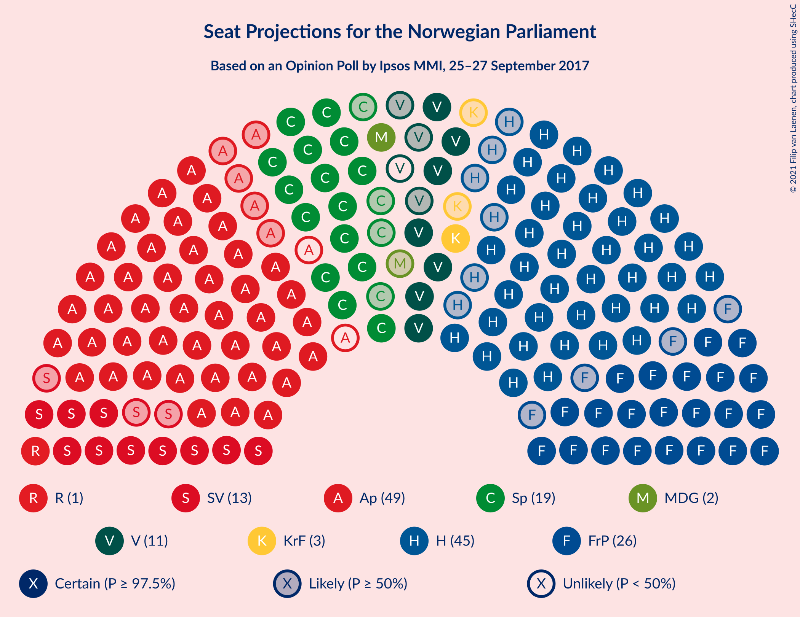
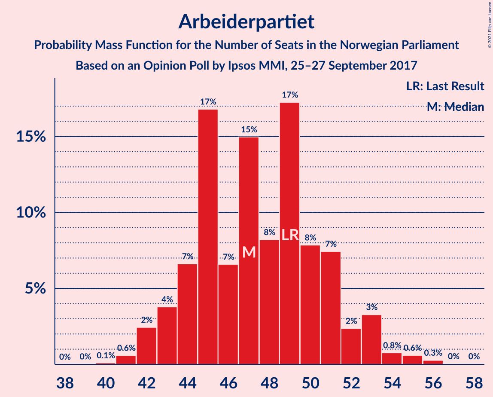
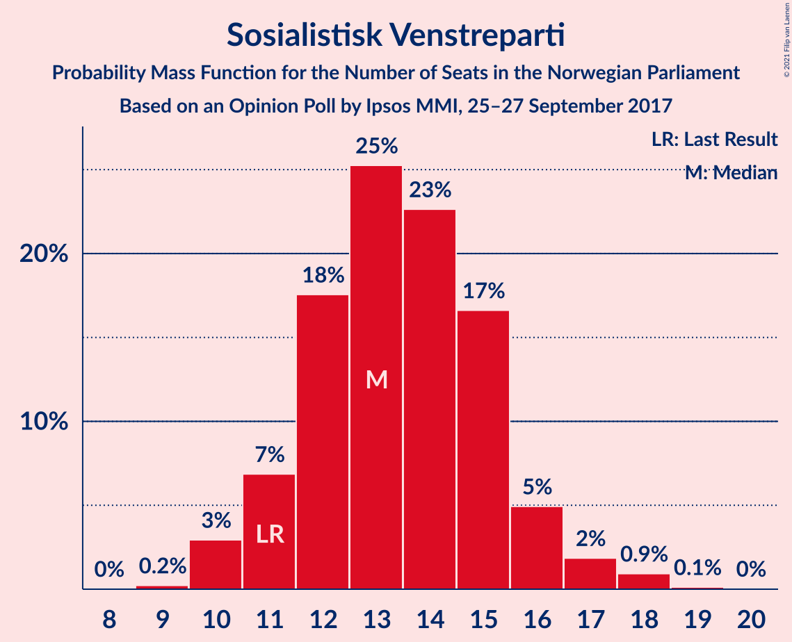
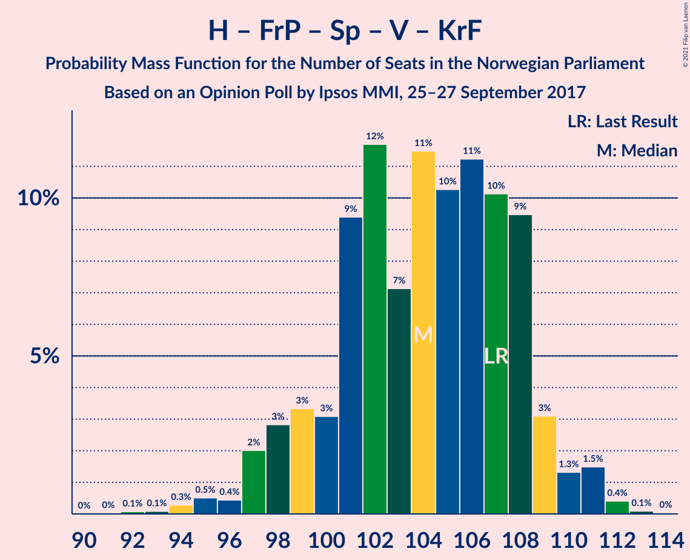
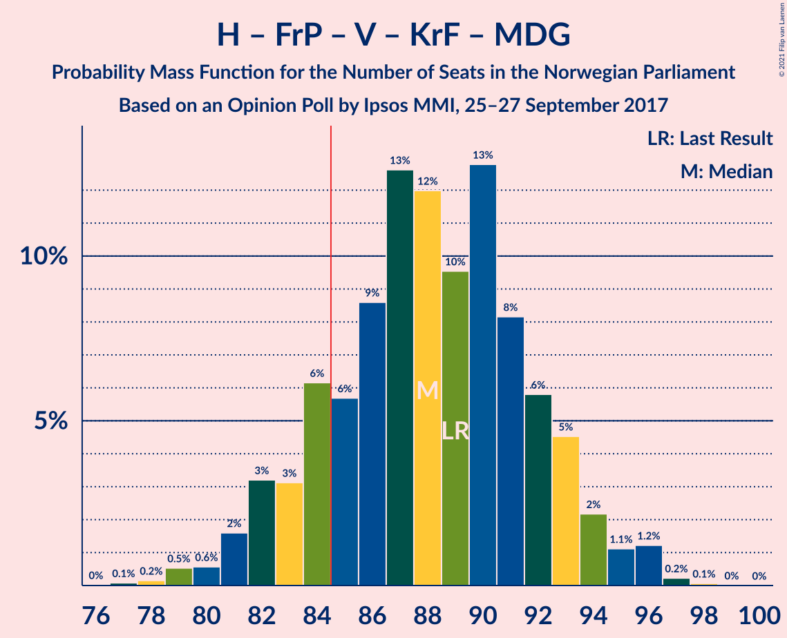
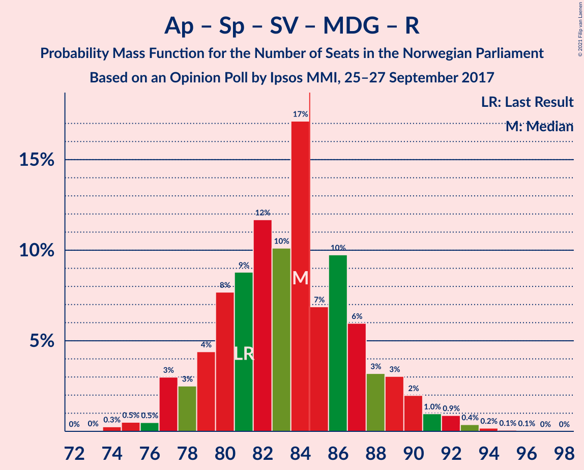
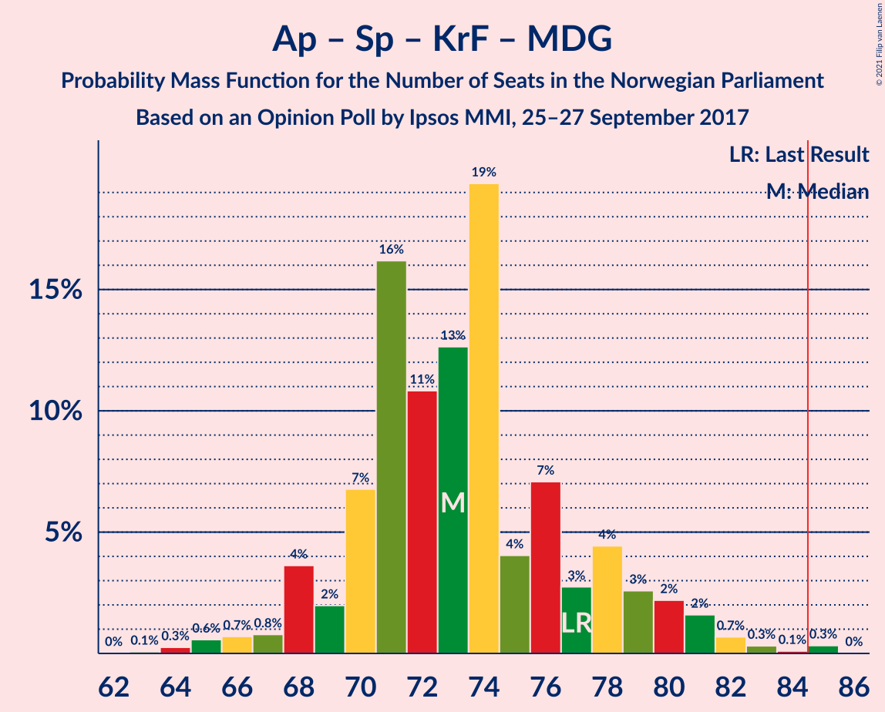
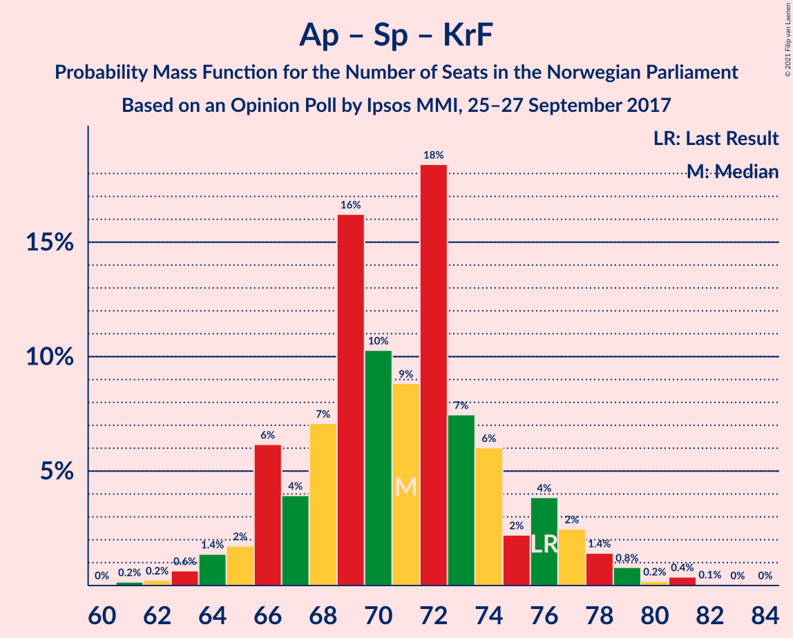

# Opinion Poll by Ipsos MMI, 25–27 September 2017

<a href="#voting-intentions">Voting Intentions</a> | <a href="#seats">Seats</a> | <a href="#coalitions">Coalitions</a> | <a href="#technical-information">Technical Information</a>

## Voting Intentions

### Confidence Intervals

| Party | Last Result | Poll Result | 80% Confidence Interval | 90% Confidence Interval | 95% Confidence Interval | 99% Confidence Interval |
|:-----:|:-----------:|:-----------:|:-----------------------:|:-----------------------:|:-----------------------:|:-----------------------:|
| Arbeiderpartiet | 27.4% | 26.1% | 24.3–28.0% |23.8–28.5% |23.4–29.0% |22.5–29.9% |
| Høyre | 25.0% | 24.4% | 22.6–26.3% |22.2–26.8% |21.7–27.3% |20.9–28.2% |
| Fremskrittspartiet | 15.2% | 14.4% | 13.0–16.0% |12.7–16.5% |12.3–16.8% |11.7–17.6% |
| Senterpartiet | 10.3% | 10.2% | 9.0–11.5% |8.7–11.9% |8.4–12.3% |7.8–13.0% |
| Sosialistisk Venstreparti | 6.0% | 7.4% | 6.4–8.6% |6.1–8.9% |5.9–9.3% |5.4–9.9% |
| Venstre | 4.4% | 5.3% | 4.5–6.4% |4.3–6.7% |4.1–7.0% |3.7–7.5% |
| Kristelig Folkeparti | 4.2% | 3.9% | 3.2–4.8% |3.0–5.1% |2.8–5.3% |2.5–5.8% |
| Miljøpartiet De Grønne | 3.2% | 3.3% | 2.7–4.2% |2.5–4.5% |2.3–4.7% |2.1–5.1% |
| Rødt | 2.4% | 2.7% | 2.1–3.5% |2.0–3.7% |1.8–3.9% |1.6–4.3% |

*Note:* The poll result column reflects the actual value used in the calculations. Published results may vary slightly, and in addition be rounded to fewer digits.

## Seats

### Confidence Intervals

| Party | Last Result | Median | 80% Confidence Interval | 90% Confidence Interval | 95% Confidence Interval | 99% Confidence Interval |
|:-----:|:-----------:|:------:|:-----------------------:|:-----------------------:|:-----------------------:|:-----------------------:|
| <a href="#arbeiderpartiet">Arbeiderpartiet</a> | 49 | 47 | 44–49 |42–52 |42–53 |42–54 |
| <a href="#høyre">Høyre</a> | 45 | 45 | 42–47 |40–49 |40–49 |38–51 |
| <a href="#fremskrittspartiet">Fremskrittspartiet</a> | 27 | 27 | 24–29 |23–29 |23–30 |21–32 |
| <a href="#senterpartiet">Senterpartiet</a> | 19 | 19 | 17–21 |16–22 |15–22 |14–23 |
| <a href="#sosialistisk-venstreparti">Sosialistisk Venstreparti</a> | 11 | 13 | 11–15 |10–16 |10–16 |10–18 |
| <a href="#venstre">Venstre</a> | 8 | 11 | 9–11 |8–11 |8–12 |7–13 |
| <a href="#kristelig-folkeparti">Kristelig Folkeparti</a> | 8 | 3 | 2–9 |2–9 |2–9 |1–10 |
| <a href="#miljøpartiet-de-grønne">Miljøpartiet De Grønne</a> | 1 | 2 | 1–2 |1–8 |1–8 |1–9 |
| <a href="#rødt">Rødt</a> | 1 | 2 | 1–2 |1–2 |1–2 |1–6 |

### Arbeiderpartiet

*For a full overview of the results for this party, see the [Arbeiderpartiet](party-arbeiderpartiet.html) page.*

| Number of Seats | Probability | Accumulated | Special Marks |
|:---------------:|:-----------:|:-----------:|:-------------:|
| 40 | 0% | 100% |  |
| 41 | 0.2% | 99.9% |  |
| 42 | 5% | 99.7% |  |
| 43 | 2% | 95% |  |
| 44 | 12% | 93% |  |
| 45 | 3% | 81% |  |
| 46 | 2% | 78% |  |
| 47 | 40% | 76% | Median |
| 48 | 4% | 36% |  |
| 49 | 24% | 32% | Last Result |
| 50 | 2% | 9% |  |
| 51 | 1.0% | 7% |  |
| 52 | 0.9% | 6% |  |
| 53 | 4% | 5% |  |
| 54 | 0.5% | 1.0% |  |
| 55 | 0.2% | 0.5% |  |
| 56 | 0.3% | 0.3% |  |
| 57 | 0% | 0% |  |

### Høyre

*For a full overview of the results for this party, see the [Høyre](party-høyre.html) page.*

| Number of Seats | Probability | Accumulated | Special Marks |
|:---------------:|:-----------:|:-----------:|:-------------:|
| 36 | 0.1% | 100% |  |
| 37 | 0.1% | 99.9% |  |
| 38 | 0.9% | 99.8% |  |
| 39 | 1.0% | 99.0% |  |
| 40 | 3% | 98% |  |
| 41 | 4% | 95% |  |
| 42 | 2% | 90% |  |
| 43 | 4% | 88% |  |
| 44 | 4% | 84% |  |
| 45 | 52% | 80% | Last Result, Median |
| 46 | 10% | 28% |  |
| 47 | 9% | 18% |  |
| 48 | 1.3% | 9% |  |
| 49 | 7% | 8% |  |
| 50 | 0.3% | 0.8% |  |
| 51 | 0.4% | 0.5% |  |
| 52 | 0% | 0.1% |  |
| 53 | 0% | 0% |  |

### Fremskrittspartiet

*For a full overview of the results for this party, see the [Fremskrittspartiet](party-fremskrittspartiet.html) page.*

| Number of Seats | Probability | Accumulated | Special Marks |
|:---------------:|:-----------:|:-----------:|:-------------:|
| 20 | 0.1% | 100% |  |
| 21 | 0.5% | 99.9% |  |
| 22 | 1.4% | 99.4% |  |
| 23 | 3% | 98% |  |
| 24 | 5% | 95% |  |
| 25 | 13% | 90% |  |
| 26 | 14% | 77% |  |
| 27 | 19% | 63% | Last Result, Median |
| 28 | 33% | 44% |  |
| 29 | 8% | 11% |  |
| 30 | 2% | 3% |  |
| 31 | 0.3% | 0.8% |  |
| 32 | 0.3% | 0.5% |  |
| 33 | 0.1% | 0.3% |  |
| 34 | 0.1% | 0.1% |  |
| 35 | 0% | 0% |  |

### Senterpartiet

*For a full overview of the results for this party, see the [Senterpartiet](party-senterpartiet.html) page.*

| Number of Seats | Probability | Accumulated | Special Marks |
|:---------------:|:-----------:|:-----------:|:-------------:|
| 13 | 0.1% | 100% |  |
| 14 | 0.6% | 99.9% |  |
| 15 | 2% | 99.3% |  |
| 16 | 5% | 97% |  |
| 17 | 18% | 92% |  |
| 18 | 20% | 75% |  |
| 19 | 37% | 54% | Last Result, Median |
| 20 | 7% | 17% |  |
| 21 | 4% | 10% |  |
| 22 | 5% | 6% |  |
| 23 | 0.2% | 0.6% |  |
| 24 | 0.1% | 0.3% |  |
| 25 | 0.2% | 0.3% |  |
| 26 | 0% | 0% |  |

### Sosialistisk Venstreparti

*For a full overview of the results for this party, see the [Sosialistisk Venstreparti](party-sosialistiskvenstreparti.html) page.*

| Number of Seats | Probability | Accumulated | Special Marks |
|:---------------:|:-----------:|:-----------:|:-------------:|
| 9 | 0.2% | 100% |  |
| 10 | 5% | 99.8% |  |
| 11 | 5% | 95% | Last Result |
| 12 | 35% | 90% |  |
| 13 | 22% | 55% | Median |
| 14 | 16% | 33% |  |
| 15 | 11% | 18% |  |
| 16 | 5% | 7% |  |
| 17 | 0.6% | 2% |  |
| 18 | 1.1% | 1.2% |  |
| 19 | 0.1% | 0.2% |  |
| 20 | 0% | 0% |  |

### Venstre

*For a full overview of the results for this party, see the [Venstre](party-venstre.html) page.*

| Number of Seats | Probability | Accumulated | Special Marks |
|:---------------:|:-----------:|:-----------:|:-------------:|
| 2 | 0.3% | 100% |  |
| 3 | 0.1% | 99.7% |  |
| 4 | 0% | 99.6% |  |
| 5 | 0% | 99.6% |  |
| 6 | 0% | 99.6% |  |
| 7 | 0.8% | 99.6% |  |
| 8 | 4% | 98.8% | Last Result |
| 9 | 12% | 95% |  |
| 10 | 26% | 83% |  |
| 11 | 53% | 56% | Median |
| 12 | 2% | 3% |  |
| 13 | 0.8% | 1.2% |  |
| 14 | 0.4% | 0.5% |  |
| 15 | 0% | 0% |  |

### Kristelig Folkeparti

*For a full overview of the results for this party, see the [Kristelig Folkeparti](party-kristeligfolkeparti.html) page.*

| Number of Seats | Probability | Accumulated | Special Marks |
|:---------------:|:-----------:|:-----------:|:-------------:|
| 0 | 0.1% | 100% |  |
| 1 | 2% | 99.9% |  |
| 2 | 9% | 98% |  |
| 3 | 62% | 88% | Median |
| 4 | 0% | 26% |  |
| 5 | 0% | 26% |  |
| 6 | 0% | 26% |  |
| 7 | 0.9% | 26% |  |
| 8 | 11% | 25% | Last Result |
| 9 | 14% | 14% |  |
| 10 | 0.7% | 0.9% |  |
| 11 | 0.2% | 0.2% |  |
| 12 | 0% | 0% |  |

### Miljøpartiet De Grønne

*For a full overview of the results for this party, see the [Miljøpartiet De Grønne](party-miljøpartietdegrønne.html) page.*

| Number of Seats | Probability | Accumulated | Special Marks |
|:---------------:|:-----------:|:-----------:|:-------------:|
| 0 | 0.2% | 100% |  |
| 1 | 22% | 99.8% | Last Result |
| 2 | 69% | 77% | Median |
| 3 | 0.4% | 9% |  |
| 4 | 0.1% | 8% |  |
| 5 | 0% | 8% |  |
| 6 | 0% | 8% |  |
| 7 | 1.5% | 8% |  |
| 8 | 5% | 6% |  |
| 9 | 1.0% | 1.1% |  |
| 10 | 0.1% | 0.1% |  |
| 11 | 0% | 0% |  |

### Rødt

*For a full overview of the results for this party, see the [Rødt](party-rødt.html) page.*

| Number of Seats | Probability | Accumulated | Special Marks |
|:---------------:|:-----------:|:-----------:|:-------------:|
| 1 | 47% | 100% | Last Result |
| 2 | 52% | 53% | Median |
| 3 | 0% | 0.5% |  |
| 4 | 0% | 0.5% |  |
| 5 | 0% | 0.5% |  |
| 6 | 0% | 0.5% |  |
| 7 | 0.1% | 0.5% |  |
| 8 | 0.3% | 0.4% |  |
| 9 | 0% | 0% |  |

## Coalitions

### Confidence Intervals

| Coalition | Last Result | Median | Majority? | 80% Confidence Interval | 90% Confidence Interval | 95% Confidence Interval | 99% Confidence Interval |
|:---------:|:-----------:|:------:|:---------:|:-----------------------:|:-----------------------:|:-----------------------:|:-----------------------:|
| Høyre – Fremskrittspartiet – Senterpartiet – Venstre – Kristelig Folkeparti | 107 | 106 | 100% | 101–109 | 99–109 | 98–109 | 95–111 |
| Arbeiderpartiet – Senterpartiet – Sosialistisk Venstreparti – Kristelig Folkeparti – Miljøpartiet De Grønne | 88 | 85 | 50% | 83–91 | 82–93 | 82–94 | 79–94 |
| Høyre – Fremskrittspartiet – Venstre – Kristelig Folkeparti – Miljøpartiet De Grønne | 89 | 89 | 94% | 86–93 | 84–93 | 81–93 | 80–94 |
| Høyre – Fremskrittspartiet – Venstre – Kristelig Folkeparti | 88 | 87 | 83% | 83–92 | 80–92 | 79–92 | 76–92 |
| Arbeiderpartiet – Senterpartiet – Sosialistisk Venstreparti – Miljøpartiet De Grønne – Rødt | 81 | 82 | 17% | 77–86 | 77–89 | 77–90 | 77–93 |
| Arbeiderpartiet – Senterpartiet – Sosialistisk Venstreparti – Miljøpartiet De Grønne | 80 | 80 | 10% | 76–85 | 76–87 | 76–89 | 75–92 |
| Arbeiderpartiet – Senterpartiet – Sosialistisk Venstreparti – Rødt | 80 | 80 | 6% | 76–83 | 76–85 | 76–88 | 75–89 |
| Arbeiderpartiet – Senterpartiet – Sosialistisk Venstreparti | 79 | 78 | 5% | 75–81 | 75–83 | 75–87 | 73–87 |
| Høyre – Fremskrittspartiet – Venstre | 80 | 83 | 6% | 76–84 | 75–86 | 74–86 | 73–88 |
| Arbeiderpartiet – Senterpartiet – Kristelig Folkeparti – Miljøpartiet De Grønne | 77 | 71 | 0.1% | 68–78 | 68–80 | 68–81 | 66–81 |
| Arbeiderpartiet – Senterpartiet – Kristelig Folkeparti | 76 | 69 | 0% | 66–74 | 66–76 | 66–77 | 63–79 |
| Høyre – Fremskrittspartiet | 72 | 73 | 0% | 67–74 | 66–75 | 65–75 | 63–77 |
| Arbeiderpartiet – Senterpartiet | 68 | 66 | 0% | 61–68 | 61–70 | 60–73 | 59–75 |
| Arbeiderpartiet – Sosialistisk Venstreparti | 60 | 59 | 0% | 58–63 | 57–65 | 57–67 | 54–68 |
| Høyre – Venstre – Kristelig Folkeparti | 61 | 59 | 0% | 57–65 | 56–66 | 53–66 | 51–66 |
| Senterpartiet – Venstre – Kristelig Folkeparti | 35 | 33 | 0% | 31–36 | 29–38 | 29–39 | 26–40 |

### Høyre – Fremskrittspartiet – Senterpartiet – Venstre – Kristelig Folkeparti

| Number of Seats | Probability | Accumulated | Special Marks |
|:---------------:|:-----------:|:-----------:|:-------------:|
| 92 | 0.3% | 100% |  |
| 93 | 0.1% | 99.7% |  |
| 94 | 0% | 99.6% |  |
| 95 | 0.5% | 99.6% |  |
| 96 | 0.3% | 99.1% |  |
| 97 | 0.5% | 98.8% |  |
| 98 | 3% | 98% |  |
| 99 | 3% | 95% |  |
| 100 | 0.6% | 92% |  |
| 101 | 3% | 92% |  |
| 102 | 3% | 88% |  |
| 103 | 8% | 85% |  |
| 104 | 16% | 77% |  |
| 105 | 3% | 61% | Median |
| 106 | 35% | 58% |  |
| 107 | 3% | 23% | Last Result |
| 108 | 9% | 19% |  |
| 109 | 10% | 11% |  |
| 110 | 0.5% | 1.2% |  |
| 111 | 0.6% | 0.7% |  |
| 112 | 0.1% | 0.1% |  |
| 113 | 0% | 0.1% |  |
| 114 | 0% | 0% |  |

### Arbeiderpartiet – Senterpartiet – Sosialistisk Venstreparti – Kristelig Folkeparti – Miljøpartiet De Grønne

| Number of Seats | Probability | Accumulated | Special Marks |
|:---------------:|:-----------:|:-----------:|:-------------:|
| 77 | 0.1% | 100% |  |
| 78 | 0.1% | 99.9% |  |
| 79 | 0.3% | 99.8% |  |
| 80 | 0.2% | 99.4% |  |
| 81 | 0.5% | 99.2% |  |
| 82 | 4% | 98.7% |  |
| 83 | 39% | 94% |  |
| 84 | 5% | 55% | Median |
| 85 | 26% | 50% | Majority |
| 86 | 3% | 24% |  |
| 87 | 2% | 21% |  |
| 88 | 1.2% | 19% | Last Result |
| 89 | 1.2% | 18% |  |
| 90 | 2% | 17% |  |
| 91 | 7% | 15% |  |
| 92 | 4% | 9% |  |
| 93 | 2% | 5% |  |
| 94 | 3% | 3% |  |
| 95 | 0.2% | 0.3% |  |
| 96 | 0.1% | 0.2% |  |
| 97 | 0% | 0.1% |  |
| 98 | 0% | 0.1% |  |
| 99 | 0% | 0.1% |  |
| 100 | 0% | 0% |  |

### Høyre – Fremskrittspartiet – Venstre – Kristelig Folkeparti – Miljøpartiet De Grønne

| Number of Seats | Probability | Accumulated | Special Marks |
|:---------------:|:-----------:|:-----------:|:-------------:|
| 77 | 0.1% | 100% |  |
| 78 | 0.1% | 99.9% |  |
| 79 | 0.1% | 99.8% |  |
| 80 | 0.2% | 99.7% |  |
| 81 | 2% | 99.5% |  |
| 82 | 2% | 97% |  |
| 83 | 0.3% | 95% |  |
| 84 | 1.4% | 95% |  |
| 85 | 1.2% | 94% | Majority |
| 86 | 6% | 93% |  |
| 87 | 5% | 87% |  |
| 88 | 21% | 82% | Median |
| 89 | 36% | 60% | Last Result |
| 90 | 8% | 25% |  |
| 91 | 2% | 17% |  |
| 92 | 3% | 14% |  |
| 93 | 9% | 11% |  |
| 94 | 1.4% | 2% |  |
| 95 | 0.2% | 0.3% |  |
| 96 | 0% | 0.2% |  |
| 97 | 0.1% | 0.1% |  |
| 98 | 0.1% | 0.1% |  |
| 99 | 0% | 0% |  |

### Høyre – Fremskrittspartiet – Venstre – Kristelig Folkeparti

| Number of Seats | Probability | Accumulated | Special Marks |
|:---------------:|:-----------:|:-----------:|:-------------:|
| 75 | 0.1% | 100% |  |
| 76 | 0.6% | 99.9% |  |
| 77 | 0.6% | 99.2% |  |
| 78 | 0.3% | 98.6% |  |
| 79 | 2% | 98% |  |
| 80 | 1.4% | 96% |  |
| 81 | 1.0% | 95% |  |
| 82 | 3% | 94% |  |
| 83 | 2% | 90% |  |
| 84 | 5% | 88% |  |
| 85 | 5% | 83% | Majority |
| 86 | 23% | 78% | Median |
| 87 | 36% | 55% |  |
| 88 | 0.5% | 19% | Last Result |
| 89 | 4% | 18% |  |
| 90 | 2% | 14% |  |
| 91 | 1.3% | 11% |  |
| 92 | 10% | 10% |  |
| 93 | 0.1% | 0.3% |  |
| 94 | 0.1% | 0.1% |  |
| 95 | 0% | 0.1% |  |
| 96 | 0% | 0% |  |

### Arbeiderpartiet – Senterpartiet – Sosialistisk Venstreparti – Miljøpartiet De Grønne – Rødt

| Number of Seats | Probability | Accumulated | Special Marks |
|:---------------:|:-----------:|:-----------:|:-------------:|
| 74 | 0% | 100% |  |
| 75 | 0.1% | 99.9% |  |
| 76 | 0.2% | 99.9% |  |
| 77 | 10% | 99.7% |  |
| 78 | 1.3% | 90% |  |
| 79 | 2% | 89% |  |
| 80 | 4% | 86% |  |
| 81 | 0.5% | 82% | Last Result |
| 82 | 36% | 81% |  |
| 83 | 23% | 45% | Median |
| 84 | 5% | 22% |  |
| 85 | 5% | 17% | Majority |
| 86 | 2% | 12% |  |
| 87 | 3% | 10% |  |
| 88 | 1.0% | 6% |  |
| 89 | 1.4% | 5% |  |
| 90 | 2% | 4% |  |
| 91 | 0.3% | 2% |  |
| 92 | 0.6% | 1.3% |  |
| 93 | 0.6% | 0.8% |  |
| 94 | 0.1% | 0.1% |  |
| 95 | 0% | 0% |  |

### Arbeiderpartiet – Senterpartiet – Sosialistisk Venstreparti – Miljøpartiet De Grønne

| Number of Seats | Probability | Accumulated | Special Marks |
|:---------------:|:-----------:|:-----------:|:-------------:|
| 73 | 0.1% | 100% |  |
| 74 | 0.1% | 99.9% |  |
| 75 | 0.9% | 99.8% |  |
| 76 | 10% | 98.8% |  |
| 77 | 2% | 89% |  |
| 78 | 0.9% | 87% |  |
| 79 | 4% | 86% |  |
| 80 | 34% | 82% | Last Result |
| 81 | 10% | 47% | Median |
| 82 | 17% | 38% |  |
| 83 | 7% | 21% |  |
| 84 | 3% | 14% |  |
| 85 | 1.3% | 10% | Majority |
| 86 | 4% | 9% |  |
| 87 | 0.7% | 6% |  |
| 88 | 1.1% | 5% |  |
| 89 | 2% | 4% |  |
| 90 | 0.6% | 1.4% |  |
| 91 | 0.1% | 0.8% |  |
| 92 | 0.6% | 0.7% |  |
| 93 | 0% | 0.1% |  |
| 94 | 0% | 0% |  |

### Arbeiderpartiet – Senterpartiet – Sosialistisk Venstreparti – Rødt

| Number of Seats | Probability | Accumulated | Special Marks |
|:---------------:|:-----------:|:-----------:|:-------------:|
| 71 | 0.1% | 100% |  |
| 72 | 0.1% | 99.9% |  |
| 73 | 0% | 99.9% |  |
| 74 | 0.2% | 99.8% |  |
| 75 | 1.4% | 99.6% |  |
| 76 | 9% | 98% |  |
| 77 | 3% | 89% |  |
| 78 | 2% | 86% |  |
| 79 | 8% | 83% |  |
| 80 | 36% | 75% | Last Result |
| 81 | 21% | 40% | Median |
| 82 | 5% | 18% |  |
| 83 | 6% | 13% |  |
| 84 | 1.2% | 7% |  |
| 85 | 1.4% | 6% | Majority |
| 86 | 0.3% | 5% |  |
| 87 | 2% | 4% |  |
| 88 | 2% | 3% |  |
| 89 | 0.2% | 0.5% |  |
| 90 | 0.1% | 0.3% |  |
| 91 | 0.1% | 0.2% |  |
| 92 | 0.1% | 0.1% |  |
| 93 | 0% | 0% |  |

### Arbeiderpartiet – Senterpartiet – Sosialistisk Venstreparti

| Number of Seats | Probability | Accumulated | Special Marks |
|:---------------:|:-----------:|:-----------:|:-------------:|
| 70 | 0.1% | 100% |  |
| 71 | 0.1% | 99.9% |  |
| 72 | 0.1% | 99.8% |  |
| 73 | 1.1% | 99.7% |  |
| 74 | 0.9% | 98.6% |  |
| 75 | 12% | 98% |  |
| 76 | 2% | 86% |  |
| 77 | 2% | 84% |  |
| 78 | 41% | 82% |  |
| 79 | 8% | 41% | Last Result, Median |
| 80 | 18% | 34% |  |
| 81 | 6% | 16% |  |
| 82 | 3% | 10% |  |
| 83 | 2% | 7% |  |
| 84 | 0.4% | 5% |  |
| 85 | 1.0% | 5% | Majority |
| 86 | 0.8% | 4% |  |
| 87 | 2% | 3% |  |
| 88 | 0.2% | 0.3% |  |
| 89 | 0% | 0.1% |  |
| 90 | 0% | 0.1% |  |
| 91 | 0.1% | 0.1% |  |
| 92 | 0% | 0% |  |

### Høyre – Fremskrittspartiet – Venstre

| Number of Seats | Probability | Accumulated | Special Marks |
|:---------------:|:-----------:|:-----------:|:-------------:|
| 68 | 0% | 100% |  |
| 69 | 0% | 99.9% |  |
| 70 | 0% | 99.9% |  |
| 71 | 0.1% | 99.9% |  |
| 72 | 0.1% | 99.9% |  |
| 73 | 0.3% | 99.7% |  |
| 74 | 3% | 99.5% |  |
| 75 | 3% | 96% |  |
| 76 | 6% | 94% |  |
| 77 | 4% | 88% |  |
| 78 | 1.2% | 84% |  |
| 79 | 2% | 83% |  |
| 80 | 0.4% | 81% | Last Result |
| 81 | 3% | 80% |  |
| 82 | 3% | 77% |  |
| 83 | 27% | 74% | Median |
| 84 | 41% | 47% |  |
| 85 | 0.3% | 6% | Majority |
| 86 | 4% | 5% |  |
| 87 | 0.3% | 0.9% |  |
| 88 | 0.3% | 0.6% |  |
| 89 | 0.2% | 0.4% |  |
| 90 | 0.1% | 0.1% |  |
| 91 | 0% | 0.1% |  |
| 92 | 0% | 0% |  |

### Arbeiderpartiet – Senterpartiet – Kristelig Folkeparti – Miljøpartiet De Grønne

| Number of Seats | Probability | Accumulated | Special Marks |
|:---------------:|:-----------:|:-----------:|:-------------:|
| 64 | 0.3% | 100% |  |
| 65 | 0.1% | 99.6% |  |
| 66 | 0.2% | 99.5% |  |
| 67 | 0.5% | 99.3% |  |
| 68 | 9% | 98.9% |  |
| 69 | 2% | 90% |  |
| 70 | 5% | 88% |  |
| 71 | 40% | 82% | Median |
| 72 | 20% | 42% |  |
| 73 | 2% | 22% |  |
| 74 | 2% | 20% |  |
| 75 | 1.2% | 18% |  |
| 76 | 0.9% | 17% |  |
| 77 | 4% | 16% | Last Result |
| 78 | 2% | 12% |  |
| 79 | 3% | 10% |  |
| 80 | 1.3% | 6% |  |
| 81 | 5% | 5% |  |
| 82 | 0.2% | 0.3% |  |
| 83 | 0.1% | 0.1% |  |
| 84 | 0% | 0.1% |  |
| 85 | 0% | 0.1% | Majority |
| 86 | 0% | 0% |  |

### Arbeiderpartiet – Senterpartiet – Kristelig Folkeparti

| Number of Seats | Probability | Accumulated | Special Marks |
|:---------------:|:-----------:|:-----------:|:-------------:|
| 62 | 0.1% | 100% |  |
| 63 | 0.4% | 99.9% |  |
| 64 | 0.4% | 99.5% |  |
| 65 | 0.7% | 99.1% |  |
| 66 | 8% | 98% |  |
| 67 | 2% | 90% |  |
| 68 | 4% | 88% |  |
| 69 | 34% | 83% | Median |
| 70 | 25% | 49% |  |
| 71 | 7% | 25% |  |
| 72 | 1.5% | 18% |  |
| 73 | 4% | 16% |  |
| 74 | 2% | 12% |  |
| 75 | 3% | 10% |  |
| 76 | 3% | 7% | Last Result |
| 77 | 2% | 4% |  |
| 78 | 2% | 2% |  |
| 79 | 0.8% | 1.0% |  |
| 80 | 0.1% | 0.2% |  |
| 81 | 0% | 0.1% |  |
| 82 | 0% | 0.1% |  |
| 83 | 0% | 0% |  |

### Høyre – Fremskrittspartiet

| Number of Seats | Probability | Accumulated | Special Marks |
|:---------------:|:-----------:|:-----------:|:-------------:|
| 61 | 0% | 100% |  |
| 62 | 0.1% | 99.9% |  |
| 63 | 0.4% | 99.9% |  |
| 64 | 0.5% | 99.5% |  |
| 65 | 4% | 98.9% |  |
| 66 | 1.2% | 95% |  |
| 67 | 7% | 94% |  |
| 68 | 3% | 87% |  |
| 69 | 1.0% | 83% |  |
| 70 | 2% | 82% |  |
| 71 | 5% | 80% |  |
| 72 | 17% | 76% | Last Result, Median |
| 73 | 43% | 59% |  |
| 74 | 10% | 16% |  |
| 75 | 5% | 6% |  |
| 76 | 0.2% | 1.1% |  |
| 77 | 0.4% | 0.9% |  |
| 78 | 0.2% | 0.5% |  |
| 79 | 0.2% | 0.3% |  |
| 80 | 0.1% | 0.1% |  |
| 81 | 0% | 0% |  |

### Arbeiderpartiet – Senterpartiet

| Number of Seats | Probability | Accumulated | Special Marks |
|:---------------:|:-----------:|:-----------:|:-------------:|
| 58 | 0.1% | 100% |  |
| 59 | 2% | 99.9% |  |
| 60 | 1.0% | 98% |  |
| 61 | 9% | 97% |  |
| 62 | 2% | 88% |  |
| 63 | 4% | 86% |  |
| 64 | 8% | 82% |  |
| 65 | 6% | 74% |  |
| 66 | 36% | 68% | Median |
| 67 | 16% | 32% |  |
| 68 | 8% | 16% | Last Result |
| 69 | 3% | 9% |  |
| 70 | 1.1% | 6% |  |
| 71 | 0.3% | 5% |  |
| 72 | 0.8% | 4% |  |
| 73 | 2% | 4% |  |
| 74 | 0.7% | 2% |  |
| 75 | 0.8% | 0.9% |  |
| 76 | 0% | 0.1% |  |
| 77 | 0% | 0% |  |

### Arbeiderpartiet – Sosialistisk Venstreparti

| Number of Seats | Probability | Accumulated | Special Marks |
|:---------------:|:-----------:|:-----------:|:-------------:|
| 53 | 0.2% | 100% |  |
| 54 | 0.9% | 99.7% |  |
| 55 | 0.5% | 98.9% |  |
| 56 | 0.3% | 98% |  |
| 57 | 4% | 98% |  |
| 58 | 14% | 94% |  |
| 59 | 39% | 80% |  |
| 60 | 2% | 41% | Last Result, Median |
| 61 | 4% | 39% |  |
| 62 | 25% | 35% |  |
| 63 | 1.3% | 11% |  |
| 64 | 3% | 9% |  |
| 65 | 2% | 6% |  |
| 66 | 0.3% | 4% |  |
| 67 | 3% | 4% |  |
| 68 | 0.5% | 0.8% |  |
| 69 | 0.1% | 0.3% |  |
| 70 | 0% | 0.1% |  |
| 71 | 0.1% | 0.1% |  |
| 72 | 0% | 0% |  |

### Høyre – Venstre – Kristelig Folkeparti

| Number of Seats | Probability | Accumulated | Special Marks |
|:---------------:|:-----------:|:-----------:|:-------------:|
| 48 | 0.1% | 100% |  |
| 49 | 0.2% | 99.9% |  |
| 50 | 0.1% | 99.7% |  |
| 51 | 0.6% | 99.6% |  |
| 52 | 0.3% | 99.0% |  |
| 53 | 1.2% | 98.7% |  |
| 54 | 1.3% | 97% |  |
| 55 | 0.9% | 96% |  |
| 56 | 3% | 95% |  |
| 57 | 7% | 92% |  |
| 58 | 5% | 85% |  |
| 59 | 49% | 81% | Median |
| 60 | 8% | 32% |  |
| 61 | 7% | 23% | Last Result |
| 62 | 1.4% | 16% |  |
| 63 | 2% | 15% |  |
| 64 | 0.6% | 13% |  |
| 65 | 3% | 12% |  |
| 66 | 9% | 10% |  |
| 67 | 0.1% | 0.2% |  |
| 68 | 0.1% | 0.2% |  |
| 69 | 0% | 0% |  |

### Senterpartiet – Venstre – Kristelig Folkeparti

| Number of Seats | Probability | Accumulated | Special Marks |
|:---------------:|:-----------:|:-----------:|:-------------:|
| 20 | 0.1% | 100% |  |
| 21 | 0% | 99.9% |  |
| 22 | 0.1% | 99.9% |  |
| 23 | 0% | 99.9% |  |
| 24 | 0% | 99.9% |  |
| 25 | 0.1% | 99.8% |  |
| 26 | 0.5% | 99.8% |  |
| 27 | 0.6% | 99.3% |  |
| 28 | 0.9% | 98.7% |  |
| 29 | 6% | 98% |  |
| 30 | 1.0% | 92% |  |
| 31 | 4% | 91% |  |
| 32 | 17% | 87% |  |
| 33 | 41% | 69% | Median |
| 34 | 5% | 28% |  |
| 35 | 6% | 23% | Last Result |
| 36 | 11% | 17% |  |
| 37 | 1.1% | 6% |  |
| 38 | 1.1% | 5% |  |
| 39 | 3% | 4% |  |
| 40 | 0.8% | 0.9% |  |
| 41 | 0.1% | 0.2% |  |
| 42 | 0.1% | 0.1% |  |
| 43 | 0% | 0.1% |  |
| 44 | 0% | 0.1% |  |
| 45 | 0% | 0% |  |

## Technical Information

### Opinion Poll

+ **Polling firm:** Ipsos MMI
+ **Commissioner(s):** —
+ **Fieldwork period:** 25–27 September 2017

### Calculations

+ **Sample size:** 935
+ **Simulations done:** 131,072
+ **Error estimate:** 1.60%

