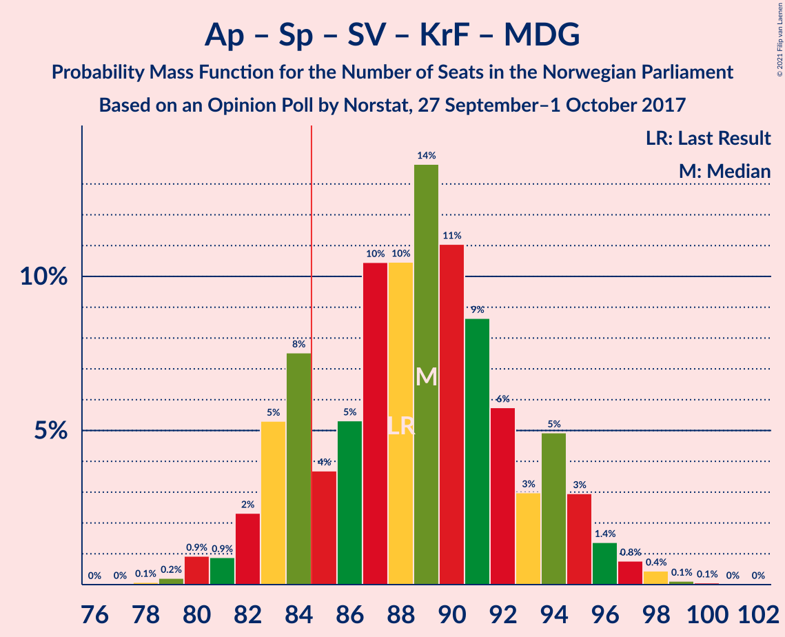
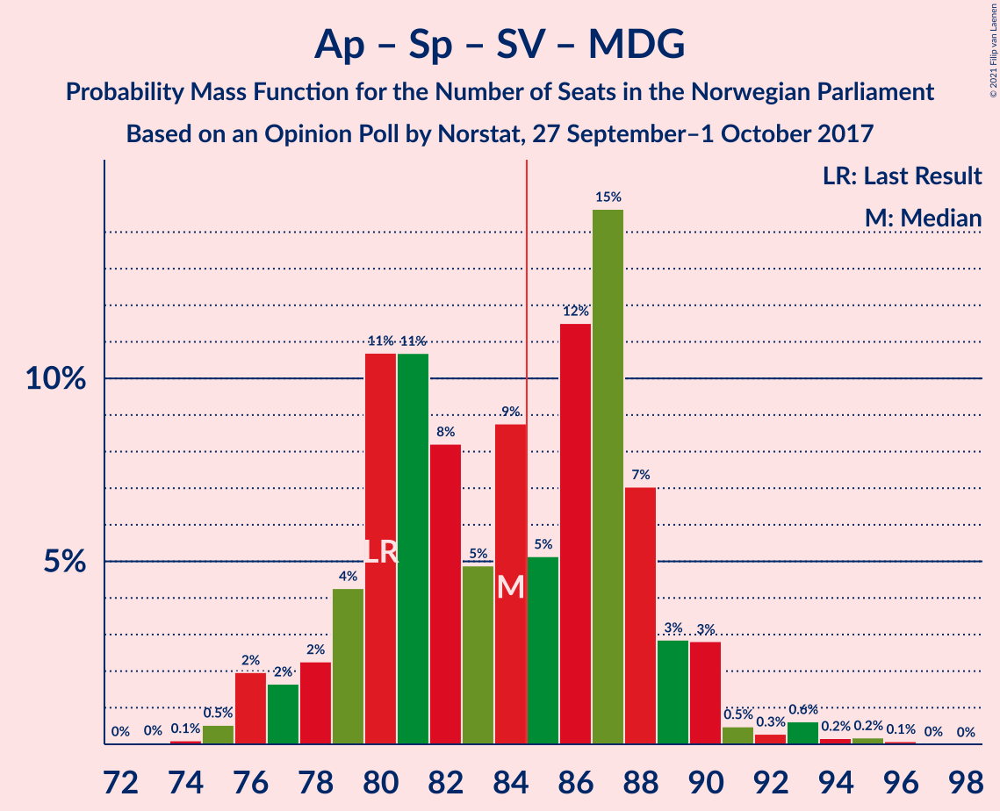
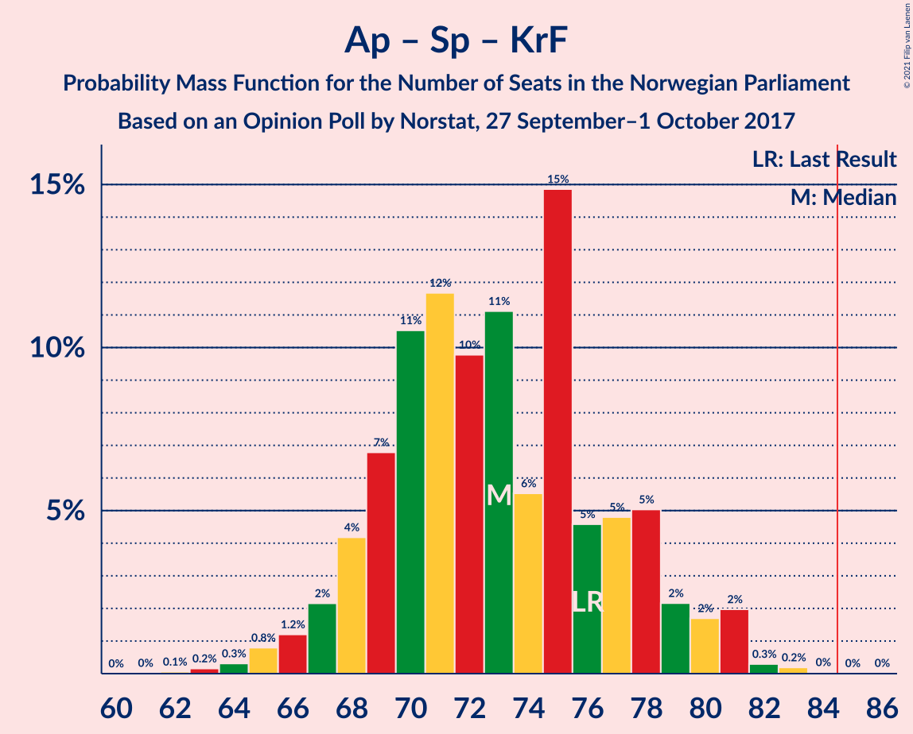

# Opinion Poll by Norstat, 27 September–1 October 2017

<a href="#voting-intentions">Voting Intentions</a> | <a href="#seats">Seats</a> | <a href="#coalitions">Coalitions</a> | <a href="#technical-information">Technical Information</a>

## Voting Intentions

### Confidence Intervals

| Party | Last Result | Poll Result | 80% Confidence Interval | 90% Confidence Interval | 95% Confidence Interval | 99% Confidence Interval |
|:-----:|:-----------:|:-----------:|:-----------------------:|:-----------------------:|:-----------------------:|:-----------------------:|
| Arbeiderpartiet | 27.4% | 26.5% | 24.7–28.4% |24.2–28.9% |23.7–29.4% |22.9–30.3% |
| Høyre | 25.0% | 25.6% | 23.8–27.5% |23.4–28.0% |22.9–28.5% |22.1–29.4% |
| Fremskrittspartiet | 15.2% | 14.3% | 13.0–15.9% |12.6–16.4% |12.2–16.7% |11.6–17.5% |
| Senterpartiet | 10.3% | 10.6% | 9.4–12.0% |9.1–12.4% |8.8–12.8% |8.3–13.5% |
| Sosialistisk Venstreparti | 6.0% | 7.5% | 6.5–8.8% |6.3–9.1% |6.0–9.4% |5.6–10.0% |
| Venstre | 4.4% | 4.3% | 3.5–5.2% |3.3–5.5% |3.1–5.7% |2.8–6.2% |
| Kristelig Folkeparti | 4.2% | 3.9% | 3.2–4.9% |3.0–5.1% |2.9–5.4% |2.6–5.9% |
| Miljøpartiet De Grønne | 3.2% | 3.0% | 2.4–3.8% |2.2–4.1% |2.1–4.3% |1.8–4.7% |
| Rødt | 2.4% | 2.6% | 2.0–3.4% |1.8–3.6% |1.7–3.8% |1.5–4.2% |

*Note:* The poll result column reflects the actual value used in the calculations. Published results may vary slightly, and in addition be rounded to fewer digits.

## Seats

### Confidence Intervals

| Party | Last Result | Median | 80% Confidence Interval | 90% Confidence Interval | 95% Confidence Interval | 99% Confidence Interval |
|:-----:|:-----------:|:------:|:-----------------------:|:-----------------------:|:-----------------------:|:-----------------------:|
| <a href="#arbeiderpartiet">Arbeiderpartiet</a> | 49 | 47 | 44–53 |43–53 |43–55 |42–57 |
| <a href="#høyre">Høyre</a> | 45 | 46 | 43–51 |43–52 |41–52 |39–54 |
| <a href="#fremskrittspartiet">Fremskrittspartiet</a> | 27 | 26 | 23–29 |22–31 |22–31 |21–32 |
| <a href="#senterpartiet">Senterpartiet</a> | 19 | 19 | 17–22 |17–23 |16–24 |14–25 |
| <a href="#sosialistisk-venstreparti">Sosialistisk Venstreparti</a> | 11 | 14 | 12–15 |11–16 |11–17 |10–19 |
| <a href="#venstre">Venstre</a> | 8 | 8 | 2–10 |2–10 |2–10 |2–12 |
| <a href="#kristelig-folkeparti">Kristelig Folkeparti</a> | 8 | 7 | 1–9 |1–9 |1–10 |1–11 |
| <a href="#miljøpartiet-de-grønne">Miljøpartiet De Grønne</a> | 1 | 1 | 1–2 |1–7 |0–8 |0–8 |
| <a href="#rødt">Rødt</a> | 1 | 1 | 1–2 |1–2 |1–2 |1–8 |

### Arbeiderpartiet

*For a full overview of the results for this party, see the [Arbeiderpartiet](party-arbeiderpartiet.html) page.*

| Number of Seats | Probability | Accumulated | Special Marks |
|:---------------:|:-----------:|:-----------:|:-------------:|
| 40 | 0% | 100% |  |
| 41 | 0.2% | 99.9% |  |
| 42 | 1.1% | 99.8% |  |
| 43 | 4% | 98.7% |  |
| 44 | 5% | 94% |  |
| 45 | 8% | 89% |  |
| 46 | 22% | 82% |  |
| 47 | 15% | 59% | Median |
| 48 | 11% | 45% |  |
| 49 | 12% | 34% | Last Result |
| 50 | 3% | 22% |  |
| 51 | 1.4% | 19% |  |
| 52 | 5% | 18% |  |
| 53 | 9% | 13% |  |
| 54 | 1.2% | 4% |  |
| 55 | 0.3% | 3% |  |
| 56 | 2% | 2% |  |
| 57 | 0.5% | 0.6% |  |
| 58 | 0.1% | 0.1% |  |
| 59 | 0% | 0% |  |

### Høyre

*For a full overview of the results for this party, see the [Høyre](party-høyre.html) page.*

| Number of Seats | Probability | Accumulated | Special Marks |
|:---------------:|:-----------:|:-----------:|:-------------:|
| 38 | 0.1% | 100% |  |
| 39 | 0.6% | 99.9% |  |
| 40 | 0.6% | 99.3% |  |
| 41 | 2% | 98.7% |  |
| 42 | 1.2% | 97% |  |
| 43 | 6% | 96% |  |
| 44 | 14% | 90% |  |
| 45 | 19% | 76% | Last Result |
| 46 | 8% | 57% | Median |
| 47 | 17% | 48% |  |
| 48 | 7% | 31% |  |
| 49 | 7% | 24% |  |
| 50 | 4% | 17% |  |
| 51 | 3% | 13% |  |
| 52 | 9% | 10% |  |
| 53 | 0.4% | 0.9% |  |
| 54 | 0.3% | 0.5% |  |
| 55 | 0.1% | 0.2% |  |
| 56 | 0.1% | 0.1% |  |
| 57 | 0% | 0% |  |

### Fremskrittspartiet

*For a full overview of the results for this party, see the [Fremskrittspartiet](party-fremskrittspartiet.html) page.*

| Number of Seats | Probability | Accumulated | Special Marks |
|:---------------:|:-----------:|:-----------:|:-------------:|
| 20 | 0.1% | 100% |  |
| 21 | 0.7% | 99.8% |  |
| 22 | 5% | 99.2% |  |
| 23 | 8% | 94% |  |
| 24 | 12% | 87% |  |
| 25 | 11% | 75% |  |
| 26 | 17% | 64% | Median |
| 27 | 4% | 47% | Last Result |
| 28 | 13% | 42% |  |
| 29 | 22% | 29% |  |
| 30 | 2% | 7% |  |
| 31 | 3% | 5% |  |
| 32 | 2% | 2% |  |
| 33 | 0.2% | 0.4% |  |
| 34 | 0% | 0.2% |  |
| 35 | 0.1% | 0.1% |  |
| 36 | 0% | 0% |  |

### Senterpartiet

*For a full overview of the results for this party, see the [Senterpartiet](party-senterpartiet.html) page.*

| Number of Seats | Probability | Accumulated | Special Marks |
|:---------------:|:-----------:|:-----------:|:-------------:|
| 13 | 0.1% | 100% |  |
| 14 | 0.6% | 99.9% |  |
| 15 | 0.9% | 99.4% |  |
| 16 | 3% | 98% |  |
| 17 | 13% | 96% |  |
| 18 | 19% | 83% |  |
| 19 | 17% | 64% | Last Result, Median |
| 20 | 20% | 47% |  |
| 21 | 9% | 27% |  |
| 22 | 11% | 17% |  |
| 23 | 2% | 7% |  |
| 24 | 2% | 4% |  |
| 25 | 2% | 2% |  |
| 26 | 0.1% | 0.1% |  |
| 27 | 0% | 0% |  |

### Sosialistisk Venstreparti

*For a full overview of the results for this party, see the [Sosialistisk Venstreparti](party-sosialistiskvenstreparti.html) page.*

| Number of Seats | Probability | Accumulated | Special Marks |
|:---------------:|:-----------:|:-----------:|:-------------:|
| 9 | 0.2% | 100% |  |
| 10 | 2% | 99.8% |  |
| 11 | 3% | 98% | Last Result |
| 12 | 11% | 95% |  |
| 13 | 33% | 83% |  |
| 14 | 27% | 50% | Median |
| 15 | 14% | 23% |  |
| 16 | 6% | 9% |  |
| 17 | 2% | 3% |  |
| 18 | 0.7% | 2% |  |
| 19 | 0.6% | 0.8% |  |
| 20 | 0.2% | 0.2% |  |
| 21 | 0% | 0% |  |

### Venstre

*For a full overview of the results for this party, see the [Venstre](party-venstre.html) page.*

| Number of Seats | Probability | Accumulated | Special Marks |
|:---------------:|:-----------:|:-----------:|:-------------:|
| 2 | 32% | 100% |  |
| 3 | 2% | 68% |  |
| 4 | 0% | 66% |  |
| 5 | 0% | 66% |  |
| 6 | 0% | 66% |  |
| 7 | 2% | 66% |  |
| 8 | 32% | 63% | Last Result, Median |
| 9 | 21% | 31% |  |
| 10 | 10% | 11% |  |
| 11 | 0.5% | 1.0% |  |
| 12 | 0.1% | 0.5% |  |
| 13 | 0.4% | 0.4% |  |
| 14 | 0% | 0% |  |

### Kristelig Folkeparti

*For a full overview of the results for this party, see the [Kristelig Folkeparti](party-kristeligfolkeparti.html) page.*

| Number of Seats | Probability | Accumulated | Special Marks |
|:---------------:|:-----------:|:-----------:|:-------------:|
| 0 | 0.2% | 100% |  |
| 1 | 12% | 99.8% |  |
| 2 | 7% | 88% |  |
| 3 | 30% | 81% |  |
| 4 | 0% | 50% |  |
| 5 | 0% | 50% |  |
| 6 | 0% | 50% |  |
| 7 | 7% | 50% | Median |
| 8 | 25% | 43% | Last Result |
| 9 | 15% | 18% |  |
| 10 | 2% | 3% |  |
| 11 | 1.3% | 1.4% |  |
| 12 | 0.1% | 0.1% |  |
| 13 | 0% | 0% |  |

### Miljøpartiet De Grønne

*For a full overview of the results for this party, see the [Miljøpartiet De Grønne](party-miljøpartietdegrønne.html) page.*

| Number of Seats | Probability | Accumulated | Special Marks |
|:---------------:|:-----------:|:-----------:|:-------------:|
| 0 | 3% | 100% |  |
| 1 | 55% | 97% | Last Result, Median |
| 2 | 34% | 42% |  |
| 3 | 2% | 8% |  |
| 4 | 0% | 5% |  |
| 5 | 0% | 5% |  |
| 6 | 0% | 5% |  |
| 7 | 2% | 5% |  |
| 8 | 2% | 3% |  |
| 9 | 0.4% | 0.4% |  |
| 10 | 0% | 0% |  |

### Rødt

*For a full overview of the results for this party, see the [Rødt](party-rødt.html) page.*

| Number of Seats | Probability | Accumulated | Special Marks |
|:---------------:|:-----------:|:-----------:|:-------------:|
| 0 | 0.1% | 100% |  |
| 1 | 59% | 99.9% | Last Result, Median |
| 2 | 39% | 41% |  |
| 3 | 0% | 2% |  |
| 4 | 0% | 2% |  |
| 5 | 0% | 2% |  |
| 6 | 0% | 2% |  |
| 7 | 0.2% | 2% |  |
| 8 | 2% | 2% |  |
| 9 | 0% | 0% |  |

## Coalitions

### Confidence Intervals

| Coalition | Last Result | Median | Majority? | 80% Confidence Interval | 90% Confidence Interval | 95% Confidence Interval | 99% Confidence Interval |
|:---------:|:-----------:|:------:|:---------:|:-----------------------:|:-----------------------:|:-----------------------:|:-----------------------:|
| Høyre – Fremskrittspartiet – Senterpartiet – Venstre – Kristelig Folkeparti | 107 | 104 | 100% | 100–107 | 98–109 | 98–110 | 94–112 |
| Arbeiderpartiet – Senterpartiet – Sosialistisk Venstreparti – Kristelig Folkeparti – Miljøpartiet De Grønne | 88 | 88 | 80% | 83–95 | 83–95 | 81–95 | 80–97 |
| Høyre – Fremskrittspartiet – Venstre – Kristelig Folkeparti – Miljøpartiet De Grønne | 89 | 87 | 64% | 83–90 | 81–92 | 79–93 | 77–95 |
| Arbeiderpartiet – Senterpartiet – Sosialistisk Venstreparti – Miljøpartiet De Grønne – Rødt | 81 | 84 | 47% | 80–88 | 79–89 | 77–92 | 75–95 |
| Høyre – Fremskrittspartiet – Venstre – Kristelig Folkeparti | 88 | 85 | 53% | 81–89 | 80–90 | 77–92 | 74–94 |
| Arbeiderpartiet – Senterpartiet – Sosialistisk Venstreparti – Miljøpartiet De Grønne | 80 | 83 | 35% | 79–87 | 78–88 | 76–91 | 74–93 |
| Arbeiderpartiet – Senterpartiet – Sosialistisk Venstreparti – Rødt | 80 | 82 | 36% | 79–86 | 77–88 | 76–90 | 74–92 |
| Arbeiderpartiet – Senterpartiet – Sosialistisk Venstreparti | 79 | 81 | 11% | 77–85 | 75–86 | 74–89 | 73–91 |
| Høyre – Fremskrittspartiet – Venstre | 80 | 80 | 4% | 73–84 | 73–84 | 72–87 | 70–88 |
| Arbeiderpartiet – Senterpartiet – Kristelig Folkeparti – Miljøpartiet De Grønne | 77 | 74 | 0.4% | 70–81 | 69–82 | 68–82 | 67–84 |
| Høyre – Fremskrittspartiet | 72 | 73 | 0% | 69–79 | 68–80 | 67–80 | 64–81 |
| Arbeiderpartiet – Senterpartiet – Kristelig Folkeparti | 76 | 72 | 0.1% | 69–79 | 67–80 | 66–80 | 65–81 |
| Arbeiderpartiet – Senterpartiet | 68 | 67 | 0% | 63–71 | 62–73 | 62–74 | 60–76 |
| Arbeiderpartiet – Sosialistisk Venstreparti | 60 | 61 | 0% | 58–67 | 57–68 | 56–68 | 55–70 |
| Høyre – Venstre – Kristelig Folkeparti | 61 | 58 | 0% | 54–64 | 52–66 | 51–66 | 49–68 |
| Senterpartiet – Venstre – Kristelig Folkeparti | 35 | 31 | 0% | 23–36 | 20–37 | 20–37 | 20–39 |

### Høyre – Fremskrittspartiet – Senterpartiet – Venstre – Kristelig Folkeparti

| Number of Seats | Probability | Accumulated | Special Marks |
|:---------------:|:-----------:|:-----------:|:-------------:|
| 92 | 0% | 100% |  |
| 93 | 0.4% | 99.9% |  |
| 94 | 0.2% | 99.6% |  |
| 95 | 0.4% | 99.3% |  |
| 96 | 0.7% | 99.0% |  |
| 97 | 0.5% | 98% |  |
| 98 | 3% | 98% |  |
| 99 | 2% | 95% |  |
| 100 | 12% | 93% |  |
| 101 | 3% | 82% |  |
| 102 | 7% | 79% |  |
| 103 | 5% | 72% |  |
| 104 | 18% | 67% |  |
| 105 | 9% | 49% |  |
| 106 | 3% | 40% | Median |
| 107 | 29% | 37% | Last Result |
| 108 | 2% | 8% |  |
| 109 | 3% | 6% |  |
| 110 | 0.9% | 3% |  |
| 111 | 1.2% | 2% |  |
| 112 | 0.8% | 0.8% |  |
| 113 | 0% | 0.1% |  |
| 114 | 0% | 0% |  |

### Arbeiderpartiet – Senterpartiet – Sosialistisk Venstreparti – Kristelig Folkeparti – Miljøpartiet De Grønne

| Number of Seats | Probability | Accumulated | Special Marks |
|:---------------:|:-----------:|:-----------:|:-------------:|
| 78 | 0.1% | 100% |  |
| 79 | 0.1% | 99.9% |  |
| 80 | 1.3% | 99.9% |  |
| 81 | 2% | 98.6% |  |
| 82 | 1.1% | 96% |  |
| 83 | 13% | 95% |  |
| 84 | 2% | 82% |  |
| 85 | 5% | 80% | Majority |
| 86 | 18% | 75% |  |
| 87 | 6% | 57% |  |
| 88 | 15% | 51% | Last Result, Median |
| 89 | 7% | 37% |  |
| 90 | 3% | 30% |  |
| 91 | 5% | 26% |  |
| 92 | 4% | 21% |  |
| 93 | 2% | 18% |  |
| 94 | 4% | 15% |  |
| 95 | 9% | 11% |  |
| 96 | 1.2% | 2% |  |
| 97 | 0.6% | 1.0% |  |
| 98 | 0.2% | 0.5% |  |
| 99 | 0.1% | 0.3% |  |
| 100 | 0% | 0.2% |  |
| 101 | 0% | 0.2% |  |
| 102 | 0.1% | 0.1% |  |
| 103 | 0% | 0% |  |

### Høyre – Fremskrittspartiet – Venstre – Kristelig Folkeparti – Miljøpartiet De Grønne

| Number of Seats | Probability | Accumulated | Special Marks |
|:---------------:|:-----------:|:-----------:|:-------------:|
| 74 | 0.1% | 100% |  |
| 75 | 0% | 99.9% |  |
| 76 | 0.3% | 99.9% |  |
| 77 | 0.7% | 99.6% |  |
| 78 | 0.8% | 98.9% |  |
| 79 | 0.8% | 98% |  |
| 80 | 0.6% | 97% |  |
| 81 | 2% | 97% |  |
| 82 | 3% | 94% |  |
| 83 | 3% | 91% |  |
| 84 | 24% | 88% |  |
| 85 | 5% | 64% | Majority |
| 86 | 5% | 59% |  |
| 87 | 8% | 54% |  |
| 88 | 22% | 47% | Median |
| 89 | 4% | 25% | Last Result |
| 90 | 13% | 21% |  |
| 91 | 2% | 8% |  |
| 92 | 2% | 6% |  |
| 93 | 1.4% | 4% |  |
| 94 | 1.5% | 2% |  |
| 95 | 0.9% | 1.0% |  |
| 96 | 0.1% | 0.1% |  |
| 97 | 0% | 0% |  |

### Arbeiderpartiet – Senterpartiet – Sosialistisk Venstreparti – Miljøpartiet De Grønne – Rødt

| Number of Seats | Probability | Accumulated | Special Marks |
|:---------------:|:-----------:|:-----------:|:-------------:|
| 75 | 0.5% | 100% |  |
| 76 | 0.8% | 99.4% |  |
| 77 | 1.4% | 98.7% |  |
| 78 | 0.1% | 97% |  |
| 79 | 3% | 97% |  |
| 80 | 6% | 94% |  |
| 81 | 11% | 88% | Last Result |
| 82 | 19% | 78% | Median |
| 83 | 4% | 58% |  |
| 84 | 7% | 54% |  |
| 85 | 6% | 47% | Majority |
| 86 | 15% | 41% |  |
| 87 | 13% | 26% |  |
| 88 | 5% | 13% |  |
| 89 | 4% | 8% |  |
| 90 | 0.5% | 4% |  |
| 91 | 1.0% | 4% |  |
| 92 | 1.1% | 3% |  |
| 93 | 0.6% | 2% |  |
| 94 | 0.6% | 1.2% |  |
| 95 | 0.4% | 0.6% |  |
| 96 | 0.2% | 0.2% |  |
| 97 | 0% | 0% |  |

### Høyre – Fremskrittspartiet – Venstre – Kristelig Folkeparti

| Number of Seats | Probability | Accumulated | Special Marks |
|:---------------:|:-----------:|:-----------:|:-------------:|
| 73 | 0.2% | 100% |  |
| 74 | 0.4% | 99.8% |  |
| 75 | 0.6% | 99.4% |  |
| 76 | 0.6% | 98.8% |  |
| 77 | 1.1% | 98% |  |
| 78 | 1.0% | 97% |  |
| 79 | 0.5% | 96% |  |
| 80 | 4% | 96% |  |
| 81 | 5% | 92% |  |
| 82 | 13% | 87% |  |
| 83 | 15% | 74% |  |
| 84 | 6% | 59% |  |
| 85 | 7% | 53% | Majority |
| 86 | 4% | 46% |  |
| 87 | 19% | 42% | Median |
| 88 | 11% | 22% | Last Result |
| 89 | 6% | 12% |  |
| 90 | 3% | 6% |  |
| 91 | 0.1% | 3% |  |
| 92 | 1.4% | 3% |  |
| 93 | 0.8% | 1.3% |  |
| 94 | 0.5% | 0.6% |  |
| 95 | 0% | 0% |  |

### Arbeiderpartiet – Senterpartiet – Sosialistisk Venstreparti – Miljøpartiet De Grønne

| Number of Seats | Probability | Accumulated | Special Marks |
|:---------------:|:-----------:|:-----------:|:-------------:|
| 74 | 0.6% | 100% |  |
| 75 | 1.2% | 99.4% |  |
| 76 | 1.1% | 98% |  |
| 77 | 1.5% | 97% |  |
| 78 | 4% | 96% |  |
| 79 | 7% | 92% |  |
| 80 | 28% | 85% | Last Result |
| 81 | 2% | 57% | Median |
| 82 | 3% | 55% |  |
| 83 | 7% | 52% |  |
| 84 | 9% | 45% |  |
| 85 | 12% | 35% | Majority |
| 86 | 13% | 23% |  |
| 87 | 4% | 10% |  |
| 88 | 2% | 6% |  |
| 89 | 0.2% | 4% |  |
| 90 | 0.8% | 3% |  |
| 91 | 1.1% | 3% |  |
| 92 | 0.3% | 1.5% |  |
| 93 | 0.9% | 1.1% |  |
| 94 | 0% | 0.2% |  |
| 95 | 0.1% | 0.2% |  |
| 96 | 0% | 0% |  |

### Arbeiderpartiet – Senterpartiet – Sosialistisk Venstreparti – Rødt

| Number of Seats | Probability | Accumulated | Special Marks |
|:---------------:|:-----------:|:-----------:|:-------------:|
| 73 | 0.1% | 100% |  |
| 74 | 0.9% | 99.9% |  |
| 75 | 1.5% | 99.0% |  |
| 76 | 1.4% | 98% |  |
| 77 | 2% | 96% |  |
| 78 | 2% | 94% |  |
| 79 | 13% | 92% |  |
| 80 | 4% | 79% | Last Result |
| 81 | 22% | 75% | Median |
| 82 | 8% | 53% |  |
| 83 | 5% | 46% |  |
| 84 | 5% | 41% |  |
| 85 | 24% | 36% | Majority |
| 86 | 3% | 12% |  |
| 87 | 3% | 9% |  |
| 88 | 2% | 6% |  |
| 89 | 0.6% | 3% |  |
| 90 | 0.8% | 3% |  |
| 91 | 0.8% | 2% |  |
| 92 | 0.7% | 1.1% |  |
| 93 | 0.3% | 0.4% |  |
| 94 | 0% | 0.1% |  |
| 95 | 0.1% | 0.1% |  |
| 96 | 0% | 0% |  |

### Arbeiderpartiet – Senterpartiet – Sosialistisk Venstreparti

| Number of Seats | Probability | Accumulated | Special Marks |
|:---------------:|:-----------:|:-----------:|:-------------:|
| 72 | 0.1% | 100% |  |
| 73 | 0.9% | 99.8% |  |
| 74 | 2% | 98.9% |  |
| 75 | 2% | 97% |  |
| 76 | 3% | 95% |  |
| 77 | 4% | 92% |  |
| 78 | 13% | 89% |  |
| 79 | 20% | 76% | Last Result |
| 80 | 5% | 55% | Median |
| 81 | 8% | 51% |  |
| 82 | 5% | 43% |  |
| 83 | 9% | 38% |  |
| 84 | 18% | 29% |  |
| 85 | 4% | 11% | Majority |
| 86 | 4% | 7% |  |
| 87 | 0.4% | 3% |  |
| 88 | 0.3% | 3% |  |
| 89 | 0.9% | 3% |  |
| 90 | 0.9% | 2% |  |
| 91 | 0.7% | 0.8% |  |
| 92 | 0% | 0.1% |  |
| 93 | 0% | 0% |  |

### Høyre – Fremskrittspartiet – Venstre

| Number of Seats | Probability | Accumulated | Special Marks |
|:---------------:|:-----------:|:-----------:|:-------------:|
| 66 | 0.1% | 100% |  |
| 67 | 0% | 99.8% |  |
| 68 | 0% | 99.8% |  |
| 69 | 0.2% | 99.8% |  |
| 70 | 0.6% | 99.6% |  |
| 71 | 0.6% | 99.1% |  |
| 72 | 1.2% | 98.5% |  |
| 73 | 10% | 97% |  |
| 74 | 3% | 87% |  |
| 75 | 5% | 84% |  |
| 76 | 2% | 79% |  |
| 77 | 7% | 77% |  |
| 78 | 3% | 70% |  |
| 79 | 12% | 67% |  |
| 80 | 9% | 56% | Last Result, Median |
| 81 | 11% | 46% |  |
| 82 | 12% | 35% |  |
| 83 | 5% | 23% |  |
| 84 | 14% | 18% |  |
| 85 | 1.1% | 4% | Majority |
| 86 | 0.5% | 3% |  |
| 87 | 2% | 3% |  |
| 88 | 0.4% | 0.5% |  |
| 89 | 0% | 0.1% |  |
| 90 | 0% | 0.1% |  |
| 91 | 0% | 0% |  |

### Arbeiderpartiet – Senterpartiet – Kristelig Folkeparti – Miljøpartiet De Grønne

| Number of Seats | Probability | Accumulated | Special Marks |
|:---------------:|:-----------:|:-----------:|:-------------:|
| 64 | 0% | 100% |  |
| 65 | 0% | 99.9% |  |
| 66 | 0.1% | 99.9% |  |
| 67 | 2% | 99.8% |  |
| 68 | 2% | 98% |  |
| 69 | 3% | 96% |  |
| 70 | 14% | 93% |  |
| 71 | 6% | 79% |  |
| 72 | 17% | 73% |  |
| 73 | 4% | 56% |  |
| 74 | 11% | 53% | Median |
| 75 | 8% | 42% |  |
| 76 | 6% | 34% |  |
| 77 | 4% | 27% | Last Result |
| 78 | 3% | 23% |  |
| 79 | 4% | 20% |  |
| 80 | 4% | 16% |  |
| 81 | 3% | 12% |  |
| 82 | 7% | 9% |  |
| 83 | 0.9% | 1.5% |  |
| 84 | 0.1% | 0.5% |  |
| 85 | 0% | 0.4% | Majority |
| 86 | 0% | 0.4% |  |
| 87 | 0.3% | 0.3% |  |
| 88 | 0% | 0% |  |

### Høyre – Fremskrittspartiet

| Number of Seats | Probability | Accumulated | Special Marks |
|:---------------:|:-----------:|:-----------:|:-------------:|
| 62 | 0.2% | 100% |  |
| 63 | 0.1% | 99.8% |  |
| 64 | 0.6% | 99.7% |  |
| 65 | 0.5% | 99.1% |  |
| 66 | 1.0% | 98.7% |  |
| 67 | 1.1% | 98% |  |
| 68 | 6% | 97% |  |
| 69 | 6% | 91% |  |
| 70 | 6% | 84% |  |
| 71 | 18% | 78% |  |
| 72 | 8% | 59% | Last Result, Median |
| 73 | 10% | 51% |  |
| 74 | 6% | 41% |  |
| 75 | 5% | 35% |  |
| 76 | 14% | 30% |  |
| 77 | 2% | 16% |  |
| 78 | 2% | 14% |  |
| 79 | 3% | 12% |  |
| 80 | 8% | 9% |  |
| 81 | 1.0% | 1.3% |  |
| 82 | 0.1% | 0.3% |  |
| 83 | 0% | 0.1% |  |
| 84 | 0.1% | 0.1% |  |
| 85 | 0% | 0% | Majority |

### Arbeiderpartiet – Senterpartiet – Kristelig Folkeparti

| Number of Seats | Probability | Accumulated | Special Marks |
|:---------------:|:-----------:|:-----------:|:-------------:|
| 62 | 0% | 100% |  |
| 63 | 0.1% | 99.9% |  |
| 64 | 0.1% | 99.8% |  |
| 65 | 2% | 99.7% |  |
| 66 | 2% | 98% |  |
| 67 | 3% | 96% |  |
| 68 | 2% | 93% |  |
| 69 | 14% | 91% |  |
| 70 | 10% | 77% |  |
| 71 | 14% | 67% |  |
| 72 | 7% | 53% |  |
| 73 | 15% | 46% | Median |
| 74 | 4% | 31% |  |
| 75 | 2% | 27% |  |
| 76 | 6% | 25% | Last Result |
| 77 | 4% | 19% |  |
| 78 | 3% | 15% |  |
| 79 | 3% | 12% |  |
| 80 | 8% | 9% |  |
| 81 | 0.6% | 1.1% |  |
| 82 | 0.3% | 0.5% |  |
| 83 | 0.1% | 0.2% |  |
| 84 | 0% | 0.2% |  |
| 85 | 0% | 0.1% | Majority |
| 86 | 0.1% | 0.1% |  |
| 87 | 0% | 0% |  |

### Arbeiderpartiet – Senterpartiet

| Number of Seats | Probability | Accumulated | Special Marks |
|:---------------:|:-----------:|:-----------:|:-------------:|
| 59 | 0.4% | 100% |  |
| 60 | 1.0% | 99.5% |  |
| 61 | 0.8% | 98% |  |
| 62 | 3% | 98% |  |
| 63 | 7% | 94% |  |
| 64 | 4% | 87% |  |
| 65 | 16% | 83% |  |
| 66 | 16% | 68% | Median |
| 67 | 7% | 51% |  |
| 68 | 10% | 44% | Last Result |
| 69 | 5% | 34% |  |
| 70 | 10% | 30% |  |
| 71 | 11% | 20% |  |
| 72 | 3% | 9% |  |
| 73 | 2% | 6% |  |
| 74 | 2% | 4% |  |
| 75 | 0.7% | 2% |  |
| 76 | 0.6% | 0.8% |  |
| 77 | 0.1% | 0.2% |  |
| 78 | 0.1% | 0.1% |  |
| 79 | 0% | 0% |  |

### Arbeiderpartiet – Sosialistisk Venstreparti

| Number of Seats | Probability | Accumulated | Special Marks |
|:---------------:|:-----------:|:-----------:|:-------------:|
| 53 | 0.1% | 100% |  |
| 54 | 0.2% | 99.9% |  |
| 55 | 0.8% | 99.7% |  |
| 56 | 3% | 98.9% |  |
| 57 | 5% | 96% |  |
| 58 | 3% | 91% |  |
| 59 | 21% | 88% |  |
| 60 | 10% | 67% | Last Result |
| 61 | 12% | 57% | Median |
| 62 | 19% | 45% |  |
| 63 | 2% | 27% |  |
| 64 | 8% | 25% |  |
| 65 | 0.9% | 17% |  |
| 66 | 2% | 16% |  |
| 67 | 9% | 14% |  |
| 68 | 3% | 5% |  |
| 69 | 0.4% | 2% |  |
| 70 | 0.9% | 1.3% |  |
| 71 | 0.1% | 0.4% |  |
| 72 | 0.2% | 0.3% |  |
| 73 | 0% | 0% |  |

### Høyre – Venstre – Kristelig Folkeparti

| Number of Seats | Probability | Accumulated | Special Marks |
|:---------------:|:-----------:|:-----------:|:-------------:|
| 46 | 0% | 100% |  |
| 47 | 0% | 99.9% |  |
| 48 | 0.2% | 99.9% |  |
| 49 | 0.9% | 99.7% |  |
| 50 | 0.7% | 98.8% |  |
| 51 | 2% | 98% |  |
| 52 | 2% | 96% |  |
| 53 | 2% | 94% |  |
| 54 | 10% | 92% |  |
| 55 | 9% | 82% |  |
| 56 | 10% | 72% |  |
| 57 | 4% | 62% |  |
| 58 | 16% | 57% |  |
| 59 | 5% | 41% |  |
| 60 | 4% | 36% |  |
| 61 | 2% | 32% | Last Result, Median |
| 62 | 16% | 30% |  |
| 63 | 4% | 14% |  |
| 64 | 3% | 10% |  |
| 65 | 0.6% | 7% |  |
| 66 | 5% | 6% |  |
| 67 | 0.5% | 1.2% |  |
| 68 | 0.3% | 0.6% |  |
| 69 | 0% | 0.3% |  |
| 70 | 0.3% | 0.3% |  |
| 71 | 0% | 0% |  |

### Senterpartiet – Venstre – Kristelig Folkeparti

| Number of Seats | Probability | Accumulated | Special Marks |
|:---------------:|:-----------:|:-----------:|:-------------:|
| 20 | 8% | 100% |  |
| 21 | 0.2% | 92% |  |
| 22 | 1.1% | 92% |  |
| 23 | 3% | 91% |  |
| 24 | 0.8% | 88% |  |
| 25 | 0.2% | 87% |  |
| 26 | 0.6% | 87% |  |
| 27 | 3% | 86% |  |
| 28 | 2% | 84% |  |
| 29 | 2% | 81% |  |
| 30 | 10% | 79% |  |
| 31 | 23% | 70% |  |
| 32 | 4% | 47% |  |
| 33 | 11% | 44% |  |
| 34 | 8% | 33% | Median |
| 35 | 6% | 25% | Last Result |
| 36 | 15% | 20% |  |
| 37 | 3% | 5% |  |
| 38 | 1.5% | 2% |  |
| 39 | 0.4% | 0.7% |  |
| 40 | 0.1% | 0.4% |  |
| 41 | 0.3% | 0.3% |  |
| 42 | 0% | 0% |  |

## Technical Information

### Opinion Poll

+ **Polling firm:** Norstat
+ **Commissioner(s):** —
+ **Fieldwork period:** 27 September–1 October 2017

### Calculations

+ **Sample size:** 941
+ **Simulations done:** 131,072
+ **Error estimate:** 3.09%

