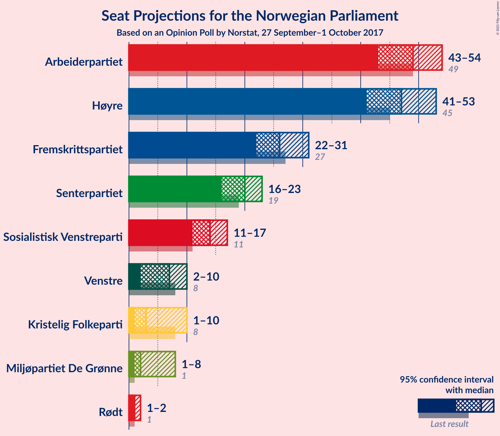
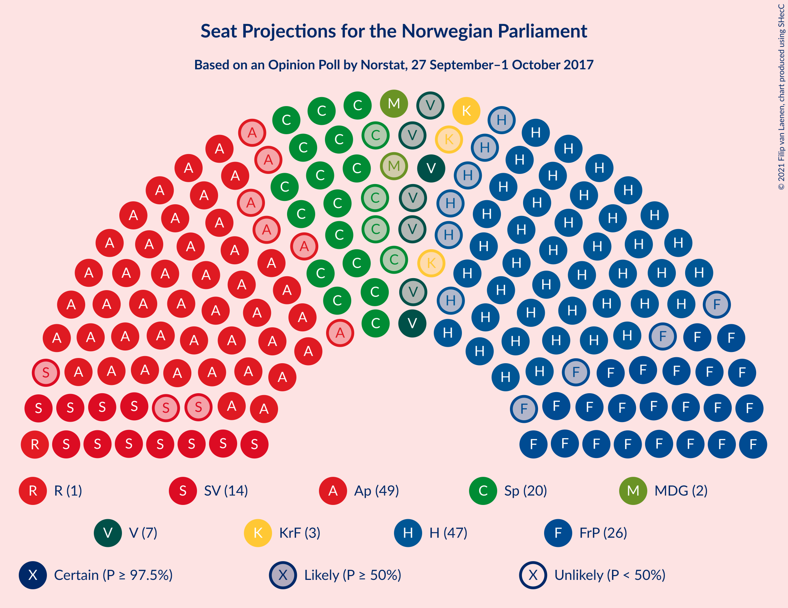
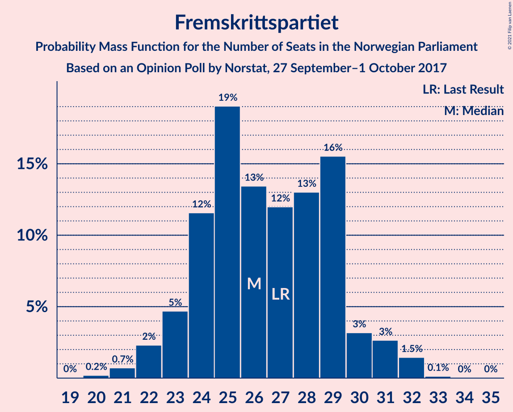
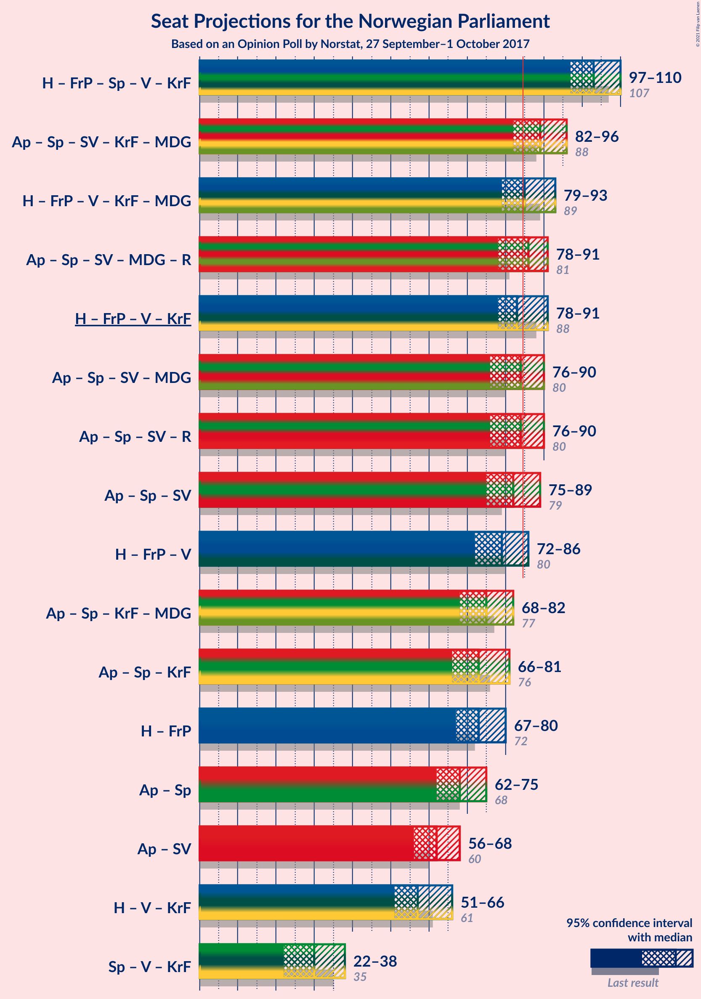
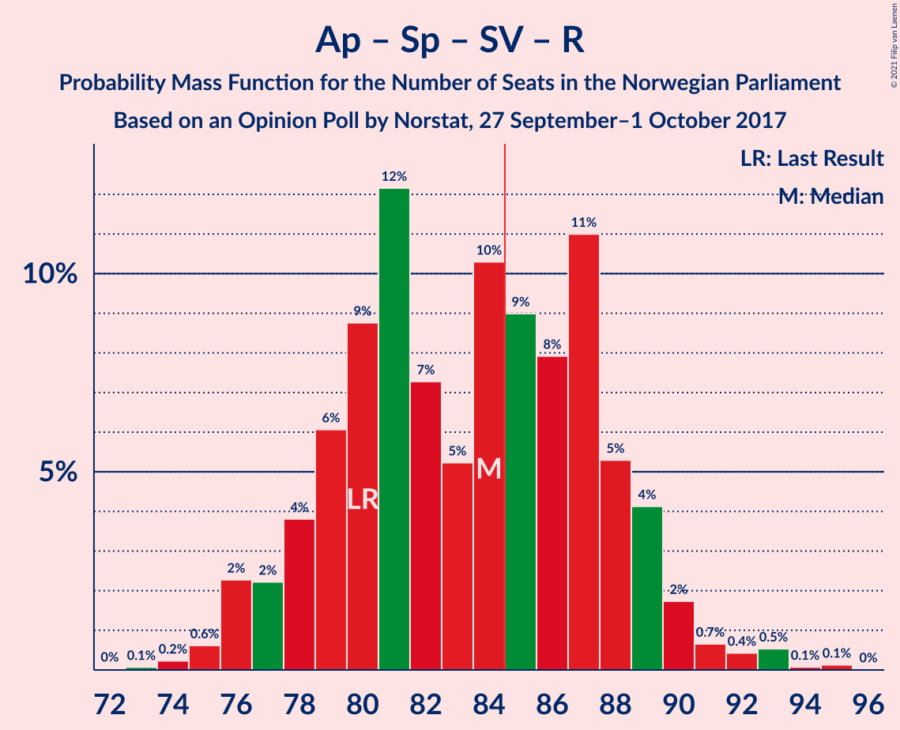
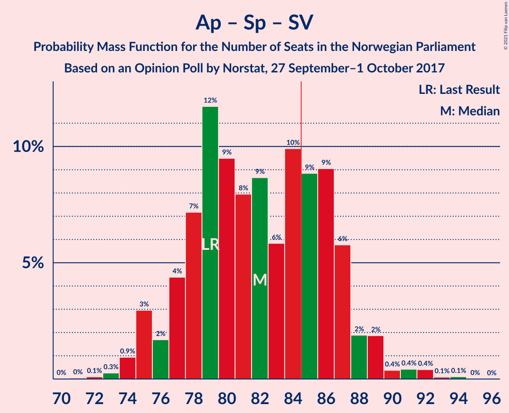
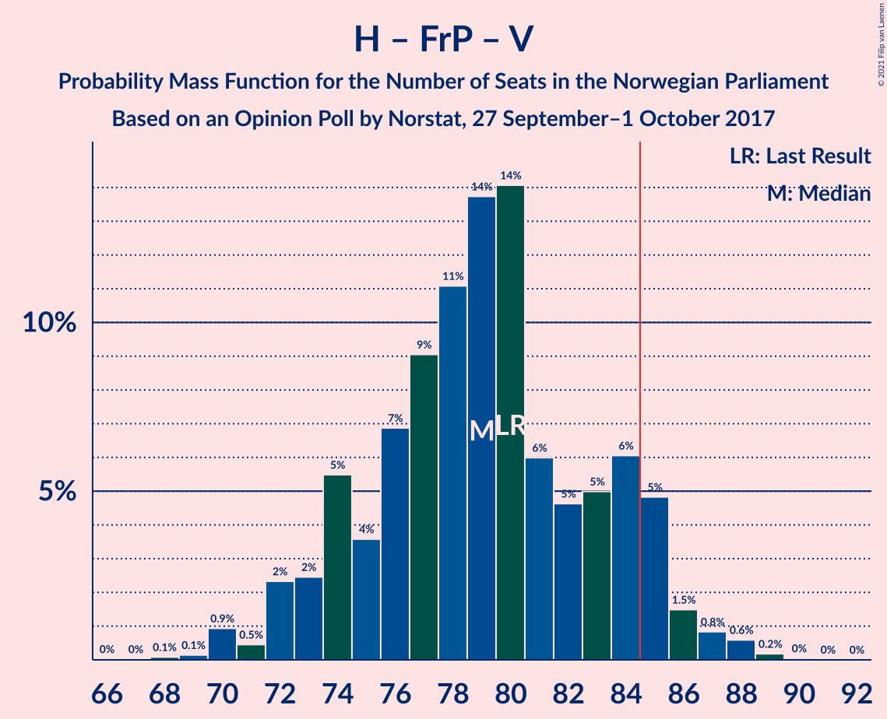
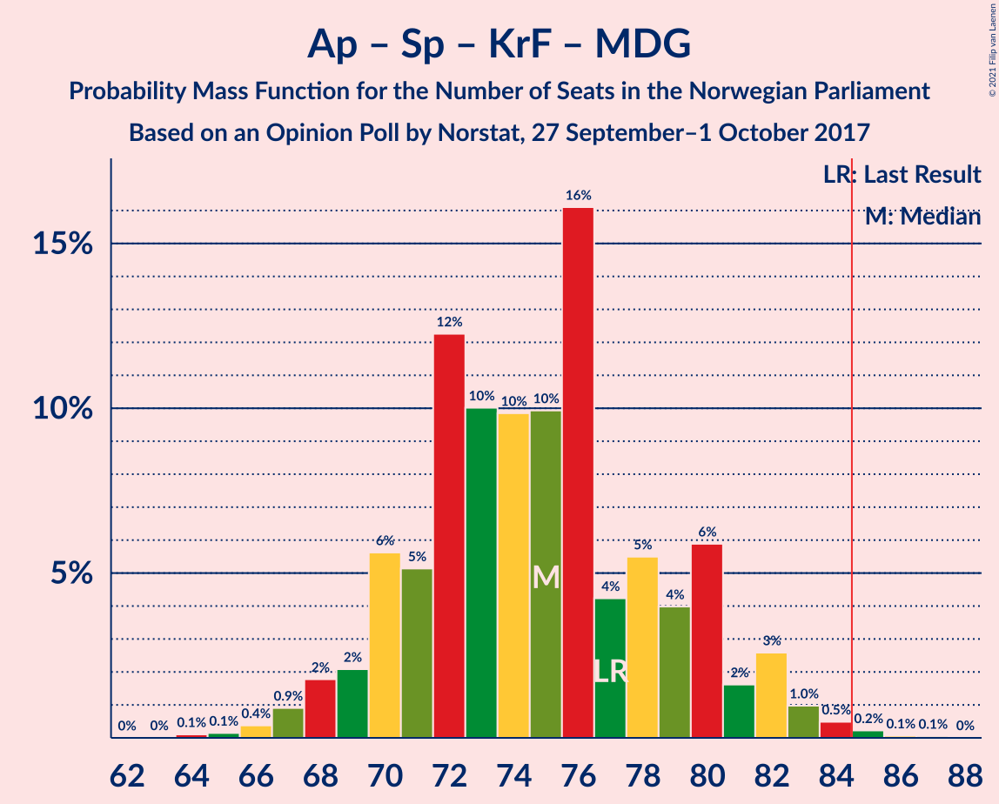

# Opinion Poll by Norstat, 27 September–1 October 2017

<a href="#voting-intentions">Voting Intentions</a> | <a href="#seats">Seats</a> | <a href="#coalitions">Coalitions</a> | <a href="#technical-information">Technical Information</a>

## Voting Intentions

### Confidence Intervals

| Party | Last Result | Poll Result | 80% Confidence Interval | 90% Confidence Interval | 95% Confidence Interval | 99% Confidence Interval |
|:-----:|:-----------:|:-----------:|:-----------------------:|:-----------------------:|:-----------------------:|:-----------------------:|
| Arbeiderpartiet | 27.4% | 26.5% | 24.7–28.4% |24.2–28.9% |23.7–29.4% |22.9–30.3% |
| Høyre | 25.0% | 25.6% | 23.8–27.5% |23.4–28.0% |22.9–28.5% |22.1–29.4% |
| Fremskrittspartiet | 15.2% | 14.3% | 13.0–15.9% |12.6–16.4% |12.2–16.7% |11.6–17.5% |
| Senterpartiet | 10.3% | 10.6% | 9.4–12.0% |9.1–12.4% |8.8–12.8% |8.3–13.5% |
| Sosialistisk Venstreparti | 6.0% | 7.5% | 6.5–8.8% |6.3–9.1% |6.0–9.4% |5.6–10.0% |
| Venstre | 4.4% | 4.3% | 3.5–5.2% |3.3–5.5% |3.1–5.7% |2.8–6.2% |
| Kristelig Folkeparti | 4.2% | 3.9% | 3.2–4.9% |3.0–5.1% |2.9–5.4% |2.6–5.9% |
| Miljøpartiet De Grønne | 3.2% | 3.0% | 2.4–3.8% |2.2–4.1% |2.1–4.3% |1.8–4.7% |
| Rødt | 2.4% | 2.6% | 2.0–3.4% |1.8–3.6% |1.7–3.8% |1.5–4.2% |

*Note:* The poll result column reflects the actual value used in the calculations. Published results may vary slightly, and in addition be rounded to fewer digits.

## Seats

### Confidence Intervals

| Party | Last Result | Median | 80% Confidence Interval | 90% Confidence Interval | 95% Confidence Interval | 99% Confidence Interval |
|:-----:|:-----------:|:------:|:-----------------------:|:-----------------------:|:-----------------------:|:-----------------------:|
| <a href="#arbeiderpartiet">Arbeiderpartiet</a> | 49 | 49 | 45–53 |44–54 |43–54 |42–56 |
| <a href="#høyre">Høyre</a> | 45 | 47 | 43–50 |42–52 |41–53 |40–54 |
| <a href="#fremskrittspartiet">Fremskrittspartiet</a> | 27 | 26 | 24–29 |23–30 |22–31 |21–32 |
| <a href="#senterpartiet">Senterpartiet</a> | 19 | 20 | 17–23 |17–23 |16–23 |15–24 |
| <a href="#sosialistisk-venstreparti">Sosialistisk Venstreparti</a> | 11 | 14 | 12–16 |11–17 |11–17 |10–18 |
| <a href="#venstre">Venstre</a> | 8 | 7 | 2–9 |2–10 |2–10 |2–11 |
| <a href="#kristelig-folkeparti">Kristelig Folkeparti</a> | 8 | 3 | 2–9 |1–9 |1–10 |1–11 |
| <a href="#miljøpartiet-de-grønne">Miljøpartiet De Grønne</a> | 1 | 2 | 1–2 |1–7 |1–8 |0–9 |
| <a href="#rødt">Rødt</a> | 1 | 1 | 1–2 |1–2 |1–2 |1–7 |

### Arbeiderpartiet

*For a full overview of the results for this party, see the [Arbeiderpartiet](party-arbeiderpartiet.html) page.*

| Number of Seats | Probability | Accumulated | Special Marks |
|:---------------:|:-----------:|:-----------:|:-------------:|
| 40 | 0% | 100% |  |
| 41 | 0.3% | 99.9% |  |
| 42 | 1.1% | 99.6% |  |
| 43 | 3% | 98% |  |
| 44 | 5% | 95% |  |
| 45 | 7% | 90% |  |
| 46 | 11% | 83% |  |
| 47 | 8% | 72% |  |
| 48 | 13% | 64% |  |
| 49 | 17% | 52% | Last Result, Median |
| 50 | 10% | 34% |  |
| 51 | 6% | 24% |  |
| 52 | 8% | 18% |  |
| 53 | 3% | 11% |  |
| 54 | 6% | 8% |  |
| 55 | 0.9% | 2% |  |
| 56 | 0.5% | 0.8% |  |
| 57 | 0.2% | 0.3% |  |
| 58 | 0.1% | 0.2% |  |
| 59 | 0% | 0% |  |

### Høyre

*For a full overview of the results for this party, see the [Høyre](party-høyre.html) page.*

| Number of Seats | Probability | Accumulated | Special Marks |
|:---------------:|:-----------:|:-----------:|:-------------:|
| 38 | 0.1% | 100% |  |
| 39 | 0.2% | 99.9% |  |
| 40 | 0.7% | 99.7% |  |
| 41 | 2% | 99.0% |  |
| 42 | 2% | 97% |  |
| 43 | 9% | 95% |  |
| 44 | 7% | 86% |  |
| 45 | 19% | 79% | Last Result |
| 46 | 7% | 60% |  |
| 47 | 13% | 53% | Median |
| 48 | 12% | 40% |  |
| 49 | 7% | 28% |  |
| 50 | 13% | 22% |  |
| 51 | 3% | 9% |  |
| 52 | 4% | 6% |  |
| 53 | 2% | 3% |  |
| 54 | 0.4% | 0.9% |  |
| 55 | 0.4% | 0.5% |  |
| 56 | 0% | 0.1% |  |
| 57 | 0% | 0% |  |

### Fremskrittspartiet

*For a full overview of the results for this party, see the [Fremskrittspartiet](party-fremskrittspartiet.html) page.*

| Number of Seats | Probability | Accumulated | Special Marks |
|:---------------:|:-----------:|:-----------:|:-------------:|
| 20 | 0.2% | 100% |  |
| 21 | 0.7% | 99.8% |  |
| 22 | 2% | 99.0% |  |
| 23 | 5% | 97% |  |
| 24 | 12% | 92% |  |
| 25 | 19% | 80% |  |
| 26 | 13% | 61% | Median |
| 27 | 12% | 48% | Last Result |
| 28 | 13% | 36% |  |
| 29 | 16% | 23% |  |
| 30 | 3% | 7% |  |
| 31 | 3% | 4% |  |
| 32 | 1.5% | 2% |  |
| 33 | 0.1% | 0.2% |  |
| 34 | 0% | 0.1% |  |
| 35 | 0% | 0% |  |

### Senterpartiet

*For a full overview of the results for this party, see the [Senterpartiet](party-senterpartiet.html) page.*

| Number of Seats | Probability | Accumulated | Special Marks |
|:---------------:|:-----------:|:-----------:|:-------------:|
| 14 | 0.3% | 100% |  |
| 15 | 1.0% | 99.6% |  |
| 16 | 3% | 98.6% |  |
| 17 | 9% | 96% |  |
| 18 | 16% | 87% |  |
| 19 | 20% | 71% | Last Result |
| 20 | 18% | 51% | Median |
| 21 | 15% | 33% |  |
| 22 | 7% | 17% |  |
| 23 | 8% | 10% |  |
| 24 | 2% | 2% |  |
| 25 | 0.3% | 0.4% |  |
| 26 | 0.1% | 0.1% |  |
| 27 | 0% | 0% |  |

### Sosialistisk Venstreparti

*For a full overview of the results for this party, see the [Sosialistisk Venstreparti](party-sosialistiskvenstreparti.html) page.*

| Number of Seats | Probability | Accumulated | Special Marks |
|:---------------:|:-----------:|:-----------:|:-------------:|
| 9 | 0.1% | 100% |  |
| 10 | 2% | 99.9% |  |
| 11 | 6% | 98% | Last Result |
| 12 | 13% | 92% |  |
| 13 | 21% | 79% |  |
| 14 | 25% | 58% | Median |
| 15 | 20% | 32% |  |
| 16 | 7% | 12% |  |
| 17 | 4% | 5% |  |
| 18 | 1.1% | 1.5% |  |
| 19 | 0.3% | 0.3% |  |
| 20 | 0.1% | 0.1% |  |
| 21 | 0% | 0% |  |

### Venstre

*For a full overview of the results for this party, see the [Venstre](party-venstre.html) page.*

| Number of Seats | Probability | Accumulated | Special Marks |
|:---------------:|:-----------:|:-----------:|:-------------:|
| 2 | 29% | 100% |  |
| 3 | 14% | 71% |  |
| 4 | 0% | 57% |  |
| 5 | 0% | 57% |  |
| 6 | 0% | 57% |  |
| 7 | 8% | 57% | Median |
| 8 | 29% | 49% | Last Result |
| 9 | 11% | 20% |  |
| 10 | 7% | 9% |  |
| 11 | 2% | 2% |  |
| 12 | 0.2% | 0.3% |  |
| 13 | 0.1% | 0.1% |  |
| 14 | 0% | 0% |  |

### Kristelig Folkeparti

*For a full overview of the results for this party, see the [Kristelig Folkeparti](party-kristeligfolkeparti.html) page.*

| Number of Seats | Probability | Accumulated | Special Marks |
|:---------------:|:-----------:|:-----------:|:-------------:|
| 0 | 0.1% | 100% |  |
| 1 | 8% | 99.9% |  |
| 2 | 9% | 92% |  |
| 3 | 45% | 83% | Median |
| 4 | 0% | 38% |  |
| 5 | 0% | 38% |  |
| 6 | 0% | 38% |  |
| 7 | 8% | 38% |  |
| 8 | 18% | 30% | Last Result |
| 9 | 9% | 13% |  |
| 10 | 3% | 3% |  |
| 11 | 0.4% | 0.5% |  |
| 12 | 0.1% | 0.1% |  |
| 13 | 0% | 0% |  |

### Miljøpartiet De Grønne

*For a full overview of the results for this party, see the [Miljøpartiet De Grønne](party-miljøpartietdegrønne.html) page.*

| Number of Seats | Probability | Accumulated | Special Marks |
|:---------------:|:-----------:|:-----------:|:-------------:|
| 0 | 1.1% | 100% |  |
| 1 | 48% | 98.9% | Last Result |
| 2 | 44% | 51% | Median |
| 3 | 2% | 8% |  |
| 4 | 0.2% | 5% |  |
| 5 | 0% | 5% |  |
| 6 | 0% | 5% |  |
| 7 | 2% | 5% |  |
| 8 | 3% | 3% |  |
| 9 | 0.6% | 0.6% |  |
| 10 | 0% | 0% |  |

### Rødt

*For a full overview of the results for this party, see the [Rødt](party-rødt.html) page.*

| Number of Seats | Probability | Accumulated | Special Marks |
|:---------------:|:-----------:|:-----------:|:-------------:|
| 0 | 0.1% | 100% |  |
| 1 | 69% | 99.9% | Last Result, Median |
| 2 | 30% | 31% |  |
| 3 | 0% | 1.3% |  |
| 4 | 0% | 1.3% |  |
| 5 | 0% | 1.3% |  |
| 6 | 0% | 1.3% |  |
| 7 | 0.9% | 1.3% |  |
| 8 | 0.4% | 0.4% |  |
| 9 | 0.1% | 0.1% |  |
| 10 | 0% | 0% |  |

## Coalitions

### Confidence Intervals

| Coalition | Last Result | Median | Majority? | 80% Confidence Interval | 90% Confidence Interval | 95% Confidence Interval | 99% Confidence Interval |
|:---------:|:-----------:|:------:|:---------:|:-----------------------:|:-----------------------:|:-----------------------:|:-----------------------:|
| Høyre – Fremskrittspartiet – Senterpartiet – Venstre – Kristelig Folkeparti | 107 | 103 | 100% | 99–108 | 98–109 | 97–110 | 94–112 |
| Arbeiderpartiet – Senterpartiet – Sosialistisk Venstreparti – Kristelig Folkeparti – Miljøpartiet De Grønne | 88 | 89 | 83% | 84–94 | 83–95 | 82–96 | 80–98 |
| Høyre – Fremskrittspartiet – Venstre – Kristelig Folkeparti – Miljøpartiet De Grønne | 89 | 85 | 59% | 81–90 | 80–92 | 79–93 | 76–94 |
| Arbeiderpartiet – Senterpartiet – Sosialistisk Venstreparti – Miljøpartiet De Grønne – Rødt | 81 | 86 | 57% | 81–89 | 79–91 | 78–91 | 76–95 |
| Høyre – Fremskrittspartiet – Venstre – Kristelig Folkeparti | 88 | 83 | 43% | 80–88 | 78–90 | 78–91 | 74–93 |
| Arbeiderpartiet – Senterpartiet – Sosialistisk Venstreparti – Miljøpartiet De Grønne | 80 | 84 | 46% | 79–88 | 78–89 | 76–90 | 75–93 |
| Arbeiderpartiet – Senterpartiet – Sosialistisk Venstreparti – Rødt | 80 | 84 | 41% | 79–88 | 77–89 | 76–90 | 75–93 |
| Arbeiderpartiet – Senterpartiet – Sosialistisk Venstreparti | 79 | 82 | 29% | 77–87 | 76–88 | 75–89 | 74–92 |
| Høyre – Fremskrittspartiet – Venstre | 80 | 79 | 8% | 74–84 | 73–85 | 72–86 | 70–88 |
| Arbeiderpartiet – Senterpartiet – Kristelig Folkeparti – Miljøpartiet De Grønne | 77 | 75 | 0.4% | 70–80 | 69–81 | 68–82 | 66–84 |
| Arbeiderpartiet – Senterpartiet – Kristelig Folkeparti | 76 | 73 | 0% | 69–78 | 68–79 | 66–81 | 64–82 |
| Høyre – Fremskrittspartiet | 72 | 73 | 0% | 69–78 | 68–78 | 67–80 | 64–82 |
| Arbeiderpartiet – Senterpartiet | 68 | 68 | 0% | 64–73 | 63–74 | 62–75 | 60–77 |
| Arbeiderpartiet – Sosialistisk Venstreparti | 60 | 62 | 0% | 58–67 | 57–67 | 56–68 | 54–71 |
| Høyre – Venstre – Kristelig Folkeparti | 61 | 57 | 0% | 52–63 | 51–64 | 51–66 | 49–68 |
| Senterpartiet – Venstre – Kristelig Folkeparti | 35 | 30 | 0% | 24–36 | 23–37 | 22–38 | 20–40 |

### Høyre – Fremskrittspartiet – Senterpartiet – Venstre – Kristelig Folkeparti

| Number of Seats | Probability | Accumulated | Special Marks |
|:---------------:|:-----------:|:-----------:|:-------------:|
| 91 | 0% | 100% |  |
| 92 | 0% | 99.9% |  |
| 93 | 0.1% | 99.9% |  |
| 94 | 0.3% | 99.8% |  |
| 95 | 0.3% | 99.5% |  |
| 96 | 0.7% | 99.1% |  |
| 97 | 1.4% | 98% |  |
| 98 | 2% | 97% |  |
| 99 | 5% | 95% |  |
| 100 | 10% | 90% |  |
| 101 | 12% | 80% |  |
| 102 | 14% | 68% |  |
| 103 | 5% | 54% | Median |
| 104 | 10% | 49% |  |
| 105 | 10% | 38% |  |
| 106 | 6% | 28% |  |
| 107 | 10% | 23% | Last Result |
| 108 | 4% | 13% |  |
| 109 | 5% | 9% |  |
| 110 | 2% | 4% |  |
| 111 | 1.1% | 2% |  |
| 112 | 0.6% | 0.7% |  |
| 113 | 0.1% | 0.1% |  |
| 114 | 0% | 0% |  |

### Arbeiderpartiet – Senterpartiet – Sosialistisk Venstreparti – Kristelig Folkeparti – Miljøpartiet De Grønne

| Number of Seats | Probability | Accumulated | Special Marks |
|:---------------:|:-----------:|:-----------:|:-------------:|
| 78 | 0.1% | 100% |  |
| 79 | 0.2% | 99.9% |  |
| 80 | 0.9% | 99.7% |  |
| 81 | 0.9% | 98.8% |  |
| 82 | 2% | 98% |  |
| 83 | 5% | 96% |  |
| 84 | 8% | 90% |  |
| 85 | 4% | 83% | Majority |
| 86 | 5% | 79% |  |
| 87 | 10% | 74% |  |
| 88 | 10% | 63% | Last Result, Median |
| 89 | 14% | 53% |  |
| 90 | 11% | 39% |  |
| 91 | 9% | 28% |  |
| 92 | 6% | 19% |  |
| 93 | 3% | 14% |  |
| 94 | 5% | 11% |  |
| 95 | 3% | 6% |  |
| 96 | 1.4% | 3% |  |
| 97 | 0.8% | 1.4% |  |
| 98 | 0.4% | 0.7% |  |
| 99 | 0.1% | 0.2% |  |
| 100 | 0.1% | 0.1% |  |
| 101 | 0% | 0% |  |

### Høyre – Fremskrittspartiet – Venstre – Kristelig Folkeparti – Miljøpartiet De Grønne

| Number of Seats | Probability | Accumulated | Special Marks |
|:---------------:|:-----------:|:-----------:|:-------------:|
| 74 | 0.1% | 100% |  |
| 75 | 0.1% | 99.9% |  |
| 76 | 0.5% | 99.8% |  |
| 77 | 0.4% | 99.2% |  |
| 78 | 0.7% | 98.8% |  |
| 79 | 2% | 98% |  |
| 80 | 4% | 96% |  |
| 81 | 5% | 92% |  |
| 82 | 11% | 87% |  |
| 83 | 8% | 76% |  |
| 84 | 9% | 68% |  |
| 85 | 10% | 59% | Median, Majority |
| 86 | 5% | 49% |  |
| 87 | 7% | 44% |  |
| 88 | 12% | 36% |  |
| 89 | 9% | 24% | Last Result |
| 90 | 6% | 15% |  |
| 91 | 4% | 9% |  |
| 92 | 2% | 5% |  |
| 93 | 2% | 3% |  |
| 94 | 0.6% | 1.0% |  |
| 95 | 0.2% | 0.3% |  |
| 96 | 0.1% | 0.1% |  |
| 97 | 0% | 0% |  |

### Arbeiderpartiet – Senterpartiet – Sosialistisk Venstreparti – Miljøpartiet De Grønne – Rødt

| Number of Seats | Probability | Accumulated | Special Marks |
|:---------------:|:-----------:|:-----------:|:-------------:|
| 74 | 0% | 100% |  |
| 75 | 0.1% | 99.9% |  |
| 76 | 0.4% | 99.9% |  |
| 77 | 1.2% | 99.4% |  |
| 78 | 2% | 98% |  |
| 79 | 2% | 96% |  |
| 80 | 3% | 94% |  |
| 81 | 10% | 91% | Last Result |
| 82 | 10% | 82% |  |
| 83 | 9% | 71% |  |
| 84 | 5% | 62% |  |
| 85 | 5% | 57% | Majority |
| 86 | 10% | 52% | Median |
| 87 | 9% | 43% |  |
| 88 | 14% | 33% |  |
| 89 | 9% | 19% |  |
| 90 | 4% | 10% |  |
| 91 | 3% | 6% |  |
| 92 | 0.8% | 2% |  |
| 93 | 0.3% | 2% |  |
| 94 | 0.7% | 1.2% |  |
| 95 | 0.2% | 0.5% |  |
| 96 | 0.2% | 0.3% |  |
| 97 | 0.1% | 0.1% |  |
| 98 | 0.1% | 0.1% |  |
| 99 | 0% | 0% |  |

### Høyre – Fremskrittspartiet – Venstre – Kristelig Folkeparti

| Number of Seats | Probability | Accumulated | Special Marks |
|:---------------:|:-----------:|:-----------:|:-------------:|
| 71 | 0.1% | 100% |  |
| 72 | 0.1% | 99.9% |  |
| 73 | 0.2% | 99.9% |  |
| 74 | 0.2% | 99.7% |  |
| 75 | 0.7% | 99.5% |  |
| 76 | 0.3% | 98.8% |  |
| 77 | 0.8% | 98% |  |
| 78 | 3% | 98% |  |
| 79 | 4% | 94% |  |
| 80 | 9% | 90% |  |
| 81 | 14% | 81% |  |
| 82 | 9% | 67% |  |
| 83 | 10% | 57% | Median |
| 84 | 5% | 48% |  |
| 85 | 5% | 43% | Majority |
| 86 | 9% | 38% |  |
| 87 | 10% | 29% |  |
| 88 | 10% | 18% | Last Result |
| 89 | 3% | 9% |  |
| 90 | 2% | 6% |  |
| 91 | 2% | 4% |  |
| 92 | 1.2% | 2% |  |
| 93 | 0.4% | 0.6% |  |
| 94 | 0.1% | 0.1% |  |
| 95 | 0% | 0.1% |  |
| 96 | 0% | 0% |  |

### Arbeiderpartiet – Senterpartiet – Sosialistisk Venstreparti – Miljøpartiet De Grønne

| Number of Seats | Probability | Accumulated | Special Marks |
|:---------------:|:-----------:|:-----------:|:-------------:|
| 73 | 0% | 100% |  |
| 74 | 0.1% | 99.9% |  |
| 75 | 0.5% | 99.8% |  |
| 76 | 2% | 99.3% |  |
| 77 | 2% | 97% |  |
| 78 | 2% | 96% |  |
| 79 | 4% | 93% |  |
| 80 | 11% | 89% | Last Result |
| 81 | 11% | 78% |  |
| 82 | 8% | 68% |  |
| 83 | 5% | 60% |  |
| 84 | 9% | 55% |  |
| 85 | 5% | 46% | Median, Majority |
| 86 | 12% | 41% |  |
| 87 | 15% | 29% |  |
| 88 | 7% | 15% |  |
| 89 | 3% | 8% |  |
| 90 | 3% | 5% |  |
| 91 | 0.5% | 2% |  |
| 92 | 0.3% | 1.4% |  |
| 93 | 0.6% | 1.1% |  |
| 94 | 0.2% | 0.5% |  |
| 95 | 0.2% | 0.3% |  |
| 96 | 0.1% | 0.1% |  |
| 97 | 0% | 0% |  |

### Arbeiderpartiet – Senterpartiet – Sosialistisk Venstreparti – Rødt

| Number of Seats | Probability | Accumulated | Special Marks |
|:---------------:|:-----------:|:-----------:|:-------------:|
| 73 | 0.1% | 100% |  |
| 74 | 0.2% | 99.9% |  |
| 75 | 0.6% | 99.7% |  |
| 76 | 2% | 99.0% |  |
| 77 | 2% | 97% |  |
| 78 | 4% | 95% |  |
| 79 | 6% | 91% |  |
| 80 | 9% | 85% | Last Result |
| 81 | 12% | 76% |  |
| 82 | 7% | 64% |  |
| 83 | 5% | 56% |  |
| 84 | 10% | 51% | Median |
| 85 | 9% | 41% | Majority |
| 86 | 8% | 32% |  |
| 87 | 11% | 24% |  |
| 88 | 5% | 13% |  |
| 89 | 4% | 8% |  |
| 90 | 2% | 4% |  |
| 91 | 0.7% | 2% |  |
| 92 | 0.4% | 1.2% |  |
| 93 | 0.5% | 0.8% |  |
| 94 | 0.1% | 0.2% |  |
| 95 | 0.1% | 0.1% |  |
| 96 | 0% | 0% |  |

### Arbeiderpartiet – Senterpartiet – Sosialistisk Venstreparti

| Number of Seats | Probability | Accumulated | Special Marks |
|:---------------:|:-----------:|:-----------:|:-------------:|
| 71 | 0% | 100% |  |
| 72 | 0.1% | 99.9% |  |
| 73 | 0.3% | 99.8% |  |
| 74 | 0.9% | 99.6% |  |
| 75 | 3% | 98.6% |  |
| 76 | 2% | 96% |  |
| 77 | 4% | 94% |  |
| 78 | 7% | 90% |  |
| 79 | 12% | 82% | Last Result |
| 80 | 9% | 71% |  |
| 81 | 8% | 61% |  |
| 82 | 9% | 53% |  |
| 83 | 6% | 45% | Median |
| 84 | 10% | 39% |  |
| 85 | 9% | 29% | Majority |
| 86 | 9% | 20% |  |
| 87 | 6% | 11% |  |
| 88 | 2% | 5% |  |
| 89 | 2% | 3% |  |
| 90 | 0.4% | 1.4% |  |
| 91 | 0.4% | 1.0% |  |
| 92 | 0.4% | 0.6% |  |
| 93 | 0.1% | 0.2% |  |
| 94 | 0.1% | 0.1% |  |
| 95 | 0% | 0% |  |

### Høyre – Fremskrittspartiet – Venstre

| Number of Seats | Probability | Accumulated | Special Marks |
|:---------------:|:-----------:|:-----------:|:-------------:|
| 67 | 0% | 100% |  |
| 68 | 0.1% | 99.9% |  |
| 69 | 0.1% | 99.9% |  |
| 70 | 0.9% | 99.7% |  |
| 71 | 0.5% | 98.8% |  |
| 72 | 2% | 98% |  |
| 73 | 2% | 96% |  |
| 74 | 5% | 94% |  |
| 75 | 4% | 88% |  |
| 76 | 7% | 84% |  |
| 77 | 9% | 78% |  |
| 78 | 11% | 69% |  |
| 79 | 14% | 57% |  |
| 80 | 14% | 44% | Last Result, Median |
| 81 | 6% | 30% |  |
| 82 | 5% | 24% |  |
| 83 | 5% | 19% |  |
| 84 | 6% | 14% |  |
| 85 | 5% | 8% | Majority |
| 86 | 1.5% | 3% |  |
| 87 | 0.8% | 2% |  |
| 88 | 0.6% | 0.8% |  |
| 89 | 0.2% | 0.2% |  |
| 90 | 0% | 0.1% |  |
| 91 | 0% | 0% |  |

### Arbeiderpartiet – Senterpartiet – Kristelig Folkeparti – Miljøpartiet De Grønne

| Number of Seats | Probability | Accumulated | Special Marks |
|:---------------:|:-----------:|:-----------:|:-------------:|
| 64 | 0.1% | 100% |  |
| 65 | 0.1% | 99.9% |  |
| 66 | 0.4% | 99.7% |  |
| 67 | 0.9% | 99.3% |  |
| 68 | 2% | 98% |  |
| 69 | 2% | 97% |  |
| 70 | 6% | 95% |  |
| 71 | 5% | 89% |  |
| 72 | 12% | 84% |  |
| 73 | 10% | 72% |  |
| 74 | 10% | 62% | Median |
| 75 | 10% | 52% |  |
| 76 | 16% | 42% |  |
| 77 | 4% | 26% | Last Result |
| 78 | 5% | 21% |  |
| 79 | 4% | 16% |  |
| 80 | 6% | 12% |  |
| 81 | 2% | 6% |  |
| 82 | 3% | 4% |  |
| 83 | 1.0% | 2% |  |
| 84 | 0.5% | 0.9% |  |
| 85 | 0.2% | 0.4% | Majority |
| 86 | 0.1% | 0.1% |  |
| 87 | 0.1% | 0.1% |  |
| 88 | 0% | 0% |  |

### Arbeiderpartiet – Senterpartiet – Kristelig Folkeparti

| Number of Seats | Probability | Accumulated | Special Marks |
|:---------------:|:-----------:|:-----------:|:-------------:|
| 62 | 0.1% | 100% |  |
| 63 | 0.2% | 99.9% |  |
| 64 | 0.3% | 99.8% |  |
| 65 | 0.8% | 99.4% |  |
| 66 | 1.2% | 98.6% |  |
| 67 | 2% | 97% |  |
| 68 | 4% | 95% |  |
| 69 | 7% | 91% |  |
| 70 | 11% | 84% |  |
| 71 | 12% | 74% |  |
| 72 | 10% | 62% | Median |
| 73 | 11% | 52% |  |
| 74 | 6% | 41% |  |
| 75 | 15% | 36% |  |
| 76 | 5% | 21% | Last Result |
| 77 | 5% | 16% |  |
| 78 | 5% | 11% |  |
| 79 | 2% | 6% |  |
| 80 | 2% | 4% |  |
| 81 | 2% | 3% |  |
| 82 | 0.3% | 0.6% |  |
| 83 | 0.2% | 0.3% |  |
| 84 | 0% | 0.1% |  |
| 85 | 0% | 0% | Majority |

### Høyre – Fremskrittspartiet

| Number of Seats | Probability | Accumulated | Special Marks |
|:---------------:|:-----------:|:-----------:|:-------------:|
| 62 | 0.1% | 100% |  |
| 63 | 0.2% | 99.9% |  |
| 64 | 0.3% | 99.7% |  |
| 65 | 0.4% | 99.4% |  |
| 66 | 1.2% | 98.9% |  |
| 67 | 2% | 98% |  |
| 68 | 5% | 96% |  |
| 69 | 7% | 91% |  |
| 70 | 8% | 84% |  |
| 71 | 9% | 76% |  |
| 72 | 10% | 67% | Last Result |
| 73 | 11% | 57% | Median |
| 74 | 10% | 47% |  |
| 75 | 5% | 37% |  |
| 76 | 12% | 33% |  |
| 77 | 8% | 21% |  |
| 78 | 8% | 12% |  |
| 79 | 1.0% | 5% |  |
| 80 | 2% | 4% |  |
| 81 | 1.0% | 1.5% |  |
| 82 | 0.4% | 0.5% |  |
| 83 | 0.1% | 0.2% |  |
| 84 | 0.1% | 0.1% |  |
| 85 | 0% | 0% | Majority |

### Arbeiderpartiet – Senterpartiet

| Number of Seats | Probability | Accumulated | Special Marks |
|:---------------:|:-----------:|:-----------:|:-------------:|
| 58 | 0% | 100% |  |
| 59 | 0.2% | 99.9% |  |
| 60 | 0.5% | 99.7% |  |
| 61 | 1.2% | 99.3% |  |
| 62 | 3% | 98% |  |
| 63 | 4% | 95% |  |
| 64 | 5% | 92% |  |
| 65 | 8% | 86% |  |
| 66 | 11% | 78% |  |
| 67 | 12% | 67% |  |
| 68 | 12% | 55% | Last Result |
| 69 | 9% | 44% | Median |
| 70 | 7% | 35% |  |
| 71 | 8% | 28% |  |
| 72 | 8% | 20% |  |
| 73 | 7% | 12% |  |
| 74 | 1.2% | 5% |  |
| 75 | 3% | 4% |  |
| 76 | 0.5% | 1.3% |  |
| 77 | 0.5% | 0.8% |  |
| 78 | 0.2% | 0.2% |  |
| 79 | 0.1% | 0.1% |  |
| 80 | 0% | 0% |  |

### Arbeiderpartiet – Sosialistisk Venstreparti

| Number of Seats | Probability | Accumulated | Special Marks |
|:---------------:|:-----------:|:-----------:|:-------------:|
| 53 | 0% | 100% |  |
| 54 | 0.4% | 99.9% |  |
| 55 | 1.4% | 99.5% |  |
| 56 | 2% | 98% |  |
| 57 | 5% | 96% |  |
| 58 | 4% | 91% |  |
| 59 | 9% | 87% |  |
| 60 | 9% | 78% | Last Result |
| 61 | 9% | 69% |  |
| 62 | 11% | 60% |  |
| 63 | 7% | 49% | Median |
| 64 | 17% | 42% |  |
| 65 | 8% | 25% |  |
| 66 | 4% | 17% |  |
| 67 | 8% | 12% |  |
| 68 | 3% | 4% |  |
| 69 | 0.8% | 2% |  |
| 70 | 0.4% | 1.2% |  |
| 71 | 0.5% | 0.8% |  |
| 72 | 0.1% | 0.2% |  |
| 73 | 0.1% | 0.1% |  |
| 74 | 0% | 0% |  |

### Høyre – Venstre – Kristelig Folkeparti

| Number of Seats | Probability | Accumulated | Special Marks |
|:---------------:|:-----------:|:-----------:|:-------------:|
| 46 | 0.1% | 100% |  |
| 47 | 0.1% | 99.8% |  |
| 48 | 0.1% | 99.7% |  |
| 49 | 0.5% | 99.6% |  |
| 50 | 1.4% | 99.1% |  |
| 51 | 3% | 98% |  |
| 52 | 6% | 95% |  |
| 53 | 7% | 89% |  |
| 54 | 6% | 82% |  |
| 55 | 16% | 76% |  |
| 56 | 9% | 60% |  |
| 57 | 6% | 51% | Median |
| 58 | 8% | 45% |  |
| 59 | 7% | 37% |  |
| 60 | 5% | 30% |  |
| 61 | 6% | 24% | Last Result |
| 62 | 7% | 18% |  |
| 63 | 4% | 11% |  |
| 64 | 3% | 7% |  |
| 65 | 1.1% | 4% |  |
| 66 | 2% | 3% |  |
| 67 | 0.4% | 1.0% |  |
| 68 | 0.5% | 0.6% |  |
| 69 | 0% | 0.1% |  |
| 70 | 0% | 0.1% |  |
| 71 | 0% | 0% |  |

### Senterpartiet – Venstre – Kristelig Folkeparti

| Number of Seats | Probability | Accumulated | Special Marks |
|:---------------:|:-----------:|:-----------:|:-------------:|
| 20 | 0.8% | 100% |  |
| 21 | 0.3% | 99.1% |  |
| 22 | 2% | 98.8% |  |
| 23 | 6% | 97% |  |
| 24 | 5% | 91% |  |
| 25 | 5% | 86% |  |
| 26 | 6% | 82% |  |
| 27 | 2% | 75% |  |
| 28 | 7% | 73% |  |
| 29 | 5% | 66% |  |
| 30 | 11% | 61% | Median |
| 31 | 8% | 49% |  |
| 32 | 8% | 41% |  |
| 33 | 10% | 33% |  |
| 34 | 5% | 23% |  |
| 35 | 6% | 18% | Last Result |
| 36 | 5% | 12% |  |
| 37 | 4% | 7% |  |
| 38 | 2% | 3% |  |
| 39 | 0.7% | 2% |  |
| 40 | 0.7% | 0.8% |  |
| 41 | 0.1% | 0.2% |  |
| 42 | 0% | 0% |  |

## Technical Information

### Opinion Poll

+ **Polling firm:** Norstat
+ **Commissioner(s):** —
+ **Fieldwork period:** 27 September–1 October 2017

### Calculations

+ **Sample size:** 941
+ **Simulations done:** 1,048,576
+ **Error estimate:** 2.41%

