# Opinion Poll by Norfakta, 3–4 October 2017

<a href="#voting-intentions">Voting Intentions</a> | <a href="#seats">Seats</a> | <a href="#coalitions">Coalitions</a> | <a href="#technical-information">Technical Information</a>

## Voting Intentions

### Confidence Intervals

| Party | Last Result | Poll Result | 80% Confidence Interval | 90% Confidence Interval | 95% Confidence Interval | 99% Confidence Interval |
|:-----:|:-----------:|:-----------:|:-----------------------:|:-----------------------:|:-----------------------:|:-----------------------:|
| Høyre | 25.0% | 27.6% | 25.7–29.7% |25.2–30.3% |24.7–30.8% |23.9–31.7% |
| Arbeiderpartiet | 27.4% | 25.8% | 23.9–27.8% |23.4–28.3% |22.9–28.8% |22.1–29.8% |
| Fremskrittspartiet | 15.2% | 13.4% | 12.0–15.0% |11.6–15.5% |11.3–15.9% |10.6–16.7% |
| Senterpartiet | 10.3% | 11.4% | 10.1–12.9% |9.8–13.4% |9.4–13.7% |8.9–14.5% |
| Sosialistisk Venstreparti | 6.0% | 6.5% | 5.5–7.7% |5.2–8.0% |5.0–8.3% |4.6–8.9% |
| Kristelig Folkeparti | 4.2% | 4.4% | 3.6–5.4% |3.4–5.7% |3.2–5.9% |2.8–6.5% |
| Miljøpartiet De Grønne | 3.2% | 3.6% | 2.9–4.6% |2.7–4.9% |2.6–5.1% |2.3–5.6% |
| Venstre | 4.4% | 3.4% | 2.7–4.4% |2.5–4.6% |2.4–4.9% |2.1–5.3% |
| Rødt | 2.4% | 1.8% | 1.3–2.5% |1.2–2.7% |1.1–2.9% |0.9–3.3% |

*Note:* The poll result column reflects the actual value used in the calculations. Published results may vary slightly, and in addition be rounded to fewer digits.

## Seats

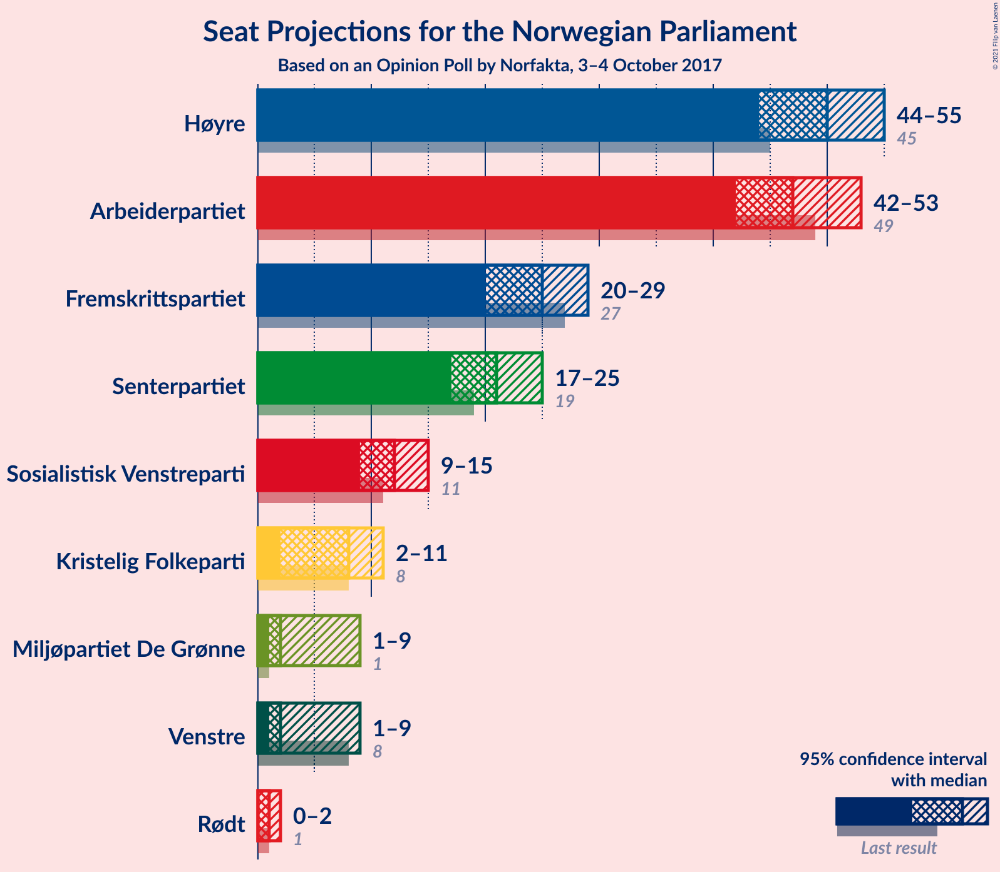

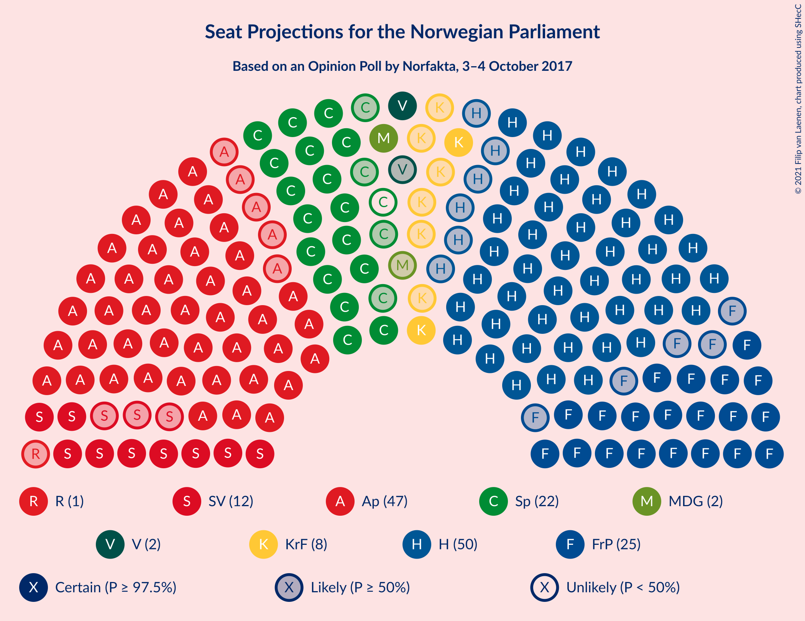

### Confidence Intervals

| Party | Last Result | Median | 80% Confidence Interval | 90% Confidence Interval | 95% Confidence Interval | 99% Confidence Interval |
|:-----:|:-----------:|:------:|:-----------------------:|:-----------------------:|:-----------------------:|:-----------------------:|
| <a href="#høyre">Høyre</a> | 45 | 50 | 46–54 |44–55 |44–55 |42–58 |
| <a href="#arbeiderpartiet">Arbeiderpartiet</a> | 49 | 47 | 43–50 |42–51 |42–53 |40–55 |
| <a href="#fremskrittspartiet">Fremskrittspartiet</a> | 27 | 25 | 22–27 |21–28 |20–29 |19–30 |
| <a href="#senterpartiet">Senterpartiet</a> | 19 | 21 | 18–24 |17–24 |17–25 |16–26 |
| <a href="#sosialistisk-venstreparti">Sosialistisk Venstreparti</a> | 11 | 12 | 10–14 |10–15 |9–15 |8–16 |
| <a href="#kristelig-folkeparti">Kristelig Folkeparti</a> | 8 | 8 | 3–10 |3–10 |2–11 |1–12 |
| <a href="#miljøpartiet-de-grønne">Miljøpartiet De Grønne</a> | 1 | 2 | 1–8 |1–9 |1–9 |1–10 |
| <a href="#venstre">Venstre</a> | 8 | 2 | 2–8 |2–8 |1–9 |1–10 |
| <a href="#rødt">Rødt</a> | 1 | 1 | 0–1 |0–1 |0–2 |0–2 |

### Høyre

*For a full overview of the results for this party, see the [Høyre](party-høyre.html) page.*

| Number of Seats | Probability | Accumulated | Special Marks |
|:---------------:|:-----------:|:-----------:|:-------------:|
| 40 | 0% | 100% |  |
| 41 | 0.1% | 99.9% |  |
| 42 | 0.6% | 99.9% |  |
| 43 | 0.7% | 99.2% |  |
| 44 | 4% | 98.6% |  |
| 45 | 3% | 94% | Last Result |
| 46 | 4% | 91% |  |
| 47 | 8% | 87% |  |
| 48 | 14% | 79% |  |
| 49 | 11% | 64% |  |
| 50 | 12% | 53% | Median |
| 51 | 17% | 41% |  |
| 52 | 8% | 24% |  |
| 53 | 5% | 16% |  |
| 54 | 6% | 11% |  |
| 55 | 3% | 5% |  |
| 56 | 1.0% | 2% |  |
| 57 | 0.7% | 1.3% |  |
| 58 | 0.4% | 0.5% |  |
| 59 | 0.1% | 0.2% |  |
| 60 | 0% | 0.1% |  |
| 61 | 0% | 0.1% |  |
| 62 | 0% | 0% |  |

### Arbeiderpartiet

*For a full overview of the results for this party, see the [Arbeiderpartiet](party-arbeiderpartiet.html) page.*

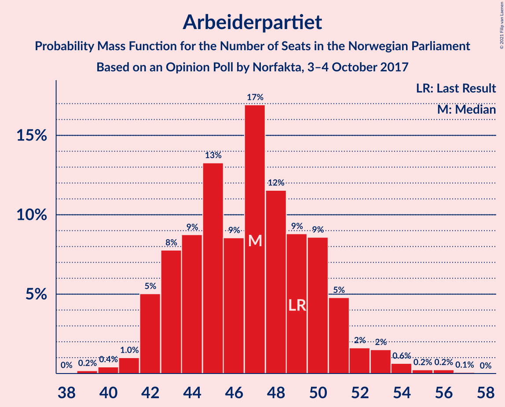

| Number of Seats | Probability | Accumulated | Special Marks |
|:---------------:|:-----------:|:-----------:|:-------------:|
| 38 | 0% | 100% |  |
| 39 | 0.2% | 99.9% |  |
| 40 | 0.4% | 99.8% |  |
| 41 | 1.0% | 99.3% |  |
| 42 | 5% | 98% |  |
| 43 | 8% | 93% |  |
| 44 | 9% | 86% |  |
| 45 | 13% | 77% |  |
| 46 | 9% | 64% |  |
| 47 | 17% | 55% | Median |
| 48 | 12% | 38% |  |
| 49 | 9% | 27% | Last Result |
| 50 | 9% | 18% |  |
| 51 | 5% | 9% |  |
| 52 | 2% | 4% |  |
| 53 | 2% | 3% |  |
| 54 | 0.6% | 1.2% |  |
| 55 | 0.2% | 0.6% |  |
| 56 | 0.2% | 0.3% |  |
| 57 | 0.1% | 0.1% |  |
| 58 | 0% | 0% |  |

### Fremskrittspartiet

*For a full overview of the results for this party, see the [Fremskrittspartiet](party-fremskrittspartiet.html) page.*

| Number of Seats | Probability | Accumulated | Special Marks |
|:---------------:|:-----------:|:-----------:|:-------------:|
| 17 | 0% | 100% |  |
| 18 | 0.4% | 99.9% |  |
| 19 | 0.9% | 99.6% |  |
| 20 | 2% | 98.6% |  |
| 21 | 3% | 97% |  |
| 22 | 9% | 93% |  |
| 23 | 13% | 84% |  |
| 24 | 14% | 71% |  |
| 25 | 24% | 56% | Median |
| 26 | 17% | 32% |  |
| 27 | 7% | 16% | Last Result |
| 28 | 5% | 9% |  |
| 29 | 2% | 3% |  |
| 30 | 0.7% | 1.2% |  |
| 31 | 0.3% | 0.4% |  |
| 32 | 0.1% | 0.2% |  |
| 33 | 0% | 0% |  |

### Senterpartiet

*For a full overview of the results for this party, see the [Senterpartiet](party-senterpartiet.html) page.*

| Number of Seats | Probability | Accumulated | Special Marks |
|:---------------:|:-----------:|:-----------:|:-------------:|
| 15 | 0.3% | 100% |  |
| 16 | 2% | 99.7% |  |
| 17 | 4% | 98% |  |
| 18 | 6% | 94% |  |
| 19 | 10% | 88% | Last Result |
| 20 | 17% | 78% |  |
| 21 | 15% | 61% | Median |
| 22 | 27% | 46% |  |
| 23 | 7% | 20% |  |
| 24 | 9% | 13% |  |
| 25 | 2% | 3% |  |
| 26 | 1.4% | 2% |  |
| 27 | 0.3% | 0.4% |  |
| 28 | 0.1% | 0.1% |  |
| 29 | 0% | 0% |  |

### Sosialistisk Venstreparti

*For a full overview of the results for this party, see the [Sosialistisk Venstreparti](party-sosialistiskvenstreparti.html) page.*

| Number of Seats | Probability | Accumulated | Special Marks |
|:---------------:|:-----------:|:-----------:|:-------------:|
| 7 | 0% | 100% |  |
| 8 | 1.1% | 99.9% |  |
| 9 | 3% | 98.8% |  |
| 10 | 13% | 96% |  |
| 11 | 24% | 83% | Last Result |
| 12 | 27% | 58% | Median |
| 13 | 17% | 32% |  |
| 14 | 9% | 14% |  |
| 15 | 4% | 5% |  |
| 16 | 1.0% | 1.4% |  |
| 17 | 0.3% | 0.4% |  |
| 18 | 0.1% | 0.1% |  |
| 19 | 0% | 0% |  |

### Kristelig Folkeparti

*For a full overview of the results for this party, see the [Kristelig Folkeparti](party-kristeligfolkeparti.html) page.*

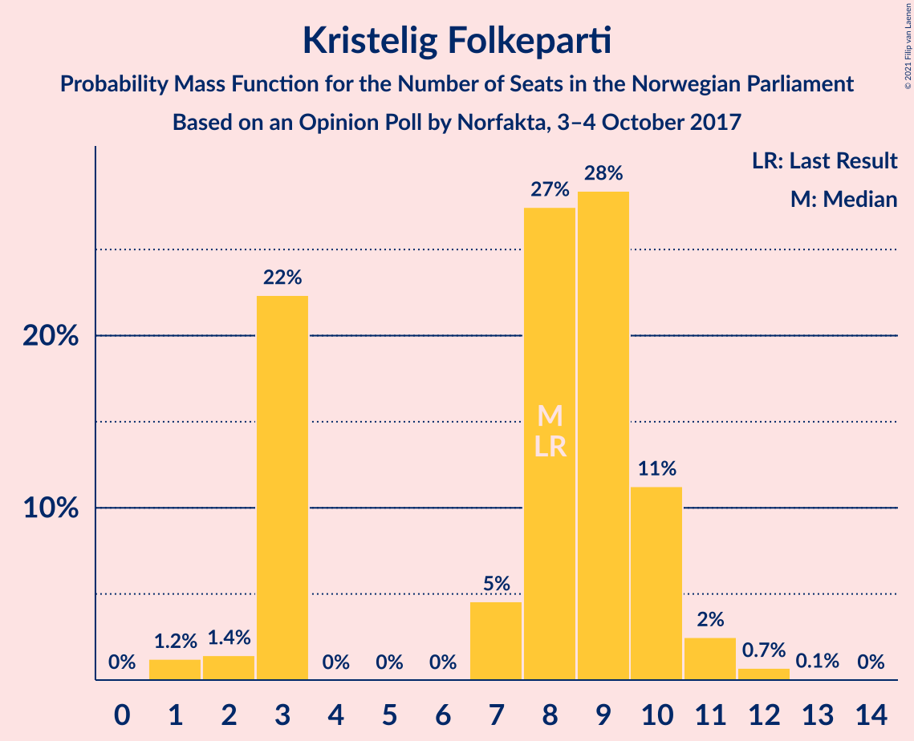

| Number of Seats | Probability | Accumulated | Special Marks |
|:---------------:|:-----------:|:-----------:|:-------------:|
| 1 | 1.2% | 100% |  |
| 2 | 1.4% | 98.8% |  |
| 3 | 22% | 97% |  |
| 4 | 0% | 75% |  |
| 5 | 0% | 75% |  |
| 6 | 0% | 75% |  |
| 7 | 5% | 75% |  |
| 8 | 27% | 70% | Last Result, Median |
| 9 | 28% | 43% |  |
| 10 | 11% | 15% |  |
| 11 | 2% | 3% |  |
| 12 | 0.7% | 0.8% |  |
| 13 | 0.1% | 0.1% |  |
| 14 | 0% | 0% |  |

### Miljøpartiet De Grønne

*For a full overview of the results for this party, see the [Miljøpartiet De Grønne](party-miljøpartietdegrønne.html) page.*

| Number of Seats | Probability | Accumulated | Special Marks |
|:---------------:|:-----------:|:-----------:|:-------------:|
| 1 | 17% | 100% | Last Result |
| 2 | 45% | 83% | Median |
| 3 | 4% | 38% |  |
| 4 | 1.4% | 34% |  |
| 5 | 0% | 33% |  |
| 6 | 0% | 33% |  |
| 7 | 12% | 33% |  |
| 8 | 16% | 21% |  |
| 9 | 4% | 5% |  |
| 10 | 0.8% | 1.0% |  |
| 11 | 0.1% | 0.1% |  |
| 12 | 0% | 0% |  |

### Venstre

*For a full overview of the results for this party, see the [Venstre](party-venstre.html) page.*

| Number of Seats | Probability | Accumulated | Special Marks |
|:---------------:|:-----------:|:-----------:|:-------------:|
| 1 | 5% | 100% |  |
| 2 | 70% | 95% | Median |
| 3 | 7% | 25% |  |
| 4 | 0% | 18% |  |
| 5 | 0% | 18% |  |
| 6 | 0% | 18% |  |
| 7 | 6% | 18% |  |
| 8 | 9% | 12% | Last Result |
| 9 | 3% | 3% |  |
| 10 | 0.6% | 0.7% |  |
| 11 | 0.1% | 0.1% |  |
| 12 | 0% | 0% |  |

### Rødt

*For a full overview of the results for this party, see the [Rødt](party-rødt.html) page.*

| Number of Seats | Probability | Accumulated | Special Marks |
|:---------------:|:-----------:|:-----------:|:-------------:|
| 0 | 10% | 100% |  |
| 1 | 87% | 90% | Last Result, Median |
| 2 | 3% | 3% |  |
| 3 | 0% | 0% |  |

## Coalitions

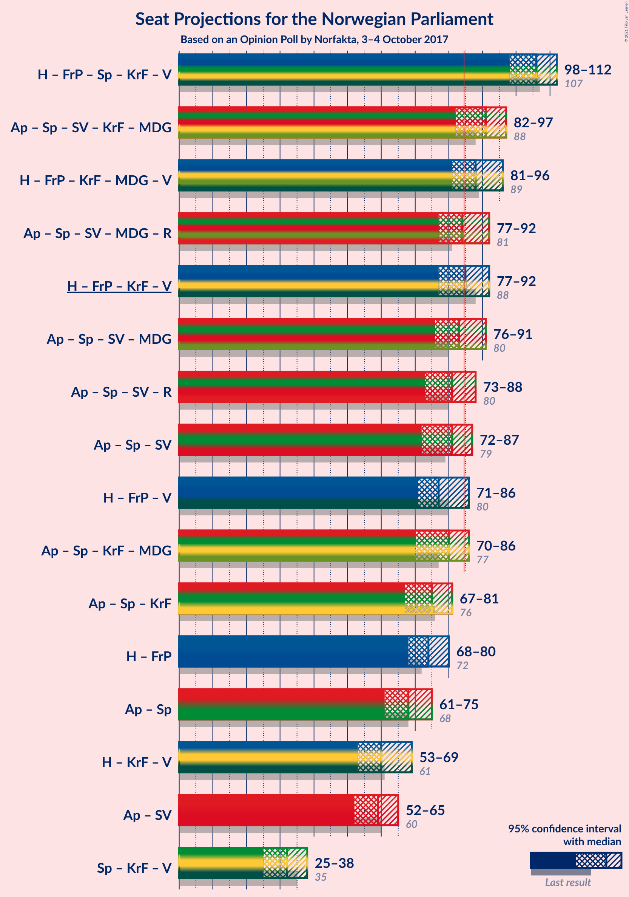

### Confidence Intervals

| Coalition | Last Result | Median | Majority? | 80% Confidence Interval | 90% Confidence Interval | 95% Confidence Interval | 99% Confidence Interval |
|:---------:|:-----------:|:------:|:---------:|:-----------------------:|:-----------------------:|:-----------------------:|:-----------------------:|
| Høyre – Fremskrittspartiet – Senterpartiet – Kristelig Folkeparti – Venstre | 107 | 106 | 100% | 101–110 | 100–111 | 98–112 | 96–114 |
| Arbeiderpartiet – Senterpartiet – Sosialistisk Venstreparti – Kristelig Folkeparti – Miljøpartiet De Grønne | 88 | 91 | 93% | 86–95 | 84–96 | 82–97 | 80–100 |
| Høyre – Fremskrittspartiet – Kristelig Folkeparti – Miljøpartiet De Grønne – Venstre | 89 | 88 | 91% | 85–93 | 83–95 | 81–96 | 78–98 |
| Arbeiderpartiet – Senterpartiet – Sosialistisk Venstreparti – Miljøpartiet De Grønne – Rødt | 81 | 84 | 43% | 79–88 | 78–91 | 77–92 | 75–95 |
| Høyre – Fremskrittspartiet – Kristelig Folkeparti – Venstre | 88 | 85 | 56% | 80–90 | 78–91 | 77–92 | 74–94 |
| Arbeiderpartiet – Senterpartiet – Sosialistisk Venstreparti – Miljøpartiet De Grønne | 80 | 83 | 36% | 78–88 | 77–90 | 76–91 | 75–94 |
| Arbeiderpartiet – Senterpartiet – Sosialistisk Venstreparti – Rødt | 80 | 81 | 9% | 75–84 | 74–86 | 73–88 | 71–91 |
| Arbeiderpartiet – Senterpartiet – Sosialistisk Venstreparti | 79 | 81 | 6% | 75–83 | 73–85 | 72–87 | 70–90 |
| Høyre – Fremskrittspartiet – Venstre | 80 | 77 | 5% | 73–82 | 72–84 | 71–86 | 68–88 |
| Arbeiderpartiet – Senterpartiet – Kristelig Folkeparti – Miljøpartiet De Grønne | 77 | 80 | 8% | 74–83 | 72–85 | 70–86 | 68–89 |
| Arbeiderpartiet – Senterpartiet – Kristelig Folkeparti | 76 | 75 | 0.5% | 70–79 | 68–81 | 67–81 | 64–84 |
| Høyre – Fremskrittspartiet | 72 | 74 | 0.2% | 70–79 | 69–80 | 68–80 | 65–83 |
| Arbeiderpartiet – Senterpartiet | 68 | 68 | 0% | 63–72 | 62–73 | 61–75 | 60–78 |
| Høyre – Kristelig Folkeparti – Venstre | 61 | 60 | 0% | 55–65 | 54–66 | 53–69 | 50–70 |
| Arbeiderpartiet – Sosialistisk Venstreparti | 60 | 59 | 0% | 54–62 | 54–64 | 52–65 | 51–67 |
| Senterpartiet – Kristelig Folkeparti – Venstre | 35 | 32 | 0% | 27–35 | 26–36 | 25–38 | 22–40 |

### Høyre – Fremskrittspartiet – Senterpartiet – Kristelig Folkeparti – Venstre

| Number of Seats | Probability | Accumulated | Special Marks |
|:---------------:|:-----------:|:-----------:|:-------------:|
| 93 | 0.1% | 100% |  |
| 94 | 0.1% | 99.9% |  |
| 95 | 0.1% | 99.8% |  |
| 96 | 0.3% | 99.6% |  |
| 97 | 0.9% | 99.3% |  |
| 98 | 1.2% | 98% |  |
| 99 | 1.4% | 97% |  |
| 100 | 3% | 96% |  |
| 101 | 6% | 93% |  |
| 102 | 8% | 87% |  |
| 103 | 4% | 79% |  |
| 104 | 9% | 75% |  |
| 105 | 13% | 66% |  |
| 106 | 7% | 53% | Median |
| 107 | 19% | 46% | Last Result |
| 108 | 6% | 27% |  |
| 109 | 8% | 21% |  |
| 110 | 6% | 13% |  |
| 111 | 2% | 7% |  |
| 112 | 3% | 5% |  |
| 113 | 1.3% | 2% |  |
| 114 | 0.5% | 0.7% |  |
| 115 | 0.1% | 0.2% |  |
| 116 | 0.1% | 0.1% |  |
| 117 | 0% | 0% |  |

### Arbeiderpartiet – Senterpartiet – Sosialistisk Venstreparti – Kristelig Folkeparti – Miljøpartiet De Grønne

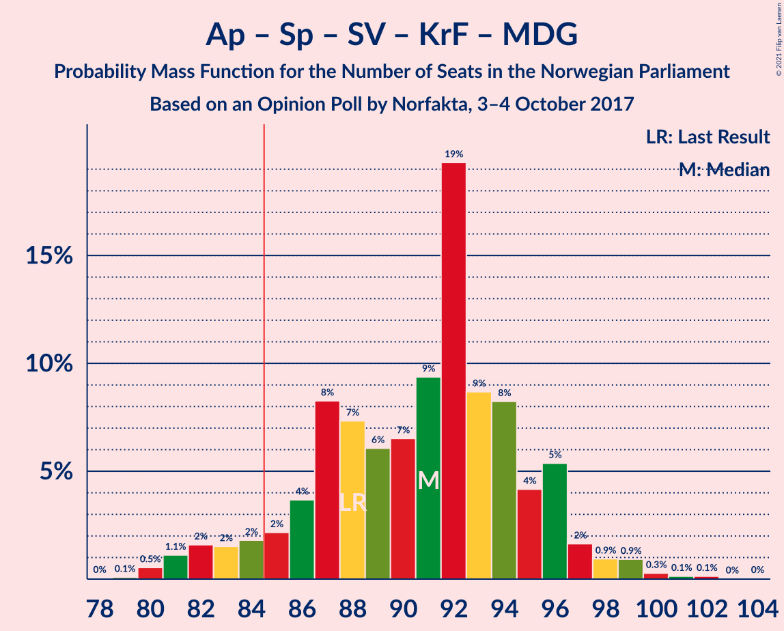

| Number of Seats | Probability | Accumulated | Special Marks |
|:---------------:|:-----------:|:-----------:|:-------------:|
| 78 | 0% | 100% |  |
| 79 | 0.1% | 99.9% |  |
| 80 | 0.5% | 99.8% |  |
| 81 | 1.1% | 99.3% |  |
| 82 | 2% | 98% |  |
| 83 | 2% | 97% |  |
| 84 | 2% | 95% |  |
| 85 | 2% | 93% | Majority |
| 86 | 4% | 91% |  |
| 87 | 8% | 87% |  |
| 88 | 7% | 79% | Last Result |
| 89 | 6% | 72% |  |
| 90 | 7% | 66% | Median |
| 91 | 9% | 59% |  |
| 92 | 19% | 50% |  |
| 93 | 9% | 31% |  |
| 94 | 8% | 22% |  |
| 95 | 4% | 14% |  |
| 96 | 5% | 9% |  |
| 97 | 2% | 4% |  |
| 98 | 0.9% | 2% |  |
| 99 | 0.9% | 2% |  |
| 100 | 0.3% | 0.6% |  |
| 101 | 0.1% | 0.3% |  |
| 102 | 0.1% | 0.2% |  |
| 103 | 0% | 0.1% |  |
| 104 | 0% | 0% |  |

### Høyre – Fremskrittspartiet – Kristelig Folkeparti – Miljøpartiet De Grønne – Venstre

| Number of Seats | Probability | Accumulated | Special Marks |
|:---------------:|:-----------:|:-----------:|:-------------:|
| 77 | 0.2% | 100% |  |
| 78 | 0.4% | 99.7% |  |
| 79 | 0.9% | 99.3% |  |
| 80 | 0.9% | 98% |  |
| 81 | 0.7% | 98% |  |
| 82 | 0.9% | 97% |  |
| 83 | 2% | 96% |  |
| 84 | 3% | 94% |  |
| 85 | 6% | 91% | Majority |
| 86 | 9% | 85% |  |
| 87 | 24% | 75% | Median |
| 88 | 9% | 51% |  |
| 89 | 4% | 42% | Last Result |
| 90 | 13% | 38% |  |
| 91 | 6% | 25% |  |
| 92 | 5% | 19% |  |
| 93 | 4% | 14% |  |
| 94 | 4% | 10% |  |
| 95 | 3% | 6% |  |
| 96 | 1.1% | 3% |  |
| 97 | 1.2% | 2% |  |
| 98 | 0.8% | 1.0% |  |
| 99 | 0.1% | 0.1% |  |
| 100 | 0% | 0.1% |  |
| 101 | 0% | 0% |  |

### Arbeiderpartiet – Senterpartiet – Sosialistisk Venstreparti – Miljøpartiet De Grønne – Rødt

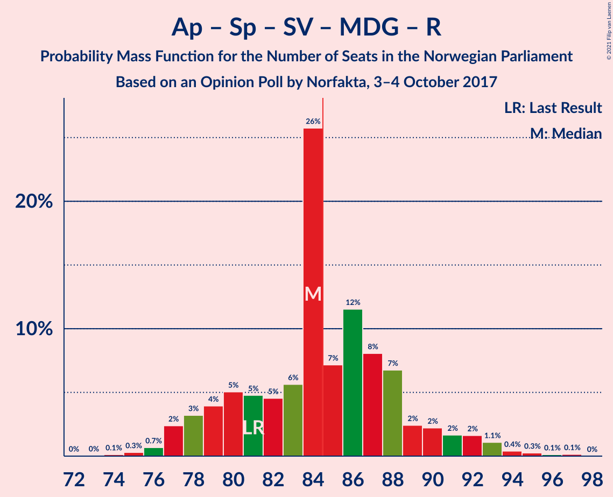

| Number of Seats | Probability | Accumulated | Special Marks |
|:---------------:|:-----------:|:-----------:|:-------------:|
| 72 | 0% | 100% |  |
| 73 | 0% | 99.9% |  |
| 74 | 0.1% | 99.9% |  |
| 75 | 0.3% | 99.8% |  |
| 76 | 0.7% | 99.5% |  |
| 77 | 2% | 98.8% |  |
| 78 | 3% | 96% |  |
| 79 | 4% | 93% |  |
| 80 | 5% | 89% |  |
| 81 | 5% | 84% | Last Result |
| 82 | 5% | 79% |  |
| 83 | 6% | 75% | Median |
| 84 | 26% | 69% |  |
| 85 | 7% | 43% | Majority |
| 86 | 12% | 36% |  |
| 87 | 8% | 25% |  |
| 88 | 7% | 17% |  |
| 89 | 2% | 10% |  |
| 90 | 2% | 8% |  |
| 91 | 2% | 5% |  |
| 92 | 2% | 4% |  |
| 93 | 1.1% | 2% |  |
| 94 | 0.4% | 0.9% |  |
| 95 | 0.3% | 0.5% |  |
| 96 | 0.1% | 0.3% |  |
| 97 | 0.1% | 0.2% |  |
| 98 | 0% | 0% |  |

### Høyre – Fremskrittspartiet – Kristelig Folkeparti – Venstre

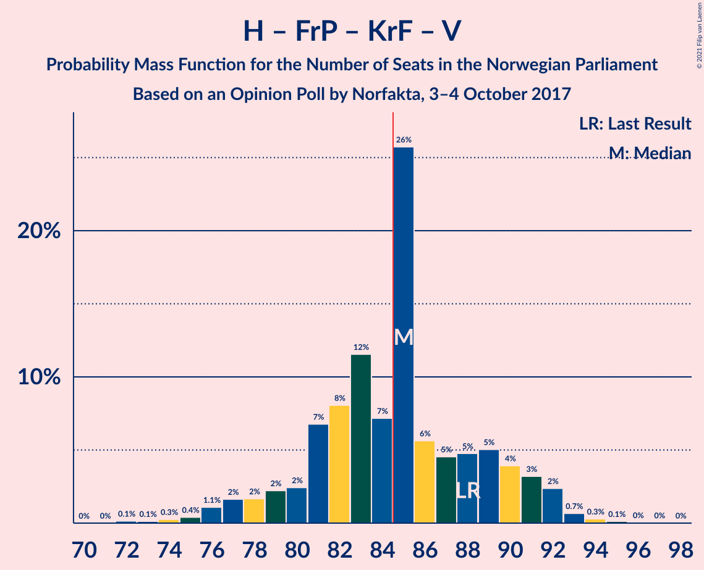

| Number of Seats | Probability | Accumulated | Special Marks |
|:---------------:|:-----------:|:-----------:|:-------------:|
| 72 | 0.1% | 100% |  |
| 73 | 0.1% | 99.8% |  |
| 74 | 0.3% | 99.7% |  |
| 75 | 0.4% | 99.5% |  |
| 76 | 1.1% | 99.1% |  |
| 77 | 2% | 98% |  |
| 78 | 2% | 96% |  |
| 79 | 2% | 95% |  |
| 80 | 2% | 92% |  |
| 81 | 7% | 90% |  |
| 82 | 8% | 83% |  |
| 83 | 12% | 75% |  |
| 84 | 7% | 64% |  |
| 85 | 26% | 56% | Median, Majority |
| 86 | 6% | 31% |  |
| 87 | 5% | 25% |  |
| 88 | 5% | 21% | Last Result |
| 89 | 5% | 16% |  |
| 90 | 4% | 11% |  |
| 91 | 3% | 7% |  |
| 92 | 2% | 4% |  |
| 93 | 0.7% | 1.2% |  |
| 94 | 0.3% | 0.5% |  |
| 95 | 0.1% | 0.2% |  |
| 96 | 0% | 0.1% |  |
| 97 | 0% | 0.1% |  |
| 98 | 0% | 0% |  |

### Arbeiderpartiet – Senterpartiet – Sosialistisk Venstreparti – Miljøpartiet De Grønne

| Number of Seats | Probability | Accumulated | Special Marks |
|:---------------:|:-----------:|:-----------:|:-------------:|
| 71 | 0% | 100% |  |
| 72 | 0% | 99.9% |  |
| 73 | 0.1% | 99.9% |  |
| 74 | 0.2% | 99.8% |  |
| 75 | 0.6% | 99.5% |  |
| 76 | 2% | 98.9% |  |
| 77 | 4% | 97% |  |
| 78 | 4% | 93% |  |
| 79 | 5% | 90% |  |
| 80 | 5% | 84% | Last Result |
| 81 | 4% | 79% |  |
| 82 | 5% | 75% | Median |
| 83 | 25% | 70% |  |
| 84 | 8% | 45% |  |
| 85 | 11% | 36% | Majority |
| 86 | 8% | 26% |  |
| 87 | 6% | 18% |  |
| 88 | 4% | 12% |  |
| 89 | 2% | 8% |  |
| 90 | 2% | 5% |  |
| 91 | 2% | 4% |  |
| 92 | 1.2% | 2% |  |
| 93 | 0.4% | 1.0% |  |
| 94 | 0.3% | 0.6% |  |
| 95 | 0.2% | 0.3% |  |
| 96 | 0.2% | 0.2% |  |
| 97 | 0% | 0% |  |

### Arbeiderpartiet – Senterpartiet – Sosialistisk Venstreparti – Rødt

| Number of Seats | Probability | Accumulated | Special Marks |
|:---------------:|:-----------:|:-----------:|:-------------:|
| 69 | 0% | 100% |  |
| 70 | 0.1% | 99.9% |  |
| 71 | 0.8% | 99.8% |  |
| 72 | 1.2% | 99.0% |  |
| 73 | 1.1% | 98% |  |
| 74 | 3% | 97% |  |
| 75 | 4% | 94% |  |
| 76 | 4% | 90% |  |
| 77 | 5% | 86% |  |
| 78 | 6% | 81% |  |
| 79 | 13% | 75% |  |
| 80 | 4% | 62% | Last Result |
| 81 | 9% | 58% | Median |
| 82 | 24% | 49% |  |
| 83 | 9% | 25% |  |
| 84 | 6% | 15% |  |
| 85 | 3% | 9% | Majority |
| 86 | 2% | 6% |  |
| 87 | 0.9% | 4% |  |
| 88 | 0.7% | 3% |  |
| 89 | 0.9% | 2% |  |
| 90 | 0.9% | 2% |  |
| 91 | 0.4% | 0.7% |  |
| 92 | 0.2% | 0.3% |  |
| 93 | 0% | 0% |  |

### Arbeiderpartiet – Senterpartiet – Sosialistisk Venstreparti

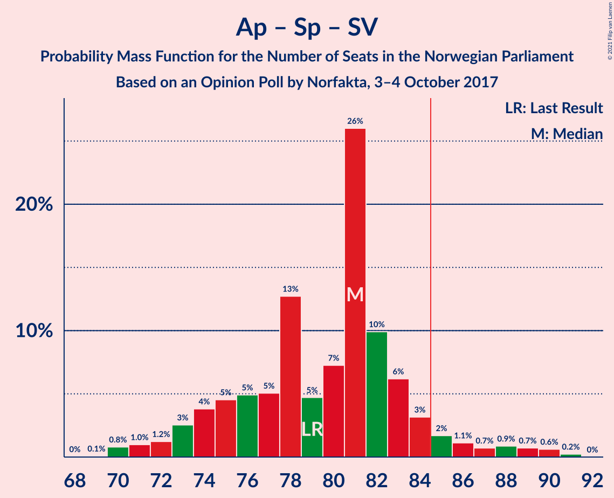

| Number of Seats | Probability | Accumulated | Special Marks |
|:---------------:|:-----------:|:-----------:|:-------------:|
| 68 | 0% | 100% |  |
| 69 | 0.1% | 99.9% |  |
| 70 | 0.8% | 99.9% |  |
| 71 | 1.0% | 99.1% |  |
| 72 | 1.2% | 98% |  |
| 73 | 3% | 97% |  |
| 74 | 4% | 94% |  |
| 75 | 5% | 90% |  |
| 76 | 5% | 86% |  |
| 77 | 5% | 81% |  |
| 78 | 13% | 76% |  |
| 79 | 5% | 63% | Last Result |
| 80 | 7% | 59% | Median |
| 81 | 26% | 51% |  |
| 82 | 10% | 25% |  |
| 83 | 6% | 15% |  |
| 84 | 3% | 9% |  |
| 85 | 2% | 6% | Majority |
| 86 | 1.1% | 4% |  |
| 87 | 0.7% | 3% |  |
| 88 | 0.9% | 2% |  |
| 89 | 0.7% | 2% |  |
| 90 | 0.6% | 0.9% |  |
| 91 | 0.2% | 0.2% |  |
| 92 | 0% | 0% |  |

### Høyre – Fremskrittspartiet – Venstre

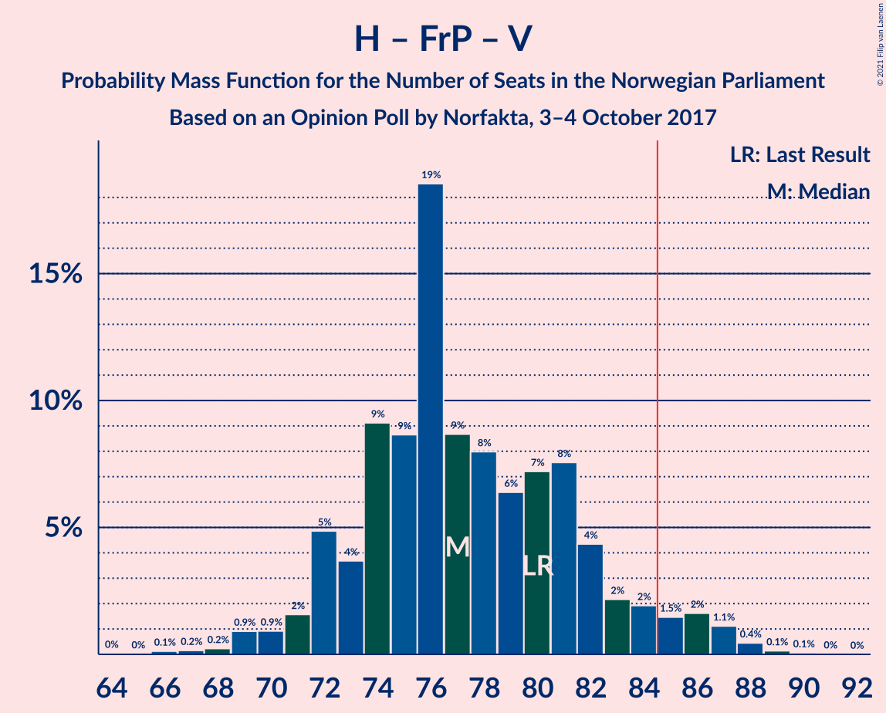

| Number of Seats | Probability | Accumulated | Special Marks |
|:---------------:|:-----------:|:-----------:|:-------------:|
| 65 | 0% | 100% |  |
| 66 | 0.1% | 99.9% |  |
| 67 | 0.2% | 99.8% |  |
| 68 | 0.2% | 99.7% |  |
| 69 | 0.9% | 99.4% |  |
| 70 | 0.9% | 98.5% |  |
| 71 | 2% | 98% |  |
| 72 | 5% | 96% |  |
| 73 | 4% | 91% |  |
| 74 | 9% | 87% |  |
| 75 | 9% | 78% |  |
| 76 | 19% | 70% |  |
| 77 | 9% | 51% | Median |
| 78 | 8% | 42% |  |
| 79 | 6% | 34% |  |
| 80 | 7% | 28% | Last Result |
| 81 | 8% | 21% |  |
| 82 | 4% | 13% |  |
| 83 | 2% | 9% |  |
| 84 | 2% | 7% |  |
| 85 | 1.5% | 5% | Majority |
| 86 | 2% | 3% |  |
| 87 | 1.1% | 2% |  |
| 88 | 0.4% | 0.7% |  |
| 89 | 0.1% | 0.2% |  |
| 90 | 0.1% | 0.1% |  |
| 91 | 0% | 0% |  |

### Arbeiderpartiet – Senterpartiet – Kristelig Folkeparti – Miljøpartiet De Grønne

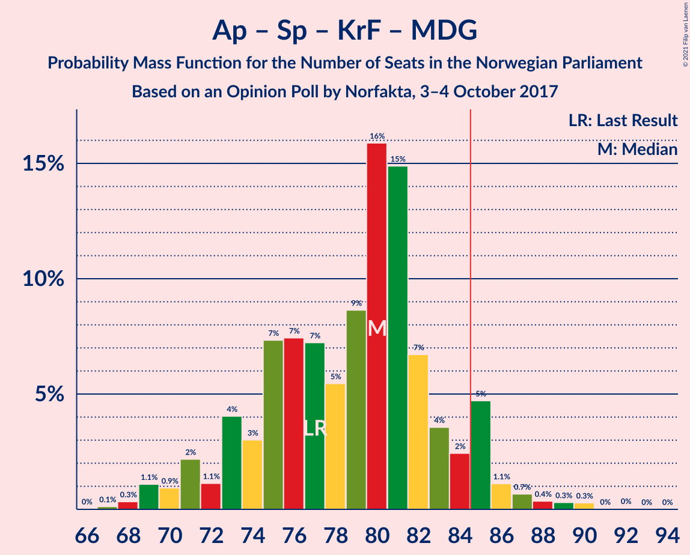

| Number of Seats | Probability | Accumulated | Special Marks |
|:---------------:|:-----------:|:-----------:|:-------------:|
| 67 | 0.1% | 100% |  |
| 68 | 0.3% | 99.8% |  |
| 69 | 1.1% | 99.5% |  |
| 70 | 0.9% | 98% |  |
| 71 | 2% | 97% |  |
| 72 | 1.1% | 95% |  |
| 73 | 4% | 94% |  |
| 74 | 3% | 90% |  |
| 75 | 7% | 87% |  |
| 76 | 7% | 80% |  |
| 77 | 7% | 72% | Last Result |
| 78 | 5% | 65% | Median |
| 79 | 9% | 60% |  |
| 80 | 16% | 51% |  |
| 81 | 15% | 35% |  |
| 82 | 7% | 20% |  |
| 83 | 4% | 14% |  |
| 84 | 2% | 10% |  |
| 85 | 5% | 8% | Majority |
| 86 | 1.1% | 3% |  |
| 87 | 0.7% | 2% |  |
| 88 | 0.4% | 1.0% |  |
| 89 | 0.3% | 0.7% |  |
| 90 | 0.3% | 0.4% |  |
| 91 | 0% | 0.1% |  |
| 92 | 0% | 0.1% |  |
| 93 | 0% | 0% |  |

### Arbeiderpartiet – Senterpartiet – Kristelig Folkeparti

| Number of Seats | Probability | Accumulated | Special Marks |
|:---------------:|:-----------:|:-----------:|:-------------:|
| 63 | 0.5% | 100% |  |
| 64 | 0.1% | 99.5% |  |
| 65 | 0.5% | 99.4% |  |
| 66 | 0.7% | 98.9% |  |
| 67 | 1.4% | 98% |  |
| 68 | 2% | 97% |  |
| 69 | 3% | 94% |  |
| 70 | 3% | 91% |  |
| 71 | 5% | 88% |  |
| 72 | 7% | 83% |  |
| 73 | 14% | 76% |  |
| 74 | 9% | 62% |  |
| 75 | 6% | 53% |  |
| 76 | 6% | 47% | Last Result, Median |
| 77 | 8% | 41% |  |
| 78 | 14% | 34% |  |
| 79 | 11% | 19% |  |
| 80 | 3% | 8% |  |
| 81 | 3% | 5% |  |
| 82 | 0.9% | 2% |  |
| 83 | 0.6% | 1.4% |  |
| 84 | 0.3% | 0.8% |  |
| 85 | 0.3% | 0.5% | Majority |
| 86 | 0.1% | 0.1% |  |
| 87 | 0% | 0.1% |  |
| 88 | 0% | 0% |  |

### Høyre – Fremskrittspartiet

| Number of Seats | Probability | Accumulated | Special Marks |
|:---------------:|:-----------:|:-----------:|:-------------:|
| 62 | 0.1% | 100% |  |
| 63 | 0.1% | 99.9% |  |
| 64 | 0.2% | 99.9% |  |
| 65 | 0.2% | 99.7% |  |
| 66 | 0.3% | 99.5% |  |
| 67 | 1.3% | 99.2% |  |
| 68 | 2% | 98% |  |
| 69 | 2% | 96% |  |
| 70 | 8% | 94% |  |
| 71 | 4% | 86% |  |
| 72 | 11% | 82% | Last Result |
| 73 | 10% | 71% |  |
| 74 | 18% | 61% |  |
| 75 | 12% | 43% | Median |
| 76 | 8% | 32% |  |
| 77 | 6% | 24% |  |
| 78 | 6% | 19% |  |
| 79 | 7% | 12% |  |
| 80 | 3% | 5% |  |
| 81 | 0.9% | 2% |  |
| 82 | 0.6% | 1.4% |  |
| 83 | 0.5% | 0.8% |  |
| 84 | 0.1% | 0.4% |  |
| 85 | 0.1% | 0.2% | Majority |
| 86 | 0.1% | 0.1% |  |
| 87 | 0% | 0% |  |

### Arbeiderpartiet – Senterpartiet

| Number of Seats | Probability | Accumulated | Special Marks |
|:---------------:|:-----------:|:-----------:|:-------------:|
| 57 | 0% | 100% |  |
| 58 | 0.2% | 99.9% |  |
| 59 | 0.2% | 99.8% |  |
| 60 | 2% | 99.6% |  |
| 61 | 2% | 98% |  |
| 62 | 2% | 96% |  |
| 63 | 5% | 94% |  |
| 64 | 5% | 88% |  |
| 65 | 14% | 83% |  |
| 66 | 6% | 69% |  |
| 67 | 5% | 63% |  |
| 68 | 9% | 58% | Last Result, Median |
| 69 | 18% | 48% |  |
| 70 | 11% | 31% |  |
| 71 | 9% | 20% |  |
| 72 | 5% | 11% |  |
| 73 | 2% | 6% |  |
| 74 | 1.1% | 4% |  |
| 75 | 0.4% | 3% |  |
| 76 | 0.9% | 2% |  |
| 77 | 0.5% | 1.3% |  |
| 78 | 0.6% | 0.8% |  |
| 79 | 0.1% | 0.2% |  |
| 80 | 0.1% | 0.1% |  |
| 81 | 0% | 0% |  |

### Høyre – Kristelig Folkeparti – Venstre

| Number of Seats | Probability | Accumulated | Special Marks |
|:---------------:|:-----------:|:-----------:|:-------------:|
| 48 | 0.1% | 100% |  |
| 49 | 0.2% | 99.9% |  |
| 50 | 0.7% | 99.8% |  |
| 51 | 0.4% | 99.1% |  |
| 52 | 0.9% | 98.6% |  |
| 53 | 1.1% | 98% |  |
| 54 | 3% | 97% |  |
| 55 | 8% | 94% |  |
| 56 | 4% | 86% |  |
| 57 | 9% | 82% |  |
| 58 | 9% | 72% |  |
| 59 | 8% | 64% |  |
| 60 | 12% | 56% | Median |
| 61 | 6% | 44% | Last Result |
| 62 | 15% | 38% |  |
| 63 | 5% | 23% |  |
| 64 | 4% | 18% |  |
| 65 | 6% | 14% |  |
| 66 | 3% | 8% |  |
| 67 | 0.9% | 5% |  |
| 68 | 1.0% | 4% |  |
| 69 | 2% | 3% |  |
| 70 | 1.0% | 1.3% |  |
| 71 | 0.2% | 0.3% |  |
| 72 | 0.1% | 0.1% |  |
| 73 | 0.1% | 0.1% |  |
| 74 | 0% | 0% |  |

### Arbeiderpartiet – Sosialistisk Venstreparti

| Number of Seats | Probability | Accumulated | Special Marks |
|:---------------:|:-----------:|:-----------:|:-------------:|
| 49 | 0.1% | 100% |  |
| 50 | 0.2% | 99.9% |  |
| 51 | 0.7% | 99.7% |  |
| 52 | 2% | 99.1% |  |
| 53 | 2% | 97% |  |
| 54 | 6% | 95% |  |
| 55 | 4% | 90% |  |
| 56 | 7% | 85% |  |
| 57 | 12% | 78% |  |
| 58 | 10% | 66% |  |
| 59 | 22% | 56% | Median |
| 60 | 10% | 34% | Last Result |
| 61 | 7% | 24% |  |
| 62 | 9% | 17% |  |
| 63 | 3% | 8% |  |
| 64 | 3% | 5% |  |
| 65 | 0.8% | 3% |  |
| 66 | 1.2% | 2% |  |
| 67 | 0.4% | 0.8% |  |
| 68 | 0.2% | 0.3% |  |
| 69 | 0.1% | 0.2% |  |
| 70 | 0.1% | 0.1% |  |
| 71 | 0% | 0% |  |

### Senterpartiet – Kristelig Folkeparti – Venstre

| Number of Seats | Probability | Accumulated | Special Marks |
|:---------------:|:-----------:|:-----------:|:-------------:|
| 20 | 0.1% | 100% |  |
| 21 | 0.1% | 99.9% |  |
| 22 | 0.3% | 99.8% |  |
| 23 | 0.8% | 99.4% |  |
| 24 | 0.9% | 98.7% |  |
| 25 | 2% | 98% |  |
| 26 | 5% | 96% |  |
| 27 | 7% | 91% |  |
| 28 | 5% | 84% |  |
| 29 | 6% | 79% |  |
| 30 | 11% | 74% |  |
| 31 | 9% | 63% | Median |
| 32 | 14% | 54% |  |
| 33 | 15% | 40% |  |
| 34 | 8% | 25% |  |
| 35 | 8% | 17% | Last Result |
| 36 | 4% | 8% |  |
| 37 | 2% | 5% |  |
| 38 | 1.0% | 3% |  |
| 39 | 0.3% | 2% |  |
| 40 | 0.8% | 1.2% |  |
| 41 | 0.3% | 0.5% |  |
| 42 | 0.1% | 0.1% |  |
| 43 | 0% | 0% |  |

## Technical Information

### Opinion Poll

+ **Polling firm:** Norfakta
+ **Commissioner(s):** —
+ **Fieldwork period:** 3–4 October 2017

### Calculations

+ **Sample size:** 850
+ **Simulations done:** 1,048,576
+ **Error estimate:** 1.05%

