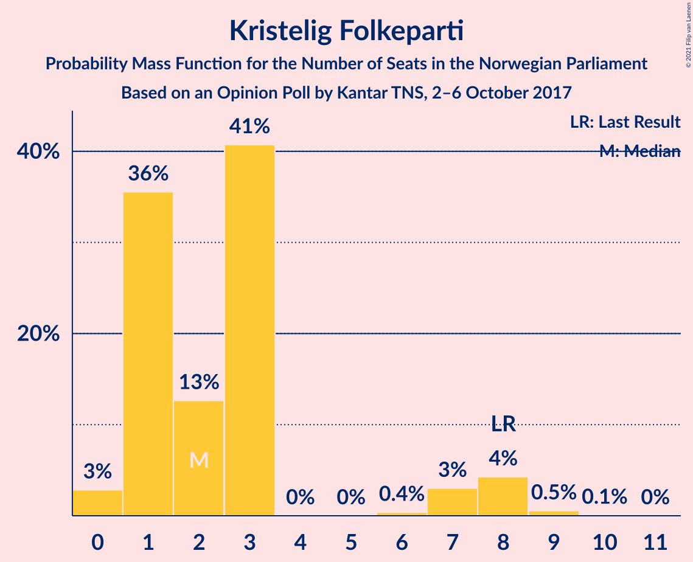
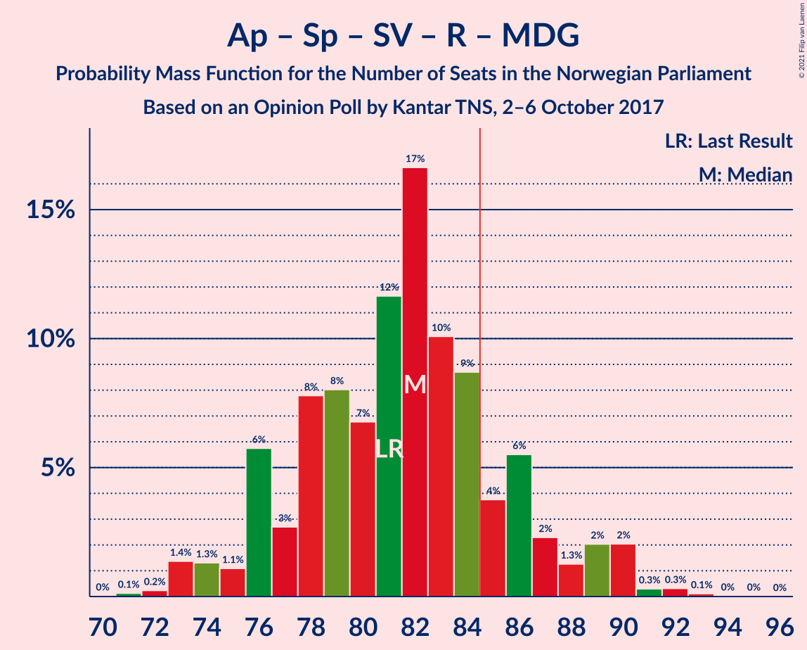
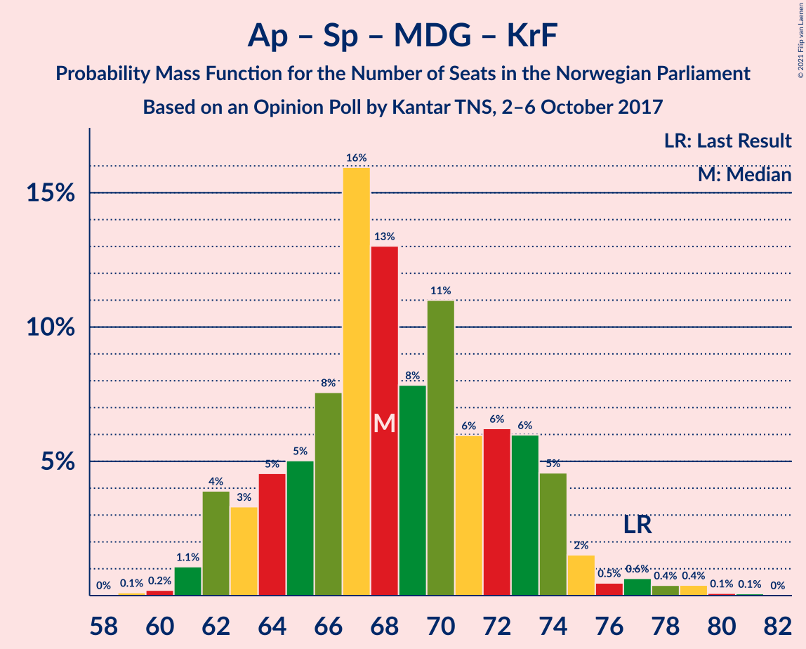

# Opinion Poll by Kantar TNS, 2–6 October 2017

<a href="#voting-intentions">Voting Intentions</a> | <a href="#seats">Seats</a> | <a href="#coalitions">Coalitions</a> | <a href="#technical-information">Technical Information</a>

## Voting Intentions

### Confidence Intervals

| Party | Last Result | Poll Result | 80% Confidence Interval | 90% Confidence Interval | 95% Confidence Interval | 99% Confidence Interval |
|:-----:|:-----------:|:-----------:|:-----------------------:|:-----------------------:|:-----------------------:|:-----------------------:|
| Høyre | 25.0% | 29.1% | 27.3–31.0% |26.8–31.6% |26.4–32.1% |25.5–33.0% |
| Arbeiderpartiet | 27.4% | 25.3% | 23.6–27.2% |23.1–27.7% |22.7–28.2% |21.9–29.1% |
| Fremskrittspartiet | 15.2% | 13.1% | 11.8–14.6% |11.5–15.0% |11.1–15.4% |10.5–16.1% |
| Senterpartiet | 10.3% | 9.3% | 8.2–10.6% |7.9–11.0% |7.7–11.3% |7.2–12.0% |
| Sosialistisk Venstreparti | 6.0% | 6.4% | 5.5–7.5% |5.2–7.8% |5.0–8.1% |4.6–8.6% |
| Venstre | 4.4% | 4.8% | 4.0–5.8% |3.8–6.1% |3.6–6.4% |3.3–6.9% |
| Rødt | 2.4% | 3.7% | 3.0–4.6% |2.8–4.8% |2.7–5.1% |2.4–5.5% |
| Miljøpartiet De Grønne | 3.2% | 3.4% | 2.7–4.3% |2.6–4.5% |2.4–4.7% |2.1–5.2% |
| Kristelig Folkeparti | 4.2% | 3.2% | 2.6–4.0% |2.4–4.3% |2.2–4.5% |2.0–4.9% |

*Note:* The poll result column reflects the actual value used in the calculations. Published results may vary slightly, and in addition be rounded to fewer digits.

## Seats

### Confidence Intervals

| Party | Last Result | Median | 80% Confidence Interval | 90% Confidence Interval | 95% Confidence Interval | 99% Confidence Interval |
|:-----:|:-----------:|:------:|:-----------------------:|:-----------------------:|:-----------------------:|:-----------------------:|
| <a href="#høyre">Høyre</a> | 45 | 53 | 49–57 |47–58 |46–58 |45–61 |
| <a href="#arbeiderpartiet">Arbeiderpartiet</a> | 49 | 46 | 43–50 |42–51 |41–52 |40–53 |
| <a href="#fremskrittspartiet">Fremskrittspartiet</a> | 27 | 23 | 21–27 |20–28 |20–28 |18–30 |
| <a href="#senterpartiet">Senterpartiet</a> | 19 | 17 | 15–20 |14–20 |14–20 |13–22 |
| <a href="#sosialistisk-venstreparti">Sosialistisk Venstreparti</a> | 11 | 11 | 10–14 |9–14 |9–15 |8–16 |
| <a href="#venstre">Venstre</a> | 8 | 9 | 7–11 |2–11 |2–12 |2–13 |
| <a href="#rødt">Rødt</a> | 1 | 2 | 1–8 |1–8 |1–9 |1–10 |
| <a href="#miljøpartiet-de-grønne">Miljøpartiet De Grønne</a> | 1 | 2 | 1–7 |1–8 |1–8 |1–9 |
| <a href="#kristelig-folkeparti">Kristelig Folkeparti</a> | 8 | 2 | 1–3 |1–7 |0–8 |0–9 |

### Høyre

*For a full overview of the results for this party, see the [Høyre](party-høyre.html) page.*

| Number of Seats | Probability | Accumulated | Special Marks |
|:---------------:|:-----------:|:-----------:|:-------------:|
| 44 | 0.3% | 100% |  |
| 45 | 0.3% | 99.7% | Last Result |
| 46 | 2% | 99.3% |  |
| 47 | 2% | 97% |  |
| 48 | 3% | 95% |  |
| 49 | 5% | 92% |  |
| 50 | 6% | 87% |  |
| 51 | 11% | 81% |  |
| 52 | 19% | 70% |  |
| 53 | 11% | 52% | Median |
| 54 | 18% | 41% |  |
| 55 | 4% | 22% |  |
| 56 | 8% | 18% |  |
| 57 | 5% | 10% |  |
| 58 | 3% | 5% |  |
| 59 | 1.2% | 2% |  |
| 60 | 0.7% | 1.3% |  |
| 61 | 0.4% | 0.6% |  |
| 62 | 0.1% | 0.2% |  |
| 63 | 0% | 0.1% |  |
| 64 | 0% | 0% |  |

### Arbeiderpartiet

*For a full overview of the results for this party, see the [Arbeiderpartiet](party-arbeiderpartiet.html) page.*

| Number of Seats | Probability | Accumulated | Special Marks |
|:---------------:|:-----------:|:-----------:|:-------------:|
| 39 | 0.3% | 100% |  |
| 40 | 0.7% | 99.7% |  |
| 41 | 4% | 98.9% |  |
| 42 | 5% | 95% |  |
| 43 | 5% | 91% |  |
| 44 | 14% | 85% |  |
| 45 | 13% | 72% |  |
| 46 | 19% | 59% | Median |
| 47 | 10% | 40% |  |
| 48 | 7% | 30% |  |
| 49 | 12% | 23% | Last Result |
| 50 | 5% | 12% |  |
| 51 | 4% | 7% |  |
| 52 | 2% | 3% |  |
| 53 | 0.6% | 1.0% |  |
| 54 | 0.2% | 0.3% |  |
| 55 | 0.1% | 0.2% |  |
| 56 | 0% | 0% |  |

### Fremskrittspartiet

*For a full overview of the results for this party, see the [Fremskrittspartiet](party-fremskrittspartiet.html) page.*

| Number of Seats | Probability | Accumulated | Special Marks |
|:---------------:|:-----------:|:-----------:|:-------------:|
| 17 | 0.1% | 100% |  |
| 18 | 0.5% | 99.9% |  |
| 19 | 1.4% | 99.4% |  |
| 20 | 7% | 98% |  |
| 21 | 9% | 91% |  |
| 22 | 19% | 82% |  |
| 23 | 13% | 63% | Median |
| 24 | 12% | 50% |  |
| 25 | 12% | 38% |  |
| 26 | 10% | 26% |  |
| 27 | 8% | 16% | Last Result |
| 28 | 6% | 8% |  |
| 29 | 1.2% | 2% |  |
| 30 | 0.4% | 0.6% |  |
| 31 | 0.1% | 0.2% |  |
| 32 | 0% | 0% |  |

### Senterpartiet

*For a full overview of the results for this party, see the [Senterpartiet](party-senterpartiet.html) page.*

| Number of Seats | Probability | Accumulated | Special Marks |
|:---------------:|:-----------:|:-----------:|:-------------:|
| 11 | 0.1% | 100% |  |
| 12 | 0.3% | 99.9% |  |
| 13 | 2% | 99.7% |  |
| 14 | 5% | 98% |  |
| 15 | 10% | 92% |  |
| 16 | 24% | 83% |  |
| 17 | 18% | 58% | Median |
| 18 | 21% | 40% |  |
| 19 | 9% | 20% | Last Result |
| 20 | 9% | 11% |  |
| 21 | 2% | 2% |  |
| 22 | 0.3% | 0.5% |  |
| 23 | 0.1% | 0.2% |  |
| 24 | 0% | 0% |  |

### Sosialistisk Venstreparti

*For a full overview of the results for this party, see the [Sosialistisk Venstreparti](party-sosialistiskvenstreparti.html) page.*

| Number of Seats | Probability | Accumulated | Special Marks |
|:---------------:|:-----------:|:-----------:|:-------------:|
| 7 | 0.1% | 100% |  |
| 8 | 0.8% | 99.9% |  |
| 9 | 8% | 99.0% |  |
| 10 | 9% | 91% |  |
| 11 | 33% | 82% | Last Result, Median |
| 12 | 19% | 48% |  |
| 13 | 18% | 29% |  |
| 14 | 8% | 11% |  |
| 15 | 2% | 3% |  |
| 16 | 1.1% | 1.1% |  |
| 17 | 0.1% | 0.1% |  |
| 18 | 0% | 0% |  |

### Venstre

*For a full overview of the results for this party, see the [Venstre](party-venstre.html) page.*

| Number of Seats | Probability | Accumulated | Special Marks |
|:---------------:|:-----------:|:-----------:|:-------------:|
| 2 | 8% | 100% |  |
| 3 | 0.2% | 92% |  |
| 4 | 0% | 92% |  |
| 5 | 0% | 92% |  |
| 6 | 0.3% | 92% |  |
| 7 | 4% | 91% |  |
| 8 | 27% | 87% | Last Result |
| 9 | 27% | 60% | Median |
| 10 | 22% | 33% |  |
| 11 | 8% | 11% |  |
| 12 | 2% | 3% |  |
| 13 | 0.5% | 0.6% |  |
| 14 | 0% | 0% |  |

### Rødt

*For a full overview of the results for this party, see the [Rødt](party-rødt.html) page.*

| Number of Seats | Probability | Accumulated | Special Marks |
|:---------------:|:-----------:|:-----------:|:-------------:|
| 1 | 12% | 100% | Last Result |
| 2 | 52% | 88% | Median |
| 3 | 0% | 36% |  |
| 4 | 0% | 36% |  |
| 5 | 0% | 36% |  |
| 6 | 0% | 36% |  |
| 7 | 18% | 36% |  |
| 8 | 13% | 18% |  |
| 9 | 4% | 4% |  |
| 10 | 0.5% | 0.6% |  |
| 11 | 0.1% | 0.1% |  |
| 12 | 0% | 0% |  |

### Miljøpartiet De Grønne

*For a full overview of the results for this party, see the [Miljøpartiet De Grønne](party-miljøpartietdegrønne.html) page.*

| Number of Seats | Probability | Accumulated | Special Marks |
|:---------------:|:-----------:|:-----------:|:-------------:|
| 0 | 0.1% | 100% |  |
| 1 | 31% | 99.9% | Last Result |
| 2 | 43% | 69% | Median |
| 3 | 8% | 26% |  |
| 4 | 0% | 18% |  |
| 5 | 0% | 18% |  |
| 6 | 0% | 18% |  |
| 7 | 9% | 18% |  |
| 8 | 8% | 9% |  |
| 9 | 1.0% | 1.3% |  |
| 10 | 0.2% | 0.2% |  |
| 11 | 0% | 0% |  |

### Kristelig Folkeparti

*For a full overview of the results for this party, see the [Kristelig Folkeparti](party-kristeligfolkeparti.html) page.*

| Number of Seats | Probability | Accumulated | Special Marks |
|:---------------:|:-----------:|:-----------:|:-------------:|
| 0 | 3% | 100% |  |
| 1 | 36% | 97% |  |
| 2 | 13% | 62% | Median |
| 3 | 41% | 49% |  |
| 4 | 0% | 8% |  |
| 5 | 0% | 8% |  |
| 6 | 0.4% | 8% |  |
| 7 | 3% | 8% |  |
| 8 | 4% | 5% | Last Result |
| 9 | 0.5% | 0.6% |  |
| 10 | 0.1% | 0.1% |  |
| 11 | 0% | 0% |  |

## Coalitions

### Confidence Intervals

| Coalition | Last Result | Median | Majority? | 80% Confidence Interval | 90% Confidence Interval | 95% Confidence Interval | 99% Confidence Interval |
|:---------:|:-----------:|:------:|:---------:|:-----------------------:|:-----------------------:|:-----------------------:|:-----------------------:|
| Høyre – Fremskrittspartiet – Senterpartiet – Venstre – Kristelig Folkeparti | 107 | 104 | 100% | 99–109 | 98–111 | 96–111 | 94–113 |
| Høyre – Fremskrittspartiet – Venstre – Miljøpartiet De Grønne – Kristelig Folkeparti | 89 | 90 | 96% | 86–95 | 85–96 | 84–97 | 81–99 |
| Høyre – Fremskrittspartiet – Venstre – Kristelig Folkeparti | 88 | 87 | 82% | 83–92 | 81–93 | 79–95 | 78–96 |
| Høyre – Fremskrittspartiet – Venstre | 80 | 85 | 53% | 80–90 | 79–91 | 78–92 | 75–94 |
| Arbeiderpartiet – Senterpartiet – Sosialistisk Venstreparti – Rødt – Miljøpartiet De Grønne | 81 | 82 | 18% | 77–86 | 76–88 | 74–90 | 73–91 |
| Arbeiderpartiet – Senterpartiet – Sosialistisk Venstreparti – Miljøpartiet De Grønne – Kristelig Folkeparti | 88 | 80 | 11% | 75–85 | 74–86 | 74–87 | 72–90 |
| Arbeiderpartiet – Senterpartiet – Sosialistisk Venstreparti – Rødt | 80 | 79 | 4% | 74–83 | 73–84 | 72–85 | 70–88 |
| Arbeiderpartiet – Senterpartiet – Sosialistisk Venstreparti – Miljøpartiet De Grønne | 80 | 78 | 2% | 73–82 | 71–83 | 71–84 | 69–88 |
| Høyre – Fremskrittspartiet | 72 | 76 | 0.6% | 72–81 | 71–83 | 70–84 | 68–85 |
| Arbeiderpartiet – Senterpartiet – Sosialistisk Venstreparti | 79 | 75 | 0.3% | 70–80 | 69–80 | 68–81 | 66–84 |
| Arbeiderpartiet – Senterpartiet – Miljøpartiet De Grønne – Kristelig Folkeparti | 77 | 68 | 0% | 64–73 | 62–74 | 62–75 | 61–79 |
| Arbeiderpartiet – Senterpartiet – Kristelig Folkeparti | 76 | 65 | 0% | 61–70 | 61–72 | 60–72 | 58–75 |
| Høyre – Venstre – Kristelig Folkeparti | 61 | 64 | 0% | 59–68 | 57–70 | 55–71 | 54–73 |
| Arbeiderpartiet – Senterpartiet | 68 | 63 | 0% | 59–68 | 58–69 | 57–69 | 56–72 |
| Arbeiderpartiet – Sosialistisk Venstreparti | 60 | 57 | 0% | 54–62 | 53–63 | 52–64 | 50–66 |
| Senterpartiet – Venstre – Kristelig Folkeparti | 35 | 28 | 0% | 24–31 | 23–32 | 22–34 | 19–36 |

### Høyre – Fremskrittspartiet – Senterpartiet – Venstre – Kristelig Folkeparti

| Number of Seats | Probability | Accumulated | Special Marks |
|:---------------:|:-----------:|:-----------:|:-------------:|
| 92 | 0.1% | 100% |  |
| 93 | 0.2% | 99.8% |  |
| 94 | 0.2% | 99.7% |  |
| 95 | 2% | 99.5% |  |
| 96 | 0.7% | 98% |  |
| 97 | 2% | 97% |  |
| 98 | 2% | 95% |  |
| 99 | 4% | 94% |  |
| 100 | 4% | 89% |  |
| 101 | 4% | 85% |  |
| 102 | 5% | 81% |  |
| 103 | 15% | 75% |  |
| 104 | 13% | 61% | Median |
| 105 | 9% | 48% |  |
| 106 | 8% | 39% |  |
| 107 | 7% | 31% | Last Result |
| 108 | 6% | 23% |  |
| 109 | 9% | 17% |  |
| 110 | 2% | 8% |  |
| 111 | 3% | 6% |  |
| 112 | 0.7% | 2% |  |
| 113 | 1.3% | 2% |  |
| 114 | 0.2% | 0.3% |  |
| 115 | 0.1% | 0.1% |  |
| 116 | 0% | 0.1% |  |
| 117 | 0% | 0% |  |

### Høyre – Fremskrittspartiet – Venstre – Miljøpartiet De Grønne – Kristelig Folkeparti

| Number of Seats | Probability | Accumulated | Special Marks |
|:---------------:|:-----------:|:-----------:|:-------------:|
| 79 | 0.1% | 100% |  |
| 80 | 0.2% | 99.9% |  |
| 81 | 0.5% | 99.7% |  |
| 82 | 0.5% | 99.2% |  |
| 83 | 1.2% | 98.7% |  |
| 84 | 2% | 98% |  |
| 85 | 3% | 96% | Majority |
| 86 | 5% | 93% |  |
| 87 | 9% | 89% |  |
| 88 | 9% | 80% |  |
| 89 | 18% | 71% | Last Result, Median |
| 90 | 8% | 52% |  |
| 91 | 10% | 44% |  |
| 92 | 11% | 34% |  |
| 93 | 7% | 24% |  |
| 94 | 4% | 17% |  |
| 95 | 5% | 13% |  |
| 96 | 4% | 8% |  |
| 97 | 2% | 4% |  |
| 98 | 1.4% | 2% |  |
| 99 | 0.7% | 0.9% |  |
| 100 | 0.2% | 0.3% |  |
| 101 | 0.1% | 0.1% |  |
| 102 | 0% | 0% |  |

### Høyre – Fremskrittspartiet – Venstre – Kristelig Folkeparti

| Number of Seats | Probability | Accumulated | Special Marks |
|:---------------:|:-----------:|:-----------:|:-------------:|
| 75 | 0% | 100% |  |
| 76 | 0.1% | 99.9% |  |
| 77 | 0.3% | 99.8% |  |
| 78 | 0.3% | 99.5% |  |
| 79 | 2% | 99.2% |  |
| 80 | 2% | 97% |  |
| 81 | 1.3% | 95% |  |
| 82 | 2% | 94% |  |
| 83 | 6% | 92% |  |
| 84 | 4% | 86% |  |
| 85 | 9% | 82% | Majority |
| 86 | 10% | 74% |  |
| 87 | 17% | 64% | Median |
| 88 | 12% | 47% | Last Result |
| 89 | 7% | 35% |  |
| 90 | 8% | 28% |  |
| 91 | 8% | 20% |  |
| 92 | 3% | 13% |  |
| 93 | 6% | 10% |  |
| 94 | 1.1% | 4% |  |
| 95 | 1.3% | 3% |  |
| 96 | 1.4% | 2% |  |
| 97 | 0.2% | 0.4% |  |
| 98 | 0.1% | 0.2% |  |
| 99 | 0% | 0.1% |  |
| 100 | 0% | 0% |  |

### Høyre – Fremskrittspartiet – Venstre

| Number of Seats | Probability | Accumulated | Special Marks |
|:---------------:|:-----------:|:-----------:|:-------------:|
| 72 | 0% | 100% |  |
| 73 | 0% | 99.9% |  |
| 74 | 0.2% | 99.9% |  |
| 75 | 0.2% | 99.7% |  |
| 76 | 0.7% | 99.5% |  |
| 77 | 0.8% | 98.7% |  |
| 78 | 2% | 98% |  |
| 79 | 3% | 96% |  |
| 80 | 3% | 92% | Last Result |
| 81 | 4% | 89% |  |
| 82 | 8% | 86% |  |
| 83 | 8% | 77% |  |
| 84 | 17% | 69% |  |
| 85 | 8% | 53% | Median, Majority |
| 86 | 9% | 44% |  |
| 87 | 14% | 36% |  |
| 88 | 6% | 22% |  |
| 89 | 5% | 16% |  |
| 90 | 4% | 10% |  |
| 91 | 2% | 6% |  |
| 92 | 3% | 5% |  |
| 93 | 1.0% | 2% |  |
| 94 | 0.5% | 0.8% |  |
| 95 | 0.2% | 0.3% |  |
| 96 | 0.1% | 0.1% |  |
| 97 | 0.1% | 0.1% |  |
| 98 | 0% | 0% |  |

### Arbeiderpartiet – Senterpartiet – Sosialistisk Venstreparti – Rødt – Miljøpartiet De Grønne

| Number of Seats | Probability | Accumulated | Special Marks |
|:---------------:|:-----------:|:-----------:|:-------------:|
| 70 | 0% | 100% |  |
| 71 | 0.1% | 99.9% |  |
| 72 | 0.2% | 99.8% |  |
| 73 | 1.4% | 99.6% |  |
| 74 | 1.3% | 98% |  |
| 75 | 1.1% | 97% |  |
| 76 | 6% | 96% |  |
| 77 | 3% | 90% |  |
| 78 | 8% | 87% | Median |
| 79 | 8% | 80% |  |
| 80 | 7% | 72% |  |
| 81 | 12% | 65% | Last Result |
| 82 | 17% | 53% |  |
| 83 | 10% | 36% |  |
| 84 | 9% | 26% |  |
| 85 | 4% | 18% | Majority |
| 86 | 6% | 14% |  |
| 87 | 2% | 8% |  |
| 88 | 1.3% | 6% |  |
| 89 | 2% | 5% |  |
| 90 | 2% | 3% |  |
| 91 | 0.3% | 0.8% |  |
| 92 | 0.3% | 0.5% |  |
| 93 | 0.1% | 0.2% |  |
| 94 | 0% | 0.1% |  |
| 95 | 0% | 0% |  |

### Arbeiderpartiet – Senterpartiet – Sosialistisk Venstreparti – Miljøpartiet De Grønne – Kristelig Folkeparti

| Number of Seats | Probability | Accumulated | Special Marks |
|:---------------:|:-----------:|:-----------:|:-------------:|
| 70 | 0.1% | 100% |  |
| 71 | 0.4% | 99.9% |  |
| 72 | 0.8% | 99.5% |  |
| 73 | 1.2% | 98.7% |  |
| 74 | 3% | 98% |  |
| 75 | 6% | 94% |  |
| 76 | 4% | 88% |  |
| 77 | 4% | 84% |  |
| 78 | 14% | 80% | Median |
| 79 | 10% | 66% |  |
| 80 | 13% | 56% |  |
| 81 | 9% | 43% |  |
| 82 | 7% | 34% |  |
| 83 | 10% | 27% |  |
| 84 | 6% | 17% |  |
| 85 | 5% | 11% | Majority |
| 86 | 2% | 5% |  |
| 87 | 2% | 4% |  |
| 88 | 0.8% | 2% | Last Result |
| 89 | 0.3% | 1.1% |  |
| 90 | 0.4% | 0.8% |  |
| 91 | 0.3% | 0.4% |  |
| 92 | 0.1% | 0.1% |  |
| 93 | 0% | 0% |  |

### Arbeiderpartiet – Senterpartiet – Sosialistisk Venstreparti – Rødt

| Number of Seats | Probability | Accumulated | Special Marks |
|:---------------:|:-----------:|:-----------:|:-------------:|
| 68 | 0.1% | 100% |  |
| 69 | 0.2% | 99.9% |  |
| 70 | 0.7% | 99.7% |  |
| 71 | 1.4% | 99.1% |  |
| 72 | 2% | 98% |  |
| 73 | 4% | 96% |  |
| 74 | 5% | 92% |  |
| 75 | 4% | 87% |  |
| 76 | 7% | 83% | Median |
| 77 | 11% | 76% |  |
| 78 | 10% | 66% |  |
| 79 | 8% | 56% |  |
| 80 | 18% | 48% | Last Result |
| 81 | 9% | 29% |  |
| 82 | 9% | 20% |  |
| 83 | 5% | 11% |  |
| 84 | 3% | 7% |  |
| 85 | 1.5% | 4% | Majority |
| 86 | 1.2% | 2% |  |
| 87 | 0.5% | 1.3% |  |
| 88 | 0.5% | 0.8% |  |
| 89 | 0.2% | 0.3% |  |
| 90 | 0.1% | 0.1% |  |
| 91 | 0% | 0% |  |

### Arbeiderpartiet – Senterpartiet – Sosialistisk Venstreparti – Miljøpartiet De Grønne

| Number of Seats | Probability | Accumulated | Special Marks |
|:---------------:|:-----------:|:-----------:|:-------------:|
| 67 | 0.1% | 100% |  |
| 68 | 0.2% | 99.9% |  |
| 69 | 0.6% | 99.7% |  |
| 70 | 0.9% | 99.1% |  |
| 71 | 3% | 98% |  |
| 72 | 4% | 95% |  |
| 73 | 3% | 90% |  |
| 74 | 6% | 88% |  |
| 75 | 13% | 82% |  |
| 76 | 10% | 69% | Median |
| 77 | 7% | 59% |  |
| 78 | 9% | 52% |  |
| 79 | 11% | 43% |  |
| 80 | 9% | 31% | Last Result |
| 81 | 6% | 23% |  |
| 82 | 8% | 16% |  |
| 83 | 4% | 8% |  |
| 84 | 2% | 5% |  |
| 85 | 0.8% | 2% | Majority |
| 86 | 0.7% | 2% |  |
| 87 | 0.4% | 0.9% |  |
| 88 | 0.3% | 0.6% |  |
| 89 | 0.1% | 0.3% |  |
| 90 | 0.1% | 0.2% |  |
| 91 | 0% | 0.1% |  |
| 92 | 0% | 0% |  |

### Høyre – Fremskrittspartiet

| Number of Seats | Probability | Accumulated | Special Marks |
|:---------------:|:-----------:|:-----------:|:-------------:|
| 65 | 0% | 100% |  |
| 66 | 0.1% | 99.9% |  |
| 67 | 0.3% | 99.9% |  |
| 68 | 0.4% | 99.6% |  |
| 69 | 0.5% | 99.2% |  |
| 70 | 3% | 98.6% |  |
| 71 | 2% | 96% |  |
| 72 | 5% | 93% | Last Result |
| 73 | 8% | 89% |  |
| 74 | 14% | 81% |  |
| 75 | 8% | 66% |  |
| 76 | 10% | 58% | Median |
| 77 | 9% | 48% |  |
| 78 | 10% | 38% |  |
| 79 | 8% | 28% |  |
| 80 | 4% | 20% |  |
| 81 | 8% | 16% |  |
| 82 | 3% | 8% |  |
| 83 | 2% | 5% |  |
| 84 | 3% | 3% |  |
| 85 | 0.3% | 0.6% | Majority |
| 86 | 0.1% | 0.4% |  |
| 87 | 0.1% | 0.2% |  |
| 88 | 0.1% | 0.1% |  |
| 89 | 0% | 0% |  |

### Arbeiderpartiet – Senterpartiet – Sosialistisk Venstreparti

| Number of Seats | Probability | Accumulated | Special Marks |
|:---------------:|:-----------:|:-----------:|:-------------:|
| 64 | 0% | 100% |  |
| 65 | 0.2% | 99.9% |  |
| 66 | 0.5% | 99.8% |  |
| 67 | 0.7% | 99.3% |  |
| 68 | 1.2% | 98.6% |  |
| 69 | 3% | 97% |  |
| 70 | 5% | 94% |  |
| 71 | 8% | 89% |  |
| 72 | 6% | 81% |  |
| 73 | 12% | 75% |  |
| 74 | 10% | 63% | Median |
| 75 | 12% | 53% |  |
| 76 | 8% | 41% |  |
| 77 | 5% | 32% |  |
| 78 | 10% | 27% |  |
| 79 | 7% | 17% | Last Result |
| 80 | 6% | 10% |  |
| 81 | 2% | 4% |  |
| 82 | 1.3% | 2% |  |
| 83 | 0.2% | 1.1% |  |
| 84 | 0.6% | 0.9% |  |
| 85 | 0.2% | 0.3% | Majority |
| 86 | 0.1% | 0.1% |  |
| 87 | 0% | 0% |  |

### Arbeiderpartiet – Senterpartiet – Miljøpartiet De Grønne – Kristelig Folkeparti

| Number of Seats | Probability | Accumulated | Special Marks |
|:---------------:|:-----------:|:-----------:|:-------------:|
| 58 | 0% | 100% |  |
| 59 | 0.1% | 99.9% |  |
| 60 | 0.2% | 99.8% |  |
| 61 | 1.1% | 99.6% |  |
| 62 | 4% | 98.5% |  |
| 63 | 3% | 95% |  |
| 64 | 5% | 91% |  |
| 65 | 5% | 87% |  |
| 66 | 8% | 82% |  |
| 67 | 16% | 74% | Median |
| 68 | 13% | 58% |  |
| 69 | 8% | 45% |  |
| 70 | 11% | 37% |  |
| 71 | 6% | 26% |  |
| 72 | 6% | 20% |  |
| 73 | 6% | 14% |  |
| 74 | 5% | 8% |  |
| 75 | 2% | 4% |  |
| 76 | 0.5% | 2% |  |
| 77 | 0.6% | 2% | Last Result |
| 78 | 0.4% | 1.0% |  |
| 79 | 0.4% | 0.6% |  |
| 80 | 0.1% | 0.2% |  |
| 81 | 0.1% | 0.1% |  |
| 82 | 0% | 0% |  |

### Arbeiderpartiet – Senterpartiet – Kristelig Folkeparti

| Number of Seats | Probability | Accumulated | Special Marks |
|:---------------:|:-----------:|:-----------:|:-------------:|
| 55 | 0.1% | 100% |  |
| 56 | 0.1% | 99.9% |  |
| 57 | 0.2% | 99.8% |  |
| 58 | 0.4% | 99.7% |  |
| 59 | 1.4% | 99.3% |  |
| 60 | 2% | 98% |  |
| 61 | 6% | 95% |  |
| 62 | 7% | 90% |  |
| 63 | 9% | 82% |  |
| 64 | 6% | 73% |  |
| 65 | 18% | 67% | Median |
| 66 | 13% | 49% |  |
| 67 | 8% | 36% |  |
| 68 | 11% | 28% |  |
| 69 | 4% | 17% |  |
| 70 | 5% | 14% |  |
| 71 | 2% | 8% |  |
| 72 | 4% | 6% |  |
| 73 | 1.2% | 2% |  |
| 74 | 0.4% | 1.1% |  |
| 75 | 0.3% | 0.7% |  |
| 76 | 0.3% | 0.5% | Last Result |
| 77 | 0.1% | 0.2% |  |
| 78 | 0.1% | 0.1% |  |
| 79 | 0% | 0% |  |

### Høyre – Venstre – Kristelig Folkeparti

| Number of Seats | Probability | Accumulated | Special Marks |
|:---------------:|:-----------:|:-----------:|:-------------:|
| 52 | 0.1% | 100% |  |
| 53 | 0.2% | 99.9% |  |
| 54 | 0.3% | 99.7% |  |
| 55 | 2% | 99.4% |  |
| 56 | 0.9% | 97% |  |
| 57 | 2% | 97% |  |
| 58 | 2% | 95% |  |
| 59 | 4% | 93% |  |
| 60 | 7% | 88% |  |
| 61 | 8% | 82% | Last Result |
| 62 | 7% | 74% |  |
| 63 | 14% | 67% |  |
| 64 | 6% | 53% | Median |
| 65 | 19% | 46% |  |
| 66 | 8% | 28% |  |
| 67 | 7% | 20% |  |
| 68 | 4% | 13% |  |
| 69 | 3% | 9% |  |
| 70 | 3% | 6% |  |
| 71 | 0.8% | 3% |  |
| 72 | 1.0% | 2% |  |
| 73 | 0.5% | 0.9% |  |
| 74 | 0.3% | 0.4% |  |
| 75 | 0% | 0.1% |  |
| 76 | 0% | 0.1% |  |
| 77 | 0% | 0% |  |

### Arbeiderpartiet – Senterpartiet

| Number of Seats | Probability | Accumulated | Special Marks |
|:---------------:|:-----------:|:-----------:|:-------------:|
| 54 | 0.1% | 100% |  |
| 55 | 0.2% | 99.9% |  |
| 56 | 0.5% | 99.7% |  |
| 57 | 2% | 99.2% |  |
| 58 | 4% | 97% |  |
| 59 | 6% | 93% |  |
| 60 | 6% | 87% |  |
| 61 | 10% | 81% |  |
| 62 | 16% | 71% |  |
| 63 | 9% | 55% | Median |
| 64 | 11% | 46% |  |
| 65 | 14% | 35% |  |
| 66 | 8% | 21% |  |
| 67 | 2% | 13% |  |
| 68 | 2% | 11% | Last Result |
| 69 | 7% | 8% |  |
| 70 | 0.6% | 2% |  |
| 71 | 0.3% | 1.0% |  |
| 72 | 0.4% | 0.7% |  |
| 73 | 0.2% | 0.3% |  |
| 74 | 0% | 0% |  |

### Arbeiderpartiet – Sosialistisk Venstreparti

| Number of Seats | Probability | Accumulated | Special Marks |
|:---------------:|:-----------:|:-----------:|:-------------:|
| 49 | 0.2% | 100% |  |
| 50 | 0.5% | 99.8% |  |
| 51 | 1.0% | 99.3% |  |
| 52 | 2% | 98% |  |
| 53 | 4% | 97% |  |
| 54 | 5% | 92% |  |
| 55 | 9% | 87% |  |
| 56 | 14% | 78% |  |
| 57 | 16% | 65% | Median |
| 58 | 10% | 48% |  |
| 59 | 7% | 38% |  |
| 60 | 10% | 31% | Last Result |
| 61 | 7% | 21% |  |
| 62 | 8% | 14% |  |
| 63 | 2% | 5% |  |
| 64 | 2% | 3% |  |
| 65 | 1.1% | 2% |  |
| 66 | 0.5% | 0.7% |  |
| 67 | 0.1% | 0.2% |  |
| 68 | 0.1% | 0.1% |  |
| 69 | 0% | 0% |  |

### Senterpartiet – Venstre – Kristelig Folkeparti

| Number of Seats | Probability | Accumulated | Special Marks |
|:---------------:|:-----------:|:-----------:|:-------------:|
| 17 | 0.1% | 100% |  |
| 18 | 0.3% | 99.9% |  |
| 19 | 0.4% | 99.6% |  |
| 20 | 0.6% | 99.2% |  |
| 21 | 0.8% | 98.6% |  |
| 22 | 2% | 98% |  |
| 23 | 2% | 96% |  |
| 24 | 5% | 94% |  |
| 25 | 7% | 89% |  |
| 26 | 8% | 83% |  |
| 27 | 10% | 74% |  |
| 28 | 18% | 65% | Median |
| 29 | 19% | 47% |  |
| 30 | 11% | 28% |  |
| 31 | 10% | 17% |  |
| 32 | 3% | 7% |  |
| 33 | 1.3% | 4% |  |
| 34 | 2% | 3% |  |
| 35 | 0.5% | 1.2% | Last Result |
| 36 | 0.3% | 0.6% |  |
| 37 | 0.1% | 0.3% |  |
| 38 | 0.1% | 0.2% |  |
| 39 | 0% | 0.1% |  |
| 40 | 0% | 0% |  |

## Technical Information

### Opinion Poll

+ **Polling firm:** Kantar TNS
+ **Commissioner(s):** —
+ **Fieldwork period:** 2–6 October 2017

### Calculations

+ **Sample size:** 975
+ **Simulations done:** 1,048,576
+ **Error estimate:** 0.96%

