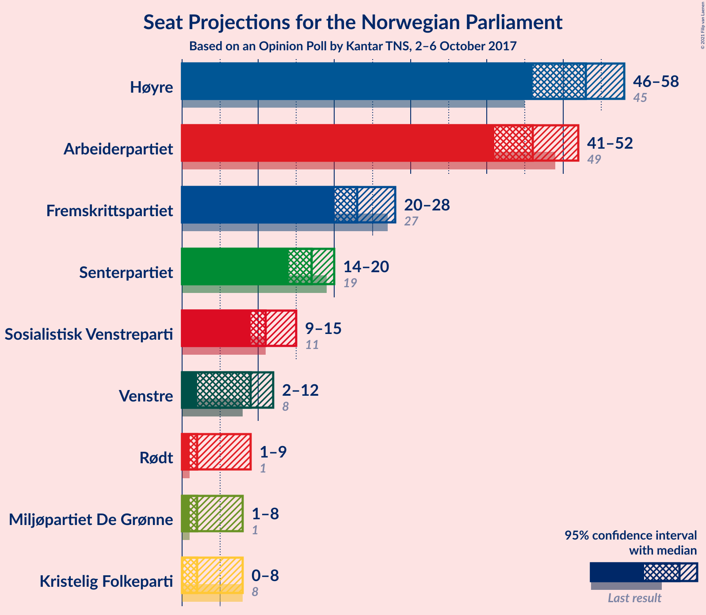
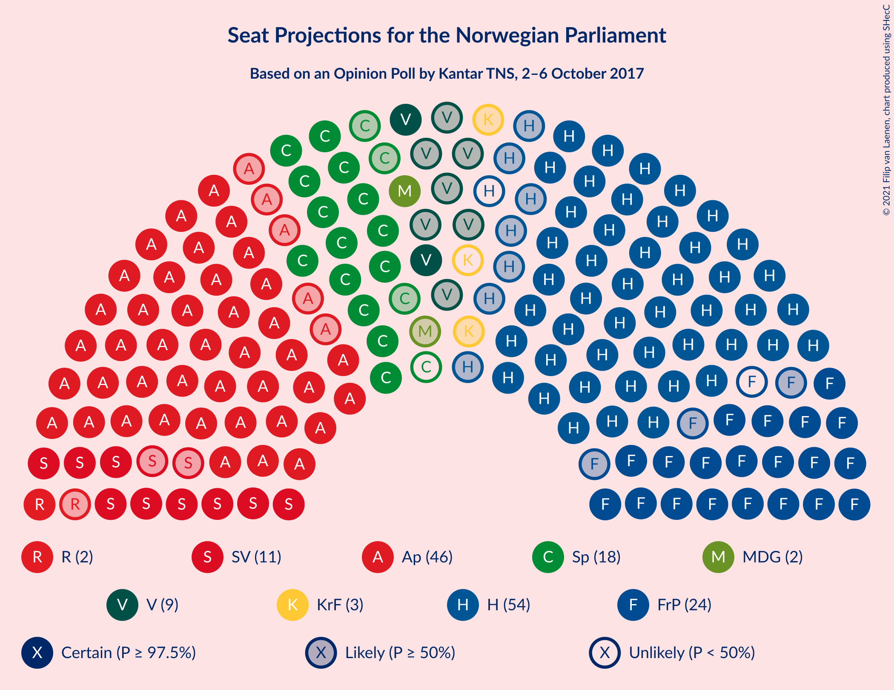
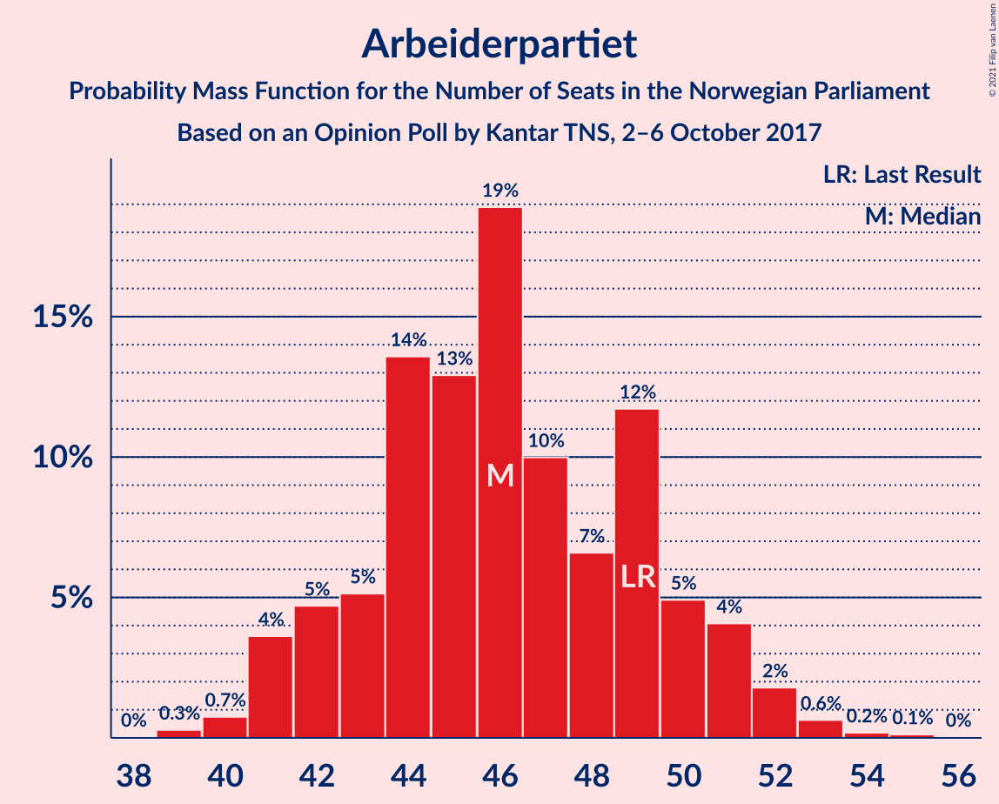
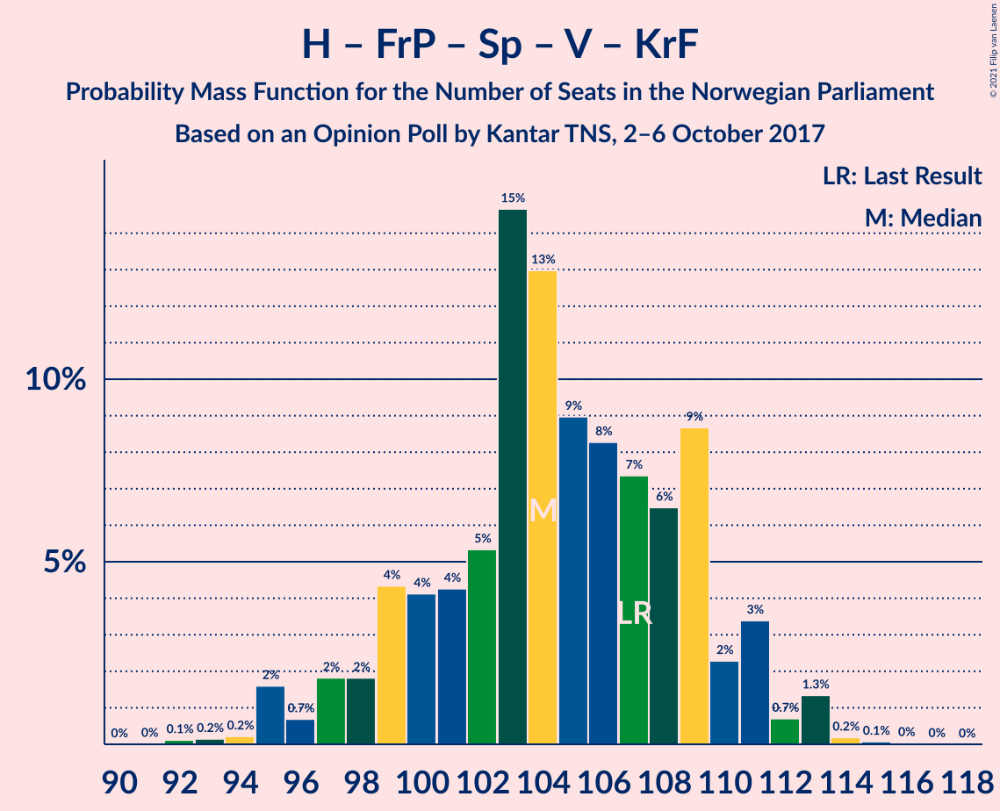
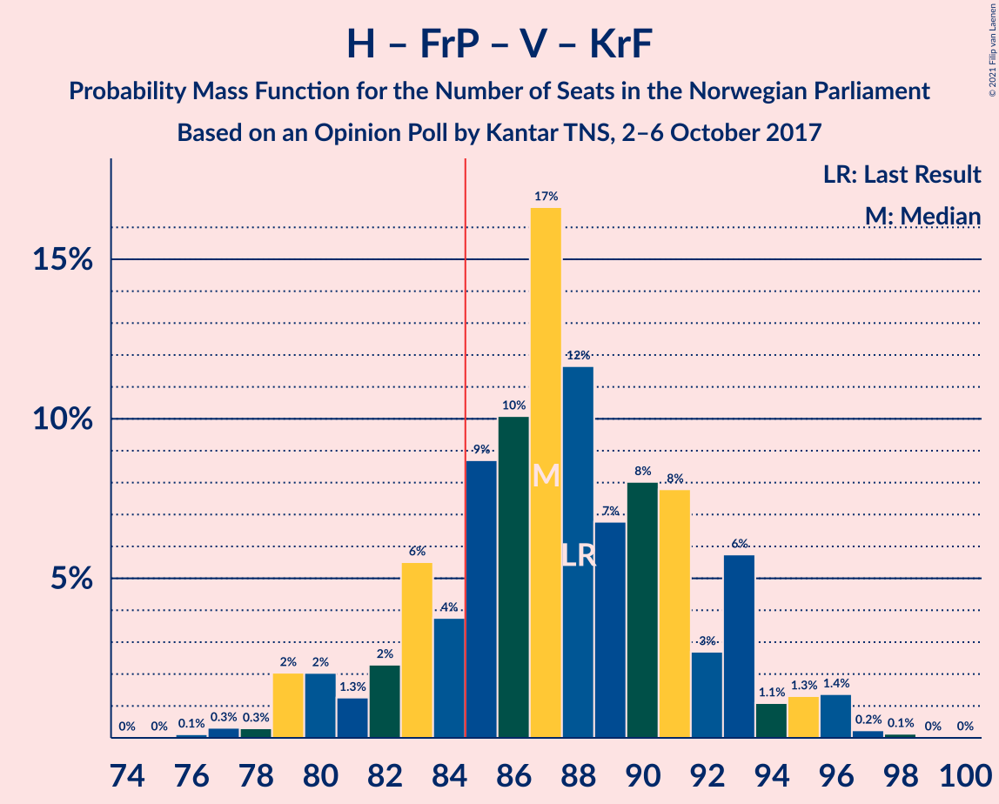
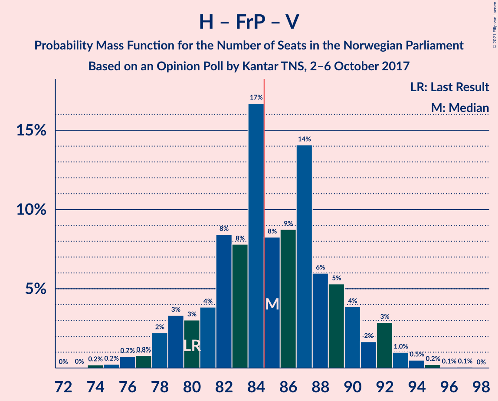
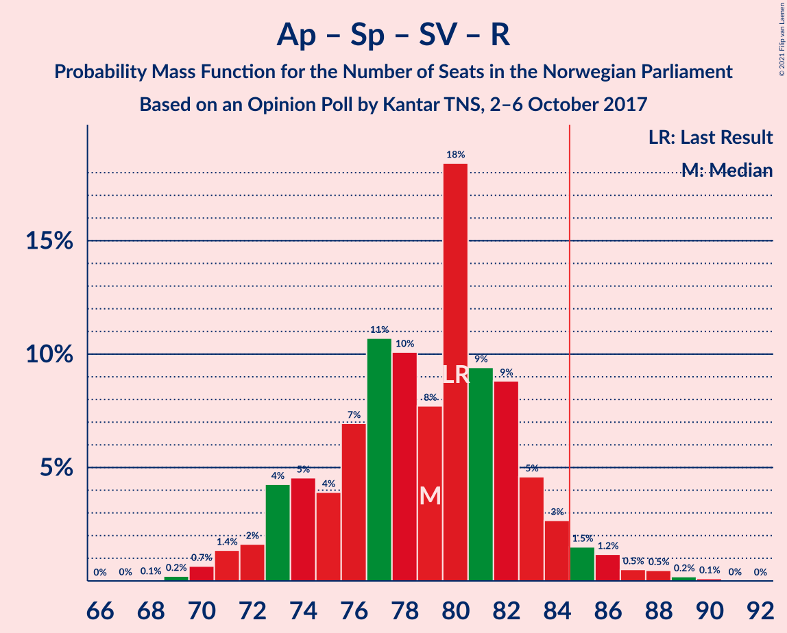
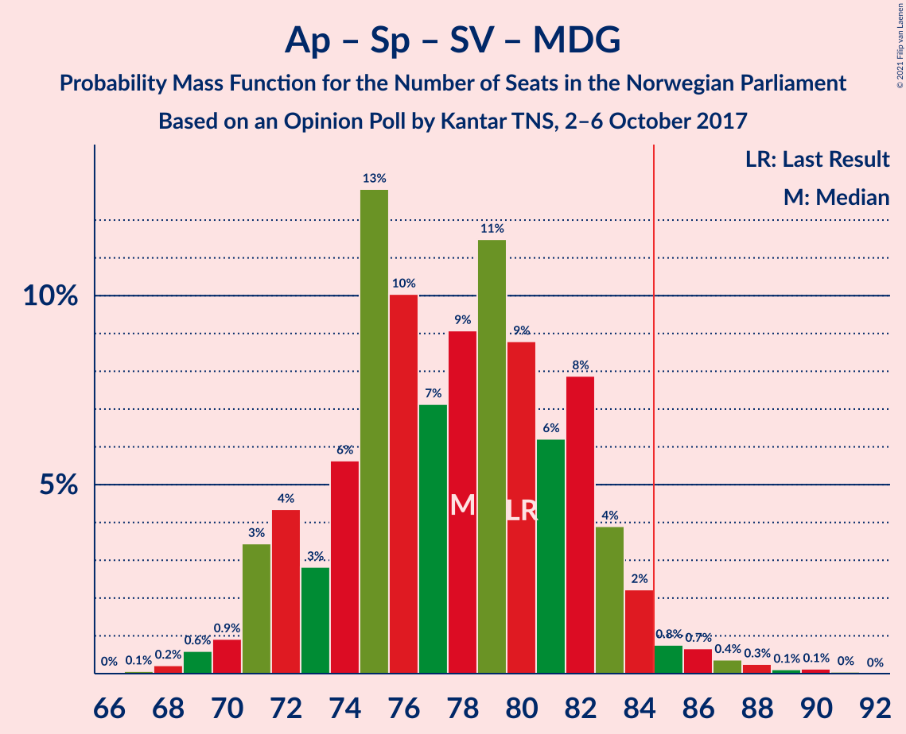

# Opinion Poll by Kantar TNS, 2–6 October 2017

<a href="#voting-intentions">Voting Intentions</a> | <a href="#seats">Seats</a> | <a href="#coalitions">Coalitions</a> | <a href="#technical-information">Technical Information</a>

## Voting Intentions

### Confidence Intervals

| Party | Last Result | Poll Result | 80% Confidence Interval | 90% Confidence Interval | 95% Confidence Interval | 99% Confidence Interval |
|:-----:|:-----------:|:-----------:|:-----------------------:|:-----------------------:|:-----------------------:|:-----------------------:|
| Høyre | 25.0% | 29.1% | 27.3–31.0% |26.8–31.6% |26.4–32.1% |25.5–33.0% |
| Arbeiderpartiet | 27.4% | 25.3% | 23.6–27.2% |23.1–27.7% |22.7–28.2% |21.9–29.1% |
| Fremskrittspartiet | 15.2% | 13.1% | 11.8–14.6% |11.5–15.0% |11.1–15.4% |10.5–16.1% |
| Senterpartiet | 10.3% | 9.3% | 8.2–10.6% |7.9–11.0% |7.7–11.3% |7.2–12.0% |
| Sosialistisk Venstreparti | 6.0% | 6.4% | 5.5–7.5% |5.2–7.8% |5.0–8.1% |4.6–8.6% |
| Venstre | 4.4% | 4.8% | 4.0–5.8% |3.8–6.1% |3.6–6.4% |3.3–6.9% |
| Rødt | 2.4% | 3.7% | 3.0–4.6% |2.8–4.8% |2.7–5.1% |2.4–5.5% |
| Miljøpartiet De Grønne | 3.2% | 3.4% | 2.7–4.3% |2.6–4.5% |2.4–4.7% |2.1–5.2% |
| Kristelig Folkeparti | 4.2% | 3.2% | 2.6–4.0% |2.4–4.3% |2.2–4.5% |2.0–4.9% |

*Note:* The poll result column reflects the actual value used in the calculations. Published results may vary slightly, and in addition be rounded to fewer digits.

## Seats

### Confidence Intervals

| Party | Last Result | Median | 80% Confidence Interval | 90% Confidence Interval | 95% Confidence Interval | 99% Confidence Interval |
|:-----:|:-----------:|:------:|:-----------------------:|:-----------------------:|:-----------------------:|:-----------------------:|
| <a href="#høyre">Høyre</a> | 45 | 52 | 48–57 |47–58 |46–59 |46–61 |
| <a href="#arbeiderpartiet">Arbeiderpartiet</a> | 49 | 46 | 42–51 |42–52 |41–52 |40–54 |
| <a href="#fremskrittspartiet">Fremskrittspartiet</a> | 27 | 23 | 21–27 |20–28 |20–28 |18–30 |
| <a href="#senterpartiet">Senterpartiet</a> | 19 | 17 | 15–20 |14–20 |13–21 |12–22 |
| <a href="#sosialistisk-venstreparti">Sosialistisk Venstreparti</a> | 11 | 12 | 10–14 |9–15 |8–15 |8–16 |
| <a href="#venstre">Venstre</a> | 8 | 8 | 2–10 |2–11 |2–12 |2–13 |
| <a href="#rødt">Rødt</a> | 1 | 2 | 1–8 |1–9 |1–9 |1–10 |
| <a href="#miljøpartiet-de-grønne">Miljøpartiet De Grønne</a> | 1 | 2 | 1–8 |1–8 |1–9 |1–9 |
| <a href="#kristelig-folkeparti">Kristelig Folkeparti</a> | 8 | 3 | 1–8 |1–8 |0–8 |0–9 |

### Høyre

*For a full overview of the results for this party, see the [Høyre](party-høyre.html) page.*

| Number of Seats | Probability | Accumulated | Special Marks |
|:---------------:|:-----------:|:-----------:|:-------------:|
| 43 | 0% | 100% |  |
| 44 | 0.1% | 99.9% |  |
| 45 | 0.2% | 99.8% | Last Result |
| 46 | 3% | 99.7% |  |
| 47 | 5% | 97% |  |
| 48 | 5% | 91% |  |
| 49 | 12% | 86% |  |
| 50 | 7% | 74% |  |
| 51 | 9% | 67% |  |
| 52 | 14% | 59% | Median |
| 53 | 13% | 45% |  |
| 54 | 10% | 32% |  |
| 55 | 4% | 22% |  |
| 56 | 1.1% | 17% |  |
| 57 | 9% | 16% |  |
| 58 | 4% | 7% |  |
| 59 | 1.0% | 3% |  |
| 60 | 0.9% | 2% |  |
| 61 | 1.3% | 2% |  |
| 62 | 0.1% | 0.2% |  |
| 63 | 0.1% | 0.1% |  |
| 64 | 0% | 0% |  |

### Arbeiderpartiet

*For a full overview of the results for this party, see the [Arbeiderpartiet](party-arbeiderpartiet.html) page.*

| Number of Seats | Probability | Accumulated | Special Marks |
|:---------------:|:-----------:|:-----------:|:-------------:|
| 39 | 0.4% | 100% |  |
| 40 | 2% | 99.6% |  |
| 41 | 2% | 98% |  |
| 42 | 13% | 96% |  |
| 43 | 3% | 83% |  |
| 44 | 7% | 80% |  |
| 45 | 16% | 74% |  |
| 46 | 19% | 58% | Median |
| 47 | 9% | 39% |  |
| 48 | 12% | 30% |  |
| 49 | 3% | 18% | Last Result |
| 50 | 3% | 14% |  |
| 51 | 5% | 11% |  |
| 52 | 5% | 6% |  |
| 53 | 0.7% | 1.2% |  |
| 54 | 0.4% | 0.5% |  |
| 55 | 0.1% | 0.2% |  |
| 56 | 0.1% | 0.1% |  |
| 57 | 0% | 0% |  |

### Fremskrittspartiet

*For a full overview of the results for this party, see the [Fremskrittspartiet](party-fremskrittspartiet.html) page.*

| Number of Seats | Probability | Accumulated | Special Marks |
|:---------------:|:-----------:|:-----------:|:-------------:|
| 17 | 0.2% | 100% |  |
| 18 | 0.6% | 99.8% |  |
| 19 | 0.9% | 99.2% |  |
| 20 | 6% | 98% |  |
| 21 | 19% | 92% |  |
| 22 | 13% | 74% |  |
| 23 | 19% | 61% | Median |
| 24 | 9% | 42% |  |
| 25 | 7% | 34% |  |
| 26 | 11% | 27% |  |
| 27 | 7% | 16% | Last Result |
| 28 | 7% | 9% |  |
| 29 | 1.3% | 2% |  |
| 30 | 0.4% | 0.6% |  |
| 31 | 0.2% | 0.2% |  |
| 32 | 0% | 0% |  |

### Senterpartiet

*For a full overview of the results for this party, see the [Senterpartiet](party-senterpartiet.html) page.*

| Number of Seats | Probability | Accumulated | Special Marks |
|:---------------:|:-----------:|:-----------:|:-------------:|
| 11 | 0.1% | 100% |  |
| 12 | 0.5% | 99.9% |  |
| 13 | 2% | 99.4% |  |
| 14 | 4% | 97% |  |
| 15 | 15% | 93% |  |
| 16 | 20% | 78% |  |
| 17 | 15% | 58% | Median |
| 18 | 18% | 42% |  |
| 19 | 5% | 24% | Last Result |
| 20 | 15% | 19% |  |
| 21 | 2% | 4% |  |
| 22 | 1.1% | 1.4% |  |
| 23 | 0.3% | 0.3% |  |
| 24 | 0% | 0% |  |

### Sosialistisk Venstreparti

*For a full overview of the results for this party, see the [Sosialistisk Venstreparti](party-sosialistiskvenstreparti.html) page.*

| Number of Seats | Probability | Accumulated | Special Marks |
|:---------------:|:-----------:|:-----------:|:-------------:|
| 7 | 0% | 100% |  |
| 8 | 3% | 99.9% |  |
| 9 | 5% | 97% |  |
| 10 | 12% | 92% |  |
| 11 | 27% | 81% | Last Result |
| 12 | 24% | 54% | Median |
| 13 | 14% | 30% |  |
| 14 | 10% | 16% |  |
| 15 | 4% | 6% |  |
| 16 | 2% | 2% |  |
| 17 | 0% | 0.1% |  |
| 18 | 0.1% | 0.1% |  |
| 19 | 0% | 0% |  |

### Venstre

*For a full overview of the results for this party, see the [Venstre](party-venstre.html) page.*

| Number of Seats | Probability | Accumulated | Special Marks |
|:---------------:|:-----------:|:-----------:|:-------------:|
| 2 | 11% | 100% |  |
| 3 | 0.5% | 89% |  |
| 4 | 0% | 89% |  |
| 5 | 0% | 89% |  |
| 6 | 0.1% | 89% |  |
| 7 | 5% | 89% |  |
| 8 | 36% | 83% | Last Result, Median |
| 9 | 16% | 48% |  |
| 10 | 24% | 32% |  |
| 11 | 4% | 8% |  |
| 12 | 3% | 3% |  |
| 13 | 0.7% | 0.8% |  |
| 14 | 0% | 0.1% |  |
| 15 | 0% | 0% |  |

### Rødt

*For a full overview of the results for this party, see the [Rødt](party-rødt.html) page.*

| Number of Seats | Probability | Accumulated | Special Marks |
|:---------------:|:-----------:|:-----------:|:-------------:|
| 1 | 12% | 100% | Last Result |
| 2 | 60% | 88% | Median |
| 3 | 0% | 28% |  |
| 4 | 0% | 28% |  |
| 5 | 0% | 28% |  |
| 6 | 0% | 28% |  |
| 7 | 9% | 28% |  |
| 8 | 12% | 19% |  |
| 9 | 7% | 7% |  |
| 10 | 0.6% | 0.7% |  |
| 11 | 0.1% | 0.2% |  |
| 12 | 0% | 0% |  |

### Miljøpartiet De Grønne

*For a full overview of the results for this party, see the [Miljøpartiet De Grønne](party-miljøpartietdegrønne.html) page.*

| Number of Seats | Probability | Accumulated | Special Marks |
|:---------------:|:-----------:|:-----------:|:-------------:|
| 0 | 0.3% | 100% |  |
| 1 | 30% | 99.7% | Last Result |
| 2 | 39% | 70% | Median |
| 3 | 7% | 31% |  |
| 4 | 0% | 24% |  |
| 5 | 0% | 24% |  |
| 6 | 0% | 24% |  |
| 7 | 10% | 24% |  |
| 8 | 11% | 14% |  |
| 9 | 3% | 3% |  |
| 10 | 0.2% | 0.3% |  |
| 11 | 0% | 0% |  |

### Kristelig Folkeparti

*For a full overview of the results for this party, see the [Kristelig Folkeparti](party-kristeligfolkeparti.html) page.*

| Number of Seats | Probability | Accumulated | Special Marks |
|:---------------:|:-----------:|:-----------:|:-------------:|
| 0 | 3% | 100% |  |
| 1 | 29% | 97% |  |
| 2 | 8% | 68% |  |
| 3 | 37% | 60% | Median |
| 4 | 0% | 23% |  |
| 5 | 0% | 23% |  |
| 6 | 0.4% | 23% |  |
| 7 | 7% | 22% |  |
| 8 | 13% | 15% | Last Result |
| 9 | 2% | 2% |  |
| 10 | 0% | 0% |  |

## Coalitions

### Confidence Intervals

| Coalition | Last Result | Median | Majority? | 80% Confidence Interval | 90% Confidence Interval | 95% Confidence Interval | 99% Confidence Interval |
|:---------:|:-----------:|:------:|:---------:|:-----------------------:|:-----------------------:|:-----------------------:|:-----------------------:|
| Høyre – Fremskrittspartiet – Senterpartiet – Venstre – Kristelig Folkeparti | 107 | 105 | 100% | 100–111 | 98–111 | 98–112 | 93–114 |
| Høyre – Fremskrittspartiet – Venstre – Miljøpartiet De Grønne – Kristelig Folkeparti | 89 | 91 | 95% | 86–94 | 85–96 | 82–98 | 80–100 |
| Høyre – Fremskrittspartiet – Venstre – Kristelig Folkeparti | 88 | 87 | 78% | 83–91 | 81–93 | 79–94 | 78–97 |
| Høyre – Fremskrittspartiet – Venstre | 80 | 84 | 37% | 80–89 | 78–90 | 76–92 | 74–94 |
| Arbeiderpartiet – Senterpartiet – Sosialistisk Venstreparti – Rødt – Miljøpartiet De Grønne | 81 | 82 | 22% | 78–86 | 76–88 | 75–90 | 72–91 |
| Arbeiderpartiet – Senterpartiet – Sosialistisk Venstreparti – Miljøpartiet De Grønne – Kristelig Folkeparti | 88 | 82 | 18% | 76–87 | 74–87 | 73–88 | 71–90 |
| Arbeiderpartiet – Senterpartiet – Sosialistisk Venstreparti – Rødt | 80 | 78 | 5% | 75–83 | 73–84 | 71–87 | 69–89 |
| Arbeiderpartiet – Senterpartiet – Sosialistisk Venstreparti – Miljøpartiet De Grønne | 80 | 78 | 4% | 74–83 | 72–84 | 70–86 | 68–89 |
| Høyre – Fremskrittspartiet | 72 | 76 | 1.3% | 71–80 | 70–81 | 69–83 | 67–85 |
| Arbeiderpartiet – Senterpartiet – Sosialistisk Venstreparti | 79 | 75 | 0.4% | 70–79 | 69–81 | 68–81 | 66–84 |
| Arbeiderpartiet – Senterpartiet – Miljøpartiet De Grønne – Kristelig Folkeparti | 77 | 70 | 0% | 65–74 | 63–76 | 61–78 | 61–79 |
| Arbeiderpartiet – Senterpartiet – Kristelig Folkeparti | 76 | 66 | 0% | 62–72 | 60–72 | 60–74 | 58–77 |
| Høyre – Venstre – Kristelig Folkeparti | 61 | 64 | 0% | 59–70 | 58–70 | 57–71 | 55–73 |
| Arbeiderpartiet – Senterpartiet | 68 | 63 | 0% | 59–68 | 58–69 | 58–69 | 55–72 |
| Arbeiderpartiet – Sosialistisk Venstreparti | 60 | 58 | 0% | 54–62 | 52–63 | 52–64 | 50–66 |
| Senterpartiet – Venstre – Kristelig Folkeparti | 35 | 29 | 0% | 23–34 | 22–34 | 20–34 | 18–35 |

### Høyre – Fremskrittspartiet – Senterpartiet – Venstre – Kristelig Folkeparti

| Number of Seats | Probability | Accumulated | Special Marks |
|:---------------:|:-----------:|:-----------:|:-------------:|
| 91 | 0% | 100% |  |
| 92 | 0.4% | 99.9% |  |
| 93 | 0.6% | 99.6% |  |
| 94 | 0.4% | 99.0% |  |
| 95 | 0.2% | 98.6% |  |
| 96 | 0.5% | 98% |  |
| 97 | 0.3% | 98% |  |
| 98 | 4% | 98% |  |
| 99 | 3% | 94% |  |
| 100 | 6% | 91% |  |
| 101 | 8% | 85% |  |
| 102 | 14% | 77% |  |
| 103 | 9% | 63% | Median |
| 104 | 4% | 54% |  |
| 105 | 7% | 50% |  |
| 106 | 11% | 44% |  |
| 107 | 17% | 33% | Last Result |
| 108 | 1.1% | 16% |  |
| 109 | 2% | 15% |  |
| 110 | 2% | 13% |  |
| 111 | 7% | 11% |  |
| 112 | 1.4% | 4% |  |
| 113 | 2% | 2% |  |
| 114 | 0.5% | 0.7% |  |
| 115 | 0.2% | 0.3% |  |
| 116 | 0.1% | 0.1% |  |
| 117 | 0% | 0% |  |

### Høyre – Fremskrittspartiet – Venstre – Miljøpartiet De Grønne – Kristelig Folkeparti

| Number of Seats | Probability | Accumulated | Special Marks |
|:---------------:|:-----------:|:-----------:|:-------------:|
| 79 | 0.3% | 100% |  |
| 80 | 1.0% | 99.7% |  |
| 81 | 1.0% | 98.6% |  |
| 82 | 0.5% | 98% |  |
| 83 | 0.9% | 97% |  |
| 84 | 1.1% | 96% |  |
| 85 | 2% | 95% | Majority |
| 86 | 7% | 93% |  |
| 87 | 6% | 87% |  |
| 88 | 4% | 81% | Median |
| 89 | 19% | 77% | Last Result |
| 90 | 3% | 58% |  |
| 91 | 11% | 55% |  |
| 92 | 18% | 44% |  |
| 93 | 13% | 25% |  |
| 94 | 4% | 13% |  |
| 95 | 2% | 9% |  |
| 96 | 2% | 7% |  |
| 97 | 2% | 4% |  |
| 98 | 1.1% | 3% |  |
| 99 | 0.6% | 1.5% |  |
| 100 | 0.5% | 0.9% |  |
| 101 | 0.3% | 0.3% |  |
| 102 | 0% | 0% |  |

### Høyre – Fremskrittspartiet – Venstre – Kristelig Folkeparti

| Number of Seats | Probability | Accumulated | Special Marks |
|:---------------:|:-----------:|:-----------:|:-------------:|
| 74 | 0% | 100% |  |
| 75 | 0% | 99.9% |  |
| 76 | 0.2% | 99.9% |  |
| 77 | 0.1% | 99.7% |  |
| 78 | 0.9% | 99.6% |  |
| 79 | 2% | 98.7% |  |
| 80 | 0.8% | 96% |  |
| 81 | 2% | 95% |  |
| 82 | 1.1% | 93% |  |
| 83 | 7% | 92% |  |
| 84 | 7% | 85% |  |
| 85 | 8% | 78% | Majority |
| 86 | 9% | 70% | Median |
| 87 | 19% | 61% |  |
| 88 | 8% | 42% | Last Result |
| 89 | 2% | 34% |  |
| 90 | 6% | 32% |  |
| 91 | 19% | 27% |  |
| 92 | 1.3% | 8% |  |
| 93 | 4% | 7% |  |
| 94 | 0.4% | 3% |  |
| 95 | 1.0% | 2% |  |
| 96 | 0.5% | 1.2% |  |
| 97 | 0.4% | 0.7% |  |
| 98 | 0.3% | 0.4% |  |
| 99 | 0% | 0% |  |

### Høyre – Fremskrittspartiet – Venstre

| Number of Seats | Probability | Accumulated | Special Marks |
|:---------------:|:-----------:|:-----------:|:-------------:|
| 72 | 0.1% | 100% |  |
| 73 | 0.1% | 99.9% |  |
| 74 | 0.8% | 99.8% |  |
| 75 | 0.4% | 99.0% |  |
| 76 | 1.4% | 98.7% |  |
| 77 | 1.1% | 97% |  |
| 78 | 2% | 96% |  |
| 79 | 3% | 94% |  |
| 80 | 11% | 91% | Last Result |
| 81 | 4% | 81% |  |
| 82 | 4% | 76% |  |
| 83 | 21% | 72% | Median |
| 84 | 14% | 51% |  |
| 85 | 8% | 37% | Majority |
| 86 | 2% | 29% |  |
| 87 | 10% | 27% |  |
| 88 | 7% | 17% |  |
| 89 | 3% | 10% |  |
| 90 | 4% | 7% |  |
| 91 | 1.0% | 4% |  |
| 92 | 2% | 3% |  |
| 93 | 0.3% | 1.0% |  |
| 94 | 0.3% | 0.8% |  |
| 95 | 0.1% | 0.5% |  |
| 96 | 0.3% | 0.4% |  |
| 97 | 0% | 0% |  |

### Arbeiderpartiet – Senterpartiet – Sosialistisk Venstreparti – Rødt – Miljøpartiet De Grønne

| Number of Seats | Probability | Accumulated | Special Marks |
|:---------------:|:-----------:|:-----------:|:-------------:|
| 71 | 0.3% | 100% |  |
| 72 | 0.4% | 99.6% |  |
| 73 | 0.5% | 99.3% |  |
| 74 | 1.0% | 98.8% |  |
| 75 | 0.4% | 98% |  |
| 76 | 4% | 97% |  |
| 77 | 1.3% | 93% |  |
| 78 | 19% | 92% |  |
| 79 | 6% | 73% | Median |
| 80 | 2% | 68% |  |
| 81 | 8% | 66% | Last Result |
| 82 | 19% | 58% |  |
| 83 | 9% | 39% |  |
| 84 | 8% | 30% |  |
| 85 | 7% | 22% | Majority |
| 86 | 7% | 15% |  |
| 87 | 1.1% | 8% |  |
| 88 | 2% | 7% |  |
| 89 | 0.8% | 5% |  |
| 90 | 2% | 4% |  |
| 91 | 0.9% | 1.3% |  |
| 92 | 0.1% | 0.4% |  |
| 93 | 0.2% | 0.3% |  |
| 94 | 0% | 0.1% |  |
| 95 | 0% | 0.1% |  |
| 96 | 0% | 0% |  |

### Arbeiderpartiet – Senterpartiet – Sosialistisk Venstreparti – Miljøpartiet De Grønne – Kristelig Folkeparti

| Number of Seats | Probability | Accumulated | Special Marks |
|:---------------:|:-----------:|:-----------:|:-------------:|
| 67 | 0.1% | 100% |  |
| 68 | 0% | 99.9% |  |
| 69 | 0% | 99.9% |  |
| 70 | 0.1% | 99.8% |  |
| 71 | 1.5% | 99.7% |  |
| 72 | 0.2% | 98% |  |
| 73 | 2% | 98% |  |
| 74 | 2% | 97% |  |
| 75 | 3% | 95% |  |
| 76 | 6% | 92% |  |
| 77 | 4% | 86% |  |
| 78 | 3% | 83% |  |
| 79 | 12% | 79% |  |
| 80 | 8% | 68% | Median |
| 81 | 5% | 60% |  |
| 82 | 5% | 55% |  |
| 83 | 8% | 49% |  |
| 84 | 23% | 41% |  |
| 85 | 2% | 18% | Majority |
| 86 | 5% | 15% |  |
| 87 | 8% | 11% |  |
| 88 | 2% | 3% | Last Result |
| 89 | 0.4% | 2% |  |
| 90 | 0.9% | 1.3% |  |
| 91 | 0.4% | 0.5% |  |
| 92 | 0% | 0.1% |  |
| 93 | 0.1% | 0.1% |  |
| 94 | 0% | 0% |  |

### Arbeiderpartiet – Senterpartiet – Sosialistisk Venstreparti – Rødt

| Number of Seats | Probability | Accumulated | Special Marks |
|:---------------:|:-----------:|:-----------:|:-------------:|
| 68 | 0.3% | 100% |  |
| 69 | 0.5% | 99.7% |  |
| 70 | 0.6% | 99.1% |  |
| 71 | 1.1% | 98.5% |  |
| 72 | 2% | 97% |  |
| 73 | 2% | 96% |  |
| 74 | 2% | 93% |  |
| 75 | 4% | 91% |  |
| 76 | 13% | 87% |  |
| 77 | 18% | 75% | Median |
| 78 | 11% | 56% |  |
| 79 | 3% | 45% |  |
| 80 | 19% | 42% | Last Result |
| 81 | 4% | 23% |  |
| 82 | 6% | 19% |  |
| 83 | 7% | 13% |  |
| 84 | 2% | 7% |  |
| 85 | 1.1% | 5% | Majority |
| 86 | 0.9% | 4% |  |
| 87 | 0.5% | 3% |  |
| 88 | 1.0% | 2% |  |
| 89 | 1.0% | 1.4% |  |
| 90 | 0.3% | 0.3% |  |
| 91 | 0% | 0% |  |

### Arbeiderpartiet – Senterpartiet – Sosialistisk Venstreparti – Miljøpartiet De Grønne

| Number of Seats | Probability | Accumulated | Special Marks |
|:---------------:|:-----------:|:-----------:|:-------------:|
| 66 | 0.2% | 100% |  |
| 67 | 0.1% | 99.8% |  |
| 68 | 0.4% | 99.8% |  |
| 69 | 0.4% | 99.4% |  |
| 70 | 2% | 99.0% |  |
| 71 | 0.4% | 97% |  |
| 72 | 2% | 97% |  |
| 73 | 3% | 95% |  |
| 74 | 6% | 92% |  |
| 75 | 7% | 85% |  |
| 76 | 19% | 78% |  |
| 77 | 8% | 59% | Median |
| 78 | 4% | 50% |  |
| 79 | 8% | 46% |  |
| 80 | 8% | 39% | Last Result |
| 81 | 12% | 30% |  |
| 82 | 4% | 18% |  |
| 83 | 5% | 14% |  |
| 84 | 5% | 9% |  |
| 85 | 0.6% | 4% | Majority |
| 86 | 2% | 3% |  |
| 87 | 0.3% | 1.4% |  |
| 88 | 0.3% | 1.1% |  |
| 89 | 0.7% | 0.8% |  |
| 90 | 0.1% | 0.1% |  |
| 91 | 0% | 0% |  |

### Høyre – Fremskrittspartiet

| Number of Seats | Probability | Accumulated | Special Marks |
|:---------------:|:-----------:|:-----------:|:-------------:|
| 65 | 0.4% | 100% |  |
| 66 | 0% | 99.5% |  |
| 67 | 0.2% | 99.5% |  |
| 68 | 0.4% | 99.3% |  |
| 69 | 2% | 98.9% |  |
| 70 | 5% | 97% |  |
| 71 | 3% | 92% |  |
| 72 | 5% | 90% | Last Result |
| 73 | 13% | 84% |  |
| 74 | 8% | 71% |  |
| 75 | 11% | 63% | Median |
| 76 | 10% | 53% |  |
| 77 | 12% | 42% |  |
| 78 | 11% | 31% |  |
| 79 | 3% | 20% |  |
| 80 | 9% | 17% |  |
| 81 | 5% | 8% |  |
| 82 | 0.3% | 3% |  |
| 83 | 0.6% | 3% |  |
| 84 | 0.7% | 2% |  |
| 85 | 0.8% | 1.3% | Majority |
| 86 | 0.1% | 0.4% |  |
| 87 | 0% | 0.3% |  |
| 88 | 0.2% | 0.3% |  |
| 89 | 0% | 0% |  |

### Arbeiderpartiet – Senterpartiet – Sosialistisk Venstreparti

| Number of Seats | Probability | Accumulated | Special Marks |
|:---------------:|:-----------:|:-----------:|:-------------:|
| 64 | 0.2% | 100% |  |
| 65 | 0.2% | 99.8% |  |
| 66 | 0.4% | 99.6% |  |
| 67 | 0.7% | 99.2% |  |
| 68 | 1.2% | 98% |  |
| 69 | 2% | 97% |  |
| 70 | 7% | 95% |  |
| 71 | 4% | 88% |  |
| 72 | 7% | 84% |  |
| 73 | 4% | 77% |  |
| 74 | 19% | 73% |  |
| 75 | 14% | 54% | Median |
| 76 | 10% | 40% |  |
| 77 | 2% | 30% |  |
| 78 | 9% | 28% |  |
| 79 | 8% | 18% | Last Result |
| 80 | 3% | 10% |  |
| 81 | 6% | 7% |  |
| 82 | 0.4% | 1.3% |  |
| 83 | 0% | 0.9% |  |
| 84 | 0.4% | 0.9% |  |
| 85 | 0.3% | 0.4% | Majority |
| 86 | 0% | 0.1% |  |
| 87 | 0% | 0.1% |  |
| 88 | 0.1% | 0.1% |  |
| 89 | 0% | 0% |  |

### Arbeiderpartiet – Senterpartiet – Miljøpartiet De Grønne – Kristelig Folkeparti

| Number of Seats | Probability | Accumulated | Special Marks |
|:---------------:|:-----------:|:-----------:|:-------------:|
| 56 | 0.1% | 100% |  |
| 57 | 0% | 99.9% |  |
| 58 | 0.1% | 99.9% |  |
| 59 | 0.1% | 99.8% |  |
| 60 | 0.2% | 99.7% |  |
| 61 | 3% | 99.5% |  |
| 62 | 0.9% | 97% |  |
| 63 | 2% | 96% |  |
| 64 | 3% | 93% |  |
| 65 | 6% | 90% |  |
| 66 | 3% | 84% |  |
| 67 | 10% | 82% |  |
| 68 | 10% | 72% | Median |
| 69 | 7% | 62% |  |
| 70 | 12% | 55% |  |
| 71 | 8% | 43% |  |
| 72 | 7% | 35% |  |
| 73 | 17% | 28% |  |
| 74 | 3% | 11% |  |
| 75 | 2% | 7% |  |
| 76 | 0.8% | 5% |  |
| 77 | 1.1% | 4% | Last Result |
| 78 | 1.4% | 3% |  |
| 79 | 2% | 2% |  |
| 80 | 0.2% | 0.2% |  |
| 81 | 0% | 0.1% |  |
| 82 | 0% | 0% |  |

### Arbeiderpartiet – Senterpartiet – Kristelig Folkeparti

| Number of Seats | Probability | Accumulated | Special Marks |
|:---------------:|:-----------:|:-----------:|:-------------:|
| 55 | 0.1% | 100% |  |
| 56 | 0.1% | 99.9% |  |
| 57 | 0.1% | 99.8% |  |
| 58 | 0.7% | 99.7% |  |
| 59 | 0.4% | 99.0% |  |
| 60 | 4% | 98.6% |  |
| 61 | 3% | 95% |  |
| 62 | 6% | 91% |  |
| 63 | 7% | 85% |  |
| 64 | 8% | 78% |  |
| 65 | 19% | 70% |  |
| 66 | 7% | 52% | Median |
| 67 | 4% | 45% |  |
| 68 | 8% | 41% |  |
| 69 | 8% | 33% |  |
| 70 | 6% | 24% |  |
| 71 | 4% | 18% |  |
| 72 | 9% | 14% |  |
| 73 | 2% | 5% |  |
| 74 | 0.6% | 3% |  |
| 75 | 0.3% | 2% |  |
| 76 | 0.6% | 2% | Last Result |
| 77 | 1.2% | 1.3% |  |
| 78 | 0.1% | 0.1% |  |
| 79 | 0% | 0% |  |

### Høyre – Venstre – Kristelig Folkeparti

| Number of Seats | Probability | Accumulated | Special Marks |
|:---------------:|:-----------:|:-----------:|:-------------:|
| 52 | 0% | 100% |  |
| 53 | 0.1% | 99.9% |  |
| 54 | 0.3% | 99.9% |  |
| 55 | 1.1% | 99.5% |  |
| 56 | 0.3% | 98% |  |
| 57 | 1.4% | 98% |  |
| 58 | 6% | 97% |  |
| 59 | 11% | 91% |  |
| 60 | 11% | 80% |  |
| 61 | 6% | 68% | Last Result |
| 62 | 7% | 63% |  |
| 63 | 5% | 55% | Median |
| 64 | 10% | 50% |  |
| 65 | 5% | 41% |  |
| 66 | 7% | 35% |  |
| 67 | 2% | 28% |  |
| 68 | 8% | 27% |  |
| 69 | 4% | 19% |  |
| 70 | 11% | 14% |  |
| 71 | 2% | 4% |  |
| 72 | 0.2% | 1.0% |  |
| 73 | 0.5% | 0.8% |  |
| 74 | 0.1% | 0.3% |  |
| 75 | 0.1% | 0.1% |  |
| 76 | 0% | 0% |  |

### Arbeiderpartiet – Senterpartiet

| Number of Seats | Probability | Accumulated | Special Marks |
|:---------------:|:-----------:|:-----------:|:-------------:|
| 54 | 0.3% | 100% |  |
| 55 | 0.2% | 99.7% |  |
| 56 | 0.5% | 99.5% |  |
| 57 | 1.0% | 99.0% |  |
| 58 | 3% | 98% |  |
| 59 | 6% | 95% |  |
| 60 | 10% | 88% |  |
| 61 | 5% | 78% |  |
| 62 | 15% | 73% |  |
| 63 | 10% | 58% | Median |
| 64 | 18% | 48% |  |
| 65 | 6% | 29% |  |
| 66 | 11% | 23% |  |
| 67 | 1.4% | 13% |  |
| 68 | 3% | 11% | Last Result |
| 69 | 5% | 8% |  |
| 70 | 1.3% | 2% |  |
| 71 | 0.4% | 0.9% |  |
| 72 | 0% | 0.5% |  |
| 73 | 0.3% | 0.5% |  |
| 74 | 0% | 0.1% |  |
| 75 | 0% | 0.1% |  |
| 76 | 0.1% | 0.1% |  |
| 77 | 0% | 0% |  |

### Arbeiderpartiet – Sosialistisk Venstreparti

| Number of Seats | Probability | Accumulated | Special Marks |
|:---------------:|:-----------:|:-----------:|:-------------:|
| 48 | 0.2% | 100% |  |
| 49 | 0.1% | 99.8% |  |
| 50 | 0.9% | 99.7% |  |
| 51 | 0.5% | 98.8% |  |
| 52 | 5% | 98% |  |
| 53 | 4% | 94% |  |
| 54 | 8% | 90% |  |
| 55 | 5% | 82% |  |
| 56 | 6% | 76% |  |
| 57 | 9% | 71% |  |
| 58 | 12% | 61% | Median |
| 59 | 26% | 49% |  |
| 60 | 6% | 23% | Last Result |
| 61 | 5% | 17% |  |
| 62 | 4% | 12% |  |
| 63 | 3% | 8% |  |
| 64 | 3% | 5% |  |
| 65 | 0.1% | 2% |  |
| 66 | 1.1% | 1.4% |  |
| 67 | 0.1% | 0.2% |  |
| 68 | 0.1% | 0.1% |  |
| 69 | 0% | 0% |  |

### Senterpartiet – Venstre – Kristelig Folkeparti

| Number of Seats | Probability | Accumulated | Special Marks |
|:---------------:|:-----------:|:-----------:|:-------------:|
| 16 | 0.2% | 100% |  |
| 17 | 0.2% | 99.8% |  |
| 18 | 0.6% | 99.6% |  |
| 19 | 0.3% | 99.0% |  |
| 20 | 1.5% | 98.7% |  |
| 21 | 0.6% | 97% |  |
| 22 | 6% | 97% |  |
| 23 | 2% | 90% |  |
| 24 | 5% | 88% |  |
| 25 | 7% | 83% |  |
| 26 | 5% | 77% |  |
| 27 | 6% | 71% |  |
| 28 | 8% | 65% | Median |
| 29 | 11% | 58% |  |
| 30 | 3% | 47% |  |
| 31 | 20% | 43% |  |
| 32 | 6% | 23% |  |
| 33 | 6% | 17% |  |
| 34 | 10% | 11% |  |
| 35 | 0.4% | 0.7% | Last Result |
| 36 | 0.2% | 0.3% |  |
| 37 | 0% | 0.1% |  |
| 38 | 0% | 0.1% |  |
| 39 | 0.1% | 0.1% |  |
| 40 | 0% | 0% |  |

## Technical Information

### Opinion Poll

+ **Polling firm:** Kantar TNS
+ **Commissioner(s):** —
+ **Fieldwork period:** 2–6 October 2017

### Calculations

+ **Sample size:** 975
+ **Simulations done:** 131,072
+ **Error estimate:** 3.89%

