# Opinion Poll by Opinion Perduco, 3–9 October 2017

<a href="#voting-intentions">Voting Intentions</a> | <a href="#seats">Seats</a> | <a href="#coalitions">Coalitions</a> | <a href="#technical-information">Technical Information</a>

## Voting Intentions

### Confidence Intervals

| Party | Last Result | Poll Result | 80% Confidence Interval | 90% Confidence Interval | 95% Confidence Interval | 99% Confidence Interval |
|:-----:|:-----------:|:-----------:|:-----------------------:|:-----------------------:|:-----------------------:|:-----------------------:|
| Høyre | 25.0% | 26.8% | 24.8–28.9% |24.2–29.5% |23.7–30.0% |22.8–31.0% |
| Arbeiderpartiet | 27.4% | 25.8% | 23.9–28.0% |23.3–28.5% |22.9–29.1% |22.0–30.1% |
| Fremskrittspartiet | 15.2% | 14.9% | 13.3–16.6% |12.9–17.1% |12.5–17.6% |11.8–18.5% |
| Senterpartiet | 10.3% | 10.6% | 9.3–12.1% |8.9–12.6% |8.6–13.0% |8.0–13.7% |
| Sosialistisk Venstreparti | 6.0% | 6.0% | 5.0–7.3% |4.8–7.6% |4.5–7.9% |4.1–8.6% |
| Miljøpartiet De Grønne | 3.2% | 4.8% | 4.0–6.0% |3.7–6.3% |3.5–6.6% |3.2–7.2% |
| Venstre | 4.4% | 4.0% | 3.3–5.1% |3.0–5.4% |2.9–5.7% |2.5–6.2% |
| Kristelig Folkeparti | 4.2% | 4.0% | 3.3–5.1% |3.0–5.4% |2.9–5.7% |2.5–6.2% |
| Rødt | 2.4% | 2.2% | 1.7–3.1% |1.5–3.3% |1.4–3.5% |1.2–4.0% |

*Note:* The poll result column reflects the actual value used in the calculations. Published results may vary slightly, and in addition be rounded to fewer digits.

## Seats

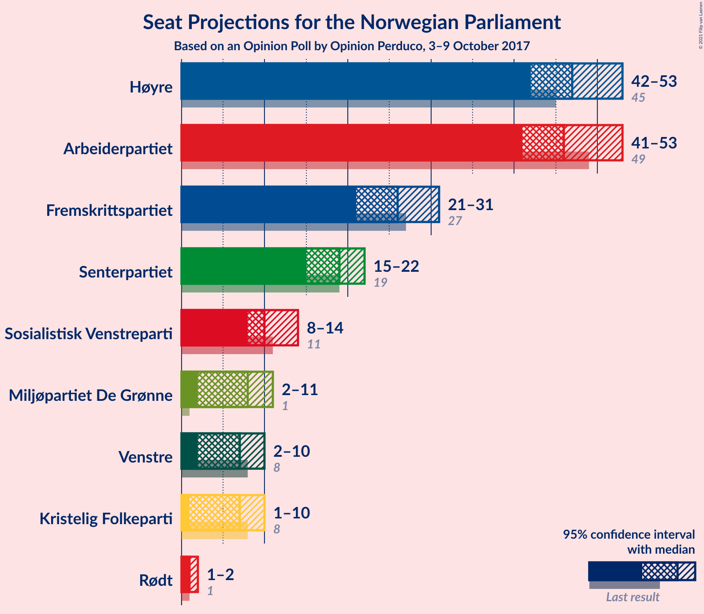

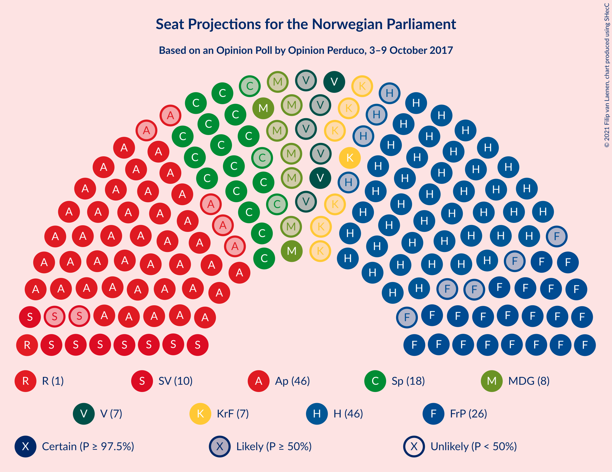

### Confidence Intervals

| Party | Last Result | Median | 80% Confidence Interval | 90% Confidence Interval | 95% Confidence Interval | 99% Confidence Interval |
|:-----:|:-----------:|:------:|:-----------------------:|:-----------------------:|:-----------------------:|:-----------------------:|
| <a href="#høyre">Høyre</a> | 45 | 47 | 43–51 |42–52 |42–53 |40–55 |
| <a href="#arbeiderpartiet">Arbeiderpartiet</a> | 49 | 46 | 42–50 |42–51 |41–53 |40–54 |
| <a href="#fremskrittspartiet">Fremskrittspartiet</a> | 27 | 26 | 24–29 |23–30 |21–31 |20–33 |
| <a href="#senterpartiet">Senterpartiet</a> | 19 | 19 | 16–22 |16–22 |15–22 |14–24 |
| <a href="#sosialistisk-venstreparti">Sosialistisk Venstreparti</a> | 11 | 10 | 9–13 |8–13 |8–14 |7–15 |
| <a href="#miljøpartiet-de-grønne">Miljøpartiet De Grønne</a> | 1 | 8 | 2–10 |2–11 |2–11 |2–12 |
| <a href="#venstre">Venstre</a> | 8 | 7 | 2–9 |2–9 |2–10 |2–11 |
| <a href="#kristelig-folkeparti">Kristelig Folkeparti</a> | 8 | 7 | 2–9 |1–9 |1–10 |1–11 |
| <a href="#rødt">Rødt</a> | 1 | 1 | 1 |1–2 |1–2 |0–2 |

### Høyre

*For a full overview of the results for this party, see the [Høyre](party-høyre.html) page.*

| Number of Seats | Probability | Accumulated | Special Marks |
|:---------------:|:-----------:|:-----------:|:-------------:|
| 38 | 0.2% | 100% |  |
| 39 | 0.2% | 99.8% |  |
| 40 | 1.0% | 99.6% |  |
| 41 | 1.1% | 98.7% |  |
| 42 | 3% | 98% |  |
| 43 | 7% | 94% |  |
| 44 | 13% | 87% |  |
| 45 | 9% | 74% | Last Result |
| 46 | 11% | 65% |  |
| 47 | 7% | 54% | Median |
| 48 | 19% | 47% |  |
| 49 | 9% | 28% |  |
| 50 | 4% | 19% |  |
| 51 | 6% | 15% |  |
| 52 | 5% | 9% |  |
| 53 | 2% | 4% |  |
| 54 | 0.8% | 2% |  |
| 55 | 0.5% | 0.8% |  |
| 56 | 0.1% | 0.3% |  |
| 57 | 0.1% | 0.2% |  |
| 58 | 0% | 0.1% |  |
| 59 | 0% | 0% |  |

### Arbeiderpartiet

*For a full overview of the results for this party, see the [Arbeiderpartiet](party-arbeiderpartiet.html) page.*

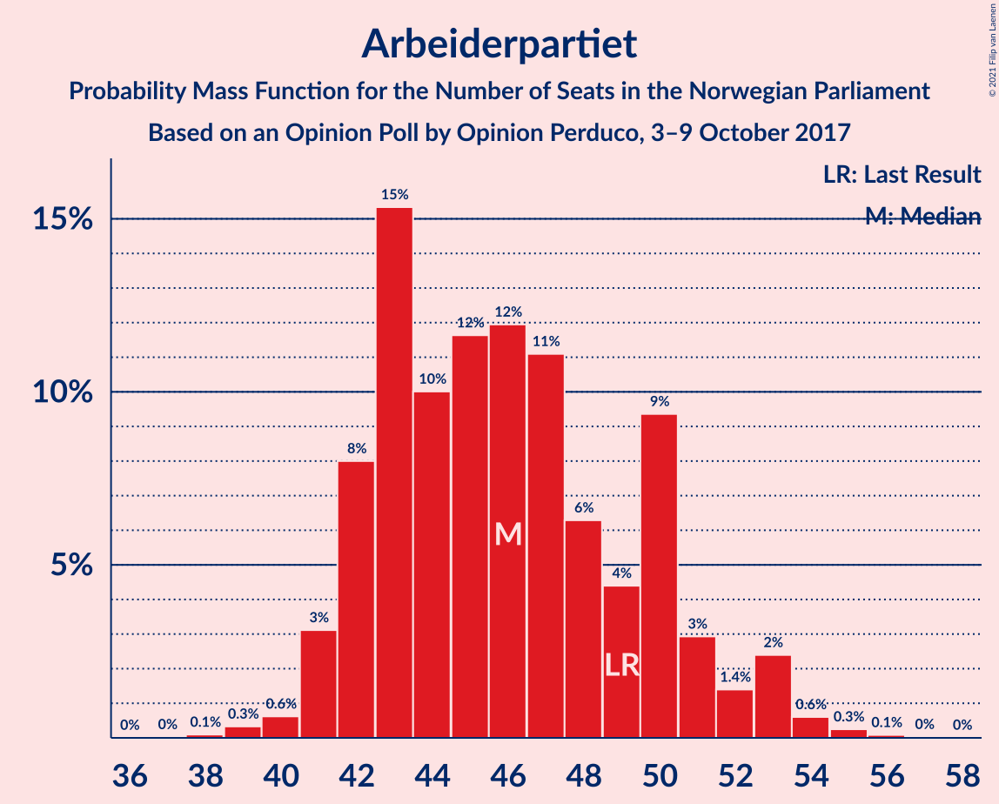

| Number of Seats | Probability | Accumulated | Special Marks |
|:---------------:|:-----------:|:-----------:|:-------------:|
| 38 | 0.1% | 100% |  |
| 39 | 0.3% | 99.9% |  |
| 40 | 0.6% | 99.5% |  |
| 41 | 3% | 98.9% |  |
| 42 | 8% | 96% |  |
| 43 | 15% | 88% |  |
| 44 | 10% | 72% |  |
| 45 | 12% | 62% |  |
| 46 | 12% | 51% | Median |
| 47 | 11% | 39% |  |
| 48 | 6% | 28% |  |
| 49 | 4% | 21% | Last Result |
| 50 | 9% | 17% |  |
| 51 | 3% | 8% |  |
| 52 | 1.4% | 5% |  |
| 53 | 2% | 3% |  |
| 54 | 0.6% | 1.0% |  |
| 55 | 0.3% | 0.4% |  |
| 56 | 0.1% | 0.1% |  |
| 57 | 0% | 0% |  |

### Fremskrittspartiet

*For a full overview of the results for this party, see the [Fremskrittspartiet](party-fremskrittspartiet.html) page.*

| Number of Seats | Probability | Accumulated | Special Marks |
|:---------------:|:-----------:|:-----------:|:-------------:|
| 18 | 0.1% | 100% |  |
| 19 | 0.3% | 99.9% |  |
| 20 | 1.1% | 99.7% |  |
| 21 | 1.2% | 98.6% |  |
| 22 | 2% | 97% |  |
| 23 | 3% | 96% |  |
| 24 | 3% | 93% |  |
| 25 | 10% | 90% |  |
| 26 | 30% | 80% | Median |
| 27 | 20% | 50% | Last Result |
| 28 | 19% | 30% |  |
| 29 | 4% | 11% |  |
| 30 | 4% | 7% |  |
| 31 | 0.8% | 3% |  |
| 32 | 0.7% | 2% |  |
| 33 | 1.0% | 2% |  |
| 34 | 0.4% | 0.5% |  |
| 35 | 0.1% | 0.1% |  |
| 36 | 0% | 0% |  |

### Senterpartiet

*For a full overview of the results for this party, see the [Senterpartiet](party-senterpartiet.html) page.*

| Number of Seats | Probability | Accumulated | Special Marks |
|:---------------:|:-----------:|:-----------:|:-------------:|
| 12 | 0.1% | 100% |  |
| 13 | 0.3% | 99.9% |  |
| 14 | 0.9% | 99.7% |  |
| 15 | 2% | 98.8% |  |
| 16 | 8% | 97% |  |
| 17 | 22% | 89% |  |
| 18 | 16% | 67% |  |
| 19 | 12% | 51% | Last Result, Median |
| 20 | 18% | 39% |  |
| 21 | 10% | 22% |  |
| 22 | 9% | 11% |  |
| 23 | 2% | 2% |  |
| 24 | 0.3% | 0.6% |  |
| 25 | 0.1% | 0.3% |  |
| 26 | 0.1% | 0.2% |  |
| 27 | 0% | 0% |  |

### Sosialistisk Venstreparti

*For a full overview of the results for this party, see the [Sosialistisk Venstreparti](party-sosialistiskvenstreparti.html) page.*

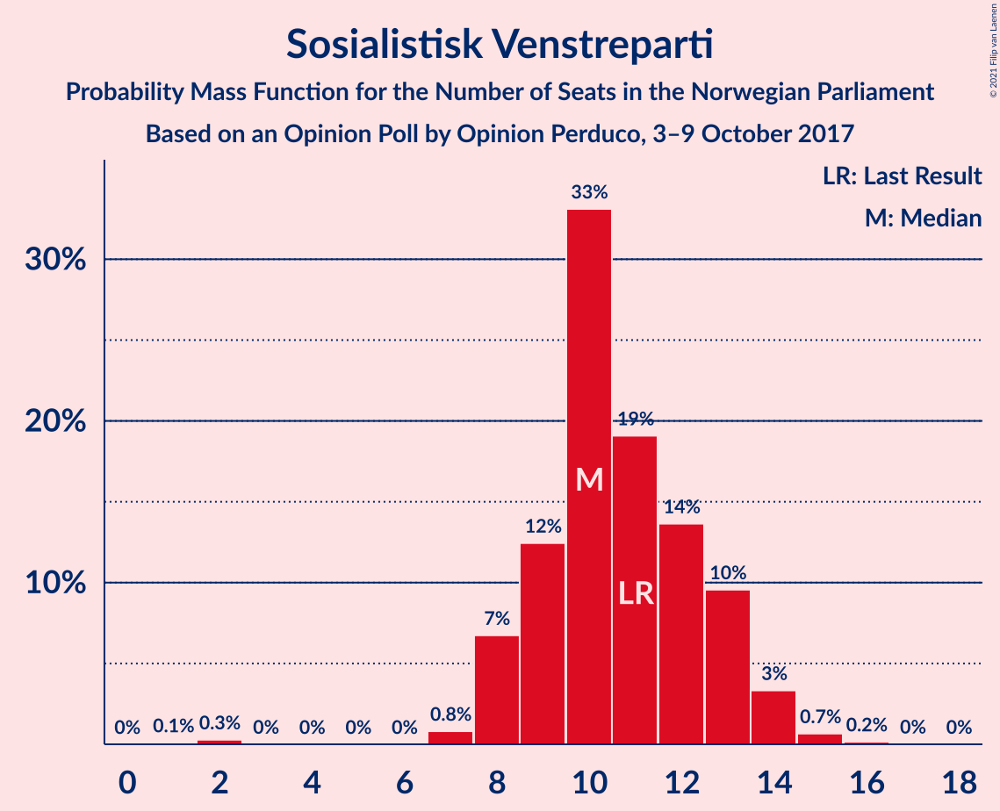

| Number of Seats | Probability | Accumulated | Special Marks |
|:---------------:|:-----------:|:-----------:|:-------------:|
| 1 | 0.1% | 100% |  |
| 2 | 0.3% | 99.9% |  |
| 3 | 0% | 99.6% |  |
| 4 | 0% | 99.6% |  |
| 5 | 0% | 99.6% |  |
| 6 | 0% | 99.6% |  |
| 7 | 0.8% | 99.6% |  |
| 8 | 7% | 98.8% |  |
| 9 | 12% | 92% |  |
| 10 | 33% | 80% | Median |
| 11 | 19% | 46% | Last Result |
| 12 | 14% | 27% |  |
| 13 | 10% | 14% |  |
| 14 | 3% | 4% |  |
| 15 | 0.7% | 0.9% |  |
| 16 | 0.2% | 0.2% |  |
| 17 | 0% | 0% |  |

### Miljøpartiet De Grønne

*For a full overview of the results for this party, see the [Miljøpartiet De Grønne](party-miljøpartietdegrønne.html) page.*

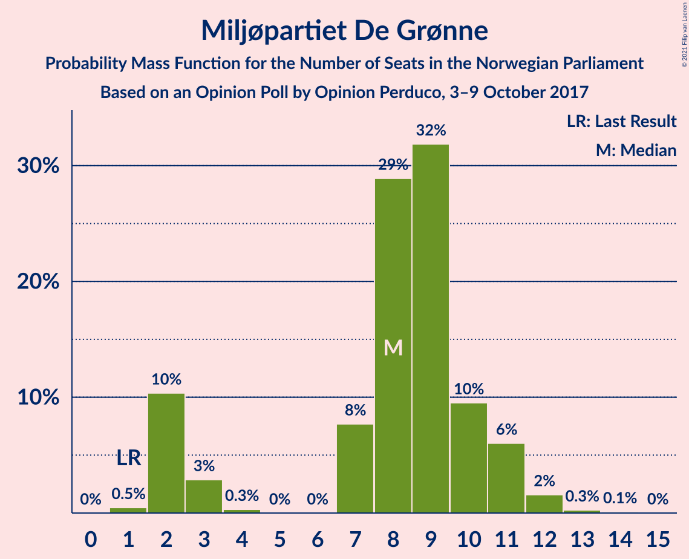

| Number of Seats | Probability | Accumulated | Special Marks |
|:---------------:|:-----------:|:-----------:|:-------------:|
| 1 | 0.5% | 100% | Last Result |
| 2 | 10% | 99.5% |  |
| 3 | 3% | 89% |  |
| 4 | 0.3% | 86% |  |
| 5 | 0% | 86% |  |
| 6 | 0% | 86% |  |
| 7 | 8% | 86% |  |
| 8 | 29% | 78% | Median |
| 9 | 32% | 49% |  |
| 10 | 10% | 18% |  |
| 11 | 6% | 8% |  |
| 12 | 2% | 2% |  |
| 13 | 0.3% | 0.4% |  |
| 14 | 0.1% | 0.1% |  |
| 15 | 0% | 0% |  |

### Venstre

*For a full overview of the results for this party, see the [Venstre](party-venstre.html) page.*

| Number of Seats | Probability | Accumulated | Special Marks |
|:---------------:|:-----------:|:-----------:|:-------------:|
| 1 | 0.3% | 100% |  |
| 2 | 35% | 99.7% |  |
| 3 | 2% | 65% |  |
| 4 | 0% | 62% |  |
| 5 | 0% | 62% |  |
| 6 | 0% | 62% |  |
| 7 | 23% | 62% | Median |
| 8 | 27% | 39% | Last Result |
| 9 | 8% | 12% |  |
| 10 | 3% | 4% |  |
| 11 | 0.6% | 0.7% |  |
| 12 | 0.1% | 0.1% |  |
| 13 | 0% | 0% |  |

### Kristelig Folkeparti

*For a full overview of the results for this party, see the [Kristelig Folkeparti](party-kristeligfolkeparti.html) page.*

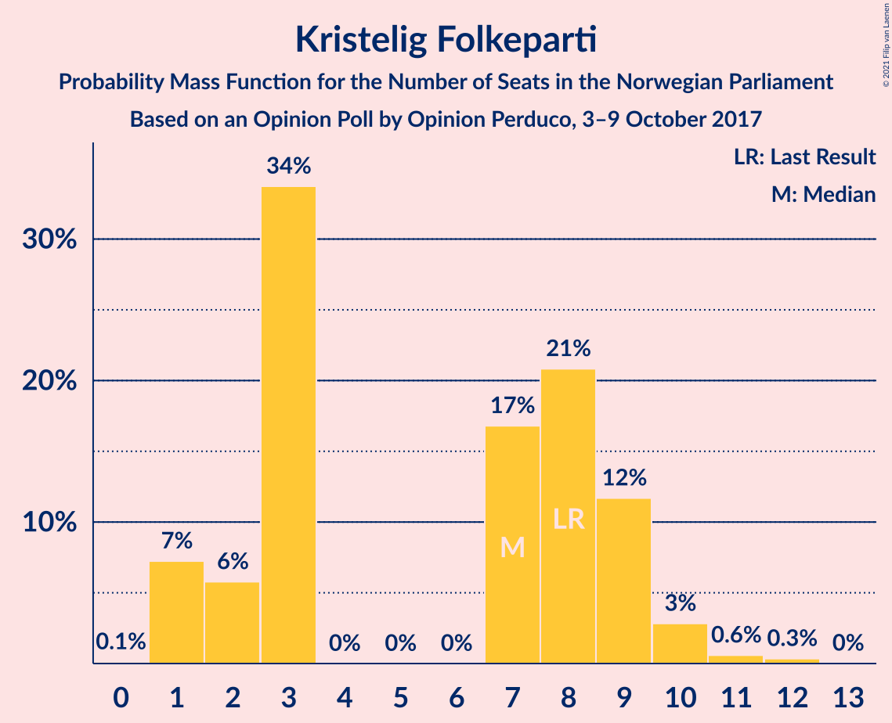

| Number of Seats | Probability | Accumulated | Special Marks |
|:---------------:|:-----------:|:-----------:|:-------------:|
| 0 | 0.1% | 100% |  |
| 1 | 7% | 99.9% |  |
| 2 | 6% | 93% |  |
| 3 | 34% | 87% |  |
| 4 | 0% | 53% |  |
| 5 | 0% | 53% |  |
| 6 | 0% | 53% |  |
| 7 | 17% | 53% | Median |
| 8 | 21% | 36% | Last Result |
| 9 | 12% | 15% |  |
| 10 | 3% | 4% |  |
| 11 | 0.6% | 1.0% |  |
| 12 | 0.3% | 0.4% |  |
| 13 | 0% | 0% |  |

### Rødt

*For a full overview of the results for this party, see the [Rødt](party-rødt.html) page.*

| Number of Seats | Probability | Accumulated | Special Marks |
|:---------------:|:-----------:|:-----------:|:-------------:|
| 0 | 2% | 100% |  |
| 1 | 88% | 98% | Last Result, Median |
| 2 | 9% | 9% |  |
| 3 | 0% | 0.4% |  |
| 4 | 0% | 0.4% |  |
| 5 | 0% | 0.4% |  |
| 6 | 0% | 0.4% |  |
| 7 | 0.4% | 0.4% |  |
| 8 | 0% | 0.1% |  |
| 9 | 0% | 0% |  |

## Coalitions

### Confidence Intervals

| Coalition | Last Result | Median | Majority? | 80% Confidence Interval | 90% Confidence Interval | 95% Confidence Interval | 99% Confidence Interval |
|:---------:|:-----------:|:------:|:---------:|:-----------------------:|:-----------------------:|:-----------------------:|:-----------------------:|
| Høyre – Fremskrittspartiet – Senterpartiet – Kristelig Folkeparti – Venstre | 107 | 104 | 100% | 99–108 | 97–109 | 96–111 | 94–113 |
| Høyre – Fremskrittspartiet – Miljøpartiet De Grønne – Kristelig Folkeparti – Venstre | 89 | 92 | 98.7% | 88–98 | 86–99 | 85–99 | 84–100 |
| Arbeiderpartiet – Senterpartiet – Sosialistisk Venstreparti – Miljøpartiet De Grønne – Kristelig Folkeparti | 88 | 89 | 92% | 85–93 | 82–95 | 81–96 | 79–99 |
| Arbeiderpartiet – Senterpartiet – Sosialistisk Venstreparti – Miljøpartiet De Grønne – Rødt | 81 | 84 | 45% | 79–90 | 79–91 | 77–92 | 73–94 |
| Høyre – Fremskrittspartiet – Kristelig Folkeparti – Venstre | 88 | 85 | 55% | 79–90 | 78–90 | 77–92 | 75–96 |
| Arbeiderpartiet – Senterpartiet – Sosialistisk Venstreparti – Miljøpartiet De Grønne | 80 | 82 | 38% | 78–89 | 78–90 | 76–91 | 72–93 |
| Høyre – Fremskrittspartiet – Venstre | 80 | 79 | 7% | 75–83 | 73–85 | 72–87 | 69–89 |
| Arbeiderpartiet – Senterpartiet – Miljøpartiet De Grønne – Kristelig Folkeparti | 77 | 78 | 3% | 73–83 | 72–84 | 71–85 | 69–89 |
| Arbeiderpartiet – Senterpartiet – Sosialistisk Venstreparti – Rødt | 80 | 77 | 1.3% | 71–81 | 70–83 | 70–84 | 69–85 |
| Arbeiderpartiet – Senterpartiet – Sosialistisk Venstreparti | 79 | 76 | 0.3% | 70–80 | 69–81 | 69–82 | 68–84 |
| Høyre – Fremskrittspartiet | 72 | 74 | 0.2% | 69–78 | 69–80 | 67–80 | 65–83 |
| Arbeiderpartiet – Senterpartiet – Kristelig Folkeparti | 76 | 70 | 0% | 66–75 | 65–76 | 63–77 | 61–81 |
| Arbeiderpartiet – Senterpartiet | 68 | 64 | 0% | 60–70 | 59–71 | 59–73 | 57–74 |
| Høyre – Kristelig Folkeparti – Venstre | 61 | 58 | 0% | 51–64 | 51–65 | 50–66 | 49–68 |
| Arbeiderpartiet – Sosialistisk Venstreparti | 60 | 56 | 0% | 52–61 | 52–62 | 51–63 | 49–65 |
| Senterpartiet – Kristelig Folkeparti – Venstre | 35 | 31 | 0% | 25–34 | 24–36 | 22–36 | 20–38 |

### Høyre – Fremskrittspartiet – Senterpartiet – Kristelig Folkeparti – Venstre

| Number of Seats | Probability | Accumulated | Special Marks |
|:---------------:|:-----------:|:-----------:|:-------------:|
| 91 | 0.1% | 100% |  |
| 92 | 0.1% | 99.9% |  |
| 93 | 0.2% | 99.8% |  |
| 94 | 0.6% | 99.7% |  |
| 95 | 1.1% | 99.0% |  |
| 96 | 0.8% | 98% |  |
| 97 | 2% | 97% |  |
| 98 | 3% | 95% |  |
| 99 | 11% | 91% |  |
| 100 | 5% | 81% |  |
| 101 | 3% | 76% |  |
| 102 | 14% | 73% |  |
| 103 | 7% | 59% |  |
| 104 | 6% | 51% |  |
| 105 | 13% | 46% |  |
| 106 | 7% | 33% | Median |
| 107 | 14% | 26% | Last Result |
| 108 | 5% | 12% |  |
| 109 | 2% | 6% |  |
| 110 | 2% | 4% |  |
| 111 | 1.0% | 3% |  |
| 112 | 1.0% | 2% |  |
| 113 | 0.4% | 0.7% |  |
| 114 | 0.1% | 0.2% |  |
| 115 | 0.1% | 0.1% |  |
| 116 | 0% | 0.1% |  |
| 117 | 0% | 0% |  |

### Høyre – Fremskrittspartiet – Miljøpartiet De Grønne – Kristelig Folkeparti – Venstre

| Number of Seats | Probability | Accumulated | Special Marks |
|:---------------:|:-----------:|:-----------:|:-------------:|
| 80 | 0% | 100% |  |
| 81 | 0% | 99.9% |  |
| 82 | 0.1% | 99.9% |  |
| 83 | 0.2% | 99.8% |  |
| 84 | 0.9% | 99.6% |  |
| 85 | 1.5% | 98.7% | Majority |
| 86 | 2% | 97% |  |
| 87 | 4% | 95% |  |
| 88 | 10% | 91% |  |
| 89 | 12% | 80% | Last Result |
| 90 | 9% | 69% |  |
| 91 | 5% | 60% |  |
| 92 | 6% | 55% |  |
| 93 | 6% | 49% |  |
| 94 | 7% | 44% |  |
| 95 | 7% | 37% | Median |
| 96 | 4% | 30% |  |
| 97 | 5% | 26% |  |
| 98 | 14% | 21% |  |
| 99 | 5% | 6% |  |
| 100 | 1.4% | 2% |  |
| 101 | 0.3% | 0.4% |  |
| 102 | 0.1% | 0.1% |  |
| 103 | 0% | 0.1% |  |
| 104 | 0% | 0% |  |

### Arbeiderpartiet – Senterpartiet – Sosialistisk Venstreparti – Miljøpartiet De Grønne – Kristelig Folkeparti

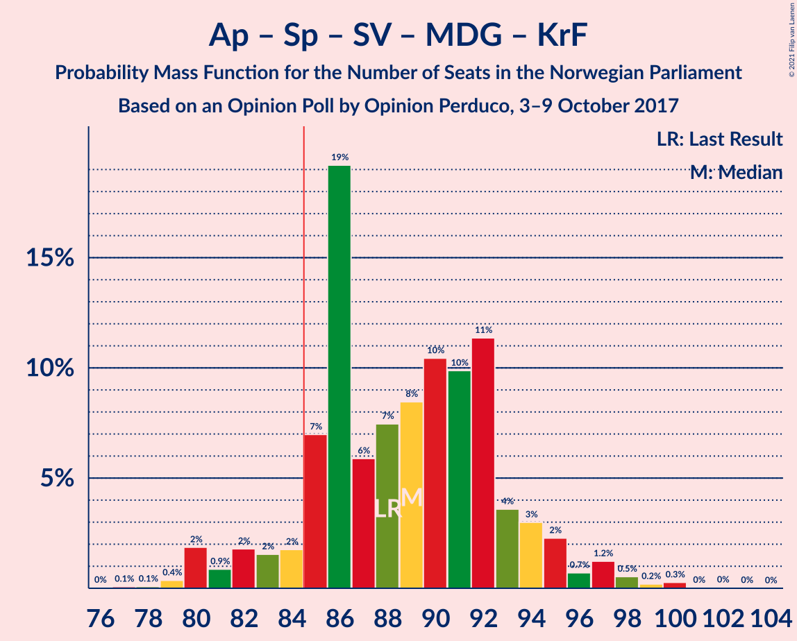

| Number of Seats | Probability | Accumulated | Special Marks |
|:---------------:|:-----------:|:-----------:|:-------------:|
| 76 | 0% | 100% |  |
| 77 | 0.1% | 99.9% |  |
| 78 | 0.1% | 99.8% |  |
| 79 | 0.4% | 99.8% |  |
| 80 | 2% | 99.4% |  |
| 81 | 0.9% | 98% |  |
| 82 | 2% | 97% |  |
| 83 | 2% | 95% |  |
| 84 | 2% | 93% |  |
| 85 | 7% | 92% | Majority |
| 86 | 19% | 85% |  |
| 87 | 6% | 65% |  |
| 88 | 7% | 60% | Last Result |
| 89 | 8% | 52% |  |
| 90 | 10% | 44% | Median |
| 91 | 10% | 33% |  |
| 92 | 11% | 23% |  |
| 93 | 4% | 12% |  |
| 94 | 3% | 8% |  |
| 95 | 2% | 5% |  |
| 96 | 0.7% | 3% |  |
| 97 | 1.2% | 2% |  |
| 98 | 0.5% | 1.1% |  |
| 99 | 0.2% | 0.6% |  |
| 100 | 0.3% | 0.4% |  |
| 101 | 0% | 0.1% |  |
| 102 | 0% | 0.1% |  |
| 103 | 0% | 0% |  |

### Arbeiderpartiet – Senterpartiet – Sosialistisk Venstreparti – Miljøpartiet De Grønne – Rødt

| Number of Seats | Probability | Accumulated | Special Marks |
|:---------------:|:-----------:|:-----------:|:-------------:|
| 72 | 0.1% | 100% |  |
| 73 | 1.0% | 99.9% |  |
| 74 | 0.2% | 98.9% |  |
| 75 | 0.2% | 98.7% |  |
| 76 | 0.8% | 98.6% |  |
| 77 | 0.6% | 98% |  |
| 78 | 2% | 97% |  |
| 79 | 13% | 95% |  |
| 80 | 6% | 82% |  |
| 81 | 5% | 76% | Last Result |
| 82 | 9% | 71% |  |
| 83 | 12% | 62% |  |
| 84 | 6% | 50% | Median |
| 85 | 6% | 45% | Majority |
| 86 | 4% | 39% |  |
| 87 | 5% | 34% |  |
| 88 | 6% | 30% |  |
| 89 | 8% | 24% |  |
| 90 | 9% | 15% |  |
| 91 | 3% | 6% |  |
| 92 | 2% | 4% |  |
| 93 | 0.9% | 2% |  |
| 94 | 0.5% | 0.9% |  |
| 95 | 0.3% | 0.4% |  |
| 96 | 0% | 0.1% |  |
| 97 | 0% | 0% |  |

### Høyre – Fremskrittspartiet – Kristelig Folkeparti – Venstre

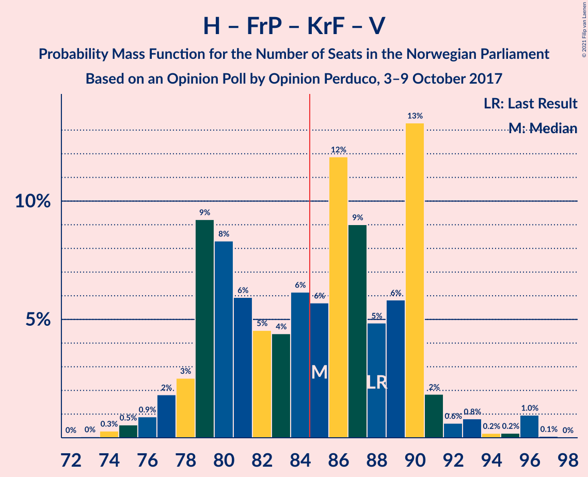

| Number of Seats | Probability | Accumulated | Special Marks |
|:---------------:|:-----------:|:-----------:|:-------------:|
| 73 | 0% | 100% |  |
| 74 | 0.3% | 99.9% |  |
| 75 | 0.5% | 99.6% |  |
| 76 | 0.9% | 99.1% |  |
| 77 | 2% | 98% |  |
| 78 | 3% | 96% |  |
| 79 | 9% | 94% |  |
| 80 | 8% | 85% |  |
| 81 | 6% | 76% |  |
| 82 | 5% | 70% |  |
| 83 | 4% | 66% |  |
| 84 | 6% | 61% |  |
| 85 | 6% | 55% | Majority |
| 86 | 12% | 50% |  |
| 87 | 9% | 38% | Median |
| 88 | 5% | 29% | Last Result |
| 89 | 6% | 24% |  |
| 90 | 13% | 18% |  |
| 91 | 2% | 5% |  |
| 92 | 0.6% | 3% |  |
| 93 | 0.8% | 2% |  |
| 94 | 0.2% | 1.4% |  |
| 95 | 0.2% | 1.3% |  |
| 96 | 1.0% | 1.1% |  |
| 97 | 0.1% | 0.1% |  |
| 98 | 0% | 0% |  |

### Arbeiderpartiet – Senterpartiet – Sosialistisk Venstreparti – Miljøpartiet De Grønne

| Number of Seats | Probability | Accumulated | Special Marks |
|:---------------:|:-----------:|:-----------:|:-------------:|
| 71 | 0.1% | 100% |  |
| 72 | 1.0% | 99.9% |  |
| 73 | 0.2% | 98.9% |  |
| 74 | 0.4% | 98.7% |  |
| 75 | 0.7% | 98% |  |
| 76 | 0.7% | 98% |  |
| 77 | 2% | 97% |  |
| 78 | 14% | 95% |  |
| 79 | 6% | 82% |  |
| 80 | 5% | 76% | Last Result |
| 81 | 10% | 70% |  |
| 82 | 11% | 60% |  |
| 83 | 6% | 50% | Median |
| 84 | 6% | 44% |  |
| 85 | 4% | 38% | Majority |
| 86 | 4% | 34% |  |
| 87 | 6% | 29% |  |
| 88 | 8% | 23% |  |
| 89 | 9% | 15% |  |
| 90 | 2% | 6% |  |
| 91 | 2% | 4% |  |
| 92 | 0.9% | 2% |  |
| 93 | 0.5% | 0.8% |  |
| 94 | 0.2% | 0.3% |  |
| 95 | 0% | 0.1% |  |
| 96 | 0% | 0% |  |

### Høyre – Fremskrittspartiet – Venstre

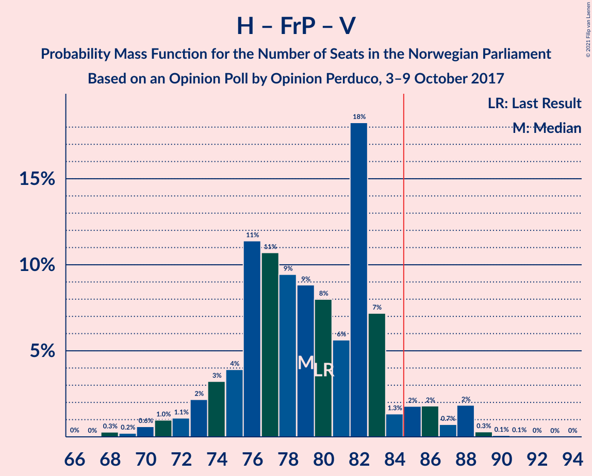

| Number of Seats | Probability | Accumulated | Special Marks |
|:---------------:|:-----------:|:-----------:|:-------------:|
| 66 | 0% | 100% |  |
| 67 | 0% | 99.9% |  |
| 68 | 0.3% | 99.9% |  |
| 69 | 0.2% | 99.6% |  |
| 70 | 0.6% | 99.4% |  |
| 71 | 1.0% | 98.8% |  |
| 72 | 1.1% | 98% |  |
| 73 | 2% | 97% |  |
| 74 | 3% | 95% |  |
| 75 | 4% | 91% |  |
| 76 | 11% | 87% |  |
| 77 | 11% | 76% |  |
| 78 | 9% | 65% |  |
| 79 | 9% | 56% |  |
| 80 | 8% | 47% | Last Result, Median |
| 81 | 6% | 39% |  |
| 82 | 18% | 33% |  |
| 83 | 7% | 15% |  |
| 84 | 1.3% | 8% |  |
| 85 | 2% | 7% | Majority |
| 86 | 2% | 5% |  |
| 87 | 0.7% | 3% |  |
| 88 | 2% | 2% |  |
| 89 | 0.3% | 0.5% |  |
| 90 | 0.1% | 0.2% |  |
| 91 | 0.1% | 0.1% |  |
| 92 | 0% | 0.1% |  |
| 93 | 0% | 0% |  |

### Arbeiderpartiet – Senterpartiet – Miljøpartiet De Grønne – Kristelig Folkeparti

| Number of Seats | Probability | Accumulated | Special Marks |
|:---------------:|:-----------:|:-----------:|:-------------:|
| 65 | 0% | 100% |  |
| 66 | 0% | 99.9% |  |
| 67 | 0% | 99.9% |  |
| 68 | 0.3% | 99.9% |  |
| 69 | 0.4% | 99.6% |  |
| 70 | 0.7% | 99.2% |  |
| 71 | 3% | 98% |  |
| 72 | 5% | 96% |  |
| 73 | 1.3% | 91% |  |
| 74 | 4% | 90% |  |
| 75 | 7% | 85% |  |
| 76 | 15% | 78% |  |
| 77 | 9% | 64% | Last Result |
| 78 | 11% | 55% |  |
| 79 | 11% | 44% |  |
| 80 | 5% | 33% | Median |
| 81 | 7% | 28% |  |
| 82 | 10% | 20% |  |
| 83 | 5% | 11% |  |
| 84 | 3% | 6% |  |
| 85 | 1.1% | 3% | Majority |
| 86 | 0.4% | 2% |  |
| 87 | 0.8% | 2% |  |
| 88 | 0.4% | 1.0% |  |
| 89 | 0.4% | 0.6% |  |
| 90 | 0.2% | 0.2% |  |
| 91 | 0% | 0.1% |  |
| 92 | 0% | 0% |  |

### Arbeiderpartiet – Senterpartiet – Sosialistisk Venstreparti – Rødt

| Number of Seats | Probability | Accumulated | Special Marks |
|:---------------:|:-----------:|:-----------:|:-------------:|
| 66 | 0% | 100% |  |
| 67 | 0.1% | 99.9% |  |
| 68 | 0.3% | 99.9% |  |
| 69 | 1.4% | 99.6% |  |
| 70 | 5% | 98% |  |
| 71 | 14% | 94% |  |
| 72 | 5% | 79% |  |
| 73 | 4% | 74% |  |
| 74 | 7% | 70% |  |
| 75 | 7% | 63% |  |
| 76 | 6% | 56% | Median |
| 77 | 6% | 51% |  |
| 78 | 5% | 45% |  |
| 79 | 9% | 40% |  |
| 80 | 12% | 31% | Last Result |
| 81 | 10% | 20% |  |
| 82 | 4% | 9% |  |
| 83 | 2% | 5% |  |
| 84 | 1.5% | 3% |  |
| 85 | 0.9% | 1.3% | Majority |
| 86 | 0.2% | 0.4% |  |
| 87 | 0.1% | 0.2% |  |
| 88 | 0% | 0.1% |  |
| 89 | 0% | 0.1% |  |
| 90 | 0% | 0% |  |

### Arbeiderpartiet – Senterpartiet – Sosialistisk Venstreparti

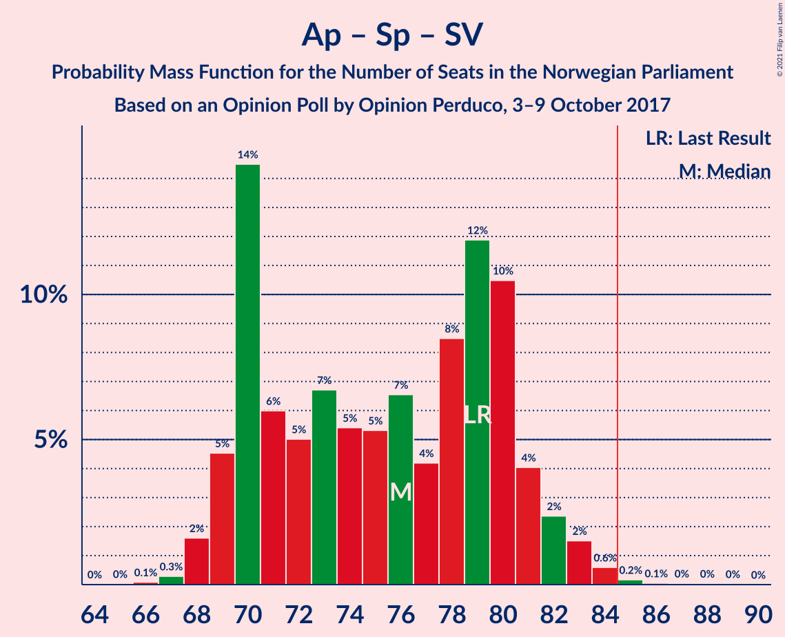

| Number of Seats | Probability | Accumulated | Special Marks |
|:---------------:|:-----------:|:-----------:|:-------------:|
| 65 | 0% | 100% |  |
| 66 | 0.1% | 99.9% |  |
| 67 | 0.3% | 99.9% |  |
| 68 | 2% | 99.6% |  |
| 69 | 5% | 98% |  |
| 70 | 14% | 93% |  |
| 71 | 6% | 79% |  |
| 72 | 5% | 73% |  |
| 73 | 7% | 68% |  |
| 74 | 5% | 61% |  |
| 75 | 5% | 56% | Median |
| 76 | 7% | 50% |  |
| 77 | 4% | 44% |  |
| 78 | 8% | 40% |  |
| 79 | 12% | 31% | Last Result |
| 80 | 10% | 19% |  |
| 81 | 4% | 9% |  |
| 82 | 2% | 5% |  |
| 83 | 2% | 2% |  |
| 84 | 0.6% | 0.9% |  |
| 85 | 0.2% | 0.3% | Majority |
| 86 | 0.1% | 0.2% |  |
| 87 | 0% | 0.1% |  |
| 88 | 0% | 0.1% |  |
| 89 | 0% | 0% |  |

### Høyre – Fremskrittspartiet

| Number of Seats | Probability | Accumulated | Special Marks |
|:---------------:|:-----------:|:-----------:|:-------------:|
| 63 | 0.2% | 100% |  |
| 64 | 0.1% | 99.7% |  |
| 65 | 0.7% | 99.6% |  |
| 66 | 0.7% | 98.9% |  |
| 67 | 2% | 98% |  |
| 68 | 1.4% | 97% |  |
| 69 | 5% | 95% |  |
| 70 | 11% | 90% |  |
| 71 | 8% | 79% |  |
| 72 | 9% | 71% | Last Result |
| 73 | 6% | 62% | Median |
| 74 | 26% | 56% |  |
| 75 | 4% | 30% |  |
| 76 | 7% | 26% |  |
| 77 | 4% | 19% |  |
| 78 | 6% | 14% |  |
| 79 | 2% | 8% |  |
| 80 | 4% | 6% |  |
| 81 | 0.8% | 2% |  |
| 82 | 0.6% | 2% |  |
| 83 | 0.6% | 1.0% |  |
| 84 | 0.3% | 0.4% |  |
| 85 | 0.1% | 0.2% | Majority |
| 86 | 0% | 0.1% |  |
| 87 | 0% | 0% |  |

### Arbeiderpartiet – Senterpartiet – Kristelig Folkeparti

| Number of Seats | Probability | Accumulated | Special Marks |
|:---------------:|:-----------:|:-----------:|:-------------:|
| 59 | 0% | 100% |  |
| 60 | 0.2% | 99.9% |  |
| 61 | 0.5% | 99.8% |  |
| 62 | 0.5% | 99.2% |  |
| 63 | 2% | 98.7% |  |
| 64 | 2% | 97% |  |
| 65 | 1.4% | 95% |  |
| 66 | 9% | 94% |  |
| 67 | 4% | 85% |  |
| 68 | 16% | 81% |  |
| 69 | 11% | 65% |  |
| 70 | 10% | 53% |  |
| 71 | 10% | 43% |  |
| 72 | 3% | 33% | Median |
| 73 | 15% | 30% |  |
| 74 | 4% | 15% |  |
| 75 | 3% | 11% |  |
| 76 | 5% | 8% | Last Result |
| 77 | 1.0% | 3% |  |
| 78 | 0.7% | 2% |  |
| 79 | 0.7% | 2% |  |
| 80 | 0.3% | 0.8% |  |
| 81 | 0.3% | 0.5% |  |
| 82 | 0.1% | 0.2% |  |
| 83 | 0% | 0.1% |  |
| 84 | 0% | 0% |  |

### Arbeiderpartiet – Senterpartiet

| Number of Seats | Probability | Accumulated | Special Marks |
|:---------------:|:-----------:|:-----------:|:-------------:|
| 56 | 0.1% | 100% |  |
| 57 | 0.4% | 99.9% |  |
| 58 | 1.3% | 99.5% |  |
| 59 | 5% | 98% |  |
| 60 | 13% | 94% |  |
| 61 | 5% | 81% |  |
| 62 | 8% | 76% |  |
| 63 | 7% | 67% |  |
| 64 | 11% | 60% |  |
| 65 | 8% | 49% | Median |
| 66 | 7% | 41% |  |
| 67 | 11% | 35% |  |
| 68 | 6% | 23% | Last Result |
| 69 | 3% | 17% |  |
| 70 | 8% | 14% |  |
| 71 | 2% | 6% |  |
| 72 | 1.2% | 4% |  |
| 73 | 3% | 3% |  |
| 74 | 0.2% | 0.5% |  |
| 75 | 0.2% | 0.3% |  |
| 76 | 0.1% | 0.1% |  |
| 77 | 0% | 0% |  |

### Høyre – Kristelig Folkeparti – Venstre

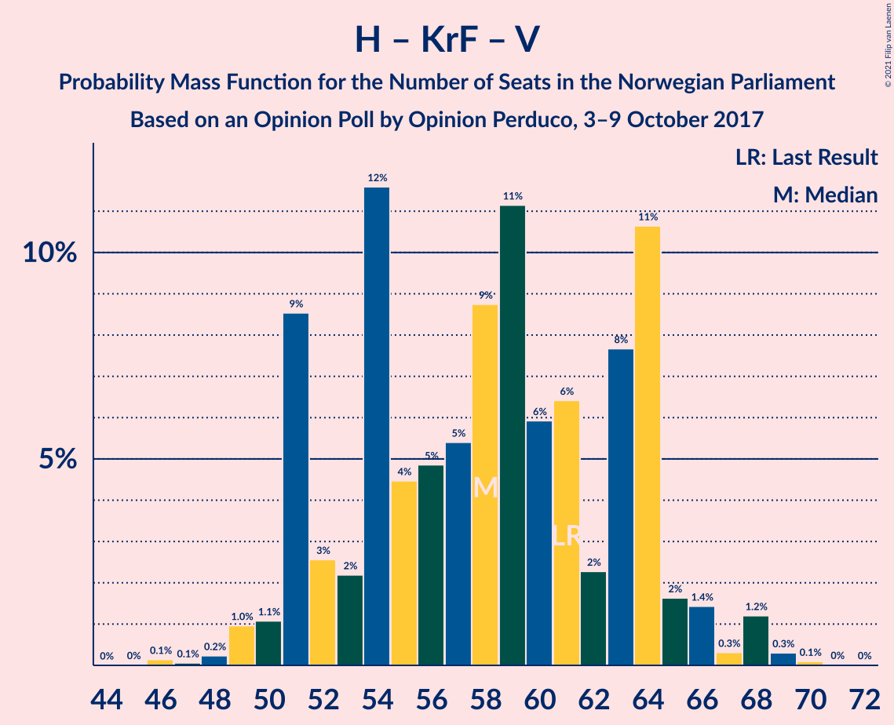

| Number of Seats | Probability | Accumulated | Special Marks |
|:---------------:|:-----------:|:-----------:|:-------------:|
| 46 | 0.1% | 100% |  |
| 47 | 0.1% | 99.8% |  |
| 48 | 0.2% | 99.8% |  |
| 49 | 1.0% | 99.5% |  |
| 50 | 1.1% | 98.6% |  |
| 51 | 9% | 97% |  |
| 52 | 3% | 89% |  |
| 53 | 2% | 86% |  |
| 54 | 12% | 84% |  |
| 55 | 4% | 73% |  |
| 56 | 5% | 68% |  |
| 57 | 5% | 63% |  |
| 58 | 9% | 58% |  |
| 59 | 11% | 49% |  |
| 60 | 6% | 38% |  |
| 61 | 6% | 32% | Last Result, Median |
| 62 | 2% | 26% |  |
| 63 | 8% | 23% |  |
| 64 | 11% | 16% |  |
| 65 | 2% | 5% |  |
| 66 | 1.4% | 3% |  |
| 67 | 0.3% | 2% |  |
| 68 | 1.2% | 2% |  |
| 69 | 0.3% | 0.4% |  |
| 70 | 0.1% | 0.1% |  |
| 71 | 0% | 0% |  |

### Arbeiderpartiet – Sosialistisk Venstreparti

| Number of Seats | Probability | Accumulated | Special Marks |
|:---------------:|:-----------:|:-----------:|:-------------:|
| 47 | 0.1% | 100% |  |
| 48 | 0.2% | 99.9% |  |
| 49 | 0.9% | 99.6% |  |
| 50 | 0.7% | 98.7% |  |
| 51 | 2% | 98% |  |
| 52 | 6% | 96% |  |
| 53 | 14% | 90% |  |
| 54 | 7% | 76% |  |
| 55 | 12% | 68% |  |
| 56 | 9% | 57% | Median |
| 57 | 10% | 48% |  |
| 58 | 8% | 38% |  |
| 59 | 4% | 30% |  |
| 60 | 14% | 25% | Last Result |
| 61 | 3% | 12% |  |
| 62 | 5% | 8% |  |
| 63 | 2% | 4% |  |
| 64 | 1.5% | 2% |  |
| 65 | 0.3% | 0.7% |  |
| 66 | 0.2% | 0.3% |  |
| 67 | 0.1% | 0.2% |  |
| 68 | 0.1% | 0.1% |  |
| 69 | 0% | 0% |  |

### Senterpartiet – Kristelig Folkeparti – Venstre

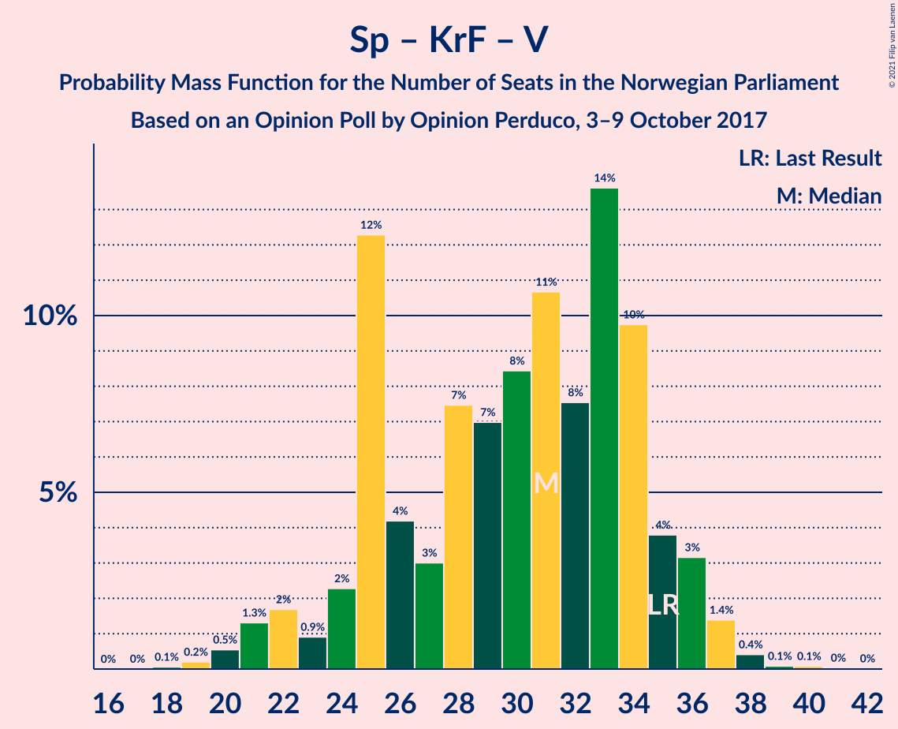

| Number of Seats | Probability | Accumulated | Special Marks |
|:---------------:|:-----------:|:-----------:|:-------------:|
| 18 | 0.1% | 100% |  |
| 19 | 0.2% | 99.9% |  |
| 20 | 0.5% | 99.7% |  |
| 21 | 1.3% | 99.2% |  |
| 22 | 2% | 98% |  |
| 23 | 0.9% | 96% |  |
| 24 | 2% | 95% |  |
| 25 | 12% | 93% |  |
| 26 | 4% | 81% |  |
| 27 | 3% | 76% |  |
| 28 | 7% | 73% |  |
| 29 | 7% | 66% |  |
| 30 | 8% | 59% |  |
| 31 | 11% | 51% |  |
| 32 | 8% | 40% |  |
| 33 | 14% | 32% | Median |
| 34 | 10% | 19% |  |
| 35 | 4% | 9% | Last Result |
| 36 | 3% | 5% |  |
| 37 | 1.4% | 2% |  |
| 38 | 0.4% | 0.6% |  |
| 39 | 0.1% | 0.2% |  |
| 40 | 0.1% | 0.1% |  |
| 41 | 0% | 0.1% |  |
| 42 | 0% | 0% |  |

## Technical Information

### Opinion Poll

+ **Polling firm:** Opinion Perduco
+ **Commissioner(s):** —
+ **Fieldwork period:** 3–9 October 2017

### Calculations

+ **Sample size:** 766
+ **Simulations done:** 1,048,576
+ **Error estimate:** 2.24%

