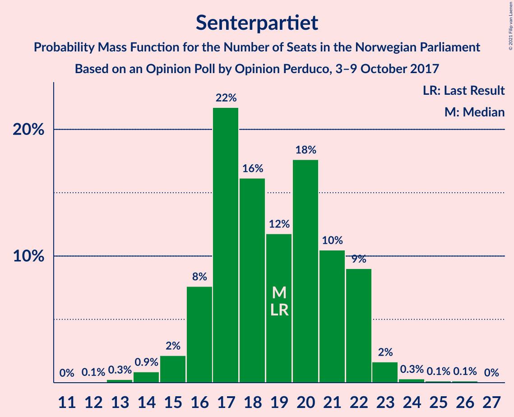
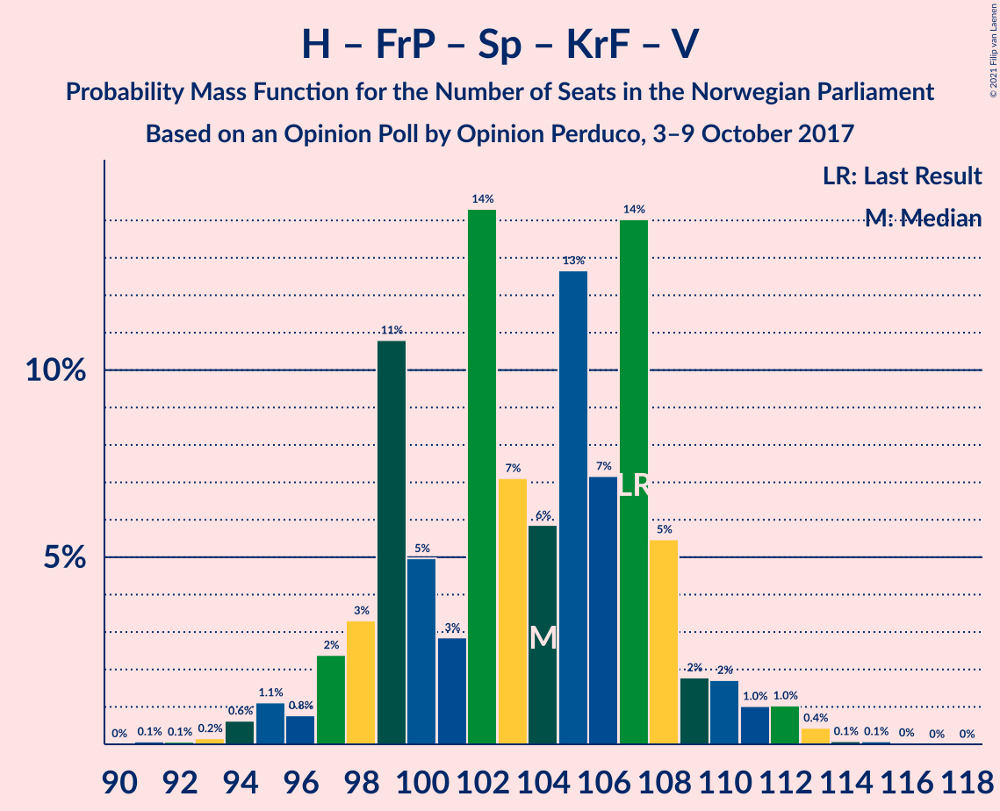
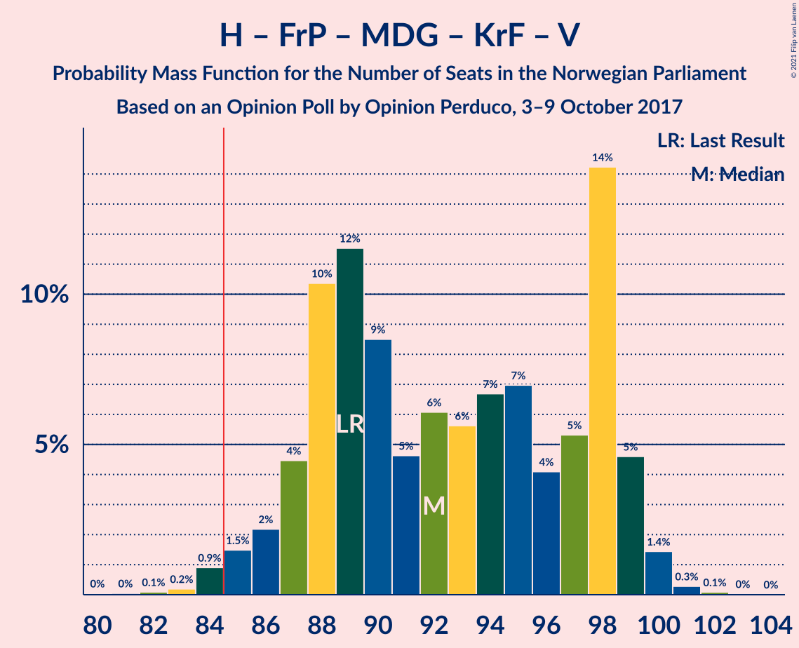
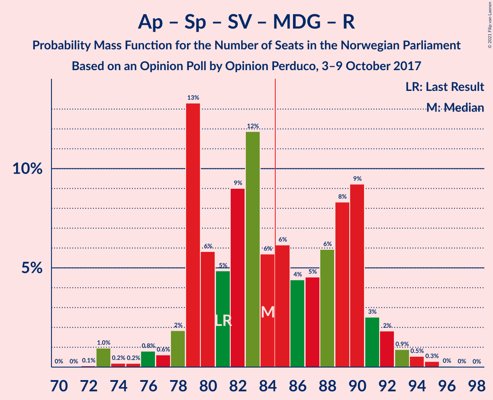
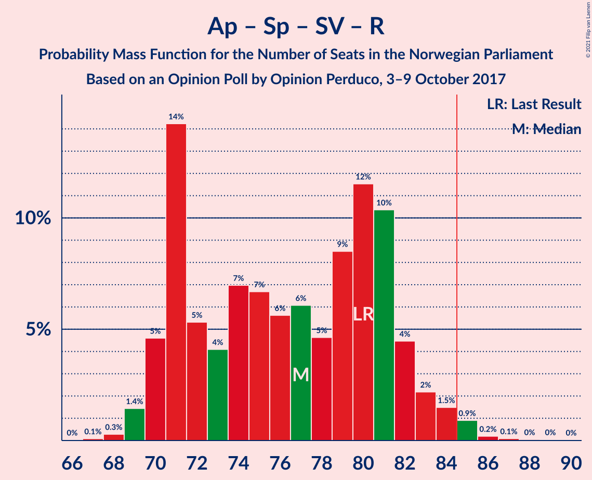

# Opinion Poll by Opinion Perduco, 3–9 October 2017

<a href="#voting-intentions">Voting Intentions</a> | <a href="#seats">Seats</a> | <a href="#coalitions">Coalitions</a> | <a href="#technical-information">Technical Information</a>

## Voting Intentions

### Confidence Intervals

| Party | Last Result | Poll Result | 80% Confidence Interval | 90% Confidence Interval | 95% Confidence Interval | 99% Confidence Interval |
|:-----:|:-----------:|:-----------:|:-----------------------:|:-----------------------:|:-----------------------:|:-----------------------:|
| Høyre | 25.0% | 26.8% | 24.8–28.9% |24.2–29.5% |23.7–30.0% |22.8–31.0% |
| Arbeiderpartiet | 27.4% | 25.8% | 23.9–28.0% |23.3–28.5% |22.9–29.1% |22.0–30.1% |
| Fremskrittspartiet | 15.2% | 14.9% | 13.3–16.6% |12.9–17.1% |12.5–17.6% |11.8–18.5% |
| Senterpartiet | 10.3% | 10.6% | 9.3–12.1% |8.9–12.6% |8.6–13.0% |8.0–13.7% |
| Sosialistisk Venstreparti | 6.0% | 6.0% | 5.0–7.3% |4.8–7.6% |4.5–7.9% |4.1–8.6% |
| Miljøpartiet De Grønne | 3.2% | 4.8% | 4.0–6.0% |3.7–6.3% |3.5–6.6% |3.2–7.2% |
| Venstre | 4.4% | 4.0% | 3.3–5.1% |3.0–5.4% |2.9–5.7% |2.5–6.2% |
| Kristelig Folkeparti | 4.2% | 4.0% | 3.3–5.1% |3.0–5.4% |2.9–5.7% |2.5–6.2% |
| Rødt | 2.4% | 2.2% | 1.7–3.1% |1.5–3.3% |1.4–3.5% |1.2–4.0% |

*Note:* The poll result column reflects the actual value used in the calculations. Published results may vary slightly, and in addition be rounded to fewer digits.

## Seats

### Confidence Intervals

| Party | Last Result | Median | 80% Confidence Interval | 90% Confidence Interval | 95% Confidence Interval | 99% Confidence Interval |
|:-----:|:-----------:|:------:|:-----------------------:|:-----------------------:|:-----------------------:|:-----------------------:|
| <a href="#høyre">Høyre</a> | 45 | 48 | 43–51 |42–52 |42–53 |40–55 |
| <a href="#arbeiderpartiet">Arbeiderpartiet</a> | 49 | 45 | 42–49 |41–51 |41–51 |40–55 |
| <a href="#fremskrittspartiet">Fremskrittspartiet</a> | 27 | 26 | 23–29 |22–30 |22–31 |20–33 |
| <a href="#senterpartiet">Senterpartiet</a> | 19 | 19 | 16–21 |16–22 |15–23 |13–25 |
| <a href="#sosialistisk-venstreparti">Sosialistisk Venstreparti</a> | 11 | 11 | 8–14 |8–14 |8–14 |7–15 |
| <a href="#miljøpartiet-de-grønne">Miljøpartiet De Grønne</a> | 1 | 8 | 7–11 |2–11 |2–12 |2–12 |
| <a href="#venstre">Venstre</a> | 8 | 3 | 2–9 |2–9 |2–10 |2–11 |
| <a href="#kristelig-folkeparti">Kristelig Folkeparti</a> | 8 | 8 | 2–10 |1–10 |1–11 |1–12 |
| <a href="#rødt">Rødt</a> | 1 | 1 | 1–2 |1–2 |0–2 |0–2 |

### Høyre

*For a full overview of the results for this party, see the [Høyre](party-høyre.html) page.*

| Number of Seats | Probability | Accumulated | Special Marks |
|:---------------:|:-----------:|:-----------:|:-------------:|
| 38 | 0% | 100% |  |
| 39 | 0.1% | 99.9% |  |
| 40 | 0.3% | 99.8% |  |
| 41 | 0.9% | 99.5% |  |
| 42 | 7% | 98.6% |  |
| 43 | 11% | 91% |  |
| 44 | 5% | 80% |  |
| 45 | 11% | 75% | Last Result |
| 46 | 2% | 64% |  |
| 47 | 5% | 62% |  |
| 48 | 13% | 57% | Median |
| 49 | 15% | 44% |  |
| 50 | 8% | 29% |  |
| 51 | 11% | 20% |  |
| 52 | 5% | 9% |  |
| 53 | 3% | 4% |  |
| 54 | 0.2% | 0.8% |  |
| 55 | 0.2% | 0.6% |  |
| 56 | 0.2% | 0.4% |  |
| 57 | 0.1% | 0.2% |  |
| 58 | 0.1% | 0.1% |  |
| 59 | 0% | 0% |  |

### Arbeiderpartiet

*For a full overview of the results for this party, see the [Arbeiderpartiet](party-arbeiderpartiet.html) page.*

| Number of Seats | Probability | Accumulated | Special Marks |
|:---------------:|:-----------:|:-----------:|:-------------:|
| 38 | 0% | 100% |  |
| 39 | 0.4% | 99.9% |  |
| 40 | 0.8% | 99.5% |  |
| 41 | 7% | 98.7% |  |
| 42 | 15% | 92% |  |
| 43 | 10% | 77% |  |
| 44 | 13% | 67% |  |
| 45 | 13% | 55% | Median |
| 46 | 4% | 42% |  |
| 47 | 17% | 37% |  |
| 48 | 4% | 20% |  |
| 49 | 8% | 16% | Last Result |
| 50 | 1.1% | 8% |  |
| 51 | 5% | 7% |  |
| 52 | 0.6% | 2% |  |
| 53 | 0.3% | 1.5% |  |
| 54 | 0.6% | 1.2% |  |
| 55 | 0.5% | 0.5% |  |
| 56 | 0% | 0.1% |  |
| 57 | 0% | 0.1% |  |
| 58 | 0% | 0% |  |

### Fremskrittspartiet

*For a full overview of the results for this party, see the [Fremskrittspartiet](party-fremskrittspartiet.html) page.*

| Number of Seats | Probability | Accumulated | Special Marks |
|:---------------:|:-----------:|:-----------:|:-------------:|
| 18 | 0.1% | 100% |  |
| 19 | 0.1% | 99.9% |  |
| 20 | 2% | 99.8% |  |
| 21 | 0.5% | 98% |  |
| 22 | 3% | 98% |  |
| 23 | 8% | 94% |  |
| 24 | 7% | 86% |  |
| 25 | 14% | 79% |  |
| 26 | 20% | 65% | Median |
| 27 | 13% | 45% | Last Result |
| 28 | 17% | 32% |  |
| 29 | 8% | 15% |  |
| 30 | 4% | 7% |  |
| 31 | 1.4% | 3% |  |
| 32 | 1.0% | 2% |  |
| 33 | 0.8% | 0.9% |  |
| 34 | 0.1% | 0.1% |  |
| 35 | 0% | 0% |  |

### Senterpartiet

*For a full overview of the results for this party, see the [Senterpartiet](party-senterpartiet.html) page.*

| Number of Seats | Probability | Accumulated | Special Marks |
|:---------------:|:-----------:|:-----------:|:-------------:|
| 12 | 0.1% | 100% |  |
| 13 | 1.0% | 99.9% |  |
| 14 | 1.1% | 98.9% |  |
| 15 | 2% | 98% |  |
| 16 | 10% | 96% |  |
| 17 | 4% | 85% |  |
| 18 | 30% | 81% |  |
| 19 | 33% | 51% | Last Result, Median |
| 20 | 7% | 17% |  |
| 21 | 2% | 11% |  |
| 22 | 5% | 9% |  |
| 23 | 3% | 4% |  |
| 24 | 0.4% | 1.1% |  |
| 25 | 0.6% | 0.7% |  |
| 26 | 0% | 0.1% |  |
| 27 | 0% | 0% |  |

### Sosialistisk Venstreparti

*For a full overview of the results for this party, see the [Sosialistisk Venstreparti](party-sosialistiskvenstreparti.html) page.*

| Number of Seats | Probability | Accumulated | Special Marks |
|:---------------:|:-----------:|:-----------:|:-------------:|
| 1 | 0.1% | 100% |  |
| 2 | 0% | 99.9% |  |
| 3 | 0% | 99.9% |  |
| 4 | 0% | 99.9% |  |
| 5 | 0% | 99.9% |  |
| 6 | 0% | 99.9% |  |
| 7 | 0.8% | 99.9% |  |
| 8 | 11% | 99.1% |  |
| 9 | 14% | 88% |  |
| 10 | 14% | 74% |  |
| 11 | 36% | 60% | Last Result, Median |
| 12 | 9% | 24% |  |
| 13 | 3% | 15% |  |
| 14 | 11% | 12% |  |
| 15 | 1.0% | 1.2% |  |
| 16 | 0.2% | 0.2% |  |
| 17 | 0% | 0% |  |

### Miljøpartiet De Grønne

*For a full overview of the results for this party, see the [Miljøpartiet De Grønne](party-miljøpartietdegrønne.html) page.*

| Number of Seats | Probability | Accumulated | Special Marks |
|:---------------:|:-----------:|:-----------:|:-------------:|
| 1 | 0.5% | 100% | Last Result |
| 2 | 5% | 99.5% |  |
| 3 | 0.5% | 94% |  |
| 4 | 0% | 94% |  |
| 5 | 0% | 94% |  |
| 6 | 0% | 94% |  |
| 7 | 8% | 94% |  |
| 8 | 37% | 85% | Median |
| 9 | 14% | 48% |  |
| 10 | 16% | 34% |  |
| 11 | 15% | 18% |  |
| 12 | 2% | 3% |  |
| 13 | 0.2% | 0.5% |  |
| 14 | 0.3% | 0.3% |  |
| 15 | 0% | 0% |  |

### Venstre

*For a full overview of the results for this party, see the [Venstre](party-venstre.html) page.*

| Number of Seats | Probability | Accumulated | Special Marks |
|:---------------:|:-----------:|:-----------:|:-------------:|
| 1 | 0.3% | 100% |  |
| 2 | 49% | 99.7% |  |
| 3 | 10% | 51% | Median |
| 4 | 0% | 41% |  |
| 5 | 0% | 41% |  |
| 6 | 0.2% | 41% |  |
| 7 | 17% | 41% |  |
| 8 | 10% | 24% | Last Result |
| 9 | 9% | 14% |  |
| 10 | 4% | 4% |  |
| 11 | 0.7% | 0.7% |  |
| 12 | 0% | 0.1% |  |
| 13 | 0% | 0% |  |

### Kristelig Folkeparti

*For a full overview of the results for this party, see the [Kristelig Folkeparti](party-kristeligfolkeparti.html) page.*

| Number of Seats | Probability | Accumulated | Special Marks |
|:---------------:|:-----------:|:-----------:|:-------------:|
| 0 | 0.2% | 100% |  |
| 1 | 9% | 99.8% |  |
| 2 | 3% | 91% |  |
| 3 | 21% | 88% |  |
| 4 | 0% | 67% |  |
| 5 | 0% | 67% |  |
| 6 | 0% | 67% |  |
| 7 | 6% | 67% |  |
| 8 | 21% | 60% | Last Result, Median |
| 9 | 22% | 39% |  |
| 10 | 14% | 17% |  |
| 11 | 0.8% | 3% |  |
| 12 | 2% | 2% |  |
| 13 | 0.1% | 0.1% |  |
| 14 | 0% | 0% |  |

### Rødt

*For a full overview of the results for this party, see the [Rødt](party-rødt.html) page.*

| Number of Seats | Probability | Accumulated | Special Marks |
|:---------------:|:-----------:|:-----------:|:-------------:|
| 0 | 3% | 100% |  |
| 1 | 85% | 97% | Last Result, Median |
| 2 | 12% | 12% |  |
| 3 | 0% | 0.3% |  |
| 4 | 0% | 0.3% |  |
| 5 | 0% | 0.3% |  |
| 6 | 0% | 0.3% |  |
| 7 | 0.2% | 0.3% |  |
| 8 | 0% | 0.1% |  |
| 9 | 0% | 0% |  |

## Coalitions

### Confidence Intervals

| Coalition | Last Result | Median | Majority? | 80% Confidence Interval | 90% Confidence Interval | 95% Confidence Interval | 99% Confidence Interval |
|:---------:|:-----------:|:------:|:---------:|:-----------------------:|:-----------------------:|:-----------------------:|:-----------------------:|
| Høyre – Fremskrittspartiet – Senterpartiet – Kristelig Folkeparti – Venstre | 107 | 104 | 100% | 99–107 | 97–108 | 97–110 | 94–115 |
| Høyre – Fremskrittspartiet – Miljøpartiet De Grønne – Kristelig Folkeparti – Venstre | 89 | 94 | 97% | 88–98 | 86–98 | 84–99 | 83–100 |
| Arbeiderpartiet – Senterpartiet – Sosialistisk Venstreparti – Miljøpartiet De Grønne – Kristelig Folkeparti | 88 | 90 | 86% | 83–94 | 82–95 | 81–97 | 79–98 |
| Arbeiderpartiet – Senterpartiet – Sosialistisk Venstreparti – Miljøpartiet De Grønne – Rødt | 81 | 83 | 41% | 80–89 | 80–92 | 76–94 | 76–95 |
| Arbeiderpartiet – Senterpartiet – Sosialistisk Venstreparti – Miljøpartiet De Grønne | 80 | 82 | 32% | 79–88 | 78–90 | 75–93 | 74–93 |
| Høyre – Fremskrittspartiet – Kristelig Folkeparti – Venstre | 88 | 86 | 59% | 80–89 | 77–89 | 75–93 | 74–93 |
| Arbeiderpartiet – Senterpartiet – Miljøpartiet De Grønne – Kristelig Folkeparti | 77 | 79 | 6% | 74–84 | 73–85 | 72–87 | 69–87 |
| Høyre – Fremskrittspartiet – Venstre | 80 | 78 | 10% | 74–84 | 73–86 | 71–86 | 70–89 |
| Arbeiderpartiet – Senterpartiet – Sosialistisk Venstreparti – Rødt | 80 | 75 | 3% | 71–81 | 71–83 | 70–85 | 69–86 |
| Arbeiderpartiet – Senterpartiet – Sosialistisk Venstreparti | 79 | 74 | 0.8% | 70–80 | 70–82 | 69–84 | 67–85 |
| Høyre – Fremskrittspartiet | 72 | 74 | 0.1% | 68–78 | 67–79 | 66–82 | 65–82 |
| Arbeiderpartiet – Senterpartiet – Kristelig Folkeparti | 76 | 70 | 0% | 67–74 | 66–76 | 64–79 | 61–79 |
| Arbeiderpartiet – Senterpartiet | 68 | 64 | 0% | 60–68 | 59–71 | 59–73 | 57–75 |
| Høyre – Kristelig Folkeparti – Venstre | 61 | 59 | 0% | 53–63 | 51–64 | 51–64 | 48–67 |
| Arbeiderpartiet – Sosialistisk Venstreparti | 60 | 55 | 0% | 52–61 | 52–62 | 51–63 | 49–66 |
| Senterpartiet – Kristelig Folkeparti – Venstre | 35 | 30 | 0% | 25–34 | 25–35 | 22–35 | 21–37 |

### Høyre – Fremskrittspartiet – Senterpartiet – Kristelig Folkeparti – Venstre

| Number of Seats | Probability | Accumulated | Special Marks |
|:---------------:|:-----------:|:-----------:|:-------------:|
| 91 | 0% | 100% |  |
| 92 | 0% | 99.9% |  |
| 93 | 0.4% | 99.9% |  |
| 94 | 0.2% | 99.5% |  |
| 95 | 0.6% | 99.3% |  |
| 96 | 0.5% | 98.7% |  |
| 97 | 6% | 98% |  |
| 98 | 1.4% | 92% |  |
| 99 | 9% | 91% |  |
| 100 | 6% | 82% |  |
| 101 | 6% | 76% |  |
| 102 | 8% | 69% |  |
| 103 | 6% | 62% |  |
| 104 | 15% | 56% | Median |
| 105 | 16% | 41% |  |
| 106 | 2% | 25% |  |
| 107 | 13% | 23% | Last Result |
| 108 | 5% | 10% |  |
| 109 | 0.6% | 5% |  |
| 110 | 2% | 4% |  |
| 111 | 0.8% | 2% |  |
| 112 | 0.3% | 1.2% |  |
| 113 | 0.1% | 0.8% |  |
| 114 | 0.2% | 0.7% |  |
| 115 | 0.5% | 0.6% |  |
| 116 | 0% | 0% |  |

### Høyre – Fremskrittspartiet – Miljøpartiet De Grønne – Kristelig Folkeparti – Venstre

| Number of Seats | Probability | Accumulated | Special Marks |
|:---------------:|:-----------:|:-----------:|:-------------:|
| 81 | 0% | 100% |  |
| 82 | 0.3% | 99.9% |  |
| 83 | 0.4% | 99.7% |  |
| 84 | 3% | 99.3% |  |
| 85 | 1.3% | 97% | Majority |
| 86 | 2% | 95% |  |
| 87 | 1.1% | 93% |  |
| 88 | 10% | 92% |  |
| 89 | 3% | 82% | Last Result |
| 90 | 6% | 79% |  |
| 91 | 5% | 73% |  |
| 92 | 0.8% | 68% |  |
| 93 | 7% | 68% | Median |
| 94 | 15% | 61% |  |
| 95 | 6% | 46% |  |
| 96 | 9% | 39% |  |
| 97 | 19% | 30% |  |
| 98 | 9% | 12% |  |
| 99 | 2% | 3% |  |
| 100 | 0.4% | 0.8% |  |
| 101 | 0.3% | 0.5% |  |
| 102 | 0.1% | 0.1% |  |
| 103 | 0% | 0.1% |  |
| 104 | 0% | 0% |  |

### Arbeiderpartiet – Senterpartiet – Sosialistisk Venstreparti – Miljøpartiet De Grønne – Kristelig Folkeparti

| Number of Seats | Probability | Accumulated | Special Marks |
|:---------------:|:-----------:|:-----------:|:-------------:|
| 77 | 0.3% | 100% |  |
| 78 | 0% | 99.6% |  |
| 79 | 0.3% | 99.6% |  |
| 80 | 0.2% | 99.2% |  |
| 81 | 2% | 99.0% |  |
| 82 | 5% | 97% |  |
| 83 | 3% | 92% |  |
| 84 | 2% | 89% |  |
| 85 | 0.9% | 86% | Majority |
| 86 | 1.3% | 86% |  |
| 87 | 3% | 84% |  |
| 88 | 10% | 82% | Last Result |
| 89 | 11% | 72% |  |
| 90 | 15% | 61% |  |
| 91 | 17% | 46% | Median |
| 92 | 9% | 29% |  |
| 93 | 5% | 20% |  |
| 94 | 7% | 15% |  |
| 95 | 4% | 9% |  |
| 96 | 0.3% | 4% |  |
| 97 | 3% | 4% |  |
| 98 | 0.2% | 0.6% |  |
| 99 | 0.3% | 0.4% |  |
| 100 | 0% | 0.1% |  |
| 101 | 0% | 0% |  |

### Arbeiderpartiet – Senterpartiet – Sosialistisk Venstreparti – Miljøpartiet De Grønne – Rødt

| Number of Seats | Probability | Accumulated | Special Marks |
|:---------------:|:-----------:|:-----------:|:-------------:|
| 71 | 0.1% | 100% |  |
| 72 | 0.1% | 99.9% |  |
| 73 | 0% | 99.8% |  |
| 74 | 0.1% | 99.8% |  |
| 75 | 0% | 99.8% |  |
| 76 | 3% | 99.7% |  |
| 77 | 0.6% | 97% |  |
| 78 | 0.5% | 97% |  |
| 79 | 0.8% | 96% |  |
| 80 | 18% | 95% |  |
| 81 | 4% | 78% | Last Result |
| 82 | 8% | 74% |  |
| 83 | 21% | 65% |  |
| 84 | 3% | 44% | Median |
| 85 | 7% | 41% | Majority |
| 86 | 4% | 34% |  |
| 87 | 7% | 30% |  |
| 88 | 5% | 23% |  |
| 89 | 9% | 18% |  |
| 90 | 1.3% | 8% |  |
| 91 | 2% | 7% |  |
| 92 | 1.4% | 5% |  |
| 93 | 0.4% | 4% |  |
| 94 | 3% | 3% |  |
| 95 | 0.3% | 0.5% |  |
| 96 | 0.1% | 0.2% |  |
| 97 | 0.1% | 0.1% |  |
| 98 | 0% | 0% |  |

### Arbeiderpartiet – Senterpartiet – Sosialistisk Venstreparti – Miljøpartiet De Grønne

| Number of Seats | Probability | Accumulated | Special Marks |
|:---------------:|:-----------:|:-----------:|:-------------:|
| 70 | 0.1% | 100% |  |
| 71 | 0.1% | 99.9% |  |
| 72 | 0% | 99.8% |  |
| 73 | 0.1% | 99.8% |  |
| 74 | 2% | 99.7% |  |
| 75 | 1.1% | 98% |  |
| 76 | 0.8% | 97% |  |
| 77 | 0.4% | 96% |  |
| 78 | 3% | 96% |  |
| 79 | 16% | 93% |  |
| 80 | 4% | 77% | Last Result |
| 81 | 11% | 73% |  |
| 82 | 19% | 63% |  |
| 83 | 3% | 44% | Median |
| 84 | 9% | 41% |  |
| 85 | 3% | 32% | Majority |
| 86 | 8% | 30% |  |
| 87 | 3% | 22% |  |
| 88 | 11% | 18% |  |
| 89 | 2% | 8% |  |
| 90 | 1.0% | 6% |  |
| 91 | 0.5% | 5% |  |
| 92 | 1.3% | 4% |  |
| 93 | 3% | 3% |  |
| 94 | 0.1% | 0.3% |  |
| 95 | 0% | 0.1% |  |
| 96 | 0.1% | 0.1% |  |
| 97 | 0% | 0% |  |

### Høyre – Fremskrittspartiet – Kristelig Folkeparti – Venstre

| Number of Seats | Probability | Accumulated | Special Marks |
|:---------------:|:-----------:|:-----------:|:-------------:|
| 72 | 0.1% | 100% |  |
| 73 | 0.1% | 99.9% |  |
| 74 | 0.3% | 99.8% |  |
| 75 | 3% | 99.5% |  |
| 76 | 0.4% | 97% |  |
| 77 | 1.4% | 96% |  |
| 78 | 2% | 95% |  |
| 79 | 1.3% | 93% |  |
| 80 | 9% | 92% |  |
| 81 | 5% | 82% |  |
| 82 | 7% | 77% |  |
| 83 | 4% | 70% |  |
| 84 | 7% | 66% |  |
| 85 | 3% | 59% | Median, Majority |
| 86 | 21% | 56% |  |
| 87 | 8% | 35% |  |
| 88 | 4% | 26% | Last Result |
| 89 | 18% | 22% |  |
| 90 | 0.8% | 5% |  |
| 91 | 0.5% | 4% |  |
| 92 | 0.6% | 3% |  |
| 93 | 3% | 3% |  |
| 94 | 0% | 0.3% |  |
| 95 | 0.1% | 0.2% |  |
| 96 | 0% | 0.2% |  |
| 97 | 0.1% | 0.2% |  |
| 98 | 0.1% | 0.1% |  |
| 99 | 0% | 0% |  |

### Arbeiderpartiet – Senterpartiet – Miljøpartiet De Grønne – Kristelig Folkeparti

| Number of Seats | Probability | Accumulated | Special Marks |
|:---------------:|:-----------:|:-----------:|:-------------:|
| 66 | 0.1% | 100% |  |
| 67 | 0.1% | 99.9% |  |
| 68 | 0.3% | 99.8% |  |
| 69 | 0.4% | 99.5% |  |
| 70 | 0.5% | 99.1% |  |
| 71 | 0.7% | 98.7% |  |
| 72 | 3% | 98% |  |
| 73 | 2% | 95% |  |
| 74 | 6% | 94% |  |
| 75 | 3% | 87% |  |
| 76 | 4% | 84% |  |
| 77 | 16% | 80% | Last Result |
| 78 | 6% | 65% |  |
| 79 | 16% | 58% |  |
| 80 | 8% | 43% | Median |
| 81 | 9% | 34% |  |
| 82 | 9% | 25% |  |
| 83 | 5% | 16% |  |
| 84 | 5% | 11% |  |
| 85 | 2% | 6% | Majority |
| 86 | 0.6% | 3% |  |
| 87 | 3% | 3% |  |
| 88 | 0.2% | 0.3% |  |
| 89 | 0.1% | 0.1% |  |
| 90 | 0% | 0% |  |

### Høyre – Fremskrittspartiet – Venstre

| Number of Seats | Probability | Accumulated | Special Marks |
|:---------------:|:-----------:|:-----------:|:-------------:|
| 68 | 0% | 100% |  |
| 69 | 0.4% | 99.9% |  |
| 70 | 1.0% | 99.6% |  |
| 71 | 2% | 98.5% |  |
| 72 | 0.7% | 96% |  |
| 73 | 4% | 95% |  |
| 74 | 7% | 91% |  |
| 75 | 4% | 84% |  |
| 76 | 11% | 80% |  |
| 77 | 14% | 69% | Median |
| 78 | 15% | 54% |  |
| 79 | 11% | 39% |  |
| 80 | 10% | 28% | Last Result |
| 81 | 2% | 18% |  |
| 82 | 1.0% | 15% |  |
| 83 | 0.8% | 14% |  |
| 84 | 4% | 13% |  |
| 85 | 2% | 10% | Majority |
| 86 | 7% | 8% |  |
| 87 | 0.2% | 1.1% |  |
| 88 | 0.3% | 0.9% |  |
| 89 | 0.2% | 0.6% |  |
| 90 | 0% | 0.4% |  |
| 91 | 0.3% | 0.4% |  |
| 92 | 0% | 0% |  |

### Arbeiderpartiet – Senterpartiet – Sosialistisk Venstreparti – Rødt

| Number of Seats | Probability | Accumulated | Special Marks |
|:---------------:|:-----------:|:-----------:|:-------------:|
| 66 | 0% | 100% |  |
| 67 | 0.1% | 99.9% |  |
| 68 | 0.3% | 99.9% |  |
| 69 | 0.4% | 99.5% |  |
| 70 | 2% | 99.2% |  |
| 71 | 9% | 97% |  |
| 72 | 19% | 88% |  |
| 73 | 9% | 70% |  |
| 74 | 6% | 61% |  |
| 75 | 15% | 54% |  |
| 76 | 7% | 39% | Median |
| 77 | 0.8% | 32% |  |
| 78 | 5% | 32% |  |
| 79 | 6% | 27% |  |
| 80 | 3% | 21% | Last Result |
| 81 | 10% | 18% |  |
| 82 | 1.1% | 8% |  |
| 83 | 2% | 7% |  |
| 84 | 1.3% | 5% |  |
| 85 | 3% | 3% | Majority |
| 86 | 0.4% | 0.7% |  |
| 87 | 0.3% | 0.3% |  |
| 88 | 0% | 0.1% |  |
| 89 | 0% | 0% |  |

### Arbeiderpartiet – Senterpartiet – Sosialistisk Venstreparti

| Number of Seats | Probability | Accumulated | Special Marks |
|:---------------:|:-----------:|:-----------:|:-------------:|
| 65 | 0% | 100% |  |
| 66 | 0.1% | 99.9% |  |
| 67 | 0.4% | 99.9% |  |
| 68 | 0.5% | 99.5% |  |
| 69 | 2% | 99.0% |  |
| 70 | 9% | 97% |  |
| 71 | 19% | 88% |  |
| 72 | 12% | 68% |  |
| 73 | 4% | 57% |  |
| 74 | 15% | 53% |  |
| 75 | 6% | 38% | Median |
| 76 | 2% | 33% |  |
| 77 | 4% | 30% |  |
| 78 | 6% | 26% |  |
| 79 | 2% | 21% | Last Result |
| 80 | 11% | 19% |  |
| 81 | 2% | 8% |  |
| 82 | 2% | 6% |  |
| 83 | 1.0% | 4% |  |
| 84 | 3% | 3% |  |
| 85 | 0.7% | 0.8% | Majority |
| 86 | 0.1% | 0.1% |  |
| 87 | 0% | 0% |  |

### Høyre – Fremskrittspartiet

| Number of Seats | Probability | Accumulated | Special Marks |
|:---------------:|:-----------:|:-----------:|:-------------:|
| 62 | 0% | 100% |  |
| 63 | 0.1% | 99.9% |  |
| 64 | 0.2% | 99.9% |  |
| 65 | 0.2% | 99.6% |  |
| 66 | 3% | 99.5% |  |
| 67 | 3% | 97% |  |
| 68 | 4% | 93% |  |
| 69 | 5% | 89% |  |
| 70 | 3% | 84% |  |
| 71 | 13% | 81% |  |
| 72 | 6% | 68% | Last Result |
| 73 | 3% | 63% |  |
| 74 | 20% | 60% | Median |
| 75 | 8% | 40% |  |
| 76 | 9% | 32% |  |
| 77 | 9% | 23% |  |
| 78 | 9% | 14% |  |
| 79 | 2% | 6% |  |
| 80 | 0.5% | 4% |  |
| 81 | 0.3% | 3% |  |
| 82 | 2% | 3% |  |
| 83 | 0.2% | 0.3% |  |
| 84 | 0.1% | 0.1% |  |
| 85 | 0.1% | 0.1% | Majority |
| 86 | 0% | 0% |  |

### Arbeiderpartiet – Senterpartiet – Kristelig Folkeparti

| Number of Seats | Probability | Accumulated | Special Marks |
|:---------------:|:-----------:|:-----------:|:-------------:|
| 60 | 0.2% | 100% |  |
| 61 | 0.6% | 99.8% |  |
| 62 | 0.1% | 99.2% |  |
| 63 | 0.8% | 99.0% |  |
| 64 | 1.2% | 98% |  |
| 65 | 2% | 97% |  |
| 66 | 5% | 95% |  |
| 67 | 5% | 90% |  |
| 68 | 17% | 85% |  |
| 69 | 12% | 67% |  |
| 70 | 12% | 56% |  |
| 71 | 8% | 43% |  |
| 72 | 5% | 36% | Median |
| 73 | 11% | 30% |  |
| 74 | 9% | 19% |  |
| 75 | 2% | 10% |  |
| 76 | 4% | 8% | Last Result |
| 77 | 0.5% | 4% |  |
| 78 | 0.8% | 4% |  |
| 79 | 3% | 3% |  |
| 80 | 0.1% | 0.2% |  |
| 81 | 0% | 0.1% |  |
| 82 | 0% | 0.1% |  |
| 83 | 0% | 0% |  |

### Arbeiderpartiet – Senterpartiet

| Number of Seats | Probability | Accumulated | Special Marks |
|:---------------:|:-----------:|:-----------:|:-------------:|
| 55 | 0% | 100% |  |
| 56 | 0.1% | 99.9% |  |
| 57 | 2% | 99.9% |  |
| 58 | 0.7% | 98% |  |
| 59 | 7% | 98% |  |
| 60 | 16% | 91% |  |
| 61 | 10% | 75% |  |
| 62 | 2% | 65% |  |
| 63 | 12% | 63% |  |
| 64 | 9% | 51% | Median |
| 65 | 10% | 42% |  |
| 66 | 14% | 32% |  |
| 67 | 6% | 18% |  |
| 68 | 3% | 12% | Last Result |
| 69 | 1.0% | 9% |  |
| 70 | 2% | 8% |  |
| 71 | 1.5% | 6% |  |
| 72 | 0.7% | 4% |  |
| 73 | 3% | 4% |  |
| 74 | 0% | 0.7% |  |
| 75 | 0.6% | 0.7% |  |
| 76 | 0% | 0.1% |  |
| 77 | 0% | 0% |  |

### Høyre – Kristelig Folkeparti – Venstre

| Number of Seats | Probability | Accumulated | Special Marks |
|:---------------:|:-----------:|:-----------:|:-------------:|
| 45 | 0.1% | 100% |  |
| 46 | 0.2% | 99.9% |  |
| 47 | 0.1% | 99.7% |  |
| 48 | 0.3% | 99.6% |  |
| 49 | 1.0% | 99.3% |  |
| 50 | 0.6% | 98% |  |
| 51 | 4% | 98% |  |
| 52 | 2% | 94% |  |
| 53 | 4% | 92% |  |
| 54 | 9% | 88% |  |
| 55 | 3% | 79% |  |
| 56 | 2% | 76% |  |
| 57 | 6% | 74% |  |
| 58 | 8% | 68% |  |
| 59 | 17% | 60% | Median |
| 60 | 9% | 43% |  |
| 61 | 12% | 34% | Last Result |
| 62 | 1.2% | 22% |  |
| 63 | 11% | 21% |  |
| 64 | 8% | 10% |  |
| 65 | 0.3% | 1.5% |  |
| 66 | 0.5% | 1.2% |  |
| 67 | 0.2% | 0.6% |  |
| 68 | 0.2% | 0.4% |  |
| 69 | 0% | 0.2% |  |
| 70 | 0.1% | 0.2% |  |
| 71 | 0.1% | 0.1% |  |
| 72 | 0% | 0% |  |

### Arbeiderpartiet – Sosialistisk Venstreparti

| Number of Seats | Probability | Accumulated | Special Marks |
|:---------------:|:-----------:|:-----------:|:-------------:|
| 46 | 0% | 100% |  |
| 47 | 0.1% | 99.9% |  |
| 48 | 0.1% | 99.9% |  |
| 49 | 0.4% | 99.8% |  |
| 50 | 0.9% | 99.4% |  |
| 51 | 1.1% | 98.5% |  |
| 52 | 10% | 97% |  |
| 53 | 23% | 87% |  |
| 54 | 6% | 64% |  |
| 55 | 12% | 58% |  |
| 56 | 6% | 47% | Median |
| 57 | 7% | 41% |  |
| 58 | 8% | 34% |  |
| 59 | 7% | 26% |  |
| 60 | 3% | 19% | Last Result |
| 61 | 8% | 15% |  |
| 62 | 4% | 7% |  |
| 63 | 1.2% | 3% |  |
| 64 | 0.9% | 1.5% |  |
| 65 | 0.1% | 0.6% |  |
| 66 | 0.5% | 0.6% |  |
| 67 | 0.1% | 0.1% |  |
| 68 | 0% | 0% |  |

### Senterpartiet – Kristelig Folkeparti – Venstre

| Number of Seats | Probability | Accumulated | Special Marks |
|:---------------:|:-----------:|:-----------:|:-------------:|
| 19 | 0.1% | 100% |  |
| 20 | 0.1% | 99.9% |  |
| 21 | 2% | 99.8% |  |
| 22 | 0.9% | 98% |  |
| 23 | 0.5% | 97% |  |
| 24 | 0.9% | 97% |  |
| 25 | 13% | 96% |  |
| 26 | 3% | 83% |  |
| 27 | 4% | 80% |  |
| 28 | 13% | 76% |  |
| 29 | 9% | 62% |  |
| 30 | 9% | 54% | Median |
| 31 | 15% | 44% |  |
| 32 | 4% | 29% |  |
| 33 | 2% | 25% |  |
| 34 | 15% | 23% |  |
| 35 | 6% | 8% | Last Result |
| 36 | 1.4% | 2% |  |
| 37 | 0.4% | 0.9% |  |
| 38 | 0.2% | 0.5% |  |
| 39 | 0.1% | 0.3% |  |
| 40 | 0.2% | 0.3% |  |
| 41 | 0% | 0.1% |  |
| 42 | 0% | 0% |  |

## Technical Information

### Opinion Poll

+ **Polling firm:** Opinion Perduco
+ **Commissioner(s):** —
+ **Fieldwork period:** 3–9 October 2017

### Calculations

+ **Sample size:** 766
+ **Simulations done:** 131,072
+ **Error estimate:** 2.47%

