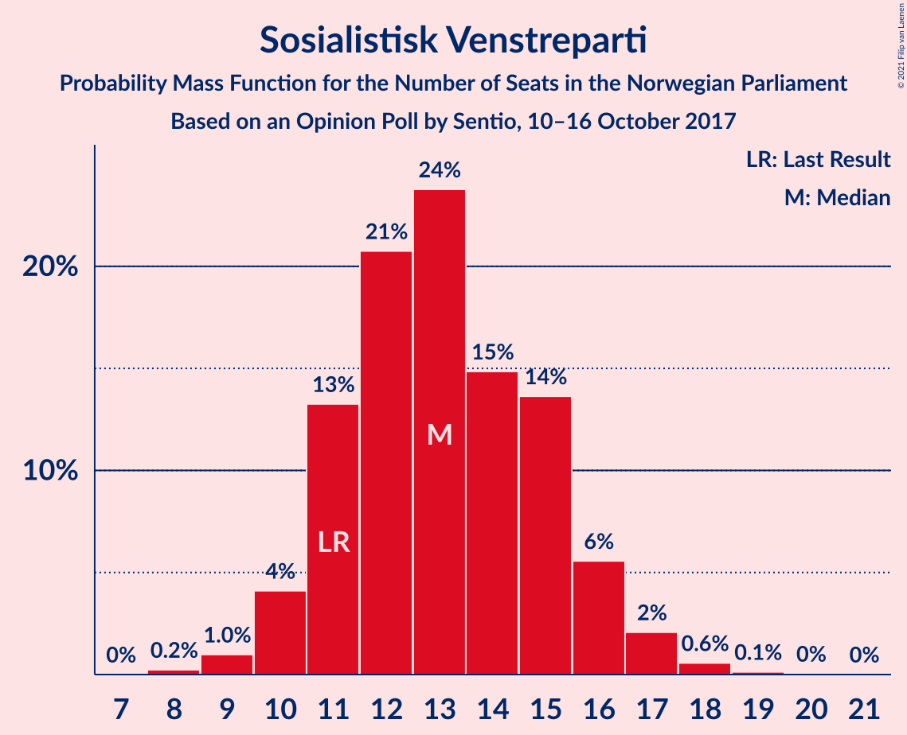
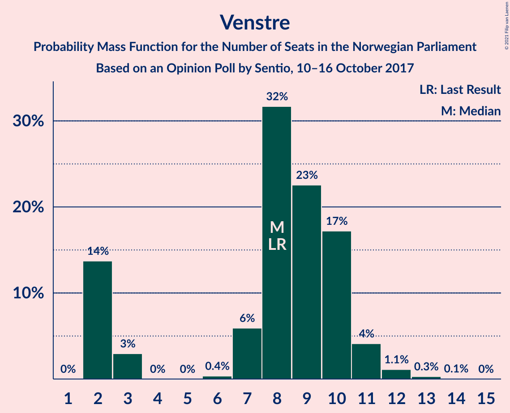
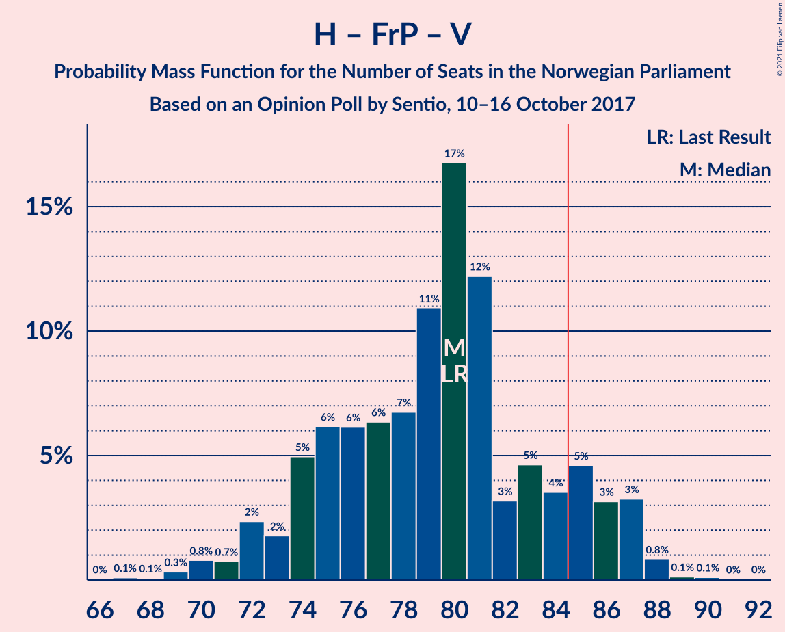
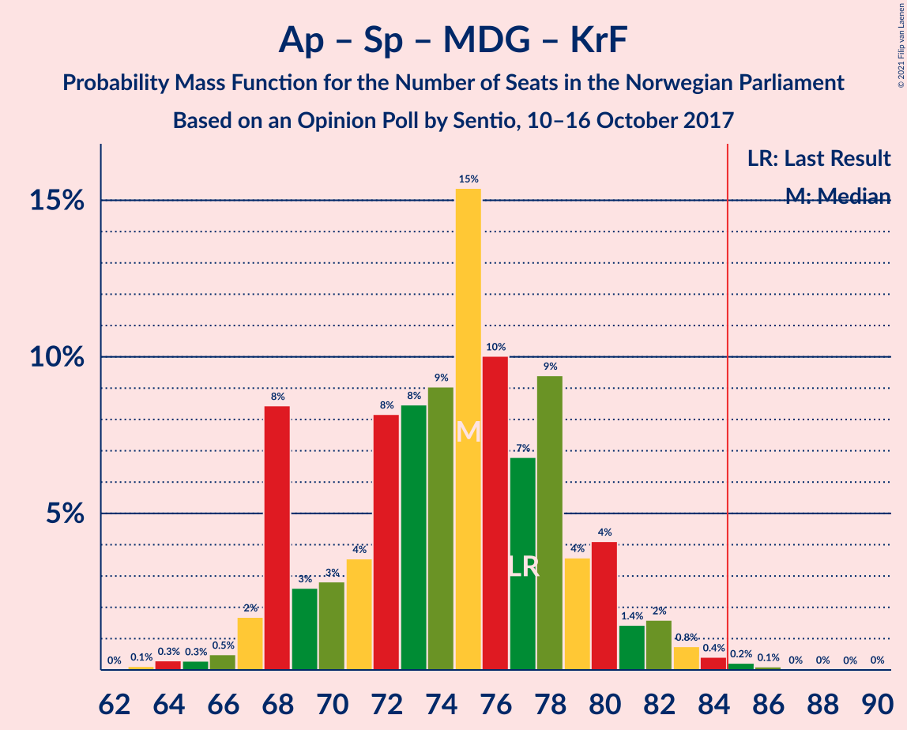

# Opinion Poll by Sentio, 10–16 October 2017

<a href="#voting-intentions">Voting Intentions</a> | <a href="#seats">Seats</a> | <a href="#coalitions">Coalitions</a> | <a href="#technical-information">Technical Information</a>

## Voting Intentions

### Confidence Intervals

| Party | Last Result | Poll Result | 80% Confidence Interval | 90% Confidence Interval | 95% Confidence Interval | 99% Confidence Interval |
|:-----:|:-----------:|:-----------:|:-----------------------:|:-----------------------:|:-----------------------:|:-----------------------:|
| Arbeiderpartiet | 27.4% | 25.2% | 23.3–27.2% |22.7–27.8% |22.3–28.3% |21.4–29.3% |
| Høyre | 25.0% | 25.2% | 23.3–27.2% |22.7–27.8% |22.3–28.3% |21.4–29.3% |
| Fremskrittspartiet | 15.2% | 14.6% | 13.1–16.4% |12.7–16.8% |12.4–17.3% |11.7–18.1% |
| Senterpartiet | 10.3% | 10.1% | 8.9–11.6% |8.5–12.1% |8.2–12.4% |7.7–13.2% |
| Sosialistisk Venstreparti | 6.0% | 7.3% | 6.2–8.6% |5.9–8.9% |5.7–9.3% |5.2–10.0% |
| Miljøpartiet De Grønne | 3.2% | 4.9% | 4.0–6.0% |3.8–6.3% |3.6–6.6% |3.2–7.2% |
| Venstre | 4.4% | 4.6% | 3.8–5.7% |3.6–6.1% |3.4–6.3% |3.0–6.9% |
| Kristelig Folkeparti | 4.2% | 3.3% | 2.6–4.2% |2.4–4.5% |2.2–4.7% |1.9–5.2% |
| Rødt | 2.4% | 3.1% | 2.5–4.1% |2.3–4.3% |2.1–4.6% |1.8–5.1% |

*Note:* The poll result column reflects the actual value used in the calculations. Published results may vary slightly, and in addition be rounded to fewer digits.

## Seats

### Confidence Intervals

| Party | Last Result | Median | 80% Confidence Interval | 90% Confidence Interval | 95% Confidence Interval | 99% Confidence Interval |
|:-----:|:-----------:|:------:|:-----------------------:|:-----------------------:|:-----------------------:|:-----------------------:|
| <a href="#arbeiderpartiet">Arbeiderpartiet</a> | 49 | 45 | 43–46 |42–50 |41–51 |39–53 |
| <a href="#høyre">Høyre</a> | 45 | 45 | 41–50 |40–50 |39–50 |37–52 |
| <a href="#fremskrittspartiet">Fremskrittspartiet</a> | 27 | 27 | 23–30 |23–30 |22–30 |21–33 |
| <a href="#senterpartiet">Senterpartiet</a> | 19 | 18 | 15–20 |15–21 |15–21 |14–24 |
| <a href="#sosialistisk-venstreparti">Sosialistisk Venstreparti</a> | 11 | 13 | 11–16 |10–16 |10–16 |9–18 |
| <a href="#miljøpartiet-de-grønne">Miljøpartiet De Grønne</a> | 1 | 9 | 2–11 |2–11 |2–12 |2–12 |
| <a href="#venstre">Venstre</a> | 8 | 8 | 2–10 |2–11 |2–11 |2–13 |
| <a href="#kristelig-folkeparti">Kristelig Folkeparti</a> | 8 | 3 | 1–7 |1–7 |1–8 |0–9 |
| <a href="#rødt">Rødt</a> | 1 | 2 | 1–7 |1–8 |1–8 |1–8 |

### Arbeiderpartiet

*For a full overview of the results for this party, see the [Arbeiderpartiet](party-arbeiderpartiet.html) page.*

| Number of Seats | Probability | Accumulated | Special Marks |
|:---------------:|:-----------:|:-----------:|:-------------:|
| 38 | 0.1% | 100% |  |
| 39 | 1.1% | 99.9% |  |
| 40 | 0.5% | 98.8% |  |
| 41 | 3% | 98% |  |
| 42 | 0.5% | 95% |  |
| 43 | 18% | 95% |  |
| 44 | 8% | 77% |  |
| 45 | 23% | 68% | Median |
| 46 | 35% | 45% |  |
| 47 | 3% | 10% |  |
| 48 | 0.1% | 7% |  |
| 49 | 0.2% | 7% | Last Result |
| 50 | 3% | 7% |  |
| 51 | 2% | 4% |  |
| 52 | 0.6% | 2% |  |
| 53 | 1.2% | 2% |  |
| 54 | 0.2% | 0.3% |  |
| 55 | 0.1% | 0.1% |  |
| 56 | 0% | 0% |  |

### Høyre

*For a full overview of the results for this party, see the [Høyre](party-høyre.html) page.*

| Number of Seats | Probability | Accumulated | Special Marks |
|:---------------:|:-----------:|:-----------:|:-------------:|
| 36 | 0.1% | 100% |  |
| 37 | 0.4% | 99.9% |  |
| 38 | 0.4% | 99.4% |  |
| 39 | 2% | 99.1% |  |
| 40 | 5% | 97% |  |
| 41 | 17% | 92% |  |
| 42 | 4% | 75% |  |
| 43 | 14% | 72% |  |
| 44 | 7% | 58% |  |
| 45 | 18% | 51% | Last Result, Median |
| 46 | 11% | 33% |  |
| 47 | 8% | 23% |  |
| 48 | 1.0% | 14% |  |
| 49 | 2% | 13% |  |
| 50 | 9% | 11% |  |
| 51 | 1.3% | 2% |  |
| 52 | 0.7% | 0.9% |  |
| 53 | 0.1% | 0.2% |  |
| 54 | 0.1% | 0.1% |  |
| 55 | 0% | 0% |  |

### Fremskrittspartiet

*For a full overview of the results for this party, see the [Fremskrittspartiet](party-fremskrittspartiet.html) page.*

| Number of Seats | Probability | Accumulated | Special Marks |
|:---------------:|:-----------:|:-----------:|:-------------:|
| 20 | 0.2% | 100% |  |
| 21 | 1.3% | 99.8% |  |
| 22 | 3% | 98% |  |
| 23 | 10% | 96% |  |
| 24 | 4% | 86% |  |
| 25 | 17% | 82% |  |
| 26 | 3% | 65% |  |
| 27 | 19% | 62% | Last Result, Median |
| 28 | 5% | 42% |  |
| 29 | 16% | 37% |  |
| 30 | 19% | 21% |  |
| 31 | 1.0% | 2% |  |
| 32 | 0.4% | 1.1% |  |
| 33 | 0.6% | 0.7% |  |
| 34 | 0% | 0.1% |  |
| 35 | 0% | 0% |  |

### Senterpartiet

*For a full overview of the results for this party, see the [Senterpartiet](party-senterpartiet.html) page.*

| Number of Seats | Probability | Accumulated | Special Marks |
|:---------------:|:-----------:|:-----------:|:-------------:|
| 12 | 0% | 100% |  |
| 13 | 0.2% | 99.9% |  |
| 14 | 2% | 99.7% |  |
| 15 | 16% | 98% |  |
| 16 | 6% | 82% |  |
| 17 | 5% | 76% |  |
| 18 | 31% | 71% | Median |
| 19 | 28% | 40% | Last Result |
| 20 | 2% | 12% |  |
| 21 | 8% | 10% |  |
| 22 | 0.3% | 2% |  |
| 23 | 1.0% | 2% |  |
| 24 | 0.2% | 0.5% |  |
| 25 | 0.3% | 0.4% |  |
| 26 | 0% | 0% |  |

### Sosialistisk Venstreparti

*For a full overview of the results for this party, see the [Sosialistisk Venstreparti](party-sosialistiskvenstreparti.html) page.*

| Number of Seats | Probability | Accumulated | Special Marks |
|:---------------:|:-----------:|:-----------:|:-------------:|
| 9 | 2% | 100% |  |
| 10 | 5% | 98% |  |
| 11 | 7% | 93% | Last Result |
| 12 | 9% | 86% |  |
| 13 | 28% | 77% | Median |
| 14 | 8% | 50% |  |
| 15 | 27% | 41% |  |
| 16 | 13% | 14% |  |
| 17 | 0.7% | 2% |  |
| 18 | 0.5% | 0.8% |  |
| 19 | 0.2% | 0.3% |  |
| 20 | 0.2% | 0.2% |  |
| 21 | 0% | 0% |  |

### Miljøpartiet De Grønne

*For a full overview of the results for this party, see the [Miljøpartiet De Grønne](party-miljøpartietdegrønne.html) page.*

| Number of Seats | Probability | Accumulated | Special Marks |
|:---------------:|:-----------:|:-----------:|:-------------:|
| 1 | 0.2% | 100% | Last Result |
| 2 | 14% | 99.8% |  |
| 3 | 0.3% | 86% |  |
| 4 | 0% | 86% |  |
| 5 | 0% | 86% |  |
| 6 | 0% | 86% |  |
| 7 | 3% | 86% |  |
| 8 | 17% | 83% |  |
| 9 | 23% | 66% | Median |
| 10 | 26% | 43% |  |
| 11 | 14% | 17% |  |
| 12 | 2% | 3% |  |
| 13 | 0.3% | 0.4% |  |
| 14 | 0.1% | 0.1% |  |
| 15 | 0% | 0% |  |

### Venstre

*For a full overview of the results for this party, see the [Venstre](party-venstre.html) page.*

| Number of Seats | Probability | Accumulated | Special Marks |
|:---------------:|:-----------:|:-----------:|:-------------:|
| 2 | 20% | 100% |  |
| 3 | 0.2% | 80% |  |
| 4 | 0% | 80% |  |
| 5 | 0% | 80% |  |
| 6 | 0% | 80% |  |
| 7 | 4% | 80% |  |
| 8 | 36% | 75% | Last Result, Median |
| 9 | 21% | 39% |  |
| 10 | 10% | 18% |  |
| 11 | 7% | 8% |  |
| 12 | 0.2% | 1.1% |  |
| 13 | 0.9% | 0.9% |  |
| 14 | 0% | 0% |  |

### Kristelig Folkeparti

*For a full overview of the results for this party, see the [Kristelig Folkeparti](party-kristeligfolkeparti.html) page.*

| Number of Seats | Probability | Accumulated | Special Marks |
|:---------------:|:-----------:|:-----------:|:-------------:|
| 0 | 2% | 100% |  |
| 1 | 34% | 98% |  |
| 2 | 4% | 63% |  |
| 3 | 44% | 60% | Median |
| 4 | 0% | 16% |  |
| 5 | 0% | 16% |  |
| 6 | 0% | 16% |  |
| 7 | 12% | 16% |  |
| 8 | 3% | 4% | Last Result |
| 9 | 0.6% | 0.7% |  |
| 10 | 0% | 0.1% |  |
| 11 | 0% | 0.1% |  |
| 12 | 0% | 0% |  |

### Rødt

*For a full overview of the results for this party, see the [Rødt](party-rødt.html) page.*

| Number of Seats | Probability | Accumulated | Special Marks |
|:---------------:|:-----------:|:-----------:|:-------------:|
| 1 | 41% | 100% | Last Result |
| 2 | 47% | 59% | Median |
| 3 | 0% | 12% |  |
| 4 | 0% | 12% |  |
| 5 | 0% | 12% |  |
| 6 | 0% | 12% |  |
| 7 | 5% | 12% |  |
| 8 | 6% | 7% |  |
| 9 | 0.3% | 0.4% |  |
| 10 | 0.1% | 0.1% |  |
| 11 | 0% | 0% |  |

## Coalitions

### Confidence Intervals

| Coalition | Last Result | Median | Majority? | 80% Confidence Interval | 90% Confidence Interval | 95% Confidence Interval | 99% Confidence Interval |
|:---------:|:-----------:|:------:|:---------:|:-----------------------:|:-----------------------:|:-----------------------:|:-----------------------:|
| Høyre – Fremskrittspartiet – Senterpartiet – Venstre – Kristelig Folkeparti | 107 | 98 | 100% | 96–106 | 94–107 | 94–109 | 91–109 |
| Høyre – Fremskrittspartiet – Miljøpartiet De Grønne – Venstre – Kristelig Folkeparti | 89 | 90 | 95% | 87–94 | 85–96 | 83–96 | 82–98 |
| Arbeiderpartiet – Senterpartiet – Sosialistisk Venstreparti – Miljøpartiet De Grønne – Kristelig Folkeparti | 88 | 88 | 74% | 83–92 | 83–94 | 81–95 | 79–97 |
| Arbeiderpartiet – Senterpartiet – Sosialistisk Venstreparti – Miljøpartiet De Grønne – Rødt | 81 | 89 | 73% | 82–91 | 81–92 | 81–93 | 78–98 |
| Arbeiderpartiet – Senterpartiet – Sosialistisk Venstreparti – Miljøpartiet De Grønne | 80 | 86 | 65% | 80–89 | 79–90 | 76–91 | 76–96 |
| Høyre – Fremskrittspartiet – Venstre – Kristelig Folkeparti | 88 | 80 | 27% | 78–87 | 77–88 | 76–88 | 71–91 |
| Arbeiderpartiet – Senterpartiet – Sosialistisk Venstreparti – Rødt | 80 | 79 | 5% | 75–82 | 73–84 | 73–86 | 71–87 |
| Høyre – Fremskrittspartiet – Venstre | 80 | 79 | 2% | 75–84 | 73–84 | 72–84 | 70–89 |
| Arbeiderpartiet – Senterpartiet – Sosialistisk Venstreparti | 79 | 77 | 1.4% | 71–80 | 71–81 | 68–83 | 68–85 |
| Arbeiderpartiet – Senterpartiet – Miljøpartiet De Grønne – Kristelig Folkeparti | 77 | 75 | 0.5% | 68–79 | 67–81 | 67–82 | 63–84 |
| Høyre – Fremskrittspartiet | 72 | 71 | 0% | 67–75 | 65–75 | 64–77 | 63–80 |
| Arbeiderpartiet – Senterpartiet – Kristelig Folkeparti | 76 | 65 | 0% | 62–70 | 61–73 | 61–73 | 59–76 |
| Arbeiderpartiet – Senterpartiet | 68 | 64 | 0% | 59–66 | 59–66 | 58–69 | 58–72 |
| Arbeiderpartiet – Sosialistisk Venstreparti | 60 | 59 | 0% | 56–61 | 53–64 | 51–65 | 51–66 |
| Høyre – Venstre – Kristelig Folkeparti | 61 | 55 | 0% | 50–62 | 50–62 | 49–62 | 47–64 |
| Senterpartiet – Venstre – Kristelig Folkeparti | 35 | 27 | 0% | 24–33 | 24–35 | 22–36 | 18–36 |

### Høyre – Fremskrittspartiet – Senterpartiet – Venstre – Kristelig Folkeparti

| Number of Seats | Probability | Accumulated | Special Marks |
|:---------------:|:-----------:|:-----------:|:-------------:|
| 88 | 0.1% | 100% |  |
| 89 | 0.3% | 99.8% |  |
| 90 | 0% | 99.6% |  |
| 91 | 1.3% | 99.5% |  |
| 92 | 0.3% | 98% |  |
| 93 | 0.1% | 98% |  |
| 94 | 3% | 98% |  |
| 95 | 1.3% | 94% |  |
| 96 | 4% | 93% |  |
| 97 | 18% | 89% |  |
| 98 | 33% | 71% |  |
| 99 | 3% | 38% |  |
| 100 | 3% | 35% |  |
| 101 | 4% | 32% | Median |
| 102 | 5% | 27% |  |
| 103 | 4% | 22% |  |
| 104 | 2% | 18% |  |
| 105 | 0.8% | 17% |  |
| 106 | 10% | 16% |  |
| 107 | 2% | 5% | Last Result |
| 108 | 0.2% | 4% |  |
| 109 | 3% | 4% |  |
| 110 | 0.1% | 0.2% |  |
| 111 | 0% | 0% |  |

### Høyre – Fremskrittspartiet – Miljøpartiet De Grønne – Venstre – Kristelig Folkeparti

| Number of Seats | Probability | Accumulated | Special Marks |
|:---------------:|:-----------:|:-----------:|:-------------:|
| 78 | 0% | 100% |  |
| 79 | 0.1% | 99.9% |  |
| 80 | 0% | 99.9% |  |
| 81 | 0.2% | 99.8% |  |
| 82 | 1.1% | 99.6% |  |
| 83 | 1.2% | 98.5% |  |
| 84 | 2% | 97% |  |
| 85 | 0.6% | 95% | Majority |
| 86 | 3% | 95% |  |
| 87 | 8% | 92% |  |
| 88 | 16% | 84% |  |
| 89 | 13% | 68% | Last Result |
| 90 | 23% | 56% |  |
| 91 | 4% | 33% |  |
| 92 | 3% | 29% | Median |
| 93 | 13% | 26% |  |
| 94 | 3% | 13% |  |
| 95 | 0.9% | 9% |  |
| 96 | 8% | 9% |  |
| 97 | 0.1% | 1.0% |  |
| 98 | 0.6% | 0.8% |  |
| 99 | 0.1% | 0.2% |  |
| 100 | 0% | 0.1% |  |
| 101 | 0.1% | 0.1% |  |
| 102 | 0% | 0% |  |

### Arbeiderpartiet – Senterpartiet – Sosialistisk Venstreparti – Miljøpartiet De Grønne – Kristelig Folkeparti

| Number of Seats | Probability | Accumulated | Special Marks |
|:---------------:|:-----------:|:-----------:|:-------------:|
| 76 | 0% | 100% |  |
| 77 | 0.1% | 99.9% |  |
| 78 | 0.1% | 99.8% |  |
| 79 | 0.9% | 99.7% |  |
| 80 | 0.3% | 98.8% |  |
| 81 | 2% | 98.5% |  |
| 82 | 0.3% | 97% |  |
| 83 | 21% | 96% |  |
| 84 | 2% | 76% |  |
| 85 | 0.3% | 74% | Majority |
| 86 | 6% | 74% |  |
| 87 | 5% | 68% |  |
| 88 | 19% | 62% | Last Result, Median |
| 89 | 9% | 44% |  |
| 90 | 4% | 35% |  |
| 91 | 4% | 31% |  |
| 92 | 20% | 27% |  |
| 93 | 1.4% | 7% |  |
| 94 | 1.1% | 5% |  |
| 95 | 3% | 4% |  |
| 96 | 0.4% | 1.4% |  |
| 97 | 0.7% | 1.0% |  |
| 98 | 0.1% | 0.4% |  |
| 99 | 0.1% | 0.3% |  |
| 100 | 0% | 0.2% |  |
| 101 | 0.1% | 0.2% |  |
| 102 | 0% | 0% |  |

### Arbeiderpartiet – Senterpartiet – Sosialistisk Venstreparti – Miljøpartiet De Grønne – Rødt

| Number of Seats | Probability | Accumulated | Special Marks |
|:---------------:|:-----------:|:-----------:|:-------------:|
| 75 | 0.1% | 100% |  |
| 76 | 0% | 99.9% |  |
| 77 | 0.1% | 99.9% |  |
| 78 | 0.9% | 99.8% |  |
| 79 | 0.3% | 98.9% |  |
| 80 | 0.4% | 98.6% |  |
| 81 | 6% | 98% | Last Result |
| 82 | 13% | 92% |  |
| 83 | 4% | 79% |  |
| 84 | 3% | 76% |  |
| 85 | 1.0% | 73% | Majority |
| 86 | 2% | 72% |  |
| 87 | 13% | 70% | Median |
| 88 | 3% | 57% |  |
| 89 | 20% | 54% |  |
| 90 | 23% | 35% |  |
| 91 | 4% | 12% |  |
| 92 | 3% | 7% |  |
| 93 | 2% | 4% |  |
| 94 | 0.4% | 2% |  |
| 95 | 0.3% | 2% |  |
| 96 | 0.5% | 1.4% |  |
| 97 | 0.1% | 0.9% |  |
| 98 | 0.7% | 0.8% |  |
| 99 | 0.1% | 0.1% |  |
| 100 | 0% | 0.1% |  |
| 101 | 0% | 0% |  |

### Arbeiderpartiet – Senterpartiet – Sosialistisk Venstreparti – Miljøpartiet De Grønne

| Number of Seats | Probability | Accumulated | Special Marks |
|:---------------:|:-----------:|:-----------:|:-------------:|
| 74 | 0.1% | 100% |  |
| 75 | 0.1% | 99.9% |  |
| 76 | 3% | 99.8% |  |
| 77 | 0.7% | 97% |  |
| 78 | 0.7% | 96% |  |
| 79 | 5% | 95% |  |
| 80 | 14% | 90% | Last Result |
| 81 | 1.3% | 76% |  |
| 82 | 7% | 75% |  |
| 83 | 2% | 68% |  |
| 84 | 1.1% | 66% |  |
| 85 | 3% | 65% | Median, Majority |
| 86 | 12% | 62% |  |
| 87 | 19% | 49% |  |
| 88 | 5% | 30% |  |
| 89 | 17% | 25% |  |
| 90 | 5% | 8% |  |
| 91 | 1.1% | 3% |  |
| 92 | 0.2% | 2% |  |
| 93 | 0.5% | 2% |  |
| 94 | 0.2% | 1.0% |  |
| 95 | 0% | 0.8% |  |
| 96 | 0.6% | 0.8% |  |
| 97 | 0% | 0.1% |  |
| 98 | 0% | 0.1% |  |
| 99 | 0% | 0.1% |  |
| 100 | 0% | 0% |  |

### Høyre – Fremskrittspartiet – Venstre – Kristelig Folkeparti

| Number of Seats | Probability | Accumulated | Special Marks |
|:---------------:|:-----------:|:-----------:|:-------------:|
| 69 | 0% | 100% |  |
| 70 | 0.1% | 99.9% |  |
| 71 | 0.7% | 99.9% |  |
| 72 | 0.1% | 99.2% |  |
| 73 | 0.5% | 99.1% |  |
| 74 | 0.3% | 98.6% |  |
| 75 | 0.4% | 98% |  |
| 76 | 2% | 98% |  |
| 77 | 3% | 96% |  |
| 78 | 4% | 93% |  |
| 79 | 23% | 88% |  |
| 80 | 20% | 65% |  |
| 81 | 3% | 46% |  |
| 82 | 13% | 43% |  |
| 83 | 2% | 30% | Median |
| 84 | 1.0% | 28% |  |
| 85 | 3% | 27% | Majority |
| 86 | 4% | 24% |  |
| 87 | 13% | 21% |  |
| 88 | 6% | 8% | Last Result |
| 89 | 0.4% | 2% |  |
| 90 | 0.3% | 1.4% |  |
| 91 | 0.9% | 1.1% |  |
| 92 | 0.1% | 0.2% |  |
| 93 | 0% | 0.1% |  |
| 94 | 0.1% | 0.1% |  |
| 95 | 0% | 0% |  |

### Arbeiderpartiet – Senterpartiet – Sosialistisk Venstreparti – Rødt

| Number of Seats | Probability | Accumulated | Special Marks |
|:---------------:|:-----------:|:-----------:|:-------------:|
| 68 | 0.1% | 100% |  |
| 69 | 0% | 99.9% |  |
| 70 | 0.1% | 99.9% |  |
| 71 | 0.6% | 99.8% |  |
| 72 | 0.1% | 99.2% |  |
| 73 | 8% | 99.0% |  |
| 74 | 0.9% | 91% |  |
| 75 | 3% | 91% |  |
| 76 | 13% | 87% |  |
| 77 | 3% | 74% |  |
| 78 | 4% | 71% | Median |
| 79 | 23% | 67% |  |
| 80 | 13% | 44% | Last Result |
| 81 | 16% | 32% |  |
| 82 | 8% | 16% |  |
| 83 | 3% | 8% |  |
| 84 | 0.6% | 5% |  |
| 85 | 2% | 5% | Majority |
| 86 | 1.2% | 3% |  |
| 87 | 1.1% | 1.5% |  |
| 88 | 0.2% | 0.4% |  |
| 89 | 0% | 0.2% |  |
| 90 | 0.1% | 0.1% |  |
| 91 | 0% | 0.1% |  |
| 92 | 0% | 0% |  |

### Høyre – Fremskrittspartiet – Venstre

| Number of Seats | Probability | Accumulated | Special Marks |
|:---------------:|:-----------:|:-----------:|:-------------:|
| 66 | 0% | 100% |  |
| 67 | 0.1% | 99.9% |  |
| 68 | 0.1% | 99.8% |  |
| 69 | 0.2% | 99.7% |  |
| 70 | 0.8% | 99.5% |  |
| 71 | 0.4% | 98.7% |  |
| 72 | 3% | 98% |  |
| 73 | 0.9% | 96% |  |
| 74 | 0.9% | 95% |  |
| 75 | 5% | 94% |  |
| 76 | 19% | 88% |  |
| 77 | 3% | 69% |  |
| 78 | 8% | 66% |  |
| 79 | 28% | 58% |  |
| 80 | 3% | 30% | Last Result, Median |
| 81 | 8% | 26% |  |
| 82 | 2% | 18% |  |
| 83 | 0.1% | 16% |  |
| 84 | 14% | 16% |  |
| 85 | 0.3% | 2% | Majority |
| 86 | 0.2% | 2% |  |
| 87 | 0.7% | 2% |  |
| 88 | 0.4% | 1.2% |  |
| 89 | 0.7% | 0.8% |  |
| 90 | 0.1% | 0.2% |  |
| 91 | 0.1% | 0.1% |  |
| 92 | 0% | 0% |  |

### Arbeiderpartiet – Senterpartiet – Sosialistisk Venstreparti

| Number of Seats | Probability | Accumulated | Special Marks |
|:---------------:|:-----------:|:-----------:|:-------------:|
| 67 | 0.1% | 100% |  |
| 68 | 3% | 99.9% |  |
| 69 | 0.3% | 97% |  |
| 70 | 1.1% | 97% |  |
| 71 | 6% | 96% |  |
| 72 | 3% | 90% |  |
| 73 | 1.2% | 87% |  |
| 74 | 8% | 86% |  |
| 75 | 11% | 77% |  |
| 76 | 2% | 66% | Median |
| 77 | 26% | 64% |  |
| 78 | 10% | 38% |  |
| 79 | 4% | 28% | Last Result |
| 80 | 17% | 24% |  |
| 81 | 3% | 7% |  |
| 82 | 0.6% | 4% |  |
| 83 | 0.8% | 3% |  |
| 84 | 1.0% | 2% |  |
| 85 | 1.1% | 1.4% | Majority |
| 86 | 0.2% | 0.3% |  |
| 87 | 0% | 0.1% |  |
| 88 | 0% | 0.1% |  |
| 89 | 0% | 0% |  |

### Arbeiderpartiet – Senterpartiet – Miljøpartiet De Grønne – Kristelig Folkeparti

| Number of Seats | Probability | Accumulated | Special Marks |
|:---------------:|:-----------:|:-----------:|:-------------:|
| 63 | 0.7% | 100% |  |
| 64 | 0% | 99.3% |  |
| 65 | 0.3% | 99.3% |  |
| 66 | 0% | 98.9% |  |
| 67 | 9% | 98.9% |  |
| 68 | 0.6% | 90% |  |
| 69 | 1.2% | 90% |  |
| 70 | 6% | 88% |  |
| 71 | 6% | 82% |  |
| 72 | 2% | 76% |  |
| 73 | 6% | 74% |  |
| 74 | 10% | 69% |  |
| 75 | 24% | 59% | Median |
| 76 | 1.4% | 35% |  |
| 77 | 19% | 34% | Last Result |
| 78 | 4% | 15% |  |
| 79 | 3% | 11% |  |
| 80 | 2% | 8% |  |
| 81 | 3% | 6% |  |
| 82 | 2% | 3% |  |
| 83 | 0.2% | 0.8% |  |
| 84 | 0.1% | 0.6% |  |
| 85 | 0.2% | 0.5% | Majority |
| 86 | 0.1% | 0.3% |  |
| 87 | 0% | 0.2% |  |
| 88 | 0.1% | 0.2% |  |
| 89 | 0% | 0% |  |

### Høyre – Fremskrittspartiet

| Number of Seats | Probability | Accumulated | Special Marks |
|:---------------:|:-----------:|:-----------:|:-------------:|
| 60 | 0.1% | 100% |  |
| 61 | 0% | 99.9% |  |
| 62 | 0.1% | 99.9% |  |
| 63 | 0.7% | 99.8% |  |
| 64 | 3% | 99.2% |  |
| 65 | 2% | 97% |  |
| 66 | 4% | 95% |  |
| 67 | 3% | 91% |  |
| 68 | 2% | 88% |  |
| 69 | 7% | 86% |  |
| 70 | 17% | 79% |  |
| 71 | 18% | 62% |  |
| 72 | 5% | 44% | Last Result, Median |
| 73 | 8% | 38% |  |
| 74 | 17% | 31% |  |
| 75 | 10% | 14% |  |
| 76 | 2% | 5% |  |
| 77 | 0.4% | 3% |  |
| 78 | 0.4% | 2% |  |
| 79 | 1.1% | 2% |  |
| 80 | 0.4% | 0.7% |  |
| 81 | 0% | 0.2% |  |
| 82 | 0.1% | 0.2% |  |
| 83 | 0.1% | 0.1% |  |
| 84 | 0% | 0% |  |

### Arbeiderpartiet – Senterpartiet – Kristelig Folkeparti

| Number of Seats | Probability | Accumulated | Special Marks |
|:---------------:|:-----------:|:-----------:|:-------------:|
| 57 | 0.1% | 100% |  |
| 58 | 0.1% | 99.9% |  |
| 59 | 0.6% | 99.8% |  |
| 60 | 0.8% | 99.3% |  |
| 61 | 4% | 98% |  |
| 62 | 11% | 95% |  |
| 63 | 11% | 84% |  |
| 64 | 0.5% | 73% |  |
| 65 | 29% | 72% |  |
| 66 | 2% | 43% | Median |
| 67 | 6% | 41% |  |
| 68 | 17% | 35% |  |
| 69 | 5% | 18% |  |
| 70 | 5% | 13% |  |
| 71 | 2% | 9% |  |
| 72 | 0.9% | 6% |  |
| 73 | 4% | 5% |  |
| 74 | 0.2% | 2% |  |
| 75 | 1.1% | 2% |  |
| 76 | 0.2% | 0.5% | Last Result |
| 77 | 0% | 0.4% |  |
| 78 | 0.2% | 0.3% |  |
| 79 | 0.1% | 0.2% |  |
| 80 | 0% | 0% |  |

### Arbeiderpartiet – Senterpartiet

| Number of Seats | Probability | Accumulated | Special Marks |
|:---------------:|:-----------:|:-----------:|:-------------:|
| 54 | 0% | 100% |  |
| 55 | 0% | 99.9% |  |
| 56 | 0.1% | 99.9% |  |
| 57 | 0.2% | 99.8% |  |
| 58 | 4% | 99.6% |  |
| 59 | 7% | 96% |  |
| 60 | 11% | 89% |  |
| 61 | 8% | 77% |  |
| 62 | 12% | 69% |  |
| 63 | 4% | 57% | Median |
| 64 | 21% | 53% |  |
| 65 | 15% | 32% |  |
| 66 | 12% | 17% |  |
| 67 | 0.6% | 4% |  |
| 68 | 0.8% | 4% | Last Result |
| 69 | 1.0% | 3% |  |
| 70 | 0.2% | 2% |  |
| 71 | 0.4% | 2% |  |
| 72 | 1.0% | 1.5% |  |
| 73 | 0.1% | 0.5% |  |
| 74 | 0.2% | 0.4% |  |
| 75 | 0.1% | 0.2% |  |
| 76 | 0% | 0% |  |

### Arbeiderpartiet – Sosialistisk Venstreparti

| Number of Seats | Probability | Accumulated | Special Marks |
|:---------------:|:-----------:|:-----------:|:-------------:|
| 50 | 0.3% | 100% |  |
| 51 | 3% | 99.7% |  |
| 52 | 1.4% | 97% |  |
| 53 | 1.5% | 95% |  |
| 54 | 1.5% | 94% |  |
| 55 | 1.3% | 92% |  |
| 56 | 16% | 91% |  |
| 57 | 2% | 75% |  |
| 58 | 6% | 74% | Median |
| 59 | 32% | 68% |  |
| 60 | 9% | 36% | Last Result |
| 61 | 18% | 27% |  |
| 62 | 0.9% | 8% |  |
| 63 | 2% | 7% |  |
| 64 | 0.5% | 5% |  |
| 65 | 4% | 5% |  |
| 66 | 0.1% | 0.6% |  |
| 67 | 0.3% | 0.5% |  |
| 68 | 0.1% | 0.2% |  |
| 69 | 0% | 0.1% |  |
| 70 | 0% | 0% |  |

### Høyre – Venstre – Kristelig Folkeparti

| Number of Seats | Probability | Accumulated | Special Marks |
|:---------------:|:-----------:|:-----------:|:-------------:|
| 42 | 0% | 100% |  |
| 43 | 0% | 99.9% |  |
| 44 | 0.2% | 99.9% |  |
| 45 | 0% | 99.7% |  |
| 46 | 0.1% | 99.7% |  |
| 47 | 0.2% | 99.6% |  |
| 48 | 0.6% | 99.3% |  |
| 49 | 3% | 98.8% |  |
| 50 | 31% | 96% |  |
| 51 | 1.0% | 65% |  |
| 52 | 3% | 64% |  |
| 53 | 5% | 62% |  |
| 54 | 3% | 57% |  |
| 55 | 16% | 54% |  |
| 56 | 10% | 38% | Median |
| 57 | 1.3% | 28% |  |
| 58 | 0.6% | 27% |  |
| 59 | 1.0% | 26% |  |
| 60 | 5% | 25% |  |
| 61 | 8% | 20% | Last Result |
| 62 | 9% | 12% |  |
| 63 | 1.4% | 2% |  |
| 64 | 0.8% | 0.8% |  |
| 65 | 0.1% | 0.1% |  |
| 66 | 0% | 0% |  |

### Senterpartiet – Venstre – Kristelig Folkeparti

| Number of Seats | Probability | Accumulated | Special Marks |
|:---------------:|:-----------:|:-----------:|:-------------:|
| 17 | 0.3% | 100% |  |
| 18 | 0.3% | 99.7% |  |
| 19 | 0.1% | 99.4% |  |
| 20 | 0.1% | 99.3% |  |
| 21 | 0.4% | 99.2% |  |
| 22 | 3% | 98.8% |  |
| 23 | 0.6% | 96% |  |
| 24 | 14% | 95% |  |
| 25 | 3% | 81% |  |
| 26 | 3% | 78% |  |
| 27 | 33% | 75% |  |
| 28 | 1.5% | 42% |  |
| 29 | 7% | 40% | Median |
| 30 | 2% | 34% |  |
| 31 | 11% | 32% |  |
| 32 | 7% | 21% |  |
| 33 | 4% | 14% |  |
| 34 | 4% | 10% |  |
| 35 | 1.0% | 5% | Last Result |
| 36 | 4% | 4% |  |
| 37 | 0.2% | 0.4% |  |
| 38 | 0.1% | 0.2% |  |
| 39 | 0% | 0.1% |  |
| 40 | 0% | 0% |  |

## Technical Information

### Opinion Poll

+ **Polling firm:** Sentio
+ **Commissioner(s):** —
+ **Fieldwork period:** 10–16 October 2017

### Calculations

+ **Sample size:** 799
+ **Simulations done:** 65,536
+ **Error estimate:** 1.68%

