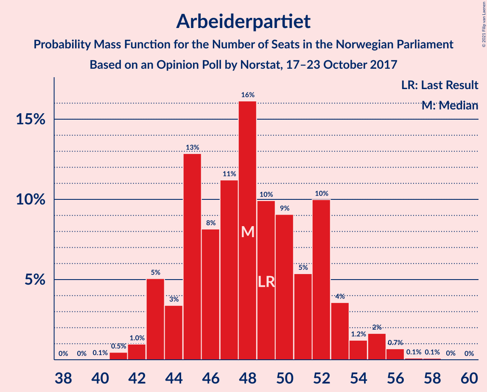
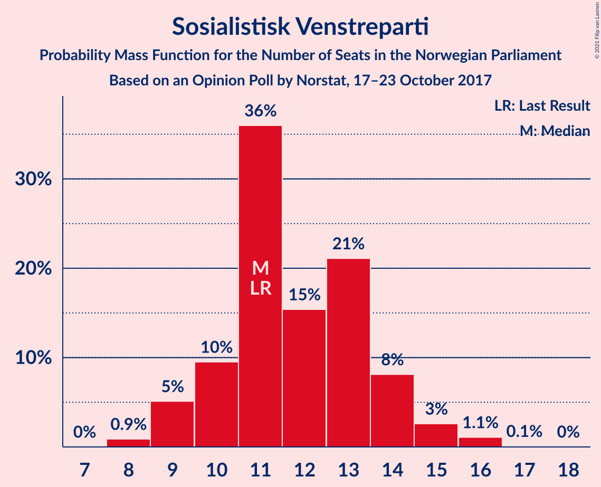
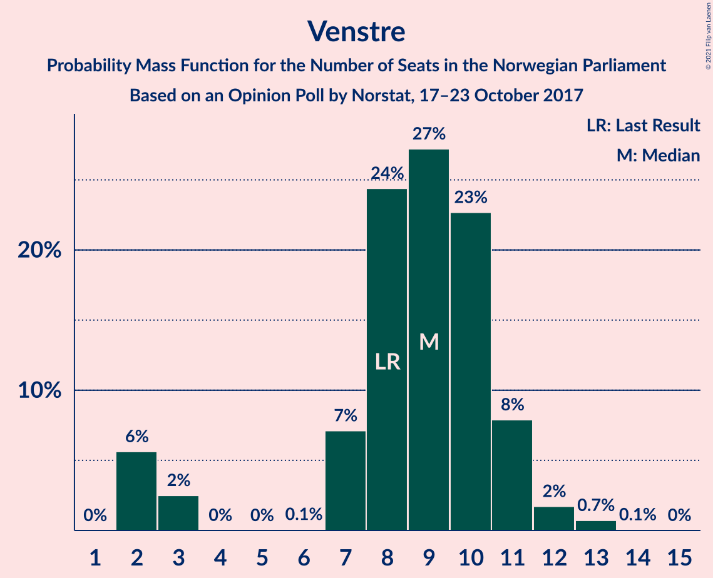
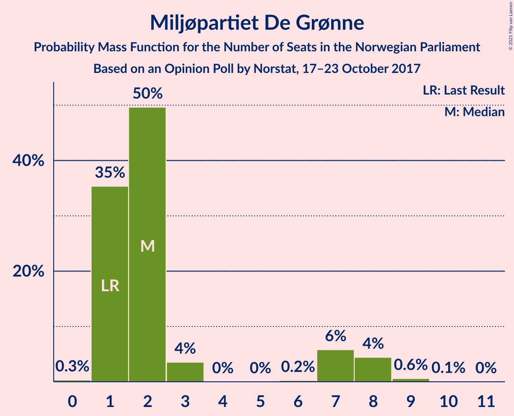
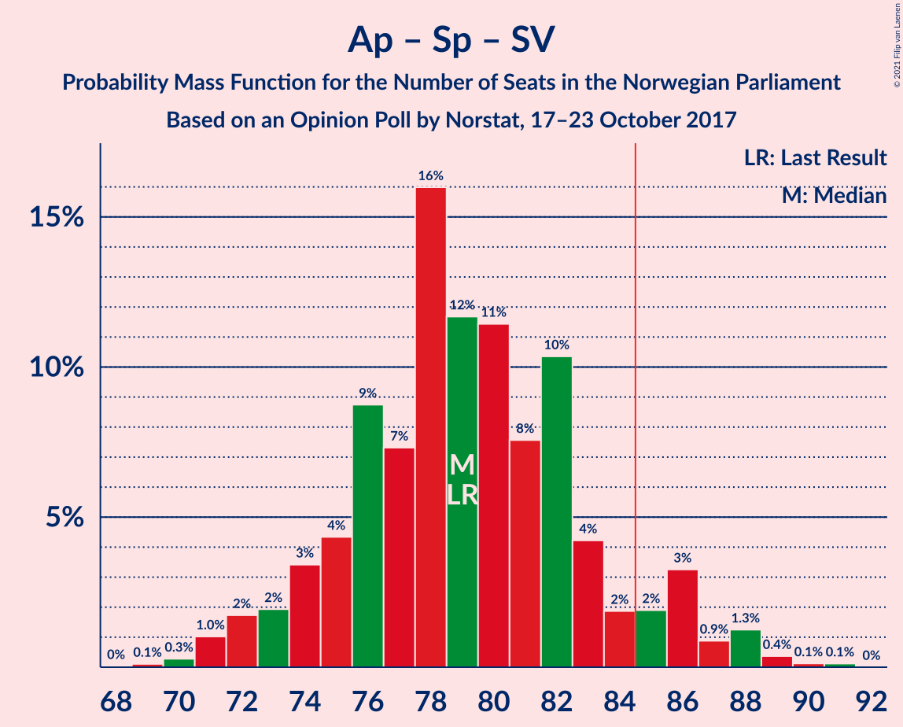

# Opinion Poll by Norstat, 17–23 October 2017

<a href="#voting-intentions">Voting Intentions</a> | <a href="#seats">Seats</a> | <a href="#coalitions">Coalitions</a> | <a href="#technical-information">Technical Information</a>

## Voting Intentions

### Confidence Intervals

| Party | Last Result | Poll Result | 80% Confidence Interval | 90% Confidence Interval | 95% Confidence Interval | 99% Confidence Interval |
|:-----:|:-----------:|:-----------:|:-----------------------:|:-----------------------:|:-----------------------:|:-----------------------:|
| Arbeiderpartiet | 27.4% | 26.5% | 24.8–28.5% |24.2–29.0% |23.8–29.5% |23.0–30.4% |
| Høyre | 25.0% | 25.6% | 23.8–27.5% |23.3–28.0% |22.9–28.5% |22.1–29.4% |
| Fremskrittspartiet | 15.2% | 13.7% | 12.3–15.2% |12.0–15.7% |11.6–16.0% |11.0–16.8% |
| Senterpartiet | 10.3% | 10.7% | 9.5–12.1% |9.2–12.5% |8.9–12.9% |8.4–13.6% |
| Sosialistisk Venstreparti | 6.0% | 6.5% | 5.5–7.6% |5.3–8.0% |5.1–8.2% |4.7–8.8% |
| Venstre | 4.4% | 4.9% | 4.1–5.9% |3.9–6.2% |3.7–6.5% |3.3–7.0% |
| Kristelig Folkeparti | 4.2% | 4.1% | 3.4–5.1% |3.2–5.4% |3.0–5.6% |2.7–6.1% |
| Rødt | 2.4% | 3.2% | 2.6–4.1% |2.4–4.3% |2.2–4.5% |2.0–5.0% |
| Miljøpartiet De Grønne | 3.2% | 3.2% | 2.6–4.1% |2.4–4.3% |2.2–4.5% |2.0–5.0% |

*Note:* The poll result column reflects the actual value used in the calculations. Published results may vary slightly, and in addition be rounded to fewer digits.

## Seats

### Confidence Intervals

| Party | Last Result | Median | 80% Confidence Interval | 90% Confidence Interval | 95% Confidence Interval | 99% Confidence Interval |
|:-----:|:-----------:|:------:|:-----------------------:|:-----------------------:|:-----------------------:|:-----------------------:|
| <a href="#arbeiderpartiet">Arbeiderpartiet</a> | 49 | 48 | 45–52 |45–54 |43–55 |41–55 |
| <a href="#høyre">Høyre</a> | 45 | 45 | 43–51 |42–51 |41–51 |39–54 |
| <a href="#fremskrittspartiet">Fremskrittspartiet</a> | 27 | 24 | 23–27 |22–28 |21–29 |19–30 |
| <a href="#senterpartiet">Senterpartiet</a> | 19 | 19 | 17–21 |17–22 |17–22 |15–25 |
| <a href="#sosialistisk-venstreparti">Sosialistisk Venstreparti</a> | 11 | 11 | 10–14 |10–14 |9–15 |8–16 |
| <a href="#venstre">Venstre</a> | 8 | 9 | 3–10 |2–11 |2–12 |2–12 |
| <a href="#kristelig-folkeparti">Kristelig Folkeparti</a> | 8 | 8 | 3–9 |2–10 |2–10 |1–10 |
| <a href="#rødt">Rødt</a> | 1 | 2 | 1–2 |1–2 |1–7 |1–9 |
| <a href="#miljøpartiet-de-grønne">Miljøpartiet De Grønne</a> | 1 | 2 | 1–2 |1–2 |1–7 |1–8 |

### Arbeiderpartiet

*For a full overview of the results for this party, see the [Arbeiderpartiet](party-arbeiderpartiet.html) page.*

| Number of Seats | Probability | Accumulated | Special Marks |
|:---------------:|:-----------:|:-----------:|:-------------:|
| 40 | 0% | 100% |  |
| 41 | 1.1% | 99.9% |  |
| 42 | 0.7% | 98.9% |  |
| 43 | 1.1% | 98% |  |
| 44 | 2% | 97% |  |
| 45 | 16% | 95% |  |
| 46 | 8% | 79% |  |
| 47 | 5% | 71% |  |
| 48 | 33% | 67% | Median |
| 49 | 8% | 34% | Last Result |
| 50 | 7% | 26% |  |
| 51 | 1.1% | 19% |  |
| 52 | 10% | 18% |  |
| 53 | 2% | 8% |  |
| 54 | 2% | 5% |  |
| 55 | 3% | 3% |  |
| 56 | 0.2% | 0.3% |  |
| 57 | 0% | 0.1% |  |
| 58 | 0.1% | 0.1% |  |
| 59 | 0% | 0% |  |

### Høyre

*For a full overview of the results for this party, see the [Høyre](party-høyre.html) page.*

| Number of Seats | Probability | Accumulated | Special Marks |
|:---------------:|:-----------:|:-----------:|:-------------:|
| 38 | 0.3% | 100% |  |
| 39 | 0.2% | 99.7% |  |
| 40 | 0.9% | 99.4% |  |
| 41 | 3% | 98.5% |  |
| 42 | 0.8% | 95% |  |
| 43 | 5% | 95% |  |
| 44 | 6% | 89% |  |
| 45 | 38% | 83% | Last Result, Median |
| 46 | 4% | 45% |  |
| 47 | 7% | 41% |  |
| 48 | 7% | 34% |  |
| 49 | 12% | 27% |  |
| 50 | 2% | 15% |  |
| 51 | 11% | 13% |  |
| 52 | 0.2% | 2% |  |
| 53 | 0.1% | 2% |  |
| 54 | 2% | 2% |  |
| 55 | 0.1% | 0.2% |  |
| 56 | 0% | 0% |  |

### Fremskrittspartiet

*For a full overview of the results for this party, see the [Fremskrittspartiet](party-fremskrittspartiet.html) page.*

| Number of Seats | Probability | Accumulated | Special Marks |
|:---------------:|:-----------:|:-----------:|:-------------:|
| 19 | 0.8% | 100% |  |
| 20 | 1.4% | 99.2% |  |
| 21 | 1.4% | 98% |  |
| 22 | 4% | 96% |  |
| 23 | 14% | 93% |  |
| 24 | 44% | 79% | Median |
| 25 | 11% | 35% |  |
| 26 | 7% | 24% |  |
| 27 | 9% | 17% | Last Result |
| 28 | 5% | 8% |  |
| 29 | 2% | 3% |  |
| 30 | 0.7% | 1.2% |  |
| 31 | 0.3% | 0.5% |  |
| 32 | 0.2% | 0.2% |  |
| 33 | 0% | 0% |  |

### Senterpartiet

*For a full overview of the results for this party, see the [Senterpartiet](party-senterpartiet.html) page.*

| Number of Seats | Probability | Accumulated | Special Marks |
|:---------------:|:-----------:|:-----------:|:-------------:|
| 14 | 0.4% | 100% |  |
| 15 | 0.1% | 99.6% |  |
| 16 | 2% | 99.5% |  |
| 17 | 9% | 98% |  |
| 18 | 4% | 89% |  |
| 19 | 45% | 85% | Last Result, Median |
| 20 | 26% | 40% |  |
| 21 | 6% | 13% |  |
| 22 | 6% | 7% |  |
| 23 | 0.4% | 2% |  |
| 24 | 0.6% | 1.2% |  |
| 25 | 0.5% | 0.5% |  |
| 26 | 0% | 0.1% |  |
| 27 | 0% | 0% |  |

### Sosialistisk Venstreparti

*For a full overview of the results for this party, see the [Sosialistisk Venstreparti](party-sosialistiskvenstreparti.html) page.*

| Number of Seats | Probability | Accumulated | Special Marks |
|:---------------:|:-----------:|:-----------:|:-------------:|
| 8 | 0.6% | 100% |  |
| 9 | 3% | 99.4% |  |
| 10 | 12% | 97% |  |
| 11 | 40% | 84% | Last Result, Median |
| 12 | 15% | 44% |  |
| 13 | 9% | 30% |  |
| 14 | 17% | 21% |  |
| 15 | 2% | 3% |  |
| 16 | 0.7% | 0.9% |  |
| 17 | 0.1% | 0.1% |  |
| 18 | 0% | 0% |  |

### Venstre

*For a full overview of the results for this party, see the [Venstre](party-venstre.html) page.*

| Number of Seats | Probability | Accumulated | Special Marks |
|:---------------:|:-----------:|:-----------:|:-------------:|
| 2 | 10% | 100% |  |
| 3 | 2% | 90% |  |
| 4 | 0% | 88% |  |
| 5 | 0% | 88% |  |
| 6 | 0% | 88% |  |
| 7 | 3% | 88% |  |
| 8 | 19% | 86% | Last Result |
| 9 | 23% | 67% | Median |
| 10 | 35% | 44% |  |
| 11 | 5% | 8% |  |
| 12 | 4% | 4% |  |
| 13 | 0.2% | 0.3% |  |
| 14 | 0% | 0% |  |

### Kristelig Folkeparti

*For a full overview of the results for this party, see the [Kristelig Folkeparti](party-kristeligfolkeparti.html) page.*

| Number of Seats | Probability | Accumulated | Special Marks |
|:---------------:|:-----------:|:-----------:|:-------------:|
| 0 | 0.1% | 100% |  |
| 1 | 2% | 99.9% |  |
| 2 | 3% | 98% |  |
| 3 | 28% | 95% |  |
| 4 | 0% | 67% |  |
| 5 | 0% | 67% |  |
| 6 | 0.1% | 67% |  |
| 7 | 2% | 67% |  |
| 8 | 49% | 65% | Last Result, Median |
| 9 | 10% | 17% |  |
| 10 | 6% | 6% |  |
| 11 | 0.4% | 0.4% |  |
| 12 | 0.1% | 0.1% |  |
| 13 | 0% | 0% |  |

### Rødt

*For a full overview of the results for this party, see the [Rødt](party-rødt.html) page.*

| Number of Seats | Probability | Accumulated | Special Marks |
|:---------------:|:-----------:|:-----------:|:-------------:|
| 1 | 48% | 100% | Last Result |
| 2 | 48% | 52% | Median |
| 3 | 0% | 4% |  |
| 4 | 0% | 4% |  |
| 5 | 0% | 4% |  |
| 6 | 0.3% | 4% |  |
| 7 | 2% | 4% |  |
| 8 | 0.5% | 2% |  |
| 9 | 2% | 2% |  |
| 10 | 0% | 0% |  |

### Miljøpartiet De Grønne

*For a full overview of the results for this party, see the [Miljøpartiet De Grønne](party-miljøpartietdegrønne.html) page.*

| Number of Seats | Probability | Accumulated | Special Marks |
|:---------------:|:-----------:|:-----------:|:-------------:|
| 0 | 0.3% | 100% |  |
| 1 | 28% | 99.7% | Last Result |
| 2 | 67% | 72% | Median |
| 3 | 1.0% | 5% |  |
| 4 | 0% | 4% |  |
| 5 | 0% | 4% |  |
| 6 | 0.3% | 4% |  |
| 7 | 2% | 4% |  |
| 8 | 1.3% | 2% |  |
| 9 | 0.4% | 0.4% |  |
| 10 | 0% | 0% |  |

## Coalitions

### Confidence Intervals

| Coalition | Last Result | Median | Majority? | 80% Confidence Interval | 90% Confidence Interval | 95% Confidence Interval | 99% Confidence Interval |
|:---------:|:-----------:|:------:|:---------:|:-----------------------:|:-----------------------:|:-----------------------:|:-----------------------:|
| Høyre – Fremskrittspartiet – Senterpartiet – Venstre – Kristelig Folkeparti | 107 | 106 | 100% | 100–110 | 100–112 | 98–112 | 94–112 |
| Arbeiderpartiet – Senterpartiet – Sosialistisk Venstreparti – Kristelig Folkeparti – Miljøpartiet De Grønne | 88 | 88 | 77% | 84–91 | 83–92 | 80–94 | 79–98 |
| Høyre – Fremskrittspartiet – Venstre – Kristelig Folkeparti – Miljøpartiet De Grønne | 89 | 89 | 82% | 82–92 | 82–93 | 81–93 | 79–96 |
| Høyre – Fremskrittspartiet – Venstre – Kristelig Folkeparti | 88 | 87 | 72% | 80–91 | 80–92 | 79–92 | 75–94 |
| Arbeiderpartiet – Senterpartiet – Sosialistisk Venstreparti – Miljøpartiet De Grønne – Rødt | 81 | 82 | 28% | 78–89 | 77–89 | 77–90 | 75–94 |
| Arbeiderpartiet – Senterpartiet – Sosialistisk Venstreparti – Miljøpartiet De Grønne | 80 | 80 | 19% | 76–88 | 76–88 | 76–88 | 73–90 |
| Arbeiderpartiet – Senterpartiet – Sosialistisk Venstreparti – Rødt | 80 | 80 | 18% | 77–87 | 76–87 | 76–88 | 73–90 |
| Høyre – Fremskrittspartiet – Venstre | 80 | 79 | 5% | 76–84 | 74–84 | 72–87 | 70–88 |
| Arbeiderpartiet – Senterpartiet – Sosialistisk Venstreparti | 79 | 78 | 16% | 75–86 | 75–86 | 73–86 | 70–88 |
| Arbeiderpartiet – Senterpartiet – Kristelig Folkeparti – Miljøpartiet De Grønne | 77 | 77 | 2% | 70–79 | 70–81 | 68–83 | 68–86 |
| Arbeiderpartiet – Senterpartiet – Kristelig Folkeparti | 76 | 75 | 0% | 68–78 | 68–79 | 67–81 | 65–84 |
| Høyre – Fremskrittspartiet | 72 | 69 | 0% | 68–76 | 66–76 | 65–78 | 63–78 |
| Arbeiderpartiet – Senterpartiet | 68 | 67 | 0% | 64–72 | 63–74 | 62–74 | 59–76 |
| Høyre – Venstre – Kristelig Folkeparti | 61 | 63 | 0% | 57–67 | 56–68 | 54–68 | 50–68 |
| Arbeiderpartiet – Sosialistisk Venstreparti | 60 | 59 | 0% | 56–66 | 55–66 | 55–66 | 52–67 |
| Senterpartiet – Venstre – Kristelig Folkeparti | 35 | 35 | 0% | 30–38 | 29–39 | 28–40 | 25–40 |

### Høyre – Fremskrittspartiet – Senterpartiet – Venstre – Kristelig Folkeparti

| Number of Seats | Probability | Accumulated | Special Marks |
|:---------------:|:-----------:|:-----------:|:-------------:|
| 92 | 0.1% | 100% |  |
| 93 | 0.3% | 99.9% |  |
| 94 | 0.2% | 99.6% |  |
| 95 | 0.2% | 99.4% |  |
| 96 | 0.7% | 99.3% |  |
| 97 | 0.4% | 98.5% |  |
| 98 | 0.6% | 98% |  |
| 99 | 1.0% | 97% |  |
| 100 | 14% | 97% |  |
| 101 | 3% | 83% |  |
| 102 | 2% | 80% |  |
| 103 | 3% | 78% |  |
| 104 | 3% | 75% |  |
| 105 | 6% | 72% | Median |
| 106 | 32% | 65% |  |
| 107 | 17% | 33% | Last Result |
| 108 | 0.6% | 15% |  |
| 109 | 3% | 15% |  |
| 110 | 2% | 11% |  |
| 111 | 2% | 9% |  |
| 112 | 7% | 7% |  |
| 113 | 0.3% | 0.4% |  |
| 114 | 0% | 0.1% |  |
| 115 | 0% | 0% |  |

### Arbeiderpartiet – Senterpartiet – Sosialistisk Venstreparti – Kristelig Folkeparti – Miljøpartiet De Grønne

| Number of Seats | Probability | Accumulated | Special Marks |
|:---------------:|:-----------:|:-----------:|:-------------:|
| 76 | 0% | 100% |  |
| 77 | 0.1% | 99.9% |  |
| 78 | 0.1% | 99.9% |  |
| 79 | 0.4% | 99.8% |  |
| 80 | 2% | 99.3% |  |
| 81 | 0.7% | 97% |  |
| 82 | 1.3% | 97% |  |
| 83 | 4% | 95% |  |
| 84 | 14% | 92% |  |
| 85 | 4% | 77% | Majority |
| 86 | 2% | 74% |  |
| 87 | 7% | 71% |  |
| 88 | 31% | 65% | Last Result, Median |
| 89 | 4% | 34% |  |
| 90 | 11% | 30% |  |
| 91 | 11% | 19% |  |
| 92 | 4% | 9% |  |
| 93 | 0.9% | 5% |  |
| 94 | 2% | 4% |  |
| 95 | 0.4% | 2% |  |
| 96 | 0.4% | 2% |  |
| 97 | 0.1% | 2% |  |
| 98 | 1.4% | 1.4% |  |
| 99 | 0% | 0% |  |

### Høyre – Fremskrittspartiet – Venstre – Kristelig Folkeparti – Miljøpartiet De Grønne

| Number of Seats | Probability | Accumulated | Special Marks |
|:---------------:|:-----------:|:-----------:|:-------------:|
| 76 | 0.1% | 100% |  |
| 77 | 0.2% | 99.9% |  |
| 78 | 0% | 99.7% |  |
| 79 | 0.2% | 99.6% |  |
| 80 | 1.3% | 99.5% |  |
| 81 | 0.9% | 98% |  |
| 82 | 11% | 97% |  |
| 83 | 4% | 87% |  |
| 84 | 0.9% | 83% |  |
| 85 | 6% | 82% | Majority |
| 86 | 4% | 76% |  |
| 87 | 7% | 72% |  |
| 88 | 5% | 65% | Median |
| 89 | 36% | 60% | Last Result |
| 90 | 2% | 24% |  |
| 91 | 9% | 21% |  |
| 92 | 3% | 13% |  |
| 93 | 7% | 10% |  |
| 94 | 0.7% | 2% |  |
| 95 | 0.7% | 2% |  |
| 96 | 0.7% | 1.1% |  |
| 97 | 0.1% | 0.4% |  |
| 98 | 0.3% | 0.3% |  |
| 99 | 0% | 0% |  |

### Høyre – Fremskrittspartiet – Venstre – Kristelig Folkeparti

| Number of Seats | Probability | Accumulated | Special Marks |
|:---------------:|:-----------:|:-----------:|:-------------:|
| 73 | 0% | 100% |  |
| 74 | 0.3% | 99.9% |  |
| 75 | 0.3% | 99.7% |  |
| 76 | 0.2% | 99.3% |  |
| 77 | 0.2% | 99.2% |  |
| 78 | 1.4% | 99.0% |  |
| 79 | 0.9% | 98% |  |
| 80 | 10% | 97% |  |
| 81 | 5% | 86% |  |
| 82 | 1.1% | 82% |  |
| 83 | 3% | 81% |  |
| 84 | 6% | 78% |  |
| 85 | 5% | 72% | Majority |
| 86 | 9% | 67% | Median |
| 87 | 36% | 58% |  |
| 88 | 2% | 23% | Last Result |
| 89 | 3% | 20% |  |
| 90 | 5% | 17% |  |
| 91 | 3% | 12% |  |
| 92 | 8% | 9% |  |
| 93 | 0.3% | 1.0% |  |
| 94 | 0.6% | 0.8% |  |
| 95 | 0.1% | 0.1% |  |
| 96 | 0% | 0% |  |

### Arbeiderpartiet – Senterpartiet – Sosialistisk Venstreparti – Miljøpartiet De Grønne – Rødt

| Number of Seats | Probability | Accumulated | Special Marks |
|:---------------:|:-----------:|:-----------:|:-------------:|
| 74 | 0.1% | 100% |  |
| 75 | 0.6% | 99.9% |  |
| 76 | 0.3% | 99.2% |  |
| 77 | 8% | 99.0% |  |
| 78 | 3% | 91% |  |
| 79 | 5% | 88% |  |
| 80 | 3% | 83% |  |
| 81 | 2% | 80% | Last Result |
| 82 | 36% | 77% | Median |
| 83 | 9% | 42% |  |
| 84 | 5% | 33% |  |
| 85 | 6% | 28% | Majority |
| 86 | 3% | 22% |  |
| 87 | 1.1% | 19% |  |
| 88 | 5% | 18% |  |
| 89 | 10% | 14% |  |
| 90 | 0.9% | 3% |  |
| 91 | 1.4% | 2% |  |
| 92 | 0.2% | 1.0% |  |
| 93 | 0.2% | 0.8% |  |
| 94 | 0.3% | 0.7% |  |
| 95 | 0.3% | 0.3% |  |
| 96 | 0% | 0.1% |  |
| 97 | 0% | 0% |  |

### Arbeiderpartiet – Senterpartiet – Sosialistisk Venstreparti – Miljøpartiet De Grønne

| Number of Seats | Probability | Accumulated | Special Marks |
|:---------------:|:-----------:|:-----------:|:-------------:|
| 72 | 0.1% | 100% |  |
| 73 | 0.6% | 99.8% |  |
| 74 | 0.6% | 99.2% |  |
| 75 | 0.1% | 98.6% |  |
| 76 | 8% | 98% |  |
| 77 | 5% | 90% |  |
| 78 | 4% | 85% |  |
| 79 | 4% | 81% |  |
| 80 | 31% | 76% | Last Result, Median |
| 81 | 12% | 46% |  |
| 82 | 7% | 34% |  |
| 83 | 4% | 27% |  |
| 84 | 5% | 23% |  |
| 85 | 1.4% | 19% | Majority |
| 86 | 1.4% | 17% |  |
| 87 | 5% | 16% |  |
| 88 | 9% | 11% |  |
| 89 | 0.1% | 2% |  |
| 90 | 1.3% | 2% |  |
| 91 | 0.1% | 0.4% |  |
| 92 | 0.3% | 0.3% |  |
| 93 | 0% | 0% |  |

### Arbeiderpartiet – Senterpartiet – Sosialistisk Venstreparti – Rødt

| Number of Seats | Probability | Accumulated | Special Marks |
|:---------------:|:-----------:|:-----------:|:-------------:|
| 71 | 0.3% | 100% |  |
| 72 | 0.1% | 99.7% |  |
| 73 | 0.7% | 99.6% |  |
| 74 | 0.7% | 98.9% |  |
| 75 | 0.7% | 98% |  |
| 76 | 7% | 98% |  |
| 77 | 3% | 90% |  |
| 78 | 9% | 87% |  |
| 79 | 2% | 79% |  |
| 80 | 36% | 76% | Last Result, Median |
| 81 | 5% | 40% |  |
| 82 | 7% | 35% |  |
| 83 | 4% | 28% |  |
| 84 | 6% | 24% |  |
| 85 | 0.9% | 18% | Majority |
| 86 | 4% | 17% |  |
| 87 | 11% | 13% |  |
| 88 | 0.9% | 3% |  |
| 89 | 1.3% | 2% |  |
| 90 | 0.2% | 0.5% |  |
| 91 | 0% | 0.4% |  |
| 92 | 0.2% | 0.3% |  |
| 93 | 0.1% | 0.1% |  |
| 94 | 0% | 0% |  |

### Høyre – Fremskrittspartiet – Venstre

| Number of Seats | Probability | Accumulated | Special Marks |
|:---------------:|:-----------:|:-----------:|:-------------:|
| 68 | 0% | 100% |  |
| 69 | 0.2% | 99.9% |  |
| 70 | 1.4% | 99.8% |  |
| 71 | 0.5% | 98% |  |
| 72 | 0.6% | 98% |  |
| 73 | 1.0% | 97% |  |
| 74 | 1.4% | 96% |  |
| 75 | 2% | 95% |  |
| 76 | 6% | 93% |  |
| 77 | 18% | 87% |  |
| 78 | 2% | 69% | Median |
| 79 | 31% | 66% |  |
| 80 | 4% | 35% | Last Result |
| 81 | 6% | 31% |  |
| 82 | 3% | 25% |  |
| 83 | 1.1% | 22% |  |
| 84 | 16% | 21% |  |
| 85 | 2% | 5% | Majority |
| 86 | 0.9% | 3% |  |
| 87 | 0.1% | 3% |  |
| 88 | 2% | 2% |  |
| 89 | 0.1% | 0.3% |  |
| 90 | 0% | 0.1% |  |
| 91 | 0% | 0.1% |  |
| 92 | 0% | 0% |  |

### Arbeiderpartiet – Senterpartiet – Sosialistisk Venstreparti

| Number of Seats | Probability | Accumulated | Special Marks |
|:---------------:|:-----------:|:-----------:|:-------------:|
| 68 | 0.1% | 100% |  |
| 69 | 0.1% | 99.9% |  |
| 70 | 0.3% | 99.8% |  |
| 71 | 1.1% | 99.4% |  |
| 72 | 0.1% | 98% |  |
| 73 | 1.0% | 98% |  |
| 74 | 0.8% | 97% |  |
| 75 | 9% | 97% |  |
| 76 | 6% | 88% |  |
| 77 | 7% | 82% |  |
| 78 | 32% | 75% | Median |
| 79 | 9% | 44% | Last Result |
| 80 | 9% | 35% |  |
| 81 | 2% | 25% |  |
| 82 | 3% | 24% |  |
| 83 | 4% | 21% |  |
| 84 | 0.9% | 17% |  |
| 85 | 4% | 16% | Majority |
| 86 | 10% | 12% |  |
| 87 | 0.1% | 2% |  |
| 88 | 1.3% | 1.5% |  |
| 89 | 0% | 0.2% |  |
| 90 | 0.1% | 0.2% |  |
| 91 | 0% | 0% |  |

### Arbeiderpartiet – Senterpartiet – Kristelig Folkeparti – Miljøpartiet De Grønne

| Number of Seats | Probability | Accumulated | Special Marks |
|:---------------:|:-----------:|:-----------:|:-------------:|
| 65 | 0% | 100% |  |
| 66 | 0.2% | 99.9% |  |
| 67 | 0.3% | 99.8% |  |
| 68 | 2% | 99.5% |  |
| 69 | 1.2% | 97% |  |
| 70 | 9% | 96% |  |
| 71 | 2% | 87% |  |
| 72 | 2% | 86% |  |
| 73 | 3% | 84% |  |
| 74 | 10% | 81% |  |
| 75 | 6% | 71% |  |
| 76 | 5% | 66% |  |
| 77 | 39% | 61% | Last Result, Median |
| 78 | 8% | 22% |  |
| 79 | 5% | 14% |  |
| 80 | 0.5% | 10% |  |
| 81 | 5% | 9% |  |
| 82 | 0.7% | 4% |  |
| 83 | 0.9% | 3% |  |
| 84 | 0.6% | 2% |  |
| 85 | 0.1% | 2% | Majority |
| 86 | 1.3% | 1.4% |  |
| 87 | 0.1% | 0.2% |  |
| 88 | 0.1% | 0.1% |  |
| 89 | 0% | 0% |  |

### Arbeiderpartiet – Senterpartiet – Kristelig Folkeparti

| Number of Seats | Probability | Accumulated | Special Marks |
|:---------------:|:-----------:|:-----------:|:-------------:|
| 63 | 0% | 100% |  |
| 64 | 0.1% | 99.9% |  |
| 65 | 0.4% | 99.8% |  |
| 66 | 0.4% | 99.4% |  |
| 67 | 4% | 99.0% |  |
| 68 | 9% | 95% |  |
| 69 | 3% | 87% |  |
| 70 | 0.9% | 84% |  |
| 71 | 2% | 83% |  |
| 72 | 3% | 81% |  |
| 73 | 12% | 78% |  |
| 74 | 4% | 66% |  |
| 75 | 40% | 61% | Median |
| 76 | 7% | 22% | Last Result |
| 77 | 2% | 15% |  |
| 78 | 4% | 13% |  |
| 79 | 4% | 8% |  |
| 80 | 1.3% | 4% |  |
| 81 | 0.4% | 3% |  |
| 82 | 1.1% | 2% |  |
| 83 | 0.1% | 1.4% |  |
| 84 | 1.3% | 1.3% |  |
| 85 | 0% | 0% | Majority |

### Høyre – Fremskrittspartiet

| Number of Seats | Probability | Accumulated | Special Marks |
|:---------------:|:-----------:|:-----------:|:-------------:|
| 59 | 0.1% | 100% |  |
| 60 | 0.1% | 99.9% |  |
| 61 | 0.1% | 99.9% |  |
| 62 | 0% | 99.8% |  |
| 63 | 0.6% | 99.8% |  |
| 64 | 0.5% | 99.1% |  |
| 65 | 2% | 98.6% |  |
| 66 | 4% | 97% |  |
| 67 | 3% | 94% |  |
| 68 | 13% | 91% |  |
| 69 | 31% | 78% | Median |
| 70 | 4% | 48% |  |
| 71 | 4% | 44% |  |
| 72 | 6% | 40% | Last Result |
| 73 | 6% | 34% |  |
| 74 | 2% | 27% |  |
| 75 | 14% | 25% |  |
| 76 | 7% | 11% |  |
| 77 | 1.0% | 5% |  |
| 78 | 3% | 4% |  |
| 79 | 0.3% | 0.5% |  |
| 80 | 0.1% | 0.2% |  |
| 81 | 0% | 0.1% |  |
| 82 | 0% | 0.1% |  |
| 83 | 0% | 0.1% |  |
| 84 | 0% | 0% |  |

### Arbeiderpartiet – Senterpartiet

| Number of Seats | Probability | Accumulated | Special Marks |
|:---------------:|:-----------:|:-----------:|:-------------:|
| 58 | 0.1% | 100% |  |
| 59 | 1.2% | 99.9% |  |
| 60 | 0.2% | 98.7% |  |
| 61 | 0.3% | 98.5% |  |
| 62 | 1.0% | 98% |  |
| 63 | 3% | 97% |  |
| 64 | 8% | 95% |  |
| 65 | 16% | 87% |  |
| 66 | 4% | 70% |  |
| 67 | 30% | 66% | Median |
| 68 | 5% | 36% | Last Result |
| 69 | 8% | 30% |  |
| 70 | 2% | 23% |  |
| 71 | 3% | 21% |  |
| 72 | 11% | 18% |  |
| 73 | 1.0% | 6% |  |
| 74 | 4% | 5% |  |
| 75 | 0.1% | 2% |  |
| 76 | 1.2% | 1.4% |  |
| 77 | 0% | 0.2% |  |
| 78 | 0.1% | 0.2% |  |
| 79 | 0% | 0.1% |  |
| 80 | 0% | 0% |  |

### Høyre – Venstre – Kristelig Folkeparti

| Number of Seats | Probability | Accumulated | Special Marks |
|:---------------:|:-----------:|:-----------:|:-------------:|
| 48 | 0.1% | 100% |  |
| 49 | 0.3% | 99.8% |  |
| 50 | 0% | 99.5% |  |
| 51 | 0.4% | 99.5% |  |
| 52 | 0.1% | 99.1% |  |
| 53 | 0.3% | 99.0% |  |
| 54 | 2% | 98.8% |  |
| 55 | 1.1% | 97% |  |
| 56 | 4% | 95% |  |
| 57 | 13% | 91% |  |
| 58 | 2% | 78% |  |
| 59 | 5% | 76% |  |
| 60 | 11% | 72% |  |
| 61 | 4% | 61% | Last Result |
| 62 | 6% | 57% | Median |
| 63 | 32% | 51% |  |
| 64 | 0.9% | 19% |  |
| 65 | 4% | 18% |  |
| 66 | 2% | 14% |  |
| 67 | 5% | 12% |  |
| 68 | 7% | 7% |  |
| 69 | 0.1% | 0.3% |  |
| 70 | 0.1% | 0.2% |  |
| 71 | 0% | 0% |  |

### Arbeiderpartiet – Sosialistisk Venstreparti

| Number of Seats | Probability | Accumulated | Special Marks |
|:---------------:|:-----------:|:-----------:|:-------------:|
| 51 | 0.3% | 100% |  |
| 52 | 0.3% | 99.7% |  |
| 53 | 1.2% | 99.4% |  |
| 54 | 0.6% | 98% |  |
| 55 | 7% | 98% |  |
| 56 | 4% | 91% |  |
| 57 | 3% | 87% |  |
| 58 | 7% | 83% |  |
| 59 | 38% | 76% | Median |
| 60 | 8% | 39% | Last Result |
| 61 | 6% | 30% |  |
| 62 | 3% | 24% |  |
| 63 | 2% | 21% |  |
| 64 | 3% | 19% |  |
| 65 | 1.2% | 16% |  |
| 66 | 14% | 15% |  |
| 67 | 0.5% | 0.8% |  |
| 68 | 0.1% | 0.3% |  |
| 69 | 0% | 0.1% |  |
| 70 | 0.1% | 0.1% |  |
| 71 | 0% | 0% |  |

### Senterpartiet – Venstre – Kristelig Folkeparti

| Number of Seats | Probability | Accumulated | Special Marks |
|:---------------:|:-----------:|:-----------:|:-------------:|
| 21 | 0% | 100% |  |
| 22 | 0% | 99.9% |  |
| 23 | 0% | 99.9% |  |
| 24 | 0.3% | 99.9% |  |
| 25 | 0.2% | 99.6% |  |
| 26 | 0.4% | 99.5% |  |
| 27 | 2% | 99.1% |  |
| 28 | 1.3% | 98% |  |
| 29 | 5% | 96% |  |
| 30 | 5% | 91% |  |
| 31 | 8% | 87% |  |
| 32 | 20% | 79% |  |
| 33 | 3% | 59% |  |
| 34 | 1.1% | 56% |  |
| 35 | 5% | 55% | Last Result |
| 36 | 2% | 50% | Median |
| 37 | 37% | 48% |  |
| 38 | 5% | 11% |  |
| 39 | 2% | 6% |  |
| 40 | 3% | 4% |  |
| 41 | 0.2% | 0.4% |  |
| 42 | 0.1% | 0.1% |  |
| 43 | 0% | 0% |  |

## Technical Information

### Opinion Poll

+ **Polling firm:** Norstat
+ **Commissioner(s):** —
+ **Fieldwork period:** 17–23 October 2017

### Calculations

+ **Sample size:** 942
+ **Simulations done:** 131,072
+ **Error estimate:** 2.73%

