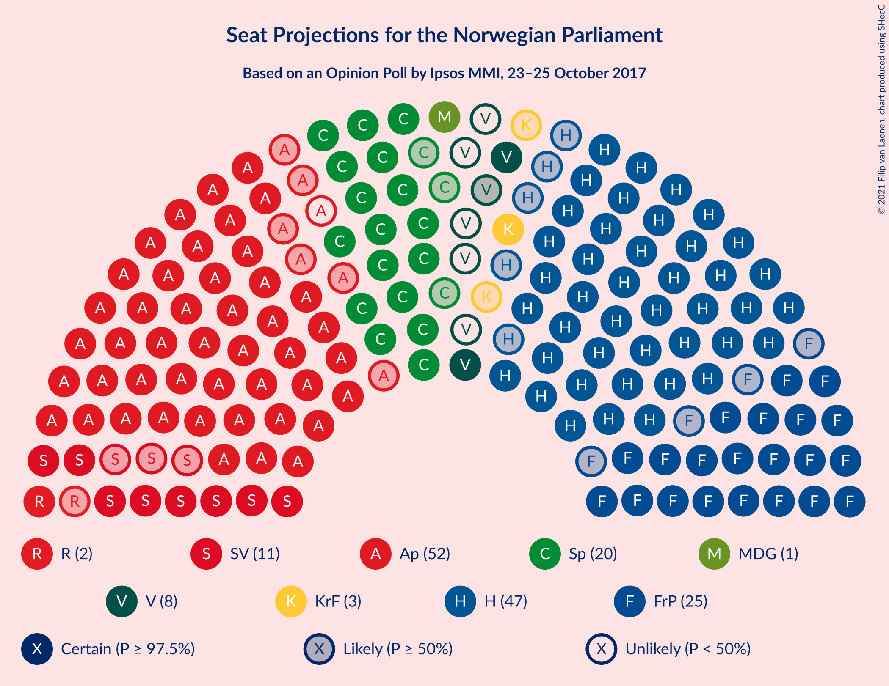
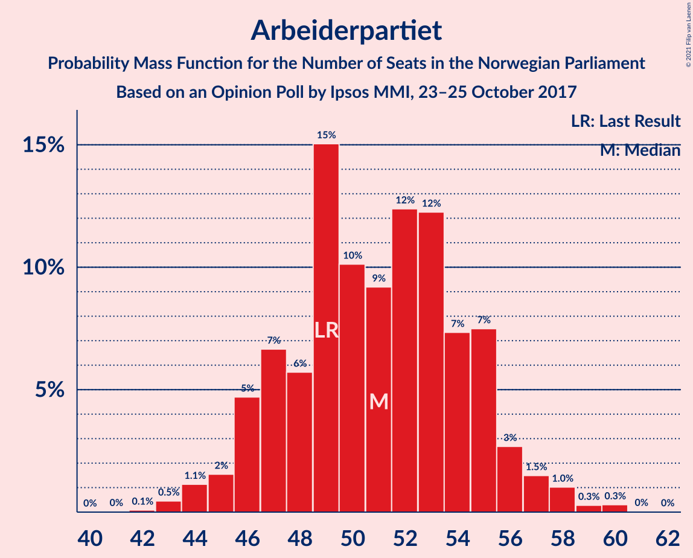
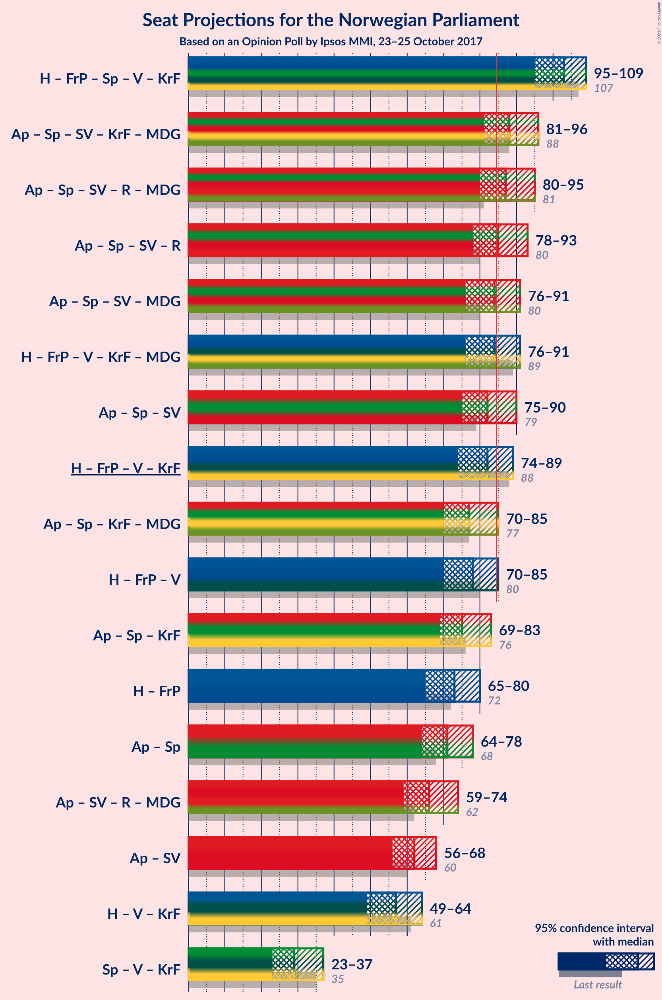
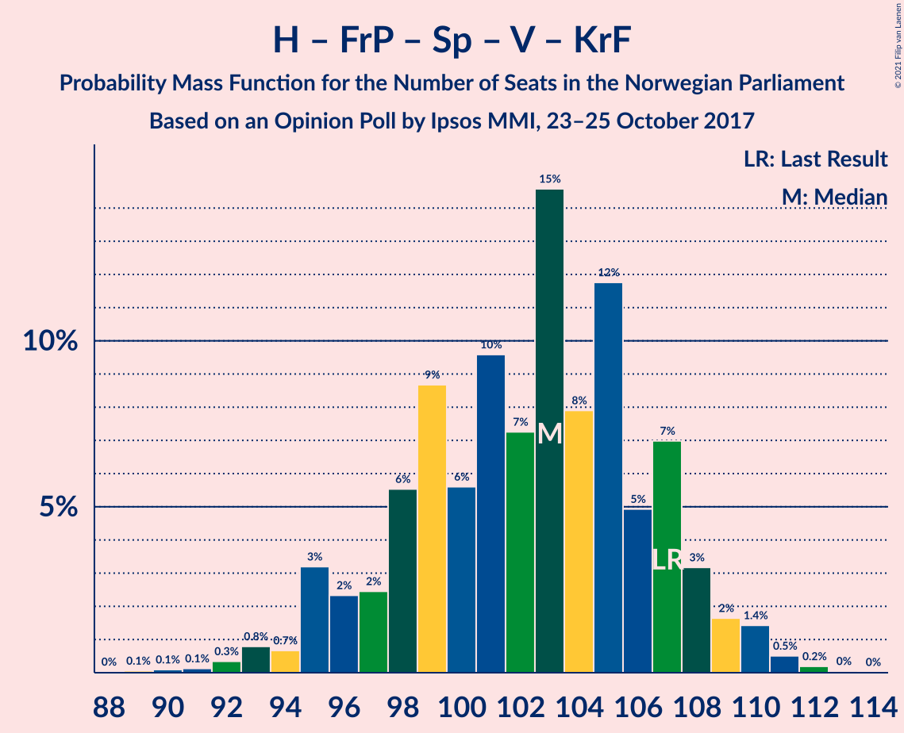
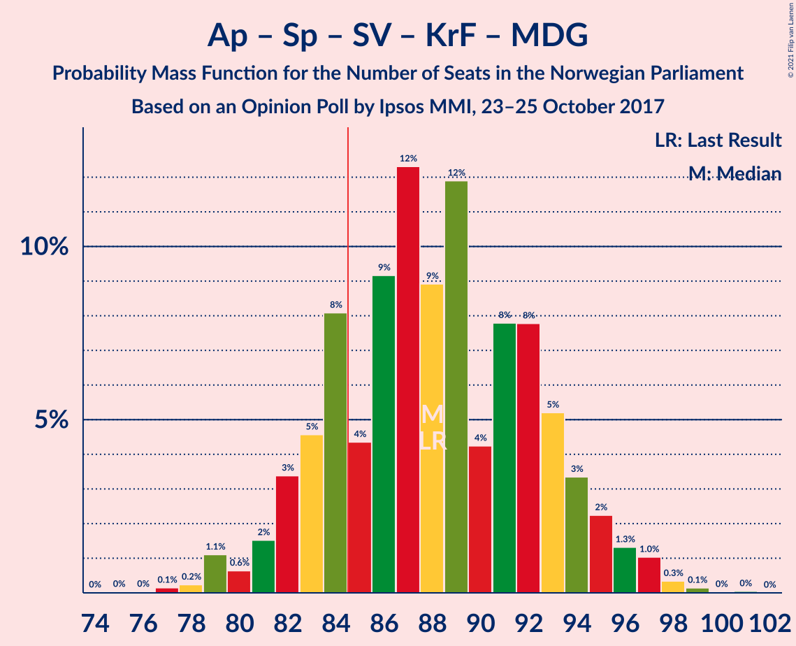
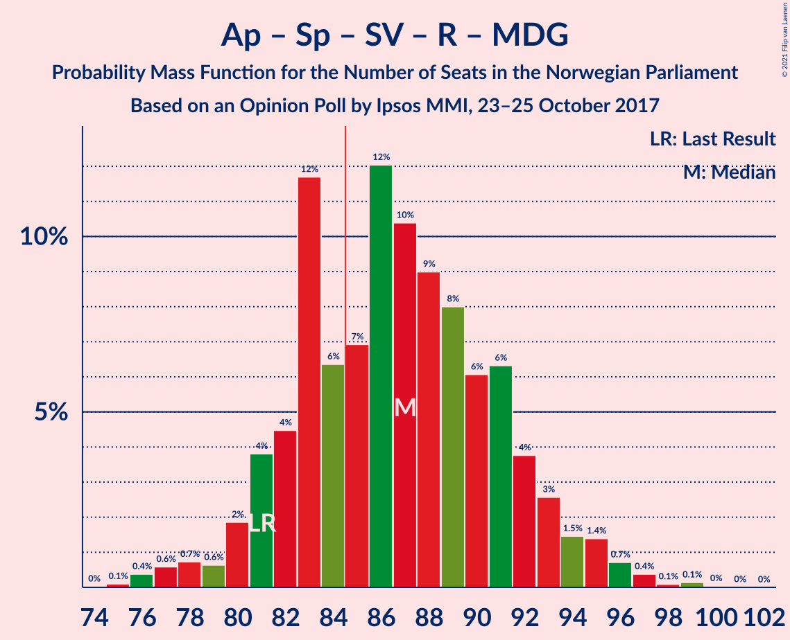
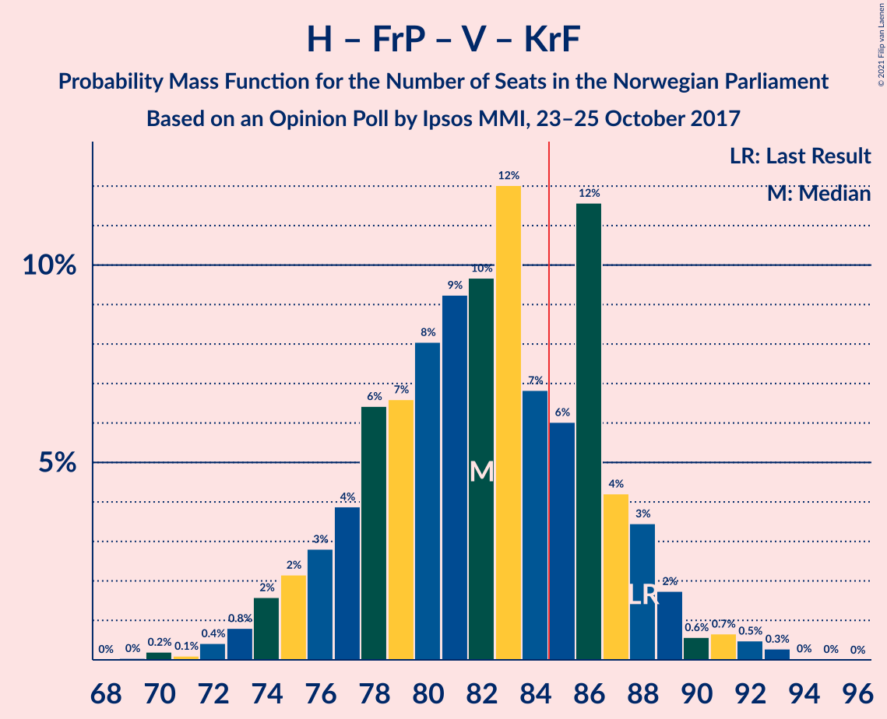
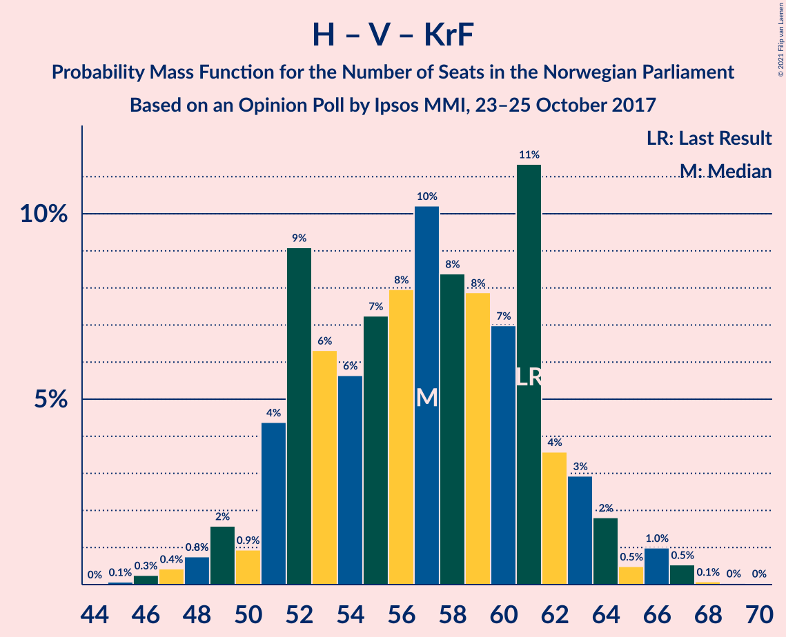

# Opinion Poll by Ipsos MMI, 23–25 October 2017

<a href="#voting-intentions">Voting Intentions</a> | <a href="#seats">Seats</a> | <a href="#coalitions">Coalitions</a> | <a href="#technical-information">Technical Information</a>

## Voting Intentions

### Confidence Intervals

| Party | Last Result | Poll Result | 80% Confidence Interval | 90% Confidence Interval | 95% Confidence Interval | 99% Confidence Interval |
|:-----:|:-----------:|:-----------:|:-----------------------:|:-----------------------:|:-----------------------:|:-----------------------:|
| Arbeiderpartiet | 27.4% | 27.3% | 25.5–29.3% |25.0–29.8% |24.6–30.3% |23.8–31.2% |
| Høyre | 25.0% | 25.8% | 24.0–27.6% |23.5–28.2% |23.1–28.7% |22.3–29.6% |
| Fremskrittspartiet | 15.2% | 13.5% | 12.2–15.0% |11.8–15.5% |11.5–15.9% |10.9–16.6% |
| Senterpartiet | 10.3% | 10.9% | 9.7–12.3% |9.3–12.7% |9.0–13.0% |8.5–13.7% |
| Sosialistisk Venstreparti | 6.0% | 5.9% | 5.0–7.0% |4.8–7.3% |4.6–7.6% |4.2–8.2% |
| Venstre | 4.4% | 3.8% | 3.1–4.7% |2.9–5.0% |2.8–5.2% |2.5–5.7% |
| Kristelig Folkeparti | 4.2% | 3.7% | 3.0–4.6% |2.8–4.9% |2.7–5.1% |2.4–5.6% |
| Rødt | 2.4% | 3.4% | 2.7–4.3% |2.5–4.5% |2.4–4.7% |2.1–5.2% |
| Miljøpartiet De Grønne | 3.2% | 2.9% | 2.3–3.7% |2.1–3.9% |2.0–4.1% |1.7–4.6% |

*Note:* The poll result column reflects the actual value used in the calculations. Published results may vary slightly, and in addition be rounded to fewer digits.

## Seats

### Confidence Intervals

| Party | Last Result | Median | 80% Confidence Interval | 90% Confidence Interval | 95% Confidence Interval | 99% Confidence Interval |
|:-----:|:-----------:|:------:|:-----------------------:|:-----------------------:|:-----------------------:|:-----------------------:|
| <a href="#arbeiderpartiet">Arbeiderpartiet</a> | 49 | 51 | 47–55 |46–56 |45–57 |43–59 |
| <a href="#høyre">Høyre</a> | 45 | 47 | 44–52 |43–53 |42–53 |40–56 |
| <a href="#fremskrittspartiet">Fremskrittspartiet</a> | 27 | 25 | 22–28 |21–29 |21–30 |20–31 |
| <a href="#senterpartiet">Senterpartiet</a> | 19 | 20 | 18–23 |17–24 |17–25 |16–26 |
| <a href="#sosialistisk-venstreparti">Sosialistisk Venstreparti</a> | 11 | 11 | 9–13 |9–14 |8–14 |8–15 |
| <a href="#venstre">Venstre</a> | 8 | 3 | 2–9 |2–9 |2–10 |2–10 |
| <a href="#kristelig-folkeparti">Kristelig Folkeparti</a> | 8 | 3 | 1–8 |1–9 |1–9 |1–10 |
| <a href="#rødt">Rødt</a> | 1 | 2 | 1–8 |1–8 |1–9 |1–9 |
| <a href="#miljøpartiet-de-grønne">Miljøpartiet De Grønne</a> | 1 | 1 | 1–2 |1–3 |1–7 |0–8 |

### Arbeiderpartiet

*For a full overview of the results for this party, see the [Arbeiderpartiet](party-arbeiderpartiet.html) page.*

| Number of Seats | Probability | Accumulated | Special Marks |
|:---------------:|:-----------:|:-----------:|:-------------:|
| 42 | 0.1% | 100% |  |
| 43 | 0.5% | 99.9% |  |
| 44 | 1.1% | 99.4% |  |
| 45 | 2% | 98% |  |
| 46 | 5% | 97% |  |
| 47 | 7% | 92% |  |
| 48 | 6% | 85% |  |
| 49 | 15% | 80% | Last Result |
| 50 | 10% | 65% |  |
| 51 | 9% | 54% | Median |
| 52 | 12% | 45% |  |
| 53 | 12% | 33% |  |
| 54 | 7% | 21% |  |
| 55 | 7% | 13% |  |
| 56 | 3% | 6% |  |
| 57 | 1.5% | 3% |  |
| 58 | 1.0% | 2% |  |
| 59 | 0.3% | 0.6% |  |
| 60 | 0.3% | 0.4% |  |
| 61 | 0% | 0.1% |  |
| 62 | 0% | 0% |  |

### Høyre

*For a full overview of the results for this party, see the [Høyre](party-høyre.html) page.*

| Number of Seats | Probability | Accumulated | Special Marks |
|:---------------:|:-----------:|:-----------:|:-------------:|
| 39 | 0.1% | 100% |  |
| 40 | 0.5% | 99.8% |  |
| 41 | 1.2% | 99.3% |  |
| 42 | 1.4% | 98% |  |
| 43 | 3% | 97% |  |
| 44 | 6% | 94% |  |
| 45 | 14% | 87% | Last Result |
| 46 | 11% | 73% |  |
| 47 | 13% | 62% | Median |
| 48 | 13% | 50% |  |
| 49 | 12% | 36% |  |
| 50 | 4% | 24% |  |
| 51 | 7% | 20% |  |
| 52 | 7% | 13% |  |
| 53 | 3% | 5% |  |
| 54 | 1.4% | 2% |  |
| 55 | 0.2% | 0.8% |  |
| 56 | 0.1% | 0.5% |  |
| 57 | 0.3% | 0.4% |  |
| 58 | 0.1% | 0.1% |  |
| 59 | 0% | 0% |  |

### Fremskrittspartiet

*For a full overview of the results for this party, see the [Fremskrittspartiet](party-fremskrittspartiet.html) page.*

| Number of Seats | Probability | Accumulated | Special Marks |
|:---------------:|:-----------:|:-----------:|:-------------:|
| 18 | 0.1% | 100% |  |
| 19 | 0.4% | 99.9% |  |
| 20 | 1.4% | 99.5% |  |
| 21 | 4% | 98% |  |
| 22 | 7% | 94% |  |
| 23 | 8% | 87% |  |
| 24 | 14% | 80% |  |
| 25 | 21% | 66% | Median |
| 26 | 15% | 45% |  |
| 27 | 15% | 30% | Last Result |
| 28 | 8% | 14% |  |
| 29 | 3% | 6% |  |
| 30 | 3% | 3% |  |
| 31 | 0.4% | 0.7% |  |
| 32 | 0.2% | 0.3% |  |
| 33 | 0.1% | 0.1% |  |
| 34 | 0% | 0% |  |

### Senterpartiet

*For a full overview of the results for this party, see the [Senterpartiet](party-senterpartiet.html) page.*

| Number of Seats | Probability | Accumulated | Special Marks |
|:---------------:|:-----------:|:-----------:|:-------------:|
| 14 | 0.1% | 100% |  |
| 15 | 0.3% | 99.9% |  |
| 16 | 2% | 99.6% |  |
| 17 | 6% | 98% |  |
| 18 | 14% | 91% |  |
| 19 | 16% | 77% | Last Result |
| 20 | 21% | 61% | Median |
| 21 | 14% | 40% |  |
| 22 | 11% | 26% |  |
| 23 | 8% | 16% |  |
| 24 | 4% | 7% |  |
| 25 | 2% | 3% |  |
| 26 | 0.4% | 0.5% |  |
| 27 | 0.1% | 0.1% |  |
| 28 | 0% | 0% |  |

### Sosialistisk Venstreparti

*For a full overview of the results for this party, see the [Sosialistisk Venstreparti](party-sosialistiskvenstreparti.html) page.*

| Number of Seats | Probability | Accumulated | Special Marks |
|:---------------:|:-----------:|:-----------:|:-------------:|
| 2 | 0.1% | 100% |  |
| 3 | 0.1% | 99.9% |  |
| 4 | 0% | 99.8% |  |
| 5 | 0% | 99.8% |  |
| 6 | 0% | 99.8% |  |
| 7 | 0.2% | 99.8% |  |
| 8 | 2% | 99.6% |  |
| 9 | 14% | 97% |  |
| 10 | 21% | 84% |  |
| 11 | 22% | 63% | Last Result, Median |
| 12 | 24% | 41% |  |
| 13 | 11% | 17% |  |
| 14 | 4% | 6% |  |
| 15 | 1.4% | 2% |  |
| 16 | 0.3% | 0.3% |  |
| 17 | 0% | 0% |  |

### Venstre

*For a full overview of the results for this party, see the [Venstre](party-venstre.html) page.*

| Number of Seats | Probability | Accumulated | Special Marks |
|:---------------:|:-----------:|:-----------:|:-------------:|
| 1 | 0.2% | 100% |  |
| 2 | 48% | 99.8% |  |
| 3 | 5% | 52% | Median |
| 4 | 0% | 46% |  |
| 5 | 0% | 46% |  |
| 6 | 0.2% | 46% |  |
| 7 | 6% | 46% |  |
| 8 | 26% | 40% | Last Result |
| 9 | 11% | 14% |  |
| 10 | 3% | 3% |  |
| 11 | 0.4% | 0.4% |  |
| 12 | 0% | 0% |  |

### Kristelig Folkeparti

*For a full overview of the results for this party, see the [Kristelig Folkeparti](party-kristeligfolkeparti.html) page.*

| Number of Seats | Probability | Accumulated | Special Marks |
|:---------------:|:-----------:|:-----------:|:-------------:|
| 0 | 0.2% | 100% |  |
| 1 | 12% | 99.8% |  |
| 2 | 9% | 88% |  |
| 3 | 47% | 79% | Median |
| 4 | 0% | 33% |  |
| 5 | 0% | 33% |  |
| 6 | 0.2% | 33% |  |
| 7 | 9% | 32% |  |
| 8 | 14% | 24% | Last Result |
| 9 | 7% | 10% |  |
| 10 | 2% | 2% |  |
| 11 | 0.2% | 0.2% |  |
| 12 | 0% | 0% |  |

### Rødt

*For a full overview of the results for this party, see the [Rødt](party-rødt.html) page.*

| Number of Seats | Probability | Accumulated | Special Marks |
|:---------------:|:-----------:|:-----------:|:-------------:|
| 1 | 14% | 100% | Last Result |
| 2 | 69% | 86% | Median |
| 3 | 0% | 17% |  |
| 4 | 0% | 17% |  |
| 5 | 0% | 17% |  |
| 6 | 0.2% | 17% |  |
| 7 | 5% | 17% |  |
| 8 | 8% | 11% |  |
| 9 | 3% | 3% |  |
| 10 | 0.3% | 0.4% |  |
| 11 | 0% | 0% |  |

### Miljøpartiet De Grønne

*For a full overview of the results for this party, see the [Miljøpartiet De Grønne](party-miljøpartietdegrønne.html) page.*

| Number of Seats | Probability | Accumulated | Special Marks |
|:---------------:|:-----------:|:-----------:|:-------------:|
| 0 | 1.5% | 100% |  |
| 1 | 61% | 98.5% | Last Result, Median |
| 2 | 30% | 38% |  |
| 3 | 5% | 8% |  |
| 4 | 0.4% | 3% |  |
| 5 | 0% | 3% |  |
| 6 | 0% | 3% |  |
| 7 | 0.6% | 3% |  |
| 8 | 2% | 2% |  |
| 9 | 0.3% | 0.4% |  |
| 10 | 0% | 0% |  |

## Coalitions

### Confidence Intervals

| Coalition | Last Result | Median | Majority? | 80% Confidence Interval | 90% Confidence Interval | 95% Confidence Interval | 99% Confidence Interval |
|:---------:|:-----------:|:------:|:---------:|:-----------------------:|:-----------------------:|:-----------------------:|:-----------------------:|
| Høyre – Fremskrittspartiet – Senterpartiet – Venstre – Kristelig Folkeparti | 107 | 103 | 100% | 97–107 | 95–108 | 95–109 | 92–111 |
| Arbeiderpartiet – Senterpartiet – Sosialistisk Venstreparti – Kristelig Folkeparti – Miljøpartiet De Grønne | 88 | 88 | 80% | 83–93 | 82–95 | 81–96 | 79–98 |
| Arbeiderpartiet – Senterpartiet – Sosialistisk Venstreparti – Rødt – Miljøpartiet De Grønne | 81 | 87 | 69% | 82–92 | 81–93 | 80–95 | 76–97 |
| Arbeiderpartiet – Senterpartiet – Sosialistisk Venstreparti – Rødt | 80 | 85 | 55% | 80–90 | 79–91 | 78–93 | 75–95 |
| Arbeiderpartiet – Senterpartiet – Sosialistisk Venstreparti – Miljøpartiet De Grønne | 80 | 84 | 42% | 79–89 | 77–90 | 76–91 | 74–93 |
| Høyre – Fremskrittspartiet – Venstre – Kristelig Folkeparti – Miljøpartiet De Grønne | 89 | 84 | 42% | 79–88 | 78–89 | 76–91 | 73–94 |
| Arbeiderpartiet – Senterpartiet – Sosialistisk Venstreparti | 79 | 82 | 28% | 78–87 | 76–88 | 75–90 | 73–91 |
| Høyre – Fremskrittspartiet – Venstre – Kristelig Folkeparti | 88 | 82 | 29% | 77–87 | 75–88 | 74–89 | 72–92 |
| Arbeiderpartiet – Senterpartiet – Kristelig Folkeparti – Miljøpartiet De Grønne | 77 | 77 | 4% | 72–83 | 71–84 | 70–85 | 68–87 |
| Høyre – Fremskrittspartiet – Venstre | 80 | 78 | 4% | 73–83 | 71–84 | 70–85 | 68–87 |
| Arbeiderpartiet – Senterpartiet – Kristelig Folkeparti | 76 | 75 | 0.8% | 70–81 | 69–82 | 69–83 | 66–85 |
| Høyre – Fremskrittspartiet | 72 | 73 | 0% | 68–77 | 67–79 | 65–80 | 63–82 |
| Arbeiderpartiet – Senterpartiet | 68 | 71 | 0% | 67–76 | 65–77 | 64–78 | 62–81 |
| Arbeiderpartiet – Sosialistisk Venstreparti – Rødt – Miljøpartiet De Grønne | 62 | 66 | 0% | 62–71 | 61–73 | 59–74 | 58–76 |
| Arbeiderpartiet – Sosialistisk Venstreparti | 60 | 62 | 0% | 58–66 | 56–68 | 56–68 | 54–70 |
| Høyre – Venstre – Kristelig Folkeparti | 61 | 57 | 0% | 52–62 | 51–63 | 49–64 | 47–67 |
| Senterpartiet – Venstre – Kristelig Folkeparti | 35 | 29 | 0% | 25–35 | 23–36 | 23–37 | 21–40 |

### Høyre – Fremskrittspartiet – Senterpartiet – Venstre – Kristelig Folkeparti

| Number of Seats | Probability | Accumulated | Special Marks |
|:---------------:|:-----------:|:-----------:|:-------------:|
| 88 | 0% | 100% |  |
| 89 | 0.1% | 99.9% |  |
| 90 | 0.1% | 99.9% |  |
| 91 | 0.1% | 99.8% |  |
| 92 | 0.3% | 99.7% |  |
| 93 | 0.8% | 99.3% |  |
| 94 | 0.7% | 98.5% |  |
| 95 | 3% | 98% |  |
| 96 | 2% | 95% |  |
| 97 | 2% | 92% |  |
| 98 | 6% | 90% | Median |
| 99 | 9% | 84% |  |
| 100 | 6% | 76% |  |
| 101 | 10% | 70% |  |
| 102 | 7% | 60% |  |
| 103 | 15% | 53% |  |
| 104 | 8% | 39% |  |
| 105 | 12% | 31% |  |
| 106 | 5% | 19% |  |
| 107 | 7% | 14% | Last Result |
| 108 | 3% | 7% |  |
| 109 | 2% | 4% |  |
| 110 | 1.4% | 2% |  |
| 111 | 0.5% | 0.8% |  |
| 112 | 0.2% | 0.3% |  |
| 113 | 0% | 0.1% |  |
| 114 | 0% | 0% |  |

### Arbeiderpartiet – Senterpartiet – Sosialistisk Venstreparti – Kristelig Folkeparti – Miljøpartiet De Grønne

| Number of Seats | Probability | Accumulated | Special Marks |
|:---------------:|:-----------:|:-----------:|:-------------:|
| 75 | 0% | 100% |  |
| 76 | 0% | 99.9% |  |
| 77 | 0.1% | 99.9% |  |
| 78 | 0.2% | 99.8% |  |
| 79 | 1.1% | 99.5% |  |
| 80 | 0.6% | 98% |  |
| 81 | 2% | 98% |  |
| 82 | 3% | 96% |  |
| 83 | 5% | 93% |  |
| 84 | 8% | 88% |  |
| 85 | 4% | 80% | Majority |
| 86 | 9% | 76% | Median |
| 87 | 12% | 67% |  |
| 88 | 9% | 54% | Last Result |
| 89 | 12% | 45% |  |
| 90 | 4% | 34% |  |
| 91 | 8% | 29% |  |
| 92 | 8% | 22% |  |
| 93 | 5% | 14% |  |
| 94 | 3% | 9% |  |
| 95 | 2% | 5% |  |
| 96 | 1.3% | 3% |  |
| 97 | 1.0% | 2% |  |
| 98 | 0.3% | 0.6% |  |
| 99 | 0.1% | 0.2% |  |
| 100 | 0% | 0.1% |  |
| 101 | 0% | 0.1% |  |
| 102 | 0% | 0% |  |

### Arbeiderpartiet – Senterpartiet – Sosialistisk Venstreparti – Rødt – Miljøpartiet De Grønne

| Number of Seats | Probability | Accumulated | Special Marks |
|:---------------:|:-----------:|:-----------:|:-------------:|
| 75 | 0.1% | 100% |  |
| 76 | 0.4% | 99.9% |  |
| 77 | 0.6% | 99.5% |  |
| 78 | 0.7% | 98.9% |  |
| 79 | 0.6% | 98% |  |
| 80 | 2% | 98% |  |
| 81 | 4% | 96% | Last Result |
| 82 | 4% | 92% |  |
| 83 | 12% | 87% |  |
| 84 | 6% | 76% |  |
| 85 | 7% | 69% | Median, Majority |
| 86 | 12% | 62% |  |
| 87 | 10% | 50% |  |
| 88 | 9% | 40% |  |
| 89 | 8% | 31% |  |
| 90 | 6% | 23% |  |
| 91 | 6% | 17% |  |
| 92 | 4% | 11% |  |
| 93 | 3% | 7% |  |
| 94 | 1.5% | 4% |  |
| 95 | 1.4% | 3% |  |
| 96 | 0.7% | 1.4% |  |
| 97 | 0.4% | 0.7% |  |
| 98 | 0.1% | 0.3% |  |
| 99 | 0.1% | 0.2% |  |
| 100 | 0% | 0.1% |  |
| 101 | 0% | 0% |  |

### Arbeiderpartiet – Senterpartiet – Sosialistisk Venstreparti – Rødt

| Number of Seats | Probability | Accumulated | Special Marks |
|:---------------:|:-----------:|:-----------:|:-------------:|
| 73 | 0% | 100% |  |
| 74 | 0.2% | 99.9% |  |
| 75 | 0.6% | 99.7% |  |
| 76 | 0.5% | 99.1% |  |
| 77 | 1.0% | 98.7% |  |
| 78 | 1.3% | 98% |  |
| 79 | 2% | 96% |  |
| 80 | 5% | 95% | Last Result |
| 81 | 8% | 90% |  |
| 82 | 9% | 82% |  |
| 83 | 7% | 72% |  |
| 84 | 10% | 66% | Median |
| 85 | 13% | 55% | Majority |
| 86 | 7% | 43% |  |
| 87 | 8% | 35% |  |
| 88 | 8% | 28% |  |
| 89 | 5% | 19% |  |
| 90 | 7% | 14% |  |
| 91 | 3% | 7% |  |
| 92 | 2% | 4% |  |
| 93 | 0.6% | 3% |  |
| 94 | 2% | 2% |  |
| 95 | 0.2% | 0.6% |  |
| 96 | 0.3% | 0.5% |  |
| 97 | 0.1% | 0.2% |  |
| 98 | 0.1% | 0.2% |  |
| 99 | 0% | 0% |  |

### Arbeiderpartiet – Senterpartiet – Sosialistisk Venstreparti – Miljøpartiet De Grønne

| Number of Seats | Probability | Accumulated | Special Marks |
|:---------------:|:-----------:|:-----------:|:-------------:|
| 72 | 0.1% | 100% |  |
| 73 | 0.1% | 99.9% |  |
| 74 | 0.6% | 99.8% |  |
| 75 | 0.9% | 99.2% |  |
| 76 | 2% | 98% |  |
| 77 | 0.9% | 96% |  |
| 78 | 3% | 95% |  |
| 79 | 4% | 92% |  |
| 80 | 7% | 87% | Last Result |
| 81 | 12% | 81% |  |
| 82 | 7% | 69% |  |
| 83 | 6% | 62% | Median |
| 84 | 15% | 57% |  |
| 85 | 9% | 42% | Majority |
| 86 | 9% | 33% |  |
| 87 | 5% | 24% |  |
| 88 | 7% | 19% |  |
| 89 | 5% | 12% |  |
| 90 | 2% | 7% |  |
| 91 | 3% | 5% |  |
| 92 | 1.1% | 2% |  |
| 93 | 0.5% | 1.0% |  |
| 94 | 0.3% | 0.5% |  |
| 95 | 0.1% | 0.2% |  |
| 96 | 0% | 0.1% |  |
| 97 | 0% | 0% |  |

### Høyre – Fremskrittspartiet – Venstre – Kristelig Folkeparti – Miljøpartiet De Grønne

| Number of Seats | Probability | Accumulated | Special Marks |
|:---------------:|:-----------:|:-----------:|:-------------:|
| 71 | 0.2% | 100% |  |
| 72 | 0.1% | 99.8% |  |
| 73 | 0.3% | 99.7% |  |
| 74 | 0.2% | 99.4% |  |
| 75 | 2% | 99.2% |  |
| 76 | 0.7% | 98% |  |
| 77 | 2% | 97% |  |
| 78 | 3% | 95% |  |
| 79 | 7% | 92% | Median |
| 80 | 6% | 85% |  |
| 81 | 9% | 79% |  |
| 82 | 8% | 70% |  |
| 83 | 7% | 63% |  |
| 84 | 13% | 55% |  |
| 85 | 9% | 42% | Majority |
| 86 | 7% | 33% |  |
| 87 | 9% | 26% |  |
| 88 | 8% | 17% |  |
| 89 | 4% | 9% | Last Result |
| 90 | 2% | 5% |  |
| 91 | 1.1% | 3% |  |
| 92 | 0.9% | 2% |  |
| 93 | 0.3% | 1.0% |  |
| 94 | 0.4% | 0.7% |  |
| 95 | 0.2% | 0.2% |  |
| 96 | 0% | 0.1% |  |
| 97 | 0% | 0% |  |

### Arbeiderpartiet – Senterpartiet – Sosialistisk Venstreparti

| Number of Seats | Probability | Accumulated | Special Marks |
|:---------------:|:-----------:|:-----------:|:-------------:|
| 70 | 0% | 100% |  |
| 71 | 0.1% | 99.9% |  |
| 72 | 0.3% | 99.8% |  |
| 73 | 0.8% | 99.5% |  |
| 74 | 1.0% | 98.7% |  |
| 75 | 3% | 98% |  |
| 76 | 2% | 95% |  |
| 77 | 3% | 93% |  |
| 78 | 6% | 90% |  |
| 79 | 8% | 84% | Last Result |
| 80 | 11% | 76% |  |
| 81 | 7% | 65% |  |
| 82 | 10% | 58% | Median |
| 83 | 13% | 48% |  |
| 84 | 7% | 35% |  |
| 85 | 7% | 28% | Majority |
| 86 | 7% | 21% |  |
| 87 | 5% | 14% |  |
| 88 | 6% | 9% |  |
| 89 | 1.0% | 4% |  |
| 90 | 2% | 3% |  |
| 91 | 0.2% | 0.7% |  |
| 92 | 0.4% | 0.5% |  |
| 93 | 0% | 0.1% |  |
| 94 | 0% | 0.1% |  |
| 95 | 0% | 0% |  |

### Høyre – Fremskrittspartiet – Venstre – Kristelig Folkeparti

| Number of Seats | Probability | Accumulated | Special Marks |
|:---------------:|:-----------:|:-----------:|:-------------:|
| 69 | 0% | 100% |  |
| 70 | 0.2% | 99.9% |  |
| 71 | 0.1% | 99.7% |  |
| 72 | 0.4% | 99.6% |  |
| 73 | 0.8% | 99.2% |  |
| 74 | 2% | 98% |  |
| 75 | 2% | 97% |  |
| 76 | 3% | 95% |  |
| 77 | 4% | 92% |  |
| 78 | 6% | 88% | Median |
| 79 | 7% | 82% |  |
| 80 | 8% | 75% |  |
| 81 | 9% | 67% |  |
| 82 | 10% | 58% |  |
| 83 | 12% | 48% |  |
| 84 | 7% | 36% |  |
| 85 | 6% | 29% | Majority |
| 86 | 12% | 23% |  |
| 87 | 4% | 11% |  |
| 88 | 3% | 7% | Last Result |
| 89 | 2% | 4% |  |
| 90 | 0.6% | 2% |  |
| 91 | 0.7% | 2% |  |
| 92 | 0.5% | 0.8% |  |
| 93 | 0.3% | 0.3% |  |
| 94 | 0% | 0.1% |  |
| 95 | 0% | 0% |  |

### Arbeiderpartiet – Senterpartiet – Kristelig Folkeparti – Miljøpartiet De Grønne

| Number of Seats | Probability | Accumulated | Special Marks |
|:---------------:|:-----------:|:-----------:|:-------------:|
| 65 | 0.1% | 100% |  |
| 66 | 0.1% | 99.9% |  |
| 67 | 0.2% | 99.8% |  |
| 68 | 0.5% | 99.6% |  |
| 69 | 0.8% | 99.1% |  |
| 70 | 3% | 98% |  |
| 71 | 3% | 96% |  |
| 72 | 7% | 93% |  |
| 73 | 5% | 86% |  |
| 74 | 8% | 81% |  |
| 75 | 9% | 73% | Median |
| 76 | 10% | 65% |  |
| 77 | 10% | 54% | Last Result |
| 78 | 9% | 45% |  |
| 79 | 7% | 36% |  |
| 80 | 12% | 28% |  |
| 81 | 3% | 17% |  |
| 82 | 4% | 14% |  |
| 83 | 5% | 10% |  |
| 84 | 2% | 5% |  |
| 85 | 2% | 4% | Majority |
| 86 | 0.6% | 1.3% |  |
| 87 | 0.4% | 0.7% |  |
| 88 | 0.2% | 0.3% |  |
| 89 | 0% | 0.1% |  |
| 90 | 0% | 0% |  |

### Høyre – Fremskrittspartiet – Venstre

| Number of Seats | Probability | Accumulated | Special Marks |
|:---------------:|:-----------:|:-----------:|:-------------:|
| 65 | 0% | 100% |  |
| 66 | 0.1% | 99.9% |  |
| 67 | 0.2% | 99.8% |  |
| 68 | 0.4% | 99.6% |  |
| 69 | 0.6% | 99.2% |  |
| 70 | 1.4% | 98.7% |  |
| 71 | 2% | 97% |  |
| 72 | 4% | 95% |  |
| 73 | 6% | 91% |  |
| 74 | 7% | 85% |  |
| 75 | 7% | 78% | Median |
| 76 | 10% | 71% |  |
| 77 | 5% | 61% |  |
| 78 | 8% | 56% |  |
| 79 | 13% | 48% |  |
| 80 | 10% | 35% | Last Result |
| 81 | 8% | 25% |  |
| 82 | 4% | 16% |  |
| 83 | 7% | 12% |  |
| 84 | 2% | 5% |  |
| 85 | 2% | 4% | Majority |
| 86 | 1.1% | 2% |  |
| 87 | 0.3% | 0.7% |  |
| 88 | 0.3% | 0.4% |  |
| 89 | 0.1% | 0.1% |  |
| 90 | 0% | 0.1% |  |
| 91 | 0% | 0% |  |

### Arbeiderpartiet – Senterpartiet – Kristelig Folkeparti

| Number of Seats | Probability | Accumulated | Special Marks |
|:---------------:|:-----------:|:-----------:|:-------------:|
| 64 | 0.1% | 100% |  |
| 65 | 0.2% | 99.9% |  |
| 66 | 0.3% | 99.7% |  |
| 67 | 0.7% | 99.4% |  |
| 68 | 1.1% | 98.8% |  |
| 69 | 3% | 98% |  |
| 70 | 6% | 94% |  |
| 71 | 4% | 88% |  |
| 72 | 7% | 84% |  |
| 73 | 11% | 77% |  |
| 74 | 7% | 67% | Median |
| 75 | 11% | 60% |  |
| 76 | 10% | 49% | Last Result |
| 77 | 9% | 39% |  |
| 78 | 7% | 30% |  |
| 79 | 9% | 23% |  |
| 80 | 3% | 14% |  |
| 81 | 4% | 11% |  |
| 82 | 3% | 7% |  |
| 83 | 2% | 4% |  |
| 84 | 1.3% | 2% |  |
| 85 | 0.6% | 0.8% | Majority |
| 86 | 0.1% | 0.2% |  |
| 87 | 0.1% | 0.1% |  |
| 88 | 0% | 0% |  |

### Høyre – Fremskrittspartiet

| Number of Seats | Probability | Accumulated | Special Marks |
|:---------------:|:-----------:|:-----------:|:-------------:|
| 61 | 0.1% | 100% |  |
| 62 | 0.1% | 99.9% |  |
| 63 | 0.3% | 99.8% |  |
| 64 | 0.6% | 99.4% |  |
| 65 | 2% | 98.8% |  |
| 66 | 1.1% | 97% |  |
| 67 | 3% | 95% |  |
| 68 | 4% | 93% |  |
| 69 | 5% | 89% |  |
| 70 | 10% | 84% |  |
| 71 | 10% | 75% |  |
| 72 | 12% | 65% | Last Result, Median |
| 73 | 10% | 53% |  |
| 74 | 9% | 43% |  |
| 75 | 9% | 34% |  |
| 76 | 9% | 24% |  |
| 77 | 6% | 15% |  |
| 78 | 2% | 9% |  |
| 79 | 3% | 7% |  |
| 80 | 3% | 4% |  |
| 81 | 0.2% | 1.1% |  |
| 82 | 0.4% | 0.9% |  |
| 83 | 0.4% | 0.5% |  |
| 84 | 0.1% | 0.1% |  |
| 85 | 0% | 0% | Majority |

### Arbeiderpartiet – Senterpartiet

| Number of Seats | Probability | Accumulated | Special Marks |
|:---------------:|:-----------:|:-----------:|:-------------:|
| 60 | 0% | 100% |  |
| 61 | 0.2% | 99.9% |  |
| 62 | 0.5% | 99.7% |  |
| 63 | 0.7% | 99.2% |  |
| 64 | 2% | 98.5% |  |
| 65 | 3% | 97% |  |
| 66 | 3% | 94% |  |
| 67 | 8% | 91% |  |
| 68 | 9% | 83% | Last Result |
| 69 | 8% | 74% |  |
| 70 | 12% | 66% |  |
| 71 | 9% | 54% | Median |
| 72 | 10% | 46% |  |
| 73 | 8% | 36% |  |
| 74 | 6% | 28% |  |
| 75 | 8% | 22% |  |
| 76 | 8% | 14% |  |
| 77 | 2% | 5% |  |
| 78 | 2% | 4% |  |
| 79 | 1.2% | 2% |  |
| 80 | 0.2% | 0.7% |  |
| 81 | 0.3% | 0.5% |  |
| 82 | 0.2% | 0.2% |  |
| 83 | 0.1% | 0.1% |  |
| 84 | 0% | 0% |  |

### Arbeiderpartiet – Sosialistisk Venstreparti – Rødt – Miljøpartiet De Grønne

| Number of Seats | Probability | Accumulated | Special Marks |
|:---------------:|:-----------:|:-----------:|:-------------:|
| 56 | 0.1% | 100% |  |
| 57 | 0.3% | 99.9% |  |
| 58 | 0.6% | 99.6% |  |
| 59 | 2% | 99.0% |  |
| 60 | 2% | 97% |  |
| 61 | 3% | 96% |  |
| 62 | 7% | 92% | Last Result |
| 63 | 5% | 85% |  |
| 64 | 12% | 80% |  |
| 65 | 8% | 68% | Median |
| 66 | 15% | 60% |  |
| 67 | 8% | 45% |  |
| 68 | 10% | 37% |  |
| 69 | 5% | 28% |  |
| 70 | 9% | 22% |  |
| 71 | 5% | 13% |  |
| 72 | 2% | 8% |  |
| 73 | 2% | 6% |  |
| 74 | 2% | 4% |  |
| 75 | 0.6% | 2% |  |
| 76 | 0.7% | 1.2% |  |
| 77 | 0.3% | 0.5% |  |
| 78 | 0.1% | 0.2% |  |
| 79 | 0% | 0.1% |  |
| 80 | 0% | 0.1% |  |
| 81 | 0% | 0% |  |

### Arbeiderpartiet – Sosialistisk Venstreparti

| Number of Seats | Probability | Accumulated | Special Marks |
|:---------------:|:-----------:|:-----------:|:-------------:|
| 51 | 0% | 100% |  |
| 52 | 0.1% | 99.9% |  |
| 53 | 0.3% | 99.8% |  |
| 54 | 1.0% | 99.6% |  |
| 55 | 0.8% | 98.6% |  |
| 56 | 3% | 98% |  |
| 57 | 3% | 95% |  |
| 58 | 4% | 91% |  |
| 59 | 10% | 87% |  |
| 60 | 10% | 77% | Last Result |
| 61 | 11% | 68% |  |
| 62 | 11% | 57% | Median |
| 63 | 14% | 46% |  |
| 64 | 9% | 32% |  |
| 65 | 10% | 23% |  |
| 66 | 4% | 13% |  |
| 67 | 4% | 9% |  |
| 68 | 3% | 5% |  |
| 69 | 1.1% | 2% |  |
| 70 | 0.8% | 1.2% |  |
| 71 | 0.3% | 0.4% |  |
| 72 | 0.1% | 0.1% |  |
| 73 | 0% | 0% |  |

### Høyre – Venstre – Kristelig Folkeparti

| Number of Seats | Probability | Accumulated | Special Marks |
|:---------------:|:-----------:|:-----------:|:-------------:|
| 45 | 0.1% | 100% |  |
| 46 | 0.3% | 99.9% |  |
| 47 | 0.4% | 99.7% |  |
| 48 | 0.8% | 99.2% |  |
| 49 | 2% | 98% |  |
| 50 | 0.9% | 97% |  |
| 51 | 4% | 96% |  |
| 52 | 9% | 92% |  |
| 53 | 6% | 82% | Median |
| 54 | 6% | 76% |  |
| 55 | 7% | 71% |  |
| 56 | 8% | 63% |  |
| 57 | 10% | 55% |  |
| 58 | 8% | 45% |  |
| 59 | 8% | 37% |  |
| 60 | 7% | 29% |  |
| 61 | 11% | 22% | Last Result |
| 62 | 4% | 11% |  |
| 63 | 3% | 7% |  |
| 64 | 2% | 4% |  |
| 65 | 0.5% | 2% |  |
| 66 | 1.0% | 2% |  |
| 67 | 0.5% | 0.7% |  |
| 68 | 0.1% | 0.2% |  |
| 69 | 0% | 0.1% |  |
| 70 | 0% | 0% |  |

### Senterpartiet – Venstre – Kristelig Folkeparti

| Number of Seats | Probability | Accumulated | Special Marks |
|:---------------:|:-----------:|:-----------:|:-------------:|
| 19 | 0.1% | 100% |  |
| 20 | 0.4% | 99.9% |  |
| 21 | 0.6% | 99.6% |  |
| 22 | 1.4% | 99.0% |  |
| 23 | 4% | 98% |  |
| 24 | 3% | 94% |  |
| 25 | 9% | 90% |  |
| 26 | 4% | 82% | Median |
| 27 | 9% | 78% |  |
| 28 | 10% | 69% |  |
| 29 | 13% | 59% |  |
| 30 | 6% | 46% |  |
| 31 | 10% | 40% |  |
| 32 | 9% | 31% |  |
| 33 | 7% | 22% |  |
| 34 | 5% | 15% |  |
| 35 | 4% | 10% | Last Result |
| 36 | 3% | 7% |  |
| 37 | 2% | 4% |  |
| 38 | 0.5% | 2% |  |
| 39 | 0.4% | 1.1% |  |
| 40 | 0.6% | 0.7% |  |
| 41 | 0% | 0.1% |  |
| 42 | 0% | 0% |  |

## Technical Information

### Opinion Poll

+ **Polling firm:** Ipsos MMI
+ **Commissioner(s):** —
+ **Fieldwork period:** 23–25 October 2017

### Calculations

+ **Sample size:** 947
+ **Simulations done:** 1,048,576
+ **Error estimate:** 2.10%

