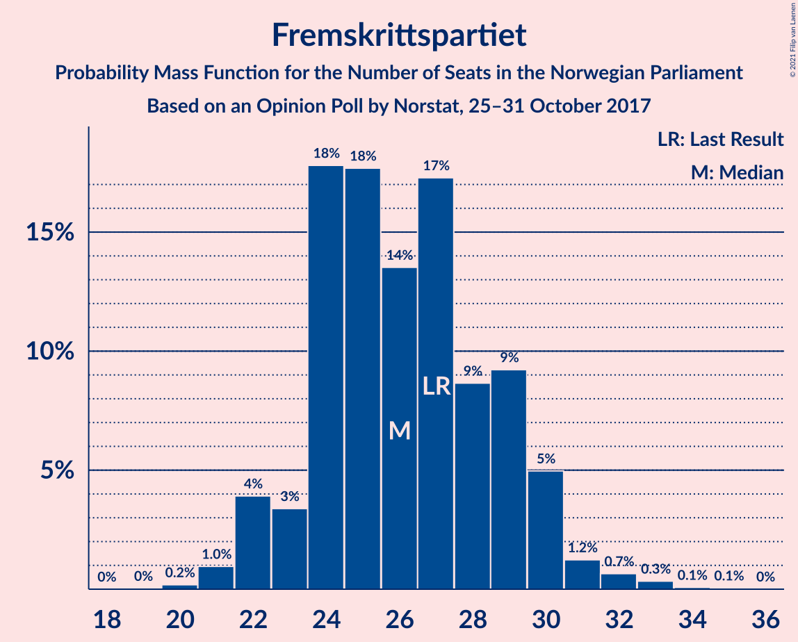
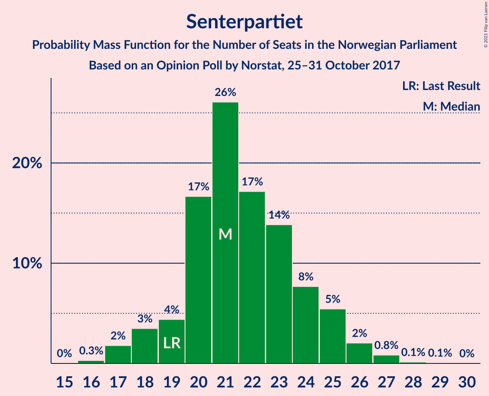
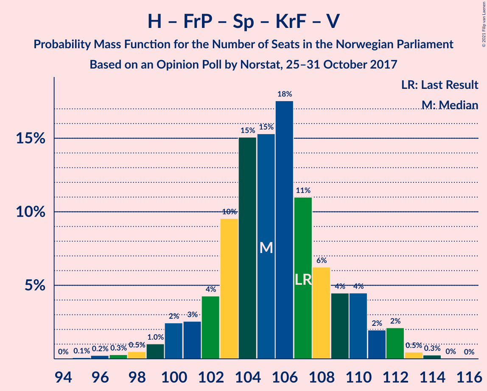
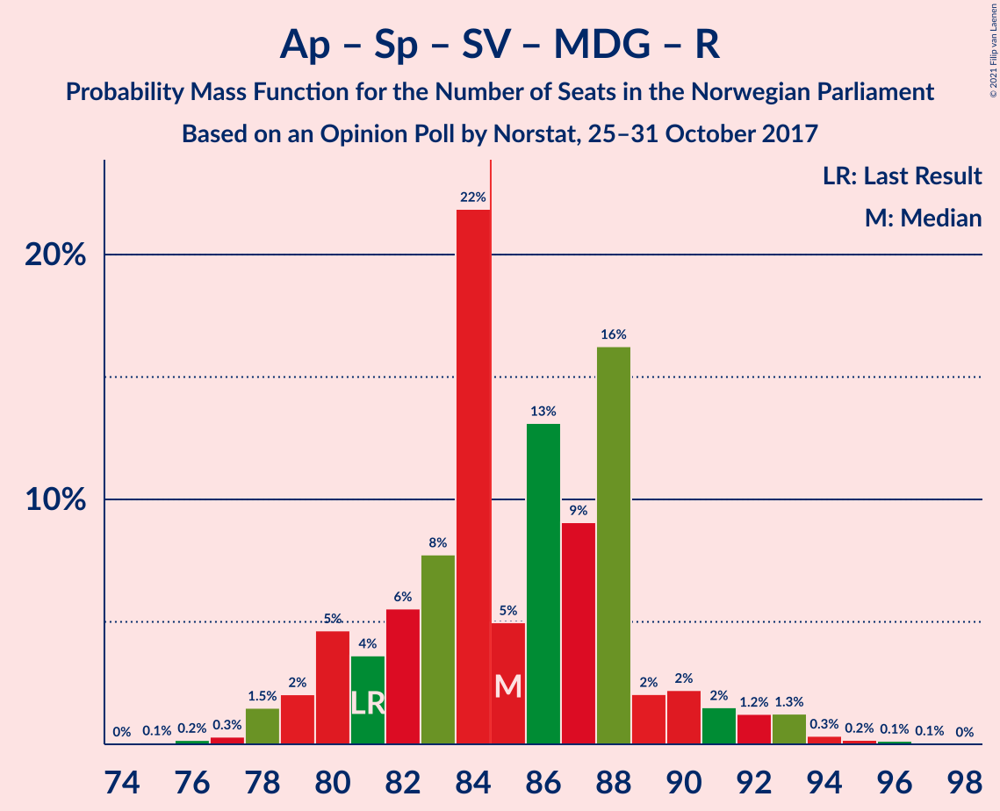
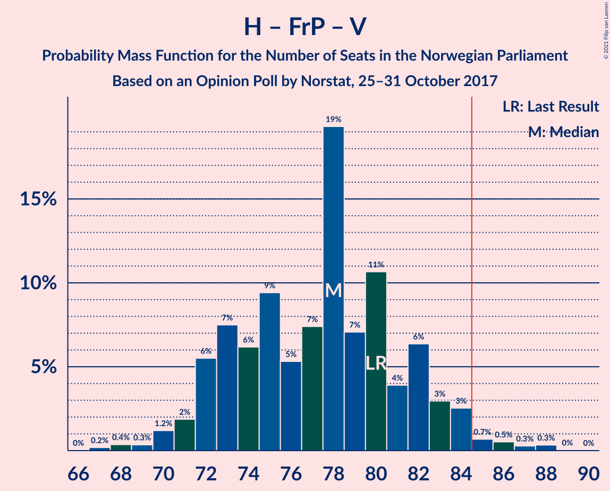

# Opinion Poll by Norstat, 25–31 October 2017

<a href="#voting-intentions">Voting Intentions</a> | <a href="#seats">Seats</a> | <a href="#coalitions">Coalitions</a> | <a href="#technical-information">Technical Information</a>

## Voting Intentions

### Confidence Intervals

| Party | Last Result | Poll Result | 80% Confidence Interval | 90% Confidence Interval | 95% Confidence Interval | 99% Confidence Interval |
|:-----:|:-----------:|:-----------:|:-----------------------:|:-----------------------:|:-----------------------:|:-----------------------:|
| Arbeiderpartiet | 27.4% | 25.9% | 24.2–27.8% |23.7–28.4% |23.2–28.8% |22.4–29.8% |
| Høyre | 25.0% | 25.8% | 24.1–27.7% |23.5–28.3% |23.1–28.7% |22.3–29.7% |
| Fremskrittspartiet | 15.2% | 14.5% | 13.1–16.1% |12.7–16.5% |12.4–16.9% |11.8–17.7% |
| Senterpartiet | 10.3% | 11.7% | 10.5–13.2% |10.1–13.6% |9.8–14.0% |9.3–14.7% |
| Sosialistisk Venstreparti | 6.0% | 7.5% | 6.5–8.7% |6.2–9.0% |5.9–9.3% |5.5–10.0% |
| Kristelig Folkeparti | 4.2% | 4.2% | 3.4–5.1% |3.2–5.4% |3.1–5.7% |2.7–6.1% |
| Venstre | 4.4% | 3.7% | 3.0–4.7% |2.9–4.9% |2.7–5.2% |2.4–5.6% |
| Miljøpartiet De Grønne | 3.2% | 2.7% | 2.1–3.5% |1.9–3.7% |1.8–3.9% |1.6–4.3% |
| Rødt | 2.4% | 2.3% | 1.8–3.1% |1.7–3.3% |1.6–3.5% |1.3–3.9% |

*Note:* The poll result column reflects the actual value used in the calculations. Published results may vary slightly, and in addition be rounded to fewer digits.

## Seats

### Confidence Intervals

| Party | Last Result | Median | 80% Confidence Interval | 90% Confidence Interval | 95% Confidence Interval | 99% Confidence Interval |
|:-----:|:-----------:|:------:|:-----------------------:|:-----------------------:|:-----------------------:|:-----------------------:|
| <a href="#arbeiderpartiet">Arbeiderpartiet</a> | 49 | 47 | 46–50 |45–50 |43–50 |42–52 |
| <a href="#høyre">Høyre</a> | 45 | 47 | 44–49 |42–49 |42–49 |41–51 |
| <a href="#fremskrittspartiet">Fremskrittspartiet</a> | 27 | 25 | 24–29 |24–30 |23–30 |22–31 |
| <a href="#senterpartiet">Senterpartiet</a> | 19 | 21 | 20–22 |20–25 |18–25 |17–26 |
| <a href="#sosialistisk-venstreparti">Sosialistisk Venstreparti</a> | 11 | 14 | 12–16 |11–16 |11–17 |10–18 |
| <a href="#kristelig-folkeparti">Kristelig Folkeparti</a> | 8 | 7 | 3–9 |3–10 |3–11 |1–11 |
| <a href="#venstre">Venstre</a> | 8 | 4 | 2–8 |2–9 |2–9 |2–10 |
| <a href="#miljøpartiet-de-grønne">Miljøpartiet De Grønne</a> | 1 | 1 | 1–2 |1–2 |1–2 |0–2 |
| <a href="#rødt">Rødt</a> | 1 | 1 | 1 |1–2 |1–2 |1–2 |

### Arbeiderpartiet

*For a full overview of the results for this party, see the [Arbeiderpartiet](party-arbeiderpartiet.html) page.*

| Number of Seats | Probability | Accumulated | Special Marks |
|:---------------:|:-----------:|:-----------:|:-------------:|
| 39 | 0.1% | 100% |  |
| 40 | 0.1% | 99.9% |  |
| 41 | 0.1% | 99.8% |  |
| 42 | 0.3% | 99.7% |  |
| 43 | 3% | 99.4% |  |
| 44 | 0.8% | 96% |  |
| 45 | 4% | 95% |  |
| 46 | 35% | 92% |  |
| 47 | 18% | 57% | Median |
| 48 | 8% | 38% |  |
| 49 | 3% | 30% | Last Result |
| 50 | 26% | 28% |  |
| 51 | 1.0% | 2% |  |
| 52 | 0.2% | 0.5% |  |
| 53 | 0.1% | 0.3% |  |
| 54 | 0.1% | 0.3% |  |
| 55 | 0% | 0.1% |  |
| 56 | 0.1% | 0.1% |  |
| 57 | 0% | 0% |  |

### Høyre

*For a full overview of the results for this party, see the [Høyre](party-høyre.html) page.*

| Number of Seats | Probability | Accumulated | Special Marks |
|:---------------:|:-----------:|:-----------:|:-------------:|
| 40 | 0.2% | 100% |  |
| 41 | 0.9% | 99.8% |  |
| 42 | 6% | 98.9% |  |
| 43 | 1.1% | 93% |  |
| 44 | 4% | 92% |  |
| 45 | 14% | 88% | Last Result |
| 46 | 1.1% | 74% |  |
| 47 | 38% | 73% | Median |
| 48 | 16% | 35% |  |
| 49 | 16% | 19% |  |
| 50 | 0.5% | 2% |  |
| 51 | 2% | 2% |  |
| 52 | 0.2% | 0.4% |  |
| 53 | 0.1% | 0.2% |  |
| 54 | 0% | 0.1% |  |
| 55 | 0% | 0% |  |

### Fremskrittspartiet

*For a full overview of the results for this party, see the [Fremskrittspartiet](party-fremskrittspartiet.html) page.*

| Number of Seats | Probability | Accumulated | Special Marks |
|:---------------:|:-----------:|:-----------:|:-------------:|
| 21 | 0.3% | 100% |  |
| 22 | 2% | 99.7% |  |
| 23 | 1.2% | 98% |  |
| 24 | 29% | 96% |  |
| 25 | 24% | 67% | Median |
| 26 | 7% | 43% |  |
| 27 | 19% | 36% | Last Result |
| 28 | 7% | 18% |  |
| 29 | 3% | 11% |  |
| 30 | 8% | 8% |  |
| 31 | 0.6% | 0.7% |  |
| 32 | 0% | 0.1% |  |
| 33 | 0% | 0% |  |

### Senterpartiet

*For a full overview of the results for this party, see the [Senterpartiet](party-senterpartiet.html) page.*

| Number of Seats | Probability | Accumulated | Special Marks |
|:---------------:|:-----------:|:-----------:|:-------------:|
| 16 | 0.1% | 100% |  |
| 17 | 2% | 99.9% |  |
| 18 | 0.4% | 98% |  |
| 19 | 0.1% | 97% | Last Result |
| 20 | 8% | 97% |  |
| 21 | 59% | 89% | Median |
| 22 | 20% | 30% |  |
| 23 | 0.2% | 10% |  |
| 24 | 3% | 10% |  |
| 25 | 4% | 6% |  |
| 26 | 2% | 2% |  |
| 27 | 0% | 0.1% |  |
| 28 | 0% | 0.1% |  |
| 29 | 0% | 0.1% |  |
| 30 | 0% | 0% |  |

### Sosialistisk Venstreparti

*For a full overview of the results for this party, see the [Sosialistisk Venstreparti](party-sosialistiskvenstreparti.html) page.*

| Number of Seats | Probability | Accumulated | Special Marks |
|:---------------:|:-----------:|:-----------:|:-------------:|
| 10 | 1.0% | 100% |  |
| 11 | 5% | 99.0% | Last Result |
| 12 | 10% | 94% |  |
| 13 | 12% | 84% |  |
| 14 | 23% | 71% | Median |
| 15 | 32% | 49% |  |
| 16 | 14% | 16% |  |
| 17 | 2% | 3% |  |
| 18 | 0.8% | 1.0% |  |
| 19 | 0.2% | 0.2% |  |
| 20 | 0% | 0% |  |

### Kristelig Folkeparti

*For a full overview of the results for this party, see the [Kristelig Folkeparti](party-kristeligfolkeparti.html) page.*

| Number of Seats | Probability | Accumulated | Special Marks |
|:---------------:|:-----------:|:-----------:|:-------------:|
| 1 | 0.8% | 100% |  |
| 2 | 1.2% | 99.2% |  |
| 3 | 29% | 98% |  |
| 4 | 0% | 69% |  |
| 5 | 0% | 69% |  |
| 6 | 0% | 69% |  |
| 7 | 29% | 69% | Median |
| 8 | 25% | 40% | Last Result |
| 9 | 6% | 15% |  |
| 10 | 5% | 9% |  |
| 11 | 4% | 4% |  |
| 12 | 0% | 0.1% |  |
| 13 | 0% | 0% |  |

### Venstre

*For a full overview of the results for this party, see the [Venstre](party-venstre.html) page.*

| Number of Seats | Probability | Accumulated | Special Marks |
|:---------------:|:-----------:|:-----------:|:-------------:|
| 1 | 0.1% | 100% |  |
| 2 | 41% | 99.9% |  |
| 3 | 6% | 59% |  |
| 4 | 2% | 52% | Median |
| 5 | 0% | 50% |  |
| 6 | 0% | 50% |  |
| 7 | 30% | 50% |  |
| 8 | 13% | 20% | Last Result |
| 9 | 6% | 7% |  |
| 10 | 2% | 2% |  |
| 11 | 0.1% | 0.1% |  |
| 12 | 0% | 0% |  |

### Miljøpartiet De Grønne

*For a full overview of the results for this party, see the [Miljøpartiet De Grønne](party-miljøpartietdegrønne.html) page.*

| Number of Seats | Probability | Accumulated | Special Marks |
|:---------------:|:-----------:|:-----------:|:-------------:|
| 0 | 1.1% | 100% |  |
| 1 | 87% | 98.9% | Last Result, Median |
| 2 | 12% | 12% |  |
| 3 | 0.1% | 0.3% |  |
| 4 | 0% | 0.2% |  |
| 5 | 0% | 0.2% |  |
| 6 | 0% | 0.2% |  |
| 7 | 0.1% | 0.2% |  |
| 8 | 0.1% | 0.1% |  |
| 9 | 0% | 0% |  |

### Rødt

*For a full overview of the results for this party, see the [Rødt](party-rødt.html) page.*

| Number of Seats | Probability | Accumulated | Special Marks |
|:---------------:|:-----------:|:-----------:|:-------------:|
| 0 | 0.3% | 100% |  |
| 1 | 94% | 99.7% | Last Result, Median |
| 2 | 5% | 6% |  |
| 3 | 0% | 0.5% |  |
| 4 | 0% | 0.5% |  |
| 5 | 0% | 0.5% |  |
| 6 | 0% | 0.5% |  |
| 7 | 0.1% | 0.5% |  |
| 8 | 0.4% | 0.4% |  |
| 9 | 0% | 0% |  |

## Coalitions

### Confidence Intervals

| Coalition | Last Result | Median | Majority? | 80% Confidence Interval | 90% Confidence Interval | 95% Confidence Interval | 99% Confidence Interval |
|:---------:|:-----------:|:------:|:---------:|:-----------------------:|:-----------------------:|:-----------------------:|:-----------------------:|
| Høyre – Fremskrittspartiet – Senterpartiet – Kristelig Folkeparti – Venstre | 107 | 105 | 100% | 103–108 | 103–109 | 102–110 | 97–112 |
| Arbeiderpartiet – Senterpartiet – Sosialistisk Venstreparti – Kristelig Folkeparti – Miljøpartiet De Grønne | 88 | 90 | 96% | 88–93 | 85–94 | 84–95 | 84–96 |
| Arbeiderpartiet – Senterpartiet – Sosialistisk Venstreparti – Miljøpartiet De Grønne – Rødt | 81 | 84 | 48% | 83–88 | 81–88 | 80–91 | 78–94 |
| Høyre – Fremskrittspartiet – Kristelig Folkeparti – Venstre – Miljøpartiet De Grønne | 89 | 86 | 55% | 82–87 | 82–89 | 80–90 | 76–92 |
| Arbeiderpartiet – Senterpartiet – Sosialistisk Venstreparti – Rødt | 80 | 83 | 45% | 82–87 | 80–87 | 79–89 | 77–93 |
| Høyre – Fremskrittspartiet – Kristelig Folkeparti – Venstre | 88 | 85 | 52% | 81–86 | 81–88 | 78–89 | 75–91 |
| Arbeiderpartiet – Senterpartiet – Sosialistisk Venstreparti – Miljøpartiet De Grønne | 80 | 83 | 45% | 82–87 | 80–87 | 79–88 | 76–92 |
| Arbeiderpartiet – Senterpartiet – Sosialistisk Venstreparti | 79 | 82 | 18% | 81–86 | 79–86 | 78–87 | 75–91 |
| Høyre – Fremskrittspartiet – Venstre | 80 | 78 | 0.3% | 75–80 | 74–83 | 72–84 | 71–84 |
| Arbeiderpartiet – Senterpartiet – Kristelig Folkeparti – Miljøpartiet De Grønne | 77 | 76 | 0.1% | 73–80 | 71–80 | 71–82 | 69–83 |
| Arbeiderpartiet – Senterpartiet – Kristelig Folkeparti | 76 | 75 | 0% | 72–79 | 70–79 | 70–81 | 68–81 |
| Høyre – Fremskrittspartiet | 72 | 72 | 0% | 71–76 | 70–76 | 70–76 | 68–77 |
| Arbeiderpartiet – Senterpartiet | 68 | 68 | 0% | 67–72 | 65–72 | 64–73 | 63–77 |
| Arbeiderpartiet – Sosialistisk Venstreparti | 60 | 61 | 0% | 59–64 | 58–64 | 57–64 | 54–66 |
| Høyre – Kristelig Folkeparti – Venstre | 61 | 58 | 0% | 54–61 | 53–62 | 52–63 | 47–64 |
| Senterpartiet – Kristelig Folkeparti – Venstre | 35 | 33 | 0% | 27–35 | 27–36 | 27–36 | 26–37 |

### Høyre – Fremskrittspartiet – Senterpartiet – Kristelig Folkeparti – Venstre

| Number of Seats | Probability | Accumulated | Special Marks |
|:---------------:|:-----------:|:-----------:|:-------------:|
| 94 | 0.1% | 100% |  |
| 95 | 0% | 99.9% |  |
| 96 | 0.4% | 99.9% |  |
| 97 | 0% | 99.5% |  |
| 98 | 0.2% | 99.5% |  |
| 99 | 0.1% | 99.3% |  |
| 100 | 0.5% | 99.3% |  |
| 101 | 0.9% | 98.8% |  |
| 102 | 0.4% | 98% |  |
| 103 | 15% | 97% |  |
| 104 | 19% | 82% | Median |
| 105 | 15% | 64% |  |
| 106 | 34% | 49% |  |
| 107 | 4% | 15% | Last Result |
| 108 | 4% | 10% |  |
| 109 | 2% | 7% |  |
| 110 | 4% | 5% |  |
| 111 | 0.3% | 1.0% |  |
| 112 | 0.6% | 0.7% |  |
| 113 | 0.1% | 0.2% |  |
| 114 | 0.1% | 0.1% |  |
| 115 | 0% | 0% |  |

### Arbeiderpartiet – Senterpartiet – Sosialistisk Venstreparti – Kristelig Folkeparti – Miljøpartiet De Grønne

| Number of Seats | Probability | Accumulated | Special Marks |
|:---------------:|:-----------:|:-----------:|:-------------:|
| 81 | 0% | 100% |  |
| 82 | 0.1% | 99.9% |  |
| 83 | 0.3% | 99.9% |  |
| 84 | 4% | 99.6% |  |
| 85 | 2% | 96% | Majority |
| 86 | 2% | 94% |  |
| 87 | 0.9% | 92% |  |
| 88 | 10% | 91% | Last Result |
| 89 | 2% | 81% |  |
| 90 | 41% | 79% | Median |
| 91 | 5% | 38% |  |
| 92 | 2% | 33% |  |
| 93 | 22% | 31% |  |
| 94 | 6% | 9% |  |
| 95 | 1.1% | 3% |  |
| 96 | 1.2% | 2% |  |
| 97 | 0.2% | 0.5% |  |
| 98 | 0.1% | 0.2% |  |
| 99 | 0.1% | 0.1% |  |
| 100 | 0% | 0% |  |

### Arbeiderpartiet – Senterpartiet – Sosialistisk Venstreparti – Miljøpartiet De Grønne – Rødt

| Number of Seats | Probability | Accumulated | Special Marks |
|:---------------:|:-----------:|:-----------:|:-------------:|
| 76 | 0% | 100% |  |
| 77 | 0.1% | 99.9% |  |
| 78 | 0.6% | 99.8% |  |
| 79 | 0.7% | 99.2% |  |
| 80 | 1.5% | 98% |  |
| 81 | 2% | 97% | Last Result |
| 82 | 4% | 95% |  |
| 83 | 3% | 91% |  |
| 84 | 40% | 88% | Median |
| 85 | 2% | 48% | Majority |
| 86 | 25% | 46% |  |
| 87 | 3% | 21% |  |
| 88 | 14% | 18% |  |
| 89 | 0.6% | 4% |  |
| 90 | 0.5% | 3% |  |
| 91 | 0.7% | 3% |  |
| 92 | 0.4% | 2% |  |
| 93 | 0.7% | 2% |  |
| 94 | 0.6% | 0.8% |  |
| 95 | 0.1% | 0.2% |  |
| 96 | 0.1% | 0.1% |  |
| 97 | 0% | 0% |  |

### Høyre – Fremskrittspartiet – Kristelig Folkeparti – Venstre – Miljøpartiet De Grønne

| Number of Seats | Probability | Accumulated | Special Marks |
|:---------------:|:-----------:|:-----------:|:-------------:|
| 74 | 0% | 100% |  |
| 75 | 0% | 99.9% |  |
| 76 | 0.5% | 99.9% |  |
| 77 | 0.9% | 99.4% |  |
| 78 | 0.4% | 98.5% |  |
| 79 | 0.6% | 98% |  |
| 80 | 0.2% | 98% |  |
| 81 | 0.7% | 97% |  |
| 82 | 14% | 97% |  |
| 83 | 2% | 83% |  |
| 84 | 26% | 81% | Median |
| 85 | 2% | 55% | Majority |
| 86 | 35% | 53% |  |
| 87 | 8% | 18% |  |
| 88 | 4% | 10% |  |
| 89 | 2% | 5% | Last Result |
| 90 | 2% | 3% |  |
| 91 | 0.4% | 1.3% |  |
| 92 | 0.6% | 0.9% |  |
| 93 | 0.2% | 0.3% |  |
| 94 | 0.1% | 0.1% |  |
| 95 | 0% | 0% |  |

### Arbeiderpartiet – Senterpartiet – Sosialistisk Venstreparti – Rødt

| Number of Seats | Probability | Accumulated | Special Marks |
|:---------------:|:-----------:|:-----------:|:-------------:|
| 75 | 0.1% | 100% |  |
| 76 | 0.2% | 99.9% |  |
| 77 | 0.6% | 99.7% |  |
| 78 | 0.4% | 99.1% |  |
| 79 | 2% | 98.7% |  |
| 80 | 2% | 97% | Last Result |
| 81 | 4% | 95% |  |
| 82 | 8% | 90% |  |
| 83 | 35% | 82% | Median |
| 84 | 2% | 47% |  |
| 85 | 26% | 45% | Majority |
| 86 | 2% | 19% |  |
| 87 | 14% | 17% |  |
| 88 | 0.7% | 3% |  |
| 89 | 0.2% | 3% |  |
| 90 | 0.6% | 2% |  |
| 91 | 0.4% | 2% |  |
| 92 | 0.9% | 1.5% |  |
| 93 | 0.5% | 0.6% |  |
| 94 | 0% | 0.1% |  |
| 95 | 0% | 0.1% |  |
| 96 | 0% | 0% |  |

### Høyre – Fremskrittspartiet – Kristelig Folkeparti – Venstre

| Number of Seats | Probability | Accumulated | Special Marks |
|:---------------:|:-----------:|:-----------:|:-------------:|
| 73 | 0.1% | 100% |  |
| 74 | 0.1% | 99.9% |  |
| 75 | 0.6% | 99.8% |  |
| 76 | 0.7% | 99.2% |  |
| 77 | 0.4% | 98% |  |
| 78 | 0.7% | 98% |  |
| 79 | 0.5% | 97% |  |
| 80 | 0.6% | 97% |  |
| 81 | 14% | 96% |  |
| 82 | 3% | 82% |  |
| 83 | 25% | 79% | Median |
| 84 | 2% | 54% |  |
| 85 | 40% | 52% | Majority |
| 86 | 3% | 12% |  |
| 87 | 4% | 9% |  |
| 88 | 2% | 5% | Last Result |
| 89 | 1.5% | 3% |  |
| 90 | 0.7% | 2% |  |
| 91 | 0.6% | 0.8% |  |
| 92 | 0.1% | 0.2% |  |
| 93 | 0% | 0.1% |  |
| 94 | 0% | 0% |  |

### Arbeiderpartiet – Senterpartiet – Sosialistisk Venstreparti – Miljøpartiet De Grønne

| Number of Seats | Probability | Accumulated | Special Marks |
|:---------------:|:-----------:|:-----------:|:-------------:|
| 75 | 0% | 100% |  |
| 76 | 0.6% | 99.9% |  |
| 77 | 0.2% | 99.3% |  |
| 78 | 0.8% | 99.1% |  |
| 79 | 1.4% | 98% |  |
| 80 | 2% | 97% | Last Result |
| 81 | 4% | 95% |  |
| 82 | 3% | 91% |  |
| 83 | 40% | 87% | Median |
| 84 | 2% | 47% |  |
| 85 | 25% | 45% | Majority |
| 86 | 4% | 21% |  |
| 87 | 14% | 17% |  |
| 88 | 0.5% | 3% |  |
| 89 | 0.5% | 2% |  |
| 90 | 0.7% | 2% |  |
| 91 | 0.7% | 1.3% |  |
| 92 | 0.2% | 0.6% |  |
| 93 | 0.3% | 0.4% |  |
| 94 | 0% | 0.1% |  |
| 95 | 0% | 0.1% |  |
| 96 | 0% | 0% |  |

### Arbeiderpartiet – Senterpartiet – Sosialistisk Venstreparti

| Number of Seats | Probability | Accumulated | Special Marks |
|:---------------:|:-----------:|:-----------:|:-------------:|
| 73 | 0% | 100% |  |
| 74 | 0.1% | 99.9% |  |
| 75 | 0.7% | 99.8% |  |
| 76 | 0.1% | 99.2% |  |
| 77 | 0.4% | 99.1% |  |
| 78 | 2% | 98.7% |  |
| 79 | 2% | 97% | Last Result |
| 80 | 4% | 95% |  |
| 81 | 9% | 90% |  |
| 82 | 35% | 82% | Median |
| 83 | 2% | 47% |  |
| 84 | 26% | 44% |  |
| 85 | 2% | 18% | Majority |
| 86 | 13% | 16% |  |
| 87 | 0.4% | 3% |  |
| 88 | 0.3% | 2% |  |
| 89 | 0.6% | 2% |  |
| 90 | 0.7% | 1.2% |  |
| 91 | 0.5% | 0.6% |  |
| 92 | 0% | 0.1% |  |
| 93 | 0% | 0.1% |  |
| 94 | 0% | 0.1% |  |
| 95 | 0% | 0% |  |

### Høyre – Fremskrittspartiet – Venstre

| Number of Seats | Probability | Accumulated | Special Marks |
|:---------------:|:-----------:|:-----------:|:-------------:|
| 69 | 0.1% | 100% |  |
| 70 | 0.2% | 99.9% |  |
| 71 | 0.3% | 99.7% |  |
| 72 | 2% | 99.4% |  |
| 73 | 2% | 97% |  |
| 74 | 5% | 95% |  |
| 75 | 22% | 91% |  |
| 76 | 2% | 69% | Median |
| 77 | 5% | 66% |  |
| 78 | 41% | 61% |  |
| 79 | 2% | 21% |  |
| 80 | 10% | 19% | Last Result |
| 81 | 1.4% | 9% |  |
| 82 | 2% | 7% |  |
| 83 | 2% | 5% |  |
| 84 | 3% | 4% |  |
| 85 | 0.3% | 0.3% | Majority |
| 86 | 0% | 0.1% |  |
| 87 | 0% | 0% |  |

### Arbeiderpartiet – Senterpartiet – Kristelig Folkeparti – Miljøpartiet De Grønne

| Number of Seats | Probability | Accumulated | Special Marks |
|:---------------:|:-----------:|:-----------:|:-------------:|
| 67 | 0.1% | 100% |  |
| 68 | 0.2% | 99.9% |  |
| 69 | 0.4% | 99.7% |  |
| 70 | 0.2% | 99.4% |  |
| 71 | 5% | 99.2% |  |
| 72 | 0.8% | 94% |  |
| 73 | 4% | 94% |  |
| 74 | 1.0% | 90% |  |
| 75 | 31% | 89% |  |
| 76 | 20% | 58% | Median |
| 77 | 15% | 38% | Last Result |
| 78 | 1.5% | 23% |  |
| 79 | 4% | 21% |  |
| 80 | 13% | 18% |  |
| 81 | 1.3% | 5% |  |
| 82 | 3% | 4% |  |
| 83 | 0.2% | 0.5% |  |
| 84 | 0.3% | 0.4% |  |
| 85 | 0% | 0.1% | Majority |
| 86 | 0% | 0.1% |  |
| 87 | 0.1% | 0.1% |  |
| 88 | 0% | 0% |  |

### Arbeiderpartiet – Senterpartiet – Kristelig Folkeparti

| Number of Seats | Probability | Accumulated | Special Marks |
|:---------------:|:-----------:|:-----------:|:-------------:|
| 66 | 0% | 100% |  |
| 67 | 0.2% | 99.9% |  |
| 68 | 0.3% | 99.7% |  |
| 69 | 0.2% | 99.4% |  |
| 70 | 5% | 99.1% |  |
| 71 | 0.9% | 94% |  |
| 72 | 4% | 94% |  |
| 73 | 2% | 90% |  |
| 74 | 31% | 88% |  |
| 75 | 19% | 57% | Median |
| 76 | 15% | 37% | Last Result |
| 77 | 2% | 23% |  |
| 78 | 10% | 20% |  |
| 79 | 6% | 11% |  |
| 80 | 2% | 4% |  |
| 81 | 2% | 3% |  |
| 82 | 0.3% | 0.3% |  |
| 83 | 0% | 0.1% |  |
| 84 | 0% | 0% |  |

### Høyre – Fremskrittspartiet

| Number of Seats | Probability | Accumulated | Special Marks |
|:---------------:|:-----------:|:-----------:|:-------------:|
| 65 | 0% | 100% |  |
| 66 | 0.1% | 99.9% |  |
| 67 | 0.1% | 99.8% |  |
| 68 | 1.1% | 99.7% |  |
| 69 | 0.9% | 98.6% |  |
| 70 | 4% | 98% |  |
| 71 | 33% | 94% |  |
| 72 | 19% | 61% | Last Result, Median |
| 73 | 18% | 43% |  |
| 74 | 4% | 25% |  |
| 75 | 7% | 20% |  |
| 76 | 13% | 14% |  |
| 77 | 0.2% | 0.6% |  |
| 78 | 0.3% | 0.4% |  |
| 79 | 0% | 0.1% |  |
| 80 | 0% | 0.1% |  |
| 81 | 0% | 0% |  |

### Arbeiderpartiet – Senterpartiet

| Number of Seats | Probability | Accumulated | Special Marks |
|:---------------:|:-----------:|:-----------:|:-------------:|
| 61 | 0.1% | 100% |  |
| 62 | 0.3% | 99.9% |  |
| 63 | 0.6% | 99.6% |  |
| 64 | 2% | 99.0% |  |
| 65 | 2% | 97% |  |
| 66 | 2% | 94% |  |
| 67 | 37% | 93% |  |
| 68 | 16% | 56% | Last Result, Median |
| 69 | 4% | 40% |  |
| 70 | 4% | 36% |  |
| 71 | 10% | 32% |  |
| 72 | 19% | 23% |  |
| 73 | 0.9% | 3% |  |
| 74 | 0.5% | 2% |  |
| 75 | 1.2% | 2% |  |
| 76 | 0% | 0.6% |  |
| 77 | 0.4% | 0.6% |  |
| 78 | 0.1% | 0.1% |  |
| 79 | 0% | 0% |  |

### Arbeiderpartiet – Sosialistisk Venstreparti

| Number of Seats | Probability | Accumulated | Special Marks |
|:---------------:|:-----------:|:-----------:|:-------------:|
| 52 | 0% | 100% |  |
| 53 | 0.1% | 99.9% |  |
| 54 | 0.6% | 99.8% |  |
| 55 | 0.3% | 99.3% |  |
| 56 | 0.3% | 98.9% |  |
| 57 | 3% | 98.7% |  |
| 58 | 2% | 95% |  |
| 59 | 4% | 93% |  |
| 60 | 6% | 90% | Last Result |
| 61 | 41% | 84% | Median |
| 62 | 9% | 43% |  |
| 63 | 20% | 35% |  |
| 64 | 13% | 14% |  |
| 65 | 1.1% | 2% |  |
| 66 | 0.3% | 0.6% |  |
| 67 | 0% | 0.3% |  |
| 68 | 0% | 0.3% |  |
| 69 | 0.1% | 0.2% |  |
| 70 | 0% | 0.1% |  |
| 71 | 0% | 0.1% |  |
| 72 | 0% | 0.1% |  |
| 73 | 0.1% | 0.1% |  |
| 74 | 0% | 0% |  |

### Høyre – Kristelig Folkeparti – Venstre

| Number of Seats | Probability | Accumulated | Special Marks |
|:---------------:|:-----------:|:-----------:|:-------------:|
| 46 | 0.1% | 100% |  |
| 47 | 0.6% | 99.9% |  |
| 48 | 0.2% | 99.3% |  |
| 49 | 0.4% | 99.1% |  |
| 50 | 0.1% | 98.7% |  |
| 51 | 0.3% | 98.6% |  |
| 52 | 1.3% | 98% |  |
| 53 | 5% | 97% |  |
| 54 | 14% | 92% |  |
| 55 | 1.2% | 78% |  |
| 56 | 3% | 77% |  |
| 57 | 6% | 74% |  |
| 58 | 25% | 68% | Median |
| 59 | 5% | 43% |  |
| 60 | 5% | 38% |  |
| 61 | 28% | 33% | Last Result |
| 62 | 0.4% | 5% |  |
| 63 | 3% | 5% |  |
| 64 | 2% | 2% |  |
| 65 | 0.2% | 0.4% |  |
| 66 | 0.1% | 0.2% |  |
| 67 | 0.1% | 0.2% |  |
| 68 | 0% | 0.1% |  |
| 69 | 0% | 0% |  |

### Senterpartiet – Kristelig Folkeparti – Venstre

| Number of Seats | Probability | Accumulated | Special Marks |
|:---------------:|:-----------:|:-----------:|:-------------:|
| 23 | 0% | 100% |  |
| 24 | 0% | 99.9% |  |
| 25 | 0% | 99.9% |  |
| 26 | 0.4% | 99.9% |  |
| 27 | 12% | 99.4% |  |
| 28 | 0.1% | 87% |  |
| 29 | 0.4% | 87% |  |
| 30 | 1.5% | 87% |  |
| 31 | 15% | 85% |  |
| 32 | 7% | 71% | Median |
| 33 | 19% | 63% |  |
| 34 | 7% | 45% |  |
| 35 | 33% | 38% | Last Result |
| 36 | 3% | 6% |  |
| 37 | 2% | 2% |  |
| 38 | 0.1% | 0.2% |  |
| 39 | 0.1% | 0.1% |  |
| 40 | 0% | 0% |  |

## Technical Information

### Opinion Poll

+ **Polling firm:** Norstat
+ **Commissioner(s):** —
+ **Fieldwork period:** 25–31 October 2017

### Calculations

+ **Sample size:** 937
+ **Simulations done:** 131,072
+ **Error estimate:** 1.91%

