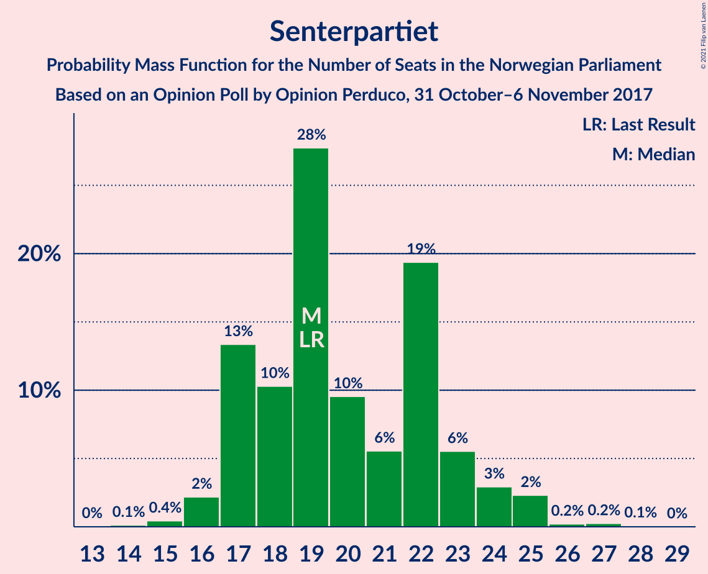
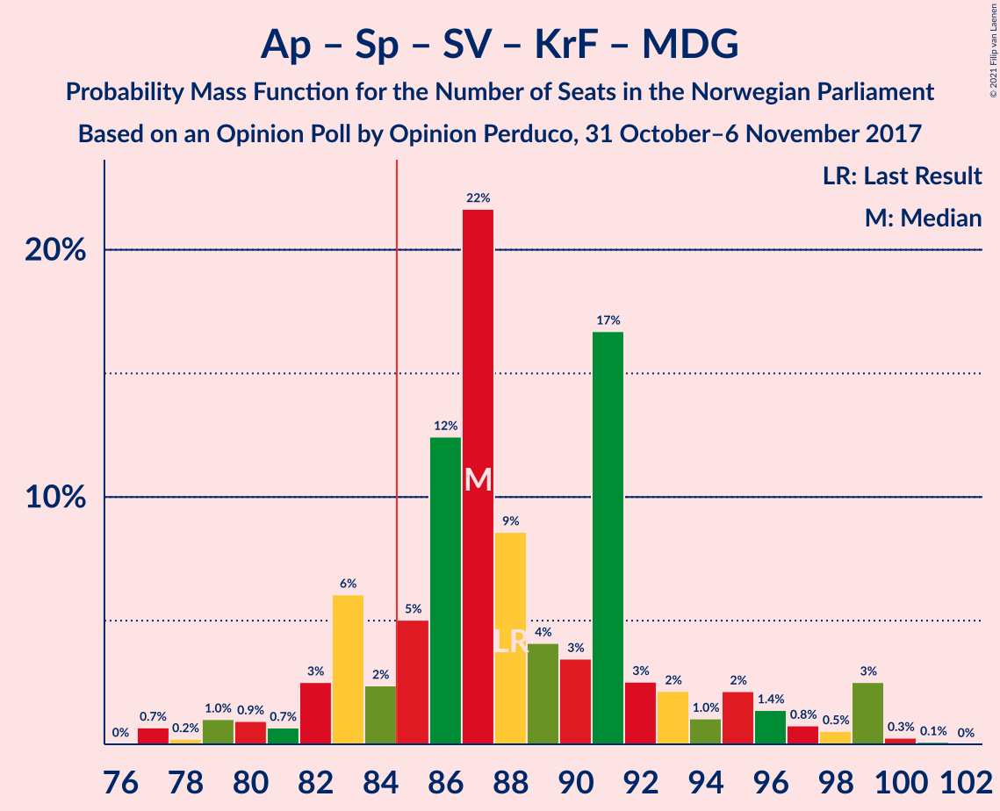
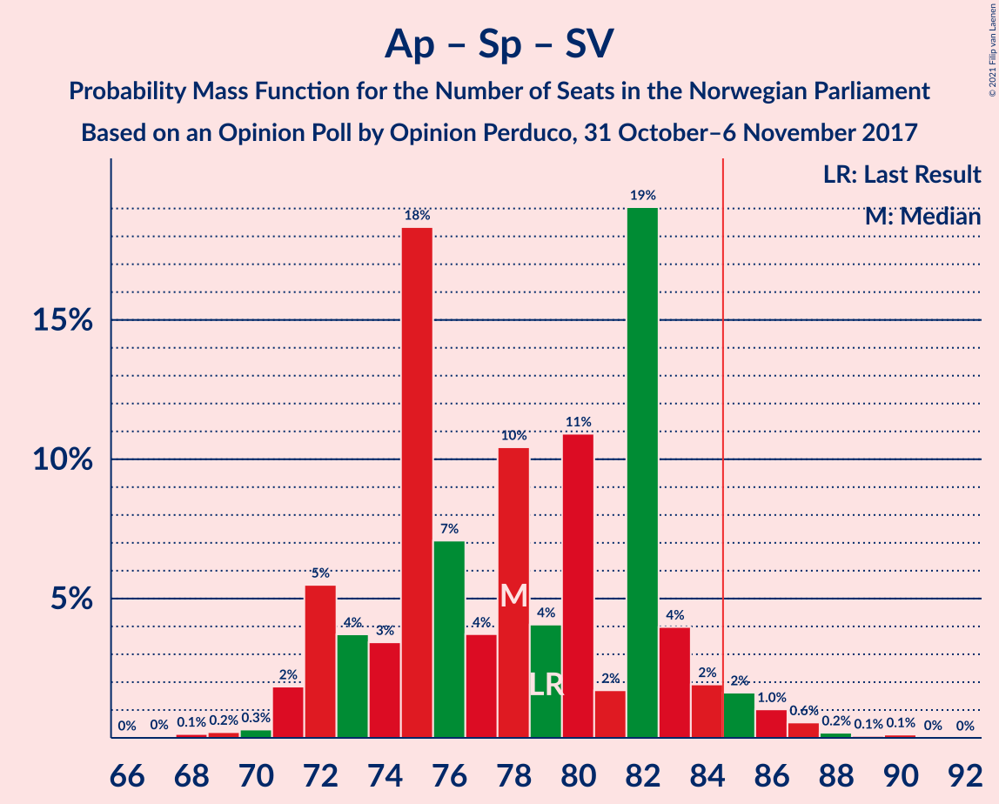
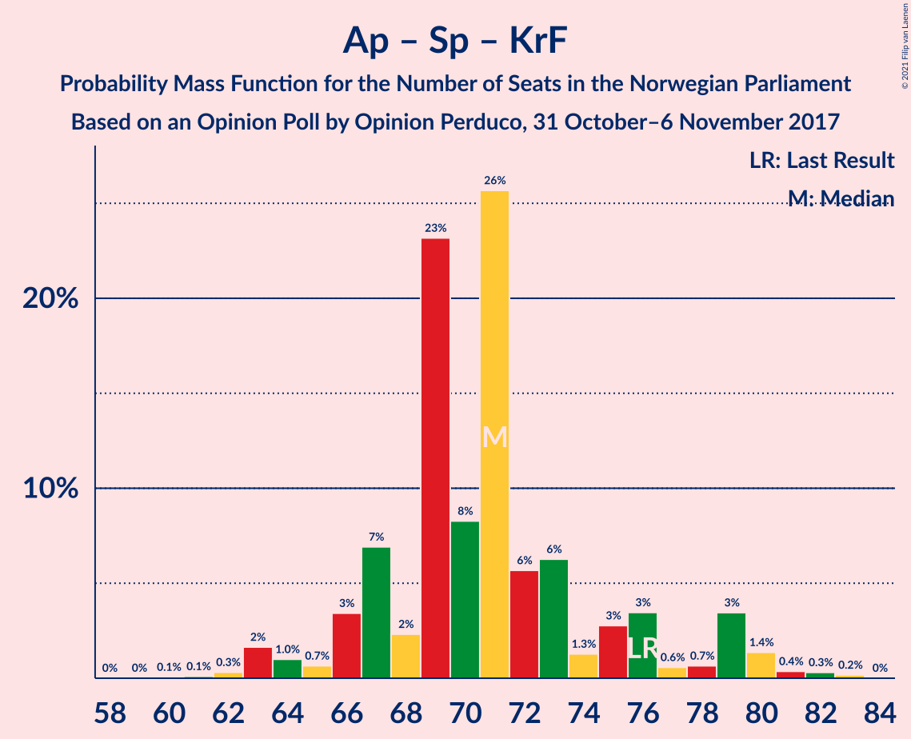

# Opinion Poll by Opinion Perduco, 31 October–6 November 2017

<a href="#voting-intentions">Voting Intentions</a> | <a href="#seats">Seats</a> | <a href="#coalitions">Coalitions</a> | <a href="#technical-information">Technical Information</a>

## Voting Intentions

### Confidence Intervals

| Party | Last Result | Poll Result | 80% Confidence Interval | 90% Confidence Interval | 95% Confidence Interval | 99% Confidence Interval |
|:-----:|:-----------:|:-----------:|:-----------------------:|:-----------------------:|:-----------------------:|:-----------------------:|
| Høyre | 25.0% | 25.7% | 23.7–27.8% |23.2–28.4% |22.7–28.9% |21.8–30.0% |
| Arbeiderpartiet | 27.4% | 25.2% | 23.2–27.3% |22.7–27.9% |22.2–28.4% |21.3–29.4% |
| Fremskrittspartiet | 15.2% | 14.8% | 13.3–16.6% |12.8–17.1% |12.5–17.6% |11.8–18.4% |
| Senterpartiet | 10.3% | 11.3% | 9.9–12.9% |9.5–13.3% |9.2–13.7% |8.6–14.5% |
| Sosialistisk Venstreparti | 6.0% | 7.3% | 6.2–8.6% |5.9–9.0% |5.6–9.4% |5.2–10.1% |
| Venstre | 4.4% | 4.2% | 3.4–5.3% |3.2–5.7% |3.0–5.9% |2.7–6.5% |
| Kristelig Folkeparti | 4.2% | 4.0% | 3.2–5.0% |3.0–5.3% |2.8–5.6% |2.5–6.2% |
| Miljøpartiet De Grønne | 3.2% | 3.8% | 3.1–4.9% |2.9–5.2% |2.7–5.5% |2.4–6.0% |
| Rødt | 2.4% | 2.8% | 2.1–3.7% |2.0–4.0% |1.8–4.2% |1.6–4.7% |

*Note:* The poll result column reflects the actual value used in the calculations. Published results may vary slightly, and in addition be rounded to fewer digits.

## Seats

### Confidence Intervals

| Party | Last Result | Median | 80% Confidence Interval | 90% Confidence Interval | 95% Confidence Interval | 99% Confidence Interval |
|:-----:|:-----------:|:------:|:-----------------------:|:-----------------------:|:-----------------------:|:-----------------------:|
| <a href="#høyre">Høyre</a> | 45 | 46 | 42–51 |42–51 |42–53 |39–53 |
| <a href="#arbeiderpartiet">Arbeiderpartiet</a> | 49 | 46 | 43–49 |41–49 |41–50 |39–50 |
| <a href="#fremskrittspartiet">Fremskrittspartiet</a> | 27 | 26 | 25–29 |24–30 |23–31 |21–33 |
| <a href="#senterpartiet">Senterpartiet</a> | 19 | 20 | 18–22 |17–23 |17–24 |15–25 |
| <a href="#sosialistisk-venstreparti">Sosialistisk Venstreparti</a> | 11 | 13 | 12–14 |11–14 |11–14 |10–16 |
| <a href="#venstre">Venstre</a> | 8 | 8 | 2–9 |2–9 |2–10 |2–12 |
| <a href="#kristelig-folkeparti">Kristelig Folkeparti</a> | 8 | 3 | 3–8 |3–8 |3–9 |1–11 |
| <a href="#miljøpartiet-de-grønne">Miljøpartiet De Grønne</a> | 1 | 2 | 2–8 |2–9 |1–9 |1–10 |
| <a href="#rødt">Rødt</a> | 1 | 2 | 1–2 |1–7 |1–7 |1–8 |

### Høyre

*For a full overview of the results for this party, see the [Høyre](party-høyre.html) page.*

| Number of Seats | Probability | Accumulated | Special Marks |
|:---------------:|:-----------:|:-----------:|:-------------:|
| 37 | 0.1% | 100% |  |
| 38 | 0.1% | 99.9% |  |
| 39 | 1.2% | 99.8% |  |
| 40 | 0.4% | 98.6% |  |
| 41 | 0.3% | 98% |  |
| 42 | 12% | 98% |  |
| 43 | 4% | 86% |  |
| 44 | 5% | 82% |  |
| 45 | 24% | 77% | Last Result |
| 46 | 28% | 53% | Median |
| 47 | 1.1% | 25% |  |
| 48 | 11% | 24% |  |
| 49 | 2% | 13% |  |
| 50 | 0.4% | 11% |  |
| 51 | 6% | 10% |  |
| 52 | 1.4% | 4% |  |
| 53 | 2% | 3% |  |
| 54 | 0.3% | 0.5% |  |
| 55 | 0.1% | 0.2% |  |
| 56 | 0% | 0.1% |  |
| 57 | 0% | 0% |  |

### Arbeiderpartiet

*For a full overview of the results for this party, see the [Arbeiderpartiet](party-arbeiderpartiet.html) page.*

| Number of Seats | Probability | Accumulated | Special Marks |
|:---------------:|:-----------:|:-----------:|:-------------:|
| 38 | 0% | 100% |  |
| 39 | 0.5% | 99.9% |  |
| 40 | 2% | 99.4% |  |
| 41 | 4% | 98% |  |
| 42 | 2% | 94% |  |
| 43 | 5% | 92% |  |
| 44 | 4% | 87% |  |
| 45 | 10% | 83% |  |
| 46 | 26% | 74% | Median |
| 47 | 0.8% | 47% |  |
| 48 | 10% | 46% |  |
| 49 | 32% | 36% | Last Result |
| 50 | 3% | 4% |  |
| 51 | 0.2% | 0.5% |  |
| 52 | 0.1% | 0.3% |  |
| 53 | 0.1% | 0.2% |  |
| 54 | 0% | 0.1% |  |
| 55 | 0% | 0% |  |

### Fremskrittspartiet

*For a full overview of the results for this party, see the [Fremskrittspartiet](party-fremskrittspartiet.html) page.*

| Number of Seats | Probability | Accumulated | Special Marks |
|:---------------:|:-----------:|:-----------:|:-------------:|
| 18 | 0.1% | 100% |  |
| 19 | 0.1% | 99.9% |  |
| 20 | 0.2% | 99.9% |  |
| 21 | 0.2% | 99.6% |  |
| 22 | 1.3% | 99.4% |  |
| 23 | 2% | 98% |  |
| 24 | 4% | 96% |  |
| 25 | 15% | 92% |  |
| 26 | 33% | 78% | Median |
| 27 | 32% | 44% | Last Result |
| 28 | 0.8% | 12% |  |
| 29 | 5% | 12% |  |
| 30 | 3% | 6% |  |
| 31 | 0.6% | 3% |  |
| 32 | 1.2% | 2% |  |
| 33 | 1.0% | 1.2% |  |
| 34 | 0.1% | 0.2% |  |
| 35 | 0.1% | 0.1% |  |
| 36 | 0% | 0% |  |

### Senterpartiet

*For a full overview of the results for this party, see the [Senterpartiet](party-senterpartiet.html) page.*

| Number of Seats | Probability | Accumulated | Special Marks |
|:---------------:|:-----------:|:-----------:|:-------------:|
| 14 | 0.1% | 100% |  |
| 15 | 0.4% | 99.9% |  |
| 16 | 0.6% | 99.5% |  |
| 17 | 7% | 98.9% |  |
| 18 | 2% | 92% |  |
| 19 | 37% | 90% | Last Result |
| 20 | 11% | 53% | Median |
| 21 | 1.3% | 42% |  |
| 22 | 34% | 41% |  |
| 23 | 4% | 7% |  |
| 24 | 2% | 3% |  |
| 25 | 0.5% | 0.7% |  |
| 26 | 0.1% | 0.2% |  |
| 27 | 0.1% | 0.2% |  |
| 28 | 0.1% | 0.1% |  |
| 29 | 0% | 0% |  |

### Sosialistisk Venstreparti

*For a full overview of the results for this party, see the [Sosialistisk Venstreparti](party-sosialistiskvenstreparti.html) page.*

| Number of Seats | Probability | Accumulated | Special Marks |
|:---------------:|:-----------:|:-----------:|:-------------:|
| 9 | 0% | 100% |  |
| 10 | 1.4% | 99.9% |  |
| 11 | 6% | 98% | Last Result |
| 12 | 42% | 93% |  |
| 13 | 13% | 51% | Median |
| 14 | 36% | 38% |  |
| 15 | 1.4% | 2% |  |
| 16 | 0.3% | 0.8% |  |
| 17 | 0.1% | 0.5% |  |
| 18 | 0.2% | 0.4% |  |
| 19 | 0.2% | 0.2% |  |
| 20 | 0% | 0.1% |  |
| 21 | 0% | 0% |  |

### Venstre

*For a full overview of the results for this party, see the [Venstre](party-venstre.html) page.*

| Number of Seats | Probability | Accumulated | Special Marks |
|:---------------:|:-----------:|:-----------:|:-------------:|
| 2 | 22% | 100% |  |
| 3 | 2% | 78% |  |
| 4 | 0% | 76% |  |
| 5 | 0% | 76% |  |
| 6 | 0.1% | 76% |  |
| 7 | 3% | 76% |  |
| 8 | 39% | 73% | Last Result, Median |
| 9 | 31% | 34% |  |
| 10 | 1.5% | 3% |  |
| 11 | 0.7% | 2% |  |
| 12 | 0.9% | 1.0% |  |
| 13 | 0% | 0% |  |

### Kristelig Folkeparti

*For a full overview of the results for this party, see the [Kristelig Folkeparti](party-kristeligfolkeparti.html) page.*

| Number of Seats | Probability | Accumulated | Special Marks |
|:---------------:|:-----------:|:-----------:|:-------------:|
| 0 | 0.2% | 100% |  |
| 1 | 0.7% | 99.8% |  |
| 2 | 0.7% | 99.2% |  |
| 3 | 70% | 98% | Median |
| 4 | 0% | 28% |  |
| 5 | 0% | 28% |  |
| 6 | 0.1% | 28% |  |
| 7 | 10% | 28% |  |
| 8 | 15% | 18% | Last Result |
| 9 | 1.0% | 3% |  |
| 10 | 0.9% | 2% |  |
| 11 | 0.9% | 1.0% |  |
| 12 | 0.1% | 0.1% |  |
| 13 | 0% | 0% |  |

### Miljøpartiet De Grønne

*For a full overview of the results for this party, see the [Miljøpartiet De Grønne](party-miljøpartietdegrønne.html) page.*

| Number of Seats | Probability | Accumulated | Special Marks |
|:---------------:|:-----------:|:-----------:|:-------------:|
| 1 | 4% | 100% | Last Result |
| 2 | 48% | 96% | Median |
| 3 | 24% | 48% |  |
| 4 | 0% | 25% |  |
| 5 | 0% | 25% |  |
| 6 | 0% | 25% |  |
| 7 | 5% | 25% |  |
| 8 | 12% | 20% |  |
| 9 | 7% | 8% |  |
| 10 | 0.6% | 1.0% |  |
| 11 | 0.3% | 0.3% |  |
| 12 | 0% | 0% |  |

### Rødt

*For a full overview of the results for this party, see the [Rødt](party-rødt.html) page.*

| Number of Seats | Probability | Accumulated | Special Marks |
|:---------------:|:-----------:|:-----------:|:-------------:|
| 1 | 30% | 100% | Last Result |
| 2 | 64% | 70% | Median |
| 3 | 0% | 6% |  |
| 4 | 0% | 6% |  |
| 5 | 0% | 6% |  |
| 6 | 0.1% | 6% |  |
| 7 | 4% | 6% |  |
| 8 | 1.2% | 2% |  |
| 9 | 0.3% | 0.3% |  |
| 10 | 0% | 0% |  |

## Coalitions

### Confidence Intervals

| Coalition | Last Result | Median | Majority? | 80% Confidence Interval | 90% Confidence Interval | 95% Confidence Interval | 99% Confidence Interval |
|:---------:|:-----------:|:------:|:---------:|:-----------------------:|:-----------------------:|:-----------------------:|:-----------------------:|
| Høyre – Fremskrittspartiet – Senterpartiet – Venstre – Kristelig Folkeparti | 107 | 104 | 100% | 101–107 | 99–109 | 99–111 | 96–113 |
| Arbeiderpartiet – Senterpartiet – Sosialistisk Venstreparti – Kristelig Folkeparti – Miljøpartiet De Grønne | 88 | 87 | 92% | 85–95 | 82–99 | 82–99 | 78–99 |
| Høyre – Fremskrittspartiet – Venstre – Kristelig Folkeparti – Miljøpartiet De Grønne | 89 | 87 | 94% | 85–92 | 82–94 | 82–96 | 79–97 |
| Arbeiderpartiet – Senterpartiet – Sosialistisk Venstreparti – Miljøpartiet De Grønne – Rødt | 81 | 85 | 81% | 81–89 | 80–92 | 80–92 | 76–94 |
| Arbeiderpartiet – Senterpartiet – Sosialistisk Venstreparti – Miljøpartiet De Grønne | 80 | 84 | 18% | 79–87 | 78–91 | 78–91 | 74–93 |
| Høyre – Fremskrittspartiet – Venstre – Kristelig Folkeparti | 88 | 84 | 19% | 80–88 | 77–89 | 77–89 | 75–93 |
| Arbeiderpartiet – Senterpartiet – Sosialistisk Venstreparti – Rødt | 80 | 82 | 6% | 77–84 | 75–87 | 73–87 | 72–90 |
| Arbeiderpartiet – Senterpartiet – Kristelig Folkeparti – Miljøpartiet De Grønne | 77 | 74 | 6% | 73–82 | 69–87 | 68–87 | 65–87 |
| Høyre – Fremskrittspartiet – Venstre | 80 | 80 | 5% | 72–81 | 69–85 | 69–86 | 69–90 |
| Arbeiderpartiet – Senterpartiet – Sosialistisk Venstreparti | 79 | 80 | 4% | 75–83 | 74–83 | 72–85 | 70–86 |
| Høyre – Fremskrittspartiet | 72 | 72 | 0% | 69–77 | 67–79 | 67–83 | 65–84 |
| Arbeiderpartiet – Senterpartiet – Kristelig Folkeparti | 76 | 71 | 0% | 67–76 | 66–79 | 66–80 | 63–80 |
| Arbeiderpartiet – Senterpartiet | 68 | 68 | 0% | 63–71 | 62–71 | 60–72 | 58–73 |
| Arbeiderpartiet – Sosialistisk Venstreparti | 60 | 58 | 0% | 55–63 | 53–63 | 52–63 | 50–65 |
| Høyre – Venstre – Kristelig Folkeparti | 61 | 57 | 0% | 53–59 | 52–61 | 52–63 | 50–66 |
| Senterpartiet – Venstre – Kristelig Folkeparti | 35 | 32 | 0% | 27–34 | 24–35 | 24–38 | 24–41 |

### Høyre – Fremskrittspartiet – Senterpartiet – Venstre – Kristelig Folkeparti

| Number of Seats | Probability | Accumulated | Special Marks |
|:---------------:|:-----------:|:-----------:|:-------------:|
| 90 | 0% | 100% |  |
| 91 | 0% | 99.9% |  |
| 92 | 0% | 99.9% |  |
| 93 | 0% | 99.9% |  |
| 94 | 0.1% | 99.9% |  |
| 95 | 0.3% | 99.8% |  |
| 96 | 0.1% | 99.6% |  |
| 97 | 0.4% | 99.5% |  |
| 98 | 0.1% | 99.1% |  |
| 99 | 6% | 99.0% |  |
| 100 | 2% | 93% |  |
| 101 | 6% | 91% |  |
| 102 | 29% | 84% |  |
| 103 | 5% | 55% | Median |
| 104 | 10% | 51% |  |
| 105 | 7% | 41% |  |
| 106 | 23% | 34% |  |
| 107 | 1.4% | 11% | Last Result |
| 108 | 3% | 9% |  |
| 109 | 2% | 6% |  |
| 110 | 0.8% | 4% |  |
| 111 | 1.2% | 3% |  |
| 112 | 1.4% | 2% |  |
| 113 | 0.5% | 0.7% |  |
| 114 | 0.1% | 0.2% |  |
| 115 | 0.1% | 0.1% |  |
| 116 | 0% | 0% |  |

### Arbeiderpartiet – Senterpartiet – Sosialistisk Venstreparti – Kristelig Folkeparti – Miljøpartiet De Grønne

| Number of Seats | Probability | Accumulated | Special Marks |
|:---------------:|:-----------:|:-----------:|:-------------:|
| 77 | 0.4% | 100% |  |
| 78 | 0.2% | 99.5% |  |
| 79 | 0.2% | 99.3% |  |
| 80 | 0.2% | 99.1% |  |
| 81 | 1.3% | 98.9% |  |
| 82 | 3% | 98% |  |
| 83 | 1.2% | 94% |  |
| 84 | 1.0% | 93% | Median |
| 85 | 4% | 92% | Majority |
| 86 | 24% | 88% |  |
| 87 | 34% | 64% |  |
| 88 | 9% | 30% | Last Result |
| 89 | 5% | 21% |  |
| 90 | 4% | 17% |  |
| 91 | 0.9% | 13% |  |
| 92 | 0.4% | 12% |  |
| 93 | 0.8% | 12% |  |
| 94 | 0.7% | 11% |  |
| 95 | 3% | 10% |  |
| 96 | 2% | 7% |  |
| 97 | 0.1% | 6% |  |
| 98 | 0.1% | 6% |  |
| 99 | 5% | 5% |  |
| 100 | 0.1% | 0.1% |  |
| 101 | 0% | 0% |  |

### Høyre – Fremskrittspartiet – Venstre – Kristelig Folkeparti – Miljøpartiet De Grønne

| Number of Seats | Probability | Accumulated | Special Marks |
|:---------------:|:-----------:|:-----------:|:-------------:|
| 78 | 0.1% | 100% |  |
| 79 | 1.1% | 99.9% |  |
| 80 | 0.3% | 98.8% |  |
| 81 | 0.5% | 98% |  |
| 82 | 4% | 98% |  |
| 83 | 0.3% | 94% |  |
| 84 | 0.3% | 94% |  |
| 85 | 32% | 94% | Median, Majority |
| 86 | 10% | 62% |  |
| 87 | 23% | 52% |  |
| 88 | 0.8% | 28% |  |
| 89 | 1.2% | 27% | Last Result |
| 90 | 6% | 26% |  |
| 91 | 9% | 20% |  |
| 92 | 4% | 12% |  |
| 93 | 1.0% | 7% |  |
| 94 | 3% | 6% |  |
| 95 | 0.8% | 3% |  |
| 96 | 0.7% | 3% |  |
| 97 | 2% | 2% |  |
| 98 | 0.1% | 0.4% |  |
| 99 | 0.2% | 0.3% |  |
| 100 | 0.1% | 0.1% |  |
| 101 | 0% | 0% |  |

### Arbeiderpartiet – Senterpartiet – Sosialistisk Venstreparti – Miljøpartiet De Grønne – Rødt

| Number of Seats | Probability | Accumulated | Special Marks |
|:---------------:|:-----------:|:-----------:|:-------------:|
| 74 | 0.2% | 100% |  |
| 75 | 0% | 99.8% |  |
| 76 | 0.7% | 99.8% |  |
| 77 | 0.6% | 99.1% |  |
| 78 | 0.1% | 98% |  |
| 79 | 0.7% | 98% |  |
| 80 | 5% | 98% |  |
| 81 | 5% | 93% | Last Result |
| 82 | 0.8% | 88% |  |
| 83 | 3% | 87% | Median |
| 84 | 4% | 84% |  |
| 85 | 35% | 81% | Majority |
| 86 | 27% | 46% |  |
| 87 | 7% | 19% |  |
| 88 | 0.4% | 13% |  |
| 89 | 3% | 12% |  |
| 90 | 0.9% | 9% |  |
| 91 | 0.6% | 8% |  |
| 92 | 6% | 8% |  |
| 93 | 0% | 1.3% |  |
| 94 | 0.9% | 1.3% |  |
| 95 | 0.3% | 0.4% |  |
| 96 | 0% | 0.1% |  |
| 97 | 0% | 0.1% |  |
| 98 | 0% | 0% |  |

### Arbeiderpartiet – Senterpartiet – Sosialistisk Venstreparti – Miljøpartiet De Grønne

| Number of Seats | Probability | Accumulated | Special Marks |
|:---------------:|:-----------:|:-----------:|:-------------:|
| 72 | 0% | 100% |  |
| 73 | 0.2% | 99.9% |  |
| 74 | 0.6% | 99.8% |  |
| 75 | 0.7% | 99.2% |  |
| 76 | 0.4% | 98.5% |  |
| 77 | 0.5% | 98% |  |
| 78 | 5% | 98% |  |
| 79 | 4% | 93% |  |
| 80 | 5% | 89% | Last Result |
| 81 | 1.0% | 83% | Median |
| 82 | 4% | 82% |  |
| 83 | 26% | 78% |  |
| 84 | 34% | 52% |  |
| 85 | 5% | 18% | Majority |
| 86 | 1.3% | 12% |  |
| 87 | 3% | 11% |  |
| 88 | 1.5% | 9% |  |
| 89 | 0.2% | 7% |  |
| 90 | 0.2% | 7% |  |
| 91 | 5% | 7% |  |
| 92 | 0% | 1.2% |  |
| 93 | 1.1% | 1.1% |  |
| 94 | 0% | 0.1% |  |
| 95 | 0% | 0% |  |

### Høyre – Fremskrittspartiet – Venstre – Kristelig Folkeparti

| Number of Seats | Probability | Accumulated | Special Marks |
|:---------------:|:-----------:|:-----------:|:-------------:|
| 72 | 0% | 100% |  |
| 73 | 0% | 99.9% |  |
| 74 | 0.3% | 99.9% |  |
| 75 | 0.9% | 99.6% |  |
| 76 | 0% | 98.7% |  |
| 77 | 6% | 98.7% |  |
| 78 | 0.6% | 92% |  |
| 79 | 0.9% | 92% |  |
| 80 | 3% | 91% |  |
| 81 | 0.4% | 88% |  |
| 82 | 7% | 87% |  |
| 83 | 27% | 81% | Median |
| 84 | 35% | 54% |  |
| 85 | 4% | 19% | Majority |
| 86 | 3% | 16% |  |
| 87 | 0.8% | 13% |  |
| 88 | 5% | 12% | Last Result |
| 89 | 5% | 7% |  |
| 90 | 0.7% | 2% |  |
| 91 | 0.1% | 2% |  |
| 92 | 0.6% | 2% |  |
| 93 | 0.7% | 0.9% |  |
| 94 | 0% | 0.2% |  |
| 95 | 0.2% | 0.2% |  |
| 96 | 0% | 0% |  |

### Arbeiderpartiet – Senterpartiet – Sosialistisk Venstreparti – Rødt

| Number of Seats | Probability | Accumulated | Special Marks |
|:---------------:|:-----------:|:-----------:|:-------------:|
| 69 | 0.1% | 100% |  |
| 70 | 0.2% | 99.9% |  |
| 71 | 0.1% | 99.7% |  |
| 72 | 2% | 99.6% |  |
| 73 | 0.7% | 98% |  |
| 74 | 0.8% | 97% |  |
| 75 | 3% | 97% |  |
| 76 | 1.0% | 94% |  |
| 77 | 4% | 93% |  |
| 78 | 9% | 88% |  |
| 79 | 6% | 80% |  |
| 80 | 1.2% | 74% | Last Result |
| 81 | 0.8% | 73% | Median |
| 82 | 23% | 72% |  |
| 83 | 10% | 48% |  |
| 84 | 32% | 38% |  |
| 85 | 0.3% | 6% | Majority |
| 86 | 0.3% | 6% |  |
| 87 | 4% | 6% |  |
| 88 | 0.5% | 2% |  |
| 89 | 0.3% | 2% |  |
| 90 | 1.1% | 1.2% |  |
| 91 | 0.1% | 0.1% |  |
| 92 | 0% | 0% |  |

### Arbeiderpartiet – Senterpartiet – Kristelig Folkeparti – Miljøpartiet De Grønne

| Number of Seats | Probability | Accumulated | Special Marks |
|:---------------:|:-----------:|:-----------:|:-------------:|
| 63 | 0.1% | 100% |  |
| 64 | 0.1% | 99.9% |  |
| 65 | 0.6% | 99.8% |  |
| 66 | 0.1% | 99.2% |  |
| 67 | 0.9% | 99.1% |  |
| 68 | 2% | 98% |  |
| 69 | 1.2% | 96% |  |
| 70 | 1.4% | 95% |  |
| 71 | 0.6% | 93% | Median |
| 72 | 1.4% | 93% |  |
| 73 | 37% | 91% |  |
| 74 | 24% | 55% |  |
| 75 | 4% | 30% |  |
| 76 | 5% | 27% |  |
| 77 | 4% | 22% | Last Result |
| 78 | 5% | 18% |  |
| 79 | 1.4% | 13% |  |
| 80 | 0.8% | 12% |  |
| 81 | 1.1% | 11% |  |
| 82 | 3% | 10% |  |
| 83 | 1.4% | 7% |  |
| 84 | 0.2% | 6% |  |
| 85 | 0.1% | 6% | Majority |
| 86 | 0% | 5% |  |
| 87 | 5% | 5% |  |
| 88 | 0.1% | 0.1% |  |
| 89 | 0% | 0% |  |

### Høyre – Fremskrittspartiet – Venstre

| Number of Seats | Probability | Accumulated | Special Marks |
|:---------------:|:-----------:|:-----------:|:-------------:|
| 66 | 0% | 100% |  |
| 67 | 0.1% | 99.9% |  |
| 68 | 0.1% | 99.9% |  |
| 69 | 5% | 99.8% |  |
| 70 | 0.2% | 94% |  |
| 71 | 0.1% | 94% |  |
| 72 | 4% | 94% |  |
| 73 | 0.5% | 90% |  |
| 74 | 2% | 89% |  |
| 75 | 1.1% | 88% |  |
| 76 | 0.3% | 87% |  |
| 77 | 6% | 86% |  |
| 78 | 4% | 81% |  |
| 79 | 8% | 77% |  |
| 80 | 30% | 69% | Last Result, Median |
| 81 | 30% | 38% |  |
| 82 | 2% | 8% |  |
| 83 | 0.4% | 6% |  |
| 84 | 0.6% | 6% |  |
| 85 | 0.4% | 5% | Majority |
| 86 | 4% | 5% |  |
| 87 | 0.4% | 1.2% |  |
| 88 | 0.1% | 0.8% |  |
| 89 | 0.1% | 0.7% |  |
| 90 | 0.5% | 0.6% |  |
| 91 | 0% | 0% |  |

### Arbeiderpartiet – Senterpartiet – Sosialistisk Venstreparti

| Number of Seats | Probability | Accumulated | Special Marks |
|:---------------:|:-----------:|:-----------:|:-------------:|
| 67 | 0.1% | 100% |  |
| 68 | 0.2% | 99.9% |  |
| 69 | 0.1% | 99.7% |  |
| 70 | 0.1% | 99.6% |  |
| 71 | 2% | 99.5% |  |
| 72 | 1.0% | 98% |  |
| 73 | 0.7% | 97% |  |
| 74 | 3% | 96% |  |
| 75 | 4% | 93% |  |
| 76 | 11% | 89% |  |
| 77 | 4% | 79% |  |
| 78 | 5% | 75% |  |
| 79 | 0.8% | 69% | Last Result, Median |
| 80 | 23% | 68% |  |
| 81 | 1.1% | 45% |  |
| 82 | 33% | 44% |  |
| 83 | 6% | 10% |  |
| 84 | 0.3% | 5% |  |
| 85 | 3% | 4% | Majority |
| 86 | 1.4% | 2% |  |
| 87 | 0.3% | 0.4% |  |
| 88 | 0% | 0.1% |  |
| 89 | 0.1% | 0.1% |  |
| 90 | 0% | 0% |  |

### Høyre – Fremskrittspartiet

| Number of Seats | Probability | Accumulated | Special Marks |
|:---------------:|:-----------:|:-----------:|:-------------:|
| 62 | 0.2% | 100% |  |
| 63 | 0% | 99.8% |  |
| 64 | 0.1% | 99.7% |  |
| 65 | 0.2% | 99.6% |  |
| 66 | 0.2% | 99.4% |  |
| 67 | 6% | 99.2% |  |
| 68 | 0.5% | 93% |  |
| 69 | 6% | 93% |  |
| 70 | 9% | 87% |  |
| 71 | 4% | 78% |  |
| 72 | 51% | 75% | Last Result, Median |
| 73 | 9% | 24% |  |
| 74 | 0.6% | 15% |  |
| 75 | 2% | 14% |  |
| 76 | 1.4% | 12% |  |
| 77 | 5% | 11% |  |
| 78 | 0.7% | 6% |  |
| 79 | 0.9% | 5% |  |
| 80 | 0.8% | 4% |  |
| 81 | 0% | 3% |  |
| 82 | 0.1% | 3% |  |
| 83 | 2% | 3% |  |
| 84 | 2% | 2% |  |
| 85 | 0% | 0% | Majority |

### Arbeiderpartiet – Senterpartiet – Kristelig Folkeparti

| Number of Seats | Probability | Accumulated | Special Marks |
|:---------------:|:-----------:|:-----------:|:-------------:|
| 60 | 0.1% | 100% |  |
| 61 | 0.1% | 99.9% |  |
| 62 | 0.2% | 99.8% |  |
| 63 | 0.6% | 99.6% |  |
| 64 | 0.5% | 99.0% |  |
| 65 | 0.2% | 98.5% |  |
| 66 | 4% | 98% |  |
| 67 | 8% | 94% |  |
| 68 | 2% | 87% |  |
| 69 | 2% | 85% | Median |
| 70 | 4% | 83% |  |
| 71 | 60% | 79% |  |
| 72 | 2% | 19% |  |
| 73 | 4% | 16% |  |
| 74 | 0.9% | 12% |  |
| 75 | 1.0% | 12% |  |
| 76 | 1.4% | 11% | Last Result |
| 77 | 0.2% | 9% |  |
| 78 | 0.5% | 9% |  |
| 79 | 6% | 8% |  |
| 80 | 3% | 3% |  |
| 81 | 0.1% | 0.1% |  |
| 82 | 0% | 0.1% |  |
| 83 | 0% | 0.1% |  |
| 84 | 0% | 0% |  |

### Arbeiderpartiet – Senterpartiet

| Number of Seats | Probability | Accumulated | Special Marks |
|:---------------:|:-----------:|:-----------:|:-------------:|
| 57 | 0.1% | 100% |  |
| 58 | 0.5% | 99.9% |  |
| 59 | 0.5% | 99.3% |  |
| 60 | 2% | 98.8% |  |
| 61 | 1.1% | 96% |  |
| 62 | 2% | 95% |  |
| 63 | 6% | 93% |  |
| 64 | 12% | 87% |  |
| 65 | 5% | 74% |  |
| 66 | 0.9% | 70% | Median |
| 67 | 2% | 69% |  |
| 68 | 56% | 67% | Last Result |
| 69 | 1.1% | 11% |  |
| 70 | 0.4% | 10% |  |
| 71 | 6% | 10% |  |
| 72 | 3% | 4% |  |
| 73 | 0.9% | 1.1% |  |
| 74 | 0% | 0.1% |  |
| 75 | 0% | 0.1% |  |
| 76 | 0% | 0.1% |  |
| 77 | 0% | 0% |  |

### Arbeiderpartiet – Sosialistisk Venstreparti

| Number of Seats | Probability | Accumulated | Special Marks |
|:---------------:|:-----------:|:-----------:|:-------------:|
| 50 | 0.6% | 100% |  |
| 51 | 0.3% | 99.3% |  |
| 52 | 3% | 99.0% |  |
| 53 | 1.1% | 96% |  |
| 54 | 3% | 95% |  |
| 55 | 2% | 92% |  |
| 56 | 4% | 90% |  |
| 57 | 11% | 86% |  |
| 58 | 26% | 75% |  |
| 59 | 3% | 50% | Median |
| 60 | 0.7% | 47% | Last Result |
| 61 | 8% | 46% |  |
| 62 | 9% | 38% |  |
| 63 | 29% | 30% |  |
| 64 | 0.2% | 0.9% |  |
| 65 | 0.2% | 0.7% |  |
| 66 | 0.3% | 0.5% |  |
| 67 | 0% | 0.1% |  |
| 68 | 0% | 0.1% |  |
| 69 | 0% | 0.1% |  |
| 70 | 0% | 0% |  |

### Høyre – Venstre – Kristelig Folkeparti

| Number of Seats | Probability | Accumulated | Special Marks |
|:---------------:|:-----------:|:-----------:|:-------------:|
| 46 | 0% | 100% |  |
| 47 | 0.2% | 99.9% |  |
| 48 | 0.1% | 99.7% |  |
| 49 | 0% | 99.6% |  |
| 50 | 0.4% | 99.5% |  |
| 51 | 0.2% | 99.1% |  |
| 52 | 6% | 99.0% |  |
| 53 | 4% | 93% |  |
| 54 | 1.0% | 90% |  |
| 55 | 2% | 88% |  |
| 56 | 6% | 86% |  |
| 57 | 54% | 80% | Median |
| 58 | 3% | 26% |  |
| 59 | 13% | 23% |  |
| 60 | 3% | 10% |  |
| 61 | 2% | 7% | Last Result |
| 62 | 0.7% | 4% |  |
| 63 | 1.3% | 4% |  |
| 64 | 0.9% | 2% |  |
| 65 | 0.8% | 1.3% |  |
| 66 | 0.3% | 0.5% |  |
| 67 | 0.1% | 0.2% |  |
| 68 | 0.1% | 0.1% |  |
| 69 | 0% | 0% |  |

### Senterpartiet – Venstre – Kristelig Folkeparti

| Number of Seats | Probability | Accumulated | Special Marks |
|:---------------:|:-----------:|:-----------:|:-------------:|
| 20 | 0.2% | 100% |  |
| 21 | 0% | 99.8% |  |
| 22 | 0% | 99.8% |  |
| 23 | 0.2% | 99.7% |  |
| 24 | 6% | 99.6% |  |
| 25 | 0.5% | 94% |  |
| 26 | 3% | 93% |  |
| 27 | 0.9% | 90% |  |
| 28 | 2% | 90% |  |
| 29 | 1.4% | 87% |  |
| 30 | 26% | 86% |  |
| 31 | 8% | 60% | Median |
| 32 | 10% | 52% |  |
| 33 | 3% | 42% |  |
| 34 | 31% | 39% |  |
| 35 | 3% | 8% | Last Result |
| 36 | 0.7% | 5% |  |
| 37 | 0.8% | 4% |  |
| 38 | 3% | 3% |  |
| 39 | 0.2% | 0.7% |  |
| 40 | 0% | 0.6% |  |
| 41 | 0.1% | 0.5% |  |
| 42 | 0.3% | 0.4% |  |
| 43 | 0.1% | 0.1% |  |
| 44 | 0% | 0% |  |

## Technical Information

### Opinion Poll

+ **Polling firm:** Opinion Perduco
+ **Commissioner(s):** —
+ **Fieldwork period:** 31 October–6 November 2017

### Calculations

+ **Sample size:** 755
+ **Simulations done:** 131,072
+ **Error estimate:** 1.71%

