# Opinion Poll by Norfakta, 7–8 November 2017

<a href="#voting-intentions">Voting Intentions</a> | <a href="#seats">Seats</a> | <a href="#coalitions">Coalitions</a> | <a href="#technical-information">Technical Information</a>

## Voting Intentions

### Confidence Intervals

| Party | Last Result | Poll Result | 80% Confidence Interval | 90% Confidence Interval | 95% Confidence Interval | 99% Confidence Interval |
|:-----:|:-----------:|:-----------:|:-----------------------:|:-----------------------:|:-----------------------:|:-----------------------:|
| Høyre | 25.0% | 27.0% | 25.1–29.0% |24.5–29.6% |24.1–30.1% |23.2–31.0% |
| Arbeiderpartiet | 27.4% | 26.6% | 24.7–28.6% |24.2–29.2% |23.7–29.7% |22.9–30.7% |
| Fremskrittspartiet | 15.2% | 14.7% | 13.2–16.3% |12.8–16.8% |12.4–17.2% |11.8–18.0% |
| Senterpartiet | 10.3% | 10.6% | 9.3–12.0% |9.0–12.4% |8.7–12.8% |8.1–13.5% |
| Sosialistisk Venstreparti | 6.0% | 7.3% | 6.2–8.5% |5.9–8.9% |5.7–9.2% |5.2–9.9% |
| Venstre | 4.4% | 3.8% | 3.0–4.7% |2.8–5.0% |2.7–5.3% |2.4–5.8% |
| Rødt | 2.4% | 3.3% | 2.6–4.2% |2.4–4.5% |2.3–4.7% |2.0–5.2% |
| Kristelig Folkeparti | 4.2% | 3.2% | 2.5–4.1% |2.3–4.3% |2.2–4.6% |1.9–5.0% |
| Miljøpartiet De Grønne | 3.2% | 1.9% | 1.4–2.6% |1.3–2.8% |1.2–3.0% |1.0–3.4% |

*Note:* The poll result column reflects the actual value used in the calculations. Published results may vary slightly, and in addition be rounded to fewer digits.

## Seats

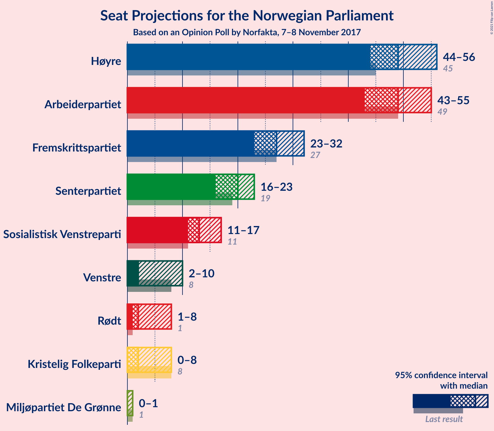

### Confidence Intervals

| Party | Last Result | Median | 80% Confidence Interval | 90% Confidence Interval | 95% Confidence Interval | 99% Confidence Interval |
|:-----:|:-----------:|:------:|:-----------------------:|:-----------------------:|:-----------------------:|:-----------------------:|
| <a href="#høyre">Høyre</a> | 45 | 49 | 45–54 |45–55 |44–55 |42–57 |
| <a href="#arbeiderpartiet">Arbeiderpartiet</a> | 49 | 49 | 45–52 |44–53 |44–56 |42–57 |
| <a href="#fremskrittspartiet">Fremskrittspartiet</a> | 27 | 28 | 23–31 |23–31 |22–32 |21–33 |
| <a href="#senterpartiet">Senterpartiet</a> | 19 | 19 | 17–22 |17–22 |16–23 |15–25 |
| <a href="#sosialistisk-venstreparti">Sosialistisk Venstreparti</a> | 11 | 13 | 11–15 |11–16 |10–17 |9–18 |
| <a href="#venstre">Venstre</a> | 8 | 2 | 2–9 |2–9 |2–10 |1–11 |
| <a href="#rødt">Rødt</a> | 1 | 2 | 2–8 |2–9 |1–9 |1–10 |
| <a href="#kristelig-folkeparti">Kristelig Folkeparti</a> | 8 | 2 | 1–3 |0–8 |0–9 |0–9 |
| <a href="#miljøpartiet-de-grønne">Miljøpartiet De Grønne</a> | 1 | 1 | 0–1 |0–1 |0–1 |0–2 |

### Høyre

*For a full overview of the results for this party, see the [Høyre](party-høyre.html) page.*

| Number of Seats | Probability | Accumulated | Special Marks |
|:---------------:|:-----------:|:-----------:|:-------------:|
| 40 | 0% | 100% |  |
| 41 | 0.1% | 99.9% |  |
| 42 | 0.3% | 99.8% |  |
| 43 | 2% | 99.5% |  |
| 44 | 2% | 98% |  |
| 45 | 8% | 96% | Last Result |
| 46 | 5% | 87% |  |
| 47 | 3% | 82% |  |
| 48 | 19% | 79% |  |
| 49 | 12% | 60% | Median |
| 50 | 5% | 48% |  |
| 51 | 4% | 43% |  |
| 52 | 21% | 39% |  |
| 53 | 1.1% | 17% |  |
| 54 | 9% | 16% |  |
| 55 | 5% | 7% |  |
| 56 | 0.2% | 2% |  |
| 57 | 1.2% | 2% |  |
| 58 | 0.1% | 0.4% |  |
| 59 | 0.3% | 0.3% |  |
| 60 | 0% | 0% |  |

### Arbeiderpartiet

*For a full overview of the results for this party, see the [Arbeiderpartiet](party-arbeiderpartiet.html) page.*

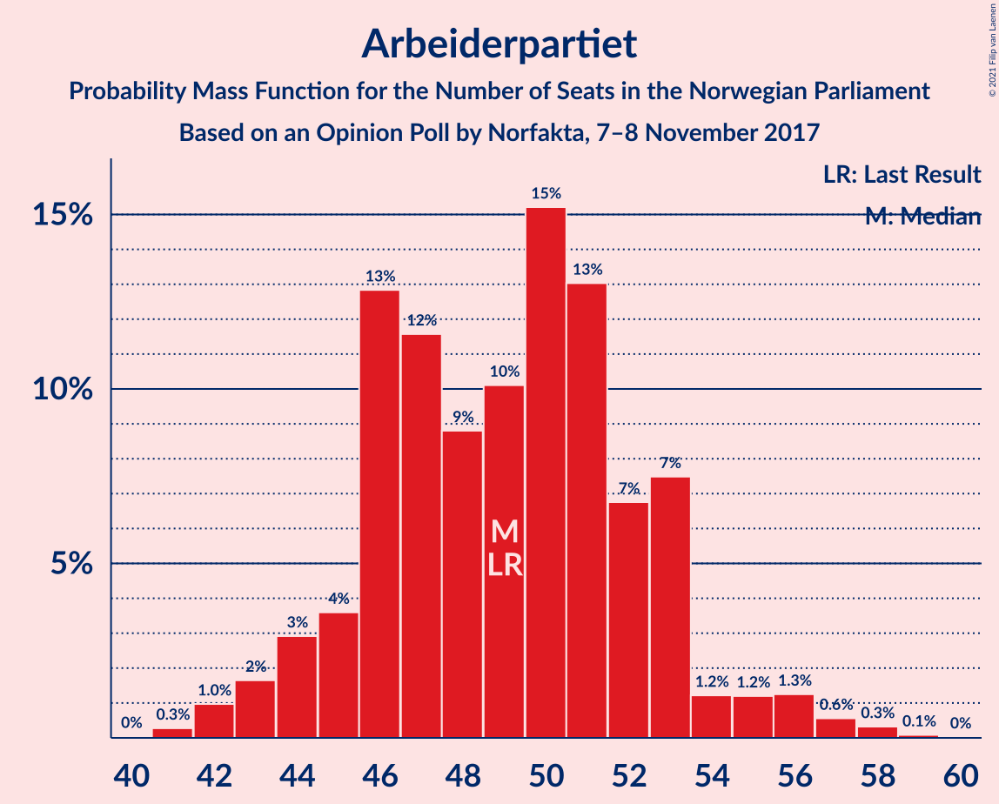

| Number of Seats | Probability | Accumulated | Special Marks |
|:---------------:|:-----------:|:-----------:|:-------------:|
| 39 | 0.1% | 100% |  |
| 40 | 0.1% | 99.9% |  |
| 41 | 0.1% | 99.8% |  |
| 42 | 0.6% | 99.7% |  |
| 43 | 1.2% | 99.1% |  |
| 44 | 5% | 98% |  |
| 45 | 6% | 93% |  |
| 46 | 21% | 87% |  |
| 47 | 9% | 66% |  |
| 48 | 4% | 57% |  |
| 49 | 13% | 53% | Last Result, Median |
| 50 | 7% | 40% |  |
| 51 | 18% | 33% |  |
| 52 | 7% | 15% |  |
| 53 | 4% | 8% |  |
| 54 | 0.5% | 4% |  |
| 55 | 1.1% | 4% |  |
| 56 | 0.5% | 3% |  |
| 57 | 2% | 2% |  |
| 58 | 0% | 0.1% |  |
| 59 | 0% | 0% |  |

### Fremskrittspartiet

*For a full overview of the results for this party, see the [Fremskrittspartiet](party-fremskrittspartiet.html) page.*

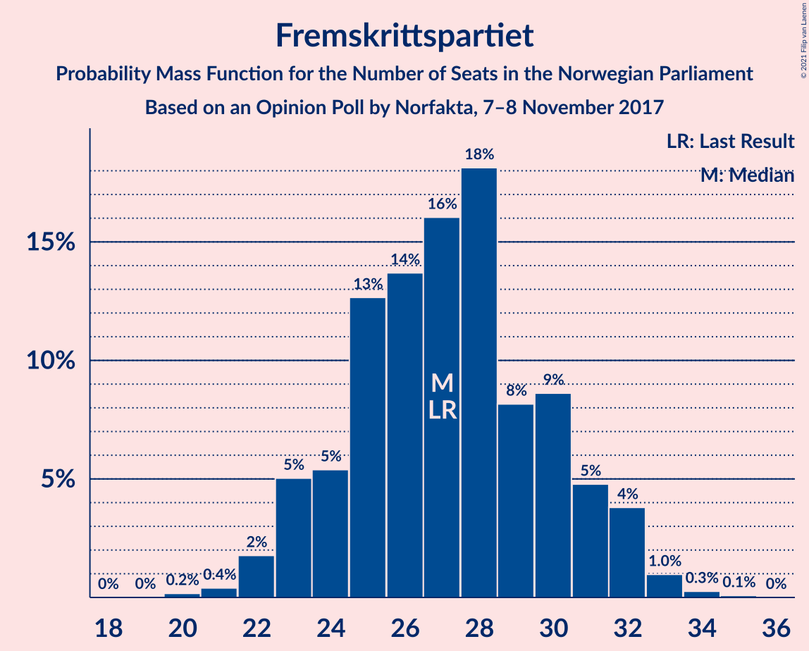

| Number of Seats | Probability | Accumulated | Special Marks |
|:---------------:|:-----------:|:-----------:|:-------------:|
| 20 | 0.1% | 100% |  |
| 21 | 0.4% | 99.9% |  |
| 22 | 3% | 99.5% |  |
| 23 | 8% | 97% |  |
| 24 | 5% | 89% |  |
| 25 | 15% | 83% |  |
| 26 | 9% | 68% |  |
| 27 | 3% | 59% | Last Result |
| 28 | 15% | 56% | Median |
| 29 | 8% | 41% |  |
| 30 | 4% | 33% |  |
| 31 | 25% | 29% |  |
| 32 | 2% | 4% |  |
| 33 | 2% | 2% |  |
| 34 | 0.1% | 0.4% |  |
| 35 | 0.4% | 0.4% |  |
| 36 | 0% | 0% |  |

### Senterpartiet

*For a full overview of the results for this party, see the [Senterpartiet](party-senterpartiet.html) page.*

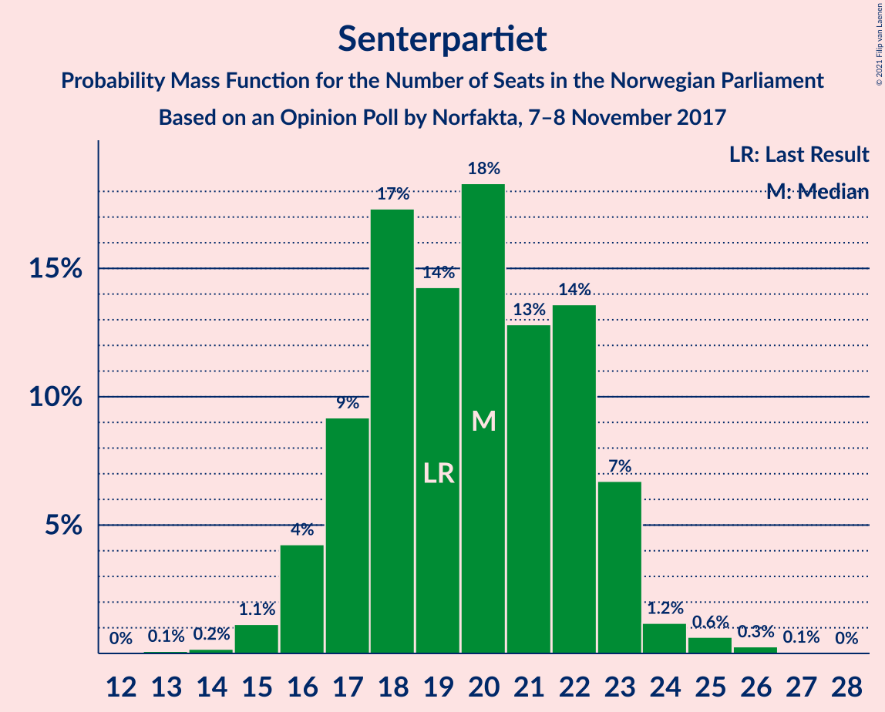

| Number of Seats | Probability | Accumulated | Special Marks |
|:---------------:|:-----------:|:-----------:|:-------------:|
| 14 | 0.1% | 100% |  |
| 15 | 1.2% | 99.8% |  |
| 16 | 3% | 98.7% |  |
| 17 | 9% | 96% |  |
| 18 | 9% | 87% |  |
| 19 | 33% | 79% | Last Result, Median |
| 20 | 19% | 46% |  |
| 21 | 17% | 27% |  |
| 22 | 6% | 10% |  |
| 23 | 3% | 4% |  |
| 24 | 0.8% | 1.5% |  |
| 25 | 0.5% | 0.7% |  |
| 26 | 0.1% | 0.2% |  |
| 27 | 0% | 0.1% |  |
| 28 | 0% | 0% |  |

### Sosialistisk Venstreparti

*For a full overview of the results for this party, see the [Sosialistisk Venstreparti](party-sosialistiskvenstreparti.html) page.*

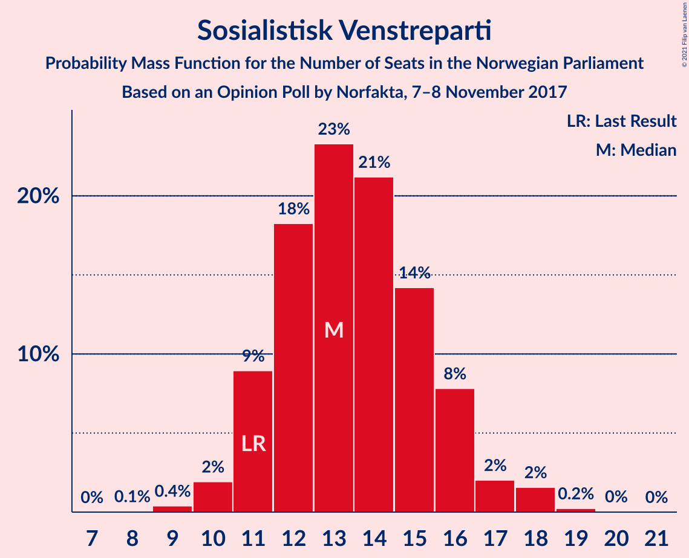

| Number of Seats | Probability | Accumulated | Special Marks |
|:---------------:|:-----------:|:-----------:|:-------------:|
| 9 | 2% | 100% |  |
| 10 | 2% | 98% |  |
| 11 | 15% | 96% | Last Result |
| 12 | 7% | 81% |  |
| 13 | 38% | 74% | Median |
| 14 | 18% | 36% |  |
| 15 | 10% | 18% |  |
| 16 | 5% | 8% |  |
| 17 | 1.1% | 3% |  |
| 18 | 2% | 2% |  |
| 19 | 0.1% | 0.2% |  |
| 20 | 0.1% | 0.1% |  |
| 21 | 0% | 0% |  |

### Venstre

*For a full overview of the results for this party, see the [Venstre](party-venstre.html) page.*

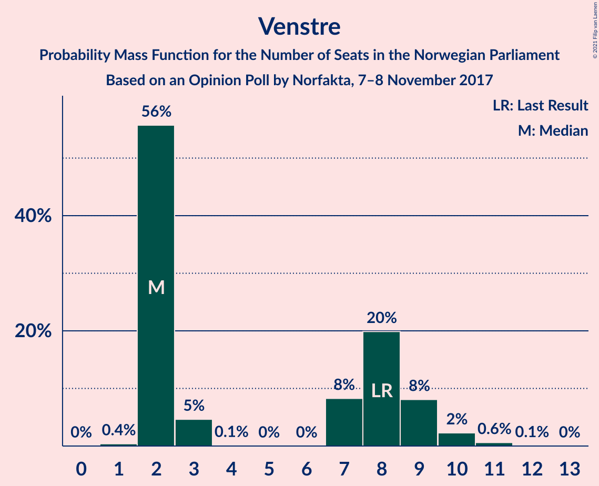

| Number of Seats | Probability | Accumulated | Special Marks |
|:---------------:|:-----------:|:-----------:|:-------------:|
| 1 | 1.2% | 100% |  |
| 2 | 55% | 98.8% | Median |
| 3 | 5% | 44% |  |
| 4 | 0% | 39% |  |
| 5 | 0% | 39% |  |
| 6 | 0% | 39% |  |
| 7 | 3% | 39% |  |
| 8 | 13% | 36% | Last Result |
| 9 | 20% | 22% |  |
| 10 | 0.9% | 3% |  |
| 11 | 2% | 2% |  |
| 12 | 0.2% | 0.2% |  |
| 13 | 0% | 0% |  |

### Rødt

*For a full overview of the results for this party, see the [Rødt](party-rødt.html) page.*

| Number of Seats | Probability | Accumulated | Special Marks |
|:---------------:|:-----------:|:-----------:|:-------------:|
| 1 | 5% | 100% | Last Result |
| 2 | 83% | 95% | Median |
| 3 | 0% | 13% |  |
| 4 | 0% | 13% |  |
| 5 | 0% | 13% |  |
| 6 | 0% | 13% |  |
| 7 | 2% | 13% |  |
| 8 | 4% | 11% |  |
| 9 | 5% | 6% |  |
| 10 | 1.1% | 1.1% |  |
| 11 | 0% | 0% |  |

### Kristelig Folkeparti

*For a full overview of the results for this party, see the [Kristelig Folkeparti](party-kristeligfolkeparti.html) page.*

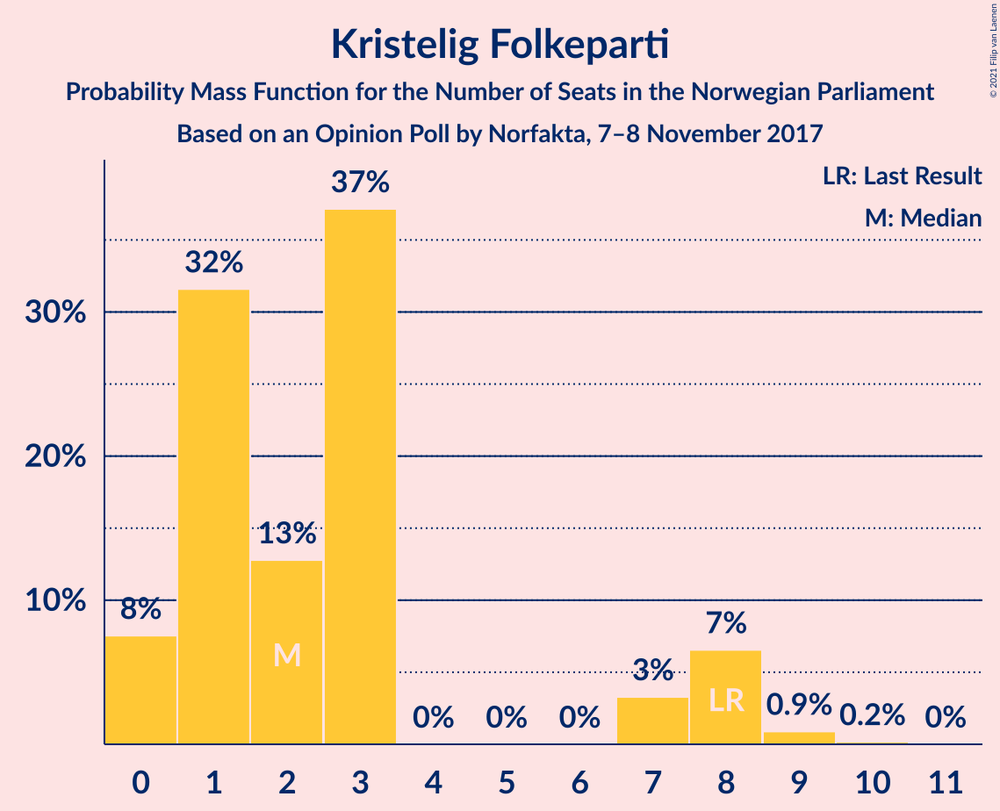

| Number of Seats | Probability | Accumulated | Special Marks |
|:---------------:|:-----------:|:-----------:|:-------------:|
| 0 | 6% | 100% |  |
| 1 | 32% | 94% |  |
| 2 | 20% | 62% | Median |
| 3 | 33% | 42% |  |
| 4 | 0% | 9% |  |
| 5 | 0% | 9% |  |
| 6 | 0% | 9% |  |
| 7 | 1.5% | 9% |  |
| 8 | 4% | 7% | Last Result |
| 9 | 3% | 3% |  |
| 10 | 0.2% | 0.2% |  |
| 11 | 0% | 0% |  |

### Miljøpartiet De Grønne

*For a full overview of the results for this party, see the [Miljøpartiet De Grønne](party-miljøpartietdegrønne.html) page.*

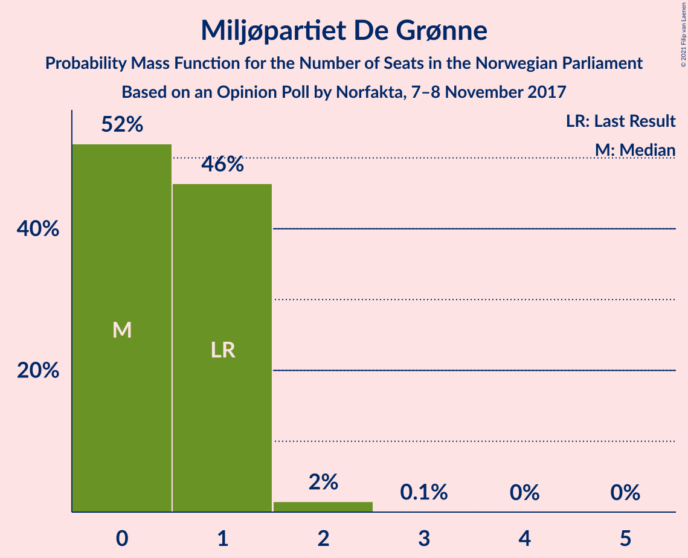

| Number of Seats | Probability | Accumulated | Special Marks |
|:---------------:|:-----------:|:-----------:|:-------------:|
| 0 | 48% | 100% |  |
| 1 | 50% | 52% | Last Result, Median |
| 2 | 2% | 2% |  |
| 3 | 0% | 0.1% |  |
| 4 | 0% | 0% |  |

## Coalitions

### Confidence Intervals

| Coalition | Last Result | Median | Majority? | 80% Confidence Interval | 90% Confidence Interval | 95% Confidence Interval | 99% Confidence Interval |
|:---------:|:-----------:|:------:|:---------:|:-----------------------:|:-----------------------:|:-----------------------:|:-----------------------:|
| Høyre – Fremskrittspartiet – Senterpartiet – Venstre – Kristelig Folkeparti | 107 | 104 | 100% | 98–109 | 97–110 | 96–110 | 94–112 |
| Arbeiderpartiet – Senterpartiet – Sosialistisk Venstreparti – Rødt – Miljøpartiet De Grønne | 81 | 84 | 48% | 80–90 | 79–91 | 79–93 | 76–95 |
| Arbeiderpartiet – Senterpartiet – Sosialistisk Venstreparti – Rødt | 80 | 84 | 42% | 79–90 | 79–91 | 79–93 | 76–95 |
| Arbeiderpartiet – Senterpartiet – Sosialistisk Venstreparti – Kristelig Folkeparti – Miljøpartiet De Grønne | 88 | 85 | 50% | 80–91 | 80–92 | 78–92 | 75–94 |
| Høyre – Fremskrittspartiet – Venstre – Kristelig Folkeparti – Miljøpartiet De Grønne | 89 | 85 | 58% | 79–90 | 78–90 | 76–90 | 74–93 |
| Høyre – Fremskrittspartiet – Venstre – Kristelig Folkeparti | 88 | 85 | 52% | 79–89 | 78–90 | 76–90 | 74–93 |
| Arbeiderpartiet – Senterpartiet – Sosialistisk Venstreparti – Miljøpartiet De Grønne | 80 | 82 | 14% | 77–86 | 77–88 | 76–89 | 73–92 |
| Arbeiderpartiet – Senterpartiet – Sosialistisk Venstreparti | 79 | 81 | 12% | 77–86 | 77–88 | 76–88 | 73–91 |
| Høyre – Fremskrittspartiet – Venstre | 80 | 82 | 30% | 76–87 | 75–87 | 74–88 | 72–91 |
| Høyre – Fremskrittspartiet | 72 | 78 | 7% | 73–82 | 70–85 | 69–85 | 67–85 |
| Arbeiderpartiet – Senterpartiet – Kristelig Folkeparti – Miljøpartiet De Grønne | 77 | 71 | 0% | 67–76 | 65–78 | 65–78 | 62–80 |
| Arbeiderpartiet – Senterpartiet – Kristelig Folkeparti | 76 | 71 | 0% | 66–76 | 64–77 | 64–78 | 62–79 |
| Arbeiderpartiet – Senterpartiet | 68 | 68 | 0% | 64–72 | 63–74 | 62–75 | 60–76 |
| Arbeiderpartiet – Sosialistisk Venstreparti | 60 | 62 | 0% | 57–66 | 57–68 | 56–70 | 54–71 |
| Høyre – Venstre – Kristelig Folkeparti | 61 | 57 | 0% | 51–62 | 50–64 | 49–66 | 48–67 |
| Senterpartiet – Venstre – Kristelig Folkeparti | 35 | 25 | 0% | 23–32 | 21–33 | 20–34 | 19–36 |

### Høyre – Fremskrittspartiet – Senterpartiet – Venstre – Kristelig Folkeparti

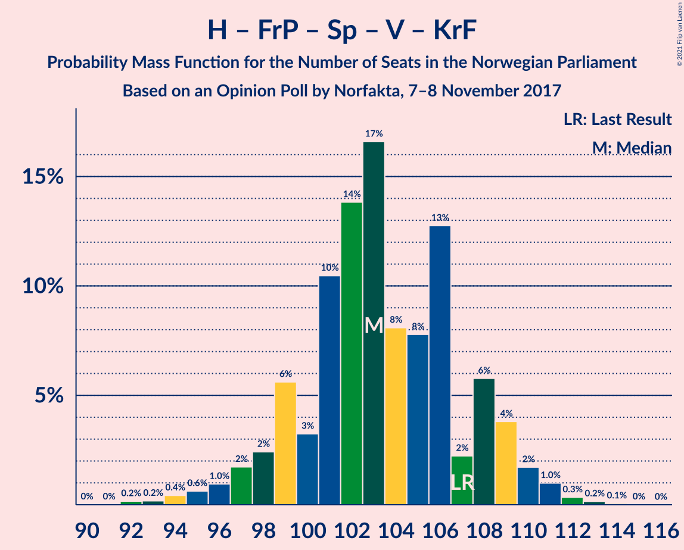

| Number of Seats | Probability | Accumulated | Special Marks |
|:---------------:|:-----------:|:-----------:|:-------------:|
| 92 | 0% | 100% |  |
| 93 | 0.4% | 99.9% |  |
| 94 | 0.1% | 99.5% |  |
| 95 | 1.2% | 99.4% |  |
| 96 | 2% | 98% |  |
| 97 | 3% | 96% |  |
| 98 | 3% | 93% |  |
| 99 | 3% | 90% |  |
| 100 | 2% | 86% | Median |
| 101 | 6% | 84% |  |
| 102 | 18% | 79% |  |
| 103 | 7% | 61% |  |
| 104 | 13% | 54% |  |
| 105 | 8% | 41% |  |
| 106 | 3% | 33% |  |
| 107 | 3% | 29% | Last Result |
| 108 | 16% | 26% |  |
| 109 | 2% | 10% |  |
| 110 | 7% | 8% |  |
| 111 | 0.3% | 1.2% |  |
| 112 | 0.5% | 0.9% |  |
| 113 | 0.4% | 0.4% |  |
| 114 | 0% | 0.1% |  |
| 115 | 0% | 0.1% |  |
| 116 | 0% | 0% |  |

### Arbeiderpartiet – Senterpartiet – Sosialistisk Venstreparti – Rødt – Miljøpartiet De Grønne

| Number of Seats | Probability | Accumulated | Special Marks |
|:---------------:|:-----------:|:-----------:|:-------------:|
| 74 | 0.3% | 100% |  |
| 75 | 0% | 99.7% |  |
| 76 | 0.3% | 99.7% |  |
| 77 | 0.2% | 99.4% |  |
| 78 | 0.9% | 99.2% |  |
| 79 | 8% | 98% |  |
| 80 | 6% | 91% |  |
| 81 | 4% | 85% | Last Result |
| 82 | 12% | 81% |  |
| 83 | 5% | 69% |  |
| 84 | 16% | 64% | Median |
| 85 | 7% | 48% | Majority |
| 86 | 19% | 41% |  |
| 87 | 4% | 22% |  |
| 88 | 3% | 18% |  |
| 89 | 3% | 16% |  |
| 90 | 6% | 12% |  |
| 91 | 2% | 7% |  |
| 92 | 0.2% | 5% |  |
| 93 | 3% | 4% |  |
| 94 | 1.1% | 2% |  |
| 95 | 0.3% | 0.6% |  |
| 96 | 0.1% | 0.3% |  |
| 97 | 0.1% | 0.2% |  |
| 98 | 0% | 0% |  |

### Arbeiderpartiet – Senterpartiet – Sosialistisk Venstreparti – Rødt

| Number of Seats | Probability | Accumulated | Special Marks |
|:---------------:|:-----------:|:-----------:|:-------------:|
| 73 | 0% | 100% |  |
| 74 | 0.2% | 99.9% |  |
| 75 | 0.1% | 99.7% |  |
| 76 | 0.4% | 99.6% |  |
| 77 | 0.5% | 99.3% |  |
| 78 | 0.8% | 98.8% |  |
| 79 | 13% | 98% |  |
| 80 | 4% | 85% | Last Result |
| 81 | 4% | 81% |  |
| 82 | 11% | 78% |  |
| 83 | 10% | 66% | Median |
| 84 | 15% | 57% |  |
| 85 | 19% | 42% | Majority |
| 86 | 3% | 23% |  |
| 87 | 3% | 20% |  |
| 88 | 3% | 17% |  |
| 89 | 3% | 14% |  |
| 90 | 5% | 11% |  |
| 91 | 2% | 6% |  |
| 92 | 0.3% | 4% |  |
| 93 | 4% | 4% |  |
| 94 | 0% | 0.6% |  |
| 95 | 0.4% | 0.6% |  |
| 96 | 0.2% | 0.2% |  |
| 97 | 0% | 0% |  |

### Arbeiderpartiet – Senterpartiet – Sosialistisk Venstreparti – Kristelig Folkeparti – Miljøpartiet De Grønne

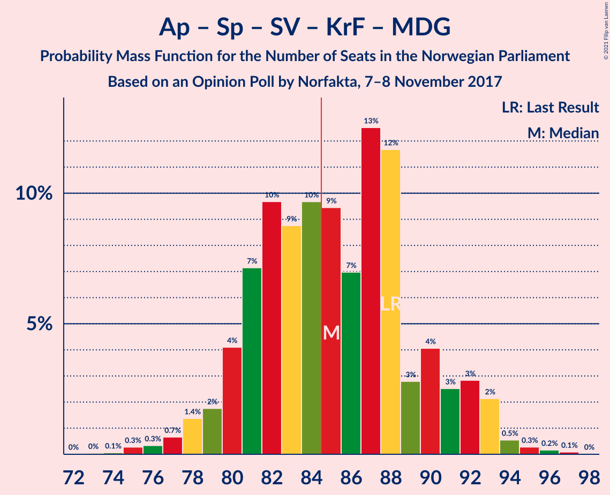

| Number of Seats | Probability | Accumulated | Special Marks |
|:---------------:|:-----------:|:-----------:|:-------------:|
| 74 | 0.1% | 100% |  |
| 75 | 0.4% | 99.9% |  |
| 76 | 0.2% | 99.5% |  |
| 77 | 1.0% | 99.3% |  |
| 78 | 1.1% | 98% |  |
| 79 | 2% | 97% |  |
| 80 | 13% | 95% |  |
| 81 | 15% | 82% |  |
| 82 | 3% | 68% |  |
| 83 | 10% | 65% |  |
| 84 | 4% | 55% | Median |
| 85 | 15% | 50% | Majority |
| 86 | 16% | 36% |  |
| 87 | 3% | 19% |  |
| 88 | 2% | 16% | Last Result |
| 89 | 2% | 15% |  |
| 90 | 2% | 13% |  |
| 91 | 6% | 11% |  |
| 92 | 3% | 5% |  |
| 93 | 0.2% | 2% |  |
| 94 | 2% | 2% |  |
| 95 | 0% | 0.3% |  |
| 96 | 0.2% | 0.2% |  |
| 97 | 0% | 0.1% |  |
| 98 | 0% | 0.1% |  |
| 99 | 0% | 0% |  |

### Høyre – Fremskrittspartiet – Venstre – Kristelig Folkeparti – Miljøpartiet De Grønne

| Number of Seats | Probability | Accumulated | Special Marks |
|:---------------:|:-----------:|:-----------:|:-------------:|
| 72 | 0% | 100% |  |
| 73 | 0.2% | 99.9% |  |
| 74 | 0.4% | 99.8% |  |
| 75 | 0% | 99.4% |  |
| 76 | 4% | 99.4% |  |
| 77 | 0.3% | 96% |  |
| 78 | 2% | 96% |  |
| 79 | 5% | 94% |  |
| 80 | 3% | 89% |  |
| 81 | 3% | 86% |  |
| 82 | 3% | 83% | Median |
| 83 | 3% | 80% |  |
| 84 | 19% | 77% |  |
| 85 | 15% | 58% | Majority |
| 86 | 10% | 43% |  |
| 87 | 11% | 34% |  |
| 88 | 4% | 22% |  |
| 89 | 4% | 19% | Last Result |
| 90 | 13% | 15% |  |
| 91 | 0.8% | 2% |  |
| 92 | 0.5% | 1.2% |  |
| 93 | 0.4% | 0.7% |  |
| 94 | 0.1% | 0.4% |  |
| 95 | 0.2% | 0.3% |  |
| 96 | 0% | 0.1% |  |
| 97 | 0% | 0% |  |

### Høyre – Fremskrittspartiet – Venstre – Kristelig Folkeparti

| Number of Seats | Probability | Accumulated | Special Marks |
|:---------------:|:-----------:|:-----------:|:-------------:|
| 72 | 0.1% | 100% |  |
| 73 | 0.1% | 99.8% |  |
| 74 | 0.3% | 99.7% |  |
| 75 | 1.1% | 99.4% |  |
| 76 | 3% | 98% |  |
| 77 | 0.2% | 96% |  |
| 78 | 2% | 95% |  |
| 79 | 6% | 93% |  |
| 80 | 3% | 88% |  |
| 81 | 3% | 84% | Median |
| 82 | 4% | 82% |  |
| 83 | 19% | 78% |  |
| 84 | 7% | 59% |  |
| 85 | 16% | 52% | Majority |
| 86 | 5% | 36% |  |
| 87 | 12% | 31% |  |
| 88 | 4% | 19% | Last Result |
| 89 | 6% | 15% |  |
| 90 | 8% | 9% |  |
| 91 | 0.9% | 2% |  |
| 92 | 0.2% | 0.8% |  |
| 93 | 0.3% | 0.6% |  |
| 94 | 0% | 0.3% |  |
| 95 | 0.3% | 0.3% |  |
| 96 | 0% | 0% |  |

### Arbeiderpartiet – Senterpartiet – Sosialistisk Venstreparti – Miljøpartiet De Grønne

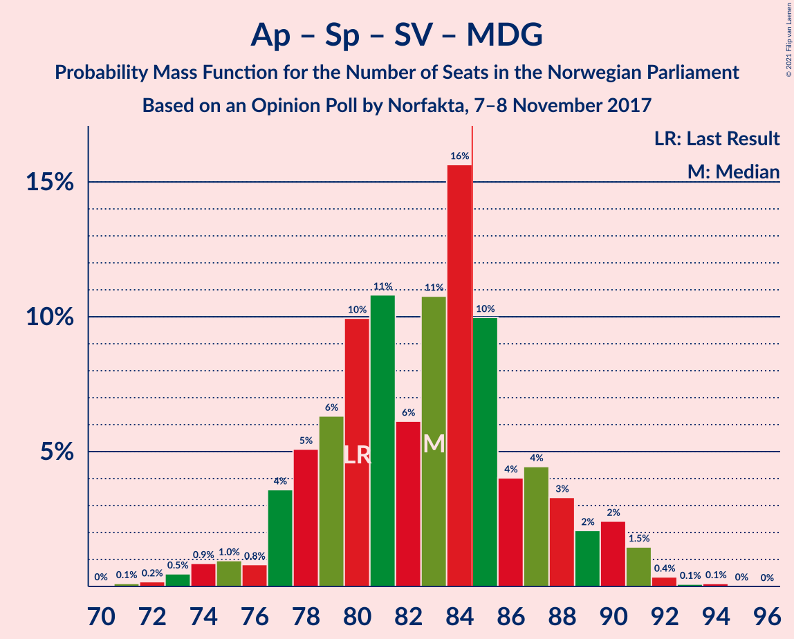

| Number of Seats | Probability | Accumulated | Special Marks |
|:---------------:|:-----------:|:-----------:|:-------------:|
| 71 | 0% | 100% |  |
| 72 | 0.3% | 99.9% |  |
| 73 | 0.2% | 99.7% |  |
| 74 | 0.5% | 99.5% |  |
| 75 | 0.2% | 99.0% |  |
| 76 | 2% | 98.7% |  |
| 77 | 9% | 97% |  |
| 78 | 5% | 88% |  |
| 79 | 6% | 83% |  |
| 80 | 14% | 76% | Last Result |
| 81 | 7% | 62% |  |
| 82 | 14% | 55% | Median |
| 83 | 7% | 41% |  |
| 84 | 20% | 34% |  |
| 85 | 2% | 14% | Majority |
| 86 | 2% | 12% |  |
| 87 | 3% | 10% |  |
| 88 | 4% | 7% |  |
| 89 | 0.4% | 3% |  |
| 90 | 1.0% | 2% |  |
| 91 | 0.1% | 1.2% |  |
| 92 | 0.9% | 1.1% |  |
| 93 | 0.1% | 0.1% |  |
| 94 | 0.1% | 0.1% |  |
| 95 | 0% | 0% |  |

### Arbeiderpartiet – Senterpartiet – Sosialistisk Venstreparti

| Number of Seats | Probability | Accumulated | Special Marks |
|:---------------:|:-----------:|:-----------:|:-------------:|
| 71 | 0.1% | 100% |  |
| 72 | 0.4% | 99.9% |  |
| 73 | 0.2% | 99.6% |  |
| 74 | 0.5% | 99.3% |  |
| 75 | 0.5% | 98.8% |  |
| 76 | 3% | 98% |  |
| 77 | 12% | 95% |  |
| 78 | 5% | 83% |  |
| 79 | 5% | 78% | Last Result |
| 80 | 13% | 73% |  |
| 81 | 10% | 59% | Median |
| 82 | 15% | 49% |  |
| 83 | 18% | 35% |  |
| 84 | 4% | 16% |  |
| 85 | 2% | 12% | Majority |
| 86 | 2% | 11% |  |
| 87 | 2% | 8% |  |
| 88 | 4% | 6% |  |
| 89 | 0.2% | 2% |  |
| 90 | 0.9% | 2% |  |
| 91 | 1.0% | 1.1% |  |
| 92 | 0.1% | 0.2% |  |
| 93 | 0% | 0.1% |  |
| 94 | 0.1% | 0.1% |  |
| 95 | 0% | 0% |  |

### Høyre – Fremskrittspartiet – Venstre

| Number of Seats | Probability | Accumulated | Special Marks |
|:---------------:|:-----------:|:-----------:|:-------------:|
| 69 | 0.2% | 100% |  |
| 70 | 0.1% | 99.8% |  |
| 71 | 0.1% | 99.8% |  |
| 72 | 0.2% | 99.6% |  |
| 73 | 2% | 99.4% |  |
| 74 | 0.3% | 98% |  |
| 75 | 7% | 97% |  |
| 76 | 5% | 90% |  |
| 77 | 3% | 85% |  |
| 78 | 4% | 82% |  |
| 79 | 3% | 78% | Median |
| 80 | 2% | 76% | Last Result |
| 81 | 18% | 74% |  |
| 82 | 14% | 55% |  |
| 83 | 3% | 42% |  |
| 84 | 8% | 39% |  |
| 85 | 3% | 30% | Majority |
| 86 | 14% | 28% |  |
| 87 | 10% | 14% |  |
| 88 | 3% | 4% |  |
| 89 | 1.1% | 2% |  |
| 90 | 0.2% | 0.7% |  |
| 91 | 0.1% | 0.5% |  |
| 92 | 0.4% | 0.5% |  |
| 93 | 0.1% | 0.1% |  |
| 94 | 0% | 0% |  |

### Høyre – Fremskrittspartiet

| Number of Seats | Probability | Accumulated | Special Marks |
|:---------------:|:-----------:|:-----------:|:-------------:|
| 65 | 0% | 100% |  |
| 66 | 0.2% | 99.9% |  |
| 67 | 0.9% | 99.7% |  |
| 68 | 0.2% | 98.9% |  |
| 69 | 2% | 98.6% |  |
| 70 | 2% | 97% |  |
| 71 | 3% | 95% |  |
| 72 | 1.4% | 92% | Last Result |
| 73 | 10% | 91% |  |
| 74 | 6% | 81% |  |
| 75 | 6% | 74% |  |
| 76 | 2% | 68% |  |
| 77 | 13% | 65% | Median |
| 78 | 9% | 53% |  |
| 79 | 17% | 44% |  |
| 80 | 12% | 26% |  |
| 81 | 0.8% | 14% |  |
| 82 | 4% | 13% |  |
| 83 | 2% | 10% |  |
| 84 | 0.5% | 7% |  |
| 85 | 6% | 7% | Majority |
| 86 | 0.2% | 0.4% |  |
| 87 | 0% | 0.2% |  |
| 88 | 0.1% | 0.1% |  |
| 89 | 0.1% | 0.1% |  |
| 90 | 0% | 0% |  |

### Arbeiderpartiet – Senterpartiet – Kristelig Folkeparti – Miljøpartiet De Grønne

| Number of Seats | Probability | Accumulated | Special Marks |
|:---------------:|:-----------:|:-----------:|:-------------:|
| 59 | 0% | 100% |  |
| 60 | 0% | 99.9% |  |
| 61 | 0.2% | 99.9% |  |
| 62 | 0.3% | 99.7% |  |
| 63 | 0.1% | 99.4% |  |
| 64 | 0.4% | 99.3% |  |
| 65 | 5% | 98.9% |  |
| 66 | 3% | 94% |  |
| 67 | 3% | 91% |  |
| 68 | 14% | 88% |  |
| 69 | 11% | 74% |  |
| 70 | 7% | 64% |  |
| 71 | 12% | 57% | Median |
| 72 | 8% | 44% |  |
| 73 | 19% | 37% |  |
| 74 | 2% | 17% |  |
| 75 | 4% | 15% |  |
| 76 | 3% | 12% |  |
| 77 | 1.3% | 9% | Last Result |
| 78 | 6% | 8% |  |
| 79 | 1.4% | 2% |  |
| 80 | 0.3% | 0.6% |  |
| 81 | 0% | 0.4% |  |
| 82 | 0.2% | 0.3% |  |
| 83 | 0% | 0.1% |  |
| 84 | 0.1% | 0.1% |  |
| 85 | 0% | 0% | Majority |

### Arbeiderpartiet – Senterpartiet – Kristelig Folkeparti

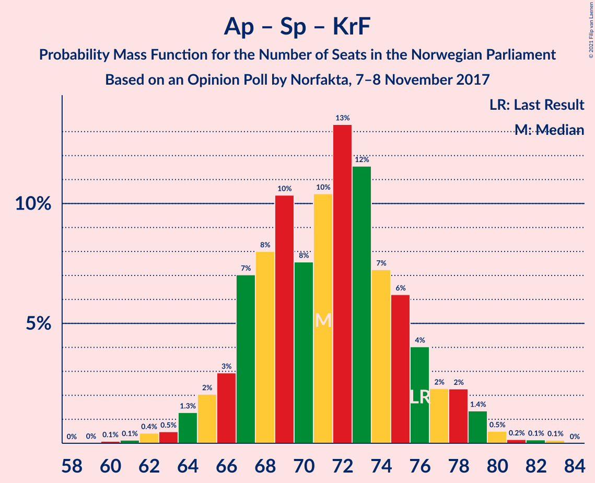

| Number of Seats | Probability | Accumulated | Special Marks |
|:---------------:|:-----------:|:-----------:|:-------------:|
| 59 | 0.1% | 100% |  |
| 60 | 0.1% | 99.9% |  |
| 61 | 0.1% | 99.8% |  |
| 62 | 0.3% | 99.7% |  |
| 63 | 0.3% | 99.4% |  |
| 64 | 4% | 99.1% |  |
| 65 | 2% | 95% |  |
| 66 | 3% | 92% |  |
| 67 | 5% | 89% |  |
| 68 | 13% | 84% |  |
| 69 | 13% | 71% |  |
| 70 | 5% | 59% | Median |
| 71 | 17% | 54% |  |
| 72 | 17% | 37% |  |
| 73 | 4% | 21% |  |
| 74 | 2% | 16% |  |
| 75 | 4% | 14% |  |
| 76 | 1.1% | 10% | Last Result |
| 77 | 5% | 9% |  |
| 78 | 4% | 4% |  |
| 79 | 0.1% | 0.5% |  |
| 80 | 0.1% | 0.4% |  |
| 81 | 0.1% | 0.3% |  |
| 82 | 0.1% | 0.2% |  |
| 83 | 0.1% | 0.1% |  |
| 84 | 0% | 0% |  |

### Arbeiderpartiet – Senterpartiet

| Number of Seats | Probability | Accumulated | Special Marks |
|:---------------:|:-----------:|:-----------:|:-------------:|
| 57 | 0.1% | 100% |  |
| 58 | 0% | 99.9% |  |
| 59 | 0.3% | 99.8% |  |
| 60 | 0.2% | 99.5% |  |
| 61 | 1.4% | 99.3% |  |
| 62 | 1.1% | 98% |  |
| 63 | 4% | 97% |  |
| 64 | 3% | 92% |  |
| 65 | 6% | 90% |  |
| 66 | 13% | 84% |  |
| 67 | 15% | 71% |  |
| 68 | 14% | 57% | Last Result, Median |
| 69 | 6% | 42% |  |
| 70 | 22% | 36% |  |
| 71 | 2% | 14% |  |
| 72 | 6% | 12% |  |
| 73 | 1.3% | 7% |  |
| 74 | 0.9% | 5% |  |
| 75 | 3% | 4% |  |
| 76 | 0.9% | 1.1% |  |
| 77 | 0.1% | 0.2% |  |
| 78 | 0% | 0.1% |  |
| 79 | 0% | 0.1% |  |
| 80 | 0.1% | 0.1% |  |
| 81 | 0% | 0% |  |

### Arbeiderpartiet – Sosialistisk Venstreparti

| Number of Seats | Probability | Accumulated | Special Marks |
|:---------------:|:-----------:|:-----------:|:-------------:|
| 52 | 0.1% | 100% |  |
| 53 | 0.1% | 99.9% |  |
| 54 | 0.7% | 99.8% |  |
| 55 | 0.6% | 99.2% |  |
| 56 | 1.4% | 98.5% |  |
| 57 | 7% | 97% |  |
| 58 | 10% | 90% |  |
| 59 | 12% | 80% |  |
| 60 | 4% | 67% | Last Result |
| 61 | 10% | 64% |  |
| 62 | 6% | 53% | Median |
| 63 | 14% | 47% |  |
| 64 | 20% | 33% |  |
| 65 | 3% | 13% |  |
| 66 | 2% | 11% |  |
| 67 | 2% | 8% |  |
| 68 | 2% | 7% |  |
| 69 | 2% | 5% |  |
| 70 | 2% | 3% |  |
| 71 | 1.0% | 1.2% |  |
| 72 | 0.1% | 0.2% |  |
| 73 | 0% | 0.1% |  |
| 74 | 0.1% | 0.1% |  |
| 75 | 0% | 0% |  |

### Høyre – Venstre – Kristelig Folkeparti

| Number of Seats | Probability | Accumulated | Special Marks |
|:---------------:|:-----------:|:-----------:|:-------------:|
| 45 | 0% | 100% |  |
| 46 | 0.1% | 99.9% |  |
| 47 | 0.1% | 99.8% |  |
| 48 | 2% | 99.7% |  |
| 49 | 2% | 98% |  |
| 50 | 2% | 96% |  |
| 51 | 6% | 94% |  |
| 52 | 16% | 88% |  |
| 53 | 3% | 72% | Median |
| 54 | 3% | 69% |  |
| 55 | 4% | 66% |  |
| 56 | 4% | 63% |  |
| 57 | 15% | 59% |  |
| 58 | 5% | 43% |  |
| 59 | 11% | 38% |  |
| 60 | 3% | 28% |  |
| 61 | 6% | 25% | Last Result |
| 62 | 12% | 19% |  |
| 63 | 2% | 7% |  |
| 64 | 0.7% | 5% |  |
| 65 | 0.7% | 4% |  |
| 66 | 3% | 4% |  |
| 67 | 0.2% | 0.5% |  |
| 68 | 0% | 0.4% |  |
| 69 | 0.1% | 0.3% |  |
| 70 | 0.3% | 0.3% |  |
| 71 | 0% | 0% |  |

### Senterpartiet – Venstre – Kristelig Folkeparti

| Number of Seats | Probability | Accumulated | Special Marks |
|:---------------:|:-----------:|:-----------:|:-------------:|
| 17 | 0.4% | 100% |  |
| 18 | 0.1% | 99.6% |  |
| 19 | 0.6% | 99.5% |  |
| 20 | 2% | 98.9% |  |
| 21 | 4% | 97% |  |
| 22 | 1.1% | 94% |  |
| 23 | 19% | 92% | Median |
| 24 | 13% | 73% |  |
| 25 | 14% | 61% |  |
| 26 | 2% | 47% |  |
| 27 | 8% | 45% |  |
| 28 | 5% | 37% |  |
| 29 | 3% | 32% |  |
| 30 | 7% | 29% |  |
| 31 | 10% | 22% |  |
| 32 | 4% | 12% |  |
| 33 | 5% | 8% |  |
| 34 | 0.9% | 3% |  |
| 35 | 0.4% | 2% | Last Result |
| 36 | 2% | 2% |  |
| 37 | 0.2% | 0.3% |  |
| 38 | 0.1% | 0.1% |  |
| 39 | 0% | 0% |  |

## Technical Information

### Opinion Poll

+ **Polling firm:** Norfakta
+ **Commissioner(s):** —
+ **Fieldwork period:** 7–8 November 2017

### Calculations

+ **Sample size:** 853
+ **Simulations done:** 131,072
+ **Error estimate:** 2.41%

