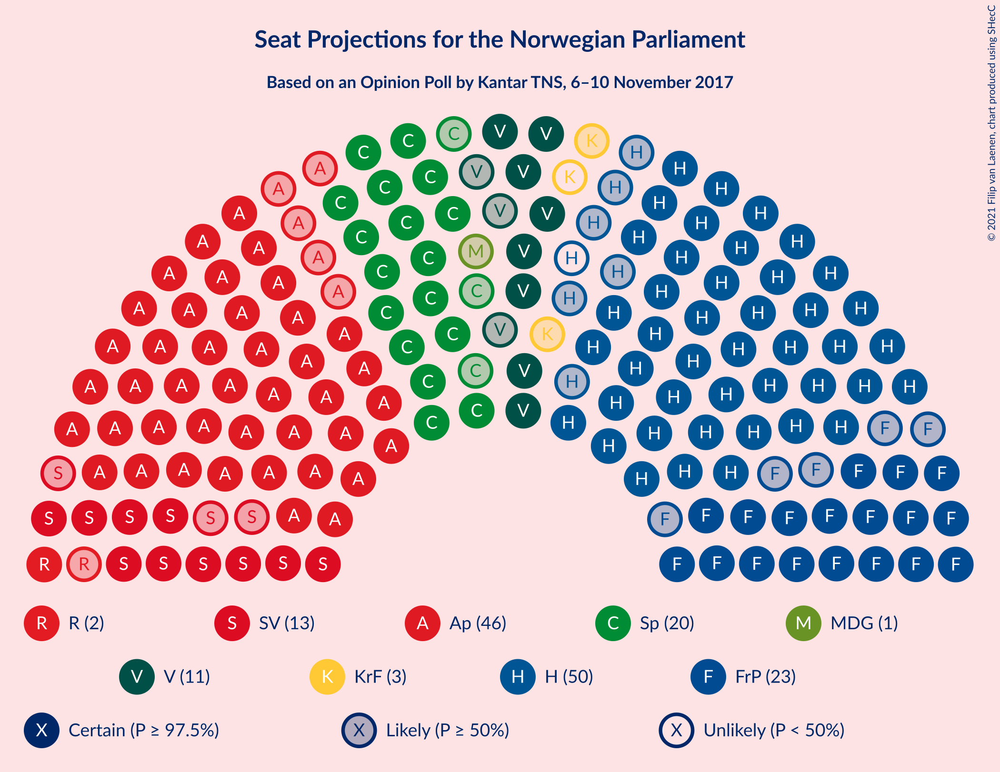
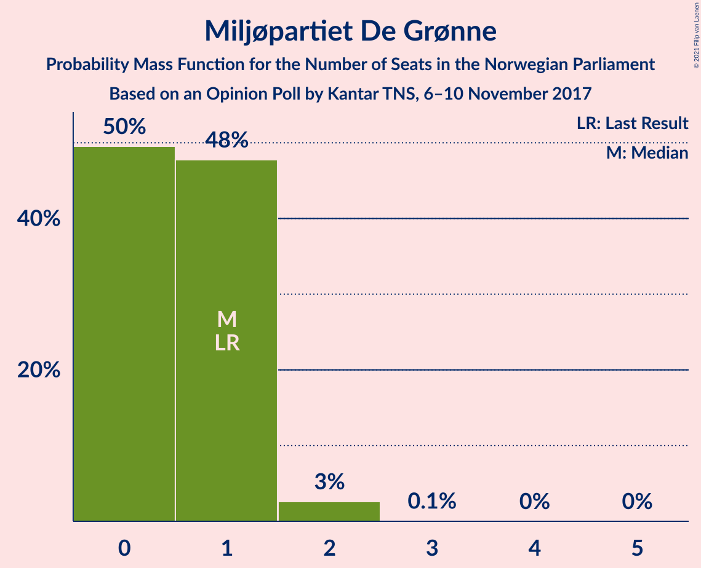
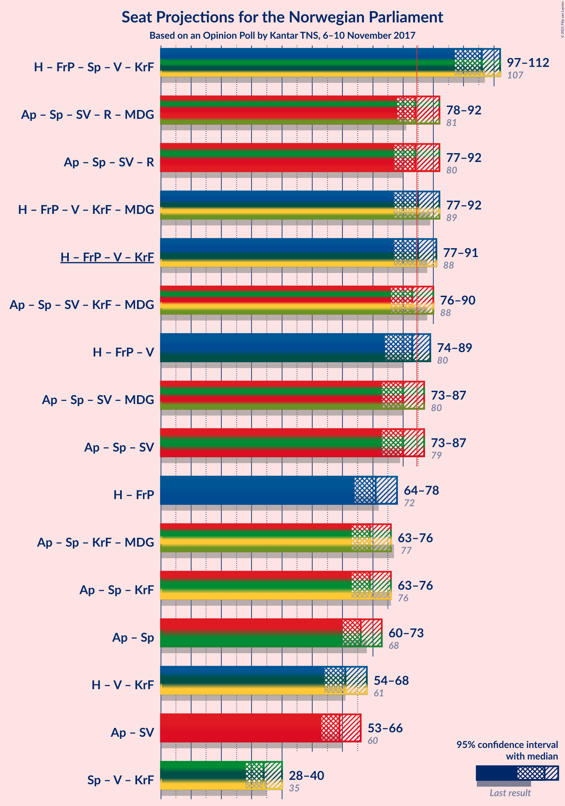
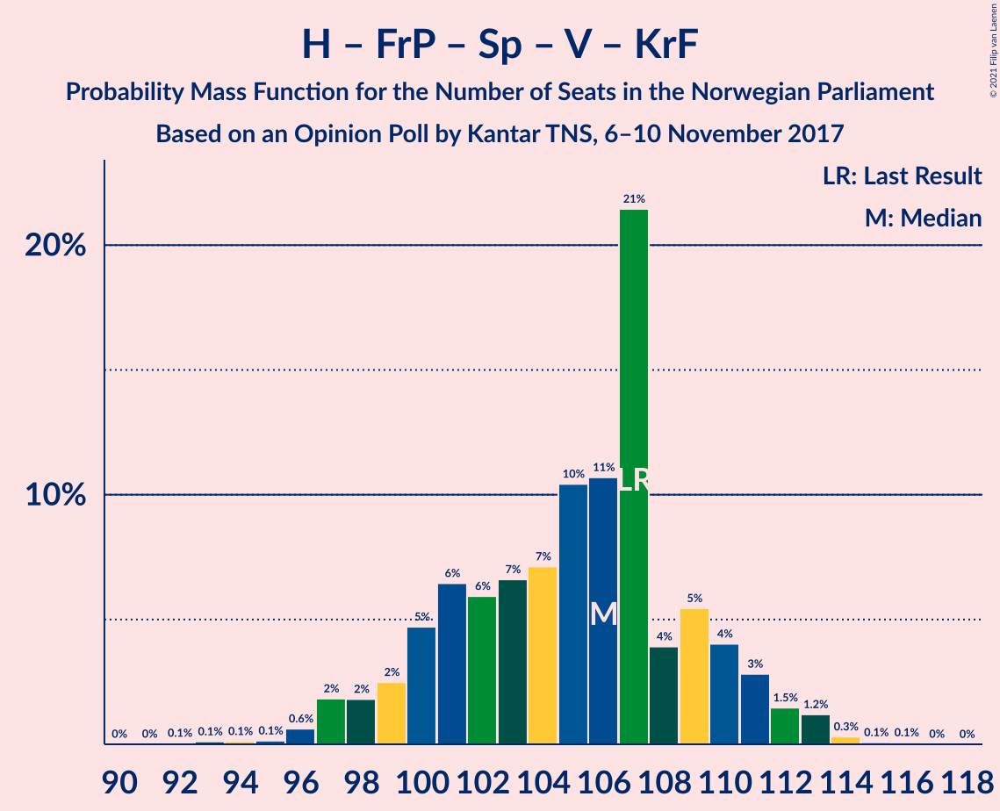
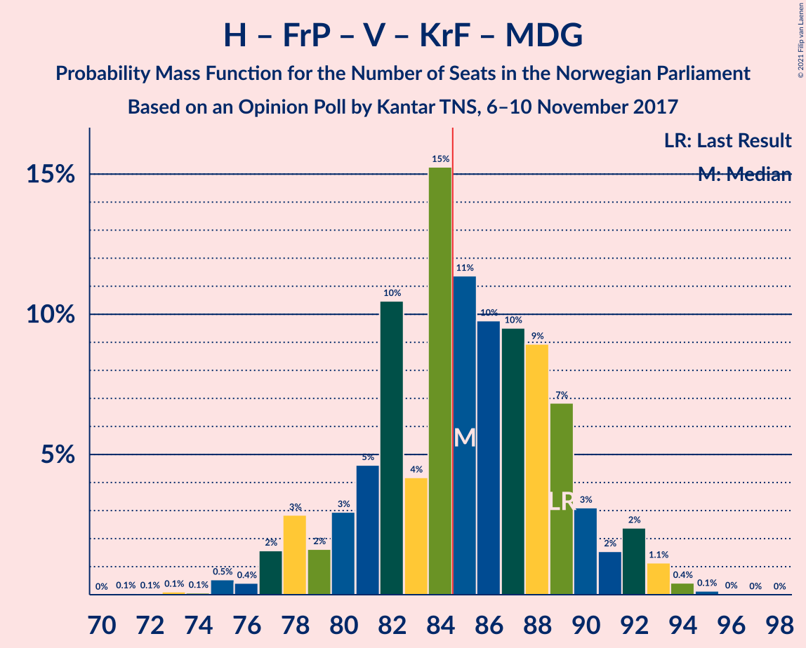
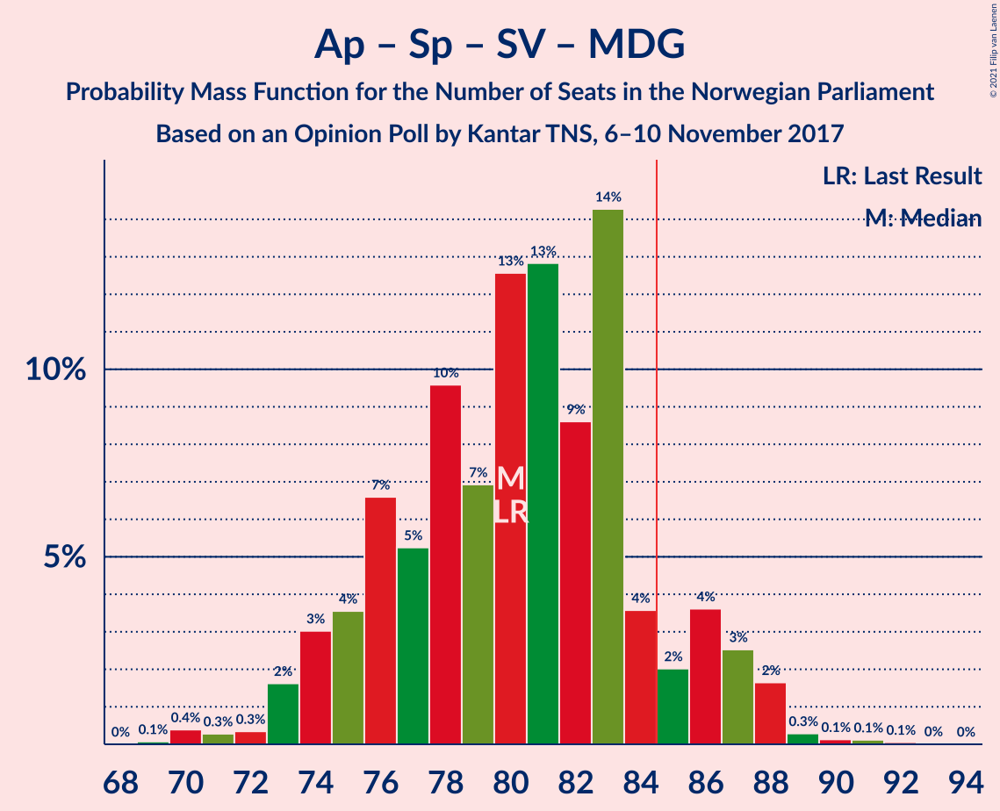
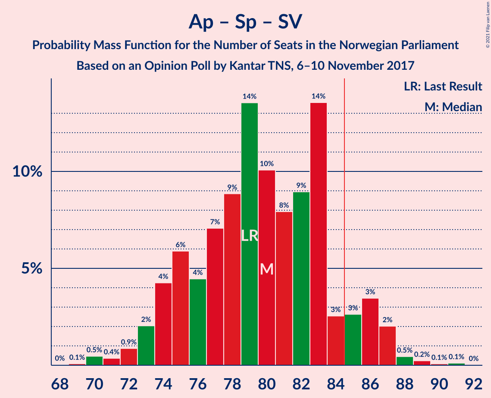
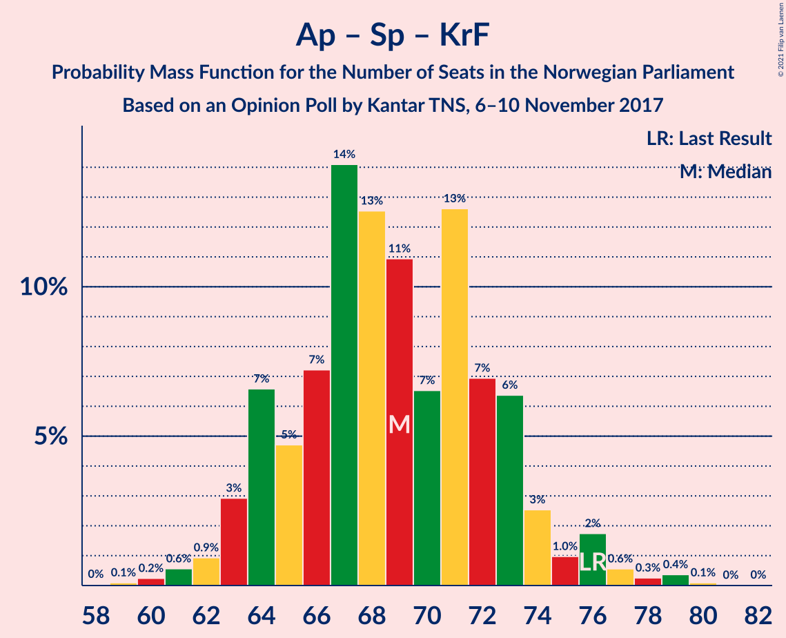

# Opinion Poll by Kantar TNS, 6–10 November 2017

<a href="#voting-intentions">Voting Intentions</a> | <a href="#seats">Seats</a> | <a href="#coalitions">Coalitions</a> | <a href="#technical-information">Technical Information</a>

## Voting Intentions

### Confidence Intervals

| Party | Last Result | Poll Result | 80% Confidence Interval | 90% Confidence Interval | 95% Confidence Interval | 99% Confidence Interval |
|:-----:|:-----------:|:-----------:|:-----------------------:|:-----------------------:|:-----------------------:|:-----------------------:|
| Høyre | 25.0% | 26.9% | 25.0–28.9% |24.4–29.5% |24.0–30.0% |23.1–31.0% |
| Arbeiderpartiet | 27.4% | 25.3% | 23.4–27.3% |22.9–27.9% |22.5–28.4% |21.6–29.4% |
| Fremskrittspartiet | 15.2% | 12.7% | 11.3–14.3% |10.9–14.7% |10.6–15.1% |9.9–15.9% |
| Senterpartiet | 10.3% | 11.4% | 10.1–13.0% |9.8–13.4% |9.4–13.8% |8.9–14.6% |
| Sosialistisk Venstreparti | 6.0% | 7.3% | 6.3–8.6% |6.0–9.0% |5.8–9.3% |5.3–10.0% |
| Venstre | 4.4% | 5.9% | 5.0–7.1% |4.7–7.4% |4.5–7.7% |4.1–8.3% |
| Rødt | 2.4% | 3.9% | 3.1–4.9% |2.9–5.2% |2.7–5.4% |2.4–5.9% |
| Kristelig Folkeparti | 4.2% | 3.1% | 2.5–4.1% |2.3–4.3% |2.1–4.6% |1.9–5.0% |
| Miljøpartiet De Grønne | 3.2% | 1.9% | 1.4–2.7% |1.3–2.9% |1.2–3.1% |1.0–3.5% |

*Note:* The poll result column reflects the actual value used in the calculations. Published results may vary slightly, and in addition be rounded to fewer digits.

## Seats

### Confidence Intervals

| Party | Last Result | Median | 80% Confidence Interval | 90% Confidence Interval | 95% Confidence Interval | 99% Confidence Interval |
|:-----:|:-----------:|:------:|:-----------------------:|:-----------------------:|:-----------------------:|:-----------------------:|
| <a href="#høyre">Høyre</a> | 45 | 48 | 44–53 |43–53 |43–54 |40–56 |
| <a href="#arbeiderpartiet">Arbeiderpartiet</a> | 49 | 44 | 42–50 |42–51 |41–51 |40–53 |
| <a href="#fremskrittspartiet">Fremskrittspartiet</a> | 27 | 23 | 19–25 |19–26 |18–27 |17–30 |
| <a href="#senterpartiet">Senterpartiet</a> | 19 | 20 | 18–24 |17–25 |17–25 |16–27 |
| <a href="#sosialistisk-venstreparti">Sosialistisk Venstreparti</a> | 11 | 14 | 11–16 |11–16 |10–18 |9–18 |
| <a href="#venstre">Venstre</a> | 8 | 11 | 9–13 |9–14 |8–15 |8–15 |
| <a href="#rødt">Rødt</a> | 1 | 2 | 2–9 |1–9 |1–10 |1–10 |
| <a href="#kristelig-folkeparti">Kristelig Folkeparti</a> | 8 | 3 | 1–7 |1–8 |0–8 |0–9 |
| <a href="#miljøpartiet-de-grønne">Miljøpartiet De Grønne</a> | 1 | 0 | 0–1 |0–1 |0–1 |0–2 |

### Høyre

*For a full overview of the results for this party, see the [Høyre](party-høyre.html) page.*

| Number of Seats | Probability | Accumulated | Special Marks |
|:---------------:|:-----------:|:-----------:|:-------------:|
| 38 | 0.1% | 100% |  |
| 39 | 0.1% | 99.9% |  |
| 40 | 0.4% | 99.9% |  |
| 41 | 0.7% | 99.5% |  |
| 42 | 0.9% | 98.8% |  |
| 43 | 4% | 98% |  |
| 44 | 8% | 94% |  |
| 45 | 18% | 86% | Last Result |
| 46 | 7% | 69% |  |
| 47 | 10% | 61% |  |
| 48 | 14% | 51% | Median |
| 49 | 7% | 37% |  |
| 50 | 6% | 30% |  |
| 51 | 9% | 24% |  |
| 52 | 5% | 15% |  |
| 53 | 6% | 10% |  |
| 54 | 4% | 4% |  |
| 55 | 0.1% | 0.6% |  |
| 56 | 0.5% | 0.6% |  |
| 57 | 0% | 0.1% |  |
| 58 | 0% | 0% |  |

### Arbeiderpartiet

*For a full overview of the results for this party, see the [Arbeiderpartiet](party-arbeiderpartiet.html) page.*

| Number of Seats | Probability | Accumulated | Special Marks |
|:---------------:|:-----------:|:-----------:|:-------------:|
| 37 | 0% | 100% |  |
| 38 | 0.1% | 99.9% |  |
| 39 | 0.1% | 99.9% |  |
| 40 | 0.5% | 99.8% |  |
| 41 | 4% | 99.2% |  |
| 42 | 13% | 96% |  |
| 43 | 32% | 83% |  |
| 44 | 13% | 51% | Median |
| 45 | 15% | 39% |  |
| 46 | 2% | 23% |  |
| 47 | 2% | 22% |  |
| 48 | 5% | 19% |  |
| 49 | 2% | 14% | Last Result |
| 50 | 6% | 12% |  |
| 51 | 4% | 5% |  |
| 52 | 0.9% | 2% |  |
| 53 | 0.2% | 0.7% |  |
| 54 | 0.4% | 0.5% |  |
| 55 | 0% | 0% |  |

### Fremskrittspartiet

*For a full overview of the results for this party, see the [Fremskrittspartiet](party-fremskrittspartiet.html) page.*

| Number of Seats | Probability | Accumulated | Special Marks |
|:---------------:|:-----------:|:-----------:|:-------------:|
| 16 | 0% | 100% |  |
| 17 | 0.6% | 99.9% |  |
| 18 | 4% | 99.3% |  |
| 19 | 9% | 95% |  |
| 20 | 6% | 86% |  |
| 21 | 9% | 81% |  |
| 22 | 5% | 71% |  |
| 23 | 26% | 67% | Median |
| 24 | 20% | 41% |  |
| 25 | 11% | 21% |  |
| 26 | 7% | 10% |  |
| 27 | 0.7% | 3% | Last Result |
| 28 | 0.9% | 2% |  |
| 29 | 0.5% | 1.0% |  |
| 30 | 0.5% | 0.5% |  |
| 31 | 0% | 0% |  |

### Senterpartiet

*For a full overview of the results for this party, see the [Senterpartiet](party-senterpartiet.html) page.*

| Number of Seats | Probability | Accumulated | Special Marks |
|:---------------:|:-----------:|:-----------:|:-------------:|
| 15 | 0.4% | 100% |  |
| 16 | 1.3% | 99.5% |  |
| 17 | 4% | 98% |  |
| 18 | 13% | 94% |  |
| 19 | 12% | 81% | Last Result |
| 20 | 20% | 68% | Median |
| 21 | 17% | 48% |  |
| 22 | 15% | 31% |  |
| 23 | 2% | 16% |  |
| 24 | 4% | 14% |  |
| 25 | 8% | 10% |  |
| 26 | 0.2% | 1.3% |  |
| 27 | 0.9% | 1.1% |  |
| 28 | 0.2% | 0.2% |  |
| 29 | 0% | 0% |  |

### Sosialistisk Venstreparti

*For a full overview of the results for this party, see the [Sosialistisk Venstreparti](party-sosialistiskvenstreparti.html) page.*

| Number of Seats | Probability | Accumulated | Special Marks |
|:---------------:|:-----------:|:-----------:|:-------------:|
| 8 | 0.1% | 100% |  |
| 9 | 2% | 99.8% |  |
| 10 | 2% | 98% |  |
| 11 | 8% | 96% | Last Result |
| 12 | 12% | 88% |  |
| 13 | 25% | 76% |  |
| 14 | 23% | 51% | Median |
| 15 | 17% | 27% |  |
| 16 | 6% | 11% |  |
| 17 | 1.3% | 4% |  |
| 18 | 3% | 3% |  |
| 19 | 0.2% | 0.3% |  |
| 20 | 0.1% | 0.1% |  |
| 21 | 0% | 0% |  |

### Venstre

*For a full overview of the results for this party, see the [Venstre](party-venstre.html) page.*

| Number of Seats | Probability | Accumulated | Special Marks |
|:---------------:|:-----------:|:-----------:|:-------------:|
| 3 | 0.1% | 100% |  |
| 4 | 0% | 99.9% |  |
| 5 | 0% | 99.9% |  |
| 6 | 0% | 99.9% |  |
| 7 | 0.4% | 99.9% |  |
| 8 | 3% | 99.5% | Last Result |
| 9 | 8% | 96% |  |
| 10 | 17% | 88% |  |
| 11 | 29% | 71% | Median |
| 12 | 25% | 43% |  |
| 13 | 10% | 17% |  |
| 14 | 5% | 8% |  |
| 15 | 3% | 3% |  |
| 16 | 0.3% | 0.3% |  |
| 17 | 0% | 0% |  |

### Rødt

*For a full overview of the results for this party, see the [Rødt](party-rødt.html) page.*

| Number of Seats | Probability | Accumulated | Special Marks |
|:---------------:|:-----------:|:-----------:|:-------------:|
| 1 | 7% | 100% | Last Result |
| 2 | 48% | 93% | Median |
| 3 | 0% | 44% |  |
| 4 | 0% | 44% |  |
| 5 | 0% | 44% |  |
| 6 | 0% | 44% |  |
| 7 | 13% | 44% |  |
| 8 | 21% | 31% |  |
| 9 | 7% | 10% |  |
| 10 | 3% | 3% |  |
| 11 | 0.2% | 0.2% |  |
| 12 | 0% | 0% |  |

### Kristelig Folkeparti

*For a full overview of the results for this party, see the [Kristelig Folkeparti](party-kristeligfolkeparti.html) page.*

| Number of Seats | Probability | Accumulated | Special Marks |
|:---------------:|:-----------:|:-----------:|:-------------:|
| 0 | 3% | 100% |  |
| 1 | 16% | 97% |  |
| 2 | 16% | 82% |  |
| 3 | 46% | 66% | Median |
| 4 | 0% | 19% |  |
| 5 | 0% | 19% |  |
| 6 | 0% | 19% |  |
| 7 | 10% | 19% |  |
| 8 | 9% | 10% | Last Result |
| 9 | 0.7% | 0.7% |  |
| 10 | 0% | 0% |  |

### Miljøpartiet De Grønne

*For a full overview of the results for this party, see the [Miljøpartiet De Grønne](party-miljøpartietdegrønne.html) page.*

| Number of Seats | Probability | Accumulated | Special Marks |
|:---------------:|:-----------:|:-----------:|:-------------:|
| 0 | 55% | 100% | Median |
| 1 | 42% | 45% | Last Result |
| 2 | 2% | 2% |  |
| 3 | 0% | 0.1% |  |
| 4 | 0% | 0.1% |  |
| 5 | 0% | 0.1% |  |
| 6 | 0% | 0.1% |  |
| 7 | 0.1% | 0.1% |  |
| 8 | 0% | 0% |  |

## Coalitions

### Confidence Intervals

| Coalition | Last Result | Median | Majority? | 80% Confidence Interval | 90% Confidence Interval | 95% Confidence Interval | 99% Confidence Interval |
|:---------:|:-----------:|:------:|:---------:|:-----------------------:|:-----------------------:|:-----------------------:|:-----------------------:|
| Høyre – Fremskrittspartiet – Senterpartiet – Venstre – Kristelig Folkeparti | 107 | 106 | 100% | 102–110 | 101–111 | 98–112 | 96–114 |
| Høyre – Fremskrittspartiet – Venstre – Kristelig Folkeparti – Miljøpartiet De Grønne | 89 | 85 | 64% | 81–90 | 80–92 | 79–92 | 77–94 |
| Høyre – Fremskrittspartiet – Venstre – Kristelig Folkeparti | 88 | 85 | 57% | 81–90 | 79–91 | 79–91 | 76–93 |
| Arbeiderpartiet – Senterpartiet – Sosialistisk Venstreparti – Kristelig Folkeparti – Miljøpartiet De Grønne | 88 | 82 | 29% | 78–87 | 76–89 | 76–91 | 75–93 |
| Arbeiderpartiet – Senterpartiet – Sosialistisk Venstreparti – Rødt – Miljøpartiet De Grønne | 81 | 84 | 43% | 79–88 | 78–90 | 78–90 | 76–93 |
| Arbeiderpartiet – Senterpartiet – Sosialistisk Venstreparti – Rødt | 80 | 84 | 36% | 79–88 | 77–89 | 77–90 | 75–92 |
| Høyre – Fremskrittspartiet – Venstre | 80 | 82 | 21% | 77–86 | 76–88 | 75–89 | 73–91 |
| Arbeiderpartiet – Senterpartiet – Sosialistisk Venstreparti – Miljøpartiet De Grønne | 80 | 79 | 7% | 75–84 | 74–85 | 73–88 | 72–89 |
| Arbeiderpartiet – Senterpartiet – Sosialistisk Venstreparti | 79 | 78 | 5% | 74–83 | 73–85 | 73–87 | 71–88 |
| Arbeiderpartiet – Senterpartiet – Kristelig Folkeparti – Miljøpartiet De Grønne | 77 | 69 | 0% | 65–74 | 64–77 | 63–78 | 62–79 |
| Høyre – Fremskrittspartiet | 72 | 71 | 0% | 66–75 | 65–77 | 65–77 | 62–80 |
| Arbeiderpartiet – Senterpartiet – Kristelig Folkeparti | 76 | 68 | 0% | 64–74 | 64–76 | 63–77 | 61–79 |
| Arbeiderpartiet – Senterpartiet | 68 | 64 | 0% | 62–70 | 61–72 | 60–73 | 59–75 |
| Høyre – Venstre – Kristelig Folkeparti | 61 | 62 | 0% | 58–66 | 58–68 | 56–69 | 54–71 |
| Arbeiderpartiet – Sosialistisk Venstreparti | 60 | 58 | 0% | 55–63 | 54–64 | 53–65 | 51–67 |
| Senterpartiet – Venstre – Kristelig Folkeparti | 35 | 35 | 0% | 31–39 | 31–40 | 30–42 | 28–43 |

### Høyre – Fremskrittspartiet – Senterpartiet – Venstre – Kristelig Folkeparti

| Number of Seats | Probability | Accumulated | Special Marks |
|:---------------:|:-----------:|:-----------:|:-------------:|
| 94 | 0.2% | 100% |  |
| 95 | 0% | 99.8% |  |
| 96 | 0.2% | 99.7% |  |
| 97 | 0.4% | 99.5% |  |
| 98 | 2% | 99.1% |  |
| 99 | 0.3% | 97% |  |
| 100 | 2% | 97% |  |
| 101 | 4% | 95% |  |
| 102 | 8% | 91% |  |
| 103 | 19% | 83% |  |
| 104 | 6% | 64% |  |
| 105 | 5% | 58% | Median |
| 106 | 15% | 53% |  |
| 107 | 4% | 38% | Last Result |
| 108 | 4% | 35% |  |
| 109 | 8% | 31% |  |
| 110 | 15% | 23% |  |
| 111 | 5% | 8% |  |
| 112 | 2% | 3% |  |
| 113 | 0.4% | 1.1% |  |
| 114 | 0.3% | 0.8% |  |
| 115 | 0.2% | 0.5% |  |
| 116 | 0.3% | 0.3% |  |
| 117 | 0% | 0% |  |

### Høyre – Fremskrittspartiet – Venstre – Kristelig Folkeparti – Miljøpartiet De Grønne

| Number of Seats | Probability | Accumulated | Special Marks |
|:---------------:|:-----------:|:-----------:|:-------------:|
| 74 | 0% | 100% |  |
| 75 | 0.1% | 99.9% |  |
| 76 | 0.2% | 99.9% |  |
| 77 | 0.3% | 99.7% |  |
| 78 | 0.8% | 99.4% |  |
| 79 | 2% | 98.5% |  |
| 80 | 4% | 97% |  |
| 81 | 3% | 93% |  |
| 82 | 10% | 90% |  |
| 83 | 4% | 80% |  |
| 84 | 12% | 75% |  |
| 85 | 18% | 64% | Median, Majority |
| 86 | 7% | 45% |  |
| 87 | 9% | 38% |  |
| 88 | 6% | 29% |  |
| 89 | 11% | 23% | Last Result |
| 90 | 3% | 12% |  |
| 91 | 2% | 9% |  |
| 92 | 5% | 7% |  |
| 93 | 1.2% | 2% |  |
| 94 | 0.2% | 0.6% |  |
| 95 | 0.3% | 0.4% |  |
| 96 | 0% | 0.1% |  |
| 97 | 0.1% | 0.1% |  |
| 98 | 0% | 0% |  |

### Høyre – Fremskrittspartiet – Venstre – Kristelig Folkeparti

| Number of Seats | Probability | Accumulated | Special Marks |
|:---------------:|:-----------:|:-----------:|:-------------:|
| 74 | 0% | 100% |  |
| 75 | 0.1% | 99.9% |  |
| 76 | 0.4% | 99.8% |  |
| 77 | 0.8% | 99.4% |  |
| 78 | 0.6% | 98.6% |  |
| 79 | 5% | 98% |  |
| 80 | 0.9% | 93% |  |
| 81 | 4% | 92% |  |
| 82 | 11% | 88% |  |
| 83 | 5% | 77% |  |
| 84 | 15% | 72% |  |
| 85 | 14% | 57% | Median, Majority |
| 86 | 10% | 43% |  |
| 87 | 7% | 32% |  |
| 88 | 8% | 26% | Last Result |
| 89 | 6% | 17% |  |
| 90 | 5% | 12% |  |
| 91 | 4% | 7% |  |
| 92 | 1.2% | 2% |  |
| 93 | 0.6% | 1.1% |  |
| 94 | 0.4% | 0.5% |  |
| 95 | 0% | 0.1% |  |
| 96 | 0% | 0.1% |  |
| 97 | 0% | 0% |  |

### Arbeiderpartiet – Senterpartiet – Sosialistisk Venstreparti – Kristelig Folkeparti – Miljøpartiet De Grønne

| Number of Seats | Probability | Accumulated | Special Marks |
|:---------------:|:-----------:|:-----------:|:-------------:|
| 72 | 0% | 100% |  |
| 73 | 0.1% | 99.9% |  |
| 74 | 0% | 99.8% |  |
| 75 | 0.7% | 99.8% |  |
| 76 | 5% | 99.1% |  |
| 77 | 0.9% | 94% |  |
| 78 | 5% | 93% |  |
| 79 | 10% | 88% |  |
| 80 | 4% | 77% |  |
| 81 | 14% | 74% | Median |
| 82 | 11% | 60% |  |
| 83 | 5% | 49% |  |
| 84 | 16% | 44% |  |
| 85 | 11% | 29% | Majority |
| 86 | 6% | 18% |  |
| 87 | 2% | 12% |  |
| 88 | 3% | 10% | Last Result |
| 89 | 3% | 7% |  |
| 90 | 1.2% | 4% |  |
| 91 | 0.8% | 3% |  |
| 92 | 2% | 2% |  |
| 93 | 0.4% | 0.5% |  |
| 94 | 0.1% | 0.1% |  |
| 95 | 0% | 0% |  |

### Arbeiderpartiet – Senterpartiet – Sosialistisk Venstreparti – Rødt – Miljøpartiet De Grønne

| Number of Seats | Probability | Accumulated | Special Marks |
|:---------------:|:-----------:|:-----------:|:-------------:|
| 73 | 0% | 100% |  |
| 74 | 0% | 99.9% |  |
| 75 | 0.4% | 99.9% |  |
| 76 | 0.6% | 99.5% |  |
| 77 | 1.2% | 98.9% |  |
| 78 | 4% | 98% |  |
| 79 | 5% | 93% |  |
| 80 | 6% | 88% | Median |
| 81 | 8% | 83% | Last Result |
| 82 | 7% | 74% |  |
| 83 | 10% | 68% |  |
| 84 | 14% | 57% |  |
| 85 | 15% | 43% | Majority |
| 86 | 5% | 28% |  |
| 87 | 11% | 23% |  |
| 88 | 4% | 12% |  |
| 89 | 0.9% | 8% |  |
| 90 | 5% | 7% |  |
| 91 | 0.6% | 2% |  |
| 92 | 0.8% | 1.4% |  |
| 93 | 0.4% | 0.6% |  |
| 94 | 0.1% | 0.2% |  |
| 95 | 0% | 0.1% |  |
| 96 | 0% | 0% |  |

### Arbeiderpartiet – Senterpartiet – Sosialistisk Venstreparti – Rødt

| Number of Seats | Probability | Accumulated | Special Marks |
|:---------------:|:-----------:|:-----------:|:-------------:|
| 72 | 0.1% | 100% |  |
| 73 | 0% | 99.9% |  |
| 74 | 0.3% | 99.9% |  |
| 75 | 0.2% | 99.6% |  |
| 76 | 1.2% | 99.4% |  |
| 77 | 5% | 98% |  |
| 78 | 2% | 93% |  |
| 79 | 3% | 91% |  |
| 80 | 11% | 88% | Last Result, Median |
| 81 | 6% | 77% |  |
| 82 | 9% | 71% |  |
| 83 | 7% | 62% |  |
| 84 | 18% | 55% |  |
| 85 | 12% | 36% | Majority |
| 86 | 4% | 25% |  |
| 87 | 10% | 20% |  |
| 88 | 3% | 10% |  |
| 89 | 4% | 7% |  |
| 90 | 2% | 3% |  |
| 91 | 0.8% | 1.5% |  |
| 92 | 0.3% | 0.6% |  |
| 93 | 0.2% | 0.3% |  |
| 94 | 0.1% | 0.1% |  |
| 95 | 0% | 0.1% |  |
| 96 | 0% | 0% |  |

### Høyre – Fremskrittspartiet – Venstre

| Number of Seats | Probability | Accumulated | Special Marks |
|:---------------:|:-----------:|:-----------:|:-------------:|
| 68 | 0% | 100% |  |
| 69 | 0% | 99.9% |  |
| 70 | 0% | 99.9% |  |
| 71 | 0% | 99.9% |  |
| 72 | 0.3% | 99.9% |  |
| 73 | 0.2% | 99.6% |  |
| 74 | 0.7% | 99.4% |  |
| 75 | 2% | 98.7% |  |
| 76 | 4% | 97% |  |
| 77 | 5% | 93% |  |
| 78 | 4% | 88% |  |
| 79 | 10% | 84% |  |
| 80 | 4% | 74% | Last Result |
| 81 | 17% | 70% |  |
| 82 | 12% | 53% | Median |
| 83 | 13% | 42% |  |
| 84 | 7% | 29% |  |
| 85 | 8% | 21% | Majority |
| 86 | 4% | 13% |  |
| 87 | 2% | 9% |  |
| 88 | 4% | 7% |  |
| 89 | 2% | 3% |  |
| 90 | 0.7% | 1.4% |  |
| 91 | 0.6% | 0.6% |  |
| 92 | 0% | 0.1% |  |
| 93 | 0% | 0.1% |  |
| 94 | 0% | 0% |  |

### Arbeiderpartiet – Senterpartiet – Sosialistisk Venstreparti – Miljøpartiet De Grønne

| Number of Seats | Probability | Accumulated | Special Marks |
|:---------------:|:-----------:|:-----------:|:-------------:|
| 69 | 0.1% | 100% |  |
| 70 | 0.1% | 99.9% |  |
| 71 | 0.1% | 99.8% |  |
| 72 | 0.9% | 99.7% |  |
| 73 | 3% | 98.8% |  |
| 74 | 3% | 96% |  |
| 75 | 8% | 93% |  |
| 76 | 5% | 84% |  |
| 77 | 9% | 79% |  |
| 78 | 16% | 70% | Median |
| 79 | 13% | 55% |  |
| 80 | 4% | 41% | Last Result |
| 81 | 9% | 37% |  |
| 82 | 13% | 29% |  |
| 83 | 5% | 16% |  |
| 84 | 4% | 11% |  |
| 85 | 2% | 7% | Majority |
| 86 | 1.1% | 5% |  |
| 87 | 0.5% | 4% |  |
| 88 | 3% | 3% |  |
| 89 | 0.4% | 0.5% |  |
| 90 | 0% | 0.1% |  |
| 91 | 0.1% | 0.1% |  |
| 92 | 0% | 0% |  |

### Arbeiderpartiet – Senterpartiet – Sosialistisk Venstreparti

| Number of Seats | Probability | Accumulated | Special Marks |
|:---------------:|:-----------:|:-----------:|:-------------:|
| 69 | 0.1% | 100% |  |
| 70 | 0.1% | 99.8% |  |
| 71 | 0.8% | 99.8% |  |
| 72 | 1.3% | 99.0% |  |
| 73 | 5% | 98% |  |
| 74 | 4% | 93% |  |
| 75 | 10% | 89% |  |
| 76 | 6% | 79% |  |
| 77 | 4% | 74% |  |
| 78 | 19% | 69% | Median |
| 79 | 11% | 50% | Last Result |
| 80 | 7% | 38% |  |
| 81 | 5% | 31% |  |
| 82 | 14% | 27% |  |
| 83 | 4% | 13% |  |
| 84 | 4% | 9% |  |
| 85 | 1.2% | 5% | Majority |
| 86 | 0.3% | 4% |  |
| 87 | 3% | 4% |  |
| 88 | 0.4% | 0.6% |  |
| 89 | 0% | 0.2% |  |
| 90 | 0.1% | 0.1% |  |
| 91 | 0% | 0% |  |

### Arbeiderpartiet – Senterpartiet – Kristelig Folkeparti – Miljøpartiet De Grønne

| Number of Seats | Probability | Accumulated | Special Marks |
|:---------------:|:-----------:|:-----------:|:-------------:|
| 59 | 0% | 100% |  |
| 60 | 0% | 99.9% |  |
| 61 | 0.3% | 99.9% |  |
| 62 | 0.4% | 99.6% |  |
| 63 | 2% | 99.2% |  |
| 64 | 5% | 97% |  |
| 65 | 6% | 92% |  |
| 66 | 15% | 87% |  |
| 67 | 19% | 72% | Median |
| 68 | 3% | 53% |  |
| 69 | 5% | 51% |  |
| 70 | 12% | 46% |  |
| 71 | 11% | 34% |  |
| 72 | 6% | 23% |  |
| 73 | 4% | 17% |  |
| 74 | 4% | 12% |  |
| 75 | 2% | 8% |  |
| 76 | 0.9% | 6% |  |
| 77 | 1.4% | 5% | Last Result |
| 78 | 2% | 4% |  |
| 79 | 2% | 2% |  |
| 80 | 0.2% | 0.3% |  |
| 81 | 0% | 0.1% |  |
| 82 | 0% | 0% |  |

### Høyre – Fremskrittspartiet

| Number of Seats | Probability | Accumulated | Special Marks |
|:---------------:|:-----------:|:-----------:|:-------------:|
| 59 | 0% | 100% |  |
| 60 | 0% | 99.9% |  |
| 61 | 0.1% | 99.9% |  |
| 62 | 0.7% | 99.8% |  |
| 63 | 0.7% | 99.1% |  |
| 64 | 0.7% | 98% |  |
| 65 | 5% | 98% |  |
| 66 | 5% | 93% |  |
| 67 | 5% | 88% |  |
| 68 | 10% | 83% |  |
| 69 | 12% | 73% |  |
| 70 | 8% | 61% |  |
| 71 | 20% | 54% | Median |
| 72 | 9% | 34% | Last Result |
| 73 | 7% | 24% |  |
| 74 | 2% | 18% |  |
| 75 | 9% | 16% |  |
| 76 | 1.3% | 7% |  |
| 77 | 4% | 6% |  |
| 78 | 0.6% | 2% |  |
| 79 | 0.3% | 0.9% |  |
| 80 | 0.6% | 0.6% |  |
| 81 | 0% | 0.1% |  |
| 82 | 0% | 0% |  |

### Arbeiderpartiet – Senterpartiet – Kristelig Folkeparti

| Number of Seats | Probability | Accumulated | Special Marks |
|:---------------:|:-----------:|:-----------:|:-------------:|
| 59 | 0.1% | 100% |  |
| 60 | 0.1% | 99.9% |  |
| 61 | 0.3% | 99.8% |  |
| 62 | 2% | 99.5% |  |
| 63 | 1.0% | 98% |  |
| 64 | 8% | 97% |  |
| 65 | 10% | 89% |  |
| 66 | 13% | 79% |  |
| 67 | 15% | 67% | Median |
| 68 | 4% | 52% |  |
| 69 | 5% | 48% |  |
| 70 | 16% | 42% |  |
| 71 | 8% | 27% |  |
| 72 | 4% | 18% |  |
| 73 | 5% | 15% |  |
| 74 | 4% | 10% |  |
| 75 | 0.9% | 6% |  |
| 76 | 2% | 5% | Last Result |
| 77 | 2% | 4% |  |
| 78 | 0.2% | 2% |  |
| 79 | 2% | 2% |  |
| 80 | 0% | 0.1% |  |
| 81 | 0% | 0.1% |  |
| 82 | 0% | 0% |  |

### Arbeiderpartiet – Senterpartiet

| Number of Seats | Probability | Accumulated | Special Marks |
|:---------------:|:-----------:|:-----------:|:-------------:|
| 57 | 0.1% | 100% |  |
| 58 | 0.1% | 99.9% |  |
| 59 | 1.3% | 99.8% |  |
| 60 | 1.3% | 98.5% |  |
| 61 | 6% | 97% |  |
| 62 | 13% | 91% |  |
| 63 | 10% | 79% |  |
| 64 | 22% | 69% | Median |
| 65 | 8% | 46% |  |
| 66 | 6% | 38% |  |
| 67 | 4% | 32% |  |
| 68 | 10% | 28% | Last Result |
| 69 | 7% | 18% |  |
| 70 | 2% | 11% |  |
| 71 | 3% | 8% |  |
| 72 | 0.9% | 5% |  |
| 73 | 3% | 4% |  |
| 74 | 0.9% | 2% |  |
| 75 | 0.2% | 0.7% |  |
| 76 | 0.4% | 0.4% |  |
| 77 | 0% | 0% |  |

### Høyre – Venstre – Kristelig Folkeparti

| Number of Seats | Probability | Accumulated | Special Marks |
|:---------------:|:-----------:|:-----------:|:-------------:|
| 52 | 0.3% | 100% |  |
| 53 | 0.1% | 99.7% |  |
| 54 | 0.3% | 99.5% |  |
| 55 | 0.4% | 99.3% |  |
| 56 | 3% | 98.8% |  |
| 57 | 1.0% | 96% |  |
| 58 | 8% | 95% |  |
| 59 | 9% | 87% |  |
| 60 | 10% | 78% |  |
| 61 | 6% | 68% | Last Result |
| 62 | 16% | 62% | Median |
| 63 | 12% | 46% |  |
| 64 | 5% | 34% |  |
| 65 | 11% | 29% |  |
| 66 | 9% | 19% |  |
| 67 | 1.3% | 10% |  |
| 68 | 4% | 8% |  |
| 69 | 3% | 4% |  |
| 70 | 0.3% | 0.9% |  |
| 71 | 0.4% | 0.5% |  |
| 72 | 0.1% | 0.1% |  |
| 73 | 0% | 0% |  |

### Arbeiderpartiet – Sosialistisk Venstreparti

| Number of Seats | Probability | Accumulated | Special Marks |
|:---------------:|:-----------:|:-----------:|:-------------:|
| 50 | 0.4% | 100% |  |
| 51 | 0.5% | 99.6% |  |
| 52 | 0.5% | 99.1% |  |
| 53 | 3% | 98.6% |  |
| 54 | 4% | 96% |  |
| 55 | 11% | 92% |  |
| 56 | 9% | 81% |  |
| 57 | 17% | 72% |  |
| 58 | 17% | 54% | Median |
| 59 | 10% | 38% |  |
| 60 | 8% | 28% | Last Result |
| 61 | 4% | 20% |  |
| 62 | 4% | 16% |  |
| 63 | 3% | 12% |  |
| 64 | 4% | 9% |  |
| 65 | 3% | 4% |  |
| 66 | 0.5% | 1.3% |  |
| 67 | 0.3% | 0.7% |  |
| 68 | 0.4% | 0.4% |  |
| 69 | 0% | 0.1% |  |
| 70 | 0% | 0% |  |

### Senterpartiet – Venstre – Kristelig Folkeparti

| Number of Seats | Probability | Accumulated | Special Marks |
|:---------------:|:-----------:|:-----------:|:-------------:|
| 25 | 0% | 100% |  |
| 26 | 0.1% | 99.9% |  |
| 27 | 0.2% | 99.8% |  |
| 28 | 0.2% | 99.6% |  |
| 29 | 1.2% | 99.4% |  |
| 30 | 3% | 98% |  |
| 31 | 7% | 95% |  |
| 32 | 6% | 88% |  |
| 33 | 8% | 82% |  |
| 34 | 20% | 75% | Median |
| 35 | 16% | 55% | Last Result |
| 36 | 7% | 39% |  |
| 37 | 5% | 32% |  |
| 38 | 10% | 26% |  |
| 39 | 10% | 17% |  |
| 40 | 3% | 7% |  |
| 41 | 1.2% | 4% |  |
| 42 | 0.4% | 3% |  |
| 43 | 2% | 2% |  |
| 44 | 0.3% | 0.3% |  |
| 45 | 0% | 0% |  |

## Technical Information

### Opinion Poll

+ **Polling firm:** Kantar TNS
+ **Commissioner(s):** —
+ **Fieldwork period:** 6–10 November 2017

### Calculations

+ **Sample size:** 830
+ **Simulations done:** 131,072
+ **Error estimate:** 2.73%

