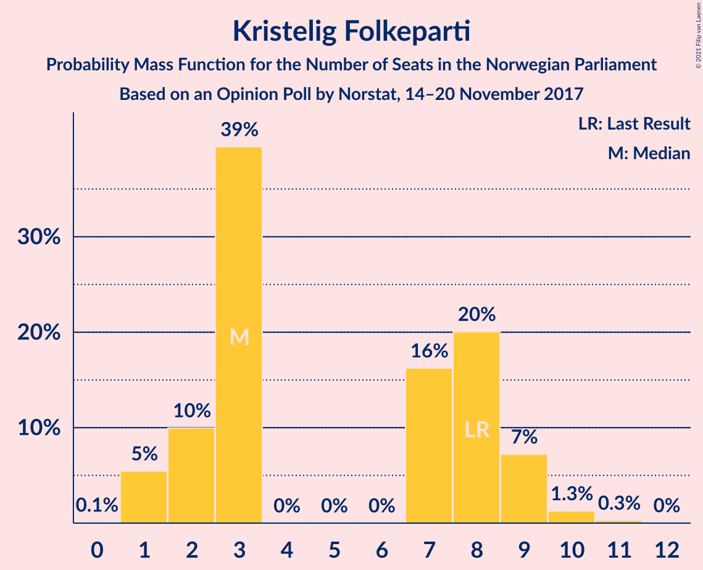
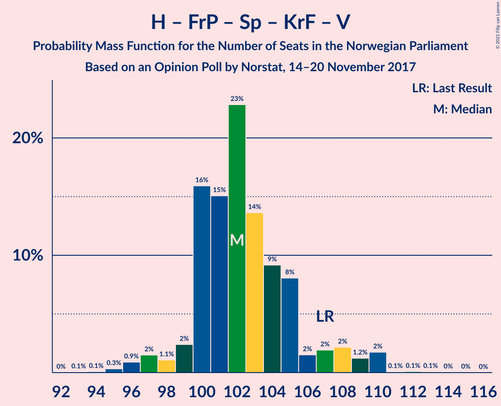
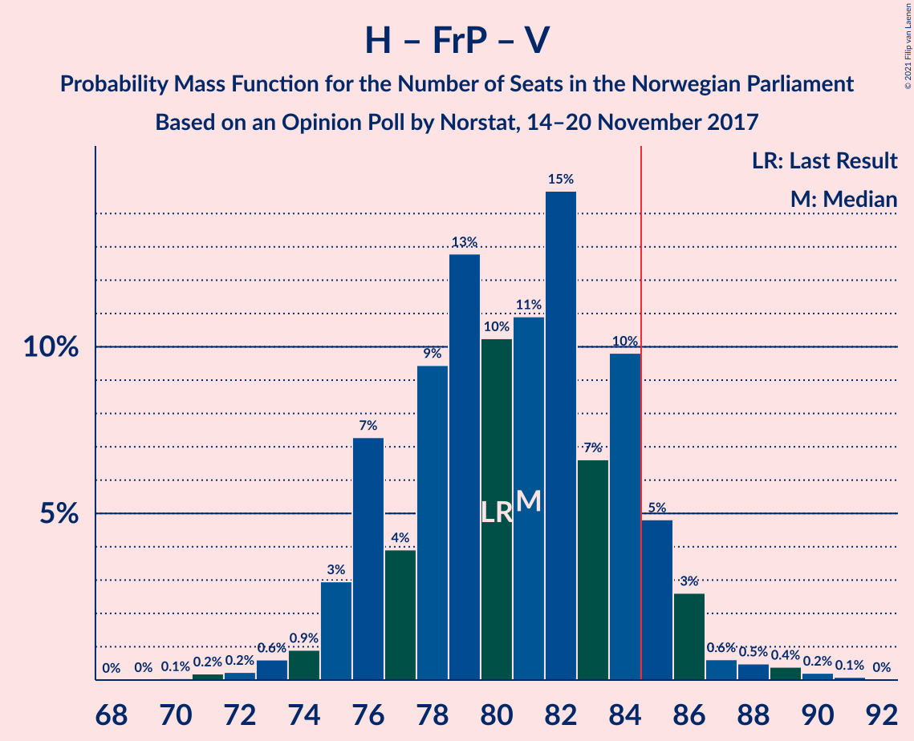
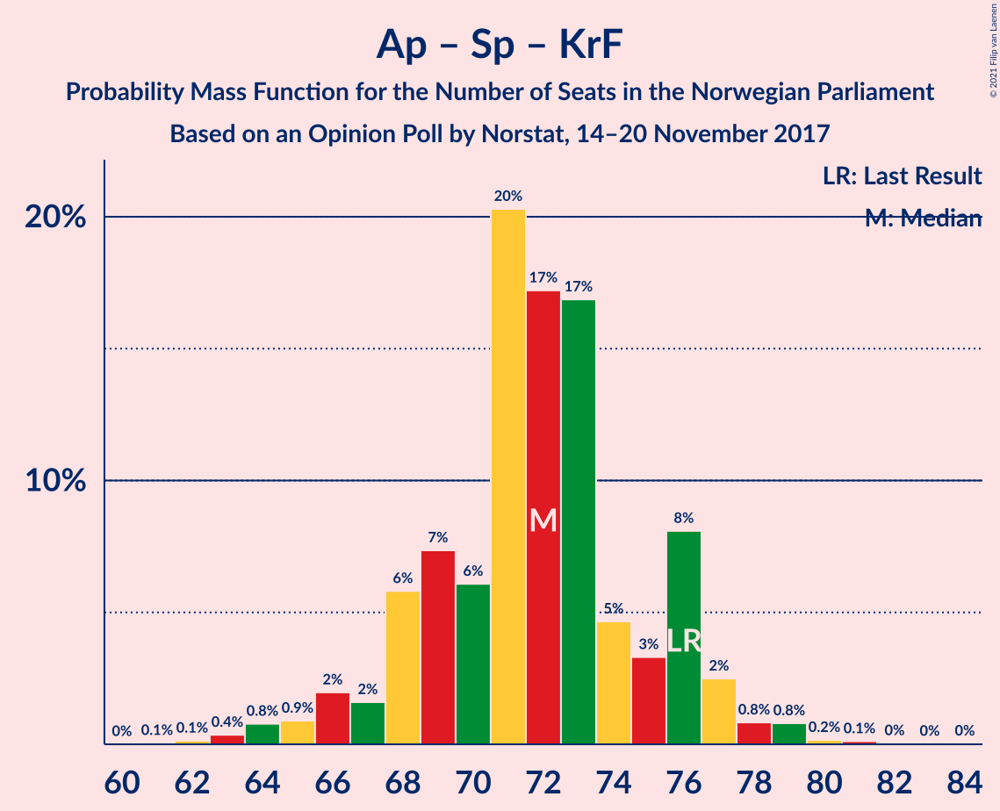

# Opinion Poll by Norstat, 14–20 November 2017

<a href="#voting-intentions">Voting Intentions</a> | <a href="#seats">Seats</a> | <a href="#coalitions">Coalitions</a> | <a href="#technical-information">Technical Information</a>

## Voting Intentions

### Confidence Intervals

| Party | Last Result | Poll Result | 80% Confidence Interval | 90% Confidence Interval | 95% Confidence Interval | 99% Confidence Interval |
|:-----:|:-----------:|:-----------:|:-----------------------:|:-----------------------:|:-----------------------:|:-----------------------:|
| Arbeiderpartiet | 27.4% | 27.1% | 25.3–29.0% |24.8–29.6% |24.4–30.0% |23.5–31.0% |
| Høyre | 25.0% | 26.1% | 24.3–28.0% |23.8–28.5% |23.4–29.0% |22.6–29.9% |
| Fremskrittspartiet | 15.2% | 16.1% | 14.7–17.7% |14.3–18.2% |13.9–18.6% |13.3–19.4% |
| Senterpartiet | 10.3% | 9.3% | 8.2–10.6% |7.9–11.0% |7.6–11.3% |7.1–12.0% |
| Sosialistisk Venstreparti | 6.0% | 7.0% | 6.1–8.2% |5.8–8.5% |5.6–8.8% |5.1–9.4% |
| Kristelig Folkeparti | 4.2% | 4.0% | 3.3–4.9% |3.1–5.2% |2.9–5.4% |2.6–5.9% |
| Venstre | 4.4% | 3.8% | 3.1–4.7% |2.9–5.0% |2.7–5.2% |2.4–5.7% |
| Rødt | 2.4% | 2.9% | 2.3–3.8% |2.2–4.0% |2.0–4.2% |1.8–4.6% |
| Miljøpartiet De Grønne | 3.2% | 2.9% | 2.3–3.8% |2.2–4.0% |2.0–4.2% |1.8–4.6% |

*Note:* The poll result column reflects the actual value used in the calculations. Published results may vary slightly, and in addition be rounded to fewer digits.

## Seats

### Confidence Intervals

| Party | Last Result | Median | 80% Confidence Interval | 90% Confidence Interval | 95% Confidence Interval | 99% Confidence Interval |
|:-----:|:-----------:|:------:|:-----------------------:|:-----------------------:|:-----------------------:|:-----------------------:|
| <a href="#arbeiderpartiet">Arbeiderpartiet</a> | 49 | 49 | 45–52 |44–53 |44–54 |43–57 |
| <a href="#høyre">Høyre</a> | 45 | 48 | 43–51 |43–51 |42–53 |41–54 |
| <a href="#fremskrittspartiet">Fremskrittspartiet</a> | 27 | 30 | 27–32 |26–33 |25–33 |24–35 |
| <a href="#senterpartiet">Senterpartiet</a> | 19 | 17 | 14–19 |14–19 |14–20 |13–21 |
| <a href="#sosialistisk-venstreparti">Sosialistisk Venstreparti</a> | 11 | 13 | 11–14 |11–15 |11–16 |10–18 |
| <a href="#kristelig-folkeparti">Kristelig Folkeparti</a> | 8 | 7 | 2–9 |1–9 |1–9 |1–10 |
| <a href="#venstre">Venstre</a> | 8 | 2 | 2–9 |2–9 |2–10 |2–10 |
| <a href="#rødt">Rødt</a> | 1 | 2 | 1–2 |1–7 |1–8 |1–9 |
| <a href="#miljøpartiet-de-grønne">Miljøpartiet De Grønne</a> | 1 | 1 | 1–2 |1–3 |1–8 |0–9 |

### Arbeiderpartiet

*For a full overview of the results for this party, see the [Arbeiderpartiet](party-arbeiderpartiet.html) page.*

| Number of Seats | Probability | Accumulated | Special Marks |
|:---------------:|:-----------:|:-----------:|:-------------:|
| 41 | 0.1% | 100% |  |
| 42 | 0.4% | 99.9% |  |
| 43 | 1.2% | 99.5% |  |
| 44 | 5% | 98% |  |
| 45 | 4% | 93% |  |
| 46 | 4% | 90% |  |
| 47 | 4% | 86% |  |
| 48 | 8% | 82% |  |
| 49 | 25% | 74% | Last Result, Median |
| 50 | 12% | 49% |  |
| 51 | 16% | 37% |  |
| 52 | 12% | 21% |  |
| 53 | 5% | 9% |  |
| 54 | 3% | 5% |  |
| 55 | 0.3% | 1.5% |  |
| 56 | 0.4% | 1.1% |  |
| 57 | 0.4% | 0.7% |  |
| 58 | 0.2% | 0.3% |  |
| 59 | 0.1% | 0.1% |  |
| 60 | 0% | 0% |  |

### Høyre

*For a full overview of the results for this party, see the [Høyre](party-høyre.html) page.*

| Number of Seats | Probability | Accumulated | Special Marks |
|:---------------:|:-----------:|:-----------:|:-------------:|
| 39 | 0.1% | 100% |  |
| 40 | 0.2% | 99.8% |  |
| 41 | 0.4% | 99.7% |  |
| 42 | 3% | 99.3% |  |
| 43 | 8% | 96% |  |
| 44 | 7% | 88% |  |
| 45 | 9% | 81% | Last Result |
| 46 | 8% | 72% |  |
| 47 | 11% | 64% |  |
| 48 | 22% | 53% | Median |
| 49 | 7% | 32% |  |
| 50 | 9% | 25% |  |
| 51 | 12% | 16% |  |
| 52 | 1.0% | 4% |  |
| 53 | 2% | 3% |  |
| 54 | 0.3% | 0.7% |  |
| 55 | 0.1% | 0.3% |  |
| 56 | 0.1% | 0.2% |  |
| 57 | 0% | 0.1% |  |
| 58 | 0% | 0% |  |

### Fremskrittspartiet

*For a full overview of the results for this party, see the [Fremskrittspartiet](party-fremskrittspartiet.html) page.*

| Number of Seats | Probability | Accumulated | Special Marks |
|:---------------:|:-----------:|:-----------:|:-------------:|
| 23 | 0.1% | 100% |  |
| 24 | 0.5% | 99.9% |  |
| 25 | 2% | 99.4% |  |
| 26 | 5% | 97% |  |
| 27 | 5% | 92% | Last Result |
| 28 | 15% | 87% |  |
| 29 | 14% | 72% |  |
| 30 | 15% | 58% | Median |
| 31 | 26% | 44% |  |
| 32 | 9% | 17% |  |
| 33 | 7% | 9% |  |
| 34 | 0.8% | 1.4% |  |
| 35 | 0.5% | 0.6% |  |
| 36 | 0.1% | 0.2% |  |
| 37 | 0% | 0.1% |  |
| 38 | 0% | 0% |  |

### Senterpartiet

*For a full overview of the results for this party, see the [Senterpartiet](party-senterpartiet.html) page.*

| Number of Seats | Probability | Accumulated | Special Marks |
|:---------------:|:-----------:|:-----------:|:-------------:|
| 12 | 0.2% | 100% |  |
| 13 | 2% | 99.7% |  |
| 14 | 9% | 98% |  |
| 15 | 20% | 89% |  |
| 16 | 12% | 69% |  |
| 17 | 31% | 57% | Median |
| 18 | 9% | 26% |  |
| 19 | 13% | 17% | Last Result |
| 20 | 2% | 4% |  |
| 21 | 2% | 2% |  |
| 22 | 0.3% | 0.5% |  |
| 23 | 0.1% | 0.2% |  |
| 24 | 0% | 0% |  |

### Sosialistisk Venstreparti

*For a full overview of the results for this party, see the [Sosialistisk Venstreparti](party-sosialistiskvenstreparti.html) page.*

| Number of Seats | Probability | Accumulated | Special Marks |
|:---------------:|:-----------:|:-----------:|:-------------:|
| 9 | 0.2% | 100% |  |
| 10 | 0.9% | 99.8% |  |
| 11 | 10% | 98.9% | Last Result |
| 12 | 29% | 89% |  |
| 13 | 34% | 61% | Median |
| 14 | 20% | 26% |  |
| 15 | 4% | 6% |  |
| 16 | 0.5% | 3% |  |
| 17 | 1.4% | 2% |  |
| 18 | 0.5% | 0.6% |  |
| 19 | 0.1% | 0.2% |  |
| 20 | 0% | 0% |  |

### Kristelig Folkeparti

*For a full overview of the results for this party, see the [Kristelig Folkeparti](party-kristeligfolkeparti.html) page.*

| Number of Seats | Probability | Accumulated | Special Marks |
|:---------------:|:-----------:|:-----------:|:-------------:|
| 0 | 0.1% | 100% |  |
| 1 | 6% | 99.9% |  |
| 2 | 5% | 94% |  |
| 3 | 37% | 88% |  |
| 4 | 0% | 51% |  |
| 5 | 0% | 51% |  |
| 6 | 0% | 51% |  |
| 7 | 9% | 51% | Median |
| 8 | 29% | 42% | Last Result |
| 9 | 12% | 14% |  |
| 10 | 1.4% | 2% |  |
| 11 | 0.3% | 0.3% |  |
| 12 | 0% | 0% |  |

### Venstre

*For a full overview of the results for this party, see the [Venstre](party-venstre.html) page.*

| Number of Seats | Probability | Accumulated | Special Marks |
|:---------------:|:-----------:|:-----------:|:-------------:|
| 1 | 0.5% | 100% |  |
| 2 | 67% | 99.5% | Median |
| 3 | 2% | 32% |  |
| 4 | 0% | 30% |  |
| 5 | 0% | 30% |  |
| 6 | 0% | 30% |  |
| 7 | 1.4% | 30% |  |
| 8 | 14% | 29% | Last Result |
| 9 | 12% | 15% |  |
| 10 | 3% | 3% |  |
| 11 | 0.2% | 0.2% |  |
| 12 | 0% | 0% |  |

### Rødt

*For a full overview of the results for this party, see the [Rødt](party-rødt.html) page.*

| Number of Seats | Probability | Accumulated | Special Marks |
|:---------------:|:-----------:|:-----------:|:-------------:|
| 1 | 50% | 100% | Last Result |
| 2 | 45% | 50% | Median |
| 3 | 0% | 5% |  |
| 4 | 0% | 5% |  |
| 5 | 0% | 5% |  |
| 6 | 0% | 5% |  |
| 7 | 0.4% | 5% |  |
| 8 | 4% | 5% |  |
| 9 | 0.6% | 0.6% |  |
| 10 | 0% | 0% |  |

### Miljøpartiet De Grønne

*For a full overview of the results for this party, see the [Miljøpartiet De Grønne](party-miljøpartietdegrønne.html) page.*

| Number of Seats | Probability | Accumulated | Special Marks |
|:---------------:|:-----------:|:-----------:|:-------------:|
| 0 | 1.0% | 100% |  |
| 1 | 62% | 99.0% | Last Result, Median |
| 2 | 29% | 37% |  |
| 3 | 3% | 8% |  |
| 4 | 0% | 5% |  |
| 5 | 0% | 5% |  |
| 6 | 0% | 5% |  |
| 7 | 2% | 5% |  |
| 8 | 2% | 3% |  |
| 9 | 0.8% | 0.9% |  |
| 10 | 0% | 0% |  |

## Coalitions

### Confidence Intervals

| Coalition | Last Result | Median | Majority? | 80% Confidence Interval | 90% Confidence Interval | 95% Confidence Interval | 99% Confidence Interval |
|:---------:|:-----------:|:------:|:---------:|:-----------------------:|:-----------------------:|:-----------------------:|:-----------------------:|
| Høyre – Fremskrittspartiet – Senterpartiet – Kristelig Folkeparti – Venstre | 107 | 104 | 100% | 99–108 | 97–109 | 96–110 | 95–110 |
| Høyre – Fremskrittspartiet – Kristelig Folkeparti – Venstre – Miljøpartiet De Grønne | 89 | 88 | 94% | 85–92 | 84–93 | 82–94 | 79–96 |
| Arbeiderpartiet – Senterpartiet – Sosialistisk Venstreparti – Kristelig Folkeparti – Miljøpartiet De Grønne | 88 | 85 | 63% | 83–91 | 81–91 | 80–93 | 78–95 |
| Høyre – Fremskrittspartiet – Kristelig Folkeparti – Venstre | 88 | 87 | 74% | 83–91 | 81–92 | 80–92 | 77–94 |
| Arbeiderpartiet – Senterpartiet – Sosialistisk Venstreparti – Miljøpartiet De Grønne – Rødt | 81 | 82 | 26% | 78–86 | 77–88 | 77–89 | 75–92 |
| Arbeiderpartiet – Senterpartiet – Sosialistisk Venstreparti – Miljøpartiet De Grønne | 80 | 81 | 8% | 77–84 | 76–86 | 75–88 | 73–90 |
| Arbeiderpartiet – Senterpartiet – Sosialistisk Venstreparti – Rødt | 80 | 81 | 6% | 77–84 | 76–85 | 75–87 | 73–90 |
| Høyre – Fremskrittspartiet – Venstre | 80 | 81 | 12% | 76–85 | 76–86 | 74–87 | 72–90 |
| Arbeiderpartiet – Senterpartiet – Sosialistisk Venstreparti | 79 | 79 | 4% | 75–82 | 74–83 | 74–85 | 72–88 |
| Høyre – Fremskrittspartiet | 72 | 77 | 0.4% | 73–82 | 72–82 | 71–83 | 69–84 |
| Arbeiderpartiet – Senterpartiet – Kristelig Folkeparti – Miljøpartiet De Grønne | 77 | 73 | 0.2% | 70–78 | 68–79 | 67–80 | 65–84 |
| Arbeiderpartiet – Senterpartiet – Kristelig Folkeparti | 76 | 71 | 0% | 68–76 | 66–77 | 65–77 | 63–79 |
| Arbeiderpartiet – Senterpartiet | 68 | 66 | 0% | 62–69 | 61–70 | 61–71 | 59–74 |
| Arbeiderpartiet – Sosialistisk Venstreparti | 60 | 63 | 0% | 58–65 | 57–65 | 57–69 | 56–70 |
| Høyre – Kristelig Folkeparti – Venstre | 61 | 57 | 0% | 52–62 | 51–64 | 48–64 | 47–68 |
| Senterpartiet – Kristelig Folkeparti – Venstre | 35 | 25 | 0% | 21–32 | 20–34 | 20–35 | 19–36 |

### Høyre – Fremskrittspartiet – Senterpartiet – Kristelig Folkeparti – Venstre

| Number of Seats | Probability | Accumulated | Special Marks |
|:---------------:|:-----------:|:-----------:|:-------------:|
| 93 | 0.1% | 100% |  |
| 94 | 0.1% | 99.8% |  |
| 95 | 0.5% | 99.7% |  |
| 96 | 2% | 99.2% |  |
| 97 | 3% | 97% |  |
| 98 | 1.4% | 94% |  |
| 99 | 3% | 93% |  |
| 100 | 9% | 90% |  |
| 101 | 9% | 81% |  |
| 102 | 11% | 72% |  |
| 103 | 10% | 62% |  |
| 104 | 20% | 51% | Median |
| 105 | 17% | 32% |  |
| 106 | 2% | 15% |  |
| 107 | 2% | 13% | Last Result |
| 108 | 4% | 10% |  |
| 109 | 2% | 7% |  |
| 110 | 4% | 4% |  |
| 111 | 0.1% | 0.2% |  |
| 112 | 0% | 0.1% |  |
| 113 | 0% | 0.1% |  |
| 114 | 0% | 0% |  |

### Høyre – Fremskrittspartiet – Kristelig Folkeparti – Venstre – Miljøpartiet De Grønne

| Number of Seats | Probability | Accumulated | Special Marks |
|:---------------:|:-----------:|:-----------:|:-------------:|
| 77 | 0.1% | 100% |  |
| 78 | 0.1% | 99.9% |  |
| 79 | 0.4% | 99.7% |  |
| 80 | 0.4% | 99.4% |  |
| 81 | 1.2% | 99.0% |  |
| 82 | 1.4% | 98% |  |
| 83 | 1.2% | 96% |  |
| 84 | 1.2% | 95% |  |
| 85 | 10% | 94% | Majority |
| 86 | 10% | 84% |  |
| 87 | 8% | 74% |  |
| 88 | 23% | 66% | Median |
| 89 | 19% | 44% | Last Result |
| 90 | 4% | 25% |  |
| 91 | 9% | 21% |  |
| 92 | 2% | 12% |  |
| 93 | 7% | 10% |  |
| 94 | 1.1% | 3% |  |
| 95 | 0.9% | 2% |  |
| 96 | 0.6% | 0.9% |  |
| 97 | 0.2% | 0.2% |  |
| 98 | 0.1% | 0.1% |  |
| 99 | 0% | 0% |  |

### Arbeiderpartiet – Senterpartiet – Sosialistisk Venstreparti – Kristelig Folkeparti – Miljøpartiet De Grønne

| Number of Seats | Probability | Accumulated | Special Marks |
|:---------------:|:-----------:|:-----------:|:-------------:|
| 76 | 0.1% | 100% |  |
| 77 | 0.3% | 99.9% |  |
| 78 | 0.5% | 99.6% |  |
| 79 | 1.0% | 99.1% |  |
| 80 | 2% | 98% |  |
| 81 | 2% | 96% |  |
| 82 | 4% | 94% |  |
| 83 | 6% | 90% |  |
| 84 | 21% | 85% |  |
| 85 | 15% | 63% | Majority |
| 86 | 6% | 49% |  |
| 87 | 15% | 43% | Median |
| 88 | 8% | 28% | Last Result |
| 89 | 3% | 20% |  |
| 90 | 3% | 17% |  |
| 91 | 9% | 14% |  |
| 92 | 2% | 5% |  |
| 93 | 0.5% | 3% |  |
| 94 | 1.4% | 2% |  |
| 95 | 0.3% | 0.8% |  |
| 96 | 0.4% | 0.5% |  |
| 97 | 0.1% | 0.1% |  |
| 98 | 0% | 0.1% |  |
| 99 | 0% | 0% |  |

### Høyre – Fremskrittspartiet – Kristelig Folkeparti – Venstre

| Number of Seats | Probability | Accumulated | Special Marks |
|:---------------:|:-----------:|:-----------:|:-------------:|
| 75 | 0% | 100% |  |
| 76 | 0.2% | 99.9% |  |
| 77 | 0.3% | 99.7% |  |
| 78 | 0.5% | 99.4% |  |
| 79 | 1.2% | 98.9% |  |
| 80 | 2% | 98% |  |
| 81 | 2% | 95% |  |
| 82 | 2% | 93% |  |
| 83 | 7% | 91% |  |
| 84 | 10% | 84% |  |
| 85 | 6% | 74% | Majority |
| 86 | 7% | 68% |  |
| 87 | 28% | 61% | Median |
| 88 | 11% | 33% | Last Result |
| 89 | 4% | 23% |  |
| 90 | 8% | 18% |  |
| 91 | 4% | 10% |  |
| 92 | 5% | 6% |  |
| 93 | 0.3% | 2% |  |
| 94 | 0.8% | 1.2% |  |
| 95 | 0.4% | 0.5% |  |
| 96 | 0.1% | 0.1% |  |
| 97 | 0% | 0% |  |

### Arbeiderpartiet – Senterpartiet – Sosialistisk Venstreparti – Miljøpartiet De Grønne – Rødt

| Number of Seats | Probability | Accumulated | Special Marks |
|:---------------:|:-----------:|:-----------:|:-------------:|
| 73 | 0.1% | 100% |  |
| 74 | 0.4% | 99.9% |  |
| 75 | 0.8% | 99.5% |  |
| 76 | 0.3% | 98.8% |  |
| 77 | 5% | 98% |  |
| 78 | 4% | 94% |  |
| 79 | 8% | 90% |  |
| 80 | 4% | 82% |  |
| 81 | 11% | 77% | Last Result |
| 82 | 28% | 67% | Median |
| 83 | 7% | 39% |  |
| 84 | 6% | 32% |  |
| 85 | 10% | 26% | Majority |
| 86 | 7% | 16% |  |
| 87 | 2% | 9% |  |
| 88 | 2% | 7% |  |
| 89 | 2% | 5% |  |
| 90 | 1.2% | 2% |  |
| 91 | 0.5% | 1.1% |  |
| 92 | 0.3% | 0.6% |  |
| 93 | 0.2% | 0.3% |  |
| 94 | 0% | 0.1% |  |
| 95 | 0% | 0% |  |

### Arbeiderpartiet – Senterpartiet – Sosialistisk Venstreparti – Miljøpartiet De Grønne

| Number of Seats | Probability | Accumulated | Special Marks |
|:---------------:|:-----------:|:-----------:|:-------------:|
| 71 | 0.1% | 100% |  |
| 72 | 0.1% | 99.9% |  |
| 73 | 0.4% | 99.8% |  |
| 74 | 1.0% | 99.4% |  |
| 75 | 1.2% | 98% |  |
| 76 | 7% | 97% |  |
| 77 | 5% | 90% |  |
| 78 | 10% | 86% |  |
| 79 | 11% | 76% |  |
| 80 | 9% | 64% | Last Result, Median |
| 81 | 21% | 55% |  |
| 82 | 10% | 33% |  |
| 83 | 9% | 24% |  |
| 84 | 7% | 15% |  |
| 85 | 1.0% | 8% | Majority |
| 86 | 3% | 7% |  |
| 87 | 2% | 5% |  |
| 88 | 2% | 3% |  |
| 89 | 0.2% | 1.0% |  |
| 90 | 0.5% | 0.7% |  |
| 91 | 0.2% | 0.2% |  |
| 92 | 0% | 0.1% |  |
| 93 | 0% | 0% |  |

### Arbeiderpartiet – Senterpartiet – Sosialistisk Venstreparti – Rødt

| Number of Seats | Probability | Accumulated | Special Marks |
|:---------------:|:-----------:|:-----------:|:-------------:|
| 71 | 0.1% | 100% |  |
| 72 | 0.2% | 99.9% |  |
| 73 | 0.6% | 99.8% |  |
| 74 | 0.9% | 99.1% |  |
| 75 | 1.1% | 98% |  |
| 76 | 7% | 97% |  |
| 77 | 2% | 90% |  |
| 78 | 9% | 88% |  |
| 79 | 4% | 79% |  |
| 80 | 19% | 75% | Last Result |
| 81 | 23% | 56% | Median |
| 82 | 8% | 34% |  |
| 83 | 10% | 26% |  |
| 84 | 10% | 16% |  |
| 85 | 1.2% | 6% | Majority |
| 86 | 1.2% | 5% |  |
| 87 | 1.4% | 4% |  |
| 88 | 1.2% | 2% |  |
| 89 | 0.4% | 1.0% |  |
| 90 | 0.4% | 0.6% |  |
| 91 | 0.1% | 0.3% |  |
| 92 | 0.1% | 0.1% |  |
| 93 | 0% | 0% |  |

### Høyre – Fremskrittspartiet – Venstre

| Number of Seats | Probability | Accumulated | Special Marks |
|:---------------:|:-----------:|:-----------:|:-------------:|
| 69 | 0% | 100% |  |
| 70 | 0.1% | 99.9% |  |
| 71 | 0.4% | 99.9% |  |
| 72 | 0.3% | 99.5% |  |
| 73 | 1.1% | 99.2% |  |
| 74 | 1.0% | 98% |  |
| 75 | 2% | 97% |  |
| 76 | 8% | 95% |  |
| 77 | 5% | 87% |  |
| 78 | 3% | 82% |  |
| 79 | 9% | 79% |  |
| 80 | 16% | 71% | Last Result, Median |
| 81 | 6% | 54% |  |
| 82 | 4% | 48% |  |
| 83 | 12% | 44% |  |
| 84 | 21% | 32% |  |
| 85 | 5% | 12% | Majority |
| 86 | 4% | 6% |  |
| 87 | 0.9% | 3% |  |
| 88 | 0.6% | 2% |  |
| 89 | 0.5% | 1.1% |  |
| 90 | 0.4% | 0.6% |  |
| 91 | 0.2% | 0.2% |  |
| 92 | 0% | 0% |  |

### Arbeiderpartiet – Senterpartiet – Sosialistisk Venstreparti

| Number of Seats | Probability | Accumulated | Special Marks |
|:---------------:|:-----------:|:-----------:|:-------------:|
| 69 | 0% | 100% |  |
| 70 | 0.2% | 99.9% |  |
| 71 | 0.1% | 99.8% |  |
| 72 | 0.7% | 99.7% |  |
| 73 | 1.3% | 98.9% |  |
| 74 | 3% | 98% |  |
| 75 | 7% | 95% |  |
| 76 | 6% | 87% |  |
| 77 | 8% | 81% |  |
| 78 | 17% | 73% |  |
| 79 | 8% | 57% | Last Result, Median |
| 80 | 23% | 49% |  |
| 81 | 12% | 26% |  |
| 82 | 7% | 14% |  |
| 83 | 2% | 7% |  |
| 84 | 0.6% | 4% |  |
| 85 | 1.5% | 4% | Majority |
| 86 | 0.7% | 2% |  |
| 87 | 0.8% | 1.5% |  |
| 88 | 0.3% | 0.6% |  |
| 89 | 0.2% | 0.3% |  |
| 90 | 0% | 0% |  |

### Høyre – Fremskrittspartiet

| Number of Seats | Probability | Accumulated | Special Marks |
|:---------------:|:-----------:|:-----------:|:-------------:|
| 66 | 0% | 100% |  |
| 67 | 0.1% | 99.9% |  |
| 68 | 0.2% | 99.9% |  |
| 69 | 0.5% | 99.7% |  |
| 70 | 0.8% | 99.2% |  |
| 71 | 2% | 98% |  |
| 72 | 4% | 96% | Last Result |
| 73 | 4% | 92% |  |
| 74 | 11% | 89% |  |
| 75 | 14% | 78% |  |
| 76 | 6% | 64% |  |
| 77 | 13% | 57% |  |
| 78 | 16% | 44% | Median |
| 79 | 4% | 29% |  |
| 80 | 2% | 25% |  |
| 81 | 8% | 23% |  |
| 82 | 12% | 15% |  |
| 83 | 2% | 3% |  |
| 84 | 0.2% | 0.6% |  |
| 85 | 0.2% | 0.4% | Majority |
| 86 | 0.1% | 0.1% |  |
| 87 | 0% | 0% |  |

### Arbeiderpartiet – Senterpartiet – Kristelig Folkeparti – Miljøpartiet De Grønne

| Number of Seats | Probability | Accumulated | Special Marks |
|:---------------:|:-----------:|:-----------:|:-------------:|
| 63 | 0% | 100% |  |
| 64 | 0.4% | 99.9% |  |
| 65 | 0.9% | 99.6% |  |
| 66 | 1.1% | 98.6% |  |
| 67 | 0.9% | 98% |  |
| 68 | 2% | 97% |  |
| 69 | 3% | 94% |  |
| 70 | 11% | 92% |  |
| 71 | 10% | 81% |  |
| 72 | 19% | 71% |  |
| 73 | 14% | 53% |  |
| 74 | 8% | 39% | Median |
| 75 | 7% | 30% |  |
| 76 | 8% | 23% |  |
| 77 | 3% | 16% | Last Result |
| 78 | 7% | 13% |  |
| 79 | 0.8% | 6% |  |
| 80 | 3% | 5% |  |
| 81 | 0.8% | 2% |  |
| 82 | 0.3% | 1.3% |  |
| 83 | 0.4% | 1.0% |  |
| 84 | 0.5% | 0.6% |  |
| 85 | 0.1% | 0.2% | Majority |
| 86 | 0% | 0.1% |  |
| 87 | 0% | 0% |  |

### Arbeiderpartiet – Senterpartiet – Kristelig Folkeparti

| Number of Seats | Probability | Accumulated | Special Marks |
|:---------------:|:-----------:|:-----------:|:-------------:|
| 61 | 0% | 100% |  |
| 62 | 0.2% | 99.9% |  |
| 63 | 0.5% | 99.8% |  |
| 64 | 1.3% | 99.3% |  |
| 65 | 1.3% | 98% |  |
| 66 | 3% | 97% |  |
| 67 | 2% | 94% |  |
| 68 | 3% | 93% |  |
| 69 | 14% | 89% |  |
| 70 | 11% | 75% |  |
| 71 | 16% | 64% |  |
| 72 | 14% | 48% |  |
| 73 | 10% | 35% | Median |
| 74 | 9% | 24% |  |
| 75 | 3% | 15% |  |
| 76 | 6% | 13% | Last Result |
| 77 | 5% | 7% |  |
| 78 | 0.5% | 2% |  |
| 79 | 0.7% | 1.2% |  |
| 80 | 0.2% | 0.5% |  |
| 81 | 0.1% | 0.3% |  |
| 82 | 0% | 0.2% |  |
| 83 | 0% | 0.1% |  |
| 84 | 0.1% | 0.1% |  |
| 85 | 0% | 0% | Majority |

### Arbeiderpartiet – Senterpartiet

| Number of Seats | Probability | Accumulated | Special Marks |
|:---------------:|:-----------:|:-----------:|:-------------:|
| 58 | 0.3% | 100% |  |
| 59 | 0.7% | 99.7% |  |
| 60 | 1.1% | 99.0% |  |
| 61 | 4% | 98% |  |
| 62 | 6% | 94% |  |
| 63 | 4% | 88% |  |
| 64 | 16% | 85% |  |
| 65 | 7% | 69% |  |
| 66 | 18% | 61% | Median |
| 67 | 7% | 43% |  |
| 68 | 18% | 37% | Last Result |
| 69 | 10% | 19% |  |
| 70 | 5% | 8% |  |
| 71 | 0.9% | 3% |  |
| 72 | 1.2% | 2% |  |
| 73 | 0.4% | 1.0% |  |
| 74 | 0.2% | 0.6% |  |
| 75 | 0.1% | 0.4% |  |
| 76 | 0.1% | 0.3% |  |
| 77 | 0.2% | 0.3% |  |
| 78 | 0% | 0% |  |

### Arbeiderpartiet – Sosialistisk Venstreparti

| Number of Seats | Probability | Accumulated | Special Marks |
|:---------------:|:-----------:|:-----------:|:-------------:|
| 52 | 0% | 100% |  |
| 53 | 0% | 99.9% |  |
| 54 | 0% | 99.9% |  |
| 55 | 0.1% | 99.9% |  |
| 56 | 0.8% | 99.8% |  |
| 57 | 6% | 99.0% |  |
| 58 | 5% | 93% |  |
| 59 | 4% | 88% |  |
| 60 | 3% | 85% | Last Result |
| 61 | 6% | 82% |  |
| 62 | 21% | 75% | Median |
| 63 | 29% | 55% |  |
| 64 | 13% | 26% |  |
| 65 | 9% | 14% |  |
| 66 | 0.9% | 5% |  |
| 67 | 0.2% | 4% |  |
| 68 | 0.4% | 4% |  |
| 69 | 1.1% | 3% |  |
| 70 | 2% | 2% |  |
| 71 | 0.4% | 0.4% |  |
| 72 | 0% | 0% |  |

### Høyre – Kristelig Folkeparti – Venstre

| Number of Seats | Probability | Accumulated | Special Marks |
|:---------------:|:-----------:|:-----------:|:-------------:|
| 46 | 0.1% | 100% |  |
| 47 | 1.0% | 99.9% |  |
| 48 | 1.4% | 98.9% |  |
| 49 | 0.5% | 97% |  |
| 50 | 0.3% | 97% |  |
| 51 | 5% | 97% |  |
| 52 | 2% | 91% |  |
| 53 | 7% | 89% |  |
| 54 | 8% | 81% |  |
| 55 | 8% | 74% |  |
| 56 | 14% | 66% |  |
| 57 | 4% | 52% | Median |
| 58 | 16% | 47% |  |
| 59 | 16% | 32% |  |
| 60 | 3% | 15% |  |
| 61 | 2% | 13% | Last Result |
| 62 | 2% | 10% |  |
| 63 | 2% | 8% |  |
| 64 | 4% | 6% |  |
| 65 | 1.2% | 2% |  |
| 66 | 0.5% | 1.2% |  |
| 67 | 0.2% | 0.7% |  |
| 68 | 0.3% | 0.5% |  |
| 69 | 0.2% | 0.2% |  |
| 70 | 0% | 0% |  |

### Senterpartiet – Kristelig Folkeparti – Venstre

| Number of Seats | Probability | Accumulated | Special Marks |
|:---------------:|:-----------:|:-----------:|:-------------:|
| 17 | 0.1% | 100% |  |
| 18 | 0.3% | 99.9% |  |
| 19 | 2% | 99.6% |  |
| 20 | 5% | 98% |  |
| 21 | 3% | 93% |  |
| 22 | 13% | 89% |  |
| 23 | 2% | 77% |  |
| 24 | 14% | 74% |  |
| 25 | 11% | 61% |  |
| 26 | 8% | 50% | Median |
| 27 | 6% | 42% |  |
| 28 | 10% | 35% |  |
| 29 | 7% | 25% |  |
| 30 | 5% | 19% |  |
| 31 | 4% | 14% |  |
| 32 | 2% | 10% |  |
| 33 | 0.6% | 9% |  |
| 34 | 6% | 8% |  |
| 35 | 2% | 3% | Last Result |
| 36 | 0.8% | 1.1% |  |
| 37 | 0.3% | 0.3% |  |
| 38 | 0% | 0% |  |

## Technical Information

### Opinion Poll

+ **Polling firm:** Norstat
+ **Commissioner(s):** —
+ **Fieldwork period:** 14–20 November 2017

### Calculations

+ **Sample size:** 955
+ **Simulations done:** 524,288
+ **Error estimate:** 1.94%

