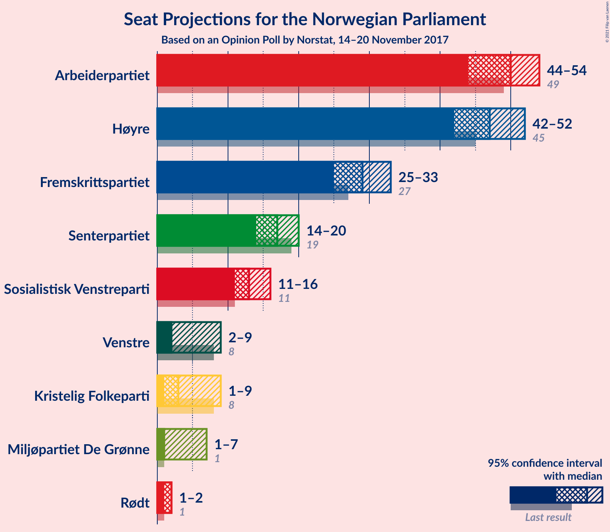
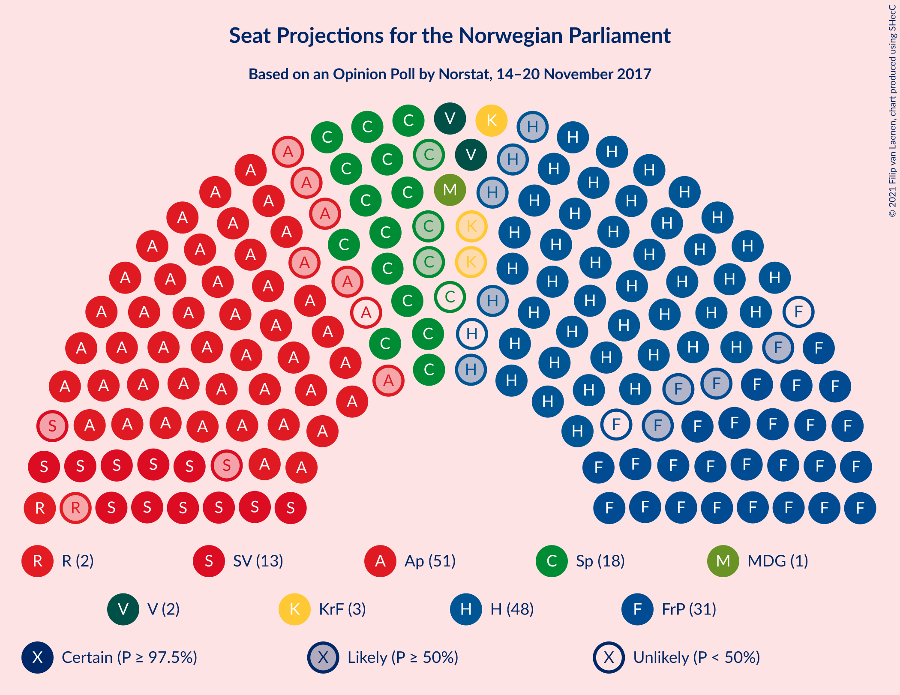
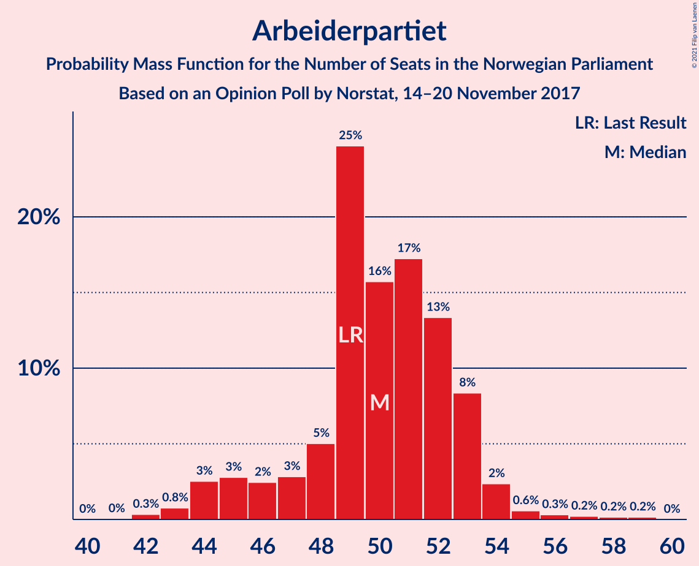
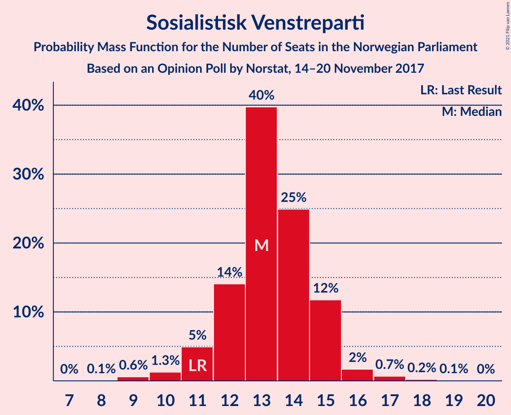
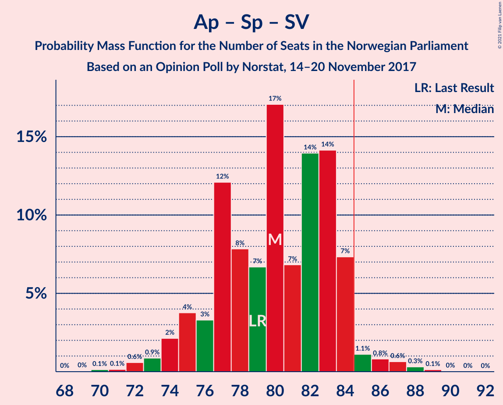
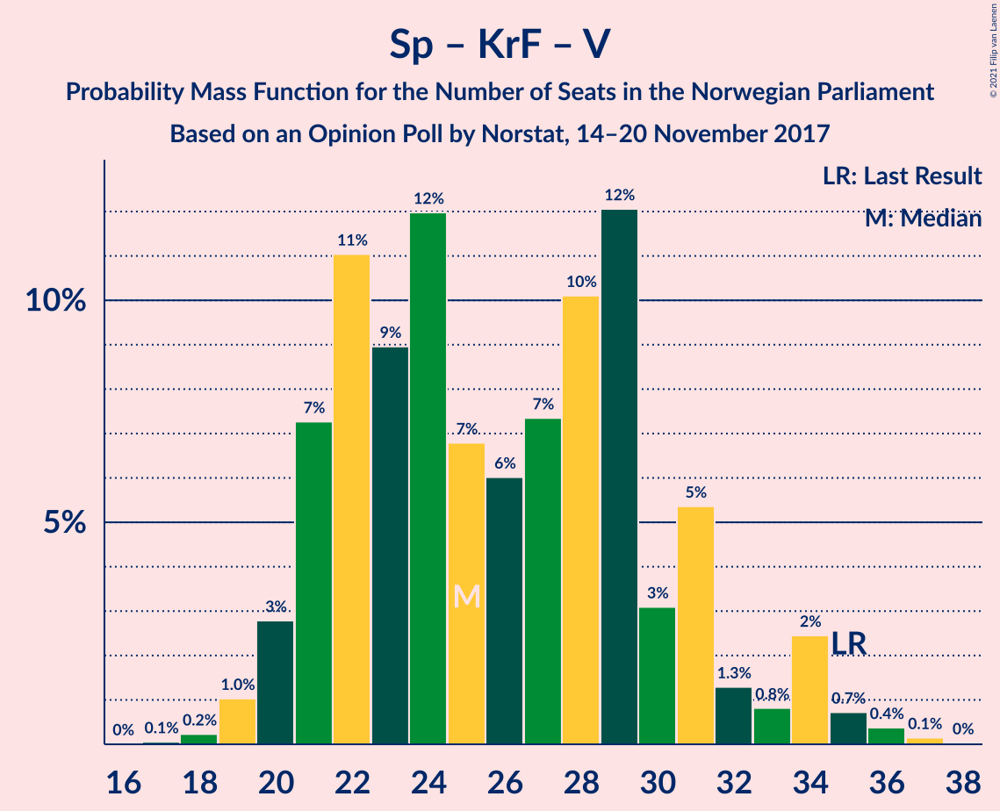

# Opinion Poll by Norstat, 14–20 November 2017

<a href="#voting-intentions">Voting Intentions</a> | <a href="#seats">Seats</a> | <a href="#coalitions">Coalitions</a> | <a href="#technical-information">Technical Information</a>

## Voting Intentions

### Confidence Intervals

| Party | Last Result | Poll Result | 80% Confidence Interval | 90% Confidence Interval | 95% Confidence Interval | 99% Confidence Interval |
|:-----:|:-----------:|:-----------:|:-----------------------:|:-----------------------:|:-----------------------:|:-----------------------:|
| Arbeiderpartiet | 27.4% | 27.1% | 25.3–29.0% |24.8–29.6% |24.4–30.0% |23.5–31.0% |
| Høyre | 25.0% | 26.1% | 24.3–28.0% |23.8–28.5% |23.4–29.0% |22.6–29.9% |
| Fremskrittspartiet | 15.2% | 16.1% | 14.7–17.7% |14.3–18.2% |13.9–18.6% |13.3–19.4% |
| Senterpartiet | 10.3% | 9.3% | 8.2–10.6% |7.9–11.0% |7.6–11.3% |7.1–12.0% |
| Sosialistisk Venstreparti | 6.0% | 7.0% | 6.1–8.2% |5.8–8.5% |5.6–8.8% |5.1–9.4% |
| Kristelig Folkeparti | 4.2% | 4.0% | 3.3–4.9% |3.1–5.2% |2.9–5.4% |2.6–5.9% |
| Venstre | 4.4% | 3.8% | 3.1–4.7% |2.9–5.0% |2.7–5.2% |2.4–5.7% |
| Rødt | 2.4% | 2.9% | 2.3–3.8% |2.2–4.0% |2.0–4.2% |1.8–4.6% |
| Miljøpartiet De Grønne | 3.2% | 2.9% | 2.3–3.8% |2.2–4.0% |2.0–4.2% |1.8–4.6% |

*Note:* The poll result column reflects the actual value used in the calculations. Published results may vary slightly, and in addition be rounded to fewer digits.

## Seats

### Confidence Intervals

| Party | Last Result | Median | 80% Confidence Interval | 90% Confidence Interval | 95% Confidence Interval | 99% Confidence Interval |
|:-----:|:-----------:|:------:|:-----------------------:|:-----------------------:|:-----------------------:|:-----------------------:|
| <a href="#arbeiderpartiet">Arbeiderpartiet</a> | 49 | 50 | 44–52 |44–53 |44–54 |43–55 |
| <a href="#høyre">Høyre</a> | 45 | 47 | 43–51 |42–53 |42–53 |40–54 |
| <a href="#fremskrittspartiet">Fremskrittspartiet</a> | 27 | 29 | 28–31 |26–33 |26–34 |24–35 |
| <a href="#senterpartiet">Senterpartiet</a> | 19 | 18 | 15–19 |15–19 |13–21 |13–23 |
| <a href="#sosialistisk-venstreparti">Sosialistisk Venstreparti</a> | 11 | 12 | 11–14 |11–17 |11–17 |10–18 |
| <a href="#kristelig-folkeparti">Kristelig Folkeparti</a> | 8 | 3 | 2–8 |1–9 |1–9 |1–10 |
| <a href="#venstre">Venstre</a> | 8 | 8 | 2–9 |2–9 |2–9 |2–10 |
| <a href="#rødt">Rødt</a> | 1 | 1 | 1–2 |1–8 |1–8 |1–9 |
| <a href="#miljøpartiet-de-grønne">Miljøpartiet De Grønne</a> | 1 | 1 | 1–2 |1–2 |1–2 |0–8 |

### Arbeiderpartiet

*For a full overview of the results for this party, see the [Arbeiderpartiet](party-arbeiderpartiet.html) page.*

| Number of Seats | Probability | Accumulated | Special Marks |
|:---------------:|:-----------:|:-----------:|:-------------:|
| 41 | 0.1% | 100% |  |
| 42 | 0.3% | 99.9% |  |
| 43 | 2% | 99.6% |  |
| 44 | 18% | 98% |  |
| 45 | 8% | 80% |  |
| 46 | 8% | 72% |  |
| 47 | 1.3% | 64% |  |
| 48 | 4% | 63% |  |
| 49 | 3% | 58% | Last Result |
| 50 | 25% | 55% | Median |
| 51 | 19% | 30% |  |
| 52 | 3% | 11% |  |
| 53 | 6% | 9% |  |
| 54 | 2% | 3% |  |
| 55 | 0.3% | 0.6% |  |
| 56 | 0.1% | 0.3% |  |
| 57 | 0% | 0.1% |  |
| 58 | 0% | 0.1% |  |
| 59 | 0.1% | 0.1% |  |
| 60 | 0% | 0% |  |

### Høyre

*For a full overview of the results for this party, see the [Høyre](party-høyre.html) page.*

| Number of Seats | Probability | Accumulated | Special Marks |
|:---------------:|:-----------:|:-----------:|:-------------:|
| 39 | 0.1% | 100% |  |
| 40 | 0.4% | 99.9% |  |
| 41 | 0.5% | 99.4% |  |
| 42 | 8% | 99.0% |  |
| 43 | 3% | 91% |  |
| 44 | 18% | 88% |  |
| 45 | 8% | 70% | Last Result |
| 46 | 4% | 62% |  |
| 47 | 13% | 58% | Median |
| 48 | 30% | 45% |  |
| 49 | 4% | 15% |  |
| 50 | 0.7% | 11% |  |
| 51 | 3% | 10% |  |
| 52 | 0.8% | 8% |  |
| 53 | 6% | 7% |  |
| 54 | 0.7% | 1.0% |  |
| 55 | 0.1% | 0.4% |  |
| 56 | 0.1% | 0.3% |  |
| 57 | 0.2% | 0.2% |  |
| 58 | 0% | 0% |  |

### Fremskrittspartiet

*For a full overview of the results for this party, see the [Fremskrittspartiet](party-fremskrittspartiet.html) page.*

| Number of Seats | Probability | Accumulated | Special Marks |
|:---------------:|:-----------:|:-----------:|:-------------:|
| 23 | 0.2% | 100% |  |
| 24 | 0.8% | 99.8% |  |
| 25 | 1.1% | 99.0% |  |
| 26 | 3% | 98% |  |
| 27 | 3% | 95% | Last Result |
| 28 | 25% | 91% |  |
| 29 | 17% | 66% | Median |
| 30 | 26% | 49% |  |
| 31 | 16% | 23% |  |
| 32 | 1.5% | 7% |  |
| 33 | 2% | 5% |  |
| 34 | 2% | 3% |  |
| 35 | 0.5% | 0.7% |  |
| 36 | 0.1% | 0.2% |  |
| 37 | 0% | 0% |  |

### Senterpartiet

*For a full overview of the results for this party, see the [Senterpartiet](party-senterpartiet.html) page.*

| Number of Seats | Probability | Accumulated | Special Marks |
|:---------------:|:-----------:|:-----------:|:-------------:|
| 12 | 0.3% | 100% |  |
| 13 | 3% | 99.7% |  |
| 14 | 1.3% | 97% |  |
| 15 | 10% | 96% |  |
| 16 | 9% | 86% |  |
| 17 | 15% | 77% |  |
| 18 | 28% | 61% | Median |
| 19 | 29% | 33% | Last Result |
| 20 | 2% | 5% |  |
| 21 | 2% | 3% |  |
| 22 | 0.3% | 0.8% |  |
| 23 | 0.5% | 0.5% |  |
| 24 | 0% | 0.1% |  |
| 25 | 0% | 0% |  |

### Sosialistisk Venstreparti

*For a full overview of the results for this party, see the [Sosialistisk Venstreparti](party-sosialistiskvenstreparti.html) page.*

| Number of Seats | Probability | Accumulated | Special Marks |
|:---------------:|:-----------:|:-----------:|:-------------:|
| 9 | 0.2% | 100% |  |
| 10 | 2% | 99.8% |  |
| 11 | 20% | 98% | Last Result |
| 12 | 28% | 77% | Median |
| 13 | 36% | 49% |  |
| 14 | 5% | 13% |  |
| 15 | 0.4% | 8% |  |
| 16 | 1.4% | 8% |  |
| 17 | 6% | 7% |  |
| 18 | 0.5% | 1.0% |  |
| 19 | 0.5% | 0.5% |  |
| 20 | 0% | 0% |  |

### Kristelig Folkeparti

*For a full overview of the results for this party, see the [Kristelig Folkeparti](party-kristeligfolkeparti.html) page.*

| Number of Seats | Probability | Accumulated | Special Marks |
|:---------------:|:-----------:|:-----------:|:-------------:|
| 0 | 0.1% | 100% |  |
| 1 | 8% | 99.9% |  |
| 2 | 12% | 91% |  |
| 3 | 41% | 79% | Median |
| 4 | 0% | 38% |  |
| 5 | 0% | 38% |  |
| 6 | 0% | 38% |  |
| 7 | 2% | 38% |  |
| 8 | 26% | 36% | Last Result |
| 9 | 7% | 9% |  |
| 10 | 2% | 2% |  |
| 11 | 0.1% | 0.2% |  |
| 12 | 0% | 0% |  |

### Venstre

*For a full overview of the results for this party, see the [Venstre](party-venstre.html) page.*

| Number of Seats | Probability | Accumulated | Special Marks |
|:---------------:|:-----------:|:-----------:|:-------------:|
| 1 | 0.4% | 100% |  |
| 2 | 21% | 99.6% |  |
| 3 | 7% | 79% |  |
| 4 | 0% | 72% |  |
| 5 | 0% | 72% |  |
| 6 | 0% | 72% |  |
| 7 | 0.8% | 72% |  |
| 8 | 46% | 71% | Last Result, Median |
| 9 | 23% | 25% |  |
| 10 | 2% | 2% |  |
| 11 | 0.1% | 0.1% |  |
| 12 | 0% | 0% |  |

### Rødt

*For a full overview of the results for this party, see the [Rødt](party-rødt.html) page.*

| Number of Seats | Probability | Accumulated | Special Marks |
|:---------------:|:-----------:|:-----------:|:-------------:|
| 1 | 72% | 100% | Last Result, Median |
| 2 | 21% | 28% |  |
| 3 | 0% | 7% |  |
| 4 | 0% | 7% |  |
| 5 | 0% | 7% |  |
| 6 | 0% | 7% |  |
| 7 | 0.6% | 7% |  |
| 8 | 5% | 6% |  |
| 9 | 0.7% | 0.7% |  |
| 10 | 0% | 0% |  |

### Miljøpartiet De Grønne

*For a full overview of the results for this party, see the [Miljøpartiet De Grønne](party-miljøpartietdegrønne.html) page.*

| Number of Seats | Probability | Accumulated | Special Marks |
|:---------------:|:-----------:|:-----------:|:-------------:|
| 0 | 1.0% | 100% |  |
| 1 | 73% | 99.0% | Last Result, Median |
| 2 | 24% | 26% |  |
| 3 | 0.2% | 2% |  |
| 4 | 0% | 2% |  |
| 5 | 0% | 2% |  |
| 6 | 0% | 2% |  |
| 7 | 0.8% | 2% |  |
| 8 | 0.8% | 1.0% |  |
| 9 | 0.2% | 0.2% |  |
| 10 | 0% | 0% |  |

## Coalitions

### Confidence Intervals

| Coalition | Last Result | Median | Majority? | 80% Confidence Interval | 90% Confidence Interval | 95% Confidence Interval | 99% Confidence Interval |
|:---------:|:-----------:|:------:|:---------:|:-----------------------:|:-----------------------:|:-----------------------:|:-----------------------:|
| Høyre – Fremskrittspartiet – Senterpartiet – Kristelig Folkeparti – Venstre | 107 | 105 | 100% | 99–110 | 97–110 | 96–110 | 94–110 |
| Høyre – Fremskrittspartiet – Kristelig Folkeparti – Venstre – Miljøpartiet De Grønne | 89 | 88 | 89% | 84–93 | 82–94 | 81–95 | 79–96 |
| Arbeiderpartiet – Senterpartiet – Sosialistisk Venstreparti – Kristelig Folkeparti – Miljøpartiet De Grønne | 88 | 84 | 49% | 82–89 | 80–91 | 79–94 | 77–94 |
| Høyre – Fremskrittspartiet – Kristelig Folkeparti – Venstre | 88 | 87 | 77% | 82–92 | 80–92 | 80–93 | 77–95 |
| Arbeiderpartiet – Senterpartiet – Sosialistisk Venstreparti – Miljøpartiet De Grønne – Rødt | 81 | 82 | 23% | 77–87 | 77–89 | 76–89 | 74–92 |
| Arbeiderpartiet – Senterpartiet – Sosialistisk Venstreparti – Miljøpartiet De Grønne | 80 | 81 | 9% | 76–84 | 75–87 | 74–88 | 73–90 |
| Arbeiderpartiet – Senterpartiet – Sosialistisk Venstreparti – Rødt | 80 | 81 | 11% | 76–85 | 75–87 | 74–88 | 73–90 |
| Høyre – Fremskrittspartiet – Venstre | 80 | 83 | 29% | 78–86 | 76–86 | 74–88 | 73–91 |
| Arbeiderpartiet – Senterpartiet – Sosialistisk Venstreparti | 79 | 79 | 8% | 74–83 | 74–85 | 73–87 | 72–88 |
| Høyre – Fremskrittspartiet | 72 | 76 | 0.6% | 72–81 | 72–83 | 71–83 | 69–85 |
| Arbeiderpartiet – Senterpartiet – Kristelig Folkeparti – Miljøpartiet De Grønne | 77 | 72 | 0% | 69–75 | 68–77 | 65–78 | 65–82 |
| Arbeiderpartiet – Senterpartiet – Kristelig Folkeparti | 76 | 71 | 0% | 68–73 | 66–76 | 64–76 | 63–80 |
| Arbeiderpartiet – Senterpartiet | 68 | 67 | 0% | 61–69 | 61–70 | 61–71 | 59–73 |
| Arbeiderpartiet – Sosialistisk Venstreparti | 60 | 62 | 0% | 57–64 | 57–70 | 57–70 | 56–71 |
| Høyre – Kristelig Folkeparti – Venstre | 61 | 58 | 0% | 54–64 | 52–64 | 51–65 | 48–68 |
| Senterpartiet – Kristelig Folkeparti – Venstre | 35 | 30 | 0% | 22–34 | 20–34 | 20–35 | 19–36 |

### Høyre – Fremskrittspartiet – Senterpartiet – Kristelig Folkeparti – Venstre

| Number of Seats | Probability | Accumulated | Special Marks |
|:---------------:|:-----------:|:-----------:|:-------------:|
| 92 | 0.1% | 100% |  |
| 93 | 0.2% | 99.9% |  |
| 94 | 0.2% | 99.7% |  |
| 95 | 1.2% | 99.5% |  |
| 96 | 1.3% | 98% |  |
| 97 | 6% | 97% |  |
| 98 | 1.3% | 91% |  |
| 99 | 3% | 90% |  |
| 100 | 0.4% | 87% |  |
| 101 | 2% | 86% |  |
| 102 | 1.0% | 85% |  |
| 103 | 11% | 84% |  |
| 104 | 10% | 73% |  |
| 105 | 26% | 63% | Median |
| 106 | 2% | 37% |  |
| 107 | 5% | 35% | Last Result |
| 108 | 8% | 30% |  |
| 109 | 7% | 21% |  |
| 110 | 14% | 14% |  |
| 111 | 0.2% | 0.3% |  |
| 112 | 0.1% | 0.1% |  |
| 113 | 0% | 0% |  |

### Høyre – Fremskrittspartiet – Kristelig Folkeparti – Venstre – Miljøpartiet De Grønne

| Number of Seats | Probability | Accumulated | Special Marks |
|:---------------:|:-----------:|:-----------:|:-------------:|
| 77 | 0.1% | 100% |  |
| 78 | 0.1% | 99.8% |  |
| 79 | 0.5% | 99.7% |  |
| 80 | 0.9% | 99.2% |  |
| 81 | 3% | 98% |  |
| 82 | 2% | 95% |  |
| 83 | 3% | 94% |  |
| 84 | 1.1% | 91% |  |
| 85 | 10% | 89% | Majority |
| 86 | 4% | 80% |  |
| 87 | 14% | 76% |  |
| 88 | 13% | 62% | Median |
| 89 | 10% | 49% | Last Result |
| 90 | 8% | 39% |  |
| 91 | 2% | 31% |  |
| 92 | 2% | 29% |  |
| 93 | 22% | 27% |  |
| 94 | 2% | 5% |  |
| 95 | 2% | 3% |  |
| 96 | 1.1% | 1.4% |  |
| 97 | 0.2% | 0.3% |  |
| 98 | 0.1% | 0.1% |  |
| 99 | 0% | 0% |  |

### Arbeiderpartiet – Senterpartiet – Sosialistisk Venstreparti – Kristelig Folkeparti – Miljøpartiet De Grønne

| Number of Seats | Probability | Accumulated | Special Marks |
|:---------------:|:-----------:|:-----------:|:-------------:|
| 75 | 0% | 100% |  |
| 76 | 0% | 99.9% |  |
| 77 | 1.1% | 99.9% |  |
| 78 | 0.8% | 98.8% |  |
| 79 | 2% | 98% |  |
| 80 | 3% | 96% |  |
| 81 | 2% | 93% |  |
| 82 | 13% | 91% |  |
| 83 | 13% | 78% |  |
| 84 | 16% | 65% | Median |
| 85 | 21% | 49% | Majority |
| 86 | 12% | 28% |  |
| 87 | 2% | 16% |  |
| 88 | 2% | 15% | Last Result |
| 89 | 3% | 13% |  |
| 90 | 1.1% | 9% |  |
| 91 | 4% | 8% |  |
| 92 | 1.2% | 4% |  |
| 93 | 0.3% | 3% |  |
| 94 | 2% | 3% |  |
| 95 | 0% | 0.2% |  |
| 96 | 0.1% | 0.1% |  |
| 97 | 0% | 0.1% |  |
| 98 | 0% | 0.1% |  |
| 99 | 0% | 0% |  |

### Høyre – Fremskrittspartiet – Kristelig Folkeparti – Venstre

| Number of Seats | Probability | Accumulated | Special Marks |
|:---------------:|:-----------:|:-----------:|:-------------:|
| 74 | 0% | 100% |  |
| 75 | 0.1% | 99.9% |  |
| 76 | 0.1% | 99.8% |  |
| 77 | 0.6% | 99.7% |  |
| 78 | 0.9% | 99.1% |  |
| 79 | 0.2% | 98% |  |
| 80 | 3% | 98% |  |
| 81 | 2% | 94% |  |
| 82 | 3% | 93% |  |
| 83 | 2% | 90% |  |
| 84 | 11% | 88% |  |
| 85 | 2% | 77% | Majority |
| 86 | 15% | 75% |  |
| 87 | 19% | 60% | Median |
| 88 | 4% | 41% | Last Result |
| 89 | 9% | 37% |  |
| 90 | 0.9% | 28% |  |
| 91 | 7% | 28% |  |
| 92 | 18% | 21% |  |
| 93 | 0.7% | 3% |  |
| 94 | 2% | 2% |  |
| 95 | 0.5% | 0.8% |  |
| 96 | 0.2% | 0.2% |  |
| 97 | 0% | 0% |  |

### Arbeiderpartiet – Senterpartiet – Sosialistisk Venstreparti – Miljøpartiet De Grønne – Rødt

| Number of Seats | Probability | Accumulated | Special Marks |
|:---------------:|:-----------:|:-----------:|:-------------:|
| 73 | 0.2% | 100% |  |
| 74 | 0.5% | 99.8% |  |
| 75 | 2% | 99.2% |  |
| 76 | 0.7% | 98% |  |
| 77 | 18% | 97% |  |
| 78 | 7% | 79% |  |
| 79 | 0.9% | 72% |  |
| 80 | 9% | 72% |  |
| 81 | 4% | 63% | Last Result |
| 82 | 19% | 59% | Median |
| 83 | 15% | 40% |  |
| 84 | 2% | 25% |  |
| 85 | 11% | 23% | Majority |
| 86 | 2% | 12% |  |
| 87 | 3% | 10% |  |
| 88 | 2% | 7% |  |
| 89 | 3% | 6% |  |
| 90 | 0.2% | 2% |  |
| 91 | 0.9% | 2% |  |
| 92 | 0.6% | 0.9% |  |
| 93 | 0.1% | 0.3% |  |
| 94 | 0.1% | 0.2% |  |
| 95 | 0% | 0.1% |  |
| 96 | 0% | 0% |  |

### Arbeiderpartiet – Senterpartiet – Sosialistisk Venstreparti – Miljøpartiet De Grønne

| Number of Seats | Probability | Accumulated | Special Marks |
|:---------------:|:-----------:|:-----------:|:-------------:|
| 71 | 0.1% | 100% |  |
| 72 | 0.3% | 99.9% |  |
| 73 | 0.6% | 99.6% |  |
| 74 | 2% | 99.1% |  |
| 75 | 2% | 97% |  |
| 76 | 23% | 95% |  |
| 77 | 4% | 72% |  |
| 78 | 4% | 68% |  |
| 79 | 7% | 64% |  |
| 80 | 5% | 57% | Last Result |
| 81 | 18% | 52% | Median |
| 82 | 14% | 34% |  |
| 83 | 8% | 20% |  |
| 84 | 2% | 11% |  |
| 85 | 1.0% | 9% | Majority |
| 86 | 3% | 8% |  |
| 87 | 1.1% | 5% |  |
| 88 | 3% | 4% |  |
| 89 | 0.1% | 1.3% |  |
| 90 | 0.9% | 1.1% |  |
| 91 | 0.1% | 0.2% |  |
| 92 | 0.1% | 0.2% |  |
| 93 | 0% | 0.1% |  |
| 94 | 0% | 0% |  |

### Arbeiderpartiet – Senterpartiet – Sosialistisk Venstreparti – Rødt

| Number of Seats | Probability | Accumulated | Special Marks |
|:---------------:|:-----------:|:-----------:|:-------------:|
| 71 | 0.1% | 100% |  |
| 72 | 0.2% | 99.9% |  |
| 73 | 1.1% | 99.7% |  |
| 74 | 2% | 98.6% |  |
| 75 | 2% | 97% |  |
| 76 | 22% | 95% |  |
| 77 | 2% | 73% |  |
| 78 | 2% | 71% |  |
| 79 | 8% | 69% |  |
| 80 | 10% | 61% | Last Result |
| 81 | 13% | 51% | Median |
| 82 | 14% | 38% |  |
| 83 | 4% | 24% |  |
| 84 | 10% | 20% |  |
| 85 | 1.1% | 11% | Majority |
| 86 | 3% | 9% |  |
| 87 | 2% | 6% |  |
| 88 | 3% | 5% |  |
| 89 | 0.9% | 2% |  |
| 90 | 0.5% | 0.8% |  |
| 91 | 0.1% | 0.3% |  |
| 92 | 0.1% | 0.2% |  |
| 93 | 0% | 0% |  |

### Høyre – Fremskrittspartiet – Venstre

| Number of Seats | Probability | Accumulated | Special Marks |
|:---------------:|:-----------:|:-----------:|:-------------:|
| 70 | 0% | 100% |  |
| 71 | 0.1% | 99.9% |  |
| 72 | 0.1% | 99.9% |  |
| 73 | 0.6% | 99.8% |  |
| 74 | 2% | 99.2% |  |
| 75 | 0.8% | 97% |  |
| 76 | 1.4% | 96% |  |
| 77 | 5% | 95% |  |
| 78 | 2% | 90% |  |
| 79 | 3% | 88% |  |
| 80 | 4% | 85% | Last Result |
| 81 | 13% | 81% |  |
| 82 | 7% | 68% |  |
| 83 | 15% | 61% |  |
| 84 | 16% | 45% | Median |
| 85 | 12% | 29% | Majority |
| 86 | 12% | 17% |  |
| 87 | 1.4% | 4% |  |
| 88 | 0.7% | 3% |  |
| 89 | 0.9% | 2% |  |
| 90 | 0.6% | 1.4% |  |
| 91 | 0.7% | 0.8% |  |
| 92 | 0% | 0% |  |

### Arbeiderpartiet – Senterpartiet – Sosialistisk Venstreparti

| Number of Seats | Probability | Accumulated | Special Marks |
|:---------------:|:-----------:|:-----------:|:-------------:|
| 70 | 0.1% | 100% |  |
| 71 | 0.3% | 99.9% |  |
| 72 | 1.2% | 99.6% |  |
| 73 | 2% | 98% |  |
| 74 | 8% | 96% |  |
| 75 | 20% | 88% |  |
| 76 | 4% | 68% |  |
| 77 | 2% | 64% |  |
| 78 | 8% | 62% |  |
| 79 | 10% | 55% | Last Result |
| 80 | 12% | 45% | Median |
| 81 | 14% | 33% |  |
| 82 | 9% | 19% |  |
| 83 | 1.3% | 10% |  |
| 84 | 0.8% | 9% |  |
| 85 | 3% | 8% | Majority |
| 86 | 0.6% | 5% |  |
| 87 | 3% | 4% |  |
| 88 | 0.8% | 1.0% |  |
| 89 | 0% | 0.2% |  |
| 90 | 0.1% | 0.1% |  |
| 91 | 0% | 0.1% |  |
| 92 | 0% | 0% |  |

### Høyre – Fremskrittspartiet

| Number of Seats | Probability | Accumulated | Special Marks |
|:---------------:|:-----------:|:-----------:|:-------------:|
| 66 | 0.1% | 100% |  |
| 67 | 0.1% | 99.8% |  |
| 68 | 0.1% | 99.7% |  |
| 69 | 0.3% | 99.6% |  |
| 70 | 1.0% | 99.3% |  |
| 71 | 3% | 98% |  |
| 72 | 10% | 95% | Last Result |
| 73 | 7% | 85% |  |
| 74 | 3% | 78% |  |
| 75 | 21% | 75% |  |
| 76 | 16% | 55% | Median |
| 77 | 19% | 39% |  |
| 78 | 3% | 19% |  |
| 79 | 4% | 17% |  |
| 80 | 2% | 13% |  |
| 81 | 3% | 11% |  |
| 82 | 1.0% | 8% |  |
| 83 | 7% | 7% |  |
| 84 | 0% | 0.6% |  |
| 85 | 0.3% | 0.6% | Majority |
| 86 | 0.2% | 0.2% |  |
| 87 | 0% | 0% |  |

### Arbeiderpartiet – Senterpartiet – Kristelig Folkeparti – Miljøpartiet De Grønne

| Number of Seats | Probability | Accumulated | Special Marks |
|:---------------:|:-----------:|:-----------:|:-------------:|
| 62 | 0% | 100% |  |
| 63 | 0% | 99.9% |  |
| 64 | 0.4% | 99.9% |  |
| 65 | 2% | 99.5% |  |
| 66 | 2% | 97% |  |
| 67 | 0.4% | 96% |  |
| 68 | 3% | 95% |  |
| 69 | 7% | 92% |  |
| 70 | 2% | 86% |  |
| 71 | 23% | 83% |  |
| 72 | 17% | 60% | Median |
| 73 | 26% | 43% |  |
| 74 | 6% | 17% |  |
| 75 | 3% | 11% |  |
| 76 | 2% | 9% |  |
| 77 | 4% | 7% | Last Result |
| 78 | 0.8% | 3% |  |
| 79 | 0.5% | 2% |  |
| 80 | 0.7% | 2% |  |
| 81 | 0.5% | 1.2% |  |
| 82 | 0.3% | 0.6% |  |
| 83 | 0.2% | 0.3% |  |
| 84 | 0.1% | 0.1% |  |
| 85 | 0% | 0% | Majority |

### Arbeiderpartiet – Senterpartiet – Kristelig Folkeparti

| Number of Seats | Probability | Accumulated | Special Marks |
|:---------------:|:-----------:|:-----------:|:-------------:|
| 61 | 0% | 100% |  |
| 62 | 0.2% | 99.9% |  |
| 63 | 0.4% | 99.7% |  |
| 64 | 3% | 99.3% |  |
| 65 | 0.8% | 96% |  |
| 66 | 3% | 96% |  |
| 67 | 1.5% | 92% |  |
| 68 | 6% | 91% |  |
| 69 | 10% | 85% |  |
| 70 | 22% | 75% |  |
| 71 | 13% | 53% | Median |
| 72 | 24% | 40% |  |
| 73 | 6% | 16% |  |
| 74 | 2% | 10% |  |
| 75 | 3% | 8% |  |
| 76 | 3% | 5% | Last Result |
| 77 | 0.7% | 2% |  |
| 78 | 0.3% | 2% |  |
| 79 | 0.7% | 1.2% |  |
| 80 | 0.5% | 0.5% |  |
| 81 | 0% | 0.1% |  |
| 82 | 0.1% | 0.1% |  |
| 83 | 0% | 0% |  |

### Arbeiderpartiet – Senterpartiet

| Number of Seats | Probability | Accumulated | Special Marks |
|:---------------:|:-----------:|:-----------:|:-------------:|
| 58 | 0.2% | 100% |  |
| 59 | 1.2% | 99.7% |  |
| 60 | 1.1% | 98.6% |  |
| 61 | 8% | 98% |  |
| 62 | 18% | 89% |  |
| 63 | 5% | 71% |  |
| 64 | 1.5% | 66% |  |
| 65 | 9% | 65% |  |
| 66 | 2% | 56% |  |
| 67 | 5% | 54% |  |
| 68 | 9% | 49% | Last Result, Median |
| 69 | 33% | 40% |  |
| 70 | 3% | 7% |  |
| 71 | 2% | 4% |  |
| 72 | 1.1% | 2% |  |
| 73 | 0.9% | 1.3% |  |
| 74 | 0.2% | 0.3% |  |
| 75 | 0% | 0.1% |  |
| 76 | 0% | 0.1% |  |
| 77 | 0% | 0.1% |  |
| 78 | 0% | 0% |  |

### Arbeiderpartiet – Sosialistisk Venstreparti

| Number of Seats | Probability | Accumulated | Special Marks |
|:---------------:|:-----------:|:-----------:|:-------------:|
| 54 | 0.1% | 100% |  |
| 55 | 0.2% | 99.9% |  |
| 56 | 0.7% | 99.7% |  |
| 57 | 20% | 99.0% |  |
| 58 | 9% | 79% |  |
| 59 | 8% | 70% |  |
| 60 | 3% | 62% | Last Result |
| 61 | 3% | 59% |  |
| 62 | 34% | 56% | Median |
| 63 | 10% | 21% |  |
| 64 | 3% | 12% |  |
| 65 | 0.5% | 9% |  |
| 66 | 0.2% | 8% |  |
| 67 | 0.1% | 8% |  |
| 68 | 1.1% | 8% |  |
| 69 | 0.4% | 7% |  |
| 70 | 6% | 6% |  |
| 71 | 0.8% | 0.9% |  |
| 72 | 0% | 0.1% |  |
| 73 | 0% | 0.1% |  |
| 74 | 0% | 0.1% |  |
| 75 | 0% | 0% |  |

### Høyre – Kristelig Folkeparti – Venstre

| Number of Seats | Probability | Accumulated | Special Marks |
|:---------------:|:-----------:|:-----------:|:-------------:|
| 46 | 0.1% | 100% |  |
| 47 | 0.3% | 99.8% |  |
| 48 | 0.9% | 99.6% |  |
| 49 | 0.5% | 98.7% |  |
| 50 | 0.2% | 98% |  |
| 51 | 1.2% | 98% |  |
| 52 | 5% | 97% |  |
| 53 | 1.5% | 92% |  |
| 54 | 13% | 91% |  |
| 55 | 15% | 78% |  |
| 56 | 1.4% | 63% |  |
| 57 | 8% | 61% |  |
| 58 | 16% | 53% | Median |
| 59 | 8% | 37% |  |
| 60 | 1.3% | 29% |  |
| 61 | 2% | 28% | Last Result |
| 62 | 2% | 26% |  |
| 63 | 6% | 24% |  |
| 64 | 15% | 18% |  |
| 65 | 0.3% | 3% |  |
| 66 | 1.2% | 2% |  |
| 67 | 0.6% | 1.2% |  |
| 68 | 0.1% | 0.5% |  |
| 69 | 0.4% | 0.5% |  |
| 70 | 0% | 0% |  |

### Senterpartiet – Kristelig Folkeparti – Venstre

| Number of Seats | Probability | Accumulated | Special Marks |
|:---------------:|:-----------:|:-----------:|:-------------:|
| 17 | 0.1% | 100% |  |
| 18 | 0.2% | 99.9% |  |
| 19 | 1.4% | 99.7% |  |
| 20 | 3% | 98% |  |
| 21 | 2% | 95% |  |
| 22 | 4% | 93% |  |
| 23 | 3% | 89% |  |
| 24 | 0.8% | 86% |  |
| 25 | 8% | 85% |  |
| 26 | 3% | 77% |  |
| 27 | 8% | 74% |  |
| 28 | 12% | 66% |  |
| 29 | 2% | 54% | Median |
| 30 | 14% | 52% |  |
| 31 | 10% | 38% |  |
| 32 | 2% | 28% |  |
| 33 | 2% | 26% |  |
| 34 | 20% | 25% |  |
| 35 | 3% | 5% | Last Result |
| 36 | 1.0% | 1.3% |  |
| 37 | 0.3% | 0.3% |  |
| 38 | 0% | 0% |  |

## Technical Information

### Opinion Poll

+ **Polling firm:** Norstat
+ **Commissioner(s):** —
+ **Fieldwork period:** 14–20 November 2017

### Calculations

+ **Sample size:** 955
+ **Simulations done:** 131,072
+ **Error estimate:** 3.23%

