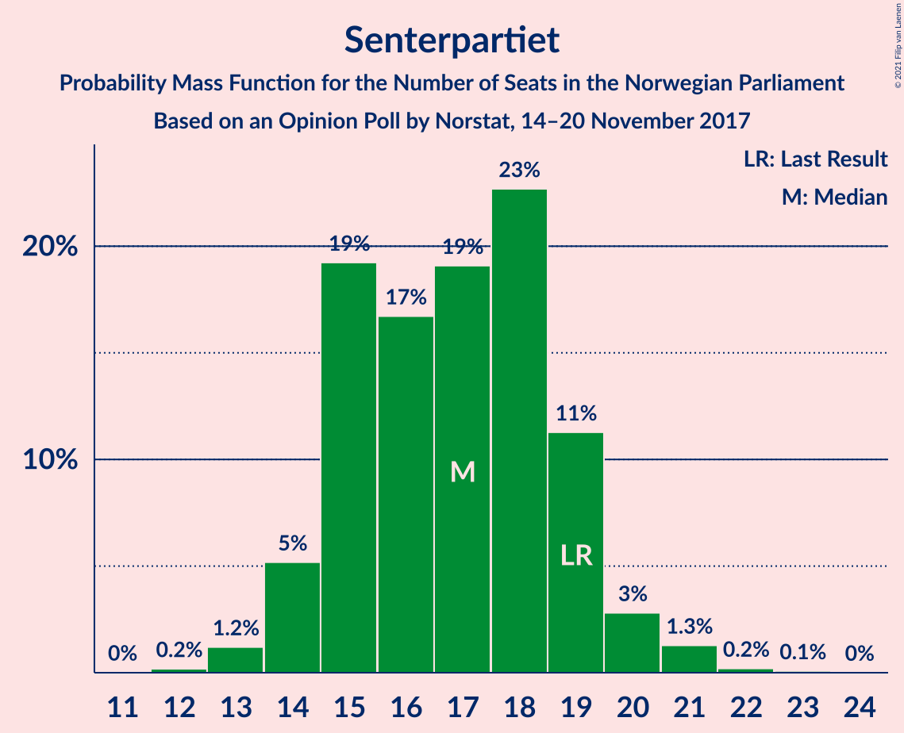
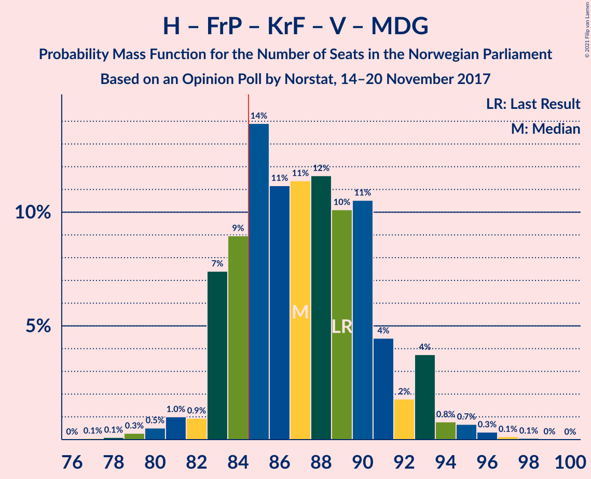
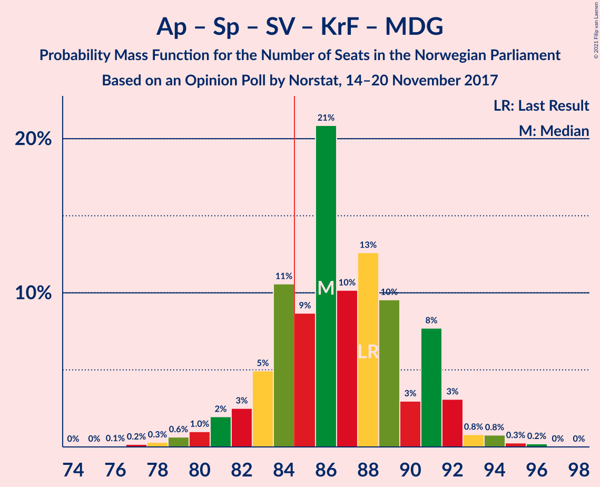
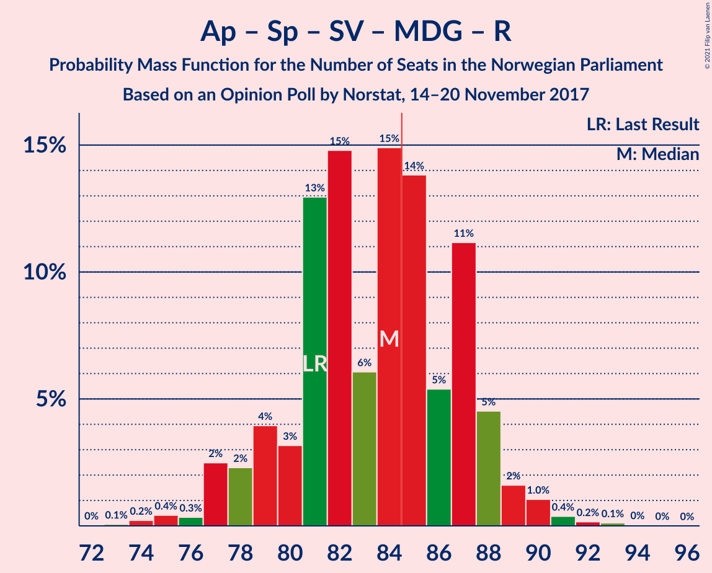
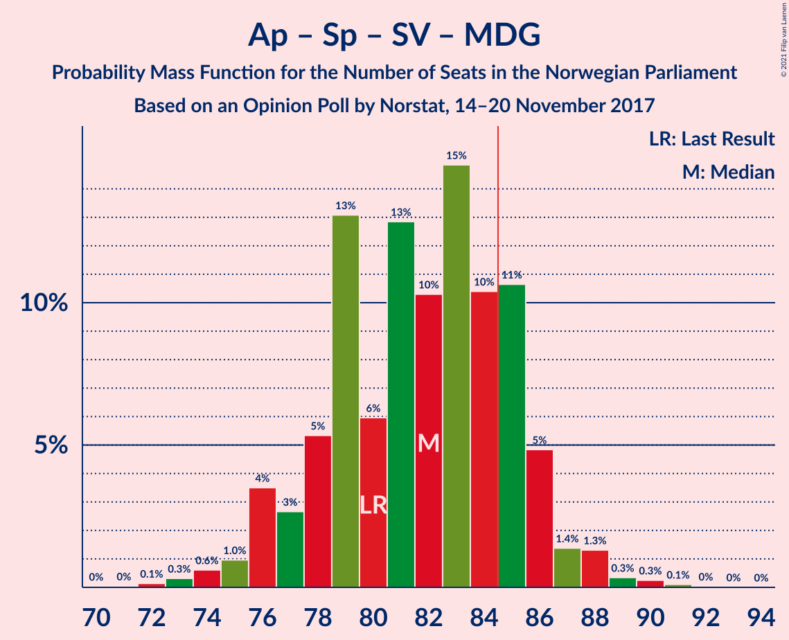
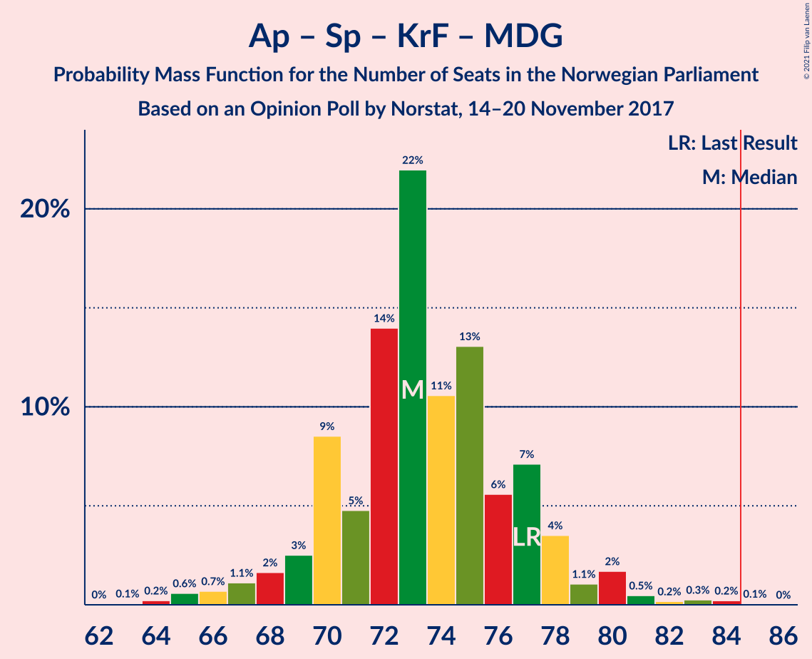

# Opinion Poll by Norstat, 14–20 November 2017

<a href="#voting-intentions">Voting Intentions</a> | <a href="#seats">Seats</a> | <a href="#coalitions">Coalitions</a> | <a href="#technical-information">Technical Information</a>

## Voting Intentions

### Confidence Intervals

| Party | Last Result | Poll Result | 80% Confidence Interval | 90% Confidence Interval | 95% Confidence Interval | 99% Confidence Interval |
|:-----:|:-----------:|:-----------:|:-----------------------:|:-----------------------:|:-----------------------:|:-----------------------:|
| Arbeiderpartiet | 27.4% | 27.1% | 25.3–29.0% |24.8–29.6% |24.4–30.0% |23.5–31.0% |
| Høyre | 25.0% | 26.1% | 24.3–28.0% |23.8–28.5% |23.4–29.0% |22.6–29.9% |
| Fremskrittspartiet | 15.2% | 16.1% | 14.7–17.7% |14.3–18.2% |13.9–18.6% |13.3–19.4% |
| Senterpartiet | 10.3% | 9.3% | 8.2–10.6% |7.9–11.0% |7.6–11.3% |7.1–12.0% |
| Sosialistisk Venstreparti | 6.0% | 7.0% | 6.1–8.2% |5.8–8.5% |5.6–8.8% |5.1–9.4% |
| Kristelig Folkeparti | 4.2% | 4.0% | 3.3–4.9% |3.1–5.2% |2.9–5.4% |2.6–5.9% |
| Venstre | 4.4% | 3.8% | 3.1–4.7% |2.9–5.0% |2.7–5.2% |2.4–5.7% |
| Rødt | 2.4% | 2.9% | 2.3–3.8% |2.2–4.0% |2.0–4.2% |1.8–4.6% |
| Miljøpartiet De Grønne | 3.2% | 2.9% | 2.3–3.8% |2.2–4.0% |2.0–4.2% |1.8–4.6% |

*Note:* The poll result column reflects the actual value used in the calculations. Published results may vary slightly, and in addition be rounded to fewer digits.

## Seats

### Confidence Intervals

| Party | Last Result | Median | 80% Confidence Interval | 90% Confidence Interval | 95% Confidence Interval | 99% Confidence Interval |
|:-----:|:-----------:|:------:|:-----------------------:|:-----------------------:|:-----------------------:|:-----------------------:|
| <a href="#arbeiderpartiet">Arbeiderpartiet</a> | 49 | 50 | 47–53 |45–53 |44–54 |43–57 |
| <a href="#høyre">Høyre</a> | 45 | 47 | 43–51 |42–52 |42–52 |41–55 |
| <a href="#fremskrittspartiet">Fremskrittspartiet</a> | 27 | 29 | 26–32 |26–33 |25–33 |24–35 |
| <a href="#senterpartiet">Senterpartiet</a> | 19 | 17 | 15–19 |14–19 |14–20 |13–21 |
| <a href="#sosialistisk-venstreparti">Sosialistisk Venstreparti</a> | 11 | 13 | 12–15 |11–15 |11–16 |9–17 |
| <a href="#kristelig-folkeparti">Kristelig Folkeparti</a> | 8 | 3 | 2–8 |1–9 |1–9 |1–10 |
| <a href="#venstre">Venstre</a> | 8 | 2 | 2–8 |2–9 |2–9 |2–10 |
| <a href="#rødt">Rødt</a> | 1 | 2 | 1–2 |1–2 |1–2 |1–8 |
| <a href="#miljøpartiet-de-grønne">Miljøpartiet De Grønne</a> | 1 | 1 | 1–2 |1–2 |1–7 |0–8 |

### Arbeiderpartiet

*For a full overview of the results for this party, see the [Arbeiderpartiet](party-arbeiderpartiet.html) page.*

| Number of Seats | Probability | Accumulated | Special Marks |
|:---------------:|:-----------:|:-----------:|:-------------:|
| 41 | 0% | 100% |  |
| 42 | 0.3% | 99.9% |  |
| 43 | 0.8% | 99.6% |  |
| 44 | 3% | 98.8% |  |
| 45 | 3% | 96% |  |
| 46 | 2% | 94% |  |
| 47 | 3% | 91% |  |
| 48 | 5% | 88% |  |
| 49 | 25% | 83% | Last Result |
| 50 | 16% | 59% | Median |
| 51 | 17% | 43% |  |
| 52 | 13% | 26% |  |
| 53 | 8% | 12% |  |
| 54 | 2% | 4% |  |
| 55 | 0.6% | 1.4% |  |
| 56 | 0.3% | 0.9% |  |
| 57 | 0.2% | 0.5% |  |
| 58 | 0.2% | 0.3% |  |
| 59 | 0.2% | 0.2% |  |
| 60 | 0% | 0% |  |

### Høyre

*For a full overview of the results for this party, see the [Høyre](party-høyre.html) page.*

| Number of Seats | Probability | Accumulated | Special Marks |
|:---------------:|:-----------:|:-----------:|:-------------:|
| 39 | 0.1% | 100% |  |
| 40 | 0.1% | 99.9% |  |
| 41 | 0.5% | 99.7% |  |
| 42 | 5% | 99.2% |  |
| 43 | 6% | 94% |  |
| 44 | 4% | 89% |  |
| 45 | 6% | 85% | Last Result |
| 46 | 19% | 79% |  |
| 47 | 13% | 60% | Median |
| 48 | 16% | 47% |  |
| 49 | 4% | 31% |  |
| 50 | 7% | 28% |  |
| 51 | 12% | 21% |  |
| 52 | 6% | 8% |  |
| 53 | 2% | 2% |  |
| 54 | 0.3% | 0.9% |  |
| 55 | 0.3% | 0.6% |  |
| 56 | 0.2% | 0.2% |  |
| 57 | 0% | 0% |  |

### Fremskrittspartiet

*For a full overview of the results for this party, see the [Fremskrittspartiet](party-fremskrittspartiet.html) page.*

| Number of Seats | Probability | Accumulated | Special Marks |
|:---------------:|:-----------:|:-----------:|:-------------:|
| 22 | 0.1% | 100% |  |
| 23 | 0.1% | 99.9% |  |
| 24 | 0.4% | 99.8% |  |
| 25 | 2% | 99.4% |  |
| 26 | 8% | 97% |  |
| 27 | 14% | 89% | Last Result |
| 28 | 16% | 75% |  |
| 29 | 19% | 59% | Median |
| 30 | 12% | 40% |  |
| 31 | 18% | 28% |  |
| 32 | 5% | 10% |  |
| 33 | 4% | 6% |  |
| 34 | 1.1% | 2% |  |
| 35 | 0.6% | 0.7% |  |
| 36 | 0.1% | 0.2% |  |
| 37 | 0% | 0.1% |  |
| 38 | 0% | 0% |  |

### Senterpartiet

*For a full overview of the results for this party, see the [Senterpartiet](party-senterpartiet.html) page.*

| Number of Seats | Probability | Accumulated | Special Marks |
|:---------------:|:-----------:|:-----------:|:-------------:|
| 12 | 0.2% | 100% |  |
| 13 | 1.2% | 99.8% |  |
| 14 | 5% | 98.6% |  |
| 15 | 19% | 93% |  |
| 16 | 17% | 74% |  |
| 17 | 19% | 57% | Median |
| 18 | 23% | 38% |  |
| 19 | 11% | 16% | Last Result |
| 20 | 3% | 4% |  |
| 21 | 1.3% | 2% |  |
| 22 | 0.2% | 0.3% |  |
| 23 | 0.1% | 0.1% |  |
| 24 | 0% | 0% |  |

### Sosialistisk Venstreparti

*For a full overview of the results for this party, see the [Sosialistisk Venstreparti](party-sosialistiskvenstreparti.html) page.*

| Number of Seats | Probability | Accumulated | Special Marks |
|:---------------:|:-----------:|:-----------:|:-------------:|
| 8 | 0.1% | 100% |  |
| 9 | 0.6% | 99.9% |  |
| 10 | 1.3% | 99.4% |  |
| 11 | 5% | 98% | Last Result |
| 12 | 14% | 93% |  |
| 13 | 40% | 79% | Median |
| 14 | 25% | 39% |  |
| 15 | 12% | 14% |  |
| 16 | 2% | 3% |  |
| 17 | 0.7% | 1.0% |  |
| 18 | 0.2% | 0.3% |  |
| 19 | 0.1% | 0.1% |  |
| 20 | 0% | 0% |  |

### Kristelig Folkeparti

*For a full overview of the results for this party, see the [Kristelig Folkeparti](party-kristeligfolkeparti.html) page.*

| Number of Seats | Probability | Accumulated | Special Marks |
|:---------------:|:-----------:|:-----------:|:-------------:|
| 0 | 0.1% | 100% |  |
| 1 | 5% | 99.9% |  |
| 2 | 10% | 94% |  |
| 3 | 39% | 85% | Median |
| 4 | 0% | 45% |  |
| 5 | 0% | 45% |  |
| 6 | 0% | 45% |  |
| 7 | 16% | 45% |  |
| 8 | 20% | 29% | Last Result |
| 9 | 7% | 9% |  |
| 10 | 1.3% | 2% |  |
| 11 | 0.3% | 0.3% |  |
| 12 | 0% | 0% |  |

### Venstre

*For a full overview of the results for this party, see the [Venstre](party-venstre.html) page.*

| Number of Seats | Probability | Accumulated | Special Marks |
|:---------------:|:-----------:|:-----------:|:-------------:|
| 1 | 0.2% | 100% |  |
| 2 | 64% | 99.8% | Median |
| 3 | 0.9% | 35% |  |
| 4 | 0% | 34% |  |
| 5 | 0% | 34% |  |
| 6 | 0% | 34% |  |
| 7 | 15% | 34% |  |
| 8 | 12% | 20% | Last Result |
| 9 | 6% | 8% |  |
| 10 | 1.2% | 1.4% |  |
| 11 | 0.1% | 0.1% |  |
| 12 | 0% | 0% |  |

### Rødt

*For a full overview of the results for this party, see the [Rødt](party-rødt.html) page.*

| Number of Seats | Probability | Accumulated | Special Marks |
|:---------------:|:-----------:|:-----------:|:-------------:|
| 1 | 38% | 100% | Last Result |
| 2 | 60% | 62% | Median |
| 3 | 0% | 2% |  |
| 4 | 0% | 2% |  |
| 5 | 0% | 2% |  |
| 6 | 0% | 2% |  |
| 7 | 0.2% | 2% |  |
| 8 | 2% | 2% |  |
| 9 | 0.4% | 0.4% |  |
| 10 | 0% | 0% |  |

### Miljøpartiet De Grønne

*For a full overview of the results for this party, see the [Miljøpartiet De Grønne](party-miljøpartietdegrønne.html) page.*

| Number of Seats | Probability | Accumulated | Special Marks |
|:---------------:|:-----------:|:-----------:|:-------------:|
| 0 | 0.7% | 100% |  |
| 1 | 55% | 99.3% | Last Result, Median |
| 2 | 40% | 45% |  |
| 3 | 2% | 5% |  |
| 4 | 0% | 3% |  |
| 5 | 0% | 3% |  |
| 6 | 0% | 3% |  |
| 7 | 1.5% | 3% |  |
| 8 | 1.1% | 2% |  |
| 9 | 0.5% | 0.5% |  |
| 10 | 0% | 0% |  |

## Coalitions

### Confidence Intervals

| Coalition | Last Result | Median | Majority? | 80% Confidence Interval | 90% Confidence Interval | 95% Confidence Interval | 99% Confidence Interval |
|:---------:|:-----------:|:------:|:---------:|:-----------------------:|:-----------------------:|:-----------------------:|:-----------------------:|
| Høyre – Fremskrittspartiet – Senterpartiet – Kristelig Folkeparti – Venstre | 107 | 102 | 100% | 100–105 | 99–108 | 97–109 | 96–110 |
| Høyre – Fremskrittspartiet – Kristelig Folkeparti – Venstre – Miljøpartiet De Grønne | 89 | 87 | 81% | 83–91 | 83–93 | 82–93 | 80–96 |
| Arbeiderpartiet – Senterpartiet – Sosialistisk Venstreparti – Kristelig Folkeparti – Miljøpartiet De Grønne | 88 | 86 | 78% | 83–91 | 82–92 | 81–92 | 78–95 |
| Høyre – Fremskrittspartiet – Kristelig Folkeparti – Venstre | 88 | 85 | 62% | 82–89 | 81–91 | 80–92 | 78–94 |
| Arbeiderpartiet – Senterpartiet – Sosialistisk Venstreparti – Miljøpartiet De Grønne – Rødt | 81 | 84 | 38% | 80–87 | 78–88 | 77–89 | 75–91 |
| Arbeiderpartiet – Senterpartiet – Sosialistisk Venstreparti – Miljøpartiet De Grønne | 80 | 82 | 19% | 78–85 | 76–86 | 76–87 | 73–89 |
| Arbeiderpartiet – Senterpartiet – Sosialistisk Venstreparti – Rødt | 80 | 82 | 19% | 78–86 | 76–86 | 76–87 | 73–89 |
| Høyre – Fremskrittspartiet – Venstre | 80 | 81 | 9% | 76–84 | 76–85 | 75–86 | 72–89 |
| Arbeiderpartiet – Senterpartiet – Sosialistisk Venstreparti | 79 | 80 | 3% | 76–84 | 75–84 | 74–85 | 72–87 |
| Høyre – Fremskrittspartiet | 72 | 77 | 0.4% | 72–81 | 71–82 | 71–83 | 69–84 |
| Arbeiderpartiet – Senterpartiet – Kristelig Folkeparti – Miljøpartiet De Grønne | 77 | 73 | 0.1% | 70–77 | 69–78 | 67–80 | 65–83 |
| Arbeiderpartiet – Senterpartiet – Kristelig Folkeparti | 76 | 72 | 0% | 68–76 | 67–76 | 66–77 | 63–79 |
| Arbeiderpartiet – Senterpartiet | 68 | 67 | 0% | 64–70 | 62–70 | 61–71 | 59–74 |
| Arbeiderpartiet – Sosialistisk Venstreparti | 60 | 64 | 0% | 60–66 | 58–66 | 57–67 | 56–70 |
| Høyre – Kristelig Folkeparti – Venstre | 61 | 56 | 0% | 51–61 | 51–62 | 51–64 | 47–66 |
| Senterpartiet – Kristelig Folkeparti – Venstre | 35 | 25 | 0% | 21–31 | 21–32 | 20–34 | 19–36 |

### Høyre – Fremskrittspartiet – Senterpartiet – Kristelig Folkeparti – Venstre

| Number of Seats | Probability | Accumulated | Special Marks |
|:---------------:|:-----------:|:-----------:|:-------------:|
| 93 | 0.1% | 100% |  |
| 94 | 0.1% | 99.9% |  |
| 95 | 0.3% | 99.8% |  |
| 96 | 0.9% | 99.5% |  |
| 97 | 2% | 98.6% |  |
| 98 | 1.1% | 97% | Median |
| 99 | 2% | 96% |  |
| 100 | 16% | 94% |  |
| 101 | 15% | 78% |  |
| 102 | 23% | 63% |  |
| 103 | 14% | 40% |  |
| 104 | 9% | 26% |  |
| 105 | 8% | 17% |  |
| 106 | 2% | 9% |  |
| 107 | 2% | 7% | Last Result |
| 108 | 2% | 5% |  |
| 109 | 1.2% | 3% |  |
| 110 | 2% | 2% |  |
| 111 | 0.1% | 0.3% |  |
| 112 | 0.1% | 0.3% |  |
| 113 | 0.1% | 0.2% |  |
| 114 | 0% | 0.1% |  |
| 115 | 0% | 0% |  |

### Høyre – Fremskrittspartiet – Kristelig Folkeparti – Venstre – Miljøpartiet De Grønne

| Number of Seats | Probability | Accumulated | Special Marks |
|:---------------:|:-----------:|:-----------:|:-------------:|
| 77 | 0.1% | 100% |  |
| 78 | 0.1% | 99.9% |  |
| 79 | 0.3% | 99.8% |  |
| 80 | 0.5% | 99.5% |  |
| 81 | 1.0% | 99.0% |  |
| 82 | 0.9% | 98% | Median |
| 83 | 7% | 97% |  |
| 84 | 9% | 90% |  |
| 85 | 14% | 81% | Majority |
| 86 | 11% | 67% |  |
| 87 | 11% | 56% |  |
| 88 | 12% | 44% |  |
| 89 | 10% | 33% | Last Result |
| 90 | 11% | 23% |  |
| 91 | 4% | 12% |  |
| 92 | 2% | 8% |  |
| 93 | 4% | 6% |  |
| 94 | 0.8% | 2% |  |
| 95 | 0.7% | 1.2% |  |
| 96 | 0.3% | 0.6% |  |
| 97 | 0.1% | 0.2% |  |
| 98 | 0.1% | 0.1% |  |
| 99 | 0% | 0% |  |

### Arbeiderpartiet – Senterpartiet – Sosialistisk Venstreparti – Kristelig Folkeparti – Miljøpartiet De Grønne

| Number of Seats | Probability | Accumulated | Special Marks |
|:---------------:|:-----------:|:-----------:|:-------------:|
| 75 | 0% | 100% |  |
| 76 | 0.1% | 99.9% |  |
| 77 | 0.2% | 99.9% |  |
| 78 | 0.3% | 99.7% |  |
| 79 | 0.6% | 99.4% |  |
| 80 | 1.0% | 98.8% |  |
| 81 | 2% | 98% |  |
| 82 | 3% | 96% |  |
| 83 | 5% | 93% |  |
| 84 | 11% | 88% | Median |
| 85 | 9% | 78% | Majority |
| 86 | 21% | 69% |  |
| 87 | 10% | 48% |  |
| 88 | 13% | 38% | Last Result |
| 89 | 10% | 25% |  |
| 90 | 3% | 16% |  |
| 91 | 8% | 13% |  |
| 92 | 3% | 5% |  |
| 93 | 0.8% | 2% |  |
| 94 | 0.8% | 1.3% |  |
| 95 | 0.3% | 0.5% |  |
| 96 | 0.2% | 0.3% |  |
| 97 | 0% | 0.1% |  |
| 98 | 0% | 0% |  |

### Høyre – Fremskrittspartiet – Kristelig Folkeparti – Venstre

| Number of Seats | Probability | Accumulated | Special Marks |
|:---------------:|:-----------:|:-----------:|:-------------:|
| 75 | 0% | 100% |  |
| 76 | 0.1% | 99.9% |  |
| 77 | 0.2% | 99.8% |  |
| 78 | 0.4% | 99.7% |  |
| 79 | 1.0% | 99.3% |  |
| 80 | 2% | 98% |  |
| 81 | 5% | 97% | Median |
| 82 | 11% | 92% |  |
| 83 | 5% | 81% |  |
| 84 | 14% | 76% |  |
| 85 | 15% | 62% | Majority |
| 86 | 6% | 47% |  |
| 87 | 15% | 41% |  |
| 88 | 13% | 26% | Last Result |
| 89 | 3% | 13% |  |
| 90 | 4% | 10% |  |
| 91 | 2% | 6% |  |
| 92 | 2% | 4% |  |
| 93 | 0.3% | 1.1% |  |
| 94 | 0.4% | 0.8% |  |
| 95 | 0.2% | 0.3% |  |
| 96 | 0.1% | 0.1% |  |
| 97 | 0% | 0% |  |

### Arbeiderpartiet – Senterpartiet – Sosialistisk Venstreparti – Miljøpartiet De Grønne – Rødt

| Number of Seats | Probability | Accumulated | Special Marks |
|:---------------:|:-----------:|:-----------:|:-------------:|
| 73 | 0.1% | 100% |  |
| 74 | 0.2% | 99.9% |  |
| 75 | 0.4% | 99.7% |  |
| 76 | 0.3% | 99.2% |  |
| 77 | 2% | 98.9% |  |
| 78 | 2% | 96% |  |
| 79 | 4% | 94% |  |
| 80 | 3% | 90% |  |
| 81 | 13% | 87% | Last Result |
| 82 | 15% | 74% |  |
| 83 | 6% | 59% | Median |
| 84 | 15% | 53% |  |
| 85 | 14% | 38% | Majority |
| 86 | 5% | 24% |  |
| 87 | 11% | 19% |  |
| 88 | 5% | 8% |  |
| 89 | 2% | 3% |  |
| 90 | 1.0% | 2% |  |
| 91 | 0.4% | 0.7% |  |
| 92 | 0.2% | 0.3% |  |
| 93 | 0.1% | 0.2% |  |
| 94 | 0% | 0.1% |  |
| 95 | 0% | 0% |  |

### Arbeiderpartiet – Senterpartiet – Sosialistisk Venstreparti – Miljøpartiet De Grønne

| Number of Seats | Probability | Accumulated | Special Marks |
|:---------------:|:-----------:|:-----------:|:-------------:|
| 71 | 0% | 100% |  |
| 72 | 0.1% | 99.9% |  |
| 73 | 0.3% | 99.8% |  |
| 74 | 0.6% | 99.5% |  |
| 75 | 1.0% | 98.8% |  |
| 76 | 4% | 98% |  |
| 77 | 3% | 94% |  |
| 78 | 5% | 92% |  |
| 79 | 13% | 86% |  |
| 80 | 6% | 73% | Last Result |
| 81 | 13% | 67% | Median |
| 82 | 10% | 54% |  |
| 83 | 15% | 44% |  |
| 84 | 10% | 29% |  |
| 85 | 11% | 19% | Majority |
| 86 | 5% | 8% |  |
| 87 | 1.4% | 3% |  |
| 88 | 1.3% | 2% |  |
| 89 | 0.3% | 0.8% |  |
| 90 | 0.3% | 0.4% |  |
| 91 | 0.1% | 0.2% |  |
| 92 | 0% | 0.1% |  |
| 93 | 0% | 0% |  |

### Arbeiderpartiet – Senterpartiet – Sosialistisk Venstreparti – Rødt

| Number of Seats | Probability | Accumulated | Special Marks |
|:---------------:|:-----------:|:-----------:|:-------------:|
| 71 | 0.1% | 100% |  |
| 72 | 0.1% | 99.9% |  |
| 73 | 0.3% | 99.8% |  |
| 74 | 0.7% | 99.4% |  |
| 75 | 0.8% | 98.8% |  |
| 76 | 4% | 98% |  |
| 77 | 2% | 94% |  |
| 78 | 4% | 92% |  |
| 79 | 11% | 88% |  |
| 80 | 10% | 77% | Last Result |
| 81 | 12% | 67% |  |
| 82 | 11% | 56% | Median |
| 83 | 11% | 44% |  |
| 84 | 14% | 33% |  |
| 85 | 9% | 19% | Majority |
| 86 | 7% | 10% |  |
| 87 | 0.9% | 3% |  |
| 88 | 1.0% | 2% |  |
| 89 | 0.5% | 1.0% |  |
| 90 | 0.3% | 0.5% |  |
| 91 | 0.1% | 0.2% |  |
| 92 | 0.1% | 0.1% |  |
| 93 | 0% | 0% |  |

### Høyre – Fremskrittspartiet – Venstre

| Number of Seats | Probability | Accumulated | Special Marks |
|:---------------:|:-----------:|:-----------:|:-------------:|
| 70 | 0.1% | 100% |  |
| 71 | 0.2% | 99.9% |  |
| 72 | 0.2% | 99.7% |  |
| 73 | 0.6% | 99.5% |  |
| 74 | 0.9% | 98.9% |  |
| 75 | 3% | 98% |  |
| 76 | 7% | 95% |  |
| 77 | 4% | 88% |  |
| 78 | 9% | 84% | Median |
| 79 | 13% | 74% |  |
| 80 | 10% | 62% | Last Result |
| 81 | 11% | 51% |  |
| 82 | 15% | 40% |  |
| 83 | 7% | 26% |  |
| 84 | 10% | 19% |  |
| 85 | 5% | 9% | Majority |
| 86 | 3% | 4% |  |
| 87 | 0.6% | 2% |  |
| 88 | 0.5% | 1.2% |  |
| 89 | 0.4% | 0.7% |  |
| 90 | 0.2% | 0.4% |  |
| 91 | 0.1% | 0.1% |  |
| 92 | 0% | 0% |  |

### Arbeiderpartiet – Senterpartiet – Sosialistisk Venstreparti

| Number of Seats | Probability | Accumulated | Special Marks |
|:---------------:|:-----------:|:-----------:|:-------------:|
| 69 | 0% | 100% |  |
| 70 | 0.1% | 99.9% |  |
| 71 | 0.1% | 99.8% |  |
| 72 | 0.6% | 99.6% |  |
| 73 | 0.9% | 99.1% |  |
| 74 | 2% | 98% |  |
| 75 | 4% | 96% |  |
| 76 | 3% | 92% |  |
| 77 | 12% | 89% |  |
| 78 | 8% | 77% |  |
| 79 | 7% | 69% | Last Result |
| 80 | 17% | 62% | Median |
| 81 | 7% | 45% |  |
| 82 | 14% | 38% |  |
| 83 | 14% | 25% |  |
| 84 | 7% | 10% |  |
| 85 | 1.1% | 3% | Majority |
| 86 | 0.8% | 2% |  |
| 87 | 0.6% | 1.1% |  |
| 88 | 0.3% | 0.5% |  |
| 89 | 0.1% | 0.2% |  |
| 90 | 0% | 0.1% |  |
| 91 | 0% | 0% |  |

### Høyre – Fremskrittspartiet

| Number of Seats | Probability | Accumulated | Special Marks |
|:---------------:|:-----------:|:-----------:|:-------------:|
| 66 | 0.1% | 100% |  |
| 67 | 0.1% | 99.9% |  |
| 68 | 0.2% | 99.8% |  |
| 69 | 0.5% | 99.6% |  |
| 70 | 2% | 99.1% |  |
| 71 | 5% | 98% |  |
| 72 | 4% | 93% | Last Result |
| 73 | 5% | 89% |  |
| 74 | 17% | 84% |  |
| 75 | 8% | 67% |  |
| 76 | 8% | 59% | Median |
| 77 | 14% | 51% |  |
| 78 | 10% | 37% |  |
| 79 | 3% | 27% |  |
| 80 | 11% | 24% |  |
| 81 | 4% | 13% |  |
| 82 | 6% | 8% |  |
| 83 | 2% | 3% |  |
| 84 | 0.6% | 1.0% |  |
| 85 | 0.2% | 0.4% | Majority |
| 86 | 0.2% | 0.3% |  |
| 87 | 0.1% | 0.1% |  |
| 88 | 0% | 0% |  |

### Arbeiderpartiet – Senterpartiet – Kristelig Folkeparti – Miljøpartiet De Grønne

| Number of Seats | Probability | Accumulated | Special Marks |
|:---------------:|:-----------:|:-----------:|:-------------:|
| 63 | 0.1% | 100% |  |
| 64 | 0.2% | 99.9% |  |
| 65 | 0.6% | 99.7% |  |
| 66 | 0.7% | 99.1% |  |
| 67 | 1.1% | 98% |  |
| 68 | 2% | 97% |  |
| 69 | 3% | 96% |  |
| 70 | 9% | 93% |  |
| 71 | 5% | 85% | Median |
| 72 | 14% | 80% |  |
| 73 | 22% | 66% |  |
| 74 | 11% | 44% |  |
| 75 | 13% | 33% |  |
| 76 | 6% | 20% |  |
| 77 | 7% | 15% | Last Result |
| 78 | 4% | 7% |  |
| 79 | 1.1% | 4% |  |
| 80 | 2% | 3% |  |
| 81 | 0.5% | 1.2% |  |
| 82 | 0.2% | 0.7% |  |
| 83 | 0.3% | 0.6% |  |
| 84 | 0.2% | 0.3% |  |
| 85 | 0.1% | 0.1% | Majority |
| 86 | 0% | 0% |  |

### Arbeiderpartiet – Senterpartiet – Kristelig Folkeparti

| Number of Seats | Probability | Accumulated | Special Marks |
|:---------------:|:-----------:|:-----------:|:-------------:|
| 61 | 0.1% | 100% |  |
| 62 | 0.1% | 99.9% |  |
| 63 | 0.4% | 99.8% |  |
| 64 | 0.8% | 99.4% |  |
| 65 | 0.9% | 98.6% |  |
| 66 | 2% | 98% |  |
| 67 | 2% | 96% |  |
| 68 | 6% | 94% |  |
| 69 | 7% | 88% |  |
| 70 | 6% | 81% | Median |
| 71 | 20% | 75% |  |
| 72 | 17% | 55% |  |
| 73 | 17% | 37% |  |
| 74 | 5% | 21% |  |
| 75 | 3% | 16% |  |
| 76 | 8% | 13% | Last Result |
| 77 | 2% | 5% |  |
| 78 | 0.8% | 2% |  |
| 79 | 0.8% | 1.2% |  |
| 80 | 0.2% | 0.4% |  |
| 81 | 0.1% | 0.2% |  |
| 82 | 0% | 0.1% |  |
| 83 | 0% | 0.1% |  |
| 84 | 0% | 0% |  |

### Arbeiderpartiet – Senterpartiet

| Number of Seats | Probability | Accumulated | Special Marks |
|:---------------:|:-----------:|:-----------:|:-------------:|
| 57 | 0% | 100% |  |
| 58 | 0.2% | 99.9% |  |
| 59 | 0.6% | 99.7% |  |
| 60 | 0.9% | 99.1% |  |
| 61 | 3% | 98% |  |
| 62 | 3% | 96% |  |
| 63 | 2% | 93% |  |
| 64 | 15% | 90% |  |
| 65 | 7% | 75% |  |
| 66 | 14% | 68% |  |
| 67 | 5% | 54% | Median |
| 68 | 13% | 49% | Last Result |
| 69 | 21% | 36% |  |
| 70 | 12% | 15% |  |
| 71 | 0.9% | 3% |  |
| 72 | 0.7% | 2% |  |
| 73 | 0.6% | 1.3% |  |
| 74 | 0.3% | 0.7% |  |
| 75 | 0.1% | 0.4% |  |
| 76 | 0.2% | 0.3% |  |
| 77 | 0.1% | 0.1% |  |
| 78 | 0% | 0% |  |

### Arbeiderpartiet – Sosialistisk Venstreparti

| Number of Seats | Probability | Accumulated | Special Marks |
|:---------------:|:-----------:|:-----------:|:-------------:|
| 52 | 0.1% | 100% |  |
| 53 | 0.1% | 99.9% |  |
| 54 | 0.1% | 99.8% |  |
| 55 | 0.1% | 99.7% |  |
| 56 | 0.4% | 99.6% |  |
| 57 | 3% | 99.1% |  |
| 58 | 3% | 96% |  |
| 59 | 3% | 93% |  |
| 60 | 3% | 91% | Last Result |
| 61 | 3% | 88% |  |
| 62 | 17% | 85% |  |
| 63 | 16% | 68% | Median |
| 64 | 18% | 52% |  |
| 65 | 22% | 34% |  |
| 66 | 9% | 12% |  |
| 67 | 0.7% | 3% |  |
| 68 | 0.3% | 2% |  |
| 69 | 0.5% | 2% |  |
| 70 | 0.8% | 1.1% |  |
| 71 | 0.2% | 0.3% |  |
| 72 | 0% | 0% |  |

### Høyre – Kristelig Folkeparti – Venstre

| Number of Seats | Probability | Accumulated | Special Marks |
|:---------------:|:-----------:|:-----------:|:-------------:|
| 46 | 0.1% | 100% |  |
| 47 | 0.6% | 99.9% |  |
| 48 | 0.7% | 99.4% |  |
| 49 | 0.4% | 98.7% |  |
| 50 | 0.6% | 98% |  |
| 51 | 12% | 98% |  |
| 52 | 1.5% | 86% | Median |
| 53 | 5% | 84% |  |
| 54 | 5% | 79% |  |
| 55 | 6% | 74% |  |
| 56 | 25% | 68% |  |
| 57 | 5% | 42% |  |
| 58 | 8% | 38% |  |
| 59 | 10% | 29% |  |
| 60 | 4% | 19% |  |
| 61 | 9% | 15% | Last Result |
| 62 | 2% | 6% |  |
| 63 | 1.3% | 4% |  |
| 64 | 2% | 3% |  |
| 65 | 0.6% | 1.2% |  |
| 66 | 0.3% | 0.7% |  |
| 67 | 0.1% | 0.3% |  |
| 68 | 0.2% | 0.3% |  |
| 69 | 0.1% | 0.1% |  |
| 70 | 0% | 0% |  |

### Senterpartiet – Kristelig Folkeparti – Venstre

| Number of Seats | Probability | Accumulated | Special Marks |
|:---------------:|:-----------:|:-----------:|:-------------:|
| 17 | 0.1% | 100% |  |
| 18 | 0.2% | 99.9% |  |
| 19 | 1.0% | 99.7% |  |
| 20 | 3% | 98.7% |  |
| 21 | 7% | 96% |  |
| 22 | 11% | 89% | Median |
| 23 | 9% | 78% |  |
| 24 | 12% | 69% |  |
| 25 | 7% | 57% |  |
| 26 | 6% | 50% |  |
| 27 | 7% | 44% |  |
| 28 | 10% | 36% |  |
| 29 | 12% | 26% |  |
| 30 | 3% | 14% |  |
| 31 | 5% | 11% |  |
| 32 | 1.3% | 6% |  |
| 33 | 0.8% | 5% |  |
| 34 | 2% | 4% |  |
| 35 | 0.7% | 1.3% | Last Result |
| 36 | 0.4% | 0.6% |  |
| 37 | 0.1% | 0.2% |  |
| 38 | 0% | 0% |  |

## Technical Information

### Opinion Poll

+ **Polling firm:** Norstat
+ **Commissioner(s):** —
+ **Fieldwork period:** 14–20 November 2017

### Calculations

+ **Sample size:** 955
+ **Simulations done:** 1,048,576
+ **Error estimate:** 1.55%

