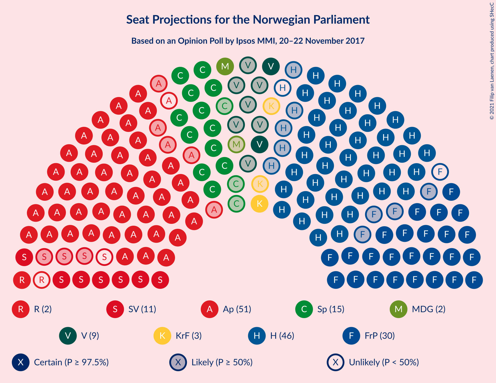
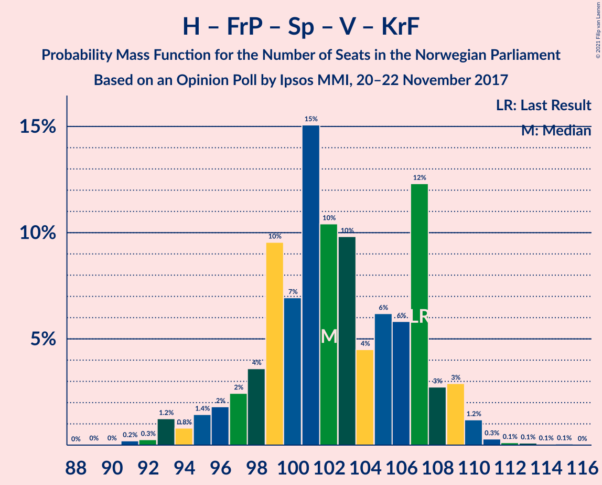
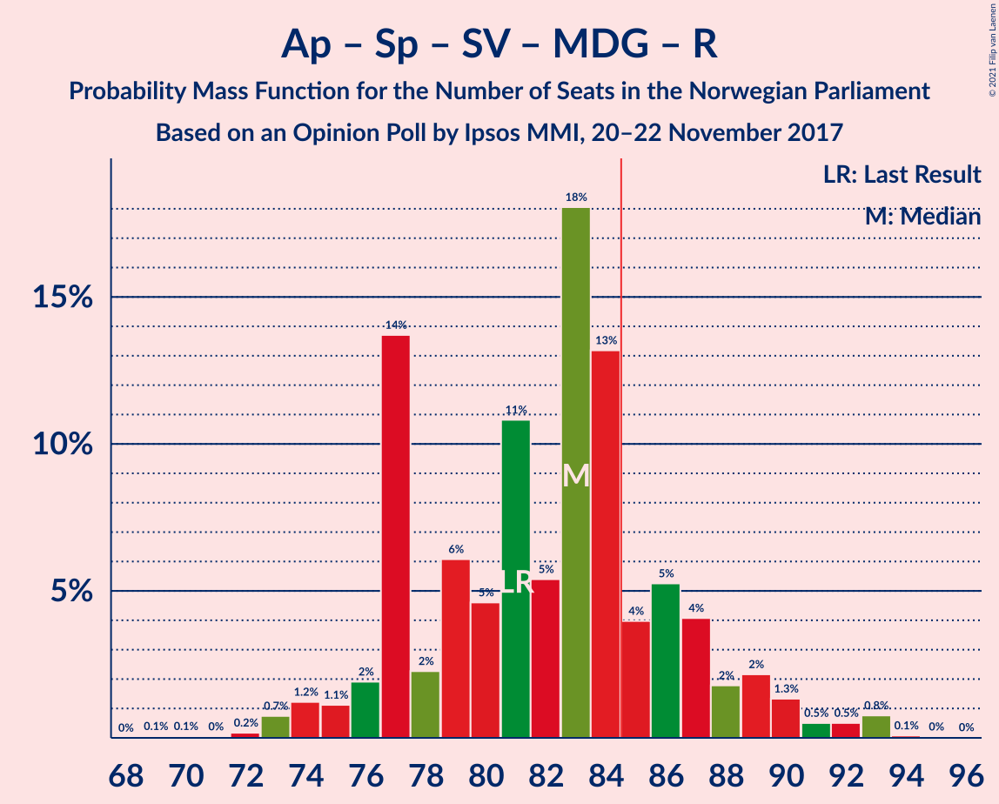
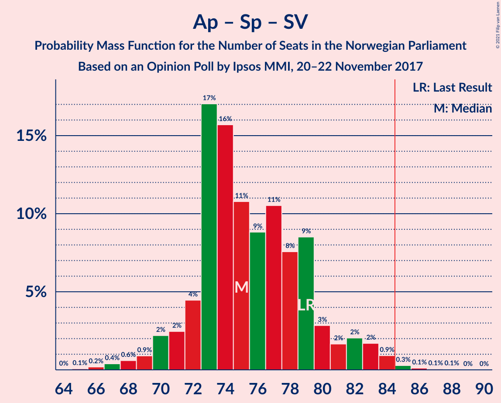
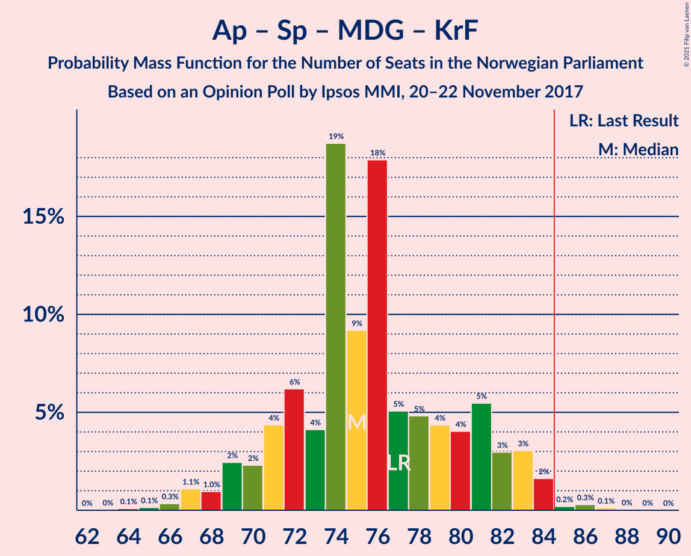

# Opinion Poll by Ipsos MMI, 20–22 November 2017

<a href="#voting-intentions">Voting Intentions</a> | <a href="#seats">Seats</a> | <a href="#coalitions">Coalitions</a> | <a href="#technical-information">Technical Information</a>

## Voting Intentions

### Confidence Intervals

| Party | Last Result | Poll Result | 80% Confidence Interval | 90% Confidence Interval | 95% Confidence Interval | 99% Confidence Interval |
|:-----:|:-----------:|:-----------:|:-----------------------:|:-----------------------:|:-----------------------:|:-----------------------:|
| Arbeiderpartiet | 27.4% | 27.9% | 26.0–29.8% |25.5–30.4% |25.1–30.9% |24.2–31.8% |
| Høyre | 25.0% | 25.1% | 23.3–27.0% |22.8–27.5% |22.4–28.0% |21.5–28.9% |
| Fremskrittspartiet | 15.2% | 15.9% | 14.4–17.5% |14.0–18.0% |13.7–18.4% |13.0–19.2% |
| Senterpartiet | 10.3% | 8.6% | 7.5–9.9% |7.2–10.3% |7.0–10.6% |6.5–11.3% |
| Sosialistisk Venstreparti | 6.0% | 5.4% | 4.6–6.5% |4.4–6.8% |4.1–7.1% |3.8–7.7% |
| Venstre | 4.4% | 4.8% | 4.0–5.8% |3.8–6.1% |3.6–6.4% |3.2–6.9% |
| Miljøpartiet De Grønne | 3.2% | 3.9% | 3.2–4.9% |3.0–5.2% |2.9–5.4% |2.5–5.9% |
| Kristelig Folkeparti | 4.2% | 3.8% | 3.1–4.8% |2.9–5.0% |2.7–5.3% |2.5–5.7% |
| Rødt | 2.4% | 2.8% | 2.2–3.7% |2.1–3.9% |1.9–4.1% |1.7–4.6% |

*Note:* The poll result column reflects the actual value used in the calculations. Published results may vary slightly, and in addition be rounded to fewer digits.

## Seats

### Confidence Intervals

| Party | Last Result | Median | 80% Confidence Interval | 90% Confidence Interval | 95% Confidence Interval | 99% Confidence Interval |
|:-----:|:-----------:|:------:|:-----------------------:|:-----------------------:|:-----------------------:|:-----------------------:|
| <a href="#arbeiderpartiet">Arbeiderpartiet</a> | 49 | 50 | 48–54 |48–54 |47–56 |44–57 |
| <a href="#høyre">Høyre</a> | 45 | 45 | 42–49 |41–49 |40–51 |38–52 |
| <a href="#fremskrittspartiet">Fremskrittspartiet</a> | 27 | 27 | 26–32 |26–32 |26–33 |24–34 |
| <a href="#senterpartiet">Senterpartiet</a> | 19 | 15 | 14–18 |14–18 |13–18 |12–19 |
| <a href="#sosialistisk-venstreparti">Sosialistisk Venstreparti</a> | 11 | 9 | 9–11 |8–12 |7–13 |2–14 |
| <a href="#venstre">Venstre</a> | 8 | 9 | 8–10 |3–11 |2–11 |2–12 |
| <a href="#miljøpartiet-de-grønne">Miljøpartiet De Grønne</a> | 1 | 7 | 2–8 |1–8 |1–9 |1–10 |
| <a href="#kristelig-folkeparti">Kristelig Folkeparti</a> | 8 | 3 | 2–8 |1–8 |1–9 |1–10 |
| <a href="#rødt">Rødt</a> | 1 | 1 | 1–2 |1–2 |1–2 |1–8 |

### Arbeiderpartiet

*For a full overview of the results for this party, see the [Arbeiderpartiet](party-arbeiderpartiet.html) page.*

| Number of Seats | Probability | Accumulated | Special Marks |
|:---------------:|:-----------:|:-----------:|:-------------:|
| 42 | 0.1% | 100% |  |
| 43 | 0.1% | 99.9% |  |
| 44 | 0.4% | 99.7% |  |
| 45 | 0.6% | 99.3% |  |
| 46 | 0.6% | 98.7% |  |
| 47 | 2% | 98% |  |
| 48 | 8% | 96% |  |
| 49 | 15% | 87% | Last Result |
| 50 | 32% | 73% | Median |
| 51 | 4% | 41% |  |
| 52 | 4% | 37% |  |
| 53 | 23% | 33% |  |
| 54 | 6% | 10% |  |
| 55 | 2% | 5% |  |
| 56 | 2% | 3% |  |
| 57 | 0.9% | 1.1% |  |
| 58 | 0% | 0.2% |  |
| 59 | 0.1% | 0.2% |  |
| 60 | 0% | 0.1% |  |
| 61 | 0% | 0% |  |

### Høyre

*For a full overview of the results for this party, see the [Høyre](party-høyre.html) page.*

| Number of Seats | Probability | Accumulated | Special Marks |
|:---------------:|:-----------:|:-----------:|:-------------:|
| 37 | 0.1% | 100% |  |
| 38 | 0.4% | 99.9% |  |
| 39 | 0.2% | 99.4% |  |
| 40 | 3% | 99.2% |  |
| 41 | 3% | 97% |  |
| 42 | 24% | 94% |  |
| 43 | 2% | 70% |  |
| 44 | 3% | 67% |  |
| 45 | 17% | 65% | Last Result, Median |
| 46 | 1.3% | 48% |  |
| 47 | 3% | 47% |  |
| 48 | 30% | 44% |  |
| 49 | 10% | 14% |  |
| 50 | 0.6% | 4% |  |
| 51 | 0.9% | 3% |  |
| 52 | 2% | 2% |  |
| 53 | 0.1% | 0.1% |  |
| 54 | 0% | 0% |  |

### Fremskrittspartiet

*For a full overview of the results for this party, see the [Fremskrittspartiet](party-fremskrittspartiet.html) page.*

| Number of Seats | Probability | Accumulated | Special Marks |
|:---------------:|:-----------:|:-----------:|:-------------:|
| 21 | 0% | 100% |  |
| 22 | 0.1% | 99.9% |  |
| 23 | 0.2% | 99.9% |  |
| 24 | 0.3% | 99.7% |  |
| 25 | 1.4% | 99.4% |  |
| 26 | 38% | 98% |  |
| 27 | 27% | 60% | Last Result, Median |
| 28 | 9% | 34% |  |
| 29 | 5% | 25% |  |
| 30 | 3% | 19% |  |
| 31 | 4% | 16% |  |
| 32 | 10% | 12% |  |
| 33 | 2% | 3% |  |
| 34 | 0.3% | 0.7% |  |
| 35 | 0.1% | 0.4% |  |
| 36 | 0.1% | 0.3% |  |
| 37 | 0.1% | 0.1% |  |
| 38 | 0% | 0% |  |

### Senterpartiet

*For a full overview of the results for this party, see the [Senterpartiet](party-senterpartiet.html) page.*

| Number of Seats | Probability | Accumulated | Special Marks |
|:---------------:|:-----------:|:-----------:|:-------------:|
| 10 | 0.1% | 100% |  |
| 11 | 0.4% | 99.9% |  |
| 12 | 1.0% | 99.5% |  |
| 13 | 2% | 98% |  |
| 14 | 40% | 97% |  |
| 15 | 33% | 57% | Median |
| 16 | 11% | 24% |  |
| 17 | 1.5% | 13% |  |
| 18 | 10% | 12% |  |
| 19 | 2% | 2% | Last Result |
| 20 | 0.2% | 0.3% |  |
| 21 | 0.1% | 0.1% |  |
| 22 | 0.1% | 0.1% |  |
| 23 | 0% | 0% |  |

### Sosialistisk Venstreparti

*For a full overview of the results for this party, see the [Sosialistisk Venstreparti](party-sosialistiskvenstreparti.html) page.*

| Number of Seats | Probability | Accumulated | Special Marks |
|:---------------:|:-----------:|:-----------:|:-------------:|
| 1 | 0.3% | 100% |  |
| 2 | 0.3% | 99.7% |  |
| 3 | 0% | 99.4% |  |
| 4 | 0% | 99.4% |  |
| 5 | 0% | 99.4% |  |
| 6 | 0% | 99.4% |  |
| 7 | 3% | 99.4% |  |
| 8 | 5% | 97% |  |
| 9 | 64% | 92% | Median |
| 10 | 16% | 28% |  |
| 11 | 7% | 12% | Last Result |
| 12 | 2% | 5% |  |
| 13 | 2% | 3% |  |
| 14 | 0.4% | 0.6% |  |
| 15 | 0.2% | 0.2% |  |
| 16 | 0% | 0% |  |

### Venstre

*For a full overview of the results for this party, see the [Venstre](party-venstre.html) page.*

| Number of Seats | Probability | Accumulated | Special Marks |
|:---------------:|:-----------:|:-----------:|:-------------:|
| 2 | 4% | 100% |  |
| 3 | 2% | 96% |  |
| 4 | 0% | 95% |  |
| 5 | 0% | 95% |  |
| 6 | 0% | 95% |  |
| 7 | 2% | 95% |  |
| 8 | 10% | 93% | Last Result |
| 9 | 55% | 83% | Median |
| 10 | 21% | 28% |  |
| 11 | 6% | 7% |  |
| 12 | 1.1% | 1.2% |  |
| 13 | 0.1% | 0.1% |  |
| 14 | 0% | 0% |  |

### Miljøpartiet De Grønne

*For a full overview of the results for this party, see the [Miljøpartiet De Grønne](party-miljøpartietdegrønne.html) page.*

| Number of Seats | Probability | Accumulated | Special Marks |
|:---------------:|:-----------:|:-----------:|:-------------:|
| 1 | 6% | 100% | Last Result |
| 2 | 31% | 94% |  |
| 3 | 0.1% | 63% |  |
| 4 | 0% | 63% |  |
| 5 | 0% | 63% |  |
| 6 | 0% | 63% |  |
| 7 | 25% | 63% | Median |
| 8 | 33% | 38% |  |
| 9 | 4% | 5% |  |
| 10 | 0.7% | 1.1% |  |
| 11 | 0.4% | 0.4% |  |
| 12 | 0% | 0% |  |

### Kristelig Folkeparti

*For a full overview of the results for this party, see the [Kristelig Folkeparti](party-kristeligfolkeparti.html) page.*

| Number of Seats | Probability | Accumulated | Special Marks |
|:---------------:|:-----------:|:-----------:|:-------------:|
| 0 | 0.1% | 100% |  |
| 1 | 9% | 99.9% |  |
| 2 | 3% | 91% |  |
| 3 | 42% | 88% | Median |
| 4 | 0% | 46% |  |
| 5 | 0% | 46% |  |
| 6 | 0.4% | 46% |  |
| 7 | 33% | 45% |  |
| 8 | 9% | 13% | Last Result |
| 9 | 2% | 3% |  |
| 10 | 0.9% | 1.0% |  |
| 11 | 0.1% | 0.1% |  |
| 12 | 0% | 0% |  |

### Rødt

*For a full overview of the results for this party, see the [Rødt](party-rødt.html) page.*

| Number of Seats | Probability | Accumulated | Special Marks |
|:---------------:|:-----------:|:-----------:|:-------------:|
| 1 | 66% | 100% | Last Result, Median |
| 2 | 32% | 34% |  |
| 3 | 0% | 2% |  |
| 4 | 0% | 2% |  |
| 5 | 0% | 2% |  |
| 6 | 0.4% | 2% |  |
| 7 | 0.5% | 1.3% |  |
| 8 | 0.7% | 0.8% |  |
| 9 | 0.1% | 0.1% |  |
| 10 | 0% | 0% |  |

## Coalitions

### Confidence Intervals

| Coalition | Last Result | Median | Majority? | 80% Confidence Interval | 90% Confidence Interval | 95% Confidence Interval | 99% Confidence Interval |
|:---------:|:-----------:|:------:|:---------:|:-----------------------:|:-----------------------:|:-----------------------:|:-----------------------:|
| Høyre – Fremskrittspartiet – Senterpartiet – Venstre – Kristelig Folkeparti | 107 | 101 | 100% | 99–106 | 98–108 | 97–108 | 93–110 |
| Høyre – Fremskrittspartiet – Venstre – Miljøpartiet De Grønne – Kristelig Folkeparti | 89 | 92 | 97% | 89–94 | 87–95 | 84–96 | 81–98 |
| Arbeiderpartiet – Senterpartiet – Sosialistisk Venstreparti – Miljøpartiet De Grønne – Kristelig Folkeparti | 88 | 85 | 66% | 80–90 | 80–90 | 80–92 | 79–94 |
| Høyre – Fremskrittspartiet – Venstre – Kristelig Folkeparti | 88 | 86 | 91% | 85–92 | 82–92 | 80–92 | 77–94 |
| Arbeiderpartiet – Senterpartiet – Sosialistisk Venstreparti – Miljøpartiet De Grønne – Rødt | 81 | 83 | 9% | 77–84 | 77–87 | 77–89 | 75–92 |
| Høyre – Fremskrittspartiet – Venstre | 80 | 83 | 28% | 78–87 | 77–87 | 76–88 | 73–89 |
| Arbeiderpartiet – Senterpartiet – Sosialistisk Venstreparti – Miljøpartiet De Grønne | 80 | 82 | 6% | 75–83 | 75–85 | 75–87 | 73–91 |
| Arbeiderpartiet – Senterpartiet – Sosialistisk Venstreparti – Rødt | 80 | 77 | 3% | 75–80 | 74–82 | 73–85 | 71–88 |
| Arbeiderpartiet – Senterpartiet – Sosialistisk Venstreparti | 79 | 75 | 1.3% | 73–79 | 72–79 | 71–83 | 68–85 |
| Arbeiderpartiet – Senterpartiet – Miljøpartiet De Grønne – Kristelig Folkeparti | 77 | 76 | 0.2% | 71–81 | 70–81 | 69–82 | 68–84 |
| Høyre – Fremskrittspartiet | 72 | 74 | 0.2% | 69–77 | 69–78 | 68–80 | 66–82 |
| Arbeiderpartiet – Senterpartiet – Kristelig Folkeparti | 76 | 70 | 0% | 68–74 | 68–75 | 67–77 | 63–81 |
| Arbeiderpartiet – Senterpartiet | 68 | 65 | 0% | 63–69 | 63–71 | 61–72 | 60–73 |
| Arbeiderpartiet – Sosialistisk Venstreparti | 60 | 59 | 0% | 57–63 | 57–64 | 56–66 | 53–69 |
| Høyre – Venstre – Kristelig Folkeparti | 61 | 60 | 0% | 55–64 | 54–66 | 51–66 | 48–66 |
| Senterpartiet – Venstre – Kristelig Folkeparti | 35 | 29 | 0% | 26–31 | 25–33 | 22–33 | 18–36 |

### Høyre – Fremskrittspartiet – Senterpartiet – Venstre – Kristelig Folkeparti

| Number of Seats | Probability | Accumulated | Special Marks |
|:---------------:|:-----------:|:-----------:|:-------------:|
| 90 | 0% | 100% |  |
| 91 | 0.4% | 99.9% |  |
| 92 | 0% | 99.5% |  |
| 93 | 0.2% | 99.5% |  |
| 94 | 0.7% | 99.3% |  |
| 95 | 0.8% | 98.6% |  |
| 96 | 0.2% | 98% |  |
| 97 | 0.9% | 98% |  |
| 98 | 3% | 97% |  |
| 99 | 24% | 94% | Median |
| 100 | 1.1% | 70% |  |
| 101 | 29% | 69% |  |
| 102 | 10% | 40% |  |
| 103 | 2% | 30% |  |
| 104 | 2% | 28% |  |
| 105 | 4% | 26% |  |
| 106 | 13% | 22% |  |
| 107 | 0.5% | 10% | Last Result |
| 108 | 8% | 9% |  |
| 109 | 0.7% | 2% |  |
| 110 | 0.4% | 0.9% |  |
| 111 | 0.2% | 0.4% |  |
| 112 | 0.1% | 0.3% |  |
| 113 | 0% | 0.2% |  |
| 114 | 0% | 0.1% |  |
| 115 | 0% | 0.1% |  |
| 116 | 0% | 0.1% |  |
| 117 | 0.1% | 0.1% |  |
| 118 | 0% | 0% |  |

### Høyre – Fremskrittspartiet – Venstre – Miljøpartiet De Grønne – Kristelig Folkeparti

| Number of Seats | Probability | Accumulated | Special Marks |
|:---------------:|:-----------:|:-----------:|:-------------:|
| 79 | 0.4% | 100% |  |
| 80 | 0.1% | 99.6% |  |
| 81 | 0.1% | 99.5% |  |
| 82 | 1.1% | 99.4% |  |
| 83 | 0.1% | 98% |  |
| 84 | 0.9% | 98% |  |
| 85 | 0.9% | 97% | Majority |
| 86 | 0.3% | 96% |  |
| 87 | 1.0% | 96% |  |
| 88 | 3% | 95% |  |
| 89 | 3% | 92% | Last Result |
| 90 | 4% | 89% |  |
| 91 | 2% | 85% | Median |
| 92 | 33% | 83% |  |
| 93 | 4% | 50% |  |
| 94 | 40% | 46% |  |
| 95 | 2% | 6% |  |
| 96 | 2% | 4% |  |
| 97 | 0.5% | 2% |  |
| 98 | 0.7% | 1.2% |  |
| 99 | 0.3% | 0.5% |  |
| 100 | 0.1% | 0.2% |  |
| 101 | 0.1% | 0.2% |  |
| 102 | 0.1% | 0.1% |  |
| 103 | 0% | 0% |  |

### Arbeiderpartiet – Senterpartiet – Sosialistisk Venstreparti – Miljøpartiet De Grønne – Kristelig Folkeparti

| Number of Seats | Probability | Accumulated | Special Marks |
|:---------------:|:-----------:|:-----------:|:-------------:|
| 75 | 0% | 100% |  |
| 76 | 0% | 99.9% |  |
| 77 | 0.2% | 99.9% |  |
| 78 | 0.2% | 99.7% |  |
| 79 | 1.0% | 99.5% |  |
| 80 | 11% | 98% |  |
| 81 | 0.9% | 88% |  |
| 82 | 14% | 87% |  |
| 83 | 5% | 73% |  |
| 84 | 1.4% | 67% | Median |
| 85 | 30% | 66% | Majority |
| 86 | 1.2% | 36% |  |
| 87 | 3% | 35% |  |
| 88 | 2% | 31% | Last Result |
| 89 | 1.5% | 29% |  |
| 90 | 24% | 28% |  |
| 91 | 0.6% | 4% |  |
| 92 | 1.0% | 3% |  |
| 93 | 0.9% | 2% |  |
| 94 | 1.1% | 1.4% |  |
| 95 | 0.1% | 0.3% |  |
| 96 | 0.2% | 0.2% |  |
| 97 | 0% | 0% |  |

### Høyre – Fremskrittspartiet – Venstre – Kristelig Folkeparti

| Number of Seats | Probability | Accumulated | Special Marks |
|:---------------:|:-----------:|:-----------:|:-------------:|
| 74 | 0% | 100% |  |
| 75 | 0% | 99.9% |  |
| 76 | 0.3% | 99.9% |  |
| 77 | 0.5% | 99.6% |  |
| 78 | 0.5% | 99.2% |  |
| 79 | 0.2% | 98.6% |  |
| 80 | 1.3% | 98% |  |
| 81 | 0.7% | 97% |  |
| 82 | 2% | 96% |  |
| 83 | 2% | 95% |  |
| 84 | 2% | 93% | Median |
| 85 | 23% | 91% | Majority |
| 86 | 33% | 68% |  |
| 87 | 3% | 35% |  |
| 88 | 4% | 31% | Last Result |
| 89 | 3% | 28% |  |
| 90 | 10% | 25% |  |
| 91 | 2% | 15% |  |
| 92 | 12% | 13% |  |
| 93 | 0.6% | 1.1% |  |
| 94 | 0.1% | 0.5% |  |
| 95 | 0% | 0.4% |  |
| 96 | 0.1% | 0.4% |  |
| 97 | 0.1% | 0.3% |  |
| 98 | 0.1% | 0.2% |  |
| 99 | 0.1% | 0.1% |  |
| 100 | 0.1% | 0.1% |  |
| 101 | 0% | 0% |  |

### Arbeiderpartiet – Senterpartiet – Sosialistisk Venstreparti – Miljøpartiet De Grønne – Rødt

| Number of Seats | Probability | Accumulated | Special Marks |
|:---------------:|:-----------:|:-----------:|:-------------:|
| 69 | 0.1% | 100% |  |
| 70 | 0.1% | 99.9% |  |
| 71 | 0.1% | 99.9% |  |
| 72 | 0.1% | 99.8% |  |
| 73 | 0.1% | 99.7% |  |
| 74 | 0% | 99.6% |  |
| 75 | 0.1% | 99.6% |  |
| 76 | 0.6% | 99.5% |  |
| 77 | 12% | 98.9% |  |
| 78 | 2% | 87% |  |
| 79 | 10% | 85% |  |
| 80 | 3% | 75% |  |
| 81 | 4% | 72% | Last Result |
| 82 | 3% | 69% | Median |
| 83 | 33% | 65% |  |
| 84 | 23% | 32% |  |
| 85 | 2% | 9% | Majority |
| 86 | 2% | 7% |  |
| 87 | 2% | 5% |  |
| 88 | 0.7% | 4% |  |
| 89 | 1.3% | 3% |  |
| 90 | 0.2% | 2% |  |
| 91 | 0.5% | 1.4% |  |
| 92 | 0.5% | 0.8% |  |
| 93 | 0.3% | 0.4% |  |
| 94 | 0% | 0.1% |  |
| 95 | 0% | 0.1% |  |
| 96 | 0% | 0% |  |

### Høyre – Fremskrittspartiet – Venstre

| Number of Seats | Probability | Accumulated | Special Marks |
|:---------------:|:-----------:|:-----------:|:-------------:|
| 70 | 0% | 100% |  |
| 71 | 0.1% | 99.9% |  |
| 72 | 0.2% | 99.9% |  |
| 73 | 0.5% | 99.7% |  |
| 74 | 1.1% | 99.2% |  |
| 75 | 0.6% | 98% |  |
| 76 | 2% | 98% |  |
| 77 | 3% | 96% |  |
| 78 | 23% | 93% |  |
| 79 | 2% | 71% |  |
| 80 | 2% | 69% | Last Result |
| 81 | 3% | 66% | Median |
| 82 | 2% | 63% |  |
| 83 | 28% | 61% |  |
| 84 | 5% | 33% |  |
| 85 | 15% | 28% | Majority |
| 86 | 0.7% | 14% |  |
| 87 | 8% | 13% |  |
| 88 | 3% | 5% |  |
| 89 | 0.9% | 1.2% |  |
| 90 | 0.2% | 0.3% |  |
| 91 | 0.1% | 0.1% |  |
| 92 | 0% | 0.1% |  |
| 93 | 0% | 0% |  |

### Arbeiderpartiet – Senterpartiet – Sosialistisk Venstreparti – Miljøpartiet De Grønne

| Number of Seats | Probability | Accumulated | Special Marks |
|:---------------:|:-----------:|:-----------:|:-------------:|
| 68 | 0.1% | 100% |  |
| 69 | 0.1% | 99.9% |  |
| 70 | 0.2% | 99.9% |  |
| 71 | 0.1% | 99.7% |  |
| 72 | 0.1% | 99.6% |  |
| 73 | 0.1% | 99.6% |  |
| 74 | 0.3% | 99.4% |  |
| 75 | 12% | 99.1% |  |
| 76 | 0.9% | 87% |  |
| 77 | 10% | 86% |  |
| 78 | 2% | 76% |  |
| 79 | 5% | 74% |  |
| 80 | 3% | 70% | Last Result |
| 81 | 8% | 67% | Median |
| 82 | 29% | 59% |  |
| 83 | 23% | 30% |  |
| 84 | 1.2% | 7% |  |
| 85 | 2% | 6% | Majority |
| 86 | 1.4% | 4% |  |
| 87 | 1.3% | 3% |  |
| 88 | 0.3% | 1.3% |  |
| 89 | 0.2% | 1.0% |  |
| 90 | 0.1% | 0.8% |  |
| 91 | 0.5% | 0.7% |  |
| 92 | 0.2% | 0.2% |  |
| 93 | 0% | 0% |  |

### Arbeiderpartiet – Senterpartiet – Sosialistisk Venstreparti – Rødt

| Number of Seats | Probability | Accumulated | Special Marks |
|:---------------:|:-----------:|:-----------:|:-------------:|
| 67 | 0.1% | 100% |  |
| 68 | 0.1% | 99.9% |  |
| 69 | 0.1% | 99.8% |  |
| 70 | 0.3% | 99.8% |  |
| 71 | 0.7% | 99.5% |  |
| 72 | 0.5% | 98.8% |  |
| 73 | 2% | 98% |  |
| 74 | 2% | 96% |  |
| 75 | 40% | 94% | Median |
| 76 | 4% | 54% |  |
| 77 | 33% | 50% |  |
| 78 | 2% | 17% |  |
| 79 | 4% | 15% |  |
| 80 | 3% | 11% | Last Result |
| 81 | 3% | 8% |  |
| 82 | 1.0% | 5% |  |
| 83 | 0.3% | 4% |  |
| 84 | 0.9% | 4% |  |
| 85 | 0.9% | 3% | Majority |
| 86 | 0.1% | 2% |  |
| 87 | 1.1% | 2% |  |
| 88 | 0.1% | 0.6% |  |
| 89 | 0.1% | 0.5% |  |
| 90 | 0.4% | 0.4% |  |
| 91 | 0% | 0% |  |

### Arbeiderpartiet – Senterpartiet – Sosialistisk Venstreparti

| Number of Seats | Probability | Accumulated | Special Marks |
|:---------------:|:-----------:|:-----------:|:-------------:|
| 66 | 0.1% | 100% |  |
| 67 | 0.1% | 99.9% |  |
| 68 | 0.3% | 99.8% |  |
| 69 | 0.6% | 99.5% |  |
| 70 | 0.6% | 98.9% |  |
| 71 | 0.9% | 98% |  |
| 72 | 3% | 97% |  |
| 73 | 14% | 95% |  |
| 74 | 31% | 81% | Median |
| 75 | 9% | 50% |  |
| 76 | 25% | 41% |  |
| 77 | 2% | 16% |  |
| 78 | 3% | 14% |  |
| 79 | 6% | 10% | Last Result |
| 80 | 0.5% | 5% |  |
| 81 | 0.7% | 4% |  |
| 82 | 0.8% | 3% |  |
| 83 | 1.1% | 3% |  |
| 84 | 0.2% | 2% |  |
| 85 | 1.0% | 1.3% | Majority |
| 86 | 0.1% | 0.3% |  |
| 87 | 0.2% | 0.2% |  |
| 88 | 0% | 0% |  |

### Arbeiderpartiet – Senterpartiet – Miljøpartiet De Grønne – Kristelig Folkeparti

| Number of Seats | Probability | Accumulated | Special Marks |
|:---------------:|:-----------:|:-----------:|:-------------:|
| 64 | 0% | 100% |  |
| 65 | 0% | 99.9% |  |
| 66 | 0.1% | 99.9% |  |
| 67 | 0.1% | 99.8% |  |
| 68 | 0.7% | 99.7% |  |
| 69 | 2% | 99.1% |  |
| 70 | 2% | 97% |  |
| 71 | 8% | 95% |  |
| 72 | 9% | 87% |  |
| 73 | 8% | 78% |  |
| 74 | 3% | 70% |  |
| 75 | 4% | 68% | Median |
| 76 | 30% | 64% |  |
| 77 | 2% | 34% | Last Result |
| 78 | 1.5% | 31% |  |
| 79 | 1.3% | 30% |  |
| 80 | 2% | 28% |  |
| 81 | 24% | 27% |  |
| 82 | 1.0% | 3% |  |
| 83 | 0.7% | 2% |  |
| 84 | 1.0% | 1.2% |  |
| 85 | 0.1% | 0.2% | Majority |
| 86 | 0.1% | 0.1% |  |
| 87 | 0% | 0.1% |  |
| 88 | 0% | 0% |  |

### Høyre – Fremskrittspartiet

| Number of Seats | Probability | Accumulated | Special Marks |
|:---------------:|:-----------:|:-----------:|:-------------:|
| 63 | 0.1% | 100% |  |
| 64 | 0.1% | 99.8% |  |
| 65 | 0.1% | 99.8% |  |
| 66 | 0.6% | 99.6% |  |
| 67 | 0.9% | 99.0% |  |
| 68 | 1.4% | 98% |  |
| 69 | 23% | 97% |  |
| 70 | 2% | 74% |  |
| 71 | 4% | 72% |  |
| 72 | 1.4% | 69% | Last Result, Median |
| 73 | 7% | 67% |  |
| 74 | 29% | 60% |  |
| 75 | 11% | 32% |  |
| 76 | 5% | 21% |  |
| 77 | 10% | 16% |  |
| 78 | 2% | 6% |  |
| 79 | 0.6% | 4% |  |
| 80 | 2% | 3% |  |
| 81 | 0.1% | 0.7% |  |
| 82 | 0.1% | 0.6% |  |
| 83 | 0.1% | 0.4% |  |
| 84 | 0.2% | 0.4% |  |
| 85 | 0.2% | 0.2% | Majority |
| 86 | 0% | 0% |  |

### Arbeiderpartiet – Senterpartiet – Kristelig Folkeparti

| Number of Seats | Probability | Accumulated | Special Marks |
|:---------------:|:-----------:|:-----------:|:-------------:|
| 61 | 0% | 100% |  |
| 62 | 0.4% | 99.9% |  |
| 63 | 0.2% | 99.5% |  |
| 64 | 0.4% | 99.3% |  |
| 65 | 0.7% | 98.9% |  |
| 66 | 0.7% | 98% |  |
| 67 | 2% | 98% |  |
| 68 | 33% | 96% | Median |
| 69 | 10% | 63% |  |
| 70 | 10% | 53% |  |
| 71 | 8% | 43% |  |
| 72 | 3% | 35% |  |
| 73 | 3% | 32% |  |
| 74 | 23% | 29% |  |
| 75 | 3% | 6% |  |
| 76 | 0.3% | 3% | Last Result |
| 77 | 0.5% | 3% |  |
| 78 | 0.7% | 2% |  |
| 79 | 0.6% | 2% |  |
| 80 | 0.5% | 1.2% |  |
| 81 | 0.4% | 0.7% |  |
| 82 | 0.3% | 0.3% |  |
| 83 | 0% | 0% |  |

### Arbeiderpartiet – Senterpartiet

| Number of Seats | Probability | Accumulated | Special Marks |
|:---------------:|:-----------:|:-----------:|:-------------:|
| 57 | 0% | 100% |  |
| 58 | 0.1% | 99.9% |  |
| 59 | 0.3% | 99.8% |  |
| 60 | 0.7% | 99.5% |  |
| 61 | 3% | 98.8% |  |
| 62 | 0.7% | 96% |  |
| 63 | 13% | 96% |  |
| 64 | 3% | 82% |  |
| 65 | 30% | 79% | Median |
| 66 | 9% | 49% |  |
| 67 | 25% | 39% |  |
| 68 | 3% | 14% | Last Result |
| 69 | 2% | 11% |  |
| 70 | 4% | 9% |  |
| 71 | 3% | 6% |  |
| 72 | 2% | 3% |  |
| 73 | 0.9% | 1.4% |  |
| 74 | 0.3% | 0.5% |  |
| 75 | 0.1% | 0.2% |  |
| 76 | 0% | 0.2% |  |
| 77 | 0.1% | 0.1% |  |
| 78 | 0% | 0% |  |

### Arbeiderpartiet – Sosialistisk Venstreparti

| Number of Seats | Probability | Accumulated | Special Marks |
|:---------------:|:-----------:|:-----------:|:-------------:|
| 49 | 0.1% | 100% |  |
| 50 | 0% | 99.9% |  |
| 51 | 0.1% | 99.9% |  |
| 52 | 0.3% | 99.8% |  |
| 53 | 0.3% | 99.5% |  |
| 54 | 0.4% | 99.2% |  |
| 55 | 0.4% | 98.8% |  |
| 56 | 1.1% | 98% |  |
| 57 | 8% | 97% |  |
| 58 | 5% | 89% |  |
| 59 | 41% | 84% | Median |
| 60 | 2% | 43% | Last Result |
| 61 | 3% | 41% |  |
| 62 | 26% | 37% |  |
| 63 | 5% | 12% |  |
| 64 | 2% | 6% |  |
| 65 | 0.9% | 4% |  |
| 66 | 1.5% | 3% |  |
| 67 | 1.1% | 2% |  |
| 68 | 0% | 0.6% |  |
| 69 | 0.4% | 0.5% |  |
| 70 | 0.1% | 0.1% |  |
| 71 | 0% | 0.1% |  |
| 72 | 0% | 0.1% |  |
| 73 | 0% | 0% |  |

### Høyre – Venstre – Kristelig Folkeparti

| Number of Seats | Probability | Accumulated | Special Marks |
|:---------------:|:-----------:|:-----------:|:-------------:|
| 45 | 0.2% | 100% |  |
| 46 | 0% | 99.8% |  |
| 47 | 0.1% | 99.8% |  |
| 48 | 1.1% | 99.8% |  |
| 49 | 0.4% | 98.7% |  |
| 50 | 0.4% | 98% |  |
| 51 | 0.9% | 98% |  |
| 52 | 0.4% | 97% |  |
| 53 | 1.3% | 97% |  |
| 54 | 3% | 95% |  |
| 55 | 5% | 93% |  |
| 56 | 1.1% | 88% |  |
| 57 | 3% | 87% | Median |
| 58 | 31% | 83% |  |
| 59 | 2% | 52% |  |
| 60 | 30% | 50% |  |
| 61 | 3% | 20% | Last Result |
| 62 | 2% | 17% |  |
| 63 | 2% | 15% |  |
| 64 | 4% | 13% |  |
| 65 | 0.3% | 9% |  |
| 66 | 8% | 8% |  |
| 67 | 0.2% | 0.3% |  |
| 68 | 0.1% | 0.1% |  |
| 69 | 0% | 0.1% |  |
| 70 | 0.1% | 0.1% |  |
| 71 | 0% | 0% |  |

### Senterpartiet – Venstre – Kristelig Folkeparti

| Number of Seats | Probability | Accumulated | Special Marks |
|:---------------:|:-----------:|:-----------:|:-------------:|
| 17 | 0.2% | 100% |  |
| 18 | 0.4% | 99.8% |  |
| 19 | 0.1% | 99.5% |  |
| 20 | 0.1% | 99.3% |  |
| 21 | 0.2% | 99.3% |  |
| 22 | 2% | 99.0% |  |
| 23 | 1.2% | 97% |  |
| 24 | 0.7% | 96% |  |
| 25 | 4% | 95% |  |
| 26 | 5% | 91% |  |
| 27 | 31% | 86% | Median |
| 28 | 2% | 55% |  |
| 29 | 3% | 53% |  |
| 30 | 23% | 50% |  |
| 31 | 17% | 27% |  |
| 32 | 1.1% | 10% |  |
| 33 | 6% | 8% |  |
| 34 | 0.8% | 2% |  |
| 35 | 0.5% | 2% | Last Result |
| 36 | 0.8% | 1.1% |  |
| 37 | 0.2% | 0.3% |  |
| 38 | 0.1% | 0.1% |  |
| 39 | 0% | 0% |  |

## Technical Information

### Opinion Poll

+ **Polling firm:** Ipsos MMI
+ **Commissioner(s):** —
+ **Fieldwork period:** 20–22 November 2017

### Calculations

+ **Sample size:** 918
+ **Simulations done:** 131,072
+ **Error estimate:** 1.54%

