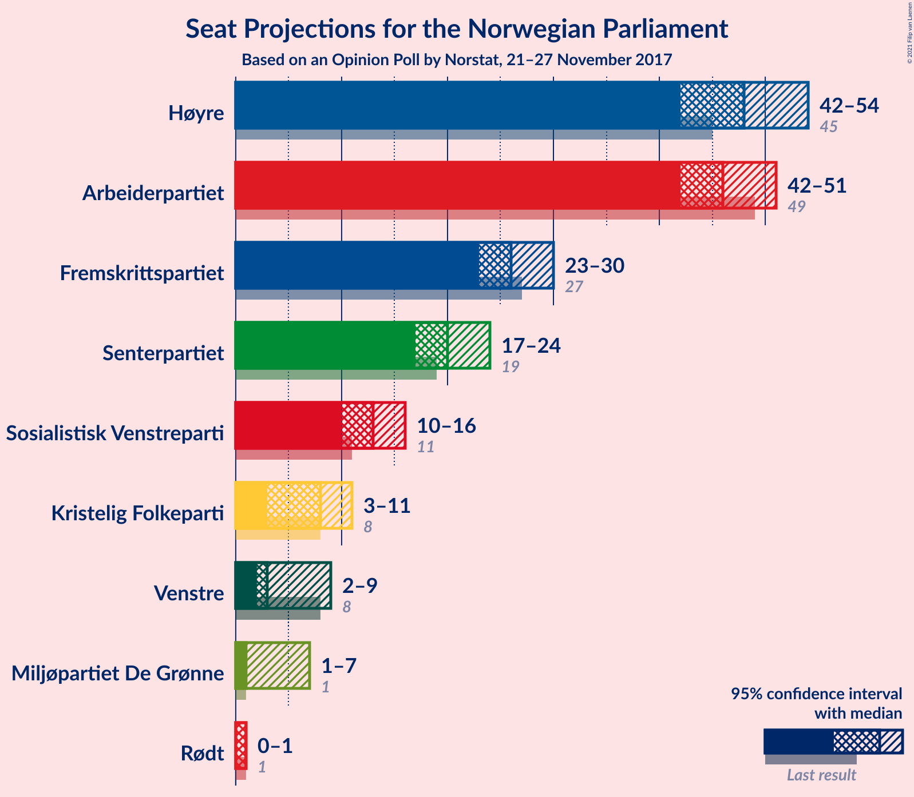
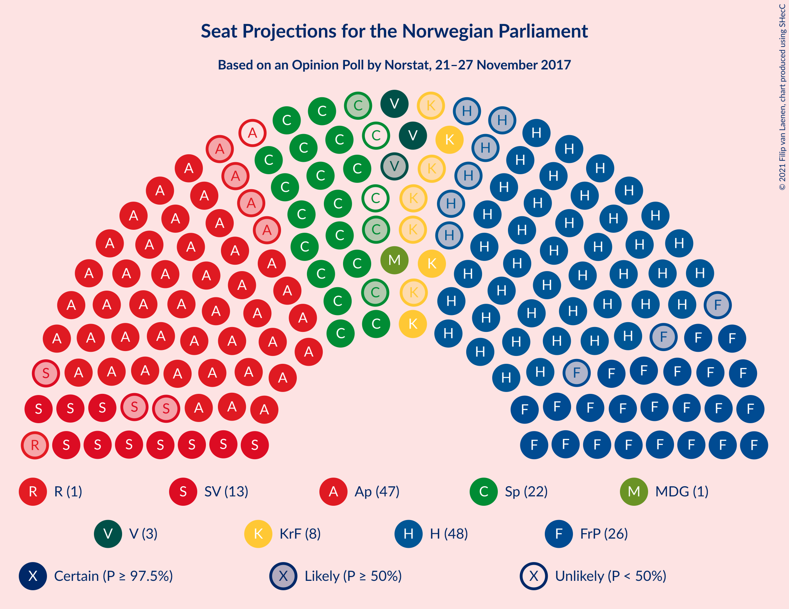
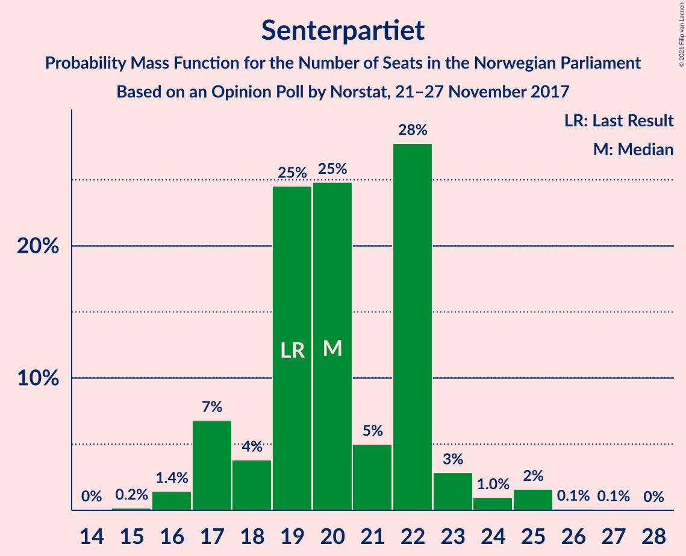
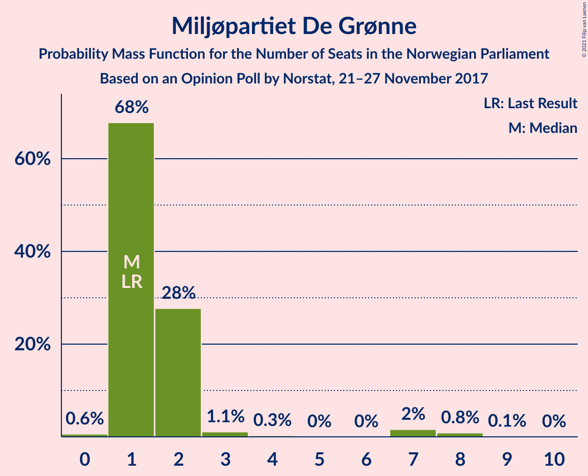
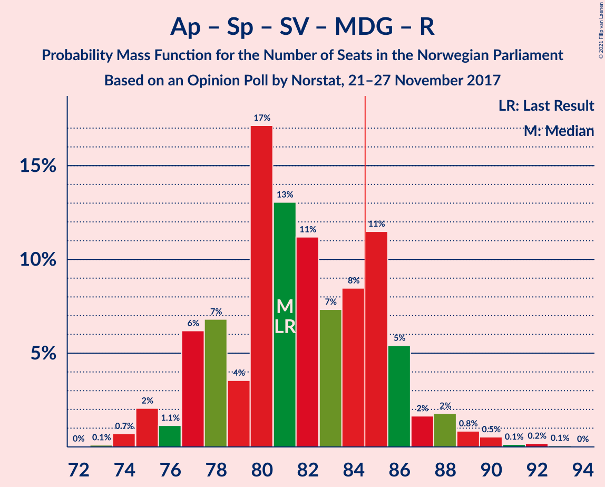
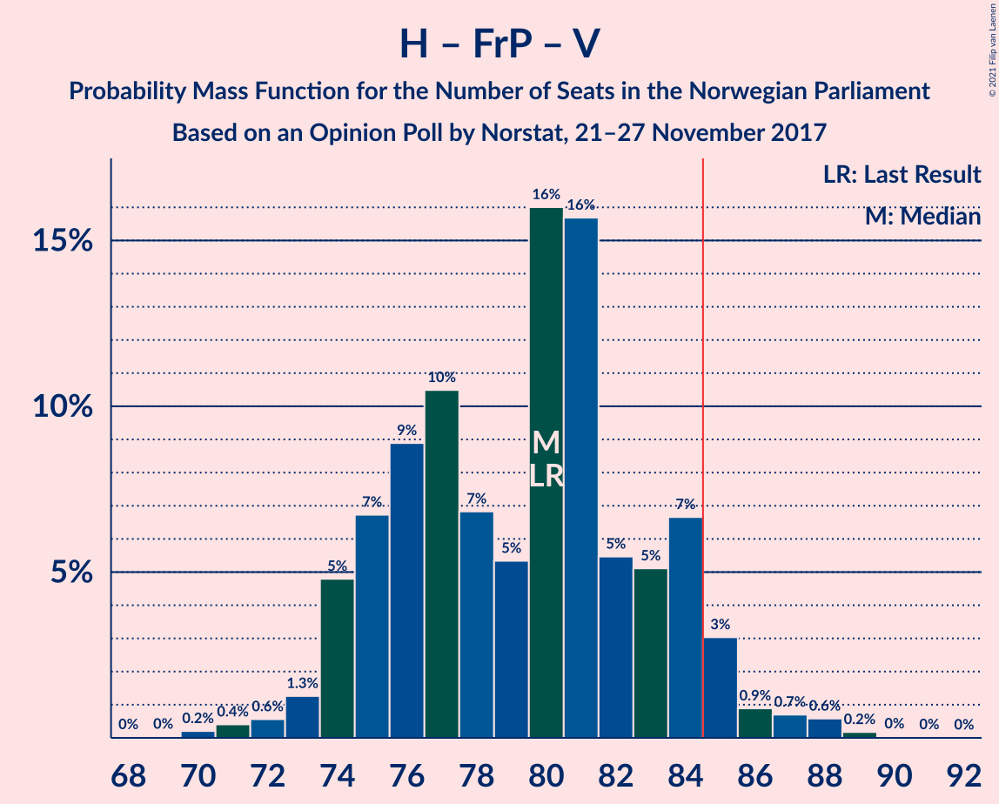
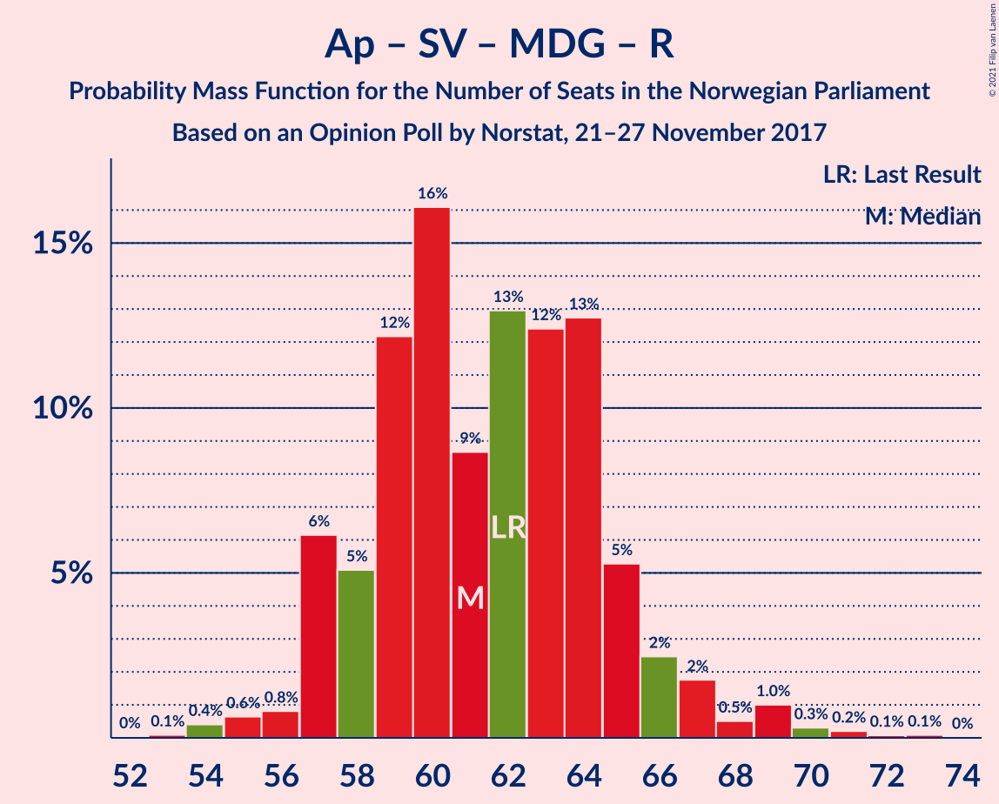

# Opinion Poll by Norstat, 21–27 November 2017

<a href="#voting-intentions">Voting Intentions</a> | <a href="#seats">Seats</a> | <a href="#coalitions">Coalitions</a> | <a href="#technical-information">Technical Information</a>

## Voting Intentions

### Confidence Intervals

| Party | Last Result | Poll Result | 80% Confidence Interval | 90% Confidence Interval | 95% Confidence Interval | 99% Confidence Interval |
|:-----:|:-----------:|:-----------:|:-----------------------:|:-----------------------:|:-----------------------:|:-----------------------:|
| Høyre | 25.0% | 26.8% | 25.0–28.8% |24.5–29.3% |24.1–29.8% |23.3–30.7% |
| Arbeiderpartiet | 27.4% | 25.9% | 24.1–27.8% |23.6–28.3% |23.2–28.8% |22.3–29.7% |
| Fremskrittspartiet | 15.2% | 14.7% | 13.3–16.3% |12.9–16.7% |12.6–17.1% |11.9–17.9% |
| Senterpartiet | 10.3% | 11.2% | 10.0–12.6% |9.6–13.0% |9.3–13.4% |8.8–14.1% |
| Sosialistisk Venstreparti | 6.0% | 7.1% | 6.2–8.3% |5.9–8.7% |5.7–9.0% |5.2–9.6% |
| Kristelig Folkeparti | 4.2% | 4.6% | 3.8–5.6% |3.6–5.9% |3.4–6.1% |3.1–6.6% |
| Venstre | 4.4% | 3.9% | 3.2–4.9% |3.0–5.2% |2.9–5.4% |2.6–5.9% |
| Miljøpartiet De Grønne | 3.2% | 2.9% | 2.3–3.7% |2.1–3.9% |2.0–4.2% |1.7–4.6% |
| Rødt | 2.4% | 1.7% | 1.3–2.4% |1.1–2.6% |1.1–2.8% |0.9–3.1% |

*Note:* The poll result column reflects the actual value used in the calculations. Published results may vary slightly, and in addition be rounded to fewer digits.

## Seats

### Confidence Intervals

| Party | Last Result | Median | 80% Confidence Interval | 90% Confidence Interval | 95% Confidence Interval | 99% Confidence Interval |
|:-----:|:-----------:|:------:|:-----------------------:|:-----------------------:|:-----------------------:|:-----------------------:|
| <a href="#høyre">Høyre</a> | 45 | 48 | 45–52 |43–53 |42–54 |41–55 |
| <a href="#arbeiderpartiet">Arbeiderpartiet</a> | 49 | 46 | 43–50 |42–50 |42–51 |41–53 |
| <a href="#fremskrittspartiet">Fremskrittspartiet</a> | 27 | 26 | 24–29 |23–30 |23–30 |22–33 |
| <a href="#senterpartiet">Senterpartiet</a> | 19 | 20 | 18–22 |17–23 |17–24 |16–25 |
| <a href="#sosialistisk-venstreparti">Sosialistisk Venstreparti</a> | 11 | 13 | 11–15 |11–15 |10–16 |10–17 |
| <a href="#kristelig-folkeparti">Kristelig Folkeparti</a> | 8 | 8 | 3–10 |3–10 |3–11 |2–12 |
| <a href="#venstre">Venstre</a> | 8 | 3 | 2–8 |2–9 |2–9 |2–10 |
| <a href="#miljøpartiet-de-grønne">Miljøpartiet De Grønne</a> | 1 | 1 | 1–2 |1–2 |1–7 |0–8 |
| <a href="#rødt">Rødt</a> | 1 | 1 | 1 |0–1 |0–1 |0–2 |

### Høyre

*For a full overview of the results for this party, see the [Høyre](party-høyre.html) page.*

| Number of Seats | Probability | Accumulated | Special Marks |
|:---------------:|:-----------:|:-----------:|:-------------:|
| 40 | 0.1% | 100% |  |
| 41 | 0.5% | 99.8% |  |
| 42 | 3% | 99.4% |  |
| 43 | 2% | 97% |  |
| 44 | 3% | 95% |  |
| 45 | 6% | 92% | Last Result |
| 46 | 17% | 86% |  |
| 47 | 10% | 69% |  |
| 48 | 21% | 60% | Median |
| 49 | 13% | 39% |  |
| 50 | 6% | 26% |  |
| 51 | 10% | 21% |  |
| 52 | 4% | 11% |  |
| 53 | 4% | 7% |  |
| 54 | 2% | 3% |  |
| 55 | 0.8% | 1.2% |  |
| 56 | 0.3% | 0.4% |  |
| 57 | 0% | 0.1% |  |
| 58 | 0.1% | 0.1% |  |
| 59 | 0% | 0% |  |

### Arbeiderpartiet

*For a full overview of the results for this party, see the [Arbeiderpartiet](party-arbeiderpartiet.html) page.*

| Number of Seats | Probability | Accumulated | Special Marks |
|:---------------:|:-----------:|:-----------:|:-------------:|
| 38 | 0.1% | 100% |  |
| 39 | 0.1% | 99.9% |  |
| 40 | 0.3% | 99.9% |  |
| 41 | 1.2% | 99.6% |  |
| 42 | 4% | 98% |  |
| 43 | 6% | 95% |  |
| 44 | 12% | 88% |  |
| 45 | 23% | 76% |  |
| 46 | 7% | 53% | Median |
| 47 | 17% | 46% |  |
| 48 | 10% | 29% |  |
| 49 | 8% | 19% | Last Result |
| 50 | 7% | 11% |  |
| 51 | 2% | 4% |  |
| 52 | 1.2% | 2% |  |
| 53 | 0.4% | 0.9% |  |
| 54 | 0.2% | 0.4% |  |
| 55 | 0.1% | 0.2% |  |
| 56 | 0% | 0.1% |  |
| 57 | 0% | 0% |  |

### Fremskrittspartiet

*For a full overview of the results for this party, see the [Fremskrittspartiet](party-fremskrittspartiet.html) page.*

| Number of Seats | Probability | Accumulated | Special Marks |
|:---------------:|:-----------:|:-----------:|:-------------:|
| 20 | 0.1% | 100% |  |
| 21 | 0.3% | 99.8% |  |
| 22 | 1.3% | 99.5% |  |
| 23 | 5% | 98% |  |
| 24 | 5% | 93% |  |
| 25 | 21% | 88% |  |
| 26 | 26% | 67% | Median |
| 27 | 19% | 41% | Last Result |
| 28 | 7% | 22% |  |
| 29 | 9% | 14% |  |
| 30 | 4% | 6% |  |
| 31 | 0.5% | 2% |  |
| 32 | 0.6% | 1.1% |  |
| 33 | 0.5% | 0.5% |  |
| 34 | 0% | 0.1% |  |
| 35 | 0% | 0% |  |

### Senterpartiet

*For a full overview of the results for this party, see the [Senterpartiet](party-senterpartiet.html) page.*

| Number of Seats | Probability | Accumulated | Special Marks |
|:---------------:|:-----------:|:-----------:|:-------------:|
| 14 | 0% | 100% |  |
| 15 | 0.2% | 99.9% |  |
| 16 | 1.4% | 99.8% |  |
| 17 | 7% | 98% |  |
| 18 | 4% | 92% |  |
| 19 | 25% | 88% | Last Result |
| 20 | 25% | 63% | Median |
| 21 | 5% | 38% |  |
| 22 | 28% | 33% |  |
| 23 | 3% | 6% |  |
| 24 | 1.0% | 3% |  |
| 25 | 2% | 2% |  |
| 26 | 0.1% | 0.2% |  |
| 27 | 0.1% | 0.1% |  |
| 28 | 0% | 0% |  |

### Sosialistisk Venstreparti

*For a full overview of the results for this party, see the [Sosialistisk Venstreparti](party-sosialistiskvenstreparti.html) page.*

| Number of Seats | Probability | Accumulated | Special Marks |
|:---------------:|:-----------:|:-----------:|:-------------:|
| 9 | 0.4% | 100% |  |
| 10 | 3% | 99.5% |  |
| 11 | 15% | 96% | Last Result |
| 12 | 26% | 81% |  |
| 13 | 25% | 56% | Median |
| 14 | 15% | 30% |  |
| 15 | 11% | 15% |  |
| 16 | 4% | 5% |  |
| 17 | 0.9% | 1.0% |  |
| 18 | 0.2% | 0.2% |  |
| 19 | 0% | 0% |  |

### Kristelig Folkeparti

*For a full overview of the results for this party, see the [Kristelig Folkeparti](party-kristeligfolkeparti.html) page.*

| Number of Seats | Probability | Accumulated | Special Marks |
|:---------------:|:-----------:|:-----------:|:-------------:|
| 1 | 0.4% | 100% |  |
| 2 | 0.5% | 99.6% |  |
| 3 | 10% | 99.1% |  |
| 4 | 0% | 89% |  |
| 5 | 0% | 89% |  |
| 6 | 0% | 89% |  |
| 7 | 14% | 89% |  |
| 8 | 26% | 75% | Last Result, Median |
| 9 | 36% | 50% |  |
| 10 | 10% | 13% |  |
| 11 | 3% | 3% |  |
| 12 | 0.4% | 0.5% |  |
| 13 | 0.1% | 0.1% |  |
| 14 | 0% | 0% |  |

### Venstre

*For a full overview of the results for this party, see the [Venstre](party-venstre.html) page.*

| Number of Seats | Probability | Accumulated | Special Marks |
|:---------------:|:-----------:|:-----------:|:-------------:|
| 1 | 0.1% | 100% |  |
| 2 | 43% | 99.9% |  |
| 3 | 10% | 57% | Median |
| 4 | 0% | 46% |  |
| 5 | 0% | 46% |  |
| 6 | 0% | 46% |  |
| 7 | 6% | 46% |  |
| 8 | 32% | 41% | Last Result |
| 9 | 7% | 9% |  |
| 10 | 2% | 2% |  |
| 11 | 0.3% | 0.3% |  |
| 12 | 0% | 0% |  |

### Miljøpartiet De Grønne

*For a full overview of the results for this party, see the [Miljøpartiet De Grønne](party-miljøpartietdegrønne.html) page.*

| Number of Seats | Probability | Accumulated | Special Marks |
|:---------------:|:-----------:|:-----------:|:-------------:|
| 0 | 0.6% | 100% |  |
| 1 | 68% | 99.4% | Last Result, Median |
| 2 | 28% | 32% |  |
| 3 | 1.1% | 4% |  |
| 4 | 0.3% | 3% |  |
| 5 | 0% | 3% |  |
| 6 | 0% | 3% |  |
| 7 | 2% | 3% |  |
| 8 | 0.8% | 1.0% |  |
| 9 | 0.1% | 0.1% |  |
| 10 | 0% | 0% |  |

### Rødt

*For a full overview of the results for this party, see the [Rødt](party-rødt.html) page.*

| Number of Seats | Probability | Accumulated | Special Marks |
|:---------------:|:-----------:|:-----------:|:-------------:|
| 0 | 10% | 100% |  |
| 1 | 88% | 90% | Last Result, Median |
| 2 | 2% | 2% |  |
| 3 | 0% | 0% |  |

## Coalitions

### Confidence Intervals

| Coalition | Last Result | Median | Majority? | 80% Confidence Interval | 90% Confidence Interval | 95% Confidence Interval | 99% Confidence Interval |
|:---------:|:-----------:|:------:|:---------:|:-----------------------:|:-----------------------:|:-----------------------:|:-----------------------:|
| Høyre – Fremskrittspartiet – Senterpartiet – Kristelig Folkeparti – Venstre | 107 | 108 | 100% | 104–111 | 103–112 | 102–112 | 99–115 |
| Høyre – Fremskrittspartiet – Kristelig Folkeparti – Venstre – Miljøpartiet De Grønne | 89 | 89 | 91% | 85–93 | 84–94 | 83–95 | 80–97 |
| Arbeiderpartiet – Senterpartiet – Sosialistisk Venstreparti – Kristelig Folkeparti – Miljøpartiet De Grønne | 88 | 88 | 88% | 84–93 | 83–94 | 83–94 | 80–97 |
| Høyre – Fremskrittspartiet – Kristelig Folkeparti – Venstre | 88 | 88 | 78% | 83–92 | 82–92 | 81–94 | 79–95 |
| Arbeiderpartiet – Senterpartiet – Sosialistisk Venstreparti – Miljøpartiet De Grønne – Rødt | 81 | 81 | 22% | 77–86 | 77–87 | 75–88 | 74–90 |
| Arbeiderpartiet – Senterpartiet – Sosialistisk Venstreparti – Miljøpartiet De Grønne | 80 | 80 | 11% | 77–85 | 76–86 | 74–87 | 73–89 |
| Arbeiderpartiet – Senterpartiet – Sosialistisk Venstreparti – Rødt | 80 | 80 | 9% | 76–84 | 75–85 | 74–86 | 72–89 |
| Arbeiderpartiet – Senterpartiet – Sosialistisk Venstreparti | 79 | 79 | 4% | 75–83 | 74–84 | 73–85 | 72–88 |
| Høyre – Fremskrittspartiet – Venstre | 80 | 80 | 5% | 75–84 | 74–85 | 73–85 | 71–88 |
| Arbeiderpartiet – Senterpartiet – Kristelig Folkeparti – Miljøpartiet De Grønne | 77 | 75 | 0.4% | 72–81 | 71–82 | 70–82 | 67–84 |
| Arbeiderpartiet – Senterpartiet – Kristelig Folkeparti | 76 | 74 | 0% | 70–79 | 70–80 | 68–81 | 66–82 |
| Høyre – Fremskrittspartiet | 72 | 74 | 0.1% | 71–79 | 69–80 | 68–81 | 67–82 |
| Arbeiderpartiet – Senterpartiet | 68 | 66 | 0% | 63–71 | 61–72 | 61–72 | 59–75 |
| Arbeiderpartiet – Sosialistisk Venstreparti – Miljøpartiet De Grønne – Rødt | 62 | 61 | 0% | 58–65 | 57–66 | 57–67 | 54–70 |
| Høyre – Kristelig Folkeparti – Venstre | 61 | 61 | 0% | 57–65 | 55–67 | 54–67 | 52–69 |
| Arbeiderpartiet – Sosialistisk Venstreparti | 60 | 59 | 0% | 55–62 | 55–63 | 54–65 | 52–67 |
| Senterpartiet – Kristelig Folkeparti – Venstre | 35 | 33 | 0% | 28–37 | 27–38 | 26–39 | 24–40 |

### Høyre – Fremskrittspartiet – Senterpartiet – Kristelig Folkeparti – Venstre

| Number of Seats | Probability | Accumulated | Special Marks |
|:---------------:|:-----------:|:-----------:|:-------------:|
| 96 | 0.1% | 100% |  |
| 97 | 0.1% | 99.9% |  |
| 98 | 0.2% | 99.8% |  |
| 99 | 0.3% | 99.6% |  |
| 100 | 1.0% | 99.3% |  |
| 101 | 0.5% | 98% |  |
| 102 | 2% | 98% |  |
| 103 | 2% | 96% |  |
| 104 | 5% | 94% |  |
| 105 | 13% | 88% | Median |
| 106 | 12% | 76% |  |
| 107 | 13% | 63% | Last Result |
| 108 | 9% | 50% |  |
| 109 | 16% | 41% |  |
| 110 | 12% | 25% |  |
| 111 | 5% | 13% |  |
| 112 | 6% | 8% |  |
| 113 | 0.8% | 2% |  |
| 114 | 0.6% | 1.2% |  |
| 115 | 0.4% | 0.5% |  |
| 116 | 0.1% | 0.1% |  |
| 117 | 0% | 0% |  |

### Høyre – Fremskrittspartiet – Kristelig Folkeparti – Venstre – Miljøpartiet De Grønne

| Number of Seats | Probability | Accumulated | Special Marks |
|:---------------:|:-----------:|:-----------:|:-------------:|
| 77 | 0% | 100% |  |
| 78 | 0.1% | 99.9% |  |
| 79 | 0.1% | 99.8% |  |
| 80 | 0.3% | 99.7% |  |
| 81 | 0.5% | 99.4% |  |
| 82 | 1.1% | 98.8% |  |
| 83 | 2% | 98% |  |
| 84 | 5% | 96% |  |
| 85 | 7% | 91% | Majority |
| 86 | 10% | 84% | Median |
| 87 | 8% | 74% |  |
| 88 | 9% | 66% |  |
| 89 | 15% | 57% | Last Result |
| 90 | 18% | 43% |  |
| 91 | 5% | 25% |  |
| 92 | 6% | 20% |  |
| 93 | 8% | 14% |  |
| 94 | 2% | 6% |  |
| 95 | 2% | 4% |  |
| 96 | 0.9% | 1.4% |  |
| 97 | 0.3% | 0.5% |  |
| 98 | 0.2% | 0.2% |  |
| 99 | 0.1% | 0.1% |  |
| 100 | 0% | 0% |  |

### Arbeiderpartiet – Senterpartiet – Sosialistisk Venstreparti – Kristelig Folkeparti – Miljøpartiet De Grønne

| Number of Seats | Probability | Accumulated | Special Marks |
|:---------------:|:-----------:|:-----------:|:-------------:|
| 78 | 0% | 100% |  |
| 79 | 0.2% | 99.9% |  |
| 80 | 0.6% | 99.8% |  |
| 81 | 0.5% | 99.2% |  |
| 82 | 1.0% | 98.7% |  |
| 83 | 3% | 98% |  |
| 84 | 6% | 95% |  |
| 85 | 4% | 88% | Majority |
| 86 | 5% | 84% |  |
| 87 | 17% | 78% |  |
| 88 | 16% | 62% | Last Result, Median |
| 89 | 5% | 46% |  |
| 90 | 7% | 40% |  |
| 91 | 8% | 34% |  |
| 92 | 12% | 26% |  |
| 93 | 7% | 14% |  |
| 94 | 5% | 7% |  |
| 95 | 1.2% | 2% |  |
| 96 | 0.5% | 1.3% |  |
| 97 | 0.5% | 0.8% |  |
| 98 | 0.2% | 0.3% |  |
| 99 | 0% | 0.1% |  |
| 100 | 0% | 0% |  |

### Høyre – Fremskrittspartiet – Kristelig Folkeparti – Venstre

| Number of Seats | Probability | Accumulated | Special Marks |
|:---------------:|:-----------:|:-----------:|:-------------:|
| 76 | 0.1% | 100% |  |
| 77 | 0.2% | 99.9% |  |
| 78 | 0.1% | 99.7% |  |
| 79 | 0.5% | 99.6% |  |
| 80 | 0.8% | 99.0% |  |
| 81 | 2% | 98% |  |
| 82 | 2% | 96% |  |
| 83 | 5% | 95% |  |
| 84 | 11% | 89% |  |
| 85 | 8% | 78% | Median, Majority |
| 86 | 7% | 69% |  |
| 87 | 11% | 62% |  |
| 88 | 13% | 51% | Last Result |
| 89 | 17% | 38% |  |
| 90 | 4% | 21% |  |
| 91 | 7% | 17% |  |
| 92 | 6% | 10% |  |
| 93 | 1.1% | 4% |  |
| 94 | 2% | 3% |  |
| 95 | 0.7% | 0.9% |  |
| 96 | 0.1% | 0.2% |  |
| 97 | 0% | 0.1% |  |
| 98 | 0% | 0% |  |

### Arbeiderpartiet – Senterpartiet – Sosialistisk Venstreparti – Miljøpartiet De Grønne – Rødt

| Number of Seats | Probability | Accumulated | Special Marks |
|:---------------:|:-----------:|:-----------:|:-------------:|
| 72 | 0% | 100% |  |
| 73 | 0.1% | 99.9% |  |
| 74 | 0.7% | 99.8% |  |
| 75 | 2% | 99.1% |  |
| 76 | 1.1% | 97% |  |
| 77 | 6% | 96% |  |
| 78 | 7% | 90% |  |
| 79 | 4% | 83% |  |
| 80 | 17% | 79% |  |
| 81 | 13% | 62% | Last Result, Median |
| 82 | 11% | 49% |  |
| 83 | 7% | 38% |  |
| 84 | 8% | 31% |  |
| 85 | 11% | 22% | Majority |
| 86 | 5% | 11% |  |
| 87 | 2% | 5% |  |
| 88 | 2% | 4% |  |
| 89 | 0.8% | 2% |  |
| 90 | 0.5% | 1.0% |  |
| 91 | 0.1% | 0.4% |  |
| 92 | 0.2% | 0.3% |  |
| 93 | 0.1% | 0.1% |  |
| 94 | 0% | 0% |  |

### Arbeiderpartiet – Senterpartiet – Sosialistisk Venstreparti – Miljøpartiet De Grønne

| Number of Seats | Probability | Accumulated | Special Marks |
|:---------------:|:-----------:|:-----------:|:-------------:|
| 71 | 0% | 100% |  |
| 72 | 0.1% | 99.9% |  |
| 73 | 0.6% | 99.8% |  |
| 74 | 2% | 99.3% |  |
| 75 | 1.2% | 97% |  |
| 76 | 6% | 96% |  |
| 77 | 6% | 90% |  |
| 78 | 4% | 84% |  |
| 79 | 18% | 80% |  |
| 80 | 13% | 63% | Last Result, Median |
| 81 | 8% | 49% |  |
| 82 | 11% | 41% |  |
| 83 | 8% | 31% |  |
| 84 | 12% | 23% |  |
| 85 | 6% | 11% | Majority |
| 86 | 2% | 5% |  |
| 87 | 1.5% | 3% |  |
| 88 | 0.8% | 2% |  |
| 89 | 0.6% | 1.1% |  |
| 90 | 0.2% | 0.5% |  |
| 91 | 0.2% | 0.3% |  |
| 92 | 0.1% | 0.1% |  |
| 93 | 0% | 0.1% |  |
| 94 | 0% | 0% |  |

### Arbeiderpartiet – Senterpartiet – Sosialistisk Venstreparti – Rødt

| Number of Seats | Probability | Accumulated | Special Marks |
|:---------------:|:-----------:|:-----------:|:-------------:|
| 70 | 0.1% | 100% |  |
| 71 | 0.2% | 99.9% |  |
| 72 | 0.3% | 99.8% |  |
| 73 | 0.9% | 99.5% |  |
| 74 | 2% | 98.6% |  |
| 75 | 2% | 96% |  |
| 76 | 8% | 94% |  |
| 77 | 6% | 86% |  |
| 78 | 5% | 80% |  |
| 79 | 18% | 75% |  |
| 80 | 15% | 57% | Last Result, Median |
| 81 | 9% | 43% |  |
| 82 | 8% | 34% |  |
| 83 | 10% | 26% |  |
| 84 | 7% | 16% |  |
| 85 | 5% | 9% | Majority |
| 86 | 2% | 4% |  |
| 87 | 1.1% | 2% |  |
| 88 | 0.5% | 1.2% |  |
| 89 | 0.3% | 0.6% |  |
| 90 | 0.1% | 0.3% |  |
| 91 | 0.1% | 0.2% |  |
| 92 | 0% | 0.1% |  |
| 93 | 0% | 0% |  |

### Arbeiderpartiet – Senterpartiet – Sosialistisk Venstreparti

| Number of Seats | Probability | Accumulated | Special Marks |
|:---------------:|:-----------:|:-----------:|:-------------:|
| 69 | 0.1% | 100% |  |
| 70 | 0.1% | 99.9% |  |
| 71 | 0.3% | 99.9% |  |
| 72 | 0.8% | 99.5% |  |
| 73 | 2% | 98.8% |  |
| 74 | 2% | 97% |  |
| 75 | 8% | 94% |  |
| 76 | 6% | 87% |  |
| 77 | 5% | 81% |  |
| 78 | 19% | 76% |  |
| 79 | 12% | 58% | Last Result, Median |
| 80 | 11% | 46% |  |
| 81 | 8% | 34% |  |
| 82 | 10% | 26% |  |
| 83 | 7% | 16% |  |
| 84 | 5% | 9% |  |
| 85 | 2% | 4% | Majority |
| 86 | 0.8% | 2% |  |
| 87 | 0.5% | 1.2% |  |
| 88 | 0.4% | 0.7% |  |
| 89 | 0.1% | 0.3% |  |
| 90 | 0.1% | 0.2% |  |
| 91 | 0% | 0.1% |  |
| 92 | 0% | 0% |  |

### Høyre – Fremskrittspartiet – Venstre

| Number of Seats | Probability | Accumulated | Special Marks |
|:---------------:|:-----------:|:-----------:|:-------------:|
| 69 | 0% | 100% |  |
| 70 | 0.2% | 99.9% |  |
| 71 | 0.4% | 99.7% |  |
| 72 | 0.6% | 99.3% |  |
| 73 | 1.3% | 98.8% |  |
| 74 | 5% | 97% |  |
| 75 | 7% | 93% |  |
| 76 | 9% | 86% |  |
| 77 | 10% | 77% | Median |
| 78 | 7% | 67% |  |
| 79 | 5% | 60% |  |
| 80 | 16% | 54% | Last Result |
| 81 | 16% | 38% |  |
| 82 | 5% | 23% |  |
| 83 | 5% | 17% |  |
| 84 | 7% | 12% |  |
| 85 | 3% | 5% | Majority |
| 86 | 0.9% | 2% |  |
| 87 | 0.7% | 2% |  |
| 88 | 0.6% | 0.8% |  |
| 89 | 0.2% | 0.3% |  |
| 90 | 0% | 0.1% |  |
| 91 | 0% | 0% |  |

### Arbeiderpartiet – Senterpartiet – Kristelig Folkeparti – Miljøpartiet De Grønne

| Number of Seats | Probability | Accumulated | Special Marks |
|:---------------:|:-----------:|:-----------:|:-------------:|
| 65 | 0.1% | 100% |  |
| 66 | 0.1% | 99.8% |  |
| 67 | 0.3% | 99.7% |  |
| 68 | 0.8% | 99.4% |  |
| 69 | 0.7% | 98.7% |  |
| 70 | 2% | 98% |  |
| 71 | 6% | 96% |  |
| 72 | 4% | 90% |  |
| 73 | 9% | 86% |  |
| 74 | 9% | 77% |  |
| 75 | 22% | 69% | Median |
| 76 | 8% | 46% |  |
| 77 | 8% | 39% | Last Result |
| 78 | 8% | 30% |  |
| 79 | 6% | 22% |  |
| 80 | 6% | 16% |  |
| 81 | 2% | 10% |  |
| 82 | 7% | 9% |  |
| 83 | 0.8% | 2% |  |
| 84 | 0.3% | 0.7% |  |
| 85 | 0.3% | 0.4% | Majority |
| 86 | 0.1% | 0.2% |  |
| 87 | 0% | 0.1% |  |
| 88 | 0% | 0% |  |

### Arbeiderpartiet – Senterpartiet – Kristelig Folkeparti

| Number of Seats | Probability | Accumulated | Special Marks |
|:---------------:|:-----------:|:-----------:|:-------------:|
| 63 | 0.1% | 100% |  |
| 64 | 0.1% | 99.9% |  |
| 65 | 0.3% | 99.8% |  |
| 66 | 0.4% | 99.5% |  |
| 67 | 0.9% | 99.2% |  |
| 68 | 2% | 98% |  |
| 69 | 2% | 97% |  |
| 70 | 7% | 95% |  |
| 71 | 5% | 88% |  |
| 72 | 9% | 83% |  |
| 73 | 10% | 74% |  |
| 74 | 23% | 65% | Median |
| 75 | 10% | 42% |  |
| 76 | 5% | 32% | Last Result |
| 77 | 9% | 27% |  |
| 78 | 8% | 19% |  |
| 79 | 2% | 11% |  |
| 80 | 5% | 9% |  |
| 81 | 4% | 4% |  |
| 82 | 0.5% | 0.9% |  |
| 83 | 0.1% | 0.4% |  |
| 84 | 0.3% | 0.3% |  |
| 85 | 0% | 0% | Majority |

### Høyre – Fremskrittspartiet

| Number of Seats | Probability | Accumulated | Special Marks |
|:---------------:|:-----------:|:-----------:|:-------------:|
| 64 | 0% | 100% |  |
| 65 | 0.1% | 99.9% |  |
| 66 | 0.2% | 99.8% |  |
| 67 | 0.7% | 99.6% |  |
| 68 | 3% | 98.9% |  |
| 69 | 2% | 96% |  |
| 70 | 3% | 95% |  |
| 71 | 3% | 91% |  |
| 72 | 15% | 88% | Last Result |
| 73 | 15% | 72% |  |
| 74 | 15% | 57% | Median |
| 75 | 8% | 42% |  |
| 76 | 10% | 34% |  |
| 77 | 7% | 24% |  |
| 78 | 3% | 17% |  |
| 79 | 8% | 14% |  |
| 80 | 2% | 5% |  |
| 81 | 2% | 3% |  |
| 82 | 0.6% | 1.0% |  |
| 83 | 0.2% | 0.5% |  |
| 84 | 0.2% | 0.3% |  |
| 85 | 0% | 0.1% | Majority |
| 86 | 0.1% | 0.1% |  |
| 87 | 0% | 0% |  |

### Arbeiderpartiet – Senterpartiet

| Number of Seats | Probability | Accumulated | Special Marks |
|:---------------:|:-----------:|:-----------:|:-------------:|
| 58 | 0.2% | 100% |  |
| 59 | 0.4% | 99.8% |  |
| 60 | 0.9% | 99.4% |  |
| 61 | 4% | 98.5% |  |
| 62 | 4% | 95% |  |
| 63 | 6% | 91% |  |
| 64 | 11% | 85% |  |
| 65 | 16% | 75% |  |
| 66 | 10% | 58% | Median |
| 67 | 15% | 48% |  |
| 68 | 7% | 33% | Last Result |
| 69 | 11% | 26% |  |
| 70 | 3% | 15% |  |
| 71 | 6% | 12% |  |
| 72 | 4% | 6% |  |
| 73 | 1.0% | 2% |  |
| 74 | 0.6% | 1.1% |  |
| 75 | 0.3% | 0.5% |  |
| 76 | 0.2% | 0.2% |  |
| 77 | 0% | 0.1% |  |
| 78 | 0% | 0% |  |

### Arbeiderpartiet – Sosialistisk Venstreparti – Miljøpartiet De Grønne – Rødt

| Number of Seats | Probability | Accumulated | Special Marks |
|:---------------:|:-----------:|:-----------:|:-------------:|
| 53 | 0.1% | 100% |  |
| 54 | 0.4% | 99.9% |  |
| 55 | 0.6% | 99.5% |  |
| 56 | 0.8% | 98.8% |  |
| 57 | 6% | 98% |  |
| 58 | 5% | 92% |  |
| 59 | 12% | 87% |  |
| 60 | 16% | 75% |  |
| 61 | 9% | 59% | Median |
| 62 | 13% | 50% | Last Result |
| 63 | 12% | 37% |  |
| 64 | 13% | 24% |  |
| 65 | 5% | 12% |  |
| 66 | 2% | 6% |  |
| 67 | 2% | 4% |  |
| 68 | 0.5% | 2% |  |
| 69 | 1.0% | 2% |  |
| 70 | 0.3% | 0.7% |  |
| 71 | 0.2% | 0.4% |  |
| 72 | 0.1% | 0.2% |  |
| 73 | 0.1% | 0.1% |  |
| 74 | 0% | 0% |  |

### Høyre – Kristelig Folkeparti – Venstre

| Number of Seats | Probability | Accumulated | Special Marks |
|:---------------:|:-----------:|:-----------:|:-------------:|
| 49 | 0% | 100% |  |
| 50 | 0.2% | 99.9% |  |
| 51 | 0.2% | 99.7% |  |
| 52 | 0.5% | 99.5% |  |
| 53 | 0.7% | 99.0% |  |
| 54 | 1.3% | 98% |  |
| 55 | 2% | 97% |  |
| 56 | 3% | 95% |  |
| 57 | 6% | 92% |  |
| 58 | 7% | 86% |  |
| 59 | 15% | 79% | Median |
| 60 | 10% | 64% |  |
| 61 | 6% | 54% | Last Result |
| 62 | 4% | 47% |  |
| 63 | 24% | 43% |  |
| 64 | 6% | 19% |  |
| 65 | 6% | 13% |  |
| 66 | 1.1% | 7% |  |
| 67 | 4% | 6% |  |
| 68 | 0.8% | 1.5% |  |
| 69 | 0.4% | 0.7% |  |
| 70 | 0.3% | 0.4% |  |
| 71 | 0% | 0.1% |  |
| 72 | 0% | 0% |  |

### Arbeiderpartiet – Sosialistisk Venstreparti

| Number of Seats | Probability | Accumulated | Special Marks |
|:---------------:|:-----------:|:-----------:|:-------------:|
| 50 | 0% | 100% |  |
| 51 | 0.1% | 99.9% |  |
| 52 | 0.7% | 99.8% |  |
| 53 | 0.4% | 99.1% |  |
| 54 | 1.2% | 98.7% |  |
| 55 | 8% | 97% |  |
| 56 | 6% | 90% |  |
| 57 | 13% | 84% |  |
| 58 | 17% | 71% |  |
| 59 | 9% | 54% | Median |
| 60 | 16% | 46% | Last Result |
| 61 | 10% | 30% |  |
| 62 | 11% | 19% |  |
| 63 | 4% | 8% |  |
| 64 | 2% | 4% |  |
| 65 | 1.0% | 3% |  |
| 66 | 0.7% | 2% |  |
| 67 | 0.7% | 1.1% |  |
| 68 | 0.2% | 0.4% |  |
| 69 | 0.1% | 0.2% |  |
| 70 | 0% | 0.1% |  |
| 71 | 0% | 0% |  |

### Senterpartiet – Kristelig Folkeparti – Venstre

| Number of Seats | Probability | Accumulated | Special Marks |
|:---------------:|:-----------:|:-----------:|:-------------:|
| 21 | 0.1% | 100% |  |
| 22 | 0.1% | 99.9% |  |
| 23 | 0.1% | 99.8% |  |
| 24 | 0.8% | 99.7% |  |
| 25 | 0.6% | 98.9% |  |
| 26 | 0.8% | 98% |  |
| 27 | 3% | 97% |  |
| 28 | 6% | 95% |  |
| 29 | 8% | 89% |  |
| 30 | 10% | 81% |  |
| 31 | 5% | 71% | Median |
| 32 | 9% | 66% |  |
| 33 | 13% | 57% |  |
| 34 | 5% | 44% |  |
| 35 | 4% | 39% | Last Result |
| 36 | 8% | 35% |  |
| 37 | 18% | 28% |  |
| 38 | 4% | 9% |  |
| 39 | 3% | 5% |  |
| 40 | 1.1% | 2% |  |
| 41 | 0.3% | 0.4% |  |
| 42 | 0.1% | 0.1% |  |
| 43 | 0% | 0% |  |

## Technical Information

### Opinion Poll

+ **Polling firm:** Norstat
+ **Commissioner(s):** —
+ **Fieldwork period:** 21–27 November 2017

### Calculations

+ **Sample size:** 939
+ **Simulations done:** 1,048,576
+ **Error estimate:** 1.13%

