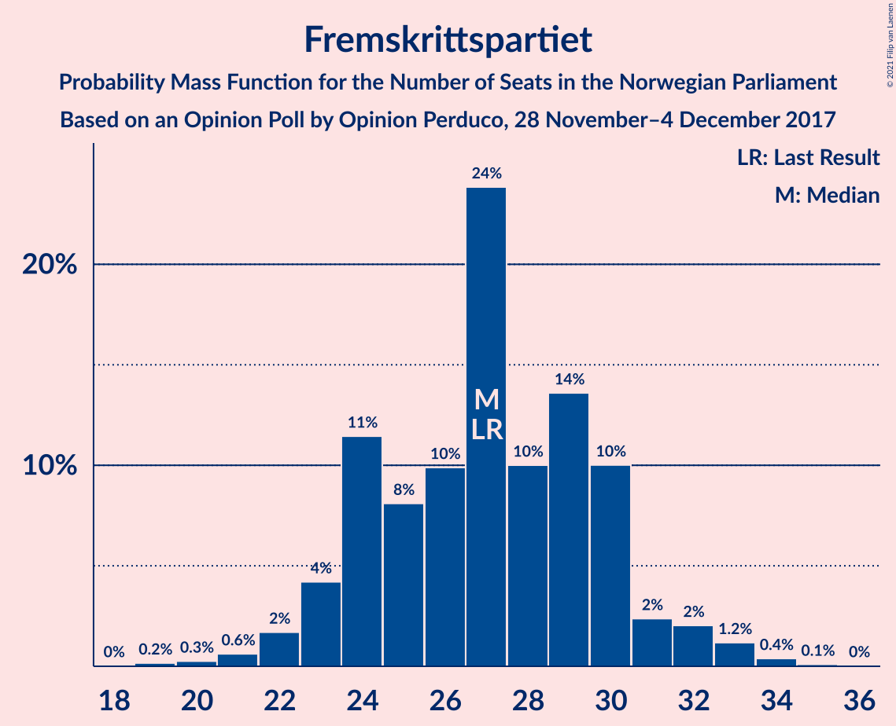
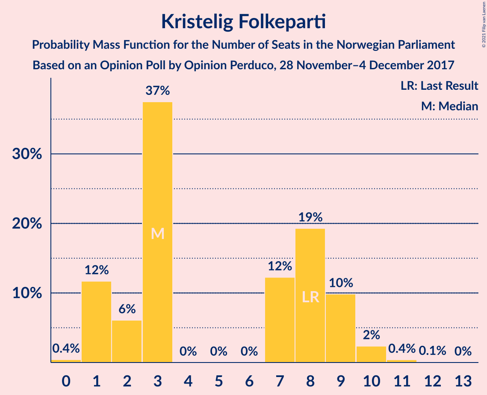
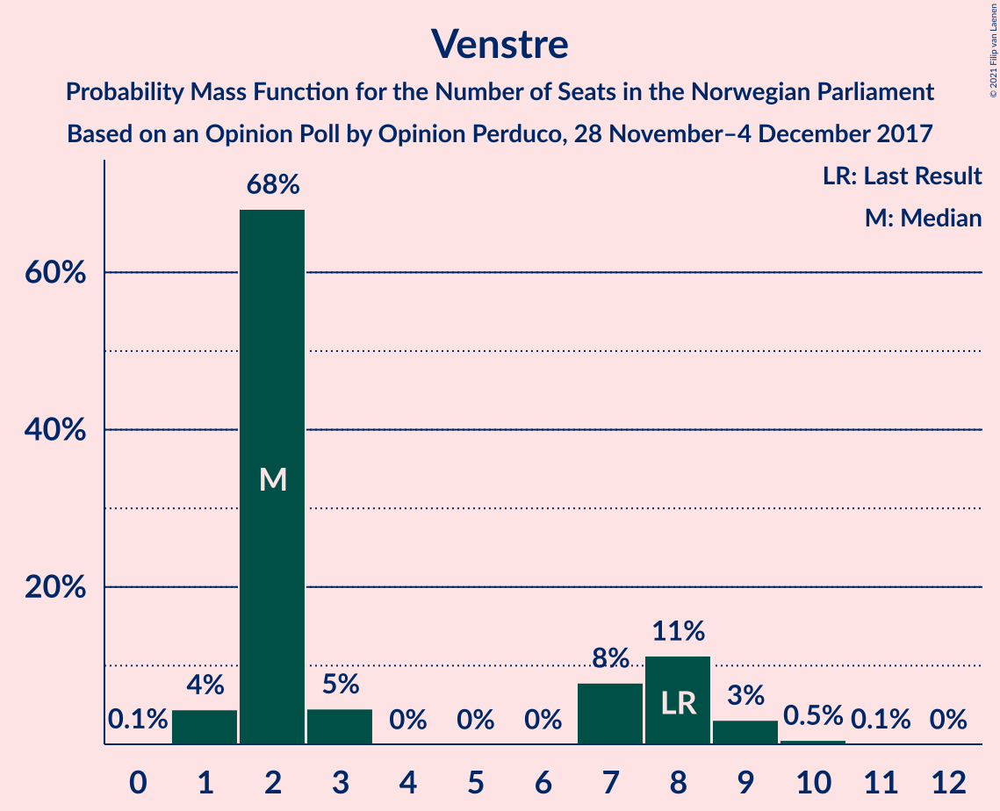
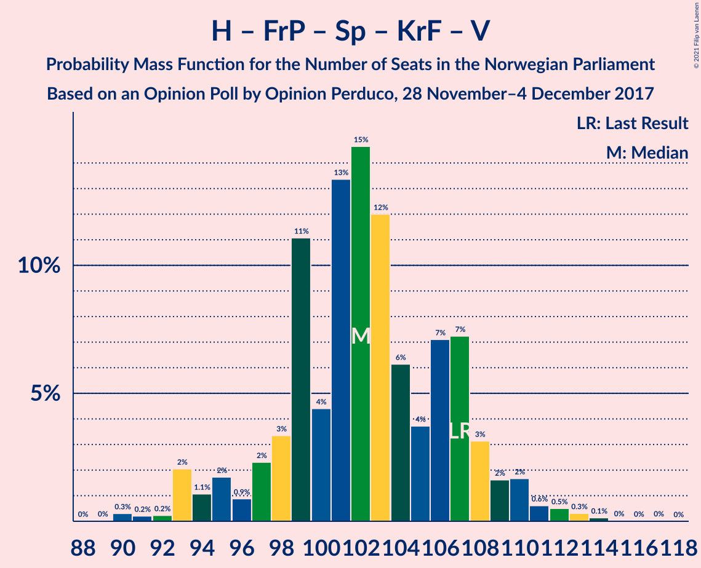
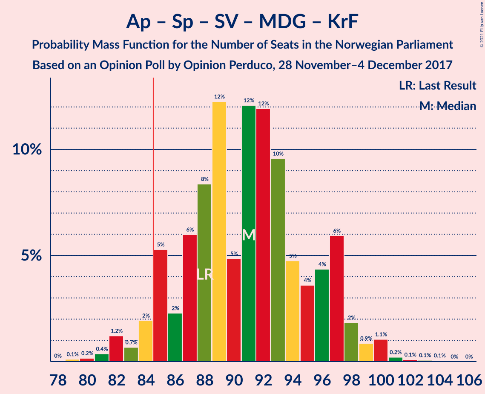
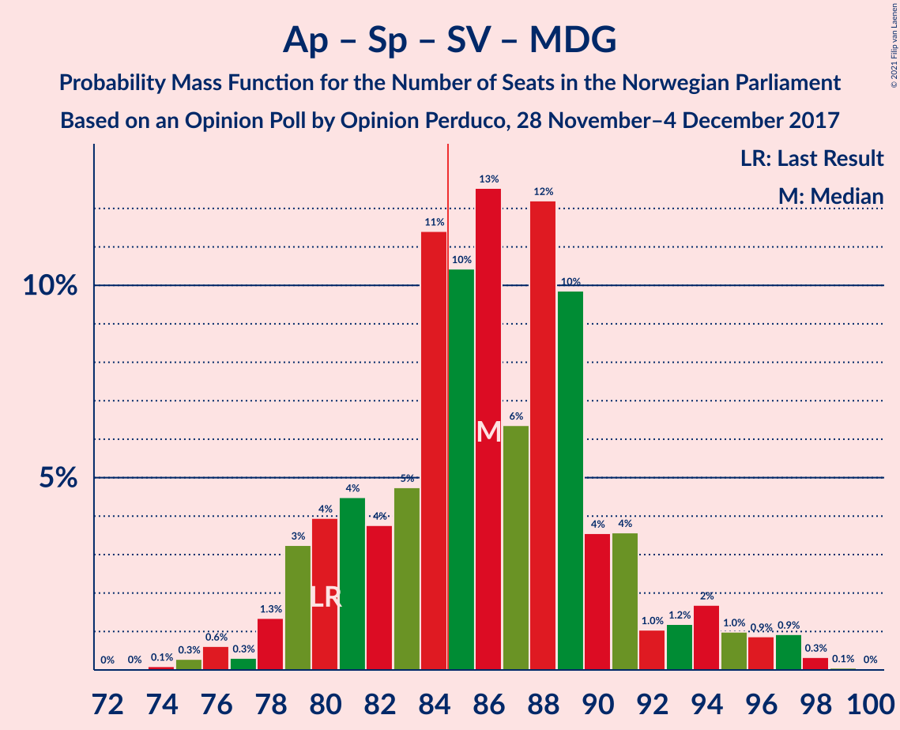
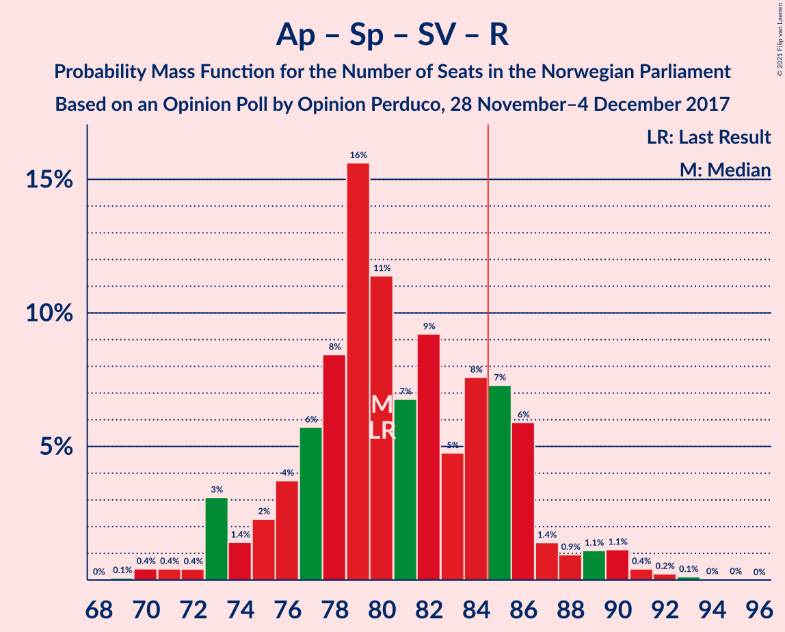
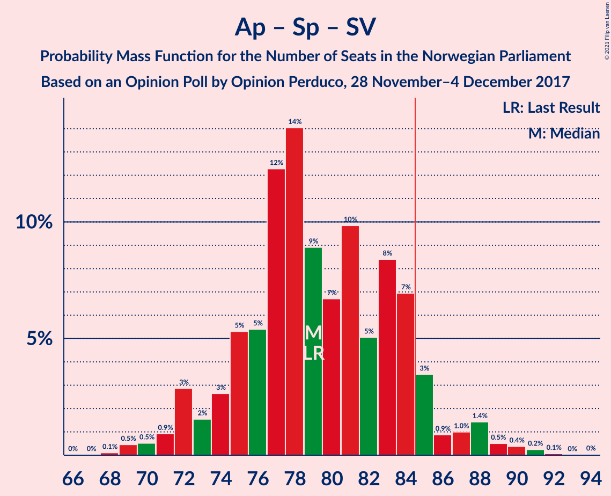
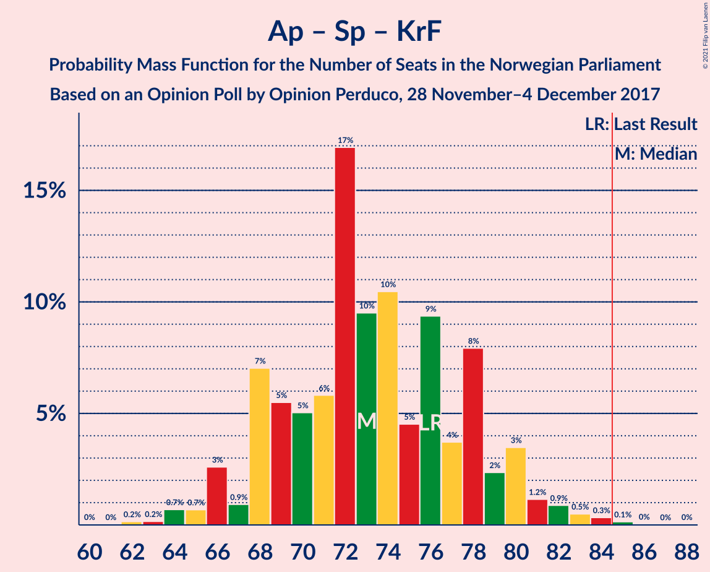

# Opinion Poll by Opinion Perduco, 28 November–4 December 2017

<a href="#voting-intentions">Voting Intentions</a> | <a href="#seats">Seats</a> | <a href="#coalitions">Coalitions</a> | <a href="#technical-information">Technical Information</a>

## Voting Intentions

### Confidence Intervals

| Party | Last Result | Poll Result | 80% Confidence Interval | 90% Confidence Interval | 95% Confidence Interval | 99% Confidence Interval |
|:-----:|:-----------:|:-----------:|:-----------------------:|:-----------------------:|:-----------------------:|:-----------------------:|
| Arbeiderpartiet | 27.4% | 26.6% | 24.6–28.8% |24.0–29.4% |23.5–29.9% |22.6–31.0% |
| Høyre | 25.0% | 25.9% | 23.9–28.1% |23.3–28.7% |22.8–29.2% |21.9–30.3% |
| Fremskrittspartiet | 15.2% | 14.9% | 13.4–16.8% |12.9–17.3% |12.5–17.7% |11.8–18.6% |
| Senterpartiet | 10.3% | 11.5% | 10.1–13.2% |9.7–13.6% |9.4–14.0% |8.8–14.9% |
| Sosialistisk Venstreparti | 6.0% | 6.0% | 5.0–7.3% |4.8–7.7% |4.5–8.0% |4.1–8.7% |
| Miljøpartiet De Grønne | 3.2% | 4.4% | 3.6–5.5% |3.3–5.8% |3.1–6.1% |2.8–6.7% |
| Kristelig Folkeparti | 4.2% | 3.8% | 3.1–4.9% |2.9–5.2% |2.7–5.5% |2.3–6.1% |
| Venstre | 4.4% | 3.4% | 2.7–4.5% |2.5–4.8% |2.3–5.0% |2.0–5.5% |
| Rødt | 2.4% | 2.5% | 1.9–3.4% |1.7–3.6% |1.6–3.9% |1.3–4.4% |

*Note:* The poll result column reflects the actual value used in the calculations. Published results may vary slightly, and in addition be rounded to fewer digits.

## Seats

### Confidence Intervals

| Party | Last Result | Median | 80% Confidence Interval | 90% Confidence Interval | 95% Confidence Interval | 99% Confidence Interval |
|:-----:|:-----------:|:------:|:-----------------------:|:-----------------------:|:-----------------------:|:-----------------------:|
| <a href="#arbeiderpartiet">Arbeiderpartiet</a> | 49 | 49 | 44–53 |43–54 |42–55 |41–55 |
| <a href="#høyre">Høyre</a> | 45 | 47 | 43–51 |42–51 |40–52 |38–54 |
| <a href="#fremskrittspartiet">Fremskrittspartiet</a> | 27 | 28 | 23–31 |23–31 |22–33 |20–34 |
| <a href="#senterpartiet">Senterpartiet</a> | 19 | 21 | 18–24 |17–26 |16–26 |16–27 |
| <a href="#sosialistisk-venstreparti">Sosialistisk Venstreparti</a> | 11 | 11 | 9–13 |7–14 |2–15 |2–15 |
| <a href="#miljøpartiet-de-grønne">Miljøpartiet De Grønne</a> | 1 | 7 | 2–10 |1–10 |1–11 |1–12 |
| <a href="#kristelig-folkeparti">Kristelig Folkeparti</a> | 8 | 3 | 1–9 |1–10 |1–10 |0–11 |
| <a href="#venstre">Venstre</a> | 8 | 2 | 2–8 |1–8 |1–9 |1–10 |
| <a href="#rødt">Rødt</a> | 1 | 1 | 1–2 |1–2 |1–2 |1–8 |

### Arbeiderpartiet

*For a full overview of the results for this party, see the [Arbeiderpartiet](party-arbeiderpartiet.html) page.*

| Number of Seats | Probability | Accumulated | Special Marks |
|:---------------:|:-----------:|:-----------:|:-------------:|
| 39 | 0.1% | 100% |  |
| 40 | 0.3% | 99.9% |  |
| 41 | 1.1% | 99.6% |  |
| 42 | 2% | 98% |  |
| 43 | 6% | 96% |  |
| 44 | 5% | 90% |  |
| 45 | 8% | 85% |  |
| 46 | 13% | 77% |  |
| 47 | 5% | 64% |  |
| 48 | 6% | 59% |  |
| 49 | 20% | 53% | Last Result, Median |
| 50 | 10% | 33% |  |
| 51 | 4% | 23% |  |
| 52 | 5% | 19% |  |
| 53 | 8% | 14% |  |
| 54 | 3% | 6% |  |
| 55 | 2% | 3% |  |
| 56 | 0.3% | 0.4% |  |
| 57 | 0% | 0.2% |  |
| 58 | 0.1% | 0.2% |  |
| 59 | 0% | 0% |  |

### Høyre

*For a full overview of the results for this party, see the [Høyre](party-høyre.html) page.*

| Number of Seats | Probability | Accumulated | Special Marks |
|:---------------:|:-----------:|:-----------:|:-------------:|
| 37 | 0% | 100% |  |
| 38 | 0.6% | 99.9% |  |
| 39 | 0.9% | 99.4% |  |
| 40 | 1.0% | 98% |  |
| 41 | 2% | 97% |  |
| 42 | 2% | 95% |  |
| 43 | 6% | 93% |  |
| 44 | 16% | 87% |  |
| 45 | 12% | 71% | Last Result |
| 46 | 7% | 59% |  |
| 47 | 4% | 51% | Median |
| 48 | 23% | 48% |  |
| 49 | 4% | 25% |  |
| 50 | 8% | 21% |  |
| 51 | 9% | 13% |  |
| 52 | 3% | 5% |  |
| 53 | 0.2% | 2% |  |
| 54 | 1.2% | 1.4% |  |
| 55 | 0.1% | 0.2% |  |
| 56 | 0.1% | 0.1% |  |
| 57 | 0% | 0.1% |  |
| 58 | 0% | 0% |  |

### Fremskrittspartiet

*For a full overview of the results for this party, see the [Fremskrittspartiet](party-fremskrittspartiet.html) page.*

| Number of Seats | Probability | Accumulated | Special Marks |
|:---------------:|:-----------:|:-----------:|:-------------:|
| 18 | 0.1% | 100% |  |
| 19 | 0.2% | 99.9% |  |
| 20 | 0.5% | 99.7% |  |
| 21 | 0.8% | 99.2% |  |
| 22 | 1.2% | 98% |  |
| 23 | 9% | 97% |  |
| 24 | 7% | 89% |  |
| 25 | 14% | 81% |  |
| 26 | 8% | 67% |  |
| 27 | 7% | 59% | Last Result |
| 28 | 20% | 53% | Median |
| 29 | 16% | 32% |  |
| 30 | 5% | 17% |  |
| 31 | 7% | 12% |  |
| 32 | 1.0% | 5% |  |
| 33 | 2% | 4% |  |
| 34 | 2% | 2% |  |
| 35 | 0.2% | 0.3% |  |
| 36 | 0% | 0% |  |

### Senterpartiet

*For a full overview of the results for this party, see the [Senterpartiet](party-senterpartiet.html) page.*

| Number of Seats | Probability | Accumulated | Special Marks |
|:---------------:|:-----------:|:-----------:|:-------------:|
| 14 | 0% | 100% |  |
| 15 | 0.3% | 99.9% |  |
| 16 | 4% | 99.7% |  |
| 17 | 5% | 96% |  |
| 18 | 9% | 91% |  |
| 19 | 4% | 81% | Last Result |
| 20 | 17% | 77% |  |
| 21 | 22% | 61% | Median |
| 22 | 5% | 39% |  |
| 23 | 21% | 34% |  |
| 24 | 5% | 12% |  |
| 25 | 0.6% | 7% |  |
| 26 | 6% | 6% |  |
| 27 | 0.2% | 0.7% |  |
| 28 | 0.1% | 0.5% |  |
| 29 | 0.4% | 0.4% |  |
| 30 | 0% | 0% |  |

### Sosialistisk Venstreparti

*For a full overview of the results for this party, see the [Sosialistisk Venstreparti](party-sosialistiskvenstreparti.html) page.*

| Number of Seats | Probability | Accumulated | Special Marks |
|:---------------:|:-----------:|:-----------:|:-------------:|
| 1 | 0.1% | 100% |  |
| 2 | 3% | 99.9% |  |
| 3 | 0.5% | 96% |  |
| 4 | 0% | 96% |  |
| 5 | 0% | 96% |  |
| 6 | 0% | 96% |  |
| 7 | 1.4% | 96% |  |
| 8 | 4% | 95% |  |
| 9 | 6% | 91% |  |
| 10 | 30% | 85% |  |
| 11 | 14% | 55% | Last Result, Median |
| 12 | 14% | 41% |  |
| 13 | 20% | 27% |  |
| 14 | 3% | 7% |  |
| 15 | 3% | 3% |  |
| 16 | 0.4% | 0.5% |  |
| 17 | 0.1% | 0.1% |  |
| 18 | 0% | 0% |  |

### Miljøpartiet De Grønne

*For a full overview of the results for this party, see the [Miljøpartiet De Grønne](party-miljøpartietdegrønne.html) page.*

| Number of Seats | Probability | Accumulated | Special Marks |
|:---------------:|:-----------:|:-----------:|:-------------:|
| 1 | 5% | 100% | Last Result |
| 2 | 35% | 95% |  |
| 3 | 5% | 60% |  |
| 4 | 0.6% | 55% |  |
| 5 | 0% | 54% |  |
| 6 | 0% | 54% |  |
| 7 | 6% | 54% | Median |
| 8 | 19% | 48% |  |
| 9 | 17% | 29% |  |
| 10 | 8% | 13% |  |
| 11 | 3% | 4% |  |
| 12 | 0.7% | 0.9% |  |
| 13 | 0.2% | 0.2% |  |
| 14 | 0% | 0% |  |

### Kristelig Folkeparti

*For a full overview of the results for this party, see the [Kristelig Folkeparti](party-kristeligfolkeparti.html) page.*

| Number of Seats | Probability | Accumulated | Special Marks |
|:---------------:|:-----------:|:-----------:|:-------------:|
| 0 | 1.0% | 100% |  |
| 1 | 18% | 99.0% |  |
| 2 | 8% | 81% |  |
| 3 | 39% | 72% | Median |
| 4 | 0% | 34% |  |
| 5 | 0% | 34% |  |
| 6 | 0% | 34% |  |
| 7 | 10% | 34% |  |
| 8 | 11% | 24% | Last Result |
| 9 | 4% | 13% |  |
| 10 | 8% | 9% |  |
| 11 | 1.1% | 1.2% |  |
| 12 | 0.1% | 0.1% |  |
| 13 | 0% | 0% |  |

### Venstre

*For a full overview of the results for this party, see the [Venstre](party-venstre.html) page.*

| Number of Seats | Probability | Accumulated | Special Marks |
|:---------------:|:-----------:|:-----------:|:-------------:|
| 0 | 0.2% | 100% |  |
| 1 | 5% | 99.8% |  |
| 2 | 61% | 95% | Median |
| 3 | 4% | 34% |  |
| 4 | 0% | 30% |  |
| 5 | 0% | 30% |  |
| 6 | 0% | 30% |  |
| 7 | 7% | 30% |  |
| 8 | 21% | 23% | Last Result |
| 9 | 2% | 3% |  |
| 10 | 0.7% | 0.8% |  |
| 11 | 0.1% | 0.1% |  |
| 12 | 0% | 0% |  |

### Rødt

*For a full overview of the results for this party, see the [Rødt](party-rødt.html) page.*

| Number of Seats | Probability | Accumulated | Special Marks |
|:---------------:|:-----------:|:-----------:|:-------------:|
| 0 | 0.5% | 100% |  |
| 1 | 78% | 99.5% | Last Result, Median |
| 2 | 19% | 21% |  |
| 3 | 0% | 2% |  |
| 4 | 0% | 2% |  |
| 5 | 0% | 2% |  |
| 6 | 0% | 2% |  |
| 7 | 2% | 2% |  |
| 8 | 0.6% | 0.7% |  |
| 9 | 0.1% | 0.1% |  |
| 10 | 0% | 0% |  |

## Coalitions

### Confidence Intervals

| Coalition | Last Result | Median | Majority? | 80% Confidence Interval | 90% Confidence Interval | 95% Confidence Interval | 99% Confidence Interval |
|:---------:|:-----------:|:------:|:---------:|:-----------------------:|:-----------------------:|:-----------------------:|:-----------------------:|
| Høyre – Fremskrittspartiet – Senterpartiet – Kristelig Folkeparti – Venstre | 107 | 103 | 100% | 95–109 | 94–110 | 94–110 | 91–112 |
| Arbeiderpartiet – Senterpartiet – Sosialistisk Venstreparti – Miljøpartiet De Grønne – Kristelig Folkeparti | 88 | 89 | 85% | 84–97 | 84–98 | 84–98 | 80–101 |
| Arbeiderpartiet – Senterpartiet – Sosialistisk Venstreparti – Miljøpartiet De Grønne – Rødt | 81 | 87 | 67% | 81–94 | 80–98 | 80–98 | 78–98 |
| Arbeiderpartiet – Senterpartiet – Sosialistisk Venstreparti – Miljøpartiet De Grønne | 80 | 85 | 57% | 79–93 | 79–97 | 79–97 | 76–97 |
| Høyre – Fremskrittspartiet – Miljøpartiet De Grønne – Kristelig Folkeparti – Venstre | 89 | 89 | 70% | 82–94 | 80–95 | 80–96 | 77–98 |
| Arbeiderpartiet – Senterpartiet – Sosialistisk Venstreparti – Rødt | 80 | 80 | 30% | 75–87 | 74–89 | 73–89 | 71–92 |
| Høyre – Fremskrittspartiet – Kristelig Folkeparti – Venstre | 88 | 82 | 33% | 75–88 | 71–89 | 71–89 | 71–91 |
| Arbeiderpartiet – Senterpartiet – Sosialistisk Venstreparti | 79 | 79 | 14% | 74–85 | 72–88 | 71–88 | 69–90 |
| Arbeiderpartiet – Senterpartiet – Miljøpartiet De Grønne – Kristelig Folkeparti | 77 | 79 | 19% | 74–86 | 73–86 | 72–87 | 70–89 |
| Høyre – Fremskrittspartiet – Venstre | 80 | 78 | 2% | 70–84 | 70–84 | 70–84 | 66–87 |
| Arbeiderpartiet – Senterpartiet – Kristelig Folkeparti | 76 | 74 | 0.2% | 69–78 | 68–79 | 67–80 | 62–83 |
| Høyre – Fremskrittspartiet | 72 | 75 | 0.3% | 68–79 | 68–80 | 67–80 | 64–83 |
| Arbeiderpartiet – Senterpartiet | 68 | 69 | 0% | 64–75 | 61–76 | 61–76 | 59–77 |
| Arbeiderpartiet – Sosialistisk Venstreparti | 60 | 59 | 0% | 54–65 | 53–65 | 53–66 | 49–68 |
| Høyre – Kristelig Folkeparti – Venstre | 61 | 55 | 0% | 48–60 | 48–64 | 47–64 | 43–65 |
| Senterpartiet – Kristelig Folkeparti – Venstre | 35 | 29 | 0% | 26–35 | 23–38 | 22–39 | 21–39 |

### Høyre – Fremskrittspartiet – Senterpartiet – Kristelig Folkeparti – Venstre

| Number of Seats | Probability | Accumulated | Special Marks |
|:---------------:|:-----------:|:-----------:|:-------------:|
| 90 | 0.1% | 100% |  |
| 91 | 0.9% | 99.9% |  |
| 92 | 0.3% | 99.0% |  |
| 93 | 0.9% | 98.7% |  |
| 94 | 6% | 98% |  |
| 95 | 3% | 91% |  |
| 96 | 0.6% | 88% |  |
| 97 | 2% | 88% |  |
| 98 | 2% | 86% |  |
| 99 | 2% | 85% |  |
| 100 | 4% | 82% |  |
| 101 | 9% | 79% | Median |
| 102 | 12% | 69% |  |
| 103 | 14% | 57% |  |
| 104 | 4% | 43% |  |
| 105 | 6% | 39% |  |
| 106 | 6% | 33% |  |
| 107 | 16% | 28% | Last Result |
| 108 | 1.1% | 12% |  |
| 109 | 4% | 11% |  |
| 110 | 5% | 6% |  |
| 111 | 0.2% | 1.1% |  |
| 112 | 0.5% | 1.0% |  |
| 113 | 0.4% | 0.5% |  |
| 114 | 0% | 0.1% |  |
| 115 | 0% | 0.1% |  |
| 116 | 0.1% | 0.1% |  |
| 117 | 0% | 0% |  |

### Arbeiderpartiet – Senterpartiet – Sosialistisk Venstreparti – Miljøpartiet De Grønne – Kristelig Folkeparti

| Number of Seats | Probability | Accumulated | Special Marks |
|:---------------:|:-----------:|:-----------:|:-------------:|
| 77 | 0% | 100% |  |
| 78 | 0.2% | 99.9% |  |
| 79 | 0.1% | 99.7% |  |
| 80 | 0.1% | 99.6% |  |
| 81 | 0.8% | 99.5% |  |
| 82 | 0.4% | 98.7% |  |
| 83 | 0.6% | 98% |  |
| 84 | 13% | 98% |  |
| 85 | 1.5% | 85% | Majority |
| 86 | 6% | 84% |  |
| 87 | 8% | 78% |  |
| 88 | 5% | 70% | Last Result |
| 89 | 16% | 65% |  |
| 90 | 6% | 48% |  |
| 91 | 7% | 43% | Median |
| 92 | 6% | 36% |  |
| 93 | 8% | 30% |  |
| 94 | 5% | 22% |  |
| 95 | 2% | 17% |  |
| 96 | 2% | 15% |  |
| 97 | 4% | 13% |  |
| 98 | 7% | 9% |  |
| 99 | 0.9% | 2% |  |
| 100 | 0.1% | 0.6% |  |
| 101 | 0.4% | 0.6% |  |
| 102 | 0.1% | 0.2% |  |
| 103 | 0% | 0.1% |  |
| 104 | 0% | 0% |  |

### Arbeiderpartiet – Senterpartiet – Sosialistisk Venstreparti – Miljøpartiet De Grønne – Rødt

| Number of Seats | Probability | Accumulated | Special Marks |
|:---------------:|:-----------:|:-----------:|:-------------:|
| 73 | 0.1% | 100% |  |
| 74 | 0% | 99.9% |  |
| 75 | 0% | 99.9% |  |
| 76 | 0.1% | 99.9% |  |
| 77 | 0.1% | 99.8% |  |
| 78 | 1.1% | 99.7% |  |
| 79 | 0.4% | 98.6% |  |
| 80 | 5% | 98% |  |
| 81 | 4% | 93% | Last Result |
| 82 | 12% | 89% |  |
| 83 | 2% | 77% |  |
| 84 | 8% | 75% |  |
| 85 | 8% | 67% | Majority |
| 86 | 7% | 58% |  |
| 87 | 13% | 51% |  |
| 88 | 4% | 38% |  |
| 89 | 5% | 34% | Median |
| 90 | 6% | 29% |  |
| 91 | 5% | 23% |  |
| 92 | 2% | 18% |  |
| 93 | 3% | 15% |  |
| 94 | 3% | 12% |  |
| 95 | 0.3% | 9% |  |
| 96 | 2% | 9% |  |
| 97 | 0.6% | 7% |  |
| 98 | 6% | 6% |  |
| 99 | 0% | 0.3% |  |
| 100 | 0.1% | 0.2% |  |
| 101 | 0.1% | 0.1% |  |
| 102 | 0% | 0.1% |  |
| 103 | 0% | 0% |  |

### Arbeiderpartiet – Senterpartiet – Sosialistisk Venstreparti – Miljøpartiet De Grønne

| Number of Seats | Probability | Accumulated | Special Marks |
|:---------------:|:-----------:|:-----------:|:-------------:|
| 71 | 0% | 100% |  |
| 72 | 0% | 99.9% |  |
| 73 | 0% | 99.9% |  |
| 74 | 0% | 99.9% |  |
| 75 | 0.1% | 99.8% |  |
| 76 | 0.5% | 99.7% |  |
| 77 | 0.8% | 99.2% |  |
| 78 | 0.5% | 98% |  |
| 79 | 9% | 98% |  |
| 80 | 0.5% | 89% | Last Result |
| 81 | 12% | 89% |  |
| 82 | 2% | 76% |  |
| 83 | 13% | 74% |  |
| 84 | 4% | 61% |  |
| 85 | 9% | 57% | Majority |
| 86 | 13% | 48% |  |
| 87 | 3% | 35% |  |
| 88 | 5% | 32% | Median |
| 89 | 6% | 27% |  |
| 90 | 5% | 21% |  |
| 91 | 2% | 16% |  |
| 92 | 2% | 14% |  |
| 93 | 3% | 11% |  |
| 94 | 1.0% | 9% |  |
| 95 | 0.8% | 8% |  |
| 96 | 0.6% | 7% |  |
| 97 | 6% | 6% |  |
| 98 | 0% | 0.2% |  |
| 99 | 0.1% | 0.1% |  |
| 100 | 0.1% | 0.1% |  |
| 101 | 0% | 0% |  |

### Høyre – Fremskrittspartiet – Miljøpartiet De Grønne – Kristelig Folkeparti – Venstre

| Number of Seats | Probability | Accumulated | Special Marks |
|:---------------:|:-----------:|:-----------:|:-------------:|
| 75 | 0.1% | 100% |  |
| 76 | 0% | 99.9% |  |
| 77 | 0.4% | 99.8% |  |
| 78 | 0.2% | 99.5% |  |
| 79 | 0.3% | 99.3% |  |
| 80 | 8% | 99.0% |  |
| 81 | 0.7% | 91% |  |
| 82 | 1.3% | 91% |  |
| 83 | 5% | 89% |  |
| 84 | 14% | 84% |  |
| 85 | 9% | 70% | Majority |
| 86 | 3% | 61% |  |
| 87 | 2% | 58% | Median |
| 88 | 6% | 56% |  |
| 89 | 21% | 50% | Last Result |
| 90 | 2% | 30% |  |
| 91 | 9% | 28% |  |
| 92 | 7% | 19% |  |
| 93 | 2% | 13% |  |
| 94 | 4% | 10% |  |
| 95 | 1.2% | 6% |  |
| 96 | 4% | 5% |  |
| 97 | 0.2% | 0.8% |  |
| 98 | 0.1% | 0.6% |  |
| 99 | 0.4% | 0.5% |  |
| 100 | 0.1% | 0.1% |  |
| 101 | 0% | 0% |  |

### Arbeiderpartiet – Senterpartiet – Sosialistisk Venstreparti – Rødt

| Number of Seats | Probability | Accumulated | Special Marks |
|:---------------:|:-----------:|:-----------:|:-------------:|
| 69 | 0.1% | 100% |  |
| 70 | 0.4% | 99.9% |  |
| 71 | 0.1% | 99.5% |  |
| 72 | 0.2% | 99.4% |  |
| 73 | 4% | 99.2% |  |
| 74 | 1.2% | 95% |  |
| 75 | 4% | 94% |  |
| 76 | 2% | 90% |  |
| 77 | 7% | 87% |  |
| 78 | 9% | 81% |  |
| 79 | 2% | 72% |  |
| 80 | 21% | 70% | Last Result |
| 81 | 6% | 50% |  |
| 82 | 2% | 44% | Median |
| 83 | 3% | 42% |  |
| 84 | 9% | 39% |  |
| 85 | 14% | 30% | Majority |
| 86 | 5% | 16% |  |
| 87 | 1.3% | 11% |  |
| 88 | 0.7% | 9% |  |
| 89 | 8% | 9% |  |
| 90 | 0.3% | 1.0% |  |
| 91 | 0.2% | 0.7% |  |
| 92 | 0.4% | 0.5% |  |
| 93 | 0% | 0.2% |  |
| 94 | 0.1% | 0.1% |  |
| 95 | 0% | 0% |  |

### Høyre – Fremskrittspartiet – Kristelig Folkeparti – Venstre

| Number of Seats | Probability | Accumulated | Special Marks |
|:---------------:|:-----------:|:-----------:|:-------------:|
| 67 | 0% | 100% |  |
| 68 | 0.1% | 99.9% |  |
| 69 | 0.1% | 99.9% |  |
| 70 | 0% | 99.8% |  |
| 71 | 6% | 99.7% |  |
| 72 | 0.6% | 94% |  |
| 73 | 2% | 93% |  |
| 74 | 0.3% | 91% |  |
| 75 | 3% | 91% |  |
| 76 | 3% | 88% |  |
| 77 | 2% | 85% |  |
| 78 | 5% | 82% |  |
| 79 | 6% | 77% |  |
| 80 | 5% | 71% | Median |
| 81 | 4% | 66% |  |
| 82 | 13% | 62% |  |
| 83 | 7% | 49% |  |
| 84 | 8% | 42% |  |
| 85 | 8% | 33% | Majority |
| 86 | 2% | 25% |  |
| 87 | 12% | 23% |  |
| 88 | 4% | 11% | Last Result |
| 89 | 5% | 7% |  |
| 90 | 0.4% | 2% |  |
| 91 | 1.1% | 1.4% |  |
| 92 | 0.1% | 0.3% |  |
| 93 | 0.1% | 0.2% |  |
| 94 | 0% | 0.1% |  |
| 95 | 0% | 0.1% |  |
| 96 | 0.1% | 0.1% |  |
| 97 | 0% | 0% |  |

### Arbeiderpartiet – Senterpartiet – Sosialistisk Venstreparti

| Number of Seats | Probability | Accumulated | Special Marks |
|:---------------:|:-----------:|:-----------:|:-------------:|
| 68 | 0.2% | 100% |  |
| 69 | 0.3% | 99.8% |  |
| 70 | 0.1% | 99.4% |  |
| 71 | 4% | 99.3% |  |
| 72 | 1.1% | 96% |  |
| 73 | 1.1% | 95% |  |
| 74 | 5% | 93% |  |
| 75 | 6% | 89% |  |
| 76 | 2% | 83% |  |
| 77 | 9% | 80% |  |
| 78 | 3% | 71% |  |
| 79 | 20% | 68% | Last Result |
| 80 | 6% | 48% |  |
| 81 | 3% | 42% | Median |
| 82 | 2% | 40% |  |
| 83 | 12% | 37% |  |
| 84 | 11% | 25% |  |
| 85 | 4% | 14% | Majority |
| 86 | 1.0% | 10% |  |
| 87 | 0.8% | 9% |  |
| 88 | 7% | 8% |  |
| 89 | 0.1% | 0.7% |  |
| 90 | 0.1% | 0.6% |  |
| 91 | 0.3% | 0.4% |  |
| 92 | 0% | 0.1% |  |
| 93 | 0% | 0.1% |  |
| 94 | 0% | 0% |  |

### Arbeiderpartiet – Senterpartiet – Miljøpartiet De Grønne – Kristelig Folkeparti

| Number of Seats | Probability | Accumulated | Special Marks |
|:---------------:|:-----------:|:-----------:|:-------------:|
| 66 | 0% | 100% |  |
| 67 | 0% | 99.9% |  |
| 68 | 0.1% | 99.9% |  |
| 69 | 0.1% | 99.8% |  |
| 70 | 0.9% | 99.7% |  |
| 71 | 0.4% | 98.8% |  |
| 72 | 1.2% | 98% |  |
| 73 | 5% | 97% |  |
| 74 | 13% | 93% |  |
| 75 | 2% | 79% |  |
| 76 | 12% | 77% |  |
| 77 | 5% | 65% | Last Result |
| 78 | 5% | 60% |  |
| 79 | 7% | 54% |  |
| 80 | 16% | 47% | Median |
| 81 | 2% | 31% |  |
| 82 | 2% | 29% |  |
| 83 | 2% | 27% |  |
| 84 | 5% | 25% |  |
| 85 | 2% | 19% | Majority |
| 86 | 12% | 17% |  |
| 87 | 3% | 5% |  |
| 88 | 0.4% | 1.4% |  |
| 89 | 0.6% | 1.0% |  |
| 90 | 0.2% | 0.4% |  |
| 91 | 0.1% | 0.2% |  |
| 92 | 0.1% | 0.1% |  |
| 93 | 0% | 0.1% |  |
| 94 | 0% | 0% |  |

### Høyre – Fremskrittspartiet – Venstre

| Number of Seats | Probability | Accumulated | Special Marks |
|:---------------:|:-----------:|:-----------:|:-------------:|
| 64 | 0.1% | 100% |  |
| 65 | 0% | 99.9% |  |
| 66 | 0.4% | 99.9% |  |
| 67 | 0.4% | 99.5% |  |
| 68 | 0.4% | 99.1% |  |
| 69 | 1.0% | 98.6% |  |
| 70 | 8% | 98% |  |
| 71 | 4% | 90% |  |
| 72 | 2% | 86% |  |
| 73 | 3% | 84% |  |
| 74 | 6% | 81% |  |
| 75 | 6% | 75% |  |
| 76 | 6% | 69% |  |
| 77 | 10% | 63% | Median |
| 78 | 3% | 52% |  |
| 79 | 16% | 50% |  |
| 80 | 8% | 34% | Last Result |
| 81 | 5% | 26% |  |
| 82 | 5% | 21% |  |
| 83 | 2% | 16% |  |
| 84 | 12% | 14% |  |
| 85 | 0.3% | 2% | Majority |
| 86 | 0.3% | 1.4% |  |
| 87 | 0.7% | 1.1% |  |
| 88 | 0.1% | 0.4% |  |
| 89 | 0% | 0.3% |  |
| 90 | 0.2% | 0.3% |  |
| 91 | 0% | 0% |  |

### Arbeiderpartiet – Senterpartiet – Kristelig Folkeparti

| Number of Seats | Probability | Accumulated | Special Marks |
|:---------------:|:-----------:|:-----------:|:-------------:|
| 60 | 0.2% | 100% |  |
| 61 | 0.1% | 99.8% |  |
| 62 | 0.6% | 99.7% |  |
| 63 | 0.1% | 99.2% |  |
| 64 | 0.6% | 99.1% |  |
| 65 | 0.1% | 98% |  |
| 66 | 0.8% | 98% |  |
| 67 | 0.4% | 98% |  |
| 68 | 3% | 97% |  |
| 69 | 7% | 94% |  |
| 70 | 12% | 87% |  |
| 71 | 4% | 74% |  |
| 72 | 17% | 70% |  |
| 73 | 2% | 53% | Median |
| 74 | 11% | 51% |  |
| 75 | 4% | 40% |  |
| 76 | 6% | 36% | Last Result |
| 77 | 13% | 29% |  |
| 78 | 9% | 17% |  |
| 79 | 5% | 8% |  |
| 80 | 1.2% | 4% |  |
| 81 | 0.3% | 2% |  |
| 82 | 2% | 2% |  |
| 83 | 0.3% | 0.5% |  |
| 84 | 0% | 0.2% |  |
| 85 | 0.1% | 0.2% | Majority |
| 86 | 0.1% | 0.1% |  |
| 87 | 0% | 0.1% |  |
| 88 | 0% | 0% |  |

### Høyre – Fremskrittspartiet

| Number of Seats | Probability | Accumulated | Special Marks |
|:---------------:|:-----------:|:-----------:|:-------------:|
| 61 | 0.1% | 100% |  |
| 62 | 0.1% | 99.9% |  |
| 63 | 0% | 99.8% |  |
| 64 | 0.4% | 99.8% |  |
| 65 | 0.9% | 99.4% |  |
| 66 | 0.6% | 98% |  |
| 67 | 2% | 98% |  |
| 68 | 9% | 96% |  |
| 69 | 5% | 87% |  |
| 70 | 2% | 81% |  |
| 71 | 11% | 79% |  |
| 72 | 6% | 68% | Last Result |
| 73 | 6% | 62% |  |
| 74 | 5% | 56% |  |
| 75 | 10% | 51% | Median |
| 76 | 15% | 41% |  |
| 77 | 11% | 26% |  |
| 78 | 4% | 15% |  |
| 79 | 5% | 11% |  |
| 80 | 5% | 7% |  |
| 81 | 0.5% | 2% |  |
| 82 | 0.7% | 1.3% |  |
| 83 | 0.1% | 0.6% |  |
| 84 | 0.2% | 0.4% |  |
| 85 | 0.2% | 0.3% | Majority |
| 86 | 0.1% | 0.1% |  |
| 87 | 0% | 0% |  |

### Arbeiderpartiet – Senterpartiet

| Number of Seats | Probability | Accumulated | Special Marks |
|:---------------:|:-----------:|:-----------:|:-------------:|
| 58 | 0.3% | 100% |  |
| 59 | 0.3% | 99.7% |  |
| 60 | 0.5% | 99.5% |  |
| 61 | 5% | 99.0% |  |
| 62 | 3% | 94% |  |
| 63 | 0.6% | 91% |  |
| 64 | 0.8% | 90% |  |
| 65 | 7% | 89% |  |
| 66 | 3% | 82% |  |
| 67 | 11% | 79% |  |
| 68 | 9% | 68% | Last Result |
| 69 | 15% | 58% |  |
| 70 | 5% | 44% | Median |
| 71 | 12% | 38% |  |
| 72 | 7% | 27% |  |
| 73 | 1.2% | 20% |  |
| 74 | 3% | 19% |  |
| 75 | 9% | 16% |  |
| 76 | 7% | 8% |  |
| 77 | 0.5% | 0.7% |  |
| 78 | 0.1% | 0.3% |  |
| 79 | 0.1% | 0.2% |  |
| 80 | 0.1% | 0.1% |  |
| 81 | 0% | 0% |  |

### Arbeiderpartiet – Sosialistisk Venstreparti

| Number of Seats | Probability | Accumulated | Special Marks |
|:---------------:|:-----------:|:-----------:|:-------------:|
| 48 | 0.1% | 100% |  |
| 49 | 0.5% | 99.9% |  |
| 50 | 0.2% | 99.4% |  |
| 51 | 0.4% | 99.2% |  |
| 52 | 0.7% | 98.8% |  |
| 53 | 4% | 98% |  |
| 54 | 7% | 94% |  |
| 55 | 2% | 87% |  |
| 56 | 16% | 85% |  |
| 57 | 9% | 68% |  |
| 58 | 5% | 59% |  |
| 59 | 15% | 54% |  |
| 60 | 5% | 38% | Last Result, Median |
| 61 | 3% | 34% |  |
| 62 | 5% | 31% |  |
| 63 | 10% | 26% |  |
| 64 | 4% | 15% |  |
| 65 | 8% | 11% |  |
| 66 | 0.9% | 3% |  |
| 67 | 1.2% | 2% |  |
| 68 | 0.3% | 0.8% |  |
| 69 | 0.4% | 0.4% |  |
| 70 | 0% | 0.1% |  |
| 71 | 0% | 0.1% |  |
| 72 | 0% | 0% |  |

### Høyre – Kristelig Folkeparti – Venstre

| Number of Seats | Probability | Accumulated | Special Marks |
|:---------------:|:-----------:|:-----------:|:-------------:|
| 43 | 0.5% | 100% |  |
| 44 | 0% | 99.5% |  |
| 45 | 0.4% | 99.4% |  |
| 46 | 0.4% | 99.1% |  |
| 47 | 3% | 98.7% |  |
| 48 | 13% | 95% |  |
| 49 | 4% | 82% |  |
| 50 | 2% | 78% |  |
| 51 | 4% | 76% |  |
| 52 | 0.5% | 72% | Median |
| 53 | 14% | 72% |  |
| 54 | 7% | 58% |  |
| 55 | 7% | 51% |  |
| 56 | 6% | 45% |  |
| 57 | 4% | 39% |  |
| 58 | 2% | 35% |  |
| 59 | 16% | 33% |  |
| 60 | 9% | 16% |  |
| 61 | 0.3% | 8% | Last Result |
| 62 | 1.0% | 7% |  |
| 63 | 1.3% | 6% |  |
| 64 | 4% | 5% |  |
| 65 | 0.5% | 0.7% |  |
| 66 | 0% | 0.2% |  |
| 67 | 0.1% | 0.2% |  |
| 68 | 0.1% | 0.2% |  |
| 69 | 0% | 0.1% |  |
| 70 | 0% | 0.1% |  |
| 71 | 0% | 0% |  |

### Senterpartiet – Kristelig Folkeparti – Venstre

| Number of Seats | Probability | Accumulated | Special Marks |
|:---------------:|:-----------:|:-----------:|:-------------:|
| 19 | 0.1% | 100% |  |
| 20 | 0.3% | 99.9% |  |
| 21 | 0.7% | 99.7% |  |
| 22 | 2% | 99.0% |  |
| 23 | 2% | 97% |  |
| 24 | 3% | 95% |  |
| 25 | 1.4% | 92% |  |
| 26 | 20% | 90% | Median |
| 27 | 12% | 70% |  |
| 28 | 8% | 58% |  |
| 29 | 6% | 50% |  |
| 30 | 7% | 45% |  |
| 31 | 18% | 38% |  |
| 32 | 4% | 20% |  |
| 33 | 3% | 16% |  |
| 34 | 2% | 13% |  |
| 35 | 4% | 11% | Last Result |
| 36 | 0.9% | 7% |  |
| 37 | 0.4% | 6% |  |
| 38 | 0.9% | 6% |  |
| 39 | 5% | 5% |  |
| 40 | 0% | 0.2% |  |
| 41 | 0% | 0.1% |  |
| 42 | 0.1% | 0.1% |  |
| 43 | 0% | 0% |  |

## Technical Information

### Opinion Poll

+ **Polling firm:** Opinion Perduco
+ **Commissioner(s):** —
+ **Fieldwork period:** 28 November–4 December 2017

### Calculations

+ **Sample size:** 730
+ **Simulations done:** 131,072
+ **Error estimate:** 1.65%

