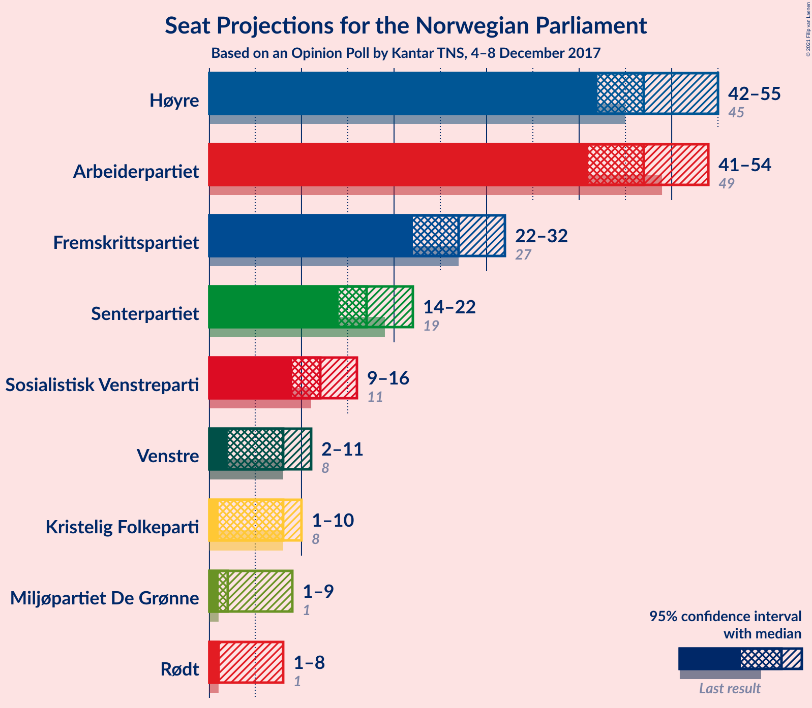
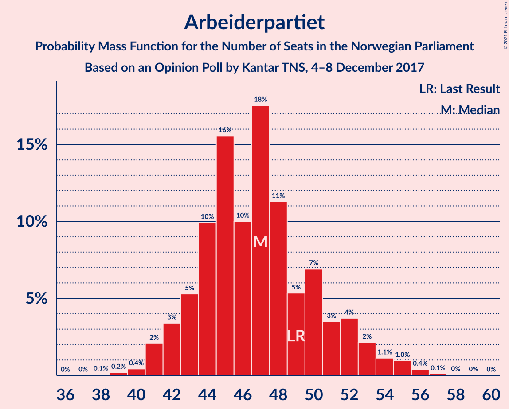
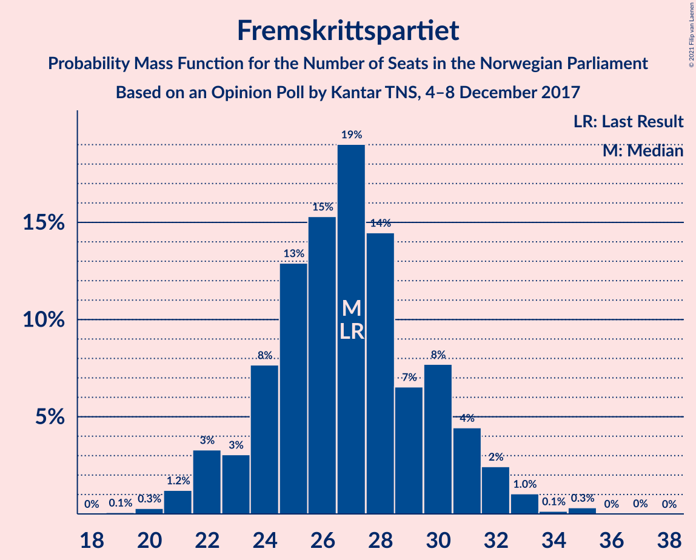
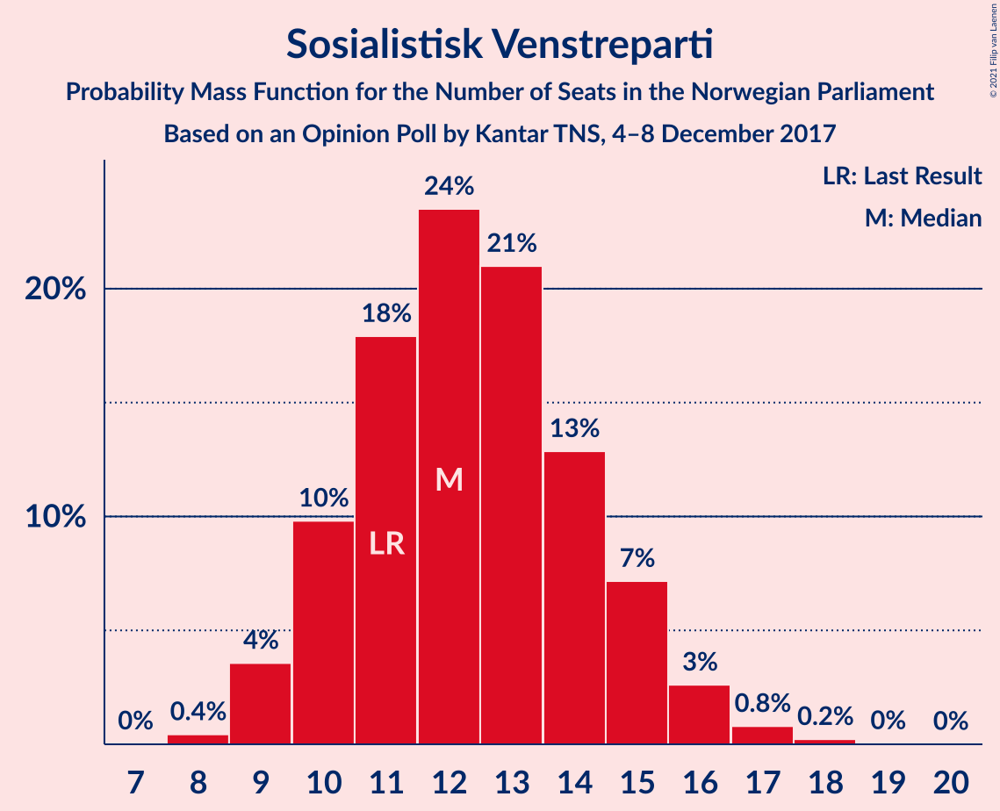
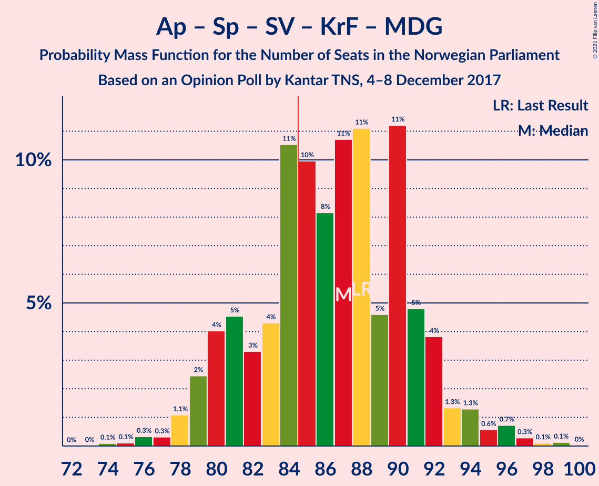
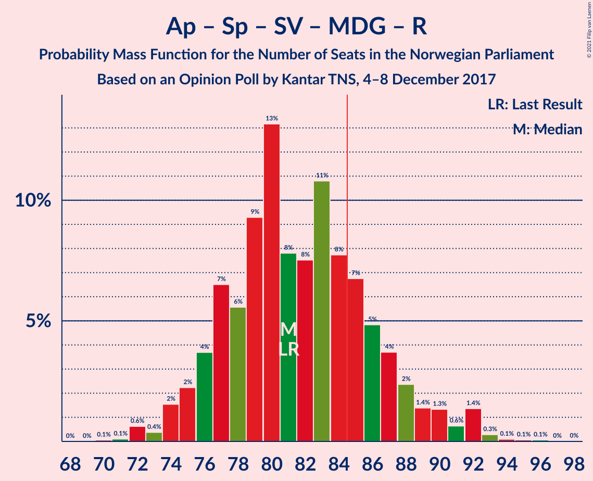
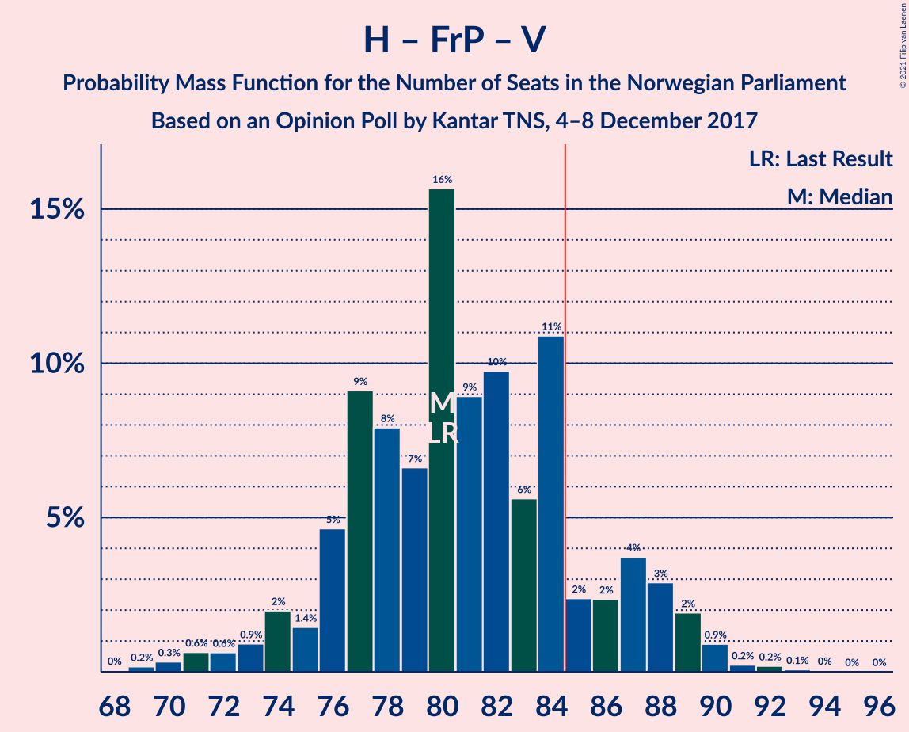
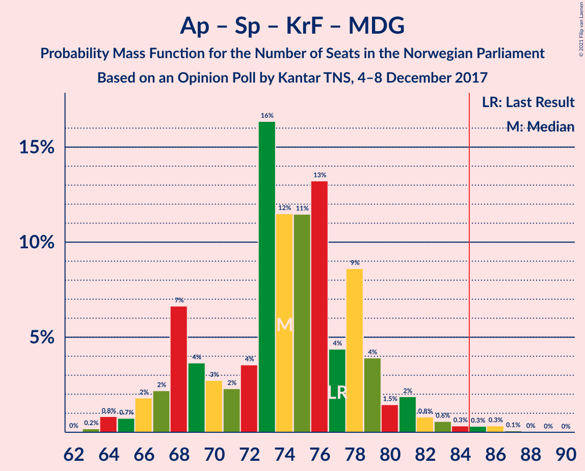

# Opinion Poll by Kantar TNS, 4–8 December 2017

<a href="#voting-intentions">Voting Intentions</a> | <a href="#seats">Seats</a> | <a href="#coalitions">Coalitions</a> | <a href="#technical-information">Technical Information</a>

## Voting Intentions

### Confidence Intervals

| Party | Last Result | Poll Result | 80% Confidence Interval | 90% Confidence Interval | 95% Confidence Interval | 99% Confidence Interval |
|:-----:|:-----------:|:-----------:|:-----------------------:|:-----------------------:|:-----------------------:|:-----------------------:|
| Høyre | 25.0% | 26.6% | 24.6–28.7% |24.1–29.3% |23.6–29.8% |22.7–30.8% |
| Arbeiderpartiet | 27.4% | 26.1% | 24.1–28.2% |23.6–28.8% |23.1–29.3% |22.2–30.3% |
| Fremskrittspartiet | 15.2% | 14.8% | 13.3–16.6% |12.9–17.1% |12.5–17.5% |11.8–18.4% |
| Senterpartiet | 10.3% | 9.7% | 8.4–11.2% |8.1–11.6% |7.8–12.0% |7.2–12.7% |
| Sosialistisk Venstreparti | 6.0% | 6.8% | 5.8–8.2% |5.5–8.5% |5.3–8.8% |4.8–9.5% |
| Venstre | 4.4% | 4.3% | 3.5–5.3% |3.2–5.7% |3.0–5.9% |2.7–6.5% |
| Kristelig Folkeparti | 4.2% | 4.1% | 3.3–5.2% |3.1–5.5% |2.9–5.8% |2.6–6.3% |
| Miljøpartiet De Grønne | 3.2% | 3.5% | 2.8–4.5% |2.6–4.8% |2.4–5.0% |2.1–5.5% |
| Rødt | 2.4% | 2.8% | 2.2–3.8% |2.0–4.0% |1.9–4.3% |1.6–4.8% |

*Note:* The poll result column reflects the actual value used in the calculations. Published results may vary slightly, and in addition be rounded to fewer digits.

## Seats

### Confidence Intervals

| Party | Last Result | Median | 80% Confidence Interval | 90% Confidence Interval | 95% Confidence Interval | 99% Confidence Interval |
|:-----:|:-----------:|:------:|:-----------------------:|:-----------------------:|:-----------------------:|:-----------------------:|
| <a href="#høyre">Høyre</a> | 45 | 47 | 44–52 |43–53 |42–55 |40–56 |
| <a href="#arbeiderpartiet">Arbeiderpartiet</a> | 49 | 47 | 43–51 |42–52 |41–54 |40–56 |
| <a href="#fremskrittspartiet">Fremskrittspartiet</a> | 27 | 27 | 24–30 |23–31 |22–32 |21–34 |
| <a href="#senterpartiet">Senterpartiet</a> | 19 | 17 | 15–20 |14–21 |14–22 |13–23 |
| <a href="#sosialistisk-venstreparti">Sosialistisk Venstreparti</a> | 11 | 12 | 10–15 |10–15 |9–16 |9–17 |
| <a href="#venstre">Venstre</a> | 8 | 8 | 2–10 |2–10 |2–11 |2–12 |
| <a href="#kristelig-folkeparti">Kristelig Folkeparti</a> | 8 | 8 | 3–9 |1–10 |1–10 |1–11 |
| <a href="#miljøpartiet-de-grønne">Miljøpartiet De Grønne</a> | 1 | 2 | 1–8 |1–9 |1–9 |1–10 |
| <a href="#rødt">Rødt</a> | 1 | 1 | 1–2 |1–6 |1–8 |1–8 |

### Høyre

*For a full overview of the results for this party, see the [Høyre](party-høyre.html) page.*

| Number of Seats | Probability | Accumulated | Special Marks |
|:---------------:|:-----------:|:-----------:|:-------------:|
| 38 | 0.1% | 100% |  |
| 39 | 0.3% | 99.9% |  |
| 40 | 0.5% | 99.6% |  |
| 41 | 1.0% | 99.1% |  |
| 42 | 3% | 98% |  |
| 43 | 3% | 95% |  |
| 44 | 7% | 92% |  |
| 45 | 20% | 85% | Last Result |
| 46 | 5% | 66% |  |
| 47 | 11% | 61% | Median |
| 48 | 11% | 50% |  |
| 49 | 7% | 38% |  |
| 50 | 11% | 32% |  |
| 51 | 10% | 20% |  |
| 52 | 4% | 11% |  |
| 53 | 2% | 6% |  |
| 54 | 0.9% | 4% |  |
| 55 | 2% | 3% |  |
| 56 | 0.5% | 0.9% |  |
| 57 | 0.3% | 0.4% |  |
| 58 | 0.1% | 0.1% |  |
| 59 | 0.1% | 0.1% |  |
| 60 | 0% | 0% |  |

### Arbeiderpartiet

*For a full overview of the results for this party, see the [Arbeiderpartiet](party-arbeiderpartiet.html) page.*

| Number of Seats | Probability | Accumulated | Special Marks |
|:---------------:|:-----------:|:-----------:|:-------------:|
| 38 | 0.1% | 100% |  |
| 39 | 0.2% | 99.9% |  |
| 40 | 0.4% | 99.7% |  |
| 41 | 2% | 99.3% |  |
| 42 | 3% | 97% |  |
| 43 | 5% | 94% |  |
| 44 | 10% | 89% |  |
| 45 | 16% | 79% |  |
| 46 | 10% | 63% |  |
| 47 | 18% | 53% | Median |
| 48 | 11% | 36% |  |
| 49 | 5% | 24% | Last Result |
| 50 | 7% | 19% |  |
| 51 | 3% | 12% |  |
| 52 | 4% | 9% |  |
| 53 | 2% | 5% |  |
| 54 | 1.1% | 3% |  |
| 55 | 1.0% | 2% |  |
| 56 | 0.4% | 0.6% |  |
| 57 | 0.1% | 0.2% |  |
| 58 | 0% | 0.1% |  |
| 59 | 0% | 0% |  |

### Fremskrittspartiet

*For a full overview of the results for this party, see the [Fremskrittspartiet](party-fremskrittspartiet.html) page.*

| Number of Seats | Probability | Accumulated | Special Marks |
|:---------------:|:-----------:|:-----------:|:-------------:|
| 19 | 0.1% | 100% |  |
| 20 | 0.3% | 99.9% |  |
| 21 | 1.2% | 99.6% |  |
| 22 | 3% | 98% |  |
| 23 | 3% | 95% |  |
| 24 | 8% | 92% |  |
| 25 | 13% | 84% |  |
| 26 | 15% | 71% |  |
| 27 | 19% | 56% | Last Result, Median |
| 28 | 14% | 37% |  |
| 29 | 7% | 23% |  |
| 30 | 8% | 16% |  |
| 31 | 4% | 8% |  |
| 32 | 2% | 4% |  |
| 33 | 1.0% | 2% |  |
| 34 | 0.1% | 0.5% |  |
| 35 | 0.3% | 0.4% |  |
| 36 | 0% | 0.1% |  |
| 37 | 0% | 0% |  |

### Senterpartiet

*For a full overview of the results for this party, see the [Senterpartiet](party-senterpartiet.html) page.*

| Number of Seats | Probability | Accumulated | Special Marks |
|:---------------:|:-----------:|:-----------:|:-------------:|
| 11 | 0.1% | 100% |  |
| 12 | 0.3% | 99.9% |  |
| 13 | 2% | 99.6% |  |
| 14 | 4% | 98% |  |
| 15 | 9% | 94% |  |
| 16 | 21% | 85% |  |
| 17 | 17% | 64% | Median |
| 18 | 12% | 47% |  |
| 19 | 19% | 35% | Last Result |
| 20 | 9% | 16% |  |
| 21 | 3% | 7% |  |
| 22 | 3% | 4% |  |
| 23 | 0.7% | 1.0% |  |
| 24 | 0.1% | 0.3% |  |
| 25 | 0.1% | 0.1% |  |
| 26 | 0% | 0% |  |

### Sosialistisk Venstreparti

*For a full overview of the results for this party, see the [Sosialistisk Venstreparti](party-sosialistiskvenstreparti.html) page.*

| Number of Seats | Probability | Accumulated | Special Marks |
|:---------------:|:-----------:|:-----------:|:-------------:|
| 8 | 0.4% | 100% |  |
| 9 | 4% | 99.5% |  |
| 10 | 10% | 96% |  |
| 11 | 18% | 86% | Last Result |
| 12 | 24% | 68% | Median |
| 13 | 21% | 45% |  |
| 14 | 13% | 24% |  |
| 15 | 7% | 11% |  |
| 16 | 3% | 4% |  |
| 17 | 0.8% | 1.1% |  |
| 18 | 0.2% | 0.3% |  |
| 19 | 0% | 0.1% |  |
| 20 | 0% | 0% |  |

### Venstre

*For a full overview of the results for this party, see the [Venstre](party-venstre.html) page.*

| Number of Seats | Probability | Accumulated | Special Marks |
|:---------------:|:-----------:|:-----------:|:-------------:|
| 1 | 0.1% | 100% |  |
| 2 | 31% | 99.9% |  |
| 3 | 2% | 69% |  |
| 4 | 0% | 67% |  |
| 5 | 0% | 67% |  |
| 6 | 0% | 67% |  |
| 7 | 11% | 67% |  |
| 8 | 25% | 56% | Last Result, Median |
| 9 | 19% | 30% |  |
| 10 | 7% | 11% |  |
| 11 | 3% | 4% |  |
| 12 | 0.4% | 0.5% |  |
| 13 | 0.1% | 0.1% |  |
| 14 | 0% | 0% |  |

### Kristelig Folkeparti

*For a full overview of the results for this party, see the [Kristelig Folkeparti](party-kristeligfolkeparti.html) page.*

| Number of Seats | Probability | Accumulated | Special Marks |
|:---------------:|:-----------:|:-----------:|:-------------:|
| 0 | 0.2% | 100% |  |
| 1 | 5% | 99.8% |  |
| 2 | 3% | 95% |  |
| 3 | 24% | 92% |  |
| 4 | 0% | 68% |  |
| 5 | 0% | 68% |  |
| 6 | 0% | 68% |  |
| 7 | 13% | 68% |  |
| 8 | 26% | 54% | Last Result, Median |
| 9 | 22% | 28% |  |
| 10 | 6% | 7% |  |
| 11 | 0.9% | 1.2% |  |
| 12 | 0.2% | 0.3% |  |
| 13 | 0% | 0.1% |  |
| 14 | 0% | 0% |  |

### Miljøpartiet De Grønne

*For a full overview of the results for this party, see the [Miljøpartiet De Grønne](party-miljøpartietdegrønne.html) page.*

| Number of Seats | Probability | Accumulated | Special Marks |
|:---------------:|:-----------:|:-----------:|:-------------:|
| 0 | 0.2% | 100% |  |
| 1 | 25% | 99.8% | Last Result |
| 2 | 48% | 75% | Median |
| 3 | 1.2% | 27% |  |
| 4 | 2% | 26% |  |
| 5 | 0% | 24% |  |
| 6 | 0.5% | 24% |  |
| 7 | 8% | 24% |  |
| 8 | 9% | 16% |  |
| 9 | 5% | 7% |  |
| 10 | 2% | 2% |  |
| 11 | 0.1% | 0.1% |  |
| 12 | 0% | 0% |  |

### Rødt

*For a full overview of the results for this party, see the [Rødt](party-rødt.html) page.*

| Number of Seats | Probability | Accumulated | Special Marks |
|:---------------:|:-----------:|:-----------:|:-------------:|
| 1 | 53% | 100% | Last Result, Median |
| 2 | 42% | 47% |  |
| 3 | 0% | 5% |  |
| 4 | 0% | 5% |  |
| 5 | 0% | 5% |  |
| 6 | 0.4% | 5% |  |
| 7 | 2% | 5% |  |
| 8 | 2% | 3% |  |
| 9 | 0.3% | 0.4% |  |
| 10 | 0.1% | 0.1% |  |
| 11 | 0% | 0% |  |

## Coalitions

### Confidence Intervals

| Coalition | Last Result | Median | Majority? | 80% Confidence Interval | 90% Confidence Interval | 95% Confidence Interval | 99% Confidence Interval |
|:---------:|:-----------:|:------:|:---------:|:-----------------------:|:-----------------------:|:-----------------------:|:-----------------------:|
| Høyre – Fremskrittspartiet – Senterpartiet – Venstre – Kristelig Folkeparti | 107 | 105 | 100% | 100–110 | 98–112 | 97–112 | 94–114 |
| Høyre – Fremskrittspartiet – Venstre – Kristelig Folkeparti – Miljøpartiet De Grønne | 89 | 91 | 93% | 85–95 | 84–96 | 83–97 | 79–99 |
| Høyre – Fremskrittspartiet – Venstre – Kristelig Folkeparti | 88 | 88 | 77% | 82–92 | 80–93 | 78–95 | 76–97 |
| Arbeiderpartiet – Senterpartiet – Sosialistisk Venstreparti – Kristelig Folkeparti – Miljøpartiet De Grønne | 88 | 87 | 69% | 81–91 | 80–92 | 79–94 | 76–97 |
| Arbeiderpartiet – Senterpartiet – Sosialistisk Venstreparti – Miljøpartiet De Grønne – Rødt | 81 | 81 | 23% | 77–87 | 76–89 | 74–91 | 72–93 |
| Arbeiderpartiet – Senterpartiet – Sosialistisk Venstreparti – Miljøpartiet De Grønne | 80 | 80 | 12% | 75–85 | 74–87 | 73–89 | 71–91 |
| Høyre – Fremskrittspartiet – Venstre | 80 | 80 | 15% | 76–86 | 75–88 | 73–89 | 70–91 |
| Arbeiderpartiet – Senterpartiet – Sosialistisk Venstreparti – Rødt | 80 | 78 | 7% | 74–84 | 73–85 | 72–86 | 70–90 |
| Arbeiderpartiet – Senterpartiet – Sosialistisk Venstreparti | 79 | 76 | 2% | 72–81 | 71–83 | 70–84 | 68–89 |
| Høyre – Fremskrittspartiet | 72 | 74 | 1.5% | 70–80 | 68–81 | 68–83 | 65–85 |
| Arbeiderpartiet – Senterpartiet – Kristelig Folkeparti – Miljøpartiet De Grønne | 77 | 74 | 0.8% | 68–78 | 67–80 | 66–82 | 64–85 |
| Arbeiderpartiet – Senterpartiet – Kristelig Folkeparti | 76 | 71 | 0% | 66–75 | 64–76 | 63–78 | 60–81 |
| Arbeiderpartiet – Senterpartiet | 68 | 64 | 0% | 60–69 | 59–70 | 59–72 | 57–74 |
| Høyre – Venstre – Kristelig Folkeparti | 61 | 61 | 0% | 55–66 | 53–67 | 52–68 | 50–70 |
| Arbeiderpartiet – Sosialistisk Venstreparti | 60 | 59 | 0% | 55–64 | 54–65 | 53–67 | 51–70 |
| Senterpartiet – Venstre – Kristelig Folkeparti | 35 | 31 | 0% | 24–36 | 22–37 | 21–38 | 19–39 |

### Høyre – Fremskrittspartiet – Senterpartiet – Venstre – Kristelig Folkeparti

| Number of Seats | Probability | Accumulated | Special Marks |
|:---------------:|:-----------:|:-----------:|:-------------:|
| 91 | 0.1% | 100% |  |
| 92 | 0.2% | 99.9% |  |
| 93 | 0.2% | 99.7% |  |
| 94 | 0.6% | 99.5% |  |
| 95 | 0.6% | 98.9% |  |
| 96 | 0.8% | 98% |  |
| 97 | 1.5% | 98% |  |
| 98 | 2% | 96% |  |
| 99 | 3% | 94% |  |
| 100 | 4% | 91% |  |
| 101 | 6% | 87% |  |
| 102 | 9% | 81% |  |
| 103 | 10% | 71% |  |
| 104 | 7% | 62% |  |
| 105 | 8% | 54% |  |
| 106 | 10% | 46% |  |
| 107 | 5% | 36% | Last Result, Median |
| 108 | 17% | 31% |  |
| 109 | 3% | 14% |  |
| 110 | 4% | 11% |  |
| 111 | 1.2% | 7% |  |
| 112 | 4% | 6% |  |
| 113 | 1.0% | 2% |  |
| 114 | 0.5% | 0.8% |  |
| 115 | 0.2% | 0.3% |  |
| 116 | 0% | 0.1% |  |
| 117 | 0% | 0% |  |

### Høyre – Fremskrittspartiet – Venstre – Kristelig Folkeparti – Miljøpartiet De Grønne

| Number of Seats | Probability | Accumulated | Special Marks |
|:---------------:|:-----------:|:-----------:|:-------------:|
| 77 | 0% | 100% |  |
| 78 | 0.3% | 99.9% |  |
| 79 | 0.5% | 99.7% |  |
| 80 | 0.2% | 99.2% |  |
| 81 | 0.5% | 99.0% |  |
| 82 | 0.8% | 98% |  |
| 83 | 2% | 98% |  |
| 84 | 3% | 96% |  |
| 85 | 4% | 93% | Majority |
| 86 | 4% | 88% |  |
| 87 | 4% | 85% |  |
| 88 | 7% | 80% |  |
| 89 | 6% | 73% | Last Result |
| 90 | 11% | 67% |  |
| 91 | 16% | 56% |  |
| 92 | 10% | 40% | Median |
| 93 | 6% | 30% |  |
| 94 | 11% | 24% |  |
| 95 | 4% | 13% |  |
| 96 | 5% | 9% |  |
| 97 | 3% | 4% |  |
| 98 | 1.2% | 2% |  |
| 99 | 0.5% | 0.8% |  |
| 100 | 0.2% | 0.3% |  |
| 101 | 0.1% | 0.1% |  |
| 102 | 0% | 0% |  |

### Høyre – Fremskrittspartiet – Venstre – Kristelig Folkeparti

| Number of Seats | Probability | Accumulated | Special Marks |
|:---------------:|:-----------:|:-----------:|:-------------:|
| 73 | 0.1% | 100% |  |
| 74 | 0.1% | 99.9% |  |
| 75 | 0.1% | 99.8% |  |
| 76 | 0.3% | 99.7% |  |
| 77 | 1.4% | 99.5% |  |
| 78 | 0.6% | 98% |  |
| 79 | 1.3% | 97% |  |
| 80 | 1.4% | 96% |  |
| 81 | 2% | 95% |  |
| 82 | 4% | 92% |  |
| 83 | 5% | 89% |  |
| 84 | 7% | 84% |  |
| 85 | 8% | 77% | Majority |
| 86 | 11% | 69% |  |
| 87 | 8% | 59% |  |
| 88 | 8% | 51% | Last Result |
| 89 | 13% | 43% |  |
| 90 | 9% | 30% | Median |
| 91 | 6% | 21% |  |
| 92 | 7% | 15% |  |
| 93 | 4% | 9% |  |
| 94 | 2% | 5% |  |
| 95 | 2% | 3% |  |
| 96 | 0.4% | 1.2% |  |
| 97 | 0.6% | 0.8% |  |
| 98 | 0.1% | 0.2% |  |
| 99 | 0.1% | 0.1% |  |
| 100 | 0% | 0% |  |

### Arbeiderpartiet – Senterpartiet – Sosialistisk Venstreparti – Kristelig Folkeparti – Miljøpartiet De Grønne

| Number of Seats | Probability | Accumulated | Special Marks |
|:---------------:|:-----------:|:-----------:|:-------------:|
| 74 | 0.1% | 100% |  |
| 75 | 0.1% | 99.9% |  |
| 76 | 0.3% | 99.8% |  |
| 77 | 0.3% | 99.4% |  |
| 78 | 1.1% | 99.1% |  |
| 79 | 2% | 98% |  |
| 80 | 4% | 96% |  |
| 81 | 5% | 92% |  |
| 82 | 3% | 87% |  |
| 83 | 4% | 84% |  |
| 84 | 11% | 79% |  |
| 85 | 10% | 69% | Majority |
| 86 | 8% | 59% | Median |
| 87 | 11% | 51% |  |
| 88 | 11% | 40% | Last Result |
| 89 | 5% | 29% |  |
| 90 | 11% | 24% |  |
| 91 | 5% | 13% |  |
| 92 | 4% | 8% |  |
| 93 | 1.3% | 4% |  |
| 94 | 1.3% | 3% |  |
| 95 | 0.6% | 2% |  |
| 96 | 0.7% | 1.3% |  |
| 97 | 0.3% | 0.6% |  |
| 98 | 0.1% | 0.3% |  |
| 99 | 0.1% | 0.2% |  |
| 100 | 0% | 0% |  |

### Arbeiderpartiet – Senterpartiet – Sosialistisk Venstreparti – Miljøpartiet De Grønne – Rødt

| Number of Seats | Probability | Accumulated | Special Marks |
|:---------------:|:-----------:|:-----------:|:-------------:|
| 70 | 0.1% | 100% |  |
| 71 | 0.1% | 99.9% |  |
| 72 | 0.6% | 99.8% |  |
| 73 | 0.4% | 99.2% |  |
| 74 | 2% | 98.8% |  |
| 75 | 2% | 97% |  |
| 76 | 4% | 95% |  |
| 77 | 7% | 91% |  |
| 78 | 6% | 85% |  |
| 79 | 9% | 79% | Median |
| 80 | 13% | 70% |  |
| 81 | 8% | 57% | Last Result |
| 82 | 8% | 49% |  |
| 83 | 11% | 41% |  |
| 84 | 8% | 31% |  |
| 85 | 7% | 23% | Majority |
| 86 | 5% | 16% |  |
| 87 | 4% | 11% |  |
| 88 | 2% | 8% |  |
| 89 | 1.4% | 5% |  |
| 90 | 1.3% | 4% |  |
| 91 | 0.6% | 3% |  |
| 92 | 1.4% | 2% |  |
| 93 | 0.3% | 0.5% |  |
| 94 | 0.1% | 0.3% |  |
| 95 | 0.1% | 0.2% |  |
| 96 | 0.1% | 0.1% |  |
| 97 | 0% | 0% |  |

### Arbeiderpartiet – Senterpartiet – Sosialistisk Venstreparti – Miljøpartiet De Grønne

| Number of Seats | Probability | Accumulated | Special Marks |
|:---------------:|:-----------:|:-----------:|:-------------:|
| 68 | 0% | 100% |  |
| 69 | 0.1% | 99.9% |  |
| 70 | 0.2% | 99.8% |  |
| 71 | 0.8% | 99.7% |  |
| 72 | 0.7% | 98.9% |  |
| 73 | 2% | 98% |  |
| 74 | 2% | 96% |  |
| 75 | 5% | 94% |  |
| 76 | 8% | 89% |  |
| 77 | 10% | 81% |  |
| 78 | 13% | 71% | Median |
| 79 | 8% | 59% |  |
| 80 | 8% | 51% | Last Result |
| 81 | 9% | 43% |  |
| 82 | 9% | 34% |  |
| 83 | 9% | 25% |  |
| 84 | 4% | 16% |  |
| 85 | 5% | 12% | Majority |
| 86 | 2% | 8% |  |
| 87 | 1.1% | 5% |  |
| 88 | 2% | 4% |  |
| 89 | 1.0% | 3% |  |
| 90 | 0.4% | 2% |  |
| 91 | 1.0% | 1.3% |  |
| 92 | 0.1% | 0.2% |  |
| 93 | 0% | 0.1% |  |
| 94 | 0% | 0.1% |  |
| 95 | 0% | 0% |  |

### Høyre – Fremskrittspartiet – Venstre

| Number of Seats | Probability | Accumulated | Special Marks |
|:---------------:|:-----------:|:-----------:|:-------------:|
| 68 | 0% | 100% |  |
| 69 | 0.2% | 99.9% |  |
| 70 | 0.3% | 99.8% |  |
| 71 | 0.6% | 99.4% |  |
| 72 | 0.6% | 98.8% |  |
| 73 | 0.9% | 98% |  |
| 74 | 2% | 97% |  |
| 75 | 1.4% | 95% |  |
| 76 | 5% | 94% |  |
| 77 | 9% | 89% |  |
| 78 | 8% | 80% |  |
| 79 | 7% | 72% |  |
| 80 | 16% | 66% | Last Result |
| 81 | 9% | 50% |  |
| 82 | 10% | 41% | Median |
| 83 | 6% | 31% |  |
| 84 | 11% | 26% |  |
| 85 | 2% | 15% | Majority |
| 86 | 2% | 12% |  |
| 87 | 4% | 10% |  |
| 88 | 3% | 6% |  |
| 89 | 2% | 3% |  |
| 90 | 0.9% | 1.4% |  |
| 91 | 0.2% | 0.5% |  |
| 92 | 0.2% | 0.3% |  |
| 93 | 0.1% | 0.1% |  |
| 94 | 0% | 0.1% |  |
| 95 | 0% | 0% |  |

### Arbeiderpartiet – Senterpartiet – Sosialistisk Venstreparti – Rødt

| Number of Seats | Probability | Accumulated | Special Marks |
|:---------------:|:-----------:|:-----------:|:-------------:|
| 68 | 0.1% | 100% |  |
| 69 | 0.2% | 99.9% |  |
| 70 | 0.5% | 99.7% |  |
| 71 | 1.2% | 99.2% |  |
| 72 | 3% | 98% |  |
| 73 | 5% | 96% |  |
| 74 | 4% | 91% |  |
| 75 | 11% | 87% |  |
| 76 | 6% | 76% |  |
| 77 | 10% | 70% | Median |
| 78 | 16% | 60% |  |
| 79 | 11% | 44% |  |
| 80 | 6% | 33% | Last Result |
| 81 | 7% | 27% |  |
| 82 | 4% | 20% |  |
| 83 | 4% | 15% |  |
| 84 | 4% | 12% |  |
| 85 | 3% | 7% | Majority |
| 86 | 2% | 4% |  |
| 87 | 0.8% | 2% |  |
| 88 | 0.5% | 2% |  |
| 89 | 0.2% | 1.0% |  |
| 90 | 0.5% | 0.8% |  |
| 91 | 0.3% | 0.3% |  |
| 92 | 0% | 0.1% |  |
| 93 | 0% | 0% |  |

### Arbeiderpartiet – Senterpartiet – Sosialistisk Venstreparti

| Number of Seats | Probability | Accumulated | Special Marks |
|:---------------:|:-----------:|:-----------:|:-------------:|
| 66 | 0.1% | 100% |  |
| 67 | 0.1% | 99.9% |  |
| 68 | 0.6% | 99.8% |  |
| 69 | 0.6% | 99.2% |  |
| 70 | 1.4% | 98.7% |  |
| 71 | 4% | 97% |  |
| 72 | 5% | 93% |  |
| 73 | 5% | 88% |  |
| 74 | 12% | 83% |  |
| 75 | 8% | 71% |  |
| 76 | 18% | 63% | Median |
| 77 | 9% | 45% |  |
| 78 | 8% | 36% |  |
| 79 | 7% | 28% | Last Result |
| 80 | 5% | 20% |  |
| 81 | 5% | 15% |  |
| 82 | 3% | 10% |  |
| 83 | 3% | 7% |  |
| 84 | 2% | 4% |  |
| 85 | 0.6% | 2% | Majority |
| 86 | 0.4% | 1.5% |  |
| 87 | 0.3% | 1.1% |  |
| 88 | 0.1% | 0.8% |  |
| 89 | 0.6% | 0.7% |  |
| 90 | 0% | 0.1% |  |
| 91 | 0% | 0% |  |

### Høyre – Fremskrittspartiet

| Number of Seats | Probability | Accumulated | Special Marks |
|:---------------:|:-----------:|:-----------:|:-------------:|
| 62 | 0.1% | 100% |  |
| 63 | 0.1% | 99.9% |  |
| 64 | 0.1% | 99.8% |  |
| 65 | 0.4% | 99.7% |  |
| 66 | 0.5% | 99.3% |  |
| 67 | 1.0% | 98.8% |  |
| 68 | 3% | 98% |  |
| 69 | 3% | 95% |  |
| 70 | 8% | 92% |  |
| 71 | 7% | 84% |  |
| 72 | 12% | 77% | Last Result |
| 73 | 9% | 65% |  |
| 74 | 8% | 56% | Median |
| 75 | 8% | 48% |  |
| 76 | 9% | 40% |  |
| 77 | 8% | 31% |  |
| 78 | 8% | 23% |  |
| 79 | 3% | 15% |  |
| 80 | 4% | 12% |  |
| 81 | 4% | 7% |  |
| 82 | 1.3% | 4% |  |
| 83 | 0.8% | 3% |  |
| 84 | 0.3% | 2% |  |
| 85 | 1.1% | 1.5% | Majority |
| 86 | 0.2% | 0.3% |  |
| 87 | 0.1% | 0.1% |  |
| 88 | 0% | 0% |  |

### Arbeiderpartiet – Senterpartiet – Kristelig Folkeparti – Miljøpartiet De Grønne

| Number of Seats | Probability | Accumulated | Special Marks |
|:---------------:|:-----------:|:-----------:|:-------------:|
| 62 | 0% | 100% |  |
| 63 | 0.2% | 99.9% |  |
| 64 | 0.8% | 99.7% |  |
| 65 | 0.7% | 98.9% |  |
| 66 | 2% | 98% |  |
| 67 | 2% | 96% |  |
| 68 | 7% | 94% |  |
| 69 | 4% | 88% |  |
| 70 | 3% | 84% |  |
| 71 | 2% | 81% |  |
| 72 | 4% | 79% |  |
| 73 | 16% | 75% |  |
| 74 | 12% | 59% | Median |
| 75 | 11% | 47% |  |
| 76 | 13% | 36% |  |
| 77 | 4% | 23% | Last Result |
| 78 | 9% | 18% |  |
| 79 | 4% | 10% |  |
| 80 | 1.5% | 6% |  |
| 81 | 2% | 4% |  |
| 82 | 0.8% | 3% |  |
| 83 | 0.6% | 2% |  |
| 84 | 0.3% | 1.1% |  |
| 85 | 0.3% | 0.8% | Majority |
| 86 | 0.3% | 0.5% |  |
| 87 | 0.1% | 0.1% |  |
| 88 | 0% | 0.1% |  |
| 89 | 0% | 0% |  |

### Arbeiderpartiet – Senterpartiet – Kristelig Folkeparti

| Number of Seats | Probability | Accumulated | Special Marks |
|:---------------:|:-----------:|:-----------:|:-------------:|
| 59 | 0% | 100% |  |
| 60 | 0.4% | 99.9% |  |
| 61 | 0.4% | 99.5% |  |
| 62 | 1.1% | 99.1% |  |
| 63 | 0.9% | 98% |  |
| 64 | 3% | 97% |  |
| 65 | 3% | 94% |  |
| 66 | 4% | 92% |  |
| 67 | 8% | 87% |  |
| 68 | 7% | 80% |  |
| 69 | 6% | 72% |  |
| 70 | 5% | 67% |  |
| 71 | 18% | 62% |  |
| 72 | 8% | 44% | Median |
| 73 | 14% | 36% |  |
| 74 | 10% | 22% |  |
| 75 | 4% | 12% |  |
| 76 | 3% | 8% | Last Result |
| 77 | 2% | 5% |  |
| 78 | 1.0% | 3% |  |
| 79 | 0.4% | 2% |  |
| 80 | 0.7% | 1.3% |  |
| 81 | 0.2% | 0.5% |  |
| 82 | 0.1% | 0.3% |  |
| 83 | 0.1% | 0.2% |  |
| 84 | 0% | 0% |  |

### Arbeiderpartiet – Senterpartiet

| Number of Seats | Probability | Accumulated | Special Marks |
|:---------------:|:-----------:|:-----------:|:-------------:|
| 55 | 0.1% | 100% |  |
| 56 | 0.3% | 99.9% |  |
| 57 | 0.7% | 99.6% |  |
| 58 | 1.3% | 98.8% |  |
| 59 | 4% | 98% |  |
| 60 | 5% | 94% |  |
| 61 | 8% | 89% |  |
| 62 | 9% | 81% |  |
| 63 | 14% | 73% |  |
| 64 | 16% | 58% | Median |
| 65 | 12% | 42% |  |
| 66 | 6% | 30% |  |
| 67 | 7% | 24% |  |
| 68 | 4% | 16% | Last Result |
| 69 | 4% | 12% |  |
| 70 | 5% | 9% |  |
| 71 | 1.2% | 4% |  |
| 72 | 0.8% | 3% |  |
| 73 | 0.9% | 2% |  |
| 74 | 0.7% | 1.0% |  |
| 75 | 0.1% | 0.3% |  |
| 76 | 0.1% | 0.1% |  |
| 77 | 0% | 0.1% |  |
| 78 | 0% | 0% |  |

### Høyre – Venstre – Kristelig Folkeparti

| Number of Seats | Probability | Accumulated | Special Marks |
|:---------------:|:-----------:|:-----------:|:-------------:|
| 46 | 0% | 100% |  |
| 47 | 0.1% | 99.9% |  |
| 48 | 0.1% | 99.9% |  |
| 49 | 0.2% | 99.8% |  |
| 50 | 0.6% | 99.6% |  |
| 51 | 1.4% | 99.0% |  |
| 52 | 0.9% | 98% |  |
| 53 | 2% | 97% |  |
| 54 | 3% | 95% |  |
| 55 | 4% | 91% |  |
| 56 | 6% | 87% |  |
| 57 | 5% | 82% |  |
| 58 | 8% | 77% |  |
| 59 | 8% | 69% |  |
| 60 | 8% | 61% |  |
| 61 | 11% | 53% | Last Result |
| 62 | 12% | 42% |  |
| 63 | 8% | 30% | Median |
| 64 | 3% | 22% |  |
| 65 | 7% | 19% |  |
| 66 | 6% | 12% |  |
| 67 | 3% | 7% |  |
| 68 | 3% | 4% |  |
| 69 | 0.5% | 1.2% |  |
| 70 | 0.4% | 0.8% |  |
| 71 | 0.2% | 0.3% |  |
| 72 | 0.1% | 0.1% |  |
| 73 | 0% | 0% |  |

### Arbeiderpartiet – Sosialistisk Venstreparti

| Number of Seats | Probability | Accumulated | Special Marks |
|:---------------:|:-----------:|:-----------:|:-------------:|
| 49 | 0.1% | 100% |  |
| 50 | 0.1% | 99.9% |  |
| 51 | 0.5% | 99.8% |  |
| 52 | 0.6% | 99.3% |  |
| 53 | 2% | 98.7% |  |
| 54 | 4% | 97% |  |
| 55 | 7% | 93% |  |
| 56 | 8% | 86% |  |
| 57 | 12% | 78% |  |
| 58 | 13% | 66% |  |
| 59 | 10% | 53% | Median |
| 60 | 9% | 42% | Last Result |
| 61 | 10% | 33% |  |
| 62 | 6% | 24% |  |
| 63 | 5% | 17% |  |
| 64 | 5% | 12% |  |
| 65 | 3% | 7% |  |
| 66 | 1.1% | 4% |  |
| 67 | 1.5% | 3% |  |
| 68 | 0.7% | 1.5% |  |
| 69 | 0.2% | 0.8% |  |
| 70 | 0.4% | 0.6% |  |
| 71 | 0.2% | 0.2% |  |
| 72 | 0% | 0% |  |

### Senterpartiet – Venstre – Kristelig Folkeparti

| Number of Seats | Probability | Accumulated | Special Marks |
|:---------------:|:-----------:|:-----------:|:-------------:|
| 18 | 0.4% | 100% |  |
| 19 | 0.1% | 99.6% |  |
| 20 | 1.0% | 99.5% |  |
| 21 | 1.2% | 98.5% |  |
| 22 | 3% | 97% |  |
| 23 | 2% | 94% |  |
| 24 | 3% | 92% |  |
| 25 | 3% | 89% |  |
| 26 | 6% | 86% |  |
| 27 | 9% | 80% |  |
| 28 | 7% | 71% |  |
| 29 | 6% | 64% |  |
| 30 | 7% | 57% |  |
| 31 | 10% | 50% |  |
| 32 | 6% | 40% |  |
| 33 | 5% | 35% | Median |
| 34 | 7% | 30% |  |
| 35 | 8% | 23% | Last Result |
| 36 | 6% | 15% |  |
| 37 | 6% | 9% |  |
| 38 | 2% | 3% |  |
| 39 | 0.5% | 0.8% |  |
| 40 | 0.2% | 0.3% |  |
| 41 | 0% | 0.1% |  |
| 42 | 0% | 0% |  |

## Technical Information

### Opinion Poll

+ **Polling firm:** Kantar TNS
+ **Commissioner(s):** —
+ **Fieldwork period:** 4–8 December 2017

### Calculations

+ **Sample size:** 775
+ **Simulations done:** 1,048,576
+ **Error estimate:** 2.62%

