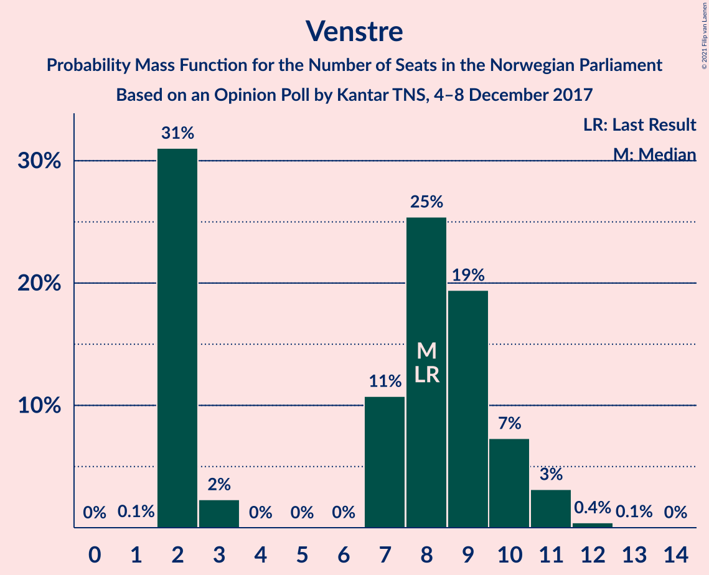
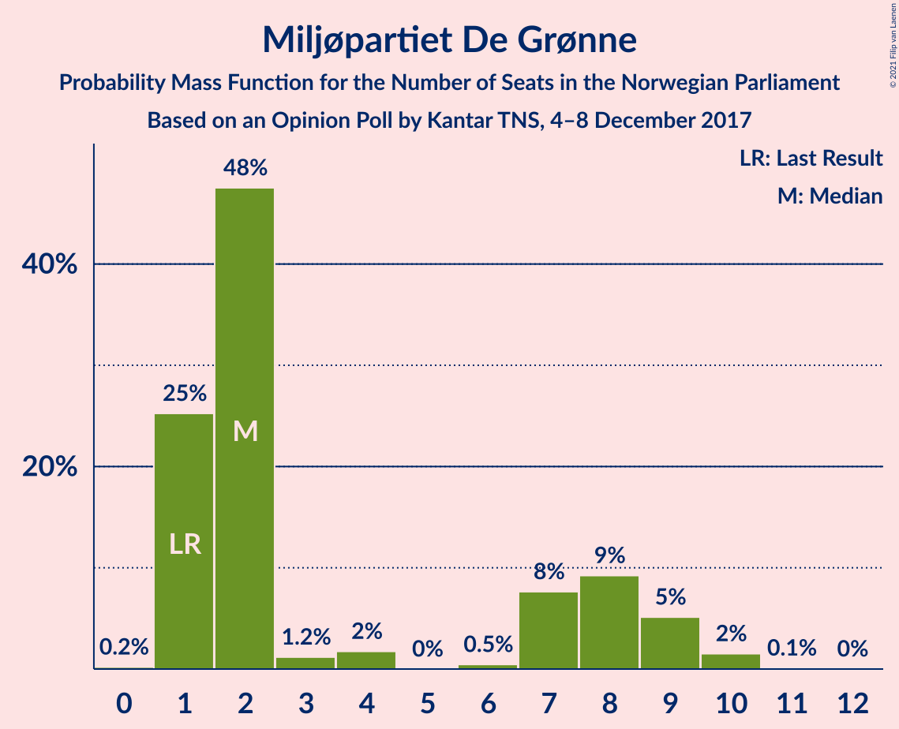
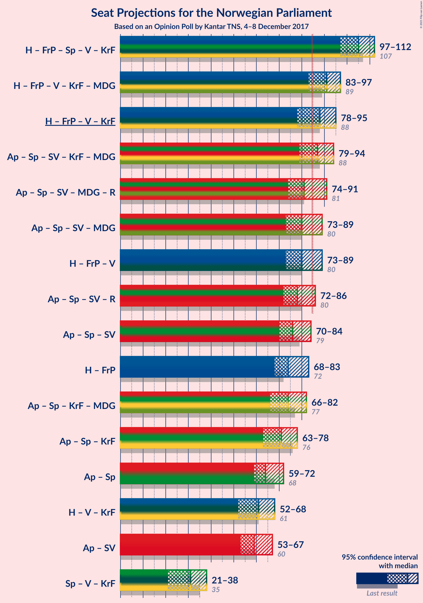
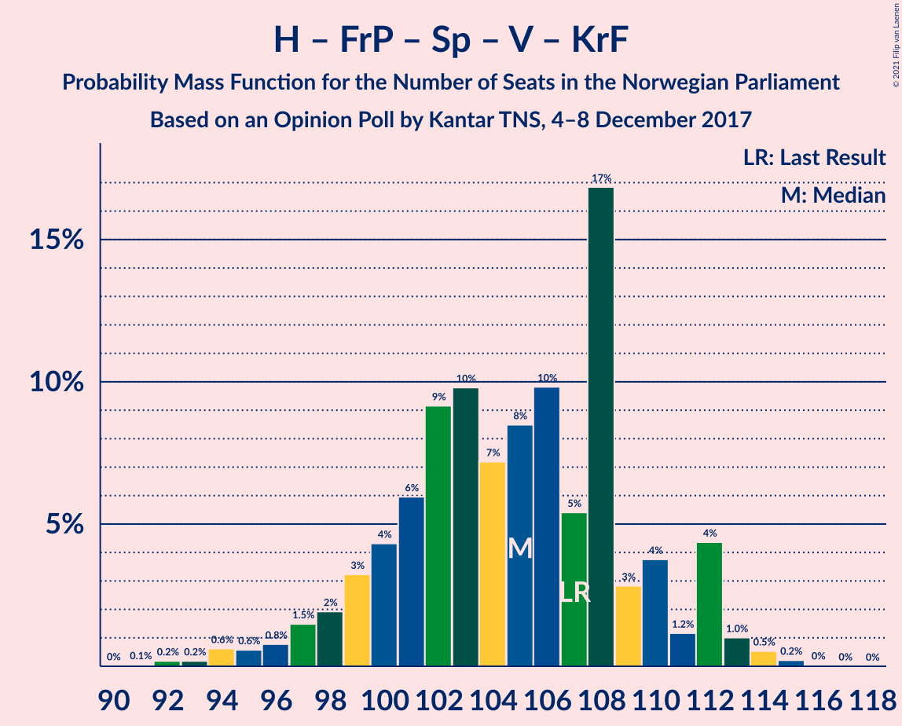
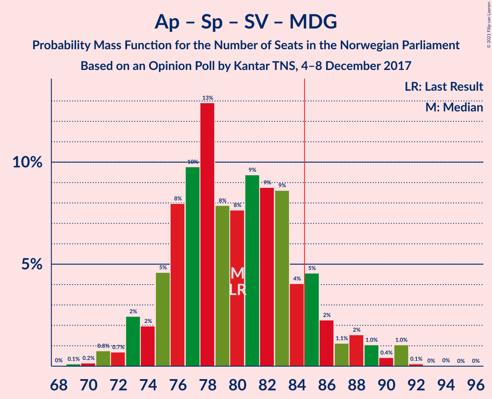
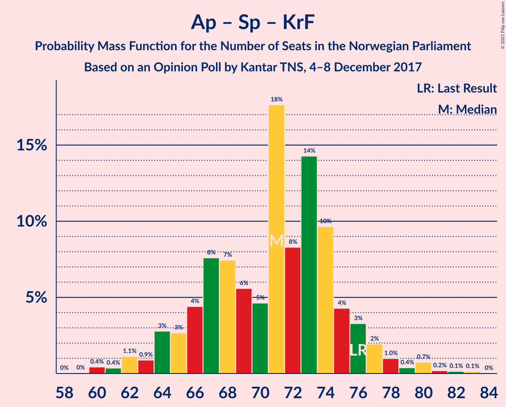

# Opinion Poll by Kantar TNS, 4–8 December 2017

<a href="#voting-intentions">Voting Intentions</a> | <a href="#seats">Seats</a> | <a href="#coalitions">Coalitions</a> | <a href="#technical-information">Technical Information</a>

## Voting Intentions

### Confidence Intervals

| Party | Last Result | Poll Result | 80% Confidence Interval | 90% Confidence Interval | 95% Confidence Interval | 99% Confidence Interval |
|:-----:|:-----------:|:-----------:|:-----------------------:|:-----------------------:|:-----------------------:|:-----------------------:|
| Høyre | 25.0% | 26.6% | 24.6–28.7% |24.1–29.3% |23.6–29.8% |22.7–30.8% |
| Arbeiderpartiet | 27.4% | 26.1% | 24.1–28.2% |23.6–28.8% |23.1–29.3% |22.2–30.3% |
| Fremskrittspartiet | 15.2% | 14.8% | 13.3–16.6% |12.9–17.1% |12.5–17.5% |11.8–18.4% |
| Senterpartiet | 10.3% | 9.7% | 8.4–11.2% |8.1–11.6% |7.8–12.0% |7.2–12.7% |
| Sosialistisk Venstreparti | 6.0% | 6.8% | 5.8–8.2% |5.5–8.5% |5.3–8.8% |4.8–9.5% |
| Venstre | 4.4% | 4.3% | 3.5–5.3% |3.2–5.7% |3.0–5.9% |2.7–6.5% |
| Kristelig Folkeparti | 4.2% | 4.1% | 3.3–5.2% |3.1–5.5% |2.9–5.8% |2.6–6.3% |
| Miljøpartiet De Grønne | 3.2% | 3.5% | 2.8–4.5% |2.6–4.8% |2.4–5.0% |2.1–5.5% |
| Rødt | 2.4% | 2.8% | 2.2–3.8% |2.0–4.0% |1.9–4.3% |1.6–4.8% |

*Note:* The poll result column reflects the actual value used in the calculations. Published results may vary slightly, and in addition be rounded to fewer digits.

## Seats

### Confidence Intervals

| Party | Last Result | Median | 80% Confidence Interval | 90% Confidence Interval | 95% Confidence Interval | 99% Confidence Interval |
|:-----:|:-----------:|:------:|:-----------------------:|:-----------------------:|:-----------------------:|:-----------------------:|
| <a href="#høyre">Høyre</a> | 45 | 48 | 44–51 |43–52 |42–52 |40–55 |
| <a href="#arbeiderpartiet">Arbeiderpartiet</a> | 49 | 45 | 44–51 |43–51 |42–53 |41–55 |
| <a href="#fremskrittspartiet">Fremskrittspartiet</a> | 27 | 27 | 24–28 |23–29 |22–30 |21–33 |
| <a href="#senterpartiet">Senterpartiet</a> | 19 | 19 | 16–20 |15–21 |14–21 |13–22 |
| <a href="#sosialistisk-venstreparti">Sosialistisk Venstreparti</a> | 11 | 12 | 10–14 |10–15 |9–16 |8–17 |
| <a href="#venstre">Venstre</a> | 8 | 8 | 2–10 |2–10 |2–11 |2–11 |
| <a href="#kristelig-folkeparti">Kristelig Folkeparti</a> | 8 | 8 | 3–9 |3–10 |1–10 |1–11 |
| <a href="#miljøpartiet-de-grønne">Miljøpartiet De Grønne</a> | 1 | 2 | 1–7 |1–8 |1–9 |1–10 |
| <a href="#rødt">Rødt</a> | 1 | 2 | 1–2 |1–2 |1–2 |1–8 |

### Høyre

*For a full overview of the results for this party, see the [Høyre](party-høyre.html) page.*

| Number of Seats | Probability | Accumulated | Special Marks |
|:---------------:|:-----------:|:-----------:|:-------------:|
| 39 | 0.5% | 100% |  |
| 40 | 0.1% | 99.5% |  |
| 41 | 0.6% | 99.5% |  |
| 42 | 3% | 98.9% |  |
| 43 | 5% | 96% |  |
| 44 | 4% | 91% |  |
| 45 | 28% | 87% | Last Result |
| 46 | 5% | 59% |  |
| 47 | 2% | 54% |  |
| 48 | 19% | 51% | Median |
| 49 | 6% | 32% |  |
| 50 | 6% | 26% |  |
| 51 | 15% | 20% |  |
| 52 | 3% | 5% |  |
| 53 | 1.0% | 2% |  |
| 54 | 0.5% | 1.1% |  |
| 55 | 0.3% | 0.6% |  |
| 56 | 0% | 0.3% |  |
| 57 | 0.2% | 0.3% |  |
| 58 | 0% | 0% |  |

### Arbeiderpartiet

*For a full overview of the results for this party, see the [Arbeiderpartiet](party-arbeiderpartiet.html) page.*

| Number of Seats | Probability | Accumulated | Special Marks |
|:---------------:|:-----------:|:-----------:|:-------------:|
| 38 | 0.2% | 100% |  |
| 39 | 0% | 99.8% |  |
| 40 | 0.3% | 99.8% |  |
| 41 | 1.0% | 99.5% |  |
| 42 | 2% | 98.6% |  |
| 43 | 3% | 96% |  |
| 44 | 14% | 93% |  |
| 45 | 35% | 79% | Median |
| 46 | 18% | 44% |  |
| 47 | 3% | 25% |  |
| 48 | 6% | 22% |  |
| 49 | 2% | 16% | Last Result |
| 50 | 3% | 14% |  |
| 51 | 6% | 10% |  |
| 52 | 2% | 5% |  |
| 53 | 2% | 3% |  |
| 54 | 0.2% | 0.8% |  |
| 55 | 0.5% | 0.6% |  |
| 56 | 0.1% | 0.1% |  |
| 57 | 0% | 0% |  |

### Fremskrittspartiet

*For a full overview of the results for this party, see the [Fremskrittspartiet](party-fremskrittspartiet.html) page.*

| Number of Seats | Probability | Accumulated | Special Marks |
|:---------------:|:-----------:|:-----------:|:-------------:|
| 19 | 0.1% | 100% |  |
| 20 | 0.1% | 99.9% |  |
| 21 | 1.2% | 99.8% |  |
| 22 | 2% | 98.6% |  |
| 23 | 2% | 96% |  |
| 24 | 18% | 94% |  |
| 25 | 20% | 76% |  |
| 26 | 6% | 56% |  |
| 27 | 12% | 50% | Last Result, Median |
| 28 | 29% | 38% |  |
| 29 | 5% | 9% |  |
| 30 | 2% | 4% |  |
| 31 | 0.8% | 2% |  |
| 32 | 0.8% | 1.5% |  |
| 33 | 0.4% | 0.7% |  |
| 34 | 0.1% | 0.3% |  |
| 35 | 0.2% | 0.2% |  |
| 36 | 0% | 0% |  |

### Senterpartiet

*For a full overview of the results for this party, see the [Senterpartiet](party-senterpartiet.html) page.*

| Number of Seats | Probability | Accumulated | Special Marks |
|:---------------:|:-----------:|:-----------:|:-------------:|
| 11 | 0% | 100% |  |
| 12 | 0.1% | 99.9% |  |
| 13 | 2% | 99.8% |  |
| 14 | 1.3% | 98% |  |
| 15 | 2% | 97% |  |
| 16 | 17% | 94% |  |
| 17 | 12% | 78% |  |
| 18 | 6% | 66% |  |
| 19 | 46% | 60% | Last Result, Median |
| 20 | 4% | 14% |  |
| 21 | 8% | 10% |  |
| 22 | 1.4% | 2% |  |
| 23 | 0.1% | 0.4% |  |
| 24 | 0.4% | 0.4% |  |
| 25 | 0% | 0% |  |

### Sosialistisk Venstreparti

*For a full overview of the results for this party, see the [Sosialistisk Venstreparti](party-sosialistiskvenstreparti.html) page.*

| Number of Seats | Probability | Accumulated | Special Marks |
|:---------------:|:-----------:|:-----------:|:-------------:|
| 8 | 0.5% | 100% |  |
| 9 | 3% | 99.5% |  |
| 10 | 19% | 97% |  |
| 11 | 6% | 78% | Last Result |
| 12 | 27% | 71% | Median |
| 13 | 28% | 45% |  |
| 14 | 10% | 17% |  |
| 15 | 4% | 7% |  |
| 16 | 3% | 3% |  |
| 17 | 0.6% | 0.8% |  |
| 18 | 0.1% | 0.2% |  |
| 19 | 0% | 0% |  |

### Venstre

*For a full overview of the results for this party, see the [Venstre](party-venstre.html) page.*

| Number of Seats | Probability | Accumulated | Special Marks |
|:---------------:|:-----------:|:-----------:|:-------------:|
| 2 | 16% | 100% |  |
| 3 | 0.7% | 84% |  |
| 4 | 0% | 84% |  |
| 5 | 0% | 84% |  |
| 6 | 0% | 84% |  |
| 7 | 6% | 84% |  |
| 8 | 30% | 78% | Last Result, Median |
| 9 | 38% | 48% |  |
| 10 | 8% | 11% |  |
| 11 | 2% | 3% |  |
| 12 | 0.4% | 0.5% |  |
| 13 | 0.1% | 0.1% |  |
| 14 | 0% | 0% |  |

### Kristelig Folkeparti

*For a full overview of the results for this party, see the [Kristelig Folkeparti](party-kristeligfolkeparti.html) page.*

| Number of Seats | Probability | Accumulated | Special Marks |
|:---------------:|:-----------:|:-----------:|:-------------:|
| 1 | 3% | 100% |  |
| 2 | 1.4% | 97% |  |
| 3 | 18% | 96% |  |
| 4 | 0% | 78% |  |
| 5 | 0% | 78% |  |
| 6 | 0% | 78% |  |
| 7 | 23% | 78% |  |
| 8 | 13% | 55% | Last Result, Median |
| 9 | 36% | 42% |  |
| 10 | 5% | 6% |  |
| 11 | 1.0% | 1.1% |  |
| 12 | 0.1% | 0.1% |  |
| 13 | 0% | 0% |  |

### Miljøpartiet De Grønne

*For a full overview of the results for this party, see the [Miljøpartiet De Grønne](party-miljøpartietdegrønne.html) page.*

| Number of Seats | Probability | Accumulated | Special Marks |
|:---------------:|:-----------:|:-----------:|:-------------:|
| 1 | 21% | 100% | Last Result |
| 2 | 62% | 78% | Median |
| 3 | 2% | 16% |  |
| 4 | 0% | 14% |  |
| 5 | 0% | 14% |  |
| 6 | 0% | 14% |  |
| 7 | 5% | 14% |  |
| 8 | 7% | 10% |  |
| 9 | 2% | 3% |  |
| 10 | 0.6% | 0.7% |  |
| 11 | 0.1% | 0.1% |  |
| 12 | 0% | 0% |  |

### Rødt

*For a full overview of the results for this party, see the [Rødt](party-rødt.html) page.*

| Number of Seats | Probability | Accumulated | Special Marks |
|:---------------:|:-----------:|:-----------:|:-------------:|
| 1 | 38% | 100% | Last Result |
| 2 | 61% | 62% | Median |
| 3 | 0% | 2% |  |
| 4 | 0% | 2% |  |
| 5 | 0% | 2% |  |
| 6 | 0% | 2% |  |
| 7 | 0.8% | 2% |  |
| 8 | 0.5% | 0.8% |  |
| 9 | 0.2% | 0.4% |  |
| 10 | 0.2% | 0.2% |  |
| 11 | 0% | 0% |  |

## Coalitions

### Confidence Intervals

| Coalition | Last Result | Median | Majority? | 80% Confidence Interval | 90% Confidence Interval | 95% Confidence Interval | 99% Confidence Interval |
|:---------:|:-----------:|:------:|:---------:|:-----------------------:|:-----------------------:|:-----------------------:|:-----------------------:|
| Høyre – Fremskrittspartiet – Senterpartiet – Venstre – Kristelig Folkeparti | 107 | 107 | 100% | 100–112 | 98–112 | 98–113 | 96–113 |
| Høyre – Fremskrittspartiet – Venstre – Kristelig Folkeparti – Miljøpartiet De Grønne | 89 | 91 | 96% | 86–94 | 85–94 | 83–96 | 78–98 |
| Arbeiderpartiet – Senterpartiet – Sosialistisk Venstreparti – Kristelig Folkeparti – Miljøpartiet De Grønne | 88 | 85 | 73% | 84–90 | 81–93 | 81–95 | 77–97 |
| Høyre – Fremskrittspartiet – Venstre – Kristelig Folkeparti | 88 | 89 | 83% | 83–93 | 80–93 | 79–94 | 77–95 |
| Arbeiderpartiet – Senterpartiet – Sosialistisk Venstreparti – Miljøpartiet De Grønne – Rødt | 81 | 80 | 17% | 76–86 | 76–89 | 75–90 | 74–92 |
| Arbeiderpartiet – Senterpartiet – Sosialistisk Venstreparti – Miljøpartiet De Grønne | 80 | 78 | 10% | 75–85 | 75–86 | 73–88 | 72–90 |
| Høyre – Fremskrittspartiet – Venstre | 80 | 82 | 7% | 77–84 | 74–86 | 72–87 | 70–90 |
| Arbeiderpartiet – Senterpartiet – Sosialistisk Venstreparti – Rødt | 80 | 78 | 4% | 75–83 | 75–84 | 73–86 | 71–91 |
| Arbeiderpartiet – Senterpartiet – Sosialistisk Venstreparti | 79 | 76 | 2% | 74–81 | 72–83 | 71–83 | 69–89 |
| Arbeiderpartiet – Senterpartiet – Kristelig Folkeparti – Miljøpartiet De Grønne | 77 | 73 | 2% | 72–78 | 68–80 | 66–83 | 64–86 |
| Høyre – Fremskrittspartiet | 72 | 73 | 0% | 70–76 | 68–79 | 68–80 | 65–83 |
| Arbeiderpartiet – Senterpartiet – Kristelig Folkeparti | 76 | 71 | 0% | 67–75 | 65–77 | 64–78 | 61–80 |
| Arbeiderpartiet – Senterpartiet | 68 | 64 | 0% | 62–70 | 60–70 | 59–71 | 58–74 |
| Høyre – Venstre – Kristelig Folkeparti | 61 | 61 | 0% | 56–68 | 54–68 | 53–68 | 50–70 |
| Arbeiderpartiet – Sosialistisk Venstreparti | 60 | 57 | 0% | 55–63 | 54–64 | 53–65 | 52–68 |
| Senterpartiet – Venstre – Kristelig Folkeparti | 35 | 34 | 0% | 28–36 | 25–36 | 23–37 | 22–37 |

### Høyre – Fremskrittspartiet – Senterpartiet – Venstre – Kristelig Folkeparti

| Number of Seats | Probability | Accumulated | Special Marks |
|:---------------:|:-----------:|:-----------:|:-------------:|
| 91 | 0% | 100% |  |
| 92 | 0.1% | 99.9% |  |
| 93 | 0.1% | 99.8% |  |
| 94 | 0.1% | 99.7% |  |
| 95 | 0.1% | 99.6% |  |
| 96 | 0.3% | 99.5% |  |
| 97 | 2% | 99.2% |  |
| 98 | 4% | 98% |  |
| 99 | 3% | 94% |  |
| 100 | 2% | 91% |  |
| 101 | 2% | 89% |  |
| 102 | 7% | 87% |  |
| 103 | 4% | 80% |  |
| 104 | 2% | 77% |  |
| 105 | 4% | 74% |  |
| 106 | 20% | 70% |  |
| 107 | 3% | 50% | Last Result |
| 108 | 26% | 47% |  |
| 109 | 0.5% | 21% |  |
| 110 | 2% | 20% | Median |
| 111 | 2% | 19% |  |
| 112 | 14% | 17% |  |
| 113 | 3% | 3% |  |
| 114 | 0.2% | 0.3% |  |
| 115 | 0.1% | 0.1% |  |
| 116 | 0% | 0% |  |

### Høyre – Fremskrittspartiet – Venstre – Kristelig Folkeparti – Miljøpartiet De Grønne

| Number of Seats | Probability | Accumulated | Special Marks |
|:---------------:|:-----------:|:-----------:|:-------------:|
| 78 | 1.2% | 100% |  |
| 79 | 0.3% | 98.8% |  |
| 80 | 0.2% | 98.5% |  |
| 81 | 0.3% | 98% |  |
| 82 | 0.6% | 98% |  |
| 83 | 0.1% | 98% |  |
| 84 | 2% | 97% |  |
| 85 | 5% | 96% | Majority |
| 86 | 3% | 91% |  |
| 87 | 6% | 88% |  |
| 88 | 4% | 82% |  |
| 89 | 0.9% | 78% | Last Result |
| 90 | 3% | 77% |  |
| 91 | 30% | 74% |  |
| 92 | 18% | 44% |  |
| 93 | 1.3% | 26% | Median |
| 94 | 20% | 25% |  |
| 95 | 0.8% | 5% |  |
| 96 | 2% | 4% |  |
| 97 | 0.9% | 2% |  |
| 98 | 0.8% | 1.2% |  |
| 99 | 0.2% | 0.4% |  |
| 100 | 0.1% | 0.2% |  |
| 101 | 0% | 0% |  |

### Arbeiderpartiet – Senterpartiet – Sosialistisk Venstreparti – Kristelig Folkeparti – Miljøpartiet De Grønne

| Number of Seats | Probability | Accumulated | Special Marks |
|:---------------:|:-----------:|:-----------:|:-------------:|
| 74 | 0.1% | 100% |  |
| 75 | 0% | 99.9% |  |
| 76 | 0.4% | 99.9% |  |
| 77 | 0.1% | 99.5% |  |
| 78 | 0.2% | 99.4% |  |
| 79 | 0.3% | 99.2% |  |
| 80 | 0.9% | 99.0% |  |
| 81 | 3% | 98% |  |
| 82 | 2% | 95% |  |
| 83 | 2% | 92% |  |
| 84 | 17% | 90% |  |
| 85 | 25% | 73% | Majority |
| 86 | 16% | 49% | Median |
| 87 | 8% | 33% |  |
| 88 | 5% | 24% | Last Result |
| 89 | 2% | 20% |  |
| 90 | 8% | 18% |  |
| 91 | 3% | 10% |  |
| 92 | 1.0% | 6% |  |
| 93 | 2% | 5% |  |
| 94 | 0.3% | 4% |  |
| 95 | 1.3% | 3% |  |
| 96 | 1.3% | 2% |  |
| 97 | 0.6% | 0.7% |  |
| 98 | 0.1% | 0.1% |  |
| 99 | 0% | 0% |  |

### Høyre – Fremskrittspartiet – Venstre – Kristelig Folkeparti

| Number of Seats | Probability | Accumulated | Special Marks |
|:---------------:|:-----------:|:-----------:|:-------------:|
| 73 | 0.1% | 100% |  |
| 74 | 0% | 99.9% |  |
| 75 | 0.1% | 99.9% |  |
| 76 | 0.3% | 99.8% |  |
| 77 | 1.3% | 99.5% |  |
| 78 | 0.2% | 98% |  |
| 79 | 0.9% | 98% |  |
| 80 | 2% | 97% |  |
| 81 | 2% | 95% |  |
| 82 | 0.9% | 93% |  |
| 83 | 7% | 92% |  |
| 84 | 3% | 86% |  |
| 85 | 8% | 83% | Majority |
| 86 | 6% | 75% |  |
| 87 | 1.1% | 68% |  |
| 88 | 0.8% | 67% | Last Result |
| 89 | 29% | 66% |  |
| 90 | 17% | 38% |  |
| 91 | 1.3% | 21% | Median |
| 92 | 3% | 19% |  |
| 93 | 14% | 17% |  |
| 94 | 1.4% | 3% |  |
| 95 | 0.9% | 1.3% |  |
| 96 | 0.2% | 0.4% |  |
| 97 | 0.1% | 0.2% |  |
| 98 | 0% | 0% |  |

### Arbeiderpartiet – Senterpartiet – Sosialistisk Venstreparti – Miljøpartiet De Grønne – Rødt

| Number of Seats | Probability | Accumulated | Special Marks |
|:---------------:|:-----------:|:-----------:|:-------------:|
| 72 | 0.1% | 100% |  |
| 73 | 0.2% | 99.8% |  |
| 74 | 0.9% | 99.6% |  |
| 75 | 1.4% | 98.7% |  |
| 76 | 14% | 97% |  |
| 77 | 3% | 83% |  |
| 78 | 1.3% | 81% |  |
| 79 | 17% | 79% |  |
| 80 | 29% | 62% | Median |
| 81 | 0.8% | 34% | Last Result |
| 82 | 1.1% | 33% |  |
| 83 | 6% | 32% |  |
| 84 | 8% | 25% |  |
| 85 | 3% | 17% | Majority |
| 86 | 7% | 14% |  |
| 87 | 0.9% | 8% |  |
| 88 | 2% | 7% |  |
| 89 | 2% | 5% |  |
| 90 | 0.9% | 3% |  |
| 91 | 0.2% | 2% |  |
| 92 | 1.3% | 2% |  |
| 93 | 0.3% | 0.5% |  |
| 94 | 0.1% | 0.2% |  |
| 95 | 0% | 0.1% |  |
| 96 | 0.1% | 0.1% |  |
| 97 | 0% | 0% |  |

### Arbeiderpartiet – Senterpartiet – Sosialistisk Venstreparti – Miljøpartiet De Grønne

| Number of Seats | Probability | Accumulated | Special Marks |
|:---------------:|:-----------:|:-----------:|:-------------:|
| 70 | 0.1% | 100% |  |
| 71 | 0.2% | 99.9% |  |
| 72 | 0.7% | 99.7% |  |
| 73 | 2% | 99.0% |  |
| 74 | 0.6% | 97% |  |
| 75 | 14% | 97% |  |
| 76 | 3% | 83% |  |
| 77 | 15% | 80% |  |
| 78 | 30% | 65% | Median |
| 79 | 3% | 35% |  |
| 80 | 1.0% | 33% | Last Result |
| 81 | 0.9% | 32% |  |
| 82 | 12% | 31% |  |
| 83 | 4% | 18% |  |
| 84 | 4% | 15% |  |
| 85 | 4% | 10% | Majority |
| 86 | 2% | 7% |  |
| 87 | 0.8% | 5% |  |
| 88 | 2% | 4% |  |
| 89 | 0.4% | 2% |  |
| 90 | 1.1% | 2% |  |
| 91 | 0.4% | 0.5% |  |
| 92 | 0% | 0.1% |  |
| 93 | 0% | 0.1% |  |
| 94 | 0% | 0% |  |

### Høyre – Fremskrittspartiet – Venstre

| Number of Seats | Probability | Accumulated | Special Marks |
|:---------------:|:-----------:|:-----------:|:-------------:|
| 69 | 0.1% | 100% |  |
| 70 | 0.7% | 99.9% |  |
| 71 | 1.4% | 99.2% |  |
| 72 | 0.5% | 98% |  |
| 73 | 2% | 97% |  |
| 74 | 2% | 96% |  |
| 75 | 0.4% | 94% |  |
| 76 | 3% | 94% |  |
| 77 | 3% | 90% |  |
| 78 | 7% | 87% |  |
| 79 | 2% | 81% |  |
| 80 | 12% | 79% | Last Result |
| 81 | 15% | 67% |  |
| 82 | 25% | 53% |  |
| 83 | 2% | 27% | Median |
| 84 | 18% | 25% |  |
| 85 | 1.0% | 7% | Majority |
| 86 | 2% | 6% |  |
| 87 | 3% | 4% |  |
| 88 | 0.5% | 1.2% |  |
| 89 | 0.1% | 0.7% |  |
| 90 | 0.1% | 0.6% |  |
| 91 | 0.1% | 0.4% |  |
| 92 | 0.3% | 0.3% |  |
| 93 | 0% | 0% |  |

### Arbeiderpartiet – Senterpartiet – Sosialistisk Venstreparti – Rødt

| Number of Seats | Probability | Accumulated | Special Marks |
|:---------------:|:-----------:|:-----------:|:-------------:|
| 69 | 0.1% | 100% |  |
| 70 | 0.2% | 99.8% |  |
| 71 | 0.8% | 99.6% |  |
| 72 | 0.9% | 98.8% |  |
| 73 | 2% | 98% |  |
| 74 | 0.8% | 96% |  |
| 75 | 20% | 95% |  |
| 76 | 1.3% | 75% |  |
| 77 | 18% | 74% |  |
| 78 | 30% | 56% | Median |
| 79 | 3% | 26% |  |
| 80 | 0.9% | 23% | Last Result |
| 81 | 4% | 22% |  |
| 82 | 6% | 18% |  |
| 83 | 3% | 12% |  |
| 84 | 5% | 9% |  |
| 85 | 2% | 4% | Majority |
| 86 | 0.1% | 3% |  |
| 87 | 0.6% | 2% |  |
| 88 | 0.3% | 2% |  |
| 89 | 0.2% | 2% |  |
| 90 | 0.3% | 1.5% |  |
| 91 | 1.2% | 1.2% |  |
| 92 | 0% | 0% |  |

### Arbeiderpartiet – Senterpartiet – Sosialistisk Venstreparti

| Number of Seats | Probability | Accumulated | Special Marks |
|:---------------:|:-----------:|:-----------:|:-------------:|
| 67 | 0% | 100% |  |
| 68 | 0.1% | 99.9% |  |
| 69 | 0.7% | 99.8% |  |
| 70 | 1.2% | 99.1% |  |
| 71 | 2% | 98% |  |
| 72 | 0.9% | 96% |  |
| 73 | 1.3% | 95% |  |
| 74 | 19% | 94% |  |
| 75 | 16% | 74% |  |
| 76 | 31% | 59% | Median |
| 77 | 5% | 28% |  |
| 78 | 0.9% | 23% |  |
| 79 | 0.6% | 22% | Last Result |
| 80 | 8% | 21% |  |
| 81 | 3% | 13% |  |
| 82 | 2% | 9% |  |
| 83 | 5% | 7% |  |
| 84 | 0.1% | 2% |  |
| 85 | 0% | 2% | Majority |
| 86 | 0.2% | 2% |  |
| 87 | 0.2% | 2% |  |
| 88 | 0.1% | 1.4% |  |
| 89 | 1.2% | 1.2% |  |
| 90 | 0% | 0% |  |

### Arbeiderpartiet – Senterpartiet – Kristelig Folkeparti – Miljøpartiet De Grønne

| Number of Seats | Probability | Accumulated | Special Marks |
|:---------------:|:-----------:|:-----------:|:-------------:|
| 62 | 0.1% | 100% |  |
| 63 | 0.2% | 99.9% |  |
| 64 | 0.4% | 99.7% |  |
| 65 | 0.1% | 99.3% |  |
| 66 | 2% | 99.2% |  |
| 67 | 2% | 97% |  |
| 68 | 0.5% | 95% |  |
| 69 | 0.9% | 95% |  |
| 70 | 3% | 94% |  |
| 71 | 0.6% | 91% |  |
| 72 | 2% | 90% |  |
| 73 | 38% | 88% |  |
| 74 | 21% | 50% | Median |
| 75 | 9% | 29% |  |
| 76 | 4% | 20% |  |
| 77 | 4% | 15% | Last Result |
| 78 | 5% | 12% |  |
| 79 | 1.2% | 7% |  |
| 80 | 1.0% | 6% |  |
| 81 | 0.3% | 5% |  |
| 82 | 0.8% | 4% |  |
| 83 | 2% | 3% |  |
| 84 | 0.1% | 2% |  |
| 85 | 1.1% | 2% | Majority |
| 86 | 0.5% | 0.6% |  |
| 87 | 0.1% | 0.1% |  |
| 88 | 0% | 0% |  |

### Høyre – Fremskrittspartiet

| Number of Seats | Probability | Accumulated | Special Marks |
|:---------------:|:-----------:|:-----------:|:-------------:|
| 62 | 0% | 100% |  |
| 63 | 0.1% | 99.9% |  |
| 64 | 0% | 99.9% |  |
| 65 | 1.1% | 99.8% |  |
| 66 | 0.2% | 98.8% |  |
| 67 | 0.4% | 98.5% |  |
| 68 | 3% | 98% |  |
| 69 | 2% | 95% |  |
| 70 | 6% | 93% |  |
| 71 | 3% | 86% |  |
| 72 | 22% | 83% | Last Result |
| 73 | 22% | 62% |  |
| 74 | 3% | 40% |  |
| 75 | 6% | 37% | Median |
| 76 | 21% | 31% |  |
| 77 | 4% | 10% |  |
| 78 | 0.9% | 6% |  |
| 79 | 3% | 5% |  |
| 80 | 1.3% | 3% |  |
| 81 | 0.4% | 2% |  |
| 82 | 0.5% | 1.1% |  |
| 83 | 0.4% | 0.6% |  |
| 84 | 0.2% | 0.2% |  |
| 85 | 0% | 0% | Majority |

### Arbeiderpartiet – Senterpartiet – Kristelig Folkeparti

| Number of Seats | Probability | Accumulated | Special Marks |
|:---------------:|:-----------:|:-----------:|:-------------:|
| 59 | 0% | 100% |  |
| 60 | 0.1% | 99.9% |  |
| 61 | 0.5% | 99.9% |  |
| 62 | 0.5% | 99.3% |  |
| 63 | 0.5% | 98.9% |  |
| 64 | 2% | 98% |  |
| 65 | 3% | 97% |  |
| 66 | 3% | 93% |  |
| 67 | 1.0% | 90% |  |
| 68 | 4% | 89% |  |
| 69 | 2% | 85% |  |
| 70 | 4% | 84% |  |
| 71 | 38% | 80% |  |
| 72 | 7% | 42% | Median |
| 73 | 22% | 35% |  |
| 74 | 2% | 13% |  |
| 75 | 4% | 11% |  |
| 76 | 1.2% | 7% | Last Result |
| 77 | 3% | 6% |  |
| 78 | 1.0% | 3% |  |
| 79 | 0.1% | 2% |  |
| 80 | 2% | 2% |  |
| 81 | 0.1% | 0.2% |  |
| 82 | 0.1% | 0.1% |  |
| 83 | 0% | 0.1% |  |
| 84 | 0% | 0% |  |

### Arbeiderpartiet – Senterpartiet

| Number of Seats | Probability | Accumulated | Special Marks |
|:---------------:|:-----------:|:-----------:|:-------------:|
| 55 | 0.1% | 100% |  |
| 56 | 0.2% | 99.9% |  |
| 57 | 0.1% | 99.7% |  |
| 58 | 1.4% | 99.6% |  |
| 59 | 0.8% | 98% |  |
| 60 | 3% | 97% |  |
| 61 | 4% | 95% |  |
| 62 | 18% | 91% |  |
| 63 | 11% | 73% |  |
| 64 | 35% | 62% | Median |
| 65 | 6% | 27% |  |
| 66 | 3% | 21% |  |
| 67 | 3% | 18% |  |
| 68 | 3% | 15% | Last Result |
| 69 | 1.5% | 12% |  |
| 70 | 7% | 10% |  |
| 71 | 1.3% | 3% |  |
| 72 | 0.7% | 2% |  |
| 73 | 0.2% | 1.4% |  |
| 74 | 1.0% | 1.3% |  |
| 75 | 0.3% | 0.3% |  |
| 76 | 0% | 0% |  |

### Høyre – Venstre – Kristelig Folkeparti

| Number of Seats | Probability | Accumulated | Special Marks |
|:---------------:|:-----------:|:-----------:|:-------------:|
| 46 | 0.1% | 100% |  |
| 47 | 0% | 99.9% |  |
| 48 | 0% | 99.9% |  |
| 49 | 0.4% | 99.9% |  |
| 50 | 0.1% | 99.5% |  |
| 51 | 0.4% | 99.4% |  |
| 52 | 0.6% | 99.0% |  |
| 53 | 2% | 98% |  |
| 54 | 2% | 97% |  |
| 55 | 1.1% | 95% |  |
| 56 | 6% | 94% |  |
| 57 | 4% | 88% |  |
| 58 | 3% | 84% |  |
| 59 | 5% | 80% |  |
| 60 | 6% | 75% |  |
| 61 | 23% | 69% | Last Result |
| 62 | 9% | 46% |  |
| 63 | 2% | 37% |  |
| 64 | 4% | 36% | Median |
| 65 | 2% | 31% |  |
| 66 | 15% | 30% |  |
| 67 | 0.6% | 15% |  |
| 68 | 14% | 14% |  |
| 69 | 0.2% | 0.8% |  |
| 70 | 0.3% | 0.5% |  |
| 71 | 0.2% | 0.2% |  |
| 72 | 0% | 0% |  |

### Arbeiderpartiet – Sosialistisk Venstreparti

| Number of Seats | Probability | Accumulated | Special Marks |
|:---------------:|:-----------:|:-----------:|:-------------:|
| 50 | 0.1% | 100% |  |
| 51 | 0.3% | 99.9% |  |
| 52 | 0.3% | 99.6% |  |
| 53 | 3% | 99.2% |  |
| 54 | 3% | 97% |  |
| 55 | 17% | 94% |  |
| 56 | 2% | 77% |  |
| 57 | 26% | 75% | Median |
| 58 | 4% | 49% |  |
| 59 | 18% | 45% |  |
| 60 | 8% | 26% | Last Result |
| 61 | 2% | 18% |  |
| 62 | 4% | 16% |  |
| 63 | 3% | 12% |  |
| 64 | 4% | 9% |  |
| 65 | 2% | 5% |  |
| 66 | 0.7% | 2% |  |
| 67 | 0.3% | 2% |  |
| 68 | 1.0% | 1.3% |  |
| 69 | 0.2% | 0.3% |  |
| 70 | 0% | 0% |  |

### Senterpartiet – Venstre – Kristelig Folkeparti

| Number of Seats | Probability | Accumulated | Special Marks |
|:---------------:|:-----------:|:-----------:|:-------------:|
| 18 | 0% | 100% |  |
| 19 | 0.1% | 99.9% |  |
| 20 | 0.1% | 99.8% |  |
| 21 | 0.2% | 99.7% |  |
| 22 | 1.3% | 99.6% |  |
| 23 | 1.2% | 98% |  |
| 24 | 1.1% | 97% |  |
| 25 | 1.0% | 96% |  |
| 26 | 2% | 95% |  |
| 27 | 2% | 92% |  |
| 28 | 2% | 90% |  |
| 29 | 5% | 88% |  |
| 30 | 4% | 83% |  |
| 31 | 8% | 78% |  |
| 32 | 6% | 70% |  |
| 33 | 2% | 64% |  |
| 34 | 14% | 61% |  |
| 35 | 23% | 47% | Last Result, Median |
| 36 | 20% | 24% |  |
| 37 | 4% | 4% |  |
| 38 | 0.3% | 0.3% |  |
| 39 | 0% | 0.1% |  |
| 40 | 0% | 0% |  |

## Technical Information

### Opinion Poll

+ **Polling firm:** Kantar TNS
+ **Commissioner(s):** —
+ **Fieldwork period:** 4–8 December 2017

### Calculations

+ **Sample size:** 775
+ **Simulations done:** 131,072
+ **Error estimate:** 2.67%

