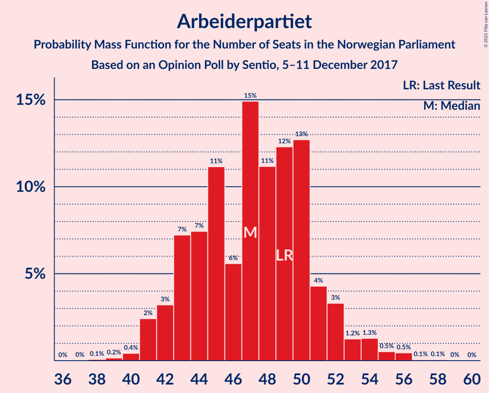
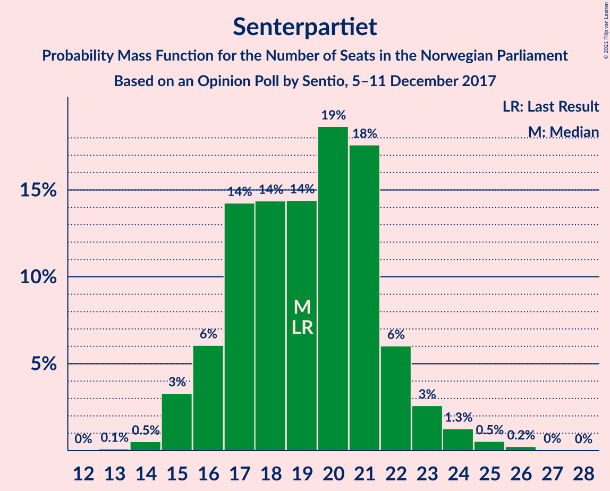
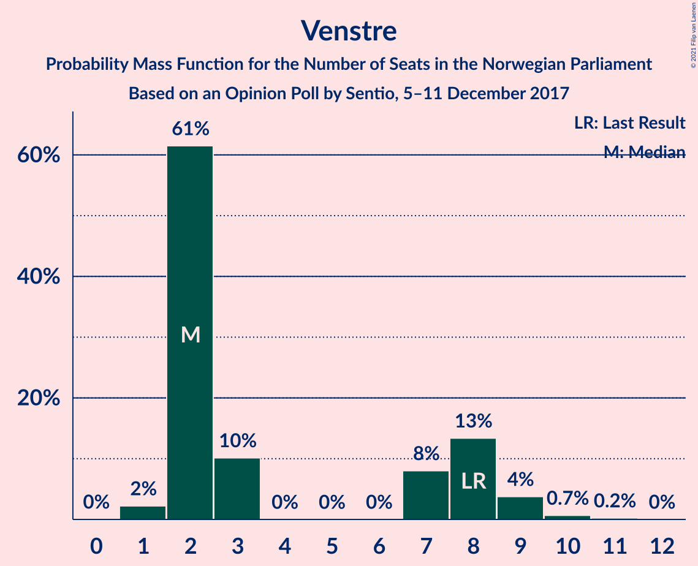
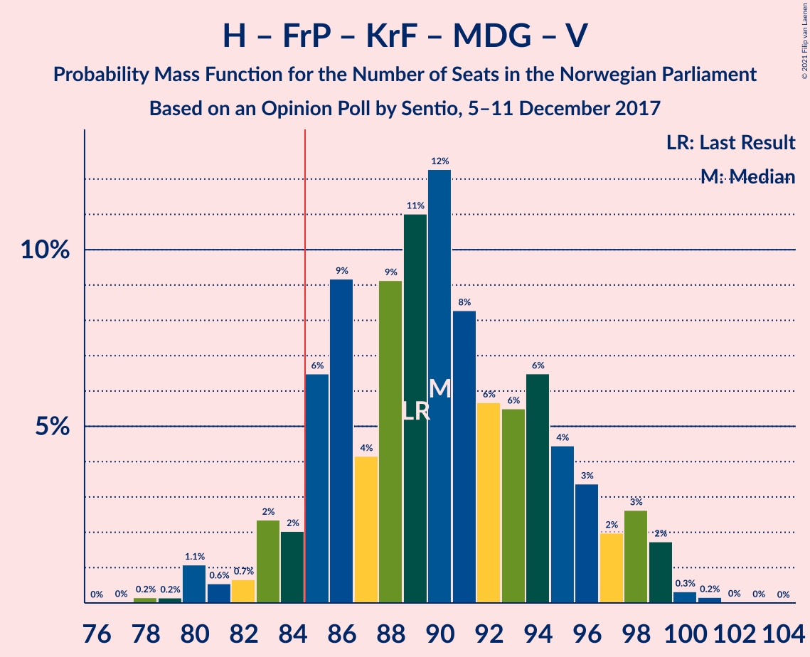
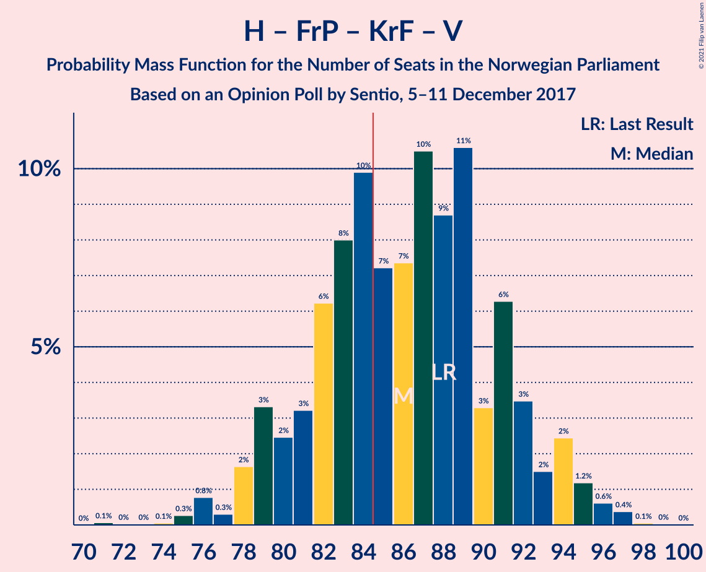
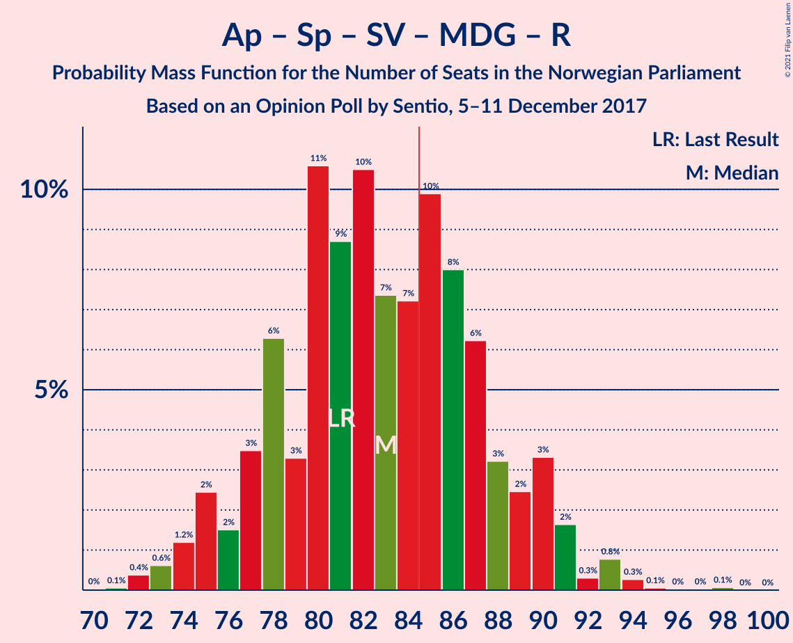
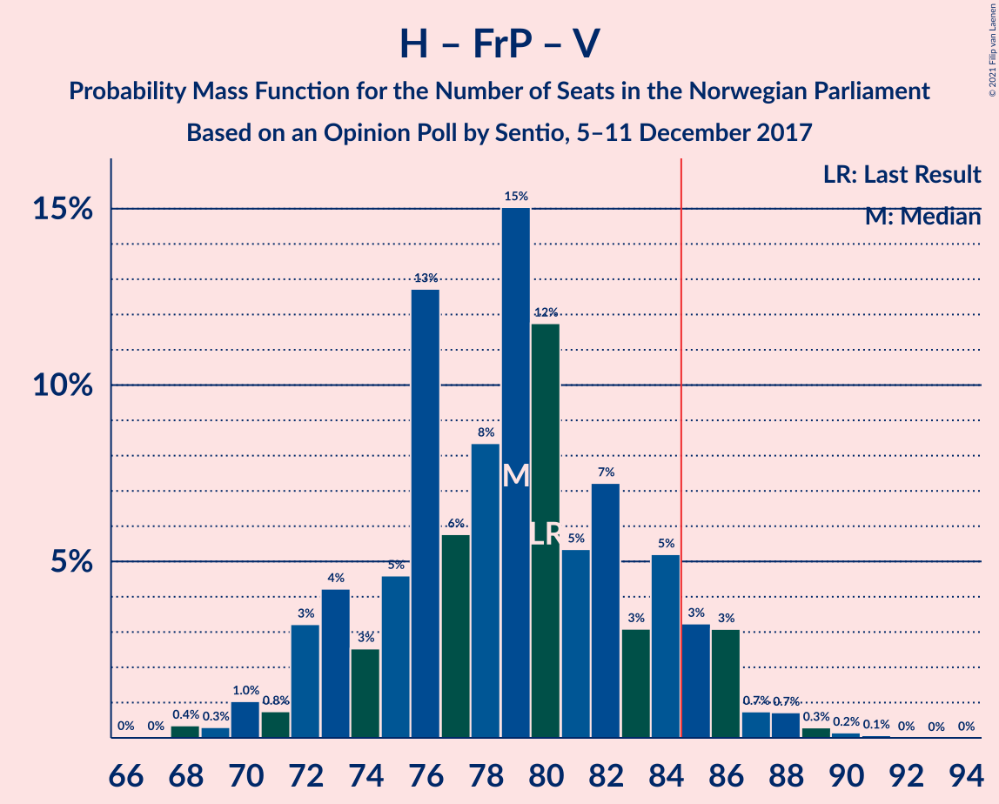
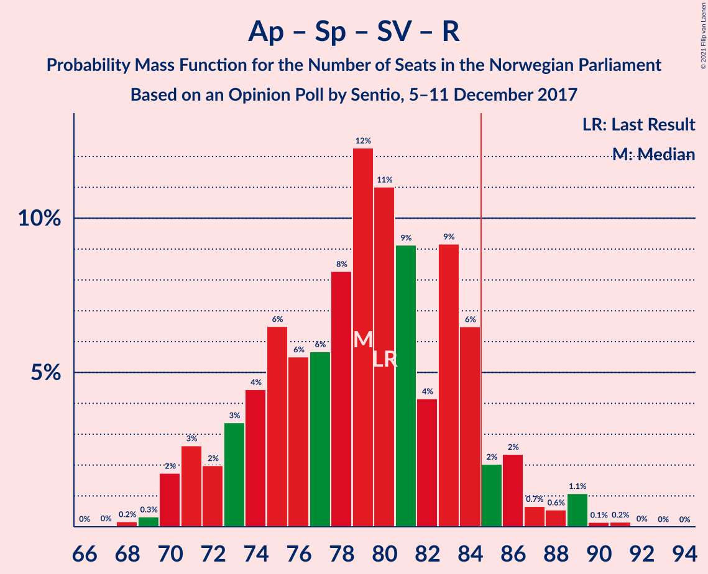
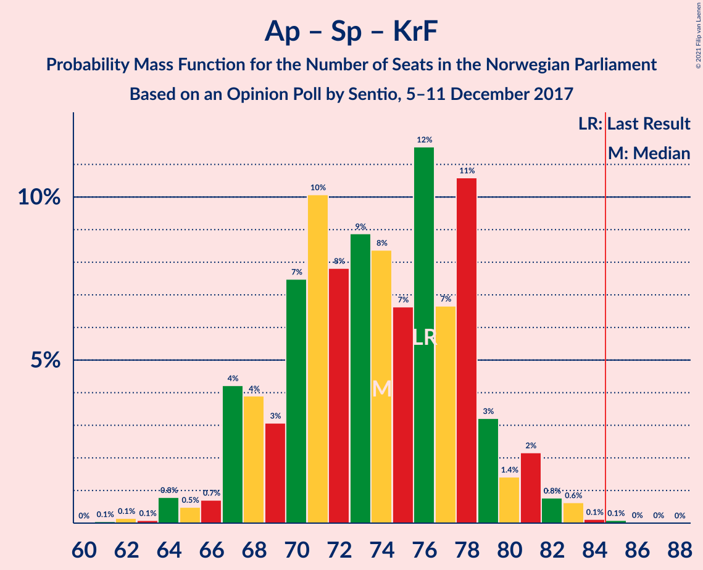

# Opinion Poll by Sentio, 5–11 December 2017

<a href="#voting-intentions">Voting Intentions</a> | <a href="#seats">Seats</a> | <a href="#coalitions">Coalitions</a> | <a href="#technical-information">Technical Information</a>

## Voting Intentions

### Confidence Intervals

| Party | Last Result | Poll Result | 80% Confidence Interval | 90% Confidence Interval | 95% Confidence Interval | 99% Confidence Interval |
|:-----:|:-----------:|:-----------:|:-----------------------:|:-----------------------:|:-----------------------:|:-----------------------:|
| Høyre | 25.0% | 26.6% | 24.6–28.7% |24.0–29.3% |23.5–29.8% |22.6–30.8% |
| Arbeiderpartiet | 27.4% | 25.9% | 24.0–28.0% |23.4–28.6% |22.9–29.1% |22.0–30.2% |
| Fremskrittspartiet | 15.2% | 14.8% | 13.3–16.6% |12.9–17.1% |12.5–17.5% |11.8–18.4% |
| Senterpartiet | 10.3% | 10.5% | 9.2–12.1% |8.9–12.5% |8.6–12.9% |8.0–13.7% |
| Sosialistisk Venstreparti | 6.0% | 6.0% | 5.0–7.2% |4.7–7.6% |4.5–7.9% |4.1–8.5% |
| Kristelig Folkeparti | 4.2% | 4.6% | 3.7–5.7% |3.5–6.0% |3.3–6.3% |2.9–6.9% |
| Miljøpartiet De Grønne | 3.2% | 3.6% | 2.9–4.7% |2.7–5.0% |2.5–5.2% |2.2–5.8% |
| Venstre | 4.4% | 3.5% | 2.8–4.5% |2.6–4.8% |2.4–5.1% |2.1–5.6% |
| Rødt | 2.4% | 2.6% | 2.0–3.5% |1.8–3.8% |1.7–4.0% |1.4–4.5% |

*Note:* The poll result column reflects the actual value used in the calculations. Published results may vary slightly, and in addition be rounded to fewer digits.

## Seats

### Confidence Intervals

| Party | Last Result | Median | 80% Confidence Interval | 90% Confidence Interval | 95% Confidence Interval | 99% Confidence Interval |
|:-----:|:-----------:|:------:|:-----------------------:|:-----------------------:|:-----------------------:|:-----------------------:|
| <a href="#høyre">Høyre</a> | 45 | 49 | 44–51 |43–53 |42–54 |41–55 |
| <a href="#arbeiderpartiet">Arbeiderpartiet</a> | 49 | 48 | 42–51 |41–51 |41–52 |40–54 |
| <a href="#fremskrittspartiet">Fremskrittspartiet</a> | 27 | 27 | 25–31 |23–32 |22–32 |20–34 |
| <a href="#senterpartiet">Senterpartiet</a> | 19 | 19 | 17–22 |17–23 |16–23 |14–25 |
| <a href="#sosialistisk-venstreparti">Sosialistisk Venstreparti</a> | 11 | 11 | 8–13 |8–13 |7–14 |7–14 |
| <a href="#kristelig-folkeparti">Kristelig Folkeparti</a> | 8 | 8 | 3–10 |3–10 |1–11 |1–12 |
| <a href="#miljøpartiet-de-grønne">Miljøpartiet De Grønne</a> | 1 | 2 | 1–9 |1–9 |1–9 |1–10 |
| <a href="#venstre">Venstre</a> | 8 | 2 | 2–8 |2–8 |2–9 |1–10 |
| <a href="#rødt">Rødt</a> | 1 | 1 | 1–2 |1–2 |1–2 |1–8 |

### Høyre

*For a full overview of the results for this party, see the [Høyre](party-høyre.html) page.*

| Number of Seats | Probability | Accumulated | Special Marks |
|:---------------:|:-----------:|:-----------:|:-------------:|
| 39 | 0.1% | 100% |  |
| 40 | 0.2% | 99.9% |  |
| 41 | 2% | 99.6% |  |
| 42 | 1.3% | 98% |  |
| 43 | 2% | 96% |  |
| 44 | 15% | 94% |  |
| 45 | 3% | 79% | Last Result |
| 46 | 7% | 76% |  |
| 47 | 6% | 70% |  |
| 48 | 13% | 63% |  |
| 49 | 7% | 51% | Median |
| 50 | 15% | 44% |  |
| 51 | 20% | 29% |  |
| 52 | 4% | 9% |  |
| 53 | 1.2% | 5% |  |
| 54 | 2% | 4% |  |
| 55 | 1.0% | 1.3% |  |
| 56 | 0.2% | 0.4% |  |
| 57 | 0.1% | 0.2% |  |
| 58 | 0.1% | 0.1% |  |
| 59 | 0% | 0% |  |

### Arbeiderpartiet

*For a full overview of the results for this party, see the [Arbeiderpartiet](party-arbeiderpartiet.html) page.*

| Number of Seats | Probability | Accumulated | Special Marks |
|:---------------:|:-----------:|:-----------:|:-------------:|
| 39 | 0.2% | 100% |  |
| 40 | 0.5% | 99.8% |  |
| 41 | 6% | 99.3% |  |
| 42 | 12% | 93% |  |
| 43 | 5% | 81% |  |
| 44 | 10% | 76% |  |
| 45 | 1.4% | 66% |  |
| 46 | 2% | 65% |  |
| 47 | 12% | 63% |  |
| 48 | 3% | 51% | Median |
| 49 | 12% | 48% | Last Result |
| 50 | 25% | 37% |  |
| 51 | 8% | 11% |  |
| 52 | 3% | 4% |  |
| 53 | 0.2% | 0.8% |  |
| 54 | 0.2% | 0.6% |  |
| 55 | 0.1% | 0.5% |  |
| 56 | 0.1% | 0.3% |  |
| 57 | 0.1% | 0.2% |  |
| 58 | 0.1% | 0.1% |  |
| 59 | 0.1% | 0.1% |  |
| 60 | 0% | 0% |  |

### Fremskrittspartiet

*For a full overview of the results for this party, see the [Fremskrittspartiet](party-fremskrittspartiet.html) page.*

| Number of Seats | Probability | Accumulated | Special Marks |
|:---------------:|:-----------:|:-----------:|:-------------:|
| 19 | 0.1% | 100% |  |
| 20 | 0.5% | 99.9% |  |
| 21 | 0.4% | 99.4% |  |
| 22 | 2% | 99.0% |  |
| 23 | 3% | 97% |  |
| 24 | 3% | 94% |  |
| 25 | 12% | 91% |  |
| 26 | 23% | 79% |  |
| 27 | 10% | 57% | Last Result, Median |
| 28 | 6% | 46% |  |
| 29 | 18% | 41% |  |
| 30 | 6% | 23% |  |
| 31 | 8% | 17% |  |
| 32 | 6% | 8% |  |
| 33 | 1.0% | 2% |  |
| 34 | 0.8% | 1.0% |  |
| 35 | 0.1% | 0.1% |  |
| 36 | 0% | 0% |  |

### Senterpartiet

*For a full overview of the results for this party, see the [Senterpartiet](party-senterpartiet.html) page.*

| Number of Seats | Probability | Accumulated | Special Marks |
|:---------------:|:-----------:|:-----------:|:-------------:|
| 13 | 0.2% | 100% |  |
| 14 | 1.0% | 99.8% |  |
| 15 | 1.1% | 98.8% |  |
| 16 | 0.9% | 98% |  |
| 17 | 20% | 97% |  |
| 18 | 21% | 77% |  |
| 19 | 30% | 55% | Last Result, Median |
| 20 | 3% | 26% |  |
| 21 | 12% | 23% |  |
| 22 | 3% | 11% |  |
| 23 | 7% | 8% |  |
| 24 | 0.6% | 1.3% |  |
| 25 | 0.5% | 0.7% |  |
| 26 | 0.1% | 0.2% |  |
| 27 | 0.1% | 0.1% |  |
| 28 | 0% | 0% |  |

### Sosialistisk Venstreparti

*For a full overview of the results for this party, see the [Sosialistisk Venstreparti](party-sosialistiskvenstreparti.html) page.*

| Number of Seats | Probability | Accumulated | Special Marks |
|:---------------:|:-----------:|:-----------:|:-------------:|
| 2 | 0.3% | 100% |  |
| 3 | 0% | 99.7% |  |
| 4 | 0% | 99.7% |  |
| 5 | 0% | 99.7% |  |
| 6 | 0% | 99.7% |  |
| 7 | 3% | 99.7% |  |
| 8 | 20% | 97% |  |
| 9 | 17% | 77% |  |
| 10 | 2% | 61% |  |
| 11 | 14% | 59% | Last Result, Median |
| 12 | 21% | 45% |  |
| 13 | 20% | 24% |  |
| 14 | 3% | 4% |  |
| 15 | 0.3% | 0.4% |  |
| 16 | 0.1% | 0.2% |  |
| 17 | 0.1% | 0.1% |  |
| 18 | 0% | 0% |  |

### Kristelig Folkeparti

*For a full overview of the results for this party, see the [Kristelig Folkeparti](party-kristeligfolkeparti.html) page.*

| Number of Seats | Probability | Accumulated | Special Marks |
|:---------------:|:-----------:|:-----------:|:-------------:|
| 1 | 3% | 100% |  |
| 2 | 0.6% | 97% |  |
| 3 | 18% | 96% |  |
| 4 | 0% | 78% |  |
| 5 | 0% | 78% |  |
| 6 | 0% | 78% |  |
| 7 | 22% | 78% |  |
| 8 | 28% | 56% | Last Result, Median |
| 9 | 18% | 28% |  |
| 10 | 6% | 10% |  |
| 11 | 3% | 4% |  |
| 12 | 0.9% | 1.3% |  |
| 13 | 0.4% | 0.4% |  |
| 14 | 0.1% | 0.1% |  |
| 15 | 0% | 0% |  |

### Miljøpartiet De Grønne

*For a full overview of the results for this party, see the [Miljøpartiet De Grønne](party-miljøpartietdegrønne.html) page.*

| Number of Seats | Probability | Accumulated | Special Marks |
|:---------------:|:-----------:|:-----------:|:-------------:|
| 1 | 12% | 100% | Last Result |
| 2 | 50% | 88% | Median |
| 3 | 1.0% | 38% |  |
| 4 | 0.1% | 37% |  |
| 5 | 0% | 37% |  |
| 6 | 0% | 37% |  |
| 7 | 8% | 37% |  |
| 8 | 8% | 29% |  |
| 9 | 19% | 22% |  |
| 10 | 2% | 2% |  |
| 11 | 0.1% | 0.2% |  |
| 12 | 0.1% | 0.1% |  |
| 13 | 0% | 0% |  |

### Venstre

*For a full overview of the results for this party, see the [Venstre](party-venstre.html) page.*

| Number of Seats | Probability | Accumulated | Special Marks |
|:---------------:|:-----------:|:-----------:|:-------------:|
| 1 | 2% | 100% |  |
| 2 | 63% | 98% | Median |
| 3 | 6% | 36% |  |
| 4 | 0% | 29% |  |
| 5 | 0% | 29% |  |
| 6 | 0% | 29% |  |
| 7 | 7% | 29% |  |
| 8 | 18% | 22% | Last Result |
| 9 | 2% | 4% |  |
| 10 | 1.1% | 2% |  |
| 11 | 0.4% | 0.4% |  |
| 12 | 0% | 0% |  |

### Rødt

*For a full overview of the results for this party, see the [Rødt](party-rødt.html) page.*

| Number of Seats | Probability | Accumulated | Special Marks |
|:---------------:|:-----------:|:-----------:|:-------------:|
| 0 | 0.3% | 100% |  |
| 1 | 59% | 99.7% | Last Result, Median |
| 2 | 39% | 41% |  |
| 3 | 0% | 2% |  |
| 4 | 0% | 2% |  |
| 5 | 0% | 2% |  |
| 6 | 0% | 2% |  |
| 7 | 0.9% | 2% |  |
| 8 | 1.2% | 1.3% |  |
| 9 | 0.1% | 0.1% |  |
| 10 | 0% | 0% |  |

## Coalitions

### Confidence Intervals

| Coalition | Last Result | Median | Majority? | 80% Confidence Interval | 90% Confidence Interval | 95% Confidence Interval | 99% Confidence Interval |
|:---------:|:-----------:|:------:|:---------:|:-----------------------:|:-----------------------:|:-----------------------:|:-----------------------:|
| Høyre – Fremskrittspartiet – Senterpartiet – Kristelig Folkeparti – Venstre | 107 | 106 | 100% | 98–112 | 98–115 | 98–115 | 95–117 |
| Høyre – Fremskrittspartiet – Kristelig Folkeparti – Miljøpartiet De Grønne – Venstre | 89 | 90 | 97% | 86–96 | 85–98 | 84–99 | 81–101 |
| Arbeiderpartiet – Senterpartiet – Sosialistisk Venstreparti – Kristelig Folkeparti – Miljøpartiet De Grønne | 88 | 88 | 71% | 82–96 | 82–96 | 81–96 | 79–97 |
| Høyre – Fremskrittspartiet – Kristelig Folkeparti – Venstre | 88 | 87 | 71% | 79–93 | 79–94 | 79–94 | 77–97 |
| Arbeiderpartiet – Senterpartiet – Sosialistisk Venstreparti – Miljøpartiet De Grønne – Rødt | 81 | 82 | 29% | 76–90 | 75–90 | 75–90 | 72–92 |
| Arbeiderpartiet – Senterpartiet – Sosialistisk Venstreparti – Miljøpartiet De Grønne | 80 | 80 | 20% | 75–89 | 74–89 | 74–89 | 71–91 |
| Høyre – Fremskrittspartiet – Venstre | 80 | 79 | 17% | 72–86 | 72–86 | 71–87 | 70–89 |
| Arbeiderpartiet – Senterpartiet – Kristelig Folkeparti – Miljøpartiet De Grønne | 77 | 76 | 15% | 72–85 | 70–85 | 70–85 | 67–87 |
| Arbeiderpartiet – Senterpartiet – Sosialistisk Venstreparti – Rødt | 80 | 79 | 3% | 73–83 | 71–84 | 70–85 | 68–88 |
| Arbeiderpartiet – Senterpartiet – Sosialistisk Venstreparti | 79 | 78 | 0.6% | 72–80 | 70–82 | 68–82 | 67–86 |
| Høyre – Fremskrittspartiet | 72 | 76 | 0.7% | 70–81 | 69–82 | 68–82 | 67–85 |
| Arbeiderpartiet – Senterpartiet – Kristelig Folkeparti | 76 | 74 | 0.1% | 67–78 | 67–79 | 66–80 | 63–82 |
| Arbeiderpartiet – Senterpartiet | 68 | 67 | 0% | 60–70 | 59–70 | 58–72 | 58–75 |
| Høyre – Kristelig Folkeparti – Venstre | 61 | 58 | 0% | 53–65 | 52–67 | 51–67 | 50–68 |
| Arbeiderpartiet – Sosialistisk Venstreparti | 60 | 58 | 0% | 51–62 | 51–63 | 50–64 | 49–65 |
| Senterpartiet – Kristelig Folkeparti – Venstre | 35 | 29 | 0% | 25–37 | 23–37 | 22–38 | 22–40 |

### Høyre – Fremskrittspartiet – Senterpartiet – Kristelig Folkeparti – Venstre

| Number of Seats | Probability | Accumulated | Special Marks |
|:---------------:|:-----------:|:-----------:|:-------------:|
| 92 | 0.3% | 100% |  |
| 93 | 0% | 99.7% |  |
| 94 | 0% | 99.7% |  |
| 95 | 0.4% | 99.6% |  |
| 96 | 0.1% | 99.2% |  |
| 97 | 0.7% | 99.1% |  |
| 98 | 14% | 98% |  |
| 99 | 0.9% | 84% |  |
| 100 | 0.9% | 84% |  |
| 101 | 4% | 83% |  |
| 102 | 5% | 78% |  |
| 103 | 6% | 74% |  |
| 104 | 6% | 67% |  |
| 105 | 5% | 61% | Median |
| 106 | 15% | 56% |  |
| 107 | 5% | 41% | Last Result |
| 108 | 8% | 36% |  |
| 109 | 13% | 28% |  |
| 110 | 2% | 15% |  |
| 111 | 2% | 14% |  |
| 112 | 3% | 12% |  |
| 113 | 0.5% | 8% |  |
| 114 | 0.1% | 8% |  |
| 115 | 7% | 8% |  |
| 116 | 0.1% | 0.7% |  |
| 117 | 0.5% | 0.6% |  |
| 118 | 0% | 0% |  |

### Høyre – Fremskrittspartiet – Kristelig Folkeparti – Miljøpartiet De Grønne – Venstre

| Number of Seats | Probability | Accumulated | Special Marks |
|:---------------:|:-----------:|:-----------:|:-------------:|
| 78 | 0% | 100% |  |
| 79 | 0% | 99.9% |  |
| 80 | 0.2% | 99.9% |  |
| 81 | 0.4% | 99.7% |  |
| 82 | 0.3% | 99.4% |  |
| 83 | 0.9% | 99.0% |  |
| 84 | 0.7% | 98% |  |
| 85 | 3% | 97% | Majority |
| 86 | 5% | 94% |  |
| 87 | 2% | 89% |  |
| 88 | 21% | 88% | Median |
| 89 | 13% | 67% | Last Result |
| 90 | 7% | 54% |  |
| 91 | 7% | 47% |  |
| 92 | 5% | 40% |  |
| 93 | 11% | 35% |  |
| 94 | 3% | 24% |  |
| 95 | 6% | 21% |  |
| 96 | 6% | 15% |  |
| 97 | 3% | 8% |  |
| 98 | 1.0% | 6% |  |
| 99 | 4% | 5% |  |
| 100 | 0.5% | 1.1% |  |
| 101 | 0.5% | 0.6% |  |
| 102 | 0% | 0.1% |  |
| 103 | 0% | 0% |  |

### Arbeiderpartiet – Senterpartiet – Sosialistisk Venstreparti – Kristelig Folkeparti – Miljøpartiet De Grønne

| Number of Seats | Probability | Accumulated | Special Marks |
|:---------------:|:-----------:|:-----------:|:-------------:|
| 76 | 0% | 100% |  |
| 77 | 0% | 99.9% |  |
| 78 | 0.2% | 99.9% |  |
| 79 | 0.5% | 99.7% |  |
| 80 | 0.5% | 99.2% |  |
| 81 | 2% | 98.7% |  |
| 82 | 9% | 97% |  |
| 83 | 5% | 88% |  |
| 84 | 12% | 82% |  |
| 85 | 6% | 71% | Majority |
| 86 | 4% | 65% |  |
| 87 | 8% | 61% |  |
| 88 | 14% | 53% | Last Result, Median |
| 89 | 11% | 39% |  |
| 90 | 4% | 29% |  |
| 91 | 4% | 24% |  |
| 92 | 2% | 21% |  |
| 93 | 2% | 18% |  |
| 94 | 2% | 17% |  |
| 95 | 0.5% | 15% |  |
| 96 | 12% | 14% |  |
| 97 | 2% | 2% |  |
| 98 | 0.2% | 0.4% |  |
| 99 | 0.1% | 0.2% |  |
| 100 | 0% | 0.1% |  |
| 101 | 0% | 0.1% |  |
| 102 | 0% | 0% |  |

### Høyre – Fremskrittspartiet – Kristelig Folkeparti – Venstre

| Number of Seats | Probability | Accumulated | Special Marks |
|:---------------:|:-----------:|:-----------:|:-------------:|
| 73 | 0% | 100% |  |
| 74 | 0.3% | 99.9% |  |
| 75 | 0% | 99.6% |  |
| 76 | 0.1% | 99.6% |  |
| 77 | 0.7% | 99.5% |  |
| 78 | 0.1% | 98.8% |  |
| 79 | 14% | 98.7% |  |
| 80 | 2% | 85% |  |
| 81 | 1.2% | 83% |  |
| 82 | 2% | 82% |  |
| 83 | 4% | 79% |  |
| 84 | 5% | 75% |  |
| 85 | 4% | 71% | Majority |
| 86 | 5% | 66% | Median |
| 87 | 22% | 62% |  |
| 88 | 6% | 40% | Last Result |
| 89 | 4% | 34% |  |
| 90 | 6% | 29% |  |
| 91 | 11% | 23% |  |
| 92 | 1.0% | 11% |  |
| 93 | 2% | 10% |  |
| 94 | 6% | 8% |  |
| 95 | 0.8% | 2% |  |
| 96 | 0.1% | 1.2% |  |
| 97 | 1.0% | 1.1% |  |
| 98 | 0.1% | 0.1% |  |
| 99 | 0% | 0% |  |

### Arbeiderpartiet – Senterpartiet – Sosialistisk Venstreparti – Miljøpartiet De Grønne – Rødt

| Number of Seats | Probability | Accumulated | Special Marks |
|:---------------:|:-----------:|:-----------:|:-------------:|
| 71 | 0.1% | 100% |  |
| 72 | 1.0% | 99.9% |  |
| 73 | 0.1% | 98.9% |  |
| 74 | 0.8% | 98.8% |  |
| 75 | 6% | 98% |  |
| 76 | 2% | 92% |  |
| 77 | 1.0% | 90% |  |
| 78 | 11% | 89% |  |
| 79 | 6% | 77% |  |
| 80 | 4% | 71% |  |
| 81 | 6% | 66% | Last Result, Median |
| 82 | 22% | 60% |  |
| 83 | 5% | 38% |  |
| 84 | 4% | 34% |  |
| 85 | 5% | 29% | Majority |
| 86 | 4% | 25% |  |
| 87 | 2% | 21% |  |
| 88 | 1.2% | 18% |  |
| 89 | 2% | 17% |  |
| 90 | 14% | 15% |  |
| 91 | 0.1% | 1.3% |  |
| 92 | 0.7% | 1.2% |  |
| 93 | 0.1% | 0.5% |  |
| 94 | 0% | 0.4% |  |
| 95 | 0.3% | 0.4% |  |
| 96 | 0% | 0.1% |  |
| 97 | 0% | 0% |  |

### Arbeiderpartiet – Senterpartiet – Sosialistisk Venstreparti – Miljøpartiet De Grønne

| Number of Seats | Probability | Accumulated | Special Marks |
|:---------------:|:-----------:|:-----------:|:-------------:|
| 69 | 0% | 100% |  |
| 70 | 0.1% | 99.9% |  |
| 71 | 1.0% | 99.9% |  |
| 72 | 0.1% | 98.9% |  |
| 73 | 0.9% | 98.7% |  |
| 74 | 7% | 98% |  |
| 75 | 2% | 91% |  |
| 76 | 4% | 89% |  |
| 77 | 11% | 86% |  |
| 78 | 7% | 74% |  |
| 79 | 3% | 68% |  |
| 80 | 20% | 65% | Last Result, Median |
| 81 | 11% | 45% |  |
| 82 | 2% | 33% |  |
| 83 | 6% | 31% |  |
| 84 | 5% | 25% |  |
| 85 | 2% | 20% | Majority |
| 86 | 2% | 18% |  |
| 87 | 2% | 17% |  |
| 88 | 0.6% | 15% |  |
| 89 | 13% | 14% |  |
| 90 | 0.2% | 0.7% |  |
| 91 | 0.4% | 0.5% |  |
| 92 | 0% | 0.1% |  |
| 93 | 0% | 0.1% |  |
| 94 | 0% | 0.1% |  |
| 95 | 0% | 0% |  |

### Høyre – Fremskrittspartiet – Venstre

| Number of Seats | Probability | Accumulated | Special Marks |
|:---------------:|:-----------:|:-----------:|:-------------:|
| 65 | 0% | 100% |  |
| 66 | 0% | 99.9% |  |
| 67 | 0% | 99.9% |  |
| 68 | 0.1% | 99.9% |  |
| 69 | 0.2% | 99.8% |  |
| 70 | 0.5% | 99.6% |  |
| 71 | 2% | 99.1% |  |
| 72 | 13% | 97% |  |
| 73 | 0.6% | 84% |  |
| 74 | 2% | 84% |  |
| 75 | 2% | 81% |  |
| 76 | 3% | 79% |  |
| 77 | 4% | 76% |  |
| 78 | 10% | 72% | Median |
| 79 | 13% | 62% |  |
| 80 | 8% | 49% | Last Result |
| 81 | 5% | 42% |  |
| 82 | 3% | 36% |  |
| 83 | 8% | 33% |  |
| 84 | 8% | 25% |  |
| 85 | 5% | 17% | Majority |
| 86 | 9% | 12% |  |
| 87 | 2% | 3% |  |
| 88 | 0.1% | 0.8% |  |
| 89 | 0.5% | 0.7% |  |
| 90 | 0.2% | 0.2% |  |
| 91 | 0% | 0% |  |

### Arbeiderpartiet – Senterpartiet – Kristelig Folkeparti – Miljøpartiet De Grønne

| Number of Seats | Probability | Accumulated | Special Marks |
|:---------------:|:-----------:|:-----------:|:-------------:|
| 65 | 0.2% | 100% |  |
| 66 | 0.1% | 99.8% |  |
| 67 | 0.4% | 99.8% |  |
| 68 | 0.1% | 99.4% |  |
| 69 | 0.9% | 99.2% |  |
| 70 | 7% | 98% |  |
| 71 | 0.5% | 91% |  |
| 72 | 6% | 91% |  |
| 73 | 8% | 85% |  |
| 74 | 5% | 77% |  |
| 75 | 8% | 72% |  |
| 76 | 17% | 64% |  |
| 77 | 8% | 47% | Last Result, Median |
| 78 | 5% | 40% |  |
| 79 | 4% | 35% |  |
| 80 | 10% | 32% |  |
| 81 | 1.4% | 22% |  |
| 82 | 2% | 20% |  |
| 83 | 0.8% | 18% |  |
| 84 | 2% | 17% |  |
| 85 | 13% | 15% | Majority |
| 86 | 0.2% | 2% |  |
| 87 | 1.2% | 2% |  |
| 88 | 0% | 0.4% |  |
| 89 | 0.1% | 0.4% |  |
| 90 | 0.3% | 0.3% |  |
| 91 | 0% | 0.1% |  |
| 92 | 0% | 0% |  |

### Arbeiderpartiet – Senterpartiet – Sosialistisk Venstreparti – Rødt

| Number of Seats | Probability | Accumulated | Special Marks |
|:---------------:|:-----------:|:-----------:|:-------------:|
| 67 | 0% | 100% |  |
| 68 | 0.5% | 99.9% |  |
| 69 | 0.5% | 99.4% |  |
| 70 | 4% | 98.9% |  |
| 71 | 1.0% | 95% |  |
| 72 | 3% | 94% |  |
| 73 | 6% | 92% |  |
| 74 | 6% | 85% |  |
| 75 | 3% | 79% |  |
| 76 | 11% | 76% |  |
| 77 | 5% | 65% |  |
| 78 | 7% | 60% |  |
| 79 | 7% | 53% | Median |
| 80 | 13% | 46% | Last Result |
| 81 | 21% | 33% |  |
| 82 | 2% | 12% |  |
| 83 | 5% | 11% |  |
| 84 | 3% | 6% |  |
| 85 | 0.7% | 3% | Majority |
| 86 | 0.9% | 2% |  |
| 87 | 0.3% | 1.0% |  |
| 88 | 0.4% | 0.6% |  |
| 89 | 0.2% | 0.3% |  |
| 90 | 0% | 0.1% |  |
| 91 | 0% | 0.1% |  |
| 92 | 0% | 0% |  |

### Arbeiderpartiet – Senterpartiet – Sosialistisk Venstreparti

| Number of Seats | Probability | Accumulated | Special Marks |
|:---------------:|:-----------:|:-----------:|:-------------:|
| 66 | 0% | 100% |  |
| 67 | 0.6% | 99.9% |  |
| 68 | 3% | 99.3% |  |
| 69 | 1.2% | 96% |  |
| 70 | 1.0% | 95% |  |
| 71 | 3% | 94% |  |
| 72 | 11% | 91% |  |
| 73 | 3% | 81% |  |
| 74 | 3% | 78% |  |
| 75 | 12% | 74% |  |
| 76 | 7% | 62% |  |
| 77 | 4% | 56% |  |
| 78 | 14% | 52% | Median |
| 79 | 14% | 37% | Last Result |
| 80 | 14% | 24% |  |
| 81 | 3% | 10% |  |
| 82 | 5% | 6% |  |
| 83 | 0.2% | 1.3% |  |
| 84 | 0.5% | 1.1% |  |
| 85 | 0.1% | 0.6% | Majority |
| 86 | 0.2% | 0.5% |  |
| 87 | 0.1% | 0.3% |  |
| 88 | 0.1% | 0.2% |  |
| 89 | 0% | 0.1% |  |
| 90 | 0% | 0% |  |

### Høyre – Fremskrittspartiet

| Number of Seats | Probability | Accumulated | Special Marks |
|:---------------:|:-----------:|:-----------:|:-------------:|
| 63 | 0.1% | 100% |  |
| 64 | 0% | 99.9% |  |
| 65 | 0.2% | 99.9% |  |
| 66 | 0.2% | 99.7% |  |
| 67 | 0.5% | 99.5% |  |
| 68 | 2% | 99.0% |  |
| 69 | 2% | 97% |  |
| 70 | 15% | 95% |  |
| 71 | 1.4% | 80% |  |
| 72 | 5% | 78% | Last Result |
| 73 | 1.4% | 74% |  |
| 74 | 4% | 72% |  |
| 75 | 3% | 68% |  |
| 76 | 18% | 65% | Median |
| 77 | 11% | 47% |  |
| 78 | 15% | 36% |  |
| 79 | 5% | 21% |  |
| 80 | 3% | 16% |  |
| 81 | 4% | 13% |  |
| 82 | 8% | 9% |  |
| 83 | 0.1% | 2% |  |
| 84 | 0.8% | 1.4% |  |
| 85 | 0.6% | 0.7% | Majority |
| 86 | 0.1% | 0.1% |  |
| 87 | 0% | 0% |  |

### Arbeiderpartiet – Senterpartiet – Kristelig Folkeparti

| Number of Seats | Probability | Accumulated | Special Marks |
|:---------------:|:-----------:|:-----------:|:-------------:|
| 62 | 0.4% | 100% |  |
| 63 | 0.2% | 99.6% |  |
| 64 | 1.5% | 99.4% |  |
| 65 | 0.4% | 98% |  |
| 66 | 1.4% | 98% |  |
| 67 | 9% | 96% |  |
| 68 | 7% | 87% |  |
| 69 | 2% | 80% |  |
| 70 | 8% | 78% |  |
| 71 | 9% | 70% |  |
| 72 | 3% | 61% |  |
| 73 | 7% | 58% |  |
| 74 | 7% | 51% |  |
| 75 | 12% | 44% | Median |
| 76 | 15% | 32% | Last Result |
| 77 | 3% | 17% |  |
| 78 | 9% | 14% |  |
| 79 | 0.9% | 5% |  |
| 80 | 2% | 4% |  |
| 81 | 0.5% | 2% |  |
| 82 | 2% | 2% |  |
| 83 | 0.2% | 0.4% |  |
| 84 | 0% | 0.2% |  |
| 85 | 0.1% | 0.1% | Majority |
| 86 | 0% | 0% |  |

### Arbeiderpartiet – Senterpartiet

| Number of Seats | Probability | Accumulated | Special Marks |
|:---------------:|:-----------:|:-----------:|:-------------:|
| 56 | 0.1% | 100% |  |
| 57 | 0.1% | 99.9% |  |
| 58 | 3% | 99.8% |  |
| 59 | 4% | 97% |  |
| 60 | 6% | 94% |  |
| 61 | 3% | 88% |  |
| 62 | 3% | 85% |  |
| 63 | 8% | 82% |  |
| 64 | 4% | 73% |  |
| 65 | 8% | 69% |  |
| 66 | 8% | 62% |  |
| 67 | 21% | 54% | Median |
| 68 | 4% | 33% | Last Result |
| 69 | 13% | 29% |  |
| 70 | 11% | 16% |  |
| 71 | 0.9% | 5% |  |
| 72 | 2% | 4% |  |
| 73 | 1.0% | 2% |  |
| 74 | 0.2% | 0.8% |  |
| 75 | 0.3% | 0.6% |  |
| 76 | 0.1% | 0.2% |  |
| 77 | 0.1% | 0.2% |  |
| 78 | 0% | 0.1% |  |
| 79 | 0% | 0% |  |

### Høyre – Kristelig Folkeparti – Venstre

| Number of Seats | Probability | Accumulated | Special Marks |
|:---------------:|:-----------:|:-----------:|:-------------:|
| 48 | 0% | 100% |  |
| 49 | 0.4% | 99.9% |  |
| 50 | 0.1% | 99.5% |  |
| 51 | 4% | 99.4% |  |
| 52 | 1.2% | 95% |  |
| 53 | 13% | 94% |  |
| 54 | 0.7% | 81% |  |
| 55 | 6% | 80% |  |
| 56 | 7% | 74% |  |
| 57 | 6% | 67% |  |
| 58 | 11% | 61% |  |
| 59 | 4% | 50% | Median |
| 60 | 4% | 45% |  |
| 61 | 5% | 41% | Last Result |
| 62 | 13% | 35% |  |
| 63 | 1.0% | 22% |  |
| 64 | 2% | 21% |  |
| 65 | 9% | 19% |  |
| 66 | 2% | 10% |  |
| 67 | 7% | 8% |  |
| 68 | 0.4% | 0.6% |  |
| 69 | 0.2% | 0.3% |  |
| 70 | 0% | 0.1% |  |
| 71 | 0% | 0.1% |  |
| 72 | 0.1% | 0.1% |  |
| 73 | 0% | 0% |  |

### Arbeiderpartiet – Sosialistisk Venstreparti

| Number of Seats | Probability | Accumulated | Special Marks |
|:---------------:|:-----------:|:-----------:|:-------------:|
| 47 | 0% | 100% |  |
| 48 | 0% | 99.9% |  |
| 49 | 0.7% | 99.9% |  |
| 50 | 3% | 99.2% |  |
| 51 | 8% | 96% |  |
| 52 | 0.8% | 88% |  |
| 53 | 3% | 87% |  |
| 54 | 6% | 84% |  |
| 55 | 7% | 79% |  |
| 56 | 6% | 72% |  |
| 57 | 10% | 66% |  |
| 58 | 9% | 56% |  |
| 59 | 9% | 47% | Median |
| 60 | 10% | 38% | Last Result |
| 61 | 14% | 27% |  |
| 62 | 7% | 13% |  |
| 63 | 2% | 6% |  |
| 64 | 3% | 4% |  |
| 65 | 0.1% | 0.6% |  |
| 66 | 0.2% | 0.5% |  |
| 67 | 0% | 0.2% |  |
| 68 | 0% | 0.2% |  |
| 69 | 0.1% | 0.2% |  |
| 70 | 0.1% | 0.1% |  |
| 71 | 0% | 0% |  |

### Senterpartiet – Kristelig Folkeparti – Venstre

| Number of Seats | Probability | Accumulated | Special Marks |
|:---------------:|:-----------:|:-----------:|:-------------:|
| 19 | 0.1% | 100% |  |
| 20 | 0.3% | 99.9% |  |
| 21 | 0.1% | 99.6% |  |
| 22 | 4% | 99.6% |  |
| 23 | 5% | 95% |  |
| 24 | 0.7% | 91% |  |
| 25 | 0.7% | 90% |  |
| 26 | 6% | 89% |  |
| 27 | 7% | 83% |  |
| 28 | 22% | 76% |  |
| 29 | 10% | 54% | Median |
| 30 | 9% | 44% |  |
| 31 | 2% | 35% |  |
| 32 | 7% | 33% |  |
| 33 | 8% | 26% |  |
| 34 | 3% | 18% |  |
| 35 | 2% | 15% | Last Result |
| 36 | 2% | 13% |  |
| 37 | 7% | 10% |  |
| 38 | 2% | 4% |  |
| 39 | 2% | 2% |  |
| 40 | 0.2% | 0.5% |  |
| 41 | 0% | 0.3% |  |
| 42 | 0.1% | 0.3% |  |
| 43 | 0.2% | 0.2% |  |
| 44 | 0% | 0% |  |

## Technical Information

### Opinion Poll

+ **Polling firm:** Sentio
+ **Commissioner(s):** —
+ **Fieldwork period:** 5–11 December 2017

### Calculations

+ **Sample size:** 768
+ **Simulations done:** 131,072
+ **Error estimate:** 1.84%

