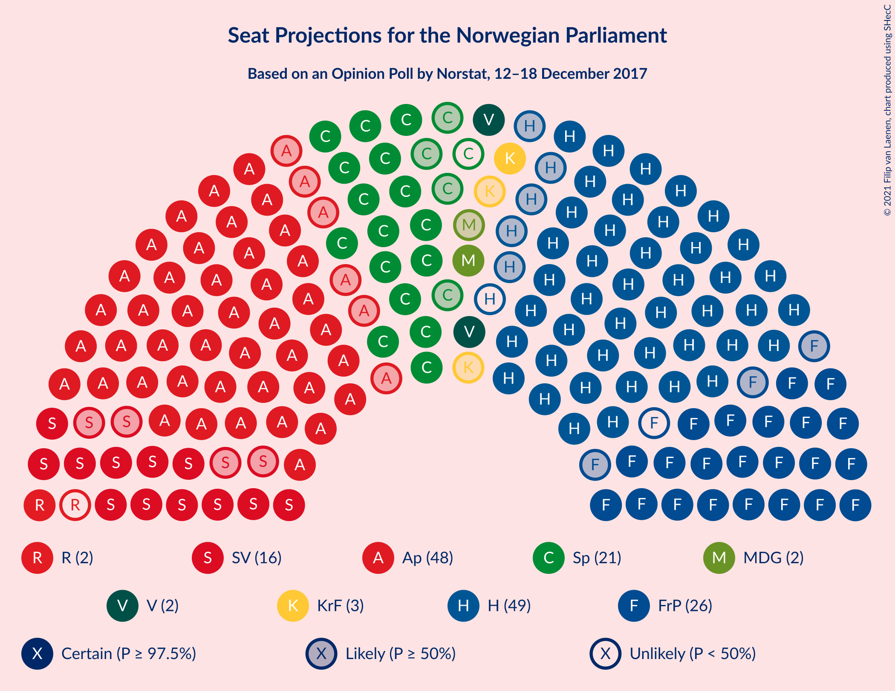
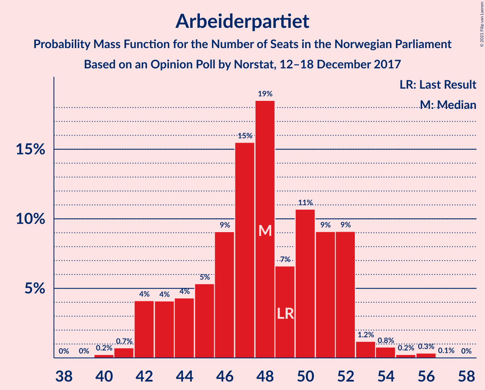
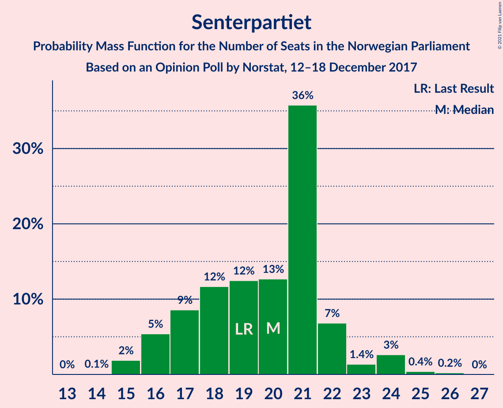
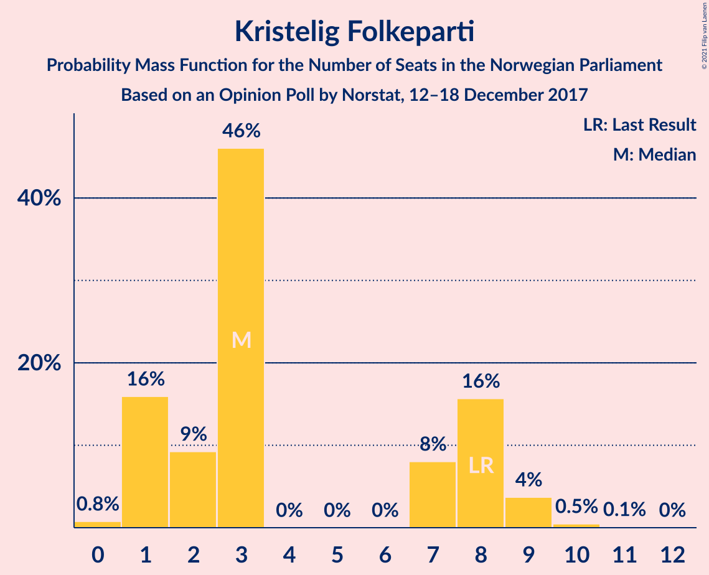
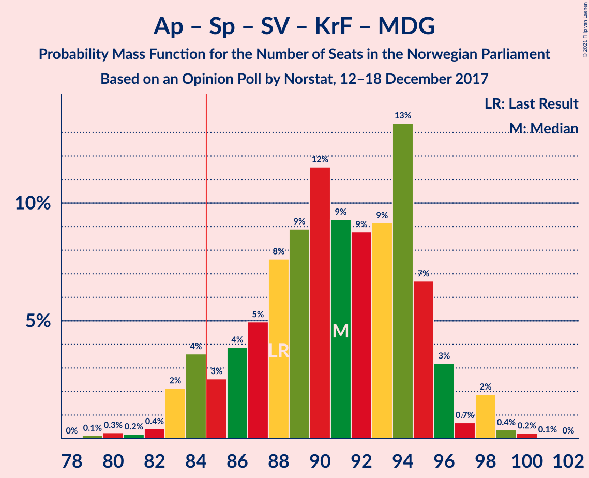
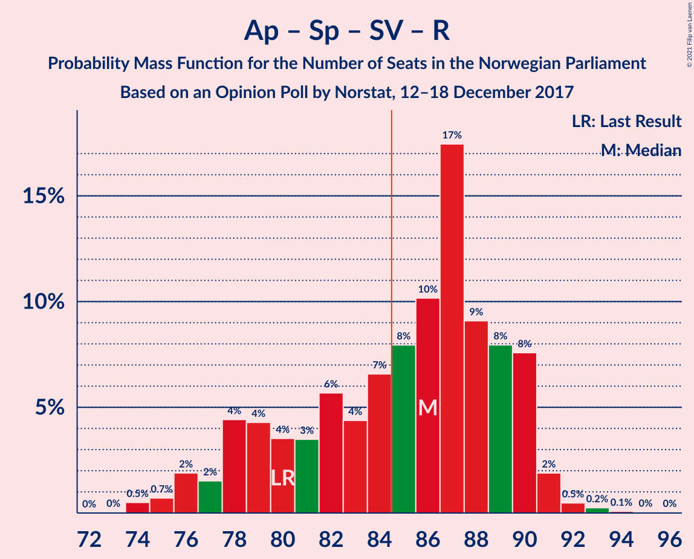
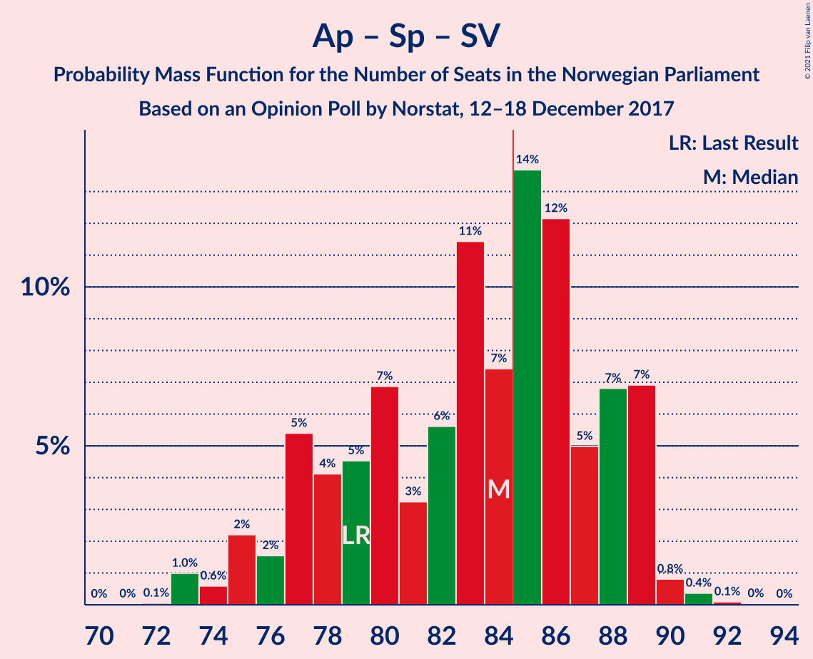
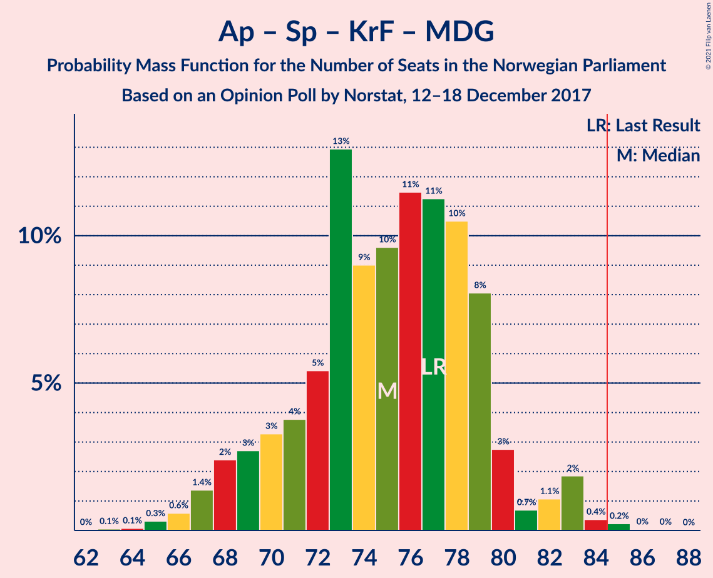

# Opinion Poll by Norstat, 12–18 December 2017

<a href="#voting-intentions">Voting Intentions</a> | <a href="#seats">Seats</a> | <a href="#coalitions">Coalitions</a> | <a href="#technical-information">Technical Information</a>

## Voting Intentions

### Confidence Intervals

| Party | Last Result | Poll Result | 80% Confidence Interval | 90% Confidence Interval | 95% Confidence Interval | 99% Confidence Interval |
|:-----:|:-----------:|:-----------:|:-----------------------:|:-----------------------:|:-----------------------:|:-----------------------:|
| Høyre | 25.0% | 26.4% | 24.7–28.3% |24.2–28.9% |23.7–29.4% |22.9–30.3% |
| Arbeiderpartiet | 27.4% | 25.9% | 24.2–27.8% |23.7–28.3% |23.2–28.8% |22.4–29.7% |
| Fremskrittspartiet | 15.2% | 13.9% | 12.6–15.5% |12.2–15.9% |11.8–16.3% |11.2–17.0% |
| Senterpartiet | 10.3% | 10.5% | 9.4–11.9% |9.0–12.3% |8.7–12.7% |8.2–13.4% |
| Sosialistisk Venstreparti | 6.0% | 8.4% | 7.4–9.7% |7.1–10.1% |6.8–10.4% |6.3–11.0% |
| Miljøpartiet De Grønne | 3.2% | 3.6% | 2.9–4.5% |2.7–4.7% |2.6–5.0% |2.3–5.4% |
| Kristelig Folkeparti | 4.2% | 3.6% | 2.9–4.5% |2.7–4.7% |2.6–5.0% |2.3–5.4% |
| Venstre | 4.4% | 3.4% | 2.7–4.3% |2.5–4.5% |2.4–4.7% |2.1–5.2% |
| Rødt | 2.4% | 2.8% | 2.3–3.7% |2.1–3.9% |2.0–4.1% |1.7–4.5% |

*Note:* The poll result column reflects the actual value used in the calculations. Published results may vary slightly, and in addition be rounded to fewer digits.

## Seats

### Confidence Intervals

| Party | Last Result | Median | 80% Confidence Interval | 90% Confidence Interval | 95% Confidence Interval | 99% Confidence Interval |
|:-----:|:-----------:|:------:|:-----------------------:|:-----------------------:|:-----------------------:|:-----------------------:|
| <a href="#høyre">Høyre</a> | 45 | 47 | 45–52 |44–53 |43–54 |41–56 |
| <a href="#arbeiderpartiet">Arbeiderpartiet</a> | 49 | 48 | 44–51 |43–52 |42–53 |41–56 |
| <a href="#fremskrittspartiet">Fremskrittspartiet</a> | 27 | 26 | 23–29 |22–29 |22–30 |20–31 |
| <a href="#senterpartiet">Senterpartiet</a> | 19 | 20 | 16–22 |16–22 |16–23 |15–25 |
| <a href="#sosialistisk-venstreparti">Sosialistisk Venstreparti</a> | 11 | 15 | 14–17 |13–18 |13–19 |12–20 |
| <a href="#miljøpartiet-de-grønne">Miljøpartiet De Grønne</a> | 1 | 3 | 1–8 |1–9 |1–9 |1–10 |
| <a href="#kristelig-folkeparti">Kristelig Folkeparti</a> | 8 | 3 | 1–8 |1–8 |1–9 |1–10 |
| <a href="#venstre">Venstre</a> | 8 | 2 | 2–7 |2–8 |1–8 |1–9 |
| <a href="#rødt">Rødt</a> | 1 | 1 | 1–2 |1–8 |1–8 |1–8 |

### Høyre

*For a full overview of the results for this party, see the [Høyre](party-høyre.html) page.*

| Number of Seats | Probability | Accumulated | Special Marks |
|:---------------:|:-----------:|:-----------:|:-------------:|
| 40 | 0.3% | 100% |  |
| 41 | 0.3% | 99.6% |  |
| 42 | 1.3% | 99.4% |  |
| 43 | 1.5% | 98% |  |
| 44 | 3% | 97% |  |
| 45 | 12% | 94% | Last Result |
| 46 | 23% | 82% |  |
| 47 | 16% | 59% | Median |
| 48 | 11% | 43% |  |
| 49 | 3% | 32% |  |
| 50 | 6% | 30% |  |
| 51 | 8% | 24% |  |
| 52 | 7% | 16% |  |
| 53 | 4% | 9% |  |
| 54 | 3% | 5% |  |
| 55 | 2% | 2% |  |
| 56 | 0.4% | 0.5% |  |
| 57 | 0% | 0.1% |  |
| 58 | 0% | 0.1% |  |
| 59 | 0% | 0% |  |

### Arbeiderpartiet

*For a full overview of the results for this party, see the [Arbeiderpartiet](party-arbeiderpartiet.html) page.*

| Number of Seats | Probability | Accumulated | Special Marks |
|:---------------:|:-----------:|:-----------:|:-------------:|
| 40 | 0.3% | 100% |  |
| 41 | 1.3% | 99.7% |  |
| 42 | 1.3% | 98% |  |
| 43 | 3% | 97% |  |
| 44 | 7% | 94% |  |
| 45 | 4% | 87% |  |
| 46 | 15% | 83% |  |
| 47 | 12% | 69% |  |
| 48 | 28% | 57% | Median |
| 49 | 4% | 29% | Last Result |
| 50 | 7% | 26% |  |
| 51 | 9% | 18% |  |
| 52 | 6% | 9% |  |
| 53 | 0.7% | 3% |  |
| 54 | 0.6% | 2% |  |
| 55 | 0.4% | 1.5% |  |
| 56 | 1.1% | 1.1% |  |
| 57 | 0% | 0% |  |

### Fremskrittspartiet

*For a full overview of the results for this party, see the [Fremskrittspartiet](party-fremskrittspartiet.html) page.*

| Number of Seats | Probability | Accumulated | Special Marks |
|:---------------:|:-----------:|:-----------:|:-------------:|
| 19 | 0.1% | 100% |  |
| 20 | 0.5% | 99.9% |  |
| 21 | 0.7% | 99.4% |  |
| 22 | 7% | 98.7% |  |
| 23 | 8% | 92% |  |
| 24 | 5% | 84% |  |
| 25 | 13% | 78% |  |
| 26 | 35% | 65% | Median |
| 27 | 13% | 30% | Last Result |
| 28 | 3% | 17% |  |
| 29 | 10% | 14% |  |
| 30 | 1.4% | 4% |  |
| 31 | 2% | 2% |  |
| 32 | 0.2% | 0.3% |  |
| 33 | 0.1% | 0.1% |  |
| 34 | 0% | 0% |  |

### Senterpartiet

*For a full overview of the results for this party, see the [Senterpartiet](party-senterpartiet.html) page.*

| Number of Seats | Probability | Accumulated | Special Marks |
|:---------------:|:-----------:|:-----------:|:-------------:|
| 14 | 0.1% | 100% |  |
| 15 | 2% | 99.9% |  |
| 16 | 11% | 98% |  |
| 17 | 7% | 87% |  |
| 18 | 11% | 80% |  |
| 19 | 17% | 68% | Last Result |
| 20 | 15% | 51% | Median |
| 21 | 24% | 36% |  |
| 22 | 10% | 13% |  |
| 23 | 2% | 3% |  |
| 24 | 0.5% | 1.3% |  |
| 25 | 0.3% | 0.8% |  |
| 26 | 0.5% | 0.5% |  |
| 27 | 0% | 0% |  |

### Sosialistisk Venstreparti

*For a full overview of the results for this party, see the [Sosialistisk Venstreparti](party-sosialistiskvenstreparti.html) page.*

| Number of Seats | Probability | Accumulated | Special Marks |
|:---------------:|:-----------:|:-----------:|:-------------:|
| 11 | 0.4% | 100% | Last Result |
| 12 | 1.3% | 99.6% |  |
| 13 | 7% | 98% |  |
| 14 | 17% | 91% |  |
| 15 | 28% | 74% | Median |
| 16 | 10% | 46% |  |
| 17 | 26% | 35% |  |
| 18 | 5% | 9% |  |
| 19 | 3% | 4% |  |
| 20 | 0.8% | 1.1% |  |
| 21 | 0.2% | 0.2% |  |
| 22 | 0.1% | 0.1% |  |
| 23 | 0% | 0% |  |

### Miljøpartiet De Grønne

*For a full overview of the results for this party, see the [Miljøpartiet De Grønne](party-miljøpartietdegrønne.html) page.*

| Number of Seats | Probability | Accumulated | Special Marks |
|:---------------:|:-----------:|:-----------:|:-------------:|
| 0 | 0.1% | 100% |  |
| 1 | 18% | 99.9% | Last Result |
| 2 | 31% | 82% |  |
| 3 | 15% | 51% | Median |
| 4 | 0.1% | 36% |  |
| 5 | 0% | 36% |  |
| 6 | 0% | 36% |  |
| 7 | 15% | 36% |  |
| 8 | 14% | 21% |  |
| 9 | 6% | 7% |  |
| 10 | 0.5% | 0.6% |  |
| 11 | 0.1% | 0.1% |  |
| 12 | 0% | 0% |  |

### Kristelig Folkeparti

*For a full overview of the results for this party, see the [Kristelig Folkeparti](party-kristeligfolkeparti.html) page.*

| Number of Seats | Probability | Accumulated | Special Marks |
|:---------------:|:-----------:|:-----------:|:-------------:|
| 0 | 0.5% | 100% |  |
| 1 | 29% | 99.5% |  |
| 2 | 11% | 70% |  |
| 3 | 30% | 60% | Median |
| 4 | 0% | 29% |  |
| 5 | 0% | 29% |  |
| 6 | 0% | 29% |  |
| 7 | 5% | 29% |  |
| 8 | 20% | 24% | Last Result |
| 9 | 3% | 4% |  |
| 10 | 0.6% | 0.7% |  |
| 11 | 0.1% | 0.1% |  |
| 12 | 0% | 0% |  |

### Venstre

*For a full overview of the results for this party, see the [Venstre](party-venstre.html) page.*

| Number of Seats | Probability | Accumulated | Special Marks |
|:---------------:|:-----------:|:-----------:|:-------------:|
| 0 | 0.2% | 100% |  |
| 1 | 3% | 99.8% |  |
| 2 | 76% | 97% | Median |
| 3 | 3% | 21% |  |
| 4 | 0% | 18% |  |
| 5 | 0% | 18% |  |
| 6 | 0% | 18% |  |
| 7 | 8% | 18% |  |
| 8 | 8% | 10% | Last Result |
| 9 | 2% | 2% |  |
| 10 | 0.1% | 0.1% |  |
| 11 | 0% | 0% |  |

### Rødt

*For a full overview of the results for this party, see the [Rødt](party-rødt.html) page.*

| Number of Seats | Probability | Accumulated | Special Marks |
|:---------------:|:-----------:|:-----------:|:-------------:|
| 1 | 66% | 100% | Last Result, Median |
| 2 | 28% | 34% |  |
| 3 | 0% | 6% |  |
| 4 | 0% | 6% |  |
| 5 | 0% | 6% |  |
| 6 | 0% | 6% |  |
| 7 | 0.8% | 6% |  |
| 8 | 5% | 5% |  |
| 9 | 0.2% | 0.2% |  |
| 10 | 0% | 0% |  |

## Coalitions

### Confidence Intervals

| Coalition | Last Result | Median | Majority? | 80% Confidence Interval | 90% Confidence Interval | 95% Confidence Interval | 99% Confidence Interval |
|:---------:|:-----------:|:------:|:---------:|:-----------------------:|:-----------------------:|:-----------------------:|:-----------------------:|
| Høyre – Fremskrittspartiet – Senterpartiet – Kristelig Folkeparti – Venstre | 107 | 100 | 100% | 96–104 | 95–106 | 94–107 | 91–108 |
| Arbeiderpartiet – Senterpartiet – Sosialistisk Venstreparti – Kristelig Folkeparti – Miljøpartiet De Grønne | 88 | 90 | 95% | 87–95 | 85–96 | 84–98 | 81–100 |
| Arbeiderpartiet – Senterpartiet – Sosialistisk Venstreparti – Miljøpartiet De Grønne – Rødt | 81 | 89 | 80% | 81–94 | 81–94 | 81–94 | 79–97 |
| Arbeiderpartiet – Senterpartiet – Sosialistisk Venstreparti – Miljøpartiet De Grønne | 80 | 88 | 74% | 80–93 | 80–93 | 79–93 | 78–94 |
| Høyre – Fremskrittspartiet – Kristelig Folkeparti – Miljøpartiet De Grønne – Venstre | 89 | 84 | 46% | 80–91 | 78–91 | 78–92 | 77–93 |
| Arbeiderpartiet – Senterpartiet – Sosialistisk Venstreparti – Rødt | 80 | 85 | 54% | 78–89 | 78–91 | 77–91 | 76–92 |
| Arbeiderpartiet – Senterpartiet – Sosialistisk Venstreparti | 79 | 83 | 38% | 77–87 | 77–88 | 76–90 | 74–91 |
| Høyre – Fremskrittspartiet – Kristelig Folkeparti – Venstre | 88 | 80 | 20% | 75–88 | 75–88 | 75–88 | 72–90 |
| Høyre – Fremskrittspartiet – Venstre | 80 | 77 | 1.4% | 73–81 | 71–83 | 69–84 | 68–85 |
| Arbeiderpartiet – Senterpartiet – Kristelig Folkeparti – Miljøpartiet De Grønne | 77 | 75 | 0.7% | 71–79 | 69–80 | 68–82 | 66–85 |
| Høyre – Fremskrittspartiet | 72 | 73 | 0.1% | 70–78 | 68–80 | 67–81 | 66–82 |
| Arbeiderpartiet – Senterpartiet – Kristelig Folkeparti | 76 | 70 | 0% | 67–75 | 66–77 | 65–78 | 63–79 |
| Arbeiderpartiet – Senterpartiet | 68 | 67 | 0% | 62–72 | 61–72 | 60–74 | 59–75 |
| Arbeiderpartiet – Sosialistisk Venstreparti | 60 | 63 | 0% | 60–66 | 59–69 | 58–69 | 55–72 |
| Høyre – Kristelig Folkeparti – Venstre | 61 | 54 | 0% | 49–62 | 49–62 | 49–63 | 47–64 |
| Senterpartiet – Kristelig Folkeparti – Venstre | 35 | 25 | 0% | 22–31 | 21–31 | 21–33 | 19–37 |

### Høyre – Fremskrittspartiet – Senterpartiet – Kristelig Folkeparti – Venstre

| Number of Seats | Probability | Accumulated | Special Marks |
|:---------------:|:-----------:|:-----------:|:-------------:|
| 90 | 0.1% | 100% |  |
| 91 | 0.8% | 99.9% |  |
| 92 | 0.5% | 99.1% |  |
| 93 | 0.6% | 98.6% |  |
| 94 | 2% | 98% |  |
| 95 | 5% | 96% |  |
| 96 | 16% | 92% |  |
| 97 | 7% | 75% |  |
| 98 | 7% | 68% | Median |
| 99 | 10% | 61% |  |
| 100 | 11% | 51% |  |
| 101 | 2% | 40% |  |
| 102 | 8% | 38% |  |
| 103 | 10% | 30% |  |
| 104 | 10% | 19% |  |
| 105 | 4% | 10% |  |
| 106 | 2% | 6% |  |
| 107 | 3% | 4% | Last Result |
| 108 | 1.1% | 2% |  |
| 109 | 0.2% | 0.4% |  |
| 110 | 0% | 0.2% |  |
| 111 | 0.1% | 0.2% |  |
| 112 | 0.1% | 0.1% |  |
| 113 | 0% | 0% |  |

### Arbeiderpartiet – Senterpartiet – Sosialistisk Venstreparti – Kristelig Folkeparti – Miljøpartiet De Grønne

| Number of Seats | Probability | Accumulated | Special Marks |
|:---------------:|:-----------:|:-----------:|:-------------:|
| 79 | 0.1% | 100% |  |
| 80 | 0.2% | 99.8% |  |
| 81 | 0.3% | 99.7% |  |
| 82 | 0.4% | 99.4% |  |
| 83 | 1.2% | 99.0% |  |
| 84 | 3% | 98% |  |
| 85 | 2% | 95% | Majority |
| 86 | 3% | 93% |  |
| 87 | 3% | 90% |  |
| 88 | 19% | 87% | Last Result |
| 89 | 12% | 68% | Median |
| 90 | 8% | 56% |  |
| 91 | 11% | 48% |  |
| 92 | 5% | 37% |  |
| 93 | 9% | 33% |  |
| 94 | 13% | 23% |  |
| 95 | 2% | 10% |  |
| 96 | 3% | 8% |  |
| 97 | 0.8% | 5% |  |
| 98 | 2% | 4% |  |
| 99 | 0.9% | 2% |  |
| 100 | 0.6% | 0.7% |  |
| 101 | 0% | 0.1% |  |
| 102 | 0% | 0% |  |

### Arbeiderpartiet – Senterpartiet – Sosialistisk Venstreparti – Miljøpartiet De Grønne – Rødt

| Number of Seats | Probability | Accumulated | Special Marks |
|:---------------:|:-----------:|:-----------:|:-------------:|
| 78 | 0.1% | 100% |  |
| 79 | 0.5% | 99.8% |  |
| 80 | 1.4% | 99.3% |  |
| 81 | 9% | 98% | Last Result |
| 82 | 3% | 89% |  |
| 83 | 3% | 86% |  |
| 84 | 3% | 83% |  |
| 85 | 4% | 80% | Majority |
| 86 | 6% | 76% |  |
| 87 | 8% | 70% | Median |
| 88 | 2% | 62% |  |
| 89 | 15% | 60% |  |
| 90 | 11% | 44% |  |
| 91 | 5% | 34% |  |
| 92 | 6% | 28% |  |
| 93 | 8% | 23% |  |
| 94 | 13% | 15% |  |
| 95 | 1.2% | 2% |  |
| 96 | 0.2% | 0.7% |  |
| 97 | 0.2% | 0.6% |  |
| 98 | 0.3% | 0.4% |  |
| 99 | 0% | 0% |  |

### Arbeiderpartiet – Senterpartiet – Sosialistisk Venstreparti – Miljøpartiet De Grønne

| Number of Seats | Probability | Accumulated | Special Marks |
|:---------------:|:-----------:|:-----------:|:-------------:|
| 75 | 0% | 100% |  |
| 76 | 0.1% | 99.9% |  |
| 77 | 0.2% | 99.9% |  |
| 78 | 0.8% | 99.7% |  |
| 79 | 3% | 98.9% |  |
| 80 | 8% | 96% | Last Result |
| 81 | 4% | 88% |  |
| 82 | 4% | 85% |  |
| 83 | 4% | 80% |  |
| 84 | 3% | 76% |  |
| 85 | 15% | 74% | Majority |
| 86 | 3% | 58% | Median |
| 87 | 3% | 56% |  |
| 88 | 16% | 53% |  |
| 89 | 10% | 36% |  |
| 90 | 6% | 26% |  |
| 91 | 3% | 20% |  |
| 92 | 4% | 17% |  |
| 93 | 12% | 14% |  |
| 94 | 0.8% | 1.3% |  |
| 95 | 0.1% | 0.5% |  |
| 96 | 0.3% | 0.4% |  |
| 97 | 0% | 0% |  |

### Høyre – Fremskrittspartiet – Kristelig Folkeparti – Miljøpartiet De Grønne – Venstre

| Number of Seats | Probability | Accumulated | Special Marks |
|:---------------:|:-----------:|:-----------:|:-------------:|
| 74 | 0% | 100% |  |
| 75 | 0.2% | 99.9% |  |
| 76 | 0.2% | 99.8% |  |
| 77 | 1.0% | 99.5% |  |
| 78 | 6% | 98% |  |
| 79 | 1.0% | 93% |  |
| 80 | 3% | 92% |  |
| 81 | 12% | 89% | Median |
| 82 | 13% | 77% |  |
| 83 | 12% | 64% |  |
| 84 | 6% | 52% |  |
| 85 | 8% | 46% | Majority |
| 86 | 4% | 38% |  |
| 87 | 9% | 34% |  |
| 88 | 6% | 25% |  |
| 89 | 3% | 18% | Last Result |
| 90 | 3% | 15% |  |
| 91 | 9% | 12% |  |
| 92 | 3% | 3% |  |
| 93 | 0.4% | 0.8% |  |
| 94 | 0.3% | 0.4% |  |
| 95 | 0.1% | 0.1% |  |
| 96 | 0% | 0.1% |  |
| 97 | 0% | 0% |  |

### Arbeiderpartiet – Senterpartiet – Sosialistisk Venstreparti – Rødt

| Number of Seats | Probability | Accumulated | Special Marks |
|:---------------:|:-----------:|:-----------:|:-------------:|
| 73 | 0% | 100% |  |
| 74 | 0.1% | 99.9% |  |
| 75 | 0.3% | 99.9% |  |
| 76 | 0.4% | 99.6% |  |
| 77 | 3% | 99.2% |  |
| 78 | 9% | 97% |  |
| 79 | 3% | 88% |  |
| 80 | 3% | 85% | Last Result |
| 81 | 6% | 82% |  |
| 82 | 9% | 75% |  |
| 83 | 4% | 66% |  |
| 84 | 8% | 62% | Median |
| 85 | 6% | 54% | Majority |
| 86 | 12% | 48% |  |
| 87 | 13% | 36% |  |
| 88 | 12% | 23% |  |
| 89 | 3% | 11% |  |
| 90 | 1.0% | 8% |  |
| 91 | 6% | 7% |  |
| 92 | 1.0% | 2% |  |
| 93 | 0.2% | 0.5% |  |
| 94 | 0.2% | 0.2% |  |
| 95 | 0% | 0.1% |  |
| 96 | 0% | 0% |  |

### Arbeiderpartiet – Senterpartiet – Sosialistisk Venstreparti

| Number of Seats | Probability | Accumulated | Special Marks |
|:---------------:|:-----------:|:-----------:|:-------------:|
| 71 | 0% | 100% |  |
| 72 | 0.1% | 99.9% |  |
| 73 | 0.2% | 99.8% |  |
| 74 | 0.2% | 99.6% |  |
| 75 | 2% | 99.3% |  |
| 76 | 2% | 98% |  |
| 77 | 10% | 96% |  |
| 78 | 2% | 86% |  |
| 79 | 3% | 84% | Last Result |
| 80 | 14% | 80% |  |
| 81 | 3% | 67% |  |
| 82 | 8% | 64% |  |
| 83 | 11% | 56% | Median |
| 84 | 7% | 45% |  |
| 85 | 8% | 38% | Majority |
| 86 | 12% | 30% |  |
| 87 | 12% | 18% |  |
| 88 | 2% | 6% |  |
| 89 | 0.3% | 4% |  |
| 90 | 2% | 3% |  |
| 91 | 0.9% | 1.2% |  |
| 92 | 0.3% | 0.3% |  |
| 93 | 0% | 0.1% |  |
| 94 | 0% | 0% |  |

### Høyre – Fremskrittspartiet – Kristelig Folkeparti – Venstre

| Number of Seats | Probability | Accumulated | Special Marks |
|:---------------:|:-----------:|:-----------:|:-------------:|
| 71 | 0.3% | 100% |  |
| 72 | 0.2% | 99.6% |  |
| 73 | 0.2% | 99.4% |  |
| 74 | 1.2% | 99.3% |  |
| 75 | 13% | 98% |  |
| 76 | 8% | 85% |  |
| 77 | 6% | 77% |  |
| 78 | 5% | 72% | Median |
| 79 | 11% | 66% |  |
| 80 | 15% | 56% |  |
| 81 | 2% | 40% |  |
| 82 | 8% | 38% |  |
| 83 | 6% | 30% |  |
| 84 | 4% | 24% |  |
| 85 | 3% | 20% | Majority |
| 86 | 3% | 17% |  |
| 87 | 3% | 14% |  |
| 88 | 9% | 11% | Last Result |
| 89 | 1.4% | 2% |  |
| 90 | 0.5% | 0.7% |  |
| 91 | 0.1% | 0.2% |  |
| 92 | 0% | 0% |  |

### Høyre – Fremskrittspartiet – Venstre

| Number of Seats | Probability | Accumulated | Special Marks |
|:---------------:|:-----------:|:-----------:|:-------------:|
| 67 | 0.1% | 100% |  |
| 68 | 1.5% | 99.8% |  |
| 69 | 1.2% | 98% |  |
| 70 | 2% | 97% |  |
| 71 | 3% | 96% |  |
| 72 | 2% | 93% |  |
| 73 | 6% | 91% |  |
| 74 | 20% | 85% |  |
| 75 | 3% | 65% | Median |
| 76 | 4% | 61% |  |
| 77 | 16% | 57% |  |
| 78 | 4% | 42% |  |
| 79 | 15% | 38% |  |
| 80 | 11% | 23% | Last Result |
| 81 | 4% | 12% |  |
| 82 | 2% | 7% |  |
| 83 | 2% | 6% |  |
| 84 | 2% | 4% |  |
| 85 | 1.0% | 1.4% | Majority |
| 86 | 0.1% | 0.4% |  |
| 87 | 0.1% | 0.3% |  |
| 88 | 0.1% | 0.1% |  |
| 89 | 0% | 0% |  |

### Arbeiderpartiet – Senterpartiet – Kristelig Folkeparti – Miljøpartiet De Grønne

| Number of Seats | Probability | Accumulated | Special Marks |
|:---------------:|:-----------:|:-----------:|:-------------:|
| 63 | 0.1% | 100% |  |
| 64 | 0.1% | 99.9% |  |
| 65 | 0.2% | 99.8% |  |
| 66 | 0.2% | 99.6% |  |
| 67 | 1.0% | 99.4% |  |
| 68 | 2% | 98% |  |
| 69 | 3% | 96% |  |
| 70 | 2% | 93% |  |
| 71 | 6% | 91% |  |
| 72 | 4% | 85% |  |
| 73 | 15% | 81% |  |
| 74 | 10% | 66% | Median |
| 75 | 10% | 57% |  |
| 76 | 14% | 47% |  |
| 77 | 16% | 33% | Last Result |
| 78 | 2% | 17% |  |
| 79 | 7% | 15% |  |
| 80 | 4% | 8% |  |
| 81 | 1.0% | 4% |  |
| 82 | 1.1% | 3% |  |
| 83 | 0.1% | 2% |  |
| 84 | 0.9% | 2% |  |
| 85 | 0.6% | 0.7% | Majority |
| 86 | 0% | 0% |  |

### Høyre – Fremskrittspartiet

| Number of Seats | Probability | Accumulated | Special Marks |
|:---------------:|:-----------:|:-----------:|:-------------:|
| 62 | 0.1% | 100% |  |
| 63 | 0.1% | 99.9% |  |
| 64 | 0.2% | 99.9% |  |
| 65 | 0.2% | 99.7% |  |
| 66 | 2% | 99.5% |  |
| 67 | 1.3% | 98% |  |
| 68 | 2% | 96% |  |
| 69 | 4% | 94% |  |
| 70 | 3% | 91% |  |
| 71 | 11% | 88% |  |
| 72 | 20% | 77% | Last Result |
| 73 | 11% | 57% | Median |
| 74 | 4% | 46% |  |
| 75 | 15% | 43% |  |
| 76 | 3% | 28% |  |
| 77 | 15% | 25% |  |
| 78 | 1.1% | 10% |  |
| 79 | 3% | 9% |  |
| 80 | 2% | 6% |  |
| 81 | 2% | 4% |  |
| 82 | 2% | 2% |  |
| 83 | 0.2% | 0.4% |  |
| 84 | 0% | 0.1% |  |
| 85 | 0.1% | 0.1% | Majority |
| 86 | 0% | 0% |  |

### Arbeiderpartiet – Senterpartiet – Kristelig Folkeparti

| Number of Seats | Probability | Accumulated | Special Marks |
|:---------------:|:-----------:|:-----------:|:-------------:|
| 60 | 0% | 100% |  |
| 61 | 0.1% | 99.9% |  |
| 62 | 0.2% | 99.8% |  |
| 63 | 0.7% | 99.6% |  |
| 64 | 0.9% | 98.9% |  |
| 65 | 2% | 98% |  |
| 66 | 5% | 96% |  |
| 67 | 6% | 91% |  |
| 68 | 5% | 85% |  |
| 69 | 9% | 80% |  |
| 70 | 21% | 71% |  |
| 71 | 9% | 50% | Median |
| 72 | 11% | 41% |  |
| 73 | 8% | 30% |  |
| 74 | 10% | 22% |  |
| 75 | 5% | 12% |  |
| 76 | 0.8% | 6% | Last Result |
| 77 | 2% | 5% |  |
| 78 | 3% | 4% |  |
| 79 | 0.8% | 1.2% |  |
| 80 | 0.1% | 0.4% |  |
| 81 | 0.2% | 0.3% |  |
| 82 | 0% | 0.1% |  |
| 83 | 0% | 0% |  |

### Arbeiderpartiet – Senterpartiet

| Number of Seats | Probability | Accumulated | Special Marks |
|:---------------:|:-----------:|:-----------:|:-------------:|
| 57 | 0.1% | 100% |  |
| 58 | 0.2% | 99.9% |  |
| 59 | 0.7% | 99.7% |  |
| 60 | 2% | 99.0% |  |
| 61 | 3% | 97% |  |
| 62 | 8% | 95% |  |
| 63 | 3% | 86% |  |
| 64 | 6% | 83% |  |
| 65 | 6% | 76% |  |
| 66 | 14% | 70% |  |
| 67 | 6% | 56% |  |
| 68 | 10% | 50% | Last Result, Median |
| 69 | 13% | 40% |  |
| 70 | 7% | 27% |  |
| 71 | 9% | 19% |  |
| 72 | 7% | 10% |  |
| 73 | 0.4% | 3% |  |
| 74 | 2% | 3% |  |
| 75 | 0.6% | 0.8% |  |
| 76 | 0.1% | 0.2% |  |
| 77 | 0% | 0.1% |  |
| 78 | 0% | 0.1% |  |
| 79 | 0% | 0% |  |

### Arbeiderpartiet – Sosialistisk Venstreparti

| Number of Seats | Probability | Accumulated | Special Marks |
|:---------------:|:-----------:|:-----------:|:-------------:|
| 53 | 0.1% | 100% |  |
| 54 | 0.2% | 99.9% |  |
| 55 | 0.2% | 99.7% |  |
| 56 | 1.2% | 99.4% |  |
| 57 | 0.5% | 98% |  |
| 58 | 2% | 98% |  |
| 59 | 5% | 96% |  |
| 60 | 4% | 91% | Last Result |
| 61 | 15% | 87% |  |
| 62 | 15% | 72% |  |
| 63 | 10% | 57% | Median |
| 64 | 6% | 47% |  |
| 65 | 17% | 41% |  |
| 66 | 16% | 24% |  |
| 67 | 2% | 8% |  |
| 68 | 1.3% | 6% |  |
| 69 | 3% | 5% |  |
| 70 | 0.7% | 2% |  |
| 71 | 0.1% | 2% |  |
| 72 | 1.4% | 1.4% |  |
| 73 | 0.1% | 0.1% |  |
| 74 | 0% | 0% |  |

### Høyre – Kristelig Folkeparti – Venstre

| Number of Seats | Probability | Accumulated | Special Marks |
|:---------------:|:-----------:|:-----------:|:-------------:|
| 46 | 0.1% | 100% |  |
| 47 | 0.6% | 99.9% |  |
| 48 | 1.0% | 99.3% |  |
| 49 | 12% | 98% |  |
| 50 | 11% | 86% |  |
| 51 | 6% | 74% |  |
| 52 | 2% | 68% | Median |
| 53 | 11% | 66% |  |
| 54 | 7% | 55% |  |
| 55 | 5% | 48% |  |
| 56 | 5% | 43% |  |
| 57 | 12% | 39% |  |
| 58 | 9% | 27% |  |
| 59 | 3% | 18% |  |
| 60 | 1.4% | 15% |  |
| 61 | 2% | 14% | Last Result |
| 62 | 8% | 11% |  |
| 63 | 3% | 4% |  |
| 64 | 0.6% | 0.9% |  |
| 65 | 0.1% | 0.2% |  |
| 66 | 0.1% | 0.1% |  |
| 67 | 0% | 0.1% |  |
| 68 | 0% | 0.1% |  |
| 69 | 0.1% | 0.1% |  |
| 70 | 0% | 0% |  |

### Senterpartiet – Kristelig Folkeparti – Venstre

| Number of Seats | Probability | Accumulated | Special Marks |
|:---------------:|:-----------:|:-----------:|:-------------:|
| 18 | 0.2% | 100% |  |
| 19 | 0.4% | 99.8% |  |
| 20 | 0.3% | 99.4% |  |
| 21 | 5% | 99.2% |  |
| 22 | 8% | 94% |  |
| 23 | 5% | 86% |  |
| 24 | 18% | 81% |  |
| 25 | 15% | 63% | Median |
| 26 | 7% | 48% |  |
| 27 | 12% | 41% |  |
| 28 | 4% | 29% |  |
| 29 | 5% | 25% |  |
| 30 | 3% | 20% |  |
| 31 | 12% | 16% |  |
| 32 | 1.0% | 5% |  |
| 33 | 2% | 4% |  |
| 34 | 0.4% | 2% |  |
| 35 | 0.3% | 2% | Last Result |
| 36 | 0.8% | 2% |  |
| 37 | 0.6% | 0.8% |  |
| 38 | 0.1% | 0.2% |  |
| 39 | 0% | 0.1% |  |
| 40 | 0.1% | 0.1% |  |
| 41 | 0% | 0% |  |

## Technical Information

### Opinion Poll

+ **Polling firm:** Norstat
+ **Commissioner(s):** —
+ **Fieldwork period:** 12–18 December 2017

### Calculations

+ **Sample size:** 949
+ **Simulations done:** 262,144
+ **Error estimate:** 1.72%

