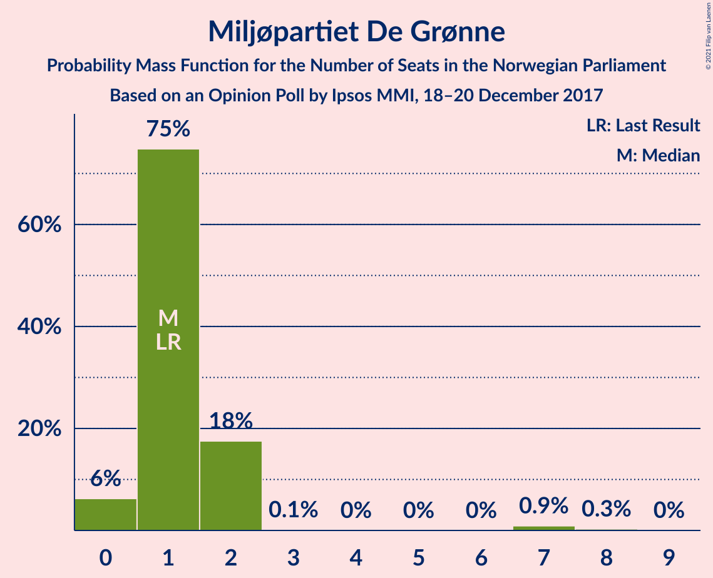
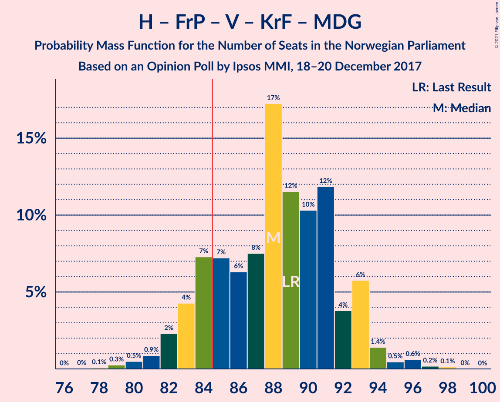
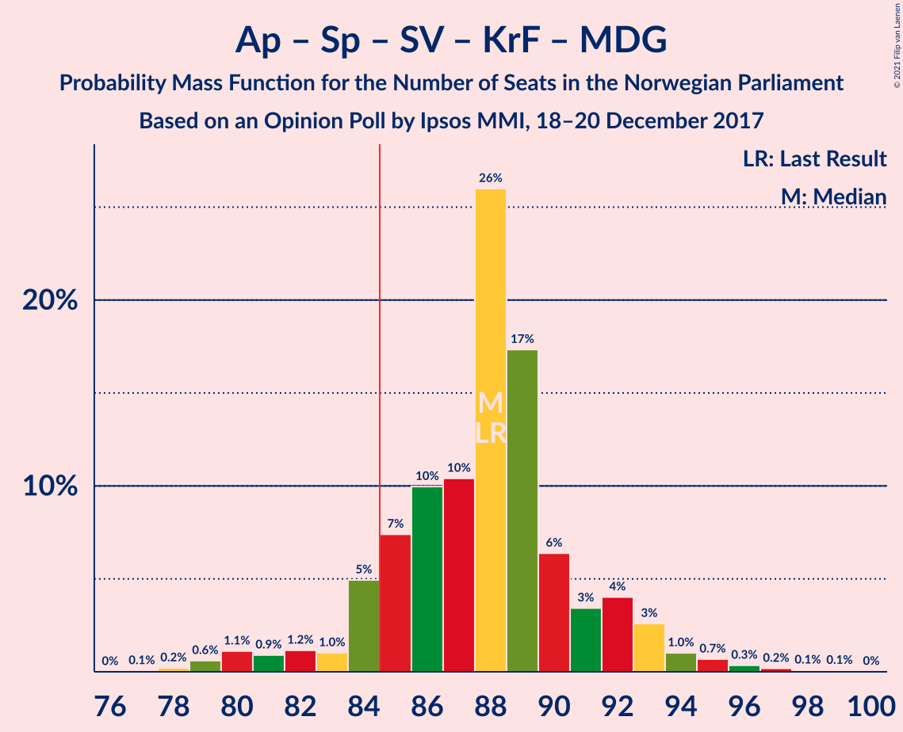
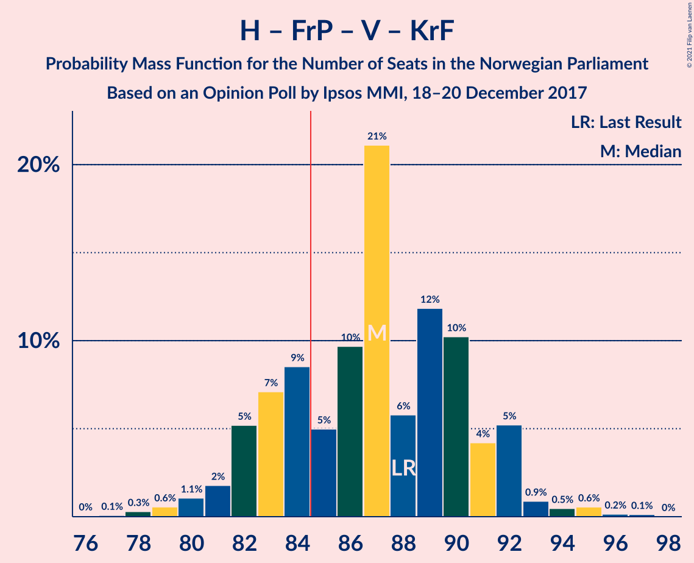
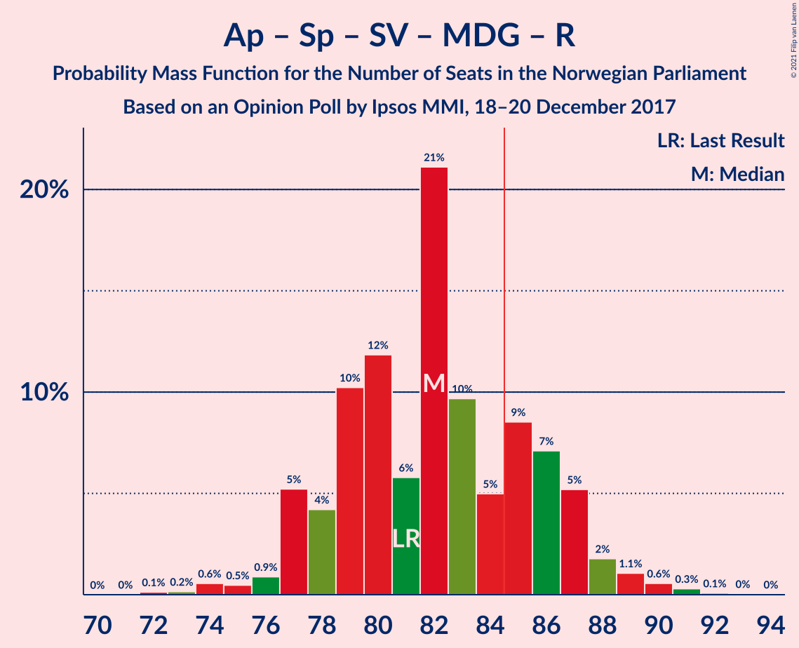
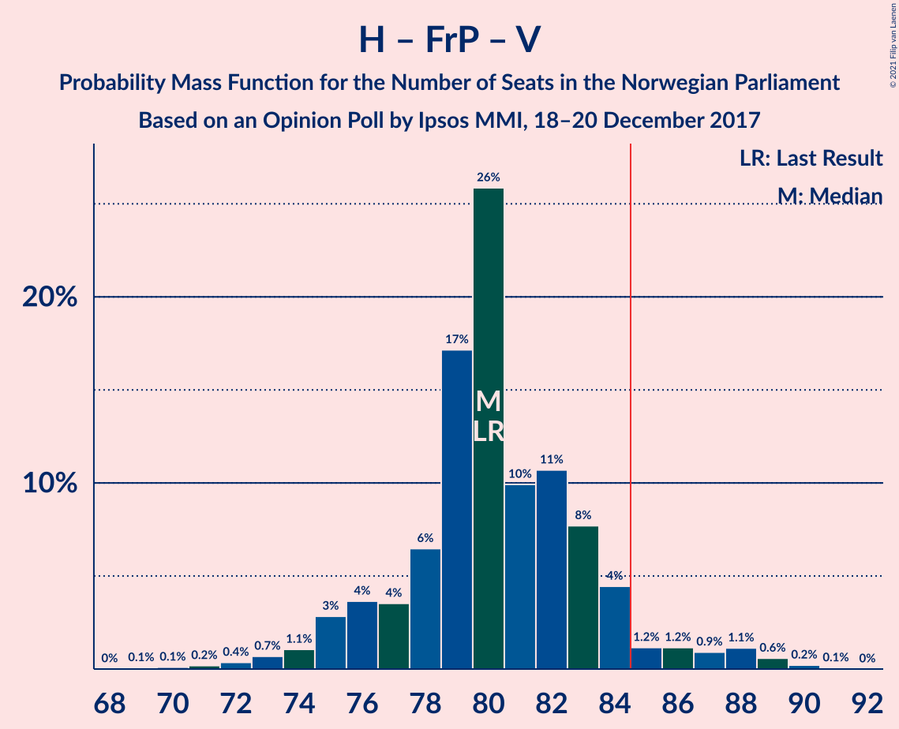
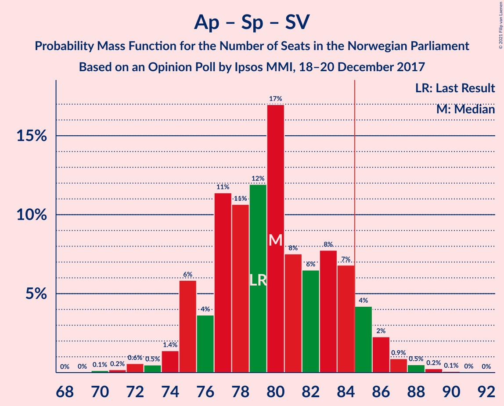
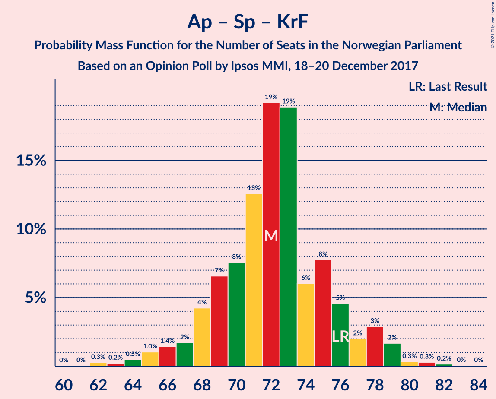
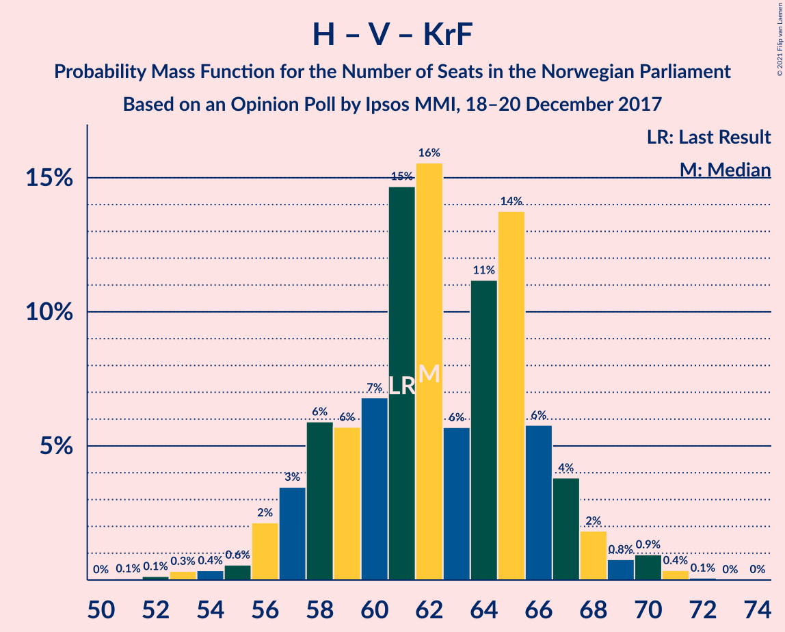
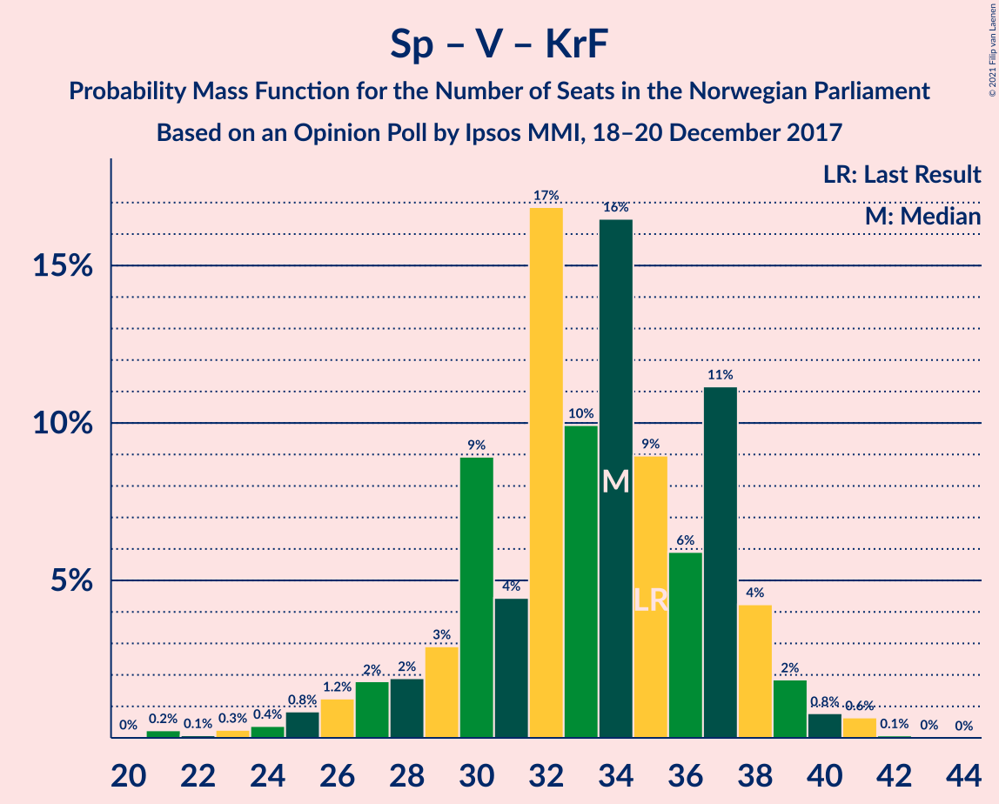

# Opinion Poll by Ipsos MMI, 18–20 December 2017

<a href="#voting-intentions">Voting Intentions</a> | <a href="#seats">Seats</a> | <a href="#coalitions">Coalitions</a> | <a href="#technical-information">Technical Information</a>

## Voting Intentions

### Confidence Intervals

| Party | Last Result | Poll Result | 80% Confidence Interval | 90% Confidence Interval | 95% Confidence Interval | 99% Confidence Interval |
|:-----:|:-----------:|:-----------:|:-----------------------:|:-----------------------:|:-----------------------:|:-----------------------:|
| Høyre | 25.0% | 26.5% | 24.7–28.4% |24.2–28.9% |23.7–29.4% |22.9–30.4% |
| Arbeiderpartiet | 27.4% | 26.3% | 24.5–28.2% |24.0–28.7% |23.5–29.2% |22.7–30.1% |
| Fremskrittspartiet | 15.2% | 13.7% | 12.3–15.2% |11.9–15.7% |11.6–16.0% |11.0–16.8% |
| Senterpartiet | 10.3% | 10.1% | 8.9–11.5% |8.6–11.9% |8.3–12.2% |7.8–12.9% |
| Sosialistisk Venstreparti | 6.0% | 8.0% | 6.9–9.2% |6.6–9.6% |6.4–9.9% |5.9–10.5% |
| Venstre | 4.4% | 4.8% | 4.0–5.9% |3.8–6.2% |3.6–6.4% |3.3–7.0% |
| Kristelig Folkeparti | 4.2% | 4.3% | 3.6–5.3% |3.4–5.6% |3.2–5.8% |2.9–6.3% |
| Miljøpartiet De Grønne | 3.2% | 2.6% | 2.0–3.4% |1.9–3.6% |1.7–3.8% |1.5–4.2% |
| Rødt | 2.4% | 1.9% | 1.5–2.7% |1.3–2.9% |1.2–3.0% |1.0–3.4% |

*Note:* The poll result column reflects the actual value used in the calculations. Published results may vary slightly, and in addition be rounded to fewer digits.

## Seats

### Confidence Intervals

| Party | Last Result | Median | 80% Confidence Interval | 90% Confidence Interval | 95% Confidence Interval | 99% Confidence Interval |
|:-----:|:-----------:|:------:|:-----------------------:|:-----------------------:|:-----------------------:|:-----------------------:|
| <a href="#høyre">Høyre</a> | 45 | 45 | 44–51 |43–53 |43–53 |40–55 |
| <a href="#arbeiderpartiet">Arbeiderpartiet</a> | 49 | 49 | 44–51 |43–52 |43–53 |41–55 |
| <a href="#fremskrittspartiet">Fremskrittspartiet</a> | 27 | 26 | 22–27 |21–29 |20–29 |20–30 |
| <a href="#senterpartiet">Senterpartiet</a> | 19 | 16 | 16–20 |15–21 |15–21 |14–23 |
| <a href="#sosialistisk-venstreparti">Sosialistisk Venstreparti</a> | 11 | 14 | 12–16 |12–17 |12–18 |11–19 |
| <a href="#venstre">Venstre</a> | 8 | 8 | 8–10 |3–11 |2–12 |2–13 |
| <a href="#kristelig-folkeparti">Kristelig Folkeparti</a> | 8 | 8 | 3–9 |2–10 |2–10 |1–11 |
| <a href="#miljøpartiet-de-grønne">Miljøpartiet De Grønne</a> | 1 | 2 | 0–2 |0–2 |0–2 |0–7 |
| <a href="#rødt">Rødt</a> | 1 | 1 | 1 |1–2 |0–2 |0–2 |

### Høyre

*For a full overview of the results for this party, see the [Høyre](party-høyre.html) page.*

| Number of Seats | Probability | Accumulated | Special Marks |
|:---------------:|:-----------:|:-----------:|:-------------:|
| 39 | 0.1% | 100% |  |
| 40 | 0.8% | 99.9% |  |
| 41 | 0.5% | 99.1% |  |
| 42 | 1.0% | 98.6% |  |
| 43 | 5% | 98% |  |
| 44 | 7% | 92% |  |
| 45 | 47% | 85% | Last Result, Median |
| 46 | 2% | 39% |  |
| 47 | 13% | 36% |  |
| 48 | 3% | 24% |  |
| 49 | 2% | 20% |  |
| 50 | 4% | 18% |  |
| 51 | 5% | 14% |  |
| 52 | 4% | 9% |  |
| 53 | 4% | 6% |  |
| 54 | 0.5% | 2% |  |
| 55 | 2% | 2% |  |
| 56 | 0.1% | 0.1% |  |
| 57 | 0% | 0.1% |  |
| 58 | 0% | 0% |  |

### Arbeiderpartiet

*For a full overview of the results for this party, see the [Arbeiderpartiet](party-arbeiderpartiet.html) page.*

| Number of Seats | Probability | Accumulated | Special Marks |
|:---------------:|:-----------:|:-----------:|:-------------:|
| 40 | 0.1% | 100% |  |
| 41 | 0.6% | 99.8% |  |
| 42 | 2% | 99.2% |  |
| 43 | 7% | 98% |  |
| 44 | 3% | 91% |  |
| 45 | 7% | 88% |  |
| 46 | 4% | 81% |  |
| 47 | 15% | 77% |  |
| 48 | 4% | 62% |  |
| 49 | 40% | 58% | Last Result, Median |
| 50 | 6% | 18% |  |
| 51 | 5% | 13% |  |
| 52 | 3% | 8% |  |
| 53 | 3% | 5% |  |
| 54 | 0.8% | 2% |  |
| 55 | 0.5% | 0.9% |  |
| 56 | 0.3% | 0.4% |  |
| 57 | 0% | 0.1% |  |
| 58 | 0% | 0% |  |

### Fremskrittspartiet

*For a full overview of the results for this party, see the [Fremskrittspartiet](party-fremskrittspartiet.html) page.*

| Number of Seats | Probability | Accumulated | Special Marks |
|:---------------:|:-----------:|:-----------:|:-------------:|
| 18 | 0.1% | 100% |  |
| 19 | 0.2% | 99.9% |  |
| 20 | 4% | 99.7% |  |
| 21 | 5% | 96% |  |
| 22 | 5% | 92% |  |
| 23 | 5% | 86% |  |
| 24 | 12% | 81% |  |
| 25 | 8% | 69% |  |
| 26 | 44% | 61% | Median |
| 27 | 8% | 17% | Last Result |
| 28 | 3% | 9% |  |
| 29 | 3% | 6% |  |
| 30 | 2% | 2% |  |
| 31 | 0.1% | 0.4% |  |
| 32 | 0.1% | 0.3% |  |
| 33 | 0.2% | 0.2% |  |
| 34 | 0% | 0% |  |

### Senterpartiet

*For a full overview of the results for this party, see the [Senterpartiet](party-senterpartiet.html) page.*

| Number of Seats | Probability | Accumulated | Special Marks |
|:---------------:|:-----------:|:-----------:|:-------------:|
| 13 | 0.2% | 100% |  |
| 14 | 0.6% | 99.8% |  |
| 15 | 6% | 99.2% |  |
| 16 | 45% | 93% | Median |
| 17 | 8% | 48% |  |
| 18 | 13% | 40% |  |
| 19 | 9% | 27% | Last Result |
| 20 | 11% | 17% |  |
| 21 | 5% | 7% |  |
| 22 | 0.8% | 2% |  |
| 23 | 0.5% | 0.9% |  |
| 24 | 0.4% | 0.4% |  |
| 25 | 0% | 0.1% |  |
| 26 | 0% | 0% |  |

### Sosialistisk Venstreparti

*For a full overview of the results for this party, see the [Sosialistisk Venstreparti](party-sosialistiskvenstreparti.html) page.*

| Number of Seats | Probability | Accumulated | Special Marks |
|:---------------:|:-----------:|:-----------:|:-------------:|
| 10 | 0.4% | 100% |  |
| 11 | 0.9% | 99.5% | Last Result |
| 12 | 9% | 98.6% |  |
| 13 | 18% | 90% |  |
| 14 | 45% | 72% | Median |
| 15 | 8% | 27% |  |
| 16 | 11% | 19% |  |
| 17 | 5% | 8% |  |
| 18 | 2% | 3% |  |
| 19 | 0.6% | 0.8% |  |
| 20 | 0.2% | 0.2% |  |
| 21 | 0.1% | 0.1% |  |
| 22 | 0% | 0% |  |

### Venstre

*For a full overview of the results for this party, see the [Venstre](party-venstre.html) page.*

| Number of Seats | Probability | Accumulated | Special Marks |
|:---------------:|:-----------:|:-----------:|:-------------:|
| 2 | 4% | 100% |  |
| 3 | 4% | 96% |  |
| 4 | 0% | 92% |  |
| 5 | 0% | 92% |  |
| 6 | 0% | 92% |  |
| 7 | 1.4% | 92% |  |
| 8 | 51% | 90% | Last Result, Median |
| 9 | 17% | 40% |  |
| 10 | 16% | 23% |  |
| 11 | 3% | 6% |  |
| 12 | 2% | 3% |  |
| 13 | 1.0% | 1.2% |  |
| 14 | 0.1% | 0.1% |  |
| 15 | 0% | 0% |  |

### Kristelig Folkeparti

*For a full overview of the results for this party, see the [Kristelig Folkeparti](party-kristeligfolkeparti.html) page.*

| Number of Seats | Probability | Accumulated | Special Marks |
|:---------------:|:-----------:|:-----------:|:-------------:|
| 1 | 2% | 100% |  |
| 2 | 4% | 98% |  |
| 3 | 17% | 94% |  |
| 4 | 0% | 77% |  |
| 5 | 0% | 77% |  |
| 6 | 0% | 77% |  |
| 7 | 6% | 77% |  |
| 8 | 48% | 71% | Last Result, Median |
| 9 | 16% | 23% |  |
| 10 | 6% | 7% |  |
| 11 | 1.3% | 1.5% |  |
| 12 | 0.2% | 0.2% |  |
| 13 | 0% | 0% |  |

### Miljøpartiet De Grønne

*For a full overview of the results for this party, see the [Miljøpartiet De Grønne](party-miljøpartietdegrønne.html) page.*

| Number of Seats | Probability | Accumulated | Special Marks |
|:---------------:|:-----------:|:-----------:|:-------------:|
| 0 | 11% | 100% |  |
| 1 | 33% | 89% | Last Result |
| 2 | 55% | 56% | Median |
| 3 | 0.1% | 1.0% |  |
| 4 | 0% | 0.9% |  |
| 5 | 0% | 0.9% |  |
| 6 | 0% | 0.9% |  |
| 7 | 0.6% | 0.9% |  |
| 8 | 0.3% | 0.3% |  |
| 9 | 0% | 0% |  |

### Rødt

*For a full overview of the results for this party, see the [Rødt](party-rødt.html) page.*

| Number of Seats | Probability | Accumulated | Special Marks |
|:---------------:|:-----------:|:-----------:|:-------------:|
| 0 | 3% | 100% |  |
| 1 | 90% | 97% | Last Result, Median |
| 2 | 7% | 7% |  |
| 3 | 0% | 0% |  |

## Coalitions

### Confidence Intervals

| Coalition | Last Result | Median | Majority? | 80% Confidence Interval | 90% Confidence Interval | 95% Confidence Interval | 99% Confidence Interval |
|:---------:|:-----------:|:------:|:---------:|:-----------------------:|:-----------------------:|:-----------------------:|:-----------------------:|
| Høyre – Fremskrittspartiet – Senterpartiet – Venstre – Kristelig Folkeparti | 107 | 103 | 100% | 102–109 | 100–109 | 99–112 | 97–112 |
| Høyre – Fremskrittspartiet – Venstre – Kristelig Folkeparti – Miljøpartiet De Grønne | 89 | 89 | 91% | 85–91 | 84–92 | 81–94 | 80–96 |
| Arbeiderpartiet – Senterpartiet – Sosialistisk Venstreparti – Kristelig Folkeparti – Miljøpartiet De Grønne | 88 | 89 | 88% | 83–91 | 81–92 | 80–94 | 79–96 |
| Høyre – Fremskrittspartiet – Venstre – Kristelig Folkeparti | 88 | 87 | 83% | 83–91 | 82–91 | 80–92 | 78–95 |
| Arbeiderpartiet – Senterpartiet – Sosialistisk Venstreparti – Miljøpartiet De Grønne – Rødt | 81 | 82 | 17% | 78–86 | 78–87 | 77–89 | 74–91 |
| Arbeiderpartiet – Senterpartiet – Sosialistisk Venstreparti – Miljøpartiet De Grønne | 80 | 81 | 11% | 77–85 | 76–86 | 76–88 | 73–90 |
| Arbeiderpartiet – Senterpartiet – Sosialistisk Venstreparti – Rødt | 80 | 80 | 9% | 78–84 | 77–85 | 75–88 | 73–89 |
| Høyre – Fremskrittspartiet – Venstre | 80 | 79 | 10% | 77–85 | 76–87 | 75–88 | 72–88 |
| Arbeiderpartiet – Senterpartiet – Sosialistisk Venstreparti | 79 | 79 | 5% | 76–83 | 76–84 | 74–87 | 72–88 |
| Arbeiderpartiet – Senterpartiet – Kristelig Folkeparti – Miljøpartiet De Grønne | 77 | 75 | 0.1% | 69–77 | 67–79 | 67–80 | 65–81 |
| Høyre – Fremskrittspartiet | 72 | 71 | 0% | 68–77 | 68–78 | 66–79 | 64–80 |
| Arbeiderpartiet – Senterpartiet – Kristelig Folkeparti | 76 | 73 | 0% | 68–75 | 66–78 | 66–78 | 65–80 |
| Arbeiderpartiet – Senterpartiet | 68 | 65 | 0% | 63–69 | 62–70 | 61–71 | 59–75 |
| Høyre – Venstre – Kristelig Folkeparti | 61 | 61 | 0% | 58–66 | 56–67 | 56–68 | 52–70 |
| Arbeiderpartiet – Sosialistisk Venstreparti | 60 | 63 | 0% | 59–65 | 57–67 | 55–68 | 55–70 |
| Senterpartiet – Venstre – Kristelig Folkeparti | 35 | 32 | 0% | 29–38 | 27–38 | 23–39 | 21–41 |

### Høyre – Fremskrittspartiet – Senterpartiet – Venstre – Kristelig Folkeparti

| Number of Seats | Probability | Accumulated | Special Marks |
|:---------------:|:-----------:|:-----------:|:-------------:|
| 94 | 0% | 100% |  |
| 95 | 0% | 99.9% |  |
| 96 | 0.1% | 99.9% |  |
| 97 | 1.3% | 99.8% |  |
| 98 | 0.5% | 98.5% |  |
| 99 | 3% | 98% |  |
| 100 | 3% | 95% |  |
| 101 | 1.4% | 92% |  |
| 102 | 5% | 91% |  |
| 103 | 45% | 85% | Median |
| 104 | 4% | 41% |  |
| 105 | 6% | 37% |  |
| 106 | 8% | 31% |  |
| 107 | 7% | 22% | Last Result |
| 108 | 4% | 16% |  |
| 109 | 7% | 11% |  |
| 110 | 0.8% | 4% |  |
| 111 | 0.8% | 3% |  |
| 112 | 2% | 3% |  |
| 113 | 0.2% | 0.3% |  |
| 114 | 0% | 0.1% |  |
| 115 | 0.1% | 0.1% |  |
| 116 | 0% | 0% |  |

### Høyre – Fremskrittspartiet – Venstre – Kristelig Folkeparti – Miljøpartiet De Grønne

| Number of Seats | Probability | Accumulated | Special Marks |
|:---------------:|:-----------:|:-----------:|:-------------:|
| 76 | 0% | 100% |  |
| 77 | 0% | 99.9% |  |
| 78 | 0.1% | 99.9% |  |
| 79 | 0.3% | 99.8% |  |
| 80 | 1.3% | 99.6% |  |
| 81 | 0.7% | 98% |  |
| 82 | 0.3% | 97% |  |
| 83 | 2% | 97% |  |
| 84 | 4% | 95% |  |
| 85 | 7% | 91% | Majority |
| 86 | 4% | 84% |  |
| 87 | 6% | 80% |  |
| 88 | 5% | 74% |  |
| 89 | 47% | 69% | Last Result, Median |
| 90 | 4% | 22% |  |
| 91 | 9% | 17% |  |
| 92 | 4% | 9% |  |
| 93 | 2% | 4% |  |
| 94 | 0.8% | 3% |  |
| 95 | 0.2% | 2% |  |
| 96 | 1.4% | 2% |  |
| 97 | 0.2% | 0.2% |  |
| 98 | 0.1% | 0.1% |  |
| 99 | 0% | 0% |  |

### Arbeiderpartiet – Senterpartiet – Sosialistisk Venstreparti – Kristelig Folkeparti – Miljøpartiet De Grønne

| Number of Seats | Probability | Accumulated | Special Marks |
|:---------------:|:-----------:|:-----------:|:-------------:|
| 77 | 0.1% | 100% |  |
| 78 | 0% | 99.9% |  |
| 79 | 0.4% | 99.9% |  |
| 80 | 3% | 99.5% |  |
| 81 | 2% | 96% |  |
| 82 | 4% | 95% |  |
| 83 | 1.0% | 91% |  |
| 84 | 1.4% | 90% |  |
| 85 | 5% | 88% | Majority |
| 86 | 4% | 83% |  |
| 87 | 4% | 79% |  |
| 88 | 12% | 75% | Last Result |
| 89 | 46% | 63% | Median |
| 90 | 6% | 17% |  |
| 91 | 2% | 11% |  |
| 92 | 5% | 10% |  |
| 93 | 2% | 4% |  |
| 94 | 1.3% | 3% |  |
| 95 | 0.4% | 1.3% |  |
| 96 | 0.6% | 0.9% |  |
| 97 | 0.2% | 0.3% |  |
| 98 | 0% | 0.2% |  |
| 99 | 0.1% | 0.1% |  |
| 100 | 0% | 0% |  |

### Høyre – Fremskrittspartiet – Venstre – Kristelig Folkeparti

| Number of Seats | Probability | Accumulated | Special Marks |
|:---------------:|:-----------:|:-----------:|:-------------:|
| 74 | 0% | 100% |  |
| 75 | 0% | 99.9% |  |
| 76 | 0.1% | 99.9% |  |
| 77 | 0.1% | 99.9% |  |
| 78 | 0.3% | 99.7% |  |
| 79 | 1.4% | 99.4% |  |
| 80 | 0.6% | 98% |  |
| 81 | 2% | 97% |  |
| 82 | 2% | 96% |  |
| 83 | 5% | 94% |  |
| 84 | 6% | 89% |  |
| 85 | 6% | 83% | Majority |
| 86 | 5% | 78% |  |
| 87 | 43% | 73% | Median |
| 88 | 6% | 30% | Last Result |
| 89 | 10% | 24% |  |
| 90 | 3% | 14% |  |
| 91 | 7% | 11% |  |
| 92 | 1.4% | 4% |  |
| 93 | 0.6% | 2% |  |
| 94 | 0.2% | 2% |  |
| 95 | 1.4% | 1.5% |  |
| 96 | 0.1% | 0.1% |  |
| 97 | 0.1% | 0.1% |  |
| 98 | 0% | 0% |  |

### Arbeiderpartiet – Senterpartiet – Sosialistisk Venstreparti – Miljøpartiet De Grønne – Rødt

| Number of Seats | Probability | Accumulated | Special Marks |
|:---------------:|:-----------:|:-----------:|:-------------:|
| 72 | 0.1% | 100% |  |
| 73 | 0.1% | 99.9% |  |
| 74 | 1.4% | 99.9% |  |
| 75 | 0.2% | 98.5% |  |
| 76 | 0.6% | 98% |  |
| 77 | 1.4% | 98% |  |
| 78 | 7% | 96% |  |
| 79 | 3% | 89% |  |
| 80 | 10% | 86% |  |
| 81 | 6% | 76% | Last Result |
| 82 | 43% | 70% | Median |
| 83 | 5% | 27% |  |
| 84 | 6% | 22% |  |
| 85 | 6% | 17% | Majority |
| 86 | 5% | 11% |  |
| 87 | 2% | 6% |  |
| 88 | 2% | 4% |  |
| 89 | 0.6% | 3% |  |
| 90 | 1.4% | 2% |  |
| 91 | 0.3% | 0.6% |  |
| 92 | 0.1% | 0.3% |  |
| 93 | 0.1% | 0.1% |  |
| 94 | 0% | 0.1% |  |
| 95 | 0% | 0.1% |  |
| 96 | 0% | 0% |  |

### Arbeiderpartiet – Senterpartiet – Sosialistisk Venstreparti – Miljøpartiet De Grønne

| Number of Seats | Probability | Accumulated | Special Marks |
|:---------------:|:-----------:|:-----------:|:-------------:|
| 71 | 0.1% | 100% |  |
| 72 | 0.1% | 99.9% |  |
| 73 | 1.0% | 99.9% |  |
| 74 | 0.5% | 98.8% |  |
| 75 | 0.6% | 98% |  |
| 76 | 4% | 98% |  |
| 77 | 4% | 94% |  |
| 78 | 2% | 89% |  |
| 79 | 12% | 87% |  |
| 80 | 5% | 75% | Last Result |
| 81 | 43% | 70% | Median |
| 82 | 6% | 27% |  |
| 83 | 5% | 22% |  |
| 84 | 6% | 17% |  |
| 85 | 6% | 11% | Majority |
| 86 | 1.1% | 5% |  |
| 87 | 2% | 4% |  |
| 88 | 0.6% | 3% |  |
| 89 | 1.4% | 2% |  |
| 90 | 0.3% | 0.6% |  |
| 91 | 0.1% | 0.2% |  |
| 92 | 0.1% | 0.1% |  |
| 93 | 0% | 0.1% |  |
| 94 | 0% | 0.1% |  |
| 95 | 0% | 0% |  |

### Arbeiderpartiet – Senterpartiet – Sosialistisk Venstreparti – Rødt

| Number of Seats | Probability | Accumulated | Special Marks |
|:---------------:|:-----------:|:-----------:|:-------------:|
| 71 | 0.1% | 100% |  |
| 72 | 0.2% | 99.9% |  |
| 73 | 1.4% | 99.8% |  |
| 74 | 0.2% | 98% |  |
| 75 | 0.8% | 98% |  |
| 76 | 2% | 97% |  |
| 77 | 4% | 96% |  |
| 78 | 9% | 91% |  |
| 79 | 4% | 83% |  |
| 80 | 47% | 78% | Last Result, Median |
| 81 | 5% | 31% |  |
| 82 | 6% | 26% |  |
| 83 | 4% | 20% |  |
| 84 | 7% | 16% |  |
| 85 | 4% | 9% | Majority |
| 86 | 2% | 5% |  |
| 87 | 0.3% | 3% |  |
| 88 | 0.7% | 3% |  |
| 89 | 1.3% | 2% |  |
| 90 | 0.3% | 0.4% |  |
| 91 | 0.1% | 0.2% |  |
| 92 | 0% | 0.1% |  |
| 93 | 0% | 0.1% |  |
| 94 | 0% | 0% |  |

### Høyre – Fremskrittspartiet – Venstre

| Number of Seats | Probability | Accumulated | Special Marks |
|:---------------:|:-----------:|:-----------:|:-------------:|
| 69 | 0.1% | 100% |  |
| 70 | 0% | 99.9% |  |
| 71 | 0.2% | 99.8% |  |
| 72 | 0.6% | 99.6% |  |
| 73 | 0.4% | 99.0% |  |
| 74 | 0.9% | 98.6% |  |
| 75 | 2% | 98% |  |
| 76 | 5% | 96% |  |
| 77 | 2% | 90% |  |
| 78 | 7% | 89% |  |
| 79 | 46% | 82% | Median |
| 80 | 12% | 36% | Last Result |
| 81 | 4% | 24% |  |
| 82 | 6% | 21% |  |
| 83 | 3% | 14% |  |
| 84 | 1.3% | 11% |  |
| 85 | 0.9% | 10% | Majority |
| 86 | 4% | 9% |  |
| 87 | 2% | 5% |  |
| 88 | 3% | 4% |  |
| 89 | 0.3% | 0.5% |  |
| 90 | 0.1% | 0.2% |  |
| 91 | 0.1% | 0.1% |  |
| 92 | 0% | 0% |  |

### Arbeiderpartiet – Senterpartiet – Sosialistisk Venstreparti

| Number of Seats | Probability | Accumulated | Special Marks |
|:---------------:|:-----------:|:-----------:|:-------------:|
| 70 | 0.1% | 100% |  |
| 71 | 0.2% | 99.9% |  |
| 72 | 1.1% | 99.8% |  |
| 73 | 0.5% | 98.7% |  |
| 74 | 0.8% | 98% |  |
| 75 | 2% | 97% |  |
| 76 | 7% | 96% |  |
| 77 | 5% | 89% |  |
| 78 | 6% | 84% |  |
| 79 | 46% | 77% | Last Result, Median |
| 80 | 5% | 31% |  |
| 81 | 6% | 26% |  |
| 82 | 3% | 20% |  |
| 83 | 8% | 16% |  |
| 84 | 3% | 8% |  |
| 85 | 2% | 5% | Majority |
| 86 | 0.3% | 3% |  |
| 87 | 0.8% | 3% |  |
| 88 | 1.3% | 2% |  |
| 89 | 0.3% | 0.4% |  |
| 90 | 0.1% | 0.2% |  |
| 91 | 0% | 0.1% |  |
| 92 | 0% | 0.1% |  |
| 93 | 0% | 0% |  |

### Arbeiderpartiet – Senterpartiet – Kristelig Folkeparti – Miljøpartiet De Grønne

| Number of Seats | Probability | Accumulated | Special Marks |
|:---------------:|:-----------:|:-----------:|:-------------:|
| 62 | 0.1% | 100% |  |
| 63 | 0.1% | 99.9% |  |
| 64 | 0.1% | 99.8% |  |
| 65 | 0.3% | 99.8% |  |
| 66 | 0.8% | 99.5% |  |
| 67 | 4% | 98.7% |  |
| 68 | 3% | 94% |  |
| 69 | 3% | 92% |  |
| 70 | 3% | 88% |  |
| 71 | 6% | 86% |  |
| 72 | 8% | 80% |  |
| 73 | 7% | 72% |  |
| 74 | 5% | 65% |  |
| 75 | 41% | 60% | Median |
| 76 | 5% | 19% |  |
| 77 | 6% | 15% | Last Result |
| 78 | 2% | 9% |  |
| 79 | 4% | 7% |  |
| 80 | 2% | 3% |  |
| 81 | 0.5% | 1.0% |  |
| 82 | 0.2% | 0.4% |  |
| 83 | 0.1% | 0.3% |  |
| 84 | 0.1% | 0.1% |  |
| 85 | 0% | 0.1% | Majority |
| 86 | 0% | 0% |  |

### Høyre – Fremskrittspartiet

| Number of Seats | Probability | Accumulated | Special Marks |
|:---------------:|:-----------:|:-----------:|:-------------:|
| 63 | 0.1% | 100% |  |
| 64 | 0.7% | 99.8% |  |
| 65 | 1.3% | 99.1% |  |
| 66 | 0.6% | 98% |  |
| 67 | 1.5% | 97% |  |
| 68 | 10% | 96% |  |
| 69 | 2% | 86% |  |
| 70 | 6% | 84% |  |
| 71 | 48% | 78% | Median |
| 72 | 6% | 29% | Last Result |
| 73 | 6% | 23% |  |
| 74 | 2% | 17% |  |
| 75 | 2% | 15% |  |
| 76 | 3% | 13% |  |
| 77 | 3% | 11% |  |
| 78 | 4% | 8% |  |
| 79 | 2% | 4% |  |
| 80 | 2% | 2% |  |
| 81 | 0.2% | 0.4% |  |
| 82 | 0% | 0.2% |  |
| 83 | 0.1% | 0.2% |  |
| 84 | 0.1% | 0.1% |  |
| 85 | 0% | 0% | Majority |

### Arbeiderpartiet – Senterpartiet – Kristelig Folkeparti

| Number of Seats | Probability | Accumulated | Special Marks |
|:---------------:|:-----------:|:-----------:|:-------------:|
| 61 | 0.1% | 100% |  |
| 62 | 0.1% | 99.9% |  |
| 63 | 0.2% | 99.8% |  |
| 64 | 0.1% | 99.6% |  |
| 65 | 1.2% | 99.5% |  |
| 66 | 4% | 98% |  |
| 67 | 4% | 95% |  |
| 68 | 3% | 91% |  |
| 69 | 2% | 88% |  |
| 70 | 6% | 86% |  |
| 71 | 7% | 80% |  |
| 72 | 10% | 73% |  |
| 73 | 41% | 63% | Median |
| 74 | 4% | 22% |  |
| 75 | 9% | 18% |  |
| 76 | 2% | 10% | Last Result |
| 77 | 1.3% | 8% |  |
| 78 | 4% | 7% |  |
| 79 | 1.5% | 2% |  |
| 80 | 0.5% | 0.9% |  |
| 81 | 0.2% | 0.4% |  |
| 82 | 0.1% | 0.2% |  |
| 83 | 0% | 0.1% |  |
| 84 | 0% | 0% |  |

### Arbeiderpartiet – Senterpartiet

| Number of Seats | Probability | Accumulated | Special Marks |
|:---------------:|:-----------:|:-----------:|:-------------:|
| 56 | 0% | 100% |  |
| 57 | 0.1% | 99.9% |  |
| 58 | 0.2% | 99.9% |  |
| 59 | 1.5% | 99.7% |  |
| 60 | 0.3% | 98% |  |
| 61 | 2% | 98% |  |
| 62 | 6% | 96% |  |
| 63 | 11% | 90% |  |
| 64 | 3% | 79% |  |
| 65 | 46% | 77% | Median |
| 66 | 6% | 30% |  |
| 67 | 9% | 24% |  |
| 68 | 3% | 15% | Last Result |
| 69 | 3% | 11% |  |
| 70 | 5% | 8% |  |
| 71 | 1.0% | 3% |  |
| 72 | 1.1% | 2% |  |
| 73 | 0.2% | 1.2% |  |
| 74 | 0.4% | 1.0% |  |
| 75 | 0.3% | 0.6% |  |
| 76 | 0.3% | 0.3% |  |
| 77 | 0% | 0% |  |

### Høyre – Venstre – Kristelig Folkeparti

| Number of Seats | Probability | Accumulated | Special Marks |
|:---------------:|:-----------:|:-----------:|:-------------:|
| 50 | 0% | 100% |  |
| 51 | 0.3% | 99.9% |  |
| 52 | 0.4% | 99.6% |  |
| 53 | 0.1% | 99.2% |  |
| 54 | 0.4% | 99.1% |  |
| 55 | 0.4% | 98.7% |  |
| 56 | 7% | 98% |  |
| 57 | 1.1% | 91% |  |
| 58 | 3% | 90% |  |
| 59 | 2% | 87% |  |
| 60 | 6% | 85% |  |
| 61 | 41% | 79% | Last Result, Median |
| 62 | 5% | 38% |  |
| 63 | 9% | 33% |  |
| 64 | 5% | 24% |  |
| 65 | 5% | 19% |  |
| 66 | 5% | 14% |  |
| 67 | 6% | 9% |  |
| 68 | 1.4% | 4% |  |
| 69 | 1.4% | 2% |  |
| 70 | 0.4% | 0.8% |  |
| 71 | 0.1% | 0.4% |  |
| 72 | 0.2% | 0.2% |  |
| 73 | 0% | 0% |  |

### Arbeiderpartiet – Sosialistisk Venstreparti

| Number of Seats | Probability | Accumulated | Special Marks |
|:---------------:|:-----------:|:-----------:|:-------------:|
| 52 | 0.1% | 100% |  |
| 53 | 0.1% | 99.9% |  |
| 54 | 0.2% | 99.8% |  |
| 55 | 2% | 99.6% |  |
| 56 | 1.4% | 97% |  |
| 57 | 1.3% | 96% |  |
| 58 | 2% | 95% |  |
| 59 | 12% | 93% |  |
| 60 | 5% | 81% | Last Result |
| 61 | 6% | 75% |  |
| 62 | 8% | 69% |  |
| 63 | 45% | 61% | Median |
| 64 | 2% | 16% |  |
| 65 | 5% | 14% |  |
| 66 | 4% | 9% |  |
| 67 | 0.7% | 5% |  |
| 68 | 3% | 4% |  |
| 69 | 0.2% | 2% |  |
| 70 | 1.3% | 1.4% |  |
| 71 | 0.1% | 0.1% |  |
| 72 | 0% | 0% |  |

### Senterpartiet – Venstre – Kristelig Folkeparti

| Number of Seats | Probability | Accumulated | Special Marks |
|:---------------:|:-----------:|:-----------:|:-------------:|
| 21 | 2% | 100% |  |
| 22 | 0.1% | 98% |  |
| 23 | 0.6% | 98% |  |
| 24 | 0.7% | 97% |  |
| 25 | 0.7% | 96% |  |
| 26 | 0.2% | 96% |  |
| 27 | 1.0% | 95% |  |
| 28 | 2% | 94% |  |
| 29 | 3% | 92% |  |
| 30 | 2% | 89% |  |
| 31 | 4% | 87% |  |
| 32 | 47% | 83% | Median |
| 33 | 6% | 37% |  |
| 34 | 10% | 30% |  |
| 35 | 2% | 21% | Last Result |
| 36 | 5% | 19% |  |
| 37 | 2% | 14% |  |
| 38 | 7% | 12% |  |
| 39 | 3% | 5% |  |
| 40 | 0.3% | 1.2% |  |
| 41 | 0.7% | 0.9% |  |
| 42 | 0.2% | 0.2% |  |
| 43 | 0% | 0% |  |

## Technical Information

### Opinion Poll

+ **Polling firm:** Ipsos MMI
+ **Commissioner(s):** —
+ **Fieldwork period:** 18–20 December 2017

### Calculations

+ **Sample size:** 929
+ **Simulations done:** 131,072
+ **Error estimate:** 3.05%

