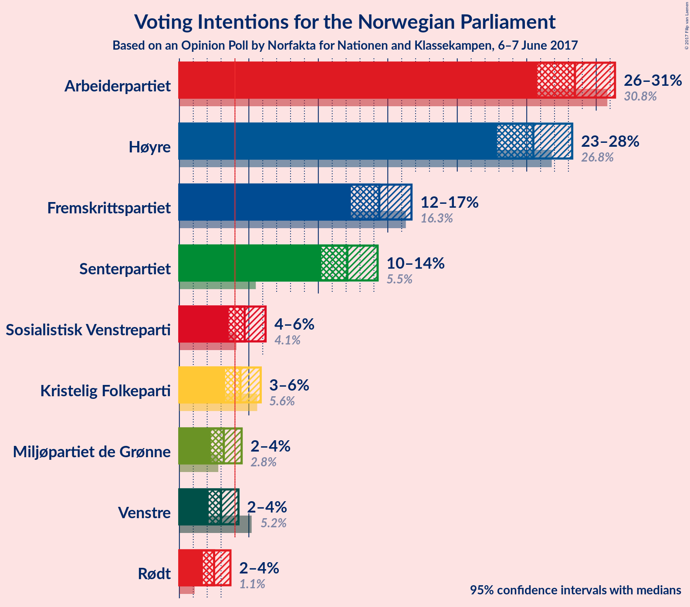
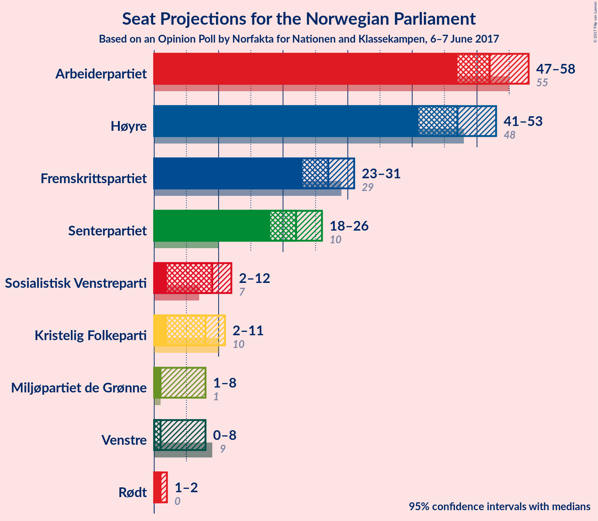
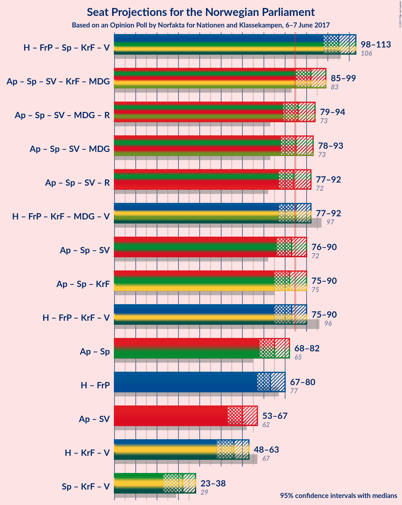

# Opinion Poll by Norfakta for Nationen and Klassekampen, 6–7 June 2017

<a href="#voting-intentions">Voting Intentions</a> | <a href="#seats">Seats</a> | <a href="#coalitions">Coalitions</a> | <a href="#technical-information">Technical Information</a>

## Voting Intentions

### Confidence Intervals

| Party | Last Result | Poll Result | 80% Confidence Interval | 90% Confidence Interval | 95% Confidence Interval | 99% Confidence Interval |
|:-----:|:-----------:|:-----------:|:-----------------------:|:-----------------------:|:-----------------------:|:-----------------------:|
| Arbeiderpartiet | 30.8% | 28.5% | 26.7–30.4% |26.2–30.9% |25.8–31.4% |24.9–32.3% |
| Høyre | 26.8% | 25.5% | 23.8–27.3% |23.3–27.8% |22.9–28.3% |22.1–29.2% |
| Fremskrittspartiet | 16.3% | 14.4% | 13.0–15.9% |12.7–16.3% |12.3–16.7% |11.7–17.5% |
| Senterpartiet | 5.5% | 12.1% | 10.9–13.5% |10.5–13.9% |10.2–14.3% |9.6–15.0% |
| Sosialistisk Venstreparti | 4.1% | 4.7% | 3.9–5.7% |3.7–5.9% |3.6–6.2% |3.2–6.7% |
| Kristelig Folkeparti | 5.6% | 4.4% | 3.7–5.3% |3.5–5.6% |3.3–5.9% |3.0–6.3% |
| Miljøpartiet de Grønne | 2.8% | 3.2% | 2.6–4.0% |2.4–4.3% |2.3–4.5% |2.0–4.9% |
| Venstre | 5.2% | 3.0% | 2.4–3.8% |2.2–4.0% |2.1–4.3% |1.9–4.7% |
| Rødt | 1.1% | 2.5% | 2.0–3.3% |1.8–3.5% |1.7–3.7% |1.5–4.1% |

*Note:* The poll result column reflects the actual value used in the calculations. Published results may vary slightly, and in addition be rounded to fewer digits.

## Seats

### Confidence Intervals

| Party | Last Result | Median | 80% Confidence Interval | 90% Confidence Interval | 95% Confidence Interval | 99% Confidence Interval |
|:-----:|:-----------:|:------:|:-----------------------:|:-----------------------:|:-----------------------:|:-----------------------:|
| <a href="#arbeiderpartiet">Arbeiderpartiet</a> | 55 | 52 | 49–56 |48–57 |47–58 |45–61 |
| <a href="#høyre">Høyre</a> | 48 | 47 | 43–51 |42–52 |41–53 |40–55 |
| <a href="#fremskrittspartiet">Fremskrittspartiet</a> | 29 | 27 | 24–29 |23–30 |23–31 |21–33 |
| <a href="#senterpartiet">Senterpartiet</a> | 10 | 22 | 20–25 |19–26 |18–26 |17–28 |
| <a href="#sosialistisk-venstreparti">Sosialistisk Venstreparti</a> | 7 | 9 | 2–10 |2–11 |2–12 |1–12 |
| <a href="#kristelig-folkeparti">Kristelig Folkeparti</a> | 10 | 8 | 2–10 |2–10 |2–11 |1–12 |
| <a href="#miljøpartiet-de-grønne">Miljøpartiet de Grønne</a> | 1 | 1 | 1–7 |1–8 |1–8 |1–9 |
| <a href="#venstre">Venstre</a> | 9 | 1 | 1–2 |1–7 |0–8 |0–8 |
| <a href="#rødt">Rødt</a> | 0 | 1 | 1–2 |1–2 |1–2 |1–7 |

### Arbeiderpartiet

*For a full overview of the results for this party, see the [Arbeiderpartiet](party-arbeiderpartiet.html) page.*

| Number of Seats | Probability | Accumulated | Special Marks |
|:---------------:|:-----------:|:-----------:|:-------------:|
| 44 | 0.1% | 100% |  |
| 45 | 0.4% | 99.9% |  |
| 46 | 1.4% | 99.5% |  |
| 47 | 2% | 98% |  |
| 48 | 6% | 96% |  |
| 49 | 6% | 91% |  |
| 50 | 10% | 85% |  |
| 51 | 17% | 75% |  |
| 52 | 8% | 57% | Median |
| 53 | 11% | 50% |  |
| 54 | 12% | 39% |  |
| 55 | 10% | 27% | Last Result |
| 56 | 8% | 17% |  |
| 57 | 4% | 9% |  |
| 58 | 2% | 5% |  |
| 59 | 1.1% | 2% |  |
| 60 | 0.5% | 1.1% |  |
| 61 | 0.3% | 0.5% |  |
| 62 | 0.1% | 0.2% |  |
| 63 | 0% | 0.1% |  |
| 64 | 0% | 0% |  |

### Høyre

*For a full overview of the results for this party, see the [Høyre](party-hyre.html) page.*

| Number of Seats | Probability | Accumulated | Special Marks |
|:---------------:|:-----------:|:-----------:|:-------------:|
| 38 | 0% | 100% |  |
| 39 | 0.2% | 99.9% |  |
| 40 | 0.4% | 99.8% |  |
| 41 | 2% | 99.4% |  |
| 42 | 3% | 97% |  |
| 43 | 11% | 94% |  |
| 44 | 9% | 83% |  |
| 45 | 8% | 74% |  |
| 46 | 10% | 66% |  |
| 47 | 11% | 56% | Median |
| 48 | 12% | 45% | Last Result |
| 49 | 11% | 34% |  |
| 50 | 11% | 23% |  |
| 51 | 5% | 12% |  |
| 52 | 4% | 7% |  |
| 53 | 2% | 3% |  |
| 54 | 0.4% | 1.1% |  |
| 55 | 0.3% | 0.6% |  |
| 56 | 0.2% | 0.3% |  |
| 57 | 0% | 0.1% |  |
| 58 | 0% | 0.1% |  |
| 59 | 0% | 0% |  |

### Fremskrittspartiet

*For a full overview of the results for this party, see the [Fremskrittspartiet](party-fremskrittspartiet.html) page.*

| Number of Seats | Probability | Accumulated | Special Marks |
|:---------------:|:-----------:|:-----------:|:-------------:|
| 20 | 0.1% | 100% |  |
| 21 | 0.5% | 99.9% |  |
| 22 | 2% | 99.4% |  |
| 23 | 4% | 98% |  |
| 24 | 9% | 93% |  |
| 25 | 14% | 85% |  |
| 26 | 15% | 71% |  |
| 27 | 14% | 55% | Median |
| 28 | 23% | 42% |  |
| 29 | 9% | 19% | Last Result |
| 30 | 5% | 9% |  |
| 31 | 2% | 4% |  |
| 32 | 1.0% | 2% |  |
| 33 | 0.6% | 0.8% |  |
| 34 | 0.1% | 0.2% |  |
| 35 | 0.1% | 0.1% |  |
| 36 | 0% | 0% |  |

### Senterpartiet

*For a full overview of the results for this party, see the [Senterpartiet](party-senterpartiet.html) page.*

| Number of Seats | Probability | Accumulated | Special Marks |
|:---------------:|:-----------:|:-----------:|:-------------:|
| 10 | 0% | 100% | Last Result |
| 11 | 0% | 100% |  |
| 12 | 0% | 100% |  |
| 13 | 0% | 100% |  |
| 14 | 0% | 100% |  |
| 15 | 0% | 100% |  |
| 16 | 0.1% | 100% |  |
| 17 | 0.5% | 99.9% |  |
| 18 | 2% | 99.5% |  |
| 19 | 5% | 97% |  |
| 20 | 14% | 92% |  |
| 21 | 11% | 78% |  |
| 22 | 19% | 67% | Median |
| 23 | 20% | 48% |  |
| 24 | 13% | 28% |  |
| 25 | 6% | 14% |  |
| 26 | 5% | 8% |  |
| 27 | 2% | 2% |  |
| 28 | 0.5% | 0.7% |  |
| 29 | 0.1% | 0.2% |  |
| 30 | 0.1% | 0.1% |  |
| 31 | 0% | 0% |  |

### Sosialistisk Venstreparti

*For a full overview of the results for this party, see the [Sosialistisk Venstreparti](party-sosialistiskvenstreparti.html) page.*

| Number of Seats | Probability | Accumulated | Special Marks |
|:---------------:|:-----------:|:-----------:|:-------------:|
| 1 | 2% | 100% |  |
| 2 | 15% | 98% |  |
| 3 | 0% | 83% |  |
| 4 | 0% | 83% |  |
| 5 | 0% | 83% |  |
| 6 | 0% | 83% |  |
| 7 | 3% | 83% | Last Result |
| 8 | 27% | 81% |  |
| 9 | 28% | 54% | Median |
| 10 | 17% | 26% |  |
| 11 | 7% | 9% |  |
| 12 | 2% | 3% |  |
| 13 | 0.3% | 0.4% |  |
| 14 | 0% | 0% |  |

### Kristelig Folkeparti

*For a full overview of the results for this party, see the [Kristelig Folkeparti](party-kristeligfolkeparti.html) page.*

| Number of Seats | Probability | Accumulated | Special Marks |
|:---------------:|:-----------:|:-----------:|:-------------:|
| 1 | 0.6% | 100% |  |
| 2 | 21% | 99.4% |  |
| 3 | 1.0% | 78% |  |
| 4 | 0% | 77% |  |
| 5 | 0% | 77% |  |
| 6 | 0% | 77% |  |
| 7 | 5% | 77% |  |
| 8 | 33% | 72% | Median |
| 9 | 22% | 39% |  |
| 10 | 13% | 17% | Last Result |
| 11 | 3% | 4% |  |
| 12 | 0.5% | 0.6% |  |
| 13 | 0.1% | 0.1% |  |
| 14 | 0% | 0% |  |

### Miljøpartiet de Grønne

*For a full overview of the results for this party, see the [Miljøpartiet de Grønne](party-miljpartietdegrnne.html) page.*

| Number of Seats | Probability | Accumulated | Special Marks |
|:---------------:|:-----------:|:-----------:|:-------------:|
| 0 | 0.1% | 100% |  |
| 1 | 63% | 99.9% | Last Result, Median |
| 2 | 15% | 37% |  |
| 3 | 6% | 22% |  |
| 4 | 6% | 17% |  |
| 5 | 0% | 10% |  |
| 6 | 0% | 10% |  |
| 7 | 4% | 10% |  |
| 8 | 5% | 6% |  |
| 9 | 1.0% | 1.2% |  |
| 10 | 0.1% | 0.1% |  |
| 11 | 0% | 0% |  |

### Venstre

*For a full overview of the results for this party, see the [Venstre](party-venstre.html) page.*

| Number of Seats | Probability | Accumulated | Special Marks |
|:---------------:|:-----------:|:-----------:|:-------------:|
| 0 | 5% | 100% |  |
| 1 | 51% | 95% | Median |
| 2 | 36% | 44% |  |
| 3 | 3% | 8% |  |
| 4 | 0% | 6% |  |
| 5 | 0% | 6% |  |
| 6 | 0% | 6% |  |
| 7 | 2% | 6% |  |
| 8 | 3% | 3% |  |
| 9 | 0.4% | 0.4% | Last Result |
| 10 | 0% | 0% |  |

### Rødt

*For a full overview of the results for this party, see the [Rødt](party-rdt.html) page.*

| Number of Seats | Probability | Accumulated | Special Marks |
|:---------------:|:-----------:|:-----------:|:-------------:|
| 0 | 0% | 100% | Last Result |
| 1 | 54% | 100% | Median |
| 2 | 45% | 46% |  |
| 3 | 0% | 0.7% |  |
| 4 | 0% | 0.7% |  |
| 5 | 0% | 0.7% |  |
| 6 | 0% | 0.7% |  |
| 7 | 0.4% | 0.7% |  |
| 8 | 0.3% | 0.3% |  |
| 9 | 0% | 0% |  |

## Coalitions

### Confidence Intervals

| Coalition | Last Result | Median | Majority? | 80% Confidence Interval | 90% Confidence Interval | 95% Confidence Interval | 99% Confidence Interval |
|:---------:|:-----------:|:------:|:---------:|:-----------------------:|:-----------------------:|:-----------------------:|:-----------------------:|
| Høyre – Fremskrittspartiet – Senterpartiet – Kristelig Folkeparti – Venstre | 106 | 105 | 100% | 100–110 | 99–110 | 98–113 | 95–114 |
| Arbeiderpartiet – Senterpartiet – Sosialistisk Venstreparti – Kristelig Folkeparti – Miljøpartiet de Grønne | 83 | 92 | 98% | 87–96 | 86–98 | 85–99 | 83–101 |
| Arbeiderpartiet – Senterpartiet – Sosialistisk Venstreparti – Miljøpartiet de Grønne – Rødt | 73 | 86 | 66% | 82–91 | 81–93 | 79–94 | 77–97 |
| Arbeiderpartiet – Senterpartiet – Sosialistisk Venstreparti – Miljøpartiet de Grønne | 73 | 85 | 52% | 80–90 | 79–91 | 78–93 | 75–95 |
| Arbeiderpartiet – Senterpartiet – Sosialistisk Venstreparti – Rødt | 72 | 84 | 48% | 80–89 | 78–91 | 77–92 | 75–94 |
| Høyre – Fremskrittspartiet – Kristelig Folkeparti – Miljøpartiet de Grønne – Venstre | 97 | 85 | 52% | 80–89 | 78–91 | 77–92 | 75–94 |
| Arbeiderpartiet – Senterpartiet – Sosialistisk Venstreparti | 72 | 83 | 31% | 78–88 | 76–89 | 76–90 | 73–92 |
| Arbeiderpartiet – Senterpartiet – Kristelig Folkeparti | 75 | 82 | 26% | 77–87 | 76–89 | 75–90 | 72–91 |
| Høyre – Fremskrittspartiet – Kristelig Folkeparti – Venstre | 96 | 83 | 34% | 78–87 | 76–88 | 75–90 | 72–92 |
| Arbeiderpartiet – Senterpartiet | 65 | 75 | 0.3% | 70–80 | 69–81 | 68–82 | 66–84 |
| Høyre – Fremskrittspartiet | 77 | 73 | 0.1% | 69–78 | 68–80 | 67–80 | 65–83 |
| Arbeiderpartiet – Sosialistisk Venstreparti | 62 | 60 | 0% | 56–65 | 55–66 | 53–67 | 51–69 |
| Høyre – Kristelig Folkeparti – Venstre | 67 | 56 | 0% | 51–61 | 50–61 | 48–63 | 46–65 |
| Senterpartiet – Kristelig Folkeparti – Venstre | 29 | 32 | 0% | 26–35 | 25–37 | 23–38 | 22–40 |

### Høyre – Fremskrittspartiet – Senterpartiet – Kristelig Folkeparti – Venstre

| Number of Seats | Probability | Accumulated | Special Marks |
|:---------------:|:-----------:|:-----------:|:-------------:|
| 93 | 0.1% | 100% |  |
| 94 | 0.2% | 99.9% |  |
| 95 | 0.4% | 99.7% |  |
| 96 | 0.8% | 99.3% |  |
| 97 | 0.6% | 98% |  |
| 98 | 2% | 98% |  |
| 99 | 2% | 96% |  |
| 100 | 6% | 94% |  |
| 101 | 6% | 88% |  |
| 102 | 6% | 82% |  |
| 103 | 9% | 76% |  |
| 104 | 13% | 67% |  |
| 105 | 10% | 54% | Median |
| 106 | 10% | 44% | Last Result |
| 107 | 8% | 34% |  |
| 108 | 8% | 26% |  |
| 109 | 6% | 18% |  |
| 110 | 8% | 12% |  |
| 111 | 1.3% | 5% |  |
| 112 | 0.7% | 3% |  |
| 113 | 1.1% | 3% |  |
| 114 | 1.2% | 2% |  |
| 115 | 0.2% | 0.4% |  |
| 116 | 0.2% | 0.2% |  |
| 117 | 0% | 0% |  |

### Arbeiderpartiet – Senterpartiet – Sosialistisk Venstreparti – Kristelig Folkeparti – Miljøpartiet de Grønne

| Number of Seats | Probability | Accumulated | Special Marks |
|:---------------:|:-----------:|:-----------:|:-------------:|
| 79 | 0.1% | 100% |  |
| 80 | 0.1% | 99.9% |  |
| 81 | 0.1% | 99.8% |  |
| 82 | 0.2% | 99.7% |  |
| 83 | 0.7% | 99.5% | Last Result |
| 84 | 1.0% | 98.8% |  |
| 85 | 1.3% | 98% | Majority |
| 86 | 5% | 97% |  |
| 87 | 3% | 92% |  |
| 88 | 5% | 89% |  |
| 89 | 9% | 84% |  |
| 90 | 8% | 74% |  |
| 91 | 11% | 66% |  |
| 92 | 8% | 55% | Median |
| 93 | 10% | 47% |  |
| 94 | 10% | 37% |  |
| 95 | 9% | 27% |  |
| 96 | 8% | 18% |  |
| 97 | 3% | 10% |  |
| 98 | 4% | 7% |  |
| 99 | 2% | 3% |  |
| 100 | 0.8% | 2% |  |
| 101 | 0.4% | 0.7% |  |
| 102 | 0.2% | 0.3% |  |
| 103 | 0% | 0.1% |  |
| 104 | 0% | 0% |  |

### Arbeiderpartiet – Senterpartiet – Sosialistisk Venstreparti – Miljøpartiet de Grønne – Rødt

| Number of Seats | Probability | Accumulated | Special Marks |
|:---------------:|:-----------:|:-----------:|:-------------:|
| 73 | 0% | 100% | Last Result |
| 74 | 0% | 100% |  |
| 75 | 0% | 100% |  |
| 76 | 0.4% | 99.9% |  |
| 77 | 0.2% | 99.5% |  |
| 78 | 0.6% | 99.3% |  |
| 79 | 2% | 98.7% |  |
| 80 | 2% | 97% |  |
| 81 | 4% | 95% |  |
| 82 | 7% | 91% |  |
| 83 | 7% | 85% |  |
| 84 | 12% | 77% |  |
| 85 | 7% | 66% | Median, Majority |
| 86 | 10% | 59% |  |
| 87 | 11% | 49% |  |
| 88 | 9% | 37% |  |
| 89 | 9% | 28% |  |
| 90 | 6% | 19% |  |
| 91 | 4% | 13% |  |
| 92 | 4% | 10% |  |
| 93 | 2% | 6% |  |
| 94 | 2% | 4% |  |
| 95 | 0.9% | 2% |  |
| 96 | 0.5% | 1.0% |  |
| 97 | 0.3% | 0.5% |  |
| 98 | 0.2% | 0.2% |  |
| 99 | 0% | 0% |  |

### Arbeiderpartiet – Senterpartiet – Sosialistisk Venstreparti – Miljøpartiet de Grønne

| Number of Seats | Probability | Accumulated | Special Marks |
|:---------------:|:-----------:|:-----------:|:-------------:|
| 73 | 0% | 100% | Last Result |
| 74 | 0.1% | 100% |  |
| 75 | 0.4% | 99.8% |  |
| 76 | 0.4% | 99.4% |  |
| 77 | 0.9% | 98.9% |  |
| 78 | 2% | 98% |  |
| 79 | 2% | 96% |  |
| 80 | 6% | 94% |  |
| 81 | 6% | 88% |  |
| 82 | 9% | 82% |  |
| 83 | 11% | 73% |  |
| 84 | 10% | 62% | Median |
| 85 | 9% | 52% | Majority |
| 86 | 11% | 44% |  |
| 87 | 11% | 32% |  |
| 88 | 4% | 21% |  |
| 89 | 5% | 17% |  |
| 90 | 5% | 12% |  |
| 91 | 3% | 8% |  |
| 92 | 1.3% | 4% |  |
| 93 | 2% | 3% |  |
| 94 | 0.4% | 1.2% |  |
| 95 | 0.4% | 0.8% |  |
| 96 | 0.3% | 0.3% |  |
| 97 | 0% | 0.1% |  |
| 98 | 0% | 0% |  |

### Arbeiderpartiet – Senterpartiet – Sosialistisk Venstreparti – Rødt

| Number of Seats | Probability | Accumulated | Special Marks |
|:---------------:|:-----------:|:-----------:|:-------------:|
| 71 | 0.1% | 100% |  |
| 72 | 0% | 99.9% | Last Result |
| 73 | 0% | 99.9% |  |
| 74 | 0.2% | 99.9% |  |
| 75 | 0.7% | 99.7% |  |
| 76 | 0.6% | 99.0% |  |
| 77 | 3% | 98% |  |
| 78 | 2% | 96% |  |
| 79 | 3% | 94% |  |
| 80 | 5% | 91% |  |
| 81 | 11% | 86% |  |
| 82 | 8% | 75% |  |
| 83 | 11% | 67% |  |
| 84 | 8% | 56% | Median |
| 85 | 12% | 48% | Majority |
| 86 | 11% | 36% |  |
| 87 | 6% | 25% |  |
| 88 | 5% | 18% |  |
| 89 | 4% | 13% |  |
| 90 | 4% | 9% |  |
| 91 | 2% | 5% |  |
| 92 | 0.6% | 3% |  |
| 93 | 1.5% | 2% |  |
| 94 | 0.5% | 0.9% |  |
| 95 | 0.2% | 0.3% |  |
| 96 | 0.1% | 0.1% |  |
| 97 | 0% | 0% |  |

### Høyre – Fremskrittspartiet – Kristelig Folkeparti – Miljøpartiet de Grønne – Venstre

| Number of Seats | Probability | Accumulated | Special Marks |
|:---------------:|:-----------:|:-----------:|:-------------:|
| 73 | 0.1% | 100% |  |
| 74 | 0.2% | 99.9% |  |
| 75 | 0.5% | 99.7% |  |
| 76 | 1.5% | 99.1% |  |
| 77 | 0.6% | 98% |  |
| 78 | 2% | 97% |  |
| 79 | 4% | 95% |  |
| 80 | 4% | 91% |  |
| 81 | 5% | 87% |  |
| 82 | 6% | 82% |  |
| 83 | 11% | 75% |  |
| 84 | 12% | 64% | Median |
| 85 | 8% | 52% | Majority |
| 86 | 11% | 44% |  |
| 87 | 8% | 33% |  |
| 88 | 11% | 25% |  |
| 89 | 5% | 14% |  |
| 90 | 3% | 9% |  |
| 91 | 2% | 6% |  |
| 92 | 3% | 4% |  |
| 93 | 0.6% | 2% |  |
| 94 | 0.7% | 1.0% |  |
| 95 | 0.2% | 0.3% |  |
| 96 | 0% | 0.1% |  |
| 97 | 0% | 0.1% | Last Result |
| 98 | 0.1% | 0.1% |  |
| 99 | 0% | 0% |  |

### Arbeiderpartiet – Senterpartiet – Sosialistisk Venstreparti

| Number of Seats | Probability | Accumulated | Special Marks |
|:---------------:|:-----------:|:-----------:|:-------------:|
| 70 | 0% | 100% |  |
| 71 | 0% | 99.9% |  |
| 72 | 0.1% | 99.9% | Last Result |
| 73 | 0.4% | 99.8% |  |
| 74 | 0.7% | 99.4% |  |
| 75 | 0.8% | 98.7% |  |
| 76 | 3% | 98% |  |
| 77 | 3% | 95% |  |
| 78 | 3% | 92% |  |
| 79 | 8% | 89% |  |
| 80 | 11% | 81% |  |
| 81 | 7% | 70% |  |
| 82 | 11% | 63% |  |
| 83 | 13% | 52% | Median |
| 84 | 7% | 39% |  |
| 85 | 10% | 31% | Majority |
| 86 | 6% | 21% |  |
| 87 | 3% | 15% |  |
| 88 | 4% | 12% |  |
| 89 | 5% | 8% |  |
| 90 | 1.0% | 3% |  |
| 91 | 0.7% | 2% |  |
| 92 | 1.4% | 2% |  |
| 93 | 0.2% | 0.3% |  |
| 94 | 0.1% | 0.2% |  |
| 95 | 0.1% | 0.1% |  |
| 96 | 0% | 0% |  |

### Arbeiderpartiet – Senterpartiet – Kristelig Folkeparti

| Number of Seats | Probability | Accumulated | Special Marks |
|:---------------:|:-----------:|:-----------:|:-------------:|
| 70 | 0% | 100% |  |
| 71 | 0.2% | 99.9% |  |
| 72 | 0.3% | 99.8% |  |
| 73 | 0.3% | 99.5% |  |
| 74 | 1.4% | 99.1% |  |
| 75 | 2% | 98% | Last Result |
| 76 | 3% | 95% |  |
| 77 | 5% | 92% |  |
| 78 | 7% | 88% |  |
| 79 | 6% | 81% |  |
| 80 | 11% | 75% |  |
| 81 | 8% | 64% |  |
| 82 | 12% | 56% | Median |
| 83 | 7% | 44% |  |
| 84 | 11% | 37% |  |
| 85 | 5% | 26% | Majority |
| 86 | 9% | 21% |  |
| 87 | 4% | 12% |  |
| 88 | 3% | 8% |  |
| 89 | 2% | 5% |  |
| 90 | 2% | 3% |  |
| 91 | 0.4% | 0.6% |  |
| 92 | 0.1% | 0.2% |  |
| 93 | 0.1% | 0.1% |  |
| 94 | 0% | 0% |  |

### Høyre – Fremskrittspartiet – Kristelig Folkeparti – Venstre

| Number of Seats | Probability | Accumulated | Special Marks |
|:---------------:|:-----------:|:-----------:|:-------------:|
| 71 | 0.2% | 100% |  |
| 72 | 0.3% | 99.8% |  |
| 73 | 0.5% | 99.5% |  |
| 74 | 0.9% | 99.0% |  |
| 75 | 2% | 98% |  |
| 76 | 2% | 96% |  |
| 77 | 4% | 94% |  |
| 78 | 4% | 90% |  |
| 79 | 6% | 87% |  |
| 80 | 9% | 81% |  |
| 81 | 9% | 72% |  |
| 82 | 11% | 63% |  |
| 83 | 10% | 51% | Median |
| 84 | 7% | 41% |  |
| 85 | 12% | 34% | Majority |
| 86 | 7% | 23% |  |
| 87 | 7% | 15% |  |
| 88 | 4% | 9% |  |
| 89 | 2% | 5% |  |
| 90 | 2% | 3% |  |
| 91 | 0.6% | 1.3% |  |
| 92 | 0.2% | 0.7% |  |
| 93 | 0.4% | 0.5% |  |
| 94 | 0% | 0.1% |  |
| 95 | 0% | 0% |  |
| 96 | 0% | 0% | Last Result |

### Arbeiderpartiet – Senterpartiet

| Number of Seats | Probability | Accumulated | Special Marks |
|:---------------:|:-----------:|:-----------:|:-------------:|
| 65 | 0.1% | 100% | Last Result |
| 66 | 0.4% | 99.9% |  |
| 67 | 0.5% | 99.5% |  |
| 68 | 3% | 99.0% |  |
| 69 | 3% | 96% |  |
| 70 | 5% | 93% |  |
| 71 | 7% | 89% |  |
| 72 | 11% | 82% |  |
| 73 | 9% | 71% |  |
| 74 | 10% | 62% | Median |
| 75 | 11% | 52% |  |
| 76 | 9% | 41% |  |
| 77 | 5% | 32% |  |
| 78 | 9% | 26% |  |
| 79 | 6% | 18% |  |
| 80 | 5% | 12% |  |
| 81 | 4% | 7% |  |
| 82 | 1.5% | 3% |  |
| 83 | 0.8% | 2% |  |
| 84 | 0.5% | 0.7% |  |
| 85 | 0.2% | 0.3% | Majority |
| 86 | 0% | 0.1% |  |
| 87 | 0% | 0.1% |  |
| 88 | 0% | 0% |  |

### Høyre – Fremskrittspartiet

| Number of Seats | Probability | Accumulated | Special Marks |
|:---------------:|:-----------:|:-----------:|:-------------:|
| 63 | 0.1% | 100% |  |
| 64 | 0.2% | 99.9% |  |
| 65 | 0.4% | 99.7% |  |
| 66 | 0.8% | 99.3% |  |
| 67 | 2% | 98% |  |
| 68 | 4% | 97% |  |
| 69 | 4% | 93% |  |
| 70 | 5% | 89% |  |
| 71 | 14% | 84% |  |
| 72 | 9% | 69% |  |
| 73 | 11% | 60% |  |
| 74 | 8% | 49% | Median |
| 75 | 7% | 41% |  |
| 76 | 10% | 34% |  |
| 77 | 10% | 24% | Last Result |
| 78 | 4% | 14% |  |
| 79 | 3% | 9% |  |
| 80 | 4% | 6% |  |
| 81 | 0.8% | 2% |  |
| 82 | 0.4% | 1.2% |  |
| 83 | 0.6% | 0.9% |  |
| 84 | 0.1% | 0.2% |  |
| 85 | 0% | 0.1% | Majority |
| 86 | 0% | 0.1% |  |
| 87 | 0% | 0.1% |  |
| 88 | 0% | 0% |  |

### Arbeiderpartiet – Sosialistisk Venstreparti

| Number of Seats | Probability | Accumulated | Special Marks |
|:---------------:|:-----------:|:-----------:|:-------------:|
| 49 | 0.1% | 100% |  |
| 50 | 0.1% | 99.9% |  |
| 51 | 0.3% | 99.7% |  |
| 52 | 1.2% | 99.4% |  |
| 53 | 2% | 98% |  |
| 54 | 2% | 97% |  |
| 55 | 2% | 95% |  |
| 56 | 6% | 93% |  |
| 57 | 9% | 87% |  |
| 58 | 8% | 79% |  |
| 59 | 12% | 71% |  |
| 60 | 11% | 59% |  |
| 61 | 10% | 48% | Median |
| 62 | 10% | 38% | Last Result |
| 63 | 9% | 28% |  |
| 64 | 6% | 19% |  |
| 65 | 4% | 12% |  |
| 66 | 5% | 8% |  |
| 67 | 1.5% | 3% |  |
| 68 | 0.8% | 2% |  |
| 69 | 0.6% | 1.0% |  |
| 70 | 0.3% | 0.4% |  |
| 71 | 0.1% | 0.1% |  |
| 72 | 0% | 0% |  |

### Høyre – Kristelig Folkeparti – Venstre

| Number of Seats | Probability | Accumulated | Special Marks |
|:---------------:|:-----------:|:-----------:|:-------------:|
| 44 | 0% | 100% |  |
| 45 | 0.1% | 99.9% |  |
| 46 | 0.6% | 99.8% |  |
| 47 | 0.7% | 99.2% |  |
| 48 | 2% | 98.5% |  |
| 49 | 2% | 97% |  |
| 50 | 3% | 95% |  |
| 51 | 3% | 92% |  |
| 52 | 10% | 90% |  |
| 53 | 8% | 80% |  |
| 54 | 7% | 72% |  |
| 55 | 10% | 65% |  |
| 56 | 8% | 55% | Median |
| 57 | 13% | 47% |  |
| 58 | 6% | 34% |  |
| 59 | 11% | 27% |  |
| 60 | 6% | 16% |  |
| 61 | 6% | 10% |  |
| 62 | 2% | 4% |  |
| 63 | 1.0% | 3% |  |
| 64 | 1.0% | 2% |  |
| 65 | 0.4% | 0.7% |  |
| 66 | 0.2% | 0.3% |  |
| 67 | 0% | 0.1% | Last Result |
| 68 | 0% | 0% |  |

### Senterpartiet – Kristelig Folkeparti – Venstre

| Number of Seats | Probability | Accumulated | Special Marks |
|:---------------:|:-----------:|:-----------:|:-------------:|
| 21 | 0.1% | 100% |  |
| 22 | 0.9% | 99.9% |  |
| 23 | 2% | 99.0% |  |
| 24 | 1.3% | 97% |  |
| 25 | 3% | 96% |  |
| 26 | 4% | 93% |  |
| 27 | 5% | 88% |  |
| 28 | 3% | 84% |  |
| 29 | 8% | 81% | Last Result |
| 30 | 9% | 73% |  |
| 31 | 8% | 63% | Median |
| 32 | 15% | 55% |  |
| 33 | 18% | 40% |  |
| 34 | 7% | 23% |  |
| 35 | 7% | 15% |  |
| 36 | 4% | 9% |  |
| 37 | 2% | 5% |  |
| 38 | 1.2% | 3% |  |
| 39 | 0.9% | 2% |  |
| 40 | 0.5% | 0.7% |  |
| 41 | 0.1% | 0.3% |  |
| 42 | 0.1% | 0.1% |  |
| 43 | 0% | 0% |  |

## Technical Information

### Opinion Poll

+ **Pollster:** Norfakta
+ **Media:** Nationen and Klassekampen
+ **Fieldwork period:** 6–7 June 2017

### Calculations

+ **Sample size:** 1001
+ **Simulations done:** 4,194,304
+ **Error estimate:** 1.74%

