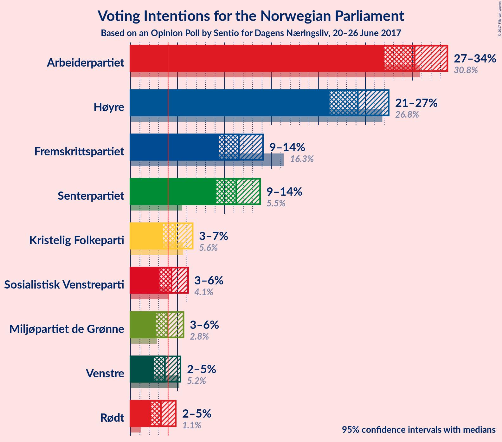
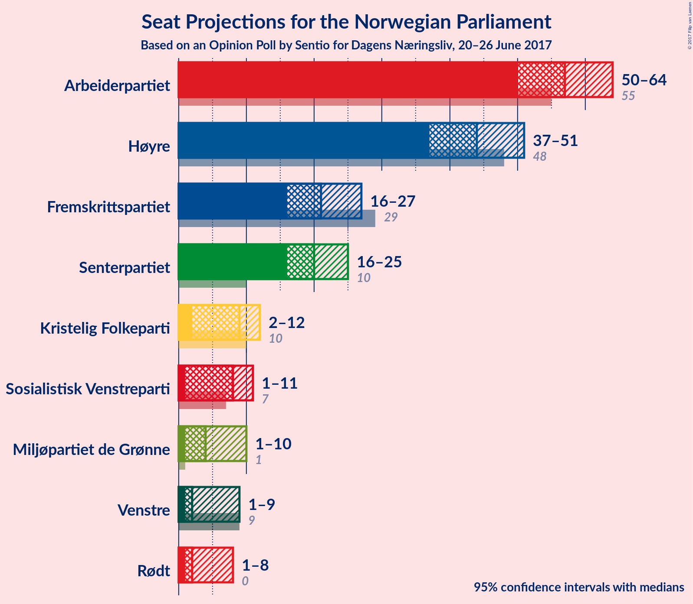
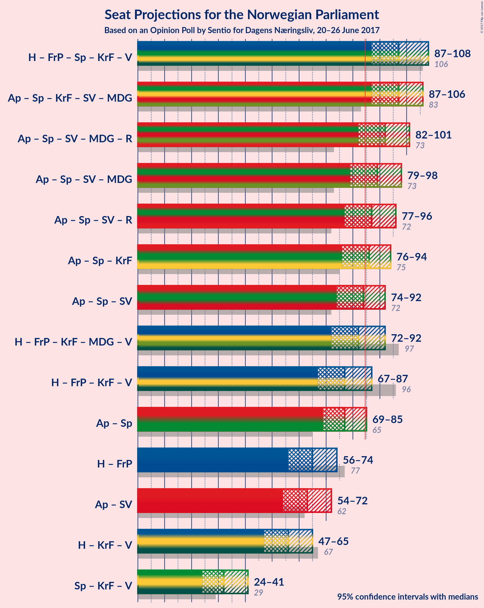

# Opinion Poll by Sentio for Dagens Næringsliv, 20–26 June 2017

<a href="#voting-intentions">Voting Intentions</a> | <a href="#seats">Seats</a> | <a href="#coalitions">Coalitions</a> | <a href="#technical-information">Technical Information</a>

## Voting Intentions

### Confidence Intervals

| Party | Last Result | Poll Result | 80% Confidence Interval | 90% Confidence Interval | 95% Confidence Interval | 99% Confidence Interval |
|:-----:|:-----------:|:-----------:|:-----------------------:|:-----------------------:|:-----------------------:|:-----------------------:|
| Arbeiderpartiet | 30.8% | 30.2% | 28.1–32.5% |27.5–33.2% |27.0–33.7% |26.0–34.8% |
| Høyre | 26.8% | 24.2% | 22.2–26.3% |21.7–26.9% |21.2–27.5% |20.3–28.5% |
| Fremskrittspartiet | 16.3% | 11.5% | 10.1–13.2% |9.7–13.7% |9.4–14.1% |8.7–14.9% |
| Senterpartiet | 5.5% | 11.3% | 9.9–12.9% |9.5–13.4% |9.1–13.8% |8.5–14.6% |
| Kristelig Folkeparti | 5.6% | 4.8% | 3.9–6.0% |3.6–6.3% |3.4–6.6% |3.1–7.2% |
| Sosialistisk Venstreparti | 4.1% | 4.4% | 3.5–5.5% |3.3–5.8% |3.1–6.1% |2.7–6.7% |
| Miljøpartiet de Grønne | 2.8% | 3.9% | 3.1–5.0% |2.9–5.4% |2.7–5.6% |2.4–6.2% |
| Venstre | 5.2% | 3.7% | 2.9–4.7% |2.7–5.0% |2.5–5.3% |2.2–5.9% |
| Rødt | 1.1% | 3.2% | 2.5–4.3% |2.3–4.6% |2.2–4.8% |1.9–5.3% |

*Note:* The poll result column reflects the actual value used in the calculations. Published results may vary slightly, and in addition be rounded to fewer digits.

## Seats

### Confidence Intervals

| Party | Last Result | Median | 80% Confidence Interval | 90% Confidence Interval | 95% Confidence Interval | 99% Confidence Interval |
|:-----:|:-----------:|:------:|:-----------------------:|:-----------------------:|:-----------------------:|:-----------------------:|
| <a href="#arbeiderpartiet">Arbeiderpartiet</a> | 55 | 57 | 51–62 |50–63 |50–64 |48–67 |
| <a href="#høyre">Høyre</a> | 48 | 44 | 39–49 |38–50 |37–51 |36–54 |
| <a href="#fremskrittspartiet">Fremskrittspartiet</a> | 29 | 21 | 18–24 |17–26 |16–27 |15–28 |
| <a href="#senterpartiet">Senterpartiet</a> | 10 | 20 | 17–24 |17–25 |16–25 |14–27 |
| <a href="#kristelig-folkeparti">Kristelig Folkeparti</a> | 10 | 9 | 2–11 |2–11 |2–12 |1–13 |
| <a href="#sosialistisk-venstreparti">Sosialistisk Venstreparti</a> | 7 | 8 | 1–10 |1–11 |1–11 |1–12 |
| <a href="#miljøpartiet-de-grønne">Miljøpartiet de Grønne</a> | 1 | 4 | 1–9 |1–9 |1–10 |1–11 |
| <a href="#venstre">Venstre</a> | 9 | 2 | 1–8 |1–9 |1–9 |0–10 |
| <a href="#rødt">Rødt</a> | 0 | 2 | 1–7 |1–8 |1–8 |1–10 |

### Arbeiderpartiet

*For a full overview of the results for this party, see the [Arbeiderpartiet](party-arbeiderpartiet.html) page.*

| Number of Seats | Probability | Accumulated | Special Marks |
|:---------------:|:-----------:|:-----------:|:-------------:|
| 46 | 0.1% | 100% |  |
| 47 | 0.3% | 99.9% |  |
| 48 | 0.6% | 99.6% |  |
| 49 | 1.2% | 99.0% |  |
| 50 | 3% | 98% |  |
| 51 | 5% | 94% |  |
| 52 | 5% | 89% |  |
| 53 | 7% | 84% |  |
| 54 | 10% | 78% |  |
| 55 | 7% | 68% | Last Result |
| 56 | 9% | 61% |  |
| 57 | 9% | 52% | Median |
| 58 | 9% | 44% |  |
| 59 | 9% | 35% |  |
| 60 | 9% | 26% |  |
| 61 | 7% | 17% |  |
| 62 | 5% | 10% |  |
| 63 | 2% | 5% |  |
| 64 | 1.2% | 3% |  |
| 65 | 0.9% | 2% |  |
| 66 | 0.8% | 1.3% |  |
| 67 | 0.3% | 0.5% |  |
| 68 | 0.1% | 0.2% |  |
| 69 | 0.1% | 0.1% |  |
| 70 | 0% | 0% |  |

### Høyre

*For a full overview of the results for this party, see the [Høyre](party-hyre.html) page.*

| Number of Seats | Probability | Accumulated | Special Marks |
|:---------------:|:-----------:|:-----------:|:-------------:|
| 34 | 0% | 100% |  |
| 35 | 0.2% | 99.9% |  |
| 36 | 1.0% | 99.7% |  |
| 37 | 2% | 98.7% |  |
| 38 | 3% | 97% |  |
| 39 | 5% | 94% |  |
| 40 | 7% | 89% |  |
| 41 | 8% | 82% |  |
| 42 | 9% | 74% |  |
| 43 | 13% | 65% |  |
| 44 | 8% | 52% | Median |
| 45 | 12% | 44% |  |
| 46 | 9% | 32% |  |
| 47 | 9% | 24% |  |
| 48 | 4% | 14% | Last Result |
| 49 | 4% | 10% |  |
| 50 | 3% | 7% |  |
| 51 | 1.4% | 4% |  |
| 52 | 1.3% | 2% |  |
| 53 | 0.5% | 1.1% |  |
| 54 | 0.2% | 0.5% |  |
| 55 | 0.2% | 0.3% |  |
| 56 | 0.1% | 0.1% |  |
| 57 | 0% | 0.1% |  |
| 58 | 0% | 0% |  |

### Fremskrittspartiet

*For a full overview of the results for this party, see the [Fremskrittspartiet](party-fremskrittspartiet.html) page.*

| Number of Seats | Probability | Accumulated | Special Marks |
|:---------------:|:-----------:|:-----------:|:-------------:|
| 14 | 0.2% | 100% |  |
| 15 | 0.8% | 99.7% |  |
| 16 | 2% | 99.0% |  |
| 17 | 4% | 97% |  |
| 18 | 8% | 93% |  |
| 19 | 13% | 84% |  |
| 20 | 15% | 71% |  |
| 21 | 13% | 55% | Median |
| 22 | 15% | 43% |  |
| 23 | 12% | 28% |  |
| 24 | 6% | 16% |  |
| 25 | 5% | 10% |  |
| 26 | 2% | 5% |  |
| 27 | 1.4% | 3% |  |
| 28 | 1.1% | 1.4% |  |
| 29 | 0.2% | 0.3% | Last Result |
| 30 | 0% | 0.1% |  |
| 31 | 0% | 0% |  |

### Senterpartiet

*For a full overview of the results for this party, see the [Senterpartiet](party-senterpartiet.html) page.*

| Number of Seats | Probability | Accumulated | Special Marks |
|:---------------:|:-----------:|:-----------:|:-------------:|
| 10 | 0% | 100% | Last Result |
| 11 | 0% | 100% |  |
| 12 | 0% | 100% |  |
| 13 | 0.1% | 100% |  |
| 14 | 0.5% | 99.9% |  |
| 15 | 0.9% | 99.4% |  |
| 16 | 3% | 98% |  |
| 17 | 6% | 96% |  |
| 18 | 9% | 90% |  |
| 19 | 15% | 81% |  |
| 20 | 19% | 66% | Median |
| 21 | 14% | 47% |  |
| 22 | 11% | 34% |  |
| 23 | 10% | 23% |  |
| 24 | 7% | 13% |  |
| 25 | 3% | 6% |  |
| 26 | 2% | 2% |  |
| 27 | 0.5% | 0.8% |  |
| 28 | 0.3% | 0.4% |  |
| 29 | 0.1% | 0.1% |  |
| 30 | 0% | 0% |  |

### Kristelig Folkeparti

*For a full overview of the results for this party, see the [Kristelig Folkeparti](party-kristeligfolkeparti.html) page.*

| Number of Seats | Probability | Accumulated | Special Marks |
|:---------------:|:-----------:|:-----------:|:-------------:|
| 1 | 0.7% | 100% |  |
| 2 | 12% | 99.3% |  |
| 3 | 0.2% | 87% |  |
| 4 | 0% | 87% |  |
| 5 | 0% | 87% |  |
| 6 | 0.2% | 87% |  |
| 7 | 8% | 87% |  |
| 8 | 25% | 79% |  |
| 9 | 23% | 54% | Median |
| 10 | 19% | 31% | Last Result |
| 11 | 7% | 12% |  |
| 12 | 3% | 4% |  |
| 13 | 1.0% | 1.4% |  |
| 14 | 0.3% | 0.4% |  |
| 15 | 0.1% | 0.1% |  |
| 16 | 0% | 0% |  |

### Sosialistisk Venstreparti

*For a full overview of the results for this party, see the [Sosialistisk Venstreparti](party-sosialistiskvenstreparti.html) page.*

| Number of Seats | Probability | Accumulated | Special Marks |
|:---------------:|:-----------:|:-----------:|:-------------:|
| 0 | 0.1% | 100% |  |
| 1 | 11% | 99.9% |  |
| 2 | 18% | 89% |  |
| 3 | 0% | 71% |  |
| 4 | 0% | 71% |  |
| 5 | 0% | 71% |  |
| 6 | 0.4% | 71% |  |
| 7 | 9% | 71% | Last Result |
| 8 | 29% | 62% | Median |
| 9 | 19% | 33% |  |
| 10 | 9% | 14% |  |
| 11 | 4% | 5% |  |
| 12 | 0.9% | 1.2% |  |
| 13 | 0.3% | 0.3% |  |
| 14 | 0.1% | 0.1% |  |
| 15 | 0% | 0% |  |

### Miljøpartiet de Grønne

*For a full overview of the results for this party, see the [Miljøpartiet de Grønne](party-miljpartietdegrnne.html) page.*

| Number of Seats | Probability | Accumulated | Special Marks |
|:---------------:|:-----------:|:-----------:|:-------------:|
| 1 | 20% | 100% | Last Result |
| 2 | 10% | 80% |  |
| 3 | 18% | 70% |  |
| 4 | 3% | 52% | Median |
| 5 | 0% | 49% |  |
| 6 | 0.3% | 49% |  |
| 7 | 11% | 49% |  |
| 8 | 22% | 38% |  |
| 9 | 11% | 15% |  |
| 10 | 4% | 5% |  |
| 11 | 1.0% | 1.3% |  |
| 12 | 0.2% | 0.3% |  |
| 13 | 0% | 0% |  |

### Venstre

*For a full overview of the results for this party, see the [Venstre](party-venstre.html) page.*

| Number of Seats | Probability | Accumulated | Special Marks |
|:---------------:|:-----------:|:-----------:|:-------------:|
| 0 | 1.1% | 100% |  |
| 1 | 18% | 98.9% |  |
| 2 | 40% | 81% | Median |
| 3 | 8% | 41% |  |
| 4 | 0% | 33% |  |
| 5 | 0% | 33% |  |
| 6 | 0.5% | 33% |  |
| 7 | 10% | 32% |  |
| 8 | 14% | 22% |  |
| 9 | 6% | 8% | Last Result |
| 10 | 1.5% | 2% |  |
| 11 | 0.4% | 0.5% |  |
| 12 | 0.1% | 0.1% |  |
| 13 | 0% | 0% |  |

### Rødt

*For a full overview of the results for this party, see the [Rødt](party-rdt.html) page.*

| Number of Seats | Probability | Accumulated | Special Marks |
|:---------------:|:-----------:|:-----------:|:-------------:|
| 0 | 0% | 100% | Last Result |
| 1 | 14% | 100% |  |
| 2 | 71% | 86% | Median |
| 3 | 0% | 15% |  |
| 4 | 0% | 15% |  |
| 5 | 0% | 15% |  |
| 6 | 0.8% | 15% |  |
| 7 | 5% | 14% |  |
| 8 | 7% | 9% |  |
| 9 | 2% | 2% |  |
| 10 | 0.4% | 0.5% |  |
| 11 | 0.1% | 0.1% |  |
| 12 | 0% | 0% |  |

## Coalitions

### Confidence Intervals

| Coalition | Last Result | Median | Majority? | 80% Confidence Interval | 90% Confidence Interval | 95% Confidence Interval | 99% Confidence Interval |
|:---------:|:-----------:|:------:|:---------:|:-----------------------:|:-----------------------:|:-----------------------:|:-----------------------:|
| Høyre – Fremskrittspartiet – Senterpartiet – Kristelig Folkeparti – Venstre | 106 | 97 | 99.2% | 91–104 | 89–106 | 87–108 | 83–111 |
| Arbeiderpartiet – Senterpartiet – Kristelig Folkeparti – Sosialistisk Venstreparti – Miljøpartiet de Grønne | 83 | 97 | 99.2% | 91–103 | 89–105 | 87–106 | 84–108 |
| Arbeiderpartiet – Senterpartiet – Sosialistisk Venstreparti – Miljøpartiet de Grønne – Rødt | 73 | 92 | 92% | 85–98 | 83–100 | 82–101 | 78–104 |
| Arbeiderpartiet – Senterpartiet – Sosialistisk Venstreparti – Miljøpartiet de Grønne | 73 | 89 | 82% | 82–95 | 81–97 | 79–98 | 76–101 |
| Arbeiderpartiet – Senterpartiet – Sosialistisk Venstreparti – Rødt | 72 | 87 | 67% | 80–93 | 78–94 | 77–96 | 74–98 |
| Arbeiderpartiet – Senterpartiet – Kristelig Folkeparti | 75 | 86 | 60% | 79–91 | 78–93 | 76–94 | 73–96 |
| Arbeiderpartiet – Senterpartiet – Sosialistisk Venstreparti | 72 | 84 | 49% | 78–90 | 76–91 | 74–92 | 72–95 |
| Høyre – Fremskrittspartiet – Kristelig Folkeparti – Miljøpartiet de Grønne – Venstre | 97 | 82 | 32% | 76–89 | 74–91 | 72–92 | 70–94 |
| Høyre – Fremskrittspartiet – Kristelig Folkeparti – Venstre | 96 | 77 | 7% | 70–84 | 69–86 | 67–87 | 64–91 |
| Arbeiderpartiet – Senterpartiet | 65 | 77 | 4% | 71–83 | 70–84 | 69–85 | 66–88 |
| Høyre – Fremskrittspartiet | 77 | 65 | 0% | 59–71 | 57–72 | 56–74 | 54–76 |
| Arbeiderpartiet – Sosialistisk Venstreparti | 62 | 63 | 0% | 57–69 | 56–71 | 54–72 | 52–74 |
| Høyre – Kristelig Folkeparti – Venstre | 67 | 56 | 0% | 50–62 | 49–64 | 47–65 | 45–68 |
| Senterpartiet – Kristelig Folkeparti – Venstre | 29 | 32 | 0% | 27–38 | 25–40 | 24–41 | 22–43 |

### Høyre – Fremskrittspartiet – Senterpartiet – Kristelig Folkeparti – Venstre

| Number of Seats | Probability | Accumulated | Special Marks |
|:---------------:|:-----------:|:-----------:|:-------------:|
| 80 | 0% | 100% |  |
| 81 | 0.1% | 99.9% |  |
| 82 | 0.1% | 99.9% |  |
| 83 | 0.3% | 99.8% |  |
| 84 | 0.3% | 99.4% |  |
| 85 | 0.4% | 99.2% | Majority |
| 86 | 0.6% | 98.8% |  |
| 87 | 0.9% | 98% |  |
| 88 | 2% | 97% |  |
| 89 | 3% | 95% |  |
| 90 | 2% | 93% |  |
| 91 | 5% | 90% |  |
| 92 | 3% | 86% |  |
| 93 | 5% | 82% |  |
| 94 | 5% | 77% |  |
| 95 | 6% | 72% |  |
| 96 | 8% | 66% | Median |
| 97 | 9% | 58% |  |
| 98 | 6% | 49% |  |
| 99 | 8% | 43% |  |
| 100 | 5% | 35% |  |
| 101 | 5% | 30% |  |
| 102 | 5% | 25% |  |
| 103 | 7% | 20% |  |
| 104 | 4% | 13% |  |
| 105 | 2% | 9% |  |
| 106 | 2% | 7% | Last Result |
| 107 | 1.4% | 5% |  |
| 108 | 1.1% | 3% |  |
| 109 | 0.8% | 2% |  |
| 110 | 0.5% | 1.1% |  |
| 111 | 0.3% | 0.6% |  |
| 112 | 0.1% | 0.3% |  |
| 113 | 0.1% | 0.2% |  |
| 114 | 0.1% | 0.1% |  |
| 115 | 0% | 0% |  |

### Arbeiderpartiet – Senterpartiet – Kristelig Folkeparti – Sosialistisk Venstreparti – Miljøpartiet de Grønne

| Number of Seats | Probability | Accumulated | Special Marks |
|:---------------:|:-----------:|:-----------:|:-------------:|
| 80 | 0% | 100% |  |
| 81 | 0% | 99.9% |  |
| 82 | 0.1% | 99.9% |  |
| 83 | 0.2% | 99.8% | Last Result |
| 84 | 0.4% | 99.6% |  |
| 85 | 0.4% | 99.2% | Majority |
| 86 | 1.0% | 98.8% |  |
| 87 | 1.0% | 98% |  |
| 88 | 1.4% | 97% |  |
| 89 | 2% | 95% |  |
| 90 | 2% | 93% |  |
| 91 | 4% | 91% |  |
| 92 | 3% | 87% |  |
| 93 | 6% | 84% |  |
| 94 | 6% | 78% |  |
| 95 | 9% | 72% |  |
| 96 | 6% | 64% |  |
| 97 | 8% | 57% |  |
| 98 | 11% | 49% | Median |
| 99 | 7% | 38% |  |
| 100 | 7% | 32% |  |
| 101 | 6% | 25% |  |
| 102 | 5% | 19% |  |
| 103 | 5% | 14% |  |
| 104 | 4% | 10% |  |
| 105 | 2% | 5% |  |
| 106 | 2% | 3% |  |
| 107 | 0.7% | 1.4% |  |
| 108 | 0.4% | 0.7% |  |
| 109 | 0.2% | 0.3% |  |
| 110 | 0.1% | 0.1% |  |
| 111 | 0% | 0% |  |

### Arbeiderpartiet – Senterpartiet – Sosialistisk Venstreparti – Miljøpartiet de Grønne – Rødt

| Number of Seats | Probability | Accumulated | Special Marks |
|:---------------:|:-----------:|:-----------:|:-------------:|
| 73 | 0% | 100% | Last Result |
| 74 | 0% | 100% |  |
| 75 | 0% | 100% |  |
| 76 | 0% | 100% |  |
| 77 | 0.1% | 99.9% |  |
| 78 | 0.5% | 99.8% |  |
| 79 | 0.4% | 99.4% |  |
| 80 | 0.5% | 99.0% |  |
| 81 | 0.7% | 98% |  |
| 82 | 1.0% | 98% |  |
| 83 | 2% | 97% |  |
| 84 | 2% | 94% |  |
| 85 | 3% | 92% | Majority |
| 86 | 4% | 89% |  |
| 87 | 6% | 85% |  |
| 88 | 4% | 79% |  |
| 89 | 7% | 75% |  |
| 90 | 6% | 68% |  |
| 91 | 7% | 61% | Median |
| 92 | 9% | 54% |  |
| 93 | 8% | 45% |  |
| 94 | 8% | 37% |  |
| 95 | 6% | 28% |  |
| 96 | 6% | 22% |  |
| 97 | 5% | 16% |  |
| 98 | 3% | 11% |  |
| 99 | 3% | 8% |  |
| 100 | 2% | 5% |  |
| 101 | 1.5% | 3% |  |
| 102 | 0.8% | 2% |  |
| 103 | 0.5% | 1.2% |  |
| 104 | 0.2% | 0.7% |  |
| 105 | 0.2% | 0.5% |  |
| 106 | 0.2% | 0.2% |  |
| 107 | 0% | 0% |  |

### Arbeiderpartiet – Senterpartiet – Sosialistisk Venstreparti – Miljøpartiet de Grønne

| Number of Seats | Probability | Accumulated | Special Marks |
|:---------------:|:-----------:|:-----------:|:-------------:|
| 73 | 0% | 100% | Last Result |
| 74 | 0.1% | 99.9% |  |
| 75 | 0.2% | 99.8% |  |
| 76 | 0.7% | 99.7% |  |
| 77 | 0.5% | 99.0% |  |
| 78 | 0.7% | 98% |  |
| 79 | 0.9% | 98% |  |
| 80 | 1.3% | 97% |  |
| 81 | 3% | 96% |  |
| 82 | 2% | 92% |  |
| 83 | 3% | 90% |  |
| 84 | 5% | 87% |  |
| 85 | 7% | 82% | Majority |
| 86 | 5% | 75% |  |
| 87 | 8% | 70% |  |
| 88 | 7% | 62% |  |
| 89 | 7% | 55% | Median |
| 90 | 10% | 48% |  |
| 91 | 7% | 38% |  |
| 92 | 8% | 32% |  |
| 93 | 6% | 24% |  |
| 94 | 5% | 18% |  |
| 95 | 4% | 12% |  |
| 96 | 3% | 8% |  |
| 97 | 2% | 6% |  |
| 98 | 1.1% | 3% |  |
| 99 | 1.3% | 2% |  |
| 100 | 0.4% | 0.9% |  |
| 101 | 0.3% | 0.5% |  |
| 102 | 0.2% | 0.3% |  |
| 103 | 0% | 0.1% |  |
| 104 | 0.1% | 0.1% |  |
| 105 | 0% | 0% |  |

### Arbeiderpartiet – Senterpartiet – Sosialistisk Venstreparti – Rødt

| Number of Seats | Probability | Accumulated | Special Marks |
|:---------------:|:-----------:|:-----------:|:-------------:|
| 71 | 0% | 100% |  |
| 72 | 0.1% | 99.9% | Last Result |
| 73 | 0.2% | 99.9% |  |
| 74 | 0.3% | 99.7% |  |
| 75 | 0.4% | 99.4% |  |
| 76 | 0.8% | 99.0% |  |
| 77 | 2% | 98% |  |
| 78 | 3% | 97% |  |
| 79 | 2% | 94% |  |
| 80 | 5% | 92% |  |
| 81 | 5% | 88% |  |
| 82 | 4% | 82% |  |
| 83 | 5% | 78% |  |
| 84 | 6% | 73% |  |
| 85 | 7% | 67% | Majority |
| 86 | 6% | 60% |  |
| 87 | 8% | 54% | Median |
| 88 | 8% | 46% |  |
| 89 | 10% | 38% |  |
| 90 | 7% | 28% |  |
| 91 | 5% | 21% |  |
| 92 | 5% | 16% |  |
| 93 | 4% | 11% |  |
| 94 | 2% | 7% |  |
| 95 | 2% | 5% |  |
| 96 | 0.9% | 3% |  |
| 97 | 0.8% | 2% |  |
| 98 | 0.9% | 1.3% |  |
| 99 | 0.2% | 0.4% |  |
| 100 | 0.1% | 0.3% |  |
| 101 | 0.1% | 0.1% |  |
| 102 | 0% | 0% |  |

### Arbeiderpartiet – Senterpartiet – Kristelig Folkeparti

| Number of Seats | Probability | Accumulated | Special Marks |
|:---------------:|:-----------:|:-----------:|:-------------:|
| 70 | 0% | 100% |  |
| 71 | 0.1% | 99.9% |  |
| 72 | 0.1% | 99.9% |  |
| 73 | 0.3% | 99.7% |  |
| 74 | 0.5% | 99.4% |  |
| 75 | 0.6% | 98.8% | Last Result |
| 76 | 1.3% | 98% |  |
| 77 | 2% | 97% |  |
| 78 | 3% | 95% |  |
| 79 | 4% | 92% |  |
| 80 | 3% | 88% |  |
| 81 | 4% | 85% |  |
| 82 | 5% | 81% |  |
| 83 | 7% | 75% |  |
| 84 | 8% | 68% |  |
| 85 | 10% | 60% | Majority |
| 86 | 6% | 50% | Median |
| 87 | 11% | 44% |  |
| 88 | 9% | 33% |  |
| 89 | 6% | 24% |  |
| 90 | 6% | 19% |  |
| 91 | 4% | 13% |  |
| 92 | 3% | 9% |  |
| 93 | 3% | 6% |  |
| 94 | 1.1% | 3% |  |
| 95 | 1.0% | 2% |  |
| 96 | 0.3% | 0.7% |  |
| 97 | 0.1% | 0.4% |  |
| 98 | 0.1% | 0.3% |  |
| 99 | 0.1% | 0.1% |  |
| 100 | 0% | 0% |  |

### Arbeiderpartiet – Senterpartiet – Sosialistisk Venstreparti

| Number of Seats | Probability | Accumulated | Special Marks |
|:---------------:|:-----------:|:-----------:|:-------------:|
| 69 | 0.1% | 100% |  |
| 70 | 0.1% | 99.9% |  |
| 71 | 0.2% | 99.8% |  |
| 72 | 0.5% | 99.6% | Last Result |
| 73 | 1.0% | 99.1% |  |
| 74 | 1.0% | 98% |  |
| 75 | 2% | 97% |  |
| 76 | 3% | 95% |  |
| 77 | 2% | 93% |  |
| 78 | 5% | 90% |  |
| 79 | 6% | 86% |  |
| 80 | 5% | 80% |  |
| 81 | 5% | 75% |  |
| 82 | 7% | 69% |  |
| 83 | 7% | 63% |  |
| 84 | 7% | 56% |  |
| 85 | 8% | 49% | Median, Majority |
| 86 | 8% | 40% |  |
| 87 | 10% | 32% |  |
| 88 | 6% | 22% |  |
| 89 | 5% | 16% |  |
| 90 | 4% | 11% |  |
| 91 | 3% | 7% |  |
| 92 | 2% | 4% |  |
| 93 | 0.8% | 2% |  |
| 94 | 1.0% | 2% |  |
| 95 | 0.2% | 0.6% |  |
| 96 | 0.2% | 0.4% |  |
| 97 | 0.1% | 0.2% |  |
| 98 | 0.1% | 0.1% |  |
| 99 | 0% | 0% |  |

### Høyre – Fremskrittspartiet – Kristelig Folkeparti – Miljøpartiet de Grønne – Venstre

| Number of Seats | Probability | Accumulated | Special Marks |
|:---------------:|:-----------:|:-----------:|:-------------:|
| 66 | 0% | 100% |  |
| 67 | 0.1% | 99.9% |  |
| 68 | 0.1% | 99.9% |  |
| 69 | 0.2% | 99.7% |  |
| 70 | 0.3% | 99.5% |  |
| 71 | 1.4% | 99.2% |  |
| 72 | 1.1% | 98% |  |
| 73 | 1.1% | 97% |  |
| 74 | 2% | 96% |  |
| 75 | 2% | 94% |  |
| 76 | 4% | 91% |  |
| 77 | 5% | 87% |  |
| 78 | 5% | 82% |  |
| 79 | 7% | 77% |  |
| 80 | 10% | 70% | Median |
| 81 | 8% | 60% |  |
| 82 | 8% | 52% |  |
| 83 | 6% | 44% |  |
| 84 | 7% | 38% |  |
| 85 | 6% | 32% | Majority |
| 86 | 5% | 25% |  |
| 87 | 4% | 20% |  |
| 88 | 5% | 16% |  |
| 89 | 5% | 11% |  |
| 90 | 2% | 7% |  |
| 91 | 2% | 5% |  |
| 92 | 1.3% | 3% |  |
| 93 | 0.6% | 1.4% |  |
| 94 | 0.3% | 0.8% |  |
| 95 | 0.2% | 0.4% |  |
| 96 | 0.1% | 0.2% |  |
| 97 | 0% | 0.1% | Last Result |
| 98 | 0% | 0% |  |

### Høyre – Fremskrittspartiet – Kristelig Folkeparti – Venstre

| Number of Seats | Probability | Accumulated | Special Marks |
|:---------------:|:-----------:|:-----------:|:-------------:|
| 61 | 0% | 100% |  |
| 62 | 0.1% | 99.9% |  |
| 63 | 0.2% | 99.9% |  |
| 64 | 0.3% | 99.6% |  |
| 65 | 0.4% | 99.3% |  |
| 66 | 0.7% | 98.9% |  |
| 67 | 0.9% | 98% |  |
| 68 | 2% | 97% |  |
| 69 | 2% | 96% |  |
| 70 | 4% | 94% |  |
| 71 | 3% | 90% |  |
| 72 | 5% | 87% |  |
| 73 | 6% | 82% |  |
| 74 | 6% | 75% |  |
| 75 | 8% | 69% |  |
| 76 | 8% | 61% | Median |
| 77 | 9% | 53% |  |
| 78 | 6% | 44% |  |
| 79 | 6% | 37% |  |
| 80 | 7% | 31% |  |
| 81 | 4% | 24% |  |
| 82 | 6% | 20% |  |
| 83 | 4% | 14% |  |
| 84 | 3% | 10% |  |
| 85 | 2% | 7% | Majority |
| 86 | 2% | 5% |  |
| 87 | 0.9% | 3% |  |
| 88 | 0.7% | 2% |  |
| 89 | 0.3% | 1.2% |  |
| 90 | 0.3% | 0.9% |  |
| 91 | 0.4% | 0.5% |  |
| 92 | 0.1% | 0.1% |  |
| 93 | 0% | 0% |  |
| 94 | 0% | 0% |  |
| 95 | 0% | 0% |  |
| 96 | 0% | 0% | Last Result |

### Arbeiderpartiet – Senterpartiet

| Number of Seats | Probability | Accumulated | Special Marks |
|:---------------:|:-----------:|:-----------:|:-------------:|
| 64 | 0.1% | 100% |  |
| 65 | 0.2% | 99.9% | Last Result |
| 66 | 0.3% | 99.7% |  |
| 67 | 0.3% | 99.5% |  |
| 68 | 1.0% | 99.2% |  |
| 69 | 1.3% | 98% |  |
| 70 | 4% | 97% |  |
| 71 | 4% | 93% |  |
| 72 | 4% | 89% |  |
| 73 | 4% | 85% |  |
| 74 | 8% | 81% |  |
| 75 | 6% | 73% |  |
| 76 | 8% | 67% |  |
| 77 | 9% | 59% | Median |
| 78 | 8% | 49% |  |
| 79 | 13% | 41% |  |
| 80 | 6% | 29% |  |
| 81 | 6% | 22% |  |
| 82 | 5% | 16% |  |
| 83 | 4% | 11% |  |
| 84 | 3% | 7% |  |
| 85 | 2% | 4% | Majority |
| 86 | 1.1% | 2% |  |
| 87 | 0.5% | 1.1% |  |
| 88 | 0.3% | 0.6% |  |
| 89 | 0.2% | 0.3% |  |
| 90 | 0.1% | 0.1% |  |
| 91 | 0% | 0.1% |  |
| 92 | 0% | 0% |  |

### Høyre – Fremskrittspartiet

| Number of Seats | Probability | Accumulated | Special Marks |
|:---------------:|:-----------:|:-----------:|:-------------:|
| 52 | 0.1% | 100% |  |
| 53 | 0.2% | 99.9% |  |
| 54 | 0.7% | 99.7% |  |
| 55 | 1.0% | 99.0% |  |
| 56 | 2% | 98% |  |
| 57 | 3% | 96% |  |
| 58 | 3% | 94% |  |
| 59 | 3% | 91% |  |
| 60 | 4% | 88% |  |
| 61 | 8% | 84% |  |
| 62 | 6% | 76% |  |
| 63 | 9% | 71% |  |
| 64 | 7% | 62% |  |
| 65 | 10% | 55% | Median |
| 66 | 7% | 45% |  |
| 67 | 9% | 38% |  |
| 68 | 6% | 29% |  |
| 69 | 5% | 23% |  |
| 70 | 6% | 17% |  |
| 71 | 3% | 11% |  |
| 72 | 4% | 8% |  |
| 73 | 2% | 5% |  |
| 74 | 1.2% | 3% |  |
| 75 | 0.9% | 2% |  |
| 76 | 0.4% | 0.9% |  |
| 77 | 0.2% | 0.5% | Last Result |
| 78 | 0.1% | 0.2% |  |
| 79 | 0.1% | 0.1% |  |
| 80 | 0% | 0.1% |  |
| 81 | 0% | 0% |  |

### Arbeiderpartiet – Sosialistisk Venstreparti

| Number of Seats | Probability | Accumulated | Special Marks |
|:---------------:|:-----------:|:-----------:|:-------------:|
| 49 | 0% | 100% |  |
| 50 | 0.1% | 99.9% |  |
| 51 | 0.2% | 99.9% |  |
| 52 | 1.4% | 99.7% |  |
| 53 | 0.8% | 98% |  |
| 54 | 1.1% | 98% |  |
| 55 | 1.2% | 96% |  |
| 56 | 4% | 95% |  |
| 57 | 4% | 92% |  |
| 58 | 5% | 87% |  |
| 59 | 5% | 83% |  |
| 60 | 6% | 78% |  |
| 61 | 7% | 72% |  |
| 62 | 9% | 65% | Last Result |
| 63 | 7% | 56% |  |
| 64 | 6% | 48% |  |
| 65 | 7% | 42% | Median |
| 66 | 7% | 36% |  |
| 67 | 8% | 29% |  |
| 68 | 6% | 21% |  |
| 69 | 6% | 15% |  |
| 70 | 4% | 10% |  |
| 71 | 3% | 6% |  |
| 72 | 1.0% | 3% |  |
| 73 | 0.6% | 2% |  |
| 74 | 0.6% | 1.0% |  |
| 75 | 0.3% | 0.4% |  |
| 76 | 0.1% | 0.1% |  |
| 77 | 0% | 0.1% |  |
| 78 | 0% | 0% |  |

### Høyre – Kristelig Folkeparti – Venstre

| Number of Seats | Probability | Accumulated | Special Marks |
|:---------------:|:-----------:|:-----------:|:-------------:|
| 42 | 0% | 100% |  |
| 43 | 0.1% | 99.9% |  |
| 44 | 0.2% | 99.8% |  |
| 45 | 0.6% | 99.5% |  |
| 46 | 0.8% | 98.9% |  |
| 47 | 1.2% | 98% |  |
| 48 | 2% | 97% |  |
| 49 | 2% | 95% |  |
| 50 | 3% | 93% |  |
| 51 | 6% | 90% |  |
| 52 | 5% | 84% |  |
| 53 | 7% | 79% |  |
| 54 | 10% | 72% |  |
| 55 | 10% | 62% | Median |
| 56 | 7% | 52% |  |
| 57 | 12% | 45% |  |
| 58 | 7% | 33% |  |
| 59 | 7% | 27% |  |
| 60 | 5% | 20% |  |
| 61 | 4% | 15% |  |
| 62 | 3% | 11% |  |
| 63 | 2% | 8% |  |
| 64 | 2% | 6% |  |
| 65 | 2% | 4% |  |
| 66 | 0.8% | 2% |  |
| 67 | 0.3% | 1.3% | Last Result |
| 68 | 0.5% | 0.9% |  |
| 69 | 0.1% | 0.4% |  |
| 70 | 0.2% | 0.3% |  |
| 71 | 0% | 0.1% |  |
| 72 | 0% | 0% |  |

### Senterpartiet – Kristelig Folkeparti – Venstre

| Number of Seats | Probability | Accumulated | Special Marks |
|:---------------:|:-----------:|:-----------:|:-------------:|
| 19 | 0% | 100% |  |
| 20 | 0.1% | 99.9% |  |
| 21 | 0.2% | 99.8% |  |
| 22 | 0.4% | 99.6% |  |
| 23 | 0.9% | 99.2% |  |
| 24 | 2% | 98% |  |
| 25 | 2% | 97% |  |
| 26 | 2% | 95% |  |
| 27 | 3% | 92% |  |
| 28 | 4% | 90% |  |
| 29 | 7% | 86% | Last Result |
| 30 | 12% | 79% |  |
| 31 | 8% | 67% | Median |
| 32 | 9% | 59% |  |
| 33 | 12% | 50% |  |
| 34 | 6% | 38% |  |
| 35 | 6% | 32% |  |
| 36 | 7% | 26% |  |
| 37 | 5% | 19% |  |
| 38 | 5% | 13% |  |
| 39 | 4% | 9% |  |
| 40 | 2% | 5% |  |
| 41 | 1.4% | 3% |  |
| 42 | 1.3% | 2% |  |
| 43 | 0.5% | 0.8% |  |
| 44 | 0.1% | 0.2% |  |
| 45 | 0.1% | 0.1% |  |
| 46 | 0% | 0% |  |

## Technical Information

### Opinion Poll

+ **Pollster:** Sentio
+ **Media:** Dagens Næringsliv
+ **Fieldwork period:** 20–26 June 2017

### Calculations

+ **Sample size:** 711
+ **Simulations done:** 8,388,608
+ **Error estimate:** 0.93%

