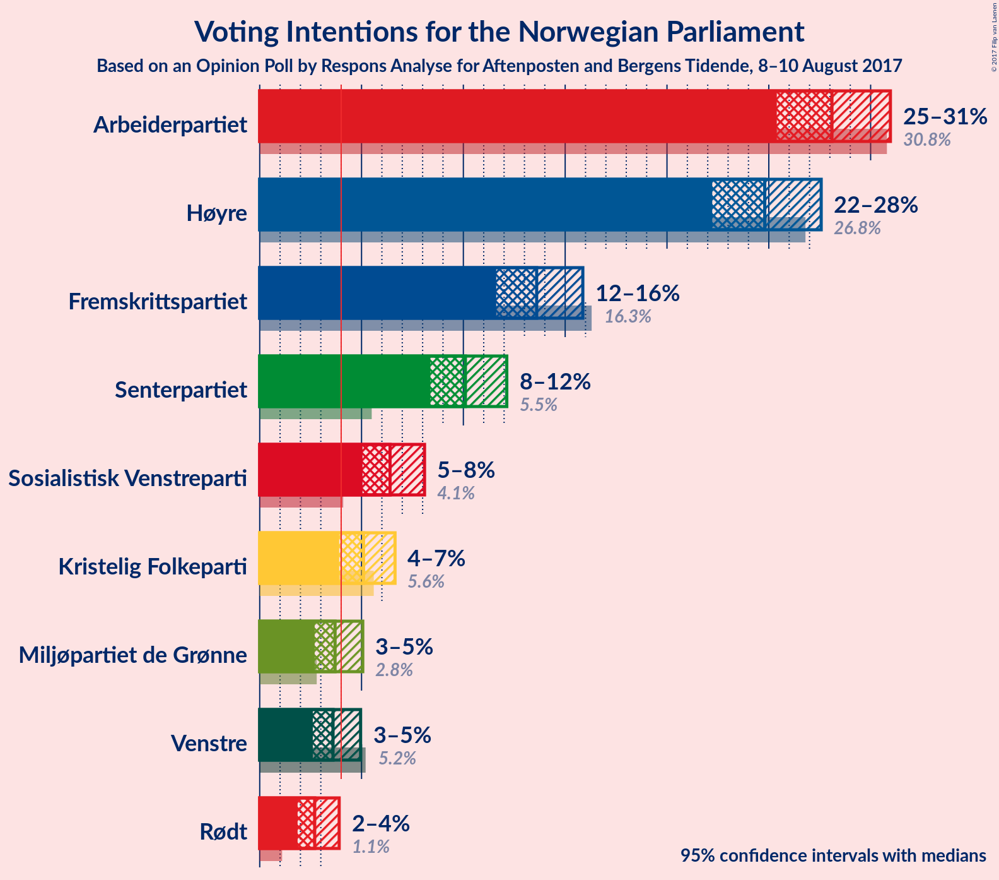
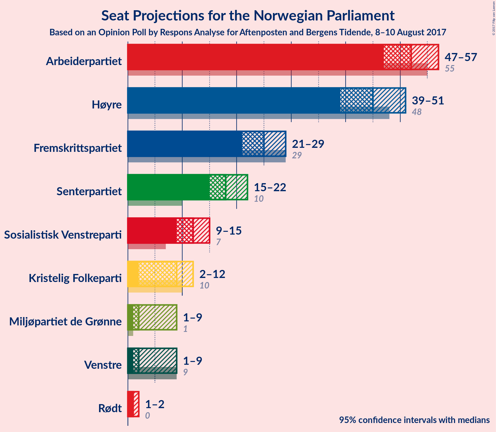
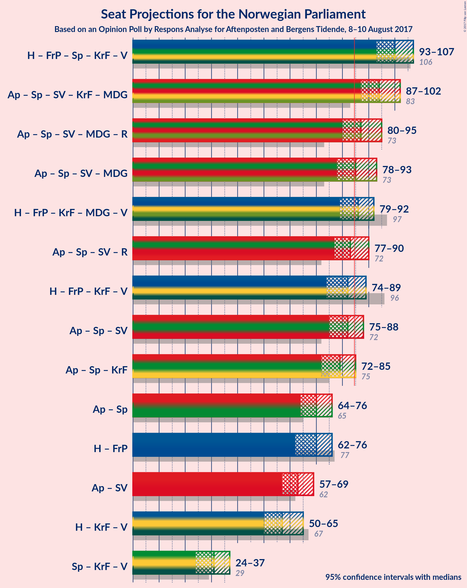

# Opinion Poll by Respons Analyse for Aftenposten and Bergens Tidende, 8–10 August 2017

<a href="#voting-intentions">Voting Intentions</a> | <a href="#seats">Seats</a> | <a href="#coalitions">Coalitions</a> | <a href="#technical-information">Technical Information</a>

## Voting Intentions

### Confidence Intervals

| Party | Last Result | Poll Result | 80% Confidence Interval | 90% Confidence Interval | 95% Confidence Interval | 99% Confidence Interval |
|:-----:|:-----------:|:-----------:|:-----------------------:|:-----------------------:|:-----------------------:|:-----------------------:|
| Arbeiderpartiet | 30.8% | 28.1% | 26.3–30.0% |25.8–30.5% |25.4–31.0% |24.6–31.9% |
| Høyre | 26.8% | 24.8% | 23.1–26.6% |22.6–27.1% |22.2–27.6% |21.4–28.5% |
| Fremskrittspartiet | 16.3% | 13.6% | 12.3–15.1% |11.9–15.5% |11.6–15.9% |11.0–16.6% |
| Senterpartiet | 5.5% | 10.1% | 9.0–11.4% |8.6–11.8% |8.4–12.1% |7.9–12.8% |
| Sosialistisk Venstreparti | 4.1% | 6.4% | 5.5–7.5% |5.3–7.8% |5.0–8.1% |4.6–8.7% |
| Kristelig Folkeparti | 5.6% | 5.1% | 4.3–6.1% |4.1–6.4% |3.9–6.6% |3.6–7.2% |
| Miljøpartiet de Grønne | 2.8% | 3.7% | 3.0–4.6% |2.9–4.8% |2.7–5.1% |2.4–5.5% |
| Venstre | 5.2% | 3.6% | 2.9–4.5% |2.8–4.7% |2.6–5.0% |2.3–5.4% |
| Rødt | 1.1% | 2.7% | 2.1–3.5% |2.0–3.7% |1.9–3.9% |1.6–4.3% |

*Note:* The poll result column reflects the actual value used in the calculations. Published results may vary slightly, and in addition be rounded to fewer digits.

## Seats

### Confidence Intervals

| Party | Last Result | Median | 80% Confidence Interval | 90% Confidence Interval | 95% Confidence Interval | 99% Confidence Interval |
|:-----:|:-----------:|:------:|:-----------------------:|:-----------------------:|:-----------------------:|:-----------------------:|
| <a href="#arbeiderpartiet">Arbeiderpartiet</a> | 55 | 52 | 48–55 |47–56 |47–57 |45–60 |
| <a href="#høyre">Høyre</a> | 48 | 45 | 41–49 |40–49 |39–51 |37–52 |
| <a href="#fremskrittspartiet">Fremskrittspartiet</a> | 29 | 25 | 22–28 |21–28 |21–29 |19–31 |
| <a href="#senterpartiet">Senterpartiet</a> | 10 | 18 | 16–21 |15–22 |15–22 |14–24 |
| <a href="#sosialistisk-venstreparti">Sosialistisk Venstreparti</a> | 7 | 12 | 10–14 |9–14 |9–15 |8–16 |
| <a href="#kristelig-folkeparti">Kristelig Folkeparti</a> | 10 | 9 | 7–11 |2–11 |2–12 |2–13 |
| <a href="#miljøpartiet-de-grønne">Miljøpartiet de Grønne</a> | 1 | 2 | 1–8 |1–9 |1–9 |1–10 |
| <a href="#venstre">Venstre</a> | 9 | 2 | 1–8 |1–8 |1–9 |0–10 |
| <a href="#rødt">Rødt</a> | 0 | 1 | 1–2 |1–2 |1–2 |1–7 |

### Arbeiderpartiet

*For a full overview of the results for this party, see the [Arbeiderpartiet](party-arbeiderpartiet.html) page.*

| Number of Seats | Probability | Accumulated | Special Marks |
|:---------------:|:-----------:|:-----------:|:-------------:|
| 43 | 0.1% | 100% |  |
| 44 | 0.3% | 99.9% |  |
| 45 | 0.4% | 99.6% |  |
| 46 | 2% | 99.2% |  |
| 47 | 3% | 98% |  |
| 48 | 7% | 94% |  |
| 49 | 7% | 87% |  |
| 50 | 15% | 80% |  |
| 51 | 14% | 65% |  |
| 52 | 18% | 51% | Median |
| 53 | 11% | 33% |  |
| 54 | 8% | 23% |  |
| 55 | 8% | 15% | Last Result |
| 56 | 4% | 7% |  |
| 57 | 1.1% | 3% |  |
| 58 | 0.9% | 2% |  |
| 59 | 0.5% | 1.0% |  |
| 60 | 0.3% | 0.5% |  |
| 61 | 0.1% | 0.2% |  |
| 62 | 0% | 0% |  |

### Høyre

*For a full overview of the results for this party, see the [Høyre](party-hyre.html) page.*

| Number of Seats | Probability | Accumulated | Special Marks |
|:---------------:|:-----------:|:-----------:|:-------------:|
| 36 | 0.1% | 100% |  |
| 37 | 0.7% | 99.9% |  |
| 38 | 1.2% | 99.1% |  |
| 39 | 2% | 98% |  |
| 40 | 4% | 96% |  |
| 41 | 7% | 91% |  |
| 42 | 7% | 84% |  |
| 43 | 8% | 77% |  |
| 44 | 13% | 69% |  |
| 45 | 11% | 56% | Median |
| 46 | 7% | 45% |  |
| 47 | 18% | 38% |  |
| 48 | 9% | 20% | Last Result |
| 49 | 6% | 11% |  |
| 50 | 2% | 5% |  |
| 51 | 1.1% | 3% |  |
| 52 | 1.4% | 2% |  |
| 53 | 0.1% | 0.2% |  |
| 54 | 0% | 0.1% |  |
| 55 | 0% | 0% |  |

### Fremskrittspartiet

*For a full overview of the results for this party, see the [Fremskrittspartiet](party-fremskrittspartiet.html) page.*

| Number of Seats | Probability | Accumulated | Special Marks |
|:---------------:|:-----------:|:-----------:|:-------------:|
| 18 | 0.1% | 100% |  |
| 19 | 0.7% | 99.9% |  |
| 20 | 1.3% | 99.2% |  |
| 21 | 5% | 98% |  |
| 22 | 9% | 93% |  |
| 23 | 15% | 84% |  |
| 24 | 18% | 69% |  |
| 25 | 12% | 51% | Median |
| 26 | 19% | 38% |  |
| 27 | 8% | 20% |  |
| 28 | 7% | 12% |  |
| 29 | 4% | 5% | Last Result |
| 30 | 0.7% | 1.2% |  |
| 31 | 0.4% | 0.5% |  |
| 32 | 0.1% | 0.1% |  |
| 33 | 0% | 0% |  |

### Senterpartiet

*For a full overview of the results for this party, see the [Senterpartiet](party-senterpartiet.html) page.*

| Number of Seats | Probability | Accumulated | Special Marks |
|:---------------:|:-----------:|:-----------:|:-------------:|
| 10 | 0% | 100% | Last Result |
| 11 | 0% | 100% |  |
| 12 | 0% | 100% |  |
| 13 | 0.4% | 100% |  |
| 14 | 1.1% | 99.6% |  |
| 15 | 7% | 98.5% |  |
| 16 | 13% | 92% |  |
| 17 | 16% | 79% |  |
| 18 | 17% | 63% | Median |
| 19 | 22% | 46% |  |
| 20 | 14% | 24% |  |
| 21 | 5% | 10% |  |
| 22 | 3% | 5% |  |
| 23 | 0.8% | 2% |  |
| 24 | 0.7% | 0.8% |  |
| 25 | 0.1% | 0.1% |  |
| 26 | 0% | 0% |  |

### Sosialistisk Venstreparti

*For a full overview of the results for this party, see the [Sosialistisk Venstreparti](party-sosialistiskvenstreparti.html) page.*

| Number of Seats | Probability | Accumulated | Special Marks |
|:---------------:|:-----------:|:-----------:|:-------------:|
| 7 | 0.1% | 100% | Last Result |
| 8 | 0.9% | 99.9% |  |
| 9 | 7% | 99.0% |  |
| 10 | 11% | 92% |  |
| 11 | 22% | 81% |  |
| 12 | 23% | 59% | Median |
| 13 | 22% | 36% |  |
| 14 | 10% | 14% |  |
| 15 | 3% | 4% |  |
| 16 | 0.5% | 0.6% |  |
| 17 | 0.1% | 0.1% |  |
| 18 | 0% | 0% |  |

### Kristelig Folkeparti

*For a full overview of the results for this party, see the [Kristelig Folkeparti](party-kristeligfolkeparti.html) page.*

| Number of Seats | Probability | Accumulated | Special Marks |
|:---------------:|:-----------:|:-----------:|:-------------:|
| 2 | 7% | 100% |  |
| 3 | 0.3% | 93% |  |
| 4 | 0% | 93% |  |
| 5 | 0% | 93% |  |
| 6 | 0% | 93% |  |
| 7 | 4% | 93% |  |
| 8 | 16% | 89% |  |
| 9 | 27% | 73% | Median |
| 10 | 27% | 46% | Last Result |
| 11 | 14% | 19% |  |
| 12 | 3% | 5% |  |
| 13 | 1.4% | 2% |  |
| 14 | 0.2% | 0.2% |  |
| 15 | 0% | 0% |  |

### Miljøpartiet de Grønne

*For a full overview of the results for this party, see the [Miljøpartiet de Grønne](party-miljpartietdegrnne.html) page.*

| Number of Seats | Probability | Accumulated | Special Marks |
|:---------------:|:-----------:|:-----------:|:-------------:|
| 1 | 44% | 100% | Last Result |
| 2 | 10% | 56% | Median |
| 3 | 14% | 46% |  |
| 4 | 0.3% | 33% |  |
| 5 | 0% | 32% |  |
| 6 | 0.1% | 32% |  |
| 7 | 12% | 32% |  |
| 8 | 14% | 20% |  |
| 9 | 6% | 7% |  |
| 10 | 0.9% | 1.0% |  |
| 11 | 0.1% | 0.1% |  |
| 12 | 0% | 0% |  |

### Venstre

*For a full overview of the results for this party, see the [Venstre](party-venstre.html) page.*

| Number of Seats | Probability | Accumulated | Special Marks |
|:---------------:|:-----------:|:-----------:|:-------------:|
| 0 | 0.7% | 100% |  |
| 1 | 23% | 99.3% |  |
| 2 | 32% | 76% | Median |
| 3 | 16% | 44% |  |
| 4 | 0% | 27% |  |
| 5 | 0% | 27% |  |
| 6 | 0% | 27% |  |
| 7 | 9% | 27% |  |
| 8 | 14% | 18% |  |
| 9 | 4% | 4% | Last Result |
| 10 | 0.6% | 0.7% |  |
| 11 | 0.1% | 0.1% |  |
| 12 | 0% | 0% |  |

### Rødt

*For a full overview of the results for this party, see the [Rødt](party-rdt.html) page.*

| Number of Seats | Probability | Accumulated | Special Marks |
|:---------------:|:-----------:|:-----------:|:-------------:|
| 0 | 0% | 100% | Last Result |
| 1 | 53% | 100% | Median |
| 2 | 45% | 47% |  |
| 3 | 0% | 2% |  |
| 4 | 0% | 2% |  |
| 5 | 0% | 2% |  |
| 6 | 0.1% | 2% |  |
| 7 | 2% | 2% |  |
| 8 | 0.4% | 0.4% |  |
| 9 | 0% | 0% |  |

## Coalitions

### Confidence Intervals

| Coalition | Last Result | Median | Majority? | 80% Confidence Interval | 90% Confidence Interval | 95% Confidence Interval | 99% Confidence Interval |
|:---------:|:-----------:|:------:|:---------:|:-----------------------:|:-----------------------:|:-----------------------:|:-----------------------:|
| Høyre – Fremskrittspartiet – Senterpartiet – Kristelig Folkeparti – Venstre | 106 | 100 | 100% | 95–105 | 94–106 | 93–107 | 90–110 |
| Arbeiderpartiet – Senterpartiet – Sosialistisk Venstreparti – Kristelig Folkeparti – Miljøpartiet de Grønne | 83 | 94 | 99.8% | 89–99 | 88–101 | 87–102 | 85–104 |
| Arbeiderpartiet – Senterpartiet – Sosialistisk Venstreparti – Miljøpartiet de Grønne – Rødt | 73 | 87 | 69% | 82–92 | 81–94 | 80–95 | 78–96 |
| Arbeiderpartiet – Senterpartiet – Sosialistisk Venstreparti – Miljøpartiet de Grønne | 73 | 85 | 56% | 80–90 | 79–92 | 78–93 | 77–95 |
| Høyre – Fremskrittspartiet – Kristelig Folkeparti – Miljøpartiet de Grønne – Venstre | 97 | 86 | 65% | 81–90 | 80–91 | 79–92 | 76–94 |
| Arbeiderpartiet – Senterpartiet – Sosialistisk Venstreparti – Rødt | 72 | 83 | 35% | 79–88 | 78–89 | 77–90 | 75–93 |
| Høyre – Fremskrittspartiet – Kristelig Folkeparti – Venstre | 96 | 82 | 31% | 77–87 | 75–88 | 74–89 | 73–91 |
| Arbeiderpartiet – Senterpartiet – Sosialistisk Venstreparti | 72 | 82 | 20% | 77–86 | 76–87 | 75–88 | 73–91 |
| Arbeiderpartiet – Senterpartiet – Kristelig Folkeparti | 75 | 79 | 5% | 74–83 | 73–85 | 72–85 | 70–87 |
| Arbeiderpartiet – Senterpartiet | 65 | 70 | 0% | 66–74 | 65–75 | 64–76 | 62–79 |
| Høyre – Fremskrittspartiet | 77 | 70 | 0% | 65–74 | 64–76 | 62–76 | 61–78 |
| Arbeiderpartiet – Sosialistisk Venstreparti | 62 | 63 | 0% | 60–68 | 59–69 | 57–69 | 56–72 |
| Høyre – Kristelig Folkeparti – Venstre | 67 | 57 | 0% | 52–62 | 51–64 | 50–65 | 47–66 |
| Senterpartiet – Kristelig Folkeparti – Venstre | 29 | 31 | 0% | 26–35 | 26–36 | 24–37 | 22–39 |

### Høyre – Fremskrittspartiet – Senterpartiet – Kristelig Folkeparti – Venstre

| Number of Seats | Probability | Accumulated | Special Marks |
|:---------------:|:-----------:|:-----------:|:-------------:|
| 88 | 0% | 100% |  |
| 89 | 0.1% | 99.9% |  |
| 90 | 0.4% | 99.8% |  |
| 91 | 0.3% | 99.4% |  |
| 92 | 2% | 99.1% |  |
| 93 | 2% | 98% |  |
| 94 | 3% | 96% |  |
| 95 | 4% | 93% |  |
| 96 | 4% | 89% |  |
| 97 | 7% | 84% |  |
| 98 | 10% | 77% |  |
| 99 | 9% | 67% | Median |
| 100 | 9% | 57% |  |
| 101 | 7% | 49% |  |
| 102 | 6% | 41% |  |
| 103 | 11% | 35% |  |
| 104 | 11% | 24% |  |
| 105 | 7% | 13% |  |
| 106 | 3% | 7% | Last Result |
| 107 | 2% | 4% |  |
| 108 | 0.7% | 2% |  |
| 109 | 0.5% | 1.0% |  |
| 110 | 0.4% | 0.5% |  |
| 111 | 0.1% | 0.1% |  |
| 112 | 0% | 0% |  |

### Arbeiderpartiet – Senterpartiet – Sosialistisk Venstreparti – Kristelig Folkeparti – Miljøpartiet de Grønne

| Number of Seats | Probability | Accumulated | Special Marks |
|:---------------:|:-----------:|:-----------:|:-------------:|
| 82 | 0% | 100% |  |
| 83 | 0.1% | 99.9% | Last Result |
| 84 | 0% | 99.8% |  |
| 85 | 0.4% | 99.8% | Majority |
| 86 | 1.1% | 99.4% |  |
| 87 | 2% | 98% |  |
| 88 | 3% | 97% |  |
| 89 | 7% | 94% |  |
| 90 | 4% | 87% |  |
| 91 | 10% | 84% |  |
| 92 | 7% | 73% |  |
| 93 | 6% | 67% | Median |
| 94 | 12% | 60% |  |
| 95 | 13% | 48% |  |
| 96 | 6% | 35% |  |
| 97 | 7% | 29% |  |
| 98 | 6% | 22% |  |
| 99 | 8% | 15% |  |
| 100 | 2% | 8% |  |
| 101 | 3% | 6% |  |
| 102 | 2% | 3% |  |
| 103 | 0.5% | 1.0% |  |
| 104 | 0.3% | 0.6% |  |
| 105 | 0.3% | 0.3% |  |
| 106 | 0% | 0% |  |

### Arbeiderpartiet – Senterpartiet – Sosialistisk Venstreparti – Miljøpartiet de Grønne – Rødt

| Number of Seats | Probability | Accumulated | Special Marks |
|:---------------:|:-----------:|:-----------:|:-------------:|
| 73 | 0% | 100% | Last Result |
| 74 | 0% | 100% |  |
| 75 | 0% | 100% |  |
| 76 | 0.1% | 99.9% |  |
| 77 | 0.1% | 99.9% |  |
| 78 | 0.4% | 99.8% |  |
| 79 | 2% | 99.3% |  |
| 80 | 3% | 98% |  |
| 81 | 3% | 95% |  |
| 82 | 5% | 92% |  |
| 83 | 5% | 87% |  |
| 84 | 13% | 81% |  |
| 85 | 6% | 69% | Median, Majority |
| 86 | 11% | 63% |  |
| 87 | 11% | 52% |  |
| 88 | 8% | 41% |  |
| 89 | 8% | 33% |  |
| 90 | 9% | 26% |  |
| 91 | 5% | 17% |  |
| 92 | 4% | 12% |  |
| 93 | 2% | 8% |  |
| 94 | 3% | 6% |  |
| 95 | 2% | 3% |  |
| 96 | 0.9% | 1.3% |  |
| 97 | 0.3% | 0.4% |  |
| 98 | 0.1% | 0.2% |  |
| 99 | 0% | 0.1% |  |
| 100 | 0% | 0% |  |

### Arbeiderpartiet – Senterpartiet – Sosialistisk Venstreparti – Miljøpartiet de Grønne

| Number of Seats | Probability | Accumulated | Special Marks |
|:---------------:|:-----------:|:-----------:|:-------------:|
| 73 | 0% | 100% | Last Result |
| 74 | 0.1% | 100% |  |
| 75 | 0.1% | 99.9% |  |
| 76 | 0.2% | 99.8% |  |
| 77 | 0.7% | 99.6% |  |
| 78 | 3% | 98.9% |  |
| 79 | 4% | 96% |  |
| 80 | 5% | 93% |  |
| 81 | 4% | 88% |  |
| 82 | 10% | 84% |  |
| 83 | 8% | 74% |  |
| 84 | 10% | 66% | Median |
| 85 | 8% | 56% | Majority |
| 86 | 11% | 47% |  |
| 87 | 8% | 37% |  |
| 88 | 8% | 28% |  |
| 89 | 8% | 20% |  |
| 90 | 3% | 13% |  |
| 91 | 3% | 10% |  |
| 92 | 2% | 7% |  |
| 93 | 2% | 4% |  |
| 94 | 1.3% | 2% |  |
| 95 | 0.5% | 0.8% |  |
| 96 | 0.2% | 0.3% |  |
| 97 | 0.1% | 0.1% |  |
| 98 | 0% | 0% |  |

### Høyre – Fremskrittspartiet – Kristelig Folkeparti – Miljøpartiet de Grønne – Venstre

| Number of Seats | Probability | Accumulated | Special Marks |
|:---------------:|:-----------:|:-----------:|:-------------:|
| 75 | 0.1% | 100% |  |
| 76 | 0.5% | 99.8% |  |
| 77 | 0.5% | 99.3% |  |
| 78 | 0.7% | 98.8% |  |
| 79 | 1.3% | 98% |  |
| 80 | 3% | 97% |  |
| 81 | 6% | 94% |  |
| 82 | 7% | 88% |  |
| 83 | 6% | 81% | Median |
| 84 | 10% | 75% |  |
| 85 | 10% | 65% | Majority |
| 86 | 15% | 56% |  |
| 87 | 9% | 41% |  |
| 88 | 11% | 32% |  |
| 89 | 7% | 21% |  |
| 90 | 5% | 14% |  |
| 91 | 5% | 9% |  |
| 92 | 2% | 4% |  |
| 93 | 1.0% | 2% |  |
| 94 | 0.6% | 1.1% |  |
| 95 | 0.2% | 0.4% |  |
| 96 | 0.1% | 0.2% |  |
| 97 | 0.1% | 0.1% | Last Result |
| 98 | 0% | 0% |  |

### Arbeiderpartiet – Senterpartiet – Sosialistisk Venstreparti – Rødt

| Number of Seats | Probability | Accumulated | Special Marks |
|:---------------:|:-----------:|:-----------:|:-------------:|
| 72 | 0.1% | 100% | Last Result |
| 73 | 0.1% | 99.9% |  |
| 74 | 0.2% | 99.8% |  |
| 75 | 0.6% | 99.6% |  |
| 76 | 1.0% | 98.9% |  |
| 77 | 2% | 98% |  |
| 78 | 5% | 96% |  |
| 79 | 5% | 91% |  |
| 80 | 7% | 86% |  |
| 81 | 11% | 79% |  |
| 82 | 9% | 68% |  |
| 83 | 15% | 59% | Median |
| 84 | 10% | 44% |  |
| 85 | 10% | 35% | Majority |
| 86 | 6% | 25% |  |
| 87 | 7% | 19% |  |
| 88 | 6% | 12% |  |
| 89 | 3% | 6% |  |
| 90 | 1.3% | 3% |  |
| 91 | 0.7% | 2% |  |
| 92 | 0.5% | 1.2% |  |
| 93 | 0.5% | 0.7% |  |
| 94 | 0.1% | 0.2% |  |
| 95 | 0% | 0% |  |

### Høyre – Fremskrittspartiet – Kristelig Folkeparti – Venstre

| Number of Seats | Probability | Accumulated | Special Marks |
|:---------------:|:-----------:|:-----------:|:-------------:|
| 70 | 0% | 100% |  |
| 71 | 0.1% | 99.9% |  |
| 72 | 0.3% | 99.8% |  |
| 73 | 0.9% | 99.6% |  |
| 74 | 2% | 98.7% |  |
| 75 | 3% | 97% |  |
| 76 | 2% | 94% |  |
| 77 | 4% | 92% |  |
| 78 | 5% | 88% |  |
| 79 | 9% | 83% |  |
| 80 | 8% | 74% |  |
| 81 | 8% | 67% | Median |
| 82 | 11% | 59% |  |
| 83 | 11% | 48% |  |
| 84 | 6% | 37% |  |
| 85 | 13% | 31% | Majority |
| 86 | 5% | 19% |  |
| 87 | 5% | 13% |  |
| 88 | 3% | 8% |  |
| 89 | 3% | 5% |  |
| 90 | 2% | 2% |  |
| 91 | 0.4% | 0.6% |  |
| 92 | 0.1% | 0.2% |  |
| 93 | 0.1% | 0.1% |  |
| 94 | 0% | 0.1% |  |
| 95 | 0% | 0% |  |
| 96 | 0% | 0% | Last Result |

### Arbeiderpartiet – Senterpartiet – Sosialistisk Venstreparti

| Number of Seats | Probability | Accumulated | Special Marks |
|:---------------:|:-----------:|:-----------:|:-------------:|
| 70 | 0.1% | 100% |  |
| 71 | 0.1% | 99.9% |  |
| 72 | 0.1% | 99.8% | Last Result |
| 73 | 0.5% | 99.7% |  |
| 74 | 0.7% | 99.2% |  |
| 75 | 1.4% | 98% |  |
| 76 | 3% | 97% |  |
| 77 | 7% | 94% |  |
| 78 | 6% | 87% |  |
| 79 | 9% | 82% |  |
| 80 | 10% | 73% |  |
| 81 | 12% | 63% |  |
| 82 | 12% | 51% | Median |
| 83 | 9% | 39% |  |
| 84 | 10% | 30% |  |
| 85 | 6% | 20% | Majority |
| 86 | 4% | 14% |  |
| 87 | 5% | 10% |  |
| 88 | 2% | 5% |  |
| 89 | 0.9% | 2% |  |
| 90 | 0.3% | 1.2% |  |
| 91 | 0.6% | 0.9% |  |
| 92 | 0.2% | 0.3% |  |
| 93 | 0.1% | 0.1% |  |
| 94 | 0% | 0% |  |

### Arbeiderpartiet – Senterpartiet – Kristelig Folkeparti

| Number of Seats | Probability | Accumulated | Special Marks |
|:---------------:|:-----------:|:-----------:|:-------------:|
| 67 | 0.1% | 100% |  |
| 68 | 0.1% | 99.9% |  |
| 69 | 0.3% | 99.8% |  |
| 70 | 0.5% | 99.6% |  |
| 71 | 0.7% | 99.1% |  |
| 72 | 2% | 98% |  |
| 73 | 4% | 97% |  |
| 74 | 4% | 93% |  |
| 75 | 7% | 89% | Last Result |
| 76 | 6% | 82% |  |
| 77 | 10% | 76% |  |
| 78 | 13% | 66% |  |
| 79 | 13% | 53% | Median |
| 80 | 9% | 40% |  |
| 81 | 6% | 31% |  |
| 82 | 12% | 25% |  |
| 83 | 6% | 14% |  |
| 84 | 2% | 7% |  |
| 85 | 3% | 5% | Majority |
| 86 | 1.2% | 2% |  |
| 87 | 0.5% | 1.0% |  |
| 88 | 0.3% | 0.5% |  |
| 89 | 0.1% | 0.2% |  |
| 90 | 0% | 0% |  |

### Arbeiderpartiet – Senterpartiet

| Number of Seats | Probability | Accumulated | Special Marks |
|:---------------:|:-----------:|:-----------:|:-------------:|
| 60 | 0.1% | 100% |  |
| 61 | 0.2% | 99.9% |  |
| 62 | 0.3% | 99.7% |  |
| 63 | 0.7% | 99.4% |  |
| 64 | 2% | 98.7% |  |
| 65 | 4% | 96% | Last Result |
| 66 | 8% | 93% |  |
| 67 | 9% | 84% |  |
| 68 | 11% | 76% |  |
| 69 | 10% | 64% |  |
| 70 | 11% | 54% | Median |
| 71 | 18% | 43% |  |
| 72 | 8% | 25% |  |
| 73 | 6% | 18% |  |
| 74 | 4% | 12% |  |
| 75 | 4% | 8% |  |
| 76 | 1.2% | 3% |  |
| 77 | 1.0% | 2% |  |
| 78 | 0.6% | 1.1% |  |
| 79 | 0.3% | 0.5% |  |
| 80 | 0.2% | 0.2% |  |
| 81 | 0% | 0% |  |

### Høyre – Fremskrittspartiet

| Number of Seats | Probability | Accumulated | Special Marks |
|:---------------:|:-----------:|:-----------:|:-------------:|
| 58 | 0% | 100% |  |
| 59 | 0.1% | 99.9% |  |
| 60 | 0.3% | 99.8% |  |
| 61 | 1.0% | 99.6% |  |
| 62 | 2% | 98.6% |  |
| 63 | 1.4% | 97% |  |
| 64 | 3% | 96% |  |
| 65 | 6% | 93% |  |
| 66 | 4% | 87% |  |
| 67 | 12% | 83% |  |
| 68 | 9% | 71% |  |
| 69 | 8% | 62% |  |
| 70 | 10% | 54% | Median |
| 71 | 15% | 44% |  |
| 72 | 9% | 29% |  |
| 73 | 8% | 20% |  |
| 74 | 4% | 12% |  |
| 75 | 2% | 8% |  |
| 76 | 3% | 6% |  |
| 77 | 1.4% | 2% | Last Result |
| 78 | 0.4% | 0.9% |  |
| 79 | 0.3% | 0.5% |  |
| 80 | 0.2% | 0.2% |  |
| 81 | 0% | 0% |  |

### Arbeiderpartiet – Sosialistisk Venstreparti

| Number of Seats | Probability | Accumulated | Special Marks |
|:---------------:|:-----------:|:-----------:|:-------------:|
| 54 | 0.1% | 100% |  |
| 55 | 0.3% | 99.9% |  |
| 56 | 1.0% | 99.6% |  |
| 57 | 1.2% | 98.6% |  |
| 58 | 2% | 97% |  |
| 59 | 4% | 95% |  |
| 60 | 6% | 91% |  |
| 61 | 10% | 85% |  |
| 62 | 15% | 75% | Last Result |
| 63 | 17% | 60% |  |
| 64 | 9% | 43% | Median |
| 65 | 9% | 35% |  |
| 66 | 6% | 25% |  |
| 67 | 8% | 19% |  |
| 68 | 5% | 11% |  |
| 69 | 4% | 6% |  |
| 70 | 0.7% | 2% |  |
| 71 | 0.5% | 1.1% |  |
| 72 | 0.4% | 0.7% |  |
| 73 | 0.3% | 0.3% |  |
| 74 | 0% | 0% |  |

### Høyre – Kristelig Folkeparti – Venstre

| Number of Seats | Probability | Accumulated | Special Marks |
|:---------------:|:-----------:|:-----------:|:-------------:|
| 45 | 0% | 100% |  |
| 46 | 0.1% | 99.9% |  |
| 47 | 0.9% | 99.9% |  |
| 48 | 0.5% | 99.0% |  |
| 49 | 0.6% | 98% |  |
| 50 | 0.9% | 98% |  |
| 51 | 3% | 97% |  |
| 52 | 4% | 94% |  |
| 53 | 7% | 90% |  |
| 54 | 6% | 83% |  |
| 55 | 6% | 77% |  |
| 56 | 13% | 71% | Median |
| 57 | 10% | 58% |  |
| 58 | 7% | 48% |  |
| 59 | 11% | 42% |  |
| 60 | 7% | 31% |  |
| 61 | 9% | 24% |  |
| 62 | 6% | 15% |  |
| 63 | 4% | 9% |  |
| 64 | 1.2% | 5% |  |
| 65 | 2% | 4% |  |
| 66 | 1.2% | 2% |  |
| 67 | 0.1% | 0.4% | Last Result |
| 68 | 0.2% | 0.2% |  |
| 69 | 0% | 0% |  |

### Senterpartiet – Kristelig Folkeparti – Venstre

| Number of Seats | Probability | Accumulated | Special Marks |
|:---------------:|:-----------:|:-----------:|:-------------:|
| 19 | 0% | 100% |  |
| 20 | 0.1% | 99.9% |  |
| 21 | 0.3% | 99.9% |  |
| 22 | 0.5% | 99.6% |  |
| 23 | 1.1% | 99.0% |  |
| 24 | 1.1% | 98% |  |
| 25 | 2% | 97% |  |
| 26 | 7% | 95% |  |
| 27 | 6% | 89% |  |
| 28 | 7% | 83% |  |
| 29 | 12% | 76% | Last Result, Median |
| 30 | 12% | 64% |  |
| 31 | 11% | 53% |  |
| 32 | 13% | 42% |  |
| 33 | 10% | 29% |  |
| 34 | 5% | 18% |  |
| 35 | 7% | 14% |  |
| 36 | 3% | 7% |  |
| 37 | 2% | 4% |  |
| 38 | 1.2% | 2% |  |
| 39 | 0.7% | 1.1% |  |
| 40 | 0.1% | 0.4% |  |
| 41 | 0.2% | 0.2% |  |
| 42 | 0% | 0% |  |

## Technical Information

### Opinion Poll

+ **Pollster:** Respons Analyse
+ **Media:** Aftenposten and Bergens Tidende
+ **Fieldwork period:** 8–10 August 2017

### Calculations

+ **Sample size:** 1000
+ **Simulations done:** 2,097,152
+ **Error estimate:** 1.25%

