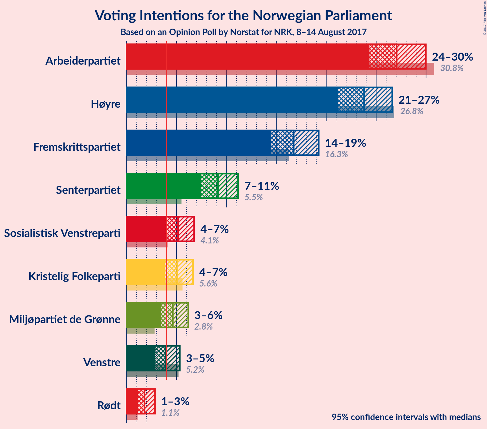
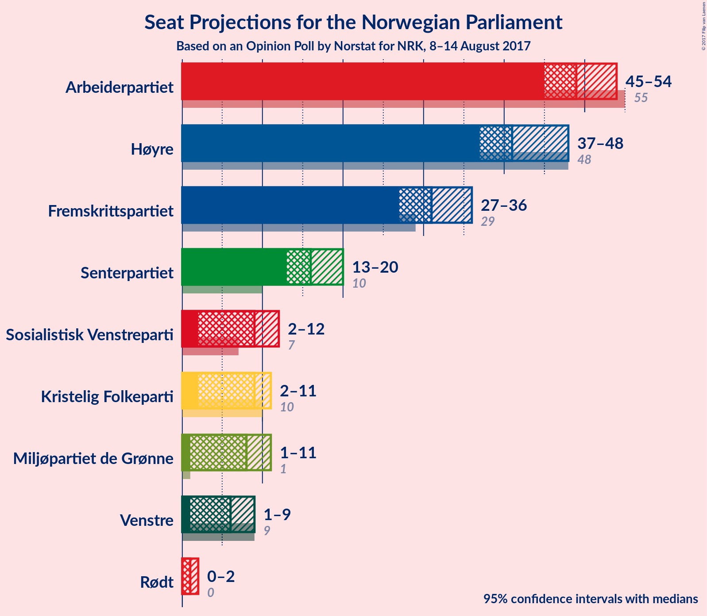
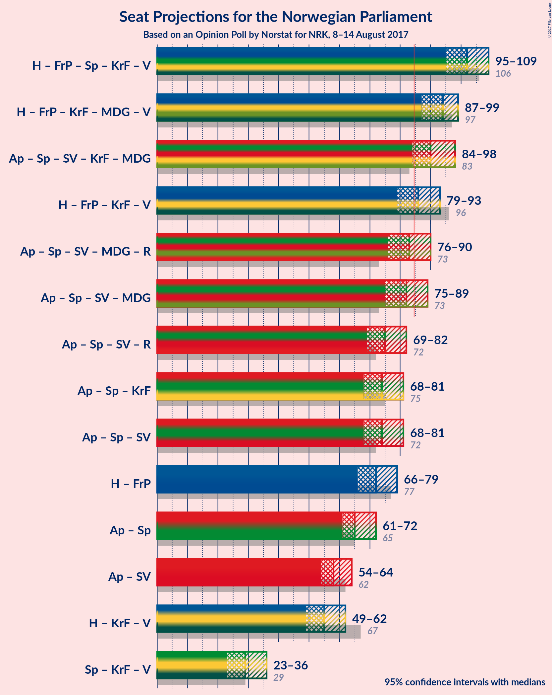

# Opinion Poll by Norstat for NRK, 8–14 August 2017

<a href="#voting-intentions">Voting Intentions</a> | <a href="#seats">Seats</a> | <a href="#coalitions">Coalitions</a> | <a href="#technical-information">Technical Information</a>

## Voting Intentions

### Confidence Intervals

| Party | Last Result | Poll Result | 80% Confidence Interval | 90% Confidence Interval | 95% Confidence Interval | 99% Confidence Interval |
|:-----:|:-----------:|:-----------:|:-----------------------:|:-----------------------:|:-----------------------:|:-----------------------:|
| Arbeiderpartiet | 30.8% | 27.1% | 25.3–29.0% |24.8–29.5% |24.3–30.0% |23.5–30.9% |
| Høyre | 26.8% | 23.8% | 22.1–25.6% |21.6–26.2% |21.2–26.6% |20.4–27.5% |
| Fremskrittspartiet | 16.3% | 16.7% | 15.3–18.4% |14.8–18.8% |14.5–19.3% |13.8–20.1% |
| Senterpartiet | 5.5% | 9.2% | 8.0–10.5% |7.7–10.8% |7.5–11.2% |7.0–11.8% |
| Sosialistisk Venstreparti | 4.1% | 5.2% | 4.3–6.2% |4.1–6.5% |3.9–6.8% |3.6–7.3% |
| Kristelig Folkeparti | 5.6% | 5.1% | 4.2–6.1% |4.0–6.4% |3.8–6.6% |3.5–7.2% |
| Miljøpartiet de Grønne | 2.8% | 4.6% | 3.9–5.6% |3.6–5.9% |3.5–6.2% |3.1–6.7% |
| Venstre | 5.2% | 3.9% | 3.2–4.8% |3.0–5.1% |2.8–5.3% |2.5–5.8% |
| Rødt | 1.1% | 1.8% | 1.3–2.5% |1.2–2.7% |1.1–2.9% |0.9–3.2% |

*Note:* The poll result column reflects the actual value used in the calculations. Published results may vary slightly, and in addition be rounded to fewer digits.

## Seats

### Confidence Intervals

| Party | Last Result | Median | 80% Confidence Interval | 90% Confidence Interval | 95% Confidence Interval | 99% Confidence Interval |
|:-----:|:-----------:|:------:|:-----------------------:|:-----------------------:|:-----------------------:|:-----------------------:|
| <a href="#arbeiderpartiet">Arbeiderpartiet</a> | 55 | 49 | 46–53 |46–54 |45–54 |44–56 |
| <a href="#høyre">Høyre</a> | 48 | 41 | 38–46 |38–47 |37–48 |35–50 |
| <a href="#fremskrittspartiet">Fremskrittspartiet</a> | 29 | 31 | 28–33 |28–34 |27–36 |25–37 |
| <a href="#senterpartiet">Senterpartiet</a> | 10 | 16 | 13–19 |13–19 |13–20 |12–21 |
| <a href="#sosialistisk-venstreparti">Sosialistisk Venstreparti</a> | 7 | 9 | 7–11 |7–11 |2–12 |2–13 |
| <a href="#kristelig-folkeparti">Kristelig Folkeparti</a> | 10 | 9 | 7–10 |2–11 |2–11 |2–13 |
| <a href="#miljøpartiet-de-grønne">Miljøpartiet de Grønne</a> | 1 | 8 | 3–10 |2–10 |1–11 |1–12 |
| <a href="#venstre">Venstre</a> | 9 | 6 | 1–8 |1–9 |1–9 |1–10 |
| <a href="#rødt">Rødt</a> | 0 | 1 | 1 |1–2 |0–2 |0–2 |

### Arbeiderpartiet

*For a full overview of the results for this party, see the [Arbeiderpartiet](party-arbeiderpartiet.html) page.*

| Number of Seats | Probability | Accumulated | Special Marks |
|:---------------:|:-----------:|:-----------:|:-------------:|
| 42 | 0% | 100% |  |
| 43 | 0.2% | 99.9% |  |
| 44 | 0.6% | 99.8% |  |
| 45 | 2% | 99.1% |  |
| 46 | 10% | 97% |  |
| 47 | 15% | 88% |  |
| 48 | 20% | 72% |  |
| 49 | 8% | 52% | Median |
| 50 | 14% | 44% |  |
| 51 | 9% | 30% |  |
| 52 | 7% | 21% |  |
| 53 | 5% | 14% |  |
| 54 | 7% | 9% |  |
| 55 | 1.1% | 2% | Last Result |
| 56 | 0.9% | 1.3% |  |
| 57 | 0.4% | 0.5% |  |
| 58 | 0.1% | 0.1% |  |
| 59 | 0% | 0% |  |

### Høyre

*For a full overview of the results for this party, see the [Høyre](party-hyre.html) page.*

| Number of Seats | Probability | Accumulated | Special Marks |
|:---------------:|:-----------:|:-----------:|:-------------:|
| 34 | 0.2% | 100% |  |
| 35 | 0.3% | 99.7% |  |
| 36 | 0.5% | 99.5% |  |
| 37 | 2% | 99.0% |  |
| 38 | 9% | 97% |  |
| 39 | 10% | 89% |  |
| 40 | 12% | 78% |  |
| 41 | 17% | 66% | Median |
| 42 | 13% | 49% |  |
| 43 | 12% | 35% |  |
| 44 | 4% | 23% |  |
| 45 | 5% | 19% |  |
| 46 | 5% | 14% |  |
| 47 | 5% | 8% |  |
| 48 | 2% | 4% | Last Result |
| 49 | 1.2% | 2% |  |
| 50 | 0.6% | 0.7% |  |
| 51 | 0.1% | 0.2% |  |
| 52 | 0% | 0.1% |  |
| 53 | 0% | 0% |  |

### Fremskrittspartiet

*For a full overview of the results for this party, see the [Fremskrittspartiet](party-fremskrittspartiet.html) page.*

| Number of Seats | Probability | Accumulated | Special Marks |
|:---------------:|:-----------:|:-----------:|:-------------:|
| 23 | 0.1% | 100% |  |
| 24 | 0.4% | 99.9% |  |
| 25 | 0.3% | 99.6% |  |
| 26 | 1.1% | 99.2% |  |
| 27 | 3% | 98% |  |
| 28 | 20% | 96% |  |
| 29 | 12% | 76% | Last Result |
| 30 | 13% | 64% |  |
| 31 | 13% | 51% | Median |
| 32 | 13% | 38% |  |
| 33 | 17% | 25% |  |
| 34 | 4% | 8% |  |
| 35 | 0.8% | 4% |  |
| 36 | 2% | 3% |  |
| 37 | 0.9% | 1.2% |  |
| 38 | 0.2% | 0.3% |  |
| 39 | 0.1% | 0.1% |  |
| 40 | 0% | 0% |  |

### Senterpartiet

*For a full overview of the results for this party, see the [Senterpartiet](party-senterpartiet.html) page.*

| Number of Seats | Probability | Accumulated | Special Marks |
|:---------------:|:-----------:|:-----------:|:-------------:|
| 10 | 0.1% | 100% | Last Result |
| 11 | 0.3% | 99.9% |  |
| 12 | 2% | 99.7% |  |
| 13 | 9% | 98% |  |
| 14 | 9% | 88% |  |
| 15 | 18% | 79% |  |
| 16 | 24% | 61% | Median |
| 17 | 15% | 38% |  |
| 18 | 11% | 23% |  |
| 19 | 8% | 12% |  |
| 20 | 2% | 4% |  |
| 21 | 1.3% | 2% |  |
| 22 | 0.3% | 0.3% |  |
| 23 | 0.1% | 0.1% |  |
| 24 | 0% | 0% |  |

### Sosialistisk Venstreparti

*For a full overview of the results for this party, see the [Sosialistisk Venstreparti](party-sosialistiskvenstreparti.html) page.*

| Number of Seats | Probability | Accumulated | Special Marks |
|:---------------:|:-----------:|:-----------:|:-------------:|
| 1 | 0.3% | 100% |  |
| 2 | 3% | 99.7% |  |
| 3 | 0% | 97% |  |
| 4 | 0% | 97% |  |
| 5 | 0% | 97% |  |
| 6 | 0.2% | 97% |  |
| 7 | 8% | 97% | Last Result |
| 8 | 21% | 89% |  |
| 9 | 27% | 68% | Median |
| 10 | 24% | 41% |  |
| 11 | 12% | 16% |  |
| 12 | 3% | 4% |  |
| 13 | 0.7% | 0.8% |  |
| 14 | 0.2% | 0.2% |  |
| 15 | 0% | 0% |  |

### Kristelig Folkeparti

*For a full overview of the results for this party, see the [Kristelig Folkeparti](party-kristeligfolkeparti.html) page.*

| Number of Seats | Probability | Accumulated | Special Marks |
|:---------------:|:-----------:|:-----------:|:-------------:|
| 1 | 0.1% | 100% |  |
| 2 | 5% | 99.9% |  |
| 3 | 0.8% | 95% |  |
| 4 | 0% | 94% |  |
| 5 | 0% | 94% |  |
| 6 | 0.2% | 94% |  |
| 7 | 9% | 94% |  |
| 8 | 22% | 85% |  |
| 9 | 29% | 63% | Median |
| 10 | 26% | 34% | Last Result |
| 11 | 6% | 9% |  |
| 12 | 2% | 2% |  |
| 13 | 0.5% | 0.6% |  |
| 14 | 0.1% | 0.1% |  |
| 15 | 0% | 0% |  |

### Miljøpartiet de Grønne

*For a full overview of the results for this party, see the [Miljøpartiet de Grønne](party-miljpartietdegrnne.html) page.*

| Number of Seats | Probability | Accumulated | Special Marks |
|:---------------:|:-----------:|:-----------:|:-------------:|
| 1 | 4% | 100% | Last Result |
| 2 | 5% | 96% |  |
| 3 | 4% | 91% |  |
| 4 | 4% | 87% |  |
| 5 | 0% | 83% |  |
| 6 | 0.2% | 83% |  |
| 7 | 17% | 82% |  |
| 8 | 30% | 65% | Median |
| 9 | 19% | 35% |  |
| 10 | 13% | 16% |  |
| 11 | 2% | 3% |  |
| 12 | 1.1% | 1.2% |  |
| 13 | 0.1% | 0.1% |  |
| 14 | 0% | 0% |  |

### Venstre

*For a full overview of the results for this party, see the [Venstre](party-venstre.html) page.*

| Number of Seats | Probability | Accumulated | Special Marks |
|:---------------:|:-----------:|:-----------:|:-------------:|
| 0 | 0.1% | 100% |  |
| 1 | 11% | 99.9% |  |
| 2 | 32% | 89% |  |
| 3 | 6% | 57% |  |
| 4 | 0% | 51% |  |
| 5 | 0% | 51% |  |
| 6 | 2% | 51% | Median |
| 7 | 18% | 49% |  |
| 8 | 24% | 32% |  |
| 9 | 6% | 8% | Last Result |
| 10 | 1.4% | 2% |  |
| 11 | 0.1% | 0.1% |  |
| 12 | 0% | 0% |  |

### Rødt

*For a full overview of the results for this party, see the [Rødt](party-rdt.html) page.*

| Number of Seats | Probability | Accumulated | Special Marks |
|:---------------:|:-----------:|:-----------:|:-------------:|
| 0 | 4% | 100% | Last Result |
| 1 | 90% | 96% | Median |
| 2 | 7% | 7% |  |
| 3 | 0% | 0% |  |

## Coalitions

### Confidence Intervals

| Coalition | Last Result | Median | Majority? | 80% Confidence Interval | 90% Confidence Interval | 95% Confidence Interval | 99% Confidence Interval |
|:---------:|:-----------:|:------:|:---------:|:-----------------------:|:-----------------------:|:-----------------------:|:-----------------------:|
| Høyre – Fremskrittspartiet – Senterpartiet – Kristelig Folkeparti – Venstre | 106 | 102 | 100% | 97–107 | 96–108 | 95–109 | 93–111 |
| Høyre – Fremskrittspartiet – Kristelig Folkeparti – Miljøpartiet de Grønne – Venstre | 97 | 94 | 99.5% | 89–97 | 87–98 | 87–99 | 85–102 |
| Arbeiderpartiet – Senterpartiet – Sosialistisk Venstreparti – Kristelig Folkeparti – Miljøpartiet de Grønne | 83 | 90 | 96% | 86–95 | 85–98 | 84–98 | 81–100 |
| Høyre – Fremskrittspartiet – Kristelig Folkeparti – Venstre | 96 | 86 | 66% | 81–91 | 80–92 | 79–93 | 76–95 |
| Arbeiderpartiet – Senterpartiet – Sosialistisk Venstreparti – Miljøpartiet de Grønne – Rødt | 73 | 83 | 32% | 78–88 | 77–89 | 76–90 | 74–92 |
| Arbeiderpartiet – Senterpartiet – Sosialistisk Venstreparti – Miljøpartiet de Grønne | 73 | 82 | 21% | 77–87 | 76–88 | 75–89 | 73–91 |
| Arbeiderpartiet – Senterpartiet – Sosialistisk Venstreparti – Rødt | 72 | 75 | 0.3% | 72–80 | 71–81 | 69–82 | 67–84 |
| Arbeiderpartiet – Senterpartiet – Kristelig Folkeparti | 75 | 74 | 0.1% | 70–78 | 69–80 | 68–81 | 66–82 |
| Arbeiderpartiet – Senterpartiet – Sosialistisk Venstreparti | 72 | 74 | 0.1% | 71–79 | 70–80 | 68–81 | 66–83 |
| Høyre – Fremskrittspartiet | 77 | 72 | 0% | 68–76 | 67–78 | 66–79 | 64–82 |
| Arbeiderpartiet – Senterpartiet | 65 | 65 | 0% | 62–69 | 61–71 | 61–72 | 59–73 |
| Arbeiderpartiet – Sosialistisk Venstreparti | 62 | 58 | 0% | 55–62 | 54–63 | 54–64 | 50–67 |
| Høyre – Kristelig Folkeparti – Venstre | 67 | 55 | 0% | 51–59 | 50–61 | 49–62 | 46–65 |
| Senterpartiet – Kristelig Folkeparti – Venstre | 29 | 29 | 0% | 26–34 | 24–35 | 23–36 | 20–37 |

### Høyre – Fremskrittspartiet – Senterpartiet – Kristelig Folkeparti – Venstre

| Number of Seats | Probability | Accumulated | Special Marks |
|:---------------:|:-----------:|:-----------:|:-------------:|
| 90 | 0% | 100% |  |
| 91 | 0.1% | 99.9% |  |
| 92 | 0.4% | 99.9% |  |
| 93 | 0.5% | 99.5% |  |
| 94 | 0.7% | 99.0% |  |
| 95 | 2% | 98% |  |
| 96 | 4% | 97% |  |
| 97 | 5% | 93% |  |
| 98 | 5% | 88% |  |
| 99 | 6% | 83% |  |
| 100 | 11% | 77% |  |
| 101 | 8% | 66% |  |
| 102 | 12% | 58% |  |
| 103 | 12% | 46% | Median |
| 104 | 10% | 34% |  |
| 105 | 8% | 24% |  |
| 106 | 4% | 16% | Last Result |
| 107 | 3% | 12% |  |
| 108 | 6% | 9% |  |
| 109 | 1.3% | 3% |  |
| 110 | 0.7% | 2% |  |
| 111 | 0.5% | 0.9% |  |
| 112 | 0.1% | 0.4% |  |
| 113 | 0.2% | 0.3% |  |
| 114 | 0% | 0.1% |  |
| 115 | 0% | 0.1% |  |
| 116 | 0% | 0% |  |

### Høyre – Fremskrittspartiet – Kristelig Folkeparti – Miljøpartiet de Grønne – Venstre

| Number of Seats | Probability | Accumulated | Special Marks |
|:---------------:|:-----------:|:-----------:|:-------------:|
| 81 | 0% | 100% |  |
| 82 | 0.1% | 99.9% |  |
| 83 | 0.1% | 99.9% |  |
| 84 | 0.2% | 99.7% |  |
| 85 | 0.7% | 99.5% | Majority |
| 86 | 1.1% | 98.8% |  |
| 87 | 3% | 98% |  |
| 88 | 4% | 95% |  |
| 89 | 3% | 91% |  |
| 90 | 6% | 88% |  |
| 91 | 6% | 82% |  |
| 92 | 11% | 76% |  |
| 93 | 11% | 64% |  |
| 94 | 13% | 53% |  |
| 95 | 12% | 41% | Median |
| 96 | 14% | 29% |  |
| 97 | 9% | 15% | Last Result |
| 98 | 2% | 6% |  |
| 99 | 1.4% | 4% |  |
| 100 | 1.1% | 2% |  |
| 101 | 0.6% | 1.3% |  |
| 102 | 0.4% | 0.6% |  |
| 103 | 0.1% | 0.2% |  |
| 104 | 0.1% | 0.1% |  |
| 105 | 0% | 0.1% |  |
| 106 | 0% | 0% |  |

### Arbeiderpartiet – Senterpartiet – Sosialistisk Venstreparti – Kristelig Folkeparti – Miljøpartiet de Grønne

| Number of Seats | Probability | Accumulated | Special Marks |
|:---------------:|:-----------:|:-----------:|:-------------:|
| 76 | 0% | 100% |  |
| 77 | 0% | 99.9% |  |
| 78 | 0.1% | 99.9% |  |
| 79 | 0.2% | 99.9% |  |
| 80 | 0.2% | 99.7% |  |
| 81 | 0.3% | 99.6% |  |
| 82 | 0.6% | 99.3% |  |
| 83 | 1.0% | 98.7% | Last Result |
| 84 | 2% | 98% |  |
| 85 | 6% | 96% | Majority |
| 86 | 5% | 90% |  |
| 87 | 5% | 85% |  |
| 88 | 10% | 80% |  |
| 89 | 16% | 70% |  |
| 90 | 9% | 55% |  |
| 91 | 6% | 46% | Median |
| 92 | 12% | 40% |  |
| 93 | 5% | 28% |  |
| 94 | 8% | 23% |  |
| 95 | 5% | 15% |  |
| 96 | 3% | 10% |  |
| 97 | 1.2% | 7% |  |
| 98 | 4% | 6% |  |
| 99 | 0.7% | 1.3% |  |
| 100 | 0.4% | 0.6% |  |
| 101 | 0.2% | 0.2% |  |
| 102 | 0% | 0% |  |

### Høyre – Fremskrittspartiet – Kristelig Folkeparti – Venstre

| Number of Seats | Probability | Accumulated | Special Marks |
|:---------------:|:-----------:|:-----------:|:-------------:|
| 74 | 0% | 100% |  |
| 75 | 0.1% | 99.9% |  |
| 76 | 0.4% | 99.8% |  |
| 77 | 0.7% | 99.5% |  |
| 78 | 1.1% | 98.8% |  |
| 79 | 2% | 98% |  |
| 80 | 5% | 96% |  |
| 81 | 4% | 91% |  |
| 82 | 4% | 86% |  |
| 83 | 4% | 82% |  |
| 84 | 11% | 78% |  |
| 85 | 10% | 66% | Majority |
| 86 | 9% | 57% |  |
| 87 | 10% | 48% | Median |
| 88 | 10% | 37% |  |
| 89 | 13% | 28% |  |
| 90 | 5% | 15% |  |
| 91 | 3% | 10% |  |
| 92 | 5% | 7% |  |
| 93 | 1.2% | 3% |  |
| 94 | 0.7% | 1.4% |  |
| 95 | 0.4% | 0.7% |  |
| 96 | 0.1% | 0.3% | Last Result |
| 97 | 0.1% | 0.2% |  |
| 98 | 0% | 0.1% |  |
| 99 | 0% | 0% |  |

### Arbeiderpartiet – Senterpartiet – Sosialistisk Venstreparti – Miljøpartiet de Grønne – Rødt

| Number of Seats | Probability | Accumulated | Special Marks |
|:---------------:|:-----------:|:-----------:|:-------------:|
| 69 | 0% | 100% |  |
| 70 | 0% | 99.9% |  |
| 71 | 0% | 99.9% |  |
| 72 | 0.1% | 99.9% |  |
| 73 | 0.1% | 99.8% | Last Result |
| 74 | 0.5% | 99.7% |  |
| 75 | 0.8% | 99.2% |  |
| 76 | 1.3% | 98% |  |
| 77 | 5% | 97% |  |
| 78 | 3% | 92% |  |
| 79 | 5% | 90% |  |
| 80 | 13% | 84% |  |
| 81 | 10% | 71% |  |
| 82 | 10% | 62% |  |
| 83 | 9% | 51% | Median |
| 84 | 10% | 42% |  |
| 85 | 11% | 32% | Majority |
| 86 | 4% | 21% |  |
| 87 | 4% | 17% |  |
| 88 | 4% | 13% |  |
| 89 | 5% | 9% |  |
| 90 | 2% | 4% |  |
| 91 | 1.0% | 2% |  |
| 92 | 0.6% | 1.0% |  |
| 93 | 0.3% | 0.4% |  |
| 94 | 0.1% | 0.1% |  |
| 95 | 0% | 0% |  |

### Arbeiderpartiet – Senterpartiet – Sosialistisk Venstreparti – Miljøpartiet de Grønne

| Number of Seats | Probability | Accumulated | Special Marks |
|:---------------:|:-----------:|:-----------:|:-------------:|
| 68 | 0% | 100% |  |
| 69 | 0% | 99.9% |  |
| 70 | 0% | 99.9% |  |
| 71 | 0.1% | 99.9% |  |
| 72 | 0.2% | 99.8% |  |
| 73 | 0.5% | 99.6% | Last Result |
| 74 | 0.8% | 99.2% |  |
| 75 | 1.4% | 98% |  |
| 76 | 5% | 97% |  |
| 77 | 3% | 92% |  |
| 78 | 6% | 90% |  |
| 79 | 12% | 83% |  |
| 80 | 11% | 72% |  |
| 81 | 11% | 61% |  |
| 82 | 8% | 50% | Median |
| 83 | 10% | 42% |  |
| 84 | 11% | 32% |  |
| 85 | 4% | 21% | Majority |
| 86 | 4% | 17% |  |
| 87 | 4% | 13% |  |
| 88 | 4% | 9% |  |
| 89 | 2% | 4% |  |
| 90 | 1.1% | 2% |  |
| 91 | 0.6% | 1.0% |  |
| 92 | 0.3% | 0.4% |  |
| 93 | 0.1% | 0.1% |  |
| 94 | 0% | 0% |  |

### Arbeiderpartiet – Senterpartiet – Sosialistisk Venstreparti – Rødt

| Number of Seats | Probability | Accumulated | Special Marks |
|:---------------:|:-----------:|:-----------:|:-------------:|
| 64 | 0.1% | 100% |  |
| 65 | 0.1% | 99.9% |  |
| 66 | 0.1% | 99.9% |  |
| 67 | 0.5% | 99.7% |  |
| 68 | 0.8% | 99.3% |  |
| 69 | 1.2% | 98% |  |
| 70 | 1.4% | 97% |  |
| 71 | 2% | 96% |  |
| 72 | 10% | 94% | Last Result |
| 73 | 14% | 84% |  |
| 74 | 12% | 70% |  |
| 75 | 13% | 58% | Median |
| 76 | 11% | 46% |  |
| 77 | 11% | 34% |  |
| 78 | 6% | 23% |  |
| 79 | 6% | 17% |  |
| 80 | 3% | 11% |  |
| 81 | 4% | 8% |  |
| 82 | 3% | 4% |  |
| 83 | 0.9% | 2% |  |
| 84 | 0.6% | 0.9% |  |
| 85 | 0.2% | 0.3% | Majority |
| 86 | 0% | 0.1% |  |
| 87 | 0.1% | 0.1% |  |
| 88 | 0% | 0% |  |

### Arbeiderpartiet – Senterpartiet – Kristelig Folkeparti

| Number of Seats | Probability | Accumulated | Special Marks |
|:---------------:|:-----------:|:-----------:|:-------------:|
| 64 | 0.2% | 100% |  |
| 65 | 0.1% | 99.8% |  |
| 66 | 0.7% | 99.7% |  |
| 67 | 0.7% | 99.0% |  |
| 68 | 2% | 98% |  |
| 69 | 4% | 96% |  |
| 70 | 4% | 92% |  |
| 71 | 10% | 88% |  |
| 72 | 10% | 77% |  |
| 73 | 16% | 68% |  |
| 74 | 10% | 52% | Median |
| 75 | 7% | 41% | Last Result |
| 76 | 13% | 35% |  |
| 77 | 8% | 22% |  |
| 78 | 4% | 13% |  |
| 79 | 5% | 10% |  |
| 80 | 2% | 5% |  |
| 81 | 2% | 3% |  |
| 82 | 0.6% | 1.1% |  |
| 83 | 0.3% | 0.5% |  |
| 84 | 0.1% | 0.2% |  |
| 85 | 0.1% | 0.1% | Majority |
| 86 | 0% | 0% |  |

### Arbeiderpartiet – Senterpartiet – Sosialistisk Venstreparti

| Number of Seats | Probability | Accumulated | Special Marks |
|:---------------:|:-----------:|:-----------:|:-------------:|
| 63 | 0% | 100% |  |
| 64 | 0.1% | 99.9% |  |
| 65 | 0.1% | 99.9% |  |
| 66 | 0.5% | 99.7% |  |
| 67 | 0.8% | 99.2% |  |
| 68 | 1.2% | 98% |  |
| 69 | 1.5% | 97% |  |
| 70 | 2% | 96% |  |
| 71 | 10% | 94% |  |
| 72 | 14% | 84% | Last Result |
| 73 | 13% | 70% |  |
| 74 | 12% | 57% | Median |
| 75 | 11% | 45% |  |
| 76 | 12% | 34% |  |
| 77 | 6% | 23% |  |
| 78 | 6% | 17% |  |
| 79 | 2% | 11% |  |
| 80 | 4% | 8% |  |
| 81 | 2% | 4% |  |
| 82 | 0.9% | 2% |  |
| 83 | 0.7% | 0.9% |  |
| 84 | 0.1% | 0.2% |  |
| 85 | 0% | 0.1% | Majority |
| 86 | 0.1% | 0.1% |  |
| 87 | 0% | 0% |  |

### Høyre – Fremskrittspartiet

| Number of Seats | Probability | Accumulated | Special Marks |
|:---------------:|:-----------:|:-----------:|:-------------:|
| 62 | 0% | 100% |  |
| 63 | 0.3% | 99.9% |  |
| 64 | 0.4% | 99.7% |  |
| 65 | 0.5% | 99.3% |  |
| 66 | 2% | 98.8% |  |
| 67 | 4% | 97% |  |
| 68 | 6% | 93% |  |
| 69 | 6% | 87% |  |
| 70 | 4% | 81% |  |
| 71 | 11% | 77% |  |
| 72 | 17% | 65% | Median |
| 73 | 11% | 48% |  |
| 74 | 11% | 37% |  |
| 75 | 10% | 26% |  |
| 76 | 6% | 16% |  |
| 77 | 3% | 10% | Last Result |
| 78 | 3% | 6% |  |
| 79 | 1.0% | 3% |  |
| 80 | 1.1% | 2% |  |
| 81 | 0.6% | 1.2% |  |
| 82 | 0.4% | 0.7% |  |
| 83 | 0.2% | 0.3% |  |
| 84 | 0.1% | 0.1% |  |
| 85 | 0% | 0% | Majority |

### Arbeiderpartiet – Senterpartiet

| Number of Seats | Probability | Accumulated | Special Marks |
|:---------------:|:-----------:|:-----------:|:-------------:|
| 57 | 0% | 100% |  |
| 58 | 0.3% | 99.9% |  |
| 59 | 0.8% | 99.7% |  |
| 60 | 1.4% | 98.9% |  |
| 61 | 5% | 98% |  |
| 62 | 7% | 92% |  |
| 63 | 13% | 86% |  |
| 64 | 19% | 72% |  |
| 65 | 5% | 53% | Last Result, Median |
| 66 | 15% | 48% |  |
| 67 | 9% | 33% |  |
| 68 | 9% | 24% |  |
| 69 | 6% | 14% |  |
| 70 | 3% | 8% |  |
| 71 | 2% | 5% |  |
| 72 | 2% | 3% |  |
| 73 | 0.7% | 1.1% |  |
| 74 | 0.3% | 0.4% |  |
| 75 | 0.1% | 0.2% |  |
| 76 | 0.1% | 0.1% |  |
| 77 | 0% | 0% |  |

### Arbeiderpartiet – Sosialistisk Venstreparti

| Number of Seats | Probability | Accumulated | Special Marks |
|:---------------:|:-----------:|:-----------:|:-------------:|
| 47 | 0% | 100% |  |
| 48 | 0.1% | 99.9% |  |
| 49 | 0.2% | 99.8% |  |
| 50 | 0.2% | 99.6% |  |
| 51 | 0.3% | 99.4% |  |
| 52 | 0.4% | 99.1% |  |
| 53 | 1.0% | 98.7% |  |
| 54 | 4% | 98% |  |
| 55 | 8% | 94% |  |
| 56 | 14% | 86% |  |
| 57 | 11% | 72% |  |
| 58 | 20% | 61% | Median |
| 59 | 10% | 41% |  |
| 60 | 7% | 31% |  |
| 61 | 6% | 24% |  |
| 62 | 10% | 18% | Last Result |
| 63 | 4% | 8% |  |
| 64 | 1.4% | 4% |  |
| 65 | 1.0% | 2% |  |
| 66 | 0.5% | 1.1% |  |
| 67 | 0.4% | 0.6% |  |
| 68 | 0.1% | 0.1% |  |
| 69 | 0% | 0% |  |

### Høyre – Kristelig Folkeparti – Venstre

| Number of Seats | Probability | Accumulated | Special Marks |
|:---------------:|:-----------:|:-----------:|:-------------:|
| 43 | 0% | 100% |  |
| 44 | 0.1% | 99.9% |  |
| 45 | 0.1% | 99.8% |  |
| 46 | 0.3% | 99.7% |  |
| 47 | 1.0% | 99.5% |  |
| 48 | 0.6% | 98% |  |
| 49 | 2% | 98% |  |
| 50 | 5% | 96% |  |
| 51 | 3% | 91% |  |
| 52 | 8% | 88% |  |
| 53 | 11% | 80% |  |
| 54 | 10% | 68% |  |
| 55 | 14% | 59% |  |
| 56 | 7% | 45% | Median |
| 57 | 8% | 38% |  |
| 58 | 7% | 30% |  |
| 59 | 14% | 23% |  |
| 60 | 4% | 10% |  |
| 61 | 2% | 5% |  |
| 62 | 1.0% | 3% |  |
| 63 | 1.0% | 2% |  |
| 64 | 0.8% | 1.4% |  |
| 65 | 0.4% | 0.6% |  |
| 66 | 0.1% | 0.2% |  |
| 67 | 0.1% | 0.2% | Last Result |
| 68 | 0% | 0% |  |

### Senterpartiet – Kristelig Folkeparti – Venstre

| Number of Seats | Probability | Accumulated | Special Marks |
|:---------------:|:-----------:|:-----------:|:-------------:|
| 18 | 0.1% | 100% |  |
| 19 | 0.4% | 99.9% |  |
| 20 | 0.7% | 99.5% |  |
| 21 | 0.4% | 98.8% |  |
| 22 | 0.6% | 98% |  |
| 23 | 1.1% | 98% |  |
| 24 | 2% | 97% |  |
| 25 | 5% | 95% |  |
| 26 | 7% | 90% |  |
| 27 | 7% | 83% |  |
| 28 | 17% | 75% |  |
| 29 | 10% | 58% | Last Result |
| 30 | 11% | 49% |  |
| 31 | 8% | 37% | Median |
| 32 | 6% | 29% |  |
| 33 | 9% | 23% |  |
| 34 | 8% | 14% |  |
| 35 | 3% | 6% |  |
| 36 | 2% | 3% |  |
| 37 | 0.7% | 1.2% |  |
| 38 | 0.3% | 0.5% |  |
| 39 | 0.1% | 0.2% |  |
| 40 | 0.1% | 0.1% |  |
| 41 | 0% | 0% |  |

## Technical Information

### Opinion Poll

+ **Pollster:** Norstat
+ **Media:** NRK
+ **Fieldwork period:** 8–14 August 2017

### Calculations

+ **Sample size:** 950
+ **Simulations done:** 2,097,152
+ **Error estimate:** 2.10%

