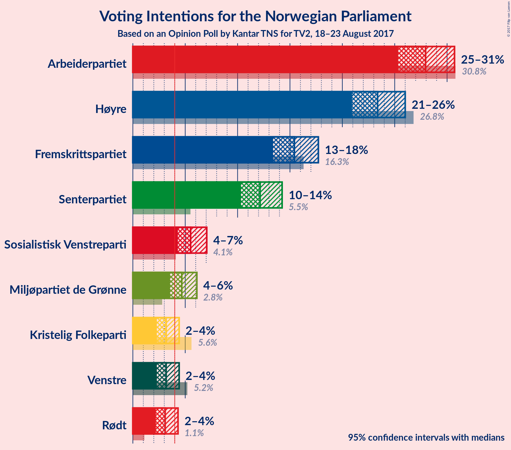
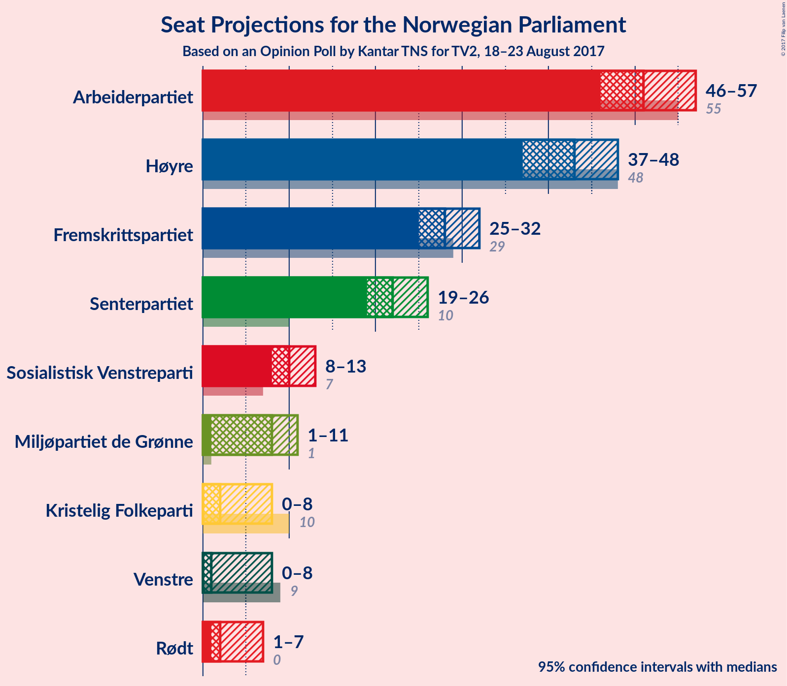
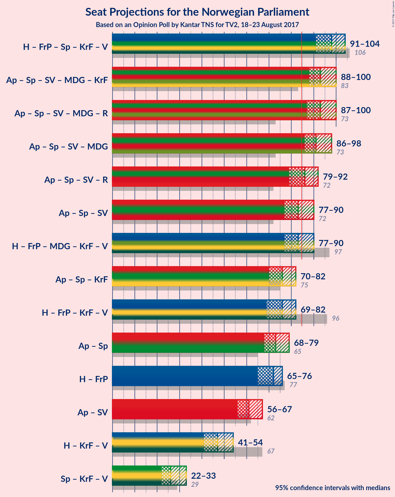

# Opinion Poll by Kantar TNS for TV2, 18–23 August 2017

<a href="#voting-intentions">Voting Intentions</a> | <a href="#seats">Seats</a> | <a href="#coalitions">Coalitions</a> | <a href="#technical-information">Technical Information</a>

## Voting Intentions

### Confidence Intervals

| Party | Last Result | Poll Result | 80% Confidence Interval | 90% Confidence Interval | 95% Confidence Interval | 99% Confidence Interval |
|:-----:|:-----------:|:-----------:|:-----------------------:|:-----------------------:|:-----------------------:|:-----------------------:|
| Arbeiderpartiet | 30.8% | 27.9% | 26.2–29.8% |25.7–30.3% |25.3–30.7% |24.5–31.6% |
| Høyre | 26.8% | 23.4% | 21.8–25.1% |21.3–25.6% |20.9–26.0% |20.2–26.8% |
| Fremskrittspartiet | 16.3% | 15.4% | 14.1–16.9% |13.7–17.3% |13.4–17.7% |12.8–18.5% |
| Senterpartiet | 5.5% | 12.1% | 10.9–13.5% |10.6–13.9% |10.3–14.3% |9.8–14.9% |
| Sosialistisk Venstreparti | 4.1% | 5.5% | 4.7–6.5% |4.5–6.8% |4.3–7.1% |3.9–7.6% |
| Miljøpartiet de Grønne | 2.8% | 4.7% | 3.9–5.6% |3.7–5.9% |3.6–6.1% |3.2–6.6% |
| Kristelig Folkeparti | 5.6% | 3.2% | 2.6–4.0% |2.4–4.2% |2.3–4.4% |2.0–4.8% |
| Venstre | 5.2% | 3.2% | 2.6–4.0% |2.4–4.2% |2.3–4.4% |2.0–4.8% |
| Rødt | 1.1% | 3.1% | 2.5–3.9% |2.3–4.1% |2.2–4.3% |2.0–4.7% |

*Note:* The poll result column reflects the actual value used in the calculations. Published results may vary slightly, and in addition be rounded to fewer digits.

## Seats

### Confidence Intervals

| Party | Last Result | Median | 80% Confidence Interval | 90% Confidence Interval | 95% Confidence Interval | 99% Confidence Interval |
|:-----:|:-----------:|:------:|:-----------------------:|:-----------------------:|:-----------------------:|:-----------------------:|
| <a href="#arbeiderpartiet">Arbeiderpartiet</a> | 55 | 51 | 48–54 |47–55 |46–57 |45–58 |
| <a href="#høyre">Høyre</a> | 48 | 43 | 39–46 |38–47 |37–48 |36–49 |
| <a href="#fremskrittspartiet">Fremskrittspartiet</a> | 29 | 28 | 26–31 |26–32 |25–32 |23–34 |
| <a href="#senterpartiet">Senterpartiet</a> | 10 | 22 | 20–25 |19–26 |19–26 |18–27 |
| <a href="#sosialistisk-venstreparti">Sosialistisk Venstreparti</a> | 7 | 10 | 8–12 |8–13 |8–13 |2–14 |
| <a href="#miljøpartiet-de-grønne">Miljøpartiet de Grønne</a> | 1 | 8 | 3–10 |3–11 |1–11 |1–12 |
| <a href="#kristelig-folkeparti">Kristelig Folkeparti</a> | 10 | 2 | 1–7 |1–7 |0–8 |0–9 |
| <a href="#venstre">Venstre</a> | 9 | 1 | 1–3 |0–7 |0–8 |0–8 |
| <a href="#rødt">Rødt</a> | 0 | 2 | 1–2 |1–7 |1–7 |1–8 |

### Arbeiderpartiet

*For a full overview of the results for this party, see the [Arbeiderpartiet](party-arbeiderpartiet.html) page.*

| Number of Seats | Probability | Accumulated | Special Marks |
|:---------------:|:-----------:|:-----------:|:-------------:|
| 43 | 0.1% | 100% |  |
| 44 | 0.3% | 99.9% |  |
| 45 | 0.9% | 99.6% |  |
| 46 | 4% | 98.7% |  |
| 47 | 5% | 95% |  |
| 48 | 4% | 90% |  |
| 49 | 10% | 86% |  |
| 50 | 16% | 76% |  |
| 51 | 19% | 60% | Median |
| 52 | 11% | 41% |  |
| 53 | 14% | 30% |  |
| 54 | 6% | 16% |  |
| 55 | 5% | 10% | Last Result |
| 56 | 2% | 5% |  |
| 57 | 2% | 3% |  |
| 58 | 0.5% | 0.9% |  |
| 59 | 0.2% | 0.3% |  |
| 60 | 0.1% | 0.1% |  |
| 61 | 0% | 0% |  |

### Høyre

*For a full overview of the results for this party, see the [Høyre](party-hyre.html) page.*

| Number of Seats | Probability | Accumulated | Special Marks |
|:---------------:|:-----------:|:-----------:|:-------------:|
| 35 | 0.1% | 100% |  |
| 36 | 0.5% | 99.8% |  |
| 37 | 2% | 99.3% |  |
| 38 | 4% | 97% |  |
| 39 | 8% | 93% |  |
| 40 | 8% | 85% |  |
| 41 | 10% | 77% |  |
| 42 | 11% | 67% |  |
| 43 | 12% | 57% | Median |
| 44 | 15% | 45% |  |
| 45 | 8% | 30% |  |
| 46 | 13% | 23% |  |
| 47 | 4% | 9% |  |
| 48 | 3% | 5% | Last Result |
| 49 | 2% | 2% |  |
| 50 | 0.1% | 0.3% |  |
| 51 | 0.2% | 0.2% |  |
| 52 | 0% | 0% |  |

### Fremskrittspartiet

*For a full overview of the results for this party, see the [Fremskrittspartiet](party-fremskrittspartiet.html) page.*

| Number of Seats | Probability | Accumulated | Special Marks |
|:---------------:|:-----------:|:-----------:|:-------------:|
| 22 | 0.3% | 100% |  |
| 23 | 0.6% | 99.7% |  |
| 24 | 0.8% | 99.1% |  |
| 25 | 3% | 98% |  |
| 26 | 7% | 96% |  |
| 27 | 12% | 88% |  |
| 28 | 30% | 77% | Median |
| 29 | 22% | 47% | Last Result |
| 30 | 13% | 25% |  |
| 31 | 3% | 12% |  |
| 32 | 7% | 9% |  |
| 33 | 1.3% | 2% |  |
| 34 | 0.5% | 0.9% |  |
| 35 | 0.3% | 0.4% |  |
| 36 | 0.1% | 0.1% |  |
| 37 | 0% | 0% |  |

### Senterpartiet

*For a full overview of the results for this party, see the [Senterpartiet](party-senterpartiet.html) page.*

| Number of Seats | Probability | Accumulated | Special Marks |
|:---------------:|:-----------:|:-----------:|:-------------:|
| 10 | 0% | 100% | Last Result |
| 11 | 0% | 100% |  |
| 12 | 0% | 100% |  |
| 13 | 0% | 100% |  |
| 14 | 0% | 100% |  |
| 15 | 0% | 100% |  |
| 16 | 0.1% | 100% |  |
| 17 | 0.3% | 99.9% |  |
| 18 | 1.5% | 99.6% |  |
| 19 | 3% | 98% |  |
| 20 | 22% | 95% |  |
| 21 | 15% | 73% |  |
| 22 | 14% | 58% | Median |
| 23 | 12% | 45% |  |
| 24 | 20% | 33% |  |
| 25 | 5% | 13% |  |
| 26 | 6% | 7% |  |
| 27 | 0.6% | 1.0% |  |
| 28 | 0.2% | 0.4% |  |
| 29 | 0.2% | 0.2% |  |
| 30 | 0% | 0% |  |

### Sosialistisk Venstreparti

*For a full overview of the results for this party, see the [Sosialistisk Venstreparti](party-sosialistiskvenstreparti.html) page.*

| Number of Seats | Probability | Accumulated | Special Marks |
|:---------------:|:-----------:|:-----------:|:-------------:|
| 1 | 0.1% | 100% |  |
| 2 | 0.6% | 99.9% |  |
| 3 | 0% | 99.3% |  |
| 4 | 0% | 99.3% |  |
| 5 | 0% | 99.3% |  |
| 6 | 0% | 99.3% |  |
| 7 | 0.2% | 99.3% | Last Result |
| 8 | 11% | 99.1% |  |
| 9 | 15% | 88% |  |
| 10 | 30% | 73% | Median |
| 11 | 17% | 44% |  |
| 12 | 22% | 27% |  |
| 13 | 4% | 5% |  |
| 14 | 0.7% | 0.9% |  |
| 15 | 0.1% | 0.1% |  |
| 16 | 0% | 0% |  |

### Miljøpartiet de Grønne

*For a full overview of the results for this party, see the [Miljøpartiet de Grønne](party-miljpartietdegrnne.html) page.*

| Number of Seats | Probability | Accumulated | Special Marks |
|:---------------:|:-----------:|:-----------:|:-------------:|
| 1 | 3% | 100% | Last Result |
| 2 | 1.1% | 97% |  |
| 3 | 15% | 96% |  |
| 4 | 3% | 81% |  |
| 5 | 0% | 78% |  |
| 6 | 0% | 78% |  |
| 7 | 2% | 78% |  |
| 8 | 31% | 76% | Median |
| 9 | 23% | 45% |  |
| 10 | 15% | 22% |  |
| 11 | 6% | 7% |  |
| 12 | 0.9% | 1.1% |  |
| 13 | 0.2% | 0.2% |  |
| 14 | 0% | 0% |  |

### Kristelig Folkeparti

*For a full overview of the results for this party, see the [Kristelig Folkeparti](party-kristeligfolkeparti.html) page.*

| Number of Seats | Probability | Accumulated | Special Marks |
|:---------------:|:-----------:|:-----------:|:-------------:|
| 0 | 5% | 100% |  |
| 1 | 39% | 95% |  |
| 2 | 39% | 56% | Median |
| 3 | 4% | 17% |  |
| 4 | 0% | 13% |  |
| 5 | 0% | 13% |  |
| 6 | 0% | 13% |  |
| 7 | 8% | 13% |  |
| 8 | 4% | 5% |  |
| 9 | 0.8% | 0.9% |  |
| 10 | 0% | 0% | Last Result |

### Venstre

*For a full overview of the results for this party, see the [Venstre](party-venstre.html) page.*

| Number of Seats | Probability | Accumulated | Special Marks |
|:---------------:|:-----------:|:-----------:|:-------------:|
| 0 | 8% | 100% |  |
| 1 | 47% | 92% | Median |
| 2 | 33% | 45% |  |
| 3 | 5% | 12% |  |
| 4 | 0% | 7% |  |
| 5 | 0% | 7% |  |
| 6 | 0% | 7% |  |
| 7 | 2% | 7% |  |
| 8 | 4% | 5% |  |
| 9 | 0.4% | 0.4% | Last Result |
| 10 | 0% | 0% |  |

### Rødt

*For a full overview of the results for this party, see the [Rødt](party-rdt.html) page.*

| Number of Seats | Probability | Accumulated | Special Marks |
|:---------------:|:-----------:|:-----------:|:-------------:|
| 0 | 0% | 100% | Last Result |
| 1 | 15% | 100% |  |
| 2 | 79% | 85% | Median |
| 3 | 0% | 6% |  |
| 4 | 0% | 6% |  |
| 5 | 0% | 6% |  |
| 6 | 0% | 6% |  |
| 7 | 4% | 6% |  |
| 8 | 2% | 2% |  |
| 9 | 0.4% | 0.4% |  |
| 10 | 0% | 0% |  |

## Coalitions

### Confidence Intervals

| Coalition | Last Result | Median | Majority? | 80% Confidence Interval | 90% Confidence Interval | 95% Confidence Interval | 99% Confidence Interval |
|:---------:|:-----------:|:------:|:---------:|:-----------------------:|:-----------------------:|:-----------------------:|:-----------------------:|
| Høyre – Fremskrittspartiet – Senterpartiet – Kristelig Folkeparti – Venstre | 106 | 98 | 100% | 94–102 | 92–103 | 91–104 | 90–106 |
| Arbeiderpartiet – Senterpartiet – Sosialistisk Venstreparti – Miljøpartiet de Grønne – Kristelig Folkeparti | 83 | 93 | 99.8% | 90–98 | 89–99 | 88–100 | 86–101 |
| Arbeiderpartiet – Senterpartiet – Sosialistisk Venstreparti – Miljøpartiet de Grønne – Rødt | 73 | 93 | 99.8% | 90–97 | 89–99 | 87–100 | 86–101 |
| Arbeiderpartiet – Senterpartiet – Sosialistisk Venstreparti – Miljøpartiet de Grønne | 73 | 91 | 98.8% | 88–95 | 87–96 | 86–98 | 83–99 |
| Arbeiderpartiet – Senterpartiet – Sosialistisk Venstreparti – Rødt | 72 | 86 | 59% | 82–91 | 81–91 | 79–92 | 77–94 |
| Arbeiderpartiet – Senterpartiet – Sosialistisk Venstreparti | 72 | 83 | 37% | 80–89 | 79–89 | 77–90 | 75–92 |
| Høyre – Fremskrittspartiet – Miljøpartiet de Grønne – Kristelig Folkeparti – Venstre | 97 | 83 | 41% | 78–87 | 78–88 | 77–90 | 75–92 |
| Arbeiderpartiet – Senterpartiet – Kristelig Folkeparti | 75 | 76 | 0.4% | 71–80 | 71–81 | 70–82 | 68–84 |
| Høyre – Fremskrittspartiet – Kristelig Folkeparti – Venstre | 96 | 76 | 0.2% | 72–79 | 70–80 | 69–82 | 68–83 |
| Arbeiderpartiet – Senterpartiet | 65 | 73 | 0% | 70–77 | 69–78 | 68–79 | 65–82 |
| Høyre – Fremskrittspartiet | 77 | 72 | 0% | 67–75 | 66–76 | 65–76 | 64–79 |
| Arbeiderpartiet – Sosialistisk Venstreparti | 62 | 61 | 0% | 58–65 | 57–66 | 56–67 | 54–69 |
| Høyre – Kristelig Folkeparti – Venstre | 67 | 47 | 0% | 43–51 | 42–52 | 41–54 | 40–55 |
| Senterpartiet – Kristelig Folkeparti – Venstre | 29 | 26 | 0% | 23–31 | 22–33 | 22–33 | 20–35 |

### Høyre – Fremskrittspartiet – Senterpartiet – Kristelig Folkeparti – Venstre

| Number of Seats | Probability | Accumulated | Special Marks |
|:---------------:|:-----------:|:-----------:|:-------------:|
| 87 | 0% | 100% |  |
| 88 | 0.1% | 99.9% |  |
| 89 | 0.3% | 99.9% |  |
| 90 | 2% | 99.6% |  |
| 91 | 2% | 98% |  |
| 92 | 3% | 95% |  |
| 93 | 2% | 93% |  |
| 94 | 4% | 91% |  |
| 95 | 8% | 86% |  |
| 96 | 10% | 79% | Median |
| 97 | 12% | 69% |  |
| 98 | 15% | 57% |  |
| 99 | 17% | 42% |  |
| 100 | 7% | 25% |  |
| 101 | 8% | 18% |  |
| 102 | 3% | 10% |  |
| 103 | 4% | 7% |  |
| 104 | 2% | 3% |  |
| 105 | 0.9% | 2% |  |
| 106 | 0.3% | 0.6% | Last Result |
| 107 | 0.1% | 0.3% |  |
| 108 | 0.1% | 0.2% |  |
| 109 | 0% | 0.1% |  |
| 110 | 0% | 0% |  |

### Arbeiderpartiet – Senterpartiet – Sosialistisk Venstreparti – Miljøpartiet de Grønne – Kristelig Folkeparti

| Number of Seats | Probability | Accumulated | Special Marks |
|:---------------:|:-----------:|:-----------:|:-------------:|
| 82 | 0.1% | 100% |  |
| 83 | 0.1% | 99.9% | Last Result |
| 84 | 0.1% | 99.9% |  |
| 85 | 0.2% | 99.8% | Majority |
| 86 | 0.5% | 99.6% |  |
| 87 | 0.7% | 99.0% |  |
| 88 | 2% | 98% |  |
| 89 | 3% | 97% |  |
| 90 | 9% | 94% |  |
| 91 | 15% | 85% |  |
| 92 | 9% | 71% |  |
| 93 | 16% | 61% | Median |
| 94 | 10% | 45% |  |
| 95 | 11% | 35% |  |
| 96 | 6% | 24% |  |
| 97 | 5% | 18% |  |
| 98 | 7% | 13% |  |
| 99 | 2% | 6% |  |
| 100 | 3% | 5% |  |
| 101 | 2% | 2% |  |
| 102 | 0.2% | 0.4% |  |
| 103 | 0.1% | 0.1% |  |
| 104 | 0% | 0% |  |

### Arbeiderpartiet – Senterpartiet – Sosialistisk Venstreparti – Miljøpartiet de Grønne – Rødt

| Number of Seats | Probability | Accumulated | Special Marks |
|:---------------:|:-----------:|:-----------:|:-------------:|
| 73 | 0% | 100% | Last Result |
| 74 | 0% | 100% |  |
| 75 | 0% | 100% |  |
| 76 | 0% | 100% |  |
| 77 | 0% | 100% |  |
| 78 | 0% | 100% |  |
| 79 | 0% | 100% |  |
| 80 | 0% | 100% |  |
| 81 | 0% | 100% |  |
| 82 | 0.1% | 100% |  |
| 83 | 0% | 99.9% |  |
| 84 | 0.1% | 99.9% |  |
| 85 | 0.3% | 99.8% | Majority |
| 86 | 0.5% | 99.5% |  |
| 87 | 2% | 99.0% |  |
| 88 | 1.2% | 97% |  |
| 89 | 5% | 96% |  |
| 90 | 4% | 91% |  |
| 91 | 9% | 87% |  |
| 92 | 19% | 78% |  |
| 93 | 10% | 59% | Median |
| 94 | 18% | 49% |  |
| 95 | 6% | 31% |  |
| 96 | 10% | 26% |  |
| 97 | 6% | 15% |  |
| 98 | 3% | 9% |  |
| 99 | 2% | 6% |  |
| 100 | 2% | 4% |  |
| 101 | 1.1% | 1.4% |  |
| 102 | 0.1% | 0.3% |  |
| 103 | 0.1% | 0.2% |  |
| 104 | 0% | 0.1% |  |
| 105 | 0% | 0% |  |

### Arbeiderpartiet – Senterpartiet – Sosialistisk Venstreparti – Miljøpartiet de Grønne

| Number of Seats | Probability | Accumulated | Special Marks |
|:---------------:|:-----------:|:-----------:|:-------------:|
| 73 | 0% | 100% | Last Result |
| 74 | 0% | 100% |  |
| 75 | 0% | 100% |  |
| 76 | 0% | 100% |  |
| 77 | 0% | 100% |  |
| 78 | 0% | 100% |  |
| 79 | 0.1% | 100% |  |
| 80 | 0% | 99.9% |  |
| 81 | 0.2% | 99.9% |  |
| 82 | 0.2% | 99.7% |  |
| 83 | 0.3% | 99.6% |  |
| 84 | 0.5% | 99.3% |  |
| 85 | 1.2% | 98.8% | Majority |
| 86 | 2% | 98% |  |
| 87 | 3% | 95% |  |
| 88 | 6% | 92% |  |
| 89 | 10% | 86% |  |
| 90 | 17% | 76% |  |
| 91 | 12% | 59% | Median |
| 92 | 18% | 47% |  |
| 93 | 8% | 29% |  |
| 94 | 9% | 21% |  |
| 95 | 5% | 12% |  |
| 96 | 3% | 8% |  |
| 97 | 2% | 5% |  |
| 98 | 1.2% | 3% |  |
| 99 | 1.0% | 1.3% |  |
| 100 | 0.2% | 0.3% |  |
| 101 | 0.1% | 0.1% |  |
| 102 | 0% | 0% |  |

### Arbeiderpartiet – Senterpartiet – Sosialistisk Venstreparti – Rødt

| Number of Seats | Probability | Accumulated | Special Marks |
|:---------------:|:-----------:|:-----------:|:-------------:|
| 72 | 0% | 100% | Last Result |
| 73 | 0% | 100% |  |
| 74 | 0% | 100% |  |
| 75 | 0% | 100% |  |
| 76 | 0.1% | 99.9% |  |
| 77 | 0.4% | 99.9% |  |
| 78 | 0.9% | 99.4% |  |
| 79 | 2% | 98.5% |  |
| 80 | 2% | 97% |  |
| 81 | 2% | 95% |  |
| 82 | 6% | 93% |  |
| 83 | 17% | 87% |  |
| 84 | 11% | 70% |  |
| 85 | 9% | 59% | Median, Majority |
| 86 | 8% | 50% |  |
| 87 | 7% | 42% |  |
| 88 | 9% | 34% |  |
| 89 | 9% | 25% |  |
| 90 | 4% | 17% |  |
| 91 | 8% | 13% |  |
| 92 | 3% | 4% |  |
| 93 | 0.7% | 2% |  |
| 94 | 0.8% | 1.3% |  |
| 95 | 0.2% | 0.5% |  |
| 96 | 0.2% | 0.3% |  |
| 97 | 0% | 0% |  |

### Arbeiderpartiet – Senterpartiet – Sosialistisk Venstreparti

| Number of Seats | Probability | Accumulated | Special Marks |
|:---------------:|:-----------:|:-----------:|:-------------:|
| 72 | 0% | 100% | Last Result |
| 73 | 0% | 100% |  |
| 74 | 0.1% | 99.9% |  |
| 75 | 0.4% | 99.8% |  |
| 76 | 1.0% | 99.5% |  |
| 77 | 1.5% | 98% |  |
| 78 | 2% | 97% |  |
| 79 | 3% | 95% |  |
| 80 | 7% | 93% |  |
| 81 | 19% | 86% |  |
| 82 | 11% | 67% |  |
| 83 | 8% | 56% | Median |
| 84 | 11% | 48% |  |
| 85 | 5% | 37% | Majority |
| 86 | 8% | 32% |  |
| 87 | 9% | 24% |  |
| 88 | 4% | 16% |  |
| 89 | 8% | 12% |  |
| 90 | 3% | 4% |  |
| 91 | 0.5% | 2% |  |
| 92 | 0.7% | 1.1% |  |
| 93 | 0.3% | 0.3% |  |
| 94 | 0% | 0.1% |  |
| 95 | 0% | 0% |  |

### Høyre – Fremskrittspartiet – Miljøpartiet de Grønne – Kristelig Folkeparti – Venstre

| Number of Seats | Probability | Accumulated | Special Marks |
|:---------------:|:-----------:|:-----------:|:-------------:|
| 73 | 0.2% | 100% |  |
| 74 | 0.2% | 99.7% |  |
| 75 | 0.8% | 99.5% |  |
| 76 | 0.7% | 98.7% |  |
| 77 | 3% | 98% |  |
| 78 | 8% | 96% |  |
| 79 | 4% | 87% |  |
| 80 | 9% | 83% |  |
| 81 | 9% | 75% |  |
| 82 | 7% | 66% | Median |
| 83 | 8% | 58% |  |
| 84 | 9% | 50% |  |
| 85 | 11% | 41% | Majority |
| 86 | 17% | 30% |  |
| 87 | 6% | 13% |  |
| 88 | 2% | 7% |  |
| 89 | 2% | 5% |  |
| 90 | 2% | 3% |  |
| 91 | 0.9% | 1.5% |  |
| 92 | 0.4% | 0.6% |  |
| 93 | 0.1% | 0.1% |  |
| 94 | 0% | 0.1% |  |
| 95 | 0% | 0% |  |
| 96 | 0% | 0% |  |
| 97 | 0% | 0% | Last Result |

### Arbeiderpartiet – Senterpartiet – Kristelig Folkeparti

| Number of Seats | Probability | Accumulated | Special Marks |
|:---------------:|:-----------:|:-----------:|:-------------:|
| 66 | 0.1% | 100% |  |
| 67 | 0.1% | 99.9% |  |
| 68 | 0.3% | 99.8% |  |
| 69 | 1.0% | 99.5% |  |
| 70 | 2% | 98% |  |
| 71 | 8% | 96% |  |
| 72 | 7% | 88% |  |
| 73 | 10% | 81% |  |
| 74 | 6% | 70% |  |
| 75 | 13% | 64% | Last Result, Median |
| 76 | 11% | 51% |  |
| 77 | 8% | 40% |  |
| 78 | 13% | 31% |  |
| 79 | 6% | 18% |  |
| 80 | 6% | 12% |  |
| 81 | 3% | 6% |  |
| 82 | 1.3% | 3% |  |
| 83 | 0.8% | 2% |  |
| 84 | 0.6% | 1.1% |  |
| 85 | 0.2% | 0.4% | Majority |
| 86 | 0.2% | 0.3% |  |
| 87 | 0% | 0% |  |

### Høyre – Fremskrittspartiet – Kristelig Folkeparti – Venstre

| Number of Seats | Probability | Accumulated | Special Marks |
|:---------------:|:-----------:|:-----------:|:-------------:|
| 65 | 0% | 100% |  |
| 66 | 0.1% | 99.9% |  |
| 67 | 0.1% | 99.8% |  |
| 68 | 1.1% | 99.7% |  |
| 69 | 2% | 98.6% |  |
| 70 | 2% | 96% |  |
| 71 | 3% | 94% |  |
| 72 | 6% | 91% |  |
| 73 | 10% | 85% |  |
| 74 | 6% | 74% | Median |
| 75 | 18% | 69% |  |
| 76 | 10% | 51% |  |
| 77 | 19% | 41% |  |
| 78 | 9% | 22% |  |
| 79 | 4% | 13% |  |
| 80 | 5% | 9% |  |
| 81 | 1.2% | 4% |  |
| 82 | 2% | 3% |  |
| 83 | 0.5% | 1.0% |  |
| 84 | 0.3% | 0.5% |  |
| 85 | 0.1% | 0.2% | Majority |
| 86 | 0% | 0.1% |  |
| 87 | 0.1% | 0.1% |  |
| 88 | 0% | 0% |  |
| 89 | 0% | 0% |  |
| 90 | 0% | 0% |  |
| 91 | 0% | 0% |  |
| 92 | 0% | 0% |  |
| 93 | 0% | 0% |  |
| 94 | 0% | 0% |  |
| 95 | 0% | 0% |  |
| 96 | 0% | 0% | Last Result |

### Arbeiderpartiet – Senterpartiet

| Number of Seats | Probability | Accumulated | Special Marks |
|:---------------:|:-----------:|:-----------:|:-------------:|
| 64 | 0.1% | 100% |  |
| 65 | 0.5% | 99.9% | Last Result |
| 66 | 0.4% | 99.4% |  |
| 67 | 1.5% | 99.0% |  |
| 68 | 2% | 98% |  |
| 69 | 4% | 96% |  |
| 70 | 11% | 91% |  |
| 71 | 12% | 80% |  |
| 72 | 13% | 68% |  |
| 73 | 9% | 55% | Median |
| 74 | 10% | 46% |  |
| 75 | 9% | 36% |  |
| 76 | 6% | 27% |  |
| 77 | 12% | 21% |  |
| 78 | 6% | 10% |  |
| 79 | 2% | 4% |  |
| 80 | 1.4% | 2% |  |
| 81 | 0.4% | 1.0% |  |
| 82 | 0.4% | 0.5% |  |
| 83 | 0.1% | 0.1% |  |
| 84 | 0.1% | 0.1% |  |
| 85 | 0% | 0% | Majority |

### Høyre – Fremskrittspartiet

| Number of Seats | Probability | Accumulated | Special Marks |
|:---------------:|:-----------:|:-----------:|:-------------:|
| 61 | 0% | 100% |  |
| 62 | 0.1% | 99.9% |  |
| 63 | 0.3% | 99.8% |  |
| 64 | 1.1% | 99.5% |  |
| 65 | 3% | 98% |  |
| 66 | 4% | 96% |  |
| 67 | 5% | 91% |  |
| 68 | 6% | 86% |  |
| 69 | 7% | 80% |  |
| 70 | 8% | 73% |  |
| 71 | 12% | 65% | Median |
| 72 | 9% | 54% |  |
| 73 | 16% | 45% |  |
| 74 | 11% | 29% |  |
| 75 | 10% | 18% |  |
| 76 | 6% | 8% |  |
| 77 | 0.7% | 2% | Last Result |
| 78 | 0.7% | 1.4% |  |
| 79 | 0.4% | 0.7% |  |
| 80 | 0.1% | 0.3% |  |
| 81 | 0.1% | 0.2% |  |
| 82 | 0% | 0.1% |  |
| 83 | 0% | 0.1% |  |
| 84 | 0% | 0% |  |

### Arbeiderpartiet – Sosialistisk Venstreparti

| Number of Seats | Probability | Accumulated | Special Marks |
|:---------------:|:-----------:|:-----------:|:-------------:|
| 51 | 0% | 100% |  |
| 52 | 0.1% | 99.9% |  |
| 53 | 0.2% | 99.9% |  |
| 54 | 0.6% | 99.7% |  |
| 55 | 0.9% | 99.1% |  |
| 56 | 2% | 98% |  |
| 57 | 3% | 96% |  |
| 58 | 8% | 92% |  |
| 59 | 8% | 84% |  |
| 60 | 11% | 76% |  |
| 61 | 17% | 65% | Median |
| 62 | 15% | 48% | Last Result |
| 63 | 12% | 33% |  |
| 64 | 5% | 21% |  |
| 65 | 8% | 17% |  |
| 66 | 4% | 9% |  |
| 67 | 4% | 5% |  |
| 68 | 0.6% | 1.4% |  |
| 69 | 0.5% | 0.8% |  |
| 70 | 0.2% | 0.2% |  |
| 71 | 0% | 0.1% |  |
| 72 | 0% | 0% |  |

### Høyre – Kristelig Folkeparti – Venstre

| Number of Seats | Probability | Accumulated | Special Marks |
|:---------------:|:-----------:|:-----------:|:-------------:|
| 38 | 0.1% | 100% |  |
| 39 | 0.2% | 99.9% |  |
| 40 | 0.9% | 99.7% |  |
| 41 | 3% | 98.8% |  |
| 42 | 3% | 96% |  |
| 43 | 6% | 93% |  |
| 44 | 4% | 87% |  |
| 45 | 16% | 83% |  |
| 46 | 11% | 67% | Median |
| 47 | 11% | 56% |  |
| 48 | 16% | 44% |  |
| 49 | 11% | 29% |  |
| 50 | 6% | 18% |  |
| 51 | 6% | 12% |  |
| 52 | 2% | 6% |  |
| 53 | 1.0% | 4% |  |
| 54 | 1.2% | 3% |  |
| 55 | 1.2% | 1.5% |  |
| 56 | 0.1% | 0.3% |  |
| 57 | 0.1% | 0.1% |  |
| 58 | 0% | 0.1% |  |
| 59 | 0% | 0% |  |
| 60 | 0% | 0% |  |
| 61 | 0% | 0% |  |
| 62 | 0% | 0% |  |
| 63 | 0% | 0% |  |
| 64 | 0% | 0% |  |
| 65 | 0% | 0% |  |
| 66 | 0% | 0% |  |
| 67 | 0% | 0% | Last Result |

### Senterpartiet – Kristelig Folkeparti – Venstre

| Number of Seats | Probability | Accumulated | Special Marks |
|:---------------:|:-----------:|:-----------:|:-------------:|
| 19 | 0.1% | 100% |  |
| 20 | 0.4% | 99.9% |  |
| 21 | 2% | 99.5% |  |
| 22 | 4% | 98% |  |
| 23 | 13% | 94% |  |
| 24 | 13% | 81% |  |
| 25 | 10% | 69% | Median |
| 26 | 16% | 59% |  |
| 27 | 14% | 43% |  |
| 28 | 12% | 29% |  |
| 29 | 3% | 16% | Last Result |
| 30 | 2% | 13% |  |
| 31 | 3% | 11% |  |
| 32 | 2% | 8% |  |
| 33 | 3% | 5% |  |
| 34 | 0.7% | 2% |  |
| 35 | 0.9% | 1.3% |  |
| 36 | 0.2% | 0.4% |  |
| 37 | 0.1% | 0.2% |  |
| 38 | 0.1% | 0.1% |  |
| 39 | 0% | 0% |  |

## Technical Information

### Opinion Poll

+ **Pollster:** Kantar TNS
+ **Media:** TV2
+ **Fieldwork period:** 18–23 August 2017

### Calculations

+ **Sample size:** 1070
+ **Simulations done:** 1,048,576
+ **Error estimate:** 1.23%

