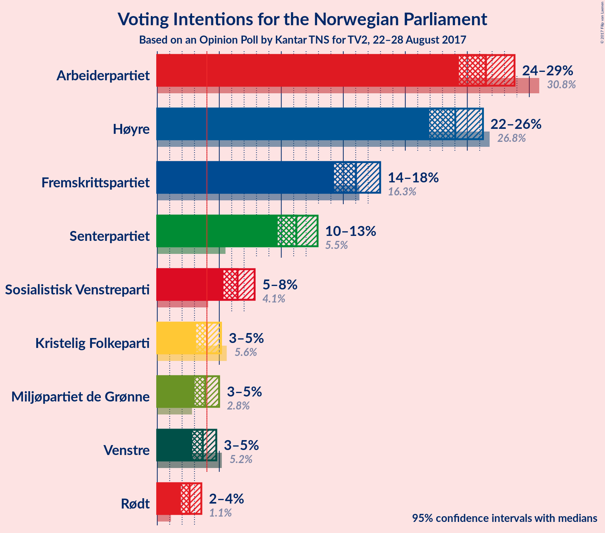
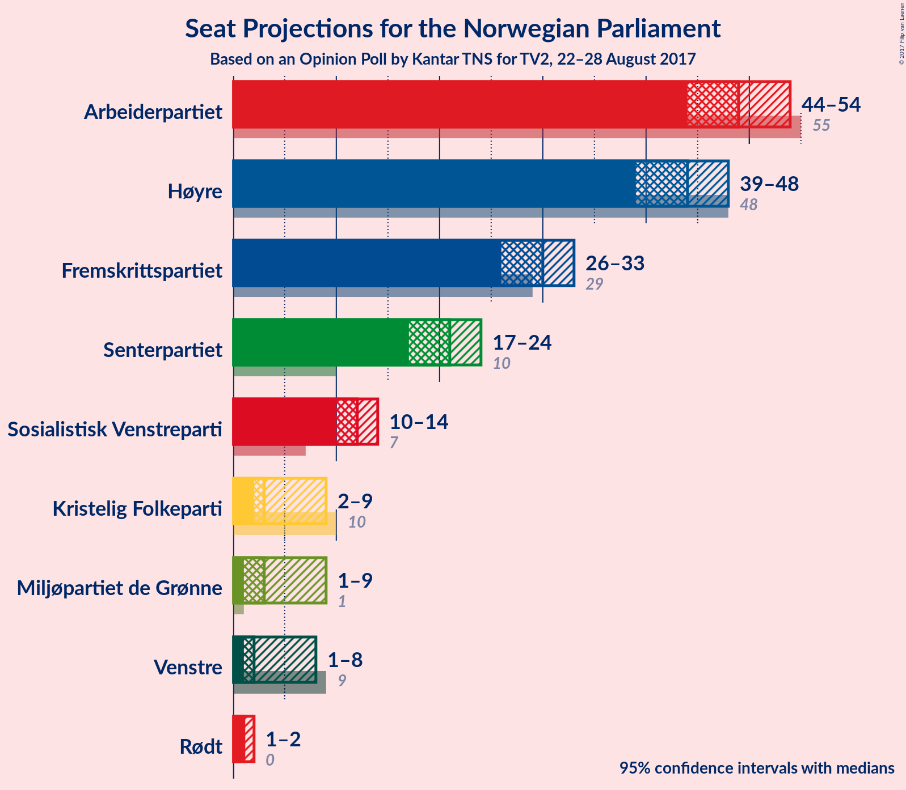
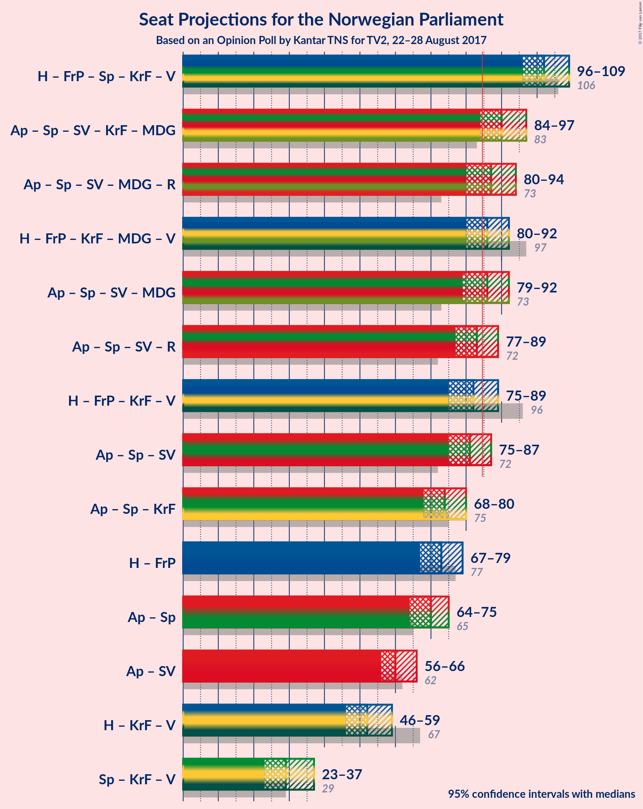

# Opinion Poll by Kantar TNS for TV2, 22–28 August 2017

<a href="#voting-intentions">Voting Intentions</a> | <a href="#seats">Seats</a> | <a href="#coalitions">Coalitions</a> | <a href="#technical-information">Technical Information</a>

## Voting Intentions

### Confidence Intervals

| Party | Last Result | Poll Result | 80% Confidence Interval | 90% Confidence Interval | 95% Confidence Interval | 99% Confidence Interval |
|:-----:|:-----------:|:-----------:|:-----------------------:|:-----------------------:|:-----------------------:|:-----------------------:|
| Arbeiderpartiet | 30.8% | 26.5% | 25.1–28.0% |24.7–28.4% |24.3–28.8% |23.7–29.5% |
| Høyre | 26.8% | 24.0% | 22.6–25.5% |22.3–25.9% |21.9–26.3% |21.3–27.0% |
| Fremskrittspartiet | 16.3% | 16.0% | 14.9–17.3% |14.5–17.7% |14.3–18.0% |13.7–18.6% |
| Senterpartiet | 5.5% | 11.2% | 10.2–12.3% |10.0–12.7% |9.7–12.9% |9.3–13.5% |
| Sosialistisk Venstreparti | 4.1% | 6.5% | 5.7–7.4% |5.5–7.6% |5.3–7.8% |5.0–8.3% |
| Kristelig Folkeparti | 5.6% | 4.0% | 3.4–4.7% |3.3–5.0% |3.1–5.1% |2.9–5.5% |
| Miljøpartiet de Grønne | 2.8% | 3.9% | 3.3–4.6% |3.1–4.8% |3.0–5.0% |2.7–5.3% |
| Venstre | 5.2% | 3.7% | 3.1–4.4% |3.0–4.6% |2.8–4.8% |2.6–5.1% |
| Rødt | 1.1% | 2.6% | 2.1–3.2% |2.0–3.4% |1.9–3.6% |1.7–3.9% |

*Note:* The poll result column reflects the actual value used in the calculations. Published results may vary slightly, and in addition be rounded to fewer digits.

## Seats

### Confidence Intervals

| Party | Last Result | Median | 80% Confidence Interval | 90% Confidence Interval | 95% Confidence Interval | 99% Confidence Interval |
|:-----:|:-----------:|:------:|:-----------------------:|:-----------------------:|:-----------------------:|:-----------------------:|
| <a href="#arbeiderpartiet">Arbeiderpartiet</a> | 55 | 49 | 46–52 |45–53 |44–54 |43–55 |
| <a href="#høyre">Høyre</a> | 48 | 44 | 41–47 |40–48 |39–48 |38–50 |
| <a href="#fremskrittspartiet">Fremskrittspartiet</a> | 29 | 30 | 27–32 |26–33 |26–33 |25–34 |
| <a href="#senterpartiet">Senterpartiet</a> | 10 | 21 | 19–23 |18–23 |17–24 |16–25 |
| <a href="#sosialistisk-venstreparti">Sosialistisk Venstreparti</a> | 7 | 12 | 10–14 |10–14 |10–14 |9–15 |
| <a href="#kristelig-folkeparti">Kristelig Folkeparti</a> | 10 | 3 | 2–9 |2–9 |2–9 |1–10 |
| <a href="#miljøpartiet-de-grønne">Miljøpartiet de Grønne</a> | 1 | 3 | 1–8 |1–9 |1–9 |1–10 |
| <a href="#venstre">Venstre</a> | 9 | 2 | 1–8 |1–8 |1–8 |1–9 |
| <a href="#rødt">Rødt</a> | 0 | 1 | 1–2 |1–2 |1–2 |1–2 |

### Arbeiderpartiet

*For a full overview of the results for this party, see the [Arbeiderpartiet](party-arbeiderpartiet.html) page.*

| Number of Seats | Probability | Accumulated | Special Marks |
|:---------------:|:-----------:|:-----------:|:-------------:|
| 41 | 0% | 100% |  |
| 42 | 0.3% | 99.9% |  |
| 43 | 0.5% | 99.6% |  |
| 44 | 3% | 99.1% |  |
| 45 | 5% | 96% |  |
| 46 | 9% | 91% |  |
| 47 | 12% | 82% |  |
| 48 | 16% | 71% |  |
| 49 | 17% | 55% | Median |
| 50 | 8% | 38% |  |
| 51 | 15% | 29% |  |
| 52 | 5% | 14% |  |
| 53 | 6% | 8% |  |
| 54 | 1.4% | 3% |  |
| 55 | 1.0% | 1.2% | Last Result |
| 56 | 0.1% | 0.2% |  |
| 57 | 0% | 0.1% |  |
| 58 | 0% | 0% |  |

### Høyre

*For a full overview of the results for this party, see the [Høyre](party-hyre.html) page.*

| Number of Seats | Probability | Accumulated | Special Marks |
|:---------------:|:-----------:|:-----------:|:-------------:|
| 36 | 0% | 100% |  |
| 37 | 0.3% | 99.9% |  |
| 38 | 1.2% | 99.6% |  |
| 39 | 2% | 98% |  |
| 40 | 4% | 96% |  |
| 41 | 10% | 92% |  |
| 42 | 13% | 82% |  |
| 43 | 16% | 69% |  |
| 44 | 11% | 53% | Median |
| 45 | 10% | 42% |  |
| 46 | 11% | 31% |  |
| 47 | 15% | 21% |  |
| 48 | 4% | 6% | Last Result |
| 49 | 1.0% | 2% |  |
| 50 | 0.7% | 1.1% |  |
| 51 | 0.3% | 0.5% |  |
| 52 | 0.1% | 0.1% |  |
| 53 | 0% | 0% |  |

### Fremskrittspartiet

*For a full overview of the results for this party, see the [Fremskrittspartiet](party-fremskrittspartiet.html) page.*

| Number of Seats | Probability | Accumulated | Special Marks |
|:---------------:|:-----------:|:-----------:|:-------------:|
| 24 | 0.2% | 100% |  |
| 25 | 0.6% | 99.7% |  |
| 26 | 5% | 99.1% |  |
| 27 | 10% | 94% |  |
| 28 | 16% | 84% |  |
| 29 | 17% | 68% | Last Result |
| 30 | 19% | 51% | Median |
| 31 | 19% | 32% |  |
| 32 | 6% | 13% |  |
| 33 | 5% | 7% |  |
| 34 | 0.8% | 1.2% |  |
| 35 | 0.2% | 0.4% |  |
| 36 | 0.1% | 0.1% |  |
| 37 | 0% | 0% |  |

### Senterpartiet

*For a full overview of the results for this party, see the [Senterpartiet](party-senterpartiet.html) page.*

| Number of Seats | Probability | Accumulated | Special Marks |
|:---------------:|:-----------:|:-----------:|:-------------:|
| 10 | 0% | 100% | Last Result |
| 11 | 0% | 100% |  |
| 12 | 0% | 100% |  |
| 13 | 0% | 100% |  |
| 14 | 0% | 100% |  |
| 15 | 0.1% | 100% |  |
| 16 | 0.5% | 99.9% |  |
| 17 | 2% | 99.4% |  |
| 18 | 6% | 97% |  |
| 19 | 13% | 91% |  |
| 20 | 25% | 78% |  |
| 21 | 20% | 53% | Median |
| 22 | 19% | 32% |  |
| 23 | 10% | 13% |  |
| 24 | 2% | 3% |  |
| 25 | 0.4% | 0.7% |  |
| 26 | 0.2% | 0.2% |  |
| 27 | 0% | 0% |  |

### Sosialistisk Venstreparti

*For a full overview of the results for this party, see the [Sosialistisk Venstreparti](party-sosialistiskvenstreparti.html) page.*

| Number of Seats | Probability | Accumulated | Special Marks |
|:---------------:|:-----------:|:-----------:|:-------------:|
| 7 | 0% | 100% | Last Result |
| 8 | 0.1% | 100% |  |
| 9 | 1.3% | 99.9% |  |
| 10 | 10% | 98.6% |  |
| 11 | 29% | 88% |  |
| 12 | 32% | 59% | Median |
| 13 | 16% | 27% |  |
| 14 | 9% | 11% |  |
| 15 | 1.3% | 2% |  |
| 16 | 0.4% | 0.4% |  |
| 17 | 0% | 0% |  |

### Kristelig Folkeparti

*For a full overview of the results for this party, see the [Kristelig Folkeparti](party-kristeligfolkeparti.html) page.*

| Number of Seats | Probability | Accumulated | Special Marks |
|:---------------:|:-----------:|:-----------:|:-------------:|
| 1 | 2% | 100% |  |
| 2 | 39% | 98% |  |
| 3 | 14% | 59% | Median |
| 4 | 0% | 45% |  |
| 5 | 0% | 45% |  |
| 6 | 0% | 45% |  |
| 7 | 9% | 45% |  |
| 8 | 24% | 36% |  |
| 9 | 10% | 12% |  |
| 10 | 2% | 2% | Last Result |
| 11 | 0.1% | 0.1% |  |
| 12 | 0% | 0% |  |

### Miljøpartiet de Grønne

*For a full overview of the results for this party, see the [Miljøpartiet de Grønne](party-miljpartietdegrnne.html) page.*

| Number of Seats | Probability | Accumulated | Special Marks |
|:---------------:|:-----------:|:-----------:|:-------------:|
| 1 | 26% | 100% | Last Result |
| 2 | 10% | 74% |  |
| 3 | 14% | 64% | Median |
| 4 | 12% | 49% |  |
| 5 | 0% | 37% |  |
| 6 | 0% | 37% |  |
| 7 | 9% | 37% |  |
| 8 | 22% | 28% |  |
| 9 | 6% | 6% |  |
| 10 | 0.7% | 0.7% |  |
| 11 | 0% | 0% |  |

### Venstre

*For a full overview of the results for this party, see the [Venstre](party-venstre.html) page.*

| Number of Seats | Probability | Accumulated | Special Marks |
|:---------------:|:-----------:|:-----------:|:-------------:|
| 0 | 0.1% | 100% |  |
| 1 | 18% | 99.9% |  |
| 2 | 41% | 82% | Median |
| 3 | 13% | 40% |  |
| 4 | 0% | 28% |  |
| 5 | 0% | 28% |  |
| 6 | 0% | 28% |  |
| 7 | 10% | 28% |  |
| 8 | 15% | 17% |  |
| 9 | 2% | 2% | Last Result |
| 10 | 0.2% | 0.2% |  |
| 11 | 0% | 0% |  |

### Rødt

*For a full overview of the results for this party, see the [Rødt](party-rdt.html) page.*

| Number of Seats | Probability | Accumulated | Special Marks |
|:---------------:|:-----------:|:-----------:|:-------------:|
| 0 | 0% | 100% | Last Result |
| 1 | 53% | 100% | Median |
| 2 | 47% | 47% |  |
| 3 | 0% | 0.2% |  |
| 4 | 0% | 0.2% |  |
| 5 | 0% | 0.2% |  |
| 6 | 0% | 0.2% |  |
| 7 | 0.1% | 0.2% |  |
| 8 | 0.1% | 0.1% |  |
| 9 | 0% | 0% |  |

## Coalitions

### Confidence Intervals

| Coalition | Last Result | Median | Majority? | 80% Confidence Interval | 90% Confidence Interval | 95% Confidence Interval | 99% Confidence Interval |
|:---------:|:-----------:|:------:|:---------:|:-----------------------:|:-----------------------:|:-----------------------:|:-----------------------:|
| Høyre – Fremskrittspartiet – Senterpartiet – Kristelig Folkeparti – Venstre | 106 | 102 | 100% | 98–107 | 97–108 | 96–109 | 94–110 |
| Arbeiderpartiet – Senterpartiet – Sosialistisk Venstreparti – Kristelig Folkeparti – Miljøpartiet de Grønne | 83 | 90 | 97% | 86–95 | 85–96 | 84–97 | 82–99 |
| Arbeiderpartiet – Senterpartiet – Sosialistisk Venstreparti – Miljøpartiet de Grønne – Rødt | 73 | 87 | 78% | 83–91 | 82–92 | 80–94 | 79–95 |
| Høyre – Fremskrittspartiet – Kristelig Folkeparti – Miljøpartiet de Grønne – Venstre | 97 | 86 | 69% | 82–90 | 81–92 | 80–92 | 78–94 |
| Arbeiderpartiet – Senterpartiet – Sosialistisk Venstreparti – Miljøpartiet de Grønne | 73 | 86 | 63% | 81–90 | 80–91 | 79–92 | 78–94 |
| Arbeiderpartiet – Senterpartiet – Sosialistisk Venstreparti – Rødt | 72 | 83 | 31% | 79–87 | 77–88 | 77–89 | 75–91 |
| Høyre – Fremskrittspartiet – Kristelig Folkeparti – Venstre | 96 | 82 | 22% | 78–86 | 77–87 | 75–89 | 74–90 |
| Arbeiderpartiet – Senterpartiet – Sosialistisk Venstreparti | 72 | 81 | 17% | 77–85 | 76–87 | 75–87 | 74–89 |
| Arbeiderpartiet – Senterpartiet – Kristelig Folkeparti | 75 | 74 | 0.1% | 71–79 | 69–80 | 68–80 | 66–82 |
| Høyre – Fremskrittspartiet | 77 | 73 | 0% | 69–77 | 68–78 | 67–79 | 66–81 |
| Arbeiderpartiet – Senterpartiet | 65 | 70 | 0% | 66–73 | 65–74 | 64–75 | 62–77 |
| Arbeiderpartiet – Sosialistisk Venstreparti | 62 | 60 | 0% | 57–64 | 56–66 | 56–66 | 54–68 |
| Høyre – Kristelig Folkeparti – Venstre | 67 | 52 | 0% | 48–57 | 46–58 | 46–59 | 45–61 |
| Senterpartiet – Kristelig Folkeparti – Venstre | 29 | 29 | 0% | 24–34 | 23–35 | 23–37 | 21–38 |

### Høyre – Fremskrittspartiet – Senterpartiet – Kristelig Folkeparti – Venstre

| Number of Seats | Probability | Accumulated | Special Marks |
|:---------------:|:-----------:|:-----------:|:-------------:|
| 92 | 0.1% | 100% |  |
| 93 | 0.4% | 99.9% |  |
| 94 | 0.4% | 99.6% |  |
| 95 | 0.6% | 99.1% |  |
| 96 | 2% | 98.5% |  |
| 97 | 3% | 97% |  |
| 98 | 5% | 94% |  |
| 99 | 3% | 88% |  |
| 100 | 13% | 85% | Median |
| 101 | 13% | 72% |  |
| 102 | 12% | 59% |  |
| 103 | 9% | 47% |  |
| 104 | 10% | 38% |  |
| 105 | 7% | 28% |  |
| 106 | 9% | 21% | Last Result |
| 107 | 6% | 12% |  |
| 108 | 3% | 6% |  |
| 109 | 2% | 3% |  |
| 110 | 0.7% | 1.2% |  |
| 111 | 0.3% | 0.5% |  |
| 112 | 0.1% | 0.2% |  |
| 113 | 0% | 0% |  |

### Arbeiderpartiet – Senterpartiet – Sosialistisk Venstreparti – Kristelig Folkeparti – Miljøpartiet de Grønne

| Number of Seats | Probability | Accumulated | Special Marks |
|:---------------:|:-----------:|:-----------:|:-------------:|
| 80 | 0% | 100% |  |
| 81 | 0.2% | 99.9% |  |
| 82 | 0.5% | 99.8% |  |
| 83 | 0.7% | 99.3% | Last Result |
| 84 | 2% | 98.6% |  |
| 85 | 2% | 97% | Majority |
| 86 | 5% | 94% |  |
| 87 | 6% | 90% |  |
| 88 | 9% | 83% | Median |
| 89 | 16% | 74% |  |
| 90 | 9% | 58% |  |
| 91 | 11% | 49% |  |
| 92 | 10% | 38% |  |
| 93 | 8% | 29% |  |
| 94 | 9% | 21% |  |
| 95 | 4% | 12% |  |
| 96 | 5% | 8% |  |
| 97 | 1.1% | 3% |  |
| 98 | 1.2% | 2% |  |
| 99 | 0.5% | 0.7% |  |
| 100 | 0.1% | 0.2% |  |
| 101 | 0% | 0% |  |

### Arbeiderpartiet – Senterpartiet – Sosialistisk Venstreparti – Miljøpartiet de Grønne – Rødt

| Number of Seats | Probability | Accumulated | Special Marks |
|:---------------:|:-----------:|:-----------:|:-------------:|
| 73 | 0% | 100% | Last Result |
| 74 | 0% | 100% |  |
| 75 | 0% | 100% |  |
| 76 | 0% | 100% |  |
| 77 | 0.1% | 100% |  |
| 78 | 0.2% | 99.9% |  |
| 79 | 0.3% | 99.7% |  |
| 80 | 2% | 99.4% |  |
| 81 | 1.4% | 97% |  |
| 82 | 6% | 96% |  |
| 83 | 6% | 90% |  |
| 84 | 6% | 84% |  |
| 85 | 8% | 78% | Majority |
| 86 | 12% | 70% | Median |
| 87 | 9% | 59% |  |
| 88 | 14% | 50% |  |
| 89 | 12% | 36% |  |
| 90 | 9% | 24% |  |
| 91 | 5% | 15% |  |
| 92 | 5% | 10% |  |
| 93 | 2% | 5% |  |
| 94 | 1.4% | 3% |  |
| 95 | 0.9% | 1.3% |  |
| 96 | 0.2% | 0.4% |  |
| 97 | 0.1% | 0.1% |  |
| 98 | 0% | 0% |  |

### Høyre – Fremskrittspartiet – Kristelig Folkeparti – Miljøpartiet de Grønne – Venstre

| Number of Seats | Probability | Accumulated | Special Marks |
|:---------------:|:-----------:|:-----------:|:-------------:|
| 76 | 0% | 100% |  |
| 77 | 0.2% | 99.9% |  |
| 78 | 0.4% | 99.7% |  |
| 79 | 1.0% | 99.3% |  |
| 80 | 1.3% | 98% |  |
| 81 | 5% | 97% |  |
| 82 | 7% | 92% | Median |
| 83 | 5% | 85% |  |
| 84 | 12% | 80% |  |
| 85 | 11% | 69% | Majority |
| 86 | 10% | 57% |  |
| 87 | 13% | 48% |  |
| 88 | 13% | 35% |  |
| 89 | 7% | 22% |  |
| 90 | 7% | 15% |  |
| 91 | 3% | 8% |  |
| 92 | 3% | 5% |  |
| 93 | 2% | 2% |  |
| 94 | 0.4% | 0.7% |  |
| 95 | 0.2% | 0.3% |  |
| 96 | 0% | 0.1% |  |
| 97 | 0% | 0% | Last Result |

### Arbeiderpartiet – Senterpartiet – Sosialistisk Venstreparti – Miljøpartiet de Grønne

| Number of Seats | Probability | Accumulated | Special Marks |
|:---------------:|:-----------:|:-----------:|:-------------:|
| 73 | 0% | 100% | Last Result |
| 74 | 0% | 100% |  |
| 75 | 0.1% | 100% |  |
| 76 | 0.2% | 99.9% |  |
| 77 | 0.2% | 99.7% |  |
| 78 | 0.7% | 99.6% |  |
| 79 | 2% | 98.8% |  |
| 80 | 6% | 97% |  |
| 81 | 5% | 91% |  |
| 82 | 4% | 86% |  |
| 83 | 7% | 82% |  |
| 84 | 11% | 74% |  |
| 85 | 10% | 63% | Median, Majority |
| 86 | 8% | 54% |  |
| 87 | 15% | 45% |  |
| 88 | 9% | 30% |  |
| 89 | 10% | 22% |  |
| 90 | 3% | 12% |  |
| 91 | 5% | 9% |  |
| 92 | 2% | 4% |  |
| 93 | 1.2% | 2% |  |
| 94 | 0.5% | 0.8% |  |
| 95 | 0.2% | 0.3% |  |
| 96 | 0.1% | 0.1% |  |
| 97 | 0% | 0% |  |

### Arbeiderpartiet – Senterpartiet – Sosialistisk Venstreparti – Rødt

| Number of Seats | Probability | Accumulated | Special Marks |
|:---------------:|:-----------:|:-----------:|:-------------:|
| 72 | 0% | 100% | Last Result |
| 73 | 0% | 100% |  |
| 74 | 0.2% | 99.9% |  |
| 75 | 0.4% | 99.7% |  |
| 76 | 2% | 99.3% |  |
| 77 | 3% | 98% |  |
| 78 | 3% | 95% |  |
| 79 | 7% | 92% |  |
| 80 | 7% | 85% |  |
| 81 | 13% | 78% |  |
| 82 | 13% | 65% |  |
| 83 | 10% | 52% | Median |
| 84 | 11% | 43% |  |
| 85 | 12% | 31% | Majority |
| 86 | 5% | 20% |  |
| 87 | 7% | 15% |  |
| 88 | 5% | 8% |  |
| 89 | 1.3% | 3% |  |
| 90 | 1.0% | 2% |  |
| 91 | 0.4% | 0.7% |  |
| 92 | 0.2% | 0.3% |  |
| 93 | 0% | 0.1% |  |
| 94 | 0% | 0% |  |

### Høyre – Fremskrittspartiet – Kristelig Folkeparti – Venstre

| Number of Seats | Probability | Accumulated | Special Marks |
|:---------------:|:-----------:|:-----------:|:-------------:|
| 72 | 0.1% | 100% |  |
| 73 | 0.2% | 99.9% |  |
| 74 | 0.9% | 99.6% |  |
| 75 | 1.4% | 98.7% |  |
| 76 | 2% | 97% |  |
| 77 | 5% | 95% |  |
| 78 | 5% | 90% |  |
| 79 | 9% | 85% | Median |
| 80 | 12% | 76% |  |
| 81 | 14% | 64% |  |
| 82 | 9% | 50% |  |
| 83 | 12% | 41% |  |
| 84 | 8% | 30% |  |
| 85 | 6% | 22% | Majority |
| 86 | 6% | 16% |  |
| 87 | 6% | 10% |  |
| 88 | 1.4% | 4% |  |
| 89 | 2% | 3% |  |
| 90 | 0.3% | 0.6% |  |
| 91 | 0.2% | 0.3% |  |
| 92 | 0.1% | 0.1% |  |
| 93 | 0% | 0% |  |
| 94 | 0% | 0% |  |
| 95 | 0% | 0% |  |
| 96 | 0% | 0% | Last Result |

### Arbeiderpartiet – Senterpartiet – Sosialistisk Venstreparti

| Number of Seats | Probability | Accumulated | Special Marks |
|:---------------:|:-----------:|:-----------:|:-------------:|
| 72 | 0.1% | 100% | Last Result |
| 73 | 0.3% | 99.9% |  |
| 74 | 0.6% | 99.6% |  |
| 75 | 2% | 99.0% |  |
| 76 | 3% | 97% |  |
| 77 | 4% | 94% |  |
| 78 | 8% | 89% |  |
| 79 | 11% | 82% |  |
| 80 | 9% | 70% |  |
| 81 | 13% | 61% |  |
| 82 | 9% | 49% | Median |
| 83 | 15% | 39% |  |
| 84 | 8% | 25% |  |
| 85 | 8% | 17% | Majority |
| 86 | 4% | 9% |  |
| 87 | 3% | 5% |  |
| 88 | 0.8% | 2% |  |
| 89 | 0.8% | 1.2% |  |
| 90 | 0.2% | 0.3% |  |
| 91 | 0.1% | 0.1% |  |
| 92 | 0% | 0% |  |

### Arbeiderpartiet – Senterpartiet – Kristelig Folkeparti

| Number of Seats | Probability | Accumulated | Special Marks |
|:---------------:|:-----------:|:-----------:|:-------------:|
| 65 | 0.1% | 100% |  |
| 66 | 0.4% | 99.8% |  |
| 67 | 0.8% | 99.4% |  |
| 68 | 2% | 98.6% |  |
| 69 | 3% | 96% |  |
| 70 | 3% | 93% |  |
| 71 | 6% | 90% |  |
| 72 | 12% | 84% |  |
| 73 | 12% | 72% | Median |
| 74 | 10% | 60% |  |
| 75 | 13% | 49% | Last Result |
| 76 | 13% | 36% |  |
| 77 | 7% | 23% |  |
| 78 | 4% | 16% |  |
| 79 | 6% | 12% |  |
| 80 | 3% | 6% |  |
| 81 | 1.2% | 2% |  |
| 82 | 0.9% | 1.1% |  |
| 83 | 0.1% | 0.2% |  |
| 84 | 0% | 0.1% |  |
| 85 | 0% | 0.1% | Majority |
| 86 | 0% | 0% |  |

### Høyre – Fremskrittspartiet

| Number of Seats | Probability | Accumulated | Special Marks |
|:---------------:|:-----------:|:-----------:|:-------------:|
| 64 | 0.1% | 100% |  |
| 65 | 0.3% | 99.9% |  |
| 66 | 1.4% | 99.6% |  |
| 67 | 2% | 98% |  |
| 68 | 3% | 96% |  |
| 69 | 7% | 94% |  |
| 70 | 6% | 86% |  |
| 71 | 8% | 81% |  |
| 72 | 12% | 73% |  |
| 73 | 12% | 60% |  |
| 74 | 8% | 49% | Median |
| 75 | 11% | 41% |  |
| 76 | 8% | 29% |  |
| 77 | 14% | 22% | Last Result |
| 78 | 4% | 8% |  |
| 79 | 3% | 4% |  |
| 80 | 0.8% | 2% |  |
| 81 | 0.3% | 0.8% |  |
| 82 | 0.2% | 0.5% |  |
| 83 | 0.2% | 0.3% |  |
| 84 | 0.1% | 0.1% |  |
| 85 | 0% | 0% | Majority |

### Arbeiderpartiet – Senterpartiet

| Number of Seats | Probability | Accumulated | Special Marks |
|:---------------:|:-----------:|:-----------:|:-------------:|
| 61 | 0.1% | 100% |  |
| 62 | 0.5% | 99.8% |  |
| 63 | 0.9% | 99.4% |  |
| 64 | 3% | 98% |  |
| 65 | 5% | 95% | Last Result |
| 66 | 6% | 90% |  |
| 67 | 8% | 84% |  |
| 68 | 14% | 76% |  |
| 69 | 12% | 63% |  |
| 70 | 11% | 50% | Median |
| 71 | 13% | 40% |  |
| 72 | 12% | 27% |  |
| 73 | 7% | 15% |  |
| 74 | 4% | 8% |  |
| 75 | 2% | 4% |  |
| 76 | 1.3% | 2% |  |
| 77 | 0.6% | 0.8% |  |
| 78 | 0.1% | 0.2% |  |
| 79 | 0% | 0.1% |  |
| 80 | 0% | 0% |  |

### Arbeiderpartiet – Sosialistisk Venstreparti

| Number of Seats | Probability | Accumulated | Special Marks |
|:---------------:|:-----------:|:-----------:|:-------------:|
| 53 | 0.2% | 100% |  |
| 54 | 0.4% | 99.8% |  |
| 55 | 2% | 99.4% |  |
| 56 | 4% | 98% |  |
| 57 | 6% | 94% |  |
| 58 | 7% | 87% |  |
| 59 | 16% | 80% |  |
| 60 | 15% | 64% |  |
| 61 | 12% | 49% | Median |
| 62 | 7% | 37% | Last Result |
| 63 | 15% | 30% |  |
| 64 | 7% | 15% |  |
| 65 | 2% | 8% |  |
| 66 | 4% | 6% |  |
| 67 | 0.9% | 2% |  |
| 68 | 0.7% | 0.9% |  |
| 69 | 0.1% | 0.2% |  |
| 70 | 0.1% | 0.1% |  |
| 71 | 0% | 0% |  |

### Høyre – Kristelig Folkeparti – Venstre

| Number of Seats | Probability | Accumulated | Special Marks |
|:---------------:|:-----------:|:-----------:|:-------------:|
| 43 | 0.1% | 100% |  |
| 44 | 0.3% | 99.9% |  |
| 45 | 0.9% | 99.6% |  |
| 46 | 4% | 98.7% |  |
| 47 | 2% | 95% |  |
| 48 | 4% | 92% |  |
| 49 | 8% | 88% | Median |
| 50 | 12% | 80% |  |
| 51 | 11% | 68% |  |
| 52 | 12% | 57% |  |
| 53 | 13% | 45% |  |
| 54 | 5% | 32% |  |
| 55 | 6% | 26% |  |
| 56 | 6% | 20% |  |
| 57 | 5% | 15% |  |
| 58 | 6% | 10% |  |
| 59 | 3% | 4% |  |
| 60 | 0.7% | 1.3% |  |
| 61 | 0.4% | 0.7% |  |
| 62 | 0.2% | 0.3% |  |
| 63 | 0.1% | 0.1% |  |
| 64 | 0% | 0% |  |
| 65 | 0% | 0% |  |
| 66 | 0% | 0% |  |
| 67 | 0% | 0% | Last Result |

### Senterpartiet – Kristelig Folkeparti – Venstre

| Number of Seats | Probability | Accumulated | Special Marks |
|:---------------:|:-----------:|:-----------:|:-------------:|
| 20 | 0.1% | 100% |  |
| 21 | 0.4% | 99.9% |  |
| 22 | 1.3% | 99.5% |  |
| 23 | 4% | 98% |  |
| 24 | 9% | 94% |  |
| 25 | 8% | 85% |  |
| 26 | 6% | 77% | Median |
| 27 | 10% | 71% |  |
| 28 | 5% | 60% |  |
| 29 | 8% | 55% | Last Result |
| 30 | 8% | 47% |  |
| 31 | 12% | 39% |  |
| 32 | 10% | 27% |  |
| 33 | 4% | 18% |  |
| 34 | 4% | 14% |  |
| 35 | 5% | 10% |  |
| 36 | 2% | 5% |  |
| 37 | 1.2% | 3% |  |
| 38 | 1.3% | 2% |  |
| 39 | 0.3% | 0.3% |  |
| 40 | 0.1% | 0.1% |  |
| 41 | 0% | 0% |  |

## Technical Information

### Opinion Poll

+ **Pollster:** Kantar TNS
+ **Media:** TV2
+ **Fieldwork period:** 22–28 August 2017

### Calculations

+ **Sample size:** 1498
+ **Simulations done:** 4,194,304
+ **Error estimate:** 0.96%

