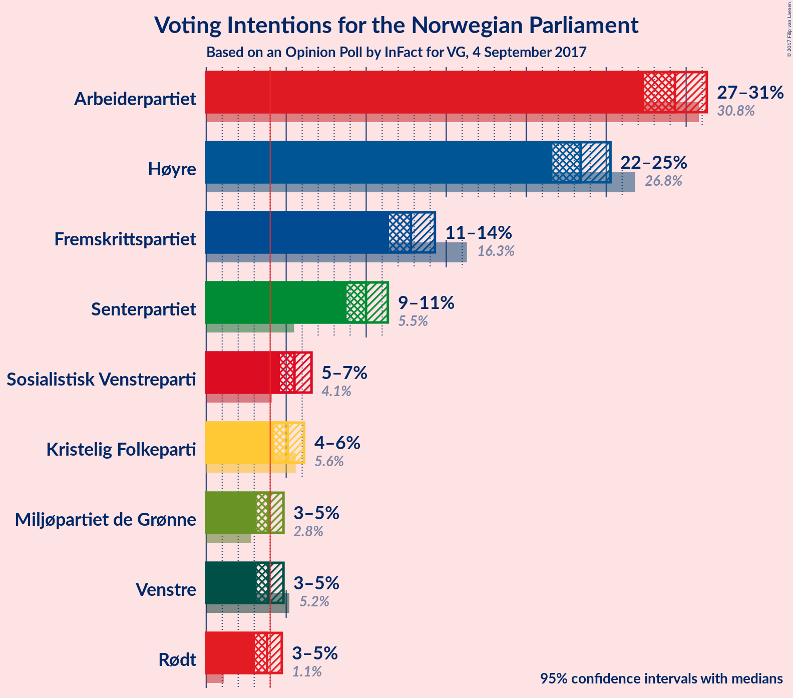
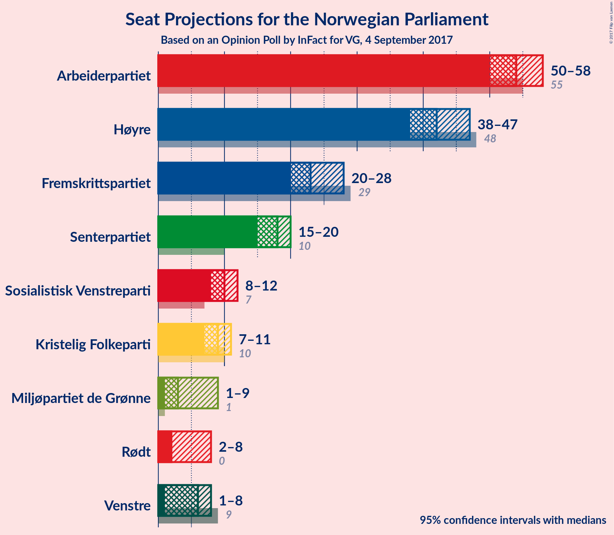
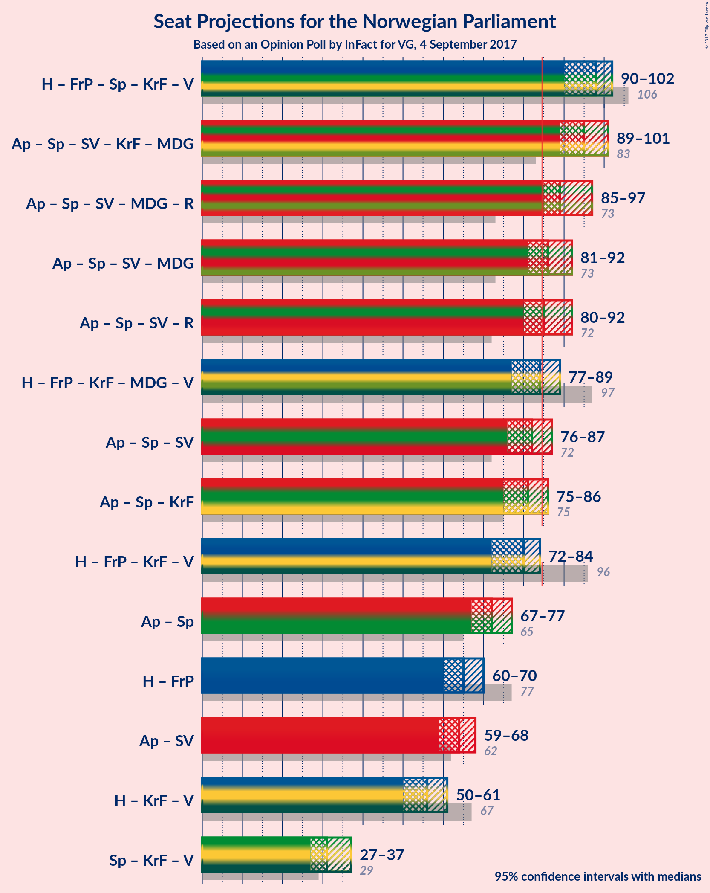

# Opinion Poll by InFact for VG, 4 September 2017

<a href="#voting-intentions">Voting Intentions</a> | <a href="#seats">Seats</a> | <a href="#coalitions">Coalitions</a> | <a href="#technical-information">Technical Information</a>

## Voting Intentions

### Confidence Intervals

| Party | Last Result | Poll Result | 80% Confidence Interval | 90% Confidence Interval | 95% Confidence Interval | 99% Confidence Interval |
|:-----:|:-----------:|:-----------:|:-----------------------:|:-----------------------:|:-----------------------:|:-----------------------:|
| Arbeiderpartiet | 30.8% | 29.3% | 28.0–30.6% |27.7–31.0% |27.4–31.3% |26.8–31.9% |
| Høyre | 26.8% | 23.4% | 22.3–24.6% |21.9–25.0% |21.6–25.3% |21.1–25.9% |
| Fremskrittspartiet | 16.3% | 12.8% | 11.9–13.8% |11.6–14.1% |11.4–14.3% |11.0–14.8% |
| Senterpartiet | 5.5% | 10.0% | 9.2–10.9% |9.0–11.1% |8.8–11.4% |8.4–11.8% |
| Sosialistisk Venstreparti | 4.1% | 5.5% | 4.9–6.2% |4.8–6.4% |4.6–6.6% |4.3–6.9% |
| Kristelig Folkeparti | 5.6% | 5.1% | 4.5–5.8% |4.4–6.0% |4.2–6.1% |4.0–6.5% |
| Venstre | 5.2% | 3.9% | 3.4–4.5% |3.3–4.7% |3.2–4.8% |2.9–5.1% |
| Miljøpartiet de Grønne | 2.8% | 3.9% | 3.4–4.5% |3.3–4.7% |3.2–4.8% |2.9–5.1% |
| Rødt | 1.1% | 3.8% | 3.3–4.4% |3.2–4.6% |3.1–4.7% |2.9–5.0% |

*Note:* The poll result column reflects the actual value used in the calculations. Published results may vary slightly, and in addition be rounded to fewer digits.

## Seats

### Confidence Intervals

| Party | Last Result | Median | 80% Confidence Interval | 90% Confidence Interval | 95% Confidence Interval | 99% Confidence Interval |
|:-----:|:-----------:|:------:|:-----------------------:|:-----------------------:|:-----------------------:|:-----------------------:|
| <a href="#arbeiderpartiet">Arbeiderpartiet</a> | 55 | 54 | 51–57 |51–58 |50–58 |49–59 |
| <a href="#høyre">Høyre</a> | 48 | 42 | 39–45 |38–45 |38–47 |36–47 |
| <a href="#fremskrittspartiet">Fremskrittspartiet</a> | 29 | 23 | 21–26 |21–27 |20–28 |19–28 |
| <a href="#senterpartiet">Senterpartiet</a> | 10 | 18 | 16–19 |16–20 |15–20 |14–21 |
| <a href="#sosialistisk-venstreparti">Sosialistisk Venstreparti</a> | 7 | 10 | 8–11 |8–11 |8–12 |8–12 |
| <a href="#kristelig-folkeparti">Kristelig Folkeparti</a> | 10 | 9 | 8–10 |7–11 |7–11 |2–11 |
| <a href="#venstre">Venstre</a> | 9 | 6 | 2–8 |2–8 |1–8 |1–9 |
| <a href="#miljøpartiet-de-grønne">Miljøpartiet de Grønne</a> | 1 | 3 | 1–8 |1–8 |1–9 |1–9 |
| <a href="#rødt">Rødt</a> | 0 | 2 | 2–7 |2–8 |2–8 |2–9 |

### Arbeiderpartiet

*For a full overview of the results for this party, see the [Arbeiderpartiet](party-arbeiderpartiet.html) page.*

| Number of Seats | Probability | Accumulated | Special Marks |
|:---------------:|:-----------:|:-----------:|:-------------:|
| 47 | 0.3% | 100% |  |
| 48 | 0.1% | 99.7% |  |
| 49 | 1.3% | 99.6% |  |
| 50 | 3% | 98% |  |
| 51 | 6% | 96% |  |
| 52 | 6% | 90% |  |
| 53 | 29% | 84% |  |
| 54 | 24% | 55% | Median |
| 55 | 11% | 31% | Last Result |
| 56 | 8% | 20% |  |
| 57 | 6% | 12% |  |
| 58 | 4% | 5% |  |
| 59 | 0.9% | 1.4% |  |
| 60 | 0.3% | 0.5% |  |
| 61 | 0.1% | 0.2% |  |
| 62 | 0% | 0.1% |  |
| 63 | 0% | 0% |  |

### Høyre

*For a full overview of the results for this party, see the [Høyre](party-hyre.html) page.*

| Number of Seats | Probability | Accumulated | Special Marks |
|:---------------:|:-----------:|:-----------:|:-------------:|
| 36 | 0.5% | 100% |  |
| 37 | 2% | 99.5% |  |
| 38 | 7% | 98% |  |
| 39 | 5% | 91% |  |
| 40 | 12% | 86% |  |
| 41 | 22% | 73% |  |
| 42 | 7% | 52% | Median |
| 43 | 19% | 45% |  |
| 44 | 6% | 26% |  |
| 45 | 15% | 20% |  |
| 46 | 2% | 5% |  |
| 47 | 2% | 3% |  |
| 48 | 0.3% | 0.4% | Last Result |
| 49 | 0.1% | 0.1% |  |
| 50 | 0% | 0% |  |

### Fremskrittspartiet

*For a full overview of the results for this party, see the [Fremskrittspartiet](party-fremskrittspartiet.html) page.*

| Number of Seats | Probability | Accumulated | Special Marks |
|:---------------:|:-----------:|:-----------:|:-------------:|
| 17 | 0.1% | 100% |  |
| 18 | 0.1% | 99.9% |  |
| 19 | 0.9% | 99.8% |  |
| 20 | 2% | 99.0% |  |
| 21 | 12% | 97% |  |
| 22 | 9% | 84% |  |
| 23 | 31% | 75% | Median |
| 24 | 9% | 44% |  |
| 25 | 19% | 35% |  |
| 26 | 9% | 16% |  |
| 27 | 4% | 7% |  |
| 28 | 3% | 3% |  |
| 29 | 0% | 0% | Last Result |

### Senterpartiet

*For a full overview of the results for this party, see the [Senterpartiet](party-senterpartiet.html) page.*

| Number of Seats | Probability | Accumulated | Special Marks |
|:---------------:|:-----------:|:-----------:|:-------------:|
| 10 | 0% | 100% | Last Result |
| 11 | 0% | 100% |  |
| 12 | 0.1% | 100% |  |
| 13 | 0.2% | 99.9% |  |
| 14 | 0.8% | 99.7% |  |
| 15 | 4% | 98.9% |  |
| 16 | 10% | 95% |  |
| 17 | 21% | 85% |  |
| 18 | 26% | 64% | Median |
| 19 | 31% | 38% |  |
| 20 | 5% | 7% |  |
| 21 | 2% | 2% |  |
| 22 | 0.3% | 0.4% |  |
| 23 | 0.1% | 0.1% |  |
| 24 | 0% | 0% |  |

### Sosialistisk Venstreparti

*For a full overview of the results for this party, see the [Sosialistisk Venstreparti](party-sosialistiskvenstreparti.html) page.*

| Number of Seats | Probability | Accumulated | Special Marks |
|:---------------:|:-----------:|:-----------:|:-------------:|
| 7 | 0.5% | 100% | Last Result |
| 8 | 10% | 99.5% |  |
| 9 | 28% | 89% |  |
| 10 | 44% | 62% | Median |
| 11 | 13% | 17% |  |
| 12 | 4% | 4% |  |
| 13 | 0.3% | 0.4% |  |
| 14 | 0.1% | 0.1% |  |
| 15 | 0% | 0% |  |

### Kristelig Folkeparti

*For a full overview of the results for this party, see the [Kristelig Folkeparti](party-kristeligfolkeparti.html) page.*

| Number of Seats | Probability | Accumulated | Special Marks |
|:---------------:|:-----------:|:-----------:|:-------------:|
| 2 | 1.0% | 100% |  |
| 3 | 0% | 99.0% |  |
| 4 | 0% | 99.0% |  |
| 5 | 0% | 99.0% |  |
| 6 | 0% | 99.0% |  |
| 7 | 7% | 99.0% |  |
| 8 | 12% | 92% |  |
| 9 | 59% | 80% | Median |
| 10 | 16% | 21% | Last Result |
| 11 | 5% | 5% |  |
| 12 | 0.4% | 0.4% |  |
| 13 | 0% | 0% |  |

### Venstre

*For a full overview of the results for this party, see the [Venstre](party-venstre.html) page.*

| Number of Seats | Probability | Accumulated | Special Marks |
|:---------------:|:-----------:|:-----------:|:-------------:|
| 1 | 5% | 100% |  |
| 2 | 33% | 95% |  |
| 3 | 12% | 62% |  |
| 4 | 0% | 50% |  |
| 5 | 0% | 50% |  |
| 6 | 0.4% | 50% | Median |
| 7 | 21% | 50% |  |
| 8 | 27% | 29% |  |
| 9 | 1.3% | 1.4% | Last Result |
| 10 | 0.2% | 0.2% |  |
| 11 | 0% | 0% |  |

### Miljøpartiet de Grønne

*For a full overview of the results for this party, see the [Miljøpartiet de Grønne](party-miljpartietdegrnne.html) page.*

| Number of Seats | Probability | Accumulated | Special Marks |
|:---------------:|:-----------:|:-----------:|:-------------:|
| 1 | 10% | 100% | Last Result |
| 2 | 10% | 90% |  |
| 3 | 40% | 80% | Median |
| 4 | 0.2% | 40% |  |
| 5 | 0% | 40% |  |
| 6 | 0.1% | 40% |  |
| 7 | 12% | 39% |  |
| 8 | 25% | 27% |  |
| 9 | 2% | 3% |  |
| 10 | 0.1% | 0.1% |  |
| 11 | 0% | 0% |  |

### Rødt

*For a full overview of the results for this party, see the [Rødt](party-rdt.html) page.*

| Number of Seats | Probability | Accumulated | Special Marks |
|:---------------:|:-----------:|:-----------:|:-------------:|
| 0 | 0% | 100% | Last Result |
| 1 | 0.1% | 100% |  |
| 2 | 73% | 99.9% | Median |
| 3 | 0% | 27% |  |
| 4 | 0% | 27% |  |
| 5 | 0% | 27% |  |
| 6 | 0.2% | 27% |  |
| 7 | 17% | 27% |  |
| 8 | 8% | 9% |  |
| 9 | 1.3% | 1.4% |  |
| 10 | 0% | 0% |  |

## Coalitions

### Confidence Intervals

| Coalition | Last Result | Median | Majority? | 80% Confidence Interval | 90% Confidence Interval | 95% Confidence Interval | 99% Confidence Interval |
|:---------:|:-----------:|:------:|:---------:|:-----------------------:|:-----------------------:|:-----------------------:|:-----------------------:|
| Høyre – Fremskrittspartiet – Senterpartiet – Kristelig Folkeparti – Venstre | 106 | 98 | 100% | 93–101 | 90–102 | 90–102 | 89–104 |
| Arbeiderpartiet – Senterpartiet – Sosialistisk Venstreparti – Kristelig Folkeparti – Miljøpartiet de Grønne | 83 | 95 | 99.9% | 91–99 | 91–100 | 89–101 | 85–103 |
| Arbeiderpartiet – Senterpartiet – Sosialistisk Venstreparti – Miljøpartiet de Grønne – Rødt | 73 | 89 | 98% | 86–94 | 85–96 | 85–97 | 82–98 |
| Arbeiderpartiet – Senterpartiet – Sosialistisk Venstreparti – Miljøpartiet de Grønne | 73 | 86 | 73% | 83–90 | 82–91 | 81–92 | 77–94 |
| Arbeiderpartiet – Senterpartiet – Sosialistisk Venstreparti – Rødt | 72 | 85 | 57% | 81–89 | 81–91 | 80–92 | 77–94 |
| Høyre – Fremskrittspartiet – Kristelig Folkeparti – Miljøpartiet de Grønne – Venstre | 97 | 84 | 43% | 80–88 | 78–88 | 77–89 | 75–92 |
| Arbeiderpartiet – Senterpartiet – Sosialistisk Venstreparti | 72 | 82 | 10% | 78–85 | 77–87 | 76–87 | 74–88 |
| Arbeiderpartiet – Senterpartiet – Kristelig Folkeparti | 75 | 81 | 7% | 77–84 | 75–85 | 75–86 | 73–87 |
| Høyre – Fremskrittspartiet – Kristelig Folkeparti – Venstre | 96 | 80 | 2% | 75–83 | 73–84 | 72–84 | 71–87 |
| Arbeiderpartiet – Senterpartiet | 65 | 72 | 0% | 69–75 | 68–76 | 67–77 | 66–78 |
| Høyre – Fremskrittspartiet | 77 | 65 | 0% | 62–70 | 61–70 | 60–70 | 58–73 |
| Arbeiderpartiet – Sosialistisk Venstreparti | 62 | 64 | 0% | 61–67 | 60–68 | 59–68 | 58–70 |
| Høyre – Kristelig Folkeparti – Venstre | 67 | 56 | 0% | 52–60 | 50–60 | 50–61 | 49–62 |
| Senterpartiet – Kristelig Folkeparti – Venstre | 29 | 31 | 0% | 28–35 | 27–37 | 27–37 | 25–38 |

### Høyre – Fremskrittspartiet – Senterpartiet – Kristelig Folkeparti – Venstre

| Number of Seats | Probability | Accumulated | Special Marks |
|:---------------:|:-----------:|:-----------:|:-------------:|
| 86 | 0% | 100% |  |
| 87 | 0.2% | 99.9% |  |
| 88 | 0.1% | 99.7% |  |
| 89 | 2% | 99.6% |  |
| 90 | 4% | 98% |  |
| 91 | 2% | 94% |  |
| 92 | 2% | 92% |  |
| 93 | 6% | 91% |  |
| 94 | 4% | 84% |  |
| 95 | 6% | 81% |  |
| 96 | 8% | 75% |  |
| 97 | 16% | 66% |  |
| 98 | 9% | 50% | Median |
| 99 | 7% | 41% |  |
| 100 | 19% | 34% |  |
| 101 | 7% | 15% |  |
| 102 | 6% | 8% |  |
| 103 | 1.5% | 2% |  |
| 104 | 0.3% | 0.7% |  |
| 105 | 0.1% | 0.4% |  |
| 106 | 0.2% | 0.2% | Last Result |
| 107 | 0% | 0.1% |  |
| 108 | 0% | 0% |  |

### Arbeiderpartiet – Senterpartiet – Sosialistisk Venstreparti – Kristelig Folkeparti – Miljøpartiet de Grønne

| Number of Seats | Probability | Accumulated | Special Marks |
|:---------------:|:-----------:|:-----------:|:-------------:|
| 82 | 0.1% | 100% |  |
| 83 | 0% | 99.9% | Last Result |
| 84 | 0% | 99.9% |  |
| 85 | 0.5% | 99.9% | Majority |
| 86 | 0.2% | 99.4% |  |
| 87 | 0.2% | 99.2% |  |
| 88 | 0.2% | 99.0% |  |
| 89 | 1.4% | 98.7% |  |
| 90 | 2% | 97% |  |
| 91 | 6% | 95% |  |
| 92 | 6% | 89% |  |
| 93 | 9% | 83% |  |
| 94 | 5% | 74% | Median |
| 95 | 31% | 69% |  |
| 96 | 13% | 38% |  |
| 97 | 5% | 25% |  |
| 98 | 8% | 20% |  |
| 99 | 6% | 12% |  |
| 100 | 4% | 6% |  |
| 101 | 1.4% | 3% |  |
| 102 | 0.4% | 1.2% |  |
| 103 | 0.6% | 0.8% |  |
| 104 | 0.1% | 0.1% |  |
| 105 | 0% | 0% |  |

### Arbeiderpartiet – Senterpartiet – Sosialistisk Venstreparti – Miljøpartiet de Grønne – Rødt

| Number of Seats | Probability | Accumulated | Special Marks |
|:---------------:|:-----------:|:-----------:|:-------------:|
| 73 | 0% | 100% | Last Result |
| 74 | 0% | 100% |  |
| 75 | 0% | 100% |  |
| 76 | 0% | 100% |  |
| 77 | 0% | 100% |  |
| 78 | 0% | 100% |  |
| 79 | 0% | 100% |  |
| 80 | 0.1% | 100% |  |
| 81 | 0.3% | 99.9% |  |
| 82 | 0.2% | 99.7% |  |
| 83 | 0.8% | 99.4% |  |
| 84 | 1.0% | 98.6% |  |
| 85 | 6% | 98% | Majority |
| 86 | 6% | 91% |  |
| 87 | 7% | 85% | Median |
| 88 | 24% | 78% |  |
| 89 | 11% | 55% |  |
| 90 | 9% | 44% |  |
| 91 | 12% | 35% |  |
| 92 | 5% | 23% |  |
| 93 | 3% | 18% |  |
| 94 | 7% | 15% |  |
| 95 | 2% | 8% |  |
| 96 | 2% | 6% |  |
| 97 | 2% | 3% |  |
| 98 | 2% | 2% |  |
| 99 | 0.1% | 0.2% |  |
| 100 | 0.1% | 0.1% |  |
| 101 | 0% | 0% |  |

### Arbeiderpartiet – Senterpartiet – Sosialistisk Venstreparti – Miljøpartiet de Grønne

| Number of Seats | Probability | Accumulated | Special Marks |
|:---------------:|:-----------:|:-----------:|:-------------:|
| 73 | 0% | 100% | Last Result |
| 74 | 0.1% | 100% |  |
| 75 | 0% | 99.9% |  |
| 76 | 0% | 99.9% |  |
| 77 | 0.6% | 99.9% |  |
| 78 | 0.2% | 99.3% |  |
| 79 | 0.5% | 99.2% |  |
| 80 | 0.7% | 98.6% |  |
| 81 | 2% | 98% |  |
| 82 | 2% | 96% |  |
| 83 | 9% | 94% |  |
| 84 | 12% | 85% |  |
| 85 | 8% | 73% | Median, Majority |
| 86 | 25% | 65% |  |
| 87 | 14% | 40% |  |
| 88 | 6% | 26% |  |
| 89 | 9% | 20% |  |
| 90 | 5% | 11% |  |
| 91 | 4% | 6% |  |
| 92 | 1.4% | 3% |  |
| 93 | 0.5% | 1.2% |  |
| 94 | 0.5% | 0.7% |  |
| 95 | 0.1% | 0.2% |  |
| 96 | 0% | 0% |  |

### Arbeiderpartiet – Senterpartiet – Sosialistisk Venstreparti – Rødt

| Number of Seats | Probability | Accumulated | Special Marks |
|:---------------:|:-----------:|:-----------:|:-------------:|
| 72 | 0% | 100% | Last Result |
| 73 | 0% | 100% |  |
| 74 | 0% | 100% |  |
| 75 | 0% | 100% |  |
| 76 | 0% | 100% |  |
| 77 | 0.8% | 100% |  |
| 78 | 0.5% | 99.2% |  |
| 79 | 0.5% | 98.7% |  |
| 80 | 3% | 98% |  |
| 81 | 8% | 96% |  |
| 82 | 7% | 88% |  |
| 83 | 12% | 80% |  |
| 84 | 12% | 68% | Median |
| 85 | 21% | 57% | Majority |
| 86 | 10% | 35% |  |
| 87 | 4% | 25% |  |
| 88 | 5% | 21% |  |
| 89 | 7% | 16% |  |
| 90 | 3% | 8% |  |
| 91 | 3% | 5% |  |
| 92 | 1.1% | 3% |  |
| 93 | 0.2% | 1.4% |  |
| 94 | 1.1% | 1.2% |  |
| 95 | 0% | 0.1% |  |
| 96 | 0% | 0.1% |  |
| 97 | 0% | 0% |  |

### Høyre – Fremskrittspartiet – Kristelig Folkeparti – Miljøpartiet de Grønne – Venstre

| Number of Seats | Probability | Accumulated | Special Marks |
|:---------------:|:-----------:|:-----------:|:-------------:|
| 73 | 0% | 100% |  |
| 74 | 0% | 99.9% |  |
| 75 | 1.1% | 99.9% |  |
| 76 | 0.2% | 98.8% |  |
| 77 | 1.1% | 98.6% |  |
| 78 | 3% | 97% |  |
| 79 | 3% | 95% |  |
| 80 | 7% | 92% |  |
| 81 | 5% | 84% |  |
| 82 | 4% | 79% |  |
| 83 | 10% | 75% | Median |
| 84 | 21% | 65% |  |
| 85 | 12% | 43% | Majority |
| 86 | 12% | 32% |  |
| 87 | 7% | 20% |  |
| 88 | 8% | 12% |  |
| 89 | 3% | 4% |  |
| 90 | 0.5% | 2% |  |
| 91 | 0.5% | 1.3% |  |
| 92 | 0.8% | 0.8% |  |
| 93 | 0% | 0% |  |
| 94 | 0% | 0% |  |
| 95 | 0% | 0% |  |
| 96 | 0% | 0% |  |
| 97 | 0% | 0% | Last Result |

### Arbeiderpartiet – Senterpartiet – Sosialistisk Venstreparti

| Number of Seats | Probability | Accumulated | Special Marks |
|:---------------:|:-----------:|:-----------:|:-------------:|
| 71 | 0.1% | 100% |  |
| 72 | 0% | 99.9% | Last Result |
| 73 | 0.1% | 99.9% |  |
| 74 | 0.3% | 99.8% |  |
| 75 | 0.9% | 99.5% |  |
| 76 | 3% | 98.6% |  |
| 77 | 4% | 96% |  |
| 78 | 3% | 91% |  |
| 79 | 10% | 88% |  |
| 80 | 11% | 78% |  |
| 81 | 13% | 66% |  |
| 82 | 11% | 53% | Median |
| 83 | 25% | 43% |  |
| 84 | 8% | 18% |  |
| 85 | 2% | 10% | Majority |
| 86 | 3% | 8% |  |
| 87 | 4% | 5% |  |
| 88 | 1.1% | 1.4% |  |
| 89 | 0.2% | 0.4% |  |
| 90 | 0.2% | 0.2% |  |
| 91 | 0% | 0% |  |

### Arbeiderpartiet – Senterpartiet – Kristelig Folkeparti

| Number of Seats | Probability | Accumulated | Special Marks |
|:---------------:|:-----------:|:-----------:|:-------------:|
| 71 | 0.1% | 100% |  |
| 72 | 0.3% | 99.9% |  |
| 73 | 0.1% | 99.6% |  |
| 74 | 0.6% | 99.5% |  |
| 75 | 6% | 98.9% | Last Result |
| 76 | 1.5% | 93% |  |
| 77 | 2% | 92% |  |
| 78 | 6% | 90% |  |
| 79 | 18% | 84% |  |
| 80 | 8% | 66% |  |
| 81 | 9% | 58% | Median |
| 82 | 27% | 49% |  |
| 83 | 7% | 22% |  |
| 84 | 8% | 15% |  |
| 85 | 4% | 7% | Majority |
| 86 | 0.8% | 3% |  |
| 87 | 2% | 2% |  |
| 88 | 0.2% | 0.5% |  |
| 89 | 0.2% | 0.3% |  |
| 90 | 0% | 0.1% |  |
| 91 | 0% | 0% |  |

### Høyre – Fremskrittspartiet – Kristelig Folkeparti – Venstre

| Number of Seats | Probability | Accumulated | Special Marks |
|:---------------:|:-----------:|:-----------:|:-------------:|
| 69 | 0.1% | 100% |  |
| 70 | 0.1% | 99.9% |  |
| 71 | 2% | 99.8% |  |
| 72 | 2% | 98% |  |
| 73 | 2% | 97% |  |
| 74 | 2% | 94% |  |
| 75 | 7% | 92% |  |
| 76 | 3% | 85% |  |
| 77 | 5% | 82% |  |
| 78 | 12% | 77% |  |
| 79 | 9% | 65% |  |
| 80 | 11% | 56% | Median |
| 81 | 24% | 45% |  |
| 82 | 7% | 22% |  |
| 83 | 6% | 15% |  |
| 84 | 6% | 9% |  |
| 85 | 1.0% | 2% | Majority |
| 86 | 0.8% | 1.4% |  |
| 87 | 0.2% | 0.6% |  |
| 88 | 0.3% | 0.3% |  |
| 89 | 0.1% | 0.1% |  |
| 90 | 0% | 0% |  |
| 91 | 0% | 0% |  |
| 92 | 0% | 0% |  |
| 93 | 0% | 0% |  |
| 94 | 0% | 0% |  |
| 95 | 0% | 0% |  |
| 96 | 0% | 0% | Last Result |

### Arbeiderpartiet – Senterpartiet

| Number of Seats | Probability | Accumulated | Special Marks |
|:---------------:|:-----------:|:-----------:|:-------------:|
| 63 | 0.1% | 100% |  |
| 64 | 0.3% | 99.9% |  |
| 65 | 0.1% | 99.6% | Last Result |
| 66 | 1.4% | 99.5% |  |
| 67 | 2% | 98% |  |
| 68 | 6% | 96% |  |
| 69 | 3% | 90% |  |
| 70 | 19% | 87% |  |
| 71 | 10% | 68% |  |
| 72 | 15% | 58% | Median |
| 73 | 24% | 43% |  |
| 74 | 6% | 20% |  |
| 75 | 6% | 13% |  |
| 76 | 3% | 7% |  |
| 77 | 3% | 4% |  |
| 78 | 0.3% | 0.6% |  |
| 79 | 0.3% | 0.3% |  |
| 80 | 0% | 0.1% |  |
| 81 | 0% | 0% |  |

### Høyre – Fremskrittspartiet

| Number of Seats | Probability | Accumulated | Special Marks |
|:---------------:|:-----------:|:-----------:|:-------------:|
| 56 | 0.1% | 100% |  |
| 57 | 0.3% | 99.9% |  |
| 58 | 0.5% | 99.6% |  |
| 59 | 0.5% | 99.1% |  |
| 60 | 3% | 98.7% |  |
| 61 | 6% | 96% |  |
| 62 | 4% | 90% |  |
| 63 | 8% | 86% |  |
| 64 | 17% | 78% |  |
| 65 | 15% | 60% | Median |
| 66 | 9% | 45% |  |
| 67 | 9% | 36% |  |
| 68 | 5% | 27% |  |
| 69 | 4% | 22% |  |
| 70 | 16% | 18% |  |
| 71 | 0.7% | 2% |  |
| 72 | 0.4% | 1.3% |  |
| 73 | 0.8% | 0.9% |  |
| 74 | 0.1% | 0.1% |  |
| 75 | 0% | 0% |  |
| 76 | 0% | 0% |  |
| 77 | 0% | 0% | Last Result |

### Arbeiderpartiet – Sosialistisk Venstreparti

| Number of Seats | Probability | Accumulated | Special Marks |
|:---------------:|:-----------:|:-----------:|:-------------:|
| 57 | 0.4% | 100% |  |
| 58 | 0.5% | 99.6% |  |
| 59 | 2% | 99.1% |  |
| 60 | 6% | 97% |  |
| 61 | 6% | 91% |  |
| 62 | 14% | 85% | Last Result |
| 63 | 18% | 71% |  |
| 64 | 21% | 53% | Median |
| 65 | 14% | 33% |  |
| 66 | 6% | 18% |  |
| 67 | 7% | 12% |  |
| 68 | 4% | 5% |  |
| 69 | 0.4% | 1.1% |  |
| 70 | 0.4% | 0.7% |  |
| 71 | 0.2% | 0.3% |  |
| 72 | 0.1% | 0.1% |  |
| 73 | 0% | 0% |  |

### Høyre – Kristelig Folkeparti – Venstre

| Number of Seats | Probability | Accumulated | Special Marks |
|:---------------:|:-----------:|:-----------:|:-------------:|
| 47 | 0.1% | 100% |  |
| 48 | 0.2% | 99.8% |  |
| 49 | 0.8% | 99.7% |  |
| 50 | 4% | 98.9% |  |
| 51 | 2% | 95% |  |
| 52 | 10% | 92% |  |
| 53 | 6% | 82% |  |
| 54 | 11% | 76% |  |
| 55 | 8% | 66% |  |
| 56 | 17% | 58% |  |
| 57 | 10% | 41% | Median |
| 58 | 7% | 31% |  |
| 59 | 11% | 23% |  |
| 60 | 8% | 12% |  |
| 61 | 3% | 4% |  |
| 62 | 0.5% | 1.0% |  |
| 63 | 0.2% | 0.5% |  |
| 64 | 0.2% | 0.3% |  |
| 65 | 0% | 0% |  |
| 66 | 0% | 0% |  |
| 67 | 0% | 0% | Last Result |

### Senterpartiet – Kristelig Folkeparti – Venstre

| Number of Seats | Probability | Accumulated | Special Marks |
|:---------------:|:-----------:|:-----------:|:-------------:|
| 21 | 0.1% | 100% |  |
| 22 | 0.1% | 99.9% |  |
| 23 | 0.1% | 99.8% |  |
| 24 | 0.1% | 99.7% |  |
| 25 | 0.4% | 99.7% |  |
| 26 | 2% | 99.3% |  |
| 27 | 3% | 98% |  |
| 28 | 7% | 95% |  |
| 29 | 10% | 88% | Last Result |
| 30 | 23% | 78% |  |
| 31 | 7% | 56% |  |
| 32 | 6% | 49% |  |
| 33 | 12% | 43% | Median |
| 34 | 11% | 31% |  |
| 35 | 10% | 20% |  |
| 36 | 4% | 10% |  |
| 37 | 6% | 6% |  |
| 38 | 0.3% | 0.6% |  |
| 39 | 0.2% | 0.3% |  |
| 40 | 0% | 0% |  |

## Technical Information

### Opinion Poll

+ **Pollster:** InFact
+ **Media:** VG
+ **Fieldwork period:** 4 September 2017

### Calculations

+ **Sample size:** 2102
+ **Simulations done:** 1,048,576
+ **Error estimate:** 1.22%

