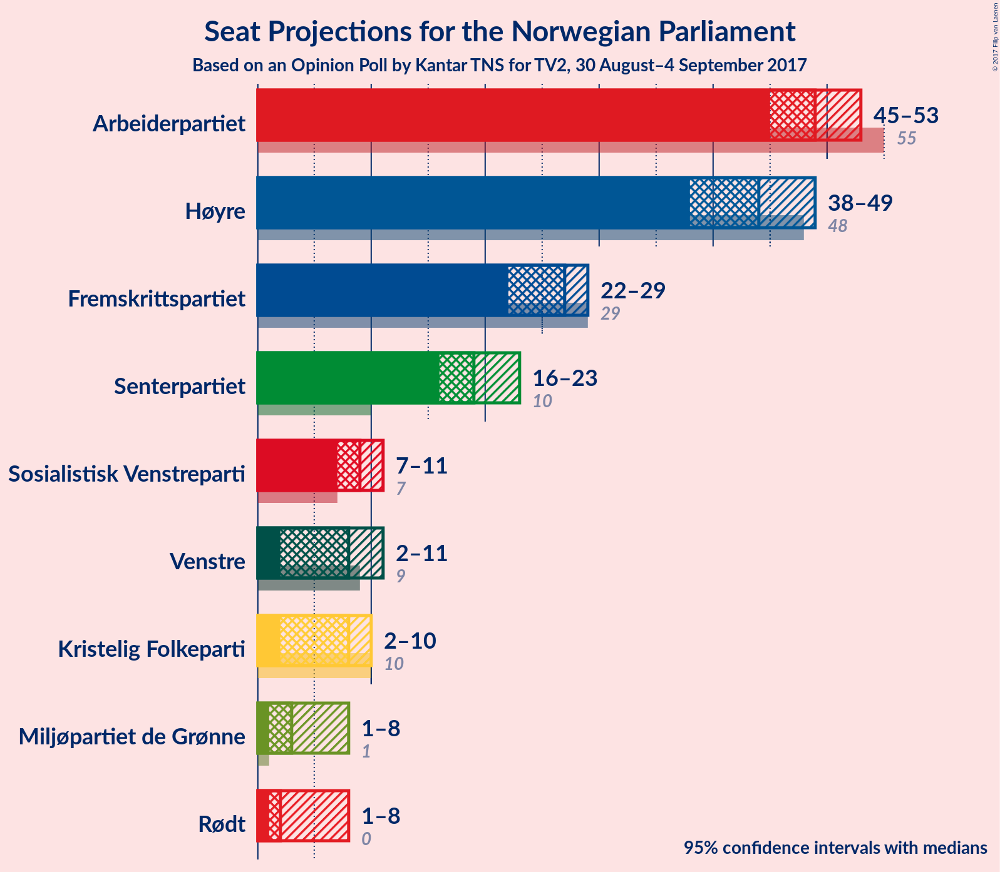
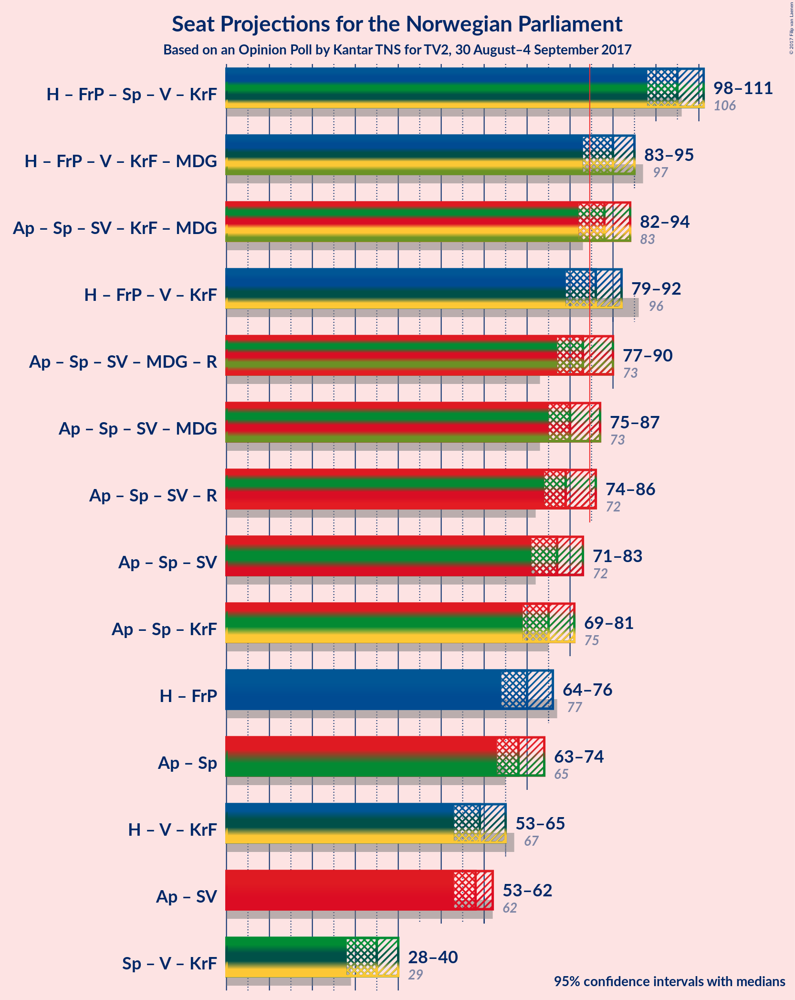

# Opinion Poll by Kantar TNS for TV2, 30 August–4 September 2017

<a href="#voting-intentions">Voting Intentions</a> | <a href="#seats">Seats</a> | <a href="#coalitions">Coalitions</a> | <a href="#technical-information">Technical Information</a>

## Voting Intentions

### Confidence Intervals

| Party | Last Result | Poll Result | 80% Confidence Interval | 90% Confidence Interval | 95% Confidence Interval | 99% Confidence Interval |
|:-----:|:-----------:|:-----------:|:-----------------------:|:-----------------------:|:-----------------------:|:-----------------------:|
| Arbeiderpartiet | 30.8% | 26.5% | 25.1–28.0% |24.7–28.5% |24.4–28.8% |23.7–29.6% |
| Høyre | 26.8% | 24.6% | 23.2–26.0% |22.8–26.4% |22.4–26.8% |21.8–27.5% |
| Fremskrittspartiet | 16.3% | 14.3% | 13.2–15.5% |12.9–15.9% |12.6–16.2% |12.1–16.8% |
| Senterpartiet | 5.5% | 10.9% | 10.0–12.0% |9.7–12.3% |9.4–12.6% |9.0–13.1% |
| Sosialistisk Venstreparti | 4.1% | 5.1% | 4.4–5.9% |4.3–6.1% |4.1–6.3% |3.8–6.7% |
| Venstre | 5.2% | 4.8% | 4.2–5.6% |4.0–5.8% |3.9–6.0% |3.6–6.4% |
| Kristelig Folkeparti | 5.6% | 4.4% | 3.8–5.2% |3.6–5.4% |3.5–5.6% |3.2–6.0% |
| Miljøpartiet de Grønne | 2.8% | 3.8% | 3.2–4.5% |3.0–4.7% |2.9–4.9% |2.7–5.2% |
| Rødt | 1.1% | 3.4% | 2.9–4.1% |2.7–4.3% |2.6–4.4% |2.3–4.8% |

*Note:* The poll result column reflects the actual value used in the calculations. Published results may vary slightly, and in addition be rounded to fewer digits.

## Seats

### Confidence Intervals

| Party | Last Result | Median | 80% Confidence Interval | 90% Confidence Interval | 95% Confidence Interval | 99% Confidence Interval |
|:-----:|:-----------:|:------:|:-----------------------:|:-----------------------:|:-----------------------:|:-----------------------:|
| <a href="#arbeiderpartiet">Arbeiderpartiet</a> | 55 | 49 | 46–51 |45–53 |45–53 |44–55 |
| <a href="#høyre">Høyre</a> | 48 | 44 | 40–46 |39–48 |38–49 |38–50 |
| <a href="#fremskrittspartiet">Fremskrittspartiet</a> | 29 | 27 | 24–28 |23–29 |22–29 |21–31 |
| <a href="#senterpartiet">Senterpartiet</a> | 10 | 19 | 17–22 |17–22 |16–23 |15–24 |
| <a href="#sosialistisk-venstreparti">Sosialistisk Venstreparti</a> | 7 | 9 | 8–10 |7–11 |7–11 |2–12 |
| <a href="#venstre">Venstre</a> | 9 | 8 | 7–10 |3–10 |2–11 |2–11 |
| <a href="#kristelig-folkeparti">Kristelig Folkeparti</a> | 10 | 8 | 2–9 |2–10 |2–10 |2–11 |
| <a href="#miljøpartiet-de-grønne">Miljøpartiet de Grønne</a> | 1 | 3 | 1–8 |1–8 |1–8 |1–9 |
| <a href="#rødt">Rødt</a> | 0 | 2 | 2–7 |1–7 |1–8 |1–8 |

### Arbeiderpartiet

*For a full overview of the results for this party, see the [Arbeiderpartiet](party-arbeiderpartiet.html) page.*

| Number of Seats | Probability | Accumulated | Special Marks |
|:---------------:|:-----------:|:-----------:|:-------------:|
| 42 | 0% | 100% |  |
| 43 | 0.2% | 99.9% |  |
| 44 | 1.1% | 99.7% |  |
| 45 | 6% | 98.6% |  |
| 46 | 15% | 93% |  |
| 47 | 14% | 78% |  |
| 48 | 13% | 64% |  |
| 49 | 15% | 51% | Median |
| 50 | 15% | 35% |  |
| 51 | 11% | 20% |  |
| 52 | 4% | 9% |  |
| 53 | 4% | 5% |  |
| 54 | 1.1% | 2% |  |
| 55 | 0.2% | 0.6% | Last Result |
| 56 | 0.3% | 0.3% |  |
| 57 | 0% | 0.1% |  |
| 58 | 0% | 0% |  |

### Høyre

*For a full overview of the results for this party, see the [Høyre](party-hyre.html) page.*

| Number of Seats | Probability | Accumulated | Special Marks |
|:---------------:|:-----------:|:-----------:|:-------------:|
| 37 | 0.2% | 100% |  |
| 38 | 2% | 99.7% |  |
| 39 | 3% | 97% |  |
| 40 | 8% | 94% |  |
| 41 | 10% | 86% |  |
| 42 | 11% | 77% |  |
| 43 | 12% | 66% |  |
| 44 | 14% | 54% | Median |
| 45 | 15% | 40% |  |
| 46 | 15% | 25% |  |
| 47 | 4% | 10% |  |
| 48 | 3% | 5% | Last Result |
| 49 | 2% | 3% |  |
| 50 | 0.6% | 0.9% |  |
| 51 | 0.2% | 0.3% |  |
| 52 | 0% | 0.1% |  |
| 53 | 0% | 0% |  |

### Fremskrittspartiet

*For a full overview of the results for this party, see the [Fremskrittspartiet](party-fremskrittspartiet.html) page.*

| Number of Seats | Probability | Accumulated | Special Marks |
|:---------------:|:-----------:|:-----------:|:-------------:|
| 20 | 0.1% | 100% |  |
| 21 | 0.4% | 99.8% |  |
| 22 | 2% | 99.5% |  |
| 23 | 5% | 97% |  |
| 24 | 11% | 92% |  |
| 25 | 11% | 81% |  |
| 26 | 12% | 70% |  |
| 27 | 18% | 58% | Median |
| 28 | 34% | 40% |  |
| 29 | 5% | 7% | Last Result |
| 30 | 1.2% | 2% |  |
| 31 | 0.7% | 0.8% |  |
| 32 | 0.1% | 0.1% |  |
| 33 | 0% | 0% |  |

### Senterpartiet

*For a full overview of the results for this party, see the [Senterpartiet](party-senterpartiet.html) page.*

| Number of Seats | Probability | Accumulated | Special Marks |
|:---------------:|:-----------:|:-----------:|:-------------:|
| 10 | 0% | 100% | Last Result |
| 11 | 0% | 100% |  |
| 12 | 0% | 100% |  |
| 13 | 0% | 100% |  |
| 14 | 0.1% | 100% |  |
| 15 | 1.3% | 99.9% |  |
| 16 | 3% | 98.5% |  |
| 17 | 7% | 96% |  |
| 18 | 17% | 89% |  |
| 19 | 24% | 72% | Median |
| 20 | 19% | 48% |  |
| 21 | 14% | 29% |  |
| 22 | 10% | 15% |  |
| 23 | 4% | 4% |  |
| 24 | 0.8% | 0.9% |  |
| 25 | 0.1% | 0.1% |  |
| 26 | 0% | 0% |  |

### Sosialistisk Venstreparti

*For a full overview of the results for this party, see the [Sosialistisk Venstreparti](party-sosialistiskvenstreparti.html) page.*

| Number of Seats | Probability | Accumulated | Special Marks |
|:---------------:|:-----------:|:-----------:|:-------------:|
| 1 | 0.1% | 100% |  |
| 2 | 1.3% | 99.9% |  |
| 3 | 0% | 98.5% |  |
| 4 | 0% | 98.5% |  |
| 5 | 0% | 98.5% |  |
| 6 | 0.1% | 98.5% |  |
| 7 | 5% | 98% | Last Result |
| 8 | 24% | 94% |  |
| 9 | 32% | 70% | Median |
| 10 | 30% | 38% |  |
| 11 | 7% | 8% |  |
| 12 | 1.2% | 1.4% |  |
| 13 | 0.2% | 0.2% |  |
| 14 | 0% | 0% |  |

### Venstre

*For a full overview of the results for this party, see the [Venstre](party-venstre.html) page.*

| Number of Seats | Probability | Accumulated | Special Marks |
|:---------------:|:-----------:|:-----------:|:-------------:|
| 1 | 0.1% | 100% |  |
| 2 | 3% | 99.9% |  |
| 3 | 3% | 97% |  |
| 4 | 0% | 94% |  |
| 5 | 0% | 94% |  |
| 6 | 0.1% | 94% |  |
| 7 | 8% | 94% |  |
| 8 | 41% | 86% | Median |
| 9 | 25% | 46% | Last Result |
| 10 | 16% | 21% |  |
| 11 | 4% | 5% |  |
| 12 | 0.3% | 0.4% |  |
| 13 | 0.1% | 0.1% |  |
| 14 | 0% | 0% |  |

### Kristelig Folkeparti

*For a full overview of the results for this party, see the [Kristelig Folkeparti](party-kristeligfolkeparti.html) page.*

| Number of Seats | Probability | Accumulated | Special Marks |
|:---------------:|:-----------:|:-----------:|:-------------:|
| 1 | 0.2% | 100% |  |
| 2 | 12% | 99.8% |  |
| 3 | 5% | 88% |  |
| 4 | 0% | 82% |  |
| 5 | 0% | 82% |  |
| 6 | 0.5% | 82% |  |
| 7 | 14% | 82% |  |
| 8 | 42% | 68% | Median |
| 9 | 21% | 26% |  |
| 10 | 5% | 5% | Last Result |
| 11 | 0.6% | 0.6% |  |
| 12 | 0% | 0% |  |

### Miljøpartiet de Grønne

*For a full overview of the results for this party, see the [Miljøpartiet de Grønne](party-miljpartietdegrnne.html) page.*

| Number of Seats | Probability | Accumulated | Special Marks |
|:---------------:|:-----------:|:-----------:|:-------------:|
| 1 | 31% | 100% | Last Result |
| 2 | 14% | 69% |  |
| 3 | 19% | 55% | Median |
| 4 | 3% | 36% |  |
| 5 | 0% | 32% |  |
| 6 | 2% | 32% |  |
| 7 | 17% | 30% |  |
| 8 | 12% | 14% |  |
| 9 | 2% | 2% |  |
| 10 | 0.1% | 0.1% |  |
| 11 | 0% | 0% |  |

### Rødt

*For a full overview of the results for this party, see the [Rødt](party-rdt.html) page.*

| Number of Seats | Probability | Accumulated | Special Marks |
|:---------------:|:-----------:|:-----------:|:-------------:|
| 0 | 0% | 100% | Last Result |
| 1 | 7% | 100% |  |
| 2 | 80% | 93% | Median |
| 3 | 0% | 13% |  |
| 4 | 0% | 13% |  |
| 5 | 0% | 13% |  |
| 6 | 3% | 13% |  |
| 7 | 8% | 11% |  |
| 8 | 3% | 3% |  |
| 9 | 0.2% | 0.2% |  |
| 10 | 0% | 0% |  |

## Coalitions

### Confidence Intervals

| Coalition | Last Result | Median | Majority? | 80% Confidence Interval | 90% Confidence Interval | 95% Confidence Interval | 99% Confidence Interval |
|:---------:|:-----------:|:------:|:---------:|:-----------------------:|:-----------------------:|:-----------------------:|:-----------------------:|
| Høyre – Fremskrittspartiet – Senterpartiet – Venstre – Kristelig Folkeparti | 106 | 105 | 100% | 100–110 | 99–110 | 98–111 | 95–113 |
| Høyre – Fremskrittspartiet – Venstre – Kristelig Folkeparti – Miljøpartiet de Grønne | 97 | 90 | 93% | 85–93 | 84–94 | 83–95 | 81–97 |
| Arbeiderpartiet – Senterpartiet – Sosialistisk Venstreparti – Kristelig Folkeparti – Miljøpartiet de Grønne | 83 | 88 | 88% | 84–92 | 83–93 | 82–94 | 80–96 |
| Høyre – Fremskrittspartiet – Venstre – Kristelig Folkeparti | 96 | 86 | 64% | 81–89 | 80–90 | 79–92 | 76–93 |
| Arbeiderpartiet – Senterpartiet – Sosialistisk Venstreparti – Miljøpartiet de Grønne – Rødt | 73 | 83 | 36% | 80–88 | 79–89 | 77–90 | 76–93 |
| Arbeiderpartiet – Senterpartiet – Sosialistisk Venstreparti – Miljøpartiet de Grønne | 73 | 80 | 13% | 77–85 | 76–86 | 75–87 | 73–90 |
| Arbeiderpartiet – Senterpartiet – Sosialistisk Venstreparti – Rødt | 72 | 79 | 7% | 76–84 | 75–85 | 74–86 | 72–88 |
| Arbeiderpartiet – Senterpartiet – Sosialistisk Venstreparti | 72 | 77 | 0.7% | 74–80 | 73–82 | 71–83 | 70–85 |
| Arbeiderpartiet – Senterpartiet – Kristelig Folkeparti | 75 | 75 | 0.1% | 71–79 | 70–80 | 69–81 | 67–83 |
| Høyre – Fremskrittspartiet | 77 | 70 | 0% | 66–74 | 66–75 | 64–76 | 62–78 |
| Arbeiderpartiet – Senterpartiet | 65 | 68 | 0% | 65–71 | 64–73 | 63–74 | 61–75 |
| Høyre – Venstre – Kristelig Folkeparti | 67 | 59 | 0% | 55–63 | 53–64 | 53–65 | 49–66 |
| Arbeiderpartiet – Sosialistisk Venstreparti | 62 | 58 | 0% | 54–61 | 54–62 | 53–62 | 50–65 |
| Senterpartiet – Venstre – Kristelig Folkeparti | 29 | 35 | 0% | 31–38 | 30–39 | 28–40 | 26–42 |

### Høyre – Fremskrittspartiet – Senterpartiet – Venstre – Kristelig Folkeparti

| Number of Seats | Probability | Accumulated | Special Marks |
|:---------------:|:-----------:|:-----------:|:-------------:|
| 93 | 0% | 100% |  |
| 94 | 0.3% | 99.9% |  |
| 95 | 0.2% | 99.6% |  |
| 96 | 0.5% | 99.4% |  |
| 97 | 0.5% | 98.9% |  |
| 98 | 2% | 98% |  |
| 99 | 3% | 97% |  |
| 100 | 4% | 94% |  |
| 101 | 6% | 90% |  |
| 102 | 8% | 84% |  |
| 103 | 8% | 75% |  |
| 104 | 12% | 67% |  |
| 105 | 8% | 55% |  |
| 106 | 11% | 47% | Last Result, Median |
| 107 | 10% | 36% |  |
| 108 | 5% | 26% |  |
| 109 | 9% | 21% |  |
| 110 | 7% | 12% |  |
| 111 | 3% | 5% |  |
| 112 | 0.8% | 1.5% |  |
| 113 | 0.4% | 0.7% |  |
| 114 | 0.1% | 0.3% |  |
| 115 | 0.2% | 0.3% |  |
| 116 | 0% | 0.1% |  |
| 117 | 0% | 0% |  |

### Høyre – Fremskrittspartiet – Venstre – Kristelig Folkeparti – Miljøpartiet de Grønne

| Number of Seats | Probability | Accumulated | Special Marks |
|:---------------:|:-----------:|:-----------:|:-------------:|
| 78 | 0.1% | 100% |  |
| 79 | 0.2% | 99.9% |  |
| 80 | 0.1% | 99.7% |  |
| 81 | 0.5% | 99.6% |  |
| 82 | 1.1% | 99.1% |  |
| 83 | 2% | 98% |  |
| 84 | 3% | 96% |  |
| 85 | 3% | 93% | Majority |
| 86 | 6% | 89% |  |
| 87 | 11% | 84% |  |
| 88 | 9% | 73% |  |
| 89 | 13% | 64% |  |
| 90 | 17% | 51% | Median |
| 91 | 12% | 34% |  |
| 92 | 10% | 22% |  |
| 93 | 6% | 13% |  |
| 94 | 4% | 7% |  |
| 95 | 2% | 3% |  |
| 96 | 0.9% | 1.5% |  |
| 97 | 0.4% | 0.6% | Last Result |
| 98 | 0.1% | 0.2% |  |
| 99 | 0.1% | 0.1% |  |
| 100 | 0% | 0.1% |  |
| 101 | 0% | 0% |  |

### Arbeiderpartiet – Senterpartiet – Sosialistisk Venstreparti – Kristelig Folkeparti – Miljøpartiet de Grønne

| Number of Seats | Probability | Accumulated | Special Marks |
|:---------------:|:-----------:|:-----------:|:-------------:|
| 77 | 0.1% | 100% |  |
| 78 | 0.1% | 99.9% |  |
| 79 | 0.2% | 99.8% |  |
| 80 | 0.6% | 99.6% |  |
| 81 | 1.1% | 99.1% |  |
| 82 | 2% | 98% |  |
| 83 | 3% | 96% | Last Result |
| 84 | 5% | 93% |  |
| 85 | 7% | 88% | Majority |
| 86 | 11% | 82% |  |
| 87 | 19% | 71% |  |
| 88 | 11% | 52% | Median |
| 89 | 9% | 41% |  |
| 90 | 10% | 32% |  |
| 91 | 10% | 22% |  |
| 92 | 5% | 12% |  |
| 93 | 4% | 7% |  |
| 94 | 1.0% | 3% |  |
| 95 | 1.4% | 2% |  |
| 96 | 0.6% | 0.9% |  |
| 97 | 0.1% | 0.4% |  |
| 98 | 0.1% | 0.2% |  |
| 99 | 0% | 0.1% |  |
| 100 | 0.1% | 0.1% |  |
| 101 | 0% | 0% |  |

### Høyre – Fremskrittspartiet – Venstre – Kristelig Folkeparti

| Number of Seats | Probability | Accumulated | Special Marks |
|:---------------:|:-----------:|:-----------:|:-------------:|
| 73 | 0.1% | 100% |  |
| 74 | 0% | 99.9% |  |
| 75 | 0.1% | 99.9% |  |
| 76 | 0.4% | 99.7% |  |
| 77 | 0.5% | 99.3% |  |
| 78 | 1.2% | 98.8% |  |
| 79 | 1.0% | 98% |  |
| 80 | 2% | 97% |  |
| 81 | 6% | 94% |  |
| 82 | 6% | 88% |  |
| 83 | 9% | 82% |  |
| 84 | 9% | 73% |  |
| 85 | 12% | 64% | Majority |
| 86 | 10% | 52% |  |
| 87 | 11% | 42% | Median |
| 88 | 10% | 31% |  |
| 89 | 12% | 21% |  |
| 90 | 4% | 9% |  |
| 91 | 2% | 5% |  |
| 92 | 2% | 3% |  |
| 93 | 0.4% | 0.7% |  |
| 94 | 0.2% | 0.3% |  |
| 95 | 0% | 0.1% |  |
| 96 | 0% | 0% | Last Result |

### Arbeiderpartiet – Senterpartiet – Sosialistisk Venstreparti – Miljøpartiet de Grønne – Rødt

| Number of Seats | Probability | Accumulated | Special Marks |
|:---------------:|:-----------:|:-----------:|:-------------:|
| 73 | 0% | 100% | Last Result |
| 74 | 0% | 100% |  |
| 75 | 0.2% | 99.9% |  |
| 76 | 0.4% | 99.7% |  |
| 77 | 2% | 99.3% |  |
| 78 | 2% | 97% |  |
| 79 | 4% | 95% |  |
| 80 | 12% | 91% |  |
| 81 | 10% | 79% |  |
| 82 | 11% | 69% | Median |
| 83 | 10% | 58% |  |
| 84 | 12% | 48% |  |
| 85 | 9% | 36% | Majority |
| 86 | 9% | 27% |  |
| 87 | 6% | 18% |  |
| 88 | 6% | 12% |  |
| 89 | 2% | 6% |  |
| 90 | 1.0% | 3% |  |
| 91 | 1.2% | 2% |  |
| 92 | 0.5% | 1.2% |  |
| 93 | 0.4% | 0.7% |  |
| 94 | 0.1% | 0.3% |  |
| 95 | 0% | 0.1% |  |
| 96 | 0.1% | 0.1% |  |
| 97 | 0% | 0% |  |

### Arbeiderpartiet – Senterpartiet – Sosialistisk Venstreparti – Miljøpartiet de Grønne

| Number of Seats | Probability | Accumulated | Special Marks |
|:---------------:|:-----------:|:-----------:|:-------------:|
| 71 | 0.1% | 100% |  |
| 72 | 0.2% | 99.9% |  |
| 73 | 0.3% | 99.7% | Last Result |
| 74 | 0.6% | 99.4% |  |
| 75 | 2% | 98.8% |  |
| 76 | 3% | 97% |  |
| 77 | 5% | 94% |  |
| 78 | 14% | 88% |  |
| 79 | 11% | 74% |  |
| 80 | 14% | 63% | Median |
| 81 | 9% | 50% |  |
| 82 | 13% | 41% |  |
| 83 | 8% | 28% |  |
| 84 | 7% | 20% |  |
| 85 | 5% | 13% | Majority |
| 86 | 5% | 8% |  |
| 87 | 2% | 4% |  |
| 88 | 0.7% | 2% |  |
| 89 | 0.7% | 1.3% |  |
| 90 | 0.3% | 0.6% |  |
| 91 | 0.1% | 0.3% |  |
| 92 | 0.1% | 0.2% |  |
| 93 | 0% | 0.1% |  |
| 94 | 0.1% | 0.1% |  |
| 95 | 0% | 0% |  |

### Arbeiderpartiet – Senterpartiet – Sosialistisk Venstreparti – Rødt

| Number of Seats | Probability | Accumulated | Special Marks |
|:---------------:|:-----------:|:-----------:|:-------------:|
| 69 | 0% | 100% |  |
| 70 | 0.1% | 99.9% |  |
| 71 | 0.1% | 99.9% |  |
| 72 | 0.4% | 99.8% | Last Result |
| 73 | 0.9% | 99.4% |  |
| 74 | 2% | 98.5% |  |
| 75 | 4% | 97% |  |
| 76 | 6% | 93% |  |
| 77 | 10% | 87% |  |
| 78 | 12% | 78% |  |
| 79 | 17% | 66% | Median |
| 80 | 13% | 49% |  |
| 81 | 9% | 36% |  |
| 82 | 11% | 27% |  |
| 83 | 6% | 16% |  |
| 84 | 3% | 11% |  |
| 85 | 3% | 7% | Majority |
| 86 | 2% | 4% |  |
| 87 | 1.1% | 2% |  |
| 88 | 0.5% | 0.9% |  |
| 89 | 0.1% | 0.4% |  |
| 90 | 0.2% | 0.3% |  |
| 91 | 0.1% | 0.1% |  |
| 92 | 0% | 0% |  |

### Arbeiderpartiet – Senterpartiet – Sosialistisk Venstreparti

| Number of Seats | Probability | Accumulated | Special Marks |
|:---------------:|:-----------:|:-----------:|:-------------:|
| 67 | 0.1% | 100% |  |
| 68 | 0.1% | 99.9% |  |
| 69 | 0.3% | 99.8% |  |
| 70 | 1.0% | 99.5% |  |
| 71 | 1.2% | 98.5% |  |
| 72 | 2% | 97% | Last Result |
| 73 | 4% | 95% |  |
| 74 | 6% | 91% |  |
| 75 | 12% | 85% |  |
| 76 | 14% | 73% |  |
| 77 | 17% | 59% | Median |
| 78 | 14% | 42% |  |
| 79 | 10% | 28% |  |
| 80 | 8% | 18% |  |
| 81 | 3% | 10% |  |
| 82 | 3% | 7% |  |
| 83 | 2% | 4% |  |
| 84 | 1.4% | 2% |  |
| 85 | 0.3% | 0.7% | Majority |
| 86 | 0.2% | 0.4% |  |
| 87 | 0% | 0.2% |  |
| 88 | 0.2% | 0.2% |  |
| 89 | 0% | 0% |  |

### Arbeiderpartiet – Senterpartiet – Kristelig Folkeparti

| Number of Seats | Probability | Accumulated | Special Marks |
|:---------------:|:-----------:|:-----------:|:-------------:|
| 66 | 0.2% | 100% |  |
| 67 | 0.4% | 99.8% |  |
| 68 | 1.3% | 99.4% |  |
| 69 | 1.3% | 98% |  |
| 70 | 2% | 97% |  |
| 71 | 6% | 94% |  |
| 72 | 5% | 89% |  |
| 73 | 7% | 83% |  |
| 74 | 10% | 76% |  |
| 75 | 20% | 66% | Last Result |
| 76 | 15% | 46% | Median |
| 77 | 11% | 31% |  |
| 78 | 7% | 21% |  |
| 79 | 7% | 14% |  |
| 80 | 3% | 6% |  |
| 81 | 1.3% | 3% |  |
| 82 | 0.9% | 1.4% |  |
| 83 | 0.4% | 0.5% |  |
| 84 | 0.1% | 0.2% |  |
| 85 | 0% | 0.1% | Majority |
| 86 | 0% | 0% |  |

### Høyre – Fremskrittspartiet

| Number of Seats | Probability | Accumulated | Special Marks |
|:---------------:|:-----------:|:-----------:|:-------------:|
| 60 | 0.1% | 100% |  |
| 61 | 0.1% | 99.9% |  |
| 62 | 0.4% | 99.8% |  |
| 63 | 0.4% | 99.4% |  |
| 64 | 2% | 99.0% |  |
| 65 | 2% | 97% |  |
| 66 | 5% | 95% |  |
| 67 | 10% | 90% |  |
| 68 | 9% | 80% |  |
| 69 | 12% | 71% |  |
| 70 | 13% | 59% |  |
| 71 | 15% | 46% | Median |
| 72 | 12% | 31% |  |
| 73 | 8% | 18% |  |
| 74 | 4% | 10% |  |
| 75 | 3% | 6% |  |
| 76 | 2% | 3% |  |
| 77 | 0.5% | 1.1% | Last Result |
| 78 | 0.4% | 0.6% |  |
| 79 | 0.1% | 0.2% |  |
| 80 | 0% | 0.1% |  |
| 81 | 0% | 0% |  |

### Arbeiderpartiet – Senterpartiet

| Number of Seats | Probability | Accumulated | Special Marks |
|:---------------:|:-----------:|:-----------:|:-------------:|
| 61 | 0.6% | 100% |  |
| 62 | 0.7% | 99.4% |  |
| 63 | 2% | 98.7% |  |
| 64 | 4% | 97% |  |
| 65 | 6% | 93% | Last Result |
| 66 | 13% | 87% |  |
| 67 | 17% | 74% |  |
| 68 | 15% | 57% | Median |
| 69 | 17% | 42% |  |
| 70 | 11% | 25% |  |
| 71 | 5% | 14% |  |
| 72 | 3% | 9% |  |
| 73 | 3% | 6% |  |
| 74 | 2% | 3% |  |
| 75 | 0.6% | 1.0% |  |
| 76 | 0.2% | 0.5% |  |
| 77 | 0.1% | 0.3% |  |
| 78 | 0.1% | 0.2% |  |
| 79 | 0.2% | 0.2% |  |
| 80 | 0% | 0% |  |

### Høyre – Venstre – Kristelig Folkeparti

| Number of Seats | Probability | Accumulated | Special Marks |
|:---------------:|:-----------:|:-----------:|:-------------:|
| 47 | 0% | 100% |  |
| 48 | 0.3% | 99.9% |  |
| 49 | 0.2% | 99.6% |  |
| 50 | 0.2% | 99.4% |  |
| 51 | 0.4% | 99.2% |  |
| 52 | 1.1% | 98.8% |  |
| 53 | 3% | 98% |  |
| 54 | 5% | 95% |  |
| 55 | 6% | 90% |  |
| 56 | 7% | 84% |  |
| 57 | 10% | 77% |  |
| 58 | 11% | 68% |  |
| 59 | 9% | 57% |  |
| 60 | 6% | 48% | Median |
| 61 | 14% | 42% |  |
| 62 | 16% | 28% |  |
| 63 | 6% | 13% |  |
| 64 | 3% | 7% |  |
| 65 | 2% | 3% |  |
| 66 | 0.7% | 1.0% |  |
| 67 | 0.2% | 0.3% | Last Result |
| 68 | 0.1% | 0.1% |  |
| 69 | 0% | 0% |  |

### Arbeiderpartiet – Sosialistisk Venstreparti

| Number of Seats | Probability | Accumulated | Special Marks |
|:---------------:|:-----------:|:-----------:|:-------------:|
| 48 | 0.1% | 100% |  |
| 49 | 0.2% | 99.9% |  |
| 50 | 0.2% | 99.7% |  |
| 51 | 0.3% | 99.5% |  |
| 52 | 0.6% | 99.1% |  |
| 53 | 2% | 98.6% |  |
| 54 | 7% | 96% |  |
| 55 | 14% | 90% |  |
| 56 | 10% | 75% |  |
| 57 | 13% | 65% |  |
| 58 | 15% | 52% | Median |
| 59 | 13% | 37% |  |
| 60 | 8% | 23% |  |
| 61 | 9% | 15% |  |
| 62 | 4% | 6% | Last Result |
| 63 | 1.3% | 2% |  |
| 64 | 0.6% | 1.2% |  |
| 65 | 0.4% | 0.6% |  |
| 66 | 0.1% | 0.1% |  |
| 67 | 0% | 0% |  |

### Senterpartiet – Venstre – Kristelig Folkeparti

| Number of Seats | Probability | Accumulated | Special Marks |
|:---------------:|:-----------:|:-----------:|:-------------:|
| 23 | 0.1% | 100% |  |
| 24 | 0.2% | 99.9% |  |
| 25 | 0.2% | 99.7% |  |
| 26 | 0.4% | 99.6% |  |
| 27 | 1.1% | 99.2% |  |
| 28 | 0.9% | 98% |  |
| 29 | 2% | 97% | Last Result |
| 30 | 4% | 95% |  |
| 31 | 4% | 91% |  |
| 32 | 8% | 87% |  |
| 33 | 7% | 79% |  |
| 34 | 11% | 72% |  |
| 35 | 15% | 61% | Median |
| 36 | 11% | 47% |  |
| 37 | 13% | 36% |  |
| 38 | 13% | 23% |  |
| 39 | 5% | 9% |  |
| 40 | 3% | 5% |  |
| 41 | 1.1% | 2% |  |
| 42 | 0.5% | 0.6% |  |
| 43 | 0.1% | 0.1% |  |
| 44 | 0% | 0% |  |

## Technical Information

### Opinion Poll

+ **Pollster:** Kantar TNS
+ **Media:** TV2
+ **Fieldwork period:** 30 August–4 September 2017

### Calculations

+ **Sample size:** 1511
+ **Simulations done:** 4,194,304
+ **Error estimate:** 1.59%

