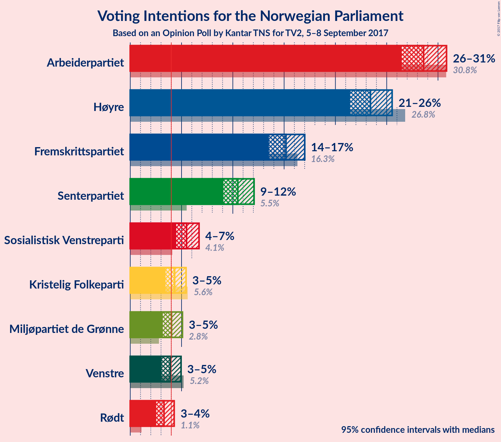
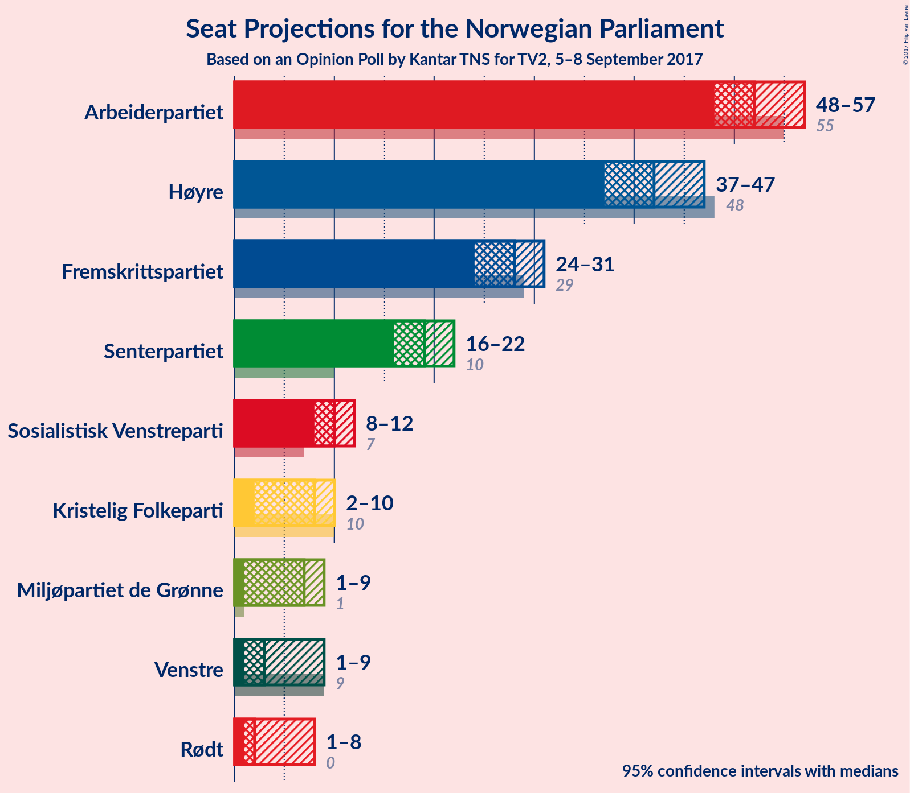
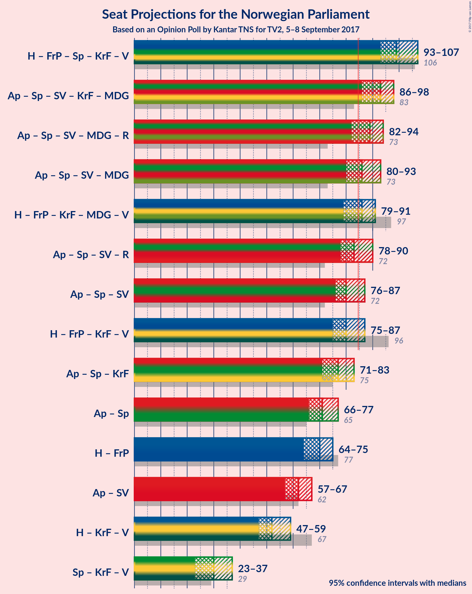

# Opinion Poll by Kantar TNS for TV2, 5–8 September 2017

<a href="#voting-intentions">Voting Intentions</a> | <a href="#seats">Seats</a> | <a href="#coalitions">Coalitions</a> | <a href="#technical-information">Technical Information</a>

## Voting Intentions

### Confidence Intervals

| Party | Last Result | Poll Result | 80% Confidence Interval | 90% Confidence Interval | 95% Confidence Interval | 99% Confidence Interval |
|:-----:|:-----------:|:-----------:|:-----------------------:|:-----------------------:|:-----------------------:|:-----------------------:|
| Arbeiderpartiet | 30.8% | 28.6% | 27.2–30.1% |26.8–30.5% |26.5–30.8% |25.8–31.6% |
| Høyre | 26.8% | 23.4% | 22.1–24.8% |21.7–25.2% |21.4–25.5% |20.8–26.2% |
| Fremskrittspartiet | 16.3% | 15.2% | 14.1–16.4% |13.8–16.7% |13.5–17.0% |13.0–17.6% |
| Senterpartiet | 5.5% | 10.5% | 9.6–11.5% |9.3–11.8% |9.1–12.1% |8.7–12.6% |
| Sosialistisk Venstreparti | 4.1% | 5.5% | 4.8–6.3% |4.6–6.5% |4.5–6.7% |4.2–7.1% |
| Kristelig Folkeparti | 5.6% | 4.3% | 3.7–5.0% |3.6–5.3% |3.4–5.4% |3.2–5.8% |
| Miljøpartiet de Grønne | 2.8% | 4.0% | 3.5–4.7% |3.3–4.9% |3.2–5.1% |2.9–5.4% |
| Venstre | 5.2% | 3.9% | 3.4–4.6% |3.2–4.8% |3.1–5.0% |2.8–5.3% |
| Rødt | 1.1% | 3.3% | 2.8–3.9% |2.7–4.1% |2.5–4.3% |2.3–4.6% |

*Note:* The poll result column reflects the actual value used in the calculations. Published results may vary slightly, and in addition be rounded to fewer digits.

## Seats

### Confidence Intervals

| Party | Last Result | Median | 80% Confidence Interval | 90% Confidence Interval | 95% Confidence Interval | 99% Confidence Interval |
|:-----:|:-----------:|:------:|:-----------------------:|:-----------------------:|:-----------------------:|:-----------------------:|
| <a href="#arbeiderpartiet">Arbeiderpartiet</a> | 55 | 52 | 49–54 |49–56 |48–57 |47–58 |
| <a href="#høyre">Høyre</a> | 48 | 42 | 39–45 |38–46 |37–47 |36–48 |
| <a href="#fremskrittspartiet">Fremskrittspartiet</a> | 29 | 28 | 26–29 |25–30 |24–31 |23–32 |
| <a href="#senterpartiet">Senterpartiet</a> | 10 | 19 | 17–21 |16–22 |16–22 |15–23 |
| <a href="#sosialistisk-venstreparti">Sosialistisk Venstreparti</a> | 7 | 10 | 9–11 |8–12 |8–12 |7–13 |
| <a href="#kristelig-folkeparti">Kristelig Folkeparti</a> | 10 | 8 | 2–9 |2–9 |2–10 |2–11 |
| <a href="#miljøpartiet-de-grønne">Miljøpartiet de Grønne</a> | 1 | 7 | 1–9 |1–9 |1–9 |1–10 |
| <a href="#venstre">Venstre</a> | 9 | 3 | 1–8 |1–8 |1–9 |1–9 |
| <a href="#rødt">Rødt</a> | 0 | 2 | 1–2 |1–7 |1–8 |1–8 |

### Arbeiderpartiet

*For a full overview of the results for this party, see the [Arbeiderpartiet](party-arbeiderpartiet.html) page.*

| Number of Seats | Probability | Accumulated | Special Marks |
|:---------------:|:-----------:|:-----------:|:-------------:|
| 45 | 0.1% | 100% |  |
| 46 | 0.3% | 99.9% |  |
| 47 | 0.9% | 99.6% |  |
| 48 | 4% | 98.7% |  |
| 49 | 5% | 95% |  |
| 50 | 14% | 90% |  |
| 51 | 18% | 76% |  |
| 52 | 20% | 59% | Median |
| 53 | 19% | 39% |  |
| 54 | 10% | 20% |  |
| 55 | 2% | 10% | Last Result |
| 56 | 4% | 7% |  |
| 57 | 2% | 3% |  |
| 58 | 0.5% | 1.0% |  |
| 59 | 0.3% | 0.5% |  |
| 60 | 0% | 0.1% |  |
| 61 | 0.1% | 0.1% |  |
| 62 | 0% | 0% |  |

### Høyre

*For a full overview of the results for this party, see the [Høyre](party-hyre.html) page.*

| Number of Seats | Probability | Accumulated | Special Marks |
|:---------------:|:-----------:|:-----------:|:-------------:|
| 34 | 0.1% | 100% |  |
| 35 | 0.1% | 99.9% |  |
| 36 | 0.6% | 99.8% |  |
| 37 | 2% | 99.2% |  |
| 38 | 5% | 97% |  |
| 39 | 9% | 92% |  |
| 40 | 10% | 83% |  |
| 41 | 18% | 72% |  |
| 42 | 15% | 54% | Median |
| 43 | 18% | 39% |  |
| 44 | 8% | 21% |  |
| 45 | 5% | 13% |  |
| 46 | 5% | 8% |  |
| 47 | 2% | 3% |  |
| 48 | 0.8% | 1.1% | Last Result |
| 49 | 0.2% | 0.3% |  |
| 50 | 0% | 0.1% |  |
| 51 | 0% | 0% |  |

### Fremskrittspartiet

*For a full overview of the results for this party, see the [Fremskrittspartiet](party-fremskrittspartiet.html) page.*

| Number of Seats | Probability | Accumulated | Special Marks |
|:---------------:|:-----------:|:-----------:|:-------------:|
| 22 | 0.1% | 100% |  |
| 23 | 0.9% | 99.8% |  |
| 24 | 2% | 98.9% |  |
| 25 | 3% | 97% |  |
| 26 | 7% | 95% |  |
| 27 | 12% | 88% |  |
| 28 | 50% | 76% | Median |
| 29 | 18% | 26% | Last Result |
| 30 | 3% | 8% |  |
| 31 | 3% | 5% |  |
| 32 | 1.5% | 2% |  |
| 33 | 0.2% | 0.3% |  |
| 34 | 0.1% | 0.1% |  |
| 35 | 0% | 0% |  |

### Senterpartiet

*For a full overview of the results for this party, see the [Senterpartiet](party-senterpartiet.html) page.*

| Number of Seats | Probability | Accumulated | Special Marks |
|:---------------:|:-----------:|:-----------:|:-------------:|
| 10 | 0% | 100% | Last Result |
| 11 | 0% | 100% |  |
| 12 | 0% | 100% |  |
| 13 | 0% | 100% |  |
| 14 | 0.2% | 100% |  |
| 15 | 2% | 99.7% |  |
| 16 | 5% | 98% |  |
| 17 | 19% | 93% |  |
| 18 | 16% | 74% |  |
| 19 | 21% | 58% | Median |
| 20 | 19% | 38% |  |
| 21 | 13% | 19% |  |
| 22 | 5% | 6% |  |
| 23 | 1.1% | 1.2% |  |
| 24 | 0.1% | 0.2% |  |
| 25 | 0% | 0% |  |

### Sosialistisk Venstreparti

*For a full overview of the results for this party, see the [Sosialistisk Venstreparti](party-sosialistiskvenstreparti.html) page.*

| Number of Seats | Probability | Accumulated | Special Marks |
|:---------------:|:-----------:|:-----------:|:-------------:|
| 2 | 0.1% | 100% |  |
| 3 | 0% | 99.9% |  |
| 4 | 0% | 99.9% |  |
| 5 | 0% | 99.9% |  |
| 6 | 0% | 99.9% |  |
| 7 | 1.0% | 99.8% | Last Result |
| 8 | 9% | 98.8% |  |
| 9 | 32% | 90% |  |
| 10 | 33% | 58% | Median |
| 11 | 19% | 25% |  |
| 12 | 4% | 6% |  |
| 13 | 1.1% | 1.2% |  |
| 14 | 0.1% | 0.2% |  |
| 15 | 0% | 0% |  |

### Kristelig Folkeparti

*For a full overview of the results for this party, see the [Kristelig Folkeparti](party-kristeligfolkeparti.html) page.*

| Number of Seats | Probability | Accumulated | Special Marks |
|:---------------:|:-----------:|:-----------:|:-------------:|
| 1 | 0.5% | 100% |  |
| 2 | 23% | 99.5% |  |
| 3 | 0.7% | 77% |  |
| 4 | 0% | 76% |  |
| 5 | 0% | 76% |  |
| 6 | 0.3% | 76% |  |
| 7 | 21% | 76% |  |
| 8 | 33% | 55% | Median |
| 9 | 17% | 22% |  |
| 10 | 4% | 4% | Last Result |
| 11 | 0.5% | 0.6% |  |
| 12 | 0% | 0% |  |

### Miljøpartiet de Grønne

*For a full overview of the results for this party, see the [Miljøpartiet de Grønne](party-miljpartietdegrnne.html) page.*

| Number of Seats | Probability | Accumulated | Special Marks |
|:---------------:|:-----------:|:-----------:|:-------------:|
| 1 | 24% | 100% | Last Result |
| 2 | 7% | 76% |  |
| 3 | 11% | 69% |  |
| 4 | 3% | 58% |  |
| 5 | 0% | 55% |  |
| 6 | 0% | 55% |  |
| 7 | 12% | 55% | Median |
| 8 | 30% | 43% |  |
| 9 | 12% | 12% |  |
| 10 | 0.6% | 0.7% |  |
| 11 | 0% | 0.1% |  |
| 12 | 0% | 0% |  |

### Venstre

*For a full overview of the results for this party, see the [Venstre](party-venstre.html) page.*

| Number of Seats | Probability | Accumulated | Special Marks |
|:---------------:|:-----------:|:-----------:|:-------------:|
| 1 | 11% | 100% |  |
| 2 | 31% | 89% |  |
| 3 | 16% | 58% | Median |
| 4 | 0% | 42% |  |
| 5 | 0% | 42% |  |
| 6 | 0.2% | 42% |  |
| 7 | 19% | 42% |  |
| 8 | 20% | 23% |  |
| 9 | 3% | 3% | Last Result |
| 10 | 0.4% | 0.4% |  |
| 11 | 0% | 0% |  |

### Rødt

*For a full overview of the results for this party, see the [Rødt](party-rdt.html) page.*

| Number of Seats | Probability | Accumulated | Special Marks |
|:---------------:|:-----------:|:-----------:|:-------------:|
| 0 | 0% | 100% | Last Result |
| 1 | 12% | 100% |  |
| 2 | 79% | 88% | Median |
| 3 | 0% | 8% |  |
| 4 | 0% | 8% |  |
| 5 | 0% | 8% |  |
| 6 | 0.3% | 8% |  |
| 7 | 5% | 8% |  |
| 8 | 3% | 3% |  |
| 9 | 0.1% | 0.1% |  |
| 10 | 0% | 0% |  |

## Coalitions

### Confidence Intervals

| Coalition | Last Result | Median | Majority? | 80% Confidence Interval | 90% Confidence Interval | 95% Confidence Interval | 99% Confidence Interval |
|:---------:|:-----------:|:------:|:---------:|:-----------------------:|:-----------------------:|:-----------------------:|:-----------------------:|
| Høyre – Fremskrittspartiet – Senterpartiet – Kristelig Folkeparti – Venstre | 106 | 99 | 100% | 95–105 | 95–106 | 93–107 | 91–108 |
| Arbeiderpartiet – Senterpartiet – Sosialistisk Venstreparti – Kristelig Folkeparti – Miljøpartiet de Grønne | 83 | 93 | 99.3% | 89–96 | 87–97 | 86–98 | 84–101 |
| Arbeiderpartiet – Senterpartiet – Sosialistisk Venstreparti – Miljøpartiet de Grønne – Rødt | 73 | 89 | 80% | 83–93 | 82–94 | 82–94 | 80–96 |
| Arbeiderpartiet – Senterpartiet – Sosialistisk Venstreparti – Miljøpartiet de Grønne | 73 | 86 | 64% | 81–90 | 80–93 | 80–93 | 78–94 |
| Høyre – Fremskrittspartiet – Kristelig Folkeparti – Miljøpartiet de Grønne – Venstre | 97 | 86 | 68% | 82–90 | 81–90 | 79–91 | 77–93 |
| Arbeiderpartiet – Senterpartiet – Sosialistisk Venstreparti – Rødt | 72 | 83 | 32% | 79–87 | 79–88 | 78–90 | 76–92 |
| Arbeiderpartiet – Senterpartiet – Sosialistisk Venstreparti | 72 | 80 | 12% | 77–85 | 77–86 | 76–87 | 73–89 |
| Høyre – Fremskrittspartiet – Kristelig Folkeparti – Venstre | 96 | 80 | 20% | 76–86 | 75–87 | 75–87 | 73–89 |
| Arbeiderpartiet – Senterpartiet – Kristelig Folkeparti | 75 | 77 | 1.2% | 73–82 | 72–83 | 71–83 | 70–85 |
| Arbeiderpartiet – Senterpartiet | 65 | 71 | 0% | 68–75 | 67–76 | 66–77 | 64–79 |
| Høyre – Fremskrittspartiet | 77 | 70 | 0% | 66–73 | 65–75 | 64–75 | 63–78 |
| Arbeiderpartiet – Sosialistisk Venstreparti | 62 | 62 | 0% | 59–65 | 58–66 | 57–67 | 56–68 |
| Høyre – Kristelig Folkeparti – Venstre | 67 | 52 | 0% | 48–58 | 48–58 | 47–59 | 45–61 |
| Senterpartiet – Kristelig Folkeparti – Venstre | 29 | 30 | 0% | 25–35 | 24–36 | 23–37 | 21–38 |

### Høyre – Fremskrittspartiet – Senterpartiet – Kristelig Folkeparti – Venstre

| Number of Seats | Probability | Accumulated | Special Marks |
|:---------------:|:-----------:|:-----------:|:-------------:|
| 88 | 0% | 100% |  |
| 89 | 0% | 99.9% |  |
| 90 | 0.3% | 99.9% |  |
| 91 | 0.3% | 99.6% |  |
| 92 | 0.7% | 99.3% |  |
| 93 | 1.2% | 98.6% |  |
| 94 | 2% | 97% |  |
| 95 | 9% | 96% |  |
| 96 | 6% | 87% |  |
| 97 | 11% | 81% |  |
| 98 | 9% | 69% |  |
| 99 | 13% | 60% |  |
| 100 | 12% | 47% | Median |
| 101 | 5% | 34% |  |
| 102 | 7% | 30% |  |
| 103 | 4% | 23% |  |
| 104 | 3% | 19% |  |
| 105 | 8% | 16% |  |
| 106 | 6% | 9% | Last Result |
| 107 | 2% | 3% |  |
| 108 | 0.6% | 0.8% |  |
| 109 | 0.1% | 0.2% |  |
| 110 | 0% | 0.1% |  |
| 111 | 0% | 0% |  |

### Arbeiderpartiet – Senterpartiet – Sosialistisk Venstreparti – Kristelig Folkeparti – Miljøpartiet de Grønne

| Number of Seats | Probability | Accumulated | Special Marks |
|:---------------:|:-----------:|:-----------:|:-------------:|
| 82 | 0.1% | 100% |  |
| 83 | 0.2% | 99.9% | Last Result |
| 84 | 0.4% | 99.7% |  |
| 85 | 0.6% | 99.3% | Majority |
| 86 | 2% | 98.7% |  |
| 87 | 2% | 97% |  |
| 88 | 2% | 95% |  |
| 89 | 11% | 92% |  |
| 90 | 12% | 81% |  |
| 91 | 9% | 69% |  |
| 92 | 8% | 60% |  |
| 93 | 9% | 51% |  |
| 94 | 14% | 42% |  |
| 95 | 11% | 28% |  |
| 96 | 8% | 17% | Median |
| 97 | 4% | 9% |  |
| 98 | 2% | 4% |  |
| 99 | 1.0% | 2% |  |
| 100 | 0.5% | 1.2% |  |
| 101 | 0.6% | 0.7% |  |
| 102 | 0% | 0.1% |  |
| 103 | 0% | 0% |  |

### Arbeiderpartiet – Senterpartiet – Sosialistisk Venstreparti – Miljøpartiet de Grønne – Rødt

| Number of Seats | Probability | Accumulated | Special Marks |
|:---------------:|:-----------:|:-----------:|:-------------:|
| 73 | 0% | 100% | Last Result |
| 74 | 0% | 100% |  |
| 75 | 0% | 100% |  |
| 76 | 0% | 100% |  |
| 77 | 0% | 100% |  |
| 78 | 0.1% | 100% |  |
| 79 | 0.1% | 99.9% |  |
| 80 | 0.7% | 99.8% |  |
| 81 | 0.4% | 99.1% |  |
| 82 | 5% | 98.7% |  |
| 83 | 8% | 94% |  |
| 84 | 5% | 86% |  |
| 85 | 4% | 80% | Majority |
| 86 | 8% | 76% |  |
| 87 | 5% | 69% |  |
| 88 | 12% | 63% |  |
| 89 | 16% | 51% |  |
| 90 | 9% | 35% | Median |
| 91 | 9% | 26% |  |
| 92 | 6% | 18% |  |
| 93 | 4% | 11% |  |
| 94 | 5% | 8% |  |
| 95 | 1.2% | 2% |  |
| 96 | 0.5% | 1.0% |  |
| 97 | 0.1% | 0.5% |  |
| 98 | 0.2% | 0.3% |  |
| 99 | 0.1% | 0.1% |  |
| 100 | 0% | 0% |  |

### Arbeiderpartiet – Senterpartiet – Sosialistisk Venstreparti – Miljøpartiet de Grønne

| Number of Seats | Probability | Accumulated | Special Marks |
|:---------------:|:-----------:|:-----------:|:-------------:|
| 73 | 0% | 100% | Last Result |
| 74 | 0% | 100% |  |
| 75 | 0% | 100% |  |
| 76 | 0.1% | 99.9% |  |
| 77 | 0.1% | 99.8% |  |
| 78 | 0.8% | 99.7% |  |
| 79 | 0.6% | 98.9% |  |
| 80 | 6% | 98% |  |
| 81 | 9% | 92% |  |
| 82 | 7% | 83% |  |
| 83 | 5% | 76% |  |
| 84 | 8% | 71% |  |
| 85 | 4% | 64% | Majority |
| 86 | 12% | 60% |  |
| 87 | 15% | 48% |  |
| 88 | 8% | 33% | Median |
| 89 | 9% | 25% |  |
| 90 | 6% | 15% |  |
| 91 | 3% | 10% |  |
| 92 | 1.4% | 7% |  |
| 93 | 5% | 5% |  |
| 94 | 0.3% | 0.6% |  |
| 95 | 0.1% | 0.3% |  |
| 96 | 0.1% | 0.2% |  |
| 97 | 0.1% | 0.1% |  |
| 98 | 0% | 0% |  |

### Høyre – Fremskrittspartiet – Kristelig Folkeparti – Miljøpartiet de Grønne – Venstre

| Number of Seats | Probability | Accumulated | Special Marks |
|:---------------:|:-----------:|:-----------:|:-------------:|
| 75 | 0.1% | 100% |  |
| 76 | 0.2% | 99.9% |  |
| 77 | 0.4% | 99.7% |  |
| 78 | 0.8% | 99.3% |  |
| 79 | 1.3% | 98.6% |  |
| 80 | 2% | 97% |  |
| 81 | 3% | 96% |  |
| 82 | 6% | 92% |  |
| 83 | 7% | 87% |  |
| 84 | 11% | 79% |  |
| 85 | 7% | 68% | Majority |
| 86 | 11% | 61% |  |
| 87 | 12% | 50% |  |
| 88 | 18% | 38% | Median |
| 89 | 9% | 20% |  |
| 90 | 7% | 11% |  |
| 91 | 2% | 4% |  |
| 92 | 1.0% | 2% |  |
| 93 | 0.4% | 0.8% |  |
| 94 | 0.2% | 0.4% |  |
| 95 | 0.2% | 0.2% |  |
| 96 | 0.1% | 0.1% |  |
| 97 | 0% | 0% | Last Result |

### Arbeiderpartiet – Senterpartiet – Sosialistisk Venstreparti – Rødt

| Number of Seats | Probability | Accumulated | Special Marks |
|:---------------:|:-----------:|:-----------:|:-------------:|
| 72 | 0% | 100% | Last Result |
| 73 | 0.1% | 100% |  |
| 74 | 0.2% | 99.9% |  |
| 75 | 0.2% | 99.8% |  |
| 76 | 0.4% | 99.6% |  |
| 77 | 1.0% | 99.2% |  |
| 78 | 2% | 98% |  |
| 79 | 7% | 96% |  |
| 80 | 9% | 89% |  |
| 81 | 18% | 80% |  |
| 82 | 12% | 62% |  |
| 83 | 11% | 50% | Median |
| 84 | 7% | 39% |  |
| 85 | 11% | 32% | Majority |
| 86 | 7% | 21% |  |
| 87 | 6% | 13% |  |
| 88 | 3% | 8% |  |
| 89 | 2% | 4% |  |
| 90 | 1.3% | 3% |  |
| 91 | 0.8% | 1.4% |  |
| 92 | 0.4% | 0.7% |  |
| 93 | 0.2% | 0.3% |  |
| 94 | 0.1% | 0.1% |  |
| 95 | 0% | 0% |  |

### Arbeiderpartiet – Senterpartiet – Sosialistisk Venstreparti

| Number of Seats | Probability | Accumulated | Special Marks |
|:---------------:|:-----------:|:-----------:|:-------------:|
| 71 | 0.1% | 100% |  |
| 72 | 0.2% | 99.9% | Last Result |
| 73 | 0.2% | 99.7% |  |
| 74 | 0.7% | 99.4% |  |
| 75 | 1.1% | 98.8% |  |
| 76 | 2% | 98% |  |
| 77 | 7% | 95% |  |
| 78 | 11% | 88% |  |
| 79 | 19% | 78% |  |
| 80 | 13% | 58% |  |
| 81 | 11% | 45% | Median |
| 82 | 8% | 34% |  |
| 83 | 7% | 26% |  |
| 84 | 8% | 19% |  |
| 85 | 6% | 12% | Majority |
| 86 | 3% | 6% |  |
| 87 | 1.4% | 3% |  |
| 88 | 0.7% | 2% |  |
| 89 | 0.6% | 1.0% |  |
| 90 | 0.1% | 0.4% |  |
| 91 | 0.2% | 0.3% |  |
| 92 | 0.1% | 0.1% |  |
| 93 | 0% | 0% |  |

### Høyre – Fremskrittspartiet – Kristelig Folkeparti – Venstre

| Number of Seats | Probability | Accumulated | Special Marks |
|:---------------:|:-----------:|:-----------:|:-------------:|
| 70 | 0.1% | 100% |  |
| 71 | 0.2% | 99.9% |  |
| 72 | 0.1% | 99.7% |  |
| 73 | 0.5% | 99.5% |  |
| 74 | 1.2% | 99.0% |  |
| 75 | 5% | 98% |  |
| 76 | 4% | 92% |  |
| 77 | 6% | 89% |  |
| 78 | 9% | 82% |  |
| 79 | 9% | 74% |  |
| 80 | 16% | 65% |  |
| 81 | 12% | 49% | Median |
| 82 | 5% | 37% |  |
| 83 | 8% | 31% |  |
| 84 | 4% | 24% |  |
| 85 | 5% | 20% | Majority |
| 86 | 8% | 14% |  |
| 87 | 5% | 6% |  |
| 88 | 0.4% | 1.3% |  |
| 89 | 0.7% | 0.9% |  |
| 90 | 0.1% | 0.2% |  |
| 91 | 0.1% | 0.1% |  |
| 92 | 0% | 0% |  |
| 93 | 0% | 0% |  |
| 94 | 0% | 0% |  |
| 95 | 0% | 0% |  |
| 96 | 0% | 0% | Last Result |

### Arbeiderpartiet – Senterpartiet – Kristelig Folkeparti

| Number of Seats | Probability | Accumulated | Special Marks |
|:---------------:|:-----------:|:-----------:|:-------------:|
| 67 | 0% | 100% |  |
| 68 | 0.1% | 99.9% |  |
| 69 | 0.3% | 99.9% |  |
| 70 | 1.2% | 99.6% |  |
| 71 | 2% | 98% |  |
| 72 | 3% | 96% |  |
| 73 | 5% | 93% |  |
| 74 | 2% | 88% |  |
| 75 | 11% | 86% | Last Result |
| 76 | 16% | 75% |  |
| 77 | 11% | 59% |  |
| 78 | 9% | 48% |  |
| 79 | 12% | 39% | Median |
| 80 | 11% | 27% |  |
| 81 | 4% | 15% |  |
| 82 | 3% | 11% |  |
| 83 | 6% | 8% |  |
| 84 | 0.9% | 2% |  |
| 85 | 1.0% | 1.2% | Majority |
| 86 | 0.2% | 0.3% |  |
| 87 | 0.1% | 0.1% |  |
| 88 | 0% | 0% |  |

### Arbeiderpartiet – Senterpartiet

| Number of Seats | Probability | Accumulated | Special Marks |
|:---------------:|:-----------:|:-----------:|:-------------:|
| 63 | 0.2% | 100% |  |
| 64 | 0.4% | 99.7% |  |
| 65 | 2% | 99.4% | Last Result |
| 66 | 1.4% | 98% |  |
| 67 | 4% | 96% |  |
| 68 | 8% | 92% |  |
| 69 | 23% | 84% |  |
| 70 | 9% | 62% |  |
| 71 | 17% | 53% | Median |
| 72 | 11% | 36% |  |
| 73 | 9% | 25% |  |
| 74 | 5% | 16% |  |
| 75 | 6% | 11% |  |
| 76 | 1.1% | 5% |  |
| 77 | 2% | 4% |  |
| 78 | 1.1% | 2% |  |
| 79 | 0.5% | 0.9% |  |
| 80 | 0.2% | 0.3% |  |
| 81 | 0.1% | 0.1% |  |
| 82 | 0% | 0% |  |

### Høyre – Fremskrittspartiet

| Number of Seats | Probability | Accumulated | Special Marks |
|:---------------:|:-----------:|:-----------:|:-------------:|
| 61 | 0.1% | 100% |  |
| 62 | 0.3% | 99.9% |  |
| 63 | 1.0% | 99.6% |  |
| 64 | 2% | 98.7% |  |
| 65 | 2% | 97% |  |
| 66 | 5% | 94% |  |
| 67 | 10% | 90% |  |
| 68 | 10% | 80% |  |
| 69 | 9% | 69% |  |
| 70 | 25% | 60% | Median |
| 71 | 13% | 35% |  |
| 72 | 8% | 22% |  |
| 73 | 5% | 14% |  |
| 74 | 3% | 10% |  |
| 75 | 5% | 7% |  |
| 76 | 0.8% | 2% |  |
| 77 | 0.3% | 0.8% | Last Result |
| 78 | 0.2% | 0.5% |  |
| 79 | 0.3% | 0.4% |  |
| 80 | 0% | 0% |  |

### Arbeiderpartiet – Sosialistisk Venstreparti

| Number of Seats | Probability | Accumulated | Special Marks |
|:---------------:|:-----------:|:-----------:|:-------------:|
| 54 | 0.1% | 100% |  |
| 55 | 0.2% | 99.8% |  |
| 56 | 0.6% | 99.6% |  |
| 57 | 2% | 99.0% |  |
| 58 | 3% | 97% |  |
| 59 | 12% | 94% |  |
| 60 | 14% | 82% |  |
| 61 | 18% | 68% |  |
| 62 | 12% | 50% | Last Result, Median |
| 63 | 11% | 38% |  |
| 64 | 17% | 27% |  |
| 65 | 5% | 11% |  |
| 66 | 3% | 6% |  |
| 67 | 1.3% | 3% |  |
| 68 | 0.9% | 1.3% |  |
| 69 | 0.2% | 0.5% |  |
| 70 | 0.1% | 0.2% |  |
| 71 | 0.2% | 0.2% |  |
| 72 | 0% | 0% |  |

### Høyre – Kristelig Folkeparti – Venstre

| Number of Seats | Probability | Accumulated | Special Marks |
|:---------------:|:-----------:|:-----------:|:-------------:|
| 42 | 0.1% | 100% |  |
| 43 | 0.1% | 99.9% |  |
| 44 | 0.2% | 99.8% |  |
| 45 | 0.6% | 99.7% |  |
| 46 | 0.6% | 99.1% |  |
| 47 | 2% | 98% |  |
| 48 | 8% | 96% |  |
| 49 | 6% | 89% |  |
| 50 | 13% | 83% |  |
| 51 | 5% | 69% |  |
| 52 | 17% | 64% |  |
| 53 | 10% | 47% | Median |
| 54 | 6% | 37% |  |
| 55 | 5% | 31% |  |
| 56 | 5% | 26% |  |
| 57 | 4% | 21% |  |
| 58 | 12% | 17% |  |
| 59 | 3% | 5% |  |
| 60 | 0.6% | 2% |  |
| 61 | 0.7% | 1.1% |  |
| 62 | 0.2% | 0.3% |  |
| 63 | 0.1% | 0.1% |  |
| 64 | 0% | 0% |  |
| 65 | 0% | 0% |  |
| 66 | 0% | 0% |  |
| 67 | 0% | 0% | Last Result |

### Senterpartiet – Kristelig Folkeparti – Venstre

| Number of Seats | Probability | Accumulated | Special Marks |
|:---------------:|:-----------:|:-----------:|:-------------:|
| 20 | 0.2% | 100% |  |
| 21 | 0.5% | 99.8% |  |
| 22 | 0.8% | 99.3% |  |
| 23 | 2% | 98% |  |
| 24 | 3% | 97% |  |
| 25 | 6% | 94% |  |
| 26 | 9% | 88% |  |
| 27 | 6% | 79% |  |
| 28 | 11% | 73% |  |
| 29 | 6% | 62% | Last Result |
| 30 | 16% | 57% | Median |
| 31 | 7% | 40% |  |
| 32 | 8% | 33% |  |
| 33 | 7% | 25% |  |
| 34 | 4% | 18% |  |
| 35 | 6% | 14% |  |
| 36 | 4% | 8% |  |
| 37 | 2% | 3% |  |
| 38 | 0.9% | 1.1% |  |
| 39 | 0.2% | 0.2% |  |
| 40 | 0.1% | 0.1% |  |
| 41 | 0% | 0% |  |

## Technical Information

### Opinion Poll

+ **Pollster:** Kantar TNS
+ **Media:** TV2
+ **Fieldwork period:** 5–8 September 2017

### Calculations

+ **Sample size:** 1640
+ **Simulations done:** 2,097,152
+ **Error estimate:** 1.71%

