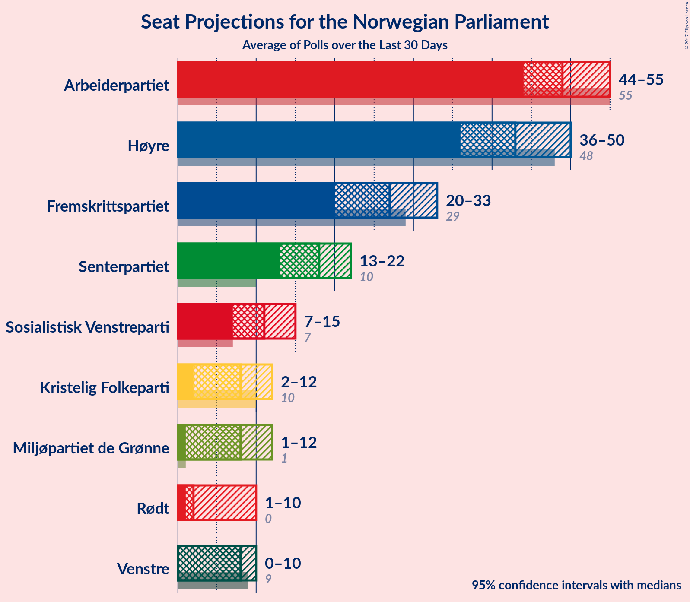
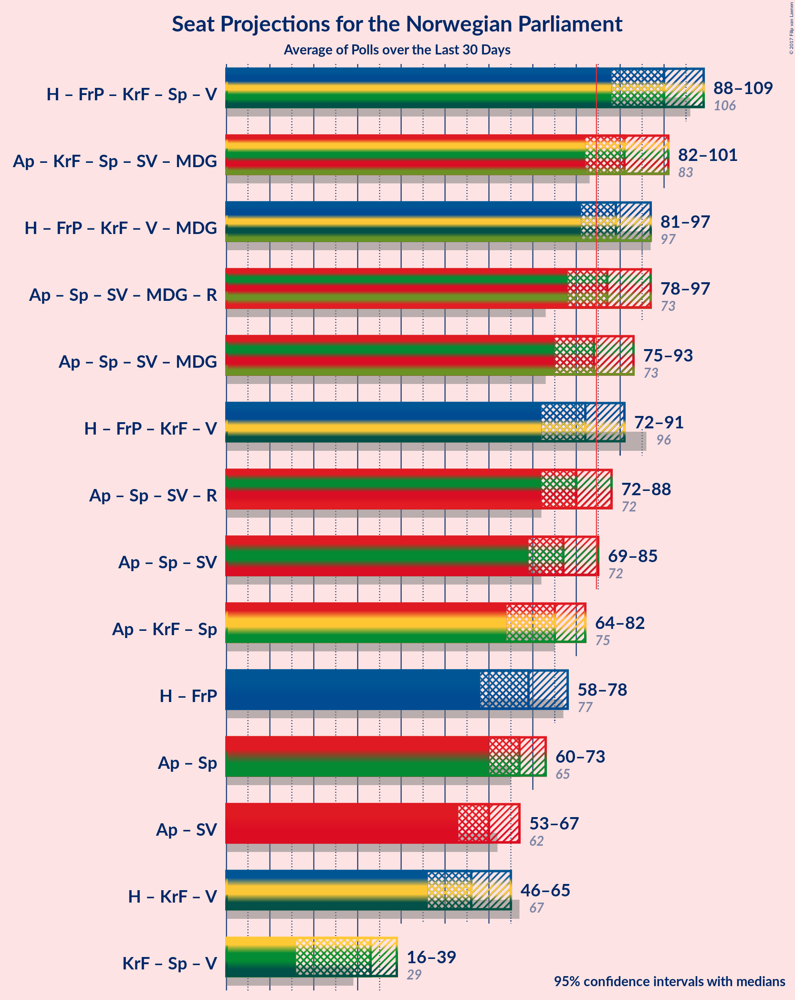

# Poll Average

<a href="#voting-intentions">Voting Intentions</a> | <a href="#seats">Seats</a> | <a href="#coalitions">Coalitions</a> | <a href="#technical-information">Technical Information</a>

The table below lists the polls on which the average is based. They are the most recent polls (less than 30 days old) registered and analyzed so far.

| Period     | Pollster/Media   | Ap | H | FrP | KrF | Sp | V | SV | MDG | R |
|:----------:|:----------------:|:--:|:--:|:--:|:--:|:--:|:--:|:--:|:--:|:--:|
| 8–9 September 2013 | General Election | 30.8%   55 | 26.8%   48 | 16.3%   29 | 5.6%   10 | 5.5%   10 | 5.2%   9 | 4.1%   7 | 2.8%   1 | 1.1%   0 |
| N/A | Poll Average | 44–55 | 36–50 | 20–33 | 2–12 | 13–22 | 0–10 | 7–15 | 1–12 | 1–10 |
| [4–9 September 2017](2017-09-09-KantarTNS.html) | Kantar TNS   TV2 | 26–30%   47–54 | 22–26%   38–46 | 13–16%   24–29 | 4–5%   2–9 | 9–11%   15–20 | 4–6%   2–10 | 5–7%   8–12 | 3–5%   1–8 | 2–4%   1–2 |
| [5–7 September 2017](2017-09-07-OpinionPerduco.html) | Opinion Perduco   Avisenes Nyhetsbyrå | 23–30%   44–55 | 23–29%   39–51 | 13–18%   23–32 | 2–5%   1–8 | 7–11%   11–19 | 2–4%   0–3 | 5–8%   8–13 | 4–8%   7–13 | 4–7%   2–12 |
| [7 September 2017](2017-09-07-InFact.html) | InFact   VG | 26–30%   46–55 | 20–23%   35–40 | 11–14%   20–26 | 4–6%   2–9 | 9–12%   16–21 | 4–6%   8–10 | 7–9%   12–16 | 4–5%   2–9 | 3–4%   1–6 |
| [4–6 September 2017](2017-09-06-ResponsAnalyse.html) | Respons Analyse   Aftenposten, Bergens Tidende and Adresseavisen | 23–28%   42–53 | 22–27%   39–50 | 12–17%   22–31 | 4–7%   7–13 | 8–12%   14–22 | 3–6%   2–10 | 6–9%   10–16 | 2–4%   1–3 | 2–4%   1–7 |
| [5–6 September 2017](2017-09-06-Norfakta.html) | Norfakta   Nationen and Klassekampen | 23–29%   44–54 | 23–29%   39–52 | 12–16%   20–29 | 4–7%   3–12 | 9–13%   14–23 | 3–6%   1–10 | 4–7%   2–11 | 3–6%   1–11 | 2–5%   1–7 |
| [4–6 September 2017](2017-09-06-IpsosMMI.html) | Ipsos MMI   Dagbladet | 24–30%   45–55 | 21–26%   36–47 | 13–18%   23–32 | 3–6%   2–10 | 8–11%   13–20 | 4–6%   2–10 | 5–8%   8–14 | 3–6%   1–10 | 3–5%   1–8 |
| [31 August–4 September 2017](2017-09-04-Norstat.html) | Norstat   NRK | 23–28%   43–52 | 22–27%   38–49 | 15–19%   27–35 | 3–6%   2–10 | 8–11%   13–21 | 3–5%   1–8 | 5–7%   8–13 | 4–6%   1–10 | 2–4%   1–8 |
| [15–20 August 2017](2017-08-20-Sentio.html) | Sentio   Dagens Næringsliv | 24–30%   44–55 | 21–27%   37–49 | 11–16%   19–28 | 4–7%   2–12 | 9–14%   15–24 | 3–6%   1–10 | 4–7%   1–12 | 5–8%   8–14 | 2–4%   1–2 |
| 8–9 September 2013 | General Election | 30.8%   55 | 26.8%   48 | 16.3%   29 | 5.6%   10 | 5.5%   10 | 5.2%   9 | 4.1%   7 | 2.8%   1 | 1.1%   0 |

Only polls for which at least the sample size has been published are included in the table above.

**Legend:**
+ **Top half of each row:** Voting intentions (95% confidence interval)
+ **Bottom half of each row:** Seat projections for the Norwegian Parliament (95% confidence interval)
+ **Ap:** Arbeiderpartiet
+ **H:** Høyre
+ **FrP:** Fremskrittspartiet
+ **KrF:** Kristelig Folkeparti
+ **Sp:** Senterpartiet
+ **V:** Venstre
+ **SV:** Sosialistisk Venstreparti
+ **MDG:** Miljøpartiet de Grønne
+ **R:** Rødt
+ **N/A (single party):** Party not included the published results
+ **N/A (entire row):** Calculation for this opinion poll not started yet

## Voting Intentions

## Seats

### Confidence Intervals

| Party | Last Result | Median | 80% Confidence Interval | 90% Confidence Interval | 95% Confidence Interval | 99% Confidence Interval |
|:-----:|:-----------:|:------:|:-----------------------:|:-----------------------:|:-----------------------:|:-----------------------:|
| <a href="#arbeiderpartiet">Arbeiderpartiet</a> | 55 | 49 | 45–53 |44–54 | 44–55 | 42–56 |
| <a href="#høyre">Høyre</a> | 48 | 43 | 38–47 |37–49 | 36–50 | 35–52 |
| <a href="#fremskrittspartiet">Fremskrittspartiet</a> | 29 | 27 | 21–31 |20–32 | 20–33 | 19–35 |
| <a href="#kristelig-folkeparti">Kristelig Folkeparti</a> | 10 | 8 | 2–10 |2–11 | 2–12 | 1–13 |
| <a href="#senterpartiet">Senterpartiet</a> | 10 | 18 | 14–20 |13–22 | 13–22 | 12–24 |
| <a href="#venstre">Venstre</a> | 9 | 8 | 1–9 |1–10 | 0–10 | 0–11 |
| <a href="#sosialistisk-venstreparti">Sosialistisk Venstreparti</a> | 7 | 11 | 8–14 |8–14 | 7–15 | 1–16 |
| <a href="#miljøpartiet-de-grønne">Miljøpartiet de Grønne</a> | 1 | 8 | 1–11 |1–12 | 1–12 | 1–14 |
| <a href="#rødt">Rødt</a> | 0 | 2 | 1–8 |1–9 | 1–10 | 1–11 |

### Arbeiderpartiet

*For a full overview of the results for this party, see the [Arbeiderpartiet](party-arbeiderpartiet.html) page.*

| Number of Seats | Probability | Accumulated | Special Marks |
|:---------------:|:-----------:|:-----------:|:-------------:|
| 39 | 0% | 100% |  |
| 40 | 0.1% | 99.9% |  |
| 41 | 0.2% | 99.8% |  |
| 42 | 0.7% | 99.6% |  |
| 43 | 1.1% | 98.9% |  |
| 44 | 3% | 98% |  |
| 45 | 8% | 95% |  |
| 46 | 8% | 87% |  |
| 47 | 9% | 79% |  |
| 48 | 12% | 70% |  |
| 49 | 9% | 58% | Median |
| 50 | 12% | 48% |  |
| 51 | 12% | 36% |  |
| 52 | 10% | 24% |  |
| 53 | 6% | 14% |  |
| 54 | 5% | 8% |  |
| 55 | 2% | 3% | Last Result |
| 56 | 0.5% | 0.9% |  |
| 57 | 0.3% | 0.5% |  |
| 58 | 0.1% | 0.2% |  |
| 59 | 0.1% | 0.1% |  |
| 60 | 0% | 0% |  |

### Høyre

*For a full overview of the results for this party, see the [Høyre](party-hyre.html) page.*

| Number of Seats | Probability | Accumulated | Special Marks |
|:---------------:|:-----------:|:-----------:|:-------------:|
| 33 | 0.1% | 100% |  |
| 34 | 0.2% | 99.9% |  |
| 35 | 1.3% | 99.7% |  |
| 36 | 2% | 98% |  |
| 37 | 3% | 96% |  |
| 38 | 10% | 93% |  |
| 39 | 8% | 83% |  |
| 40 | 6% | 75% |  |
| 41 | 10% | 69% |  |
| 42 | 9% | 59% |  |
| 43 | 9% | 50% | Median |
| 44 | 10% | 42% |  |
| 45 | 10% | 32% |  |
| 46 | 6% | 22% |  |
| 47 | 7% | 16% |  |
| 48 | 3% | 9% | Last Result |
| 49 | 2% | 6% |  |
| 50 | 2% | 3% |  |
| 51 | 0.8% | 2% |  |
| 52 | 0.4% | 0.8% |  |
| 53 | 0.2% | 0.4% |  |
| 54 | 0.1% | 0.2% |  |
| 55 | 0% | 0.1% |  |
| 56 | 0% | 0% |  |

### Fremskrittspartiet

*For a full overview of the results for this party, see the [Fremskrittspartiet](party-fremskrittspartiet.html) page.*

| Number of Seats | Probability | Accumulated | Special Marks |
|:---------------:|:-----------:|:-----------:|:-------------:|
| 17 | 0.1% | 100% |  |
| 18 | 0.3% | 99.9% |  |
| 19 | 0.9% | 99.6% |  |
| 20 | 5% | 98.7% |  |
| 21 | 4% | 93% |  |
| 22 | 8% | 89% |  |
| 23 | 7% | 81% |  |
| 24 | 7% | 75% |  |
| 25 | 8% | 68% |  |
| 26 | 10% | 60% |  |
| 27 | 11% | 50% | Median |
| 28 | 19% | 39% |  |
| 29 | 6% | 20% | Last Result |
| 30 | 4% | 15% |  |
| 31 | 5% | 11% |  |
| 32 | 3% | 6% |  |
| 33 | 2% | 3% |  |
| 34 | 0.7% | 1.3% |  |
| 35 | 0.2% | 0.5% |  |
| 36 | 0.2% | 0.3% |  |
| 37 | 0.1% | 0.1% |  |
| 38 | 0% | 0.1% |  |
| 39 | 0% | 0% |  |

### Kristelig Folkeparti

*For a full overview of the results for this party, see the [Kristelig Folkeparti](party-kristeligfolkeparti.html) page.*

| Number of Seats | Probability | Accumulated | Special Marks |
|:---------------:|:-----------:|:-----------:|:-------------:|
| 0 | 0.3% | 100% |  |
| 1 | 2% | 99.7% |  |
| 2 | 16% | 98% |  |
| 3 | 3% | 82% |  |
| 4 | 0% | 79% |  |
| 5 | 0% | 79% |  |
| 6 | 0.3% | 79% |  |
| 7 | 13% | 79% |  |
| 8 | 24% | 66% | Median |
| 9 | 23% | 42% |  |
| 10 | 10% | 19% | Last Result |
| 11 | 6% | 9% |  |
| 12 | 2% | 3% |  |
| 13 | 0.6% | 0.8% |  |
| 14 | 0.1% | 0.2% |  |
| 15 | 0% | 0% |  |

### Senterpartiet

*For a full overview of the results for this party, see the [Senterpartiet](party-senterpartiet.html) page.*

| Number of Seats | Probability | Accumulated | Special Marks |
|:---------------:|:-----------:|:-----------:|:-------------:|
| 10 | 0.1% | 100% | Last Result |
| 11 | 0.4% | 99.9% |  |
| 12 | 1.1% | 99.5% |  |
| 13 | 4% | 98% |  |
| 14 | 5% | 94% |  |
| 15 | 7% | 89% |  |
| 16 | 13% | 82% |  |
| 17 | 15% | 69% |  |
| 18 | 26% | 54% | Median |
| 19 | 11% | 29% |  |
| 20 | 8% | 18% |  |
| 21 | 3% | 10% |  |
| 22 | 4% | 6% |  |
| 23 | 2% | 2% |  |
| 24 | 0.4% | 0.6% |  |
| 25 | 0.2% | 0.2% |  |
| 26 | 0% | 0.1% |  |
| 27 | 0% | 0% |  |

### Venstre

*For a full overview of the results for this party, see the [Venstre](party-venstre.html) page.*

| Number of Seats | Probability | Accumulated | Special Marks |
|:---------------:|:-----------:|:-----------:|:-------------:|
| 0 | 5% | 100% |  |
| 1 | 10% | 95% |  |
| 2 | 16% | 85% |  |
| 3 | 5% | 69% |  |
| 4 | 0% | 64% |  |
| 5 | 0% | 64% |  |
| 6 | 0.4% | 64% |  |
| 7 | 12% | 63% |  |
| 8 | 26% | 51% | Median |
| 9 | 20% | 26% | Last Result |
| 10 | 5% | 6% |  |
| 11 | 0.8% | 1.0% |  |
| 12 | 0.2% | 0.2% |  |
| 13 | 0% | 0% |  |

### Sosialistisk Venstreparti

*For a full overview of the results for this party, see the [Sosialistisk Venstreparti](party-sosialistiskvenstreparti.html) page.*

| Number of Seats | Probability | Accumulated | Special Marks |
|:---------------:|:-----------:|:-----------:|:-------------:|
| 1 | 0.5% | 100% |  |
| 2 | 2% | 99.5% |  |
| 3 | 0% | 98% |  |
| 4 | 0% | 98% |  |
| 5 | 0% | 98% |  |
| 6 | 0.1% | 98% |  |
| 7 | 3% | 98% | Last Result |
| 8 | 9% | 95% |  |
| 9 | 16% | 86% |  |
| 10 | 16% | 70% |  |
| 11 | 20% | 54% | Median |
| 12 | 10% | 34% |  |
| 13 | 10% | 24% |  |
| 14 | 9% | 14% |  |
| 15 | 3% | 4% |  |
| 16 | 0.8% | 1.1% |  |
| 17 | 0.2% | 0.3% |  |
| 18 | 0.1% | 0.1% |  |
| 19 | 0% | 0% |  |

### Miljøpartiet de Grønne

*For a full overview of the results for this party, see the [Miljøpartiet de Grønne](party-miljpartietdegrnne.html) page.*

| Number of Seats | Probability | Accumulated | Special Marks |
|:---------------:|:-----------:|:-----------:|:-------------:|
| 0 | 0.2% | 100% |  |
| 1 | 16% | 99.8% | Last Result |
| 2 | 4% | 83% |  |
| 3 | 11% | 80% |  |
| 4 | 0.8% | 69% |  |
| 5 | 0% | 68% |  |
| 6 | 0.1% | 68% |  |
| 7 | 14% | 68% |  |
| 8 | 19% | 54% | Median |
| 9 | 15% | 34% |  |
| 10 | 9% | 20% |  |
| 11 | 5% | 11% |  |
| 12 | 4% | 6% |  |
| 13 | 1.2% | 2% |  |
| 14 | 0.4% | 0.6% |  |
| 15 | 0.1% | 0.2% |  |
| 16 | 0% | 0% |  |

### Rødt

*For a full overview of the results for this party, see the [Rødt](party-rdt.html) page.*

| Number of Seats | Probability | Accumulated | Special Marks |
|:---------------:|:-----------:|:-----------:|:-------------:|
| 0 | 0% | 100% | Last Result |
| 1 | 18% | 100% |  |
| 2 | 63% | 82% | Median |
| 3 | 0% | 19% |  |
| 4 | 0% | 19% |  |
| 5 | 0% | 19% |  |
| 6 | 0.6% | 19% |  |
| 7 | 6% | 18% |  |
| 8 | 4% | 12% |  |
| 9 | 4% | 8% |  |
| 10 | 2% | 4% |  |
| 11 | 1.1% | 1.5% |  |
| 12 | 0.3% | 0.4% |  |
| 13 | 0.1% | 0.1% |  |
| 14 | 0% | 0% |  |

## Coalitions

### Confidence Intervals

| Coalition | Last Result | Median | Majority? | 80% Confidence Interval | 90% Confidence Interval | 95% Confidence Interval | 99% Confidence Interval |
|:---------:|:-----------:|:------:|:---------:|:-----------------------:|:-----------------------:|:-----------------------:|:-----------------------:|
| Høyre – Fremskrittspartiet – Kristelig Folkeparti – Senterpartiet – Venstre | 106 | 100 | 99.7% | 92–106 | 90–108 | 88–109 | 85–112 |
| Arbeiderpartiet – Kristelig Folkeparti – Senterpartiet – Sosialistisk Venstreparti – Miljøpartiet de Grønne | 83 | 91 | 94% | 85–99 | 84–100 | 82–101 | 80–104 |
| Høyre – Fremskrittspartiet – Kristelig Folkeparti – Venstre – Miljøpartiet de Grønne | 97 | 89 | 81% | 83–94 | 82–95 | 81–97 | 79–99 |
| Arbeiderpartiet – Senterpartiet – Sosialistisk Venstreparti – Miljøpartiet de Grønne – Rødt | 73 | 87 | 66% | 81–94 | 79–95 | 78–97 | 75–99 |
| Arbeiderpartiet – Senterpartiet – Sosialistisk Venstreparti – Miljøpartiet de Grønne | 73 | 84 | 41% | 78–91 | 77–92 | 75–93 | 73–96 |
| Høyre – Fremskrittspartiet – Kristelig Folkeparti – Venstre | 96 | 82 | 34% | 75–88 | 74–90 | 72–91 | 70–94 |
| Arbeiderpartiet – Senterpartiet – Sosialistisk Venstreparti – Rødt | 72 | 80 | 19% | 75–86 | 74–87 | 72–88 | 70–90 |
| Arbeiderpartiet – Senterpartiet – Sosialistisk Venstreparti | 72 | 77 | 4% | 72–83 | 71–84 | 69–85 | 67–88 |
| Arbeiderpartiet – Kristelig Folkeparti – Senterpartiet | 75 | 75 | 0.6% | 67–79 | 65–81 | 64–82 | 61–85 |
| Høyre – Fremskrittspartiet | 77 | 69 | 0% | 60–75 | 58–76 | 58–78 | 57–81 |
| Arbeiderpartiet – Senterpartiet | 65 | 67 | 0% | 62–71 | 61–72 | 60–73 | 58–76 |
| Arbeiderpartiet – Sosialistisk Venstreparti | 62 | 60 | 0% | 55–66 | 54–66 | 53–67 | 50–68 |
| Høyre – Kristelig Folkeparti – Venstre | 67 | 56 | 0% | 49–62 | 48–64 | 46–65 | 42–68 |
| Kristelig Folkeparti – Senterpartiet – Venstre | 29 | 33 | 0% | 21–37 | 17–38 | 16–39 | 14–41 |

### Høyre – Fremskrittspartiet – Kristelig Folkeparti – Senterpartiet – Venstre

| Number of Seats | Probability | Accumulated | Special Marks |
|:---------------:|:-----------:|:-----------:|:-------------:|
| 82 | 0% | 100% |  |
| 83 | 0.1% | 99.9% |  |
| 84 | 0.2% | 99.8% |  |
| 85 | 0.5% | 99.7% | Majority |
| 86 | 0.7% | 99.2% |  |
| 87 | 0.8% | 98% |  |
| 88 | 0.6% | 98% |  |
| 89 | 2% | 97% |  |
| 90 | 3% | 95% |  |
| 91 | 2% | 93% |  |
| 92 | 3% | 91% |  |
| 93 | 3% | 88% |  |
| 94 | 7% | 85% |  |
| 95 | 4% | 78% |  |
| 96 | 4% | 74% |  |
| 97 | 4% | 69% |  |
| 98 | 4% | 66% |  |
| 99 | 6% | 61% |  |
| 100 | 7% | 56% |  |
| 101 | 7% | 49% |  |
| 102 | 8% | 42% |  |
| 103 | 12% | 34% |  |
| 104 | 5% | 23% | Median |
| 105 | 6% | 18% |  |
| 106 | 4% | 11% | Last Result |
| 107 | 3% | 8% |  |
| 108 | 2% | 5% |  |
| 109 | 2% | 3% |  |
| 110 | 0.7% | 2% |  |
| 111 | 0.5% | 1.1% |  |
| 112 | 0.4% | 0.6% |  |
| 113 | 0.1% | 0.2% |  |
| 114 | 0% | 0.1% |  |
| 115 | 0% | 0.1% |  |
| 116 | 0% | 0.1% |  |
| 117 | 0% | 0% |  |

### Arbeiderpartiet – Kristelig Folkeparti – Senterpartiet – Sosialistisk Venstreparti – Miljøpartiet de Grønne

| Number of Seats | Probability | Accumulated | Special Marks |
|:---------------:|:-----------:|:-----------:|:-------------:|
| 77 | 0% | 100% |  |
| 78 | 0.1% | 99.9% |  |
| 79 | 0.2% | 99.8% |  |
| 80 | 0.3% | 99.6% |  |
| 81 | 0.8% | 99.3% |  |
| 82 | 1.0% | 98% |  |
| 83 | 1.3% | 97% | Last Result |
| 84 | 2% | 96% |  |
| 85 | 6% | 94% | Majority |
| 86 | 5% | 88% |  |
| 87 | 5% | 83% |  |
| 88 | 6% | 78% |  |
| 89 | 10% | 71% |  |
| 90 | 8% | 62% |  |
| 91 | 9% | 53% |  |
| 92 | 7% | 44% |  |
| 93 | 6% | 37% |  |
| 94 | 5% | 31% | Median |
| 95 | 4% | 26% |  |
| 96 | 3% | 22% |  |
| 97 | 3% | 19% |  |
| 98 | 3% | 16% |  |
| 99 | 4% | 12% |  |
| 100 | 6% | 9% |  |
| 101 | 1.1% | 3% |  |
| 102 | 0.7% | 2% |  |
| 103 | 0.6% | 1.3% |  |
| 104 | 0.3% | 0.7% |  |
| 105 | 0.2% | 0.4% |  |
| 106 | 0.1% | 0.2% |  |
| 107 | 0.1% | 0.1% |  |
| 108 | 0% | 0% |  |

### Høyre – Fremskrittspartiet – Kristelig Folkeparti – Venstre – Miljøpartiet de Grønne

| Number of Seats | Probability | Accumulated | Special Marks |
|:---------------:|:-----------:|:-----------:|:-------------:|
| 76 | 0% | 100% |  |
| 77 | 0.1% | 99.9% |  |
| 78 | 0.2% | 99.8% |  |
| 79 | 0.7% | 99.7% |  |
| 80 | 1.3% | 99.0% |  |
| 81 | 2% | 98% |  |
| 82 | 3% | 96% |  |
| 83 | 6% | 93% |  |
| 84 | 6% | 87% |  |
| 85 | 5% | 81% | Majority |
| 86 | 9% | 75% |  |
| 87 | 5% | 67% |  |
| 88 | 9% | 61% |  |
| 89 | 11% | 52% |  |
| 90 | 9% | 41% |  |
| 91 | 7% | 33% |  |
| 92 | 7% | 25% |  |
| 93 | 5% | 18% |  |
| 94 | 4% | 13% | Median |
| 95 | 3% | 8% |  |
| 96 | 2% | 5% |  |
| 97 | 1.3% | 3% | Last Result |
| 98 | 0.6% | 1.4% |  |
| 99 | 0.3% | 0.8% |  |
| 100 | 0.2% | 0.5% |  |
| 101 | 0.2% | 0.3% |  |
| 102 | 0.1% | 0.1% |  |
| 103 | 0% | 0% |  |

### Arbeiderpartiet – Senterpartiet – Sosialistisk Venstreparti – Miljøpartiet de Grønne – Rødt

| Number of Seats | Probability | Accumulated | Special Marks |
|:---------------:|:-----------:|:-----------:|:-------------:|
| 73 | 0% | 100% | Last Result |
| 74 | 0.1% | 99.9% |  |
| 75 | 0.4% | 99.8% |  |
| 76 | 0.7% | 99.4% |  |
| 77 | 0.8% | 98.7% |  |
| 78 | 1.4% | 98% |  |
| 79 | 2% | 96% |  |
| 80 | 4% | 95% |  |
| 81 | 4% | 91% |  |
| 82 | 6% | 88% |  |
| 83 | 7% | 82% |  |
| 84 | 9% | 74% |  |
| 85 | 9% | 66% | Majority |
| 86 | 7% | 57% |  |
| 87 | 6% | 50% |  |
| 88 | 7% | 44% | Median |
| 89 | 5% | 36% |  |
| 90 | 4% | 31% |  |
| 91 | 3% | 27% |  |
| 92 | 4% | 24% |  |
| 93 | 8% | 20% |  |
| 94 | 5% | 12% |  |
| 95 | 2% | 7% |  |
| 96 | 1.3% | 5% |  |
| 97 | 2% | 4% |  |
| 98 | 0.9% | 2% |  |
| 99 | 0.4% | 0.8% |  |
| 100 | 0.2% | 0.4% |  |
| 101 | 0.1% | 0.2% |  |
| 102 | 0.1% | 0.1% |  |
| 103 | 0% | 0% |  |

### Arbeiderpartiet – Senterpartiet – Sosialistisk Venstreparti – Miljøpartiet de Grønne

| Number of Seats | Probability | Accumulated | Special Marks |
|:---------------:|:-----------:|:-----------:|:-------------:|
| 70 | 0.1% | 100% |  |
| 71 | 0.1% | 99.9% |  |
| 72 | 0.2% | 99.8% |  |
| 73 | 0.5% | 99.6% | Last Result |
| 74 | 0.7% | 99.2% |  |
| 75 | 1.2% | 98% |  |
| 76 | 2% | 97% |  |
| 77 | 2% | 96% |  |
| 78 | 5% | 94% |  |
| 79 | 4% | 89% |  |
| 80 | 6% | 84% |  |
| 81 | 7% | 78% |  |
| 82 | 11% | 71% |  |
| 83 | 9% | 60% |  |
| 84 | 10% | 51% |  |
| 85 | 6% | 41% | Majority |
| 86 | 8% | 35% | Median |
| 87 | 4% | 27% |  |
| 88 | 4% | 23% |  |
| 89 | 3% | 19% |  |
| 90 | 2% | 16% |  |
| 91 | 7% | 13% |  |
| 92 | 3% | 7% |  |
| 93 | 2% | 4% |  |
| 94 | 0.6% | 2% |  |
| 95 | 0.7% | 1.4% |  |
| 96 | 0.6% | 0.7% |  |
| 97 | 0.1% | 0.2% |  |
| 98 | 0.1% | 0.1% |  |
| 99 | 0% | 0% |  |

### Høyre – Fremskrittspartiet – Kristelig Folkeparti – Venstre

| Number of Seats | Probability | Accumulated | Special Marks |
|:---------------:|:-----------:|:-----------:|:-------------:|
| 67 | 0.1% | 100% |  |
| 68 | 0.1% | 99.9% |  |
| 69 | 0.2% | 99.8% |  |
| 70 | 0.4% | 99.6% |  |
| 71 | 0.9% | 99.2% |  |
| 72 | 2% | 98% |  |
| 73 | 1.3% | 96% |  |
| 74 | 2% | 95% |  |
| 75 | 5% | 93% |  |
| 76 | 8% | 88% |  |
| 77 | 4% | 80% |  |
| 78 | 3% | 76% |  |
| 79 | 4% | 73% |  |
| 80 | 5% | 69% |  |
| 81 | 7% | 64% |  |
| 82 | 6% | 56% |  |
| 83 | 7% | 50% |  |
| 84 | 9% | 43% |  |
| 85 | 9% | 34% | Majority |
| 86 | 7% | 26% | Median |
| 87 | 6% | 18% |  |
| 88 | 4% | 12% |  |
| 89 | 4% | 9% |  |
| 90 | 2% | 5% |  |
| 91 | 1.4% | 3% |  |
| 92 | 0.8% | 2% |  |
| 93 | 0.7% | 1.3% |  |
| 94 | 0.4% | 0.6% |  |
| 95 | 0.1% | 0.2% |  |
| 96 | 0% | 0.1% | Last Result |
| 97 | 0% | 0% |  |

### Arbeiderpartiet – Senterpartiet – Sosialistisk Venstreparti – Rødt

| Number of Seats | Probability | Accumulated | Special Marks |
|:---------------:|:-----------:|:-----------:|:-------------:|
| 67 | 0.1% | 100% |  |
| 68 | 0.2% | 99.9% |  |
| 69 | 0.2% | 99.7% |  |
| 70 | 0.3% | 99.5% |  |
| 71 | 0.6% | 99.2% |  |
| 72 | 1.3% | 98.6% | Last Result |
| 73 | 2% | 97% |  |
| 74 | 3% | 95% |  |
| 75 | 4% | 92% |  |
| 76 | 5% | 87% |  |
| 77 | 7% | 82% |  |
| 78 | 7% | 75% |  |
| 79 | 9% | 67% |  |
| 80 | 11% | 59% | Median |
| 81 | 9% | 48% |  |
| 82 | 5% | 39% |  |
| 83 | 9% | 33% |  |
| 84 | 5% | 25% |  |
| 85 | 6% | 19% | Majority |
| 86 | 6% | 13% |  |
| 87 | 3% | 7% |  |
| 88 | 2% | 4% |  |
| 89 | 1.3% | 2% |  |
| 90 | 0.7% | 1.0% |  |
| 91 | 0.2% | 0.3% |  |
| 92 | 0.1% | 0.2% |  |
| 93 | 0% | 0.1% |  |
| 94 | 0% | 0% |  |

### Arbeiderpartiet – Senterpartiet – Sosialistisk Venstreparti

| Number of Seats | Probability | Accumulated | Special Marks |
|:---------------:|:-----------:|:-----------:|:-------------:|
| 64 | 0% | 100% |  |
| 65 | 0.1% | 99.9% |  |
| 66 | 0.3% | 99.8% |  |
| 67 | 0.3% | 99.6% |  |
| 68 | 0.7% | 99.2% |  |
| 69 | 2% | 98.6% |  |
| 70 | 2% | 97% |  |
| 71 | 3% | 95% |  |
| 72 | 5% | 92% | Last Result |
| 73 | 6% | 88% |  |
| 74 | 9% | 82% |  |
| 75 | 8% | 73% |  |
| 76 | 8% | 66% |  |
| 77 | 8% | 58% |  |
| 78 | 10% | 49% | Median |
| 79 | 9% | 39% |  |
| 80 | 6% | 30% |  |
| 81 | 5% | 24% |  |
| 82 | 4% | 19% |  |
| 83 | 5% | 15% |  |
| 84 | 5% | 10% |  |
| 85 | 2% | 4% | Majority |
| 86 | 0.9% | 2% |  |
| 87 | 0.7% | 1.3% |  |
| 88 | 0.5% | 0.6% |  |
| 89 | 0.1% | 0.2% |  |
| 90 | 0% | 0.1% |  |
| 91 | 0% | 0% |  |

### Arbeiderpartiet – Kristelig Folkeparti – Senterpartiet

| Number of Seats | Probability | Accumulated | Special Marks |
|:---------------:|:-----------:|:-----------:|:-------------:|
| 58 | 0% | 100% |  |
| 59 | 0.1% | 99.9% |  |
| 60 | 0.2% | 99.8% |  |
| 61 | 0.4% | 99.6% |  |
| 62 | 0.5% | 99.2% |  |
| 63 | 1.0% | 98.7% |  |
| 64 | 1.0% | 98% |  |
| 65 | 3% | 97% |  |
| 66 | 3% | 94% |  |
| 67 | 2% | 91% |  |
| 68 | 4% | 89% |  |
| 69 | 3% | 85% |  |
| 70 | 4% | 82% |  |
| 71 | 6% | 78% |  |
| 72 | 5% | 72% |  |
| 73 | 6% | 68% |  |
| 74 | 10% | 61% |  |
| 75 | 10% | 51% | Last Result, Median |
| 76 | 9% | 42% |  |
| 77 | 6% | 33% |  |
| 78 | 8% | 27% |  |
| 79 | 9% | 18% |  |
| 80 | 3% | 9% |  |
| 81 | 3% | 6% |  |
| 82 | 1.2% | 3% |  |
| 83 | 0.9% | 2% |  |
| 84 | 0.5% | 1.1% |  |
| 85 | 0.2% | 0.6% | Majority |
| 86 | 0.1% | 0.4% |  |
| 87 | 0.2% | 0.3% |  |
| 88 | 0.1% | 0.1% |  |
| 89 | 0% | 0% |  |

### Høyre – Fremskrittspartiet

| Number of Seats | Probability | Accumulated | Special Marks |
|:---------------:|:-----------:|:-----------:|:-------------:|
| 54 | 0.1% | 100% |  |
| 55 | 0.1% | 99.9% |  |
| 56 | 0.2% | 99.8% |  |
| 57 | 0.4% | 99.5% |  |
| 58 | 4% | 99.1% |  |
| 59 | 3% | 95% |  |
| 60 | 3% | 92% |  |
| 61 | 3% | 89% |  |
| 62 | 2% | 87% |  |
| 63 | 2% | 85% |  |
| 64 | 4% | 83% |  |
| 65 | 3% | 78% |  |
| 66 | 5% | 75% |  |
| 67 | 6% | 71% |  |
| 68 | 6% | 64% |  |
| 69 | 9% | 58% |  |
| 70 | 9% | 48% | Median |
| 71 | 7% | 39% |  |
| 72 | 7% | 33% |  |
| 73 | 8% | 25% |  |
| 74 | 6% | 17% |  |
| 75 | 3% | 11% |  |
| 76 | 4% | 8% |  |
| 77 | 2% | 4% | Last Result |
| 78 | 1.0% | 3% |  |
| 79 | 0.5% | 2% |  |
| 80 | 0.4% | 1.3% |  |
| 81 | 0.6% | 0.9% |  |
| 82 | 0.2% | 0.3% |  |
| 83 | 0.1% | 0.1% |  |
| 84 | 0% | 0.1% |  |
| 85 | 0% | 0% | Majority |

### Arbeiderpartiet – Senterpartiet

| Number of Seats | Probability | Accumulated | Special Marks |
|:---------------:|:-----------:|:-----------:|:-------------:|
| 55 | 0% | 100% |  |
| 56 | 0.1% | 99.9% |  |
| 57 | 0.3% | 99.8% |  |
| 58 | 0.5% | 99.6% |  |
| 59 | 1.0% | 99.0% |  |
| 60 | 1.4% | 98% |  |
| 61 | 5% | 97% |  |
| 62 | 6% | 92% |  |
| 63 | 8% | 86% |  |
| 64 | 8% | 78% |  |
| 65 | 6% | 70% | Last Result |
| 66 | 9% | 64% |  |
| 67 | 12% | 55% | Median |
| 68 | 9% | 43% |  |
| 69 | 13% | 35% |  |
| 70 | 8% | 22% |  |
| 71 | 5% | 15% |  |
| 72 | 6% | 10% |  |
| 73 | 2% | 4% |  |
| 74 | 1.1% | 2% |  |
| 75 | 0.6% | 1.2% |  |
| 76 | 0.2% | 0.6% |  |
| 77 | 0.2% | 0.4% |  |
| 78 | 0.1% | 0.1% |  |
| 79 | 0% | 0% |  |

### Arbeiderpartiet – Sosialistisk Venstreparti

| Number of Seats | Probability | Accumulated | Special Marks |
|:---------------:|:-----------:|:-----------:|:-------------:|
| 46 | 0.1% | 100% |  |
| 47 | 0.1% | 99.9% |  |
| 48 | 0.2% | 99.8% |  |
| 49 | 0.1% | 99.7% |  |
| 50 | 0.4% | 99.5% |  |
| 51 | 0.5% | 99.1% |  |
| 52 | 0.9% | 98.6% |  |
| 53 | 2% | 98% |  |
| 54 | 3% | 96% |  |
| 55 | 4% | 93% |  |
| 56 | 9% | 88% |  |
| 57 | 8% | 79% |  |
| 58 | 8% | 71% |  |
| 59 | 10% | 63% |  |
| 60 | 8% | 53% | Median |
| 61 | 11% | 44% |  |
| 62 | 8% | 33% | Last Result |
| 63 | 6% | 25% |  |
| 64 | 4% | 19% |  |
| 65 | 5% | 15% |  |
| 66 | 6% | 10% |  |
| 67 | 3% | 4% |  |
| 68 | 1.4% | 2% |  |
| 69 | 0.2% | 0.4% |  |
| 70 | 0.1% | 0.2% |  |
| 71 | 0% | 0.1% |  |
| 72 | 0% | 0% |  |

### Høyre – Kristelig Folkeparti – Venstre

| Number of Seats | Probability | Accumulated | Special Marks |
|:---------------:|:-----------:|:-----------:|:-------------:|
| 40 | 0% | 100% |  |
| 41 | 0.2% | 99.9% |  |
| 42 | 0.3% | 99.7% |  |
| 43 | 0.7% | 99.4% |  |
| 44 | 0.3% | 98.7% |  |
| 45 | 0.5% | 98% |  |
| 46 | 0.9% | 98% |  |
| 47 | 2% | 97% |  |
| 48 | 2% | 95% |  |
| 49 | 3% | 93% |  |
| 50 | 4% | 90% |  |
| 51 | 4% | 86% |  |
| 52 | 4% | 82% |  |
| 53 | 7% | 77% |  |
| 54 | 9% | 71% |  |
| 55 | 10% | 62% |  |
| 56 | 8% | 52% |  |
| 57 | 7% | 43% |  |
| 58 | 7% | 36% |  |
| 59 | 7% | 30% | Median |
| 60 | 6% | 22% |  |
| 61 | 5% | 16% |  |
| 62 | 3% | 12% |  |
| 63 | 4% | 9% |  |
| 64 | 2% | 6% |  |
| 65 | 1.1% | 3% |  |
| 66 | 0.7% | 2% |  |
| 67 | 0.6% | 1.4% | Last Result |
| 68 | 0.4% | 0.7% |  |
| 69 | 0.2% | 0.3% |  |
| 70 | 0.1% | 0.2% |  |
| 71 | 0% | 0.1% |  |
| 72 | 0% | 0% |  |

### Kristelig Folkeparti – Senterpartiet – Venstre

| Number of Seats | Probability | Accumulated | Special Marks |
|:---------------:|:-----------:|:-----------:|:-------------:|
| 12 | 0% | 100% |  |
| 13 | 0.2% | 99.9% |  |
| 14 | 0.3% | 99.8% |  |
| 15 | 1.0% | 99.5% |  |
| 16 | 2% | 98.5% |  |
| 17 | 3% | 97% |  |
| 18 | 1.0% | 94% |  |
| 19 | 2% | 93% |  |
| 20 | 1.3% | 91% |  |
| 21 | 2% | 90% |  |
| 22 | 1.0% | 88% |  |
| 23 | 1.3% | 87% |  |
| 24 | 1.5% | 86% |  |
| 25 | 2% | 85% |  |
| 26 | 2% | 82% |  |
| 27 | 4% | 80% |  |
| 28 | 5% | 76% |  |
| 29 | 5% | 71% | Last Result |
| 30 | 5% | 66% |  |
| 31 | 5% | 61% |  |
| 32 | 5% | 56% |  |
| 33 | 7% | 50% |  |
| 34 | 11% | 43% | Median |
| 35 | 11% | 32% |  |
| 36 | 9% | 21% |  |
| 37 | 4% | 12% |  |
| 38 | 3% | 8% |  |
| 39 | 3% | 5% |  |
| 40 | 1.2% | 2% |  |
| 41 | 0.4% | 0.8% |  |
| 42 | 0.2% | 0.4% |  |
| 43 | 0.2% | 0.2% |  |
| 44 | 0% | 0.1% |  |
| 45 | 0% | 0% |  |

## Technical Information

