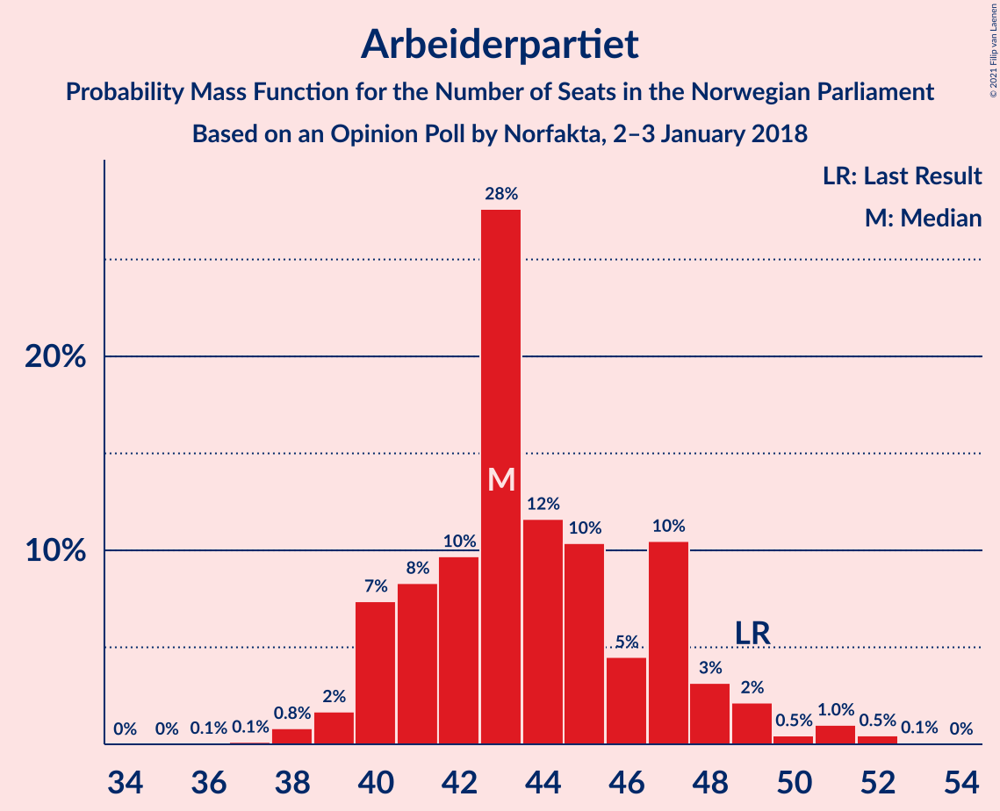
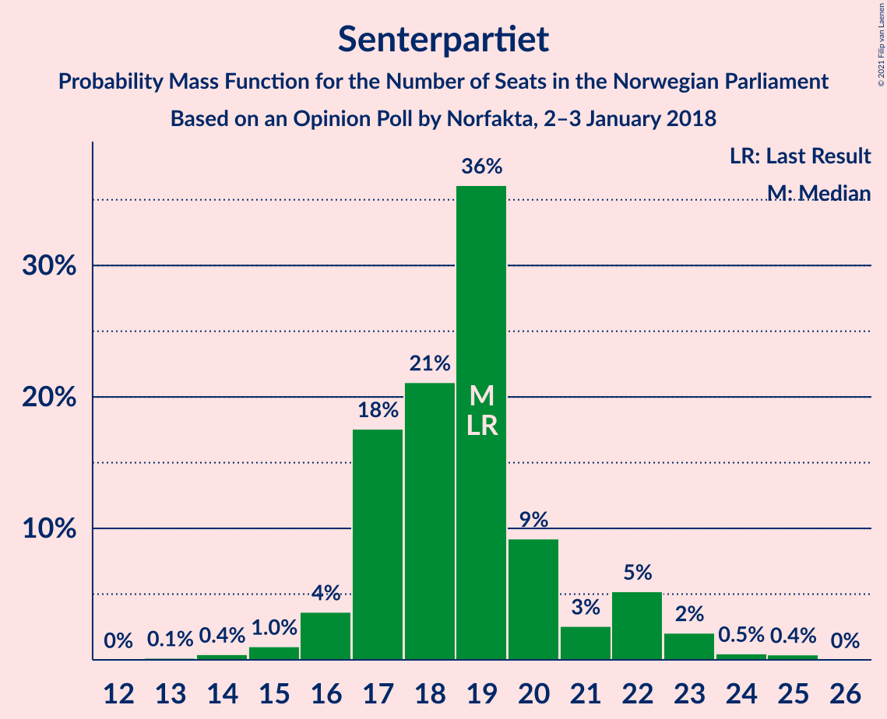
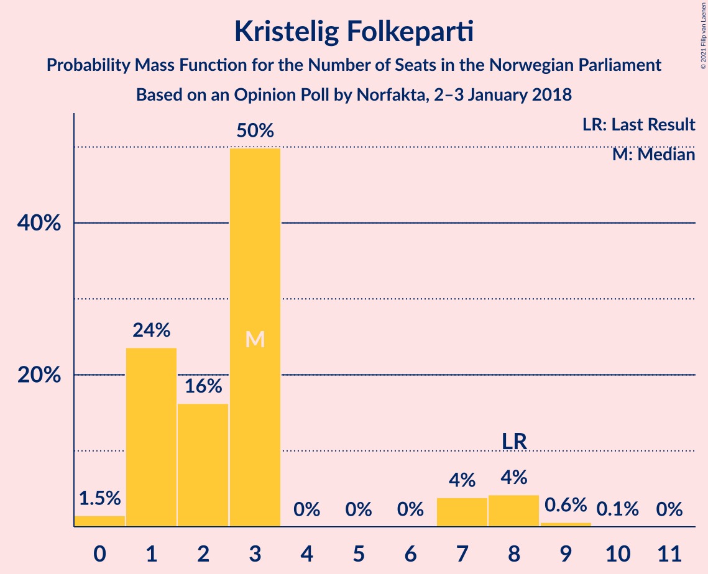
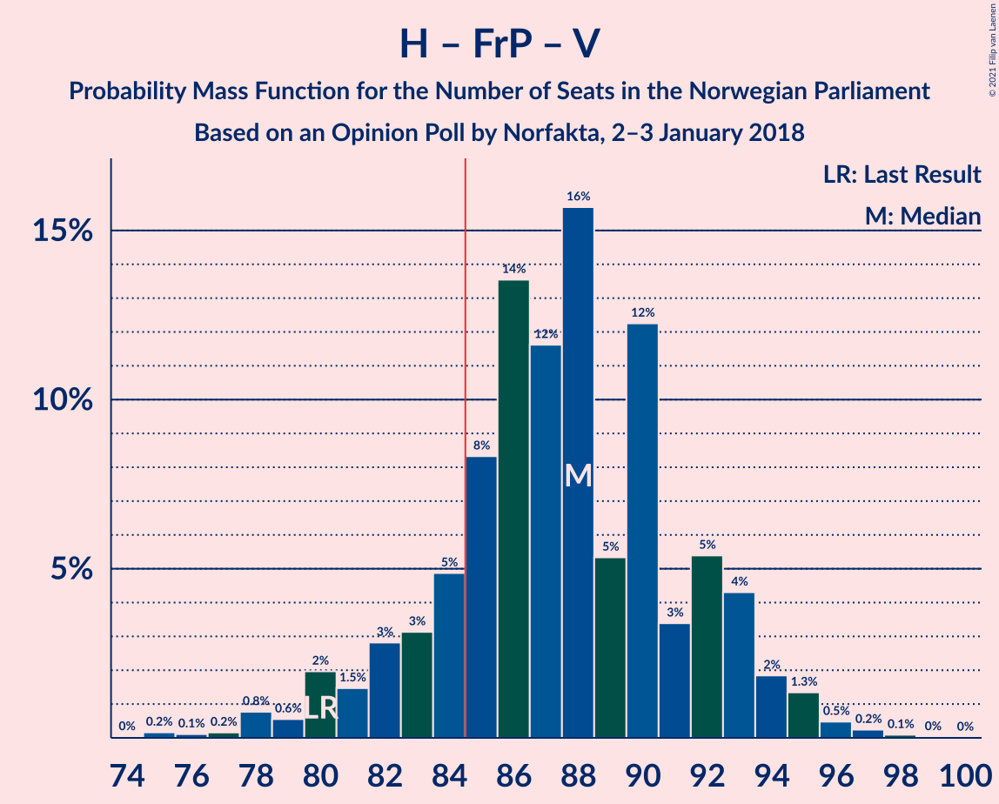
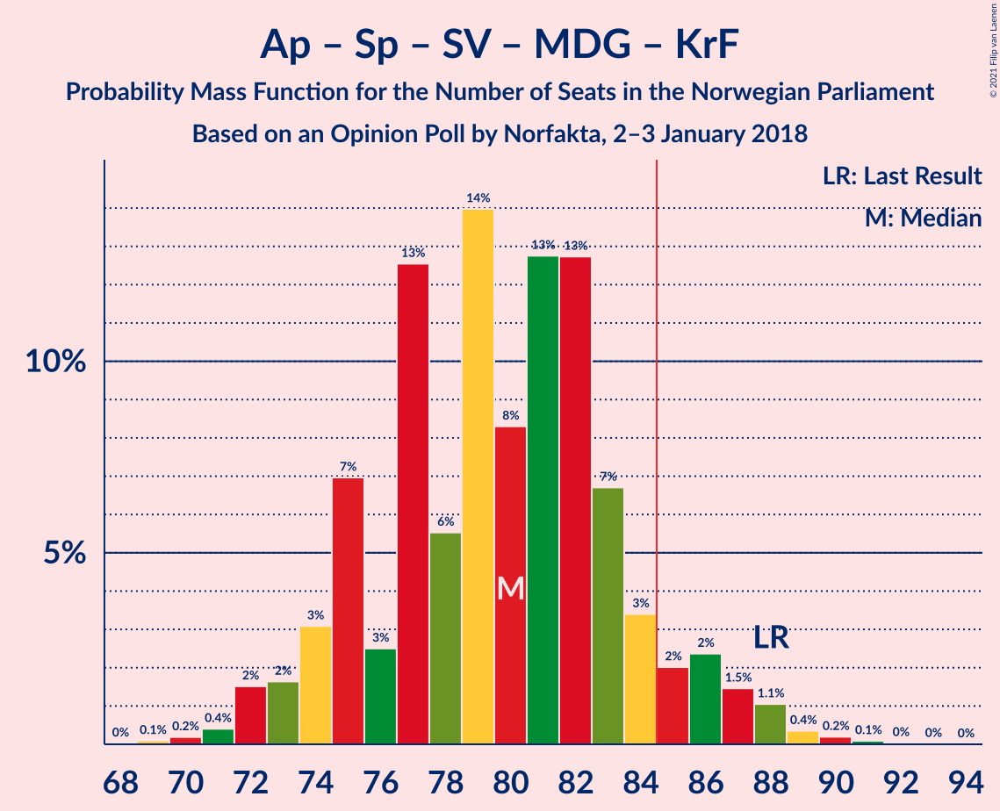
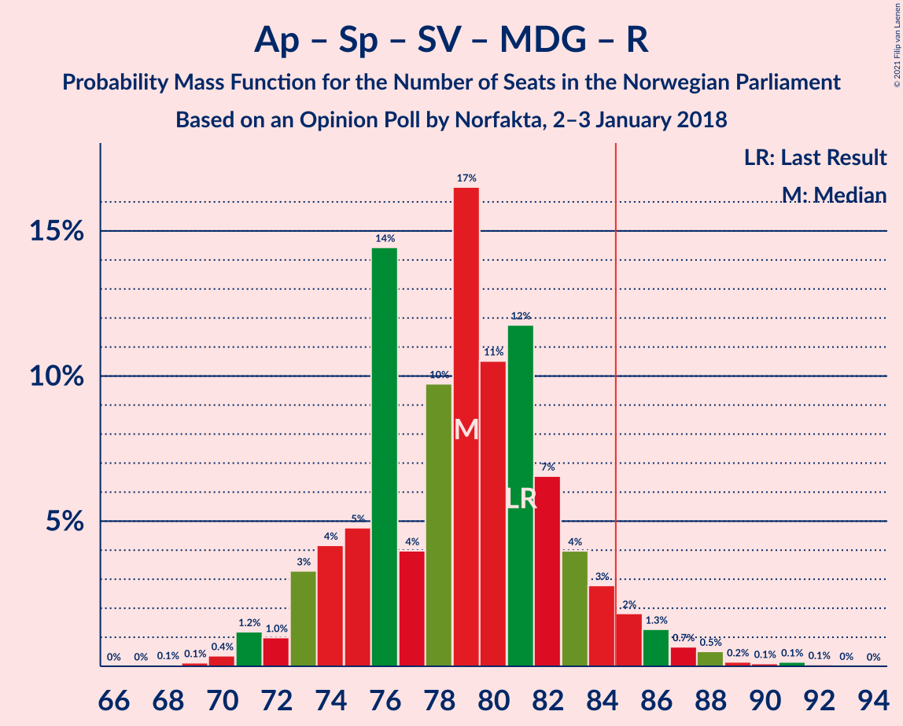
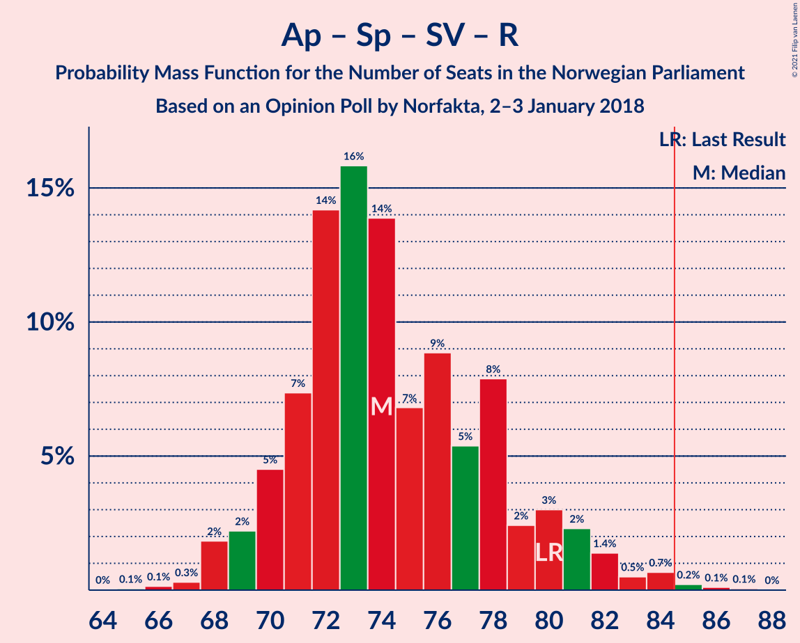
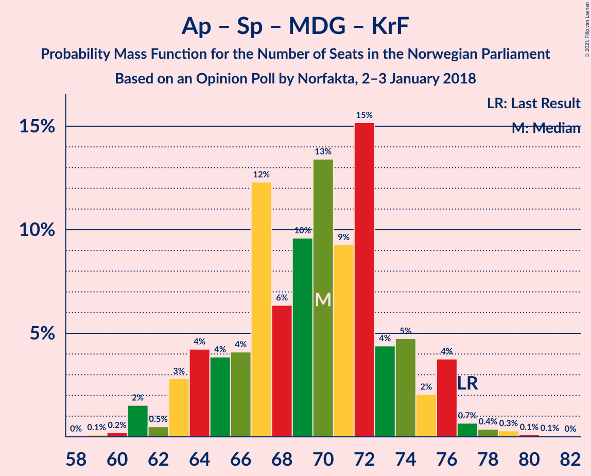

# Opinion Poll by Norfakta, 2–3 January 2018

<a href="#voting-intentions">Voting Intentions</a> | <a href="#seats">Seats</a> | <a href="#coalitions">Coalitions</a> | <a href="#technical-information">Technical Information</a>

## Voting Intentions

### Confidence Intervals

| Party | Last Result | Poll Result | 80% Confidence Interval | 90% Confidence Interval | 95% Confidence Interval | 99% Confidence Interval |
|:-----:|:-----------:|:-----------:|:-----------------------:|:-----------------------:|:-----------------------:|:-----------------------:|
| Høyre | 25.0% | 29.1% | 27.3–31.0% |26.8–31.5% |26.4–32.0% |25.5–32.9% |
| Arbeiderpartiet | 27.4% | 24.2% | 22.5–26.0% |22.1–26.5% |21.6–27.0% |20.9–27.8% |
| Fremskrittspartiet | 15.2% | 14.5% | 13.2–16.0% |12.8–16.4% |12.5–16.8% |11.8–17.6% |
| Senterpartiet | 10.3% | 10.3% | 9.2–11.6% |8.8–12.0% |8.6–12.3% |8.0–13.0% |
| Sosialistisk Venstreparti | 6.0% | 5.7% | 4.9–6.8% |4.6–7.1% |4.4–7.3% |4.1–7.9% |
| Venstre | 4.4% | 4.7% | 3.9–5.7% |3.7–6.0% |3.6–6.2% |3.2–6.7% |
| Miljøpartiet De Grønne | 3.2% | 3.8% | 3.1–4.7% |2.9–5.0% |2.8–5.2% |2.5–5.6% |
| Kristelig Folkeparti | 4.2% | 3.3% | 2.7–4.1% |2.5–4.4% |2.4–4.6% |2.1–5.0% |
| Rødt | 2.4% | 3.1% | 2.5–3.9% |2.3–4.2% |2.2–4.4% |1.9–4.8% |

*Note:* The poll result column reflects the actual value used in the calculations. Published results may vary slightly, and in addition be rounded to fewer digits.

## Seats

### Confidence Intervals

| Party | Last Result | Median | 80% Confidence Interval | 90% Confidence Interval | 95% Confidence Interval | 99% Confidence Interval |
|:-----:|:-----------:|:------:|:-----------------------:|:-----------------------:|:-----------------------:|:-----------------------:|
| <a href="#høyre">Høyre</a> | 45 | 50 | 48–55 |47–56 |46–58 |45–62 |
| <a href="#arbeiderpartiet">Arbeiderpartiet</a> | 49 | 45 | 41–48 |41–50 |40–51 |38–51 |
| <a href="#fremskrittspartiet">Fremskrittspartiet</a> | 27 | 27 | 24–29 |23–30 |22–30 |21–32 |
| <a href="#senterpartiet">Senterpartiet</a> | 19 | 19 | 17–20 |16–21 |15–21 |14–23 |
| <a href="#sosialistisk-venstreparti">Sosialistisk Venstreparti</a> | 11 | 11 | 8–13 |8–13 |8–15 |7–15 |
| <a href="#venstre">Venstre</a> | 8 | 8 | 2–10 |2–10 |2–11 |2–11 |
| <a href="#miljøpartiet-de-grønne">Miljøpartiet De Grønne</a> | 1 | 3 | 2–8 |1–8 |1–9 |1–10 |
| <a href="#kristelig-folkeparti">Kristelig Folkeparti</a> | 8 | 3 | 1–7 |1–8 |1–8 |0–9 |
| <a href="#rødt">Rødt</a> | 1 | 1 | 1–7 |1–8 |1–8 |1–9 |

### Høyre

*For a full overview of the results for this party, see the [Høyre](party-høyre.html) page.*

| Number of Seats | Probability | Accumulated | Special Marks |
|:---------------:|:-----------:|:-----------:|:-------------:|
| 43 | 0% | 100% |  |
| 44 | 0.2% | 99.9% |  |
| 45 | 1.2% | 99.7% | Last Result |
| 46 | 2% | 98.5% |  |
| 47 | 6% | 97% |  |
| 48 | 15% | 91% |  |
| 49 | 2% | 76% |  |
| 50 | 32% | 73% | Median |
| 51 | 4% | 42% |  |
| 52 | 4% | 38% |  |
| 53 | 9% | 33% |  |
| 54 | 14% | 25% |  |
| 55 | 2% | 11% |  |
| 56 | 5% | 9% |  |
| 57 | 0.5% | 3% |  |
| 58 | 2% | 3% |  |
| 59 | 0.2% | 1.2% |  |
| 60 | 0.2% | 1.0% |  |
| 61 | 0.1% | 0.8% |  |
| 62 | 0.4% | 0.6% |  |
| 63 | 0.3% | 0.3% |  |
| 64 | 0% | 0% |  |

### Arbeiderpartiet

*For a full overview of the results for this party, see the [Arbeiderpartiet](party-arbeiderpartiet.html) page.*

| Number of Seats | Probability | Accumulated | Special Marks |
|:---------------:|:-----------:|:-----------:|:-------------:|
| 35 | 0.1% | 100% |  |
| 36 | 0% | 99.9% |  |
| 37 | 0.1% | 99.9% |  |
| 38 | 0.9% | 99.8% |  |
| 39 | 1.2% | 98.9% |  |
| 40 | 0.9% | 98% |  |
| 41 | 15% | 97% |  |
| 42 | 5% | 82% |  |
| 43 | 10% | 77% |  |
| 44 | 5% | 67% |  |
| 45 | 33% | 62% | Median |
| 46 | 10% | 28% |  |
| 47 | 5% | 18% |  |
| 48 | 6% | 13% |  |
| 49 | 1.2% | 7% | Last Result |
| 50 | 0.9% | 5% |  |
| 51 | 4% | 5% |  |
| 52 | 0.1% | 0.2% |  |
| 53 | 0.1% | 0.2% |  |
| 54 | 0% | 0% |  |

### Fremskrittspartiet

*For a full overview of the results for this party, see the [Fremskrittspartiet](party-fremskrittspartiet.html) page.*

| Number of Seats | Probability | Accumulated | Special Marks |
|:---------------:|:-----------:|:-----------:|:-------------:|
| 20 | 0.1% | 100% |  |
| 21 | 0.5% | 99.8% |  |
| 22 | 3% | 99.3% |  |
| 23 | 5% | 97% |  |
| 24 | 6% | 92% |  |
| 25 | 10% | 86% |  |
| 26 | 13% | 76% |  |
| 27 | 42% | 63% | Last Result, Median |
| 28 | 5% | 21% |  |
| 29 | 8% | 16% |  |
| 30 | 6% | 8% |  |
| 31 | 0.5% | 1.3% |  |
| 32 | 0.6% | 0.9% |  |
| 33 | 0.2% | 0.2% |  |
| 34 | 0.1% | 0.1% |  |
| 35 | 0% | 0% |  |

### Senterpartiet

*For a full overview of the results for this party, see the [Senterpartiet](party-senterpartiet.html) page.*

| Number of Seats | Probability | Accumulated | Special Marks |
|:---------------:|:-----------:|:-----------:|:-------------:|
| 13 | 0.1% | 100% |  |
| 14 | 0.5% | 99.8% |  |
| 15 | 3% | 99.3% |  |
| 16 | 3% | 97% |  |
| 17 | 14% | 94% |  |
| 18 | 21% | 80% |  |
| 19 | 18% | 59% | Last Result, Median |
| 20 | 36% | 41% |  |
| 21 | 3% | 5% |  |
| 22 | 0.9% | 2% |  |
| 23 | 1.0% | 1.4% |  |
| 24 | 0.2% | 0.4% |  |
| 25 | 0.2% | 0.2% |  |
| 26 | 0% | 0% |  |

### Sosialistisk Venstreparti

*For a full overview of the results for this party, see the [Sosialistisk Venstreparti](party-sosialistiskvenstreparti.html) page.*

| Number of Seats | Probability | Accumulated | Special Marks |
|:---------------:|:-----------:|:-----------:|:-------------:|
| 1 | 0.1% | 100% |  |
| 2 | 0.3% | 99.9% |  |
| 3 | 0% | 99.6% |  |
| 4 | 0% | 99.6% |  |
| 5 | 0% | 99.6% |  |
| 6 | 0% | 99.6% |  |
| 7 | 0.1% | 99.6% |  |
| 8 | 13% | 99.5% |  |
| 9 | 8% | 87% |  |
| 10 | 19% | 79% |  |
| 11 | 11% | 60% | Last Result, Median |
| 12 | 33% | 49% |  |
| 13 | 11% | 15% |  |
| 14 | 2% | 5% |  |
| 15 | 3% | 3% |  |
| 16 | 0% | 0% |  |

### Venstre

*For a full overview of the results for this party, see the [Venstre](party-venstre.html) page.*

| Number of Seats | Probability | Accumulated | Special Marks |
|:---------------:|:-----------:|:-----------:|:-------------:|
| 2 | 16% | 100% |  |
| 3 | 1.3% | 84% |  |
| 4 | 0% | 83% |  |
| 5 | 0% | 83% |  |
| 6 | 0% | 83% |  |
| 7 | 6% | 83% |  |
| 8 | 40% | 77% | Last Result, Median |
| 9 | 12% | 36% |  |
| 10 | 19% | 24% |  |
| 11 | 4% | 5% |  |
| 12 | 0.2% | 0.4% |  |
| 13 | 0.1% | 0.2% |  |
| 14 | 0% | 0% |  |

### Miljøpartiet De Grønne

*For a full overview of the results for this party, see the [Miljøpartiet De Grønne](party-miljøpartietdegrønne.html) page.*

| Number of Seats | Probability | Accumulated | Special Marks |
|:---------------:|:-----------:|:-----------:|:-------------:|
| 1 | 10% | 100% | Last Result |
| 2 | 29% | 90% |  |
| 3 | 30% | 61% | Median |
| 4 | 0% | 32% |  |
| 5 | 0% | 32% |  |
| 6 | 0% | 32% |  |
| 7 | 4% | 32% |  |
| 8 | 24% | 28% |  |
| 9 | 3% | 4% |  |
| 10 | 0.5% | 0.6% |  |
| 11 | 0.1% | 0.1% |  |
| 12 | 0% | 0% |  |

### Kristelig Folkeparti

*For a full overview of the results for this party, see the [Kristelig Folkeparti](party-kristeligfolkeparti.html) page.*

| Number of Seats | Probability | Accumulated | Special Marks |
|:---------------:|:-----------:|:-----------:|:-------------:|
| 0 | 0.9% | 100% |  |
| 1 | 14% | 99.1% |  |
| 2 | 14% | 85% |  |
| 3 | 58% | 71% | Median |
| 4 | 0% | 13% |  |
| 5 | 0% | 13% |  |
| 6 | 0% | 13% |  |
| 7 | 7% | 13% |  |
| 8 | 4% | 5% | Last Result |
| 9 | 1.3% | 1.5% |  |
| 10 | 0.2% | 0.2% |  |
| 11 | 0% | 0% |  |

### Rødt

*For a full overview of the results for this party, see the [Rødt](party-rødt.html) page.*

| Number of Seats | Probability | Accumulated | Special Marks |
|:---------------:|:-----------:|:-----------:|:-------------:|
| 1 | 55% | 100% | Last Result, Median |
| 2 | 31% | 45% |  |
| 3 | 0% | 14% |  |
| 4 | 0% | 14% |  |
| 5 | 0% | 14% |  |
| 6 | 0.1% | 14% |  |
| 7 | 4% | 14% |  |
| 8 | 9% | 10% |  |
| 9 | 0.4% | 0.6% |  |
| 10 | 0.2% | 0.2% |  |
| 11 | 0% | 0% |  |

## Coalitions

### Confidence Intervals

| Coalition | Last Result | Median | Majority? | 80% Confidence Interval | 90% Confidence Interval | 95% Confidence Interval | 99% Confidence Interval |
|:---------:|:-----------:|:------:|:---------:|:-----------------------:|:-----------------------:|:-----------------------:|:-----------------------:|
| Høyre – Fremskrittspartiet – Senterpartiet – Venstre – Kristelig Folkeparti | 107 | 108 | 100% | 101–111 | 101–112 | 98–113 | 98–117 |
| Høyre – Fremskrittspartiet – Venstre – Miljøpartiet De Grønne – Kristelig Folkeparti | 89 | 91 | 99.1% | 88–101 | 88–101 | 86–101 | 83–102 |
| Høyre – Fremskrittspartiet – Venstre – Kristelig Folkeparti | 88 | 88 | 86% | 84–93 | 82–94 | 81–95 | 80–99 |
| Høyre – Fremskrittspartiet – Venstre | 80 | 85 | 65% | 80–91 | 80–91 | 78–93 | 77–96 |
| Arbeiderpartiet – Senterpartiet – Sosialistisk Venstreparti – Miljøpartiet De Grønne – Kristelig Folkeparti | 88 | 83 | 12% | 77–85 | 77–87 | 74–88 | 71–90 |
| Arbeiderpartiet – Senterpartiet – Sosialistisk Venstreparti – Miljøpartiet De Grønne – Rødt | 81 | 81 | 14% | 76–85 | 75–87 | 74–88 | 70–89 |
| Arbeiderpartiet – Senterpartiet – Sosialistisk Venstreparti – Miljøpartiet De Grønne | 80 | 80 | 4% | 75–82 | 73–84 | 72–86 | 69–86 |
| Høyre – Fremskrittspartiet | 72 | 77 | 2% | 74–81 | 72–83 | 71–84 | 69–88 |
| Arbeiderpartiet – Senterpartiet – Sosialistisk Venstreparti – Rødt | 80 | 78 | 0.9% | 68–81 | 68–81 | 68–83 | 67–86 |
| Arbeiderpartiet – Senterpartiet – Sosialistisk Venstreparti | 79 | 76 | 0% | 67–78 | 67–79 | 67–80 | 65–81 |
| Arbeiderpartiet – Senterpartiet – Miljøpartiet De Grønne – Kristelig Folkeparti | 77 | 71 | 0% | 67–74 | 66–76 | 64–77 | 62–80 |
| Arbeiderpartiet – Senterpartiet – Kristelig Folkeparti | 76 | 67 | 0% | 61–71 | 61–72 | 59–73 | 57–76 |
| Høyre – Venstre – Kristelig Folkeparti | 61 | 61 | 0% | 57–66 | 57–68 | 56–71 | 55–72 |
| Arbeiderpartiet – Senterpartiet | 68 | 65 | 0% | 59–67 | 58–69 | 58–69 | 56–72 |
| Arbeiderpartiet – Sosialistisk Venstreparti | 60 | 57 | 0% | 49–59 | 49–60 | 49–61 | 47–62 |
| Senterpartiet – Venstre – Kristelig Folkeparti | 35 | 31 | 0% | 23–33 | 22–36 | 22–36 | 21–38 |

### Høyre – Fremskrittspartiet – Senterpartiet – Venstre – Kristelig Folkeparti

| Number of Seats | Probability | Accumulated | Special Marks |
|:---------------:|:-----------:|:-----------:|:-------------:|
| 95 | 0% | 100% |  |
| 96 | 0.1% | 99.9% |  |
| 97 | 0% | 99.9% |  |
| 98 | 2% | 99.8% |  |
| 99 | 0.7% | 97% |  |
| 100 | 0.4% | 97% |  |
| 101 | 7% | 96% |  |
| 102 | 6% | 89% |  |
| 103 | 2% | 84% |  |
| 104 | 5% | 82% |  |
| 105 | 6% | 77% |  |
| 106 | 2% | 71% |  |
| 107 | 8% | 69% | Last Result, Median |
| 108 | 31% | 61% |  |
| 109 | 5% | 29% |  |
| 110 | 6% | 24% |  |
| 111 | 11% | 18% |  |
| 112 | 5% | 8% |  |
| 113 | 1.1% | 3% |  |
| 114 | 0.2% | 2% |  |
| 115 | 0.6% | 2% |  |
| 116 | 0.5% | 1.0% |  |
| 117 | 0.2% | 0.5% |  |
| 118 | 0% | 0.3% |  |
| 119 | 0.1% | 0.3% |  |
| 120 | 0.1% | 0.2% |  |
| 121 | 0.1% | 0.1% |  |
| 122 | 0% | 0% |  |

### Høyre – Fremskrittspartiet – Venstre – Miljøpartiet De Grønne – Kristelig Folkeparti

| Number of Seats | Probability | Accumulated | Special Marks |
|:---------------:|:-----------:|:-----------:|:-------------:|
| 83 | 0.5% | 100% |  |
| 84 | 0.4% | 99.5% |  |
| 85 | 0.3% | 99.1% | Majority |
| 86 | 2% | 98.8% |  |
| 87 | 2% | 97% |  |
| 88 | 7% | 95% |  |
| 89 | 7% | 88% | Last Result |
| 90 | 8% | 81% |  |
| 91 | 32% | 73% | Median |
| 92 | 9% | 41% |  |
| 93 | 8% | 32% |  |
| 94 | 3% | 24% |  |
| 95 | 1.0% | 21% |  |
| 96 | 2% | 20% |  |
| 97 | 3% | 18% |  |
| 98 | 0.7% | 15% |  |
| 99 | 2% | 14% |  |
| 100 | 0.9% | 12% |  |
| 101 | 10% | 12% |  |
| 102 | 0.8% | 1.1% |  |
| 103 | 0.1% | 0.3% |  |
| 104 | 0% | 0.2% |  |
| 105 | 0.1% | 0.2% |  |
| 106 | 0% | 0.1% |  |
| 107 | 0% | 0.1% |  |
| 108 | 0% | 0.1% |  |
| 109 | 0.1% | 0.1% |  |
| 110 | 0% | 0% |  |

### Høyre – Fremskrittspartiet – Venstre – Kristelig Folkeparti

| Number of Seats | Probability | Accumulated | Special Marks |
|:---------------:|:-----------:|:-----------:|:-------------:|
| 77 | 0.1% | 100% |  |
| 78 | 0% | 99.9% |  |
| 79 | 0.3% | 99.9% |  |
| 80 | 0.1% | 99.6% |  |
| 81 | 3% | 99.5% |  |
| 82 | 4% | 97% |  |
| 83 | 2% | 93% |  |
| 84 | 5% | 90% |  |
| 85 | 4% | 86% | Majority |
| 86 | 7% | 82% |  |
| 87 | 8% | 75% |  |
| 88 | 32% | 68% | Last Result, Median |
| 89 | 2% | 35% |  |
| 90 | 8% | 33% |  |
| 91 | 7% | 25% |  |
| 92 | 2% | 18% |  |
| 93 | 9% | 16% |  |
| 94 | 3% | 7% |  |
| 95 | 3% | 4% |  |
| 96 | 0.3% | 1.3% |  |
| 97 | 0.2% | 0.9% |  |
| 98 | 0.1% | 0.7% |  |
| 99 | 0.3% | 0.6% |  |
| 100 | 0% | 0.3% |  |
| 101 | 0.2% | 0.3% |  |
| 102 | 0% | 0.1% |  |
| 103 | 0% | 0% |  |

### Høyre – Fremskrittspartiet – Venstre

| Number of Seats | Probability | Accumulated | Special Marks |
|:---------------:|:-----------:|:-----------:|:-------------:|
| 75 | 0.1% | 100% |  |
| 76 | 0.3% | 99.8% |  |
| 77 | 0.3% | 99.6% |  |
| 78 | 3% | 99.2% |  |
| 79 | 1.1% | 96% |  |
| 80 | 6% | 95% | Last Result |
| 81 | 6% | 89% |  |
| 82 | 2% | 84% |  |
| 83 | 5% | 82% |  |
| 84 | 11% | 77% |  |
| 85 | 34% | 65% | Median, Majority |
| 86 | 4% | 31% |  |
| 87 | 8% | 27% |  |
| 88 | 3% | 19% |  |
| 89 | 2% | 16% |  |
| 90 | 1.4% | 14% |  |
| 91 | 9% | 13% |  |
| 92 | 0.5% | 3% |  |
| 93 | 0.9% | 3% |  |
| 94 | 1.0% | 2% |  |
| 95 | 0.1% | 0.9% |  |
| 96 | 0.3% | 0.8% |  |
| 97 | 0% | 0.5% |  |
| 98 | 0.3% | 0.5% |  |
| 99 | 0% | 0.1% |  |
| 100 | 0.1% | 0.1% |  |
| 101 | 0% | 0% |  |

### Arbeiderpartiet – Senterpartiet – Sosialistisk Venstreparti – Miljøpartiet De Grønne – Kristelig Folkeparti

| Number of Seats | Probability | Accumulated | Special Marks |
|:---------------:|:-----------:|:-----------:|:-------------:|
| 67 | 0.1% | 100% |  |
| 68 | 0% | 99.9% |  |
| 69 | 0.2% | 99.9% |  |
| 70 | 0.2% | 99.7% |  |
| 71 | 0.2% | 99.5% |  |
| 72 | 0.5% | 99.3% |  |
| 73 | 0.4% | 98.7% |  |
| 74 | 2% | 98% |  |
| 75 | 0.7% | 97% |  |
| 76 | 0.9% | 96% |  |
| 77 | 11% | 95% |  |
| 78 | 5% | 84% |  |
| 79 | 4% | 79% |  |
| 80 | 8% | 75% |  |
| 81 | 6% | 67% | Median |
| 82 | 4% | 61% |  |
| 83 | 42% | 57% |  |
| 84 | 3% | 15% |  |
| 85 | 2% | 12% | Majority |
| 86 | 3% | 10% |  |
| 87 | 2% | 7% |  |
| 88 | 4% | 5% | Last Result |
| 89 | 0.2% | 1.2% |  |
| 90 | 0.7% | 1.0% |  |
| 91 | 0.3% | 0.4% |  |
| 92 | 0.1% | 0.1% |  |
| 93 | 0% | 0% |  |

### Arbeiderpartiet – Senterpartiet – Sosialistisk Venstreparti – Miljøpartiet De Grønne – Rødt

| Number of Seats | Probability | Accumulated | Special Marks |
|:---------------:|:-----------:|:-----------:|:-------------:|
| 67 | 0% | 100% |  |
| 68 | 0.2% | 99.9% |  |
| 69 | 0% | 99.7% |  |
| 70 | 0.3% | 99.7% |  |
| 71 | 0.1% | 99.4% |  |
| 72 | 0.2% | 99.3% |  |
| 73 | 0.3% | 99.1% |  |
| 74 | 3% | 98.7% |  |
| 75 | 3% | 96% |  |
| 76 | 9% | 93% |  |
| 77 | 2% | 84% |  |
| 78 | 7% | 82% |  |
| 79 | 8% | 75% | Median |
| 80 | 2% | 67% |  |
| 81 | 32% | 65% | Last Result |
| 82 | 8% | 32% |  |
| 83 | 7% | 25% |  |
| 84 | 4% | 18% |  |
| 85 | 5% | 14% | Majority |
| 86 | 2% | 10% |  |
| 87 | 4% | 7% |  |
| 88 | 3% | 3% |  |
| 89 | 0.1% | 0.5% |  |
| 90 | 0.3% | 0.4% |  |
| 91 | 0% | 0.1% |  |
| 92 | 0.1% | 0.1% |  |
| 93 | 0% | 0% |  |

### Arbeiderpartiet – Senterpartiet – Sosialistisk Venstreparti – Miljøpartiet De Grønne

| Number of Seats | Probability | Accumulated | Special Marks |
|:---------------:|:-----------:|:-----------:|:-------------:|
| 66 | 0.1% | 100% |  |
| 67 | 0.1% | 99.8% |  |
| 68 | 0.2% | 99.7% |  |
| 69 | 0.2% | 99.5% |  |
| 70 | 0.4% | 99.3% |  |
| 71 | 0.7% | 98.9% |  |
| 72 | 2% | 98% |  |
| 73 | 3% | 97% |  |
| 74 | 4% | 94% |  |
| 75 | 12% | 90% |  |
| 76 | 10% | 79% |  |
| 77 | 11% | 69% |  |
| 78 | 1.4% | 58% | Median |
| 79 | 4% | 56% |  |
| 80 | 37% | 53% | Last Result |
| 81 | 3% | 16% |  |
| 82 | 4% | 13% |  |
| 83 | 2% | 9% |  |
| 84 | 2% | 6% |  |
| 85 | 0.6% | 4% | Majority |
| 86 | 4% | 4% |  |
| 87 | 0% | 0.3% |  |
| 88 | 0.2% | 0.3% |  |
| 89 | 0% | 0.1% |  |
| 90 | 0% | 0% |  |

### Høyre – Fremskrittspartiet

| Number of Seats | Probability | Accumulated | Special Marks |
|:---------------:|:-----------:|:-----------:|:-------------:|
| 67 | 0.2% | 100% |  |
| 68 | 0.1% | 99.8% |  |
| 69 | 0.3% | 99.8% |  |
| 70 | 1.1% | 99.5% |  |
| 71 | 2% | 98% |  |
| 72 | 4% | 97% | Last Result |
| 73 | 0.9% | 93% |  |
| 74 | 5% | 92% |  |
| 75 | 6% | 87% |  |
| 76 | 3% | 81% |  |
| 77 | 39% | 78% | Median |
| 78 | 10% | 39% |  |
| 79 | 6% | 29% |  |
| 80 | 1.2% | 23% |  |
| 81 | 12% | 22% |  |
| 82 | 4% | 10% |  |
| 83 | 3% | 5% |  |
| 84 | 0.5% | 3% |  |
| 85 | 0.6% | 2% | Majority |
| 86 | 0.9% | 2% |  |
| 87 | 0.3% | 0.9% |  |
| 88 | 0.2% | 0.5% |  |
| 89 | 0.3% | 0.4% |  |
| 90 | 0.1% | 0.1% |  |
| 91 | 0% | 0% |  |

### Arbeiderpartiet – Senterpartiet – Sosialistisk Venstreparti – Rødt

| Number of Seats | Probability | Accumulated | Special Marks |
|:---------------:|:-----------:|:-----------:|:-------------:|
| 60 | 0.1% | 100% |  |
| 61 | 0% | 99.9% |  |
| 62 | 0% | 99.9% |  |
| 63 | 0% | 99.9% |  |
| 64 | 0.1% | 99.9% |  |
| 65 | 0% | 99.8% |  |
| 66 | 0.1% | 99.8% |  |
| 67 | 0.8% | 99.7% |  |
| 68 | 10% | 98.9% |  |
| 69 | 0.9% | 88% |  |
| 70 | 2% | 88% |  |
| 71 | 0.7% | 86% |  |
| 72 | 3% | 85% |  |
| 73 | 2% | 82% |  |
| 74 | 1.0% | 80% |  |
| 75 | 3% | 79% |  |
| 76 | 8% | 76% | Median |
| 77 | 9% | 68% |  |
| 78 | 32% | 59% |  |
| 79 | 8% | 27% |  |
| 80 | 7% | 19% | Last Result |
| 81 | 7% | 12% |  |
| 82 | 2% | 5% |  |
| 83 | 2% | 3% |  |
| 84 | 0.3% | 1.2% |  |
| 85 | 0.4% | 0.9% | Majority |
| 86 | 0.5% | 0.5% |  |
| 87 | 0% | 0% |  |

### Arbeiderpartiet – Senterpartiet – Sosialistisk Venstreparti

| Number of Seats | Probability | Accumulated | Special Marks |
|:---------------:|:-----------:|:-----------:|:-------------:|
| 59 | 0.1% | 100% |  |
| 60 | 0% | 99.9% |  |
| 61 | 0% | 99.9% |  |
| 62 | 0% | 99.9% |  |
| 63 | 0.1% | 99.9% |  |
| 64 | 0.1% | 99.8% |  |
| 65 | 0.8% | 99.7% |  |
| 66 | 0.4% | 98.9% |  |
| 67 | 11% | 98.6% |  |
| 68 | 3% | 88% |  |
| 69 | 4% | 85% |  |
| 70 | 2% | 81% |  |
| 71 | 3% | 80% |  |
| 72 | 4% | 77% |  |
| 73 | 4% | 72% |  |
| 74 | 11% | 68% |  |
| 75 | 6% | 57% | Median |
| 76 | 3% | 50% |  |
| 77 | 33% | 48% |  |
| 78 | 6% | 15% |  |
| 79 | 5% | 8% | Last Result |
| 80 | 0.7% | 3% |  |
| 81 | 2% | 2% |  |
| 82 | 0% | 0.4% |  |
| 83 | 0.2% | 0.3% |  |
| 84 | 0.1% | 0.1% |  |
| 85 | 0% | 0% | Majority |

### Arbeiderpartiet – Senterpartiet – Miljøpartiet De Grønne – Kristelig Folkeparti

| Number of Seats | Probability | Accumulated | Special Marks |
|:---------------:|:-----------:|:-----------:|:-------------:|
| 57 | 0.1% | 100% |  |
| 58 | 0% | 99.9% |  |
| 59 | 0% | 99.9% |  |
| 60 | 0.3% | 99.9% |  |
| 61 | 0.1% | 99.6% |  |
| 62 | 0.3% | 99.6% |  |
| 63 | 0.8% | 99.3% |  |
| 64 | 1.2% | 98% |  |
| 65 | 2% | 97% |  |
| 66 | 3% | 95% |  |
| 67 | 8% | 93% |  |
| 68 | 8% | 84% |  |
| 69 | 11% | 76% |  |
| 70 | 5% | 65% | Median |
| 71 | 29% | 60% |  |
| 72 | 4% | 30% |  |
| 73 | 12% | 27% |  |
| 74 | 4% | 14% |  |
| 75 | 5% | 10% |  |
| 76 | 2% | 5% |  |
| 77 | 1.4% | 3% | Last Result |
| 78 | 0.7% | 2% |  |
| 79 | 0.6% | 1.2% |  |
| 80 | 0.1% | 0.5% |  |
| 81 | 0.3% | 0.4% |  |
| 82 | 0.1% | 0.1% |  |
| 83 | 0% | 0% |  |

### Arbeiderpartiet – Senterpartiet – Kristelig Folkeparti

| Number of Seats | Probability | Accumulated | Special Marks |
|:---------------:|:-----------:|:-----------:|:-------------:|
| 55 | 0% | 100% |  |
| 56 | 0.1% | 99.9% |  |
| 57 | 0.6% | 99.8% |  |
| 58 | 0.8% | 99.2% |  |
| 59 | 2% | 98% |  |
| 60 | 0.8% | 97% |  |
| 61 | 9% | 96% |  |
| 62 | 4% | 86% |  |
| 63 | 1.4% | 82% |  |
| 64 | 6% | 81% |  |
| 65 | 9% | 74% |  |
| 66 | 9% | 65% |  |
| 67 | 7% | 56% | Median |
| 68 | 31% | 48% |  |
| 69 | 1.4% | 18% |  |
| 70 | 2% | 17% |  |
| 71 | 5% | 15% |  |
| 72 | 7% | 10% |  |
| 73 | 1.0% | 3% |  |
| 74 | 0.9% | 2% |  |
| 75 | 0.3% | 1.0% |  |
| 76 | 0.4% | 0.7% | Last Result |
| 77 | 0.4% | 0.4% |  |
| 78 | 0% | 0% |  |

### Høyre – Venstre – Kristelig Folkeparti

| Number of Seats | Probability | Accumulated | Special Marks |
|:---------------:|:-----------:|:-----------:|:-------------:|
| 51 | 0% | 100% |  |
| 52 | 0.1% | 99.9% |  |
| 53 | 0% | 99.9% |  |
| 54 | 0.3% | 99.8% |  |
| 55 | 0.7% | 99.5% |  |
| 56 | 3% | 98.8% |  |
| 57 | 7% | 95% |  |
| 58 | 9% | 89% |  |
| 59 | 2% | 79% |  |
| 60 | 6% | 78% |  |
| 61 | 38% | 71% | Last Result, Median |
| 62 | 3% | 34% |  |
| 63 | 3% | 31% |  |
| 64 | 4% | 28% |  |
| 65 | 6% | 25% |  |
| 66 | 11% | 19% |  |
| 67 | 1.4% | 8% |  |
| 68 | 1.3% | 6% |  |
| 69 | 0.6% | 5% |  |
| 70 | 1.1% | 4% |  |
| 71 | 2% | 3% |  |
| 72 | 0.3% | 0.7% |  |
| 73 | 0.3% | 0.5% |  |
| 74 | 0.1% | 0.2% |  |
| 75 | 0.1% | 0.1% |  |
| 76 | 0% | 0% |  |

### Arbeiderpartiet – Senterpartiet

| Number of Seats | Probability | Accumulated | Special Marks |
|:---------------:|:-----------:|:-----------:|:-------------:|
| 54 | 0.1% | 100% |  |
| 55 | 0.2% | 99.9% |  |
| 56 | 0.7% | 99.7% |  |
| 57 | 1.0% | 99.0% |  |
| 58 | 4% | 98% |  |
| 59 | 14% | 94% |  |
| 60 | 2% | 80% |  |
| 61 | 5% | 77% |  |
| 62 | 8% | 72% |  |
| 63 | 6% | 63% |  |
| 64 | 5% | 57% | Median |
| 65 | 38% | 52% |  |
| 66 | 3% | 15% |  |
| 67 | 2% | 11% |  |
| 68 | 4% | 9% | Last Result |
| 69 | 3% | 5% |  |
| 70 | 0.3% | 2% |  |
| 71 | 0.7% | 1.4% |  |
| 72 | 0.5% | 0.7% |  |
| 73 | 0.1% | 0.2% |  |
| 74 | 0% | 0.1% |  |
| 75 | 0.1% | 0.1% |  |
| 76 | 0% | 0% |  |

### Arbeiderpartiet – Sosialistisk Venstreparti

| Number of Seats | Probability | Accumulated | Special Marks |
|:---------------:|:-----------:|:-----------:|:-------------:|
| 41 | 0.1% | 100% |  |
| 42 | 0% | 99.9% |  |
| 43 | 0% | 99.9% |  |
| 44 | 0% | 99.9% |  |
| 45 | 0.1% | 99.9% |  |
| 46 | 0.3% | 99.8% |  |
| 47 | 0.7% | 99.5% |  |
| 48 | 0.6% | 98.8% |  |
| 49 | 11% | 98% |  |
| 50 | 1.3% | 87% |  |
| 51 | 2% | 86% |  |
| 52 | 4% | 84% |  |
| 53 | 2% | 79% |  |
| 54 | 5% | 78% |  |
| 55 | 11% | 73% |  |
| 56 | 7% | 62% | Median |
| 57 | 33% | 55% |  |
| 58 | 8% | 23% |  |
| 59 | 7% | 15% |  |
| 60 | 3% | 8% | Last Result |
| 61 | 4% | 5% |  |
| 62 | 0.6% | 0.9% |  |
| 63 | 0.1% | 0.3% |  |
| 64 | 0.1% | 0.1% |  |
| 65 | 0% | 0% |  |

### Senterpartiet – Venstre – Kristelig Folkeparti

| Number of Seats | Probability | Accumulated | Special Marks |
|:---------------:|:-----------:|:-----------:|:-------------:|
| 19 | 0.2% | 100% |  |
| 20 | 0.1% | 99.8% |  |
| 21 | 0.5% | 99.7% |  |
| 22 | 6% | 99.2% |  |
| 23 | 6% | 93% |  |
| 24 | 1.4% | 88% |  |
| 25 | 5% | 86% |  |
| 26 | 2% | 82% |  |
| 27 | 3% | 80% |  |
| 28 | 4% | 77% |  |
| 29 | 8% | 74% |  |
| 30 | 12% | 65% | Median |
| 31 | 35% | 53% |  |
| 32 | 6% | 18% |  |
| 33 | 3% | 12% |  |
| 34 | 0.9% | 9% |  |
| 35 | 3% | 8% | Last Result |
| 36 | 4% | 6% |  |
| 37 | 1.1% | 2% |  |
| 38 | 0.4% | 0.5% |  |
| 39 | 0.1% | 0.1% |  |
| 40 | 0% | 0% |  |

## Technical Information

### Opinion Poll

+ **Polling firm:** Norfakta
+ **Commissioner(s):** —
+ **Fieldwork period:** 2–3 January 2018

### Calculations

+ **Sample size:** 1000
+ **Simulations done:** 131,072
+ **Error estimate:** 3.00%

