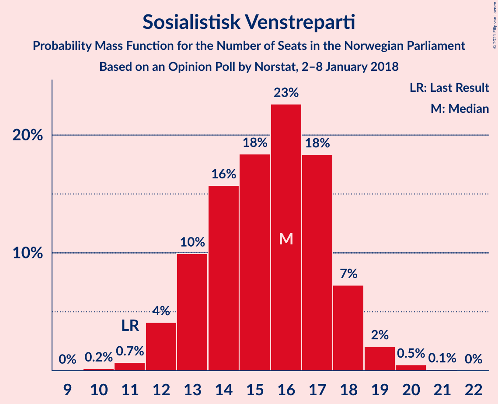
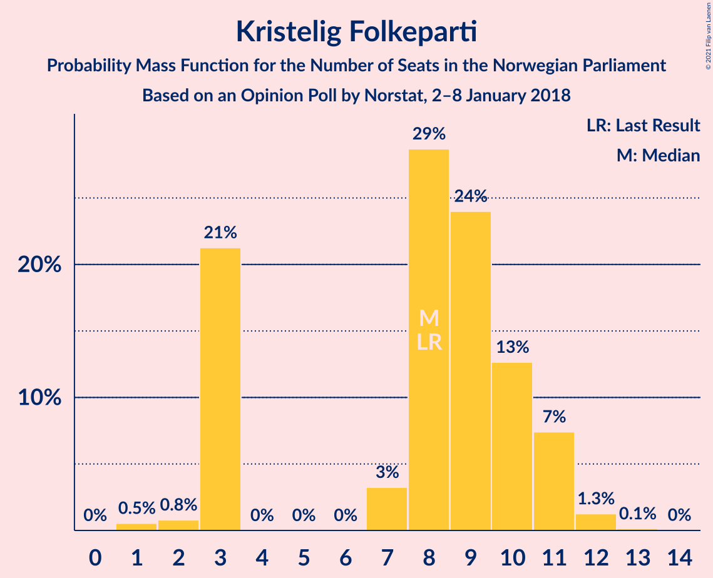
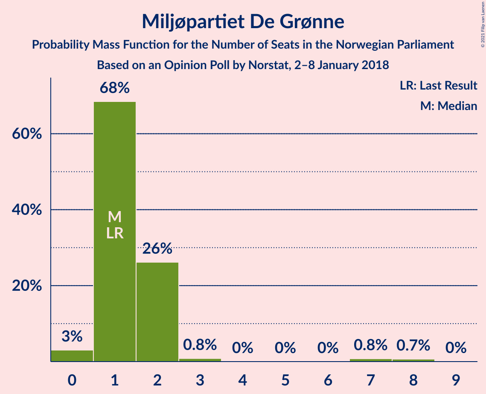
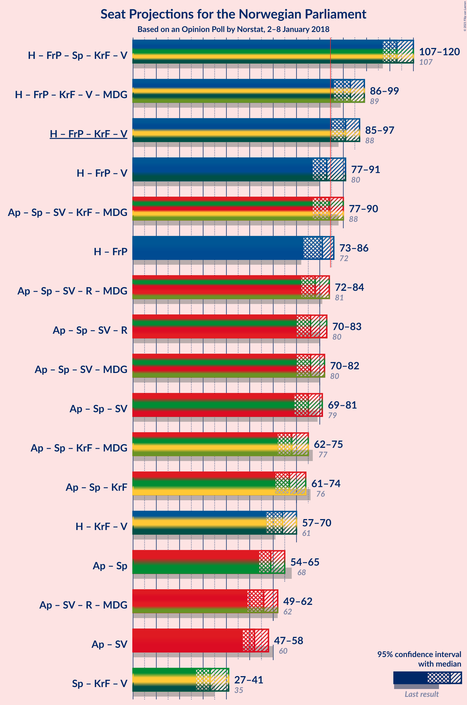
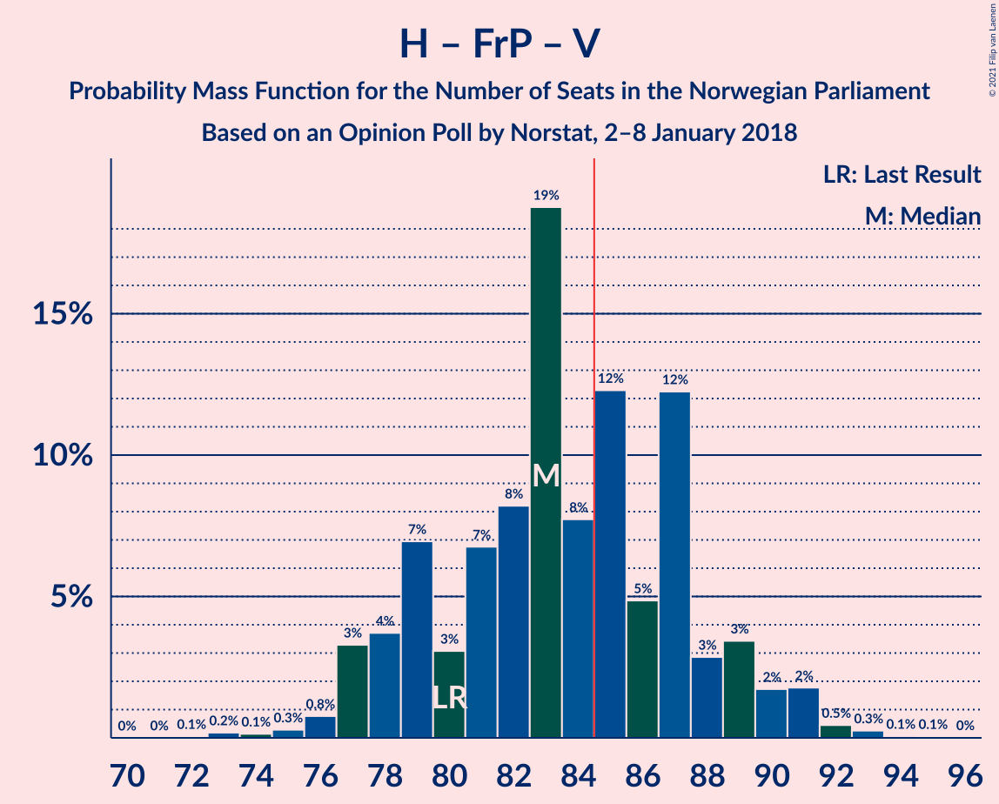
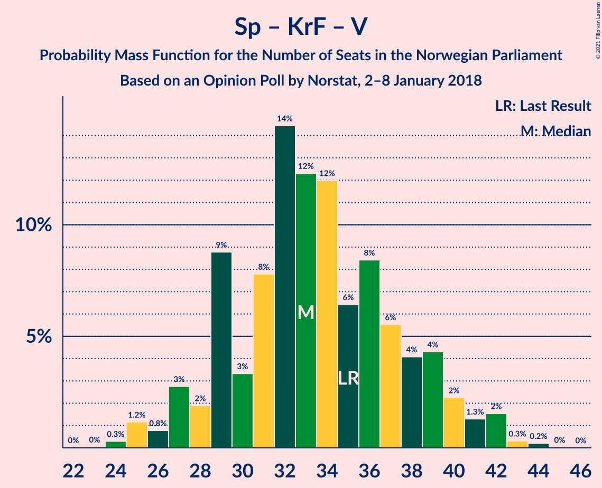

# Opinion Poll by Norstat, 2–8 January 2018

<a href="#voting-intentions">Voting Intentions</a> | <a href="#seats">Seats</a> | <a href="#coalitions">Coalitions</a> | <a href="#technical-information">Technical Information</a>

## Voting Intentions

### Confidence Intervals

| Party | Last Result | Poll Result | 80% Confidence Interval | 90% Confidence Interval | 95% Confidence Interval | 99% Confidence Interval |
|:-----:|:-----------:|:-----------:|:-----------------------:|:-----------------------:|:-----------------------:|:-----------------------:|
| Høyre | 25.0% | 28.7% | 26.9–30.6% |26.3–31.1% |25.9–31.6% |25.1–32.5% |
| Arbeiderpartiet | 27.4% | 20.1% | 18.5–21.8% |18.0–22.3% |17.7–22.7% |16.9–23.5% |
| Fremskrittspartiet | 15.2% | 14.9% | 13.6–16.5% |13.2–16.9% |12.8–17.3% |12.2–18.1% |
| Senterpartiet | 10.3% | 12.2% | 10.9–13.6% |10.6–14.0% |10.3–14.4% |9.7–15.1% |
| Sosialistisk Venstreparti | 6.0% | 8.3% | 7.3–9.5% |7.0–9.9% |6.7–10.2% |6.2–10.8% |
| Kristelig Folkeparti | 4.2% | 4.6% | 3.8–5.6% |3.6–5.9% |3.5–6.1% |3.1–6.6% |
| Venstre | 4.4% | 3.6% | 2.9–4.5% |2.7–4.7% |2.6–5.0% |2.3–5.4% |
| Rødt | 2.4% | 2.9% | 2.3–3.7% |2.1–3.9% |2.0–4.1% |1.7–4.5% |
| Miljøpartiet De Grønne | 3.2% | 2.7% | 2.1–3.5% |2.0–3.7% |1.8–3.9% |1.6–4.3% |

*Note:* The poll result column reflects the actual value used in the calculations. Published results may vary slightly, and in addition be rounded to fewer digits.

## Seats

### Confidence Intervals

| Party | Last Result | Median | 80% Confidence Interval | 90% Confidence Interval | 95% Confidence Interval | 99% Confidence Interval |
|:-----:|:-----------:|:------:|:-----------------------:|:-----------------------:|:-----------------------:|:-----------------------:|
| <a href="#høyre">Høyre</a> | 45 | 51 | 47–57 |46–58 |46–58 |45–60 |
| <a href="#arbeiderpartiet">Arbeiderpartiet</a> | 49 | 39 | 35–40 |33–41 |31–41 |30–43 |
| <a href="#fremskrittspartiet">Fremskrittspartiet</a> | 27 | 26 | 25–29 |24–31 |24–31 |22–34 |
| <a href="#senterpartiet">Senterpartiet</a> | 19 | 21 | 20–25 |19–26 |19–27 |18–27 |
| <a href="#sosialistisk-venstreparti">Sosialistisk Venstreparti</a> | 11 | 16 | 13–17 |13–18 |12–19 |11–20 |
| <a href="#kristelig-folkeparti">Kristelig Folkeparti</a> | 8 | 9 | 3–10 |3–11 |3–11 |1–12 |
| <a href="#venstre">Venstre</a> | 8 | 2 | 2–8 |2–9 |2–9 |1–10 |
| <a href="#rødt">Rødt</a> | 1 | 2 | 1–2 |1–2 |1–7 |1–8 |
| <a href="#miljøpartiet-de-grønne">Miljøpartiet De Grønne</a> | 1 | 1 | 1–2 |1–2 |0–2 |0–7 |

### Høyre

*For a full overview of the results for this party, see the [Høyre](party-høyre.html) page.*

| Number of Seats | Probability | Accumulated | Special Marks |
|:---------------:|:-----------:|:-----------:|:-------------:|
| 44 | 0.2% | 100% |  |
| 45 | 0.5% | 99.8% | Last Result |
| 46 | 6% | 99.3% |  |
| 47 | 5% | 93% |  |
| 48 | 2% | 88% |  |
| 49 | 8% | 86% |  |
| 50 | 13% | 78% |  |
| 51 | 33% | 65% | Median |
| 52 | 7% | 32% |  |
| 53 | 4% | 25% |  |
| 54 | 5% | 21% |  |
| 55 | 1.2% | 16% |  |
| 56 | 3% | 15% |  |
| 57 | 2% | 12% |  |
| 58 | 7% | 10% |  |
| 59 | 1.3% | 2% |  |
| 60 | 0.5% | 1.0% |  |
| 61 | 0.4% | 0.5% |  |
| 62 | 0.1% | 0.1% |  |
| 63 | 0% | 0% |  |

### Arbeiderpartiet

*For a full overview of the results for this party, see the [Arbeiderpartiet](party-arbeiderpartiet.html) page.*

| Number of Seats | Probability | Accumulated | Special Marks |
|:---------------:|:-----------:|:-----------:|:-------------:|
| 29 | 0.1% | 100% |  |
| 30 | 0.5% | 99.9% |  |
| 31 | 2% | 99.4% |  |
| 32 | 0.5% | 97% |  |
| 33 | 3% | 97% |  |
| 34 | 2% | 94% |  |
| 35 | 4% | 92% |  |
| 36 | 29% | 88% |  |
| 37 | 6% | 58% |  |
| 38 | 2% | 52% |  |
| 39 | 10% | 50% | Median |
| 40 | 32% | 40% |  |
| 41 | 7% | 8% |  |
| 42 | 1.0% | 2% |  |
| 43 | 0.4% | 0.6% |  |
| 44 | 0.1% | 0.2% |  |
| 45 | 0% | 0.1% |  |
| 46 | 0% | 0.1% |  |
| 47 | 0% | 0% |  |
| 48 | 0% | 0% |  |
| 49 | 0% | 0% | Last Result |

### Fremskrittspartiet

*For a full overview of the results for this party, see the [Fremskrittspartiet](party-fremskrittspartiet.html) page.*

| Number of Seats | Probability | Accumulated | Special Marks |
|:---------------:|:-----------:|:-----------:|:-------------:|
| 21 | 0.2% | 100% |  |
| 22 | 0.6% | 99.7% |  |
| 23 | 2% | 99.1% |  |
| 24 | 4% | 98% |  |
| 25 | 13% | 94% |  |
| 26 | 38% | 81% | Median |
| 27 | 10% | 43% | Last Result |
| 28 | 10% | 33% |  |
| 29 | 13% | 23% |  |
| 30 | 3% | 10% |  |
| 31 | 4% | 6% |  |
| 32 | 1.3% | 2% |  |
| 33 | 0.2% | 1.0% |  |
| 34 | 0.6% | 0.8% |  |
| 35 | 0.1% | 0.1% |  |
| 36 | 0% | 0% |  |

### Senterpartiet

*For a full overview of the results for this party, see the [Senterpartiet](party-senterpartiet.html) page.*

| Number of Seats | Probability | Accumulated | Special Marks |
|:---------------:|:-----------:|:-----------:|:-------------:|
| 16 | 0.1% | 100% |  |
| 17 | 0.2% | 99.9% |  |
| 18 | 1.2% | 99.7% |  |
| 19 | 5% | 98.6% | Last Result |
| 20 | 9% | 93% |  |
| 21 | 38% | 84% | Median |
| 22 | 14% | 46% |  |
| 23 | 13% | 32% |  |
| 24 | 4% | 19% |  |
| 25 | 6% | 15% |  |
| 26 | 5% | 9% |  |
| 27 | 3% | 4% |  |
| 28 | 0.4% | 0.5% |  |
| 29 | 0.1% | 0.1% |  |
| 30 | 0% | 0% |  |

### Sosialistisk Venstreparti

*For a full overview of the results for this party, see the [Sosialistisk Venstreparti](party-sosialistiskvenstreparti.html) page.*

| Number of Seats | Probability | Accumulated | Special Marks |
|:---------------:|:-----------:|:-----------:|:-------------:|
| 10 | 0.1% | 100% |  |
| 11 | 0.8% | 99.9% | Last Result |
| 12 | 2% | 99.1% |  |
| 13 | 8% | 97% |  |
| 14 | 14% | 89% |  |
| 15 | 17% | 75% |  |
| 16 | 15% | 58% | Median |
| 17 | 33% | 42% |  |
| 18 | 5% | 9% |  |
| 19 | 2% | 4% |  |
| 20 | 2% | 2% |  |
| 21 | 0.1% | 0.1% |  |
| 22 | 0% | 0% |  |

### Kristelig Folkeparti

*For a full overview of the results for this party, see the [Kristelig Folkeparti](party-kristeligfolkeparti.html) page.*

| Number of Seats | Probability | Accumulated | Special Marks |
|:---------------:|:-----------:|:-----------:|:-------------:|
| 1 | 1.1% | 100% |  |
| 2 | 0.9% | 98.9% |  |
| 3 | 13% | 98% |  |
| 4 | 0% | 85% |  |
| 5 | 0% | 85% |  |
| 6 | 0% | 85% |  |
| 7 | 2% | 85% |  |
| 8 | 17% | 83% | Last Result |
| 9 | 43% | 66% | Median |
| 10 | 15% | 23% |  |
| 11 | 8% | 9% |  |
| 12 | 0.9% | 1.0% |  |
| 13 | 0.1% | 0.1% |  |
| 14 | 0% | 0% |  |

### Venstre

*For a full overview of the results for this party, see the [Venstre](party-venstre.html) page.*

| Number of Seats | Probability | Accumulated | Special Marks |
|:---------------:|:-----------:|:-----------:|:-------------:|
| 1 | 0.9% | 100% |  |
| 2 | 64% | 99.1% | Median |
| 3 | 7% | 35% |  |
| 4 | 0% | 28% |  |
| 5 | 0% | 28% |  |
| 6 | 0% | 28% |  |
| 7 | 9% | 28% |  |
| 8 | 14% | 19% | Last Result |
| 9 | 5% | 5% |  |
| 10 | 0.6% | 0.7% |  |
| 11 | 0.1% | 0.1% |  |
| 12 | 0% | 0% |  |

### Rødt

*For a full overview of the results for this party, see the [Rødt](party-rødt.html) page.*

| Number of Seats | Probability | Accumulated | Special Marks |
|:---------------:|:-----------:|:-----------:|:-------------:|
| 1 | 36% | 100% | Last Result |
| 2 | 59% | 64% | Median |
| 3 | 0% | 5% |  |
| 4 | 0% | 5% |  |
| 5 | 0% | 5% |  |
| 6 | 0% | 5% |  |
| 7 | 3% | 5% |  |
| 8 | 2% | 2% |  |
| 9 | 0.2% | 0.2% |  |
| 10 | 0% | 0% |  |

### Miljøpartiet De Grønne

*For a full overview of the results for this party, see the [Miljøpartiet De Grønne](party-miljøpartietdegrønne.html) page.*

| Number of Seats | Probability | Accumulated | Special Marks |
|:---------------:|:-----------:|:-----------:|:-------------:|
| 0 | 3% | 100% |  |
| 1 | 74% | 97% | Last Result, Median |
| 2 | 21% | 23% |  |
| 3 | 0.3% | 1.4% |  |
| 4 | 0% | 1.2% |  |
| 5 | 0% | 1.2% |  |
| 6 | 0% | 1.2% |  |
| 7 | 0.7% | 1.2% |  |
| 8 | 0.4% | 0.5% |  |
| 9 | 0% | 0% |  |

## Coalitions

### Confidence Intervals

| Coalition | Last Result | Median | Majority? | 80% Confidence Interval | 90% Confidence Interval | 95% Confidence Interval | 99% Confidence Interval |
|:---------:|:-----------:|:------:|:---------:|:-----------------------:|:-----------------------:|:-----------------------:|:-----------------------:|
| Høyre – Fremskrittspartiet – Senterpartiet – Kristelig Folkeparti – Venstre | 107 | 113 | 100% | 109–116 | 109–119 | 108–119 | 106–120 |
| Høyre – Fremskrittspartiet – Kristelig Folkeparti – Venstre – Miljøpartiet De Grønne | 89 | 90 | 99.5% | 89–97 | 87–98 | 87–99 | 84–100 |
| Høyre – Fremskrittspartiet – Kristelig Folkeparti – Venstre | 88 | 89 | 99.0% | 87–96 | 86–97 | 86–97 | 83–99 |
| Arbeiderpartiet – Senterpartiet – Sosialistisk Venstreparti – Kristelig Folkeparti – Miljøpartiet De Grønne | 88 | 86 | 61% | 79–89 | 77–90 | 77–91 | 75–92 |
| Høyre – Fremskrittspartiet – Venstre | 80 | 81 | 30% | 78–88 | 77–91 | 77–91 | 75–92 |
| Høyre – Fremskrittspartiet | 72 | 77 | 6% | 75–84 | 74–85 | 74–86 | 72–88 |
| Arbeiderpartiet – Senterpartiet – Sosialistisk Venstreparti – Rødt – Miljøpartiet De Grønne | 81 | 80 | 0.9% | 73–82 | 72–83 | 72–83 | 70–86 |
| Arbeiderpartiet – Senterpartiet – Sosialistisk Venstreparti – Miljøpartiet De Grønne | 80 | 78 | 0.2% | 72–80 | 71–82 | 71–82 | 69–83 |
| Arbeiderpartiet – Senterpartiet – Sosialistisk Venstreparti – Rødt | 80 | 79 | 0.5% | 72–80 | 71–82 | 70–82 | 69–85 |
| Arbeiderpartiet – Senterpartiet – Sosialistisk Venstreparti | 79 | 76 | 0.1% | 71–79 | 69–80 | 69–81 | 67–82 |
| Arbeiderpartiet – Senterpartiet – Kristelig Folkeparti – Miljøpartiet De Grønne | 77 | 70 | 0% | 64–73 | 62–76 | 61–76 | 60–77 |
| Arbeiderpartiet – Senterpartiet – Kristelig Folkeparti | 76 | 69 | 0% | 63–72 | 61–74 | 60–75 | 59–76 |
| Høyre – Kristelig Folkeparti – Venstre | 61 | 62 | 0% | 60–69 | 58–69 | 57–70 | 56–72 |
| Arbeiderpartiet – Senterpartiet | 68 | 61 | 0% | 56–63 | 55–65 | 54–66 | 52–67 |
| Arbeiderpartiet – Sosialistisk Venstreparti | 60 | 53 | 0% | 49–57 | 48–58 | 47–58 | 46–59 |
| Senterpartiet – Kristelig Folkeparti – Venstre | 35 | 33 | 0% | 30–38 | 28–39 | 26–41 | 26–43 |

### Høyre – Fremskrittspartiet – Senterpartiet – Kristelig Folkeparti – Venstre

| Number of Seats | Probability | Accumulated | Special Marks |
|:---------------:|:-----------:|:-----------:|:-------------:|
| 100 | 0.1% | 100% |  |
| 101 | 0% | 99.9% |  |
| 102 | 0.1% | 99.9% |  |
| 103 | 0.1% | 99.8% |  |
| 104 | 0.1% | 99.7% |  |
| 105 | 0.1% | 99.7% |  |
| 106 | 0.4% | 99.5% |  |
| 107 | 0.2% | 99.2% | Last Result |
| 108 | 3% | 98.9% |  |
| 109 | 34% | 96% | Median |
| 110 | 2% | 63% |  |
| 111 | 7% | 61% |  |
| 112 | 3% | 54% |  |
| 113 | 13% | 51% |  |
| 114 | 14% | 38% |  |
| 115 | 3% | 25% |  |
| 116 | 12% | 22% |  |
| 117 | 2% | 10% |  |
| 118 | 3% | 8% |  |
| 119 | 4% | 5% |  |
| 120 | 0.6% | 1.0% |  |
| 121 | 0.2% | 0.4% |  |
| 122 | 0.1% | 0.2% |  |
| 123 | 0% | 0.1% |  |
| 124 | 0% | 0% |  |

### Høyre – Fremskrittspartiet – Kristelig Folkeparti – Venstre – Miljøpartiet De Grønne

| Number of Seats | Probability | Accumulated | Special Marks |
|:---------------:|:-----------:|:-----------:|:-------------:|
| 82 | 0.1% | 100% |  |
| 83 | 0.1% | 99.9% |  |
| 84 | 0.3% | 99.8% |  |
| 85 | 0.1% | 99.5% | Majority |
| 86 | 1.1% | 99.3% |  |
| 87 | 5% | 98% |  |
| 88 | 0.4% | 93% |  |
| 89 | 35% | 92% | Last Result, Median |
| 90 | 9% | 58% |  |
| 91 | 6% | 49% |  |
| 92 | 13% | 44% |  |
| 93 | 5% | 31% |  |
| 94 | 0.9% | 25% |  |
| 95 | 7% | 25% |  |
| 96 | 6% | 17% |  |
| 97 | 2% | 11% |  |
| 98 | 5% | 8% |  |
| 99 | 3% | 3% |  |
| 100 | 0.1% | 0.6% |  |
| 101 | 0.3% | 0.5% |  |
| 102 | 0.1% | 0.2% |  |
| 103 | 0.1% | 0.1% |  |
| 104 | 0% | 0% |  |

### Høyre – Fremskrittspartiet – Kristelig Folkeparti – Venstre

| Number of Seats | Probability | Accumulated | Special Marks |
|:---------------:|:-----------:|:-----------:|:-------------:|
| 79 | 0.1% | 100% |  |
| 80 | 0% | 99.9% |  |
| 81 | 0.1% | 99.8% |  |
| 82 | 0.2% | 99.8% |  |
| 83 | 0.3% | 99.6% |  |
| 84 | 0.2% | 99.3% |  |
| 85 | 1.3% | 99.0% | Majority |
| 86 | 5% | 98% |  |
| 87 | 4% | 92% |  |
| 88 | 35% | 88% | Last Result, Median |
| 89 | 6% | 53% |  |
| 90 | 5% | 47% |  |
| 91 | 12% | 42% |  |
| 92 | 3% | 30% |  |
| 93 | 4% | 26% |  |
| 94 | 10% | 23% |  |
| 95 | 2% | 13% |  |
| 96 | 4% | 11% |  |
| 97 | 5% | 6% |  |
| 98 | 1.0% | 1.5% |  |
| 99 | 0.2% | 0.5% |  |
| 100 | 0.1% | 0.3% |  |
| 101 | 0.1% | 0.2% |  |
| 102 | 0.1% | 0.1% |  |
| 103 | 0% | 0% |  |

### Arbeiderpartiet – Senterpartiet – Sosialistisk Venstreparti – Kristelig Folkeparti – Miljøpartiet De Grønne

| Number of Seats | Probability | Accumulated | Special Marks |
|:---------------:|:-----------:|:-----------:|:-------------:|
| 71 | 0.1% | 100% |  |
| 72 | 0% | 99.9% |  |
| 73 | 0.2% | 99.9% |  |
| 74 | 0.1% | 99.7% |  |
| 75 | 0.2% | 99.7% |  |
| 76 | 0.8% | 99.4% |  |
| 77 | 5% | 98.6% |  |
| 78 | 2% | 94% |  |
| 79 | 3% | 92% |  |
| 80 | 3% | 89% |  |
| 81 | 7% | 86% |  |
| 82 | 10% | 79% |  |
| 83 | 4% | 69% |  |
| 84 | 4% | 64% |  |
| 85 | 5% | 61% | Majority |
| 86 | 12% | 56% | Median |
| 87 | 1.4% | 44% |  |
| 88 | 27% | 43% | Last Result |
| 89 | 6% | 16% |  |
| 90 | 7% | 9% |  |
| 91 | 2% | 3% |  |
| 92 | 0.4% | 0.6% |  |
| 93 | 0.1% | 0.1% |  |
| 94 | 0% | 0.1% |  |
| 95 | 0% | 0% |  |

### Høyre – Fremskrittspartiet – Venstre

| Number of Seats | Probability | Accumulated | Special Marks |
|:---------------:|:-----------:|:-----------:|:-------------:|
| 72 | 0.1% | 100% |  |
| 73 | 0% | 99.9% |  |
| 74 | 0.1% | 99.8% |  |
| 75 | 0.4% | 99.7% |  |
| 76 | 0.8% | 99.3% |  |
| 77 | 4% | 98% |  |
| 78 | 8% | 94% |  |
| 79 | 30% | 86% | Median |
| 80 | 2% | 56% | Last Result |
| 81 | 11% | 54% |  |
| 82 | 7% | 44% |  |
| 83 | 2% | 37% |  |
| 84 | 4% | 34% |  |
| 85 | 6% | 30% | Majority |
| 86 | 8% | 24% |  |
| 87 | 3% | 16% |  |
| 88 | 5% | 13% |  |
| 89 | 1.3% | 8% |  |
| 90 | 1.4% | 7% |  |
| 91 | 4% | 5% |  |
| 92 | 0.5% | 1.0% |  |
| 93 | 0.2% | 0.5% |  |
| 94 | 0% | 0.3% |  |
| 95 | 0.2% | 0.2% |  |
| 96 | 0.1% | 0.1% |  |
| 97 | 0% | 0% |  |

### Høyre – Fremskrittspartiet

| Number of Seats | Probability | Accumulated | Special Marks |
|:---------------:|:-----------:|:-----------:|:-------------:|
| 69 | 0% | 100% |  |
| 70 | 0.2% | 99.9% |  |
| 71 | 0.1% | 99.8% |  |
| 72 | 0.5% | 99.6% | Last Result |
| 73 | 1.1% | 99.2% |  |
| 74 | 5% | 98% |  |
| 75 | 12% | 93% |  |
| 76 | 6% | 81% |  |
| 77 | 33% | 75% | Median |
| 78 | 4% | 42% |  |
| 79 | 12% | 38% |  |
| 80 | 5% | 26% |  |
| 81 | 0.4% | 21% |  |
| 82 | 4% | 21% |  |
| 83 | 7% | 17% |  |
| 84 | 4% | 10% |  |
| 85 | 2% | 6% | Majority |
| 86 | 1.4% | 4% |  |
| 87 | 1.2% | 2% |  |
| 88 | 1.1% | 1.3% |  |
| 89 | 0% | 0.2% |  |
| 90 | 0.2% | 0.2% |  |
| 91 | 0% | 0% |  |

### Arbeiderpartiet – Senterpartiet – Sosialistisk Venstreparti – Rødt – Miljøpartiet De Grønne

| Number of Seats | Probability | Accumulated | Special Marks |
|:---------------:|:-----------:|:-----------:|:-------------:|
| 67 | 0.1% | 100% |  |
| 68 | 0.1% | 99.9% |  |
| 69 | 0.1% | 99.8% |  |
| 70 | 0.2% | 99.7% |  |
| 71 | 1.0% | 99.5% |  |
| 72 | 5% | 98.5% |  |
| 73 | 4% | 94% |  |
| 74 | 2% | 89% |  |
| 75 | 10% | 87% |  |
| 76 | 4% | 77% |  |
| 77 | 3% | 74% |  |
| 78 | 12% | 70% |  |
| 79 | 5% | 58% | Median |
| 80 | 6% | 53% |  |
| 81 | 35% | 47% | Last Result |
| 82 | 4% | 12% |  |
| 83 | 5% | 7% |  |
| 84 | 1.3% | 2% |  |
| 85 | 0.2% | 0.9% | Majority |
| 86 | 0.3% | 0.7% |  |
| 87 | 0.2% | 0.4% |  |
| 88 | 0.1% | 0.2% |  |
| 89 | 0% | 0.2% |  |
| 90 | 0.1% | 0.1% |  |
| 91 | 0% | 0% |  |

### Arbeiderpartiet – Senterpartiet – Sosialistisk Venstreparti – Miljøpartiet De Grønne

| Number of Seats | Probability | Accumulated | Special Marks |
|:---------------:|:-----------:|:-----------:|:-------------:|
| 65 | 0% | 100% |  |
| 66 | 0.1% | 99.9% |  |
| 67 | 0.1% | 99.8% |  |
| 68 | 0.2% | 99.7% |  |
| 69 | 0.3% | 99.6% |  |
| 70 | 2% | 99.3% |  |
| 71 | 7% | 98% |  |
| 72 | 2% | 90% |  |
| 73 | 8% | 88% |  |
| 74 | 10% | 80% |  |
| 75 | 2% | 70% |  |
| 76 | 11% | 68% |  |
| 77 | 5% | 57% | Median |
| 78 | 6% | 52% |  |
| 79 | 29% | 47% |  |
| 80 | 11% | 18% | Last Result |
| 81 | 2% | 7% |  |
| 82 | 4% | 5% |  |
| 83 | 0.5% | 1.0% |  |
| 84 | 0.3% | 0.5% |  |
| 85 | 0.1% | 0.2% | Majority |
| 86 | 0.1% | 0.1% |  |
| 87 | 0% | 0% |  |

### Arbeiderpartiet – Senterpartiet – Sosialistisk Venstreparti – Rødt

| Number of Seats | Probability | Accumulated | Special Marks |
|:---------------:|:-----------:|:-----------:|:-------------:|
| 66 | 0.1% | 100% |  |
| 67 | 0.1% | 99.9% |  |
| 68 | 0.3% | 99.8% |  |
| 69 | 0.1% | 99.5% |  |
| 70 | 3% | 99.4% |  |
| 71 | 5% | 97% |  |
| 72 | 3% | 92% |  |
| 73 | 6% | 89% |  |
| 74 | 7% | 83% |  |
| 75 | 0.9% | 75% |  |
| 76 | 5% | 75% |  |
| 77 | 13% | 69% |  |
| 78 | 6% | 56% | Median |
| 79 | 9% | 51% |  |
| 80 | 35% | 42% | Last Result |
| 81 | 0.4% | 7% |  |
| 82 | 5% | 7% |  |
| 83 | 1.1% | 2% |  |
| 84 | 0.1% | 0.6% |  |
| 85 | 0.3% | 0.5% | Majority |
| 86 | 0.1% | 0.2% |  |
| 87 | 0.1% | 0.1% |  |
| 88 | 0% | 0% |  |

### Arbeiderpartiet – Senterpartiet – Sosialistisk Venstreparti

| Number of Seats | Probability | Accumulated | Special Marks |
|:---------------:|:-----------:|:-----------:|:-------------:|
| 64 | 0.1% | 100% |  |
| 65 | 0.1% | 99.9% |  |
| 66 | 0.2% | 99.8% |  |
| 67 | 0.3% | 99.6% |  |
| 68 | 0.3% | 99.4% |  |
| 69 | 5% | 99.1% |  |
| 70 | 4% | 94% |  |
| 71 | 5% | 90% |  |
| 72 | 8% | 85% |  |
| 73 | 7% | 78% |  |
| 74 | 3% | 71% |  |
| 75 | 12% | 68% |  |
| 76 | 7% | 56% | Median |
| 77 | 5% | 49% |  |
| 78 | 34% | 44% |  |
| 79 | 4% | 11% | Last Result |
| 80 | 2% | 7% |  |
| 81 | 4% | 5% |  |
| 82 | 0.2% | 0.5% |  |
| 83 | 0.3% | 0.4% |  |
| 84 | 0% | 0.1% |  |
| 85 | 0.1% | 0.1% | Majority |
| 86 | 0% | 0% |  |

### Arbeiderpartiet – Senterpartiet – Kristelig Folkeparti – Miljøpartiet De Grønne

| Number of Seats | Probability | Accumulated | Special Marks |
|:---------------:|:-----------:|:-----------:|:-------------:|
| 55 | 0% | 100% |  |
| 56 | 0% | 99.9% |  |
| 57 | 0% | 99.9% |  |
| 58 | 0% | 99.9% |  |
| 59 | 0.1% | 99.9% |  |
| 60 | 0.3% | 99.8% |  |
| 61 | 2% | 99.5% |  |
| 62 | 5% | 97% |  |
| 63 | 1.3% | 92% |  |
| 64 | 3% | 91% |  |
| 65 | 2% | 88% |  |
| 66 | 5% | 86% |  |
| 67 | 12% | 81% |  |
| 68 | 7% | 69% |  |
| 69 | 5% | 62% |  |
| 70 | 10% | 56% | Median |
| 71 | 28% | 47% |  |
| 72 | 7% | 19% |  |
| 73 | 3% | 12% |  |
| 74 | 0.2% | 9% |  |
| 75 | 0.6% | 9% |  |
| 76 | 8% | 8% |  |
| 77 | 0.7% | 0.8% | Last Result |
| 78 | 0.1% | 0.2% |  |
| 79 | 0.1% | 0.1% |  |
| 80 | 0% | 0% |  |

### Arbeiderpartiet – Senterpartiet – Kristelig Folkeparti

| Number of Seats | Probability | Accumulated | Special Marks |
|:---------------:|:-----------:|:-----------:|:-------------:|
| 54 | 0% | 100% |  |
| 55 | 0% | 99.9% |  |
| 56 | 0% | 99.9% |  |
| 57 | 0.1% | 99.9% |  |
| 58 | 0.1% | 99.8% |  |
| 59 | 0.4% | 99.7% |  |
| 60 | 2% | 99.3% |  |
| 61 | 5% | 97% |  |
| 62 | 1.4% | 92% |  |
| 63 | 2% | 90% |  |
| 64 | 6% | 88% |  |
| 65 | 6% | 82% |  |
| 66 | 10% | 75% |  |
| 67 | 5% | 65% |  |
| 68 | 3% | 60% |  |
| 69 | 11% | 57% | Median |
| 70 | 29% | 46% |  |
| 71 | 5% | 17% |  |
| 72 | 2% | 11% |  |
| 73 | 0.4% | 9% |  |
| 74 | 5% | 9% |  |
| 75 | 2% | 3% |  |
| 76 | 0.7% | 0.7% | Last Result |
| 77 | 0% | 0.1% |  |
| 78 | 0% | 0% |  |

### Høyre – Kristelig Folkeparti – Venstre

| Number of Seats | Probability | Accumulated | Special Marks |
|:---------------:|:-----------:|:-----------:|:-------------:|
| 52 | 0% | 100% |  |
| 53 | 0% | 99.9% |  |
| 54 | 0.2% | 99.9% |  |
| 55 | 0.2% | 99.8% |  |
| 56 | 0.9% | 99.6% |  |
| 57 | 3% | 98.7% |  |
| 58 | 4% | 96% |  |
| 59 | 2% | 92% |  |
| 60 | 2% | 90% |  |
| 61 | 8% | 89% | Last Result |
| 62 | 41% | 80% | Median |
| 63 | 6% | 39% |  |
| 64 | 1.3% | 33% |  |
| 65 | 5% | 32% |  |
| 66 | 5% | 27% |  |
| 67 | 4% | 22% |  |
| 68 | 4% | 18% |  |
| 69 | 12% | 14% |  |
| 70 | 0.4% | 3% |  |
| 71 | 1.4% | 2% |  |
| 72 | 0.6% | 0.9% |  |
| 73 | 0.2% | 0.3% |  |
| 74 | 0.1% | 0.1% |  |
| 75 | 0% | 0% |  |

### Arbeiderpartiet – Senterpartiet

| Number of Seats | Probability | Accumulated | Special Marks |
|:---------------:|:-----------:|:-----------:|:-------------:|
| 50 | 0.1% | 100% |  |
| 51 | 0.2% | 99.9% |  |
| 52 | 0.6% | 99.7% |  |
| 53 | 1.2% | 99.1% |  |
| 54 | 2% | 98% |  |
| 55 | 4% | 96% |  |
| 56 | 5% | 92% |  |
| 57 | 8% | 87% |  |
| 58 | 14% | 79% |  |
| 59 | 10% | 65% |  |
| 60 | 4% | 55% | Median |
| 61 | 30% | 51% |  |
| 62 | 6% | 21% |  |
| 63 | 5% | 15% |  |
| 64 | 3% | 10% |  |
| 65 | 3% | 6% |  |
| 66 | 1.0% | 3% |  |
| 67 | 2% | 2% |  |
| 68 | 0.3% | 0.3% | Last Result |
| 69 | 0% | 0% |  |

### Arbeiderpartiet – Sosialistisk Venstreparti

| Number of Seats | Probability | Accumulated | Special Marks |
|:---------------:|:-----------:|:-----------:|:-------------:|
| 43 | 0% | 100% |  |
| 44 | 0.1% | 99.9% |  |
| 45 | 0.2% | 99.8% |  |
| 46 | 0.6% | 99.6% |  |
| 47 | 2% | 99.0% |  |
| 48 | 5% | 97% |  |
| 49 | 4% | 92% |  |
| 50 | 5% | 88% |  |
| 51 | 13% | 83% |  |
| 52 | 14% | 70% |  |
| 53 | 7% | 55% |  |
| 54 | 6% | 49% |  |
| 55 | 4% | 43% | Median |
| 56 | 5% | 38% |  |
| 57 | 28% | 33% |  |
| 58 | 4% | 6% |  |
| 59 | 2% | 2% |  |
| 60 | 0.1% | 0.2% | Last Result |
| 61 | 0.1% | 0.2% |  |
| 62 | 0% | 0% |  |

### Senterpartiet – Kristelig Folkeparti – Venstre

| Number of Seats | Probability | Accumulated | Special Marks |
|:---------------:|:-----------:|:-----------:|:-------------:|
| 23 | 0% | 100% |  |
| 24 | 0.2% | 99.9% |  |
| 25 | 0.1% | 99.8% |  |
| 26 | 2% | 99.7% |  |
| 27 | 2% | 97% |  |
| 28 | 1.0% | 95% |  |
| 29 | 1.2% | 94% |  |
| 30 | 4% | 93% |  |
| 31 | 1.0% | 89% |  |
| 32 | 31% | 88% | Median |
| 33 | 8% | 56% |  |
| 34 | 7% | 48% |  |
| 35 | 8% | 41% | Last Result |
| 36 | 5% | 33% |  |
| 37 | 12% | 28% |  |
| 38 | 8% | 16% |  |
| 39 | 4% | 7% |  |
| 40 | 0.4% | 4% |  |
| 41 | 2% | 4% |  |
| 42 | 0.6% | 1.4% |  |
| 43 | 0.6% | 0.8% |  |
| 44 | 0.1% | 0.2% |  |
| 45 | 0.1% | 0.1% |  |
| 46 | 0% | 0% |  |

## Technical Information

### Opinion Poll

+ **Polling firm:** Norstat
+ **Commissioner(s):** —
+ **Fieldwork period:** 2–8 January 2018

### Calculations

+ **Sample size:** 977
+ **Simulations done:** 131,072
+ **Error estimate:** 2.10%

